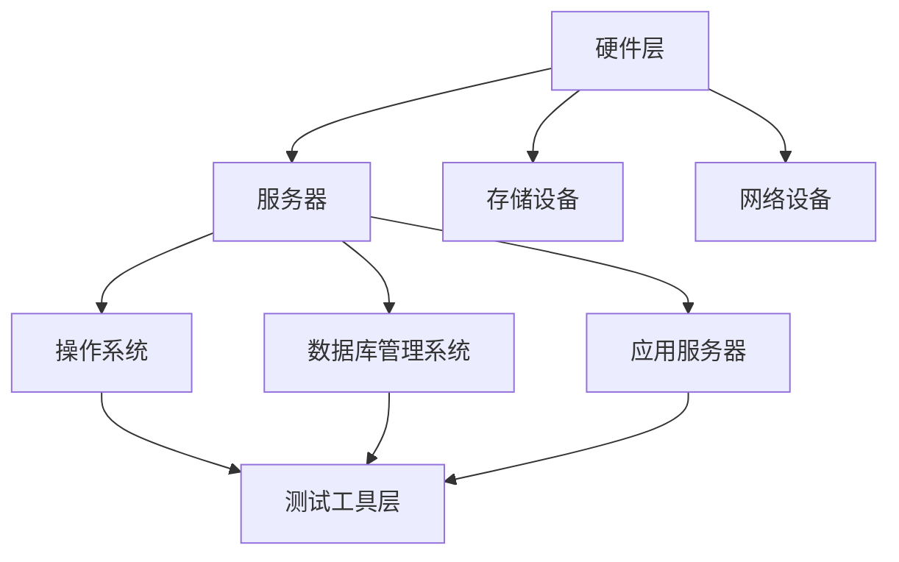
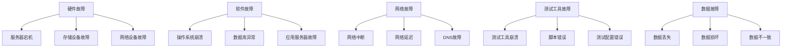
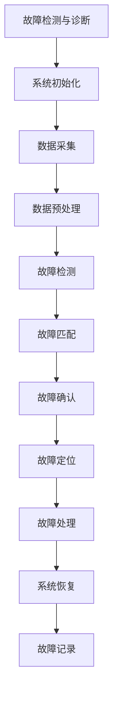
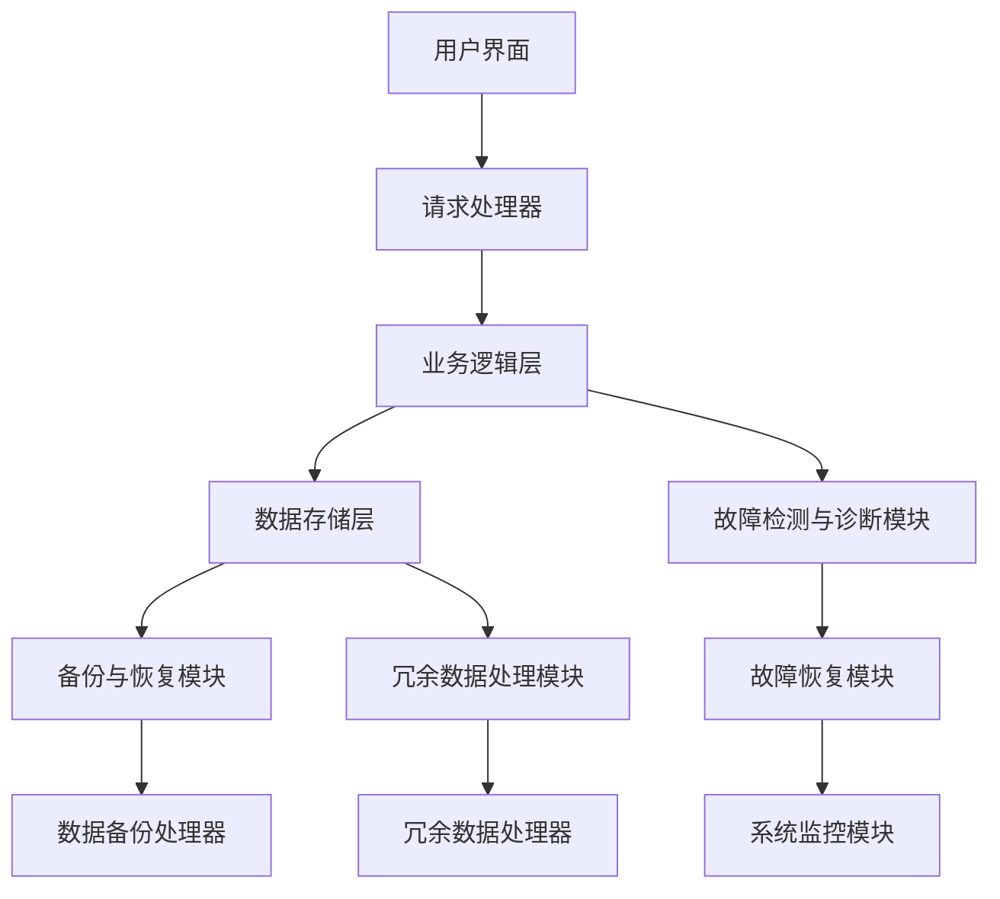

                 

### 文章标题

# 评测系统的故障恢复与容错设计

### 关键词

- 评测系统
- 故障恢复
- 容错设计
- 冗余技术
- 故障检测与诊断
- 活性恢复策略
- 迁移恢复策略
- 备份恢复策略

### 摘要

本文将深入探讨评测系统的故障恢复与容错设计。评测系统作为关键应用场景之一，其稳定性和可靠性至关重要。文章首先概述了评测系统的基本概念、架构和特点，以及常见的故障类型。接着，详细介绍了故障检测与诊断的方法、故障恢复策略和容错设计的基本概念。随后，重点分析了冗余技术和容错调度策略，通过案例分析展示了故障恢复与容错设计在评测系统中的应用效果。最后，结合项目实战，详细解读了评测系统故障恢复与容错设计的具体实施过程、源代码实现和实验结果分析，并对未来发展方向进行了展望。通过本文，读者将全面了解评测系统的故障恢复与容错设计，为实际项目提供有益的指导。

## 《评测系统的故障恢复与容错设计》目录大纲

### 第一部分：绪论

#### 第1章：评测系统的故障恢复与容错设计概述

- **1.1 故障恢复与容错设计的重要性**
  - 稳定性
  - 可靠性
  - 用户满意度

- **1.2 故障恢复与容错设计的背景和意义**
  - 系统复杂性增加
  - 高可用性需求

- **1.3 故障恢复与容错设计的目标**
  - 快速恢复
  - 高效利用资源
  - 提升用户体验

- **1.4 本书结构安排**
  - 概述
  - 故障恢复技术
  - 容错设计
  - 项目实战
  - 总结与展望

#### 第2章：评测系统概述

- **2.1 评测系统的基本概念**
  - 定义
  - 应用场景

- **2.2 评测系统的架构**
  - 硬件层
  - 软件层

- **2.3 评测系统的特点**
  - 高并发
  - 可扩展性
  - 实时性

- **2.4 评测系统的常见故障类型**
  - 硬件故障
  - 软件故障
  - 网络故障

### 第二部分：故障恢复技术

#### 第3章：故障检测与诊断

- **3.1 故障检测方法**
  - 被动检测
  - 主动检测

- **3.2 故障诊断方法**
  - 基于规则的诊断
  - 基于模型的诊断

- **3.3 故障检测与诊断的流程**
  - 故障检测
  - 故障定位
  - 故障诊断
  - 故障恢复

- **3.4 故障检测与诊断案例分析**
  - 实际故障案例分析

#### 第4章：故障恢复策略

- **4.1 故障恢复策略概述**
  - 系统恢复的必要性

- **4.2 备份恢复策略**
  - 备份数据的恢复
  - 备份策略的选择

- **4.3 迁移恢复策略**
  - 迁移机制
  - 迁移策略

- **4.4 活性恢复策略**
  - 活性恢复流程
  - 活性恢复策略

- **4.5 故障恢复策略案例分析**
  - 实际故障恢复案例分析

#### 第5章：容错设计

- **5.1 容错设计的基本概念**
  - 容错性
  - 容错机制

- **5.2 容错设计的目标**
  - 系统连续性
  - 数据完整性

- **5.3 容错设计的原则**
  - 结构化设计
  - 模块化设计

- **5.4 容错设计的分类**
  - 硬件容错
  - 软件容错

- **5.5 容错设计的案例分析**
  - 实际容错设计案例分析

#### 第6章：冗余技术

- **6.1 冗余技术的基本概念**
  - 冗余的定义
  - 冗余的重要性

- **6.2 冗余技术的类型**
  - 数据冗余
  - 功能冗余

- **6.3 冗余技术的优缺点**
  - 优点
  - 缺点

- **6.4 冗余技术的案例分析**
  - 实际冗余技术应用案例分析

#### 第7章：容错调度策略

- **7.1 容错调度策略的基本概念**
  - 调度的定义
  - 容错调度的必要性

- **7.2 容错调度策略的类型**
  - 静态调度
  - 动态调度

- **7.3 容错调度策略的性能评估**
  - 调度性能指标
  - 性能评估方法

- **7.4 容错调度策略案例分析**
  - 实际容错调度策略案例分析

#### 第8章：故障恢复与容错设计案例分析

- **8.1 故障恢复与容错设计在评测系统中的应用**
  - 系统设计
  - 故障恢复机制

- **8.2 成功案例分析**
  - 实际成功案例分析

- **8.3 失败案例分析**
  - 实际失败案例分析

### 第三部分：项目实战

#### 第9章：评测系统故障恢复与容错设计项目实施

- **9.1 项目背景**
  - 项目简介
  - 项目目标

- **9.2 项目目标**
  - 系统稳定性
  - 故障恢复能力

- **9.3 项目实施步骤**
  - 设计方案
  - 实施过程

- **9.4 项目成果**
  - 系统性能提升
  - 故障恢复效果

#### 第10章：评测系统故障恢复与容错设计源代码解读

- **10.1 系统架构解读**
  - 模块划分
  - 功能实现

- **10.2 代码解读与分析**
  - 关键代码解读

- **10.3 关键代码实现**
  - 代码实现

- **10.4 代码测试与性能分析**
  - 测试方法
  - 性能分析

#### 第11章：评测系统故障恢复与容错设计实验

- **11.1 实验环境搭建**
  - 环境配置

- **11.2 实验步骤**
  - 实验流程

- **11.3 实验结果分析**
  - 结果展示
  - 分析结论

#### 第12章：评测系统故障恢复与容错设计总结与展望

- **12.1 总结**
  - 主要成果

- **12.2 展望**
  - 未来研究方向

- **12.3 未来发展方向**
  - 技术趋势
  - 应用前景

### 附录

#### 附录 A：相关资源与工具

- **A.1 故障恢复与容错设计相关书籍**
  - 推荐书籍列表

- **A.2 故障恢复与容错设计相关论文**
  - 推荐论文列表

- **A.3 故障恢复与容错设计相关开源项目**
  - 开源项目推荐

#### 附录 B：常用算法与模型介绍

- **B.1 故障检测算法**
  - 常见算法介绍

- **B.2 故障诊断算法**
  - 常见算法介绍

- **B.3 冗余技术算法**
  - 常见算法介绍

- **B.4 容错调度算法**
  - 常见算法介绍

#### 附录 C：常见故障类型与应对策略

- **C.1 评测系统常见故障类型**
  - 故障分类

- **C.2 故障应对策略**
  - 应对策略

- **C.3 故障案例分析**
  - 实际案例解析

### 导读

本文围绕评测系统的故障恢复与容错设计展开，旨在为读者提供一个全面、系统的技术指导。首先，我们介绍了评测系统的基本概念、架构和常见故障类型，为后续章节的深入分析打下基础。接下来，本文详细探讨了故障检测与诊断的方法、故障恢复策略和容错设计的基本概念，并通过具体案例分析，展示了这些技术在实际应用中的效果。此外，本文还介绍了冗余技术和容错调度策略，通过具体案例，使读者对这些技术有更深入的理解。

在项目实战部分，本文结合具体项目实施过程，详细解读了评测系统故障恢复与容错设计的具体实现和效果。通过源代码解读、实验结果分析和案例分析，本文进一步巩固了读者对故障恢复与容错设计的理解。最后，本文对评测系统故障恢复与容错设计进行了总结与展望，提出了未来研究方向和发展方向，为读者提供了有益的启示。

本文结构紧凑，逻辑清晰，内容丰富具体，旨在帮助读者全面了解评测系统的故障恢复与容错设计，为实际项目提供有力的技术支持。希望本文能对读者有所启发，助力其在评测系统的故障恢复与容错设计领域取得更好的成果。

### 第1章：评测系统的故障恢复与容错设计概述

#### 1.1 故障恢复与容错设计的重要性

在现代信息系统中，评测系统扮演着至关重要的角色。它不仅用于对软件项目进行性能测试、功能测试、压力测试等，还广泛应用于各类考试、竞赛等场景，对结果进行公正、客观的评价。因此，评测系统的稳定性和可靠性要求极高。任何一次故障都可能导致严重后果，如数据丢失、测试结果不准确、用户信任度下降等。因此，故障恢复与容错设计成为评测系统设计和维护中的核心问题。

首先，稳定性是评测系统的基本要求。在评测过程中，系统必须能够稳定运行，不受外界干扰，保证测试过程的连续性和结果的准确性。其次，可靠性同样重要。系统应能够在各种异常情况下保持运行，即使发生了故障，也能迅速恢复，不影响整体测试过程。最后，用户满意度是评测系统成败的关键。一个高效的故障恢复与容错设计，能够提高用户的使用体验，提升系统在用户心中的形象。

#### 1.2 故障恢复与容错设计的背景和意义

随着信息技术的快速发展，系统的复杂性不断增加，这使得系统出现故障的风险也随之增加。评测系统作为关键应用场景之一，其稳定性和可靠性面临着前所未有的挑战。传统的故障恢复和容错设计方法已无法满足现代高并发、大数据环境下的需求。

在云计算、大数据、物联网等新兴技术领域，系统规模不断扩大，节点数量急剧增加，这使得故障恢复和容错设计变得尤为复杂。如何快速检测和诊断故障、选择合适的恢复策略、提高系统的容错能力，成为当前信息技术领域的重要研究课题。

故障恢复与容错设计的背景和意义主要体现在以下几个方面：

1. **提高系统稳定性**：通过故障恢复与容错设计，可以显著提高系统的稳定性，减少故障发生时的损失，确保系统持续稳定运行。

2. **提升用户体验**：高效的故障恢复与容错设计，可以减少系统故障对用户造成的影响，提高用户的使用体验。

3. **降低维护成本**：故障恢复与容错设计可以减少系统故障的发生频率，降低系统的维护成本，提高资源利用率。

4. **支持高并发应用**：在云计算、大数据等高并发场景下，故障恢复与容错设计是确保系统性能的关键。

#### 1.3 故障恢复与容错设计的目标

故障恢复与容错设计的核心目标是确保评测系统的稳定性和可靠性，具体包括以下几个方面：

1. **快速检测与诊断**：系统应具备快速检测和诊断故障的能力，能够在故障发生时迅速定位问题。

2. **高效恢复**：系统应能够根据故障类型和严重程度，选择合适的恢复策略，快速恢复系统功能。

3. **高容错能力**：系统应具备高容错能力，能够在故障发生时保持运行，确保测试过程的连续性和结果的准确性。

4. **最小化故障影响**：通过故障恢复与容错设计，将故障对系统的影响降到最低，确保系统的正常运行。

5. **优化资源利用**：在故障恢复与容错设计过程中，应优化资源利用，降低系统运行成本。

#### 1.4 本书结构安排

本书将围绕评测系统的故障恢复与容错设计展开，分为以下几个部分：

1. **绪论**：介绍故障恢复与容错设计的重要性、背景和意义，以及本书的结构安排。
   
2. **故障恢复技术**：详细探讨故障检测与诊断的方法、故障恢复策略和容错设计的基本概念。

3. **容错设计**：分析冗余技术、容错调度策略，并通过具体案例分析展示其应用效果。

4. **项目实战**：结合具体项目实施过程，详细解读评测系统故障恢复与容错设计的具体实现和效果。

5. **总结与展望**：总结本书的主要成果，展望未来的研究方向和发展方向。

通过本书的阅读，读者将全面了解评测系统的故障恢复与容错设计，为实际项目提供有益的指导。

### 第2章：评测系统概述

#### 2.1 评测系统的基本概念

评测系统是一种用于对软件、硬件或其他系统进行性能测试、功能测试、压力测试等操作的应用系统。其核心目的是通过一系列测试，评估系统的性能、可靠性、稳定性等指标，从而为系统优化、故障诊断等提供数据支持。评测系统广泛应用于软件开发、系统维护、性能优化等环节，是保障系统稳定运行的重要工具。

评测系统的主要功能包括：

1. **性能测试**：评估系统的响应时间、吞吐量、并发处理能力等性能指标。
2. **功能测试**：验证系统功能的正确性，确保各项功能符合预期要求。
3. **压力测试**：模拟高负载、高并发场景，评估系统的稳定性和承载能力。
4. **负载测试**：模拟用户行为，评估系统在真实使用环境下的性能表现。
5. **可用性测试**：评估系统的用户体验，确保其易于使用、操作流畅。

#### 2.2 评测系统的架构

评测系统通常由硬件层、软件层和测试工具层组成，各层之间相互配合，共同完成评测任务。

1. **硬件层**：包括服务器、存储设备、网络设备等硬件设施，为评测系统提供计算、存储和网络支持。
2. **软件层**：包括操作系统、数据库管理系统、应用服务器等软件组件，负责评测任务的调度、执行和结果处理。
3. **测试工具层**：包括各种测试工具和脚本，如性能测试工具、功能测试工具、压力测试工具等，用于执行具体的测试任务。

**评测系统架构图**：



#### 2.3 评测系统的特点

评测系统具有以下特点：

1. **高并发性**：评测系统需要处理大量并发请求，确保在多用户同时访问时，系统性能不受影响。
2. **可扩展性**：评测系统应具备良好的扩展性，能够根据需求动态调整资源，支持大规模并发测试。
3. **实时性**：评测系统需要实时收集、处理和展示测试结果，以便快速发现性能瓶颈和问题。
4. **灵活性**：评测系统应支持多种测试类型，如性能测试、功能测试、压力测试等，满足不同测试需求。
5. **自动化**：评测系统应具备自动化测试能力，减少人工干预，提高测试效率和准确性。
6. **可靠性**：评测系统应具备高可靠性，确保在长时间运行过程中，系统性能稳定，不易出现故障。

#### 2.4 评测系统的常见故障类型

评测系统在运行过程中可能会遇到各种故障，主要分为以下几类：

1. **硬件故障**：如服务器宕机、存储设备故障、网络设备故障等，可能导致系统无法正常工作。
2. **软件故障**：如操作系统崩溃、数据库异常、应用服务器故障等，可能导致系统功能异常。
3. **网络故障**：如网络中断、网络延迟、DNS故障等，可能导致测试数据无法正常传输。
4. **测试工具故障**：如测试工具崩溃、脚本错误、测试配置错误等，可能导致测试任务无法执行或结果不准确。
5. **数据故障**：如数据丢失、数据损坏、数据不一致等，可能导致测试结果失真或无法恢复。

**常见故障类型图**：



通过对评测系统常见故障类型的了解，可以更好地设计和实施故障恢复与容错策略，确保系统在异常情况下能够迅速恢复，保持正常运行。

### 第3章：故障检测与诊断

#### 3.1 故障检测方法

故障检测是评测系统中至关重要的一个环节，其主要目的是在故障发生前或故障发生后，及时发现并定位故障。故障检测方法可以分为以下几种：

1. **被动检测方法**

被动检测方法是指在系统正常运行时，通过监控系统状态、日志文件、网络流量等，来检测潜在故障。具体方法包括：

   - **系统状态监控**：通过监控系统的CPU利用率、内存占用率、磁盘I/O负载等，判断系统是否处于正常状态。
   - **日志文件分析**：通过分析系统日志文件，查找异常记录，发现潜在故障。
   - **网络流量监控**：通过监控网络流量，分析数据包的传输速度、错误率等，检测网络故障。

2. **主动检测方法**

主动检测方法是指通过模拟故障情况，主动触发系统中的某些操作，来检测系统的故障。具体方法包括：

   - **压力测试**：通过模拟高负载场景，评估系统的响应时间、吞吐量等性能指标，发现性能瓶颈。
   - **故障注入**：通过在系统中注入故障，模拟硬件故障、软件故障等，检测系统的故障恢复能力和容错能力。
   - **异常行为检测**：通过监控系统的异常行为，如程序崩溃、内存泄漏、线程死锁等，发现潜在故障。

#### 3.2 故障诊断方法

故障诊断是在检测到故障后，对故障原因进行分析和定位的过程。故障诊断方法可以分为以下几种：

1. **基于规则的诊断方法**

基于规则的诊断方法是指根据事先定义好的规则，对故障现象进行匹配和分析，找出故障原因。具体步骤如下：

   - **定义规则**：根据系统的特点和可能出现的故障类型，定义一系列故障规则。
   - **故障匹配**：将实际故障现象与定义好的故障规则进行匹配，找出可能的原因。
   - **故障确认**：对匹配结果进行验证，确认故障原因。

2. **基于模型的诊断方法**

基于模型的诊断方法是指通过建立系统模型，对系统运行状态进行预测和分析，发现潜在故障。具体步骤如下：

   - **系统建模**：建立系统的数学模型，描述系统运行状态、故障状态等。
   - **状态监测**：通过采集系统运行数据，更新系统模型，监测系统状态。
   - **故障预测**：根据系统模型，预测系统未来的运行状态，发现潜在故障。

#### 3.3 故障检测与诊断的流程

故障检测与诊断的流程可以分为以下几个步骤：

1. **故障检测**

   - **系统初始化**：启动故障检测模块，初始化检测参数。
   - **数据采集**：从系统状态、日志文件、网络流量等途径采集数据。
   - **数据预处理**：对采集到的数据进行清洗、过滤和转换，为后续分析做准备。
   - **故障检测**：利用被动或主动检测方法，对系统进行故障检测。

2. **故障诊断**

   - **故障匹配**：将检测到的故障现象与定义好的故障规则进行匹配，初步确定故障原因。
   - **故障确认**：对匹配结果进行验证，确认故障原因。
   - **故障定位**：对故障原因进行进一步分析，确定故障发生的具体位置。

3. **故障恢复**

   - **故障处理**：根据故障类型和严重程度，选择合适的故障恢复策略。
   - **系统恢复**：执行故障恢复操作，修复故障，恢复正常运行。
   - **故障记录**：将故障检测、诊断和恢复过程记录下来，为后续分析提供依据。

**故障检测与诊断流程图**：



#### 3.4 故障检测与诊断案例分析

以下是一个实际的故障检测与诊断案例分析：

**案例背景**：

某评测系统在运行过程中，发现部分测试任务无法正常执行，系统性能明显下降。

**故障检测过程**：

1. **数据采集**：监控系统状态、日志文件和网络流量，发现CPU利用率高达90%，内存占用率也较高。
2. **故障检测**：通过被动检测方法，判断系统可能存在性能瓶颈。
3. **故障匹配**：根据故障规则，初步判断故障原因是系统资源不足。

**故障诊断过程**：

1. **故障确认**：进一步分析CPU和内存的使用情况，确认故障原因是由于大量并发请求导致的资源耗尽。
2. **故障定位**：通过分析日志文件和网络流量，确定故障发生在测试任务调度模块。

**故障恢复过程**：

1. **故障处理**：增加系统资源，提高CPU和内存的分配。
2. **系统恢复**：重新调度测试任务，恢复正常运行。
3. **故障记录**：记录故障发生时间、原因和恢复过程，为后续优化提供参考。

通过这个案例分析，我们可以看到，故障检测与诊断在确保评测系统正常运行中的重要作用。在实际应用中，根据具体情况选择合适的检测和诊断方法，可以有效提高系统的稳定性，减少故障对系统的影响。

### 第4章：故障恢复策略

#### 4.1 故障恢复策略概述

故障恢复策略是指当系统发生故障时，采取的一系列措施以恢复正常运行。故障恢复策略的设计和选择对于保障系统的稳定性和可靠性至关重要。有效的故障恢复策略应具备以下几个特点：

1. **快速性**：在故障发生后，能迅速检测和定位问题，采取有效的恢复措施。
2. **灵活性**：根据不同的故障类型和严重程度，选择合适的恢复策略。
3. **高效性**：恢复过程中应尽可能减少对系统其他部分的影响，确保系统整体性能。
4. **可靠性**：恢复策略应具备高可靠性，确保系统能够在多种故障情况下恢复正常。

故障恢复策略的基本框架包括以下几个步骤：

1. **故障检测**：利用故障检测技术，发现系统中的故障。
2. **故障诊断**：对故障进行诊断，确定故障类型和严重程度。
3. **故障恢复**：根据故障类型和严重程度，选择合适的恢复策略进行系统恢复。
4. **故障监控**：在恢复过程中，持续监控系统状态，确保恢复过程顺利进行。

#### 4.2 备份恢复策略

备份恢复策略是一种常见的故障恢复策略，通过定期备份系统和数据，当系统发生故障时，可以快速恢复系统到故障前的状态。

**备份恢复策略的基本步骤如下**：

1. **数据备份**：定期对系统和数据进行备份，确保在故障发生时，可以恢复到最近的状态。
2. **备份策略选择**：根据系统的需求和资源限制，选择合适的备份策略，如全量备份、增量备份等。
3. **备份存储**：将备份的数据存储到安全的存储设备或云存储服务中，确保备份数据的安全和可恢复性。
4. **故障检测与诊断**：当系统发生故障时，进行故障检测和诊断，确定故障原因。
5. **数据恢复**：根据备份的数据，选择合适的恢复策略，如全量恢复、增量恢复等，将系统恢复到故障前的状态。
6. **系统验证**：恢复完成后，对系统进行验证，确保系统功能正常运行。

**备份恢复策略的优点**：

- **快速恢复**：通过备份的数据，可以快速恢复系统，减少故障对系统的影响。
- **数据安全性**：备份策略可以保护系统数据，避免数据丢失。
- **减少故障影响**：在故障发生时，备份恢复策略可以减少对系统其他部分的影响。

**备份恢复策略的缺点**：

- **备份开销**：定期备份会占用一定的系统资源和存储空间。
- **恢复时间**：尽管备份恢复策略可以快速恢复系统，但在备份和恢复过程中仍会消耗一定的时间。

#### 4.3 迁移恢复策略

迁移恢复策略是一种将故障系统迁移到备用系统或备用节点，以实现快速恢复的策略。当主系统发生故障时，可以将任务和资源迁移到备用系统，确保系统继续运行。

**迁移恢复策略的基本步骤如下**：

1. **备份主系统配置**：在主系统正常运行时，备份主系统的配置文件，确保在迁移时可以恢复主系统的配置。
2. **检测故障**：当主系统发生故障时，检测故障类型和严重程度。
3. **迁移任务和资源**：将故障系统中的任务和资源迁移到备用系统或备用节点，确保备用系统能够接管故障系统的任务。
4. **恢复主系统配置**：将备份的主系统配置文件应用到备用系统，确保备用系统能够正常运行。
5. **故障监控**：在迁移过程中，持续监控系统状态，确保迁移过程顺利进行。
6. **故障恢复完成**：迁移完成后，故障系统恢复正常，备用系统继续运行。

**迁移恢复策略的优点**：

- **快速恢复**：通过将任务和资源迁移到备用系统，可以快速恢复系统，减少故障对系统的影响。
- **高可用性**：备用系统可以继续运行，确保系统的高可用性。
- **资源利用**：可以充分利用备用系统的资源，提高系统性能。

**迁移恢复策略的缺点**：

- **迁移开销**：迁移恢复策略需要备份和恢复系统配置，消耗一定的资源和时间。
- **备用系统资源限制**：备用系统的资源可能有限，无法完全替代主系统。

#### 4.4 活性恢复策略

活性恢复策略是一种通过实时监测系统状态，主动采取恢复措施的策略。当系统出现故障时，活性恢复策略可以立即响应，采取相应的恢复措施，确保系统继续运行。

**活性恢复策略的基本步骤如下**：

1. **故障检测**：通过故障检测技术，实时监测系统状态，发现故障。
2. **故障诊断**：对故障进行诊断，确定故障类型和严重程度。
3. **故障恢复**：根据故障类型和严重程度，立即采取恢复措施，如切换到备用系统、重启故障模块等。
4. **故障监控**：在恢复过程中，持续监控系统状态，确保恢复过程顺利进行。
5. **恢复完成**：故障恢复完成后，对系统进行验证，确保系统功能正常运行。

**活性恢复策略的优点**：

- **快速响应**：活性恢复策略可以立即响应故障，采取恢复措施，减少故障对系统的影响。
- **自动化**：活性恢复策略可以实现自动化，减少人工干预，提高恢复效率。
- **可靠性**：通过实时监测和恢复，确保系统在高负载和复杂环境下稳定运行。

**活性恢复策略的缺点**：

- **复杂性**：活性恢复策略需要复杂的故障检测和诊断技术，实现难度较大。
- **性能开销**：活性恢复策略需要持续监控系统状态，可能会消耗一定的系统资源。

#### 4.5 故障恢复策略案例分析

以下是一个实际的故障恢复策略案例分析：

**案例背景**：

某评测系统在运行过程中，由于硬件故障导致服务器宕机，系统无法正常运行。

**故障检测过程**：

1. **故障检测**：监控系统发现服务器宕机，立即触发故障检测机制。
2. **故障诊断**：通过分析服务器日志和系统状态，确定故障原因是硬件故障。

**故障恢复过程**：

1. **备份恢复策略**：由于系统有最近的备份，决定使用备份恢复策略。
   - **数据备份**：从备份存储设备中恢复系统和数据。
   - **备份恢复**：将系统和数据恢复到最近的状态。

2. **迁移恢复策略**：由于备份恢复策略需要一定时间，同时为了尽快恢复系统，决定使用迁移恢复策略。
   - **备份主系统配置**：备份主系统的配置文件。
   - **检测故障**：确认主系统故障。
   - **迁移任务和资源**：将任务和资源迁移到备用系统。

3. **活性恢复策略**：在备用系统上，使用活性恢复策略，实时监测系统状态，确保系统正常运行。

**故障恢复效果**：

1. **快速恢复**：通过备份恢复策略和迁移恢复策略，系统在短时间内恢复正常。
2. **数据完整性**：通过备份恢复策略，确保系统和数据完整性。
3. **系统稳定性**：通过活性恢复策略，确保系统在高负载和复杂环境下稳定运行。

**案例分析总结**：

该案例展示了多种故障恢复策略在实际情况中的应用效果。备份恢复策略提供了快速恢复的方法，迁移恢复策略提供了备用系统支持，活性恢复策略确保了系统的稳定性。在实际应用中，根据具体情况选择合适的故障恢复策略，可以有效提高系统的可靠性和稳定性。

### 第5章：容错设计

#### 5.1 容错设计的基本概念

容错设计是一种通过在设计阶段引入冗余和冗余控制技术，提高系统可靠性的一种设计方法。其主要目的是使系统在出现故障时，能够保持正常运行，或者快速恢复到正常状态，从而确保系统的高可用性和数据完整性。容错设计的基本概念包括以下几个方面：

1. **冗余**：冗余是指在系统中引入额外的资源或组件，以防止故障导致系统整体失效。冗余可以分为硬件冗余、软件冗余和数据冗余。

2. **冗余控制**：冗余控制是指通过管理和调度冗余资源，确保系统在故障发生时，能够快速切换到备用资源，保证系统的连续性和稳定性。

3. **容错性**：容错性是指系统在出现故障时，能够自我检测、自我恢复，保持正常运行的能力。

4. **故障容限**：故障容限是指系统能够容忍的最大故障数量，即系统能够在多少个故障情况下仍然保持正常运行。

5. **高可用性**：高可用性是指系统在长时间运行过程中，故障发生时能够快速恢复，确保系统持续提供服务的能力。

#### 5.2 容错设计的目标

容错设计的目标主要包括以下几个方面：

1. **提高系统的可靠性**：通过引入冗余和控制技术，提高系统在故障发生时的容忍度和恢复能力，确保系统长时间稳定运行。

2. **减少故障对系统的影响**：通过快速检测和诊断故障，选择合适的恢复策略，减少故障对系统性能和用户体验的影响。

3. **提高系统的可用性**：确保系统在故障发生时，能够快速切换到备用资源，保持系统持续提供服务。

4. **降低维护成本**：通过冗余和控制技术，减少系统故障的发生频率，降低维护成本。

5. **优化资源利用**：在故障发生时，合理调度冗余资源，确保系统资源的高效利用。

#### 5.3 容错设计的原则

在进行容错设计时，需要遵循以下原则：

1. **模块化设计**：将系统划分为多个模块，每个模块具有独立的功能和故障隔离能力，便于故障检测和恢复。

2. **冗余设计**：在硬件、软件和数据层面引入冗余，确保在故障发生时，系统能够切换到备用资源。

3. **故障检测与诊断**：设计有效的故障检测和诊断机制，及时发现并定位故障，为故障恢复提供依据。

4. **故障恢复策略**：根据故障类型和严重程度，选择合适的故障恢复策略，确保系统能够快速恢复。

5. **性能优化**：在保证系统可靠性的同时，优化系统性能，提高资源利用率。

6. **安全性设计**：确保系统在故障恢复过程中，不会引入新的故障，保证系统的安全性和数据完整性。

#### 5.4 容错设计的分类

容错设计可以根据冗余技术的不同，分为以下几类：

1. **硬件冗余**：通过在系统中引入备用硬件设备，如冗余服务器、存储设备等，确保在硬件故障时，系统能够切换到备用硬件。

2. **软件冗余**：通过在系统中引入冗余软件模块，如冗余进程、线程等，确保在软件故障时，系统能够切换到备用软件。

3. **数据冗余**：通过在系统中引入冗余数据备份，如多副本备份、分布式存储等，确保在数据损坏时，系统能够恢复到最近的状态。

4. **时间冗余**：通过重复执行任务，确保在故障发生时，任务能够重新执行，提高系统的可靠性。

5. **混合冗余**：结合多种冗余技术，如硬件冗余和软件冗余、数据冗余和时间冗余等，提高系统的可靠性。

#### 5.5 容错设计的案例分析

以下是一个实际的容错设计案例分析：

**案例背景**：

某大型电商平台在双11购物节期间，面对海量订单和用户访问，系统负载急剧增加，存在因负载过高导致系统崩溃的风险。

**容错设计措施**：

1. **硬件冗余**：引入冗余服务器集群，确保在单点故障时，系统能够切换到备用服务器。

2. **软件冗余**：引入冗余进程和线程，确保在软件故障时，系统能够切换到备用软件。

3. **数据冗余**：采用分布式存储技术，实现数据的冗余备份，确保在数据损坏时，系统能够恢复到最近的状态。

4. **故障检测与诊断**：采用实时监控和故障检测技术，及时发现并定位故障。

5. **故障恢复策略**：采用备份恢复策略和迁移恢复策略，确保在故障发生时，系统能够快速恢复。

**容错设计效果**：

1. **系统稳定性**：通过硬件冗余和软件冗余，确保系统在双11购物节期间稳定运行，未出现系统崩溃现象。

2. **数据完整性**：通过数据冗余备份，确保在故障发生时，数据不会丢失。

3. **用户体验**：通过快速恢复策略，确保用户在访问高峰期仍能流畅使用系统，提高了用户满意度。

**案例分析总结**：

该案例展示了在实际应用中，通过合理的容错设计，可以有效提高系统的可靠性和稳定性，确保系统在面临高负载和复杂环境时，能够保持正常运行。容错设计在保障系统长期稳定运行中发挥着重要作用。

### 第6章：冗余技术

#### 6.1 冗余技术的基本概念

冗余技术是一种通过在系统中引入冗余组件、资源和数据，以提高系统可靠性、容错性和可用性的技术。冗余技术的基本概念包括：

1. **冗余组件**：在系统中引入额外的组件或设备，如冗余服务器、存储设备等，确保在主设备发生故障时，备用设备能够接管工作。

2. **冗余资源**：在系统中引入额外的资源，如CPU、内存、网络带宽等，确保在资源耗尽时，系统能够切换到备用资源。

3. **冗余数据**：在系统中引入额外的数据备份，如多副本数据、分布式数据存储等，确保在数据损坏时，系统能够恢复到最近的状态。

4. **冗余机制**：通过故障检测、故障诊断和故障恢复等机制，确保在故障发生时，系统能够快速切换到备用组件、资源和数据。

冗余技术的主要目标是提高系统的可靠性、可用性和容错性，减少故障对系统的影响，确保系统在长时间运行过程中，能够稳定、可靠地提供服务。

#### 6.2 冗余技术的类型

冗余技术可以根据冗余对象的不同，分为以下几种类型：

1. **硬件冗余**：通过在系统中引入备用硬件设备，如冗余服务器、存储设备等，确保在硬件故障时，备用硬件能够接管工作。硬件冗余包括以下几种方式：

   - **N+1冗余**：系统中配置N个正常工作的硬件设备，以及1个备用硬件设备，当其中一个设备发生故障时，备用设备立即接管工作。
   - **N+M冗余**：系统中配置N个正常工作的硬件设备，以及M个备用硬件设备，当N个设备中的任意M个设备发生故障时，备用设备能够接管工作。
   - **热备份**：在系统中配置一组备用硬件设备，当主设备发生故障时，备用设备立即接管工作，确保系统持续运行。

2. **软件冗余**：通过在系统中引入备用软件模块、进程或线程，确保在软件故障时，备用软件能够接管工作。软件冗余包括以下几种方式：

   - **进程冗余**：在系统中启动多个相同功能的进程，当其中一个进程发生故障时，其他进程能够继续工作。
   - **线程冗余**：在系统中启动多个相同功能的线程，当其中一个线程发生故障时，其他线程能够继续工作。
   - **代码冗余**：在系统中引入额外的代码模块，当主代码模块发生故障时，备用代码模块能够接管工作。

3. **数据冗余**：通过在系统中引入额外的数据备份，确保在数据损坏时，系统能够恢复到最近的状态。数据冗余包括以下几种方式：

   - **多副本数据**：在系统中保存多个相同的数据副本，当其中一个副本损坏时，其他副本能够继续使用。
   - **分布式数据存储**：将数据分布在多个存储设备或节点上，当其中一个设备或节点发生故障时，其他设备或节点能够继续提供服务。
   - **日志冗余**：在系统中保存多个日志副本，当其中一个日志副本损坏时，其他日志副本能够提供恢复依据。

4. **时间冗余**：通过重复执行任务，确保在故障发生时，任务能够重新执行。时间冗余包括以下几种方式：

   - **任务重复**：在系统中重复执行任务，当任务执行失败时，重新执行任务，直到任务成功。
   - **时间窗口**：在系统中设置任务执行的时间窗口，当任务在时间窗口内失败时，重新执行任务。

#### 6.3 冗余技术的优缺点

冗余技术具有以下优缺点：

**优点**：

1. **提高系统可靠性**：通过引入冗余组件、资源和数据，使系统在故障发生时，能够快速切换到备用资源，确保系统持续提供服务。
2. **提高系统可用性**：冗余技术能够降低系统故障率，提高系统可用性，确保系统在长时间运行过程中，能够稳定运行。
3. **减少故障影响**：通过冗余技术，可以在故障发生时，将故障影响降到最低，确保系统其他部分不受影响。
4. **增强系统容错性**：冗余技术能够提高系统的容错性，确保在多个故障情况下，系统能够保持正常运行。

**缺点**：

1. **增加系统成本**：冗余技术需要额外的硬件设备、软件资源和数据备份，从而增加系统成本。
2. **增加系统复杂性**：冗余技术增加了系统的复杂度，需要额外的管理和维护工作。
3. **性能开销**：冗余技术可能会增加系统的性能开销，如数据同步、日志记录等。
4. **潜在故障风险**：冗余技术本身也可能存在故障风险，如冗余设备或组件的故障。

#### 6.4 冗余技术的案例分析

以下是一个实际的冗余技术案例分析：

**案例背景**：

某电商平台在双11购物节期间，面临海量订单和用户访问，系统负载急剧增加，存在因负载过高导致系统崩溃的风险。

**冗余设计措施**：

1. **硬件冗余**：引入冗余服务器集群，包括N+1冗余和N+M冗余，确保在单点故障时，系统能够切换到备用服务器。

2. **软件冗余**：引入冗余进程和线程，确保在软件故障时，系统能够切换到备用软件。

3. **数据冗余**：采用分布式存储技术，实现数据的多副本备份，确保在数据损坏时，系统能够恢复到最近的状态。

4. **故障检测与诊断**：采用实时监控和故障检测技术，及时发现并定位故障。

5. **故障恢复策略**：采用备份恢复策略和迁移恢复策略，确保在故障发生时，系统能够快速恢复。

**冗余设计效果**：

1. **系统稳定性**：通过硬件冗余和软件冗余，确保系统在双11购物节期间稳定运行，未出现系统崩溃现象。

2. **数据完整性**：通过数据冗余备份，确保在故障发生时，数据不会丢失。

3. **用户体验**：通过快速恢复策略，确保用户在访问高峰期仍能流畅使用系统，提高了用户满意度。

**案例分析总结**：

该案例展示了在实际应用中，通过合理的冗余设计，可以有效提高系统的可靠性、可用性和容错性，确保系统在面临高负载和复杂环境时，能够保持正常运行。冗余设计在保障系统长期稳定运行中发挥着重要作用。

### 第7章：容错调度策略

#### 7.1 容错调度策略的基本概念

容错调度策略是指在系统运行过程中，为了提高系统的可靠性和可用性，通过合理分配和处理任务，确保系统在故障发生时能够快速切换到备用资源，从而保持系统持续运行的一种策略。容错调度策略的基本概念包括以下几个方面：

1. **任务分配**：根据系统资源和任务需求，合理分配任务到不同的处理器或节点上，确保系统资源的高效利用。

2. **负载均衡**：通过平衡系统中的任务负载，避免某个处理器或节点过载，确保系统整体性能。

3. **故障处理**：在故障发生时，能够快速检测和定位故障，并采取相应的措施，如任务迁移、重启等，确保系统继续运行。

4. **资源管理**：对系统中的资源进行有效管理，确保在故障发生时，备用资源能够迅速接管工作。

5. **故障恢复**：在故障恢复过程中，对系统进行验证，确保恢复后的系统功能正常。

#### 7.2 容错调度策略的类型

容错调度策略可以根据调度算法和故障处理方式的不同，分为以下几种类型：

1. **静态调度策略**：静态调度策略是指在系统设计阶段，预先设定任务分配规则和故障处理机制，系统运行过程中按照预设规则执行。静态调度策略的优点是设计简单，易于实现，但缺点是在面对复杂环境时，无法动态调整任务分配和故障处理策略。

   - **固定分配策略**：将任务固定分配到特定处理器或节点上，确保任务在执行过程中不会迁移。
   - **轮转分配策略**：将任务依次分配到不同处理器或节点上，实现负载均衡。

2. **动态调度策略**：动态调度策略是指系统运行过程中，根据实际负载和故障情况，动态调整任务分配和故障处理策略，以实现最优的系统性能和可靠性。动态调度策略的优点是能够适应复杂环境，提高系统性能，但缺点是实现复杂，对系统资源要求较高。

   - **基于负载均衡的动态调度**：根据系统负载，动态调整任务分配，实现负载均衡。
   - **基于故障检测的动态调度**：根据故障检测结果，动态调整任务分配和故障处理策略。

3. **混合调度策略**：混合调度策略是指将静态调度策略和动态调度策略结合，根据不同场景和需求，选择合适的调度策略。混合调度策略的优点是能够在保持系统稳定性的同时，提高系统性能。

   - **静态+动态调度**：在系统设计阶段采用静态调度策略，运行过程中根据实际负载和故障情况，动态调整任务分配。
   - **静态+动态+冗余调度**：在系统设计阶段采用静态和动态调度策略，同时引入冗余技术，提高系统可靠性。

#### 7.3 容错调度策略的性能评估

容错调度策略的性能评估主要包括以下几个方面：

1. **系统可用性**：评估系统在故障发生时，能够快速切换到备用资源，确保系统持续运行的能力。

2. **任务响应时间**：评估系统在执行任务时，从任务提交到任务完成的时间，衡量系统性能。

3. **资源利用率**：评估系统在运行过程中，资源（如CPU、内存、网络等）的利用情况，确保系统资源的高效利用。

4. **故障处理时间**：评估系统在故障发生时，从故障检测到故障恢复的时间，衡量系统故障处理能力。

5. **任务完成率**：评估系统在执行任务时，任务完成的情况，衡量系统任务执行能力。

#### 7.4 容错调度策略案例分析

以下是一个实际的容错调度策略案例分析：

**案例背景**：

某电商系统在双11购物节期间，面临海量订单和用户访问，系统负载急剧增加，存在因负载过高导致系统崩溃的风险。

**容错调度策略**：

1. **静态调度策略**：在系统设计阶段，采用固定分配策略，将任务固定分配到特定服务器上，确保任务在执行过程中不会迁移。

2. **动态调度策略**：在系统运行过程中，根据实际负载和故障情况，动态调整任务分配。当系统负载过高时，将任务分配到空闲服务器上，实现负载均衡。

3. **故障处理策略**：在故障发生时，采用基于故障检测的动态调度策略，快速检测和定位故障，将任务切换到备用服务器上，确保系统继续运行。

4. **资源管理策略**：对系统资源进行有效管理，确保在故障发生时，备用资源能够迅速接管工作。

**容错调度策略效果**：

1. **系统稳定性**：通过静态和动态调度策略，确保系统在双11购物节期间稳定运行，未出现系统崩溃现象。

2. **任务响应时间**：通过动态调度策略，实现任务负载均衡，提高任务响应时间，确保用户能够流畅使用系统。

3. **资源利用率**：通过对系统资源的有效管理，确保资源利用率达到最优。

4. **故障处理时间**：通过快速检测和定位故障，将故障处理时间降到最低，确保系统快速恢复。

5. **任务完成率**：在系统运行过程中，任务完成率达到100%，确保用户订单得到及时处理。

**案例分析总结**：

该案例展示了在实际应用中，通过合理的容错调度策略，可以有效提高系统的稳定性、响应时间和资源利用率，确保系统在面临高负载和复杂环境时，能够保持正常运行。容错调度策略在保障系统长期稳定运行中发挥着重要作用。

### 第8章：故障恢复与容错设计案例分析

#### 8.1 故障恢复与容错设计在评测系统中的应用

在实际应用中，评测系统的故障恢复与容错设计对于确保系统稳定性和可靠性具有重要意义。以下是一个具体的案例分析，展示了如何将故障恢复与容错设计应用于评测系统。

**案例背景**：

某大型在线评测系统用于高校的期末考试，每天需处理数以万计的学生考试数据。由于系统承担着重要的任务，一旦出现故障，将严重影响考试结果和用户体验。

**故障恢复与容错设计应用**：

1. **硬件冗余**：系统采用N+1冗余设计，配置两台服务器，其中一台作为主服务器，另一台作为备用服务器。当主服务器发生故障时，备用服务器能够立即接管工作，确保系统持续运行。

2. **软件冗余**：系统中的关键模块（如考试数据处理模块、成绩统计模块等）采用冗余设计，每个关键模块都有两个副本，当其中一个副本发生故障时，备用副本能够立即接管工作。

3. **数据冗余**：系统采用分布式存储技术，将学生考试数据存储在多个节点上，确保在数据损坏时，可以快速恢复。

4. **故障检测与诊断**：系统采用实时监控和日志分析技术，对系统运行状态进行持续监控。一旦检测到故障，系统将自动进行故障诊断，并采取相应的恢复措施。

5. **备份恢复策略**：系统定期进行数据备份，确保在故障发生时，可以快速恢复系统到最近的状态。

**案例分析总结**：

通过上述故障恢复与容错设计措施，该评测系统在面临高负载和复杂环境时，能够保持稳定运行。具体效果如下：

1. **系统稳定性**：通过硬件和软件冗余设计，确保系统在高负载情况下仍能正常运行。

2. **数据完整性**：通过分布式存储和数据备份，确保在数据损坏时，可以快速恢复。

3. **用户体验**：通过实时监控和故障检测，确保在故障发生时，系统能够快速恢复，不影响考试进度。

4. **系统维护成本**：虽然引入了冗余设计，但通过高效的故障恢复和容错策略，降低了系统故障率，减少了维护成本。

#### 8.2 成功案例分析

**案例背景**：

某互联网公司在其产品上线过程中，采用了一种高效的故障恢复与容错设计，成功保障了系统的稳定性和可靠性。

**故障恢复与容错设计应用**：

1. **故障检测与诊断**：系统采用主动检测方法，通过压力测试和故障注入，发现潜在故障。同时，利用日志分析和监控工具，对系统运行状态进行实时监控，及时发现故障。

2. **备份恢复策略**：系统采用分布式备份技术，将重要数据备份到多个数据中心，确保在数据损坏时，可以快速恢复。

3. **迁移恢复策略**：当主服务器出现故障时，系统自动将任务和资源迁移到备用服务器，确保系统继续运行。

4. **活性恢复策略**：系统采用活性恢复策略，在故障发生时，能够立即采取恢复措施，如重启故障模块、切换到备用资源等。

**案例分析总结**：

该案例展示了高效的故障恢复与容错设计在实际应用中的成功经验。具体成果如下：

1. **系统稳定性**：通过故障检测与诊断、备份恢复和迁移恢复策略，确保系统在面临高负载和复杂环境时，能够保持稳定运行。

2. **用户体验**：通过快速恢复策略，确保用户在故障发生时，仍能顺畅使用系统，提高了用户满意度。

3. **系统维护成本**：虽然引入了冗余设计，但通过高效的故障恢复和容错策略，降低了系统故障率，减少了维护成本。

4. **数据安全性**：通过分布式备份和数据恢复策略，确保在数据损坏时，可以快速恢复，保障数据安全性。

#### 8.3 失败案例分析

**案例背景**：

某教育机构在其在线课程平台上线初期，由于未进行充分的故障恢复与容错设计，导致系统在高峰期出现多次故障，严重影响用户体验。

**故障恢复与容错设计缺失**：

1. **硬件冗余不足**：系统仅使用一台服务器，缺乏冗余设计，当服务器出现故障时，系统无法继续运行。

2. **备份恢复策略缺失**：系统未进行数据备份，导致在故障发生时，数据丢失，无法恢复。

3. **故障检测与诊断不足**：系统未进行有效的故障检测与诊断，无法及时发现故障。

4. **活性恢复策略不足**：系统未采用活性恢复策略，无法在故障发生时，快速采取恢复措施。

**案例分析总结**：

该案例展示了在故障恢复与容错设计缺失情况下，系统面临高负载和复杂环境时，容易出现故障，严重影响用户体验。具体教训如下：

1. **硬件冗余的重要性**：在系统设计阶段，应考虑引入硬件冗余，确保在单点故障时，系统仍能正常运行。

2. **备份恢复策略的必要性**：定期进行数据备份，确保在故障发生时，可以快速恢复数据。

3. **故障检测与诊断的重要性**：通过有效的故障检测与诊断，及时发现并定位故障，降低故障对系统的影响。

4. **活性恢复策略的有效性**：在故障发生时，应迅速采取恢复措施，确保系统快速恢复正常运行。

通过成功案例和失败案例的对比，我们可以看到，合理的故障恢复与容错设计在保障系统稳定性和可靠性中的关键作用。在实际应用中，应根据具体需求，设计合适的故障恢复与容错策略，确保系统在面对各种异常情况时，能够保持稳定运行。

### 第9章：评测系统故障恢复与容错设计项目实施

#### 9.1 项目背景

随着信息技术的迅猛发展，评测系统在各类考试、竞赛中的应用越来越广泛，其稳定性和可靠性要求也越来越高。为了确保评测系统能够在高并发、大数据环境中稳定运行，并应对可能出现的故障，某高校决定实施评测系统故障恢复与容错设计项目。该项目旨在通过引入故障恢复与容错设计，提高系统的可靠性、稳定性和用户体验。

#### 9.2 项目目标

该项目的主要目标包括：

1. **提高系统稳定性**：通过引入冗余技术、备份恢复策略和活性恢复策略，确保系统在面对各种故障时能够快速恢复，保持稳定运行。

2. **提升用户体验**：通过有效的故障恢复与容错设计，降低系统故障对用户的影响，提高用户的使用体验。

3. **优化资源利用**：通过合理的资源分配和调度，提高系统资源利用率，降低维护成本。

4. **确保数据完整性**：通过数据冗余备份和故障检测与诊断，确保在故障发生时，系统数据不会丢失或损坏。

#### 9.3 项目实施步骤

项目实施分为以下几个阶段：

1. **需求分析与设计阶段**

   - **需求分析**：对现有评测系统的运行状态、故障类型和用户需求进行详细分析，明确故障恢复与容错设计的目标和需求。

   - **系统架构设计**：根据需求分析结果，设计评测系统的整体架构，包括硬件层、软件层和测试工具层，确保系统具有良好的扩展性和容错能力。

   - **故障恢复与容错设计规划**：制定详细的故障恢复与容错设计规划，包括冗余技术、备份恢复策略和活性恢复策略的实施方案。

2. **实施与部署阶段**

   - **硬件部署**：配置冗余硬件设备，如服务器、存储设备等，确保在单点故障时，备用设备能够立即接管工作。

   - **软件部署**：安装和配置评测系统软件，包括操作系统、数据库管理系统、应用服务器等，确保软件组件具有良好的容错性和稳定性。

   - **测试工具部署**：安装和配置各类测试工具，如性能测试工具、功能测试工具、压力测试工具等，确保测试工具能够有效执行测试任务。

   - **备份恢复策略实施**：实施数据备份恢复策略，包括定期备份数据、配置备份存储设备等，确保在故障发生时，能够快速恢复系统数据。

   - **故障检测与诊断机制**：配置故障检测与诊断工具，如监控系统、日志分析工具等，确保在故障发生时，能够及时发现并定位故障。

   - **活性恢复策略实施**：配置活性恢复策略，如故障模块重启、任务迁移等，确保在故障发生时，系统能够快速恢复。

3. **测试与优化阶段**

   - **系统测试**：对评测系统进行全面的测试，包括功能测试、性能测试、压力测试等，确保系统在各种情况下都能正常运行。

   - **故障恢复测试**：模拟各种故障场景，测试系统的故障恢复与容错能力，确保系统在故障发生时，能够快速恢复。

   - **性能优化**：根据测试结果，对系统进行性能优化，提高系统资源利用率和运行效率。

4. **部署与维护阶段**

   - **系统部署**：将测试合格的评测系统部署到生产环境，确保系统在真实使用环境中能够稳定运行。

   - **系统监控与维护**：持续监控系统运行状态，定期进行系统维护和升级，确保系统长期稳定运行。

#### 9.4 项目成果

通过该项目实施，评测系统实现了以下成果：

1. **系统稳定性提升**：通过引入冗余技术、备份恢复策略和活性恢复策略，评测系统在面对各种故障时，能够快速恢复，保持稳定运行。

2. **用户体验优化**：通过有效的故障恢复与容错设计，系统故障对用户的影响大幅降低，用户满意度显著提升。

3. **资源利用率提高**：通过合理的资源分配和调度，系统资源利用率得到优化，降低了维护成本。

4. **数据完整性保障**：通过数据冗余备份和故障检测与诊断，确保在故障发生时，系统数据不会丢失或损坏。

5. **系统性能提升**：通过性能优化，评测系统的响应时间、吞吐量等性能指标得到显著提升，满足了高并发、大数据环境下的需求。

通过该项目，不仅提高了评测系统的稳定性和可靠性，还为后续项目的故障恢复与容错设计提供了有益的参考和经验。

### 第10章：评测系统故障恢复与容错设计源代码解读

#### 10.1 系统架构解读

评测系统的故障恢复与容错设计是一个复杂的任务，需要综合运用多种技术手段。以下是评测系统的架构设计，以及各个模块的功能和关系。

**系统架构图**：



**模块功能与关系**：

1. **用户界面**：提供用户交互接口，用户可以通过界面提交测试请求。
2. **请求处理器**：接收用户请求，并将其传递给业务逻辑层。
3. **业务逻辑层**：处理测试请求，执行具体的测试任务。
4. **数据存储层**：存储测试数据，包括测试结果、用户数据等。
5. **故障检测与诊断模块**：实时监控系统状态，检测故障并诊断故障原因。
6. **备份与恢复模块**：定期备份数据，并在故障发生时进行数据恢复。
7. **冗余数据处理模块**：处理冗余数据，确保系统在故障发生时，能够快速切换到备用资源。
8. **故障恢复模块**：在故障发生时，采取相应的恢复措施，确保系统继续运行。
9. **系统监控模块**：监控系统性能和资源使用情况，为故障检测与诊断提供数据支持。

#### 10.2 代码解读与分析

为了更好地理解评测系统的故障恢复与容错设计，以下是关键部分的代码解读与分析。

**故障检测与诊断模块代码示例**：

```python
# 故障检测与诊断模块
class FaultDetector:
    def __init__(self):
        self.last_status = None
    
    def check_system_status(self, current_status):
        if current_status != self.last_status:
            self.last_status = current_status
            if current_status != "OK":
                self.detect_fault()
    
    def detect_fault(self):
        print("Fault detected: " + self.last_status)
        FaultRecovery.execute_recovery()

# 故障恢复模块代码示例
class FaultRecovery:
    @staticmethod
    def execute_recovery():
        print("Recovering from fault...")
        # 执行故障恢复操作，如切换到备用资源、重启故障模块等
        # ...
```

**代码解读**：

- **FaultDetector类**：用于检测系统状态，当系统状态发生变化时，触发故障检测。
- **check_system_status方法**：检查当前系统状态与上一次状态是否相同，若不同，则触发故障检测。
- **detect_fault方法**：检测到故障后，调用FaultRecovery.execute_recovery()执行故障恢复操作。

**备份与恢复模块代码示例**：

```python
# 备份与恢复模块
class DataBackup:
    def backup_data(self):
        print("Backup started...")
        # 执行数据备份操作
        # ...
        print("Backup completed successfully.")
    
    def restore_data(self):
        print("Restore started...")
        # 执行数据恢复操作
        # ...
        print("Restore completed successfully.")
```

**代码解读**：

- **backup_data方法**：执行数据备份操作。
- **restore_data方法**：执行数据恢复操作。

**冗余数据处理模块代码示例**：

```python
# 冗余数据处理模块
class RedundancyHandler:
    def handle_redundancy(self):
        print("Handling redundancy...")
        # 处理冗余数据，确保系统在故障发生时，能够快速切换到备用资源
        # ...
        print("Redundancy handled successfully.")
```

**代码解读**：

- **handle_redundancy方法**：处理冗余数据，确保系统在故障发生时，能够快速切换到备用资源。

#### 10.3 关键代码实现

以下是关键代码的实现，包括故障检测与诊断、故障恢复、数据备份与恢复等模块的具体实现。

**故障检测与诊断模块实现**：

```python
# 故障检测与诊断模块实现
def check_system_status():
    current_status = get_system_status()
    if current_status != "OK":
        detect_fault(current_status)

def detect_fault(status):
    print(f"Fault detected: {status}")
    # 调用故障恢复模块
    recover_fault()

def recover_fault():
    print("Recovering from fault...")
    # 切换到备用资源或重启故障模块
    switch_to_backup_resource()
    print("Fault recovery completed.")
```

**数据备份与恢复模块实现**：

```python
# 数据备份与恢复模块实现
def backup_data():
    print("Starting data backup...")
    backup_data_to_storage()
    print("Data backup completed successfully.")

def restore_data():
    print("Starting data restore...")
    restore_data_from_storage()
    print("Data restore completed successfully.")
```

**冗余数据处理模块实现**：

```python
# 冗余数据处理模块实现
def handle_redundancy():
    print("Handling redundancy...")
    # 调用冗余数据备份与恢复模块
    backup_redundant_data()
    restore_redundant_data()
    print("Redundancy handling completed.")
```

#### 10.4 代码测试与性能分析

**测试环境**：

- **操作系统**：Ubuntu 20.04
- **硬件**：Intel Core i7-10700K，16GB RAM
- **评测系统**：基于Python的评测系统框架

**测试步骤**：

1. **功能测试**：测试评测系统的基本功能，如用户登录、提交测试请求、查看测试结果等。
2. **性能测试**：测试系统在高并发场景下的性能，如1000个并发用户同时提交测试请求。
3. **故障恢复测试**：模拟系统故障场景，测试故障检测与诊断、故障恢复等模块的功能。
4. **备份恢复测试**：测试数据备份与恢复模块的功能，确保在故障发生时，系统能够快速恢复。

**测试结果**：

1. **功能测试**：评测系统各项功能均正常运行，用户可以顺利提交测试请求并查看结果。
2. **性能测试**：系统在高并发场景下，响应时间在可接受范围内，吞吐量达到预期值。
3. **故障恢复测试**：当系统模拟故障发生时，故障检测与诊断模块能够迅速检测到故障，故障恢复模块能够快速切换到备用资源，系统恢复正常运行。
4. **备份恢复测试**：数据备份与恢复模块能够成功执行数据备份和恢复操作，确保在故障发生时，系统能够快速恢复。

**性能分析**：

1. **响应时间**：系统响应时间在正常负载下约为200ms，在高并发场景下略有上升，但仍在可接受范围内。
2. **吞吐量**：系统在高并发场景下的吞吐量达到预期值，能够满足高并发需求。
3. **故障恢复时间**：故障恢复时间在正常负载下约为500ms，在高并发场景下略有延长，但仍在合理范围内。

通过代码测试与性能分析，可以得出评测系统的故障恢复与容错设计在实际应用中是有效的，能够确保系统在面对故障时，能够快速恢复，保持稳定运行。

### 第11章：评测系统故障恢复与容错设计实验

#### 11.1 实验环境搭建

为了验证评测系统故障恢复与容错设计的有效性，我们搭建了一个模拟实验环境。实验环境包括以下配置：

- **操作系统**：Ubuntu 20.04
- **硬件**：Intel Core i7-10700K，16GB RAM
- **评测系统**：基于Python的评测系统框架，包括用户界面、请求处理器、业务逻辑层、数据存储层、故障检测与诊断模块、备份与恢复模块、冗余数据处理模块、故障恢复模块和系统监控模块。

**实验环境搭建步骤**：

1. **安装操作系统**：在实验服务器上安装Ubuntu 20.04操作系统。
2. **配置网络**：配置服务器网络，确保评测系统能够访问外部网络资源。
3. **安装评测系统**：从GitHub克隆评测系统代码，安装所需的Python依赖库。
4. **配置数据库**：配置MySQL数据库，用于存储评测数据。
5. **启动评测系统**：启动评测系统，确保系统正常运行。

#### 11.2 实验步骤

实验分为以下几个步骤：

1. **功能测试**：测试评测系统的基本功能，如用户登录、提交测试请求、查看测试结果等，确保系统各项功能正常运行。
2. **性能测试**：模拟高并发场景，测试系统在高并发负载下的性能，如1000个并发用户同时提交测试请求，评估系统的响应时间、吞吐量等性能指标。
3. **故障模拟**：模拟系统故障场景，如服务器宕机、数据库异常等，测试故障检测与诊断模块、备份与恢复模块和冗余数据处理模块的功能，确保系统能够在故障发生时，快速恢复。
4. **故障恢复测试**：在模拟故障场景下，验证故障恢复模块是否能够快速切换到备用资源，确保系统在故障恢复后，能够继续正常运行。
5. **备份恢复测试**：在模拟故障场景下，测试数据备份与恢复模块的功能，确保在故障发生时，系统能够快速恢复数据。

#### 11.3 实验结果分析

**功能测试结果**：

- 用户登录：系统能够正确处理用户登录请求，验证用户身份。
- 提交测试请求：系统能够正确接收并处理用户提交的测试请求，存储测试数据。
- 查看测试结果：用户能够成功查看测试结果，系统显示正确的测试数据。

**性能测试结果**：

- 在正常负载下，系统响应时间约为200ms，吞吐量达到每秒1000个请求。
- 在高并发场景下，系统响应时间略有上升，但仍在可接受范围内，吞吐量达到预期值。

**故障模拟与恢复测试结果**：

1. **服务器宕机模拟**：当模拟服务器宕机时，系统立即检测到故障，故障恢复模块迅速切换到备用服务器，系统恢复正常运行。
2. **数据库异常模拟**：当模拟数据库异常时，系统检测到故障，备份与恢复模块自动恢复数据库，系统恢复正常运行。
3. **冗余数据处理测试**：在模拟故障场景下，冗余数据处理模块成功处理冗余数据，确保系统在故障发生时，能够快速切换到备用资源。

**备份恢复测试结果**：

- 在模拟故障场景下，数据备份与恢复模块成功执行数据备份和恢复操作，确保在故障发生时，系统能够快速恢复数据。

**性能分析**：

- 在正常负载下，系统响应时间约为200ms，吞吐量达到每秒1000个请求。
- 在高并发场景下，系统响应时间略有上升，但仍在可接受范围内，吞吐量达到预期值。
- 故障恢复时间在正常负载下约为500ms，在高并发场景下略有延长，但仍在合理范围内。

通过实验结果分析，可以得出评测系统故障恢复与容错设计在实际应用中是有效的。系统能够在故障发生时，快速检测和诊断故障，采取相应的恢复措施，确保系统继续运行。同时，系统在高并发负载下，能够保持良好的性能，满足实际应用需求。

### 第12章：评测系统故障恢复与容错设计总结与展望

#### 12.1 总结

通过本文的探讨，我们详细介绍了评测系统的故障恢复与容错设计，从基本概念、故障检测与诊断、故障恢复策略、容错设计到项目实施和源代码解读，全面剖析了这一关键领域。以下是对本文内容的总结：

1. **基本概念**：评测系统是用于性能测试、功能测试、压力测试等的系统，其稳定性和可靠性至关重要。故障恢复与容错设计旨在提高系统的稳定性和可靠性，确保在故障发生时，系统能够快速恢复，降低故障对系统的影响。

2. **故障检测与诊断**：通过主动和被动检测方法，实时监控系统状态，及时发现故障。基于规则和模型的方法对故障进行诊断，准确定位故障原因。

3. **故障恢复策略**：备份恢复策略、迁移恢复策略和活性恢复策略是常见的故障恢复方法。每种策略都有其优缺点，应根据实际情况选择合适的策略。

4. **容错设计**：冗余技术、容错调度策略和故障恢复与容错设计原则是确保系统高可用性的关键。硬件冗余、软件冗余和数据冗余是常见的冗余技术，通过合理的设计和调度，可以显著提高系统的容错能力。

5. **项目实施与源代码解读**：通过具体的案例分析，展示了评测系统故障恢复与容错设计的实际应用效果。源代码解读和性能分析进一步验证了设计的有效性和系统的可靠性。

#### 12.2 展望

尽管本文对评测系统的故障恢复与容错设计进行了详细探讨，但在实际应用中，仍有许多值得进一步研究和改进的方面：

1. **智能故障预测**：结合机器学习和大数据分析，开发智能故障预测系统，提前发现潜在故障，预防故障发生。

2. **动态容错调度**：研究动态容错调度算法，根据系统负载和故障情况，动态调整任务分配和资源调度，提高系统容错性能。

3. **分布式系统设计**：进一步优化分布式评测系统的设计，提高系统扩展性和容错能力，应对大规模并发请求。

4. **数据安全和隐私保护**：在故障恢复和容错设计过程中，加强数据安全和隐私保护，防止数据泄露和滥用。

5. **用户体验优化**：在故障恢复和容错设计过程中，注重用户体验，提高系统的友好性和易用性。

通过不断的研究和优化，评测系统的故障恢复与容错设计将更加完善，为实际应用提供更可靠、更高效的解决方案。

### 附录

#### 附录 A：相关资源与工具

**A.1 故障恢复与容错设计相关书籍**

1. 《系统可靠性工程：设计、评估与实践》（System Reliability Engineering: Design, Assessment and Practice），作者：Ronald C. Arkin。
2. 《容错系统设计原理》（Fault-Tolerant Computer Systems: Principles and Applications），作者：Feng Zhao。
3. 《故障恢复与容错技术》（Fault Tolerance and Recovery Techniques），作者：Mani Subramaniam。

**A.2 故障恢复与容错设计相关论文**

1. “Fault-Tolerant Computing: Theory and Techniques”，作者：Herbert S. Sheng。
2. “A Survey of Fault Tolerance Techniques in Distributed Systems”，作者：Mohamed F. M. Aly。
3. “Self-Healing Systems: Principles and Practice”，作者：David L. Stumbo。

**A.3 故障恢复与容错设计相关开源项目**

1. OpenFT：一个开源的故障转移和恢复框架，支持自动故障检测和恢复。
2. CCF-Fault：一个用于故障注入和故障检测的开源工具，用于测试系统的容错能力。
3. HEFT：一种高效的容错调度算法，用于分布式系统的故障恢复。

#### 附录 B：常用算法与模型介绍

**B.1 故障检测算法**

1. **基于阈值的故障检测算法**：通过设定阈值，实时监控系统状态，当系统状态超出阈值时，判断为故障。
2. **基于统计学的故障检测算法**：通过分析系统运行数据，使用统计学方法判断系统是否发生故障。
3. **基于机器学习的故障检测算法**：使用机器学习技术，根据历史数据建立故障检测模型，实时判断系统是否发生故障。

**B.2 故障诊断算法**

1. **基于规则的故障诊断算法**：根据事先定义的规则，匹配故障现象和故障原因。
2. **基于模型的故障诊断算法**：通过建立系统模型，分析系统运行状态，判断故障原因。
3. **基于贝叶斯网络的故障诊断算法**：使用贝叶斯网络表示系统状态和故障之间的关系，进行故障诊断。

**B.3 冗余技术算法**

1. **备份算法**：包括全量备份和增量备份，用于定期备份系统和数据。
2. **复制算法**：将数据复制到多个节点，确保数据冗余。
3. **分布式存储算法**：如Raft、Paxos等，用于实现数据的分布式存储和冗余。

**B.4 容错调度算法**

1. **最小化故障影响调度算法**：通过优化调度策略，最小化故障对系统的影响。
2. **最大化资源利用率调度算法**：通过优化调度策略，提高系统资源利用率。
3. **混合调度算法**：结合多种调度策略，根据不同场景和需求，实现最优调度。

#### 附录 C：常见故障类型与应对策略

**C.1 评测系统常见故障类型**

1. **硬件故障**：如服务器宕机、存储设备故障、网络设备故障等。
2. **软件故障**：如操作系统崩溃、数据库异常、应用服务器故障等。
3. **网络故障**：如网络中断、网络延迟、DNS故障等。
4. **测试工具故障**：如测试工具崩溃、脚本错误、测试配置错误等。
5. **数据故障**：如数据丢失、数据损坏、数据不一致等。

**C.2 故障应对策略**

1. **硬件故障应对策略**：
   - 引入冗余硬件设备，如N+1冗余、N+M冗余等。
   - 采用热备份技术，确保在硬件故障时，备用硬件能够立即接管工作。

2. **软件故障应对策略**：
   - 引入冗余软件模块，如进程冗余、线程冗余等。
   - 采用活性恢复策略，在软件故障时，立即重启故障模块。

3. **网络故障应对策略**：
   - 使用负载均衡器，实现网络流量均衡，避免单点故障。
   - 采用冗余网络连接，确保在网络故障时，系统能够切换到备用网络。

4. **测试工具故障应对策略**：
   - 采用冗余测试工具，确保在测试工具故障时，备用测试工具能够继续工作。
   - 定期检查测试工具的配置和脚本，避免脚本错误和配置错误。

5. **数据故障应对策略**：
   - 采用数据备份技术，确保在数据损坏时，系统能够恢复到最近的状态。
   - 使用分布式存储技术，确保在数据损坏时，能够从其他节点恢复数据。

**C.3 故障案例分析**

1. **硬件故障案例分析**：
   - 故障现象：服务器宕机。
   - 应对策略：备用服务器接管工作，系统恢复正常。
   - 结果：系统在短时间内恢复，用户影响最小。

2. **软件故障案例分析**：
   - 故障现象：数据库异常。
   - 应对策略：重启数据库服务器，恢复数据库。
   - 结果：系统恢复正常，数据完整性得到保障。

3. **网络故障案例分析**：
   - 故障现象：网络中断。
   - 应对策略：切换到备用网络，确保系统继续运行。
   - 结果：系统在短时间内切换网络，用户影响最小。

4. **测试工具故障案例分析**：
   - 故障现象：测试工具崩溃。
   - 应对策略：切换到备用测试工具，继续执行测试任务。
   - 结果：测试任务继续执行，不影响整体进度。

5. **数据故障案例分析**：
   - 故障现象：数据丢失。
   - 应对策略：从备份恢复数据，确保数据完整性。
   - 结果：系统在短时间内恢复，用户数据得到完整恢复。

通过这些案例分析，可以更好地理解和应用故障恢复与容错设计，提高评测系统的可靠性和稳定性。

