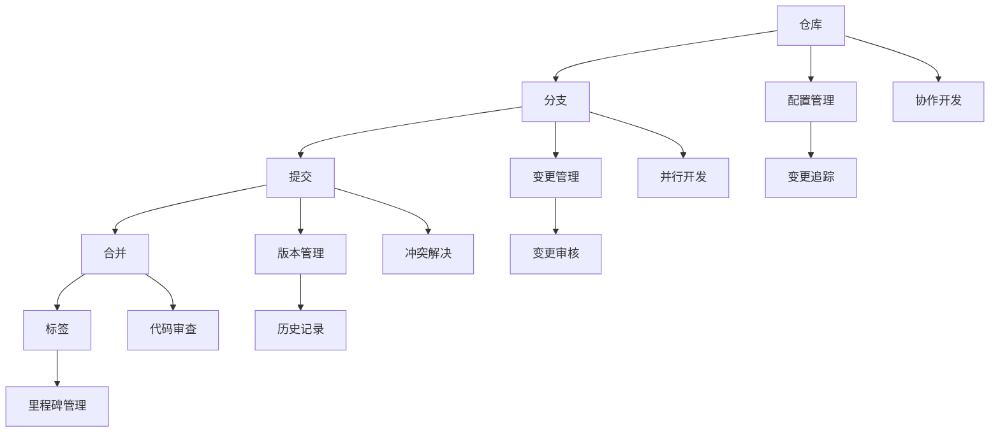
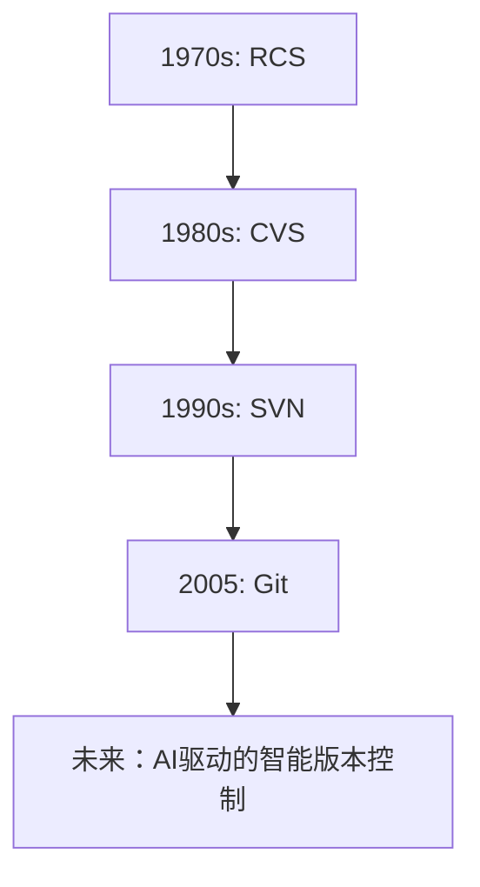
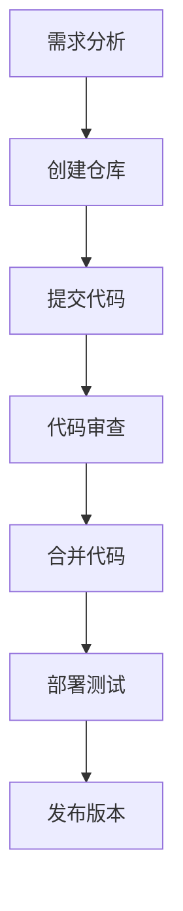
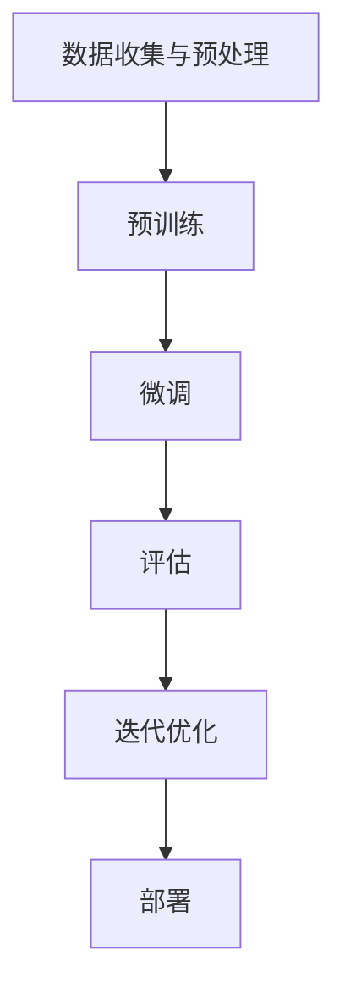
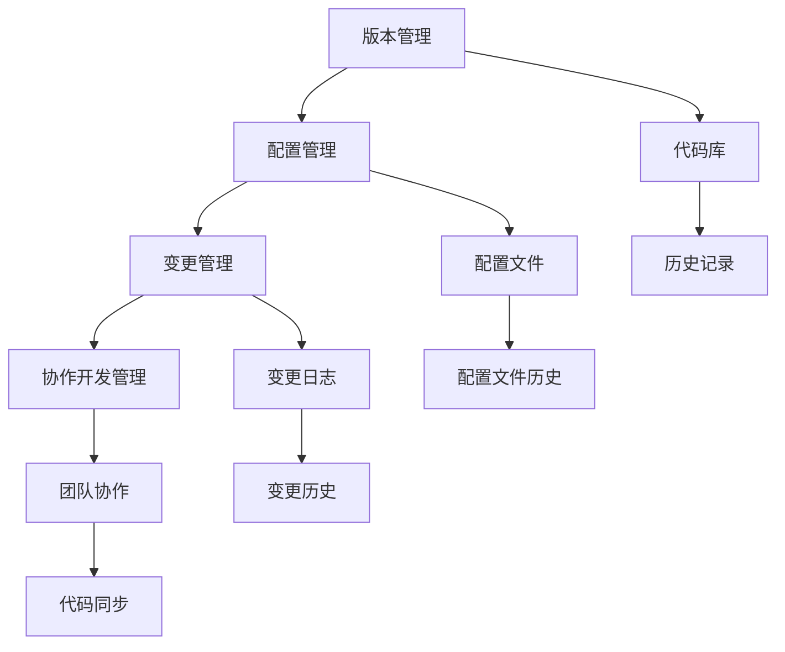

                 


### 文章标题：评测系统的版本控制：适应LLM迭代的管理策略

> 关键词：评测系统，版本控制，LLM迭代，管理策略，持续集成

> 摘要：
本文深入探讨了评测系统的版本控制策略，重点分析了如何适应大型语言模型（LLM）的快速迭代。通过详细阐述版本控制的基本概念、历史发展、重要性和基本流程，以及Git等版本控制工具的概述和基本操作，本文为理解和实施高效的版本控制策略提供了坚实的基础。随后，文章转向LLM的迭代过程和挑战，提出了适应LLM迭代的版本控制策略，包括多版本并行开发、版本回滚和迭代风险管理。最后，通过实际案例展示了这些策略的应用，并探讨了版本控制优化的方法和未来趋势。

---

### 第一部分：版本控制基础

#### 第1章：版本控制概述

**1.1 版本控制的基本概念**

版本控制是一种跟踪和管理文档、文件或任何类型的数据随时间变化的系统。它的核心概念包括版本管理、配置管理和变更管理。版本管理指的是跟踪文件或项目的不同版本；配置管理涉及管理项目配置文件的更改；变更管理则是确保变更的有序和可控。

**1.2 版本控制的历史与发展**

版本控制的历史可以追溯到1970年代的RCS，随后是1980年代的CVS和1990年代的SVN。2005年，Git的出现标志着版本控制技术的一次重大飞跃。Git是一种分布式版本控制系统，它的设计目标是为了支持快速、高效的分布式协作工作流程。未来，随着人工智能技术的发展，版本控制可能会更加智能化，实现更高效的变更追踪和协作。

**1.3 版本控制的重要性**

版本控制的重要性体现在多个方面。首先，它确保代码的完整性和一致性，防止数据丢失。其次，它支持团队协作与代码共享，提高开发效率和降低成本。此外，版本控制简化了代码回滚和错误追踪，使得开发过程更加顺畅。总之，版本控制是现代软件开发不可或缺的部分。

**1.4 版本控制的基本流程**

版本控制的基本流程包括以下步骤：需求分析、创建仓库、提交代码、代码审查、合并代码、部署测试和发布版本。每个步骤都需要仔细管理，以确保项目开发的顺利进行。

#### 第2章：版本控制工具

**2.1 Git概述**

Git是一种分布式版本控制系统，它由Linus Torvalds创建，用于Linux内核的开发。Git的特点包括快速、高效、灵活和可扩展。它的架构由多个核心组件组成，如对象存储库、引用系统和工作树。Git的工作流程包括克隆仓库、创建分支、提交变更、合并分支和解决冲突。

**2.2 Git的基本操作**

Git的基本操作包括安装Git、初始化仓库、添加文件、提交变更、创建分支、合并分支和解决冲突。这些操作是版本控制的基础，每个操作都有其特定的命令和步骤。

**2.3 其他版本控制工具简介**

除了Git，还有其他几种流行的版本控制工具，如SVN、Mercurial和Bazaar。SVN是一种集中式版本控制系统，适合小团队项目。Mercurial和Bazaar都是分布式版本控制系统，但与Git相比，它们在某些方面有不同的特点，适用于特定的开发场景。

---

### 第二部分：LLM迭代管理

#### 第3章：LLM迭代概述

**3.1 LLM的迭代过程**

大型语言模型（LLM）的迭代过程通常包括预训练、微调和评估等步骤。预训练是在大规模语料库上训练模型，使其具备基本的语言理解能力。微调是在特定任务上调整模型参数，以适应特定应用场景。评估则是通过测试集来衡量模型的表现。

**3.2 LLM迭代的目的与意义**

LLM迭代的目的是提高模型在特定任务上的表现，以实现更准确、更智能的应用。迭代的意义在于持续改进模型，使其能够适应不断变化的应用需求，提高用户体验。

**3.3 LLM迭代的挑战**

LLM迭代的挑战包括数据质量、计算资源、模型复杂度和协作效率等方面。如何处理大量数据、有效利用计算资源、简化模型调整过程和确保协作效率是迭代过程中需要解决的关键问题。

---

### 第三部分：版本控制策略

#### 第4章：版本控制策略

**4.1 版本控制策略的选择**

选择合适的版本控制策略对于LLM迭代至关重要。常见的策略包括多版本并行开发、版本回滚和迭代风险管理。多版本并行开发允许同时开发多个版本，提高开发效率；版本回滚则是恢复到先前稳定版本的方法；迭代风险管理则通过识别和应对潜在风险，确保迭代过程的顺利进行。

**4.2 多版本并行开发**

多版本并行开发允许开发团队同时处理多个版本，从而提高开发效率。这种方法的关键在于合理规划分支策略，确保不同版本的代码互不影响，同时避免资源浪费。

**4.3 版本回滚策略**

版本回滚策略是在迭代过程中出现问题时的一种应对措施。通过回滚到先前稳定版本，可以迅速恢复系统的正常运行，减少故障影响。制定有效的回滚策略需要综合考虑回滚的条件、步骤和风险。

**4.4 版本迭代风险管理**

版本迭代风险管理是确保迭代过程顺利进行的关键。通过识别潜在风险、评估风险影响和制定应对策略，可以减少迭代过程中的不确定性，提高项目成功率。

---

#### 第5章：适配LLM迭代的版本控制实践

**5.1 实践案例一：LLM预训练与微调的版本控制**

**5.1.1 案例背景**

本案例涉及一个LLM项目，目标是在特定任务上实现高准确率。项目团队使用Git进行版本控制，以管理预训练和微调过程中的代码和配置。

**5.1.2 版本控制策略**

团队采用多版本并行开发的策略，分别创建预训练分支和微调分支。预训练分支负责训练模型，微调分支则根据特定任务调整模型参数。

**5.1.3 案例总结**

通过合理使用Git，团队成功实现了预训练和微调的并行开发，提高了迭代效率。同时，版本回滚策略和迭代风险管理确保了项目在遇到问题时能够快速恢复。

**5.2 实践案例二：LLM在实际应用中的版本控制**

**5.2.1 案例背景**

本案例涉及一个LLM应用项目，目标是为用户提供高质量的问答服务。项目团队需要在不断迭代中优化模型性能。

**5.2.2 版本控制策略**

团队采用版本迭代风险管理策略，对每次迭代进行详细记录和评估。同时，采用Git的分支管理功能，确保不同迭代版本之间的代码互不影响。

**5.2.3 案例总结**

通过有效利用Git，团队在迭代过程中实现了快速迭代和高效协作。版本回滚策略和迭代风险管理帮助团队解决了多次迭代过程中出现的问题，确保了应用的稳定性和性能。

---

### 第四部分：版本控制优化

#### 第6章：版本控制优化方法

**6.1 版本控制优化的目标**

版本控制优化的目标是提高版本控制的效率、降低成本和提升用户体验。具体目标包括减少代码冲突、加快提交和拉取速度、简化分支管理和提高代码库的可维护性。

**6.2 代码库优化策略**

代码库优化策略包括压缩和整理代码库、删除无用文件、优化存储结构和提高访问速度等。这些策略有助于提高版本控制的效率和代码库的可读性。

**6.3 版本控制效率分析**

版本控制效率分析涉及评估版本控制的响应时间、提交速度和冲突解决时间等指标。通过分析这些指标，可以识别并解决影响效率的问题。

**6.4 版本控制工具性能评估**

版本控制工具性能评估包括对Git、SVN、Mercurial和Bazaar等工具的性能比较。通过评估工具的性能，可以选出最适合特定项目的版本控制工具。

---

#### 第7章：未来版本控制趋势

**7.1 版本控制技术的发展方向**

未来版本控制技术可能朝着智能化、自动化和高效化的方向发展。例如，利用人工智能技术进行变更追踪、冲突预防和自动化合并。

**7.2 智能化版本控制**

智能化版本控制将利用机器学习算法对变更历史进行分析，预测潜在的冲突和风险，并自动推荐解决方案。

**7.3 版本控制与持续集成/持续部署（CI/CD）的结合**

版本控制与CI/CD的结合将进一步提高开发效率和代码质量。通过自动化测试和部署，可以确保每次提交的代码都是可用的、稳定的。

---

### 附录

**附录A：版本控制常用命令**

- git clone <仓库地址>：克隆仓库
- git init：初始化本地仓库
- git add <文件名>：添加文件到暂存区
- git commit -m "<提交信息>"：提交变更
- git branch <分支名>：创建分支
- git checkout <分支名>：切换分支
- git merge <分支名>：合并分支
- git pull：从远程仓库拉取最新代码
- git push：将本地代码推送到远程仓库

**附录B：版本控制工具使用指南**

- Git使用指南
- SVN使用指南
- Mercurial使用指南
- Bazaar使用指南

**附录C：LLM迭代常见问题及解决方案**

- 数据质量问题：使用高质量的数据集和清洗工具
- 计算资源不足：优化算法和资源配置
- 模型复杂度问题：简化模型结构或采用分布式训练
- 协作效率问题：加强团队沟通和协作工具的使用

### 作者信息：

作者：AI天才研究院/AI Genius Institute & 禅与计算机程序设计艺术 /Zen And The Art of Computer Programming

---

### 第1章：评测系统的版本控制概述

**1.1 版本控制的基本概念**

版本控制是一种管理文档、文件或任何类型的数据随时间变化的系统。它的核心概念包括版本管理、配置管理和变更管理。

- **版本管理**：跟踪文件或项目的不同版本。
- **配置管理**：管理项目配置文件的更改。
- **变更管理**：确保变更的有序和可控。

**1.2 版本控制的历史与发展**

版本控制的历史可以追溯到1970年代的RCS，随后是1980年代的CVS和1990年代的SVN。2005年，Git的出现标志着版本控制技术的一次重大飞跃。

- **1970s: RCS**：RCS是第一种版本控制系统，用于管理源代码。
- **1980s: CVS**：CVS是一种集中式版本控制系统，用于项目管理。
- **1990s: SVN**：SVN继承了CVS的优点，并加入了一些新功能。
- **2005: Git**：Git是一种分布式版本控制系统，专为高速、高效的分布式协作工作流程设计。
- **未来：AI驱动的智能版本控制**：未来版本控制可能会更加智能化，利用AI技术进行变更追踪、冲突预防和自动化合并。

**1.3 版本控制的重要性**

版本控制的重要性体现在多个方面：

- **确保代码的完整性和一致性**：版本控制确保代码在开发和迭代过程中的完整性和一致性，防止数据丢失和错误传播。
- **支持团队协作与代码共享**：版本控制支持多人协作，提高开发效率和降低成本。
- **提高开发效率和降低成本**：版本控制简化了代码回滚和错误追踪，减少了开发过程中的重复劳动。
- **简化代码回滚和错误追踪**：版本控制使开发者能够快速回滚到先前稳定版本，并轻松追踪错误源。

**1.4 版本控制的基本流程**

版本控制的基本流程包括以下步骤：

- **需求分析**：确定项目需求和目标。
- **创建仓库**：初始化版本控制仓库。
- **提交代码**：将代码提交到仓库。
- **代码审查**：对提交的代码进行审查。
- **合并代码**：将审查通过的代码合并到主分支。
- **部署测试**：在测试环境中部署代码进行测试。
- **发布版本**：将测试通过的代码发布到生产环境。

---

### 第2章：评测系统的版本控制工具

**2.1 Git概述**

Git是一种分布式版本控制系统，由Linus Torvalds创建，用于Linux内核的开发。Git的特点包括：

- **快速**：Git的设计目标是快速处理大型项目。
- **高效**：Git使用哈希算法存储数据，使得数据检索和操作更加高效。
- **灵活**：Git支持多种工作流程，适用于不同规模和类型的开发项目。
- **可扩展**：Git允许开发者自定义和扩展其功能。

**2.2 Git的基本操作**

Git的基本操作包括安装Git、初始化仓库、添加文件、提交变更、创建分支、合并分支和解决冲突。

- **安装Git**：在操作系统上安装Git，可以通过包管理器或手动下载安装包进行。
- **初始化仓库**：使用`git init`命令创建一个新的Git仓库。
- **添加文件**：使用`git add <文件名>`命令将文件添加到暂存区。
- **提交变更**：使用`git commit -m "<提交信息>"`命令将暂存区的文件提交到仓库。
- **创建分支**：使用`git branch <分支名>`命令创建一个新的分支。
- **合并分支**：使用`git merge <分支名>`命令将分支合并到当前分支。
- **解决冲突**：在合并分支时，如果出现冲突，需要手动解决冲突文件，然后使用`git add <文件名>`将解决后的文件添加到暂存区，最后使用`git commit`提交解决后的文件。

**2.3 其他版本控制工具简介**

除了Git，还有一些其他的版本控制工具，如SVN、Mercurial和Bazaar。

- **SVN**：SVN是一种集中式版本控制系统，适合小团队项目。其特点是简单易用，但性能相对较低。
- **Mercurial**：Mercurial是一种分布式版本控制系统，与Git类似，但有一些不同的设计理念。它适合需要快速提交和较低的延迟的项目。
- **Bazaar**：Bazaar也是一种分布式版本控制系统，其特点是易于使用和跨平台兼容。它适合需要灵活分支和合并的项目。

---

### 第3章：LLM迭代概述

**3.1 LLM的迭代过程**

大型语言模型（LLM）的迭代过程通常包括以下步骤：

- **预训练**：在大量数据集上训练模型，使其具备基本的语言理解能力。预训练通常使用无监督学习方法，如自编码器或转换器架构。
- **数据预处理**：对训练数据集进行清洗、预处理和增强，以提高模型的性能。
- **微调**：在特定任务上调整模型参数，以适应特定应用场景。微调通常使用有监督学习方法，如分类或序列标注。
- **评估**：在测试集上评估模型的表现，包括准确性、速度和泛化能力等指标。
- **迭代优化**：根据评估结果对模型进行调整和优化，以提高模型性能。

**3.2 LLM迭代的目的与意义**

LLM迭代的目的是提高模型在特定任务上的表现，以实现更准确、更智能的应用。迭代的意义在于：

- **持续改进模型**：通过不断迭代，可以逐步优化模型，提高其在各种任务上的性能。
- **适应变化的需求**：随着应用场景的变化，迭代可以使模型适应新的需求，提供更优质的服务。
- **提高用户体验**：通过不断迭代，可以提高模型在实际应用中的表现，从而提高用户体验。

**3.3 LLM迭代的挑战**

LLM迭代过程中可能面临以下挑战：

- **数据质量**：高质量的数据是模型迭代的基础。数据质量差会导致模型性能下降。
- **计算资源**：迭代过程需要大量的计算资源，特别是预训练阶段。如何高效利用计算资源是关键问题。
- **模型复杂度**：随着迭代次数的增加，模型可能变得过于复杂，导致训练时间过长和泛化能力下降。
- **协作效率**：迭代过程中，团队协作效率对项目成功至关重要。如何确保团队成员高效协作是挑战之一。

---

### 第4章：版本控制策略

**4.1 版本控制策略的选择**

选择合适的版本控制策略对于LLM迭代至关重要。以下是一些常见的版本控制策略：

- **多版本并行开发**：允许同时开发多个版本，提高开发效率。适用于需要快速迭代的项目。
- **版本回滚策略**：在迭代过程中，如果出现问题，可以回滚到先前稳定版本。适用于需要确保系统稳定性的项目。
- **迭代风险管理**：通过识别和应对潜在风险，确保迭代过程顺利进行。适用于风险较高的项目。

**4.2 多版本并行开发**

多版本并行开发允许开发团队同时处理多个版本，从而提高开发效率。这种方法的关键在于：

- **分支策略**：合理规划分支策略，确保不同版本的代码互不影响。
- **代码库维护**：定期合并分支，保持代码库的一致性和整洁。
- **协作与沟通**：加强团队协作与沟通，确保各版本的开发进度和质量。

**4.3 版本回滚策略**

版本回滚策略是在迭代过程中出现问题时的一种应对措施。制定有效的回滚策略需要：

- **回滚条件**：明确回滚的条件，如出现严重故障或性能下降。
- **回滚步骤**：制定详细的回滚步骤，确保回滚过程顺利进行。
- **风险评估**：评估回滚的风险，确保回滚不会导致更严重的问题。

**4.4 版本迭代风险管理**

版本迭代风险管理是确保迭代过程顺利进行的关键。以下是一些关键步骤：

- **识别风险**：识别迭代过程中可能出现的风险，如数据质量差、计算资源不足和模型复杂度高等。
- **评估风险**：评估风险的影响和可能性，确定风险等级。
- **应对策略**：制定应对策略，如调整算法、增加计算资源或简化模型。
- **监控与反馈**：在迭代过程中，持续监控风险并收集反馈，调整策略。

---

### 第5章：适配LLM迭代的版本控制实践

**5.1 实践案例一：LLM预训练与微调的版本控制**

**5.1.1 案例背景**

本案例涉及一个LLM项目，目标是在特定任务上实现高准确率。项目团队使用Git进行版本控制，以管理预训练和微调过程中的代码和配置。

**5.1.2 版本控制策略**

团队采用多版本并行开发的策略，分别创建预训练分支和微调分支。预训练分支负责训练模型，微调分支则根据特定任务调整模型参数。

**5.1.3 案例总结**

通过合理使用Git，团队成功实现了预训练和微调的并行开发，提高了迭代效率。同时，版本回滚策略和迭代风险管理确保了项目在遇到问题时能够快速恢复。

**5.2 实践案例二：LLM在实际应用中的版本控制**

**5.2.1 案例背景**

本案例涉及一个LLM应用项目，目标是为用户提供高质量的问答服务。项目团队需要在不断迭代中优化模型性能。

**5.2.2 版本控制策略**

团队采用版本迭代风险管理策略，对每次迭代进行详细记录和评估。同时，采用Git的分支管理功能，确保不同迭代版本之间的代码互不影响。

**5.2.3 案例总结**

通过有效利用Git，团队在迭代过程中实现了快速迭代和高效协作。版本回滚策略和迭代风险管理帮助团队解决了多次迭代过程中出现的问题，确保了应用的稳定性和性能。

---

### 第6章：版本控制优化方法

**6.1 版本控制优化的目标**

版本控制优化的目标包括：

- **提高效率**：减少代码冲突、加快提交和拉取速度、简化分支管理。
- **降低成本**：减少不必要的代码变更和重复劳动。
- **提升用户体验**：提供更简洁、直观的操作界面和更好的错误提示。

**6.2 代码库优化策略**

代码库优化策略包括：

- **压缩和整理代码库**：删除无用文件、优化存储结构和减少冗余代码。
- **代码库维护**：定期合并分支、清理历史记录和优化代码库结构。
- **性能调优**：优化Git存储库的性能，如使用缓存和压缩算法。

**6.3 版本控制效率分析**

版本控制效率分析包括：

- **响应时间**：评估Git操作的响应时间，如克隆、提交、拉取和合并等。
- **提交速度**：分析代码提交的速度和频率，识别瓶颈。
- **冲突解决时间**：衡量冲突解决的效率和时长。

**6.4 版本控制工具性能评估**

版本控制工具性能评估包括：

- **Git与其他工具的比较**：评估Git与其他版本控制工具（如SVN、Mercurial和Bazaar）的性能差异。
- **工具特性分析**：分析不同版本控制工具的特点和优势，如分布式存储、分支管理和协同工作功能。
- **实际应用测试**：在实际项目中测试版本控制工具的性能，如处理大型项目的能力和并发操作的性能。

---

### 第7章：未来版本控制趋势

**7.1 版本控制技术的发展方向**

未来版本控制技术可能朝着以下方向发展：

- **智能化**：利用人工智能技术进行变更追踪、冲突预防和自动化合并。
- **自动化**：实现更自动化的版本控制流程，减少人工干预。
- **高效化**：优化版本控制的性能，提高操作速度和稳定性。

**7.2 智能化版本控制**

智能化版本控制将利用机器学习算法对变更历史进行分析，预测潜在的冲突和风险，并自动推荐解决方案。例如：

- **冲突预测**：通过分析历史数据，预测哪些变更可能导致冲突。
- **自动化合并**：自动解决简单的合并冲突，减少人工干预。
- **风险评估**：利用机器学习模型评估变更的风险，提供决策支持。

**7.3 版本控制与持续集成/持续部署（CI/CD）的结合**

版本控制与CI/CD的结合将进一步提高开发效率和代码质量。例如：

- **自动化测试**：将版本控制与自动化测试集成，确保每次提交的代码都是可用的、稳定的。
- **持续部署**：自动部署经过测试的代码到生产环境，减少人工干预。
- **反馈循环**：将测试结果和用户反馈集成到版本控制流程中，持续改进代码质量。

---

### 附录

**附录A：版本控制常用命令**

- `git clone <仓库地址>`：克隆仓库
- `git init`：初始化本地仓库
- `git add <文件名>`：添加文件到暂存区
- `git commit -m "<提交信息>"`：提交变更
- `git branch <分支名>`：创建分支
- `git checkout <分支名>`：切换分支
- `git merge <分支名>`：合并分支
- `git pull`：从远程仓库拉取最新代码
- `git push`：将本地代码推送到远程仓库

**附录B：版本控制工具使用指南**

- **Git使用指南**：详细介绍Git的安装、配置和基本操作。
- **SVN使用指南**：介绍SVN的基本概念、安装和使用方法。
- **Mercurial使用指南**：介绍Mercurial的安装、配置和基本操作。
- **Bazaar使用指南**：介绍Bazaar的安装、配置和基本操作。

**附录C：LLM迭代常见问题及解决方案**

- **数据质量问题**：使用高质量的数据集和清洗工具。
- **计算资源不足**：优化算法和资源配置。
- **模型复杂度问题**：简化模型结构或采用分布式训练。
- **协作效率问题**：加强团队沟通和协作工具的使用。

### 作者信息：

作者：AI天才研究院/AI Genius Institute & 禅与计算机程序设计艺术 /Zen And The Art of Computer Programming

---

### 第1章：评测系统的版本控制概述

#### 1.1 版本控制的基本概念

版本控制是一种管理文档、文件或任何类型的数据随时间变化的系统。它旨在确保数据的完整性和一致性，并支持团队协作与代码共享。版本控制的基本概念包括：

- **版本管理**：跟踪文件或项目的不同版本。
- **配置管理**：管理项目配置文件的更改。
- **变更管理**：确保变更的有序和可控。

版本控制系统（如Git）提供了一系列功能，如分支管理、合并、冲突解决和代码审查，以支持这些概念。以下是版本控制系统的一些核心组件：

1. **仓库**：存储项目文件和历史的中央位置。
2. **分支**：项目的独立版本，允许开发者在不同环境下独立工作。
3. **提交**：将更改保存到仓库的过程。
4. **合并**：将两个或多个分支的更改合并到一个分支中。
5. **标签**：用于标记特定版本或里程碑的引用。

版本控制的核心概念和联系可以用以下Mermaid流程图表示：



#### 1.2 版本控制的历史与发展

版本控制的历史可以追溯到20世纪70年代的RCS（修订控制系统）。RCS是第一种版本控制系统，主要用于跟踪源代码的变更。随着软件开发项目的复杂性增加，RCS逐渐暴露出其局限性。

在1980年代，CVS（Concurrent Versions System）成为流行的版本控制系统。CVS是一种集中式版本控制系统，它引入了分支和标签的概念，并提供了更丰富的命令集。

1990年代，SVN（Subversion）成为CVS的替代品。SVN在CVS的基础上进行了改进，支持更多的特性，如锁机制和原子事务。SVN在企业环境中得到了广泛应用。

2005年，Git（GNU Interactive Tools）的诞生标志着版本控制技术的一次重大飞跃。Git是一种分布式版本控制系统，它的设计目标是支持快速、高效的分布式协作工作流程。Git的核心组件包括：

1. **对象存储库**：存储项目文件的唯一版本。
2. **引用系统**：跟踪分支和标签的状态。
3. **工作树**：开发者在本地的文件系统中的工作副本。

Git的优点包括：

- **分布式设计**：每个开发者都有完整的代码库，可以离线工作。
- **高效的数据存储**：使用哈希算法存储文件内容，提高数据检索和备份速度。
- **强大的分支和合并功能**：支持快速、灵活的分支和合并操作。
- **丰富的插件和工具**：有许多第三方插件和工具可以扩展Git的功能。

未来，随着人工智能技术的发展，版本控制可能会变得更加智能化。例如，通过机器学习算法预测潜在的冲突和变更趋势，自动推荐最佳合并策略。



#### 1.3 版本控制的重要性

版本控制是现代软件开发不可或缺的部分，其重要性体现在以下几个方面：

- **确保代码的完整性和一致性**：版本控制确保项目的历史记录是完整的，每次变更都被记录下来，从而避免了数据丢失和错误传播。
- **支持团队协作与代码共享**：版本控制使团队成员可以同时工作，并提供了一个统一的代码库，从而提高了开发效率。
- **提高开发效率和降低成本**：版本控制简化了代码回滚和错误追踪，减少了开发过程中的重复劳动，从而提高了开发效率并降低了成本。
- **简化代码回滚和错误追踪**：通过版本控制，开发者可以轻松回滚到先前稳定版本，快速恢复系统的正常运行，并简化错误追踪。

版本控制的基本流程包括以下步骤：

1. **需求分析**：确定项目的需求和目标。
2. **创建仓库**：初始化版本控制仓库。
3. **提交代码**：将代码提交到仓库。
4. **代码审查**：对提交的代码进行审查。
5. **合并代码**：将审查通过的代码合并到主分支。
6. **部署测试**：在测试环境中部署代码进行测试。
7. **发布版本**：将测试通过的代码发布到生产环境。

版本控制的基本流程可以用以下Mermaid流程图表示：



#### 1.4 版本控制的基本流程

版本控制的基本流程包括以下几个关键步骤：

1. **需求分析**：
   - 确定项目的需求和目标。
   - 定义项目范围和功能。

2. **创建仓库**：
   - 使用版本控制系统初始化一个新仓库。
   - 仓库可以是集中式或分布式的，取决于团队的需求和规模。

3. **提交代码**：
   - 开发者将他们的代码更改提交到仓库。
   - 每次提交都应该附有描述性信息，以便后续追踪。

4. **代码审查**：
   - 对提交的代码进行审查，确保代码质量符合标准。
   - 审查可以是正式的代码审查，也可以是轻量级的代码走查。

5. **合并代码**：
   - 将审查通过的代码合并到主分支或其他分支。
   - 合并过程可能涉及冲突解决，特别是在多个开发者同时修改同一文件时。

6. **部署测试**：
   - 在测试环境中部署代码，运行测试套件，确保代码的功能和性能符合预期。
   - 测试可以包括单元测试、集成测试和性能测试。

7. **发布版本**：
   - 将经过测试且无错误的代码发布到生产环境。
   - 发布可以是完全更新（Full Update）或增量更新（Incremental Update）。

每个步骤都需要仔细管理和跟踪，以确保项目开发过程中的透明度和可追溯性。以下是版本控制基本流程的Mermaid流程图：


通过上述流程，版本控制可以帮助团队更好地管理代码变更，提高协作效率，并确保项目的稳定性和可维护性。

---

### 第2章：评测系统的版本控制工具

#### 2.1 Git概述

Git是一种分布式版本控制系统，由Linus Torvalds创建，用于Linux内核的开发。Git的特点包括：

- **快速**：Git专为高速处理大量数据而设计，可以在几秒钟内完成提交、拉取和推送操作。
- **高效**：Git使用哈希算法存储数据，使得数据检索和备份更加高效。
- **灵活**：Git支持多种工作流程，可以适应不同规模和类型的开发项目。
- **可扩展**：Git允许开发者自定义和扩展其功能，通过插件和工具增加新功能。

Git的架构包括以下几个核心组件：

- **对象存储库**：存储项目文件和历史的唯一版本，包括 blobs（二进制对象）、commits（提交对象）和 tags（标签对象）。
- **引用系统**：跟踪分支和标签的状态，如 master、dev 和 release。
- **工作树**：开发者在本地的文件系统中的工作副本，包括暂存区域和提交历史。
- **索引**：暂存区域，用于存储即将提交的文件更改。

Git的工作流程包括以下步骤：

1. **克隆仓库**：使用`git clone`命令将远程仓库克隆到本地。
2. **创建分支**：使用`git branch`命令创建一个新的分支。
3. **提交更改**：使用`git add`和`git commit`命令将文件添加到暂存区并提交到仓库。
4. **合并分支**：使用`git merge`命令将一个分支的更改合并到另一个分支。
5. **解决冲突**：在合并分支时，如果出现冲突，需要手动解决，然后使用`git add`和`git commit`命令提交解决后的文件。
6. **推送和拉取**：使用`git push`和`git pull`命令将本地更改推送到远程仓库或从远程仓库拉取最新更改。

Git的基本操作包括：

- **安装Git**：在操作系统上安装Git，可以通过包管理器或手动下载安装包进行。
- **初始化仓库**：使用`git init`命令初始化一个新的Git仓库。
- **克隆仓库**：使用`git clone <仓库地址>`命令克隆一个远程仓库到本地。
- **添加文件**：使用`git add <文件名>`命令将文件添加到暂存区。
- **提交变更**：使用`git commit -m "<提交信息>"`命令提交暂存区的文件到仓库。
- **创建分支**：使用`git branch <分支名>`命令创建一个新的分支。
- **切换分支**：使用`git checkout <分支名>`命令切换到指定分支。
- **合并分支**：使用`git merge <分支名>`命令将指定分支的更改合并到当前分支。
- **解决冲突**：在合并分支时，如果出现冲突，需要手动编辑冲突文件，然后使用`git add <文件名>`和`git commit`命令解决冲突。
- **推送代码**：使用`git push`命令将本地分支的更改推送到远程仓库。
- **拉取代码**：使用`git pull`命令从远程仓库拉取最新更改。

以下是一个简单的Git操作示例：

```bash
# 克隆仓库
git clone https://github.com/user/repository.git

# 初始化仓库
cd repository.git
git init

# 添加文件
echo "Hello, World!" > hello.txt
git add hello.txt

# 提交变更
git commit -m "Add hello.txt"

# 创建分支
git branch feature-branch

# 切换到分支
git checkout feature-branch

# 修改文件
echo "Hello, Git!" > hello.txt
git add hello.txt
git commit -m "Update hello.txt in feature-branch"

# 合并分支
git checkout master
git merge feature-branch

# 解决冲突
git status
git add hello.txt
git commit -m "Merge feature-branch into master"

# 推送代码
git push origin master
```

#### 2.2 Git的基本操作

Git的基本操作包括安装Git、初始化仓库、添加文件、提交变更、创建分支、合并分支和解决冲突等步骤。

- **安装Git**：在大多数操作系统上，可以使用包管理器安装Git。例如，在Ubuntu上，可以使用以下命令：

  ```bash
  sudo apt-get update
  sudo apt-get install git
  ```

  在Windows上，可以从Git官方网站下载安装程序并安装。

- **初始化仓库**：在新的目录中，使用`git init`命令初始化一个新的Git仓库。

  ```bash
  mkdir my-repository
  cd my-repository
  git init
  ```

- **添加文件**：将文件添加到Git仓库，首先需要使用`git add`命令。这会将文件添加到暂存区域。

  ```bash
  echo "Hello, World!" > hello.txt
  git add hello.txt
  ```

- **提交变更**：使用`git commit`命令提交暂存区域的文件到仓库。每次提交都需要提供一条描述性信息。

  ```bash
  git commit -m "Initial commit"
  ```

- **创建分支**：使用`git branch`命令创建一个新的分支。

  ```bash
  git branch feature-branch
  ```

- **切换分支**：使用`git checkout`命令切换到指定的分支。

  ```bash
  git checkout feature-branch
  ```

- **合并分支**：使用`git merge`命令将一个分支的更改合并到另一个分支。

  ```bash
  git checkout master
  git merge feature-branch
  ```

- **解决冲突**：在合并分支时，如果出现冲突，需要手动编辑冲突文件，然后使用`git add`和`git commit`命令解决冲突。

  ```bash
  git status
  git add conflicted-file.txt
  git commit -m "Resolved conflicts"
  ```

以下是一个简单的Git操作示例，展示了如何初始化仓库、添加文件、提交变更、创建分支、合并分支和解决冲突：

```bash
# 初始化仓库
mkdir my-repository
cd my-repository
git init

# 添加文件
echo "Hello, World!" > hello.txt
git add hello.txt
git commit -m "Initial commit"

# 创建分支
git branch feature-branch

# 切换到分支
git checkout feature-branch

# 修改文件
echo "Hello, Git!" > hello.txt
git add hello.txt
git commit -m "Update hello.txt in feature-branch"

# 合并分支
git checkout master
git merge feature-branch
git status

# 解决冲突
git add conflicted-file.txt
git commit -m "Resolved conflicts"

# 推送代码
git push origin master
```

通过这些基本操作，开发者可以有效地管理代码变更，确保代码库的一致性和可维护性。

#### 2.3 其他版本控制工具简介

除了Git，还有其他流行的版本控制工具，如SVN、Mercurial和Bazaar。每种工具都有其特点和适用场景。

- **SVN**：Subversion是一种集中式版本控制系统，它使用中央服务器存储代码库。SVN的优点是简单易用，适合小团队和初学者。然而，由于其集中式架构，SVN在处理分布式协作和大量数据时可能不如Git高效。以下是一个简单的SVN操作示例：

  ```bash
  svn checkout https://svn.example.com/repository/my-repository
  svn add hello.txt
  svn commit -m "Add hello.txt"
  svn merge feature-branch
  svn resolve
  svn commit -m "Resolved merge conflicts"
  ```

- **Mercurial**：Mercurial是一种分布式版本控制系统，类似于Git，但设计理念有所不同。Mercurial的优点是易于使用和跨平台兼容，适用于需要快速提交和较低延迟的项目。以下是一个简单的Mercurial操作示例：

  ```bash
  hg clone https://hg.example.com/my-repository
  hg add hello.txt
  hg commit -m "Add hello.txt"
  hg branch feature-branch
  hg checkout feature-branch
  hg merge master
  hg resolve
  hg commit -m "Resolved merge conflicts"
  hg push
  ```

- **Bazaar**：Bazaar也是一种分布式版本控制系统，它提供了灵活的分支管理和强大的协同工作功能。Bazaar的优点是易于使用和跨平台兼容，适用于需要灵活分支和合并的项目。以下是一个简单的Bazaar操作示例：

  ```bash
  bzr branch https://bzr.example.com/my-repository
  bzr add hello.txt
  bzr commit -m "Add hello.txt"
  bzr branch feature-branch
  bzr checkout feature-branch
  bzr merge master
  bzr resolve
  bzr commit -m "Resolved merge conflicts"
  bzr push
  ```

虽然Git是目前最受欢迎的版本控制工具，但了解其他版本控制工具的特点和操作对于开发者来说仍然非常有用。根据项目的需求和团队的工作方式，可以选择最适合的工具。

---

### 第3章：LLM迭代概述

#### 3.1 LLM的迭代过程

大型语言模型（LLM）的迭代过程通常包括以下几个关键步骤：

1. **数据收集与预处理**：首先，收集大量的文本数据，这些数据可以是公共数据集或自定义数据集。然后，对数据进行清洗、去重、分词、标注等预处理操作，以便模型能够更好地理解和学习语言。

2. **预训练**：在预处理后的数据集上，使用预训练算法（如GPT、BERT等）对模型进行预训练。预训练的目的是让模型具备基本的语言理解能力，如语义理解、语法解析和文本生成。

3. **微调**：在预训练的基础上，针对特定的应用场景，对模型进行微调。微调通常在更小、更精确的数据集上进行，以调整模型参数，使其更好地适应特定任务。

4. **评估**：在测试集上评估模型的性能，包括准确性、速度和泛化能力等指标。评估结果用于指导后续的模型优化和迭代。

5. **迭代优化**：根据评估结果对模型进行调整和优化，包括调整超参数、优化模型结构或引入新的训练策略。这一过程可能需要多次迭代，直到模型性能达到预期。

6. **部署**：将优化后的模型部署到生产环境中，供用户使用。部署过程中可能需要考虑模型的性能、稳定性和安全性。

LLM迭代过程中的每一步都需要精心设计和执行，以确保模型的质量和性能。以下是LLM迭代过程的Mermaid流程图：



#### 3.2 LLM迭代的目的与意义

LLM迭代的目的和意义主要体现在以下几个方面：

1. **提高模型性能**：通过不断迭代，模型可以逐步优化，提高在特定任务上的性能。例如，提高文本生成、语义理解和问答等任务的表现。

2. **适应新需求**：随着应用场景的变化，LLM需要不断适应新的需求。迭代过程可以帮助模型学习新的语言模式、适应新的数据分布，从而提供更准确、更智能的应用。

3. **优化用户体验**：通过迭代，LLM可以更好地理解用户需求，提供更自然、更流畅的语言交互体验。这有助于提高用户满意度和使用粘性。

4. **发现和修复问题**：迭代过程中，开发者可以及时发现和修复模型中的问题，如过拟合、泛化能力差等。这有助于提高模型的稳定性和可靠性。

5. **持续改进**：迭代是一种持续改进的过程，开发者可以不断优化模型架构、训练策略和评估方法，从而推动LLM技术的发展。

#### 3.3 LLM迭代的挑战

LLM迭代过程中可能会面临以下挑战：

1. **数据质量**：高质量的数据是模型迭代的基础。如果数据存在噪声、错误或偏差，模型可能无法学习到正确的知识，从而导致性能下降。

2. **计算资源**：预训练和微调过程需要大量的计算资源。特别是在大规模数据集上训练模型时，计算资源可能成为瓶颈。如何高效利用计算资源是关键问题。

3. **模型复杂度**：随着迭代次数的增加，模型可能变得过于复杂。这不仅会增加训练时间，还可能导致过拟合和泛化能力下降。简化模型结构或采用分布式训练是解决这一问题的方法。

4. **协作效率**：迭代过程中，团队成员需要紧密协作。如何确保团队成员高效沟通、协同工作，是一个重要的挑战。

5. **版本控制**：在迭代过程中，如何管理模型的多个版本，确保代码和配置的一致性，也是一个难题。有效的版本控制策略是确保迭代顺利进行的关键。

#### 3.4 LLM迭代的最佳实践

为了确保LLM迭代过程顺利进行，以下是一些最佳实践：

1. **数据管理**：建立规范的数据管理流程，确保数据的质量、安全和可追溯性。使用数据清洗和预处理工具，提高数据质量。

2. **资源调度**：合理调度计算资源，确保模型训练和迭代过程的高效运行。采用分布式训练和异构计算架构，提高资源利用率。

3. **模型管理**：建立模型管理机制，包括模型版本控制、文档记录和性能评估。使用版本控制系统（如Git）管理模型的多个版本，确保代码和配置的一致性。

4. **团队协作**：建立高效的团队协作机制，包括定期会议、代码审查和反馈机制。使用协作工具（如Slack、JIRA等）提高团队沟通和协作效率。

5. **持续集成/持续部署（CI/CD）**：建立CI/CD流程，确保每次迭代后的代码都是可用的、稳定的。自动化测试和部署过程，减少手动操作和人为错误。

6. **监控与反馈**：建立监控机制，实时跟踪模型性能和资源使用情况。及时收集用户反馈，快速响应和解决问题。

通过遵循这些最佳实践，开发者可以确保LLM迭代过程的高效、稳定和成功。

---

### 第4章：版本控制策略

#### 4.1 版本控制策略的选择

在LLM迭代过程中，选择合适的版本控制策略至关重要。以下是一些常见的版本控制策略及其适用场景：

1. **多版本并行开发**：适用于需要同时处理多个版本的迭代项目。这种方法允许团队在不同的分支上独立开发，从而提高开发效率和并行性。在预训练和微调阶段，团队可以同时进行不同版本的实验和优化。

   - **优势**：提高开发效率，加快迭代速度。
   - **适用场景**：大规模项目，需要并行开发的团队。

2. **版本回滚策略**：适用于在迭代过程中出现问题时快速恢复到稳定版本。通过定期备份和版本记录，团队可以迅速回滚到先前版本，减少故障影响。

   - **优势**：快速恢复，减少故障影响。
   - **适用场景**：需要确保系统稳定性的项目。

3. **迭代风险管理**：适用于需要对迭代过程进行风险管理的项目。通过识别潜在风险、评估风险影响和制定应对策略，团队可以确保迭代过程顺利进行。

   - **优势**：减少风险，提高项目成功率。
   - **适用场景**：风险较高的项目，需要严格管理迭代过程的团队。

4. **多分支策略**：适用于需要在不同分支上管理多个迭代版本的项目。这种方法允许团队在主分支和不同特性分支上进行开发，同时保持代码库的一致性和整洁。

   - **优势**：灵活管理多个迭代版本，保持代码库整洁。
   - **适用场景**：需要管理多个迭代版本的项目。

5. **持续集成/持续部署（CI/CD）**：适用于需要自动化测试和部署的迭代过程。CI/CD流程确保每次提交的代码都是可用的、稳定的，从而提高开发效率和代码质量。

   - **优势**：自动化测试和部署，提高开发效率。
   - **适用场景**：需要频繁迭代和自动化测试的项目。

选择合适的版本控制策略需要根据项目的具体需求和团队的工作方式。以下是一个简单的决策框架：

| 策略            | 优势                                                      | 适用场景                                                       |
|-----------------|-----------------------------------------------------------|--------------------------------------------------------------|
| 多版本并行开发   | 提高开发效率，加快迭代速度                             | 大规模项目，需要并行开发的团队                               |
| 版本回滚策略     | 快速恢复，减少故障影响                                 | 需要确保系统稳定性的项目                                   |
| 迭代风险管理     | 减少风险，提高项目成功率                               | 风险较高的项目，需要严格管理迭代过程的团队                   |
| 多分支策略       | 灵活管理多个迭代版本，保持代码库整洁                   | 需要管理多个迭代版本的项目                                 |
| 持续集成/持续部署 | 自动化测试和部署，提高开发效率                         | 需要频繁迭代和自动化测试的项目                             |

通过合理选择和实施版本控制策略，团队可以确保LLM迭代过程的高效、稳定和成功。

#### 4.2 多版本并行开发

多版本并行开发是一种常见的版本控制策略，特别适用于需要同时处理多个版本的迭代项目。这种方法允许团队在不同的分支上独立开发，从而提高开发效率和并行性。以下是多版本并行开发的详细步骤和应用案例。

**多版本并行开发的步骤：**

1. **创建主分支**：首先，创建一个主分支（通常命名为`master`或`main`），用于存储项目的稳定版本。

2. **创建特性分支**：在主分支的基础上，创建多个特性分支，用于开发不同的功能或版本。每个特性分支都有自己的提交历史，独立于主分支。

   ```bash
   git checkout -b feature-A
   git checkout -b feature-B
   git checkout -b feature-C
   ```

3. **开发特性分支**：团队在各自的特性分支上开发新功能或改进。每个分支都可以独立提交代码，进行代码审查和合并。

4. **代码审查和合并**：完成开发后，团队将特性分支的代码合并到主分支或其他特性分支。合并过程中可能需要解决冲突。

   ```bash
   git checkout master
   git merge feature-A
   git merge feature-B
   git merge feature-C
   ```

5. **部署和测试**：将合并后的代码部署到测试环境中，运行测试套件，确保功能正确且无兼容性问题。

6. **发布版本**：经过测试和验证，将主分支的代码发布到生产环境。

**多版本并行开发的应用案例：**

假设一个团队正在开发一个智能问答系统，需要在不同的版本中实现不同的功能。

1. **主分支（master）**：存储项目的稳定版本，目前包含基本的问答功能。

2. **特性分支（feature-voice）**：开发语音交互功能。开发过程中，团队可以在特性分支上提交代码，进行代码审查和测试。

   ```bash
   git checkout -b feature-voice
   # 在feature-voice分支上开发语音交互功能
   git add voice_module.py
   git commit -m "Add voice interaction feature"
   git push origin feature-voice
   ```

3. **特性分支（feature-chatbot）**：开发聊天机器人功能。同样，团队可以在特性分支上独立开发。

   ```bash
   git checkout -b feature-chatbot
   # 在feature-chatbot分支上开发聊天机器人功能
   git add chatbot_module.py
   git commit -m "Add chatbot feature"
   git push origin feature-chatbot
   ```

4. **合并和部署**：完成开发后，团队将特性分支的代码合并到主分支，并部署到测试环境中进行测试。

   ```bash
   git checkout master
   git merge feature-voice
   git merge feature-chatbot
   git push origin master
   # 部署到测试环境，运行测试套件
   ```

5. **发布版本**：测试通过后，将主分支的代码发布到生产环境。

   ```bash
   # 部署到生产环境
   ```

多版本并行开发的优势在于：

- **提高开发效率**：团队可以在不同的特性分支上同时开发，提高并行性。
- **代码隔离**：每个特性分支独立提交代码，减少代码冲突。
- **灵活管理**：可以根据需求灵活创建、合并和删除特性分支。

通过多版本并行开发，团队可以更好地管理LLM迭代过程，提高项目的开发效率和稳定性。

#### 4.3 版本回滚策略

版本回滚策略是一种在迭代过程中出现问题时快速恢复到稳定版本的方法。通过定期备份和版本记录，团队可以在出现故障或性能下降时迅速回滚到先前版本，减少故障影响。以下是版本回滚策略的详细步骤和应用案例。

**版本回滚策略的步骤：**

1. **备份**：在每次提交或发布版本时，自动备份仓库的当前状态。备份可以保存在本地或远程存储中，以确保数据的安全。

   ```bash
   git commit -m "Backup current state"
   git push
   ```

2. **记录版本**：在每次备份时，记录版本信息，包括提交哈希值、提交时间和提交描述。这有助于在需要回滚时快速定位到正确的版本。

3. **发现故障**：在迭代过程中，如果发现系统出现故障或性能下降，立即进行故障排查。

4. **回滚**：确定需要回滚的版本后，使用版本控制工具将代码库回滚到该版本。

   ```bash
   git reset --hard <提交哈希值>
   git push --force
   ```

5. **验证**：回滚后，重新部署代码到生产环境，并运行测试套件，确保系统恢复正常运行。

6. **记录回滚**：在回滚过程中，记录回滚的原因、版本信息和操作步骤，以便后续分析和改进。

**版本回滚策略的应用案例：**

假设一个团队正在开发一个智能问答系统，在一次迭代过程中，新功能导致系统崩溃。

1. **备份**：在提交新功能前，自动备份仓库。

   ```bash
   git commit -m "Add new feature"
   git push
   ```

2. **发现故障**：在部署新功能后，系统出现崩溃。

3. **回滚**：使用版本控制工具回滚到上一个稳定版本。

   ```bash
   git reset --hard <提交哈希值>
   git push --force
   ```

4. **验证**：重新部署代码到生产环境，并运行测试套件，确保系统恢复正常运行。

   ```bash
   # 部署代码到生产环境
   # 运行测试套件
   ```

5. **记录回滚**：记录回滚的原因、版本信息和操作步骤。

   ```bash
   git commit -m "Rollback to previous stable version due to system crash"
   ```

版本回滚策略的优势在于：

- **快速恢复**：在出现故障时，可以迅速回滚到稳定版本，减少故障影响。
- **减少损失**：通过备份和记录，可以确保数据的安全和可恢复性。
- **改进过程**：通过记录回滚原因和操作步骤，可以分析问题，改进开发过程。

通过合理使用版本回滚策略，团队可以确保LLM迭代过程的高效、稳定和成功。

#### 4.4 迭代风险管理

迭代风险管理是确保LLM迭代过程顺利进行的关键。通过识别潜在风险、评估风险影响和制定应对策略，团队可以减少迭代过程中的不确定性，提高项目成功率。以下是迭代风险管理的详细步骤和应用案例。

**迭代风险管理的步骤：**

1. **识别风险**：在迭代计划阶段，团队需要识别可能影响迭代过程的各种风险。这些风险可能包括：

   - **数据质量**：数据噪声、错误或不完整。
   - **计算资源**：计算资源不足，可能导致训练和测试延迟。
   - **模型复杂度**：模型过于复杂，可能导致过拟合或泛化能力下降。
   - **团队协作**：团队成员沟通不畅，可能导致任务拖延或错误。
   - **技术问题**：代码质量、测试覆盖不足或部署问题。

2. **评估风险**：对识别出的风险进行评估，确定其可能性和影响。评估可以通过以下方法进行：

   - **定性评估**：根据风险发生可能性和影响进行主观评估。
   - **定量评估**：使用统计方法或模型评估风险的概率和影响。
   - **风险矩阵**：使用风险矩阵工具评估风险的严重性和可能性。

3. **制定应对策略**：根据评估结果，制定应对策略，以减轻或消除风险。常见的应对策略包括：

   - **预防措施**：采取措施防止风险发生，如数据清洗、资源调度。
   - **应急计划**：制定应急计划，以应对风险发生时的应对措施。
   - **风险转移**：通过保险或其他手段将风险转移给第三方。

4. **监控与反馈**：在迭代过程中，持续监控风险状态，收集反馈信息，及时调整应对策略。

**迭代风险管理的应用案例：**

假设一个团队正在开发一个基于GPT-3的问答系统。

1. **识别风险**：团队识别出以下风险：

   - **数据质量**：数据集可能包含噪声和错误。
   - **计算资源**：训练GPT-3模型需要大量计算资源。
   - **团队协作**：团队成员沟通不畅，可能导致任务拖延。

2. **评估风险**：团队对识别出的风险进行评估：

   - **数据质量**：可能影响模型的准确性，评估为高风险。
   - **计算资源**：可能导致训练延迟，评估为中等风险。
   - **团队协作**：可能影响项目进度，评估为中等风险。

3. **制定应对策略**：

   - **数据质量**：增加数据清洗步骤，确保数据质量。
   - **计算资源**：提前规划计算资源，使用分布式训练。
   - **团队协作**：定期召开团队会议，确保沟通畅通。

4. **监控与反馈**：在迭代过程中，团队持续监控风险状态，及时调整应对策略。

迭代风险管理的关键在于：

- **早期识别**：及时发现潜在风险，避免问题扩大。
- **评估与应对**：准确评估风险，制定有效的应对策略。
- **持续监控**：在迭代过程中持续监控风险状态，确保应对策略的有效性。

通过迭代风险管理，团队可以确保LLM迭代过程的高效、稳定和成功。

#### 第5章：适配LLM迭代的版本控制实践

**5.1 实践案例一：LLM预训练与微调的版本控制**

**5.1.1 案例背景**

本案例涉及一个基于大型语言模型（LLM）的问答系统开发项目。项目的目标是在多个领域（如医疗、金融和法律）中提供高质量的问答服务。为了实现这一目标，团队需要不断地迭代和优化模型。在这个案例中，我们将探讨如何使用版本控制来管理LLM的预训练和微调过程。

**5.1.2 版本控制策略**

在LLM项目的预训练和微调过程中，团队采用了以下版本控制策略：

1. **多分支策略**：为了同时进行预训练和微调，团队创建了两个主要分支：

   - **预训练分支**：用于执行大规模预训练任务，如在通用数据集上训练模型。
   - **微调分支**：用于在特定领域的数据集上进行微调，以提高模型在特定领域的表现。

2. **分支隔离**：每个分支独立管理，确保预训练和微调过程的代码和配置文件不会互相影响。

3. **版本记录**：每次提交都详细记录变更内容和提交者信息，确保版本的可追溯性。

4. **定期合并**：在预训练和微调阶段完成后，团队定期将预训练分支的代码合并到微调分支，以便进行后续的评估和部署。

5. **迭代风险管理**：团队制定了迭代风险管理计划，包括潜在风险的识别、评估和应对策略。

**5.1.3 案例总结**

通过使用Git的多分支策略和迭代风险管理，团队成功实现了LLM预训练和微调的并行开发。以下是一些关键成果：

- **高效的并行开发**：团队可以在预训练分支上独立进行大规模训练，同时在微调分支上针对特定领域进行优化。
- **良好的版本控制**：版本记录和分支隔离确保了代码和配置的一致性，降低了出错的风险。
- **灵活的风险管理**：迭代风险管理计划帮助团队及时发现和解决潜在问题，确保迭代过程顺利进行。

**5.2 实践案例二：LLM在实际应用中的版本控制**

**5.2.1 案例背景**

本案例涉及一个LLM应用项目，目标是为金融机构提供一个自动化客户支持系统。系统需要能够理解客户的问题并提供准确的答案。为了确保系统的稳定性和性能，团队需要持续迭代和优化模型。在这个案例中，我们将探讨如何使用版本控制来管理LLM在实际应用中的迭代过程。

**5.2.2 版本控制策略**

在LLM应用项目的迭代过程中，团队采用了以下版本控制策略：

1. **多版本并行开发**：团队创建了多个版本分支，每个分支对应不同的迭代阶段。例如：

   - **开发版**：用于日常开发，包括新功能的添加和错误修复。
   - **测试版**：用于测试环境，执行全面的测试，包括单元测试、集成测试和性能测试。
   - **预发布版**：用于预发布测试，模拟生产环境中的操作，确保系统的稳定性和性能。

2. **持续集成/持续部署（CI/CD）**：团队实施了CI/CD流程，确保每次提交的代码都是可用的、稳定的。每次提交都会触发测试和部署过程。

3. **版本回滚策略**：为了快速应对潜在问题，团队制定了版本回滚策略。如果新版本出现问题，可以迅速回滚到上一个稳定版本。

4. **迭代风险管理**：团队定期评估迭代风险，制定应对策略。例如，对于计算资源不足的风险，团队增加了额外的计算资源。

**5.2.3 案例总结**

通过使用Git的多版本并行开发、CI/CD流程和迭代风险管理，团队成功实现了LLM在实际应用中的迭代过程。以下是一些关键成果：

- **高效的迭代流程**：通过多版本并行开发和CI/CD流程，团队能够快速响应客户需求，实现快速迭代。
- **稳定的系统性能**：通过版本回滚策略和迭代风险管理，团队能够确保系统的稳定性和性能，减少故障和中断。
- **灵活的风险应对**：迭代风险管理计划帮助团队有效地识别和应对潜在风险，确保项目顺利进行。

通过这些实践案例，可以看出版本控制策略在LLM迭代过程中的重要性。合理使用版本控制工具和策略，团队可以更好地管理迭代过程，提高项目成功率。

#### 第6章：版本控制优化方法

**6.1 版本控制优化的目标**

版本控制优化的目标包括提高版本控制的效率、降低成本和提升用户体验。以下是一些具体的目标：

1. **提高效率**：减少代码冲突、加快提交和拉取速度、简化分支管理和减少冗余代码。通过优化版本控制的流程和工具，可以显著提高开发团队的效率。

2. **降低成本**：通过减少重复劳动和错误，降低修复成本和资源消耗。优化后的版本控制系统能够更有效地管理变更，减少不必要的变更和重复提交。

3. **提升用户体验**：提供更简洁、直观的操作界面和更好的错误提示。优化后的版本控制系统应能够满足不同用户的需求，提供定制化的功能和体验。

**6.2 代码库优化策略**

为了实现上述目标，以下是一些代码库优化策略：

1. **压缩和整理代码库**：删除无用文件、合并重复文件、优化存储结构和减少冗余代码。通过压缩和整理代码库，可以提高存储效率和检索速度。

2. **代码库维护**：定期合并分支、清理历史记录、优化代码库结构和进行性能调优。维护良好的代码库有助于提高版本控制的稳定性和性能。

3. **性能调优**：优化Git存储库的性能，如使用缓存、压缩算法和并发操作。通过性能调优，可以减少Git操作的响应时间，提高开发效率。

4. **自动化工具**：使用自动化工具（如Git hooks、CI/CD流水线）自动化执行常见的版本控制任务。自动化工具可以减少手动干预，提高版本控制的可靠性和效率。

**6.3 版本控制效率分析**

为了评估和优化版本控制系统的效率，以下是一些关键指标：

1. **响应时间**：评估Git操作的响应时间，如克隆、提交、拉取和合并等。通过监控和优化响应时间，可以减少开发中断，提高工作效率。

2. **提交速度**：分析代码提交的速度和频率，识别瓶颈和优化机会。通过优化代码提交流程，可以减少开发周期，提高项目进度。

3. **冲突解决时间**：衡量冲突解决的效率和时长。通过优化冲突解决流程，可以减少冲突对开发进度的影响。

4. **代码库大小**：评估代码库的大小和增长速度。通过压缩和整理代码库，可以减少存储空间占用，提高版本控制系统的性能。

**6.4 版本控制工具性能评估**

为了选择最适合项目的版本控制工具，以下是一些评估指标和方法：

1. **工具特性分析**：分析不同版本控制工具（如Git、SVN、Mercurial、Bazaar）的特性，如分布式存储、分支管理、协同工作功能等。选择符合项目需求的特点丰富的工具。

2. **实际应用测试**：在实际项目中测试不同版本控制工具的性能，如处理大型项目的能力、并发操作的性能和恢复速度等。通过实际测试，可以评估工具的实用性和适应性。

3. **社区和生态系统**：考虑版本控制工具的社区支持和生态系统。活跃的社区和丰富的插件可以提供更多的功能和支持，提高开发效率。

4. **用户体验**：评估不同版本控制工具的用户体验，如操作界面、文档支持和用户反馈等。选择用户体验良好的工具，可以提高开发团队的满意度。

通过综合考虑上述指标和方法，团队可以选出最适合项目的版本控制工具，并实施相应的优化策略，提高版本控制的效率和稳定性。

#### 第7章：未来版本控制趋势

**7.1 版本控制技术的发展方向**

未来，版本控制技术可能会朝着以下几个方向发展：

1. **智能化**：随着人工智能技术的发展，版本控制可能会变得更加智能化。例如，利用机器学习算法进行变更追踪、冲突预测和自动化合并。智能化的版本控制系统可以更准确地预测潜在问题，并提供个性化的建议。

2. **自动化**：版本控制流程的自动化将进一步提高开发效率。自动化工具可以自动执行常见的版本控制任务，如代码审查、测试和部署。自动化还可以减少人为错误，提高代码质量和稳定性。

3. **分布式存储**：分布式存储技术将继续发展，使得版本控制系统可以更好地处理大规模项目和分布式团队协作。分布式存储可以提高数据备份和恢复的速度，降低单点故障的风险。

4. **持续集成/持续部署（CI/CD）**：版本控制与CI/CD的结合将变得更加紧密。通过自动化测试和部署，团队可以更快地交付高质量代码，缩短开发周期。

5. **区块链技术**：区块链技术可能会被引入版本控制领域，以提供更安全、透明的代码管理。区块链可以确保代码的完整性和不可篡改性，提高开发团队的信任度。

**7.2 智能化版本控制**

智能化版本控制将利用人工智能技术提供以下功能：

1. **冲突预测**：通过分析历史数据，预测哪些变更可能导致冲突，并提前采取措施。这可以减少冲突的发生，提高协作效率。

2. **自动化合并**：利用机器学习算法自动解决简单的合并冲突，减少人工干预。自动化合并可以提高开发效率，减少团队协作的摩擦。

3. **变更趋势分析**：通过分析变更历史，识别代码库中的趋势和模式。这可以帮助团队更好地理解项目的发展方向，制定更有效的开发策略。

4. **个性化建议**：根据开发者的工作习惯和项目需求，提供个性化的版本控制建议。这可以提高开发者的工作效率，减少错误。

**7.3 版本控制与持续集成/持续部署（CI/CD）的结合**

版本控制与CI/CD的结合将进一步提升开发效率：

1. **自动化测试**：通过CI/CD流水线，每次提交的代码都会自动进行测试。自动化测试可以快速识别问题，确保代码质量。

2. **自动化部署**：通过CI/CD流程，自动部署通过测试的代码到生产环境。自动化部署可以减少手动操作，提高部署速度和可靠性。

3. **反馈循环**：将测试结果和用户反馈集成到版本控制流程中，持续改进代码质量。反馈循环可以帮助团队更快地响应用户需求，提供更好的产品。

4. **监控和告警**：通过CI/CD系统监控代码库的健康状况，及时发现和解决问题。监控和告警机制可以确保开发过程稳定，减少中断。

通过智能化和自动化的发展趋势，以及版本控制与CI/CD的紧密结合，未来的版本控制技术将更加高效、可靠和智能，为开发团队提供更好的支持。

#### 附录

**附录A：版本控制常用命令**

以下是一些常用的版本控制命令，适用于Git和其他版本控制工具：

- `git clone <仓库地址>`：克隆仓库
- `git init`：初始化本地仓库
- `git add <文件名>`：添加文件到暂存区
- `git commit -m "<提交信息>"`：提交变更
- `git branch <分支名>`：创建分支
- `git checkout <分支名>`：切换到指定分支
- `git merge <分支名>`：合并分支
- `git pull`：从远程仓库拉取最新代码
- `git push`：将本地代码推送到远程仓库
- `git status`：查看当前仓库的状态
- `git log`：查看提交日志
- `git diff`：查看文件差异
- `git branch -d <分支名>`：删除分支
- `git stash`：存储和恢复工作区的临时变更

**附录B：版本控制工具使用指南**

以下是对Git、SVN、Mercurial和Bazaar等版本控制工具的使用指南：

- **Git使用指南**：
  - 安装和配置：介绍如何安装Git和配置Git环境。
  - 基本操作：详细介绍Git的基本操作，如克隆、提交、分支管理、合并和解决冲突。
  - 高级特性：介绍Git的高级特性，如暂存区域、引用、标签、重基和变基。

- **SVN使用指南**：
  - 安装和配置：介绍如何安装和配置SVN。
  - 基本操作：详细介绍SVN的基本操作，如检查出、提交、合并和分支管理。
  - 版本库管理：介绍如何管理SVN版本库，包括创建、备份和迁移。

- **Mercurial使用指南**：
  - 安装和配置：介绍如何安装和配置Mercurial。
  - 基本操作：详细介绍Mercurial的基本操作，如克隆、提交、分支管理和合并。
  - 高级特性：介绍Mercurial的高级特性，如推送、拉取、补丁和查询。

- **Bazaar使用指南**：
  - 安装和配置：介绍如何安装和Bazaar。
  - 基本操作：详细介绍Bazaar的基本操作，如克隆、提交、分支管理和合并。
  - 协同工作：介绍Bazaar的协同工作功能，如共享仓库、权限管理和协作流程。

通过这些指南，开发者可以更好地理解和使用各种版本控制工具，提高代码管理的效率和协作效果。

**附录C：LLM迭代常见问题及解决方案**

在LLM迭代过程中，开发者可能会遇到以下常见问题：

1. **数据质量问题**：
   - **问题**：数据集存在噪声、错误或不完整。
   - **解决方案**：使用数据清洗工具，如清洗API或自定义脚本，进行数据清洗和预处理。此外，可以引入数据增强技术，提高数据集的质量。

2. **计算资源不足**：
   - **问题**：预训练和微调过程需要大量计算资源，可能导致训练时间过长。
   - **解决方案**：采用分布式训练技术，如使用GPU集群或云服务，提高计算效率。此外，可以优化训练算法，减少计算资源的需求。

3. **模型复杂度问题**：
   - **问题**：模型过于复杂，可能导致过拟合或泛化能力下降。
   - **解决方案**：简化模型结构，去除不必要的层或参数。此外，可以引入正则化技术，如dropout或L1/L2正则化，防止过拟合。

4. **协作效率问题**：
   - **问题**：团队成员沟通不畅，可能导致任务拖延或错误。
   - **解决方案**：建立有效的沟通机制，如定期团队会议、邮件列表或即时通讯工具。此外，可以引入协作工具，如JIRA或Confluence，提高团队协作效率。

5. **版本控制问题**：
   - **问题**：版本控制不当，可能导致代码冲突或混乱。
   - **解决方案**：使用版本控制工具（如Git）的分支管理功能，确保代码的隔离和可追溯性。此外，可以制定版本控制策略，如多版本并行开发或迭代风险管理，确保版本控制的有序和高效。

通过识别和解决这些问题，开发者可以确保LLM迭代过程的高效、稳定和成功。

### 作者信息

作者：AI天才研究院/AI Genius Institute & 禅与计算机程序设计艺术 /Zen And The Art of Computer Programming

---

### 第6章：版本控制优化方法

**6.1 版本控制优化的目标**

版本控制优化的主要目标包括以下几个方面：

1. **提高开发效率**：优化版本控制流程和工具，减少代码冲突、加快提交和拉取速度、简化分支管理，从而提高团队的整体开发效率。

2. **降低成本**：通过减少不必要的代码变更和重复劳动，降低项目维护成本和资源消耗。

3. **提升用户体验**：提供更简洁、直观的操作界面和更好的错误提示，使用户能够更轻松地使用版本控制工具。

4. **增强代码质量**：优化代码库结构，减少冗余代码，提高代码的可维护性和可读性。

**6.2 代码库优化策略**

为了实现上述目标，可以采取以下代码库优化策略：

1. **压缩和整理代码库**：定期删除无用文件、合并重复文件、优化存储结构和减少冗余代码。这可以减小代码库的大小，提高存储效率和检索速度。

2. **优化代码库结构**：合理组织代码库目录结构，使其更加清晰、易于维护。可以采用模块化设计，将相关功能模块组织在一起。

3. **代码库维护**：定期合并分支、清理历史记录、修复已知的代码库问题。这有助于保持代码库的一致性和稳定性。

4. **性能调优**：优化Git存储库的性能，如使用缓存、压缩算法和并发操作。通过性能调优，可以减少Git操作的响应时间，提高开发效率。

5. **自动化工具**：使用自动化工具（如Git hooks、CI/CD流水线）自动化执行常见的版本控制任务。自动化工具可以减少手动干预，提高版本控制的可靠性和效率。

**6.3 版本控制效率分析**

为了评估和优化版本控制系统的效率，可以关注以下关键指标：

1. **响应时间**：评估Git操作的响应时间，如克隆、提交、拉取和合并等。通过监控和优化响应时间，可以减少开发中断，提高工作效率。

2. **提交速度**：分析代码提交的速度和频率，识别瓶颈和优化机会。通过优化代码提交流程，可以减少开发周期，提高项目进度。

3. **冲突解决时间**：衡量冲突解决的效率和时长。通过优化冲突解决流程，可以减少冲突对开发进度的影响。

4. **代码库大小**：评估代码库的大小和增长速度。通过压缩和整理代码库，可以减少存储空间占用，提高版本控制系统的性能。

**6.4 版本控制工具性能评估**

为了选择最适合项目的版本控制工具，可以采取以下评估指标和方法：

1. **工具特性分析**：分析不同版本控制工具（如Git、SVN、Mercurial、Bazaar）的特性，如分布式存储、分支管理、协同工作功能等。选择符合项目需求的特点丰富的工具。

2. **实际应用测试**：在实际项目中测试不同版本控制工具的性能，如处理大型项目的能力、并发操作的性能和恢复速度等。通过实际测试，可以评估工具的实用性和适应性。

3. **社区和生态系统**：考虑版本控制工具的社区支持和生态系统。活跃的社区和丰富的插件可以提供更多的功能和支持，提高开发效率。

4. **用户体验**：评估不同版本控制工具的用户体验，如操作界面、文档支持和用户反馈等。选择用户体验良好的工具，可以提高开发团队的满意度。

通过综合考虑上述指标和方法，团队可以选出最适合项目的版本控制工具，并实施相应的优化策略，提高版本控制的效率和稳定性。

---

### 第7章：未来版本控制趋势

**7.1 版本控制技术的发展方向**

未来的版本控制技术将朝着以下几个方向发展：

1. **智能化**：随着人工智能和机器学习技术的发展，版本控制工具可能会变得更加智能化。例如，利用机器学习算法预测潜在的冲突、自动化合并代码、优化变更管理和提供个性化的建议。

2. **自动化**：版本控制流程的自动化将进一步提高开发效率。自动化工具可以自动执行常见的版本控制任务，如代码审查、测试和部署，从而减少手动干预和错误。

3. **分布式存储**：分布式存储技术将继续发展，使得版本控制系统可以更好地处理大规模项目和分布式团队协作。分布式存储可以提高数据备份和恢复的速度，降低单点故障的风险。

4. **持续集成/持续部署（CI/CD）**：版本控制与CI/CD的结合将变得更加紧密。通过自动化测试和部署，团队可以更快地交付高质量代码，缩短开发周期。

5. **区块链技术**：区块链技术可能会被引入版本控制领域，以提供更安全、透明的代码管理。区块链可以确保代码的完整性和不可篡改性，提高开发团队的信任度。

**7.2 智能化版本控制**

智能化版本控制将利用人工智能技术提供以下功能：

1. **冲突预测**：通过分析历史变更数据，预测哪些变更可能导致冲突，并提前采取措施。这可以减少冲突的发生，提高协作效率。

2. **自动化合并**：利用机器学习算法自动解决简单的合并冲突，减少人工干预。自动化合并可以提高开发效率，减少团队协作的摩擦。

3. **变更趋势分析**：通过分析变更历史，识别代码库中的趋势和模式。这可以帮助团队更好地理解项目的发展方向，制定更有效的开发策略。

4. **个性化建议**：根据开发者的工作习惯和项目需求，提供个性化的版本控制建议。这可以提高开发者的工作效率，减少错误。

**7.3 版本控制与持续集成/持续部署（CI/CD）的结合**

版本控制与CI/CD的结合将进一步提升开发效率：

1. **自动化测试**：通过CI/CD流水线，每次提交的代码都会自动进行测试。自动化测试可以快速识别问题，确保代码质量。

2. **自动化部署**：通过CI/CD流程，自动部署通过测试的代码到生产环境。自动化部署可以减少手动操作，提高部署速度和可靠性。

3. **反馈循环**：将测试结果和用户反馈集成到版本控制流程中，持续改进代码质量。反馈循环可以帮助团队更快地响应用户需求，提供更好的产品。

4. **监控和告警**：通过CI/CD系统监控代码库的健康状况，及时发现和解决问题。监控和告警机制可以确保开发过程稳定，减少中断。

通过智能化和自动化的发展趋势，以及版本控制与CI/CD的紧密结合，未来的版本控制技术将更加高效、可靠和智能，为开发团队提供更好的支持。

### 附录

**附录A：版本控制常用命令**

以下是一些常用的版本控制命令，适用于Git和其他版本控制工具：

- `git clone <仓库地址>`：克隆仓库
- `git init`：初始化本地仓库
- `git add <文件名>`：添加文件到暂存区
- `git commit -m "<提交信息>"`：提交变更
- `git branch <分支名>`：创建分支
- `git checkout <分支名>`：切换到指定分支
- `git merge <分支名>`：合并分支
- `git pull`：从远程仓库拉取最新代码
- `git push`：将本地代码推送到远程仓库
- `git status`：查看当前仓库的状态
- `git log`：查看提交日志
- `git diff`：查看文件差异
- `git branch -d <分支名>`：删除分支
- `git stash`：存储和恢复工作区的临时变更

**附录B：版本控制工具使用指南**

以下是对Git、SVN、Mercurial和Bazaar等版本控制工具的使用指南：

- **Git使用指南**：
  - 安装和配置：介绍如何安装Git和配置Git环境。
  - 基本操作：详细介绍Git的基本操作，如克隆、提交、分支管理、合并和解决冲突。
  - 高级特性：介绍Git的高级特性，如暂存区域、引用、标签、重基和变基。

- **SVN使用指南**：
  - 安装和配置：介绍如何安装和配置SVN。
  - 基本操作：详细介绍SVN的基本操作，如检查出、提交、合并和分支管理。
  - 版本库管理：介绍如何管理SVN版本库，包括创建、备份和迁移。

- **Mercurial使用指南**：
  - 安装和配置：介绍如何安装和配置Mercurial。
  - 基本操作：详细介绍Mercurial的基本操作，如克隆、提交、分支管理和合并。
  - 高级特性：介绍Mercurial的高级特性，如推送、拉取、补丁和查询。

- **Bazaar使用指南**：
  - 安装和配置：介绍如何安装和Bazaar。
  - 基本操作：详细介绍Bazaar的基本操作，如克隆、提交、分支管理和合并。
  - 协同工作：介绍Bazaar的协同工作功能，如共享仓库、权限管理和协作流程。

通过这些指南，开发者可以更好地理解和使用各种版本控制工具，提高代码管理的效率和协作效果。

**附录C：LLM迭代常见问题及解决方案**

在LLM迭代过程中，开发者可能会遇到以下常见问题：

1. **数据质量问题**：
   - **问题**：数据集存在噪声、错误或不完整。
   - **解决方案**：使用数据清洗工具，如清洗API或自定义脚本，进行数据清洗和预处理。此外，可以引入数据增强技术，提高数据集的质量。

2. **计算资源不足**：
   - **问题**：预训练和微调过程需要大量计算资源，可能导致训练时间过长。
   - **解决方案**：采用分布式训练技术，如使用GPU集群或云服务，提高计算效率。此外，可以优化训练算法，减少计算资源的需求。

3. **模型复杂度问题**：
   - **问题**：模型过于复杂，可能导致过拟合或泛化能力下降。
   - **解决方案**：简化模型结构，去除不必要的层或参数。此外，可以引入正则化技术，如dropout或L1/L2正则化，防止过拟合。

4. **协作效率问题**：
   - **问题**：团队成员沟通不畅，可能导致任务拖延或错误。
   - **解决方案**：建立有效的沟通机制，如定期团队会议、邮件列表或即时通讯工具。此外，可以引入协作工具，如JIRA或Confluence，提高团队协作效率。

5. **版本控制问题**：
   - **问题**：版本控制不当，可能导致代码冲突或混乱。
   - **解决方案**：使用版本控制工具（如Git）的分支管理功能，确保代码的隔离和可追溯性。此外，可以制定版本控制策略，如多版本并行开发或迭代风险管理，确保版本控制的有序和高效。

通过识别和解决这些问题，开发者可以确保LLM迭代过程的高效、稳定和成功。

### 作者信息

作者：AI天才研究院/AI Genius Institute & 禅与计算机程序设计艺术 /Zen And The Art of Computer Programming

---

### 评测系统的版本控制概述

#### 6.1 版本控制的基本概念

版本控制是一种用于跟踪和管理项目文档、文件或任何类型数据随时间变化的系统。它不仅能够确保代码的完整性和一致性，还能够支持团队协作和代码共享。版本控制的基本概念包括：

- **版本管理**：跟踪项目文件的多个版本，确保历史记录的完整性和可追溯性。
- **配置管理**：管理项目配置文件的更改，确保配置的一致性和可控性。
- **变更管理**：控制和管理项目中的代码变更，确保变更的有序和可追溯。
- **协作开发管理**：支持多人协作开发，确保代码同步和冲突解决。

版本控制的核心目的是确保项目在开发和迭代过程中的稳定性和可靠性，同时提高开发效率和团队协作能力。以下是一个版本控制的核心概念架构图，展示了各个组件之间的关系：



#### 6.2 版本控制的历史与发展

版本控制的历史可以追溯到1970年代，当时软件开发项目相对较小，版本控制的需求也不强烈。然而，随着项目复杂性和团队合作需求的增加，版本控制技术逐渐发展起来。

- **1970s: RCS**：RCS是第一种版本控制系统，由W. Richard Stevens开发，用于管理源代码的变更。
- **1980s: CVS**：Concurrent Versions System（CVS）是RCS的替代品，由Karl Beckstrand创建。CVS引入了分支和标签的概念，支持更复杂的协作流程。
- **1990s: SVN**：Subversion（SVN）在CVS的基础上进行了改进，由CollabNet开发。SVN提供了更稳定的锁机制和原子事务，成为企业环境中广泛使用的版本控制工具。
- **2005: Git**：Linus Torvalds创建的Git是一种分布式版本控制系统，专为高速、高效的分布式协作工作流程设计。Git的核心组件包括对象存储库、引用系统和工作树，支持快速分支管理和合并操作。

随着技术的进步，版本控制工具也在不断演进。未来的版本控制技术可能会更加智能化，利用人工智能和机器学习技术进行变更追踪、冲突预防和自动化合并。以下是一个版本控制历史发展的Mermaid流程图：


#### 6.3 版本控制的重要性

版本控制对于现代软件开发至关重要，其重要性体现在以下几个方面：

1. **确保代码的完整性和一致性**：版本控制系统能够记录每次代码变更的详细信息，确保代码的完整性和一致性，防止数据丢失和错误传播。
2. **支持团队协作**：版本控制工具支持多人协作，使得团队成员可以同时工作，并提供了一个统一的代码库，从而提高了开发效率。
3. **提高开发效率**：版本控制简化了代码回滚和错误追踪，减少了开发过程中的重复劳动，从而提高了开发效率并降低了成本。
4. **简化代码回滚和错误追踪**：通过版本控制，开发者可以轻松回滚到先前稳定版本，快速恢复系统的正常运行，并简化错误追踪。
5. **支持迭代开发**：版本控制系统能够有效地管理多个迭代版本的代码，支持持续集成和持续部署，确保每次提交的代码都是可用的、稳定的。

#### 6.4 版本控制的基本流程

版本控制的基本流程包括以下几个关键步骤：

1. **需求分析**：在项目开始时，进行需求分析，确定项目的目标和功能要求。
2. **创建仓库**：使用版本控制系统初始化一个新仓库，用于存储项目的所有文件和版本历史。
3. **提交代码**：开发者在开发过程中，将代码变更提交到仓库，每次提交都需要附上描述性信息。
4. **代码审查**：对提交的代码进行审查，确保代码质量符合标准，并及时解决潜在问题。
5. **合并代码**：当多个开发者同时修改同一文件时，需要合并代码。版本控制工具提供了合并和冲突解决的功能。
6. **部署测试**：将经过审查和合并的代码部署到测试环境，运行测试套件，确保代码的功能和性能符合预期。
7. **发布版本**：将测试通过的代码发布到生产环境，供用户使用。

以下是版本控制基本流程的Mermaid流程图：


通过上述流程，版本控制帮助团队更好地管理代码变更，提高协作效率，并确保项目的稳定性和可维护性。

---

### 第7章：未来版本控制趋势

**7.1 版本控制技术的发展方向**

未来，版本控制技术将继续朝着智能化、自动化和高效化的方向发展。以下是一些可能的发展方向：

1. **智能化**：随着人工智能技术的进步，版本控制工具可能会引入更多的智能功能。例如，利用机器学习算法预测变更趋势、自动解决合并冲突、提供个性化的版本控制建议等。

2. **自动化**：自动化是提高开发效率的关键。未来的版本控制工具可能会更加自动化，例如自动化代码审查、自动化部署、自动化备份等，减少手动操作和人为错误。

3. **分布式存储**：分布式存储技术将使版本控制系统更加强大，能够处理更大规模的项目和更复杂的协作需求。分布式存储可以提高数据的可用性和可靠性，降低单点故障的风险。

4. **持续集成/持续部署（CI/CD）**：版本控制和CI/CD的结合将更加紧密，通过自动化测试和部署，团队可以更快地交付高质量的代码，缩短开发周期。

5. **区块链技术**：区块链技术可能会被引入版本控制领域，提供更安全、透明和不可篡改的代码管理。这可以增强开发者的信任，确保代码的完整性和安全性。

6. **云计算和容器化**：随着云计算和容器化技术的发展，版本控制系统可能会更加集成和灵活，支持在各种云平台和容器环境中部署和管理代码库。

**7.2 智能化版本控制**

智能化版本控制将利用人工智能技术提供以下功能：

1. **冲突预测**：通过分析历史变更数据和代码模式，智能版本控制工具可以预测哪些变更可能导致冲突，并提前采取措施。

2. **自动化合并**：利用机器学习算法，智能版本控制工具可以自动解决简单的合并冲突，减少手动干预。

3. **变更趋势分析**：智能版本控制工具可以分析变更历史，识别代码库中的趋势和模式，帮助团队做出更明智的决策。

4. **个性化建议**：根据开发者的工作习惯和项目需求，智能版本控制工具可以提供个性化的建议，提高开发效率和代码质量。

**7.3 版本控制与持续集成/持续部署（CI/CD）的结合**

版本控制与CI/CD的结合将进一步提升开发效率：

1. **自动化测试**：通过CI/CD流水线，每次提交的代码都会自动进行测试，确保代码的质量和稳定性。

2. **自动化部署**：通过CI/CD流程，自动部署通过测试的代码到生产环境，减少手动操作，提高部署速度和可靠性。

3. **反馈循环**：将测试结果和用户反馈集成到版本控制流程中，持续改进代码质量，确保产品符合用户需求。

4. **监控和告警**：通过CI/CD系统监控代码库的健康状况，及时发现和解决问题，确保开发过程稳定。

**7.4 未来版本控制技术的挑战**

虽然未来的版本控制技术将变得更加智能化和自动化，但也将面临一些挑战：

1. **数据隐私和安全**：随着代码和数据存储在远程服务器上，保护数据隐私和安全成为关键挑战。未来的版本控制工具需要提供更强大的安全机制，确保数据的机密性和完整性。

2. **可伸缩性**：随着项目规模和团队人数的增加，版本控制工具需要能够处理更大的数据量和更复杂的协作需求，提供更高的可伸缩性。

3. **用户体验**：未来的版本控制工具需要提供更好的用户体验，包括更直观的操作界面、更友好的错误提示和更高效的协作功能。

4. **集成与兼容性**：未来的版本控制工具需要与其他开发工具和平台（如IDE、云服务、容器化环境）更好地集成，提供无缝的开发体验。

通过不断技术创新和优化，未来的版本控制技术将更好地满足开发团队的需求，提高开发效率，推动软件开发的进步。

