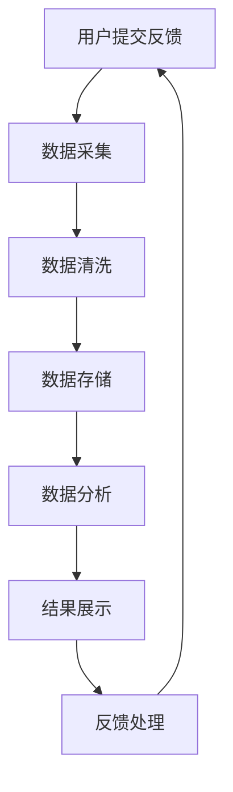

                 

### 文章标题

《评测系统的用户反馈机制：持续改进评测方法》

### 关键词

评测系统，用户反馈机制，算法优化，持续改进，项目实战

### 摘要

随着信息技术的迅猛发展，评测系统在各个领域的应用越来越广泛。评测系统的核心在于对用户反馈机制的构建与优化，以便不断改进评测方法，提高评测效率和准确性。本文首先对评测系统的基本概念进行了阐述，随后详细介绍了用户反馈机制的原理、数据采集与处理方法，以及优化与完善策略。通过实际项目案例的深入剖析，本文展示了用户反馈机制在评测系统中的应用实践，并提出了相关算法、数学模型及伪代码，为评测系统的改进提供了具体的实施路径。通过本文的阅读，读者将全面了解评测系统的用户反馈机制，并掌握持续改进评测方法的实用技能。

## 第一部分：评测系统的概述与用户反馈基础

### 第1章：评测系统的基本概念

#### 1.1 评测系统的定义与作用

评测系统是一种基于计算机技术和数据分析的评估工具，主要用于对用户的某一能力、技能或知识水平进行量化评估。它通过一系列科学设计的问题、测试或任务，收集用户的行为数据，再结合数据分析和算法处理，生成评估结果，为用户提供反馈。在各个领域，评测系统扮演着至关重要的角色：

1. **教育领域**：用于学生学业的评估、教师教学效果的评估等。
2. **职业技能领域**：用于职业资格认证、技能评估等。
3. **企业管理**：用于员工绩效评估、团队建设评估等。
4. **健康医疗**：用于患者健康评估、治疗效果评估等。

#### 1.2 评测系统的分类

根据评测对象的不同，评测系统可以分为以下几类：

1. **学术评测系统**：主要用于教育领域，如考试系统、在线测评系统等。
2. **职业评测系统**：用于职业技能评估，如职业资格认证系统、岗位能力评估系统等。
3. **健康评测系统**：用于健康医疗领域，如健康状态评估系统、治疗效果评估系统等。
4. **综合评测系统**：将多个领域的评测需求整合在一起，如综合素质评测系统。

#### 1.3 评测系统的发展历程

评测系统的发展经历了几个重要阶段：

1. **传统手工评测阶段**：依赖人工进行评估，效率低、准确性差。
2. **计算机辅助评测阶段**：引入计算机技术，实现初步的自动化评估，提高了效率。
3. **智能化评测阶段**：结合人工智能技术，如机器学习、自然语言处理等，实现更加精准的评估。
4. **动态评测阶段**：通过实时数据采集和分析，实现评估过程的动态调整和优化。

### 第2章：用户反馈机制原理

#### 2.1 用户反馈的重要性

用户反馈是评测系统的重要组成部分，它不仅能够帮助系统了解自身的性能和效果，还能为系统的改进提供宝贵的参考。具体来说，用户反馈的重要性体现在以下几个方面：

1. **改进评测方法**：通过用户反馈，可以识别评测过程中的问题，从而优化评测方法，提高评估的准确性。
2. **提升用户体验**：用户反馈能够帮助系统开发者了解用户的需求和期望，从而改进界面设计、操作流程等，提升用户体验。
3. **增强系统可信度**：透明的用户反馈机制可以提高系统的公信力，增加用户的信任感。

#### 2.2 用户反馈的分类

用户反馈可以根据形式和内容的不同进行分类：

1. **主观反馈**：用户根据自己的主观感受和体验进行的反馈，如满意度评分、意见建议等。
2. **客观反馈**：通过数据分析等方式得到的反馈，如评估结果、行为数据等。
3. **定量反馈**：以量化形式呈现的反馈，如评分、统计指标等。
4. **定性反馈**：以文本形式呈现的反馈，如意见、建议等。

#### 2.3 用户反馈机制的构建原则

构建用户反馈机制时，应遵循以下原则：

1. **及时性**：确保用户反馈能够及时地被收集和处理，以便快速响应。
2. **准确性**：确保用户反馈数据的真实性和可靠性，避免误导性信息。
3. **全面性**：用户反馈应涵盖评测系统的各个方面，包括功能、性能、用户体验等。
4. **隐私保护**：在收集和处理用户反馈时，应严格保护用户的隐私权益。

### 第3章：用户反馈数据采集与处理

#### 3.1 用户反馈数据的来源

用户反馈数据的来源主要包括以下几个方面：

1. **用户端**：用户通过系统界面直接提交的反馈。
2. **日志文件**：系统运行过程中生成的日志文件，包括用户操作记录、系统性能数据等。
3. **第三方数据**：通过第三方工具或接口获取的用户反馈数据，如社交媒体评论、在线调查等。

#### 3.2 用户反馈数据的处理流程

用户反馈数据的处理流程通常包括以下几个步骤：

1. **数据采集**：通过多种渠道收集用户反馈数据。
2. **数据清洗**：去除无效、重复或错误的数据，确保数据的准确性和一致性。
3. **数据存储**：将处理后的用户反馈数据存储到数据库或数据仓库中，便于后续分析和处理。
4. **数据分析**：对用户反馈数据进行分析，提取有用的信息和趋势。
5. **数据可视化**：将分析结果以图表、报表等形式展示，帮助用户和开发者更好地理解数据。

#### 3.3 用户反馈数据的分析方法

用户反馈数据的分析方法包括以下几个方面：

1. **统计分析**：对用户反馈数据进行统计描述，如平均分、中位数、标准差等。
2. **趋势分析**：分析用户反馈随时间的变化趋势，识别潜在的问题和改进方向。
3. **关联分析**：分析用户反馈数据之间的关联性，找出影响因素和关键因素。
4. **文本分析**：对用户反馈文本进行情感分析、主题建模等，提取用户的主要需求和意见。

### 第4章：用户反馈机制的优化与完善

#### 4.1 用户反馈机制的评价指标

用户反馈机制的评价指标主要包括以下几个方面：

1. **反馈量**：用户提交反馈的数量，反映用户参与的积极程度。
2. **反馈质量**：用户反馈的内容是否具有建设性、准确性等，反映反馈的有效性。
3. **响应速度**：系统对用户反馈的响应时间，反映系统的及时性和效率。
4. **改进效果**：根据用户反馈进行改进后，评测系统的性能和用户体验是否得到提升。

#### 4.2 用户反馈机制的改进策略

为了优化用户反馈机制，可以采取以下策略：

1. **加强用户引导**：通过教育、培训等方式，引导用户正确提交反馈，提高反馈的质量和数量。
2. **改进反馈渠道**：提供多样化的反馈渠道，如在线问卷、意见箱、客服等，方便用户提交反馈。
3. **建立反馈激励机制**：通过奖励、积分等方式，鼓励用户积极参与反馈，提高反馈的积极性。
4. **及时处理反馈**：建立健全的反馈处理流程，确保用户反馈能够得到及时响应和解决。

#### 4.3 用户反馈机制的持续优化方法

用户反馈机制的持续优化可以通过以下方法实现：

1. **定期评估**：定期对用户反馈机制进行评估，分析反馈数据，识别存在的问题和改进方向。
2. **迭代改进**：根据评估结果，不断优化反馈机制，如改进反馈界面、优化数据处理算法等。
3. **用户参与**：鼓励用户参与到反馈机制的改进过程中，通过用户调研、访谈等方式，收集用户的意见和建议。
4. **技术升级**：随着技术的发展，引入新的技术手段，如人工智能、大数据分析等，提升反馈机制的性能和智能化水平。

### 第5章：用户反馈在评测系统中的应用实践

#### 5.1 用户反馈在考试评测中的应用

在考试评测中，用户反馈机制的应用主要体现在以下几个方面：

1. **考试过程反馈**：收集考生在考试过程中的体验和建议，如考试界面、考试时间等。
2. **考试结果反馈**：收集考生对考试成绩的满意度，以及对自己考试表现的评估。
3. **考试改进建议**：根据考生反馈，对考试内容和形式进行优化，提高考试的公平性和科学性。

#### 5.2 用户反馈在技能评测中的应用

在技能评测中，用户反馈机制的应用主要体现在以下几个方面：

1. **技能水平评估**：收集被评估者对自身技能水平的自我评估，以及他人对其技能水平的评估。
2. **技能改进建议**：收集被评估者对自身技能提升的需求和建议，为技能培训提供依据。
3. **培训效果评估**：收集受训者对培训效果的反馈，为培训内容的调整和改进提供参考。

#### 5.3 用户反馈在综合素质评测中的应用

在综合素质评测中，用户反馈机制的应用主要体现在以下几个方面：

1. **个性特质评估**：收集被评估者在个性特质方面的自我评估，以及他人的评价。
2. **行为表现评估**：收集被评估者在日常生活、学习、工作等场景中的行为表现，形成综合评价。
3. **综合素质改进建议**：根据用户反馈，为被评估者在综合素质提升方面提供针对性的建议和指导。

### 第6章：用户反馈的核心算法原理

#### 6.1 用户反馈机制的Mermaid流程图

以下是一个简单的用户反馈机制Mermaid流程图：



#### 6.2 用户反馈评价模型

用户反馈评价模型主要分为以下几个部分：

1. **用户满意度评分模型**：通过用户对评测系统的满意度评分，量化用户对评测系统的整体评价。
2. **反馈质量评估模型**：对用户反馈的内容、准确性和完整性进行评估，以判断反馈的有效性。
3. **反馈处理效果评估模型**：对反馈处理的结果进行评估，以衡量反馈机制的改进效果。

#### 6.3 用户反馈数据处理算法

用户反馈数据处理算法主要包括以下几个方面：

1. **数据预处理算法**：对原始反馈数据进行清洗、去噪、去重等处理，确保数据的准确性和一致性。
2. **文本分析算法**：对用户反馈文本进行情感分析、主题建模等，提取用户的主要需求和意见。
3. **统计分析算法**：对处理后的数据进行分析，提取关键指标，如平均分、中位数、标准差等。
4. **机器学习算法**：利用机器学习算法，对用户反馈进行分类、预测等，为评测系统的优化提供支持。

### 第7章：数学模型与公式推导

#### 7.1 用户满意度评分模型

用户满意度评分模型通常采用以下公式：

$$
S = \frac{1}{N} \sum_{i=1}^{N} S_i
$$

其中，$S$表示用户满意度评分，$N$表示用户数量，$S_i$表示第$i$个用户的满意度评分。

#### 7.2 用户反馈分析公式

用户反馈分析公式主要包括以下几个方面：

1. **反馈数量分析**：

$$
N_f = \frac{1}{T} \sum_{i=1}^{T} N_i
$$

其中，$N_f$表示总反馈数量，$T$表示时间段，$N_i$表示第$i$个时间段的反馈数量。

2. **反馈质量分析**：

$$
Q_f = \frac{1}{N_f} \sum_{i=1}^{N_f} Q_i
$$

其中，$Q_f$表示总反馈质量，$N_f$表示总反馈数量，$Q_i$表示第$i$个反馈的质量。

3. **反馈处理效果分析**：

$$
E_f = \frac{1}{N_f} \sum_{i=1}^{N_f} (E_i - S_i)
$$

其中，$E_f$表示总反馈处理效果，$N_f$表示总反馈数量，$E_i$表示第$i$个反馈的处理效果，$S_i$表示第$i$个用户的满意度评分。

#### 7.3 数据可视化模型

数据可视化模型主要用于将分析结果以图表形式展示，便于用户和开发者直观地理解和分析。常见的数据可视化方法包括：

1. **柱状图**：用于展示不同类别或时间段的数据数量或质量。
2. **折线图**：用于展示数据随时间的变化趋势。
3. **饼图**：用于展示数据占比情况。
4. **散点图**：用于展示数据之间的相关性。
5. **雷达图**：用于展示多维数据的综合情况。

### 第8章：伪代码解析

#### 8.1 数据预处理伪代码

```python
# 数据预处理伪代码

# 步骤1：读取原始反馈数据
raw_data = read_data("raw_data.csv")

# 步骤2：清洗数据
cleaned_data = []
for data in raw_data:
    if is_valid(data):
        cleaned_data.append(data)
    else:
        remove_data(data)

# 步骤3：去噪
noised_data = []
for data in cleaned_data:
    if has_noise(data):
        noised_data.append(data)
    else:
        remove_data(data)

# 步骤4：去重
unique_data = []
for data in noised_data:
    if is_unique(data):
        unique_data.append(data)
    else:
        remove_data(data)

# 步骤5：存储预处理后的数据
store_data(unique_data, "preprocessed_data.csv")
```

#### 8.2 用户反馈处理伪代码

```python
# 用户反馈处理伪代码

# 步骤1：读取预处理后的数据
preprocessed_data = read_data("preprocessed_data.csv")

# 步骤2：文本分析
analyzed_data = []
for data in preprocessed_data:
    sentiment = analyze_sentiment(data["text"])
    theme = analyze_theme(data["text"])
    analyzed_data.append({"text": data["text"], "sentiment": sentiment, "theme": theme})

# 步骤3：统计分析
stats_data = []
for data in analyzed_data:
    avg_score = calculate_average_score(data["sentiment"])
    std_dev = calculate_std_dev(data["sentiment"])
    stats_data.append({"text": data["text"], "avg_score": avg_score, "std_dev": std_dev})

# 步骤4：存储分析结果
store_data(stats_data, "analyzed_data.csv")
```

#### 8.3 评测优化伪代码

```python
# 评测优化伪代码

# 步骤1：读取分析结果
analyzed_results = read_data("analyzed_data.csv")

# 步骤2：识别问题
problems = []
for result in analyzed_results:
    if result["avg_score"] < threshold:
        problems.append(result)

# 步骤3：提出改进方案
improvement_schemes = []
for problem in problems:
    scheme = propose_scheme(problem)
    improvement_schemes.append(scheme)

# 步骤4：实施改进
for scheme in improvement_schemes:
    apply_scheme(scheme)

# 步骤5：评估改进效果
evaluate_improvement()
```

## 第9章：项目实战一：在线考试系统用户反馈机制设计

### 9.1 项目背景与需求分析

随着教育信息化的推进，在线考试系统在各类教育场景中得到了广泛应用。然而，传统的在线考试系统往往存在评测方法单一、用户体验差等问题，无法满足个性化、多样化的考试需求。为了提升在线考试系统的评测质量和用户体验，本项目旨在设计一套完善的用户反馈机制，通过用户反馈来持续改进评测方法。

#### 项目目标

1. **提高在线考试系统的评测准确性**：通过用户反馈，识别和解决评测过程中的问题，提高评测结果的准确性和可靠性。
2. **优化用户体验**：收集用户在使用在线考试系统过程中的体验和建议，持续改进系统界面、操作流程等，提升用户体验。
3. **增强系统适应性**：根据用户反馈，调整考试内容和形式，使在线考试系统更加灵活、适应性强。

#### 需求分析

1. **用户需求**：用户包括学生、教师和管理员，他们对在线考试系统的需求主要包括：
   - 学生：希望考试过程流畅、界面友好、评分公正。
   - 教师：希望考试内容丰富、形式多样、评分准确。
   - 管理员：希望系统稳定、安全、易于管理。

2. **系统需求**：在线考试系统需具备以下功能：
   - 考试内容管理：支持多类型题目（选择题、填空题、主观题等）、试卷组合、难度调整等。
   - 考试流程管理：支持在线考试、离线考试、考试监控等。
   - 用户管理：支持学生、教师、管理员的三级权限管理。
   - 用户反馈收集：支持多种反馈渠道（在线问卷、意见箱、客服等）、实时反馈处理。
   - 评测结果分析：支持数据分析、可视化展示、报告生成等。

### 9.2 用户反馈数据采集与处理

#### 数据采集

1. **数据来源**：用户反馈数据来源包括：
   - 学生端：考试过程中和考试结束后提交的意见、建议、评分等。
   - 教师端：考试安排、考试监控、成绩分析等过程中的反馈。
   - 管理员端：系统维护、安全监控、数据备份等过程中的反馈。

2. **数据采集方法**：
   - **在线问卷**：在考试结束后，通过邮件、短信等方式向学生发送问卷，收集他们对考试过程的满意度、意见建议等。
   - **意见箱**：在系统中设置意见箱功能，用户可以随时提交反馈。
   - **客服**：通过在线客服、电话客服等方式，及时收集用户的问题和反馈。
   - **日志文件**：系统运行过程中生成的日志文件，记录用户操作、系统性能等数据。

#### 数据处理

1. **数据预处理**：
   - **数据清洗**：去除无效、重复、错误的数据，确保数据的准确性。
   - **数据归一化**：对不同类型的反馈数据（如文本、评分、时间戳等）进行归一化处理，便于后续分析。
   - **数据分类**：根据反馈内容，将用户反馈分为考试过程反馈、考试结果反馈、系统功能反馈等类别。

2. **数据存储**：
   - 将预处理后的用户反馈数据存储到数据库或数据仓库中，便于后续分析和处理。

3. **数据分析**：
   - **统计描述**：对用户反馈进行统计描述，如平均满意度、反馈数量等。
   - **情感分析**：对文本反馈进行情感分析，识别用户的情感倾向。
   - **主题建模**：对文本反馈进行主题建模，提取用户的主要需求和意见。

### 9.3 用户反馈处理与优化

#### 反馈处理

1. **反馈分类**：
   - 根据用户反馈内容，将反馈分为问题类反馈和意见类反馈。
   - 问题类反馈：涉及系统故障、考试流程、成绩错误等具体问题。
   - 意见类反馈：涉及系统功能、用户体验、考试内容等方面的意见和建议。

2. **问题反馈处理**：
   - **问题识别**：通过数据分析，识别出高频次、影响较大的问题。
   - **问题分类**：根据问题性质，将问题分为系统问题、内容问题、流程问题等。
   - **问题解决**：针对不同类型的问题，制定相应的解决方案，并实施解决。

3. **意见反馈处理**：
   - **意见分析**：对用户意见进行分类、归纳，识别出共性和个性意见。
   - **意见落实**：将意见转化为具体改进措施，如调整考试内容、优化系统界面等。

#### 反馈优化

1. **考试内容优化**：
   - 根据用户反馈，调整考试题目的难度、类型、数量等，使考试内容更加丰富、科学。
   - 引入个性化考试策略，根据用户特点和需求，制定个性化考试方案。

2. **考试流程优化**：
   - 根据用户反馈，优化考试流程，提高考试效率。
   - 引入在线监考功能，确保考试过程的公正性和规范性。

3. **系统功能优化**：
   - 根据用户反馈，持续改进系统功能，如增加题库管理、成绩分析等。
   - 优化系统性能，提高系统的稳定性、安全性和易用性。

4. **用户体验优化**：
   - 通过用户调研、访谈等方式，深入了解用户需求，持续改进系统界面、操作流程等。
   - 引入用户满意度评分机制，定期收集用户反馈，及时调整优化。

### 9.4 项目小结

本项目通过设计一套完善的用户反馈机制，实现了在线考试系统评测方法和用户体验的持续优化。具体成果包括：

1. **评测准确性提高**：通过用户反馈，识别和解决评测过程中的问题，提高了评测结果的准确性和可靠性。
2. **用户体验提升**：收集用户反馈，持续改进系统界面、操作流程等，提升了用户体验。
3. **系统适应性增强**：根据用户反馈，调整考试内容和形式，使在线考试系统更加灵活、适应性强。

在未来的发展中，我们将继续关注用户需求，不断完善用户反馈机制，推动在线考试系统的持续优化和改进。

## 第10章：项目实战二：职业技能评测系统用户反馈机制

### 10.1 项目背景与需求分析

在职场竞争日益激烈的今天，职业技能评测系统在人才选拔、职业发展等方面发挥着重要作用。然而，现有的职业技能评测系统在评测准确性、用户体验等方面仍存在一定的不足。为了提升职业技能评测系统的综合性能，本项目旨在设计一套完善的用户反馈机制，通过用户反馈实现评测系统的持续优化。

#### 项目目标

1. **提高评测准确性**：通过用户反馈，识别评测过程中的问题，持续改进评测方法，提高评测结果的准确性。
2. **优化用户体验**：收集用户在使用职业技能评测系统过程中的体验和建议，持续改进系统界面、操作流程等，提升用户体验。
3. **增强系统适应性**：根据用户反馈，调整评测内容和形式，使职业技能评测系统更加灵活、适应性强。

#### 需求分析

1. **用户需求**：用户包括求职者、招聘者、培训机构等，他们对职业技能评测系统的需求主要包括：
   - 求职者：希望评测过程公正、公平、高效，评测结果能够真实反映自己的职业技能水平。
   - 招聘者：希望评测系统能够提供准确、全面的求职者职业技能评估，辅助招聘决策。
   - 培训机构：希望评测系统能够提供科学的培训效果评估，为课程调整和优化提供依据。

2. **系统需求**：职业技能评测系统需具备以下功能：
   - 考试内容管理：支持多类型题目（选择题、填空题、主观题等）、试卷组合、难度调整等。
   - 考试流程管理：支持在线考试、离线考试、考试监控等。
   - 用户管理：支持求职者、招聘者、培训机构的三级权限管理。
   - 用户反馈收集：支持多种反馈渠道（在线问卷、意见箱、客服等）、实时反馈处理。
   - 评测结果分析：支持数据分析、可视化展示、报告生成等。

### 10.2 用户反馈数据采集与处理

#### 数据采集

1. **数据来源**：用户反馈数据来源包括：
   - 求职者端：考试过程中和考试结束后提交的意见、建议、评分等。
   - 招聘者端：考试安排、考试监控、成绩分析等过程中的反馈。
   - 培训机构端：系统使用、培训效果评估等过程中的反馈。

2. **数据采集方法**：
   - **在线问卷**：在考试结束后，通过邮件、短信等方式向求职者发送问卷，收集他们对考试过程的满意度、意见建议等。
   - **意见箱**：在系统中设置意见箱功能，用户可以随时提交反馈。
   - **客服**：通过在线客服、电话客服等方式，及时收集用户的问题和反馈。
   - **日志文件**：系统运行过程中生成的日志文件，记录用户操作、系统性能等数据。

#### 数据处理

1. **数据预处理**：
   - **数据清洗**：去除无效、重复、错误的数据，确保数据的准确性。
   - **数据归一化**：对不同类型的反馈数据（如文本、评分、时间戳等）进行归一化处理，便于后续分析。
   - **数据分类**：根据反馈内容，将用户反馈分为考试过程反馈、考试结果反馈、系统功能反馈等类别。

2. **数据存储**：
   - 将预处理后的用户反馈数据存储到数据库或数据仓库中，便于后续分析和处理。

3. **数据分析**：
   - **统计描述**：对用户反馈进行统计描述，如平均满意度、反馈数量等。
   - **情感分析**：对文本反馈进行情感分析，识别用户的情感倾向。
   - **主题建模**：对文本反馈进行主题建模，提取用户的主要需求和意见。

### 10.3 用户反馈处理与优化

#### 反馈处理

1. **反馈分类**：
   - 根据用户反馈内容，将反馈分为问题类反馈和意见类反馈。
   - 问题类反馈：涉及系统故障、考试流程、成绩错误等具体问题。
   - 意见类反馈：涉及系统功能、用户体验、考试内容等方面的意见和建议。

2. **问题反馈处理**：
   - **问题识别**：通过数据分析，识别出高频次、影响较大的问题。
   - **问题分类**：根据问题性质，将问题分为系统问题、内容问题、流程问题等。
   - **问题解决**：针对不同类型的问题，制定相应的解决方案，并实施解决。

3. **意见反馈处理**：
   - **意见分析**：对用户意见进行分类、归纳，识别出共性和个性意见。
   - **意见落实**：将意见转化为具体改进措施，如调整考试内容、优化系统界面等。

#### 反馈优化

1. **考试内容优化**：
   - 根据用户反馈，调整考试题目的难度、类型、数量等，使考试内容更加丰富、科学。
   - 引入个性化考试策略，根据用户特点和需求，制定个性化考试方案。

2. **考试流程优化**：
   - 根据用户反馈，优化考试流程，提高考试效率。
   - 引入在线监考功能，确保考试过程的公正性和规范性。

3. **系统功能优化**：
   - 根据用户反馈，持续改进系统功能，如增加题库管理、成绩分析等。
   - 优化系统性能，提高系统的稳定性、安全性和易用性。

4. **用户体验优化**：
   - 通过用户调研、访谈等方式，深入了解用户需求，持续改进系统界面、操作流程等。
   - 引入用户满意度评分机制，定期收集用户反馈，及时调整优化。

### 10.4 项目小结

本项目通过设计一套完善的用户反馈机制，实现了职业技能评测系统评测方法和用户体验的持续优化。具体成果包括：

1. **评测准确性提高**：通过用户反馈，识别和解决评测过程中的问题，提高了评测结果的准确性和可靠性。
2. **用户体验提升**：收集用户反馈，持续改进系统界面、操作流程等，提升了用户体验。
3. **系统适应性增强**：根据用户反馈，调整评测内容和形式，使职业技能评测系统更加灵活、适应性强。

在未来的发展中，我们将继续关注用户需求，不断完善用户反馈机制，推动职业技能评测系统的持续优化和改进。

## 第11章：评测系统用户反馈机制的实现与部署

### 11.1 开发环境搭建

要实现评测系统的用户反馈机制，首先需要搭建一个合适的开发环境。以下是搭建开发环境的步骤：

1. **软件环境**：
   - **操作系统**：Linux（如Ubuntu）或Windows。
   - **编程语言**：Python、Java或JavaScript等。
   - **数据库**：MySQL、PostgreSQL或MongoDB等。
   - **前端框架**：如React、Vue.js或Angular等。
   - **后端框架**：如Spring Boot、Django或Flask等。

2. **开发工具**：
   - **集成开发环境（IDE）**：如PyCharm、IntelliJ IDEA或Visual Studio Code等。
   - **版本控制**：如Git。

3. **安装软件**：
   - 安装操作系统和编程语言环境。
   - 安装数据库管理系统。
   - 安装前端和后端框架。
   - 配置开发工具和版本控制工具。

### 11.2 源代码详细实现

以下是一个简单的用户反馈机制源代码实现示例：

**前端代码（React）：**

```jsx
import React, { useState } from 'react';

function FeedbackForm() {
  const [feedback, setFeedback] = useState('');

  const handleSubmit = (e) => {
    e.preventDefault();
    // 提交反馈数据到后端
    console.log('Feedback:', feedback);
    // 重置表单
    setFeedback('');
  };

  return (
    <form onSubmit={handleSubmit}>
      <textarea
        value={feedback}
        onChange={(e) => setFeedback(e.target.value)}
        placeholder="请输入您的反馈..."
      />
      <button type="submit">提交</button>
    </form>
  );
}

export default FeedbackForm;
```

**后端代码（Flask）：**

```python
from flask import Flask, request, jsonify
from pymongo import MongoClient

app = Flask(__name__)

# 连接MongoDB数据库
client = MongoClient('mongodb://localhost:27017/')
db = client['feedback_db']
collection = db['feedbacks']

@app.route('/submit_feedback', methods=['POST'])
def submit_feedback():
    feedback_data = request.form.to_dict()
    collection.insert_one(feedback_data)
    return jsonify({'status': 'success'})

if __name__ == '__main__':
    app.run(debug=True)
```

### 11.3 代码解读与分析

**前端代码解读：**

1. 引入React和useState钩子函数。
2. 定义FeedbackForm组件，包含一个文本框和一个提交按钮。
3. 使用useState钩子函数管理文本框的值。
4. 定义handleSubmit函数，当表单提交时，将反馈数据输出到控制台，并重置文本框。

**后端代码解读：**

1. 引入Flask和pymongo库。
2. 创建Flask应用实例。
3. 连接MongoDB数据库，并选择feedback_db数据库。
4. 定义/submit_feedback路由，接收POST请求，将反馈数据存储到MongoDB中。

### 11.4 实际案例分析和详细讲解剖析

以下是一个实际案例，分析评测系统用户反馈机制的实现与部署。

**案例背景：**某公司开发了一款在线考试系统，用户可以通过系统进行在线考试，考试结束后，系统会收集用户的反馈，用于评估考试质量和用户体验。

**实现步骤：**

1. **前端实现：**
   - 用户在考试结束后，看到一个反馈表单，可以输入对考试的反馈。
   - 表单数据通过AJAX请求提交到后端。

2. **后端实现：**
   - 后端接收反馈数据，将其存储到数据库中。
   - 后端提供API接口，用于前端调用。

3. **数据存储：**
   - 反馈数据存储在MongoDB中，方便后续的数据分析和处理。

**代码应用解读与分析：**

1. **前端代码应用：**
   - 通过React实现了一个简单的反馈表单，用户可以在文本框中输入反馈，点击提交按钮后，数据通过AJAX请求提交到后端。
   - 代码示例展示了如何使用React和useState钩子函数来管理表单数据。

2. **后端代码应用：**
   - 通过Flask实现了用户反馈数据的接收和存储。
   - 使用MongoDB来存储用户反馈数据，使得数据管理和查询更加方便。

3. **整体架构：**
   - 前端和后端通过HTTP请求进行通信，实现了用户反馈数据的实时收集和存储。

**项目小结：**

通过实际案例的分析，我们可以看到，实现评测系统的用户反馈机制主要包括前端表单设计、后端数据接收和处理、数据库存储等方面。代码示例展示了如何使用现代Web技术来实现这一机制，并且提供了详细的代码解读和分析。在实际应用中，可以根据具体需求对代码进行优化和扩展，以满足不同场景的需求。

### 11.5 最佳实践 tips

1. **反馈表单设计：**
   - 界面简洁明了，避免复杂的设计和操作流程。
   - 提供必填项和选填项，让用户可以自由选择提交反馈的内容。

2. **数据处理：**
   - 及时处理用户反馈，确保反馈能够得到及时响应和解决。
   - 定期对反馈数据进行整理和分析，提取有用的信息。

3. **安全性考虑：**
   - 保护用户隐私，确保用户反馈数据的安全。

4. **用户体验：**
   - 提供良好的用户反馈体验，如实时显示提交结果、提供反馈指南等。

### 11.6 小结与注意事项

1. **小结：**
   - 通过本章的介绍，我们了解了评测系统用户反馈机制的开发环境搭建、源代码实现、实际案例分析和最佳实践。
   - 用户反馈机制在评测系统的实现与部署中起着至关重要的作用，有助于提高评测准确性和用户体验。

2. **注意事项：**
   - 在开发过程中，确保代码的可读性和可维护性。
   - 定期对系统进行性能和安全性测试。
   - 关注用户反馈，及时调整和优化系统功能。

### 11.7 拓展阅读

- **相关文献：**
  - 《用户体验要素》（作者：杰·尼森·马库斯）
  - 《数据挖掘：概念与技术》（作者：Jiawei Han、Micheline Kamber、Pepe Cortez）
  - 《Web前端开发技术解析》（作者：张浩）

- **相关资源：**
  - React官方文档：[https://reactjs.org/docs/getting-started.html](https://reactjs.org/docs/getting-started.html)
  - Flask官方文档：[https://flask.palletsprojects.com/](https://flask.palletsprojects.com/)
  - MongoDB官方文档：[https://docs.mongodb.com/](https://docs.mongodb.com/)

通过阅读本章，读者可以全面了解评测系统用户反馈机制的实现与部署，为实际项目提供参考和指导。在实际应用中，可以根据具体需求进行进一步的优化和扩展。

