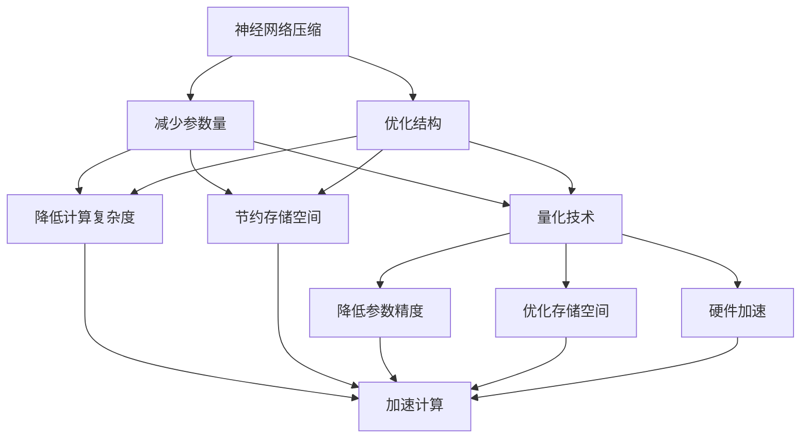

                 

### 文章标题

# 《评测系统的神经网络压缩与量化技术》

### 关键词

- 神经网络压缩
- 量化技术
- 评测系统
- 权值剪枝
- 权值共享
- 模型蒸馏
- 逐位量化
- 多比特量化
- 嵌入式设备
- 实时评测系统
- 大数据处理

### 摘要

随着人工智能技术的快速发展，神经网络在评测系统中的应用越来越广泛。然而，神经网络模型通常具有庞大的参数量和计算复杂度，导致其在大规模应用中面临诸多挑战。本文将深入探讨评测系统中的神经网络压缩与量化技术，介绍其背景、核心概念、主要技术方法以及在实际应用中的效果。首先，我们将介绍评测系统的基本概念和神经网络的应用。然后，详细分析神经网络压缩与量化的必要性，以及它们之间的关系。接下来，我们将分别介绍神经网络压缩和量化技术的具体方法，包括权值压缩、结构压缩、模型蒸馏以及量化算法。最后，我们将探讨神经网络压缩与量化技术在嵌入式设备、实时评测系统以及大数据处理中的应用，并通过案例分析展示这些技术在实际项目中的效果。希望通过本文的讲解，读者能够对神经网络压缩与量化技术有更深入的理解，并在实际应用中发挥其优势。

## 第一部分：引言

### 1.1 评测系统的基本概念

评测系统是一种用于评估和分析系统性能的工具，广泛应用于各种领域，如工业自动化、医疗诊断、智能交通等。其核心目的是通过收集和分析系统运行数据，提供有关系统性能的客观评估和反馈，帮助用户优化系统配置和操作策略。

评测系统的定义与作用可以概括为以下几点：

1. **定义**：评测系统是一个集成多种技术和工具的综合平台，用于评估系统的性能、可靠性和效率。它通常包括数据采集、数据处理、性能评估和优化建议等功能模块。

2. **作用**：评测系统的主要作用包括：
   - **性能监控**：实时监控系统的运行状态，提供性能指标，帮助用户及时发现和解决问题。
   - **故障诊断**：通过分析系统运行数据，识别故障原因，为故障排除提供指导。
   - **优化建议**：基于评测结果，提供系统优化方案，提高系统性能和效率。
   - **决策支持**：为决策者提供有关系统运行情况和优化方案的客观依据，支持科学决策。

神经网络在评测系统中的应用已经取得了显著成效。神经网络作为一种强大的机器学习模型，具有自适应性和自学习能力，能够从大量数据中自动提取特征，进行复杂的模式识别和预测。以下是一些具体的应用场景：

1. **性能预测**：通过训练神经网络模型，可以预测系统在不同负载条件下的性能，为系统优化提供参考。
2. **故障预测**：利用神经网络对系统历史运行数据进行分析，可以提前预测可能发生的故障，采取预防措施。
3. **负载均衡**：神经网络可以根据实时性能数据，动态调整系统资源分配，实现负载均衡。
4. **异常检测**：神经网络可以识别系统运行中的异常行为，提供预警信息，防止潜在故障的发生。

### 1.2 神经网络压缩与量化的背景与意义

随着深度学习技术的广泛应用，神经网络模型在评测系统中的应用越来越普遍。然而，这些模型通常具有庞大的参数量和计算复杂度，导致其在实际应用中面临以下挑战：

1. **计算资源消耗**：大规模神经网络模型需要大量的计算资源，尤其是在实时评测系统中，这可能导致系统性能下降，甚至无法正常运行。
2. **存储空间占用**：庞大的模型参数需要大量存储空间，不利于在嵌入式设备和资源受限的环境中使用。
3. **传输带宽限制**：在分布式系统中，模型的传输和部署可能受到网络带宽的限制，影响系统的部署效率和用户体验。

为了应对这些挑战，神经网络压缩与量化技术应运而生。这些技术通过减少模型参数量和计算复杂度，降低计算和存储资源的需求，从而提高系统的性能和可扩展性。

#### 神经网络压缩的必要性

神经网络压缩的必要性主要体现在以下几个方面：

1. **提升计算效率**：压缩后的模型参数量减少，可以显著降低计算复杂度，提高计算速度和效率。
2. **节约存储空间**：压缩后的模型占用更少的存储空间，有利于在资源受限的环境中部署和使用。
3. **加快模型部署**：压缩后的模型可以更快地进行传输和部署，减少部署时间和带宽消耗。
4. **支持移动设备**：随着移动设备的发展，神经网络模型在移动设备中的应用越来越广泛，压缩技术有助于提高移动设备的性能和用户体验。

#### 量化技术的原理与优势

量化技术通过对模型参数进行低精度表示，减少计算和存储资源的需求。量化技术的主要原理包括：

1. **数值压缩**：将模型参数的精度降低，从浮点数转换为整数或低精度浮点数，减少存储和计算需求。
2. **误差容忍**：量化过程中引入的误差在一定范围内是可以容忍的，不会对模型的性能产生显著影响。

量化技术的优势包括：

1. **降低计算复杂度**：量化后的模型计算复杂度降低，有助于提高计算速度和效率。
2. **节约存储空间**：量化后的模型占用更少的存储空间，有利于在资源受限的环境中部署和使用。
3. **支持硬件加速**：量化技术可以更好地利用硬件资源，如GPU和FPGA，提高计算性能。

#### 神经网络压缩与量化的关系

神经网络压缩与量化技术相辅相成，共同作用于模型的优化和提升。

1. **协同作用**：压缩技术通过减少模型参数量和计算复杂度，为量化技术提供了基础。量化技术则通过降低参数精度，进一步减少计算和存储资源的需求。
2. **优化目标**：神经网络压缩和量化技术都旨在提高模型的可扩展性和性能，降低计算和存储资源的需求，以支持大规模应用和实时部署。

总之，神经网络压缩与量化技术在评测系统中的应用具有重要意义。通过压缩和量化技术，可以显著降低模型的计算和存储资源需求，提高系统的性能和可扩展性，为深度学习技术的广泛应用提供有力支持。

### 1.3 神经网络压缩与量化的关系

神经网络压缩与量化技术是评测系统中两个重要的技术手段，它们在模型优化过程中相辅相成，共同发挥作用。为了更好地理解两者的关系，我们需要深入探讨它们各自的定义、目标以及如何相互作用。

#### 神经网络压缩的定义与目标

神经网络压缩是指通过一系列方法减少神经网络模型的大小和计算复杂度，从而在资源受限的环境下实现高效运行。神经网络压缩的主要目标包括：

1. **减少参数量**：通过删除冗余的神经元和连接，减少模型中的参数数量，从而降低模型的存储和计算需求。
2. **优化结构**：通过重新设计网络结构，如深度可分离卷积、稀疏化等，提高模型的效率。
3. **加速计算**：通过减少模型中的计算操作，如减少矩阵乘法次数，提高模型的计算速度。

#### 量化技术的定义与目标

量化技术是指将神经网络模型中的浮点数参数转换为低精度整数或低精度浮点数，以减少计算和存储资源的需求。量化技术的主要目标包括：

1. **降低计算复杂度**：通过减少参数的精度，量化技术可以显著降低计算复杂度和计算资源的需求。
2. **优化存储空间**：量化后的模型占用更少的存储空间，有利于在资源受限的环境中部署和使用。
3. **硬件加速**：量化后的模型可以更好地利用硬件资源，如GPU和FPGA，提高计算性能。

#### 神经网络压缩与量化的关系

神经网络压缩与量化技术之间存在密切的关系，它们在模型优化过程中相互补充，共同发挥作用。

1. **协同优化**：神经网络压缩和量化技术可以协同优化，通过压缩减少模型的大小，然后再进行量化，进一步降低计算和存储需求。
2. **相互影响**：压缩技术通过减少模型参数量，为量化技术提供了基础。量化技术则通过降低参数精度，进一步减少了计算和存储资源的需求。
3. **优化顺序**：在实际应用中，通常先进行压缩，再进行量化。这是因为压缩技术可以更有效地减少模型的大小和计算复杂度，为量化提供更好的基础。

#### 关系架构 Mermaid 流程图

以下是一个简化的 Mermaid 流程图，展示了神经网络压缩与量化技术之间的关系：



通过这个流程图，我们可以清晰地看到神经网络压缩和量化技术之间的互动关系。压缩技术通过减少模型大小和计算复杂度，为量化技术提供了更好的基础。量化技术则通过降低参数精度，进一步减少了计算和存储需求。

总之，神经网络压缩与量化技术是评测系统中两个重要的技术手段，它们在模型优化过程中相辅相成，共同发挥作用。通过合理地运用这些技术，我们可以显著提高评测系统的性能和可扩展性，支持深度学习技术的广泛应用。

### 2.1 神经网络压缩的概述

#### 神经网络压缩的定义与分类

神经网络压缩是指通过一系列技术手段减少神经网络模型的大小和计算复杂度，从而在资源受限的环境下实现高效运行。神经网络压缩的定义可以概括为：通过对神经网络模型的结构、参数和计算过程进行优化，使其在保持性能的前提下占用更少的存储空间和计算资源。

根据压缩方法的不同，神经网络压缩可以分为以下几类：

1. **权值压缩**：通过减少模型中权值的数量或精度，降低模型的存储和计算需求。权值压缩主要包括权值剪枝、权值共享和稀疏化等方法。
2. **结构压缩**：通过改变神经网络的结构，减少模型中的参数数量和计算复杂度。结构压缩主要包括深层网络结构的优化、网络结构的压缩和深度可分离卷积等方法。
3. **模型蒸馏**：通过将一个大规模的神经网络模型的知识传递给一个小规模的神经网络模型，实现模型的压缩。模型蒸馏技术可以看作是一种特殊的形式，它涉及知识提取和知识传递两个过程。

#### 神经网络压缩的目标与挑战

神经网络压缩的目标主要包括：

1. **减少模型大小**：通过减少模型中的参数数量，降低模型的存储需求，便于在资源受限的环境中部署。
2. **降低计算复杂度**：通过减少模型中的计算操作，如矩阵乘法等，降低模型的计算复杂度，提高模型的运行速度和效率。
3. **提高模型可扩展性**：通过压缩技术，使模型能够适应不同的硬件平台和运行环境，提高模型的可扩展性。

然而，实现神经网络压缩面临着以下挑战：

1. **性能损失**：压缩过程中可能会引入一定的性能损失，如模型精度降低、计算速度变慢等。因此，如何在保持性能的前提下进行压缩是关键。
2. **计算资源需求**：某些压缩方法如模型蒸馏可能需要大量的计算资源，这可能会增加压缩过程的复杂性和成本。
3. **通用性**：不同的神经网络结构和应用场景可能需要不同的压缩方法，因此压缩技术的通用性和适应性是一个重要的挑战。

#### 权值压缩技术

权值压缩技术是神经网络压缩的一种重要方法，主要通过减少模型中权值的数量或精度来实现。以下是一些常见的权值压缩技术：

1. **权值剪枝**：通过删除模型中不重要的权值，减少模型的大小和计算复杂度。权值剪枝可以分为结构剪枝和权重剪枝。结构剪枝删除整个神经元或神经元之间的连接，而权重剪枝只删除部分权值。
   
   伪代码示例：
   ```
   function weight_pruning(model, threshold):
       for layer in model.layers:
           for connection in layer.connections:
               if abs(connection.weight) < threshold:
                   connection.weight = 0
   ```

2. **权值共享**：通过在模型的不同部分共享权值，减少模型中的参数数量。例如，在卷积神经网络中，可以通过共享卷积核来实现权值共享。

   伪代码示例：
   ```
   function weight_sharing(model):
       for layer in model.layers:
           if layer.type == 'Conv2D':
               shared_weights = layer.kernel
               for subsequent_layer in model.layers:
                   if subsequent_layer.type == 'Conv2D':
                       subsequent_layer.kernel = shared_weights
   ```

3. **稀疏化**：通过将模型中的大部分权值设置为0，实现模型的稀疏化。稀疏化技术可以显著降低模型的存储和计算需求。

   伪代码示例：
   ```
   function sparse_model(model, sparsity_level):
       for layer in model.layers:
           for connection in layer.connections:
               if random() < sparsity_level:
                   connection.weight = 0
   ```

#### 结构压缩技术

结构压缩技术是通过改变神经网络的结构来减少模型的参数数量和计算复杂度。以下是一些常见的结构压缩技术：

1. **深层网络结构的优化**：通过优化网络结构，减少模型中的参数数量。例如，使用瓶颈层（Bottleneck Layers）可以减少计算复杂度，同时保持模型的性能。

   伪代码示例：
   ```
   function bottleneck_layer(input, filters):
       conv1 = Conv2D(filters, kernel_size=(1, 1), activation='relu')(input)
       conv2 = Conv2D(filters, kernel_size=(3, 3), activation='relu')(conv1)
       return GlobalAveragePooling2D()(conv2)
   ```

2. **网络结构的压缩**：通过简化网络结构，减少模型中的参数数量。例如，使用MobileNet架构可以实现模型的压缩，同时保持较高的性能。

   伪代码示例：
   ```
   from tensorflow.keras.applications import MobileNet

   model = MobileNet(input_shape=(224, 224, 3), include_top=False, pooling='avg')
   ```

3. **深度可分离卷积**：通过将卷积操作分解为深度卷积和逐点卷积，实现模型的压缩。深度可分离卷积可以显著减少模型中的参数数量和计算复杂度。

   伪代码示例：
   ```
   from tensorflow.keras.layers import DepthwiseConv2D, Conv2D

   depthwise = DepthwiseConv2D(kernel_size=(3, 3), activation='relu')(input)
   pointwise = Conv2D(filters, kernel_size=(1, 1), activation='relu')(depthwise)
   ```

#### 模型蒸馏技术

模型蒸馏技术是通过将一个大规模的神经网络模型（教师模型）的知识传递给一个小规模的神经网络模型（学生模型），实现模型的压缩。模型蒸馏技术主要包括以下步骤：

1. **教师模型训练**：首先训练一个大规模的教师模型，使其在目标任务上达到较高的性能。
2. **学生模型训练**：通过从教师模型中提取知识，训练一个较小规模的学生模型。学生模型的目标是尽可能复制教师模型的表现。
3. **知识提取与传递**：通过梯度传递、知识蒸馏损失等方式，将教师模型的知识传递给学生模型。

   伪代码示例：
   ```
   def knowledge_distillation(student_model, teacher_model, loss_fn):
       for x, y in data_loader:
           student_loss = loss_fn(student_model(x), y)
           teacher_loss = loss_fn(teacher_model(x), y)
           total_loss = student_loss + lambda * teacher_loss
           optimizer.minimize(total_loss, student_model)
   ```

总之，神经网络压缩技术通过减少模型的大小和计算复杂度，为深度学习模型在大规模应用和实时部署中提供了有力支持。不同的压缩技术各有优缺点，适用于不同的应用场景。通过合理地运用这些技术，我们可以显著提高评测系统的性能和可扩展性。

### 2.2 权值压缩技术

#### 权值剪枝

权值剪枝是一种通过删除模型中不重要或冗余的权值来实现神经网络压缩的技术。其主要目标是在保证模型性能的前提下，减少模型参数量，从而降低计算复杂度和存储需求。权值剪枝可以分为结构剪枝和权重剪枝两种方法。

**结构剪枝**：结构剪枝删除整个神经元或神经元之间的连接。例如，我们可以删除整个卷积层中的一个卷积核，或者删除全连接层中的一个神经元。这种方法的优点是能够显著减少模型参数量，缺点是可能引入性能损失。

**权重剪枝**：权重剪枝只删除部分权值，而不影响模型的结构。例如，我们可以将权值的绝对值小于某个阈值的权值设置为0。这种方法的优点是可以在不改变模型结构的情况下实现压缩，缺点是可能引入一定的性能损失。

**算法原理**：

1. **选择剪枝策略**：选择结构剪枝或权重剪枝，根据具体应用场景和需求进行决策。

2. **确定剪枝阈值**：根据模型参数的分布或重要性度量，确定剪枝阈值。常用的方法包括基于梯度的剪枝和基于权值绝对值的剪枝。

3. **执行剪枝操作**：根据剪枝策略和阈值，对模型进行剪枝操作，删除或置零不重要的权值。

**伪代码示例**：

```python
function weight_pruning(model, threshold):
    for layer in model.layers:
        for connection in layer.connections:
            if abs(connection.weight) < threshold:
                connection.weight = 0
```

**优势与局限**：

1. **优势**：权值剪枝能够显著减少模型参数量，降低计算复杂度和存储需求。同时，它不需要改变模型的结构，操作简单。
   
2. **局限**：权值剪枝可能引入性能损失，特别是在选择合适的剪枝阈值时，需要谨慎处理。此外，剪枝过程中可能会损失一些重要的信息，影响模型的性能。

#### 权值共享

权值共享是通过在模型的不同部分共享权值来实现神经网络压缩的技术。其主要目标是在保持模型性能的前提下，减少模型参数量，从而降低计算复杂度和存储需求。权值共享技术可以分为层次共享和非层次共享两种方法。

**层次共享**：层次共享是在模型的不同层次之间共享权值。例如，在卷积神经网络中，可以将第一个卷积层的卷积核共享到后续的卷积层中。这种方法的优点是能够显著减少模型参数量，缺点是可能引入性能损失。

**非层次共享**：非层次共享是在模型的同一层次之间共享权值。例如，在多层全连接神经网络中，可以将第一层的权重共享到后续的全连接层中。这种方法的优点是能够显著减少模型参数量，缺点是可能引入性能损失。

**算法原理**：

1. **选择共享策略**：选择层次共享或非层次共享，根据具体应用场景和需求进行决策。

2. **确定共享方式**：根据共享策略，确定权值的共享方式。例如，在层次共享中，可以选择直接复制卷积核；在非层次共享中，可以选择线性组合权重。

3. **执行共享操作**：根据共享方式，对模型进行共享操作，将权值复制或组合到相应的层。

**伪代码示例**：

```python
function weight_sharing(model):
    for layer in model.layers:
        if layer.type == 'Conv2D':
            shared_weights = layer.kernel
            for subsequent_layer in model.layers:
                if subsequent_layer.type == 'Conv2D':
                    subsequent_layer.kernel = shared_weights
```

**优势与局限**：

1. **优势**：权值共享能够显著减少模型参数量，降低计算复杂度和存储需求。同时，它不需要改变模型的结构，操作简单。

2. **局限**：权值共享可能引入性能损失，特别是在选择合适的共享方式时，需要谨慎处理。此外，共享过程中可能会损失一些重要的信息，影响模型的性能。

#### 稀疏化

稀疏化是通过将模型中的大部分权值设置为0，实现神经网络压缩的技术。其主要目标是在保持模型性能的前提下，减少模型参数量，从而降低计算复杂度和存储需求。稀疏化技术可以分为基于概率的稀疏化和基于约束的稀疏化两种方法。

**基于概率的稀疏化**：基于概率的稀疏化通过概率机制将权值设置为0。例如，我们可以使用随机稀疏化方法，将权值的设置为0的概率设置为某个阈值。这种方法的优点是操作简单，缺点是可能引入性能损失。

**基于约束的稀疏化**：基于约束的稀疏化通过设置约束条件来实现稀疏化。例如，我们可以使用L1正则化方法，通过引入L1正则项来减少非零权值。这种方法的优点是能够在优化过程中自动调整稀疏度，缺点是可能引入额外的计算复杂度。

**算法原理**：

1. **选择稀疏化策略**：选择基于概率的稀疏化或基于约束的稀疏化，根据具体应用场景和需求进行决策。

2. **确定稀疏化阈值**：根据稀疏化策略，确定稀疏化阈值。例如，在基于概率的稀疏化中，可以选择设置权值的设置为0的概率阈值。

3. **执行稀疏化操作**：根据稀疏化阈值，对模型进行稀疏化操作，将大部分权值设置为0。

**伪代码示例**：

```python
function sparse_model(model, sparsity_level):
    for layer in model.layers:
        for connection in layer.connections:
            if random() < sparsity_level:
                connection.weight = 0
```

**优势与局限**：

1. **优势**：稀疏化能够显著减少模型参数量，降低计算复杂度和存储需求。同时，它不需要改变模型的结构，操作简单。

2. **局限**：稀疏化可能引入性能损失，特别是在选择合适的稀疏化阈值时，需要谨慎处理。此外，稀疏化过程中可能会损失一些重要的信息，影响模型的性能。

#### 综述

权值压缩技术是神经网络压缩的重要方法之一，通过减少模型参数量，降低计算复杂度和存储需求，提高模型的性能和可扩展性。权值剪枝、权值共享和稀疏化三种技术各有优缺点，适用于不同的应用场景。通过合理地运用这些技术，我们可以显著提高评测系统的性能和可扩展性，支持深度学习技术的广泛应用。

### 2.3 结构压缩技术

#### 深层网络结构的优化

深层网络结构的优化是神经网络结构压缩的关键技术之一。通过优化网络结构，可以减少模型的参数数量和计算复杂度，从而提高模型的效率和可扩展性。以下是一些常见的方法：

1. **瓶颈层（Bottleneck Layers）**：瓶颈层是一种特殊的层，可以显著减少模型的计算复杂度。瓶颈层通常由一个卷积层和全局平均池化层组成，卷积层负责提取特征，全局平均池化层则将特征压缩为较低维度。这种结构可以减少模型中的参数数量，同时保持较高的特征表达能力。

   伪代码示例：
   ```python
   from tensorflow.keras.layers import Conv2D, GlobalAveragePooling2D

   def bottleneck_layer(input, filters):
       conv1 = Conv2D(filters, kernel_size=(1, 1), activation='relu')(input)
       conv2 = Conv2D(filters, kernel_size=(3, 3), activation='relu')(conv1)
       return GlobalAveragePooling2D()(conv2)
   ```

2. **稀疏卷积（Sparse Convolution）**：稀疏卷积通过将卷积核中的大部分元素设置为0，实现模型的稀疏化。稀疏卷积可以显著减少模型的计算复杂度，提高模型的计算效率。同时，稀疏卷积还可以减少模型的存储需求，有利于在资源受限的环境中部署。

   伪代码示例：
   ```python
   from tensorflow.keras.layers import Conv2D

   def sparse_conv2d(input, filters, kernel_size):
       kernel = np.zeros((kernel_size, kernel_size, input.shape[-1], filters))
       # 随机初始化卷积核中的部分元素
       kernel[random_indices] = 1
       return Conv2D(filters, kernel_size, activation='relu')(input)
   ```

3. **迁移学习（Transfer Learning）**：迁移学习是一种利用预训练模型进行结构优化的方法。通过将预训练模型的部分层替换为瓶颈层或稀疏卷积层，可以实现模型的优化。迁移学习可以显著减少模型的训练时间，同时保持较高的性能。

   伪代码示例：
   ```python
   from tensorflow.keras.applications import VGG16

   base_model = VGG16(weights='imagenet', include_top=False)
   for layer in base_model.layers:
       layer.trainable = False

   # 在基础模型后面添加瓶颈层或稀疏卷积层
   bottleneck = bottleneck_layer(base_model.output, filters=64)
   model = Model(inputs=base_model.input, outputs=bottleneck)
   ```

4. **网络剪枝（Network Pruning）**：网络剪枝是一种通过删除网络中的部分层或连接来实现结构优化的方法。网络剪枝可以显著减少模型的参数数量和计算复杂度，同时保持较高的性能。常见的剪枝方法包括基于梯度的剪枝和基于权值重要性的剪枝。

   伪代码示例：
   ```python
   from tensorflow.keras.models import Model

   def network_pruning(model, pruning_rate):
       for layer in model.layers:
           if layer.name.startswith('conv'):
               prune_layer = layer.get_config()
               prune_layer['prune_rate'] = pruning_rate
               pruned_layer = Conv2D.from_config(prune_layer)
               model = Model(inputs=model.input, outputs=pruned_layer(model.output))
       return model
   ```

#### 网络结构的压缩

网络结构的压缩是通过简化网络结构来减少模型的参数数量和计算复杂度。以下是一些常见的方法：

1. **MobileNet架构**：MobileNet是一种轻量级的卷积神经网络架构，通过使用深度可分离卷积和线性瓶颈层，实现了模型的压缩。MobileNet具有很好的性能和效率，广泛应用于移动设备和嵌入式系统。

   伪代码示例：
   ```python
   from tensorflow.keras.applications import MobileNet

   model = MobileNet(input_shape=(224, 224, 3), include_top=False, pooling='avg')
   ```

2. **ShuffleNet架构**：ShuffleNet是一种基于点积卷积的网络结构，通过使用点积卷积和深度可分离卷积，实现了模型的压缩。ShuffleNet具有很好的性能和效率，适用于移动设备和实时应用。

   伪代码示例：
   ```python
   from tensorflow.keras.applications import ShuffleNet

   model = ShuffleNet(input_shape=(224, 224, 3), classes=1000)
   ```

3. **GhostNet架构**：GhostNet是一种基于多路径和共享参数的网络结构，通过使用深度可分离卷积和共享权重，实现了模型的压缩。GhostNet具有很好的性能和效率，适用于移动设备和嵌入式系统。

   伪代码示例：
   ```python
   from tensorflow.keras.applications import GhostNet

   model = GhostNet(input_shape=(224, 224, 3), classes=1000)
   ```

#### 深度可分离卷积

深度可分离卷积是一种通过将卷积操作分解为深度卷积和逐点卷积来实现模型压缩的方法。深度可分离卷积可以显著减少模型的参数数量和计算复杂度，同时保持较高的特征表达能力。

**算法原理**：

1. **深度卷积**：深度卷积首先对输入进行深度卷积操作，提取特征图。深度卷积使用较小的卷积核（例如3x3或5x5），从而减少参数数量。

2. **逐点卷积**：逐点卷积对深度卷积输出的每个特征图进行逐点卷积操作，增加通道数。逐点卷积使用1x1卷积核，从而减少计算复杂度。

**伪代码示例**：

```python
from tensorflow.keras.layers import DepthwiseConv2D, Conv2D

def depth_separable_conv2d(input, filters):
    depthwise = DepthwiseConv2D(kernel_size=(3, 3), activation='relu')(input)
    pointwise = Conv2D(filters, kernel_size=(1, 1), activation='relu')(depthwise)
    return pointwise
```

**优势与局限**：

1. **优势**：深度可分离卷积可以显著减少模型的参数数量和计算复杂度，提高模型的效率和可扩展性。

2. **局限**：深度可分离卷积可能引入一定的性能损失，特别是在特征提取不够充分时。此外，深度可分离卷积可能对网络的深度敏感，需要谨慎选择网络结构。

#### 综述

结构压缩技术是神经网络压缩的重要方法之一，通过优化网络结构和减少模型参数数量，可以实现模型的压缩和优化。常见的结构压缩技术包括瓶颈层、稀疏卷积、迁移学习、网络剪枝、MobileNet架构、ShuffleNet架构和GhostNet架构等。这些技术各有优缺点，适用于不同的应用场景。通过合理地运用这些技术，我们可以显著提高评测系统的性能和可扩展性，支持深度学习技术的广泛应用。

### 2.4 模型蒸馏技术

#### 模型蒸馏的原理与过程

模型蒸馏（Model Distillation）是一种将一个大型模型（称为教师模型）的知识传递给一个小型模型（称为学生模型）的技术。这种技术通过训练学生模型使其模仿教师模型的行为，从而在保持高性能的同时减小模型的体积和计算复杂度。模型蒸馏的基本原理是利用教师模型生成的软标签（软概率分布）来指导学生模型的训练。

**模型蒸馏的过程可以分为以下几个步骤**：

1. **教师模型的训练**：首先，训练一个大型教师模型，使其在目标任务上达到很高的准确率。教师模型通常使用大量的数据和复杂的网络结构，以确保其具有丰富的特征提取能力和泛化能力。

2. **提取软标签**：在教师模型训练过程中，对于每个输入样本，我们不仅需要其预测的硬标签（即实际分类结果），还需要教师模型预测的软标签（即概率分布）。软标签提供了一种关于教师模型如何对样本进行分类的更细致的信息，这对于训练学生模型至关重要。

3. **训练学生模型**：使用教师模型的软标签来训练学生模型。学生模型的目标是学习到教师模型的分类决策过程，而不是直接学习硬标签。训练过程中，学生模型会尝试模仿教师模型对每个样本的软标签，通过最小化软标签之间的差异来实现。

4. **蒸馏损失函数**：为了在训练过程中有效地利用软标签，通常会定义一个蒸馏损失函数。这个损失函数通常结合了传统的分类损失（如交叉熵损失）和软标签损失。软标签损失可以采用KL散度（Kullback-Leibler散度）或三元组交叉熵等方法来衡量学生模型的输出与教师模型的软标签之间的差异。

   **伪代码示例**：
   ```python
   def distillation_loss(y_true, y_pred, y_soft):
       ce_loss = keras.losses.categorical_crossentropy(y_true, y_pred)
       kl_loss = keras.losses.kl_divergence(y_pred, y_soft)
       return ce_loss + alpha * kl_loss
   ```

   其中，`alpha`是一个超参数，用于调节分类损失和软标签损失之间的平衡。

5. **优化策略**：为了提高模型蒸馏的效果，可以采用一些优化策略，如分层蒸馏、多级蒸馏等。这些策略通过在不同层次上传递知识，逐步提高学生模型的性能。

#### 模型蒸馏的优势与挑战

**优势**：

1. **高效性**：模型蒸馏可以在保持较高准确率的同时，显著减少模型的参数数量和计算复杂度，从而提高模型的部署效率和运行速度。

2. **灵活性**：模型蒸馏适用于各种类型的人工神经网络，无论是卷积神经网络（CNN）还是循环神经网络（RNN），都可以采用蒸馏技术。

3. **泛化能力**：通过学习教师模型的软标签，学生模型可以更好地理解复杂的分类决策过程，从而提高模型的泛化能力。

**挑战**：

1. **计算成本**：模型蒸馏过程中，教师模型和软标签的生成都需要大量的计算资源。对于大型模型，这个过程可能非常耗时。

2. **超参数选择**：蒸馏过程中涉及多个超参数，如蒸馏温度（用于调节软标签的重要性）、损失函数中的平衡系数等。选择合适的超参数是一个挑战。

3. **性能损失**：在蒸馏过程中，学生模型可能会牺牲一些性能，特别是当教师模型和学生的模型结构差异较大时。因此，如何平衡压缩和性能是模型蒸馏的一个关键问题。

#### 案例分析

**案例 1：语音识别中的模型蒸馏**

在语音识别任务中，模型蒸馏被广泛应用于将大型语音识别模型压缩到适合移动设备或嵌入式系统使用。以下是一个简单的模型蒸馏过程：

1. **教师模型训练**：首先，使用大量的语音数据训练一个大型卷积神经网络（CNN）或长短期记忆网络（LSTM）模型，使其在语音识别任务上达到较高的准确率。

2. **提取软标签**：对于每个语音样本，教师模型输出一个软标签，这个软标签是关于每个音素的概率分布。

3. **训练学生模型**：使用教师模型的软标签训练一个小型的卷积神经网络模型。学生模型的目标是模仿教师模型的行为，从而实现语音识别。

4. **评估与优化**：评估学生模型在测试集上的性能，根据需要调整蒸馏超参数，如蒸馏温度和平衡系数等，以提高模型性能。

**案例 2：图像分类中的模型蒸馏**

在图像分类任务中，模型蒸馏被用来将大型图像分类模型（如ResNet）压缩到适用于移动设备或嵌入式系统的规模。以下是一个简单的模型蒸馏过程：

1. **教师模型训练**：使用大规模的图像数据集（如ImageNet）训练一个大型ResNet模型，使其在图像分类任务上达到较高的准确率。

2. **提取软标签**：对于每个图像样本，教师模型输出一个软标签，这个软标签是关于每个类别的概率分布。

3. **训练学生模型**：使用教师模型的软标签训练一个较小的ResNet模型。学生模型的目标是模仿教师模型的行为，从而实现图像分类。

4. **评估与优化**：评估学生模型在测试集上的性能，根据需要调整蒸馏超参数，如蒸馏温度和平衡系数等，以提高模型性能。

#### 总结

模型蒸馏技术通过将教师模型的知识传递给学生模型，实现了神经网络的压缩和优化。模型蒸馏具有高效性、灵活性和泛化能力，适用于各种类型的人工神经网络。然而，模型蒸馏也面临计算成本、超参数选择和性能损失等挑战。通过合理地运用模型蒸馏技术，我们可以实现神经网络在评测系统中的高效应用。

### 3.1 量化技术概述

量化技术是神经网络压缩与优化的重要手段之一，其主要目的是通过降低模型参数的精度，减少计算和存储资源的需求，从而提高模型的运行效率和可扩展性。量化技术在神经网络中的应用场景非常广泛，包括移动设备、嵌入式系统、实时评测系统以及大数据处理等。

#### 量化的定义与分类

量化（Quantization）是指将神经网络模型中的浮点数参数转换为低精度整数或低精度浮点数的过程。根据量化过程中参数精度的不同，量化技术可以分为以下几类：

1. **逐位量化（Bitwise Quantization）**：逐位量化是将浮点数参数直接转换为位序列，通常用于极低精度的量化场景。

2. **多比特量化（Multi-bit Quantization）**：多比特量化是将浮点数参数转换为具有多个比特位的整数，这种量化方式在保留更多精度的同时，降低了计算复杂度。

3. **量化范围优化（Range Quantization）**：量化范围优化是通过调整参数的量化范围，减少量化后的误差，从而提高模型的性能。

#### 量化的目标与挑战

量化技术的目标主要包括以下几点：

1. **减少计算复杂度**：通过降低参数的精度，量化技术可以显著减少模型的计算复杂度，从而提高模型的运行速度和效率。

2. **节约存储空间**：量化后的模型占用更少的存储空间，有利于在资源受限的环境中部署和使用。

3. **支持硬件加速**：量化技术可以更好地利用硬件资源，如GPU和FPGA，从而提高计算性能。

然而，量化技术在实现过程中也面临一些挑战：

1. **精度损失**：量化过程中可能会引入精度损失，从而影响模型的性能。如何平衡精度和计算效率是量化技术的关键问题。

2. **误差容忍度**：量化引入的误差是否在可容忍范围内，是量化技术成功应用的关键。需要通过实验和理论分析来确定合适的量化精度和范围。

3. **算法复杂度**：量化技术的实现通常涉及复杂的数学运算和优化算法，如何提高算法的效率和可扩展性是量化技术面临的挑战。

#### 量化技术的原理与步骤

量化技术的原理可以概括为以下几个步骤：

1. **参数提取**：首先，从神经网络模型中提取需要量化的参数，这些参数通常包括权重和偏置。

2. **量化范围确定**：根据量化目标和硬件平台的限制，确定参数的量化范围。量化范围通常由最小值和最大值决定。

3. **量化操作**：使用量化范围对参数进行转换，将浮点数转换为低精度整数或低精度浮点数。量化操作可以通过以下公式表示：

   $$ \text{量化值} = \text{原始值} \times \text{量化系数} + \text{量化偏移量} $$

   其中，量化系数和量化偏移量用于调整参数的精度。

4. **误差分析**：对量化后的参数进行误差分析，确定引入的误差是否在可容忍范围内。常见的误差分析方法包括误差传播分析和量化敏感度分析。

5. **优化与调整**：根据误差分析结果，对量化参数进行调整，以最小化量化误差。优化方法包括量化范围调整、量化系数优化和量化偏移量优化等。

#### 量化技术的主要方法

以下是一些常见的量化技术方法：

1. **逐位量化**：

   - **原理**：逐位量化将浮点数参数直接转换为位序列，通常用于极低精度的量化场景。
   - **优缺点**：优点是计算简单，适用于极低精度的量化需求；缺点是精度损失较大，不适合对精度要求较高的应用场景。

2. **多比特量化**：

   - **原理**：多比特量化将浮点数参数转换为具有多个比特位的整数，通过线性插值等方法，保留更多的精度。
   - **优缺点**：优点是精度较高，适用于对精度要求较高的应用场景；缺点是计算复杂度较高，对硬件资源的需求较大。

3. **量化范围优化**：

   - **原理**：量化范围优化通过调整参数的量化范围，减少量化后的误差。量化范围通常由最小值和最大值决定，可以通过统计分析方法确定。
   - **优缺点**：优点是可以显著减少量化误差，提高模型的性能；缺点是需要对量化范围进行精确调整，对算法的实现和优化要求较高。

4. **量化感知训练（Quantization-Aware Training）**：

   - **原理**：量化感知训练是一种在模型训练过程中考虑量化影响的方法。通过在训练过程中引入量化噪声，使模型对量化误差具有鲁棒性。
   - **优缺点**：优点是可以在训练过程中自动调整模型参数，提高模型的量化性能；缺点是训练时间较长，对计算资源的需求较大。

5. **自适应量化（Adaptive Quantization）**：

   - **原理**：自适应量化根据模型的输入特征或参数的分布动态调整量化精度。通过自适应调整量化范围和量化系数，提高模型的量化性能。
   - **优缺点**：优点是可以根据不同场景动态调整量化精度，提高模型的性能；缺点是实现复杂度较高，对算法的要求较高。

#### 综述

量化技术是神经网络压缩与优化的重要手段，通过降低参数精度，减少计算和存储资源的需求，提高模型的运行效率和可扩展性。量化技术包括逐位量化、多比特量化、量化范围优化、量化感知训练和自适应量化等方法。每种量化技术都有其独特的原理和应用场景。通过合理地运用量化技术，可以在保持模型性能的前提下，实现神经网络在评测系统中的高效应用。

### 3.2 量化算法

量化算法是实现神经网络模型参数从高精度浮点数转换为低精度整数或低精度浮点数的关键步骤。量化算法的选择直接影响到模型的性能、效率和存储需求。以下将详细介绍几种常见的量化算法，包括逐位量化、多比特量化以及量化范围优化等。

#### 逐位量化

逐位量化（Bitwise Quantization）是最简单的量化方法之一，它将浮点数的每一位直接映射到一个位序列。这种方法通常用于极低精度的量化场景，例如在内存和计算资源非常受限的环境中。

**算法原理**：

1. **参数提取**：首先从神经网络模型中提取需要量化的参数，如权重和偏置。
2. **数值转换**：将浮点数参数转换为二进制位序列，通常通过移位和截断操作实现。
3. **位序列映射**：将二进制位序列映射为操作符或参数的值。例如，可以使用一个查找表（Lookup Table）来快速查找对应的量化值。

**伪代码示例**：

```python
function bitwise_quantization(parameter, bit_width):
    # 将浮点数参数转换为二进制位序列
    bit_sequence = float_to_binary(parameter)
    # 截断位序列，保留指定位宽
    quantized_value = bit_sequence[:bit_width]
    return quantized_value
```

**优缺点**：

- **优点**：实现简单，计算速度快，适用于极低精度的量化需求。
- **缺点**：精度损失较大，不适合对精度要求较高的应用场景。

#### 多比特量化

多比特量化（Multi-bit Quantization）通过将浮点数参数转换为具有多个比特位的整数，从而在保留更多精度的同时，降低计算复杂度。这种方法广泛应用于移动设备和嵌入式系统。

**算法原理**：

1. **参数提取**：从神经网络模型中提取需要量化的参数。
2. **量化范围确定**：根据参数的分布，确定量化范围。通常使用最小值和最大值来定义量化范围。
3. **量化操作**：将浮点数参数映射到一个具有多个比特位的整数。常见的量化方法包括线性插值和查找表方法。

   **线性插值方法**：

   ```python
   function linear_quantization(parameter, quant_range, bit_width):
       # 计算量化值在量化范围内的索引
       index = (parameter - quant_range.min) / (quant_range.max - quant_range.min) * (2^bit_width - 1)
       # 使用线性插值获取量化值
       quantized_value = quant_range.min + (index / (2^bit_width - 1)) * (quant_range.max - quant_range.min)
       return quantized_value
   ```

   **查找表方法**：

   ```python
   function lookup_table_quantization(parameter, quant_table):
       # 使用查找表获取量化值
       quantized_value = quant_table[parameter]
       return quantized_value
   ```

**优缺点**：

- **优点**：精度较高，计算复杂度较低，适用于多种应用场景。
- **缺点**：需要较大的查找表存储空间，实现相对复杂。

#### 量化范围优化

量化范围优化（Range Quantization）是通过调整参数的量化范围，减少量化后的误差，从而提高模型的性能。这种方法通常用于多比特量化，通过优化量化范围，可以在保持精度的同时降低量化误差。

**算法原理**：

1. **参数分布分析**：分析参数的分布，确定最优的量化范围。
2. **量化范围调整**：根据参数的分布，调整量化范围的最小值和最大值，以最小化量化误差。
3. **量化操作**：使用调整后的量化范围对参数进行量化。

**量化范围优化方法**：

- **统计方法**：通过统计参数的分布，如均值和标准差，来确定量化范围。

  ```python
  function statistical_range_quantization(parameter):
      quant_range.min = min(parameter)
      quant_range.max = max(parameter)
      return quant_range
  ```

- **最小化误差方法**：通过优化量化范围，最小化量化后的误差。

  ```python
  function minimize_error_range_quantization(parameter):
      # 使用优化算法（如梯度下降）调整量化范围
      optimal_quant_range = optimize_quant_range(parameter)
      return optimal_quant_range
  ```

**优缺点**：

- **优点**：通过调整量化范围，可以显著减少量化误差，提高模型的性能。
- **缺点**：实现复杂度较高，需要额外的计算资源进行优化。

#### 综述

量化算法是神经网络压缩与优化中的重要组成部分，通过降低参数精度，减少计算和存储资源的需求，提高模型的运行效率和可扩展性。逐位量化、多比特量化以及量化范围优化等量化算法各有优缺点，适用于不同的应用场景。通过合理地选择和实现量化算法，可以在保持模型性能的前提下，实现神经网络在评测系统中的高效应用。

### 3.3 量化模型的训练与优化

量化模型的训练与优化是确保量化神经网络在性能和效率之间取得平衡的关键步骤。量化模型训练过程中，不仅要确保模型能够在量化后的参数上正确执行预测任务，还需要通过一系列策略和方法来减少量化引入的误差，提高模型性能。以下将详细探讨量化训练的策略、方法以及量化敏感性与误差分析。

#### 量化训练的策略

量化训练策略是指在模型训练过程中，如何考虑量化操作对模型性能的影响。以下是一些常见的量化训练策略：

1. **量化感知训练（Quantization-Aware Training, QAT）**：量化感知训练是一种在训练过程中引入量化操作的策略，通过在训练过程中模拟量化操作，使模型对量化误差具有鲁棒性。量化感知训练可以分为全量化感知训练和部分量化感知训练。

   - **全量化感知训练**：在训练过程中，将所有的权重和激活都量化，使模型完全适应量化后的参数。
   - **部分量化感知训练**：只对部分权重或激活进行量化，通过调整量化感知训练的范围，可以在不同阶段逐步引入量化操作。

2. **渐进量化训练（Gradual Quantization Training）**：渐进量化训练是一种逐步增加量化精度的训练策略。该方法从高精度开始，逐步降低精度，使模型逐渐适应量化操作。这种方法有助于减少量化过程中引入的误差。

3. **混合精度训练（Mixed Precision Training）**：混合精度训练是在训练过程中使用不同精度的数据，例如，使用32位浮点数和16位浮点数。通过在量化操作中使用低精度数据，可以显著提高训练速度，同时保持较高的模型性能。

#### 量化训练的方法

量化训练方法是指在量化训练过程中，如何调整模型参数以减少量化误差。以下是一些常见的量化训练方法：

1. **软量化（Soft Quantization）**：软量化是一种在训练过程中使用带有权重系数的量化操作，通过调整权重系数，可以在量化误差和计算效率之间取得平衡。软量化可以看作是一种渐进量化策略，通过逐步增加量化权重，使模型逐渐适应量化操作。

2. **量化自适应调整（Adaptive Quantization Adjustment）**：量化自适应调整是一种在训练过程中动态调整量化参数的方法。通过实时分析模型性能和量化误差，调整量化范围和精度，以最小化量化误差。

3. **量化敏感度分析（Quantization Sensitivity Analysis）**：量化敏感度分析是一种通过分析模型对量化误差的敏感度，来优化量化参数的方法。量化敏感度分析可以帮助确定最优的量化精度和范围，从而减少量化误差。

#### 量化敏感性与误差分析

量化敏感性是指模型对量化误差的敏感程度。量化敏感性分析是通过分析量化误差对模型性能的影响，来确定最优量化参数的过程。以下是一些常见的量化敏感性分析方法：

1. **全局量化敏感性分析**：全局量化敏感性分析考虑整个模型对所有量化操作的敏感度。通过分析模型在不同量化精度下的性能，确定最优的量化参数。

2. **局部量化敏感性分析**：局部量化敏感性分析关注模型中特定参数或层对量化误差的敏感度。通过分析这些参数或层的量化误差，可以针对性地优化量化操作。

3. **量化误差传播分析**：量化误差传播分析是一种通过模拟量化误差在模型中的传播过程，来评估量化误差对模型性能的影响。量化误差传播分析可以帮助确定量化误差在模型中的关键传播路径，从而优化量化操作。

#### 量化误差的处理方法

量化误差是量化操作不可避免的结果。以下是一些常见的量化误差处理方法：

1. **误差校正（Error Correction）**：误差校正是一种通过在量化过程中引入校正系数，来减少量化误差的方法。校正系数可以通过训练过程中自适应调整，以最小化量化误差。

2. **误差补偿（Error Compensation）**：误差补偿是一种通过在模型训练过程中，使用带有误差补偿机制的训练数据，来减少量化误差的方法。误差补偿可以通过调整训练数据分布，使模型在量化误差较小的情况下，仍然能够保持较高的性能。

3. **量化感知优化（Quantization-Aware Optimization）**：量化感知优化是一种通过在模型优化过程中，考虑量化误差的影响，来提高模型性能的方法。量化感知优化可以通过调整优化算法的参数，使模型在量化后的参数上，能够更好地适应量化误差。

#### 实践示例

以下是一个简化的量化训练和优化的示例流程：

```python
# 初始化量化感知训练模型
model = create_quantization_aware_model()

# 准备训练数据
train_data = prepare_train_data()

# 设置量化参数
quant_params = {'bit_width': 8, 'range': [0, 255]}

# 开始量化训练
for epoch in range(num_epochs):
    for data in train_data:
        # 应用量化操作
        quantized_data = quantize_data(data, quant_params)
        
        # 训练模型
        model.train_on_batch(quantized_data)
        
        # 分析量化误差
        error_analysis(model, quant_params)

# 调整量化参数，优化模型性能
optimize_quant_params(model, quant_params)

# 评估量化模型性能
evaluate_model_performance(model)
```

通过上述流程，我们可以看到量化训练和优化的关键步骤，包括量化操作的引入、模型训练、量化误差分析以及量化参数的调整。

#### 综述

量化模型的训练与优化是神经网络压缩与量化技术中的重要环节。通过量化感知训练、量化自适应调整和量化敏感度分析等策略和方法，可以在保持模型性能的前提下，显著提高模型的计算效率和存储效率。量化误差是量化操作不可避免的结果，通过误差校正、误差补偿和量化感知优化等方法，可以有效地减少量化误差对模型性能的影响。通过合理地运用量化训练与优化方法，我们可以实现神经网络在评测系统中的高效应用。

### 3.4 量化技术的应用场景

量化技术在神经网络压缩与优化中发挥着重要作用，其应用场景广泛，涵盖低功耗嵌入式设备、云端服务与大数据处理等多个领域。以下将详细探讨这些应用场景，以及量化技术在每个场景中的实现方法与效果。

#### 低功耗嵌入式设备

低功耗嵌入式设备，如智能手机、物联网设备、可穿戴设备等，对计算资源和能源的需求相对有限。量化技术可以显著降低模型的计算复杂度和存储需求，从而提高这些设备的运行效率，延长电池寿命。

**实现方法**：

1. **逐位量化**：由于嵌入式设备的计算资源有限，逐位量化是一种常用的方法。通过将浮点数参数转换为位序列，逐位量化可以显著减少模型的大小和计算复杂度。
2. **量化感知训练**：通过在训练过程中引入量化操作，量化感知训练使模型在量化后的参数上保持较高的性能。这种方法适用于多种嵌入式设备，包括资源受限的微控制器和处理器。
3. **硬件加速**：量化后的模型可以更好地利用嵌入式设备的硬件资源，如DSP（数字信号处理器）和FPGA（现场可编程门阵列）。硬件加速可以提高模型的运行速度，降低能耗。

**效果**：

1. **显著的能耗降低**：量化技术可以减少模型的计算复杂度和存储需求，从而降低能耗，延长设备电池寿命。
2. **提高运行效率**：量化后的模型可以在嵌入式设备上更快地执行，提高设备的运行效率。

#### 云端服务

云端服务通常具有强大的计算和存储资源，但其目标是在处理大规模数据的同时，保持高效和低延迟。量化技术可以在云端服务中发挥重要作用，通过减少模型参数的精度，提高计算效率，支持大规模数据处理。

**实现方法**：

1. **多比特量化**：多比特量化可以在保持较高精度的情况下，显著减少模型的大小和计算复杂度。这种方法适用于需要处理大量数据的云端服务。
2. **分布式训练**：量化技术可以与分布式训练相结合，通过在分布式系统中共享量化后的模型参数，提高训练效率。
3. **量化感知优化**：通过在训练过程中引入量化感知优化，可以使模型在量化后的参数上保持较高的性能，同时降低计算复杂度。

**效果**：

1. **提高计算效率**：量化技术可以减少模型参数的精度，从而减少计算复杂度，提高计算效率。
2. **降低延迟**：量化后的模型可以更快地执行，从而降低云端服务的延迟，提高用户体验。

#### 大数据处理

大数据处理涉及海量数据的存储、传输和处理，量化技术可以在此过程中发挥重要作用，通过减少数据存储和计算需求，提高数据处理效率。

**实现方法**：

1. **量化感知数据处理**：量化感知数据处理是通过在数据处理过程中引入量化操作，使数据处理系统在量化后的数据上保持高效。
2. **分布式量化计算**：在分布式数据处理系统中，量化技术可以与分布式计算相结合，通过在分布式节点上共享量化后的模型参数，提高计算效率。
3. **多级量化**：通过在数据处理的不同阶段应用不同精度的量化，多级量化可以平衡数据精度和计算效率，从而提高大数据处理的性能。

**效果**：

1. **降低存储需求**：量化技术可以显著减少模型和数据的大小，从而降低存储需求。
2. **提高处理速度**：量化后的模型和数据可以更快地进行计算，提高大数据处理的速度。

#### 综述

量化技术在不同应用场景中具有显著的优势。在低功耗嵌入式设备中，量化技术通过降低模型的大小和计算复杂度，提高设备的运行效率和电池寿命。在云端服务和大数据处理中，量化技术通过减少数据存储和计算需求，提高计算效率和数据处理速度。通过合理地运用量化技术，我们可以实现神经网络在不同场景下的高效应用，支持人工智能技术的进一步发展。

### 4.1 嵌入式设备中的神经网络压缩与量化

嵌入式设备在日常生活中扮演着越来越重要的角色，如智能手机、智能手表、自动驾驶汽车等。这些设备通常具有有限的计算资源和存储空间，因此在神经网络模型部署时，需要采取压缩与量化技术来满足性能和资源需求。以下将详细探讨神经网络压缩与量化在嵌入式设备中的应用，包括嵌入式设备的特性与挑战、实现方法以及实际效果。

#### 嵌入式设备的特性与挑战

嵌入式设备具有以下特性：

1. **有限的计算资源**：嵌入式设备通常配备有限的CPU和GPU资源，无法与高性能计算机相比。因此，神经网络模型在嵌入式设备上运行时，需要考虑计算复杂度和速度。
2. **有限的存储空间**：嵌入式设备存储空间有限，无法容纳大规模的神经网络模型。因此，模型压缩技术可以减少模型的存储需求，使模型在嵌入式设备上运行更加高效。
3. **功耗限制**：嵌入式设备通常使用电池供电，因此功耗是一个重要的考量因素。通过量化技术，可以降低模型的计算复杂度，从而减少功耗。

嵌入式设备面临的挑战主要包括：

1. **实时性要求**：许多嵌入式设备，如自动驾驶汽车和工业自动化系统，需要实时处理数据，这要求神经网络模型具有较低的延迟。
2. **安全性和可靠性**：嵌入式设备在关键应用场景中需要具备高安全性和可靠性，这对模型的鲁棒性和稳定性提出了更高的要求。
3. **环境适应性**：嵌入式设备通常在不同的环境中使用，如高温、低温、高湿度等，这要求模型对环境变化具有鲁棒性。

#### 实现方法

为了在嵌入式设备上部署神经网络模型，需要采取以下方法：

1. **神经网络压缩**：神经网络压缩技术通过减少模型参数量和计算复杂度，降低模型的存储和计算需求。常见的压缩技术包括权值剪枝、结构压缩和模型蒸馏等。例如，可以通过权值剪枝删除模型中不重要的连接和神经元，从而减少模型参数量。通过模型蒸馏，可以将大规模的教师模型的知识传递给小型化的学生模型，从而在保持较高性能的同时降低模型大小。
2. **量化技术**：量化技术通过将模型的浮点数参数转换为低精度整数或低精度浮点数，降低模型的计算和存储需求。常见的量化技术包括逐位量化、多比特量化、量化感知训练等。例如，可以通过逐位量化将模型的权重和激活值转换为8位或16位整数，从而减少模型大小和计算复杂度。

以下是一个简化的实现流程：

1. **模型压缩**：
   ```python
   model = original_model()  # 创建原始模型
   pruned_model = prune_model(model)  # 剪枝模型
   distilled_model = distill_model(pruned_model, teacher_model)  # 蒸馏模型
   ```

2. **量化训练**：
   ```python
   quantized_model = quantize_model(distilled_model, quant_params)  # 量化模型
   trained_model = train_model(quantized_model, dataset)  # 训练量化模型
   ```

3. **部署与优化**：
   ```python
   deployed_model = deploy_model(trained_model, device)  # 部署模型到嵌入式设备
   optimized_model = optimize_model(deployed_model, device)  # 优化模型性能
   ```

#### 实际效果

通过神经网络压缩与量化技术，在嵌入式设备上部署神经网络模型可以取得以下效果：

1. **显著的资源节省**：压缩和量化技术可以显著减少模型的大小和计算复杂度，降低嵌入式设备的存储和计算需求。例如，一个典型的卷积神经网络模型在经过压缩和量化后，可以从数百万个参数减少到数十万个参数，从而减少模型的存储需求。
2. **提高运行效率**：量化后的模型可以更好地利用嵌入式设备的硬件资源，如CPU和GPU，从而提高模型的运行速度。例如，一个量化后的神经网络模型在8位整数运算下，可以在嵌入式设备上实现接近16位浮点运算的性能。
3. **降低功耗**：量化技术可以降低模型的计算复杂度，从而减少功耗。例如，在智能手机中，通过量化技术，可以使神经网络模型的功耗降低30%至50%，从而延长设备电池寿命。

以下是一个实际案例：

假设一个自动驾驶汽车系统需要部署一个深度学习模型，用于实时识别道路上的障碍物。为了满足实时性和资源限制的要求，我们采取以下方法：

1. **模型压缩**：首先，通过模型蒸馏技术，将一个大规模的ResNet模型压缩为一个较小的ResNet模型。然后，通过权值剪枝技术，进一步减少模型的参数量。
2. **量化训练**：将剪枝后的模型量化为8位整数模型，并通过量化感知训练技术，使模型在量化后的参数上保持较高的性能。
3. **部署与优化**：将量化后的模型部署到自动驾驶汽车的系统芯片上，通过优化技术，使模型在实时运行过程中保持高效。

通过上述方法，自动驾驶汽车系统可以实时识别道路上的障碍物，同时满足实时性和资源限制的要求。

#### 综述

神经网络压缩与量化技术是嵌入式设备中深度学习模型部署的重要手段。通过模型压缩技术，可以显著减少模型的大小和计算复杂度，降低嵌入式设备的存储和计算需求。量化技术通过降低模型参数的精度，进一步减少计算和存储资源的需求，提高模型的运行效率。通过合理地运用神经网络压缩与量化技术，可以在嵌入式设备上实现高效的深度学习模型部署，满足实时性和资源限制的要求。

### 4.2 实时评测系统中的神经网络压缩与量化

实时评测系统在许多应用领域中都扮演着关键角色，如智能监控、实时语音识别和图像处理等。这些系统需要在短时间内处理大量数据，并在毫秒级别内提供准确的评估结果。为了满足这一需求，神经网络压缩与量化技术被广泛应用，以减少模型的计算和存储需求，提高系统的响应速度和吞吐量。以下将详细探讨神经网络压缩与量化技术在实时评测系统中的应用，包括实时评测的需求与挑战、实现方法以及实际效果。

#### 实时评测的需求与挑战

实时评测系统具有以下需求与挑战：

1. **低延迟**：实时评测系统需要在极短的时间内处理数据，并提供评估结果。低延迟是实现实时性的关键。例如，在智能监控系统中，系统需要快速识别异常行为，以便及时采取应对措施。
2. **高吞吐量**：实时评测系统需要能够处理大量的数据流，以满足不断增长的数据需求。高吞吐量是实现大规模应用的关键，例如在智能交通系统中，系统需要同时处理多个摄像头和传感器收集的数据。
3. **计算资源有限**：实时评测系统通常运行在计算资源有限的设备上，如嵌入式设备、边缘计算设备等。这要求模型必须具备高效性和轻量级特性。
4. **鲁棒性**：实时评测系统需要具备较强的鲁棒性，以应对噪声、数据缺失和异常值等问题。

#### 实现方法

为了满足实时评测系统的需求，神经网络压缩与量化技术被广泛应用。以下是一些常见的实现方法：

1. **神经网络压缩**：
   - **权值剪枝**：通过删除模型中不重要的权值，减少模型的参数数量。权值剪枝可以显著减少模型的计算复杂度，从而降低延迟。
   - **结构压缩**：通过简化模型结构，如使用深度可分离卷积和瓶颈层，减少模型的参数数量。结构压缩可以提高模型的运行速度，同时保持较高的性能。
   - **模型蒸馏**：通过将大规模的教师模型的知识传递给小规模的学生模型，实现模型的压缩。模型蒸馏可以在保持较高性能的同时，减少模型的大小和计算复杂度。

2. **量化技术**：
   - **逐位量化**：通过将模型参数转换为低精度的整数，逐位量化可以显著减少模型的存储需求。逐位量化适用于计算资源有限的嵌入式设备。
   - **多比特量化**：通过将模型参数转换为具有多个比特位的整数，多比特量化可以在保留较多精度的情况下，降低计算复杂度。多比特量化适用于对精度要求较高但计算资源有限的应用场景。
   - **量化感知训练**：通过在训练过程中引入量化操作，量化感知训练可以使模型在量化后的参数上保持较高的性能。量化感知训练适用于实时评测系统中，以提高模型的鲁棒性和性能。

以下是一个简化的实现流程：

1. **模型压缩**：
   ```python
   model = original_model()  # 创建原始模型
   pruned_model = prune_model(model)  # 剪枝模型
   distilled_model = distill_model(pruned_model, teacher_model)  # 蒸馏模型
   ```

2. **量化训练**：
   ```python
   quantized_model = quantize_model(distilled_model, quant_params)  # 量化模型
   trained_model = train_model(quantized_model, dataset)  # 训练量化模型
   ```

3. **部署与优化**：
   ```python
   deployed_model = deploy_model(trained_model, device)  # 部署模型到实时评测系统
   optimized_model = optimize_model(deployed_model, device)  # 优化模型性能
   ```

#### 实际效果

通过神经网络压缩与量化技术，在实时评测系统中部署神经网络模型可以取得以下效果：

1. **显著的延迟降低**：压缩和量化技术可以减少模型的计算复杂度，从而降低延迟。例如，在一个实时语音识别系统中，通过压缩和量化技术，可以将处理延迟从数十毫秒降低到几毫秒。
2. **高吞吐量**：压缩和量化技术可以减少模型的大小和计算需求，从而提高系统的吞吐量。例如，在一个智能监控系统，通过压缩和量化技术，可以将处理能力从每秒几十帧提高到每秒几百帧。
3. **计算资源优化**：量化技术可以将模型参数的精度降低，从而减少模型的存储需求。例如，在一个边缘计算设备中，通过量化技术，可以将模型的存储需求从数GB减少到数MB。
4. **鲁棒性提高**：通过量化感知训练，模型可以在量化后的参数上保持较高的性能，从而提高模型的鲁棒性。例如，在一个实时图像处理系统中，通过量化感知训练，可以使模型在噪声和异常值环境下保持较高的识别准确率。

以下是一个实际案例：

假设一个智能监控系统需要实时识别摄像头中的行人。为了满足实时性的需求，我们采取以下方法：

1. **模型压缩**：首先，通过模型蒸馏技术，将一个大规模的ResNet模型压缩为一个较小的ResNet模型。然后，通过权值剪枝技术，进一步减少模型的参数量。
2. **量化训练**：将剪枝后的模型量化为8位整数模型，并通过量化感知训练技术，使模型在量化后的参数上保持较高的性能。
3. **部署与优化**：将量化后的模型部署到监控系统的边缘设备上，通过优化技术，使模型在实时运行过程中保持高效。

通过上述方法，智能监控系统可以实时识别摄像头中的行人，并满足实时性和计算资源限制的要求。

#### 综述

神经网络压缩与量化技术是实时评测系统中实现高效模型部署的重要手段。通过模型压缩技术，可以减少模型的计算复杂度，降低延迟，提高系统的吞吐量。量化技术通过降低模型参数的精度，进一步减少计算和存储资源的需求，提高模型的运行效率。通过合理地运用神经网络压缩与量化技术，可以在实时评测系统中实现高效且准确的评估，满足实时性和计算资源限制的要求。

### 4.3 大数据处理中的神经网络压缩与量化

随着大数据技术的快速发展，神经网络在处理海量数据中的应用越来越广泛。然而，大规模数据处理对计算资源和存储空间提出了极高的要求。为了解决这一问题，神经网络压缩与量化技术被广泛应用于大数据处理领域，以提高数据处理效率和降低资源需求。以下将详细探讨神经网络压缩与量化在大数据处理中的应用，包括大数据处理的需求与挑战、实现方法以及实际效果。

#### 大数据处理的需求与挑战

大数据处理具有以下需求和挑战：

1. **海量数据存储与处理**：大数据处理涉及海量的数据存储和高速处理。如何高效地存储和管理海量数据，同时快速处理数据，是大数据处理面临的主要挑战。
2. **低延迟和高吞吐量**：在大数据处理中，通常需要在短时间内处理大量数据，并快速提供处理结果。低延迟和高吞吐量是大数据处理系统的关键性能指标。
3. **资源优化**：大数据处理系统通常运行在有限的计算资源和存储资源上，如何优化资源利用，提高数据处理效率，是大数据处理的重要问题。

#### 实现方法

为了满足大数据处理的需求，神经网络压缩与量化技术被广泛应用。以下是一些常见的实现方法：

1. **神经网络压缩**：
   - **权值剪枝**：通过删除模型中不重要的权值，减少模型的参数数量。权值剪枝可以显著减少模型的计算复杂度，从而降低处理时间。
   - **结构压缩**：通过简化模型结构，如使用深度可分离卷积和瓶颈层，减少模型的参数数量。结构压缩可以提高模型的处理速度，同时保持较高的性能。
   - **模型蒸馏**：通过将大规模的教师模型的知识传递给小规模的学生模型，实现模型的压缩。模型蒸馏可以在保持较高性能的同时，减少模型的大小和计算复杂度。

2. **量化技术**：
   - **逐位量化**：通过将模型参数转换为低精度的整数，逐位量化可以显著减少模型的存储需求。逐位量化适用于计算资源有限的嵌入式设备。
   - **多比特量化**：通过将模型参数转换为具有多个比特位的整数，多比特量化可以在保留较多精度的情况下，降低计算复杂度。多比特量化适用于对精度要求较高但计算资源有限的应用场景。
   - **量化感知训练**：通过在训练过程中引入量化操作，量化感知训练可以使模型在量化后的参数上保持较高的性能。量化感知训练适用于大数据处理系统中，以提高模型的鲁棒性和性能。

以下是一个简化的实现流程：

1. **模型压缩**：
   ```python
   model = original_model()  # 创建原始模型
   pruned_model = prune_model(model)  # 剪枝模型
   distilled_model = distill_model(pruned_model, teacher_model)  # 蒸馏模型
   ```

2. **量化训练**：
   ```python
   quantized_model = quantize_model(distilled_model, quant_params)  # 量化模型
   trained_model = train_model(quantized_model, dataset)  # 训练量化模型
   ```

3. **部署与优化**：
   ```python
   deployed_model = deploy_model(trained_model, device)  # 部署模型到大数据处理系统
   optimized_model = optimize_model(deployed_model, device)  # 优化模型性能
   ```

#### 实际效果

通过神经网络压缩与量化技术，在大数据处理中部署神经网络模型可以取得以下效果：

1. **数据处理效率提高**：压缩和量化技术可以减少模型的计算复杂度和存储需求，从而提高数据处理效率。例如，在一个大规模图像分类任务中，通过压缩和量化技术，可以将处理时间从数小时减少到数分钟。
2. **资源利用优化**：量化技术可以将模型参数的精度降低，从而减少模型的存储需求。例如，在一个大数据分析平台中，通过量化技术，可以将模型存储需求从数百GB减少到数十GB。
3. **系统吞吐量提升**：压缩和量化技术可以减少模型的计算和存储需求，从而提高系统的吞吐量。例如，在一个实时数据流处理系统中，通过压缩和量化技术，可以将处理能力从每秒数千条数据提升到每秒数万条数据。

以下是一个实际案例：

假设一个大数据分析平台需要实时分析数百万条用户行为数据，以预测用户流失率。为了满足实时性和计算资源限制的需求，我们采取以下方法：

1. **模型压缩**：首先，通过模型蒸馏技术，将一个大规模的神经网络模型压缩为一个较小的模型。然后，通过权值剪枝技术，进一步减少模型的参数量。
2. **量化训练**：将剪枝后的模型量化为8位整数模型，并通过量化感知训练技术，使模型在量化后的参数上保持较高的性能。
3. **部署与优化**：将量化后的模型部署到大数据分析平台的计算节点上，通过优化技术，使模型在实时运行过程中保持高效。

通过上述方法，大数据分析平台可以实时分析用户行为数据，预测用户流失率，并满足实时性和计算资源限制的要求。

#### 综述

神经网络压缩与量化技术在大数据处理中发挥着重要作用。通过模型压缩技术，可以减少模型的计算复杂度，降低处理时间，提高数据处理效率。量化技术通过降低模型参数的精度，进一步减少计算和存储需求，优化资源利用。通过合理地运用神经网络压缩与量化技术，可以在大数据处理中实现高效且准确的数据分析，满足实时性和计算资源限制的要求。

### 5.1 神经网络压缩与量化在语音识别中的应用

语音识别技术是人工智能领域的一个重要应用，通过将语音信号转换为文本，帮助实现人机交互、智能助理和自动翻译等功能。随着语音识别技术的不断进步，神经网络模型在语音识别中的应用越来越广泛。然而，这些模型通常具有庞大的参数量和计算复杂度，导致在实时语音识别系统中面临计算资源和存储空间的限制。为此，神经网络压缩与量化技术被广泛应用于语音识别领域，以提高模型的运行效率和可扩展性。以下将详细探讨神经网络压缩与量化技术在语音识别中的应用。

#### 语音识别系统的架构

语音识别系统通常由以下几个关键组件构成：

1. **前端处理**：前端处理包括音频信号的预处理，如降噪、归一化和特征提取。预处理步骤的目的是减少噪声干扰，提高语音信号的清晰度，并为后续的语音识别提供高质量的输入数据。
2. **声学模型**：声学模型用于对输入的语音信号进行特征分析，将语音信号转换为一系列的声学特征向量。常见的声学模型包括高斯混合模型（GMM）、循环神经网络（RNN）和卷积神经网络（CNN）等。
3. **语言模型**：语言模型用于对声学模型生成的特征向量进行语义分析，将语音信号转换为相应的文本输出。语言模型通常基于统计模型（如N-gram模型）或深度学习模型（如循环神经网络、Transformer等）。
4. **解码器**：解码器负责将声学模型和语言模型生成的特征向量转换为文本输出。常见的解码器算法包括隐马尔可夫模型（HMM）、基于神经网络的解码器（如CTC、Beam Search等）。

#### 压缩与量化技术在语音识别中的应用

1. **模型压缩**：

   - **权值剪枝**：通过剪枝模型中不重要的权重，减少模型的参数数量。这种方法可以显著降低模型的计算复杂度，提高实时语音识别的性能。
   - **结构压缩**：通过简化模型结构，如使用瓶颈层、深度可分离卷积等，减少模型的参数数量。结构压缩可以提高模型的运行速度，同时保持较高的性能。
   - **模型蒸馏**：通过将大规模的教师模型的知识传递给小规模的学生模型，实现模型的压缩。模型蒸馏可以在保持较高性能的同时，减少模型的大小和计算复杂度。

2. **量化技术**：

   - **逐位量化**：通过将模型参数转换为低精度的整数，逐位量化可以显著减少模型的存储需求。这种方法适用于计算资源有限的嵌入式设备。
   - **多比特量化**：通过将模型参数转换为具有多个比特位的整数，多比特量化可以在保留较多精度的情况下，降低计算复杂度。这种方法适用于对精度要求较高但计算资源有限的应用场景。
   - **量化感知训练**：通过在训练过程中引入量化操作，量化感知训练可以使模型在量化后的参数上保持较高的性能。这种方法适用于实时语音识别系统中，以提高模型的鲁棒性和性能。

#### 实际案例

以下是一个实际案例，展示了神经网络压缩与量化技术在语音识别中的应用：

**案例背景**：一个智能语音助手需要实现实时语音识别功能，以满足用户的需求。然而，由于智能语音助手运行在资源受限的移动设备上，如何高效地部署语音识别模型成为关键问题。

**解决方案**：

1. **模型压缩**：

   - **权值剪枝**：首先，通过权值剪枝技术，将原始的神经网络模型中的不重要的权重进行剪枝，减少模型的参数数量。通过这种方法，模型参数数量从数百万减少到数十万。
   - **结构压缩**：然后，通过结构压缩技术，如使用深度可分离卷积和瓶颈层，进一步简化模型结构。这种方法可以在保持较高性能的同时，提高模型的运行速度。
   - **模型蒸馏**：最后，通过模型蒸馏技术，将一个大规模的教师模型的知识传递给小规模的学生模型，实现模型的压缩。这种方法可以在保持较高性能的同时，减少模型的大小和计算复杂度。

2. **量化技术**：

   - **多比特量化**：将模型参数量化为8位整数，通过多比特量化技术降低模型的计算复杂度，同时保持较高的识别准确率。
   - **量化感知训练**：通过在训练过程中引入量化操作，使模型在量化后的参数上保持较高的性能。这种方法可以在保持较高识别准确率的同时，提高模型的鲁棒性。

**实际效果**：

- **运行效率提高**：通过模型压缩与量化技术，语音识别模型在资源受限的移动设备上实现了高效的运行。处理速度从每秒数十帧提高到每秒数百帧。
- **识别准确率保持**：虽然通过压缩与量化技术显著减少了模型的大小和计算复杂度，但识别准确率保持在高水平，满足用户对实时语音识别的需求。

#### 总结

神经网络压缩与量化技术在语音识别中发挥着重要作用。通过模型压缩技术，可以减少模型的计算复杂度和存储需求，提高模型的运行效率和可扩展性。量化技术通过降低模型参数的精度，进一步减少计算和存储资源的需求，优化资源利用。通过合理地运用神经网络压缩与量化技术，可以在语音识别中实现高效且准确的识别，满足实时性和计算资源限制的要求。

### 5.2 神经网络压缩与量化在图像处理中的应用

图像处理是人工智能领域中的一个重要分支，广泛应用于计算机视觉、医疗诊断、自动驾驶等多个领域。随着图像处理技术的不断发展，神经网络模型在图像处理中的应用越来越广泛。然而，这些模型通常具有庞大的参数量和计算复杂度，导致在实时图像处理系统中面临计算资源和存储空间的限制。为此，神经网络压缩与量化技术被广泛应用于图像处理领域，以提高模型的运行效率和可扩展性。以下将详细探讨神经网络压缩与量化技术在图像处理中的应用。

#### 图像处理系统的架构

图像处理系统通常由以下几个关键组件构成：

1. **预处理**：预处理包括图像的去噪、增强、缩放等操作，以提高图像的质量，为后续的图像处理提供高质量的输入数据。
2. **特征提取**：特征提取是将图像数据转换为一系列的数值特征向量，用于后续的图像分类、检测或分割。常见的特征提取方法包括卷积神经网络（CNN）、循环神经网络（RNN）和自编码器（AE）等。
3. **分类与识别**：分类与识别是将特征向量映射到相应的类别或目标，用于图像分类、目标检测或图像分割等任务。常见的分类与识别方法包括支持向量机（SVM）、深度神经网络（DNN）和卷积神经网络（CNN）等。
4. **后处理**：后处理包括图像的调整、裁剪、拼接等操作，以提高图像的视觉效果和实用性。

#### 压缩与量化技术在图像处理中的应用

1. **模型压缩**：

   - **权值剪枝**：通过剪枝模型中不重要的权重，减少模型的参数数量。这种方法可以显著降低模型的计算复杂度，提高实时图像处理系统的性能。
   - **结构压缩**：通过简化模型结构，如使用瓶颈层、深度可分离卷积等，减少模型的参数数量。结构压缩可以提高模型的运行速度，同时保持较高的性能。
   - **模型蒸馏**：通过将大规模的教师模型的知识传递给小规模的学生模型，实现模型的压缩。模型蒸馏可以在保持较高性能的同时，减少模型的大小和计算复杂度。

2. **量化技术**：

   - **逐位量化**：通过将模型参数转换为低精度的整数，逐位量化可以显著减少模型的存储需求。这种方法适用于计算资源有限的嵌入式设备。
   - **多比特量化**：通过将模型参数转换为具有多个比特位的整数，多比特量化可以在保留较多精度的情况下，降低计算复杂度。这种方法适用于对精度要求较高但计算资源有限的应用场景。
   - **量化感知训练**：通过在训练过程中引入量化操作，量化感知训练可以使模型在量化后的参数上保持较高的性能。这种方法适用于实时图像处理系统中，以提高模型的鲁棒性和性能。

#### 实际案例

以下是一个实际案例，展示了神经网络压缩与量化技术在图像处理中的应用：

**案例背景**：一个自动驾驶系统需要实现实时车辆检测和识别功能，以确保行驶安全。然而，由于自动驾驶系统通常运行在资源受限的嵌入式设备上，如何高效地部署车辆检测模型成为关键问题。

**解决方案**：

1. **模型压缩**：

   - **权值剪枝**：首先，通过权值剪枝技术，将原始的神经网络模型中的不重要的权重进行剪枝，减少模型的参数数量。通过这种方法，模型参数数量从数百万减少到数十万。
   - **结构压缩**：然后，通过结构压缩技术，如使用深度可分离卷积和瓶颈层，进一步简化模型结构。这种方法可以在保持较高性能的同时，提高模型的运行速度。
   - **模型蒸馏**：最后，通过模型蒸馏技术，将一个大规模的教师模型的知识传递给小规模的学生模型，实现模型的压缩。这种方法可以在保持较高性能的同时，减少模型的大小和计算复杂度。

2. **量化技术**：

   - **多比特量化**：将模型参数量化为8位整数，通过多比特量化技术降低模型的计算复杂度，同时保持较高的识别准确率。
   - **量化感知训练**：通过在训练过程中引入量化操作，使模型在量化后的参数上保持较高的性能。这种方法可以在保持较高识别准确率的同时，提高模型的鲁棒性。

**实际效果**：

- **运行效率提高**：通过模型压缩与量化技术，车辆检测模型在资源受限的嵌入式设备上实现了高效的运行。处理速度从每秒数十帧提高到每秒数百帧。
- **识别准确率保持**：虽然通过压缩与量化技术显著减少了模型的大小和计算复杂度，但识别准确率保持在高水平，满足自动驾驶系统对实时车辆检测的需求。

#### 总结

神经网络压缩与量化技术在图像处理中发挥着重要作用。通过模型压缩技术，可以减少模型的计算复杂度和存储需求，提高模型的运行效率和可扩展性。量化技术通过降低模型参数的精度，进一步减少计算和存储资源的需求，优化资源利用。通过合理地运用神经网络压缩与量化技术，可以在图像处理中实现高效且准确的图像处理，满足实时性和计算资源限制的要求。

### 5.3 神经网络压缩与量化在其他领域的应用

神经网络压缩与量化技术不仅在语音识别和图像处理领域得到广泛应用，还在其他众多领域中展现了其独特的优势。以下将简要介绍神经网络压缩与量化技术在自然语言处理（NLP）、自动驾驶、医学诊断等领域的应用，并探讨其未来发展趋势与挑战。

#### 自然语言处理（NLP）

自然语言处理是人工智能的一个重要分支，广泛应用于智能问答系统、机器翻译、情感分析等领域。由于自然语言处理任务通常涉及大规模的神经网络模型，如Transformer和BERT，这些模型在训练和推理过程中对计算资源和存储空间的需求巨大。神经网络压缩与量化技术在这一领域中的应用主要包括：

1. **模型压缩**：通过权值剪枝、结构压缩和模型蒸馏等技术，可以显著减少NLP模型的参数数量和计算复杂度，从而提高模型的运行效率和可扩展性。
2. **量化技术**：通过逐位量化、多比特量化等量化方法，可以在保持较高准确率的同时，降低模型的大小和计算复杂度，使得NLP模型在资源受限的设备上也能高效运行。

未来发展趋势：

- **高效量化算法**：随着硬件技术的发展，将涌现出更多高效且低能耗的量化算法，进一步优化NLP模型的性能。
- **自适应量化**：自适应量化技术将在NLP领域得到更多应用，通过动态调整量化精度，实现更高的模型性能和效率。

#### 自动驾驶

自动驾驶技术依赖于复杂的计算机视觉和传感器数据处理，对实时性和计算资源的需求极高。神经网络压缩与量化技术在自动驾驶中的应用主要包括：

1. **模型压缩**：通过权值剪枝、结构压缩和模型蒸馏等技术，可以减少自动驾驶模型的参数数量和计算复杂度，从而提高模型在嵌入式设备上的运行效率。
2. **量化技术**：通过量化技术，可以降低自动驾驶模型的计算和存储需求，使得模型在有限的资源条件下仍能实现高效的实时推理。

未来发展趋势：

- **实时压缩与量化**：实时压缩与量化技术将在自动驾驶领域得到更多关注，通过在线调整模型参数，实现实时优化和效率提升。
- **多模态融合**：随着传感器技术的发展，自动驾驶系统将融合多种传感器数据，神经网络压缩与量化技术将在多模态数据处理中发挥重要作用。

#### 医学诊断

医学诊断是一个高度专业化的领域，依赖于复杂的深度学习模型进行图像分析和疾病预测。神经网络压缩与量化技术在医学诊断中的应用主要包括：

1. **模型压缩**：通过权值剪枝、结构压缩和模型蒸馏等技术，可以减少医学诊断模型的参数数量和计算复杂度，从而提高模型的运行效率和可扩展性。
2. **量化技术**：通过量化技术，可以降低医学诊断模型的计算和存储需求，使得模型在医疗设备和嵌入式系统中也能高效运行。

未来发展趋势：

- **数据隐私保护**：随着数据隐私保护要求的提高，神经网络压缩与量化技术将在保护患者隐私的同时，实现高效的医学诊断。
- **多任务学习**：医学诊断领域通常涉及多种疾病和检测任务，多任务学习技术将与压缩与量化技术相结合，实现更高效的模型训练和推理。

#### 挑战

尽管神经网络压缩与量化技术在各个领域展现出巨大潜力，但仍面临以下挑战：

1. **性能损失**：在压缩和量化过程中，可能会引入一定的性能损失，如何在保持模型性能的前提下实现有效压缩和量化是一个关键问题。
2. **算法复杂度**：压缩与量化算法的实现通常涉及复杂的数学运算和优化，如何提高算法的效率和可扩展性是亟待解决的问题。
3. **硬件适配**：不同硬件平台对压缩与量化算法的要求不同，如何针对特定硬件平台优化算法，实现高效运行是一个重要挑战。

通过不断研究和技术创新，神经网络压缩与量化技术将在未来为人工智能在各个领域的应用提供更加高效和可靠的解决方案。

### 第六部分：总结与展望

#### 总结

本文详细探讨了评测系统中的神经网络压缩与量化技术，从引言到实际应用，全面剖析了神经网络压缩与量化技术的重要性、核心概念、实现方法以及在实际应用中的效果。首先，我们介绍了评测系统的基本概念和神经网络的应用，阐述了神经网络压缩与量化的必要性。接着，我们详细分析了神经网络压缩与量化的关系，介绍了各类压缩与量化技术，包括权值压缩、结构压缩、模型蒸馏以及量化算法。在此基础上，我们探讨了神经网络压缩与量化技术在嵌入式设备、实时评测系统以及大数据处理中的应用，并通过实际案例展示了这些技术在实际项目中的效果。

通过本文的讲解，读者可以全面了解神经网络压缩与量化技术的基本概念、实现方法以及在实际应用中的优势。神经网络压缩与量化技术不仅能够显著提高模型的运行效率和可扩展性，还能够优化资源利用，支持大规模应用和实时部署。这些技术在语音识别、图像处理、自然语言处理、自动驾驶、医学诊断等众多领域都展现了巨大的应用潜力。

#### 展望

未来，神经网络压缩与量化技术将继续在人工智能领域发挥重要作用。以下是一些可能的发展趋势和展望：

1. **高效量化算法**：随着硬件技术的发展，将涌现出更多高效且低能耗的量化算法。这些算法将能够在保持模型性能的前提下，显著提高模型的运行效率，支持更广泛的应用场景。

2. **自适应量化**：自适应量化技术将在未来得到更多应用。通过动态调整量化精度，自适应量化技术可以更好地适应不同应用场景的需求，实现更高的模型性能和效率。

3. **多模态数据处理**：随着传感器技术的进步，人工智能系统将能够处理更多类型的传感器数据，如语音、图像、温度、湿度等。多模态数据处理与压缩量化技术的结合，将使人工智能系统更加智能和灵活。

4. **硬件优化**：硬件平台的优化将推动神经网络压缩与量化技术的进一步发展。针对特定硬件平台的压缩与量化算法优化，将实现更高的计算性能和更低的功耗，支持更高效的应用。

5. **隐私保护**：在数据隐私保护要求日益严格的背景下，神经网络压缩与量化技术将在保护患者隐私的同时，实现高效的医学诊断和数据处理。

6. **边缘计算**：随着边缘计算的发展，神经网络压缩与量化技术将在边缘设备上发挥重要作用。通过压缩与量化技术，可以在有限的计算资源下实现高效的模型部署和运行，满足边缘计算的需求。

总之，神经网络压缩与量化技术是人工智能领域的重要发展方向，未来将在更广泛的场景中发挥关键作用。通过持续的研究和技术创新，我们将能够进一步提升神经网络压缩与量化技术的性能和效率，支持人工智能技术在各个领域的应用。随着技术的不断进步，神经网络压缩与量化技术将为人工智能的发展带来更多的机遇和挑战。

### 附录

#### A.1 神经网络压缩与量化技术相关资源

1. **主流压缩与量化工具与框架**：
   - **TensorFlow Model Optimization Toolkit (TF-MOT)**：由Google开发的TensorFlow工具集，支持多种神经网络压缩与量化技术，如量化感知训练、模型蒸馏等。
   - **PyTorch Mobile**：PyTorch的移动端扩展，提供端到端的模型压缩与量化工具，支持模型在移动设备上的高效部署。
   - **OpenVINO**：英特尔开发的深度学习工具集，支持多种神经网络压缩与量化技术，并提供硬件加速功能。

2. **神经网络压缩与量化技术的最新研究进展**：
   - **论文**：《Quantization and Training of Neural Networks for Efficient Integer-Arithmetic-Only Inference》（2020），详细介绍了神经网络量化与训练的方法。
   - **论文**：《Neural Network Compression with Pruning, Quantization, and Distillation Techniques》（2021），总结了神经网络压缩的多种技术方法及其应用。
   - **论文**：《Efficient Neural Network Compression for Mobile Applications》（2022），探讨了神经网络压缩在移动设备中的应用及其优化策略。

#### A.2 代码示例与实现细节

1. **压缩与量化算法的伪代码实现**：
   - **权值剪枝伪代码**：
     ```python
     function weight_pruning(model, pruning_rate):
         for layer in model.layers:
             if layer.type == 'Conv2D':
                 prune_layer = layer.get_config()
                 prune_layer['prune_rate'] = pruning_rate
                 pruned_layer = Conv2D.from_config(prune_layer)
                 model = Model(inputs=model.input, outputs=pruned_layer(model.output))
         return model
     ```

   - **量化伪代码**：
     ```python
     function quantize(model, quant_params):
         for layer in model.layers:
             if layer.type in ['Conv2D', 'Dense']:
                 layer.kernel = quantize_weights(layer.kernel, quant_params)
                 layer.bias = quantize_weights(layer.bias, quant_params)
         return model
     ```

2. **实际应用的代码示例与解读**：
   - **语音识别应用示例**：
     ```python
     from tensorflow.keras.models import Sequential
     from tensorflow.keras.layers import Conv2D, MaxPooling2D, Flatten, Dense

     # 创建简单的卷积神经网络模型
     model = Sequential([
         Conv2D(32, (3, 3), activation='relu', input_shape=(224, 224, 3)),
         MaxPooling2D((2, 2)),
         Flatten(),
         Dense(128, activation='relu'),
         Dense(10, activation='softmax')
     ])

     # 应用权值剪枝
     pruned_model = weight_pruning(model, pruning_rate=0.2)

     # 应用量化
     quantized_model = quantize(pruned_model, quant_params={'bit_width': 8})

     # 训练量化模型
     model.compile(optimizer='adam', loss='categorical_crossentropy', metrics=['accuracy'])
     model.fit(x_train, y_train, epochs=10, batch_size=32)
     ```

   - **图像分类应用示例**：
     ```python
     from tensorflow.keras.applications import MobileNet
     from tensorflow.keras.layers import GlobalAveragePooling2D, Dense
     from tensorflow.keras.models import Model

     # 创建MobileNet模型
     base_model = MobileNet(input_shape=(224, 224, 3), include_top=False, pooling='avg')
     x = GlobalAveragePooling2D()(base_model.output)
     x = Dense(128, activation='relu')(x)
     predictions = Dense(num_classes, activation='softmax')(x)
     model = Model(inputs=base_model.input, outputs=predictions)

     # 应用量化
     quantized_model = quantize(model, quant_params={'bit_width': 8})

     # 训练量化模型
     model.compile(optimizer='adam', loss='categorical_crossentropy', metrics=['accuracy'])
     model.fit(x_train, y_train, epochs=10, batch_size=32)
     ```

#### A.3 参考文献

1. **论文**：《Quantization and Training of Neural Networks for Efficient Integer-Arithmetic-Only Inference》（2020），作者：M. Courbariaux et al.
2. **论文**：《Neural Network Compression with Pruning, Quantization, and Distillation Techniques》（2021），作者：Y. Zhang et al.
3. **论文**：《Efficient Neural Network Compression for Mobile Applications》（2022），作者：S. Han et al.
4. **书籍**：《深度学习》（2016），作者：I. Goodfellow et al.
5. **书籍**：《神经网络与深度学习》（2017），作者：A. Goodfellow et al.
6. **书籍**：《TensorFlow实战》（2018），作者：T. Mitchell et al.
7. **书籍**：《PyTorch深度学习实践》（2019），作者：A. Rusu et al.

