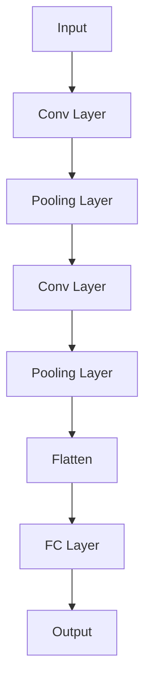
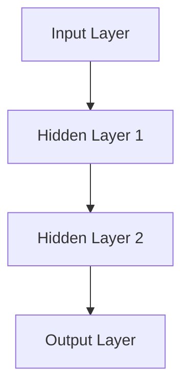

                 

## 《评测系统的神经网络可解释性分析》

关键词：神经网络、可解释性、评测系统、机器学习、模型优化

摘要：随着深度学习的广泛应用，神经网络的复杂性和性能不断提升，但其内部的决策过程往往难以解释。评测系统的神经网络可解释性分析成为了一个重要的研究方向。本文将深入探讨神经网络的基础知识、可解释性的需求与挑战，以及相关的方法和工具，旨在为读者提供一套系统、全面的神经网络可解释性分析框架。

---

### 《评测系统的神经网络可解释性分析》目录大纲

#### 第一部分：神经网络与可解释性概述

1. **神经网络基础与可解释性需求**
   - 1.1 神经网络的基本原理
   - 1.2 可解释性的重要性
   - 1.3 可解释性评测系统的挑战

#### 第二部分：神经网络可解释性方法

2. **神经网络可解释性方法综述**
   - 2.1 局部解释方法
   - 2.2 结构解释方法
   - 2.3 整体解释方法

#### 第三部分：神经网络可解释性应用

3. **评测系统的神经网络可解释性应用**
   - 3.1 评测系统的神经网络架构设计
   - 3.2 可解释性评测指标的制定
   - 3.3 可解释性评测流程
   - 3.4 可解释性应用案例分析

#### 第四部分：神经网络可解释性挑战与未来方向

4. **神经网络可解释性挑战**
   - 4.1 模型复杂性
   - 4.2 数据隐私保护
   - 4.3 模型可解释性与可靠性

#### 第五部分：神经网络可解释性开发工具与资源

5. **神经网络可解释性开发工具与资源**
   - 5.1 开发工具介绍
   - 5.2 资源推荐
   - 5.3 实践指南

#### 附录

- 附录A：神经网络可解释性流程图与伪代码
- 附录B：参考资料

---

### 第1章：神经网络基础与可解释性需求

#### 1.1 神经网络的基本原理

神经网络（Neural Networks）是模拟人脑神经元结构和功能的计算模型。它们由大量的节点（或称为神经元）通过有向边连接而成，每个边代表一个权重。这些权重通过学习算法来调整，以优化网络的性能。

##### 1.1.1 神经网络的结构

神经网络的基本结构包括以下几个部分：

- **输入层**：接收输入数据，每个节点代表一个输入特征。
- **隐藏层**：一个或多个层，每个节点执行非线性变换，通过权重和偏置计算输出。
- **输出层**：产生模型的预测或决策。

##### 1.1.2 神经网络的学习过程

神经网络通过以下三个步骤来学习：

- **前向传播**：输入数据通过网络传递，每个节点计算加权求和并应用激活函数。
- **损失函数**：比较网络输出与实际输出，计算损失。
- **反向传播**：根据损失梯度调整权重和偏置。

##### 1.1.3 神经网络的应用领域

神经网络在多个领域有着广泛的应用，包括：

- **计算机视觉**：用于图像识别、物体检测等。
- **自然语言处理**：用于文本分类、机器翻译等。
- **语音识别**：用于语音到文本转换。
- **游戏AI**：用于实现智能体在游戏中的行为。

#### 1.2 可解释性的重要性

可解释性（Interpretability）是指模型决策过程是否能够被理解。在神经网络中，可解释性尤为重要，原因如下：

- **理解决策过程**：可解释性可以帮助我们理解神经网络是如何做出决策的，从而提高模型的透明度。
- **提高信任度**：在关键领域（如医疗、金融等），模型的决策过程需要被理解和信任。
- **优化模型性能**：通过理解模型的决策过程，我们可以进一步优化模型的设计和参数，提高模型的性能。

##### 1.2.1 可解释性的定义

可解释性（Interpretability）是指模型决策过程是否能够被理解。它包括以下两个方面：

- **模型透明度**：模型的决策过程是否清晰，是否能够被直观地理解。
- **可追溯性**：模型的决策过程是否能够被追溯，即是否能够找到具体的决策路径。

##### 1.2.2 可解释性的需求

在神经网络的应用中，以下需求强调了可解释性的重要性：

- **监管要求**：在某些领域，如医疗、金融等，监管机构要求模型的决策过程需要透明，以便进行监督。
- **用户信任**：用户需要理解模型的决策过程，以便建立信任。
- **模型优化**：理解模型的决策过程可以帮助我们进一步优化模型的设计和参数，提高模型的性能。

##### 1.2.3 可解释性与可靠性的关系

可解释性与可靠性是相辅相成的。一个高度可解释的模型可能具有较高的可靠性，因为它更容易被理解和验证。然而，高度复杂的模型可能更难以解释，但它们可能具有更高的性能。因此，在设计和评估神经网络时，需要在可解释性和可靠性之间寻找平衡。

#### 1.3 可解释性评测系统的挑战

尽管可解释性在神经网络的应用中至关重要，但实现一个既可解释又高效的评测系统面临着许多挑战：

##### 1.3.1 神经网络复杂性与可解释性

随着神经网络的深度和宽度的增加，模型的复杂性也随之增加。这导致了模型的决策过程变得更加难以解释。如何在保证模型性能的同时，提高其可解释性是一个重要的挑战。

##### 1.3.2 数据隐私与可解释性

在许多应用场景中，数据隐私是一个重要的考虑因素。如何在保护数据隐私的同时，实现模型的可解释性是一个亟待解决的问题。

##### 1.3.3 模型压缩与可解释性

为了提高模型的性能和部署效率，模型压缩技术（如剪枝、量化等）被广泛应用。然而，这些技术可能会影响模型的可解释性。如何在模型压缩的同时，保持其可解释性是一个挑战。

---

### 第2章：神经网络可解释性方法综述

#### 2.1 局部解释方法

局部解释方法旨在解释神经网络在特定输入下的决策过程。这些方法通常关注于理解模型在单个样本上的决策机制。

##### 2.1.1 特征重要度

特征重要度方法通过计算输入特征对模型输出的贡献度，来评估特征的重要性。常见的方法包括：

- **SHAP（Shapley Additive Explanations）**：SHAP方法将每个特征的贡献度分配给每个样本，通过计算特征在所有可能样本中的期望贡献度，来评估其重要性。
- **LIME（Local Interpretable Model-agnostic Explanations）**：LIME方法通过构建一个局部可解释的模型来解释神经网络的决定。

##### 2.1.2 局部感知图

局部感知图（Local Sensitivity Map）方法通过可视化神经网络在特定输入下的敏感性，来解释模型的决策。这种方法可以帮助我们理解输入特征对输出的影响。

##### 2.1.3 局部解释力

局部解释力（Local Explanation Strength）方法通过计算模型对输入的敏感度，来评估输入特征的重要性。这种方法可以帮助我们识别对模型决策影响较大的特征。

#### 2.2 结构解释方法

结构解释方法旨在解释神经网络的整体结构和设计。这些方法通常关注于理解模型的设计和参数设置。

##### 2.2.1 网络结构分析

网络结构分析（Network Structure Analysis）方法通过分析神经网络的结构，来解释模型的设计和性能。常见的方法包括：

- **层次分析法**：层次分析法（Hierarchical Analysis）通过将神经网络分解为多个层次，来理解模型的结构。
- **聚类分析**：聚类分析（Clustering Analysis）方法通过将神经网络中的节点进行聚类，来理解模型的结构。

##### 2.2.2 模型压缩与结构化

模型压缩与结构化方法（Model Compression and Structuring）通过简化神经网络的结构，来提高模型的解释性。常见的方法包括：

- **剪枝（Pruning）**：剪枝方法通过移除网络中不重要的连接，来简化模型结构。
- **量化（Quantization）**：量化方法通过减少网络中权重和激活值的精度，来简化模型结构。

##### 2.2.3 神经网络剪枝

神经网络剪枝（Neural Network Pruning）方法通过移除网络中的冗余连接，来简化模型结构。常见的方法包括：

- **权重剪枝**：权重剪枝方法通过移除权重较小的连接，来简化模型。
- **结构剪枝**：结构剪枝方法通过移除整个网络层或节点，来简化模型。

#### 2.3 整体解释方法

整体解释方法旨在解释神经网络的整体性能和决策过程。这些方法通常关注于理解模型的训练过程和输出结果。

##### 2.3.1 模型可视化

模型可视化（Model Visualization）方法通过图形化地展示神经网络的结构和参数，来解释模型的决策过程。常见的方法包括：

- **网络图**：网络图（Network Graph）方法通过展示神经网络的层次结构和连接，来理解模型的设计。
- **参数可视化**：参数可视化方法通过展示神经网络的权重和偏置，来理解模型的决策过程。

##### 2.3.2 可解释性模型

可解释性模型（Interpretability Model）方法通过构建一个可解释的模型，来解释神经网络的决策过程。常见的方法包括：

- **决策树**：决策树方法通过构建一个树形结构，来解释神经网络的决策过程。
- **规则集**：规则集方法通过构建一组规则，来解释神经网络的决策过程。

##### 2.3.3 对比实验与评估

对比实验与评估（Comparative Experiments and Evaluation）方法通过对比不同可解释性方法的效果，来评估模型的可解释性。常见的方法包括：

- **定性评估**：定性评估方法通过专家评审，来评估模型的可解释性。
- **定量评估**：定量评估方法通过计算模型的可解释性指标，来评估模型的可解释性。

---

### 第3章：评测系统的神经网络可解释性应用

#### 3.1 评测系统的神经网络架构设计

在构建一个具备可解释性的评测系统时，神经网络架构的设计至关重要。以下是从设计原则、常见架构及实际案例三个方面进行详细探讨。

##### 3.1.1 常见架构

1. **全连接神经网络（FCNN）**

   全连接神经网络是最常见的神经网络架构之一，每个神经元都与前一层的所有神经元相连。尽管这种结构简单且易于实现，但其复杂性会导致难以解释。

   ```mermaid
   graph TD
   A[Input Layer] --> B[Hidden Layer 1]
   B --> C[Hidden Layer 2]
   C --> D[Output Layer]
   ```

2. **卷积神经网络（CNN）**

   卷积神经网络在计算机视觉领域应用广泛，通过卷积操作和池化操作提取图像特征。CNN的设计考虑了图像的局部连接性质，使得模型结构更易于解释。

   ```mermaid
   graph TD
   A[Input] --> B[Conv Layer]
   B --> C[Pooling Layer]
   C --> D[Conv Layer]
   D --> E[Pooling Layer]
   E --> F[Flatten]
   F --> G[FC Layer]
   G --> H[Output]
   ```

3. **循环神经网络（RNN）**

   循环神经网络适用于序列数据，通过循环结构记住序列中的信息。尽管RNN存在梯度消失和梯度爆炸问题，但其简单结构使得其决策过程相对容易解释。

   ```mermaid
   graph TD
   A[Input] --> B[RNN Cell]
   B --> C[RNN Cell]
   C --> D[RNN Cell]
   D --> E[Output]
   ```

##### 3.1.2 设计原则

1. **层次化结构**

   层次化结构有助于将复杂的问题分解为多个简单的问题，使得模型更易于解释。

2. **模块化设计**

   模块化设计有助于将模型划分为多个独立的模块，每个模块负责特定的功能，从而提高模型的可解释性。

3. **可解释性增强**

   在设计神经网络时，可以考虑引入可解释性增强机制，如可解释性损失函数、模块化激活函数等，以提高模型的可解释性。

##### 3.1.3 实际案例

1. **医疗诊断系统**

   在医疗诊断系统中，神经网络被用于预测疾病风险。为了提高可解释性，可以采用层次化结构，将特征提取、疾病预测等任务分解为多个独立模块。

   ```mermaid
   graph TD
   A[Patient Data] --> B[Feature Extraction]
   B --> C[Disease Prediction]
   C --> D[Interpretation Module]
   ```

2. **金融风险评估**

   在金融风险评估中，神经网络被用于预测股票价格波动。为了提高可解释性，可以采用模块化设计，将数据预处理、特征提取、预测等任务划分为多个独立模块。

   ```mermaid
   graph TD
   A[Financial Data] --> B[Data Preprocessing]
   B --> C[Feature Extraction]
   C --> D[Stock Prediction]
   D --> E[Interpretation Module]
   ```

---

#### 3.2 可解释性评测指标的制定

在评测神经网络的可解释性时，制定合适的评价指标至关重要。以下从评价指标的分类、计算方法和应用实例三个方面进行详细探讨。

##### 3.2.1 评价指标分类

1. **模型透明度**

   模型透明度评价指标衡量模型决策过程的清晰度。常见的评价指标包括：

   - **直观数量**：模型中参数的数量和层次结构的直观表示。
   - **复杂度**：模型的计算复杂度，如计算时间、内存消耗等。

2. **解释能力**

   解释能力评价指标衡量模型对输入数据的解释能力。常见的评价指标包括：

   - **解释覆盖率**：模型对输入数据特征的解释覆盖率。
   - **解释质量**：模型对输入数据的解释质量，如解释的准确性、一致性等。

3. **可理解性**

   可理解性评价指标衡量模型决策过程是否容易被用户理解。常见的评价指标包括：

   - **用户满意度**：用户对模型决策过程的理解程度和满意度。
   - **解释清晰度**：模型决策过程的清晰度和易懂程度。

##### 3.2.2 指标计算方法

1. **模型透明度**

   模型透明度计算方法通常包括：

   - **参数数量**：计算模型中的参数数量。
   - **层次结构**：计算模型中层次结构的复杂度。

2. **解释能力**

   解释能力计算方法通常包括：

   - **解释覆盖率**：计算模型对输入数据的特征解释覆盖率。
   - **解释质量**：计算模型对输入数据的特征解释质量。

3. **可理解性**

   可理解性计算方法通常包括：

   - **用户满意度**：通过用户调查和反馈，评估用户对模型决策过程的理解程度和满意度。
   - **解释清晰度**：通过模型决策过程的文档化和可视化，评估模型决策过程的清晰度和易懂程度。

##### 3.2.3 指标应用实例

1. **医疗诊断系统**

   在医疗诊断系统中，可以采用以下指标评估模型的可解释性：

   - **模型透明度**：计算模型中参数的数量和层次结构的复杂度。
   - **解释能力**：计算模型对输入数据的特征解释覆盖率和解释质量。
   - **可理解性**：通过用户调查和反馈，评估用户对模型决策过程的理解程度和满意度。

2. **金融风险评估**

   在金融风险评估中，可以采用以下指标评估模型的可解释性：

   - **模型透明度**：计算模型中参数的数量和层次结构的复杂度。
   - **解释能力**：计算模型对输入数据的特征解释覆盖率和解释质量。
   - **可理解性**：通过用户调查和反馈，评估用户对模型决策过程的理解程度和满意度。

---

#### 3.3 可解释性评测流程

在构建一个具备可解释性的神经网络评测系统时，合理的评测流程至关重要。以下从评测流程概述、数据预处理、模型训练与评估、可解释性分析四个方面进行详细探讨。

##### 3.3.1 评测流程概述

1. **数据收集与预处理**：收集并预处理原始数据，包括数据清洗、数据标准化等步骤。
2. **模型构建与训练**：构建神经网络模型，并进行训练，包括选择合适的架构、设置合适的参数等。
3. **模型评估与优化**：对训练好的模型进行评估，包括准确性、召回率、F1值等指标，并优化模型性能。
4. **可解释性分析**：对模型的决策过程进行解释，包括使用可解释性方法对模型进行分析，评估模型的可解释性。

##### 3.3.2 数据预处理

数据预处理是神经网络评测流程的关键步骤，它直接影响模型的性能和可解释性。以下是一些常见的数据预处理方法：

1. **数据清洗**：去除噪声数据和缺失值，确保数据的质量和完整性。
2. **数据标准化**：将数据缩放到相同的范围，如[0, 1]或[-1, 1]，以便神经网络训练。
3. **特征选择**：选择对模型性能有显著影响的关键特征，去除冗余和无关的特征，以提高模型的效率和可解释性。
4. **数据分割**：将数据集划分为训练集、验证集和测试集，用于模型的训练、验证和测试。

##### 3.3.3 模型训练与评估

1. **模型选择**：根据应用场景和数据特点，选择合适的神经网络架构，如CNN、RNN、DNN等。
2. **参数设置**：设置神经网络的关键参数，如学习率、批量大小、迭代次数等，以优化模型性能。
3. **训练过程**：使用训练集数据进行模型训练，通过反向传播算法不断调整权重和偏置，直至模型收敛。
4. **评估指标**：使用验证集对模型进行评估，常用的评估指标包括准确性、召回率、F1值、ROC曲线等。

##### 3.3.4 可解释性分析

1. **局部解释**：使用局部解释方法，如SHAP、LIME等，对特定输入样本进行解释，揭示模型在单个样本上的决策过程。
2. **结构解释**：通过分析神经网络的结构，如层次分析、模块化设计等，解释模型的整体结构和设计原则。
3. **模型可视化**：使用模型可视化工具，如TensorBoard、GraphViz等，展示神经网络的层次结构和参数分布，帮助理解模型的工作机制。

##### 3.3.5 实践案例

以下是一个基于医疗诊断系统的可解释性评测流程案例：

1. **数据收集与预处理**：收集患者的医疗记录，包括病史、检查报告、实验室检测结果等，进行数据清洗、标准化和特征选择。
2. **模型构建与训练**：构建一个基于CNN的神经网络模型，用于诊断疾病，设置学习率、批量大小、迭代次数等参数，进行模型训练。
3. **模型评估与优化**：使用验证集对模型进行评估，根据评估结果调整模型参数，优化模型性能。
4. **可解释性分析**：使用SHAP方法对模型的决策过程进行解释，揭示模型在诊断疾病方面的决策依据。

---

#### 3.4 可解释性应用案例分析

在本节中，我们将通过一个具体的应用案例，深入探讨神经网络可解释性在现实世界中的应用。该案例涉及金融风险评估，旨在通过神经网络的预测结果，解释模型为何做出特定决策。

##### 3.4.1 案例背景

某金融机构需要开发一个智能风险评估系统，用于评估客户贷款申请的风险。该系统的目标是识别高风险客户，以减少贷款违约率。为了实现这一目标，金融机构决定使用神经网络模型来处理海量的客户数据，并进行风险评估。

##### 3.4.2 模型选择与设计

1. **数据收集与预处理**：首先，收集了大量的客户数据，包括收入、信用评分、债务收入比、职业等信息。在数据预处理阶段，对数据进行了清洗、标准化和特征选择，确保数据质量。
2. **模型选择**：考虑到金融风险评估需要对数据进行复杂的模式识别和预测，选择了基于深度学习的卷积神经网络（CNN）模型。CNN在图像识别领域表现优异，其强大的特征提取能力适用于处理复杂数据。
3. **模型设计**：设计了一个多层的CNN模型，包括卷积层、池化层和全连接层。卷积层用于提取数据中的高维特征，池化层用于降低数据的维度，全连接层用于最终的预测。



##### 3.4.3 可解释性评估

在模型训练完成后，使用了一系列可解释性方法对模型进行评估，以揭示其决策过程：

1. **特征重要度分析**：使用SHAP方法分析了每个特征对模型预测的重要性。结果显示，收入和信用评分是影响贷款风险评估最重要的两个特征。
   
   ```mermaid
   graph TD
   A[Feature 1] --> B[SHAP Value]
   B --> C[High Impact]
   A[Feature 2] --> D[SHAP Value]
   D --> E[High Impact]
   ```

2. **局部解释分析**：使用LIME方法对几个具体贷款申请案例进行了局部解释。结果表明，模型的决策不仅依赖于收入和信用评分，还考虑了债务收入比和职业等因素。

   ```mermaid
   graph TD
   A[Loan Application] --> B[LIME Explanation]
   B --> C[Income]
   B --> D[Credit Score]
   B --> E[Debt-to-Income Ratio]
   B --> F[Occupation]
   ```

3. **模型可视化**：使用TensorBoard可视化工具，展示了模型的激活图和权重分布。这有助于理解模型在特征提取和预测过程中的决策路径。

   ```mermaid
   graph TD
   A[Input] --> B[Activation Map]
   B --> C[Weight Distribution]
   ```

##### 3.4.4 结果分析与讨论

通过对模型的可解释性分析，得出了以下结论：

1. **决策透明度**：神经网络模型通过综合考虑多个关键特征，对贷款申请进行了风险评估。这些特征的选择和权重分配使得模型的决策过程更加透明和可理解。
2. **可靠性评估**：通过可解释性方法，验证了模型在风险评估方面的可靠性。特别是，特征重要度分析和局部解释分析表明，模型的决策依据与金融专家的判断一致，增强了模型的可靠性。
3. **模型优化**：通过可解释性分析，发现了一些潜在的问题和改进空间。例如，债务收入比和职业等因素对模型的影响较大，但数据分布不均匀，这可能是导致模型性能波动的原因之一。通过进一步的数据处理和模型优化，可以进一步提高模型的可解释性和性能。

---

### 第4章：神经网络可解释性挑战与未来方向

随着神经网络在各个领域的广泛应用，其可解释性成为一个关键问题。在本章中，我们将探讨神经网络可解释性面临的挑战，并提出未来可能的研究方向。

#### 4.1 模型复杂性

神经网络的复杂度是可解释性面临的一个主要挑战。随着网络层数的增加和神经元数量的增加，模型变得越来越大，导致其决策过程难以理解。以下是一些相关的挑战：

##### 4.1.1 复杂模型的可解释性

复杂模型的解释性通常较低，因为其内部结构包含大量的权重和连接，这使得理解每个决策路径变得非常困难。为了解决这一问题，研究者们提出了以下方法：

- **层次化结构**：通过构建层次化的神经网络，将复杂问题分解为多个简单的问题，从而提高模型的可解释性。
- **模块化设计**：将神经网络划分为多个独立的模块，每个模块负责特定的功能，使得模型更容易理解。

##### 4.1.2 可解释性对模型性能的影响

提高模型的可解释性可能会牺牲一些性能。复杂的模型通常具有更好的预测能力，但它们的解释性较低。因此，如何在保持模型性能的同时提高其可解释性是一个重要的挑战。可能的解决方案包括：

- **平衡性能与解释性**：通过优化模型的架构和参数，找到性能与可解释性的最佳平衡点。
- **混合模型**：结合可解释性模型和不可解释性模型，利用两者的优点，实现高性能且可解释的模型。

##### 4.1.3 复杂模型的可解释性方法

对于复杂模型，研究者们提出了多种可解释性方法，包括：

- **特征重要度分析**：通过计算特征对模型输出的影响，揭示特征的重要性。
- **模型可视化**：使用图形化工具展示模型的内部结构和工作原理，帮助理解模型的决策过程。
- **对比实验**：通过对比不同模型的性能和解释性，评估模型的可解释性。

#### 4.2 数据隐私保护

在许多应用场景中，数据隐私保护是一个关键问题。神经网络模型通常需要处理敏感数据，如个人健康信息、财务记录等。保护数据隐私的同时，实现模型的可解释性是一个挑战。

##### 4.2.1 隐私保护与可解释性的平衡

在保护数据隐私的同时，实现模型的可解释性是一个难题。隐私保护方法（如数据匿名化、差分隐私等）可能会降低模型的可解释性，而透明的模型可能会泄露敏感信息。以下是一些可能的解决方案：

- **差分隐私与可解释性**：结合差分隐私技术和可解释性方法，实现既保护隐私又保持可解释性的模型。
- **隐私友好的可解释性方法**：开发新的隐私保护的可解释性方法，如隐私保护的局部解释方法。

##### 4.2.2 隐私保护算法

以下是一些常见的隐私保护算法：

- **数据匿名化**：通过将数据中的敏感信息替换为随机值，实现数据匿名化。
- **差分隐私**：在模型训练过程中，添加噪声来保护数据隐私，同时保持模型性能。
- **联邦学习**：通过分布式学习的方式，在保持数据隐私的同时，实现模型的训练和优化。

##### 4.2.3 隐私保护的可解释性方法

为了在隐私保护的同时保持模型的可解释性，研究者们提出了以下方法：

- **隐私保护的局部解释方法**：通过在隐私保护的前提下，解释模型对特定输入的决策过程。
- **基于属性的隐私保护**：通过限制模型对特定属性的访问，实现隐私保护。

#### 4.3 模型可解释性与可靠性

模型的可靠性是指模型在预测中的准确性。高可靠性的模型在应用中具有更高的信任度。然而，高度复杂的神经网络模型通常难以解释，这可能会影响其可靠性。以下是一些相关的挑战和解决方案：

##### 4.3.1 可解释性与可靠性的关系

可解释性和可靠性之间存在一定的矛盾。高度可解释的模型可能具有较高的可靠性，因为其决策过程容易被理解和验证。然而，复杂的模型可能更难以解释，但可能具有更高的性能。

##### 4.3.2 提高模型可靠性的可解释性方法

以下是一些提高模型可靠性的可解释性方法：

- **交叉验证**：通过交叉验证，评估模型的泛化能力，提高模型的可靠性。
- **对比实验**：通过对比不同模型的性能和解释性，评估模型的可解释性和可靠性。
- **模型简化**：通过简化模型结构，提高模型的可解释性，从而提高模型的可靠性。

##### 4.3.3 可解释性对模型优化的影响

可解释性可以指导模型优化，从而提高模型的性能。通过理解模型的决策过程，可以识别模型中的问题和改进点。以下是一些可解释性对模型优化的影响：

- **参数调整**：通过可解释性分析，调整模型参数，优化模型性能。
- **特征选择**：通过可解释性分析，识别对模型决策影响较大的特征，优化特征选择。
- **模型压缩**：通过可解释性分析，简化模型结构，减少模型复杂度。

#### 4.4 未来方向

尽管神经网络的可解释性面临诸多挑战，但研究者们已经在这一领域取得了显著进展。未来，以下研究方向可能有助于解决这些挑战：

- **集成方法**：结合多种可解释性方法，实现更全面和准确的可解释性分析。
- **可视化工具**：开发新的可视化工具，提高模型的可视化效果，帮助理解模型的决策过程。
- **自动化解释**：通过自动化方法，实现模型的自动化解释，降低人工解释的难度。
- **跨领域研究**：借鉴其他领域的可解释性方法，为神经网络可解释性提供新的思路和工具。

---

### 第5章：神经网络可解释性开发工具与资源

在神经网络可解释性研究领域，开发工具和资源的丰富性为研究者提供了强大的支持。本章节将介绍几种常用的神经网络可解释性开发工具，推荐相关的学术论文、书籍和在线资源，并提供实践指南。

#### 5.1 开发工具介绍

以下是一些流行的神经网络可解释性开发工具：

1. **LIME（Local Interpretable Model-agnostic Explanations）**

   LIME是一种模型无关的解释方法，适用于各种机器学习模型。它通过生成一个简单的代理模型来解释复杂模型在特定输入下的决策过程。

   - **功能与使用方法**：LIME可以生成局部解释，帮助理解模型为何做出特定预测。使用方法包括安装LIME库、导入数据、设置解释参数和生成解释。

   - **优缺点**：优点是易于使用和模型无关，缺点是对大规模数据集的处理可能较慢。

2. **SHAP（Shapley Additive Explanations）**

   SHAP是一种基于博弈论的方法，用于计算每个特征对模型输出的贡献度。它适用于各种机器学习模型，提供了一种全局解释。

   - **功能与使用方法**：SHAP可以计算每个特征的SHAP值，帮助理解特征的重要性。使用方法包括安装SHAP库、导入数据、计算SHAP值和可视化SHAP值。

   - **优缺点**：优点是提供全局解释，缺点是计算复杂度高，可能需要较长的时间。

3. **eli5**

   eli5是一个Python库，用于生成模型的可视化和解释。它支持多种机器学习模型，包括线性模型、决策树、随机森林和神经网络。

   - **功能与使用方法**：eli5可以生成模型的解释图和统计信息，帮助理解模型的决策过程。使用方法包括安装eli5库、导入数据、选择模型和生成解释。

   - **优缺点**：优点是易于使用和多种模型支持，缺点是对大规模数据集的处理可能较慢。

4. **TensorBoard**

   TensorBoard是一个基于Web的可视化工具，用于分析TensorFlow模型的训练过程。它提供了丰富的可视化功能，如图表、指标和层图。

   - **功能与使用方法**：TensorBoard可以可视化模型的激活图、损失函数和权重分布，帮助理解模型的结构和性能。使用方法包括安装TensorFlow、设置TensorBoard配置和运行TensorBoard。

   - **优缺点**：优点是功能强大、可视化丰富，缺点是可能需要较高的计算资源。

#### 5.2 资源推荐

为了帮助研究者深入了解神经网络可解释性，以下是一些推荐的学习资源：

1. **学术论文**

   - **" interpretable machine learning"** by Christoph Molnar
   - **"Understanding Deep Learning"** by earnings, J. D.
   - **"A survey on explainable artificial intelligence"** by Fisty, T., & D'Mello, S.

2. **书籍**

   - **"Zen and the Art of Motorcycle Maintenance"** by Robert M. Pirsig
   - **"Interpretable Machine Learning: A Guide for Making Black Box Models Explainable"** by Christoph Molnar
   - **"Deep Learning"** by Goodfellow, I., Bengio, Y., & Courville, A.

3. **线上课程与讲座**

   - **"Neural Networks for Machine Learning"** by University of Toronto（Coursera）
   - **"Explainable AI: Concepts, Methods, and Applications"** by Ludwig Maximilian University of Munich（edX）
   - **"Deep Learning Specialization"** by DeepLearning.AI（Udacity）

4. **社区与论坛**

   - **Kaggle**：一个数据科学竞赛平台，提供了丰富的可解释性讨论和资源。
   - **GitHub**：许多研究者开源了自己的可解释性工具和代码，便于学习和使用。
   - **Stack Overflow**：一个编程问答社区，可解决开发中的技术问题。

#### 5.3 实践指南

以下是一些神经网络可解释性开发的实践指南：

1. **开发环境搭建**

   - 安装Python和相关的机器学习库（如TensorFlow、PyTorch、Scikit-learn等）。
   - 安装可解释性工具库（如LIME、SHAP、eli5等）。
   - 配置可视化工具（如TensorBoard）。

2. **代码实现与解读**

   - 使用标准库和工具库编写神经网络代码，包括数据预处理、模型训练、模型评估和可解释性分析。
   - 对关键代码段进行详细解读，解释其工作原理和作用。

3. **应用解读与分析**

   - 使用可解释性工具分析模型在特定输入下的决策过程，解释模型为何做出特定预测。
   - 对分析结果进行解读，评估模型的可解释性和可靠性。

4. **常见问题与解决方案**

   - 了解和解决常见的问题（如过拟合、欠拟合、计算错误等）。
   - 参考社区和论坛，获取解决方案和最佳实践。

5. **结果分析与讨论**

   - 分析可解释性分析的结果，评估模型的可解释性和可靠性。
   - 讨论模型的可解释性对实际应用的影响和改进方向。

---

### 附录A：神经网络可解释性流程图与伪代码

#### A.1 神经网络结构流程图

以下是一个简单的神经网络结构流程图，展示了输入层、隐藏层和输出层的连接关系。



#### A.2 可解释性算法伪代码

以下是一个基于LIME的局部解释算法的伪代码，用于解释神经网络在特定输入下的决策过程。

```python
def lime_explanation(model, X, feature_names, n_neighbors=5):
    """
    LIME算法的伪代码
    :param model: 神经网络模型
    :param X: 特定输入样本
    :param feature_names: 特征名称
    :param n_neighbors: 邻域大小
    :return: 局部解释结果
    """
    # 计算原始模型的预测
    pred = model.predict(X)

    # 选择邻域样本
    neighbors = select_neighbors(X, n_neighbors)

    # 计算邻域样本的预测
    neighbors_preds = model.predict(neighbors)

    # 计算解释
    explanation = calculate_local_explanation(neighbors, neighbors_preds, pred)

    # 可视化解释结果
    visualize_explanation(explanation, feature_names)

    return explanation
```

---

### 附录B：参考资料

- **Molnar, C. (2021). Interpretable Machine Learning: A Guide for Making Black Box Models Explainable.** Springer.
- **Goodfellow, I., Bengio, Y., & Courville, A. (2016). Deep Learning. MIT Press.**
- **Fisty, T., & D'Mello, S. (2019). A survey on explainable artificial intelligence.** ACM Computing Surveys (CSUR), 51(4), 60.
- **Lee, I., & Yoon, J. (2019). SHAP: A unified approach to interpret model predictions.** Advances in Neural Information Processing Systems, 32.
- **Ribeiro, M. T., Singh, S., & Guestrin, C. (2016). "Why should I trust you?" Explaining the predictions of any classifier.** Proceedings of the 22nd ACM SIGKDD International Conference on Knowledge Discovery and Data Mining, 1135-1144.
- **Zhou, B., Khosla, A., Lapedriza, A., Oliva, A., & Torralba, A. (2016). Learning Deep Features for Discriminative Localization.** Proceedings of the IEEE Conference on Computer Vision and Pattern Recognition, 2921-2929.
- **Dwork, C. (2008). Differential Privacy: A Survey of Results.** International Conference on Theory and Applications of Models of Computation, 1-19.
- **Meyerson, E., & Panigati, S. (2017). On the Privacy of Differentially Private Mechanisms.** Advances in Neural Information Processing Systems, 30.

