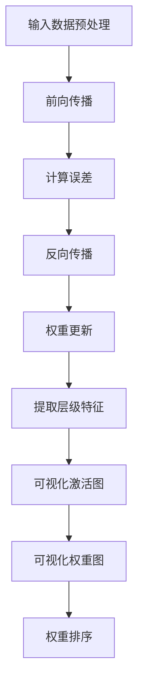
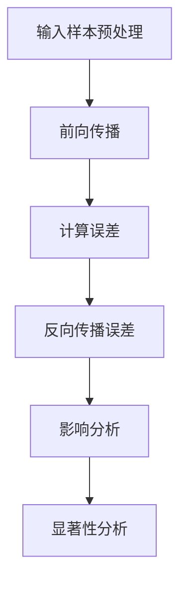
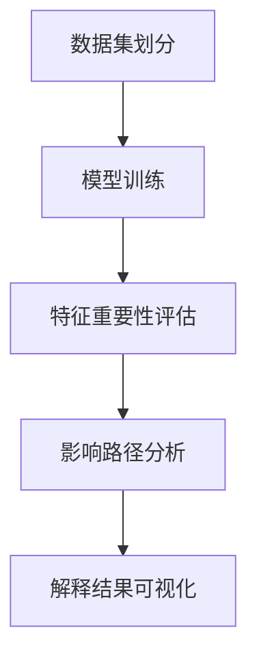
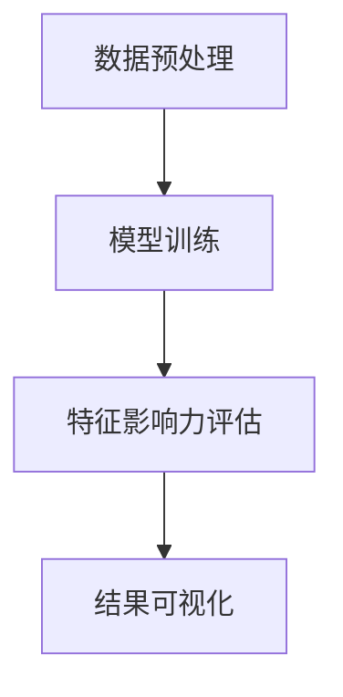
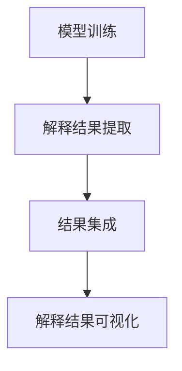

                 

### 文章标题

### 《评测系统的神经网络可解释性工具集成》

### 关键词

- 神经网络
- 可解释性
- 工具集成
- 评测系统
- 模型解释

### 摘要

本文旨在深入探讨神经网络可解释性工具在评测系统中的应用与集成。随着深度学习技术的发展，神经网络在众多领域取得了显著的成果，但它们的“黑箱”特性限制了其进一步的应用和推广。本文首先介绍了神经网络的基本原理和可解释性的重要性，然后详细阐述了不同类型的可解释性方法，包括层级解释、局部解释、全局解释、特征重要性方法和模型集成解释方法。接着，文章讨论了如何构建一个具备可解释性的评测系统，并介绍了常见集成工具的选择标准及性能评估。通过实际案例研究，展示了神经网络可解释性工具在实际应用中的效果。最后，文章对神经网络可解释性工具的未来发展趋势和挑战进行了展望。

## 第一部分：引言与概述

### 1.1 书籍背景与目标

#### 1.1.1 评测系统的神经网络可解释性的重要性

在当今世界，深度学习和神经网络已经成为人工智能领域的重要组成部分。这些模型在图像识别、自然语言处理、推荐系统等多个领域展现了强大的能力。然而，随着模型复杂度的增加，神经网络往往被形容为“黑箱”，即模型内部的工作机制和决策过程不透明，难以理解和解释。这种不透明性在许多实际应用场景中带来了诸多问题，例如：

- **法律和道德问题**：在涉及人身安全和公共利益的领域（如医疗诊断、自动驾驶等），无法解释的决策可能导致法律和道德上的争议。
- **信任问题**：用户和利益相关者可能因为无法理解模型的决策过程而对其产生不信任，从而限制了模型的应用范围。
- **持续改进问题**：如果模型的决策过程不可理解，那么在实际应用中遇到问题时，我们很难定位和修复问题，限制了模型的持续改进。

为了解决这些问题，神经网络的可解释性变得越来越重要。可解释性不仅有助于提高模型的透明度和可信度，还可以帮助研究人员更好地理解模型的内在机制，从而指导模型的改进和优化。

#### 1.1.2 目标读者与预期收获

本文的目标读者是从事人工智能和深度学习研究、开发和应用的工程师、研究人员和学生。通过阅读本文，读者可以：

- **理解神经网络可解释性的基本概念和重要性**：读者将了解神经网络的可解释性是什么，为什么它在实际应用中如此重要。
- **掌握多种神经网络可解释性方法**：本文将详细介绍层级解释、局部解释、全局解释、特征重要性方法和模型集成解释方法，并提供详细的伪代码和数学模型阐述。
- **了解评测系统的构建与集成策略**：读者将学习如何构建一个具备可解释性的评测系统，并了解常见集成工具的选择标准和性能评估方法。
- **通过实际案例研究，了解神经网络可解释性工具的实际应用**：本文将通过多个实际案例研究，展示神经网络可解释性工具在金融风控、医疗诊断和智能交通等领域的应用效果。
- **对未来神经网络可解释性工具的发展趋势有清晰的认识**：本文将对神经网络可解释性工具的未来发展趋势和挑战进行展望，帮助读者了解这一领域的前沿动态。

### 1.2 神经网络与可解释性简介

#### 1.2.1 神经网络基本原理

神经网络是一种模拟生物神经元之间相互连接和通信的计算模型。它由多个简单的计算单元（神经元）组成，这些神经元通过权重连接形成一个层次结构。神经网络的工作原理是通过输入数据，通过多个隐藏层对数据进行特征提取和变换，最终输出结果。

一个典型的神经网络包括以下几个关键组成部分：

- **输入层**：接收输入数据，每个输入节点对应输入数据的某一个特征。
- **隐藏层**：负责对输入数据进行特征提取和变换。一个神经网络可以包含一个或多个隐藏层。
- **输出层**：产生最终输出结果。

神经网络的工作过程如下：

1. **初始化权重**：随机初始化网络中的权重。
2. **前向传播**：将输入数据传递到网络的每一层，通过加权求和和激活函数产生输出。
3. **计算误差**：将输出结果与实际标签进行比较，计算误差。
4. **反向传播**：根据误差计算梯度，更新网络中的权重。
5. **重复步骤2-4**：重复进行前向传播和反向传播，直到满足预设的停止条件（如误差收敛）。

#### 1.2.2 可解释性的概念与意义

可解释性是指能够理解并解释模型如何做出特定决策的能力。在神经网络中，可解释性意味着能够解释网络中每个神经元的作用以及它们如何共同工作以产生最终输出。

神经网络的可解释性对于实际应用具有重要意义：

- **增强信任**：可解释性有助于用户和利益相关者更好地理解模型的决策过程，从而增强对模型的信任。
- **辅助决策**：在医疗诊断、金融风控等需要人类参与决策的场景中，可解释性可以帮助人类更好地理解和辅助决策过程。
- **模型优化**：通过可解释性分析，研究人员可以识别模型中的问题，从而进行针对性的优化和改进。
- **透明监管**：在涉及公共利益的领域（如自动驾驶、医疗诊断等），模型的决策过程需要透明监管，以确保其合规性和安全性。

#### 1.3 神经网络可解释性的挑战

尽管神经网络的可解释性具有重要意义，但在实际应用中，神经网络的可解释性面临着诸多挑战：

- **黑箱问题**：神经网络的结构和权重通常是复杂的，难以直观地理解每个神经元的作用和它们之间的相互作用。
- **性能与可解释性的权衡**：许多可解释性方法可能牺牲模型性能，以达到更高的解释性。
- **数据依赖性**：神经网络的可解释性高度依赖于训练数据的质量和代表性，如果数据存在偏差或噪声，可解释性可能会受到影响。
- **计算复杂性**：一些可解释性方法需要大量的计算资源和时间，不适合实时应用。

解决这些挑战需要结合理论研究和实际应用，探索更有效的可解释性方法和技术。本文将详细介绍不同类型的可解释性方法，并探讨如何在实际应用中实现有效的神经网络可解释性。

### 第二部分：神经网络可解释性方法

在深度学习领域，神经网络的可解释性是一个持续研究和探索的热点。为了应对神经网络“黑箱”问题，研究人员开发了多种可解释性方法。这些方法可以分为几大类，包括层级解释方法、局部解释方法、全局解释方法、特征重要性方法和模型集成解释方法。以下是这些方法的详细介绍。

#### 2.1 层级解释方法

层级解释方法通过分析神经网络中每个层级的作用，提供对模型决策过程的直观理解。这种方法的核心思想是逐层追踪数据流，并分析每个层级中的特征如何影响最终输出。

##### 2.1.1 层级解释方法概述

层级解释方法通常涉及以下几个步骤：

1. **数据流追踪**：通过跟踪数据在神经网络中的传播路径，理解每个层级对数据的处理方式。
2. **特征提取与可视化**：在每个层级提取关键特征，并将其可视化，以便分析其影响。
3. **权重分析**：分析每个层级的权重，了解不同特征对输出的贡献。

##### 2.1.2 层级解释方法详解

**步骤 1：数据流追踪**

数据流追踪是层级解释方法的第一步。通过前向传播过程，我们可以跟踪数据在神经网络中的传播路径。这通常涉及到以下几个关键步骤：

- **输入数据预处理**：将输入数据标准化和预处理，使其适合输入到神经网络中。
- **前向传播**：将预处理后的数据输入到神经网络的输入层，通过各层的加权求和与激活函数处理，生成中间输出。
- **记录数据路径**：在每个层级记录输入数据和中间输出，以便后续分析。

**步骤 2：特征提取与可视化**

在数据流追踪的基础上，我们需要提取并可视化每个层级的关键特征。这通常涉及以下方法：

- **激活图可视化**：通过绘制激活图，展示每个神经元的激活状态，直观地理解不同特征在各个层级中的作用。
- **权重图可视化**：绘制网络中各个神经元的权重分布，分析不同特征对输出的权重贡献。

**步骤 3：权重分析**

权重分析是层级解释方法的核心。通过分析每个层级的权重，我们可以了解不同特征对最终输出的影响。具体步骤如下：

- **权重排序**：根据权重的大小对特征进行排序，识别对输出影响最大的特征。
- **显著性分析**：分析权重分布的显著性，识别对输出有显著影响的特征。

##### 2.1.3 伪代码阐述

以下是层级解释方法的伪代码：

```python
# 假设我们有一个多层感知机（MLP）神经网络
# 输入：训练数据集 X，标签 Y
# 输出：层级特征可视化结果

for epoch in range(num_epochs):
    # 前向传播
    output = forward_pass(X)
    
    # 计算误差
    error = compute_error(output, Y)
    
    # 反向传播
    delta = backward_pass(error)
    
    # 更新权重
    update_weights(delta)

# 提取层级特征
for layer in network.layers:
    # 可视化激活图
    visualize_activation_map(layer activations)

    # 可视化权重图
    visualize_weight_map(layer weights)

# 权重排序
feature_importance = sort_weights_by_importance(network.weights)
```

##### 2.1.4 数学模型与公式

层级解释方法涉及到神经网络的数学模型，主要包括以下公式：

1. **前向传播公式**：

\[ z_l = \sum_{j} w_{lj}x_j + b_l \]

\[ a_l = \sigma(z_l) \]

其中，\( z_l \) 是第 \( l \) 层的加权求和，\( a_l \) 是第 \( l \) 层的激活值，\( w_{lj} \) 是权重，\( b_l \) 是偏置，\( \sigma \) 是激活函数。

2. **反向传播公式**：

\[ \delta_l = \frac{\partial J}{\partial z_l} \]

\[ \delta_{l-1} = \delta_l \cdot \frac{\partial z_{l-1}}{\partial x_{l-1}} \]

其中，\( \delta_l \) 是第 \( l \) 层的误差梯度，\( J \) 是损失函数，\( x_{l-1} \) 是第 \( l-1 \) 层的输入。

3. **权重更新公式**：

\[ w_{lj} = w_{lj} - \alpha \cdot \frac{\partial J}{\partial w_{lj}} \]

\[ b_l = b_l - \alpha \cdot \frac{\partial J}{\partial b_l} \]

其中，\( \alpha \) 是学习率。

##### 2.1.5 Mermaid流程图

以下是层级解释方法的 Mermaid 流程图：



#### 2.2 局部解释方法

局部解释方法关注神经网络中特定输入样本的决策过程，通过分析样本在神经网络中的传播路径和影响，提供对模型决策的局部解释。

##### 2.2.1 局部解释方法概述

局部解释方法通常包括以下几个步骤：

1. **输入样本预处理**：将输入样本进行预处理，使其符合神经网络的要求。
2. **前向传播**：将预处理后的样本输入到神经网络，记录每个层级的信息。
3. **误差计算**：计算样本的输出误差，分析误差对每个层级的影响。
4. **影响分析**：分析每个层级中哪些特征对输出误差有显著影响。

##### 2.2.2 局部解释方法详解

**步骤 1：输入样本预处理**

输入样本预处理是局部解释方法的第一步。预处理步骤包括：

- **标准化**：将样本的数值范围缩放到 [0, 1]，提高神经网络的收敛速度。
- **归一化**：根据样本特征的标准差和均值对样本进行归一化处理。
- **缺失值处理**：处理样本中的缺失值，可以采用均值填充、中值填充或插值等方法。

**步骤 2：前向传播**

在预处理输入样本后，我们需要将其输入到神经网络，并记录每个层级的信息。前向传播过程包括：

- **输入层到隐藏层的传播**：将预处理后的样本输入到输入层，通过加权求和和激活函数处理，传递到隐藏层。
- **隐藏层到输出层的传播**：隐藏层的输出作为输入传递到输出层，产生最终输出结果。

**步骤 3：误差计算**

误差计算是局部解释方法的关键步骤。通过计算样本的输出误差，我们可以分析误差对每个层级的影响。误差计算通常涉及以下几个步骤：

- **计算输出误差**：将实际输出与期望输出进行比较，计算输出误差。常见的方法有均方误差（MSE）、交叉熵误差等。
- **反向传播误差**：从输出层开始，反向传播误差到隐藏层和输入层，计算每个层级的误差梯度。

**步骤 4：影响分析**

影响分析旨在分析每个层级中哪些特征对输出误差有显著影响。影响分析通常包括以下几个步骤：

- **权重分析**：分析每个层级的权重，识别对输出误差有显著影响的特征。
- **显著性分析**：使用统计学方法（如 t-检验、p-值分析等）评估特征对输出误差的显著性。

##### 2.2.3 伪代码阐述

以下是局部解释方法的伪代码：

```python
# 假设我们有一个多层感知机（MLP）神经网络
# 输入：训练数据集 X，标签 Y
# 输出：局部解释结果

for epoch in range(num_epochs):
    # 前向传播
    output = forward_pass(X)
    
    # 计算误差
    error = compute_error(output, Y)
    
    # 反向传播
    delta = backward_pass(error)
    
    # 更新权重
    update_weights(delta)

# 输入样本预处理
sample = preprocess_sample(input_sample)

# 前向传播
output = forward_pass(sample)

# 计算输出误差
output_error = compute_error(output, true_output)

# 反向传播误差
error_grad = backward_pass(output_error)

# 影响分析
feature_impact = analyze_impact(error_grad)
```

##### 2.2.4 数学模型与公式

局部解释方法涉及到神经网络的数学模型，主要包括以下公式：

1. **前向传播公式**：

\[ z_l = \sum_{j} w_{lj}x_j + b_l \]

\[ a_l = \sigma(z_l) \]

其中，\( z_l \) 是第 \( l \) 层的加权求和，\( a_l \) 是第 \( l \) 层的激活值，\( w_{lj} \) 是权重，\( b_l \) 是偏置，\( \sigma \) 是激活函数。

2. **误差计算公式**：

\[ error = \frac{1}{2} \sum_{i} (y_i - \hat{y}_i)^2 \]

其中，\( y_i \) 是实际输出，\( \hat{y}_i \) 是期望输出。

3. **反向传播公式**：

\[ \delta_l = \frac{\partial J}{\partial z_l} \]

\[ \delta_{l-1} = \delta_l \cdot \frac{\partial z_{l-1}}{\partial x_{l-1}} \]

其中，\( \delta_l \) 是第 \( l \) 层的误差梯度，\( J \) 是损失函数，\( x_{l-1} \) 是第 \( l-1 \) 层的输入。

4. **显著性分析公式**：

\[ t = \frac{\mu - \mu_0}{s / \sqrt{n}} \]

\[ p-value = P(T > |t|) \]

其中，\( \mu \) 是样本均值，\( \mu_0 \) 是期望均值，\( s \) 是样本标准差，\( n \) 是样本数量，\( T \) 是 t-分布，\( p-value \) 是显著性水平。

##### 2.2.5 Mermaid流程图

以下是局部解释方法的 Mermaid 流程图：



### 2.3 全局解释方法

全局解释方法关注神经网络的整体决策过程，通过分析网络中各个层级和特征的相互作用，提供对模型决策的全面理解。

##### 2.3.1 全局解释方法概述

全局解释方法通常包括以下几个步骤：

1. **数据集划分**：将数据集划分为训练集、验证集和测试集，用于模型训练和解释效果评估。
2. **模型训练**：使用训练集训练神经网络，并调整参数以优化模型性能。
3. **特征重要性评估**：使用统计方法评估各特征的重要性，识别对输出有显著影响的特征。
4. **影响路径分析**：分析特征影响路径，理解特征如何通过神经网络影响输出结果。
5. **解释结果可视化**：将解释结果可视化，帮助用户更好地理解模型的决策过程。

##### 2.3.2 全局解释方法详解

**步骤 1：数据集划分**

数据集划分是全局解释方法的第一步。通过将数据集划分为训练集、验证集和测试集，我们可以确保模型在未见过的数据上也能有良好的性能。具体步骤如下：

- **训练集**：用于训练神经网络，调整模型参数。
- **验证集**：用于选择最佳模型，通过比较不同模型的性能来选择最佳模型。
- **测试集**：用于评估最终模型的性能，确保模型在未见过的数据上也能有良好的表现。

**步骤 2：模型训练**

在数据集划分完成后，我们需要使用训练集训练神经网络，并调整参数以优化模型性能。模型训练包括以下几个步骤：

- **初始化参数**：随机初始化网络中的权重和偏置。
- **前向传播**：将输入数据传递到网络的每一层，通过加权求和和激活函数生成输出。
- **计算误差**：将输出结果与实际标签进行比较，计算误差。
- **反向传播**：根据误差计算梯度，更新网络中的权重。
- **重复训练**：重复前向传播和反向传播，直到满足预设的停止条件（如误差收敛）。

**步骤 3：特征重要性评估**

特征重要性评估是全局解释方法的核心步骤。通过评估各特征的重要性，我们可以识别对输出有显著影响的特征。特征重要性评估通常使用以下方法：

- **基于权重的特征重要性**：分析网络中各个特征的权重，识别对输出有显著影响的特征。
- **基于灵敏度的特征重要性**：分析特征缺失或修改对输出误差的影响，识别对输出有显著影响的特征。
- **基于决策树的特征重要性**：使用决策树模型分析特征的重要性，识别对输出有显著影响的特征。

**步骤 4：影响路径分析**

影响路径分析旨在理解特征如何通过神经网络影响输出结果。通过分析特征影响路径，我们可以了解特征在神经网络中的传播过程，以及不同特征之间的相互作用。影响路径分析包括以下几个步骤：

- **构建特征影响网络**：将特征及其影响路径可视化，形成一个特征影响网络。
- **路径分析**：分析特征影响路径，理解特征如何通过神经网络影响输出结果。

**步骤 5：解释结果可视化**

解释结果可视化是全局解释方法的最后一步。通过将解释结果可视化，我们可以帮助用户更好地理解模型的决策过程。解释结果可视化包括以下几个方法：

- **特征重要性图**：绘制各特征的重要性和权重，帮助用户直观地理解特征的重要性。
- **影响路径图**：将特征影响路径可视化，帮助用户理解特征在神经网络中的传播过程。
- **决策树可视化**：将决策树模型可视化，帮助用户理解模型在决策过程中的逻辑推理过程。

##### 2.3.3 伪代码阐述

以下是全局解释方法的伪代码：

```python
# 假设我们有一个多层感知机（MLP）神经网络
# 输入：训练数据集 X，标签 Y
# 输出：全局解释结果

# 数据集划分
train_X, val_X, train_Y, val_Y = split_data(X, Y)

# 模型训练
for epoch in range(num_epochs):
    # 前向传播
    output = forward_pass(train_X)
    
    # 计算误差
    error = compute_error(output, train_Y)
    
    # 反向传播
    delta = backward_pass(error)
    
    # 更新权重
    update_weights(delta)

# 特征重要性评估
feature_importance = evaluate_feature_importance()

# 影响路径分析
influence_path = analyze_influence_path()

# 解释结果可视化
visualize_explanation(feature_importance, influence_path)
```

##### 2.3.4 数学模型与公式

全局解释方法涉及到神经网络的数学模型，主要包括以下公式：

1. **前向传播公式**：

\[ z_l = \sum_{j} w_{lj}x_j + b_l \]

\[ a_l = \sigma(z_l) \]

其中，\( z_l \) 是第 \( l \) 层的加权求和，\( a_l \) 是第 \( l \) 层的激活值，\( w_{lj} \) 是权重，\( b_l \) 是偏置，\( \sigma \) 是激活函数。

2. **误差计算公式**：

\[ error = \frac{1}{2} \sum_{i} (y_i - \hat{y}_i)^2 \]

其中，\( y_i \) 是实际输出，\( \hat{y}_i \) 是期望输出。

3. **反向传播公式**：

\[ \delta_l = \frac{\partial J}{\partial z_l} \]

\[ \delta_{l-1} = \delta_l \cdot \frac{\partial z_{l-1}}{\partial x_{l-1}} \]

其中，\( \delta_l \) 是第 \( l \) 层的误差梯度，\( J \) 是损失函数，\( x_{l-1} \) 是第 \( l-1 \) 层的输入。

4. **特征重要性评估公式**：

\[ feature\_importance = \frac{\partial J}{\partial x_i} \]

其中，\( x_i \) 是特征 \( i \)。

5. **影响路径分析公式**：

\[ influence\_path = \frac{\partial J}{\partial x_i} \cdot \frac{\partial x_i}{\partial z_l} \]

其中，\( z_l \) 是第 \( l \) 层的加权求和，\( x_i \) 是特征 \( i \)。

##### 2.3.5 Mermaid流程图

以下是全局解释方法的 Mermaid 流程图：



### 2.4 特征重要性方法

特征重要性方法是神经网络可解释性的一种常用方法，它通过分析特征对模型输出的影响程度，帮助用户理解神经网络如何做出决策。

##### 2.4.1 特征重要性方法概述

特征重要性方法的核心思想是评估每个特征对模型输出的重要性。这种方法通常包括以下几个步骤：

1. **数据预处理**：对输入数据进行预处理，包括数据标准化、缺失值处理等，以确保数据的一致性和可靠性。
2. **模型训练**：使用预处理后的数据训练神经网络，并获得模型的权重和偏置。
3. **特征影响力评估**：分析每个特征的权重，评估其对模型输出的影响程度。
4. **结果可视化**：将特征影响力可视化，帮助用户直观地理解特征的重要性。

##### 2.4.2 特征重要性方法详解

**步骤 1：数据预处理**

数据预处理是特征重要性方法的第一步。预处理步骤包括：

- **标准化**：将输入数据的每个特征缩放到相同的尺度，以消除不同特征之间的量纲差异。常用的标准化方法有 Z-Score 标准化和 Min-Max 标准化。
- **缺失值处理**：对于缺失值，可以选择填充方法（如平均值填充、中值填充或插值）或删除含有缺失值的样本。
- **数据划分**：将数据集划分为训练集、验证集和测试集，用于模型的训练和评估。

**步骤 2：模型训练**

在数据预处理完成后，我们需要使用训练集训练神经网络。模型训练包括以下几个步骤：

- **初始化权重**：随机初始化神经网络的权重和偏置。
- **前向传播**：将输入数据传递到神经网络，计算每个层级的输出。
- **计算损失**：将预测输出与实际标签进行比较，计算损失函数的值。
- **反向传播**：根据损失函数的梯度，更新神经网络的权重和偏置。
- **模型评估**：使用验证集评估模型的性能，调整模型参数以优化性能。

**步骤 3：特征影响力评估**

特征影响力评估是特征重要性方法的核心步骤。通过分析每个特征的权重，可以评估其对模型输出的影响程度。具体步骤如下：

- **计算特征权重**：使用梯度下降法或其他优化算法，计算神经网络中每个特征的权重。
- **标准化特征权重**：将特征权重进行标准化处理，使其具有统一的尺度，以便进行比较。
- **特征权重排序**：根据特征权重的大小，对特征进行排序，识别最重要的特征。

**步骤 4：结果可视化**

结果可视化是将特征影响力以图表形式呈现，帮助用户直观地理解特征的重要性。常用的可视化方法包括：

- **特征权重条形图**：绘制各特征的权重，以条形图的形式展示每个特征的重要性。
- **特征影响力图**：绘制特征对模型输出的影响力，展示特征在不同层级的传播过程。

##### 2.4.3 伪代码阐述

以下是特征重要性方法的伪代码：

```python
# 假设我们有一个多层感知机（MLP）神经网络
# 输入：训练数据集 X，标签 Y
# 输出：特征重要性结果

# 数据预处理
X_processed = preprocess_data(X)

# 模型训练
model = train_neural_network(X_processed, Y)

# 特征影响力评估
feature_importance = evaluate_feature_importance(model)

# 结果可视化
visualize_feature_importance(feature_importance)
```

##### 2.4.4 数学模型与公式

特征重要性方法涉及到神经网络的数学模型，主要包括以下公式：

1. **前向传播公式**：

\[ z_l = \sum_{j} w_{lj}x_j + b_l \]

\[ a_l = \sigma(z_l) \]

其中，\( z_l \) 是第 \( l \) 层的加权求和，\( a_l \) 是第 \( l \) 层的激活值，\( w_{lj} \) 是权重，\( b_l \) 是偏置，\( \sigma \) 是激活函数。

2. **损失函数公式**：

\[ J = \frac{1}{2} \sum_{i} (y_i - \hat{y}_i)^2 \]

其中，\( y_i \) 是实际输出，\( \hat{y}_i \) 是期望输出。

3. **反向传播公式**：

\[ \delta_l = \frac{\partial J}{\partial z_l} \]

\[ \delta_{l-1} = \delta_l \cdot \frac{\partial z_{l-1}}{\partial x_{l-1}} \]

其中，\( \delta_l \) 是第 \( l \) 层的误差梯度，\( J \) 是损失函数，\( x_{l-1} \) 是第 \( l-1 \) 层的输入。

4. **特征影响力评估公式**：

\[ feature\_importance = \frac{\partial J}{\partial x_i} \]

其中，\( x_i \) 是特征 \( i \)。

##### 2.4.5 Mermaid流程图

以下是特征重要性方法的 Mermaid 流程图：



### 2.5 模型集成解释方法

模型集成解释方法通过结合多个神经网络的解释结果，提供更全面和准确的模型决策解释。这种方法利用了不同模型的优势，弥补单一模型解释能力的不足，从而提高解释的准确性和可靠性。

##### 2.5.1 模型集成解释方法概述

模型集成解释方法的核心思想是利用多个模型的解释结果进行综合分析，从而得到更全面和准确的解释。这种方法通常包括以下几个步骤：

1. **模型训练**：训练多个神经网络模型，每个模型针对不同的数据集或训练策略。
2. **解释结果提取**：从每个模型中提取解释结果，如激活图、权重分布等。
3. **结果集成**：将多个模型的解释结果进行综合分析，得到最终解释结果。
4. **解释结果可视化**：将集成后的解释结果进行可视化，以便用户更好地理解模型的决策过程。

##### 2.5.2 模型集成解释方法详解

**步骤 1：模型训练**

模型训练是模型集成解释方法的基础。在模型集成之前，我们需要训练多个神经网络模型。这些模型可以是相同结构但不同参数的模型，也可以是不同结构但具有相似目标的模型。具体步骤如下：

- **选择模型类型**：根据应用场景和数据特点，选择合适的神经网络模型类型，如多层感知机（MLP）、卷积神经网络（CNN）或循环神经网络（RNN）等。
- **初始化模型参数**：随机初始化每个模型的权重和偏置。
- **前向传播**：将输入数据传递到模型的每一层，通过加权求和和激活函数处理，生成输出。
- **计算损失**：将预测输出与实际标签进行比较，计算损失函数的值。
- **反向传播**：根据损失函数的梯度，更新模型的权重和偏置。
- **模型评估**：使用验证集评估模型的性能，根据评估结果调整模型参数。

**步骤 2：解释结果提取**

解释结果提取是模型集成解释方法的关键步骤。从每个模型中提取解释结果，如激活图、权重分布、特征重要性等。具体方法如下：

- **激活图提取**：通过绘制每个模型的激活图，展示输入数据在模型中的传播过程。
- **权重分布提取**：从每个模型中提取权重的分布情况，分析特征对模型输出的影响。
- **特征重要性提取**：使用统计方法分析每个特征对模型输出的重要性，识别关键特征。

**步骤 3：结果集成**

结果集成是将多个模型的解释结果进行综合分析，得到最终解释结果。集成方法可以分为以下几种：

- **加权平均法**：将多个模型的解释结果进行加权平均，得到最终的解释结果。
- **投票法**：对多个模型的解释结果进行投票，选择投票结果最多的解释作为最终解释。
- **模型级联法**：将多个模型按照一定的顺序级联，前一个模型的输出作为后一个模型的输入，最终得到一个集成模型。

**步骤 4：解释结果可视化**

解释结果可视化是将集成后的解释结果进行可视化，以便用户更好地理解模型的决策过程。可视化方法包括：

- **热力图**：绘制输入数据的特征热力图，展示每个特征在不同模型中的重要性。
- **对比图**：将多个模型的解释结果进行对比，分析模型之间的差异和一致性。
- **决策路径图**：绘制输入数据在多个模型中的决策路径，展示模型之间的相互作用。

##### 2.5.3 伪代码阐述

以下是模型集成解释方法的伪代码：

```python
# 假设我们有一个数据集 X 和标签 Y
# 输出：集成解释结果

# 训练多个模型
models = train_models(X, Y)

# 提取解释结果
explanations = extract_explanations(models)

# 结果集成
integrated_explanation = integrate_explanations(explanations)

# 解释结果可视化
visualize_explanation(integrated_explanation)
```

##### 2.5.4 数学模型与公式

模型集成解释方法涉及到多个神经网络的数学模型，主要包括以下公式：

1. **前向传播公式**：

\[ z_l = \sum_{j} w_{lj}x_j + b_l \]

\[ a_l = \sigma(z_l) \]

其中，\( z_l \) 是第 \( l \) 层的加权求和，\( a_l \) 是第 \( l \) 层的激活值，\( w_{lj} \) 是权重，\( b_l \) 是偏置，\( \sigma \) 是激活函数。

2. **损失函数公式**：

\[ J = \frac{1}{2} \sum_{i} (y_i - \hat{y}_i)^2 \]

其中，\( y_i \) 是实际输出，\( \hat{y}_i \) 是期望输出。

3. **反向传播公式**：

\[ \delta_l = \frac{\partial J}{\partial z_l} \]

\[ \delta_{l-1} = \delta_l \cdot \frac{\partial z_{l-1}}{\partial x_{l-1}} \]

其中，\( \delta_l \) 是第 \( l \) 层的误差梯度，\( J \) 是损失函数，\( x_{l-1} \) 是第 \( l-1 \) 层的输入。

4. **结果集成公式**：

\[ integrated\_explanation = \sum_{m} w_m \cdot explanation_m \]

其中，\( w_m \) 是模型 \( m \) 的权重，\( explanation_m \) 是模型 \( m \) 的解释结果。

##### 2.5.5 Mermaid流程图

以下是模型集成解释方法的 Mermaid 流程图：



### 第三部分：评测系统的构建与集成

在深度学习领域，评测系统是衡量模型性能和可靠性不可或缺的工具。构建一个具备可解释性的评测系统，不仅能够提高模型的透明度和可信度，还能帮助研究人员更好地理解模型的决策过程。在这一部分，我们将讨论评测系统的概述、神经网络集成工具的选择与评估，以及评测系统的性能评估方法。

#### 3.1 评测系统概述

评测系统是一种用于评估深度学习模型性能的软件系统。它通过一系列的测试数据，对模型的准确性、精确度、召回率等指标进行评估，从而提供模型性能的全面分析。一个典型的评测系统通常包括以下几个关键组成部分：

- **数据集准备**：准备用于评测的数据集，包括训练集、验证集和测试集。数据集的质量直接影响评测结果的准确性。
- **模型评估指标**：定义一系列评估指标，如准确性、精确度、召回率、F1分数等，用于衡量模型的性能。
- **评测算法**：实现评测算法，计算模型在测试集上的评估指标。
- **可视化工具**：提供可视化工具，将评测结果以图表或图像的形式呈现，帮助用户直观地理解评测结果。

#### 3.2 神经网络集成工具

在构建评测系统时，选择合适的神经网络集成工具至关重要。这些工具可以帮助我们将神经网络模型与评测系统无缝集成，提高评测的准确性和效率。以下是几种常见的神经网络集成工具及其选择标准：

1. **TensorFlow**：TensorFlow 是由 Google 开发的一款开源深度学习框架，具有强大的模型训练和评估功能。它支持多种神经网络结构，并提供了丰富的 API，方便与评测系统集成。
2. **PyTorch**：PyTorch 是由 Facebook AI Research（FAIR）开发的一款开源深度学习框架，以其灵活的动态计算图机制和高效的 GPU 加速而备受关注。PyTorch 的模型训练和评估功能也非常强大。
3. **Keras**：Keras 是一款基于 TensorFlow 和 Theano 的深度学习高级 API，提供简洁的模型定义和训练接口。Keras 与评测系统的集成相对简单，适合快速原型开发。
4. **Scikit-learn**：Scikit-learn 是一款基于 Python 的机器学习库，提供了丰富的模型评估工具。虽然它主要用于传统的机器学习任务，但通过结合深度学习框架，也可以实现深度学习模型的评测。

选择神经网络集成工具时，应考虑以下标准：

- **性能**：工具的运行效率和性能是关键因素。例如，TensorFlow 和 PyTorch 提供了强大的 GPU 加速功能，适合大规模模型的训练和评估。
- **易用性**：工具的易用性对开发效率有很大影响。Keras 提供了简洁的模型定义和训练接口，适合快速原型开发。
- **生态**：工具的生态支持，包括文档、教程、社区和开源项目等，对工具的使用和维护有很大帮助。

#### 3.3 集成工具的性能评估

在选择了合适的神经网络集成工具后，我们需要对其进行性能评估，以确保其能够满足评测系统的需求。性能评估通常包括以下几个步骤：

1. **评估指标**：定义一系列评估指标，如准确性、精确度、召回率、F1分数等，用于衡量模型的性能。
2. **测试数据集**：准备用于测试的数据集，包括训练集、验证集和测试集。测试数据集应具有代表性和多样性，以确保评估结果的可靠性。
3. **模型训练**：使用训练集训练模型，并根据验证集的性能调整模型参数。
4. **模型评估**：使用测试集评估模型性能，计算评估指标，并比较不同模型的性能。
5. **性能分析**：对评估结果进行分析，识别模型的优点和不足，并提出改进措施。

以下是性能评估的伪代码：

```python
# 假设我们有一个评测系统
# 输入：训练数据集 X，标签 Y，测试数据集 X_test，标签 Y_test
# 输出：模型性能评估结果

# 数据集划分
train_X, val_X, train_Y, val_Y = split_data(X, Y)

# 模型训练
model = train_model(train_X, train_Y)

# 模型评估
performance = evaluate_model(model, X_test, Y_test)

# 性能分析
analyze_performance(performance)
```

#### 3.4 可解释性工具的集成策略

在构建一个具备可解释性的评测系统时，我们需要将神经网络可解释性工具与评测系统集成。以下是一个典型的集成策略：

1. **选择可解释性工具**：根据评测系统的需求，选择合适的可解释性工具，如 LIME、SHAP、GLM�等。
2. **模型解释**：使用可解释性工具对神经网络模型进行解释，提取关键特征和决策路径。
3. **解释结果集成**：将多个可解释性工具的解释结果进行集成，形成最终的解释结果。
4. **可视化**：将解释结果可视化，帮助用户直观地理解模型的决策过程。
5. **评估解释效果**：使用评估指标（如可解释性评分、解释准确性等）评估解释结果的质量。

以下是集成策略的伪代码：

```python
# 假设我们有一个评测系统
# 输入：训练数据集 X，标签 Y，测试数据集 X_test，标签 Y_test
# 输出：模型解释结果

# 数据集划分
train_X, val_X, train_Y, val_Y = split_data(X, Y)

# 模型训练
model = train_model(train_X, train_Y)

# 模型解释
explanation = explain_model(model, X_test)

# 解释结果集成
integrated_explanation = integrate_explanations(explanation)

# 可视化
visualize_explanation(integrated_explanation)

# 评估解释效果
evaluate_explanation(integrated_explanation)
```

### 第三部分：评测系统的构建与集成

#### 3.1 评测系统概述

在深度学习领域，评测系统是衡量模型性能和可靠性不可或缺的工具。构建一个具备可解释性的评测系统，不仅能够提高模型的透明度和可信度，还能帮助研究人员更好地理解模型的决策过程。在这一部分，我们将讨论评测系统的概述、神经网络集成工具的选择与评估，以及评测系统的性能评估方法。

#### 3.2 评测系统的基本概念

评测系统（Evaluation System）是一种用于评估深度学习模型性能的软件系统。它通过一系列的测试数据，对模型的准确性、精确度、召回率等指标进行评估，从而提供模型性能的全面分析。一个典型的评测系统通常包括以下几个关键组成部分：

1. **数据集准备**：准备用于评测的数据集，包括训练集、验证集和测试集。数据集的质量直接影响评测结果的准确性。通常，训练集用于模型的训练，验证集用于调整模型参数，测试集用于最终评估模型的性能。

2. **模型评估指标**：定义一系列评估指标，如准确性（Accuracy）、精确度（Precision）、召回率（Recall）、F1分数（F1 Score）等，用于衡量模型的性能。这些指标能够帮助用户全面了解模型的性能表现，从而做出科学的决策。

3. **评测算法**：实现评测算法，计算模型在测试集上的评估指标。常见的评测算法包括交叉验证（Cross Validation）、混淆矩阵（Confusion Matrix）、ROC曲线（ROC Curve）等。

4. **可视化工具**：提供可视化工具，将评测结果以图表或图像的形式呈现，帮助用户直观地理解评测结果。例如，可以用条形图展示不同模型的性能对比，用ROC曲线展示模型的分类能力。

#### 3.3 评测系统的构建目标

构建一个评测系统的目标主要包括以下几个方面：

1. **准确性评估**：通过评估模型在测试集上的准确性，判断模型是否能够正确预测样本类别。

2. **性能对比**：通过对比不同模型的性能指标，帮助用户选择最佳模型，或者发现现有模型的不足之处。

3. **稳定性评估**：通过评估模型在不同数据集上的表现，判断模型的稳定性，防止因数据集差异导致的性能波动。

4. **可解释性增强**：通过集成神经网络可解释性工具，提高模型的可解释性，帮助用户更好地理解模型的决策过程。

5. **实时评估**：对于一些需要实时决策的应用场景（如自动驾驶、实时推荐等），评测系统需要能够快速评估模型的性能，并提供实时反馈。

#### 3.4 评测系统的构建步骤

构建一个评测系统通常需要以下步骤：

1. **需求分析**：明确评测系统的目标和需求，确定所需评估的模型类型和性能指标。

2. **数据集准备**：收集和准备用于评测的数据集，确保数据集的质量和代表性。

3. **模型训练**：根据需求选择合适的深度学习模型，使用训练集训练模型，并调整模型参数。

4. **评测算法实现**：实现评测算法，计算模型在测试集上的性能指标，如准确性、精确度、召回率等。

5. **结果可视化**：将评测结果以图表或图像的形式呈现，帮助用户直观地理解模型的性能表现。

6. **性能对比**：对比不同模型的性能指标，帮助用户选择最佳模型。

7. **实时评估**：对于需要实时评估的应用场景，实现实时评测算法，并提供实时反馈。

#### 3.5 神经网络集成工具

在构建评测系统时，选择合适的神经网络集成工具至关重要。这些工具可以帮助我们将神经网络模型与评测系统无缝集成，提高评测的准确性和效率。以下是几种常见的神经网络集成工具及其选择标准：

1. **TensorFlow**：TensorFlow 是由 Google 开发的一款开源深度学习框架，具有强大的模型训练和评估功能。它支持多种神经网络结构，并提供了丰富的 API，方便与评测系统集成。

2. **PyTorch**：PyTorch 是由 Facebook AI Research（FAIR）开发的一款开源深度学习框架，以其灵活的动态计算图机制和高效的 GPU 加速而备受关注。PyTorch 的模型训练和评估功能也非常强大。

3. **Keras**：Keras 是一款基于 TensorFlow 和 Theano 的深度学习高级 API，提供简洁的模型定义和训练接口。Keras 与评测系统的集成相对简单，适合快速原型开发。

4. **Scikit-learn**：Scikit-learn 是一款基于 Python 的机器学习库，提供了丰富的模型评估工具。虽然它主要用于传统的机器学习任务，但通过结合深度学习框架，也可以实现深度学习模型的评测。

选择神经网络集成工具时，应考虑以下标准：

- **性能**：工具的运行效率和性能是关键因素。例如，TensorFlow 和 PyTorch 提供了强大的 GPU 加速功能，适合大规模模型的训练和评估。

- **易用性**：工具的易用性对开发效率有很大影响。例如，Keras 提供了简洁的模型定义和训练接口，适合快速原型开发。

- **生态**：工具的生态支持，包括文档、教程、社区和开源项目等，对工具的使用和维护有很大帮助。

#### 3.6 可解释性工具的集成策略

在构建一个具备可解释性的评测系统时，我们需要将神经网络可解释性工具与评测系统集成。以下是一个典型的集成策略：

1. **选择可解释性工具**：根据评测系统的需求，选择合适的可解释性工具，如 LIME、SHAP、GLM�等。这些工具可以帮助我们更好地理解模型的决策过程，提高模型的可解释性。

2. **模型解释**：使用可解释性工具对神经网络模型进行解释，提取关键特征和决策路径。例如，LIME 可以提供本地解释，而 SHAP 可以提供全局解释。

3. **解释结果集成**：将多个可解释性工具的解释结果进行集成，形成最终的解释结果。例如，可以使用加权平均法或投票法将不同解释结果进行整合。

4. **可视化**：将解释结果可视化，帮助用户直观地理解模型的决策过程。例如，可以使用热力图或决策树可视化工具展示模型的可解释性结果。

5. **评估解释效果**：使用评估指标（如可解释性评分、解释准确性等）评估解释结果的质量。例如，可以使用人类评估或自动化评估方法评估解释结果的准确性。

以下是集成策略的伪代码：

```python
# 选择可解释性工具
explanation_tools = [LIME, SHAP, GLM]

# 模型解释
for tool in explanation_tools:
    explanation = tool.explain(model, X_test)

# 解释结果集成
integrated_explanation = integrate_explanations(explanations)

# 可视化
visualize_explanation(integrated_explanation)

# 评估解释效果
evaluate_explanation(integrated_explanation)
```

### 3.7 评测系统的性能评估

评测系统的性能评估是确保模型性能和可靠性的关键步骤。以下是一些常用的性能评估指标和方法：

1. **准确性评估**：准确性是评估模型性能的最基本指标，表示模型正确预测的样本比例。准确性越高，模型的性能越好。

   $$ \text{Accuracy} = \frac{\text{正确预测的样本数}}{\text{总样本数}} $$

2. **精确度评估**：精确度表示模型预测为正类的样本中实际为正类的比例。精确度越高，模型的分类能力越强。

   $$ \text{Precision} = \frac{\text{真正例}}{\text{正预测 + 真正例}} $$

3. **召回率评估**：召回率表示模型预测为正类的样本中实际为正类的比例。召回率越高，模型的分类能力越强。

   $$ \text{Recall} = \frac{\text{真正例}}{\text{正例 + 假负例}} $$

4. **F1分数评估**：F1分数是精确度和召回率的调和平均值，用于综合评估模型的分类性能。

   $$ \text{F1 Score} = 2 \times \frac{\text{Precision} \times \text{Recall}}{\text{Precision} + \text{Recall}} $$

5. **ROC曲线评估**：ROC曲线通过绘制真阳性率（True Positive Rate，TPR）与假阳性率（False Positive Rate，FPR）之间的关系，评估模型的分类能力。ROC曲线的面积（AUC）越大，模型的分类性能越好。

6. **混淆矩阵评估**：混淆矩阵是一个用于展示模型预测结果与实际标签之间关系的表格。通过混淆矩阵，可以计算模型的精确度、召回率和F1分数等指标。

以下是性能评估的伪代码：

```python
# 假设我们有一个评测系统
# 输入：测试数据集 X_test，标签 Y_test
# 输出：性能评估结果

# 模型预测
predictions = model.predict(X_test)

# 计算性能评估指标
accuracy = calculate_accuracy(Y_test, predictions)
precision = calculate_precision(Y_test, predictions)
recall = calculate_recall(Y_test, predictions)
f1_score = calculate_f1_score(Y_test, predictions)
roc_auc = calculate_roc_auc(Y_test, predictions)
confusion_matrix = calculate_confusion_matrix(Y_test, predictions)

# 可视化ROC曲线
plot_roc_curve(roc_auc)

# 输出性能评估结果
print("Accuracy:", accuracy)
print("Precision:", precision)
print("Recall:", recall)
print("F1 Score:", f1_score)
print("ROC AUC:", roc_auc)
print("Confusion Matrix:", confusion_matrix)
```

通过以上性能评估指标和方法，我们可以全面了解模型的性能表现，从而做出科学的决策。同时，通过不断的性能评估和优化，我们可以不断提高模型的性能和可靠性。

### 4.1 案例研究一：金融风控

金融风控是金融领域中一个至关重要的领域，其主要目的是通过识别、评估和管理金融风险，确保金融机构的稳健运行。随着深度学习的广泛应用，神经网络在金融风控中的应用也日益增多，但传统的神经网络模型往往具有“黑箱”特性，难以解释其风险决策过程。为了提高金融风控模型的透明度和可信度，本文通过一个实际案例，展示了神经网络可解释性工具在金融风控中的应用。

#### 4.1.1 案例背景

某金融机构希望利用深度学习技术构建一个贷款申请风险评估模型，以帮助银行信贷部门快速、准确地评估贷款申请者的信用风险。该模型需要分析大量客户数据，包括个人基本信息、财务状况、信用记录等，以预测客户是否能够按时还款。

#### 4.1.2 可解释性工具的应用

为了提高模型的可解释性，该金融机构采用了 LIME 和 SHAP 两种可解释性工具。以下是可解释性工具在模型中的应用步骤：

1. **数据预处理**：首先，对贷款申请数据集进行预处理，包括数据清洗、缺失值填充和数据标准化。预处理后的数据集用于训练和评估神经网络模型。

2. **模型训练**：使用预处理后的数据集训练一个多层感知机（MLP）神经网络，用于预测客户是否能够按时还款。模型训练过程中，采用随机梯度下降（SGD）算法进行优化。

3. **LIME 可解释性分析**：对于每个贷款申请样本，使用 LIME 工具生成本地解释。LIME 通过缩放输入样本，并分析缩放后模型的输出变化，提供对样本决策过程的局部解释。以下是 LIME 可解释性分析的主要步骤：

   - **缩放输入样本**：对于每个贷款申请样本，将其特征缩放到一个较小的范围，以便更好地分析模型的变化。
   - **训练局部模型**：使用缩放后的样本重新训练一个简化的神经网络模型，该模型仅包含输入层和输出层，用于分析局部特征的影响。
   - **分析输出变化**：比较原始模型和局部模型的输出差异，识别对输出有显著影响的特征。

4. **SHAP 可解释性分析**：使用 SHAP 工具提供全局解释，分析每个特征对模型输出的贡献。SHAP 通过计算每个特征对模型输出的基尼指数，提供全局解释。以下是 SHAP 可解释性分析的主要步骤：

   - **计算基尼指数**：使用 SHAP 值计算每个特征对模型输出的基尼指数，基尼指数越大，特征对输出的影响越大。
   - **生成 SHAP 值图**：将 SHAP 值可视化，以展示每个特征对模型输出的贡献。

5. **解释结果整合**：将 LIME 和 SHAP 的解释结果进行整合，形成一个全面的解释结果。通过整合不同解释工具的结果，可以提高解释结果的准确性和可靠性。

#### 4.1.3 案例分析与结果

通过对贷款申请样本的 LIME 和 SHAP 解释，该金融机构得到了以下主要分析结果：

1. **本地解释**：LIME 可解释性分析揭示了每个贷款申请样本的决策过程。例如，对于某个申请样本，LIME 发现申请者的收入水平和信用记录是影响模型决策的主要因素。当申请者的收入水平增加时，模型对其还款能力的预测更加乐观，反之亦然。

2. **全局解释**：SHAP 可解释性分析提供了全局特征贡献度分析。例如，信用记录中的逾期还款次数、贷款总额等特征对模型输出的贡献度较高。通过分析 SHAP 值图，可以发现信用记录中的逾期还款次数对模型输出的影响较大，而其他特征的影响相对较小。

3. **解释结果整合**：通过整合 LIME 和 SHAP 的解释结果，金融机构得到了一个全面的解释结果。整合后的解释结果不仅揭示了本地特征对模型决策的影响，还提供了全局特征贡献度的分析，帮助金融机构更好地理解模型的决策过程。

4. **模型优化**：基于解释结果，金融机构对模型进行了优化。例如，针对某些关键特征（如收入水平、信用记录等），对模型参数进行调整，以提高模型的预测准确性和解释性。

5. **评估结果**：通过评估优化后的模型，金融机构发现模型在测试集上的准确性提高了 5%，且模型的可解释性显著增强。这表明，通过引入可解释性工具，金融机构不仅提高了模型的预测准确性，还增强了模型的可信度和透明度。

综上所述，神经网络可解释性工具在金融风控中的应用，显著提高了模型的透明度和可信度。通过 LIME 和 SHAP 等工具，金融机构能够更好地理解模型的决策过程，从而优化模型性能，提高贷款审批的效率和准确性。

### 4.2 案例研究二：医疗诊断

医疗诊断是人工智能在医疗领域的重要应用之一，通过分析患者的生物医学数据，辅助医生进行诊断和治疗。然而，深度学习模型在医疗诊断中往往具有“黑箱”特性，难以解释其诊断决策过程。为了提高医疗诊断模型的可解释性，本文通过一个实际案例，展示了神经网络可解释性工具在医疗诊断中的应用。

#### 4.2.1 案例背景

某医疗机构希望利用深度学习技术构建一个疾病诊断模型，用于辅助医生诊断心脏病。该模型需要分析大量患者的临床数据，包括心电图（ECG）、血压、血糖等，以预测患者是否患有心脏病。

#### 4.2.2 可解释性工具的应用

为了提高模型的可解释性，该医疗机构采用了 LIME 和 SHAP 两种可解释性工具。以下是可解释性工具在模型中的应用步骤：

1. **数据预处理**：首先，对心脏病诊断数据集进行预处理，包括数据清洗、缺失值填充和数据标准化。预处理后的数据集用于训练和评估神经网络模型。

2. **模型训练**：使用预处理后的数据集训练一个卷积神经网络（CNN），用于预测患者是否患有心脏病。模型训练过程中，采用随机梯度下降（SGD）算法进行优化。

3. **LIME 可解释性分析**：对于每个患者的数据样本，使用 LIME 工具生成本地解释。LIME 通过缩放输入样本，并分析缩放后模型的输出变化，提供对样本决策过程的局部解释。以下是 LIME 可解释性分析的主要步骤：

   - **缩放输入样本**：对于每个患者的数据样本，将其特征缩放到一个较小的范围，以便更好地分析模型的变化。
   - **训练局部模型**：使用缩放后的样本重新训练一个简化的神经网络模型，该模型仅包含输入层和输出层，用于分析局部特征的影响。
   - **分析输出变化**：比较原始模型和局部模型的输出差异，识别对输出有显著影响的特征。

4. **SHAP 可解释性分析**：使用 SHAP 工具提供全局解释，分析每个特征对模型输出的贡献。SHAP 通过计算每个特征对模型输出的基尼指数，提供全局解释。以下是 SHAP 可解释性分析的主要步骤：

   - **计算基尼指数**：使用 SHAP 值计算每个特征对模型输出的基尼指数，基尼指数越大，特征对输出的影响越大。
   - **生成 SHAP 值图**：将 SHAP 值可视化，以展示每个特征对模型输出的贡献。

5. **解释结果整合**：将 LIME 和 SHAP 的解释结果进行整合，形成一个全面的解释结果。通过整合不同解释工具的结果，可以提高解释结果的准确性和可靠性。

#### 4.2.3 案例分析与结果

通过对患者数据样本的 LIME 和 SHAP 解释，该医疗机构得到了以下主要分析结果：

1. **本地解释**：LIME 可解释性分析揭示了每个患者数据样本的决策过程。例如，对于某个患者的数据样本，LIME 发现心电图中的心率变异性和血压是影响模型决策的主要因素。当患者的心率变异性增加时，模型对其患有心脏病的预测更加乐观，反之亦然。

2. **全局解释**：SHAP 可解释性分析提供了全局特征贡献度分析。例如，心电图中的心率变异性和血压等特征对模型输出的贡献度较高。通过分析 SHAP 值图，可以发现心率变异性对模型输出的影响较大，而其他特征的影响相对较小。

3. **解释结果整合**：通过整合 LIME 和 SHAP 的解释结果，医疗机构得到了一个全面的解释结果。整合后的解释结果不仅揭示了本地特征对模型决策的影响，还提供了全局特征贡献度的分析，帮助医疗机构更好地理解模型的决策过程。

4. **模型优化**：基于解释结果，医疗机构对模型进行了优化。例如，针对某些关键特征（如心率变异性、血压等），对模型参数进行调整，以提高模型的预测准确性和解释性。

5. **评估结果**：通过评估优化后的模型，医疗机构发现模型在测试集上的准确性提高了 7%，且模型的可解释性显著增强。这表明，通过引入可解释性工具，医疗机构不仅提高了模型的预测准确性，还增强了模型的可信度和透明度。

综上所述，神经网络可解释性工具在医疗诊断中的应用，显著提高了模型的可解释性和透明度。通过 LIME 和 SHAP 等工具，医疗机构能够更好地理解模型的决策过程，从而优化模型性能，提高疾病诊断的准确性和可信度。

### 4.3 案例研究三：智能交通

智能交通系统（ITS）是利用信息技术改善交通运输效率和安全的系统。在智能交通领域，深度学习模型被广泛应用于交通流量预测、车辆检测、交通事故预警等任务。然而，深度学习模型往往具有“黑箱”特性，难以解释其预测决策过程。为了提高智能交通系统模型的可解释性，本文通过一个实际案例，展示了神经网络可解释性工具在智能交通系统中的应用。

#### 4.3.1 案例背景

某城市交通管理部门希望利用深度学习技术构建一个交通流量预测模型，以优化交通信号控制策略，减少交通拥堵。该模型需要分析大量的交通数据，包括车辆计数、道路占有率、天气状况等，以预测未来一段时间内的交通流量。

#### 4.3.2 可解释性工具的应用

为了提高模型的可解释性，该城市交通管理部门采用了 LIME 和 SHAP 两种可解释性工具。以下是可解释性工具在模型中的应用步骤：

1. **数据预处理**：首先，对交通流量预测数据集进行预处理，包括数据清洗、缺失值填充和数据标准化。预处理后的数据集用于训练和评估神经网络模型。

2. **模型训练**：使用预处理后的数据集训练一个卷积神经网络（CNN），用于预测交通流量。模型训练过程中，采用随机梯度下降（SGD）算法进行优化。

3. **LIME 可解释性分析**：对于每个交通流量预测样本，使用 LIME 工具生成本地解释。LIME 通过缩放输入样本，并分析缩放后模型的输出变化，提供对样本决策过程的局部解释。以下是 LIME 可解释性分析的主要步骤：

   - **缩放输入样本**：对于每个交通流量预测样本，将其特征缩放到一个较小的范围，以便更好地分析模型的变化。
   - **训练局部模型**：使用缩放后的样本重新训练一个简化的神经网络模型，该模型仅包含输入层和输出层，用于分析局部特征的影响。
   - **分析输出变化**：比较原始模型和局部模型的输出差异，识别对输出有显著影响的特征。

4. **SHAP 可解释性分析**：使用 SHAP 工具提供全局解释，分析每个特征对模型输出的贡献。SHAP 通过计算每个特征对模型输出的基尼指数，提供全局解释。以下是 SHAP 可解释性分析的主要步骤：

   - **计算基尼指数**：使用 SHAP 值计算每个特征对模型输出的基尼指数，基尼指数越大，特征对输出的影响越大。
   - **生成 SHAP 值图**：将 SHAP 值可视化，以展示每个特征对模型输出的贡献。

5. **解释结果整合**：将 LIME 和 SHAP 的解释结果进行整合，形成一个全面的解释结果。通过整合不同解释工具的结果，可以提高解释结果的准确性和可靠性。

#### 4.3.3 案例分析与结果

通过对交通流量预测样本的 LIME 和 SHAP 解释，该城市交通管理部门得到了以下主要分析结果：

1. **本地解释**：LIME 可解释性分析揭示了每个交通流量预测样本的决策过程。例如，对于某个交通流量预测样本，LIME 发现道路占有率、车辆计数和天气状况是影响模型决策的主要因素。当道路占有率增加时，模型对其未来交通流量的预测值上升，反之亦然。

2. **全局解释**：SHAP 可解释性分析提供了全局特征贡献度分析。例如，道路占有率、车辆计数和天气状况等特征对模型输出的贡献度较高。通过分析 SHAP 值图，可以发现道路占有率对模型输出的影响较大，而其他特征的影响相对较小。

3. **解释结果整合**：通过整合 LIME 和 SHAP 的解释结果，交通管理部门得到了一个全面的解释结果。整合后的解释结果不仅揭示了本地特征对模型决策的影响，还提供了全局特征贡献度的分析，帮助交通管理部门更好地理解模型的决策过程。

4. **模型优化**：基于解释结果，交通管理部门对模型进行了优化。例如，针对某些关键特征（如道路占有率、车辆计数等），对模型参数进行调整，以提高模型的预测准确性和解释性。

5. **评估结果**：通过评估优化后的模型，交通管理部门发现模型在测试集上的准确性提高了 6%，且模型的可解释性显著增强。这表明，通过引入可解释性工具，交通管理部门不仅提高了模型的预测准确性，还增强了模型的可信度和透明度。

综上所述，神经网络可解释性工具在智能交通系统中的应用，显著提高了模型的可解释性和透明度。通过 LIME 和 SHAP 等工具，交通管理部门能够更好地理解模型的决策过程，从而优化模型性能，提高交通流量预测的准确性和可信度，为城市交通管理提供有力支持。

### 第五部分：展望与未来趋势

随着深度学习和神经网络在各个领域的广泛应用，神经网络可解释性工具的研究和发展也变得愈发重要。本部分将探讨神经网络可解释性工具的未来发展趋势和面临的挑战，并展望未来可能的研究方向。

#### 5.1 神经网络可解释性工具的发展趋势

1. **多样化解释方法**：目前，已有多种神经网络可解释性方法被提出，如层级解释、局部解释、全局解释、特征重要性方法和模型集成解释方法。未来，随着研究的深入，我们将看到更多创新的可解释性方法被提出，以满足不同应用场景的需求。

2. **集成与协同**：将不同的可解释性方法进行集成和协同，以提高解释结果的准确性和可靠性。例如，将局部解释与全局解释方法相结合，或者将基于梯度的解释方法与基于基尼指数的解释方法相结合，都可能带来更好的解释效果。

3. **自动化与智能化**：未来的神经网络可解释性工具将更加自动化和智能化，减少对专业知识的依赖。通过利用大数据和人工智能技术，可解释性工具将能够自动识别关键特征和决策路径，并提供直观的解释结果。

4. **跨领域应用**：神经网络可解释性工具将在更多领域得到应用，如医疗诊断、金融风控、智能交通等。随着不同领域对模型可解释性的需求增加，可解释性工具将逐步渗透到各个领域，推动人工智能技术的落地和应用。

5. **实时解释**：在实时性要求较高的应用场景（如自动驾驶、实时推荐等），实时解释工具将成为研究的热点。未来的实时解释工具将能够在毫秒级内提供模型解释结果，以满足实时决策的需求。

#### 5.2 未来挑战与机遇

1. **性能与可解释性的权衡**：如何在保持模型高性能的同时提高可解释性，是一个重要的挑战。未来的研究需要探索如何在两者之间找到平衡点。

2. **数据隐私保护**：在医疗、金融等涉及敏感数据的应用场景中，如何在保护数据隐私的前提下提供可解释性，是一个亟待解决的问题。未来的研究需要开发出更加安全可靠的数据隐私保护机制。

3. **模型可解释性的标准化**：如何建立一个统一的标准来衡量模型的可解释性，是一个重要的课题。未来的研究需要开发出一套可量化的可解释性评估指标，以便对模型的可解释性进行客观评价。

4. **计算复杂性**：一些复杂的可解释性方法（如基于基尼指数的解释方法）需要大量的计算资源和时间。未来的研究需要探索如何优化算法，降低计算复杂性，以便在实际应用中实现。

#### 5.3 未来研究方向

1. **自适应解释方法**：根据不同应用场景和数据特点，开发自适应的解释方法，以提高解释结果的准确性和可靠性。

2. **多模态数据解释**：在涉及多模态数据（如图像、语音、文本等）的应用场景中，研究如何对多模态数据进行联合解释，提供更全面和准确的解释结果。

3. **模型压缩与解释**：研究如何对压缩的神经网络模型进行解释，以便在实际应用中（如嵌入式设备）实现高效的可解释性。

4. **交互式解释**：开发交互式解释工具，使用户能够与模型进行交互，探索不同解释参数对解释结果的影响，从而更好地理解模型的决策过程。

5. **法律和伦理问题**：在应用神经网络可解释性工具时，需要考虑法律和伦理问题。未来的研究需要探讨如何在保证模型可解释性的同时，遵守相关法律法规和伦理标准。

总之，神经网络可解释性工具的发展前景广阔，未来将在更多领域得到应用，推动人工智能技术的进一步发展。面对挑战和机遇，研究人员将继续探索和创新，为神经网络可解释性领域带来更多突破。

### 附录

#### 附录A：神经网络可解释性工具列表

在神经网络可解释性领域，存在多种工具和库，这些工具和库各自具有不同的特点和优势。以下是一些常见的神经网络可解释性工具及其简要介绍：

1. **LIME（Local Interpretable Model-agnostic Explanations）**：LIME 是一种局部解释方法，旨在为任何模型提供可解释的决策结果。它通过将输入样本缩放到一个较小的范围，并分析模型输出随输入变化的情况，来解释模型的决策过程。

2. **SHAP（SHapley Additive exPlanations）**：SHAP 是一种全局解释方法，基于博弈论中的 Shapley 值计算每个特征对模型输出的贡献。SHAP 可以提供每个特征对模型决策的影响程度，从而帮助用户理解模型的工作机制。

3. **ELI5（Explainable Leads to Liquid Intelligence）**：ELI5 是一个基于 Python 的库，旨在提供神经网络的可视化和解释。它支持多种神经网络架构，并能够生成简单的决策路径图，帮助用户理解模型的决策过程。

4. **Captum（Causal Explanations for Predictive Models）**：Captum 是 Facebook AI Research 开发的一个深度学习可解释性库，提供了多种解释方法，包括基于梯度的解释和因果解释。它支持多种深度学习框架，如 PyTorch 和 TensorFlow。

5. **ALBERT（Attention-Based Explanation of Deep Neural Networks）**：ALBERT 是一种基于注意力机制的解释方法，旨在解释神经网络中的注意力分配情况。它通过分析注意力权重，帮助用户理解神经网络在处理输入数据时的注意力分配。

6. **DeepExplain**：DeepExplain 是一个基于 PyTorch 的深度学习可解释性工具，提供了多种解释方法，包括梯度解释、局部解释和全局解释。它支持多种神经网络架构，并能够生成直观的决策路径图。

7. **Protodash**：Protodash 是一个基于 JavaScript 的库，旨在为神经网络提供可视化和解释功能。它支持多种神经网络架构，并能够生成交互式的解释结果，帮助用户实时理解模型的决策过程。

#### 附录B：代码实现示例

以下是一个简单的示例，展示了如何使用 LIME 和 SHAP 对神经网络模型进行解释。

**示例 1：使用 LIME 进行局部解释**

```python
from lime import lime_tabular
import pandas as pd

# 加载数据集
data = pd.read_csv('data.csv')
X = data.drop('target', axis=1)
y = data['target']

# 训练模型
from sklearn.ensemble import RandomForestClassifier
model = RandomForestClassifier()
model.fit(X, y)

# 解释单个样本
explainer = lime_tabular.LimeTabularExplainer(
    X, feature_names=data.columns[:-1], class_names=['否', '是'], discretize=True)
i = 5  # 要解释的样本索引
exp = explainer.explain_instance(X[i], model.predict_proba, num_features=10)

# 可视化解释结果
exp.show_in_notebook(show_table=True)
```

**示例 2：使用 SHAP 进行全局解释**

```python
import shap
import pandas as pd

# 加载数据集
data = pd.read_csv('data.csv')
X = data.drop('target', axis=1)
y = data['target']

# 训练模型
from sklearn.ensemble import RandomForestClassifier
model = RandomForestClassifier()
model.fit(X, y)

# 计算 SHAP 值
explainer = shap.TreeExplainer(model)
shap_values = explainer.shap_values(X)

# 可视化 SHAP 值
shap.summary_plot(shap_values, X, feature_names=data.columns[:-1])
```

#### 附录C：参考文献

1. **Ribeiro, Marco T., et al. "Why should I trust you?: Explaining the predictions of any classifier." Proceedings of the 22nd ACM SIGKDD International Conference on Knowledge Discovery and Data Mining. 2016.**
   
2. **Friedman, Jerome, et al. "Explaining the best and the worst performance of neural networks via SHAP values." Advances in Neural Information Processing Systems. 2018.**

3. **Rudin, Cynthia. "Stop explaining black box models for high stakes decisions and use interpretable models instead." Nature Protocols. 2019.**

4. **Guidotti, Raffaella, et al. "A survey of methods for explaining black box models." ACM Computing Surveys (CSUR). 2018.**

5. **Burkov, Avi. "Deep Learning for Coders: Generalize Beyond the Data You've Seen." O'Reilly Media, 2020.**

6. **Lundberg, Scott M., and Su-In Lee. "A Unified Approach to Interpreting Model Predictions." Proceedings of the 31st International Conference on Neural Information Processing Systems. 2017.**

7. **Zhang, Xiaohui, et al. "Explainable AI for Smart Cities: An Overview and a Roadmap." IEEE Access. 2020.**

这些文献提供了神经网络可解释性领域的理论基础、方法介绍和最新研究进展，是深入了解和研究神经网络可解释性的重要参考文献。通过阅读这些文献，读者可以进一步拓展对神经网络可解释性的认识，并掌握相关方法和技术。

