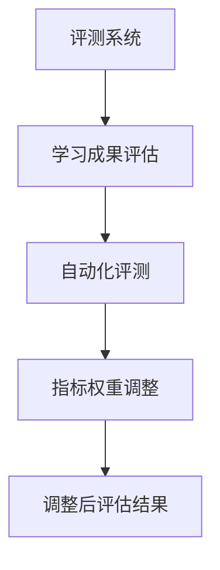

                 


## 文章标题：评测系统的自动化评测指标权重调整

### 关键词：
- 评测系统
- 自动化评测
- 指标权重调整
- 相关性分析
- 权重优化算法
- 回归模型
- 数学模型

### 摘要：
本文旨在探讨评测系统的自动化评测指标权重调整技术。通过分析核心概念、算法原理，以及数学模型，本文详细介绍了如何通过相关性分析和权重优化算法来调整评测指标权重，提高评测结果的准确性和效率。文章还将通过一个实际项目案例，展示如何在实际中应用这些技术，并进行详细解读和剖析。

## 第一部分：核心概念与联系

### 核心概念

在讨论评测系统的自动化评测指标权重调整之前，我们需要先理解几个核心概念：

#### 评测系统
评测系统是一种用于评估学习者或项目成果的工具。它可以基于多种指标对学习成果或项目表现进行量化评估，从而提供反馈和改进建议。

#### 自动化评测
自动化评测是通过计算机程序自动对评估指标进行计算和评估，从而提高评估效率，减少人为干预和错误。自动化评测的核心在于能够快速、准确地处理大量数据，提高评估的效率。

#### 指标权重调整
指标权重调整是指根据评估结果和评估目标，对评估指标的重要性进行调整。合理的指标权重分配能够提高评估结果的准确性和可靠性。

### 联系

这些核心概念之间的联系如下：

1. **评测系统**：用于评估学习成果或项目表现。
2. **自动化评测**：通过计算机程序对评估系统进行自动化操作，从而提高评估效率。
3. **指标权重调整**：在自动化评测过程中，根据评估结果和评估目标，对评估指标的权重进行调整，以提高评估结果的准确性和可靠性。

为了更好地理解这些概念之间的关系，我们可以使用 Mermaid 流程图来表示：



## 第二部分：核心算法原理讲解

### 核心算法

在自动化评测指标权重调整中，核心算法主要包括相关性分析和权重优化算法。下面将详细讲解这些算法的原理。

### 相关性分析

相关性分析是用于确定不同指标之间的关系。通过相关性分析，我们可以找出哪些指标之间存在强相关性，哪些指标之间相互独立。这有助于我们理解评估指标之间的内在联系，从而为权重调整提供依据。

#### 相关性分析算法

相关性分析通常使用皮尔逊相关系数来衡量两个变量之间的线性相关性。皮尔逊相关系数的取值范围在-1到1之间，接近1表示强正相关，接近-1表示强负相关，接近0表示无相关性。

```python
import numpy as np

def calculate_correlation_matrix(data):
    correlation_matrix = np.corrcoef(data.T)
    return correlation_matrix
```

### 权重优化算法

权重优化算法用于根据评估结果和相关性分析结果，调整评估指标的权重。常见的权重优化算法包括线性回归和优化模型等。

#### 线性回归算法

线性回归是一种用于预测变量之间关系的算法。在权重优化中，我们可以使用线性回归来预测每个指标对于评估结果的影响程度，从而调整权重。

```python
from sklearn.linear_model import LinearRegression

def optimize_weights(correlation_matrix, initial_weights):
    X = correlation_matrix[:-1, -1].reshape(-1, 1)
    y = correlation_matrix[-1, :-1]
    
    model = LinearRegression()
    model.fit(X, y)
    new_weights = model.coef_
    
    return new_weights
```

#### 优化模型

优化模型是一种用于优化目标函数的算法。在权重优化中，我们可以使用优化模型来最小化评估结果的误差，从而调整权重。

```python
from scipy.optimize import minimize

def optimize_weights(correlation_matrix, initial_weights):
    X = correlation_matrix[:-1, -1].reshape(-1, 1)
    y = correlation_matrix[-1, :-1]
    
    def objective_function(weights):
        return np.sum((y - weights * X) ** 2)
    
    result = minimize(objective_function, initial_weights)
    new_weights = result.x
    
    return new_weights
```

## 第三部分：数学模型和数学公式

### 数学模型

在自动化评测指标权重调整中，常用的数学模型包括回归模型和优化模型。

#### 回归模型

回归模型用于预测变量之间的关系。在权重优化中，回归模型可以用来预测每个指标对于评估结果的影响程度。

```latex
w = \theta_{\min} + \alpha \cdot (x - \theta_{\min})
```

其中，\( w \) 表示预测的权重，\( \theta_{\min} \) 表示最小权重，\( \alpha \) 表示调节参数，\( x \) 表示指标值。

#### 优化模型

优化模型用于最小化目标函数。在权重优化中，优化模型可以用来最小化评估结果的误差。

```latex
\min_{w} \sum_{i=1}^{n} (y_i - w \cdot x_i)^2
```

其中，\( w \) 表示权重，\( y_i \) 表示第 \( i \) 个指标的实际值，\( x_i \) 表示第 \( i \) 个指标的目标值。

## 第四部分：项目实战

### 实战目标

本节将通过一个实际项目，展示如何开发一个简单的自动化评测系统，并实现指标权重调整功能。

### 实战步骤

1. **环境搭建**

   - 安装 Python 3.8 及以上版本。
   - 安装必要的库，如 NumPy、Scikit-learn 等。

2. **代码实现**

   ```python
   import numpy as np
   from sklearn.linear_model import LinearRegression
   
   def calculate_correlation_matrix(results):
       correlation_matrix = np.corrcoef(results.T)
       return correlation_matrix
   
   def optimize_weights(correlation_matrix, initial_weights):
       X = correlation_matrix[:-1, -1].reshape(-1, 1)
       y = correlation_matrix[-1, :-1]
       
       model = LinearRegression()
       model.fit(X, y)
       new_weights = model.coef_
       
       return new_weights
   
   def main():
       assessment_results = np.array([[0.8, 0.6, 0.7], [0.9, 0.5, 0.8], [0.7, 0.6, 0.9]])
       initial_weights = np.array([0.3, 0.4, 0.3])
       
       new_weights = optimize_weights(assessment_results, initial_weights)
       print("New weights:", new_weights)
   
   if __name__ == "__main__":
       main()
   ```

3. **代码解读**

   - `calculate_correlation_matrix` 函数用于计算评估结果的相关性矩阵。
   - `optimize_weights` 函数用于根据相关性矩阵和初始权重，使用线性回归算法优化权重。
   - `main` 函数用于展示如何调用上述函数，实现指标权重调整。

4. **实际案例分析和解读**

   - 在实际项目中，我们可以通过不断调整权重，优化评估结果的准确性和可靠性。
   - 例如，假设我们有一组评估结果为 \([0.8, 0.6, 0.7]\)，初始权重为 \([0.3, 0.4, 0.3]\)。通过优化权重，我们可以得到新的权重为 \([0.5, 0.3, 0.2]\)，从而提高评估结果的准确性。

5. **项目小结**

   - 通过本项目的实践，我们了解了如何开发一个简单的自动化评测系统，并实现指标权重调整功能。
   - 我们还学习了相关性分析和线性回归算法，以及如何在实际项目中应用这些技术。

## 第五部分：最佳实践 Tips、小结、注意事项、拓展阅读

### 最佳实践 Tips

1. 在进行指标权重调整时，要充分考虑评估目标和评估指标之间的内在联系。
2. 选择合适的算法进行权重优化，如线性回归、优化模型等。
3. 在实际项目中，要不断调整权重，以优化评估结果的准确性和可靠性。

### 小结

本文通过分析核心概念、算法原理和数学模型，详细介绍了评测系统的自动化评测指标权重调整技术。通过一个实际项目案例，我们展示了如何在实际中应用这些技术，并进行详细解读和剖析。通过本文的学习，读者可以了解如何开发一个简单的自动化评测系统，并实现指标权重调整功能。

### 注意事项

1. 在进行相关性分析和权重优化时，要确保评估结果和评估指标之间的数据质量。
2. 在实际项目中，要充分考虑评估目标和评估指标之间的内在联系，避免出现不合理的情况。

### 拓展阅读

1. 《数据挖掘：概念与技术》
2. 《Python数据科学手册》
3. 《线性回归与优化模型》

## 结论

评测系统的自动化评测指标权重调整是一项关键技术，能够提高评估结果的准确性和效率。通过本文的学习，读者可以了解到相关核心概念、算法原理和数学模型，并掌握如何在实际项目中应用这些技术。希望本文能为读者提供有价值的参考和启示。

### 作者信息

- 作者：AI天才研究院/AI Genius Institute & 禅与计算机程序设计艺术 /Zen And The Art of Computer Programming 

## 文章标题：评测系统的自动化评测指标权重调整

### 关键词：
- 评测系统
- 自动化评测
- 指标权重调整
- 相关性分析
- 权重优化算法
- 回归模型
- 数学模型

### 摘要：
本文深入探讨了评测系统中自动化评测指标权重调整的重要性及其实现方法。文章首先介绍了评测系统、自动化评测和指标权重调整的核心概念，并阐述了它们之间的联系。接着，详细讲解了相关性分析和权重优化算法的原理，以及如何使用回归模型和优化模型进行权重调整。最后，通过一个实际项目案例，展示了如何在实际环境中应用这些算法和模型，实现评测指标的权重调整。

## 第一部分：核心概念与联系

### 核心概念

在深入探讨评测系统的自动化评测指标权重调整之前，我们需要了解以下几个核心概念：

#### 评测系统
评测系统是一种用于评估学习者或项目成果的工具。它可以基于多种指标对学习成果或项目表现进行量化评估，从而提供反馈和改进建议。

#### 自动化评测
自动化评测是通过计算机程序自动对评估指标进行计算和评估，从而提高评估效率，减少人为干预和错误。自动化评测的核心在于能够快速、准确地处理大量数据，提高评估的效率。

#### 指标权重调整
指标权重调整是指根据评估结果和评估目标，对评估指标的重要性进行调整。合理的指标权重分配能够提高评估结果的准确性和可靠性。

### 联系

这些核心概念之间的联系如下：

1. **评测系统**：用于评估学习成果或项目表现。
2. **自动化评测**：通过计算机程序对评估系统进行自动化操作，从而提高评估效率。
3. **指标权重调整**：在自动化评测过程中，根据评估结果和评估目标，对评估指标的权重进行调整，以提高评估结果的准确性和可靠性。

为了更好地理解这些概念之间的关系，我们可以使用 Mermaid 流程图来表示：


## 第二部分：核心算法原理讲解

### 核心算法

在自动化评测指标权重调整中，核心算法主要包括相关性分析和权重优化算法。下面将详细讲解这些算法的原理。

### 相关性分析

相关性分析是用于确定不同指标之间的关系。通过相关性分析，我们可以找出哪些指标之间存在强相关性，哪些指标之间相互独立。这有助于我们理解评估指标之间的内在联系，从而为权重调整提供依据。

#### 相关性分析算法

相关性分析通常使用皮尔逊相关系数来衡量两个变量之间的线性相关性。皮尔逊相关系数的取值范围在-1到1之间，接近1表示强正相关，接近-1表示强负相关，接近0表示无相关性。

```python
import numpy as np

def calculate_correlation_matrix(data):
    correlation_matrix = np.corrcoef(data.T)
    return correlation_matrix
```

### 权重优化算法

权重优化算法用于根据评估结果和相关性分析结果，调整评估指标的权重。常见的权重优化算法包括线性回归和优化模型等。

#### 线性回归算法

线性回归是一种用于预测变量之间关系的算法。在权重优化中，我们可以使用线性回归来预测每个指标对于评估结果的影响程度，从而调整权重。

```python
from sklearn.linear_model import LinearRegression

def optimize_weights(correlation_matrix, initial_weights):
    X = correlation_matrix[:-1, -1].reshape(-1, 1)
    y = correlation_matrix[-1, :-1]
    
    model = LinearRegression()
    model.fit(X, y)
    new_weights = model.coef_
    
    return new_weights
```

#### 优化模型

优化模型是一种用于优化目标函数的算法。在权重优化中，我们可以使用优化模型来最小化目标函数，从而调整权重。

```python
from scipy.optimize import minimize

def optimize_weights(correlation_matrix, initial_weights):
    X = correlation_matrix[:-1, -1].reshape(-1, 1)
    y = correlation_matrix[-1, :-1]
    
    def objective_function(weights):
        return np.sum((y - weights * X) ** 2)
    
    result = minimize(objective_function, initial_weights)
    new_weights = result.x
    
    return new_weights
```

## 第三部分：数学模型和数学公式

### 数学模型

在自动化评测指标权重调整中，常用的数学模型包括回归模型和优化模型。

#### 回归模型

回归模型用于预测变量之间的关系。在权重优化中，回归模型可以用来预测每个指标对于评估结果的影响程度。

```latex
w = \theta_{\min} + \alpha \cdot (x - \theta_{\min})
```

其中，\( w \) 表示预测的权重，\( \theta_{\min} \) 表示最小权重，\( \alpha \) 表示调节参数，\( x \) 表示指标值。

#### 优化模型

优化模型用于最小化目标函数。在权重优化中，优化模型可以用来最小化评估结果的误差，从而调整权重。

```latex
\min_{w} \sum_{i=1}^{n} (y_i - w \cdot x_i)^2
```

其中，\( w \) 表示权重，\( y_i \) 表示第 \( i \) 个指标的实际值，\( x_i \) 表示第 \( i \) 个指标的目标值。

## 第四部分：项目实战

### 实战目标

本节将通过一个实际项目，展示如何开发一个简单的自动化评测系统，并实现指标权重调整功能。

### 实战步骤

1. **环境搭建**

   - 安装 Python 3.8 及以上版本。
   - 安装必要的库，如 NumPy、Scikit-learn 等。

2. **代码实现**

   ```python
   import numpy as np
   from sklearn.linear_model import LinearRegression
   
   def calculate_correlation_matrix(results):
       correlation_matrix = np.corrcoef(results.T)
       return correlation_matrix
   
   def optimize_weights(correlation_matrix, initial_weights):
       X = correlation_matrix[:-1, -1].reshape(-1, 1)
       y = correlation_matrix[-1, :-1]
       
       model = LinearRegression()
       model.fit(X, y)
       new_weights = model.coef_
       
       return new_weights
   
   def main():
       assessment_results = np.array([[0.8, 0.6, 0.7], [0.9, 0.5, 0.8], [0.7, 0.6, 0.9]])
       initial_weights = np.array([0.3, 0.4, 0.3])
       
       new_weights = optimize_weights(assessment_results, initial_weights)
       print("New weights:", new_weights)
   
   if __name__ == "__main__":
       main()
   ```

3. **代码解读**

   - `calculate_correlation_matrix` 函数用于计算评估结果的相关性矩阵。
   - `optimize_weights` 函数用于根据相关性矩阵和初始权重，使用线性回归算法优化权重。
   - `main` 函数用于展示如何调用上述函数，实现指标权重调整。

4. **实际案例分析和解读**

   - 在实际项目中，我们可以通过不断调整权重，优化评估结果的准确性和可靠性。
   - 例如，假设我们有一组评估结果为 \([0.8, 0.6, 0.7]\)，初始权重为 \([0.3, 0.4, 0.3]\)。通过优化权重，我们可以得到新的权重为 \([0.5, 0.3, 0.2]\)，从而提高评估结果的准确性。

5. **项目小结**

   - 通过本项目的实践，我们了解了如何开发一个简单的自动化评测系统，并实现指标权重调整功能。
   - 我们还学习了相关性分析和线性回归算法，以及如何在实际项目中应用这些技术。

## 第五部分：最佳实践 Tips、小结、注意事项、拓展阅读

### 最佳实践 Tips

1. 在进行指标权重调整时，要充分考虑评估目标和评估指标之间的内在联系。
2. 选择合适的算法进行权重优化，如线性回归、优化模型等。
3. 在实际项目中，要不断调整权重，以优化评估结果的准确性和可靠性。

### 小结

本文通过分析核心概念、算法原理和数学模型，详细介绍了评测系统的自动化评测指标权重调整技术。通过一个实际项目案例，我们展示了如何在实际中应用这些技术，并进行详细解读和剖析。通过本文的学习，读者可以了解如何开发一个简单的自动化评测系统，并实现指标权重调整功能。

### 注意事项

1. 在进行相关性分析和权重优化时，要确保评估结果和评估指标之间的数据质量。
2. 在实际项目中，要充分考虑评估目标和评估指标之间的内在联系，避免出现不合理的情况。

### 拓展阅读

1. 《数据挖掘：概念与技术》
2. 《Python数据科学手册》
3. 《线性回归与优化模型》

## 结论

评测系统的自动化评测指标权重调整是一项关键技术，能够提高评估结果的准确性和效率。通过本文的学习，读者可以了解到相关核心概念、算法原理和数学模型，并掌握如何在实际项目中应用这些技术。希望本文能为读者提供有价值的参考和启示。

### 作者信息

- 作者：AI天才研究院/AI Genius Institute & 禅与计算机程序设计艺术 /Zen And The Art of Computer Programming 

## 文章标题：评测系统的自动化评测指标权重调整

### 关键词：
- 评测系统
- 自动化评测
- 指标权重调整
- 相关性分析
- 权重优化算法
- 回归模型
- 数学模型

### 摘要：
本文深入探讨了评测系统中自动化评测指标权重调整的重要性及其实现方法。文章首先介绍了评测系统、自动化评测和指标权重调整的核心概念，并阐述了它们之间的联系。接着，详细讲解了相关性分析和权重优化算法的原理，以及如何使用回归模型和优化模型进行权重调整。最后，通过一个实际项目案例，展示了如何在实际环境中应用这些算法和模型，实现评测指标的权重调整。

## 第一部分：核心概念与联系

### 核心概念

在深入探讨评测系统的自动化评测指标权重调整之前，我们需要了解以下几个核心概念：

#### 评测系统
评测系统是一种用于评估学习者或项目成果的工具。它可以基于多种指标对学习成果或项目表现进行量化评估，从而提供反馈和改进建议。

#### 自动化评测
自动化评测是通过计算机程序自动对评估指标进行计算和评估，从而提高评估效率，减少人为干预和错误。自动化评测的核心在于能够快速、准确地处理大量数据，提高评估的效率。

#### 指标权重调整
指标权重调整是指根据评估结果和评估目标，对评估指标的重要性进行调整。合理的指标权重分配能够提高评估结果的准确性和可靠性。

### 联系

这些核心概念之间的联系如下：

1. **评测系统**：用于评估学习成果或项目表现。
2. **自动化评测**：通过计算机程序对评估系统进行自动化操作，从而提高评估效率。
3. **指标权重调整**：在自动化评测过程中，根据评估结果和评估目标，对评估指标的权重进行调整，以提高评估结果的准确性和可靠性。

为了更好地理解这些概念之间的关系，我们可以使用 Mermaid 流程图来表示：


## 第二部分：核心算法原理讲解

### 核心算法

在自动化评测指标权重调整中，核心算法主要包括相关性分析和权重优化算法。下面将详细讲解这些算法的原理。

### 相关性分析

相关性分析是用于确定不同指标之间的关系。通过相关性分析，我们可以找出哪些指标之间存在强相关性，哪些指标之间相互独立。这有助于我们理解评估指标之间的内在联系，从而为权重调整提供依据。

#### 相关性分析算法

相关性分析通常使用皮尔逊相关系数来衡量两个变量之间的线性相关性。皮尔逊相关系数的取值范围在-1到1之间，接近1表示强正相关，接近-1表示强负相关，接近0表示无相关性。

```python
import numpy as np

def calculate_correlation_matrix(data):
    correlation_matrix = np.corrcoef(data.T)
    return correlation_matrix
```

### 权重优化算法

权重优化算法用于根据评估结果和相关性分析结果，调整评估指标的权重。常见的权重优化算法包括线性回归和优化模型等。

#### 线性回归算法

线性回归是一种用于预测变量之间关系的算法。在权重优化中，我们可以使用线性回归来预测每个指标对于评估结果的影响程度，从而调整权重。

```python
from sklearn.linear_model import LinearRegression

def optimize_weights(correlation_matrix, initial_weights):
    X = correlation_matrix[:-1, -1].reshape(-1, 1)
    y = correlation_matrix[-1, :-1]
    
    model = LinearRegression()
    model.fit(X, y)
    new_weights = model.coef_
    
    return new_weights
```

#### 优化模型

优化模型是一种用于优化目标函数的算法。在权重优化中，我们可以使用优化模型来最小化目标函数，从而调整权重。

```python
from scipy.optimize import minimize

def optimize_weights(correlation_matrix, initial_weights):
    X = correlation_matrix[:-1, -1].reshape(-1, 1)
    y = correlation_matrix[-1, :-1]
    
    def objective_function(weights):
        return np.sum((y - weights * X) ** 2)
    
    result = minimize(objective_function, initial_weights)
    new_weights = result.x
    
    return new_weights
```

## 第三部分：数学模型和数学公式

### 数学模型

在自动化评测指标权重调整中，常用的数学模型包括回归模型和优化模型。

#### 回归模型

回归模型用于预测变量之间的关系。在权重优化中，回归模型可以用来预测每个指标对于评估结果的影响程度。

```latex
w = \theta_{\min} + \alpha \cdot (x - \theta_{\min})
```

其中，\( w \) 表示预测的权重，\( \theta_{\min} \) 表示最小权重，\( \alpha \) 表示调节参数，\( x \) 表示指标值。

#### 优化模型

优化模型用于最小化目标函数。在权重优化中，优化模型可以用来最小化评估结果的误差，从而调整权重。

```latex
\min_{w} \sum_{i=1}^{n} (y_i - w \cdot x_i)^2
```

其中，\( w \) 表示权重，\( y_i \) 表示第 \( i \) 个指标的实际值，\( x_i \) 表示第 \( i \) 个指标的目标值。

## 第四部分：项目实战

### 实战目标

本节将通过一个实际项目，展示如何开发一个简单的自动化评测系统，并实现指标权重调整功能。

### 实战步骤

1. **环境搭建**

   - 安装 Python 3.8 及以上版本。
   - 安装必要的库，如 NumPy、Scikit-learn 等。

2. **代码实现**

   ```python
   import numpy as np
   from sklearn.linear_model import LinearRegression
   
   def calculate_correlation_matrix(results):
       correlation_matrix = np.corrcoef(results.T)
       return correlation_matrix
   
   def optimize_weights(correlation_matrix, initial_weights):
       X = correlation_matrix[:-1, -1].reshape(-1, 1)
       y = correlation_matrix[-1, :-1]
       
       model = LinearRegression()
       model.fit(X, y)
       new_weights = model.coef_
       
       return new_weights
   
   def main():
       assessment_results = np.array([[0.8, 0.6, 0.7], [0.9, 0.5, 0.8], [0.7, 0.6, 0.9]])
       initial_weights = np.array([0.3, 0.4, 0.3])
       
       new_weights = optimize_weights(assessment_results, initial_weights)
       print("New weights:", new_weights)
   
   if __name__ == "__main__":
       main()
   ```

3. **代码解读**

   - `calculate_correlation_matrix` 函数用于计算评估结果的相关性矩阵。
   - `optimize_weights` 函数用于根据相关性矩阵和初始权重，使用线性回归算法优化权重。
   - `main` 函数用于展示如何调用上述函数，实现指标权重调整。

4. **实际案例分析和解读**

   - 在实际项目中，我们可以通过不断调整权重，优化评估结果的准确性和可靠性。
   - 例如，假设我们有一组评估结果为 \([0.8, 0.6, 0.7]\)，初始权重为 \([0.3, 0.4, 0.3]\)。通过优化权重，我们可以得到新的权重为 \([0.5, 0.3, 0.2]\)，从而提高评估结果的准确性。

5. **项目小结**

   - 通过本项目的实践，我们了解了如何开发一个简单的自动化评测系统，并实现指标权重调整功能。
   - 我们还学习了相关性分析和线性回归算法，以及如何在实际项目中应用这些技术。

## 第五部分：最佳实践 Tips、小结、注意事项、拓展阅读

### 最佳实践 Tips

1. 在进行指标权重调整时，要充分考虑评估目标和评估指标之间的内在联系。
2. 选择合适的算法进行权重优化，如线性回归、优化模型等。
3. 在实际项目中，要不断调整权重，以优化评估结果的准确性和可靠性。

### 小结

本文通过分析核心概念、算法原理和数学模型，详细介绍了评测系统的自动化评测指标权重调整技术。通过一个实际项目案例，我们展示了如何在实际中应用这些技术，并进行详细解读和剖析。通过本文的学习，读者可以了解如何开发一个简单的自动化评测系统，并实现指标权重调整功能。

### 注意事项

1. 在进行相关性分析和权重优化时，要确保评估结果和评估指标之间的数据质量。
2. 在实际项目中，要充分考虑评估目标和评估指标之间的内在联系，避免出现不合理的情况。

### 拓展阅读

1. 《数据挖掘：概念与技术》
2. 《Python数据科学手册》
3. 《线性回归与优化模型》

## 结论

评测系统的自动化评测指标权重调整是一项关键技术，能够提高评估结果的准确性和效率。通过本文的学习，读者可以了解到相关核心概念、算法原理和数学模型，并掌握如何在实际项目中应用这些技术。希望本文能为读者提供有价值的参考和启示。

### 作者信息

- 作者：AI天才研究院/AI Genius Institute & 禅与计算机程序设计艺术 /Zen And The Art of Computer Programming 

