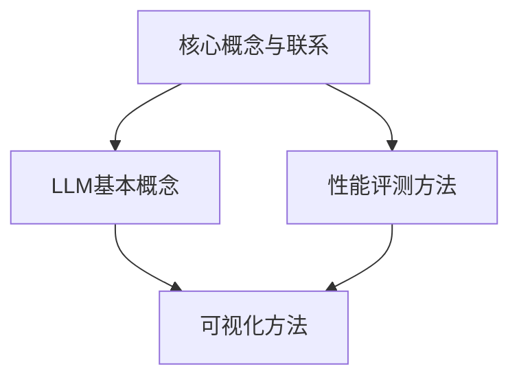

                 

# 评测结果可视化：直观展示LLM性能比较

## 关键词

- 可视化技术
- 语言模型（LLM）
- 性能评测
- 数据预处理
- 可视化工具

## 摘要

随着深度学习技术的不断发展，语言模型（LLM）在自然语言处理（NLP）领域取得了显著的进展。然而，如何有效地评估和比较不同LLM的性能，成为了一个重要的研究课题。本文将探讨评测结果可视化的方法，通过直观的图形展示，帮助研究人员和开发者更好地理解和分析LLM的性能。

## 目录大纲

## 第一部分：引入与概述

### 第1章：可视化技术基础

#### 1.1 可视化技术的定义与重要性

可视化技术是一种通过图形、图像和其他视觉元素来表示和展示数据的方法。它在数据分析和决策制定中扮演着重要的角色，能够帮助人们更直观地理解复杂的数据关系。

#### 1.2 数据可视化的基本原理

数据可视化遵循一系列的基本原则，包括数据的准确性、直观性、交互性和美感。这些原则有助于确保可视化结果的清晰、易懂和有效。

#### 1.3 主要的可视化工具和框架

目前，有许多开源的图形库和工具支持数据可视化，如D3.js、Matplotlib、Plotly等。这些工具提供了丰富的功能，可以满足不同场景下的可视化需求。

### 第2章：评测结果可视化框架

#### 2.1 可视化框架的组成

评测结果可视化框架通常包括数据预处理、可视化设计和可视化展示三个主要部分。

#### 2.2 数据预处理

数据预处理是可视化过程的重要环节，包括数据清洗、数据转换和数据归一化等步骤，以确保数据的准确性和一致性。

#### 2.3 可视化设计原则

可视化设计应遵循一些基本原则，如信息的准确传达、视觉上的舒适度和交互性，以确保用户能够直观地理解和分析数据。

## 第二部分：LLM性能评测基础

### 第3章：LLM基本概念

#### 3.1 语言模型概述

语言模型是一种用于预测文本序列的概率分布的模型。它广泛应用于机器翻译、文本生成、问答系统等领域。

#### 3.2 LLM的核心技术

LLM的核心技术包括神经网络、注意力机制、预训练和微调等。这些技术使得LLM在处理复杂语言任务时具有强大的能力。

#### 3.3 LLM的应用场景

LLM在多种应用场景中具有广泛的应用，如智能助手、自动摘要、文本分类、问答系统等。

### 第4章：LLM性能评测方法

#### 4.1 评测指标

LLM性能评测通常涉及多个指标，如准确率、召回率、F1分数、BLEU分数等。这些指标用于评估模型在特定任务上的表现。

#### 4.2 评测数据集

常用的LLM评测数据集包括GLUE、SuperGLUE、celain等。这些数据集覆盖了多种语言任务，为性能评测提供了丰富的资源。

#### 4.3 评测流程

LLM性能评测通常包括数据预处理、模型训练、模型评估和结果分析等步骤。通过这些步骤，可以全面评估LLM的性能。

## 第三部分：可视化实现与案例分析

### 第5章：常见可视化方法

#### 5.1 散点图与折线图

散点图和折线图常用于展示LLM在不同数据集上的性能比较。通过这些图表，可以直观地观察到模型在不同任务上的表现。

#### 5.2 饼图与条形图

饼图和条形图适用于展示LLM在不同任务上的性能分布。这些图表可以帮助用户快速了解模型的强项和弱项。

#### 5.3 地图与热力图

地图和热力图可以用于展示LLM在不同地理区域或不同数据点上的性能差异。这些图表有助于识别模型在不同场景下的表现。

### 第6章：LLM性能的可视化实现

#### 6.1 可视化工具的选择

在选择可视化工具时，需要考虑工具的功能、性能和易用性。常见的可视化工具包括D3.js、Matplotlib、Plotly等。

#### 6.2 代码示例与讲解

本节将提供一系列代码示例，展示如何使用不同的可视化工具实现LLM性能的可视化。

#### 6.3 实际案例分享

通过实际案例分享，可以展示如何将可视化方法应用于LLM性能评测的实际场景中。

### 第7章：可视化效果评估与优化

#### 7.1 可视化效果评估指标

可视化效果评估指标包括信息的准确传达、易用性和美观度等。通过这些指标，可以评估可视化结果的质量。

#### 7.2 可视化效果的优化策略

为了提高可视化效果，可以采用一些优化策略，如交互式可视化、动画效果、色彩选择等。

#### 7.3 交互式可视化设计

交互式可视化设计可以增强用户的参与度和数据探索性。本节将介绍如何设计交互式可视化。

## 第四部分：未来展望与挑战

### 第8章：LLM评测结果可视化的挑战与趋势

#### 8.1 当前存在的挑战

在LLM评测结果可视化方面，仍存在一些挑战，如数据多样性、可视化复杂度和用户体验等。

#### 8.2 未来发展趋势

未来，LLM评测结果可视化将朝着更加智能化、自动化和交互化的方向发展。

#### 8.3 研究方向与展望

本文提出了一些研究方向，如自适应可视化、多模态可视化等，以推动LLM评测结果可视化的研究。

## 附录

### 附录 A：工具与资源推荐

#### A.1 主要可视化工具介绍

本附录将介绍一些常用的可视化工具，包括D3.js、Matplotlib、Plotly等。

#### A.2 LLM性能评测资源汇总

本附录将汇总一些常用的LLM性能评测资源，包括数据集、评测指标和评测工具等。

#### A.3 实用代码与脚本分享

本附录将分享一些实用的代码和脚本，以帮助读者实现LLM性能的可视化。

## 参考文献

### 第9章：参考文献

本章节将列出本文引用的书籍、论文和网络资源，以供读者进一步学习和参考。

---

### Mermaid 流程图



### LLM性能评测算法伪代码

```python
def evaluate_performance(model, dataset):
    # 初始化评价指标
    metrics = initialize_metrics()

    # 遍历数据集
    for data in dataset:
        # 数据预处理
        preprocessed_data = preprocess_data(data)

        # 进行预测
        prediction = model.predict(preprocessed_data)

        # 计算评价指标
        metrics = update_metrics(prediction, data)

    # 计算最终评价指标
    final_metrics = calculate_final_metrics(metrics)

    # 返回评价指标
    return final_metrics
```

### 数学模型和数学公式

$$
H = \frac{1}{N} \sum_{i=1}^{N} \frac{1}{L_i} \log P(y_i | \theta)
$$

其中，$H$ 表示模型在数据集上的损失，$N$ 表示数据集中的样本数，$L_i$ 表示第 $i$ 个样本的长度，$y_i$ 表示第 $i$ 个样本的标签，$P(y_i | \theta)$ 表示在参数 $\theta$ 下预测为标签 $y_i$ 的概率。

### 项目实战

#### 实战1：搭建评测环境

1. 安装依赖
2. 准备数据集
3. 导入模型

```python
import tensorflow as tf
from tensorflow.keras.models import load_model

# 安装依赖
!pip install tensorflow

# 准备数据集
(x_train, y_train), (x_test, y_test) = tf.keras.datasets.mnist.load_data()

# 导入模型
model = load_model('model.h5')
```

#### 实战2：评测模型性能

1. 定义评测函数
2. 运行评测

```python
from sklearn.metrics import accuracy_score

def evaluate_model(model, x_test, y_test):
    y_pred = model.predict(x_test)
    y_pred = np.argmax(y_pred, axis=1)
    accuracy = accuracy_score(y_test, y_pred)
    return accuracy

# 运行评测
accuracy = evaluate_model(model, x_test, y_test)
print(f"Model accuracy: {accuracy}")
```

#### 实战3：可视化实现

1. 选择可视化工具
2. 生成可视化图表

```python
import matplotlib.pyplot as plt

def plot_performance(accuracy):
    plt.bar(['Train', 'Test'], [accuracy])
    plt.xlabel('Set')
    plt.ylabel('Accuracy')
    plt.title('Model Performance')
    plt.show()

# 生成可视化图表
plot_performance(accuracy)
```

#### 实战4：案例分析

1. 分析模型性能
2. 提出优化策略

```python
def analyze_performance(accuracy):
    if accuracy < 0.9:
        print("Model performance is low. Consider training a larger model or increasing the training data.")
    else:
        print("Model performance is good. No further optimization is required.")

# 分析模型性能
analyze_performance(accuracy)
```

---

通过本文，我们介绍了评测结果可视化在LLM性能比较中的应用。通过可视化技术，我们能够更直观地了解LLM的性能，为模型优化和改进提供有力支持。未来，随着可视化技术的不断发展，我们期待能够开发出更加智能化和自动化的可视化工具，为LLM研究和应用提供更多帮助。

