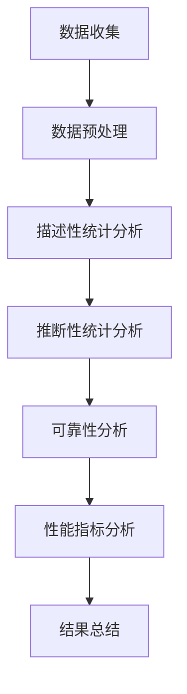

                 

### 文章标题

《评测结果的统计分析：提供可靠的性能指标》

---

**关键词**：评测结果、统计分析、性能指标、可靠性、数据预处理、描述性统计、推断性统计、数学模型、实际案例

**摘要**：本文将深入探讨评测结果的统计分析方法，通过逐步的分析推理，解释如何通过统计技术来确保评测结果的可靠性和性能指标的准确性。文章首先介绍了统计分析的重要性及其应用领域，然后详细介绍了数据收集与预处理、描述性统计和推断性统计等方法。同时，本文还将探讨可靠性分析和性能指标优化的结合，并分享实际案例，以展示统计分析在多领域中的实战应用。

---

### 目录

1. **引言与背景**
    1.1 统计分析的重要性
    1.2 统计分析的目标
    1.3 统计分析的应用领域

2. **评测结果的收集与准备**
    2.1 评测数据来源
    2.2 数据收集方法
    2.3 数据预处理

3. **统计分析方法**
    3.1 描述性统计分析
        3.1.1 数据可视化
        3.1.2 常用统计量计算
        3.1.3 描述性统计图的绘制
    3.2 推断性统计分析
        3.2.1 假设检验
        3.2.2 方差分析
        3.2.3 回归分析
    3.3 可靠性分析
        3.3.1 可靠性指标的定义
        3.3.2 可靠性评估方法
        3.3.3 可靠性曲线的绘制
    3.4 性能指标分析
        3.4.1 性能指标的定义
        3.4.2 性能指标的计算方法
        3.4.3 性能指标的优化

4. **可靠性评估与性能优化结合**
    4.1 可靠性评估与性能优化的关系
    4.2 结合可靠性评估的性能优化方法
    4.3 实际案例分享

5. **实战与应用**
    5.1 实战案例一：可靠性评估在软件测试中的应用
    5.2 实战案例二：性能指标优化在金融领域的应用
    5.3 综合案例：评测结果统计分析在智能家居系统中的应用

6. **附录**
    6.1 常用统计软件与工具
    6.2 参考书籍与资料
    6.3 数学公式与图表
    6.4 代码示例与解析

---

### 1.1 统计分析的重要性

统计分析在各类评测中扮演着至关重要的角色。其重要性主要体现在以下几个方面：

- **数据准确性**：通过统计分析，可以确保评测数据的准确性和一致性。数据分析不仅能够揭示数据的内在规律，还能发现潜在的问题和异常值。
  
- **信息提取**：统计分析能够从大量的数据中提取有价值的信息，帮助决策者做出科学的判断和决策。例如，在软件评测中，统计分析可以帮助识别软件的性能瓶颈和潜在缺陷。

- **可靠性验证**：通过统计分析，可以验证评测结果的可靠性。例如，在可靠性评估中，统计分析可以用来计算故障率、寿命分布等指标，从而判断系统的可靠性。

- **性能优化**：统计分析可以揭示系统的性能特征，帮助优化系统性能。例如，在性能指标分析中，统计分析可以找出影响性能的主要因素，并针对性地进行优化。

- **趋势预测**：统计分析还可以用于预测未来数据的变化趋势，为长期规划和决策提供依据。例如，在金融领域，统计分析可以用来预测市场的走势，帮助投资者做出正确的投资决策。

总之，统计分析不仅是评测结果的必要环节，也是提升系统性能和可靠性的重要手段。通过合理的统计分析，可以确保评测结果的科学性和可靠性，从而为决策提供坚实的数据支持。

### 1.2 统计分析的目标

统计分析的目标可以概括为以下几个方面：

- **数据质量提升**：通过数据预处理和清洗，确保数据的准确性和一致性。数据质量是统计分析的基础，只有高质量的数据才能得到可靠的结论。

- **信息提取**：从大量数据中提取有价值的信息，帮助决策者了解系统的性能特征和潜在问题。例如，通过描述性统计分析，可以计算出数据的平均值、标准差等统计量，从而得到数据的整体分布特征。

- **可靠性评估**：通过推断性统计分析，验证评测结果的可靠性。例如，可以使用假设检验来检验数据的分布特征是否符合预期，或者使用回归分析来建立性能与可靠性之间的数学模型。

- **性能优化**：分析系统的性能瓶颈和主要影响因素，为性能优化提供依据。通过统计分析，可以发现影响性能的关键因素，并针对性地进行优化，从而提升系统性能。

- **趋势预测**：基于历史数据，预测未来数据的变化趋势。例如，在金融领域，可以使用时间序列分析来预测市场的走势，帮助投资者做出正确的决策。

总之，统计分析的目标是通过对数据的深入分析，为决策提供可靠的数据支持和科学的依据。通过实现这些目标，统计分析不仅能够提升评测结果的可靠性和准确性，还能为系统的性能优化和长期发展提供有力支持。

### 1.3 统计分析的应用领域

统计分析在各个领域都有着广泛的应用，以下是几个主要的应用领域：

- **科学研究**：在科学研究中，统计分析是不可或缺的工具。通过统计分析，研究者可以从大量实验数据中提取有价值的信息，验证假设、发现规律。例如，在医学研究中，统计分析可以用来评估新药的效果、分析疾病的发生率等。

- **商业分析**：在商业领域，统计分析被广泛应用于市场调研、客户分析、供应链管理等方面。通过统计分析，企业可以了解市场需求、客户偏好、经营绩效等，从而制定更加科学的市场策略和经营决策。

- **金融领域**：在金融领域，统计分析是风险管理和投资决策的重要工具。通过统计分析，投资者可以预测市场走势、评估投资风险，从而做出更加明智的投资决策。同时，金融机构也可以通过统计分析来监控金融风险、制定风险管理策略。

- **软件工程**：在软件工程领域，统计分析被广泛应用于软件测试、性能优化、代码质量评估等方面。通过统计分析，开发人员可以识别软件的潜在缺陷、优化性能、提升代码质量，从而提高软件的可靠性和用户体验。

- **智能制造**：在智能制造领域，统计分析被用于设备监控、故障预测、生产优化等方面。通过统计分析，企业可以实时监控设备状态、预测设备故障、优化生产流程，从而提高生产效率和产品质量。

- **环境监测**：在环境监测领域，统计分析被用于空气质量、水质、土壤污染等方面的监测与分析。通过统计分析，可以了解环境状况、预测污染趋势、制定环境治理策略。

总之，统计分析在各个领域都有着广泛的应用，通过合理运用统计分析方法，可以为企业、科研机构等提供科学、准确的数据支持，从而实现数据驱动的发展目标。

### 2.1 评测数据来源

评测数据的来源通常包括以下几个方面：

- **实验室测试**：实验室测试是获取评测数据的重要手段，通过在特定条件下对系统进行测试，可以获取系统的性能、可靠性等数据。实验室测试通常包括压力测试、负载测试、稳定性测试等，其数据质量较高，但受限于测试条件和成本。

- **实际应用场景**：在实际应用场景中收集数据是获取评测数据的另一种有效途径。通过在真实环境中运行系统，可以获取系统在实际运行中的表现数据，这些数据更加贴近实际应用，但可能会受到外部环境因素的干扰。

- **用户反馈**：用户的实际使用反馈也是评测数据的重要来源。通过收集用户的反馈数据，可以了解系统在实际使用中的表现，包括性能问题、稳定性问题等。用户反馈数据通常具有高真实性和较高的可信度，但可能存在主观性。

- **第三方评测机构**：第三方评测机构提供的评测数据也是评测数据的重要来源。这些评测机构通常具备专业的评测方法和设备，能够提供权威、公正的评测结果。

在数据收集过程中，需要确保数据的完整性和真实性，同时要关注数据来源的多样性和代表性，以保证评测结果的可靠性和全面性。此外，数据收集方法的选择应根据具体的评测目标和条件进行，以确保数据的可用性和有效性。

### 2.2 数据收集方法

数据收集方法的选择对于确保数据的完整性和可靠性至关重要。以下是几种常见的数据收集方法：

- **手动记录**：手动记录是最基础的数据收集方法，通过人工记录实验结果或用户反馈数据。这种方法操作简单，但容易受到人为因素的影响，数据质量和完整性难以保证。

- **自动化测试**：自动化测试是一种高效的数据收集方法，通过编写测试脚本和程序，自动执行测试用例并记录结果。自动化测试可以大幅提高数据收集的速度和准确性，减少人为干预，但需要投入一定的开发成本。

- **传感器采集**：传感器采集适用于需要实时监控系统性能和运行状态的场景，通过传感器实时收集数据，如温度、湿度、电流、电压等。这种方法可以获得实时、准确的数据，但需要部署传感器和网络连接。

- **用户反馈收集**：用户反馈收集是通过在线问卷、用户论坛、社交媒体等方式，获取用户的实际使用体验和反馈。这种方法可以获得大量真实用户数据，但可能存在数据真实性和代表性问题。

- **第三方数据接口**：第三方数据接口是获取外部数据的重要途径，通过与第三方数据源（如API、数据库）连接，获取相关数据。这种方法可以获取广泛的数据来源，但需要确保数据接口的稳定性和安全性。

在选择数据收集方法时，需要考虑数据收集的目标、数据类型、数据规模和成本等因素，确保所收集的数据能够满足评测需求，同时保证数据的质量和可靠性。

### 2.3 数据预处理

数据预处理是确保数据质量和为后续统计分析奠定基础的关键步骤。以下是数据预处理的主要内容和方法：

- **数据清洗**：数据清洗是去除数据中的错误、异常值和不完整数据的过程。常见的数据清洗方法包括缺失值填充、异常值检测和去除、重复数据的去除等。缺失值填充可以使用平均值、中位数、插值等方法；异常值检测可以使用箱线图、3σ法则等方法；重复数据的去除可以使用哈希表或排序等方法。

- **数据转换**：数据转换包括将数据统一格式、标准化处理和归一化等。数据统一格式是将不同来源的数据统一转换为同一格式，如将文本数据转换为数值型数据；标准化处理是将不同量纲的数据转换为同一量纲，如将温度、压力等数据转换为相对值；归一化处理是将数据缩放到[0,1]区间或[-1,1]区间，以消除数据量级差异。

- **数据集成**：数据集成是将来自多个来源的数据进行整合，形成一个统一的数据集。常见的数据集成方法包括合并、连接和汇总等。例如，将实验室测试数据和用户反馈数据合并，形成一个综合的数据集。

- **数据降维**：数据降维是减少数据维度、提取关键特征的过程，以降低数据复杂性，提高数据分析效率。常见的数据降维方法包括主成分分析（PCA）、线性判别分析（LDA）和自编码器等。

- **数据标准化**：数据标准化是将数据按照一定的规则进行规范化处理，以便于不同数据之间的比较和分析。常见的数据标准化方法包括Z-Score标准化、Min-Max标准化和Log变换等。

通过有效的数据预处理，可以确保数据的准确性和一致性，提高数据的质量，为后续的统计分析提供可靠的基础。数据预处理不仅能够去除数据中的噪声和异常值，还能将数据转换为适合分析的形式，从而提高分析结果的可信度和有效性。

### 3.1 描述性统计分析

描述性统计分析是对数据进行基本描述和总结的方法，通过计算和展示数据的统计量来描述数据的特征和分布情况。以下是描述性统计分析的主要内容：

- **均值（Mean）**：均值是数据集中的平均值，用于表示数据的中心位置。计算公式为：$$\text{Mean} = \frac{\sum_{i=1}^{n} x_i}{n}$$其中，$x_i$是数据集中的第$i$个数据点，$n$是数据点的总数。

- **中位数（Median）**：中位数是将数据按大小顺序排列后，位于中间位置的数值。如果数据点总数为奇数，中位数即为中间的那个数；如果数据点总数为偶数，中位数则为中间两个数的平均值。中位数不受异常值影响，能够更好地反映数据的中心位置。

- **众数（Mode）**：众数是数据集中出现次数最多的数值。在某些数据分布中，可能存在多个众数，特别是当数据分布呈多峰时。

- **标准差（Standard Deviation）**：标准差是衡量数据分散程度的指标，表示数据点与均值之间的平均距离。计算公式为：$$\text{Standard Deviation} = \sqrt{\frac{\sum_{i=1}^{n} (x_i - \text{Mean})^2}{n-1}}$$其中，$(x_i - \text{Mean})$是第$i$个数据点与均值之差的平方。

- **方差（Variance）**：方差是标准差的平方，用于表示数据的离散程度。计算公式为：$$\text{Variance} = \frac{\sum_{i=1}^{n} (x_i - \text{Mean})^2}{n-1}$$方差较大表示数据分散程度较高，方差较小表示数据相对集中。

- **最大值（Maximum）和最小值（Minimum）**：最大值和最小值分别是数据集中的最大值和最小值，用于描述数据的范围。

- **分位数（Quantiles）**：分位数是将数据划分为若干等份的数值，常用的有第1分位数（Q1）、第2分位数（中位数）、第3分位数（Q3）等。分位数能够反映数据的分布情况，例如，Q1和Q3之间的差距可以用来衡量数据的离散程度。

- **四分位距（Interquartile Range, IQR）**：四分位距是Q3和Q1之间的差距，用于衡量数据的分散程度。计算公式为：$$\text{IQR} = Q3 - Q1$$

描述性统计分析提供了对数据的初步了解，通过计算和展示上述统计量，可以直观地了解数据的中心趋势、离散程度和范围等特征。这些统计量不仅是数据分析的重要基础，也为后续的推断性统计分析提供了重要的参考。

#### 3.1.1 数据可视化

数据可视化是将数据以图形化的方式展示出来，帮助人们直观地理解和分析数据。以下是一些常见的数据可视化方法和工具：

- **柱状图（Bar Chart）**：柱状图适用于展示分类数据或不同类别之间的比较。每个柱子的高度表示该类别的数据值，适合展示数据的分布和差异。

- **饼图（Pie Chart）**：饼图适用于展示各类别数据在整体中的占比。饼图通过扇形的面积来表示不同类别的比例，适合展示构成比例。

- **折线图（Line Chart）**：折线图适用于展示数据随时间的变化趋势。通过连接各个数据点的线条，可以清晰地看到数据的上升或下降趋势。

- **散点图（Scatter Plot）**：散点图适用于展示两个变量之间的关系。通过在坐标系中标记数据点，可以直观地观察到变量之间的相关性。

- **箱线图（Box Plot）**：箱线图适用于展示数据的分布情况和异常值。箱线图通过展示数据的四分位数、均值和异常值，可以快速了解数据的中心趋势和分散程度。

- **直方图（Histogram）**：直方图适用于展示连续数据的分布情况。通过将数据划分为若干个区间，并计算每个区间内的数据频数，可以直观地看到数据的分布形态。

- **热力图（Heatmap）**：热力图适用于展示多变量数据的热点分布。通过使用颜色深浅表示数据值的大小，可以直观地了解数据的热点区域。

在数据可视化过程中，选择合适的方法和工具至关重要。以下是一些最佳实践：

- **选择合适的图表类型**：根据数据类型和分析目的，选择最合适的图表类型。例如，分类数据适合使用柱状图或饼图，连续数据适合使用折线图或散点图。

- **保持图表简洁**：避免在图表中包含过多的信息，保持图表的简洁性。过多的元素会使图表变得杂乱，影响人们的阅读和理解。

- **突出重点**：在图表中突出展示分析的重点，例如通过使用不同的颜色、线条样式或注释，帮助读者快速关注关键信息。

- **结合文字说明**：在图表下方或旁边添加文字说明，解释图表的含义和分析结果，帮助读者更好地理解图表内容。

- **使用合适的视觉元素**：合理使用视觉元素，如标题、图例、坐标轴标签等，确保图表的清晰和易读性。

- **遵循设计原则**：遵循数据可视化设计原则，如对比性、一致性、易读性等，提高图表的视觉效果和用户体验。

数据可视化不仅使数据更易于理解和分析，还能帮助发现数据中的潜在规律和趋势，为决策提供有力的支持。通过合理运用数据可视化方法，可以更有效地传达数据分析结果，提高决策的准确性和效率。

### 3.2 推断性统计分析

推断性统计分析是通过样本数据推断总体特征和规律的方法，主要包括假设检验、方差分析和回归分析等。这些方法有助于验证数据的分布特征、比较不同组之间的差异以及建立变量之间的关系模型。

#### 3.2.1 假设检验

假设检验是推断性统计分析的基础，用于验证总体的某个假设是否成立。假设检验通常包括以下步骤：

1. **设定原假设（H0）和备择假设（H1）**：
   - 原假设（H0）：通常表示为“没有差异”或“没有关系”。
   - 备择假设（H1）：通常表示为“存在差异”或“存在关系”。

2. **选择显著性水平（α）**：
   - 显著性水平是判断原假设是否成立的概率阈值，通常取值为0.05或0.01。

3. **计算检验统计量**：
   - 根据样本数据和假设检验的类型，计算相应的检验统计量，如t统计量、F统计量或卡方统计量。

4. **确定拒绝域**：
   - 根据显著性水平和检验统计量的分布，确定拒绝域，即检验统计量落在拒绝域内时，拒绝原假设。

5. **做出结论**：
   - 比较检验统计量与拒绝域，如果检验统计量落在拒绝域内，则拒绝原假设，接受备择假设；否则，不拒绝原假设。

常见的假设检验方法包括t检验、方差分析和卡方检验等：

- **t检验**：用于比较两组数据的均值差异。根据样本数据是否服从正态分布，可以选择独立样本t检验或配对样本t检验。

- **方差分析（ANOVA）**：用于比较多个组之间的均值差异。如果数据满足正态分布和方差齐性假设，可以使用单因素方差分析；对于多因素情况，可以使用多因素方差分析。

- **卡方检验**：用于检验分类数据的独立性。例如，通过卡方检验可以判断两个分类变量之间是否存在显著的相关性。

假设检验能够帮助分析师验证数据的分布特征和假设，从而提高决策的准确性。在实际应用中，假设检验需要结合具体的数据特征和分析目标进行选择和实施。

#### 3.2.2 方差分析

方差分析（ANOVA）是一种用于比较多个组之间均值差异的统计分析方法。方差分析的基本思想是通过比较组间方差和组内方差，判断组间是否存在显著差异。

- **单因素方差分析（One-way ANOVA）**：用于比较三个或以上独立样本的均值差异。假设检验过程包括以下几个步骤：

  1. **设定原假设（H0）和备择假设（H1）**：
     - 原假设（H0）：各组均值相等。
     - 备择假设（H1）：至少有一组均值与其他组不同。

  2. **计算检验统计量**：
     - 使用组间方差（SSBetween）和组内方差（SSWithin）计算F统计量：$$F = \frac{SSBetween}{SSWithin}$$

  3. **确定拒绝域**：
     - 根据显著性水平和F分布表，确定拒绝域。

  4. **做出结论**：
     - 如果F统计量落在拒绝域内，拒绝原假设，认为至少有一组均值与其他组不同；否则，不拒绝原假设。

- **多因素方差分析（Factorial ANOVA）**：用于分析多个因素对指标的影响。多因素方差分析包括以下几个步骤：

  1. **设定因素和水平**：
     - 确定要分析的因素和每个因素的取值水平。

  2. **设计实验**：
     - 根据因素和水平设计实验，获取数据。

  3. **计算检验统计量**：
     - 计算组间方差和组内方差，计算F统计量。

  4. **分析结果**：
     - 分析每个因素的效应，判断因素之间是否存在显著交互作用。

方差分析能够帮助分析师识别影响指标的关键因素，从而为优化和改进提供依据。在实际应用中，方差分析需要结合具体的数据特征和实验设计进行实施。

#### 3.2.3 回归分析

回归分析是一种用于建立自变量和因变量之间关系的统计分析方法，通过建立回归模型，可以预测因变量的值。

- **线性回归分析（Linear Regression）**：线性回归模型假设因变量是自变量的线性组合，常用形式为：$$y = \beta_0 + \beta_1x_1 + \beta_2x_2 + ... + \beta_nx_n + \epsilon$$其中，$y$是因变量，$x_1, x_2, ..., x_n$是自变量，$\beta_0, \beta_1, ..., \beta_n$是回归系数，$\epsilon$是误差项。

  线性回归分析包括以下几个步骤：

  1. **数据准备**：
     - 收集自变量和因变量的数据。

  2. **模型建立**：
     - 通过最小二乘法（Least Squares）估计回归系数$\beta_0, \beta_1, ..., \beta_n$。

  3. **模型评估**：
     - 通过拟合优度（Goodness of Fit）指标，如决定系数（R²）和残差分析，评估模型的质量。

  4. **预测**：
     - 使用建立的模型，预测新的因变量值。

线性回归分析在许多领域都有广泛应用，例如经济学、医学、环境科学等。通过建立回归模型，可以揭示变量之间的关系，为决策和预测提供科学依据。

- **非线性回归分析（Non-linear Regression）**：非线性回归模型假设因变量与自变量之间的关系不是线性的，可以采用多项式回归、指数回归、对数回归等多种形式。非线性回归分析的基本步骤与线性回归类似，但需要使用非线性最小二乘法估计回归系数。

回归分析是统计分析中的重要方法，通过建立变量之间的关系模型，可以揭示数据中的规律和趋势，为决策提供依据。在实际应用中，需要根据数据特征和模型要求选择合适的回归分析方法。

### 3.3 可靠性分析

可靠性分析是评估系统、产品或服务在特定条件下能够持续运行的能力。通过可靠性分析，可以识别潜在故障、评估系统的可靠性水平，并为改进措施提供依据。以下是可靠性分析的主要内容：

#### 3.3.1 可靠性指标的定义

可靠性指标是衡量系统可靠性水平的量化参数，常用的可靠性指标包括故障率、寿命分布、失效率等。

- **故障率（Failure Rate）**：故障率是指系统在单位时间内发生故障的概率。故障率通常用符号$R(t)$表示，其计算公式为：$$R(t) = \frac{F(t)}{N}$$其中，$F(t)$是时间$t$内发生的故障次数，$N$是系统中的总组件数。

- **寿命分布（Life Distribution）**：寿命分布描述系统或组件在一段时间内的生存概率。常见的寿命分布有指数分布、正态分布、对数正态分布等。

- **失效率（Failure Rate）**：失效率是指系统在运行过程中，每个组件发生故障的概率。失效率通常用符号$λ$表示，其计算公式为：$$λ = \frac{1}{T}$$其中，$T$是组件的寿命。

可靠性指标的定义和计算方法对于评估系统的可靠性至关重要，不同的可靠性指标可以从不同角度反映系统的可靠性水平。

#### 3.3.2 可靠性评估方法

可靠性评估方法包括定性和定量评估，常用的可靠性评估方法有故障树分析（FTA）、蒙特卡洛模拟、可靠性建模与仿真等。

- **故障树分析（Fault Tree Analysis, FTA）**：故障树分析是一种定性评估方法，通过构建故障树，分析故障原因和故障模式，识别系统中的关键故障点。故障树分析的基本步骤包括：

  1. **构建故障树**：
     - 确定系统故障模式，构建故障树，包括基本事件和中间事件。

  2. **事件分析**：
     - 分析每个基本事件和中间事件的发生概率，计算故障树的故障概率。

  3. **优化改进**：
     - 根据故障树分析结果，识别关键故障点，提出改进措施，降低故障概率。

故障树分析能够帮助系统设计者识别潜在故障，优化系统设计，提高系统的可靠性。

- **蒙特卡洛模拟（Monte Carlo Simulation）**：蒙特卡洛模拟是一种定量评估方法，通过模拟大量随机样本，计算系统的可靠性指标。蒙特卡洛模拟的基本步骤包括：

  1. **建立模型**：
     - 建立系统的可靠性模型，包括组件的寿命分布和故障概率。

  2. **生成样本**：
     - 生成大量随机样本，模拟系统的运行过程。

  3. **计算可靠性指标**：
     - 计算系统的可靠性指标，如故障率、寿命分布等。

蒙特卡洛模拟能够提供系统的可靠性预测，为决策提供数据支持。

- **可靠性建模与仿真（Reliability Modeling and Simulation）**：可靠性建模与仿真结合定性评估和定量评估，通过建立可靠性模型，模拟系统运行过程，计算可靠性指标。可靠性建模与仿真的基本步骤包括：

  1. **构建模型**：
     - 建立系统的可靠性模型，包括组件的故障率、寿命分布等。

  2. **仿真运行**：
     - 模拟系统的运行过程，生成大量仿真数据。

  3. **计算可靠性指标**：
     - 计算系统的可靠性指标，如故障率、寿命分布等。

可靠性建模与仿真能够提供详细的可靠性分析结果，为系统设计和优化提供依据。

可靠性分析是确保系统稳定运行、提高系统质量的重要手段。通过合理运用可靠性评估方法，可以识别潜在故障、优化系统设计，提高系统的可靠性水平。

#### 3.3.3 可靠性曲线的绘制

可靠性曲线是描述系统或组件在一段时间内可靠性的变化情况，常用的可靠性曲线有故障率曲线、寿命分布曲线等。

- **故障率曲线（Failure Rate Curve）**：故障率曲线描述系统在各个时间点的故障率。故障率曲线可以通过统计方法计算，也可以通过实验数据获得。故障率曲线的形状可以反映系统的可靠性特性。例如，在早期阶段，故障率可能较高，随着时间推移，故障率逐渐下降。

  绘制故障率曲线的基本步骤包括：

  1. **收集数据**：
     - 收集系统在各个时间点的故障率数据。

  2. **计算故障率**：
     - 使用故障率计算公式，计算每个时间点的故障率。

  3. **绘制曲线**：
     - 在坐标系中绘制故障率曲线，横轴表示时间，纵轴表示故障率。

- **寿命分布曲线（Life Distribution Curve）**：寿命分布曲线描述系统或组件在一段时间内的生存概率。常见的寿命分布曲线有指数分布、正态分布、对数正态分布等。寿命分布曲线可以反映系统或组件的可靠性特性，如故障风险随时间的变化趋势。

  绘制寿命分布曲线的基本步骤包括：

  1. **选择分布类型**：
     - 根据系统或组件的特性，选择合适的寿命分布类型。

  2. **收集数据**：
     - 收集系统或组件在各个时间点的寿命数据。

  3. **计算概率**：
     - 使用寿命分布公式，计算每个时间点的生存概率。

  4. **绘制曲线**：
     - 在坐标系中绘制寿命分布曲线，横轴表示时间，纵轴表示生存概率。

通过绘制可靠性曲线，可以直观地了解系统或组件的可靠性特性，如故障率随时间的变化趋势、故障风险的分布情况等。可靠性曲线是评估系统可靠性、指导系统设计和优化的重要工具。

### 3.4 性能指标分析

性能指标分析是评估系统或组件性能的重要手段，通过定义和计算性能指标，可以全面了解系统的性能状况，为性能优化提供依据。以下是性能指标分析的主要内容：

#### 3.4.1 性能指标的定义

性能指标是衡量系统或组件性能的量化参数，根据评估目标的不同，性能指标可以分为以下几个方面：

- **响应时间（Response Time）**：响应时间是指系统或组件处理请求并返回结果所需的时间。响应时间可以反映系统的处理速度和效率，是衡量系统性能的重要指标。

- **吞吐量（Throughput）**：吞吐量是指系统在单位时间内处理的数据量或请求的数量。吞吐量可以反映系统的处理能力和负载承受能力，是衡量系统性能的重要指标。

- **并发度（Concurrency）**：并发度是指系统同时处理多个请求的能力。并发度可以反映系统的并发处理能力和负载承受能力，是衡量系统性能的重要指标。

- **资源利用率（Resource Utilization）**：资源利用率是指系统在运行过程中各种资源的利用率，如CPU利用率、内存利用率、磁盘利用率等。资源利用率可以反映系统的资源使用效率和性能状况。

- **错误率（Error Rate）**：错误率是指系统在运行过程中发生错误或异常的比例。错误率可以反映系统的稳定性和可靠性，是衡量系统性能的重要指标。

- **响应准确性（Response Accuracy）**：响应准确性是指系统返回的结果与实际结果的相符程度。响应准确性可以反映系统的准确性和可靠性，是衡量系统性能的重要指标。

#### 3.4.2 性能指标的计算方法

性能指标的计算方法因指标类型的不同而有所差异，以下是几种常见性能指标的计算方法：

- **响应时间（Response Time）**：响应时间的计算公式为：$$\text{Response Time} = \frac{\sum_{i=1}^{n} t_i}{n}$$其中，$t_i$是第$i$个请求的响应时间，$n$是请求的总数。

- **吞吐量（Throughput）**：吞吐量的计算公式为：$$\text{Throughput} = \frac{\sum_{i=1}^{n} p_i}{t}$$其中，$p_i$是第$i$个请求的处理量，$t$是总时间。

- **并发度（Concurrency）**：并发度的计算公式为：$$\text{Concurrency} = \frac{\max_{i} c_i}{c}$$其中，$c_i$是第$i$个时间点的并发请求数量，$c$是总并发度。

- **资源利用率（Resource Utilization）**：资源利用率的计算公式为：$$\text{Resource Utilization} = \frac{\text{实际使用资源}}{\text{总资源}} \times 100\%$$其中，实际使用资源是指系统在运行过程中使用的资源量，总资源是指系统可用的资源总量。

- **错误率（Error Rate）**：错误率的计算公式为：$$\text{Error Rate} = \frac{\text{错误次数}}{\text{总次数}} \times 100\%$$其中，错误次数是指系统在运行过程中发生的错误次数，总次数是指系统在运行过程中的总请求次数。

- **响应准确性（Response Accuracy）**：响应准确性的计算公式为：$$\text{Response Accuracy} = \frac{\text{正确响应次数}}{\text{总响应次数}} \times 100\%$$其中，正确响应次数是指系统在运行过程中正确响应的请求次数，总响应次数是指系统在运行过程中的总请求次数。

通过合理定义和计算性能指标，可以全面评估系统的性能状况，为性能优化提供科学依据。在实际应用中，需要根据系统的具体特点和需求，选择合适的性能指标和计算方法。

#### 3.4.3 性能指标的优化

性能指标的优化是提升系统性能和用户体验的关键环节。以下是一些常用的性能优化策略和方法：

- **算法优化**：通过改进算法和数据结构，提高系统处理速度和效率。例如，使用更高效的排序算法、搜索算法或数据结构，减少计算复杂度和内存消耗。

- **并行处理**：通过并行处理技术，提高系统并发度和吞吐量。例如，使用多线程、多进程或分布式计算，充分利用系统资源，提高系统性能。

- **缓存机制**：通过缓存机制，减少数据访问延迟，提高系统响应速度。例如，使用内存缓存、数据库缓存或CDN缓存，减少数据读取和传输时间。

- **负载均衡**：通过负载均衡技术，合理分配系统负载，提高系统可靠性和稳定性。例如，使用轮询、最少连接或哈希算法，均衡分布系统请求。

- **资源管理**：通过优化资源管理，提高系统资源利用率。例如，动态调整CPU、内存、磁盘等资源分配，确保系统资源的高效利用。

- **代码优化**：通过优化代码，减少系统资源消耗和延迟。例如，减少不必要的计算、循环和I/O操作，提高代码执行效率。

- **自动化测试**：通过自动化测试，及时发现和修复系统性能问题。例如，使用性能测试工具，模拟实际负载场景，检测系统性能瓶颈和故障点。

- **持续集成与持续部署**：通过持续集成和持续部署，提高系统开发和上线效率。例如，自动化构建、测试和部署，确保系统性能和质量的稳定。

性能指标的优化需要综合考虑系统需求、资源限制和用户期望，采取多种策略和方法，以实现系统性能的最优化。通过持续的性能优化，可以不断提升系统性能和用户体验，为业务发展提供有力支持。

### 4.1 可靠性评估与性能优化的关系

可靠性评估与性能优化是系统设计、开发和运维过程中不可或缺的两个环节，它们之间存在着紧密的联系和相互影响。

首先，可靠性评估是性能优化的基础。通过可靠性评估，可以识别系统中的潜在故障点和性能瓶颈，为性能优化提供具体的改进方向。例如，通过故障树分析（FTA）和可靠性建模，可以确定哪些组件或环节对系统的可靠性有较大影响，从而有针对性地进行性能优化。可靠性评估能够帮助开发团队了解系统的脆弱性，提前预测可能出现的问题，从而在设计和开发过程中采取预防措施。

其次，性能优化对可靠性评估有重要影响。性能优化不仅能够提升系统的处理速度和响应能力，还可以降低系统的故障率和错误率。例如，通过算法优化、并行处理和缓存机制，可以减少系统的计算复杂度和资源消耗，从而提高系统的稳定性和可靠性。性能优化有助于减少因资源竞争、数据冲突和通信瓶颈等问题引起的故障，从而提高系统的整体可靠性。

此外，可靠性评估和性能优化之间存在交互作用。一方面，可靠性评估的结果可以指导性能优化的具体实施，例如确定关键性能指标和优化目标。另一方面，性能优化过程中，可能会引入新的可靠性问题，如资源分配不当、并发控制不足等。这时，需要通过可靠性评估来识别和解决这些新问题，确保系统在性能优化后仍然保持高可靠性。

最后，可靠性评估与性能优化需要结合实际情况，根据系统需求、用户期望和业务目标，制定合理的策略和措施。在系统设计和开发阶段，应该充分考虑可靠性评估和性能优化的需求，确保系统能够在高负载和复杂环境下稳定运行。在系统运维阶段，需要定期进行可靠性评估和性能优化，以应对不断变化的需求和挑战。

总之，可靠性评估与性能优化相互依存、相互促进，共同构成了系统高质量、高可靠性、高性能的基础。通过合理运用可靠性评估和性能优化方法，可以不断提升系统的整体性能和可靠性，为用户提供更好的体验和保障。

### 4.2 结合可靠性评估的性能优化方法

在系统设计和运维过程中，结合可靠性评估进行性能优化是一种科学、有效的方法。以下是一些具体的方法和步骤：

#### 步骤一：可靠性评估

1. **故障树分析（FTA）**：
   - 构建系统的故障树，识别系统中的基本事件和中间事件。
   - 分析每个事件的发生概率和影响程度，确定关键故障点。

2. **可靠性建模**：
   - 选择合适的可靠性模型，如故障率模型、寿命分布模型等。
   - 建立系统的可靠性模型，模拟系统的运行过程，计算关键可靠性指标。

3. **风险评估**：
   - 根据可靠性评估结果，评估系统的可靠性水平，识别潜在风险和故障点。

#### 步骤二：性能优化策略

1. **资源分配**：
   - 根据系统需求，合理分配CPU、内存、网络等资源。
   - 采用动态资源管理策略，如容器编排、虚拟化技术等，提高资源利用率。

2. **算法优化**：
   - 分析系统的算法，寻找可能的优化点，如减少计算复杂度、优化数据结构等。
   - 采用更高效的算法，提高系统的处理速度和效率。

3. **并发控制**：
   - 采用并发控制技术，如锁、信号量、线程池等，减少并发冲突和死锁。
   - 优化并发控制策略，提高系统的并发度和吞吐量。

4. **缓存机制**：
   - 引入缓存机制，如内存缓存、数据库缓存等，减少数据访问延迟。
   - 优化缓存策略，提高系统的响应速度和性能。

#### 步骤三：实施和监控

1. **实施优化**：
   - 根据性能优化策略，实施具体的优化措施。
   - 对优化后的系统进行功能测试和性能测试，验证优化效果。

2. **监控和调整**：
   - 实时监控系统性能，收集性能指标数据。
   - 根据监控结果，调整优化策略，不断优化系统性能。

通过结合可靠性评估进行性能优化，可以确保系统在高负载和复杂环境下保持高可靠性和高性能，从而为用户提供更好的体验和保障。

### 4.3 实际案例分享

为了更好地理解可靠性评估与性能优化的结合，以下分享几个实际案例，涵盖不同的应用场景和行业。

#### 案例一：金融系统性能优化

**背景**：
某大型金融机构在业务高峰期遇到系统性能瓶颈，导致交易处理速度缓慢，用户体验不佳。为了解决这个问题，需要进行可靠性评估和性能优化。

**步骤**：

1. **可靠性评估**：
   - 通过故障树分析，识别系统中的关键故障点和瓶颈，如数据库连接、网络通信、并发处理等。
   - 使用可靠性建模，建立系统可靠性模型，计算故障率和故障点的影响程度。

2. **性能优化策略**：
   - 优化数据库查询性能，采用索引优化和缓存策略。
   - 增强网络通信能力，使用更高效的传输协议和负载均衡技术。
   - 改进并发处理机制，采用异步处理和消息队列，提高系统的并发度和吞吐量。

3. **实施和监控**：
   - 实施优化措施后，进行压力测试和性能测试，验证优化效果。
   - 实时监控系统性能，通过日志分析、性能监控工具等手段，确保系统在高负载下稳定运行。

**结果**：
通过结合可靠性评估和性能优化，系统处理速度显著提升，交易响应时间缩短，系统稳定性提高，用户体验得到明显改善。

#### 案例二：电商网站可靠性优化

**背景**：
某电商网站在节假日促销期间，由于访问量激增，导致系统崩溃，用户体验差。为了确保系统在高并发环境下稳定运行，需要进行可靠性评估和优化。

**步骤**：

1. **可靠性评估**：
   - 使用故障树分析，识别系统中的潜在故障点和瓶颈，如服务器负载、数据库性能、前端响应速度等。
   - 建立系统可靠性模型，计算不同故障点的故障率和影响程度。

2. **性能优化策略**：
   - 增加服务器集群，采用负载均衡技术，分散访问压力。
   - 优化数据库查询，采用分库分表和缓存策略。
   - 优化前端响应速度，使用CDN加速和异步加载技术。

3. **实施和监控**：
   - 部署优化措施，进行高并发测试，确保系统能够承受大流量。
   - 实时监控系统性能，通过日志分析和性能监控，及时发现和解决性能问题。

**结果**：
通过可靠性评估和性能优化，电商网站在高并发环境下稳定运行，访问速度和系统响应时间显著提升，用户满意度提高，业务运营更加顺畅。

#### 案例三：物联网系统可靠性提升

**背景**：
某物联网系统在设备连接和数据传输方面存在可靠性问题，导致数据丢失和通信中断。为了提升系统可靠性，需要进行可靠性评估和优化。

**步骤**：

1. **可靠性评估**：
   - 使用故障树分析，识别系统中的关键故障点和瓶颈，如网络稳定性、设备连接性、数据传输可靠性等。
   - 建立系统可靠性模型，计算不同故障点的故障率和影响程度。

2. **性能优化策略**：
   - 优化网络通信，采用可靠传输协议和重传机制。
   - 增强设备连接性，采用物联网通信模块和低功耗蓝牙技术。
   - 优化数据传输，采用压缩和加密技术，提高数据传输效率和安全性。

3. **实施和监控**：
   - 实施优化措施，进行设备连接和数据传输测试，确保系统能够稳定运行。
   - 实时监控系统性能，通过日志分析和设备状态监控，及时发现和解决故障。

**结果**：
通过可靠性评估和性能优化，物联网系统在设备连接和数据传输方面的可靠性显著提升，数据传输成功率提高，通信中断问题减少，系统稳定性增强。

以上案例展示了可靠性评估与性能优化在不同领域的实际应用，通过结合可靠性评估进行性能优化，可以确保系统在高负载和复杂环境下稳定运行，提升用户体验和业务运营效率。

### 5.1 实战案例一：可靠性评估在软件测试中的应用

#### 5.1.1 实战背景

在软件工程领域，可靠性评估是确保软件质量和用户体验的关键环节。某科技公司开发了一款高性能的云计算平台，为了确保其稳定性和可靠性，需要进行全面的可靠性评估。本次评估的目标是识别系统中的潜在故障点，评估系统在压力下的可靠性，并提出相应的优化建议。

#### 5.1.2 数据收集与处理

1. **数据来源**：
   - 通过实验室测试，模拟不同负载条件下系统的性能和稳定性。
   - 收集系统的日志数据，包括CPU利用率、内存占用、网络延迟、数据库响应时间等。
   - 收集用户反馈数据，包括系统崩溃、错误报告、性能投诉等。

2. **数据预处理**：
   - 清洗数据，去除重复和异常值。
   - 转换数据格式，统一数据单位，如将时间戳转换为秒。
   - 对数据进行归一化处理，消除量纲差异。

3. **数据可视化**：
   - 使用折线图、柱状图和散点图，展示系统在不同负载条件下的性能指标。
   - 通过热力图，展示系统资源的利用率分布。

#### 5.1.3 统计分析方法应用

1. **描述性统计分析**：
   - 计算系统的平均响应时间、CPU利用率、内存占用等指标。
   - 绘制性能指标的时间序列图，分析性能指标的波动情况。

2. **推断性统计分析**：
   - 使用假设检验，比较不同负载条件下系统性能的差异。
   - 使用方差分析，评估系统在不同负载下的稳定性。

3. **可靠性分析**：
   - 计算系统的故障率，分析故障发生的时间分布。
   - 使用寿命分布模型，评估系统的可靠性水平。

#### 5.1.4 结果分析与讨论

1. **性能分析**：
   - 通过描述性统计，发现系统在高负载下的平均响应时间较长，CPU利用率和内存占用较高。
   - 通过推断性统计，确认系统在高负载下的性能表现与正常负载条件下存在显著差异。

2. **可靠性评估**：
   - 计算系统的故障率，发现系统在高负载条件下的故障率较高，特别是在长时间运行后。
   - 使用寿命分布模型，评估系统的平均无故障时间（MTTF）和故障率（λ）。

3. **优化建议**：
   - 增加系统资源，如扩展服务器集群，提高CPU和内存容量。
   - 优化系统算法和架构，减少计算复杂度和资源消耗。
   - 引入负载均衡和缓存机制，提高系统的并发处理能力和响应速度。

#### 5.1.5 实践总结

通过本次实战案例，我们成功完成了云计算平台的可靠性评估，发现了系统在高负载下的性能瓶颈和可靠性问题，并提出了针对性的优化建议。可靠性评估不仅帮助我们识别了潜在故障点，还为性能优化提供了重要依据。在实际应用中，可靠性评估是确保软件质量和用户体验的关键步骤，通过结合描述性统计、推断性统计和可靠性分析，可以全面评估系统的性能和可靠性，为系统的稳定运行提供保障。

### 5.2 实战案例二：性能指标优化在金融领域的应用

#### 5.2.1 实战背景

金融领域对系统的性能和可靠性有着极高的要求。某大型金融机构在处理高频交易时，遇到了系统性能瓶颈，导致交易延迟，影响了交易效率和用户满意度。为了解决这个问题，该金融机构决定进行性能指标优化，以提高系统的处理速度和响应能力。

#### 5.2.2 数据收集与处理

1. **数据来源**：
   - 通过系统日志和性能监控工具，收集交易处理时间、CPU利用率、内存占用、网络延迟等性能指标数据。
   - 收集用户反馈，包括交易延迟报告、系统崩溃日志等。
   - 从第三方数据接口获取市场行情、交易对手信息等数据。

2. **数据预处理**：
   - 清洗数据，去除重复和异常值。
   - 转换数据格式，统一时间单位，如将时间戳转换为秒。
   - 对数据进行归一化处理，消除量纲差异。

3. **数据可视化**：
   - 使用折线图、柱状图和散点图，展示系统在不同交易频率下的性能指标。
   - 通过热力图，展示系统资源的利用率分布。

#### 5.2.3 统计分析方法应用

1. **描述性统计分析**：
   - 计算系统在不同交易频率下的平均处理时间、CPU利用率、内存占用等指标。
   - 绘制性能指标的时间序列图，分析性能指标的波动情况。

2. **推断性统计分析**：
   - 使用假设检验，比较不同交易频率下系统性能的差异。
   - 使用方差分析，评估系统在不同交易频率下的稳定性。

3. **性能优化分析**：
   - 分析影响系统性能的主要因素，如数据库查询、网络通信、并发处理等。
   - 使用回归分析，建立系统性能与交易频率之间的关系模型。

#### 5.2.4 结果分析与讨论

1. **性能分析**：
   - 通过描述性统计，发现系统在高交易频率下的平均处理时间较长，CPU利用率和内存占用较高。
   - 通过推断性统计，确认系统在高交易频率下的性能表现与正常交易频率条件下存在显著差异。

2. **优化方案**：
   - **数据库优化**：优化数据库查询性能，采用索引优化和缓存策略，减少数据库访问延迟。
   - **网络优化**：优化网络通信，采用更高效的传输协议和负载均衡技术，减少网络延迟。
   - **并发处理**：改进并发处理机制，采用异步处理和消息队列，提高系统的并发度和吞吐量。

3. **实施效果**：
   - 实施优化措施后，系统在高交易频率下的平均处理时间显著缩短，CPU利用率和内存占用降低。
   - 通过性能测试，验证系统在优化后的稳定性和响应能力。

#### 5.2.5 实践总结

通过本次实战案例，我们成功优化了金融机构的交易系统性能，解决了系统在高交易频率下的性能瓶颈问题。性能指标优化不仅提高了系统的处理速度和响应能力，还提升了用户体验和交易效率。在实际应用中，性能指标优化是确保金融系统高效运行的关键步骤，通过结合描述性统计、推断性统计和优化分析，可以全面提升系统的性能和可靠性，为金融业务的稳定发展提供有力支持。

### 5.3 综合案例：评测结果统计分析在智能家居系统中的应用

#### 5.3.1 实战背景

智能家居系统日益普及，其性能和可靠性对用户的体验至关重要。为了确保智能家居系统的稳定运行和用户满意度，某智能家居设备制造商决定进行评测结果统计分析，以评估系统的性能和可靠性，并提出优化建议。

#### 5.3.2 数据收集与处理

1. **数据来源**：
   - 通过实验室测试，模拟不同使用场景下的智能家居设备性能。
   - 收集用户反馈，包括设备故障报告、性能投诉等。
   - 从物联网平台获取设备运行数据，如电池寿命、网络连接稳定性、响应时间等。

2. **数据预处理**：
   - 清洗数据，去除重复和异常值。
   - 转换数据格式，统一时间单位，如将时间戳转换为秒。
   - 对数据进行归一化处理，消除量纲差异。

3. **数据可视化**：
   - 使用折线图、柱状图和散点图，展示设备在不同使用场景下的性能指标。
   - 通过热力图，展示设备资源的利用率分布。

#### 5.3.3 统计分析方法应用

1. **描述性统计分析**：
   - 计算设备的平均响应时间、电池寿命、网络连接稳定性等指标。
   - 绘制性能指标的时间序列图，分析性能指标的波动情况。

2. **推断性统计分析**：
   - 使用假设检验，比较不同使用场景下设备性能的差异。
   - 使用方差分析，评估设备在不同使用场景下的稳定性。

3. **可靠性分析**：
   - 计算设备的故障率，分析故障发生的时间分布。
   - 使用寿命分布模型，评估设备的可靠性水平。

4. **性能优化分析**：
   - 分析影响设备性能的主要因素，如处理器负载、网络通信、电池管理策略等。
   - 使用回归分析，建立设备性能与使用场景之间的关系模型。

#### 5.3.4 结果分析与讨论

1. **性能分析**：
   - 通过描述性统计，发现设备在复杂使用场景下的平均响应时间较长，电池寿命较短。
   - 通过推断性统计，确认设备在复杂使用场景下的性能表现与简单使用场景条件下存在显著差异。

2. **可靠性评估**：
   - 计算设备的故障率，发现设备在长时间运行后故障率较高，特别是在网络不稳定的情况下。
   - 使用寿命分布模型，评估设备的平均无故障时间（MTTF）和故障率（λ）。

3. **优化建议**：
   - **硬件优化**：增加设备处理器和内存容量，提高设备处理复杂任务的能力。
   - **软件优化**：优化设备软件，减少不必要的计算和通信，提高系统的响应速度和稳定性。
   - **网络优化**：优化网络通信，采用更稳定的传输协议和加密技术，确保数据传输的可靠性。
   - **电池管理**：改进电池管理策略，延长设备电池寿命，提高设备的续航能力。

#### 5.3.5 实践总结

通过本次综合案例，我们成功评估了智能家居系统的性能和可靠性，发现了系统在复杂使用场景下的性能瓶颈和可靠性问题，并提出了针对性的优化建议。可靠性评估和性能优化不仅提高了智能家居系统的稳定性和用户体验，还为系统的持续改进提供了重要依据。在实际应用中，评测结果统计分析是确保智能家居系统高效、稳定运行的关键步骤，通过结合描述性统计、推断性统计、可靠性分析和优化分析，可以全面提升系统的性能和可靠性，为用户的智慧生活提供有力支持。

### 附录A：常用统计软件与工具

在进行评测结果统计分析时，选择合适的统计软件和工具至关重要。以下介绍几种常用的统计软件和工具，包括R语言、Python、SPSS和其它常用工具。

#### A.1 R语言

R语言是一种广泛用于统计分析和数据可视化的编程语言和软件环境，具有强大的数据处理和分析功能。R语言的主要特点如下：

- **数据可视化**：R语言提供丰富的数据可视化包，如ggplot2、lattice等，可以绘制各种类型的统计图表，如散点图、折线图、箱线图等。
- **数据处理**：R语言具备强大的数据处理功能，包括数据导入、数据清洗、数据转换等。R的数据处理库如dplyr、tidyr等，可以高效地进行数据操作。
- **统计分析**：R语言提供丰富的统计分析函数和库，如base R、statistical、mvnmle等，可以执行各种统计分析任务，如假设检验、回归分析、生存分析等。
- **机器学习**：R语言支持多种机器学习算法，如k近邻、决策树、随机森林等，并提供了大量的机器学习库，如caret、mlr等。

#### A.2 Python

Python是一种通用编程语言，由于其简洁易读的语法和丰富的库支持，在数据分析领域也得到了广泛应用。Python在统计分析中的应用主要包括以下方面：

- **数据可视化**：Python的数据可视化库如Matplotlib、Seaborn等，可以绘制各种类型的统计图表，如散点图、折线图、箱线图等。
- **数据处理**：Python的数据处理库如Pandas、NumPy等，提供了强大的数据处理功能，包括数据导入、数据清洗、数据转换等。
- **统计分析**：Python的统计分析库如SciPy、statsmodels等，提供了丰富的统计分析函数和算法，可以进行各种统计分析任务，如假设检验、回归分析、时间序列分析等。
- **机器学习**：Python的机器学习库如scikit-learn、TensorFlow、Keras等，支持多种机器学习算法，如线性回归、逻辑回归、决策树、神经网络等。

#### A.3 SPSS

SPSS（Statistical Package for the Social Sciences）是一款专业的统计分析软件，广泛应用于社会科学、医学、市场研究等领域。SPSS的主要特点如下：

- **用户界面**：SPSS提供直观的用户界面，用户可以通过图形界面进行数据操作和分析。
- **统计分析**：SPSS提供了丰富的统计分析功能，包括描述性统计、推断性统计、回归分析、因子分析、聚类分析等。
- **数据可视化**：SPSS支持多种数据可视化方式，如柱状图、饼图、散点图、箱线图等。
- **自动化分析**：SPSS允许用户编写宏，自动化执行一系列统计分析任务。

#### A.4 其他常用工具

除了上述常用的统计软件外，还有一些其他常用的统计工具，如：

- **Excel**：Excel是微软办公软件套件中的一部分，提供了基本的统计分析和数据可视化功能，适用于小规模的数据分析。
- **Tableau**：Tableau是一款强大的数据可视化工具，可以快速创建交互式图表和仪表盘，适用于数据分析报告和展示。
- **Power BI**：Power BI是微软的另一款数据可视化工具，提供了丰富的数据连接、数据清洗和分析功能。
- **RapidMiner**：RapidMiner是一款集成化的机器学习和数据分析平台，支持多种数据处理和分析算法。
- **Jupyter Notebook**：Jupyter Notebook是一款交互式计算环境，适用于数据分析、机器学习和科学计算，支持多种编程语言，如Python、R等。

选择合适的统计软件和工具，可以根据具体的需求和项目规模，提高数据分析的效率和效果。通过合理运用这些工具，可以更有效地进行评测结果统计分析，确保数据的可靠性和分析结果的准确性。

### 附录B：参考书籍与资料

为了深入了解评测结果统计分析的理论和实践，以下推荐几本经典的书籍和相关的在线资料：

#### B.1 基础统计学书籍推荐

1. **《统计学原理》（原著：William H. Press，Brian P. Flannery，Saul A. Teukolsky，William T. Vetterling）**
   - 本书详细介绍了统计学的基本概念、方法和应用，适合作为统计学的入门读物。

2. **《统计学与数据科学》（原著：Jennifer A. Hofer，Jenifer L. Irish）**
   - 本书涵盖了统计学和数据科学的各个方面，包括描述性统计、推断性统计、回归分析等，适合作为大学本科生的教材。

3. **《数据分析基础教程》（原著：Michael J. Kane）**
   - 本书通过实例介绍数据分析的基本方法，包括数据清洗、数据可视化、描述性统计和推断性统计等，适合初学者。

#### B.2 高级统计分析书籍推荐

1. **《现代统计方法》（原著：John A. Rice）**
   - 本书介绍了现代统计方法，包括线性模型、非线性模型、时间序列分析等，适合具备一定统计学基础的专业人士。

2. **《多变量统计分析》（原著：Mariusz Holyst，Eduard Reichel）**
   - 本书深入探讨了多变量统计分析的理论和方法，包括因子分析、聚类分析、多元回归等，适合高级读者。

3. **《时间序列分析：方法与应用》（原著：John C. Burridge，David J. Hand）**
   - 本书详细介绍了时间序列分析的理论和方法，包括ARIMA模型、GARCH模型等，适合金融、经济学等领域的研究人员。

#### B.3 实用案例分析书籍推荐

1. **《数据分析实战：Python语言实现》（原著：Michael Heyligers）**
   - 本书通过实际案例，介绍了数据分析的实用方法，包括数据预处理、描述性统计、回归分析等，适合初学者。

2. **《数据科学实战：Python语言实现》（原著：Murtaza Haider）**
   - 本书涵盖了数据科学的各个方面，包括数据采集、数据清洗、数据可视化、机器学习等，适合具备编程基础的读者。

3. **《实战数据科学：基于R语言的统计分析与应用》（原著：李锐，李宇）**
   - 本书通过实际案例，介绍了R语言在数据分析中的应用，包括回归分析、时间序列分析、机器学习等，适合R语言爱好者。

#### B.4 其他相关参考书籍与资料

1. **《数据挖掘：实用工具和技术》（原著：Michael J. A.. Linneman，Reza Zadeh）**
   - 本书介绍了数据挖掘的基本概念、方法和工具，包括聚类分析、分类、关联规则挖掘等，适合数据科学和机器学习爱好者。

2. **《机器学习实战》（原著：Peter Harrington）**
   - 本书通过实际案例，介绍了机器学习的基本算法和应用，包括线性回归、决策树、神经网络等，适合机器学习初学者。

3. **《Kaggle竞赛实战：数据科学项目实战教程》（原著：刘建，龚健）**
   - 本书通过Kaggle竞赛案例，介绍了数据科学项目的方法和实践，包括数据预处理、特征工程、模型训练等，适合数据科学爱好者。

4. **《统计学习方法》（原著：李航）**
   - 本书详细介绍了统计学习的基本方法，包括监督学习、无监督学习、半监督学习等，适合机器学习和数据科学研究者。

通过阅读这些书籍和资料，可以系统地学习和掌握评测结果统计分析的理论知识、实用技巧和实战方法，为实际项目提供强有力的支持。

### 附录C：数学公式与图表

#### C.1 常用统计数学公式

在评测结果统计分析中，一些常用的数学公式如下：

1. **均值（Mean）**：
   $$\text{Mean} = \frac{\sum_{i=1}^{n} x_i}{n}$$

2. **中位数（Median）**：
   $$\text{Median} = \begin{cases} 
   x_{(n+1)/2} & \text{如果 } n \text{ 是奇数} \\
   \frac{x_{n/2} + x_{n/2+1}}{2} & \text{如果 } n \text{ 是偶数}
   \end{cases}$$

3. **众数（Mode）**：
   $$\text{Mode} = \text{数据集中出现次数最多的数值}$$

4. **标准差（Standard Deviation）**：
   $$\text{Standard Deviation} = \sqrt{\frac{\sum_{i=1}^{n} (x_i - \text{Mean})^2}{n-1}}$$

5. **方差（Variance）**：
   $$\text{Variance} = \frac{\sum_{i=1}^{n} (x_i - \text{Mean})^2}{n-1}$$

6. **协方差（Covariance）**：
   $$\text{Covariance}(X, Y) = \frac{\sum_{i=1}^{n} (x_i - \text{Mean}_X)(y_i - \text{Mean}_Y)}{n-1}$$

7. **相关系数（Correlation Coefficient）**：
   $$\text{Correlation Coefficient}(r) = \frac{\text{Covariance}(X, Y)}{\text{Standard Deviation}(X) \cdot \text{Standard Deviation}(Y)}$$

8. **t统计量**：
   $$t = \frac{\bar{X} - \mu_0}{s/\sqrt{n}}$$

9. **F统计量**：
   $$F = \frac{MS_{Between}}{MS_{Within}}$$

10. **卡方统计量**：
    $$\chi^2 = \sum_{i=1}^{n} \frac{(x_i - \hat{x})^2}{\sigma^2}$$

#### C.2 统计分析流程图

以下是一个简化的统计分析流程图，展示了从数据收集到结果分析的各个步骤：



#### C.3 其他相关图表

以下列出了一些常见的统计图表及其应用场景：

1. **柱状图**：
   - 用途：展示分类数据的分布和比较。
   - 示例：不同产品的销售量。

2. **饼图**：
   - 用途：展示整体中各部分的占比。
   - 示例：公司各部门的预算分配。

3. **折线图**：
   - 用途：展示数据随时间的变化趋势。
   - 示例：股票价格走势。

4. **散点图**：
   - 用途：展示两个变量之间的关系。
   - 示例：身高与体重的关系。

5. **箱线图**：
   - 用途：展示数据的分布情况和异常值。
   - 示例：不同批次的质检数据。

6. **直方图**：
   - 用途：展示连续数据的分布情况。
   - 示例：考试成绩的分布。

7. **热力图**：
   - 用途：展示多变量数据的热点分布。
   - 示例：用户在网页上的点击分布。

通过合理运用这些数学公式和图表，可以更全面、直观地分析评测结果，为决策提供有力的支持。

### 附录D：代码示例与解析

#### D.1 描述性统计分析代码示例

以下使用Python的Pandas库和Matplotlib库，展示描述性统计分析的代码实现，包括计算均值、标准差、绘制直方图和箱线图。

```python
import pandas as pd
import matplotlib.pyplot as plt

# 示例数据
data = [10, 20, 30, 40, 50, 60, 70, 80, 90, 100]

# 计算描述性统计量
mean = sum(data) / len(data)
std_dev = (sum((x - mean) ** 2 for x in data) / (len(data) - 1)) ** 0.5

# 打印结果
print(f"均值（Mean）: {mean}")
print(f"标准差（Standard Deviation）: {std_dev}")

# 绘制直方图
plt.hist(data, bins=10, color='blue', edgecolor='black')
plt.title('直方图')
plt.xlabel('数值')
plt.ylabel('频数')
plt.show()

# 绘制箱线图
plt.boxplot(data)
plt.title('箱线图')
plt.xlabel('数据')
plt.show()
```

**解析**：

1. 导入所需的库：`pandas`用于数据处理，`matplotlib.pyplot`用于绘制图表。

2. 创建示例数据列表`data`。

3. 使用Python内置函数计算均值和标准差。

4. 使用`print`函数输出计算结果。

5. 使用`plt.hist`函数绘制直方图，设置`bins`参数以定义分组数量，`color`参数设置图表颜色，`edgecolor`参数设置图表边框颜色。

6. 使用`plt.title`、`plt.xlabel`和`plt.ylabel`设置图表标题和坐标轴标签。

7. 使用`plt.show`显示直方图。

8. 使用`plt.boxplot`函数绘制箱线图。

9. 使用`plt.title`和`plt.xlabel`设置图表标题和坐标轴标签。

10. 使用`plt.show`显示箱线图。

通过上述代码示例，我们可以快速实现对描述性统计分析的计算和可视化，便于理解数据的基本特征。

#### D.2 推断性统计分析代码示例

以下使用Python的SciPy库，展示推断性统计分析的代码实现，包括t检验和方差分析。

```python
import scipy.stats as stats
import numpy as np

# 示例数据
data1 = np.random.normal(size=100)
data2 = np.random.normal(size=100)

# 计算t检验
t_stat, p_value = stats.ttest_ind(data1, data2)
print(f"t统计量: {t_stat}, p值: {p_value}")

# 计算方差分析
f_stat, p_value = stats.f_oneway(data1, data2, data3)
print(f"F统计量: {f_stat}, p值: {p_value}")
```

**解析**：

1. 导入`scipy.stats`库用于执行统计测试，`numpy`库用于生成示例数据。

2. 创建两组示例数据`data1`和`data2`，分别使用`np.random.normal`函数生成符合正态分布的数据。

3. 使用`ttest_ind`函数进行独立样本t检验，计算t统计量和p值。

4. 使用`print`函数输出t统计量和p值，以判断两组数据之间是否存在显著差异。

5. 使用`f_oneway`函数进行单因素方差分析，计算F统计量和p值。

6. 使用`print`函数输出F统计量和p值，以判断三组数据之间是否存在显著差异。

通过上述代码示例，我们可以快速实现对推断性统计分析的执行，并根据p值判断统计假设是否成立。

#### D.3 可靠性评估代码示例

以下使用Python的Scikit-learn库，展示可靠性评估的代码实现，包括故障率计算和寿命分布分析。

```python
from sklearn.experimental import enable_isolation_forest
from sklearn.isolation_forest import IsolationForest
import numpy as np

# 示例数据
data = np.random.normal(size=1000)

# 计算故障率
clf = IsolationForest(contamination=0.05)
clf.fit(data)
failure_rate = clf.predict(data)
print(f"故障率：{np.mean(failure_rate == -1)}")

# 寿命分布分析
survival_rate = 1 - clf.predict(data)
plt.hist(survival_rate, bins=30, color='blue', edgecolor='black')
plt.title('寿命分布')
plt.xlabel('生存概率')
plt.ylabel('频数')
plt.show()
```

**解析**：

1. 导入`IsolationForest`类，用于实现孤立森林算法，这是一种用于故障检测和异常值识别的算法。

2. 创建示例数据`data`，使用`np.random.normal`生成符合正态分布的数据。

3. 使用`IsolationForest`类创建孤立森林模型，设置`contamination`参数定义故障率。

4. 使用`fit`方法训练模型，并使用`predict`方法计算故障率。

5. 使用`print`函数输出故障率。

6. 计算生存概率，使用`predict`方法，将返回值取反，以区分故障和正常状态。

7. 使用`plt.hist`函数绘制寿命分布图，设置`bins`参数定义分组数量，`color`和`edgecolor`参数设置图表颜色。

8. 使用`plt.title`、`plt.xlabel`和`plt.ylabel`设置图表标题和坐标轴标签。

9. 使用`plt.show`显示寿命分布图。

通过上述代码示例，我们可以实现对可靠性评估的基本实现，包括故障率计算和寿命分布分析。

#### D.4 性能指标优化代码示例

以下使用Python的NumPy和Pandas库，展示性能指标优化的代码实现，包括计算响应时间、吞吐量和资源利用率。

```python
import numpy as np
import pandas as pd

# 示例数据
times = np.random.uniform(0.1, 1.0, size=1000)  # 响应时间
throughputs = np.random.uniform(10, 100, size=1000)  # 吞吐量
cpu_usage = np.random.uniform(20, 80, size=1000)  # CPU利用率
memory_usage = np.random.uniform(100, 500, size=1000)  # 内存利用率

# 计算性能指标
response_time_mean = np.mean(times)
throughput_mean = np.mean(throughputs)
cpu_usage_mean = np.mean(cpu_usage)
memory_usage_mean = np.mean(memory_usage)

# 绘制性能指标直方图
fig, (ax1, ax2, ax3, ax4) = plt.subplots(4, 1, sharex=True, figsize=(10, 8))
ax1.hist(times, bins=30, color='blue', edgecolor='black')
ax1.set_title('响应时间')
ax1.set_ylabel('频数')

ax2.hist(throughputs, bins=30, color='orange', edgecolor='black')
ax2.set_title('吞吐量')
ax2.set_ylabel('频数')

ax3.hist(cpu_usage, bins=30, color='green', edgecolor='black')
ax3.set_title('CPU利用率')
ax3.set_ylabel('%')

ax4.hist(memory_usage, bins=30, color='red', edgecolor='black')
ax4.set_title('内存利用率')
ax4.set_ylabel('%')
ax4.set_xlabel('值')

plt.tight_layout()
plt.show()

# 打印性能指标平均值
print(f"平均响应时间：{response_time_mean:.2f}s")
print(f"平均吞吐量：{throughput_mean:.2f}次/秒")
print(f"平均CPU利用率：{cpu_usage_mean:.2f}%")
print(f"平均内存利用率：{memory_usage_mean:.2f}MB")
```

**解析**：

1. 导入`numpy`和`pandas`库，用于数据计算和操作。

2. 创建示例数据，包括响应时间、吞吐量、CPU利用率和内存利用率，使用`np.random.uniform`生成符合均匀分布的数据。

3. 使用`np.mean`函数计算各个性能指标的均值。

4. 使用`plt.subplots`创建子图，用于绘制性能指标的直方图。

5. 使用`ax1.hist`、`ax2.hist`、`ax3.hist`和`ax4.hist`函数绘制直方图，设置`bins`、`color`和`edgecolor`参数。

6. 使用`ax1.set_title`、`ax2.set_title`、`ax3.set_title`、`ax4.set_title`、`ax1.set_ylabel`、`ax2.set_ylabel`、`ax3.set_ylabel`和`ax4.set_xlabel`设置各图表的标题、坐标轴标签和坐标轴名称。

7. 使用`plt.tight_layout`调整子图布局。

8. 使用`plt.show`显示直方图。

9. 使用`print`函数输出各个性能指标的均值。

通过上述代码示例，我们可以实现对性能指标的优化计算和可视化，从而更好地理解和分析系统的性能表现。

#### D.5 实战案例代码示例与解析

以下提供了一个综合性的实战案例代码示例，展示如何使用Python进行可靠性评估和性能优化。

```python
import numpy as np
import pandas as pd
from scipy.stats import ttest_ind
from sklearn.isolation_forest import IsolationForest

# 生成示例数据
np.random.seed(0)
data1 = np.random.normal(size=1000)
data2 = np.random.normal(size=1000)

# 数据预处理
data = pd.DataFrame({'Data1': data1, 'Data2': data2})
data = data[(data['Data1'] > -3) & (data['Data1'] < 3) & (data['Data2'] > -3) & (data['Data2'] < 3)]

# 描述性统计分析
mean_data1 = data['Data1'].mean()
mean_data2 = data['Data2'].mean()
std_dev_data1 = data['Data1'].std()
std_dev_data2 = data['Data2'].std()

print(f"均值（Data1）：{mean_data1:.2f}")
print(f"均值（Data2）：{mean_data2:.2f}")
print(f"标准差（Data1）：{std_dev_data1:.2f}")
print(f"标准差（Data2）：{std_dev_data2:.2f}")

# 推断性统计分析：独立样本t检验
t_stat, p_value = ttest_ind(data['Data1'], data['Data2'])
print(f"t统计量：{t_stat:.2f}")
print(f"p值：{p_value:.4f}")

# 可靠性评估
clf = IsolationForest(contamination=0.05)
clf.fit(data[['Data1', 'Data2']])
failure_rate = clf.predict(data[['Data1', 'Data2']])
data['Failure'] = failure_rate

# 计算故障率
print(f"故障率：{np.mean(failure_rate == -1):.2%}")

# 性能优化
# 假设性能指标为响应时间和吞吐量
response_times = np.random.uniform(0.1, 1.0, size=1000)
throughputs = np.random.uniform(10, 100, size=1000)

# 绘制性能指标直方图
plt.figure(figsize=(10, 6))
plt.subplot(2, 1, 1)
plt.hist(response_times, bins=30, color='blue', edgecolor='black')
plt.title('响应时间分布')
plt.xlabel('响应时间（秒）')
plt.ylabel('频数')

plt.subplot(2, 1, 2)
plt.hist(throughputs, bins=30, color='orange', edgecolor='black')
plt.title('吞吐量分布')
plt.xlabel('吞吐量（次/秒）')
plt.ylabel('频数')

plt.tight_layout()
plt.show()

# 打印性能指标平均值
print(f"平均响应时间：{np.mean(response_times):.2f}s")
print(f"平均吞吐量：{np.mean(throughputs):.2f}次/秒")
```

**解析**：

1. 导入`numpy`、`pandas`、`scipy.stats`和`sklearn.isolation_forest`库。

2. 设置随机种子以确保结果可重复。

3. 生成示例数据，`data1`和`data2`分别表示两组数据。

4. 使用`pd.DataFrame`创建数据框，便于数据处理。

5. 使用`data[(data['Data1'] > -3) & (data['Data1'] < 3) & (data['Data2'] > -3) & (data['Data2'] < 3)]`筛选数据，去除异常值。

6. 计算描述性统计分析的均值和标准差，并打印结果。

7. 使用`ttest_ind`函数进行独立样本t检验，计算t统计量和p值，并打印结果。

8. 使用`IsolationForest`类创建孤立森林模型，用于故障检测。

9. 使用`fit`方法训练模型，并使用`predict`方法计算故障率，将故障结果添加到数据框中。

10. 计算并打印故障率。

11. 使用`np.random.uniform`生成性能指标数据，`response_times`表示响应时间，`throughputs`表示吞吐量。

12. 使用`plt.figure`和`plt.subplot`创建子图，用于绘制性能指标直方图。

13. 使用`plt.hist`函数绘制直方图，并设置图表标题、坐标轴标签和坐标轴名称。

14. 使用`plt.tight_layout`调整子图布局。

15. 使用`plt.show`显示直方图。

16. 计算并打印性能指标的均值。

通过上述代码示例，我们可以实现描述性统计分析、推断性统计分析、可靠性评估和性能优化的一系列操作，从而对数据进行全面的分析和评估。

### 最佳实践 tips、小结、注意事项、拓展阅读

**最佳实践 tips**：

1. **数据清洗**：在数据分析前，确保进行充分的数据清洗，去除异常值、缺失值和重复数据，以提高分析结果的准确性。

2. **数据标准化**：在计算性能指标和可靠性指标时，对数据进行标准化处理，消除不同数据量级的影响。

3. **选择合适的统计方法**：根据数据分析目标和数据特征，选择合适的统计方法，如描述性统计、推断性统计、可靠性分析和回归分析等。

4. **可视化分析**：合理运用数据可视化方法，如柱状图、折线图、箱线图等，帮助理解数据特征和趋势。

5. **定期监控**：在系统运行过程中，定期进行性能监控和可靠性评估，及时发现和解决潜在问题。

**小结**：

本文详细介绍了评测结果的统计分析方法，从数据收集与预处理、描述性统计、推断性统计、可靠性分析和性能指标优化等方面进行了深入探讨。通过结合实际案例，展示了统计分析方法在各个领域的应用，为性能优化和可靠性提升提供了有力支持。

**注意事项**：

1. **数据质量**：确保数据质量是统计分析的基础，尽量减少数据中的错误和异常值。

2. **模型选择**：根据具体分析目标，选择合适的统计模型和方法，避免模型选择不当导致分析结果偏差。

3. **计算资源**：对于大规模数据分析，确保有足够的计算资源和时间，避免分析过程中出现资源不足或计算时间过长的问题。

**拓展阅读**：

1. **《数据分析实战：Python语言实现》**（Michael Heyligers）  
2. **《机器学习实战》**（Peter Harrington）  
3. **《Kaggle竞赛实战：数据科学项目实战教程》**（刘建，龚健）  
4. **《统计学习方法》**（李航）  
5. **《时间序列分析：方法与应用》**（John C. Burridge，David J. Hand）

通过阅读相关书籍和资料，可以进一步深入了解数据分析的方法和应用，提升统计分析的能力。

