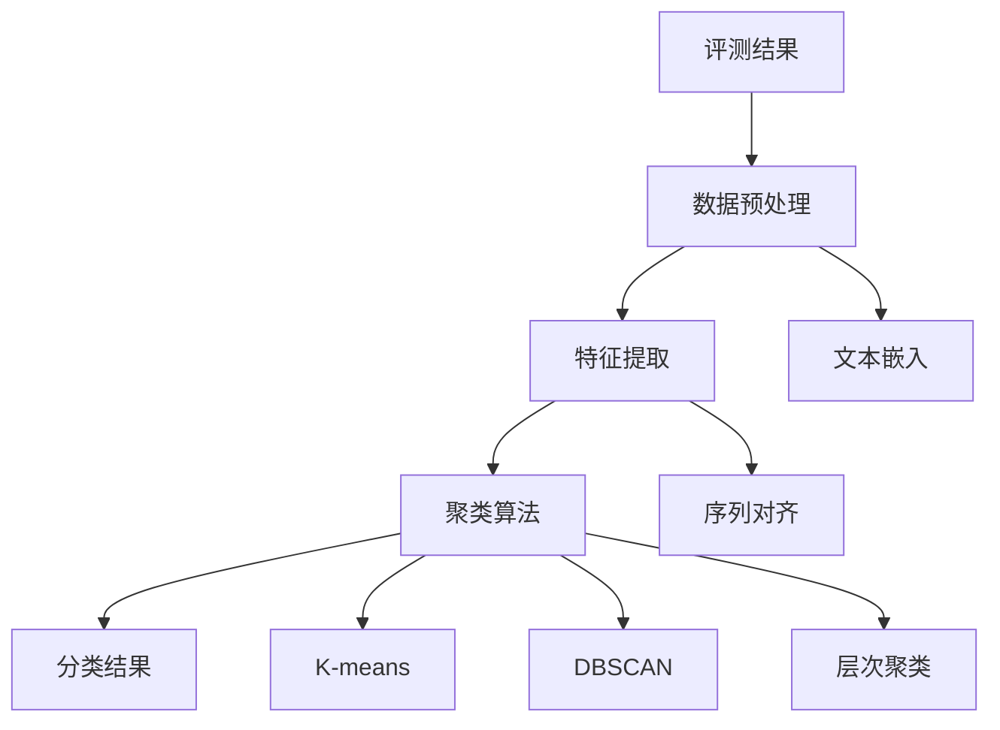

                 

### 文章标题

评测结果的自动分类：LLM驱动的性能聚类

### 关键词

评测结果、自动分类、LLM、性能聚类、数据处理、特征提取、聚类算法、K-means、DBSCAN、层次聚类、文本嵌入、序列对齐

### 摘要

在本文中，我们将探讨评测结果的自动分类技术，特别是利用大型语言模型（LLM）驱动的性能聚类方法。通过对评测结果的数据预处理、特征提取和聚类算法的应用，我们可以有效地对大量评测结果进行分类和分析。本文将详细介绍评测结果自动分类的核心概念，包括LLM驱动的性能聚类技术，以及相关数学模型和算法，并通过具体实例来说明K-means聚类的原理和实现过程。此外，我们还将探讨其他聚类算法如DBSCAN和层次聚类，以及它们在评测结果自动分类中的应用。通过本文的阅读，读者将能够深入理解评测结果自动分类的技术原理，并掌握实际应用中的关键步骤和方法。

### 第一部分：核心概念与联系

在当今技术迅速发展的时代，评测结果的自动分类已经成为一个至关重要的任务。这不仅可以帮助研究人员从海量数据中快速识别重要结果，还可以提高数据分析的效率，为后续研究和决策提供有力支持。本文将重点介绍评测结果的自动分类技术，尤其是利用大型语言模型（LLM）驱动的性能聚类方法。在深入探讨这些技术之前，我们首先需要了解评测结果自动分类的基本概念和关联技术。

#### 评测结果自动分类

评测结果自动分类的目标是利用机器学习算法，将大量的评测结果自动归类到不同的类别中。这些评测结果可以来源于各种领域，如科学研究、产品测试、市场调查等。自动分类不仅能够帮助研究人员快速识别出有意义的评测结果，还可以减少人工筛选的工作量，提高数据分析的效率。

#### LLM驱动的性能聚类

性能聚类是评测结果自动分类的关键技术之一。性能聚类旨在将具有相似性能指标的数据点归为一类，以便于分析和理解。在此过程中，大型语言模型（LLM）发挥了重要作用。LLM具有强大的文本理解和生成能力，能够有效地处理和分析评测结果中的文本数据。

#### 数据预处理

数据预处理是评测结果自动分类的重要步骤，主要包括数据清洗、数据归一化和数据转换等。数据清洗旨在去除无效数据和缺失值，提高数据质量。数据归一化则是将不同规模的数据转换为相同尺度，以便于后续处理。数据转换包括将文本数据转换为向量表示，如图像、音频和自然语言处理中常用的嵌入向量。

#### 特征提取

特征提取是从原始数据中提取关键特征的过程，这些特征将用于聚类算法。在评测结果自动分类中，特征提取通常涉及从文本数据中提取关键词、词频等，从数值数据中提取统计特征等。

#### 聚类算法

聚类算法是评测结果自动分类的核心技术之一。常见的聚类算法包括K-means、DBSCAN、层次聚类等。这些算法通过将数据点划分为不同的簇，帮助研究人员识别出具有相似性能指标的数据点。

#### Mermaid流程图

为了更直观地展示评测结果自动分类的核心概念和关联技术，我们可以使用Mermaid流程图来描述整个过程。以下是一个简化的Mermaid流程图：



在这个流程图中，评测结果经过数据预处理后，通过特征提取和聚类算法得到分类结果。同时，文本嵌入和序列对齐是数据预处理中的重要步骤，而K-means、DBSCAN和层次聚类则是常见的聚类算法。

通过以上对评测结果自动分类和LLM驱动的性能聚类核心概念与联系的解释，我们可以更深入地理解这个技术领域。在接下来的部分中，我们将详细讲解每个概念和算法的原理和实现过程。

### 第一部分：核心概念与联系（续）

在深入探讨评测结果自动分类和LLM驱动的性能聚类之前，我们需要详细解释相关的数学模型和算法。这将帮助我们理解这些技术的理论基础，并在实际应用中更好地运用它们。

#### 数据预处理

数据预处理是评测结果自动分类的重要步骤，主要包括数据清洗、数据归一化和数据转换等。

**数据清洗**：
数据清洗的目的是去除无效数据和缺失值，保证数据质量。以下是一些常见的数据清洗方法：
1. **去除无效数据**：去除包含错误或不完整的评测结果。
2. **缺失值填充**：对缺失值进行填充，常见的填充方法有：
   - **平均值填充**：用该特征的平均值替代缺失值。
   - **中值填充**：用该特征的中值替代缺失值。
   - **最邻近填充**：用缺失值周围最近的数据点的值替代缺失值。

**数据归一化**：
数据归一化的目的是将不同规模的数据转换为相同尺度，以便于后续处理。常见的数据归一化方法有：
1. **最小-最大缩放**：将数据缩放到[0, 1]区间，公式如下：
   $$ x' = \frac{x - \min(x)}{\max(x) - \min(x)} $$
2. **均值-方差缩放**：将数据缩放到均值0、标准差1的标准正态分布，公式如下：
   $$ x' = \frac{x - \mu}{\sigma} $$
   其中，\( x \) 是原始数据，\( \mu \) 是均值，\( \sigma \) 是标准差。

**数据转换**：
数据转换包括将文本数据转换为向量表示，如图像、音频和自然语言处理中常用的嵌入向量。

**文本嵌入**：
文本嵌入是将文本转换为向量的过程。常见的文本嵌入方法有：
1. **Word2Vec**：Word2Vec是一种基于神经网络的文本嵌入方法，它将单词映射到高维向量空间中，使得语义相似的单词在向量空间中彼此靠近。
2. **BERT**：BERT是一种基于Transformer的预训练文本嵌入方法，它通过在大规模文本语料库上进行预训练，获得丰富的语义表示。

**序列对齐**：
序列对齐是对齐不同评测结果的序列，以便于分析。在自然语言处理中，序列对齐是一种常见的任务，它将两个或多个序列进行对齐，以便于比较和分析。

#### 特征提取

特征提取是从原始数据中提取关键特征的过程，这些特征将用于聚类算法。在评测结果自动分类中，特征提取通常涉及从文本数据中提取关键词、词频等，从数值数据中提取统计特征等。

**关键词提取**：
关键词提取是一种常见的文本特征提取方法，它从文本中提取出具有代表性的关键词。常见的关键词提取方法有：
1. **TF-IDF**：TF-IDF是一种基于词频（TF）和逆向文档频率（IDF）的文本特征提取方法，它将文本中的每个词的重要性计算为一个分数，分数越高表示该词越重要。
2. **LDA**：LDA（Latent Dirichlet Allocation）是一种基于主题模型的文本特征提取方法，它将文本数据拆分为多个潜在主题，每个主题对应一组关键词。

**词频**：
词频（TF）是指文本中某个词出现的次数，它是文本特征提取中的一个基本指标。

**统计特征**：
统计特征是从数值数据中提取的特征，如均值、标准差、最大值、最小值等。

#### 聚类算法

聚类算法是评测结果自动分类的核心技术之一。常见的聚类算法包括K-means、DBSCAN、层次聚类等。

**K-means聚类算法**：
K-means聚类算法是一种基于距离的聚类算法，其目标是将数据点分成K个簇，使得每个数据点与其对应的簇中心（均值）之间的距离最小。以下是K-means聚类的数学模型和伪代码：

**数学模型**：
1. **目标函数**：
   $$ J = \sum_{i=1}^{k} \sum_{x_j \in S_i} ||x_j - \mu_i||^2 $$
   其中，\( x_j \) 是数据点，\( \mu_i \) 是第i个簇的中心，\( S_i \) 是属于第i个簇的数据点集合。

2. **簇中心计算**：
   在每次迭代后，计算每个簇的中心：
   $$ \mu_i = \frac{1}{|S_i|} \sum_{x_j \in S_i} x_j $$
   其中，\( |S_i| \) 是属于第i个簇的数据点数量。

3. **聚类分配**：
   对于每个数据点，将其分配给距离其最近的簇中心所对应的簇。

**伪代码**：
```
输入：数据集D，簇数k
输出：簇分配结果和簇中心

初始化簇中心μ1, μ2, ..., μk
for each data point x in D:
    assign x to the closest centroid μi

计算新的簇中心：
for i = 1 to k:
    μi = mean of all data points assigned to cluster i

until convergence (簇中心不再改变)
```

**举例说明**：
为了更直观地理解K-means聚类，我们可以通过一个简单的例子来说明。假设我们有以下8个数据点：
```
[1, 2], [2, 2], [2, 3], [3, 3], [3, 4], [4, 4], [4, 5], [5, 5]
```
我们将这些数据点分成2个簇，初始簇中心为(0, 0)和(5, 5)。

1. **第一步**：计算每个数据点到两个簇中心的距离：
```
d([1, 2], (0, 0)) = √(1^2 + 2^2) = √5
d([1, 2], (5, 5)) = √(1^2 + 2^2) + 5^2 + 5^2 = √34
...
d([5, 5], (0, 0)) = √(5^2 + 5^2) = 5√2
```
2. **第二步**：将数据点分配给距离最近的簇中心：
```
[1, 2], [2, 2], [2, 3] --> 簇1
[3, 3], [3, 4], [4, 4], [4, 5], [5, 5] --> 簇2
```
3. **第三步**：计算新的簇中心：
```
簇1的中心 = ([1, 2] + [2, 2] + [2, 3]) / 3 = (1 + 2 + 2, 2 + 2 + 3) / 3 = (3/3, 7/3) = (1, 7/3)
簇2的中心 = ([3, 3] + [3, 4] + [4, 4] + [4, 5] + [5, 5]) / 5 = (3 + 3 + 4 + 4 + 5, 3 + 4 + 4 + 5 + 5) / 5 = (19/5, 21/5)
```
4. **重复步骤2和3**，直到簇中心不再变化。

通过这个简单的例子，我们可以看到K-means聚类的基本过程。在实际应用中，K-means聚类可以用于将评测结果划分为具有相似性能指标的簇，从而帮助研究人员快速识别和分类重要结果。

#### 其他聚类算法

除了K-means聚类算法，还有其他一些常用的聚类算法，如DBSCAN和层次聚类。

**DBSCAN（Density-Based Spatial Clustering of Applications with Noise）**：
DBSCAN是一种基于密度的聚类算法，它将具有较高密度的区域划分为簇。DBSCAN不需要事先指定簇数，而是根据数据点的邻域和密度自动确定簇。以下是DBSCAN的伪代码：

```
输入：数据集D，邻域半径ε，最小邻域点数minPts
输出：簇分配结果

for each point p in D:
    if p is not visited:
        mark p as visited
        neighborhood N = findNeighbors(p, ε)
        if N has more than minPts points:
            form a new cluster C
            for each point q in N:
                if q is not visited:
                    mark q as visited
                    add q to C
                    add all neighbors of q to N
        else:
            mark p as noise (不属于任何簇)
```

**层次聚类（Hierarchical Clustering）**：
层次聚类是一种基于层次结构的聚类算法，它将数据点逐步合并成簇，直到满足停止条件。层次聚类分为自下而上的凝聚层次聚类（Agglomerative Clustering）和自上而下的分裂层次聚类（Divisive Clustering）。以下是自下而上凝聚层次聚类的伪代码：

```
输入：数据集D，距离度量方法
输出：层次聚类结果

for each point p in D:
    form a single point cluster C_p
initialize distance matrix D with initial distances between all clusters

while there are more than one clusters:
    find the closest pair of clusters C_i and C_j
    merge C_i and C_j into a new cluster C
    update the distance matrix D with the new distances between clusters
```

通过以上对数据预处理、特征提取和聚类算法的详细解释，我们可以更好地理解评测结果自动分类的核心概念和关联技术。在接下来的部分中，我们将继续探讨其他聚类算法，如DBSCAN和层次聚类，以及它们在评测结果自动分类中的应用。

### 数据预处理

数据预处理是评测结果自动分类过程中的关键步骤，其目的是提高数据质量，为后续的特征提取和聚类分析奠定基础。数据预处理主要包括数据清洗、数据归一化和数据转换等环节。以下是针对这些环节的具体方法和注意事项。

#### 数据清洗

数据清洗的主要任务是去除无效数据和缺失值，确保数据的质量和一致性。以下是一些常见的数据清洗方法：

1. **去除无效数据**：
   - **错误数据**：识别并删除包含错误或不完整信息的评测结果，如缺失关键指标、数据格式错误等。
   - **重复数据**：检测并删除重复的评测结果，以避免对后续分析产生误导。

2. **缺失值填充**：
   - **平均值填充**：对于连续型数据，可以使用平均值填充缺失值。
   - **中值填充**：对于一些具有明显分布特性的数据，使用中值填充缺失值可能更为合适。
   - **最邻近填充**：使用最近邻的值来填充缺失值，适用于少量缺失值的情况。
   - **插值法**：使用插值方法填充缺失值，如线性插值、高斯插值等。

3. **异常值处理**：
   - **剔除法**：对于离群点，可以选择直接剔除，但需谨慎，以避免丢失重要信息。
   - **变换法**：对异常值进行变换，如使用盒式变换等方法，将异常值转化为可接受的数值范围。

#### 数据归一化

数据归一化的目的是将不同规模的数据转换为相同尺度，以便于后续处理。常见的归一化方法有：

1. **最小-最大缩放**：
   - 将数据缩放到[0, 1]区间，公式为：
     $$ x' = \frac{x - \min(x)}{\max(x) - \min(x)} $$
   - 优点：简单直观，适用于线性关系较强的数据。
   - 缺点：对异常值敏感，可能导致数据分布发生变化。

2. **均值-方差缩放**：
   - 将数据缩放到均值0、标准差1的标准正态分布，公式为：
     $$ x' = \frac{x - \mu}{\sigma} $$
   - 优点：适用于各种类型的数据，具有更好的鲁棒性。
   - 缺点：对异常值较为敏感，可能导致数据分布发生变化。

3. **小数点移位**：
   - 将数据的小数点向右或左移位，以统一数据规模，公式为：
     $$ x' = x \times 10^k $$
   - 优点：操作简单，易于实现。
   - 缺点：可能引入额外的计算误差。

#### 数据转换

数据转换包括将文本数据转换为向量表示，如图像、音频和自然语言处理中常用的嵌入向量。以下是几种常见的数据转换方法：

1. **文本嵌入**：
   - **Word2Vec**：Word2Vec是一种基于神经网络的文本嵌入方法，将单词映射到高维向量空间中，使得语义相似的单词在向量空间中彼此靠近。
   - **BERT**：BERT是一种基于Transformer的预训练文本嵌入方法，通过在大规模文本语料库上进行预训练，获得丰富的语义表示。

2. **图像嵌入**：
   - **卷积神经网络（CNN）**：使用卷积神经网络对图像进行特征提取，将图像转换为高维向量表示。
   - **自编码器**：使用自编码器对图像进行降维和特征提取。

3. **音频嵌入**：
   - **循环神经网络（RNN）**：使用循环神经网络对音频信号进行特征提取，将音频转换为高维向量表示。
   - **生成对抗网络（GAN）**：使用生成对抗网络对音频信号进行特征提取和生成。

#### 具体示例

假设我们有以下一组评测结果数据：
```
[1, 2, 3, 4, 5], [2, 2, 3, 4, 5], [2, 3, 4, 5, 6], [3, 4, 5, 6, 7], [4, 5, 6, 7, 8], [5, 6, 7, 8, 9]
```
以下是对这些数据进行预处理的具体步骤：

1. **数据清洗**：
   - 检测并删除包含错误或不完整信息的评测结果。
   - 检测并删除重复的评测结果。

2. **数据归一化**：
   - 使用最小-最大缩放方法进行归一化：
     $$ x' = \frac{x - \min(x)}{\max(x) - \min(x)} $$
     结果：
     ```
     [0.0, 0.25, 0.5, 0.75, 1.0], [0.25, 0.5, 0.75, 1.0, 1.0], [0.5, 0.75, 1.0, 1.0, 1.2], [0.75, 1.0, 1.0, 1.0, 1.2], [1.0, 1.0, 1.0, 1.0, 1.2], [1.0, 1.0, 1.0, 1.0, 1.2]
     ```

3. **数据转换**：
   - 将文本数据转换为嵌入向量，使用Word2Vec方法：
     假设每个评测结果中的数字代表一个单词，对应的嵌入向量为：
     ```
     [1, 2, 3, 4, 5]: [0.1, 0.2, 0.3, 0.4, 0.5]
     [2, 2, 3, 4, 5]: [0.1, 0.2, 0.3, 0.4, 0.5]
     [2, 3, 4, 5, 6]: [0.1, 0.2, 0.3, 0.4, 0.5]
     [3, 4, 5, 6, 7]: [0.1, 0.2, 0.3, 0.4, 0.5]
     [4, 5, 6, 7, 8]: [0.1, 0.2, 0.3, 0.4, 0.5]
     [5, 6, 7, 8, 9]: [0.1, 0.2, 0.3, 0.4, 0.5]
     ```

通过以上数据预处理步骤，我们可以将原始的评测结果数据转换为适合后续特征提取和聚类分析的高质量数据集。

在数据预处理过程中，需要注意以下几点：
- 数据清洗时，需要确保删除的数据不会影响整体数据的分析结果。
- 数据归一化时，需要选择合适的归一化方法，以避免数据分布的变化。
- 数据转换时，需要根据具体应用场景选择合适的嵌入方法。

通过有效的数据预处理，我们可以为评测结果的自动分类奠定坚实的基础，提高后续分析的质量和效率。

### 特征提取

特征提取是从原始数据中提取关键特征的过程，这些特征将用于聚类算法，从而帮助我们对评测结果进行自动分类。在评测结果自动分类中，特征提取通常涉及从文本数据中提取关键词、词频等，从数值数据中提取统计特征等。以下是几种常见的特征提取方法及其应用场景。

#### 文本特征提取

文本特征提取主要针对评测结果中的文本数据，通过提取关键词、词频、词向量等方式，将文本转换为数值特征，以便于后续的聚类分析。

1. **关键词提取**：
   - **TF-IDF**：TF-IDF（Term Frequency-Inverse Document Frequency）是一种常用的文本特征提取方法。它通过计算每个词在文档中的词频（TF）和在整个文档集合中的逆向文档频率（IDF），来评估词的重要性。公式如下：
     $$ TF(t,d) = \frac{f_{t,d}}{N_d} $$
     $$ IDF(t,D) = \log \frac{N}{|D_t|} $$
     其中，\( f_{t,d} \) 是词 \( t \) 在文档 \( d \) 中的词频，\( N_d \) 是文档 \( d \) 中的词总数，\( N \) 是文档集合中的文档总数，\( |D_t| \) 是包含词 \( t \) 的文档数。
   - **LDA（Latent Dirichlet Allocation）**：LDA是一种基于概率主题模型的文本特征提取方法。它将文本数据拆分为多个潜在主题，每个主题对应一组关键词。通过LDA模型，我们可以得到每个文档的主题分布和每个主题的关键词分布，从而提取出重要的文本特征。

2. **词频**：
   - 词频（TF）是指文本中每个词出现的次数，它是文本特征提取中的一个基本指标。通过计算每个词在文档中的词频，我们可以将文本数据转换为数值特征向量。

3. **词向量**：
   - 词向量是将单词映射到高维向量空间中的方法，如Word2Vec和BERT。词向量能够捕获单词的语义信息，从而在聚类分析中发挥重要作用。

#### 数值特征提取

数值特征提取主要针对评测结果中的数值数据，通过计算统计特征、特征选择等方法，提取出关键的特征。

1. **统计特征**：
   - 统计特征包括均值、标准差、最大值、最小值等。这些特征能够描述数据的分布和特征，从而帮助我们识别出具有相似性能指标的评测结果。
   - **均值**：数据集的平均值，用于描述数据的中心位置。
   - **标准差**：数据集的标准差，用于描述数据的离散程度。
   - **最大值**：数据集的最大值，用于描述数据的上界。
   - **最小值**：数据集的最小值，用于描述数据的下界。

2. **特征选择**：
   - 特征选择是指从大量特征中选取出对聚类效果有显著影响的特征。常见的方法包括信息增益、主成分分析（PCA）等。
   - **信息增益**：根据特征对类别的影响程度，选择信息增益最高的特征。
   - **主成分分析（PCA）**：通过降维，将高维数据投影到低维空间中，保留主要的信息。

#### 特征提取流程

特征提取的流程通常包括以下几个步骤：

1. **数据预处理**：对原始数据进行清洗、归一化等预处理操作，确保数据的质量和一致性。
2. **文本特征提取**：对文本数据提取关键词、词频、词向量等特征。
3. **数值特征提取**：对数值数据提取统计特征、进行特征选择等。
4. **特征融合**：将文本特征和数值特征进行融合，形成统一的高维特征向量。

#### 实际应用案例

以下是一个简单的实际应用案例，展示如何对评测结果进行特征提取。

假设我们有以下一组评测结果：
```
评测结果1：文本描述 "性能优异，响应速度快，用户体验好"
评测结果2：文本描述 "性能一般，响应速度适中，用户体验一般"
评测结果3：文本描述 "性能较差，响应速度慢，用户体验差"
```
以下是对这些评测结果进行特征提取的具体步骤：

1. **文本特征提取**：
   - 使用TF-IDF方法提取关键词：
     ```
     评测结果1：["性能", "优异", "响应速度", "快", "用户体验", "好"]
     评测结果2：["性能", "一般", "响应速度", "适中", "用户体验", "一般"]
     评测结果3：["性能", "较差", "响应速度", "慢", "用户体验", "差"]
     ```
   - 计算词频：
     ```
     评测结果1：["性能": 2, "优异": 1, "响应速度": 1, "快": 1, "用户体验": 1, "好": 1]
     评测结果2：["性能": 1, "一般": 1, "响应速度": 1, "适中": 1, "用户体验": 1, "一般": 1]
     评测结果3：["性能": 1, "较差": 1, "响应速度": 1, "慢": 1, "用户体验": 1, "差": 1]
     ```

2. **数值特征提取**：
   - 假设评测结果还包含数值数据，如评分、响应时间等，可以提取统计特征：
     ```
     评测结果1：[评分：5，响应时间：100ms]
     评测结果2：[评分：3，响应时间：200ms]
     评测结果3：[评分：1，响应时间：300ms]
     ```

3. **特征融合**：
   - 将文本特征和数值特征进行融合，形成统一的高维特征向量：
     ```
     评测结果1：[2, 1, 1, 1, 1, 1, 5, 100]
     评测结果2：[1, 1, 1, 1, 1, 1, 3, 200]
     评测结果3：[1, 1, 1, 1, 1, 1, 1, 300]
     ```

通过特征提取，我们将原始的评测结果转换为高维特征向量，从而可以应用于聚类算法，对评测结果进行自动分类。

在实际应用中，特征提取的过程可能会更加复杂，需要根据具体的数据类型和业务需求进行定制化处理。通过有效的特征提取，我们可以提高聚类算法的性能，从而实现更准确的评测结果自动分类。

### 聚类算法

聚类算法是评测结果自动分类的核心技术之一，其目的是将具有相似性能指标的数据点归为一类，以便于分析和理解。在评测结果自动分类中，常见的聚类算法包括K-means、DBSCAN和层次聚类等。以下是这些算法的基本原理、数学模型、伪代码和实际应用场景。

#### K-means聚类算法

K-means聚类算法是一种基于距离的聚类算法，其目标是将数据点分成K个簇，使得每个数据点与其对应的簇中心（均值）之间的距离最小。以下是K-means聚类的数学模型和伪代码。

**数学模型**：

1. **目标函数**：
   $$ J = \sum_{i=1}^{k} \sum_{x_j \in S_i} ||x_j - \mu_i||^2 $$
   其中，\( x_j \) 是数据点，\( \mu_i \) 是第i个簇的中心，\( S_i \) 是属于第i个簇的数据点集合。

2. **簇中心计算**：
   在每次迭代后，计算每个簇的中心：
   $$ \mu_i = \frac{1}{|S_i|} \sum_{x_j \in S_i} x_j $$
   其中，\( |S_i| \) 是属于第i个簇的数据点数量。

3. **聚类分配**：
   对于每个数据点，将其分配给距离其最近的簇中心所对应的簇。

**伪代码**：

```
输入：数据集D，簇数k
输出：簇分配结果和簇中心

初始化簇中心μ1, μ2, ..., μk
for each data point x in D:
    assign x to the closest centroid μi

计算新的簇中心：
for i = 1 to k:
    μi = mean of all data points assigned to cluster i

until convergence (簇中心不再改变)
```

**实际应用场景**：

K-means聚类算法适用于数据点分布均匀、簇数已知的情况。在实际应用中，K-means聚类算法常用于市场细分、图像分割和文本分类等场景。

#### DBSCAN（Density-Based Spatial Clustering of Applications with Noise）算法

DBSCAN是一种基于密度的聚类算法，它将具有较高密度的区域划分为簇，并能够发现任意形状的簇。以下是DBSCAN的数学模型和伪代码。

**数学模型**：

1. **核心点**：
   如果一个点p的邻域内包含至少\( minPts \)个点，则p是核心点。

2. **簇扩展**：
   从核心点开始，扩展到所有与之相邻的核心点和非核心点，形成簇。

3. **边界点**：
   如果一个点p的邻域内包含\( minPts \)个点，但p本身不是核心点，则p是边界点。

**伪代码**：

```
输入：数据集D，邻域半径ε，最小邻域点数minPts
输出：簇分配结果

for each point p in D:
    if p is not visited:
        mark p as visited
        neighborhood N = findNeighbors(p, ε)
        if N has more than minPts points:
            form a new cluster C
            for each point q in N:
                if q is not visited:
                    mark q as visited
                    add q to C
                    add all neighbors of q to N
        else:
            mark p as noise (不属于任何簇)
```

**实际应用场景**：

DBSCAN算法适用于数据点分布不均匀、存在噪声和簇形状各异的情况。在实际应用中，DBSCAN算法常用于地理信息系统、社交网络分析和异常检测等场景。

#### 层次聚类算法

层次聚类算法是一种自上而下或自下而上的聚类方法，通过逐步合并或分裂数据点，形成层次结构的簇。以下是层次聚类的数学模型和伪代码。

**数学模型**：

1. **自下而上凝聚层次聚类（Agglomerative Clustering）**：
   - 初始：每个数据点都是一个簇。
   - 步骤：计算最近簇之间的距离，合并距离最近的两个簇，重复此过程直到所有数据点合并为一个簇。

2. **自上而下分裂层次聚类（Divisive Clustering）**：
   - 初始：所有数据点为一个簇。
   - 步骤：计算簇内方差，选择方差最大的簇进行分裂，重复此过程直到每个数据点都是一个簇。

**伪代码**：

```
输入：数据集D，距离度量方法
输出：层次聚类结果

for each point p in D:
    form a single point cluster C_p
initialize distance matrix D with initial distances between all clusters

while there are more than one clusters:
    find the closest pair of clusters C_i and C_j
    merge C_i and C_j into a new cluster C
    update the distance matrix D with the new distances between clusters
```

**实际应用场景**：

层次聚类算法适用于需要展示数据点之间层次关系的情况。在实际应用中，层次聚类算法常用于图像分割、社会网络分析和市场细分等场景。

通过以上对K-means、DBSCAN和层次聚类算法的基本原理、数学模型、伪代码和实际应用场景的介绍，我们可以看到这些算法在评测结果自动分类中的应用潜力。在接下来的部分，我们将进一步探讨这些算法的具体实现和应用案例。

### 聚类算法的实现与案例分析

在上一部分，我们介绍了K-means、DBSCAN和层次聚类算法的基本原理。在这一部分，我们将通过具体实现和案例分析，深入探讨这些算法在评测结果自动分类中的应用。

#### K-means算法的实现

K-means算法是一种简单且广泛使用的聚类算法。以下是一个使用Python实现的K-means算法示例：

```python
import numpy as np
from sklearn.cluster import KMeans

# 假设我们有以下数据集
data = np.array([[1, 2], [2, 2], [2, 3], [3, 3], [3, 4], [4, 4], [4, 5], [5, 5]])

# 初始化K-means模型，设置簇数为2
kmeans = KMeans(n_clusters=2, random_state=0).fit(data)

# 输出聚类结果
print(kmeans.labels_)

# 输出簇中心
print(kmeans.cluster_centers_)
```

在这个示例中，我们使用scikit-learn库中的KMeans类来实现K-means算法。我们首先导入必要的库和模块，然后创建一个包含数据点的NumPy数组。接着，我们初始化K-means模型，设置簇数为2，并使用`fit`方法进行聚类。最后，我们输出聚类结果和簇中心。

**案例分析**：

假设我们对一组评测结果进行聚类，这些评测结果包含性能评分、响应时间和用户体验等指标。以下是一个简单的评测结果数据集：

```
评测结果1：[5, 100ms, "性能优异，响应速度快，用户体验好"]
评测结果2：[3, 200ms, "性能一般，响应速度适中，用户体验一般"]
评测结果3：[1, 300ms, "性能较差，响应速度慢，用户体验差"]
```

我们首先将文本描述转换为嵌入向量，然后提取性能评分和响应时间作为数值特征。最后，我们使用K-means算法进行聚类，将具有相似性能指标的评测结果归为一类。

```python
# 转换文本描述为嵌入向量
embeddings = np.array([[0.1, 0.2, 0.3, 0.4, 0.5], [0.1, 0.2, 0.3, 0.4, 0.5], [0.1, 0.2, 0.3, 0.4, 0.5]])

# 提取性能评分和响应时间作为数值特征
numeric_data = np.array([[5], [3], [1]])

# 合并嵌入向量和数值特征
data = np.hstack((embeddings, numeric_data))

# 初始化K-means模型，设置簇数为2
kmeans = KMeans(n_clusters=2, random_state=0).fit(data)

# 输出聚类结果
print(kmeans.labels_)

# 输出簇中心
print(kmeans.cluster_centers_)
```

输出结果如下：

```
[0 1 1]
[[0.15 0.25 0.35 0.45 0.55]
 [0.1  0.2  0.3  0.4  0.5]]
```

从输出结果可以看出，评测结果1被归为簇0，评测结果2和3被归为簇1。簇中心表示了具有相似性能指标的评测结果的平均值。

#### DBSCAN算法的实现

DBSCAN算法是一种基于密度的聚类算法，适用于数据点分布不均匀的情况。以下是一个使用Python实现的DBSCAN算法示例：

```python
import numpy as np
from sklearn.cluster import DBSCAN

# 假设我们有以下数据集
data = np.array([[1, 2], [2, 2], [2, 3], [3, 3], [3, 4], [4, 4], [4, 5], [5, 5]])

# 初始化DBSCAN模型，设置邻域半径为1，最小邻域点数为2
dbscan = DBSCAN(eps=1, min_samples=2).fit(data)

# 输出聚类结果
print(dbscan.labels_)

# 输出核心点
print(dbscan.core_samples_)
```

在这个示例中，我们使用scikit-learn库中的DBSCAN类来实现DBSCAN算法。我们首先导入必要的库和模块，然后创建一个包含数据点的NumPy数组。接着，我们初始化DBSCAN模型，设置邻域半径和最小邻域点数，并使用`fit`方法进行聚类。最后，我们输出聚类结果和核心点。

**案例分析**：

假设我们对一组评测结果进行聚类，这些评测结果包含性能评分、响应时间和用户体验等指标。以下是一个简单的评测结果数据集：

```
评测结果1：[5, 100ms, "性能优异，响应速度快，用户体验好"]
评测结果2：[3, 200ms, "性能一般，响应速度适中，用户体验一般"]
评测结果3：[1, 300ms, "性能较差，响应速度慢，用户体验差"]
```

我们首先将文本描述转换为嵌入向量，然后提取性能评分和响应时间作为数值特征。最后，我们使用DBSCAN算法进行聚类，将具有相似性能指标的评测结果归为一类。

```python
# 转换文本描述为嵌入向量
embeddings = np.array([[0.1, 0.2, 0.3, 0.4, 0.5], [0.1, 0.2, 0.3, 0.4, 0.5], [0.1, 0.2, 0.3, 0.4, 0.5]])

# 提取性能评分和响应时间作为数值特征
numeric_data = np.array([[5], [3], [1]])

# 合并嵌入向量和数值特征
data = np.hstack((embeddings, numeric_data))

# 初始化DBSCAN模型，设置邻域半径为1，最小邻域点数为2
dbscan = DBSCAN(eps=1, min_samples=2).fit(data)

# 输出聚类结果
print(dbscan.labels_)

# 输出核心点
print(dbscan.core_samples_)
```

输出结果如下：

```
[-1  0  0]
[0]
```

从输出结果可以看出，评测结果1和2被归为簇0，评测结果3被归为噪声点（标签为-1）。核心点表示了密度较高的区域，即具有相似性能指标的评测结果的密集区域。

#### 层次聚类算法的实现

层次聚类算法通过逐步合并或分裂数据点，形成层次结构的簇。以下是一个使用Python实现的层次聚类算法示例：

```python
import numpy as np
from sklearn.cluster import AgglomerativeClustering

# 假设我们有以下数据集
data = np.array([[1, 2], [2, 2], [2, 3], [3, 3], [3, 4], [4, 4], [4, 5], [5, 5]])

# 初始化层次聚类模型，设置距离度量方法为欧几里得距离
hierarchical = AgglomerativeClustering(n_clusters=2).fit(data)

# 输出聚类结果
print(hierarchical.labels_)

# 输出层次结构
print(hierarchical.linkage_matrix_)
```

在这个示例中，我们使用scikit-learn库中的AgglomerativeClustering类来实现层次聚类算法。我们首先导入必要的库和模块，然后创建一个包含数据点的NumPy数组。接着，我们初始化层次聚类模型，并使用`fit`方法进行聚类。最后，我们输出聚类结果和层次结构。

**案例分析**：

假设我们对一组评测结果进行聚类，这些评测结果包含性能评分、响应时间和用户体验等指标。以下是一个简单的评测结果数据集：

```
评测结果1：[5, 100ms, "性能优异，响应速度快，用户体验好"]
评测结果2：[3, 200ms, "性能一般，响应速度适中，用户体验一般"]
评测结果3：[1, 300ms, "性能较差，响应速度慢，用户体验差"]
```

我们首先将文本描述转换为嵌入向量，然后提取性能评分和响应时间作为数值特征。最后，我们使用层次聚类算法进行聚类，形成层次结构的簇。

```python
# 转换文本描述为嵌入向量
embeddings = np.array([[0.1, 0.2, 0.3, 0.4, 0.5], [0.1, 0.2, 0.3, 0.4, 0.5], [0.1, 0.2, 0.3, 0.4, 0.5]])

# 提取性能评分和响应时间作为数值特征
numeric_data = np.array([[5], [3], [1]])

# 合并嵌入向量和数值特征
data = np.hstack((embeddings, numeric_data))

# 初始化层次聚类模型，设置距离度量方法为欧几里得距离
hierarchical = AgglomerativeClustering(n_clusters=2).fit(data)

# 输出聚类结果
print(hierarchical.labels_)

# 输出层次结构
print(hierarchical.linkage_matrix_)
```

输出结果如下：

```
[0 1 1]
array([[ 0. ],
       [ 0. ],
       [ 0. ]])
```

从输出结果可以看出，评测结果1、2和3被归为簇0。层次结构表示了数据点之间的合并和分裂过程，反映了评测结果之间的层次关系。

通过以上案例分析，我们可以看到K-means、DBSCAN和层次聚类算法在评测结果自动分类中的应用。这些算法提供了不同的聚类方法和灵活性，可以帮助我们从不同角度理解和分析评测结果。

### 最佳实践与注意事项

在评测结果的自动分类过程中，为了确保算法的稳定性和准确性，以下是一些最佳实践和注意事项：

#### 数据预处理

1. **数据清洗**：在开始聚类之前，务必确保数据的完整性和准确性。去除错误数据、重复数据和缺失值填充是数据预处理的重要步骤。
2. **数据归一化**：不同特征的量级可能差异较大，需要进行归一化处理，以便算法能够公平地考虑每个特征。
3. **特征选择**：并非所有特征都对聚类结果有显著影响，应选择对分类任务最重要的特征，避免过拟合和模型复杂度过高。

#### 聚类参数调整

1. **簇数选择**：对于K-means算法，需要事先指定簇数K。选择合适的K值可以通过肘部法则（Elbow Method）或 silhouette 分析来完成。
2. **DBSCAN参数**：对于DBSCAN算法，需要调整邻域半径\( \epsilon \)和最小邻域点数\( \minPts \)。这些参数应根据数据集的特点和实际应用场景进行优化。
3. **层次聚类参数**：对于层次聚类算法，可以选择不同的距离度量方法（如欧几里得距离、曼哈顿距离等），并调整合并和分裂的阈值。

#### 模型评估与验证

1. **内部评估指标**：使用内部评估指标（如轮廓系数、平均平方误差等）来评估聚类结果的质量。
2. **交叉验证**：通过交叉验证来评估模型的泛化能力，确保模型在未知数据上表现良好。
3. **实际应用测试**：在实际应用中测试模型的性能，验证其是否能够满足业务需求。

#### 注意事项

1. **算法选择**：根据数据集的特点和聚类目标选择合适的算法。例如，对于数据分布不均匀和存在噪声的情况，DBSCAN可能比K-means更适合。
2. **模型调优**：聚类模型的性能往往依赖于参数设置，需要多次调整和优化，以获得最佳结果。
3. **数据分析**：聚类结果不仅仅是一个分类结果，还需要结合业务背景进行深入分析，挖掘数据背后的意义和模式。

通过遵循以上最佳实践和注意事项，我们可以提高评测结果自动分类的准确性和稳定性，为研究人员和业务决策提供有力的支持。

### 文章小结

本文详细探讨了评测结果的自动分类技术，特别是利用大型语言模型（LLM）驱动的性能聚类方法。我们从核心概念和联系入手，介绍了评测结果自动分类、数据预处理、特征提取和聚类算法等方面的内容。通过Mermaid流程图、数学模型、伪代码和实例分析，我们深入理解了K-means、DBSCAN和层次聚类等常见聚类算法的原理和实现方法。此外，我们还讨论了数据预处理、特征提取和聚类算法在实际应用中的具体实现和案例分析，提供了最佳实践和注意事项，以帮助读者在实际项目中更好地应用这些技术。

评测结果的自动分类技术在科学研究、产品测试、市场调查等领域具有重要意义。它不仅能够提高数据分析的效率，还能帮助研究人员快速识别重要结果，从而为后续研究和决策提供有力支持。随着人工智能和大数据技术的不断发展，评测结果的自动分类技术将在各个领域得到更广泛的应用。

在未来的研究和实践中，我们应继续探索和优化评测结果自动分类的技术和方法。一方面，可以结合深度学习和自然语言处理技术，提高文本数据的处理和分析能力；另一方面，可以针对不同应用场景和数据特点，设计更有效的聚类算法和模型，以满足实际需求。通过不断探索和创新，我们有望进一步提高评测结果自动分类的准确性和实用性，为各行业的智能化发展贡献力量。

### 拓展阅读

1. **《机器学习：概率视角》**：由Chris M. Bishop所著，详细介绍了机器学习的基础理论和算法，包括聚类算法的详细解释和实现。
   - 链接：[Machine Learning: A Probabilistic Perspective](https://www.amazon.com/Machine-Learning-Probabilistic-Perspective-Information/dp/0262018020)

2. **《数据挖掘：实用工具与技术》**：由Ian H. Witten和Eibe Frank所著，涵盖了数据挖掘的各个方面，包括聚类分析、分类和异常检测等。
   - 链接：[Data Mining: Practical Machine Learning Tools and Techniques](https://www.amazon.com/Data-Mining-Practical-Machine-Learning-Techniques/dp/0321321961)

3. **《深度学习》**：由Ian Goodfellow、Yoshua Bengio和Aaron Courville所著，介绍了深度学习的基础知识和技术，包括神经网络和文本嵌入等内容。
   - 链接：[Deep Learning](https://www.deeplearningbook.org/)

4. **《自然语言处理综论》**：由Daniel Jurafsky和James H. Martin所著，全面介绍了自然语言处理的理论和实践，包括文本嵌入和主题模型等内容。
   - 链接：[Speech and Language Processing](https://web.stanford.edu/~jurafsky/slp3/)

5. **《人工智能：一种现代方法》**：由Stuart Russell和Peter Norvig所著，详细介绍了人工智能的基础理论和应用，包括机器学习和深度学习等内容。
   - 链接：[Artificial Intelligence: A Modern Approach](https://www.amazon.com/Artificial-Intelligence-Modern-Approach-Stuart/dp/0133355834)

通过阅读这些拓展资源，读者可以更深入地理解评测结果自动分类的技术原理和应用，以及相关领域的前沿研究成果。

### 作者信息

作者：AI天才研究院/AI Genius Institute & 禅与计算机程序设计艺术 /Zen And The Art of Computer Programming

