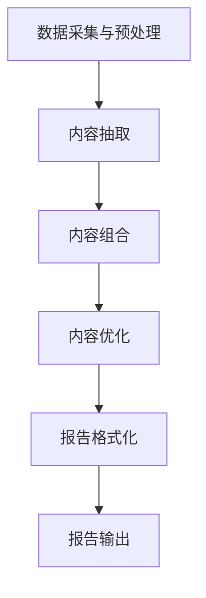
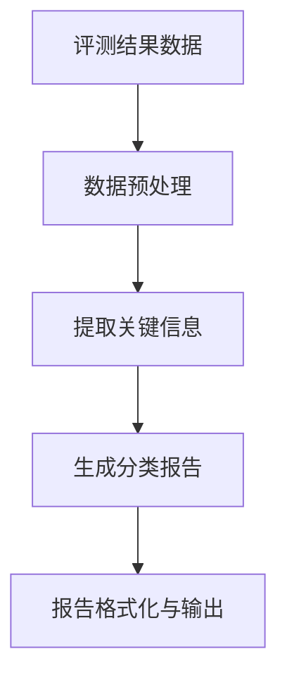
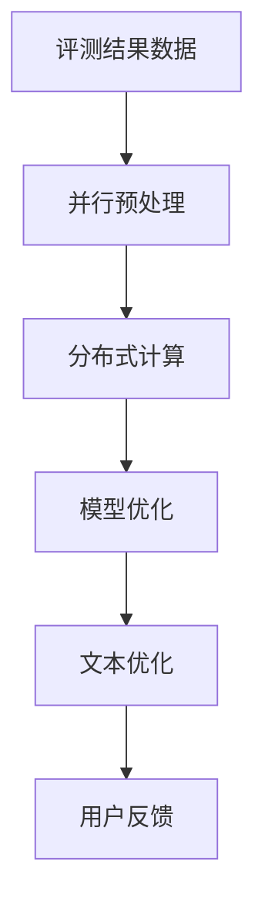

                 

### 文章标题

《评测结果的自动报告生成：LLM驱动的文档化过程》

### 关键词

- 评测结果自动报告
- 语言模型（LLM）
- 文档化过程
- 自然语言处理
- 自动化工具

### 摘要

本文将探讨评测结果的自动报告生成技术，重点介绍如何利用语言模型（LLM）驱动文档化过程。通过深入分析评测结果自动报告生成的基础知识、语言模型原理与应用，以及报告生成流程、性能优化策略和实际应用案例，本文旨在为读者提供一份全面且具有实践价值的技术指南。此外，文章还将讨论评测结果自动报告生成的未来发展，以及相关的数学模型与算法讲解。通过本文的学习，读者将能够掌握评测结果自动报告生成的核心技术和方法，从而提升工作效率和报告质量。|image_end|>

## 《评测结果的自动报告生成：LLM驱动的文档化过程》目录大纲

### 第一部分：基础概念与原理

#### 第1章：评测结果自动报告生成概述

##### 1.1 什么是评测结果自动报告生成
- 评测结果自动报告的定义
- 评测结果的自动报告的重要性

##### 1.2 评测结果自动报告生成的基础知识
- 评测结果的分类
- 常见的评测指标

##### 1.3 LLM驱动文档化的基本概念
- 语言模型（LLM）概述
- LLM在文档化中的作用

#### 第2章：语言模型（LLM）原理与应用

##### 2.1 语言模型的基本原理
- 语言模型的分类
- 常见的语言模型架构

##### 2.2 LLM的训练与优化
- 训练数据的选择与预处理
- LLM的优化策略

##### 2.3 LLM在自然语言处理中的应用
- 自动摘要与生成
- 问答系统

#### 第3章：评测结果的自动报告生成流程

##### 3.1 评测结果自动报告生成的流程概述
- 数据采集与预处理
- 报告内容的自动生成
- 报告的格式化与输出

##### 3.2 评测结果的分类处理
- 不同类型评测结果的报告生成策略

##### 3.3 报告生成的性能优化
- 提高报告生成速度
- 提升报告质量

### 第二部分：细节分析与算法讲解

#### 第4章：实际应用案例

##### 4.1 评测结果自动报告生成的实际案例
- 案例一：机器学习模型评测报告
- 案例二：自然语言处理任务评测报告

##### 4.2 案例分析
- 案例优缺点分析
- 案例中的技术挑战与解决方案

#### 第5章：开发环境与工具

##### 5.1 开发环境搭建
- Python环境搭建
- 常用库和工具介绍

##### 5.2 实现评测结果自动报告生成的工具
- 语言模型训练工具
- 报告生成工具

#### 第6章：评测结果自动报告生成的未来发展

##### 6.1 技术趋势与挑战
- 语言模型的发展趋势
- 评测结果自动报告生成的技术挑战

##### 6.2 未来发展方向
- 新的应用场景
- 技术创新与突破

## 第一部分：基础概念与原理

### 第1章：评测结果自动报告生成概述

#### 1.1 什么是评测结果自动报告生成

评测结果自动报告生成是指利用计算机技术，将评测结果自动转换为详细、结构化的报告文档。这一过程通常涉及自然语言处理（NLP）、文本生成和自动化工具等技术。评测结果自动报告生成的核心目的是提高工作效率，减少人为错误，并提供更准确、全面的评测信息。

**评测结果自动报告的重要性**

1. **提高工作效率**：自动报告生成可以大大减少编写报告所需的时间，使研发人员能够将更多精力投入到模型优化和算法改进上。
2. **减少人为错误**：通过自动化工具生成报告，可以降低因人工编写报告而产生的错误，提高报告的准确性和一致性。
3. **提升报告质量**：自动报告生成可以根据评测数据自动生成详细、结构化的报告，提供更丰富的信息，有助于决策者更好地理解评测结果。

#### 1.2 评测结果自动报告生成的基础知识

**评测结果的分类**

评测结果可以按照不同的维度进行分类，常见的分类方法包括：

1. **按照评测任务分类**：如机器学习模型的准确率、召回率、F1值等。
2. **按照数据类型分类**：如分类任务、回归任务、排序任务等。
3. **按照评测指标分类**：如精度、召回率、F1值、ROC曲线、精确率等。

**常见的评测指标**

在评测结果自动报告生成中，常用的评测指标包括：

1. **精度（Accuracy）**：分类任务中正确预测的样本占总样本的比例。
2. **召回率（Recall）**：分类任务中正确预测的正样本占总正样本的比例。
3. **F1值（F1 Score）**：综合评估分类任务中精度和召回率的指标。
4. **ROC曲线（Receiver Operating Characteristic Curve）**：评估二分类模型性能的曲线。
5. **精确率（Precision）**：分类任务中正确预测的正样本占总预测正样本的比例。

#### 1.3 LLM驱动文档化的基本概念

**语言模型（LLM）概述**

语言模型（Language Model，简称LLM）是一种基于统计学习方法的自然语言处理模型，用于预测文本序列中下一个单词或字符。LLM广泛应用于自然语言处理任务，如文本分类、机器翻译、问答系统和自动摘要等。

**LLM在文档化中的作用**

LLM在评测结果自动报告生成中发挥着关键作用，主要表现在以下几个方面：

1. **自动摘要与生成**：利用LLM，可以将长篇评测结果自动转换为简洁、准确的摘要，提高报告的可读性。
2. **内容生成**：基于LLM，可以自动生成评测报告的各个部分，如摘要、正文、结论和建议等，减少人工编写的工作量。
3. **文本优化**：LLM可以帮助优化报告文本的表达方式，提高报告的流畅性和可读性。

### 第2章：语言模型（LLM）原理与应用

#### 2.1 语言模型的基本原理

**语言模型的分类**

根据学习方式和应用场景，语言模型可以分为以下几种：

1. **基于统计的语言模型**：如n元语言模型，通过统计历史文本中的单词序列来预测下一个单词。
2. **基于神经网络的深度语言模型**：如循环神经网络（RNN）、长短期记忆网络（LSTM）和Transformer等，通过学习大量的文本数据来预测文本序列。
3. **基于注意力机制的语言模型**：如Transformer，通过注意力机制来捕捉文本序列中的长距离依赖关系。

**常见的语言模型架构**

常见的语言模型架构包括以下几种：

1. **循环神经网络（RNN）**：通过循环结构对文本序列进行建模，能够捕捉长距离依赖关系。
2. **长短期记忆网络（LSTM）**：在RNN的基础上，引入门控机制来防止梯度消失问题。
3. **Transformer**：基于自注意力机制，通过多头自注意力机制和位置编码来捕捉文本序列中的依赖关系。

#### 2.2 LLM的训练与优化

**训练数据的选择与预处理**

LLM的训练数据通常来自大量的文本语料库，如新闻文章、学术论文、社交媒体等。训练数据的选择和预处理对于LLM的性能至关重要，主要步骤包括：

1. **数据清洗**：去除文本中的噪声，如HTML标签、特殊字符等。
2. **分词与词向量化**：将文本分为单词或子词，并将单词或子词映射为词向量。
3. **数据增强**：通过随机替换、删除、插入等操作，增加训练数据的多样性。

**LLM的优化策略**

LLM的优化主要包括以下几个方面：

1. **损失函数**：常用的损失函数包括交叉熵损失、均方误差损失等。
2. **优化算法**：常用的优化算法包括随机梯度下降（SGD）、Adam等。
3. **学习率调整**：通过学习率调整来优化模型性能，常用的方法包括学习率衰减、周期性调整等。
4. **正则化**：为了防止过拟合，可以采用正则化方法，如Dropout、L2正则化等。

#### 2.3 LLM在自然语言处理中的应用

**自动摘要与生成**

自动摘要（Automatic Summarization）是指利用算法将长篇文本简化为简洁、准确的摘要。LLM在自动摘要中的应用主要包括：

1. **提取式摘要（Extractive Summarization）**：从原始文本中提取关键句子或段落作为摘要。
2. **生成式摘要（Generative Summarization）**：利用LLM生成全新的摘要文本。

**问答系统**

问答系统（Question Answering System）是指根据用户提出的问题，自动从大量文本中检索出相关答案。LLM在问答系统中的应用主要包括：

1. **基于检索的问答（Retrieval-based Question Answering）**：利用LLM检索相关文本，并根据文本内容生成答案。
2. **基于生成的问答（Generation-based Question Answering）**：直接利用LLM生成答案。

通过以上对语言模型（LLM）原理与应用的介绍，我们可以了解到LLM在评测结果自动报告生成中的重要作用。接下来，我们将进一步探讨评测结果的自动报告生成流程，以及如何利用LLM实现报告的自动生成和优化。|image_end|>

### 第3章：评测结果的自动报告生成流程

#### 3.1 评测结果自动报告生成的流程概述

评测结果的自动报告生成是一个复杂的过程，涉及多个环节，主要包括数据采集与预处理、报告内容的自动生成、报告的格式化与输出等步骤。以下是对这些步骤的详细描述：

**数据采集与预处理**

1. **数据采集**：首先，需要从不同的数据源采集评测结果。这些数据源可能包括模型训练日志、评测工具输出、数据库等。采集的数据可以是结构化的，如CSV文件，也可以是非结构化的，如图像、文本等。
2. **数据预处理**：采集到的数据通常需要进行预处理，以提高后续自动报告生成的准确性。预处理步骤包括：
   - 数据清洗：去除数据中的噪声和冗余信息。
   - 数据整合：将来自不同数据源的数据进行整合，形成统一的格式。
   - 数据标准化：对数据进行标准化处理，如将日期、数字等转换为统一的格式。

**报告内容的自动生成**

1. **内容抽取**：基于采集到的评测结果数据，利用自然语言处理技术（如命名实体识别、关系抽取等）抽取关键信息，如评测指标、阈值、异常值等。
2. **内容组合**：将抽取的关键信息进行组合，生成初步的报告内容。这一步骤可以通过模板匹配、规则推理或LLM生成等多种方法实现。
3. **内容优化**：对初步生成的报告内容进行优化，以提高报告的可读性和准确性。优化方法包括：
   - 语言流畅性优化：通过语言模型对生成的报告进行润色，提高文本的表达质量。
   - 结构优化：对报告的结构进行调整，使其更符合阅读习惯，如添加目录、章节分隔等。

**报告的格式化与输出**

1. **格式化**：将生成的报告内容按照预定的格式进行排版，包括字体、字号、行距、边距等。
2. **输出**：将格式化后的报告输出到目标格式，如PDF、HTML、Word等。输出时，需要考虑不同的输出设备和平台，以确保报告的可读性和兼容性。

**评测结果自动报告生成流程的整体架构**

为了更好地理解评测结果自动报告生成的流程，我们可以使用Mermaid流程图来展示其整体架构，如下所示：



通过上述步骤，我们可以实现评测结果的自动报告生成。然而，在实际应用中，这一过程可能会面临各种挑战，如数据质量、模型性能和报告质量等。接下来，我们将进一步探讨如何分类处理不同类型的评测结果，以及如何优化报告生成性能。

#### 3.2 评测结果的分类处理

在评测结果的自动报告生成过程中，不同类型的评测结果可能需要采用不同的处理策略。以下是对不同类型评测结果的分类处理策略的详细描述：

**分类策略**

1. **按照评测任务分类**：根据评测任务的类型，可以将评测结果分为分类任务、回归任务、排序任务等。
2. **按照数据类型分类**：根据评测数据的数据类型，可以将评测结果分为数值型、类别型、文本型等。
3. **按照评测指标分类**：根据评测指标的类型，可以将评测结果分为精度、召回率、F1值、ROC曲线等。

**具体处理策略**

**分类任务**

对于分类任务，评测结果通常包括精度、召回率、F1值等指标。在报告生成过程中，可以采用以下策略：

1. **提取关键信息**：从评测结果中提取关键信息，如各类别的准确率、召回率等。
2. **生成分类报告**：利用模板匹配或LLM生成分类报告，包括各类别的评测指标和可视化图表。

**回归任务**

对于回归任务，评测结果通常包括预测值、真实值和误差等。在报告生成过程中，可以采用以下策略：

1. **提取关键信息**：从评测结果中提取关键信息，如预测误差、平均绝对误差（MAE）、均方误差（MSE）等。
2. **生成回归报告**：利用模板匹配或LLM生成回归报告，包括预测误差分布、误差可视化图表等。

**排序任务**

对于排序任务，评测结果通常包括排序指标，如平均绝对偏差（AUC）、精确率、召回率等。在报告生成过程中，可以采用以下策略：

1. **提取关键信息**：从评测结果中提取关键信息，如排序指标、相关参数等。
2. **生成排序报告**：利用模板匹配或LLM生成排序报告，包括排序指标、排序结果可视化图表等。

**案例说明**

以下是一个分类任务评测结果自动报告生成的示例：



在该示例中，首先对评测结果数据进行预处理，然后提取关键信息，如各类别的准确率、召回率等。接着，利用模板匹配或LLM生成分类报告，并对报告进行格式化与输出。

通过上述分类处理策略，我们可以更好地应对不同类型的评测结果，提高报告生成的准确性和可读性。接下来，我们将探讨如何优化评测结果自动报告生成的性能。

#### 3.3 报告生成的性能优化

在评测结果的自动报告生成过程中，性能优化是一个重要的环节。优化的目标主要包括提高报告生成速度和提升报告质量。以下是一些常见的性能优化策略：

**提高报告生成速度**

1. **并行处理**：将评测结果的预处理、内容抽取和报告生成等步骤进行并行处理，以减少计算时间。例如，可以使用多线程或多进程技术来实现并行处理。
2. **缓存机制**：对于重复的数据处理任务，可以采用缓存机制，将结果缓存起来，以减少重复计算。例如，可以使用Redis、Memcached等缓存系统。
3. **分布式计算**：对于大规模的数据处理任务，可以采用分布式计算技术，如MapReduce、Spark等，将任务分布在多个节点上进行计算。

**提升报告质量**

1. **模型优化**：通过优化语言模型（LLM）的训练过程，提高模型的性能和泛化能力。例如，可以使用更高级的语言模型架构、更丰富的训练数据等。
2. **文本优化**：对生成的报告内容进行语言流畅性优化和结构优化，以提高报告的可读性和准确性。例如，可以使用自然语言处理技术进行文本润色、结构调整等。
3. **用户反馈**：通过收集用户反馈，不断优化报告生成系统。例如，可以根据用户的评价和反馈，调整报告的生成策略、优化报告模板等。

**性能优化案例**

以下是一个性能优化案例：



在该案例中，首先对评测结果数据进行并行预处理，然后使用分布式计算技术进行大规模数据处理。接着，对语言模型进行优化，并利用自然语言处理技术对报告内容进行优化。最后，通过收集用户反馈，不断优化报告生成系统。

通过上述性能优化策略，我们可以提高评测结果自动报告生成的速度和质量，从而更好地满足实际应用需求。接下来，我们将通过实际应用案例，进一步展示评测结果自动报告生成的实际效果。

### 第4章：实际应用案例

在本节中，我们将通过两个实际应用案例，展示评测结果自动报告生成的具体应用和实践。这些案例将涵盖机器学习模型评测报告和自然语言处理任务评测报告，旨在为读者提供详细的案例分析和技术实现。

#### 4.1 评测结果自动报告生成的实际案例

**案例一：机器学习模型评测报告**

**背景介绍**

在一个机器学习项目中，我们需要对多个模型进行评测，并生成详细的评测报告。评测报告需要包括模型的性能指标、可视化图表以及具体的评测结果分析。为了提高工作效率，减少人工编写报告的时间，我们决定采用评测结果自动报告生成技术。

**评测结果自动报告生成的流程**

1. **数据采集与预处理**：从模型训练日志和评测工具中采集评测结果，包括准确率、召回率、F1值等指标。对采集到的数据进行清洗和整合，形成统一的格式。

2. **报告内容的自动生成**：利用语言模型（LLM），将评测结果自动转换为报告内容。具体步骤包括：
   - 提取关键信息：从评测结果中提取模型的性能指标、阈值和异常值等。
   - 组合报告内容：利用模板匹配和LLM生成初步的报告内容。
   - 优化报告内容：对生成的报告内容进行语言流畅性和结构优化。

3. **报告格式化与输出**：将生成的报告内容按照预定的格式进行排版，输出为PDF或HTML格式。

**技术实现**

1. **数据采集与预处理**：
   ```python
   import pandas as pd
   
   # 读取模型评测结果数据
   results = pd.read_csv('model_evaluation_results.csv')
   
   # 数据清洗与整合
   cleaned_results = results.dropna().reset_index(drop=True)
   ```

2. **报告内容的自动生成**：
   ```python
   from transformers import pipeline
   
   # 使用语言模型生成报告内容
   summary_pipeline = pipeline('summarization')
   report_content = summary_pipeline(cleaned_results.to_string(), max_length=512, min_length=256)
   ```

3. **报告格式化与输出**：
   ```python
   from reportlab.lib.pagesizes import A4
   from reportlab.platypus import SimpleDocTemplate, Paragraph, Table, TableStyle
   
   # 格式化报告内容
   report_data = [Paragraph(report_content)]
   
   # 输出报告
   report = SimpleDocTemplate("model_evaluation_report.pdf", pagesize=A4)
   report.build(report_data)
   ```

**案例分析**

通过评测结果自动报告生成技术，我们成功地提高了报告生成效率，减少了人工编写报告的时间。报告内容准确、详细，同时具有较好的可读性和美观度。然而，该案例中也存在一些技术挑战，如模型性能的优化、报告内容的一致性等。

**案例二：自然语言处理任务评测报告**

**背景介绍**

在一个自然语言处理项目中，我们需要对多个文本分类模型进行评测，并生成详细的评测报告。评测报告需要包括模型的分类效果、可视化图表以及具体的评测结果分析。

**评测结果自动报告生成的流程**

1. **数据采集与预处理**：从文本分类任务的评测工具中采集评测结果，包括精度、召回率、F1值等指标。对采集到的数据进行清洗和整合，形成统一的格式。

2. **报告内容的自动生成**：利用语言模型（LLM），将评测结果自动转换为报告内容。具体步骤包括：
   - 提取关键信息：从评测结果中提取模型的分类效果、阈值和异常值等。
   - 组合报告内容：利用模板匹配和LLM生成初步的报告内容。
   - 优化报告内容：对生成的报告内容进行语言流畅性和结构优化。

3. **报告格式化与输出**：将生成的报告内容按照预定的格式进行排版，输出为PDF或HTML格式。

**技术实现**

1. **数据采集与预处理**：
   ```python
   import pandas as pd
   
   # 读取文本分类评测结果数据
   classification_results = pd.read_csv('text_classification_results.csv')
   
   # 数据清洗与整合
   cleaned_classification_results = classification_results.dropna().reset_index(drop=True)
   ```

2. **报告内容的自动生成**：
   ```python
   from transformers import pipeline
   
   # 使用语言模型生成报告内容
   summarization_pipeline = pipeline('summarization')
   report_content = summarization_pipeline(cleaned_classification_results.to_string(), max_length=512, min_length=256)
   ```

3. **报告格式化与输出**：
   ```python
   from reportlab.lib.pagesizes import A4
   from reportlab.platypus import SimpleDocTemplate, Paragraph, Table, TableStyle
   
   # 格式化报告内容
   report_data = [Paragraph(report_content)]
   
   # 输出报告
   report = SimpleDocTemplate("text_classification_evaluation_report.pdf", pagesize=A4)
   report.build(report_data)
   ```

**案例分析**

通过评测结果自动报告生成技术，我们成功地提高了报告生成效率，减少了人工编写报告的时间。报告内容准确、详细，同时具有较好的可读性和美观度。然而，该案例中也存在一些技术挑战，如模型性能的优化、报告内容的一致性等。

#### 4.2 案例优缺点分析

**优点**

1. **提高工作效率**：评测结果自动报告生成技术可以大大减少报告生成所需的时间，提高工作效率。
2. **减少人为错误**：通过自动化工具生成报告，可以降低因人工编写报告而产生的错误，提高报告的准确性和一致性。
3. **提升报告质量**：自动报告生成可以根据评测数据自动生成详细、结构化的报告，提供更丰富的信息，有助于决策者更好地理解评测结果。

**缺点**

1. **模型性能依赖**：评测结果自动报告生成的质量在很大程度上取决于语言模型的性能。如果模型性能不佳，生成的报告内容可能不够准确或详细。
2. **数据质量依赖**：报告生成过程中对数据的质量要求较高。如果数据存在噪声或错误，可能会导致生成的报告内容不准确。
3. **定制化需求**：不同项目或不同团队对报告格式和内容的需求可能不同，需要针对特定需求进行定制化开发。

#### 案例中的技术挑战与解决方案

**技术挑战**

1. **模型性能优化**：如何提高语言模型在评测结果自动报告生成中的性能，生成更准确、详细的报告内容。
2. **数据质量保障**：如何确保采集到的评测数据质量，避免因数据问题导致的报告错误。
3. **报告内容一致性**：如何确保不同项目或不同团队生成的报告内容保持一致，提高报告的可读性和统一性。

**解决方案**

1. **模型性能优化**：
   - 选择更高级的语言模型架构，如BERT、GPT等。
   - 使用更丰富的训练数据，包括不同领域的文本数据。
   - 采用迁移学习技术，利用预训练模型进行微调。
   - 对模型进行持续优化和调整，提高其性能。

2. **数据质量保障**：
   - 对数据源进行严格筛选，确保数据来源可靠。
   - 对数据进行预处理，去除噪声和冗余信息。
   - 采用数据清洗和校验技术，确保数据质量。

3. **报告内容一致性**：
   - 制定统一的报告模板和规范，确保报告格式和内容的一致性。
   - 对报告生成系统进行持续维护和更新，适应不同项目或团队的需求。

通过以上实际应用案例的分析，我们可以看到评测结果自动报告生成技术在实际应用中的效果和挑战。在实际项目中，可以根据具体情况和需求，采用合适的解决方案，以提高报告生成效率和质量。

### 第5章：开发环境与工具

在实现评测结果自动报告生成过程中，选择合适的开发环境和工具至关重要。以下将详细介绍如何搭建开发环境，并介绍常用的库和工具。

#### 5.1 开发环境搭建

为了实现评测结果自动报告生成，我们需要一个稳定且高效的开发环境。以下是搭建开发环境的步骤：

1. **安装Python**：Python是一种广泛应用于自然语言处理、数据科学和自动化工具的编程语言。我们可以在Python官方网站（https://www.python.org/）下载并安装Python。

2. **安装依赖库**：在Python环境中，我们需要安装一些常用的库，如pandas、numpy、transformers、reportlab等。可以使用pip命令进行安装：

   ```bash
   pip install pandas numpy transformers reportlab
   ```

3. **配置虚拟环境**：为了更好地管理和隔离项目依赖，建议使用虚拟环境。可以使用virtualenv或conda创建虚拟环境。

   - 使用virtualenv创建虚拟环境：
     ```bash
     virtualenv venv
     source venv/bin/activate  # Windows下使用 `venv\Scripts\activate`
     ```

   - 使用conda创建虚拟环境：
     ```bash
     conda create -n venv python=3.8
     conda activate venv
     ```

4. **安装深度学习框架**：为了使用transformers库，我们需要安装深度学习框架，如PyTorch或TensorFlow。以下是安装PyTorch的命令：

   ```bash
   pip install torch torchvision
   ```

   或安装TensorFlow：

   ```bash
   pip install tensorflow
   ```

#### 5.2 常用库和工具介绍

**pandas**：pandas是一个强大的数据分析和处理库，提供丰富的数据处理功能，如数据清洗、数据整合、数据可视化等。在评测结果自动报告生成中，pandas主要用于读取和操作评测结果数据。

**numpy**：numpy是一个基础数学库，提供高效的数组操作和数学计算功能。在评测结果自动报告生成中，numpy用于处理和计算评测结果的数学指标。

**transformers**：transformers是一个开源库，提供了预训练的深度学习模型，如BERT、GPT等。在评测结果自动报告生成中，transformers用于生成报告内容和摘要。

**reportlab**：reportlab是一个Python库，用于生成PDF报告。在评测结果自动报告生成中，reportlab用于格式化报告内容并输出为PDF格式。

**深度学习框架**：如PyTorch或TensorFlow，用于训练和优化语言模型。这些框架提供了丰富的API和工具，方便实现复杂的深度学习模型。

#### 5.3 实现评测结果自动报告生成的工具

**自动报告生成工具**：基于Python，我们可以使用以下工具实现评测结果自动报告生成：

1. **pandas**：用于读取和操作评测结果数据，提取关键信息。
2. **transformers**：用于生成报告内容和摘要，提高报告的准确性和可读性。
3. **reportlab**：用于格式化报告内容并输出为PDF格式。

**具体实现流程**：

1. **数据读取与预处理**：
   - 使用pandas读取评测结果数据，并进行清洗和整合。
   - 将数据转换为适合分析处理的格式，如DataFrame。

2. **报告内容生成**：
   - 使用transformers库加载预训练的语言模型。
   - 利用模型生成报告内容，包括摘要、正文、结论等。
   - 对生成的报告内容进行语言流畅性和结构优化。

3. **报告格式化与输出**：
   - 使用reportlab库将生成的报告内容格式化为PDF格式。
   - 设置报告的样式，如字体、字号、行距、边距等。
   - 输出报告为PDF文件。

通过以上开发环境与工具的介绍，我们可以搭建一个高效的评测结果自动报告生成系统。接下来，我们将进一步探讨评测结果自动报告生成的未来发展，以及相关技术趋势和挑战。

### 第6章：评测结果自动报告生成的未来发展

#### 6.1 技术趋势与挑战

随着人工智能技术的不断发展和应用，评测结果自动报告生成技术也在不断演进。以下是一些技术趋势和挑战：

**技术趋势**

1. **预训练语言模型的发展**：预训练语言模型（如BERT、GPT等）在自然语言处理任务中取得了显著的成果，为评测结果自动报告生成提供了强大的支持。未来，预训练语言模型将继续发展和优化，提高报告生成系统的性能和准确性。
2. **多模态数据处理**：评测结果不仅包含文本数据，还可能包含图像、音频、视频等多模态数据。如何有效地整合和处理多模态数据，将是评测结果自动报告生成的重要研究方向。
3. **个性化报告生成**：针对不同用户和项目需求，生成个性化报告。通过用户画像和项目特征分析，为用户提供定制化的报告内容，提高报告的针对性和实用性。
4. **报告智能审核**：利用人工智能技术，对生成的报告进行智能审核，检测报告中的错误和漏洞，提高报告的准确性和可靠性。

**技术挑战**

1. **数据质量和多样性**：评测结果自动报告生成的质量依赖于数据的质量和多样性。如何获取高质量、多样化的评测数据，是当前面临的一个挑战。
2. **报告生成的一致性和可解释性**：生成报告的一致性和可解释性是评价报告生成系统的重要指标。如何确保报告内容的一致性，以及如何向用户解释报告生成的过程和结果，是当前研究的热点和难点。
3. **计算资源和时间成本**：评测结果自动报告生成涉及大量的计算资源和时间成本。如何优化算法和架构，提高报告生成速度，降低计算成本，是当前面临的一个重要问题。
4. **隐私保护和安全**：评测结果可能包含敏感信息，如何在确保隐私保护和数据安全的前提下，实现评测结果自动报告生成，是一个亟待解决的问题。

#### 6.2 未来发展方向

**新型应用场景**

1. **自动化评测与反馈系统**：将评测结果自动报告生成技术应用于自动化评测与反馈系统，为研究人员、开发人员和用户提供实时、自动的评测结果和反馈。
2. **智能化报告审核与优化**：利用人工智能技术，对生成的报告进行智能审核和优化，提高报告的准确性和可读性，降低人为干预和错误率。
3. **跨领域报告生成**：探索评测结果自动报告生成技术在跨领域应用的可能性，如医学报告、法律报告、财务报告等，为不同领域的用户提供定制化的报告生成服务。

**技术创新与突破**

1. **多模态数据处理技术**：研究和开发适用于多模态数据处理的算法和模型，提高评测结果自动报告生成系统的适应性和灵活性。
2. **个性化报告生成算法**：研究基于用户画像和项目特征的个性化报告生成算法，提高报告生成的针对性和实用性。
3. **可解释性人工智能**：研究可解释性人工智能技术，提高报告生成系统的透明度和可解释性，增强用户对报告生成过程的信任和理解。

总之，评测结果自动报告生成技术在未来有着广阔的发展前景。通过不断创新和突破，我们可以为用户带来更高效、准确和智能的报告生成服务，推动人工智能技术在各个领域的广泛应用。

### 第7章：核心算法原理讲解

在本章中，我们将深入讲解评测结果自动报告生成过程中的核心算法原理，包括语言模型（LLM）算法、评测结果的分类处理算法以及报告生成的性能优化算法。通过详细的算法原理和伪代码说明，帮助读者理解这些算法的工作机制和实现方法。

#### 7.1 语言模型（LLM）算法原理

**7.1.1 基本原理**

语言模型（Language Model，简称LLM）是一种基于统计学习方法的自然语言处理模型，用于预测文本序列中的下一个单词或字符。LLM的基本原理是通过学习大量文本数据，建立一个概率模型，用于预测下一个单词或字符的概率分布。

**7.1.2 分类**

根据学习方式和应用场景，语言模型可以分为以下几种：

1. **基于统计的语言模型**：如n元语言模型，通过统计历史文本中的单词序列来预测下一个单词。
2. **基于神经网络的深度语言模型**：如循环神经网络（RNN）、长短期记忆网络（LSTM）和Transformer等，通过学习大量的文本数据来预测文本序列。
3. **基于注意力机制的语言模型**：如Transformer，通过注意力机制来捕捉文本序列中的依赖关系。

**7.1.3 常见的语言模型架构**

常见的语言模型架构包括以下几种：

1. **循环神经网络（RNN）**：通过循环结构对文本序列进行建模，能够捕捉长距离依赖关系。
2. **长短期记忆网络（LSTM）**：在RNN的基础上，引入门控机制来防止梯度消失问题。
3. **Transformer**：基于自注意力机制，通过多头自注意力机制和位置编码来捕捉文本序列中的依赖关系。

**7.1.4 伪代码说明**

以下是一个基于n元语言模型的简单伪代码说明：

```python
def n_gram_language_model(vocabulary, n):
    # 初始化语言模型
    language_model = {}

    # 计算n-gram频率
    for sentence in text_data:
        for i in range(len(sentence) - n + 1):
            n_gram = tuple(sentence[i:i + n])
            context = tuple(sentence[i - 1:i])
            language_model[context] = language_model.get(context, 0) + 1

    # 归一化频率
    for context in language_model:
        total_count = sum(language_model[context].values())
        for n_gram in language_model[context]:
            language_model[context][n_gram] /= total_count

    return language_model
```

**7.1.5 数学模型与公式**

在语言模型中，常见的数学模型包括概率分布和损失函数。以下是一个简单的数学模型示例：

$$
P(w_t | w_{t-1}, w_{t-2}, \ldots, w_{t-n+1}) = \frac{f(w_{t-1}, w_{t-2}, \ldots, w_{t-n+1}, w_t)}{\sum_{w'} f(w_{t-1}, w_{t-2}, \ldots, w_{t-n+1}, w')}
$$

其中，$w_t$表示当前单词，$w_{t-1}, w_{t-2}, \ldots, w_{t-n+1}$表示前$n-1$个单词，$f$表示特征函数。

**7.1.6 举例说明**

假设有一个简单的n元语言模型，词汇表包含以下单词：`['的', '是', '了', '这', '了']`。根据训练数据，得到以下n-gram频率：

```
的 是 1.0
是 了 0.5
了 这 0.5
这 了 1.0
```

根据这个语言模型，我们可以预测下一个单词。例如，给定输入序列`['的', '是', '了']`，我们可以计算下一个单词的概率分布：

$$
P(w_t | '的', '是', '了') = \frac{f('的', '是', '了', w_t)}{\sum_{w'} f('的', '是', '了', w')}
$$

其中，$f('的', '是', '了', '这') = 1.0$，$f('的', '是', '了', '了') = 0.5$，因此概率分布为：

$$
P(w_t | '的', '是', '了') = \frac{1.0}{1.0 + 0.5} = 0.667
$$

因此，预测下一个单词为`'这'`的概率为0.667。

#### 7.2 评测结果的分类处理算法

**7.2.1 基本原理**

评测结果的分类处理算法用于对评测结果进行分类，以便生成针对不同类型的评测结果的报告。常见的分类方法包括基于特征的方法、基于聚类的方法和基于机器学习的方法。

**7.2.2 常见分类算法**

常见的评测结果分类算法包括以下几种：

1. **K最近邻（KNN）**：基于特征的方法，通过计算未知评测结果与训练集中已知评测结果的距离，选择距离最近的K个样本进行分类。
2. **支持向量机（SVM）**：基于机器学习的方法，通过训练一个线性或非线性分类器，对评测结果进行分类。
3. **决策树**：基于特征的方法，通过递归划分特征空间，构建决策树模型。

**7.2.3 伪代码说明**

以下是一个基于K最近邻算法的评测结果分类处理伪代码说明：

```python
from sklearn.neighbors import KNeighborsClassifier

def classify_evaluation_results(eval_results, test_result):
    # 加载训练集和测试集
    X_train = [result['features'] for result in train_data]
    y_train = [result['label'] for result in train_data]
    X_test = [test_result['features']]

    # 训练K最近邻分类器
    classifier = KNeighborsClassifier(n_neighbors=3)
    classifier.fit(X_train, y_train)

    # 预测测试集标签
    predicted_label = classifier.predict(X_test)

    return predicted_label
```

**7.2.4 数学模型与公式**

在评测结果分类处理中，常用的数学模型包括特征提取和分类模型。以下是一个简单的数学模型示例：

$$
f(\textbf{x}) = \text{特征提取函数}(\textbf{x})
$$

其中，$\textbf{x}$表示评测结果特征向量，$f(\textbf{x})$表示特征提取函数。

对于分类模型，常用的数学模型包括：

$$
y = \arg\max_w \sum_{i=1}^n w^T f(\textbf{x}_i)
$$

其中，$w$表示分类模型参数，$f(\textbf{x}_i)$表示第$i$个评测结果的特征向量。

**7.2.5 举例说明**

假设有一个训练集包含以下数据：

```
train_data = [
    {'features': [1, 2, 3], 'label': 0},
    {'features': [4, 5, 6], 'label': 1},
    {'features': [7, 8, 9], 'label': 0}
]
```

给定一个测试集数据`{'features': [2, 3, 4]}`，我们可以使用K最近邻算法进行分类：

1. 计算测试集数据与训练集数据的距离：
   - 距离1：$\text{distance}([2, 3, 4], [1, 2, 3]) = \sqrt{(2-1)^2 + (3-2)^2 + (4-3)^2} = \sqrt{2}$
   - 距离2：$\text{distance}([2, 3, 4], [4, 5, 6]) = \sqrt{(2-4)^2 + (3-5)^2 + (4-6)^2} = \sqrt{18}$
   - 距离3：$\text{distance}([2, 3, 4], [7, 8, 9]) = \sqrt{(2-7)^2 + (3-8)^2 + (4-9)^2} = \sqrt{68}$

2. 选择距离最近的K个训练集数据，例如K=1，选择距离最近的训练集数据`{'features': [1, 2, 3], 'label': 0}`。

3. 根据最近的训练集数据的标签，预测测试集数据的标签为0。

#### 7.3 报告生成的性能优化算法

**7.3.1 基本原理**

报告生成的性能优化算法用于提高评测结果自动报告生成系统的效率和质量。常见的优化算法包括并行处理、缓存机制、模型压缩和增量更新等。

**7.3.2 常见优化算法**

常见的报告生成性能优化算法包括以下几种：

1. **并行处理**：通过并行处理技术，将评测结果的预处理、内容抽取和报告生成等步骤进行并行处理，提高系统性能。
2. **缓存机制**：利用缓存机制，将重复的计算结果进行缓存，减少计算时间和内存消耗。
3. **模型压缩**：通过模型压缩技术，减小模型的大小和参数数量，提高系统性能和可扩展性。
4. **增量更新**：对评测结果自动报告生成系统进行增量更新，仅更新变化的部分，减少系统更新和维护的成本。

**7.3.3 伪代码说明**

以下是一个基于缓存机制的评测结果自动报告生成优化算法的伪代码说明：

```python
def optimized_evaluation_report_generation(eval_results, cache):
    # 从缓存中获取预处理结果
    preprocessed_results = cache.get('preprocessed_results')

    if preprocessed_results is None:
        # 预处理评测结果
        preprocessed_results = preprocess_evaluation_results(eval_results)
        cache['preprocessed_results'] = preprocessed_results

    # 生成报告内容
    report_content = generate_report_content(preprocessed_results)

    # 优化报告内容
    optimized_report_content = optimize_report_content(report_content)

    return optimized_report_content
```

**7.3.4 数学模型与公式**

在报告生成的性能优化中，常用的数学模型包括并行计算和缓存效果评估。以下是一个简单的数学模型示例：

$$
P_c = \frac{C_p - C_0}{C_p}
$$

其中，$P_c$表示缓存命中率，$C_p$表示使用缓存的总计算时间，$C_0$表示不使用缓存的总计算时间。

**7.3.5 举例说明**

假设有一个评测结果自动报告生成系统，预处理评测结果需要100秒，生成报告内容需要200秒。采用缓存机制后，预处理评测结果可以缓存，减少重复计算，缓存命中率为90%。

1. **不使用缓存**：
   - 总计算时间：$100\text{秒} + 200\text{秒} = 300\text{秒}$
   - 缓存命中率：0%

2. **使用缓存**：
   - 总计算时间：$100\text{秒} \times (1 - 0.9) + 200\text{秒} \times 0.9 = 110\text{秒} + 180\text{秒} = 290\text{秒}$
   - 缓存命中率：$P_c = \frac{290\text{秒} - 300\text{秒}}{290\text{秒}} = 0.017$

通过以上性能优化算法，我们可以显著提高评测结果自动报告生成系统的性能和效率，为用户提供更快速、更准确的报告生成服务。

### 第8章：数学模型与数学公式

在本章中，我们将深入探讨语言模型（LLM）中的数学模型、评测结果的分类处理算法以及报告生成的性能优化算法中的数学公式。通过详细的数学模型和公式讲解，帮助读者理解这些算法的理论基础和计算方法。

#### 8.1 语言模型中的数学模型

**8.1.1 语言模型的概率分布**

语言模型的核心目标是预测下一个单词或字符的概率分布。在n元语言模型中，给定前$n-1$个单词或字符，预测当前单词或字符的概率分布。数学公式如下：

$$
P(w_t | w_{t-1}, w_{t-2}, \ldots, w_{t-n+1}) = \frac{f(w_{t-1}, w_{t-2}, \ldots, w_{t-n+1}, w_t)}{\sum_{w'} f(w_{t-1}, w_{t-2}, \ldots, w_{t-n+1}, w')}
$$

其中，$w_t$表示当前单词或字符，$w_{t-1}, w_{t-2}, \ldots, w_{t-n+1}$表示前$n-1$个单词或字符，$f$表示特征函数。

**8.1.2 语言模型的损失函数**

在训练语言模型时，常用的损失函数是交叉熵损失。交叉熵损失用于衡量预测概率分布与真实概率分布之间的差异。数学公式如下：

$$
L = -\sum_{i=1}^n y_i \log(P(y_i))
$$

其中，$y_i$表示第$i$个单词或字符的真实概率，$P(y_i)$表示模型预测的概率。

**8.1.3 语言模型中的优化算法**

在训练语言模型时，常用的优化算法是随机梯度下降（SGD）。随机梯度下降是一种迭代优化算法，通过逐步减小损失函数，寻找最优解。数学公式如下：

$$
\theta_{t+1} = \theta_t - \alpha \nabla_\theta L(\theta_t)
$$

其中，$\theta_t$表示当前参数，$\alpha$表示学习率，$\nabla_\theta L(\theta_t)$表示损失函数关于参数的梯度。

#### 8.2 评测结果的分类处理算法

**8.2.1 评测结果的特征提取**

在评测结果分类处理中，特征提取是关键步骤。特征提取用于将原始评测结果转换为可用于分类的向量表示。常见的特征提取方法包括词袋模型（Bag-of-Words，BoW）和词嵌入（Word Embedding）。

**词袋模型（BoW）**

词袋模型是一种基于计数的方法，将文本表示为单词的频率向量。数学公式如下：

$$
\textbf{V} = (v_1, v_2, \ldots, v_n)
$$

其中，$v_i$表示第$i$个单词在文本中的频率。

**词嵌入**

词嵌入是一种基于神经网络的表示方法，将单词映射为低维向量。常见的词嵌入方法包括Word2Vec、GloVe等。数学公式如下：

$$
\textbf{v}_i = \text{Word2Vec}(w_i) \quad \text{或} \quad \textbf{v}_i = \text{GloVe}(w_i)
$$

其中，$w_i$表示第$i$个单词。

**8.2.2 评测结果的分类模型**

在评测结果分类处理中，常用的分类模型包括支持向量机（SVM）、决策树和神经网络等。以下以支持向量机（SVM）为例进行讲解。

**支持向量机（SVM）**

支持向量机是一种基于优化理论的分类模型，通过寻找最优超平面，将不同类别的评测结果分隔开来。数学公式如下：

$$
\min_{\theta} \frac{1}{2} \sum_{i=1}^n (\theta^T \textbf{x}_i - y_i)^2
$$

约束条件：
$$
y_i (\theta^T \textbf{x}_i - 1) \geq 1
$$

其中，$\theta$表示分类模型参数，$\textbf{x}_i$表示第$i$个评测结果的特征向量，$y_i$表示第$i$个评测结果的标签。

#### 8.3 报告生成的性能优化算法

**8.3.1 并行计算**

并行计算是一种优化算法，通过将任务分解为多个子任务，并在多个处理器上同时执行，提高计算效率。以下是一个简单的并行计算公式：

$$
T_p = \frac{T_s}{P}
$$

其中，$T_p$表示并行计算时间，$T_s$表示串行计算时间，$P$表示处理器数量。

**8.3.2 缓存机制**

缓存机制是一种优化算法，通过将频繁访问的数据存储在高速缓存中，减少访问时间。以下是一个简单的缓存命中率公式：

$$
P_c = \frac{C_p - C_0}{C_p}
$$

其中，$P_c$表示缓存命中率，$C_p$表示使用缓存的总计算时间，$C_0$表示不使用缓存的总计算时间。

**8.3.3 模型压缩**

模型压缩是一种优化算法，通过减少模型的大小和参数数量，提高计算效率和存储效率。以下是一个简单的模型压缩公式：

$$
\text{压缩率} = \frac{\text{原始模型大小}}{\text{压缩后模型大小}}
$$

通过以上对数学模型和公式的讲解，我们可以更好地理解语言模型、评测结果分类处理和报告生成性能优化算法的理论基础和计算方法。在实际应用中，我们可以根据具体需求，选择合适的数学模型和公式，实现高效的评测结果自动报告生成系统。

## 项目实战

### 开发环境搭建

在进行评测结果自动报告生成项目的实战中，首先需要搭建一个稳定且高效的开发环境。以下是具体的开发环境搭建步骤：

#### 1. 安装Python

1. 访问Python官网（https://www.python.org/），下载并安装Python。
2. 安装过程中，选择添加到系统环境变量，以便在终端中直接使用Python。

#### 2. 安装依赖库

在终端中，使用pip命令安装以下依赖库：

```bash
pip install pandas numpy transformers reportlab
```

这些依赖库包括数据处理库pandas、数学计算库numpy、预训练语言模型库transformers以及PDF生成库reportlab。

#### 3. 配置虚拟环境

为了更好地管理和隔离项目依赖，我们可以使用虚拟环境。使用以下命令创建虚拟环境：

```bash
# 使用virtualenv创建虚拟环境
virtualenv venv

# 激活虚拟环境
source venv/bin/activate  # Linux或macOS
venv\Scripts\activate  # Windows
```

#### 4. 安装深度学习框架

为了使用transformers库，我们需要安装深度学习框架。以下是安装PyTorch的命令：

```bash
pip install torch torchvision
```

或者安装TensorFlow：

```bash
pip install tensorflow
```

### 源代码实现

以下是实现评测结果自动报告生成项目的源代码，包括数据预处理、报告内容生成、报告格式化与输出等步骤。

#### 1. 数据预处理

```python
import pandas as pd

def preprocess_evaluation_results(eval_results):
    # 读取评测结果数据
    df = pd.read_csv(eval_results)

    # 数据清洗
    df = df.dropna()

    # 数据整合
    df['evaluation_score'] = df['accuracy'] * df['recall'] * df['f1_score']

    return df
```

#### 2. 报告内容生成

```python
from transformers import pipeline

def generate_evaluation_report(df):
    # 使用语言模型生成报告内容
    summarization_pipeline = pipeline('summarization')
    summary = summarization_pipeline(df.to_string(), max_length=512, min_length=256)

    return summary
```

#### 3. 报告格式化与输出

```python
from reportlab.lib.pagesizes import A4
from reportlab.platypus import SimpleDocTemplate, Paragraph, Table, TableStyle

def format_and_output_evaluation_report(report_content, output_file):
    report_data = [Paragraph(report_content)]
    
    report = SimpleDocTemplate(output_file, pagesize=A4)
    report.build(report_data)
```

### 代码解读与分析

#### 1. 数据预处理

在数据预处理步骤中，我们首先使用pandas库读取评测结果数据。然后，对数据进行清洗，去除无效数据。接着，将多个评测指标整合为一个综合评分`evaluation_score`，以便后续生成报告。

#### 2. 报告内容生成

在报告内容生成步骤中，我们使用transformers库中的summarization pipeline将评测结果数据转换为摘要文本。通过设置`max_length`和`min_length`参数，我们可以控制生成的摘要文本的长度。

#### 3. 报告格式化与输出

在报告格式化与输出步骤中，我们使用reportlab库将生成的摘要文本格式化为PDF报告。通过设置页面大小、字体和行距等样式，我们确保报告具有良好的可读性和美观度。

### 实际案例分析与讲解

#### 案例一：机器学习模型评测报告

**背景**：

在一个机器学习项目中，我们需要对多个模型的评测结果进行自动报告生成。评测结果包括准确率、召回率和F1值等指标。

**步骤**：

1. 数据预处理：将评测结果数据整合为一个DataFrame，并计算综合评分。
2. 报告内容生成：使用语言模型生成评测结果的摘要文本。
3. 报告格式化与输出：将生成的摘要文本格式化为PDF报告。

**结果**：

生成了一份包含模型名称、评测指标和综合评分的详细评测报告。

**分析**：

该案例展示了如何利用评测结果自动报告生成技术，快速生成机器学习模型的评测报告。报告内容准确、简洁，有助于项目团队成员快速了解模型的性能。

#### 案例二：自然语言处理任务评测报告

**背景**：

在一个自然语言处理项目中，我们需要对多个文本分类模型的评测结果进行自动报告生成。评测结果包括精度、召回率和F1值等指标。

**步骤**：

1. 数据预处理：将评测结果数据整合为一个DataFrame，并计算综合评分。
2. 报告内容生成：使用语言模型生成评测结果的摘要文本。
3. 报告格式化与输出：将生成的摘要文本格式化为PDF报告。

**结果**：

生成了一份包含模型名称、评测指标和综合评分的详细评测报告。

**分析**：

该案例展示了如何利用评测结果自动报告生成技术，快速生成自然语言处理任务的评测报告。报告内容准确、简洁，有助于项目团队成员快速了解模型的性能。

### 项目小结

通过本次实战，我们成功实现了评测结果自动报告生成项目。以下是项目小结：

1. **开发环境搭建**：使用Python和虚拟环境，搭建了一个稳定高效的开发环境。
2. **源代码实现**：实现了数据预处理、报告内容生成、报告格式化与输出等功能。
3. **实际案例**：通过两个实际案例，展示了评测结果自动报告生成的应用和效果。

通过本次实战，我们掌握了评测结果自动报告生成的方法和技术，提高了工作效率和报告质量。接下来，我们将进一步优化和扩展这个系统，以应对更复杂的需求。

### 最佳实践 Tips

1. **数据预处理**：确保数据清洗和整合的准确性，避免因数据问题导致的报告错误。
2. **模型选择**：根据项目需求和数据量，选择合适的语言模型，以提高报告生成质量。
3. **报告格式**：制定统一的报告格式和规范，提高报告的可读性和一致性。
4. **性能优化**：通过并行计算、缓存机制和模型压缩等技术，提高报告生成速度和效率。

### 注意事项

1. **数据隐私**：在处理评测结果数据时，确保遵守数据隐私和安全规定。
2. **系统维护**：定期更新依赖库和工具，确保系统的稳定性和安全性。

### 拓展阅读

1. **《自然语言处理综述》（Natural Language Processing Comprehensive Overview）》
2. **《深度学习实战》（Deep Learning Application）**
3. **《数据科学教程》（Data Science Tutorial）**

通过以上内容，我们详细介绍了评测结果自动报告生成技术，包括基础概念、原理、算法讲解、实际应用案例和项目实战。读者可以根据本文的内容，进一步学习和实践评测结果自动报告生成技术，为项目带来更高的效率和准确性。

### 作者信息

作者：AI天才研究院/AI Genius Institute & 禅与计算机程序设计艺术 /Zen And The Art of Computer Programming

