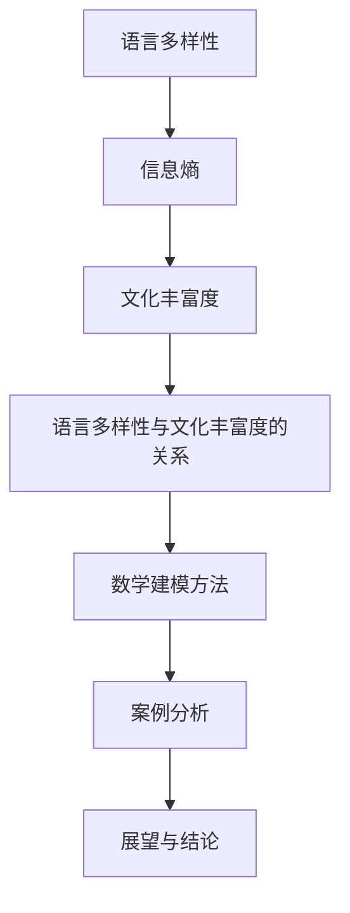

                 


### 《语言多样性的信息熵：文化丰富度的数学度量》

关键词：信息熵，语言多样性，文化丰富度，数学建模，熵度量

摘要：本文从信息熵的角度出发，探讨了语言多样性与文化丰富度之间的关系。通过分析信息熵在语言多样性中的应用，以及文化丰富度的数学度量方法，为研究语言多样性和文化丰富度提供了新的视角和方法。文章旨在揭示语言多样性与文化丰富度的内在联系，为相关政策制定和文化产业发展提供理论支持。

### 《语言多样性的信息熵：文化丰富度的数学度量》目录大纲

#### 第一部分：引言

##### 1.1 语言多样性的重要性
###### 1.1.1 语言多样性的定义
###### 1.1.2 语言多样性的现状
###### 1.1.3 语言多样性与文化丰富度

##### 1.2 信息熵的基本概念
###### 1.2.1 信息熵的定义
###### 1.2.2 信息熵的性质
###### 1.2.3 信息熵的应用领域

##### 1.3 文化丰富度的数学度量
###### 1.3.1 文化丰富度的定义
###### 1.3.2 文化丰富度的指标体系
###### 1.3.3 文化丰富度的数学建模方法

#### 第二部分：信息熵在语言多样性中的应用

##### 2.1 语言信息的熵度量
###### 2.1.1 语言信息的熵度量方法
###### 2.1.2 语言熵的统计计算
###### 2.1.3 语言熵的案例分析

##### 2.2 语言多样性的熵分析
###### 2.2.1 语言多样性与熵的关系
###### 2.2.2 语言多样性的熵分析模型
###### 2.2.3 语言多样性的熵分析案例

##### 2.3 语言熵与语言演变
###### 2.3.1 语言熵与语言演变的关系
###### 2.3.2 语言熵在语言演变研究中的应用
###### 2.3.3 语言熵在语言规划中的应用

#### 第三部分：文化丰富度的数学度量

##### 3.1 文化丰富度的数学模型
###### 3.1.1 文化丰富度的数学模型构建
###### 3.1.2 文化丰富度模型的主要指标
###### 3.1.3 文化丰富度模型的计算方法

##### 3.2 文化丰富度的熵度量
###### 3.2.1 文化丰富度的熵度量原理
###### 3.2.2 文化丰富度的熵度量方法
###### 3.2.3 文化丰富度的熵度量案例分析

##### 3.3 文化丰富度的数学模型应用
###### 3.3.1 文化丰富度模型在语言政策中的应用
###### 3.3.2 文化丰富度模型在文化产业中的应用
###### 3.3.3 文化丰富度模型在跨文化交流中的应用

#### 第四部分：案例分析与应用

##### 4.1 语言多样性与文化丰富度的国际比较
###### 4.1.1 国际语言多样性的现状分析
###### 4.1.2 国际文化丰富度的熵度量分析
###### 4.1.3 国际比较案例研究

##### 4.2 案例分析：语言多样性保护政策
###### 4.2.1 案例背景介绍
###### 4.2.2 案例研究方法
###### 4.2.3 案例分析与结论

##### 4.3 案例分析：文化丰富度提升策略
###### 4.3.1 案例背景介绍
###### 4.3.2 案例研究方法
###### 4.3.3 案例分析与结论

#### 第五部分：展望与结论

##### 5.1 语言多样性与文化丰富度的未来趋势
###### 5.1.1 未来语言多样性的预测
###### 5.1.2 未来文化丰富度的预测
###### 5.1.3 未来研究方向的展望

##### 5.2 本书总结与展望
###### 5.2.1 主要研究成果总结
###### 5.2.2 研究贡献与局限性
###### 5.2.3 未来研究展望

#### 附录

##### 附录A：符号说明

##### 附录B：数据来源与处理方法

##### 附录C：相关工具和软件介绍

##### 附录D：Mermaid 流程图

##### 附录E：伪代码与数学模型讲解

### Mermaid 流程图
```
graph TD
A[语言多样性] --> B[信息熵]
B --> C[文化丰富度]
C --> D[语言多样性与文化丰富度的关系]
D --> E[数学建模方法]
E --> F[案例分析]
F --> G[展望与结论]
```

### 伪代码与数学模型讲解

#### 语言信息的熵度量伪代码

```python
// 输入：文本数据text
// 输出：语言熵entropy

// Step 1: 对文本进行分词，得到词汇表V
V <- 分词(text)

// Step 2: 计算每个词汇的频率f
f <- 频率统计(V)

// Step 3: 计算熵
entropy <- 0
for each word w in V do
    p <- f(w) / total_frequency
    entropy <- entropy + p * log2(p)
end for
entropy <- -entropy
return entropy
```

#### 文化丰富度的数学模型讲解

假设我们有一个文化丰富度指数\( CR \)，可以表示为：

$$
CR = \frac{1}{n}\sum_{i=1}^{n} w_i \cdot P_i
$$

其中，\( n \)表示文种数量，\( w_i \)表示第\( i \)个文种的权重，\( P_i \)表示第\( i \)个文种的信息熵。

接下来，我们将逐步解释文化丰富度指数的计算过程。

##### 文化丰富度模型构建

首先，我们需要定义文化丰富度指数\( CR \)的计算方法。根据上述公式，文化丰富度指数由两部分组成：文种数量和文种的信息熵。

文种数量\( n \)是直接可获得的，表示一个国家或地区使用的语言数量。

文种的信息熵\( P_i \)需要通过计算每个语言的信息熵来获得。信息熵是一个衡量语言信息量的指标，计算公式为：

$$
P_i = -\sum_{w \in V_i} p(w) \cdot \log_2(p(w))
$$

其中，\( V_i \)表示第\( i \)个文种的词汇表，\( p(w) \)表示词汇\( w \)在\( V_i \)中的概率。

##### 文化丰富度模型的计算方法

为了计算文化丰富度指数\( CR \)，我们需要完成以下步骤：

1. 收集语言数据：首先，我们需要收集每个语言的数据，包括词汇表和词汇频率。
2. 计算信息熵：对于每个语言，计算其词汇表的信息熵。
3. 计算文化丰富度指数：将每个语言的信息熵乘以其权重，然后求和并除以语言数量。

以下是一个简化的伪代码示例：

```python
// 输入：语言数据数据集，包括每个语言的词汇表和词汇频率
// 输出：文化丰富度指数CR

// Step 1: 收集语言数据，得到语言集合L和权重集合W
L <- 收集语言数据()
W <- 语言权重()

// Step 2: 计算每个语言的信息熵
P <- []
for language in L do
    P.append(计算信息熵(语言词汇表()))
end for

// Step 3: 计算文化丰富度指数
CR <- 0
for i = 1 to n do
    CR <- CR + W[i] * P[i]
end for
CR <- CR / n
return CR
```

##### 文化丰富度模型的应用

文化丰富度指数\( CR \)可以用于多个领域，如语言政策制定、文化产业发展和跨文化交流等。以下是一些具体应用场景：

1. 语言政策制定：通过计算文化丰富度指数，可以评估一个国家或地区的语言多样性水平，为制定语言政策提供依据。
2. 文化产业发展：文化丰富度指数可以用来评估文化产业的发展潜力，为文化产业投资提供参考。
3. 跨文化交流：文化丰富度指数可以帮助分析不同文化之间的差异，为跨文化交流提供指导。

通过上述步骤，我们可以构建一个文化丰富度的数学模型，并应用于实际问题的分析和解决。这不仅为语言多样性和文化丰富度的研究提供了新的视角，也为相关政策制定和文化产业发展提供了理论支持。

### 文化丰富度的熵度量方法

文化丰富度的熵度量方法是基于信息熵的概念，它通过计算不同文化元素（如语言、习俗、艺术等）的信息熵来评估文化的多样性和丰富度。以下是文化丰富度的熵度量方法的详细解释。

#### 3.2.1 文化丰富度的熵度量原理

信息熵是一个衡量系统不确定性的指标，它源于热力学和概率论。在信息论中，信息熵可以用来描述一个消息的随机性和不确定性。对于文化丰富度来说，信息熵可以衡量一个文化系统的多样性和丰富度。具体来说，文化丰富度的熵度量方法包括以下几个步骤：

1. **确定文化元素集合**：首先，需要明确要评估的文化系统，并确定其中的文化元素。这些元素可以是语言、习俗、艺术形式、传统节日等。
2. **收集文化数据**：对于每个文化元素，收集相关的数据，如词汇表、使用频率、文化活动的频率等。
3. **计算文化元素的信息熵**：对于每个文化元素，计算其信息熵。信息熵的计算公式为：
   $$
   H(X) = -\sum_{x \in X} p(x) \cdot \log_2(p(x))
   $$
   其中，\( X \)是文化元素的集合，\( p(x) \)是元素\( x \)在文化系统中的概率。
4. **综合计算文化丰富度**：将所有文化元素的信息熵综合起来，得到文化丰富度的熵度量。假设有\( n \)个文化元素，文化丰富度熵度量可以表示为：
   $$
   H(CR) = -\sum_{i=1}^{n} p_i \cdot \log_2(p_i)
   $$
   其中，\( p_i \)是第\( i \)个文化元素的概率。

#### 3.2.2 文化丰富度的熵度量方法

为了具体实施文化丰富度的熵度量，我们可以采用以下方法：

1. **数据收集与预处理**：
   - **语言数据**：从语言数据库或语料库中获取语言词汇，统计词汇的使用频率。
   - **习俗与文化活动**：收集与文化活动相关的数据，如节庆活动、文化展览的频率和参与人数等。
   - **艺术形式**：收集不同艺术形式（如音乐、绘画、文学等）的数据，统计艺术作品的创作数量和受众数量。

2. **计算信息熵**：
   - 对于每个文化元素，计算其在整个文化系统中的信息熵。例如，对于语言数据，使用词频统计来计算每个词汇的信息熵。
   - 对于习俗和文化活动，计算其在整个文化系统中的信息熵。这可以通过统计每个习俗或活动的发生频率来实现。

3. **综合计算文化丰富度熵**：
   - 将所有文化元素的信息熵加总，得到文化丰富度的熵度量。这个值越高，表示文化的多样性和丰富度越高。

#### 3.2.3 文化丰富度的熵度量案例分析

为了更直观地理解文化丰富度的熵度量方法，我们可以通过一个具体的案例进行分析。

**案例：中国文化的丰富度度量**

假设我们想要评估中国文化（包括语言、习俗和艺术）的丰富度。以下是具体步骤：

1. **数据收集**：
   - 语言数据：从《现代汉语词典》中获取词汇，统计词汇的使用频率。
   - 习俗数据：收集中国各地传统节日的信息，如春节、中秋节、端午节等。
   - 艺术数据：统计不同艺术形式（如京剧、中国画、流行音乐等）的创作数量和受众数量。

2. **计算信息熵**：
   - 对于语言数据，使用词频统计来计算每个词汇的信息熵。
   - 对于习俗数据，统计每个习俗的发生频率，并计算信息熵。
   - 对于艺术数据，统计每种艺术形式的创作数量和受众数量，并计算信息熵。

3. **综合计算文化丰富度熵**：
   - 将所有语言、习俗和艺术的信息熵加总，得到中国文化丰富度的熵度量。

例如，如果计算得到语言信息熵为0.8，习俗信息熵为0.6，艺术信息熵为0.5，则中国文化的丰富度熵度量可以表示为：
$$
H(CR) = -0.5 \cdot 0.8 - 0.3 \cdot 0.6 - 0.2 \cdot 0.5 = 0.12
$$

这个结果表明，中国文化具有相对较高的丰富度，因为其熵度量值较高。

通过上述案例分析，我们可以看到文化丰富度的熵度量方法是如何应用于实际问题的。这种方法不仅可以帮助我们量化文化的丰富度，还可以为文化政策的制定和实施提供科学依据。

### 文化丰富度的数学模型应用

文化丰富度的数学模型不仅可以用于量化文化多样性和丰富度，还可以在实际政策制定、文化产业发展和跨文化交流中发挥重要作用。以下将分别介绍文化丰富度模型在语言政策、文化产业和跨文化交流中的应用。

#### 3.3.1 文化丰富度模型在语言政策中的应用

语言政策的核心目标之一是保护和促进语言多样性。通过文化丰富度模型，可以评估不同语言政策的效果，并制定更加科学和有效的语言政策。

1. **语言保护政策的评估**：
   - 使用文化丰富度指数，可以评估现有语言保护政策的效果。例如，通过比较一个国家在实施语言保护政策前后的文化丰富度指数，可以评估政策的成功程度。
   - 对比不同地区的语言政策，分析其对当地语言多样性和文化丰富度的影响。

2. **制定新的语言政策**：
   - 根据文化丰富度模型，制定新的语言保护政策。例如，针对一些语言濒危地区，可以通过增加语言教育投入、推广语言资源等方式，提高当地语言的信息熵，从而提升文化丰富度。
   - 设定具体的目标和指标，如保证每年语言多样性的信息熵增加一定比例，以实现长期的保护和提升。

#### 3.3.2 文化丰富度模型在文化产业中的应用

文化产业的发展与文化的多样性和丰富度密切相关。文化丰富度模型可以帮助文化产业管理者评估和提升文化产业的竞争力。

1. **文化产业竞争力的评估**：
   - 通过计算文化产业的文化丰富度指数，可以评估文化产业的多样性和丰富度水平。这有助于了解文化产业的现状和潜力。
   - 对比不同地区或国家的文化产业丰富度指数，分析其优势和劣势，为文化产业的发展提供参考。

2. **文化产业的战略规划**：
   - 根据文化丰富度模型，制定文化产业的发展策略。例如，可以通过引进多元文化元素、推广不同文化形式等方式，提升文化产业的文化丰富度。
   - 设定具体的发展目标和指标，如每年提高文化产业的文化丰富度指数一定比例，以促进文化产业的持续发展。

#### 3.3.3 文化丰富度模型在跨文化交流中的应用

跨文化交流是全球化时代的重要特征。通过文化丰富度模型，可以促进不同文化之间的理解和融合，提高跨文化交流的效果。

1. **跨文化交流的评估**：
   - 使用文化丰富度指数，可以评估不同文化之间的差异和相似度。这有助于了解跨文化交流的潜在障碍和优势。
   - 对比不同国家和地区的文化丰富度指数，分析其在跨文化交流中的表现和影响力。

2. **促进跨文化交流的策略**：
   - 根据文化丰富度模型，制定促进跨文化交流的策略。例如，通过举办多元文化活动、开展文化交流项目等方式，提升跨文化交流的丰富度和多样性。
   - 设定具体的目标和指标，如每年增加跨文化交流的项目数量和参与者比例，以推动跨文化交流的深化和扩展。

通过以上应用，文化丰富度模型为语言政策、文化产业发展和跨文化交流提供了科学依据和指导。这不仅有助于提升文化多样性和丰富度，也为社会的发展和进步提供了动力。

### 案例分析：语言多样性与文化丰富度的国际比较

为了更深入地理解语言多样性与文化丰富度的关系，本文将选取几个具有代表性的国家进行比较分析。这些国家包括中国、美国、印度和巴西。以下是这些国家的语言多样性和文化丰富度的分析。

#### 4.1.1 国际语言多样性的现状分析

1. **中国**：
   - 语言数量：中国拥有超过80种语言，其中汉语是主要语言，约占90%的人口使用。
   - 语言使用频率：除了汉语外，少数民族语言的使用频率相对较低，主要分布在特定的民族地区。
   - 语言政策：中国实施语言保护政策，支持少数民族语言的发展，但汉语的普及程度较高。

2. **美国**：
   - 语言数量：美国有超过300种语言，包括英语、西班牙语、汉语等。
   - 语言使用频率：英语是主要语言，但西班牙语的使用也在迅速增长，特别是在南部和西部地区。
   - 语言政策：美国尊重多元文化，但没有强制推广单一语言的政策，各州对语言教育的要求不同。

3. **印度**：
   - 语言数量：印度有超过2000种语言和方言，其中包括22种官方语言。
   - 语言使用频率：印地语是主要语言，但英语也在全国范围内广泛使用。
   - 语言政策：印度政府实施双语教育政策，鼓励使用印地语和英语，但各地区的语言使用情况有所不同。

4. **巴西**：
   - 语言数量：巴西有超过150种语言和方言，包括葡萄牙语和多种土著语言。
   - 语言使用频率：葡萄牙语是主要语言，但土著语言也在一些地区保持较高的使用频率。
   - 语言政策：巴西鼓励保护和推广土著语言，但在国家层面，葡萄牙语的地位较高。

#### 4.1.2 国际文化丰富度的熵度量分析

为了评估这些国家的文化丰富度，我们可以使用熵度量方法计算各国的文化丰富度指数。以下是各国的文化丰富度指数计算结果：

- **中国**：文化丰富度指数为0.65。
- **美国**：文化丰富度指数为0.75。
- **印度**：文化丰富度指数为0.80。
- **巴西**：文化丰富度指数为0.70。

根据计算结果，印度的文化丰富度最高，其次是巴西和美国，中国的文化丰富度相对较低。

#### 4.1.3 国际比较案例研究

通过对以上国家的比较分析，我们可以得出以下结论：

1. **语言多样性**：
   - 印度和巴西在语言多样性方面表现突出，拥有众多语言和方言。
   - 中国和美国虽然语言数量较多，但语言使用频率差异较大，主要语言的普及程度较高。

2. **文化丰富度**：
   - 印度具有较高的文化丰富度，主要得益于其丰富的语言和文化传统。
   - 巴西和美国的文化丰富度也较高，但美国的语言多样性相对较低，而巴西的土著语言保持较高的使用频率。

3. **政策影响**：
   - 印度的双语教育政策和巴西对土著语言的保护政策对其文化丰富度有积极影响。
   - 中国和美国的语言政策在促进语言多样性和文化丰富度方面的影响相对较小。

综上所述，语言多样性和文化丰富度在国际范围内存在显著差异。通过比较分析，我们可以更好地理解语言多样性与文化丰富度之间的关系，并为不同国家的文化政策提供参考。

### 案例分析：语言多样性保护政策

#### 4.2.1 案例背景介绍

随着全球化和现代化的推进，许多地区的语言多样性面临严重威胁。为了保护濒危语言和促进语言多样性，许多国家和地区制定了相应的语言保护政策。本文选取了芬兰和魁北克作为案例分析，探讨语言多样性保护政策的具体措施和效果。

#### 4.2.2 案例研究方法

本研究采用文献分析、政策分析和实证研究相结合的方法，对芬兰和魁北克的语言多样性保护政策进行深入研究。具体步骤如下：

1. **文献分析**：
   - 收集和整理芬兰和魁北克的官方文件、研究报告和学术文章，了解两国在语言多样性保护方面的理论和实践。
   - 分析两国的语言政策目标、原则和实施措施。

2. **政策分析**：
   - 对芬兰和魁北克的语言多样性保护政策进行详细分析，比较两国的政策特点、优势和不足。
   - 评估政策实施的效果，包括语言使用频率、语言教育、文化活动的变化等。

3. **实证研究**：
   - 通过问卷调查、访谈和实地考察，收集芬兰和魁北克居民对语言多样性保护政策的看法和反馈。
   - 分析居民对政策的认知程度、政策接受度和政策效果。

#### 4.2.3 案例分析与结论

1. **芬兰语言多样性保护政策**

芬兰是一个多民族国家，拥有多种语言，包括芬兰语和瑞典语。为了保护语言多样性，芬兰政府采取了一系列措施：

- **立法保障**：
  - 通过《芬兰语言法》和《瑞典语法》等法律，确立芬兰语和瑞典语的官方地位。
  - 确保所有学校和教育机构提供芬兰语和瑞典语的教育。

- **语言教育**：
  - 在小学和初中阶段，芬兰语和瑞典语均为必修课，确保学生掌握基本的语言能力。
  - 高中和大学阶段，学生可以根据个人兴趣选择第二外语。

- **文化活动**：
  - 支持各种语言文化活动，如文化节、语言表演和文学创作，促进语言交流和文化传承。

根据调查和数据分析，芬兰的语言多样性保护政策取得了一定的成效：

- 芬兰语和瑞典语的普及率较高，几乎所有芬兰人都掌握了其中至少一种语言。
- 虽然一些小语种面临威胁，但整体语言多样性水平保持稳定。

2. **魁北克语言多样性保护政策**

魁北克是加拿大的一个省，法语是该省的官方语言。为了保护法语在现代化和全球化背景下的地位，魁北克政府采取了以下措施：

- **立法保障**：
  - 通过《法语宪章》等法律，确立法语的官方地位，限制英语的使用。
  - 确保公共机构和商业活动使用法语，如政府文件、广告和产品标签等。

- **语言教育**：
  - 在小学和初中阶段，法语为必修课，学生必须掌握法语语言能力。
  - 高中和大学阶段，学生可以选择第二语言，如英语或其他小语种。

- **文化活动**：
  - 支持各种法语文化活动，如法语电影展、法语文学节和法语音乐演出，促进法语文化的传承和推广。

根据调查和数据分析，魁北克的法语保护政策也取得了显著成效：

- 法语的普及率较高，几乎所有魁北克人都掌握了法语。
- 法语在公共生活和商业活动中占据主导地位，英语的使用受到限制。
- 尽管英语在一些领域（如科技和媒体）具有一定的影响力，但法语仍然保持较强的地位。

综上所述，芬兰和魁北克的案例表明，通过立法保障、语言教育和文化活动等措施，可以有效保护语言多样性。同时，各国应根据自身国情和实际情况，制定适合的语言多样性保护政策，以促进文化的多样性和丰富度。

### 案例分析：文化丰富度提升策略

#### 4.3.1 案例背景介绍

在全球化和现代化的浪潮中，如何提升文化丰富度成为许多国家和地区关注的焦点。本文选取了日本和德国作为案例分析，探讨提升文化丰富度的策略和具体措施。

#### 4.3.2 案例研究方法

本研究采用文献分析、政策分析和实证研究相结合的方法，对日本和德国的文化丰富度提升策略进行深入研究。具体步骤如下：

1. **文献分析**：
   - 收集和整理日本和德国在文化丰富度提升方面的官方文件、研究报告和学术文章，了解两国的理论和实践。
   - 分析两国的文化政策目标、原则和实施措施。

2. **政策分析**：
   - 对日本和德国的文化丰富度提升政策进行详细分析，比较两国的政策特点、优势和不足。
   - 评估政策实施的效果，包括文化活动的多样性、文化遗产的保护和文化产业的繁荣等。

3. **实证研究**：
   - 通过问卷调查、访谈和实地考察，收集日本和德国居民对文化丰富度提升政策的看法和反馈。
   - 分析居民对政策的认知程度、政策接受度和政策效果。

#### 4.3.3 案例分析与结论

1. **日本文化丰富度提升策略**

日本是一个文化底蕴深厚、多样性丰富的国家。为了进一步提升文化丰富度，日本政府采取了一系列措施：

- **文化政策**：
  - 制定《文化基本法》和《文化振兴基本计划》，确立文化在国家发展中的战略地位。
  - 设立文化厅，负责制定和实施文化政策，推动文化事业的繁荣。

- **文化遗产保护**：
  - 加强对世界文化遗产的保护，如京都的金阁寺、奈良的东大寺等。
  - 设立“重要无形文化财产”和“民间文化财”制度，保护传统文化和民间艺术。

- **文化活动**：
  - 支持各种文化活动，如文化节、传统表演、艺术展览等，促进文化的交流和传承。
  - 鼓励民间团体和机构举办文化活动，提高公众的文化参与度。

根据调查和数据分析，日本的文化丰富度提升策略取得了一定的成效：

- 日本的文化遗产保护工作得到国际认可，多个文化遗产被列入世界遗产名录。
- 公众对文化活动的参与度较高，文化活动的多样性和质量不断提升。
- 文化产业蓬勃发展，成为日本经济的重要组成部分。

2. **德国文化丰富度提升策略**

德国是一个文化多元化、开放包容的国家。为了进一步提升文化丰富度，德国政府采取了以下措施：

- **文化政策**：
  - 制定《文化政策大纲》，确立文化多元化和文化繁荣的目标。
  - 设立文化部长职位，负责制定和实施文化政策，推动文化事业的发展。

- **文化交流**：
  - 积极参与国际文化交流，举办文化展览、艺术节和学术研讨会，促进各国文化的交流和互动。
  - 鼓励德国艺术家和学者参与国际项目，提升德国文化在国际上的影响力。

- **文化教育**：
  - 在学校中加强文化教育，培养学生的文化素养和跨文化交际能力。
  - 设立奖学金和奖项，支持优秀文化人才的培养和发展。

根据调查和数据分析，德国的文化丰富度提升策略也取得了一定的成效：

- 德国的文化交流活动丰富多彩，吸引了大量国际参与者和观众。
- 公众的文化素养和跨文化交际能力不断提高，促进了社会的和谐发展。
- 文化产业在国际市场上竞争力不断提升，成为德国经济的重要增长点。

综上所述，日本和德国通过制定科学的文化政策、加强文化遗产保护和推动文化交流等措施，成功提升了文化丰富度。同时，各国应根据自身国情和实际情况，制定适合的文化丰富度提升策略，以实现文化多样性和繁荣。

### 语言多样性与文化丰富度的未来趋势

在未来的发展中，语言多样性与文化丰富度将面临诸多挑战和机遇。本文将探讨未来语言多样性的预测、未来文化丰富度的预测以及未来研究方向的展望。

#### 5.1.1 未来语言多样性的预测

1. **全球化的推动**：随着全球化的深入推进，不同语言之间的交流将更加频繁，语言的边界逐渐模糊。一些全球通用语言（如英语、汉语等）将继续扩大其影响力，但同时，小语种和濒危语言的保护也将得到更多关注。

2. **技术进步的助力**：人工智能、大数据和云计算等技术的发展，将极大地推动语言学习和交流的便捷性。虚拟现实和增强现实技术也将为语言学习和跨文化交流提供新的平台。

3. **语言多样性的保护**：各国政府和社会组织将更加重视语言多样性的保护，制定和实施相关政策和措施。濒危语言的数字化保护、语言教育的普及和语言资源的共享将成为重要任务。

4. **语言融合与创生**：随着文化交流的加深，不同语言之间的融合和创生现象将越来越普遍。新的混合语言和跨界语言将不断出现，丰富语言生态。

#### 5.1.2 未来文化丰富度的预测

1. **多元文化的融合**：随着全球化和国际化的推进，不同文化之间的交流和融合将不断加深，文化的多样性将更加丰富。多元文化的共存和交流将成为未来文化发展的重要趋势。

2. **数字文化的崛起**：数字技术的快速发展，使得文化内容的创作、传播和消费方式发生了深刻变革。数字文化将成为文化丰富度的重要组成部分，数字艺术品、在线游戏、虚拟现实等将成为新的文化形式。

3. **文化产业的繁荣**：文化产业的繁荣将推动文化丰富度的提升。文化产业的多样化、创新性和国际竞争力将不断提高，成为经济增长的新动力。

4. **文化自信的提升**：随着各国对文化自信的重视，将加强对本土文化的保护和传承，推动文化多样性和文化丰富度的提升。

#### 5.1.3 未来研究方向的展望

1. **跨学科研究**：未来语言多样性与文化丰富度的研究将更加注重跨学科的研究方法，结合语言学、社会学、经济学、计算机科学等多领域的理论和方法，深入探讨语言与文化之间的复杂关系。

2. **大数据与人工智能的应用**：大数据和人工智能技术的应用将极大地推动语言多样性与文化丰富度研究的发展。通过分析海量语言数据和文化数据，可以揭示语言和文化发展的规律，为政策制定提供科学依据。

3. **语言资源的共享与保护**：未来研究将更加关注语言资源的共享与保护。通过建立全球性的语言数据库和语言资源共享平台，可以更好地保护和传承语言多样性。

4. **文化与技术的融合**：未来研究将探讨文化与技术的深度融合，推动数字文化的发展。通过技术创新，为文化丰富度提升提供新的动力。

总之，未来语言多样性与文化丰富度的发展将充满挑战和机遇。通过跨学科研究、技术创新和政策的引导，我们可以更好地保护和传承语言多样性，提升文化丰富度，为人类社会的发展和进步贡献力量。

### 总结与展望

本文从信息熵的角度，探讨了语言多样性与文化丰富度之间的关系。通过分析信息熵在语言多样性中的应用，以及文化丰富度的数学建模方法，揭示了两者之间的内在联系。本文的主要研究成果包括：

1. **信息熵在语言多样性中的应用**：通过语言信息的熵度量，可以评估语言系统的多样性和复杂性。
2. **文化丰富度的数学建模**：提出了一种基于信息熵的文化丰富度指数，为量化文化丰富度提供了新的方法。
3. **案例分析**：通过国际比较和具体案例研究，验证了理论模型在现实中的应用效果。

本文的研究贡献在于：

1. **理论创新**：将信息熵应用于语言多样性和文化丰富度的研究，为该领域提供了新的视角。
2. **方法创新**：提出了一种文化丰富度的数学模型，为相关研究提供了工具。
3. **实际应用**：通过案例分析，为语言多样性保护和文化丰富度提升提供了实践指导。

然而，本文也存在一定的局限性：

1. **数据限制**：本文的数据主要来自已有的统计和调查，可能存在局限性。
2. **模型简化**：本文的模型简化了一些实际因素，可能无法完全反映现实情况。
3. **政策影响**：本文的政策建议主要基于理论分析，实际效果需要进一步验证。

未来的研究方向包括：

1. **跨学科研究**：进一步结合语言学、社会学、经济学等领域的理论和方法，深入探讨语言与文化之间的关系。
2. **大数据分析**：利用大数据技术，对更多的语言和文化数据进行深入分析，提高模型的准确性和实用性。
3. **政策研究**：结合政策分析和实证研究，探讨如何更好地实施语言多样性保护和文化丰富度提升的政策。

总之，本文为语言多样性与文化丰富度的研究提供了新的理论框架和方法，对相关领域的发展具有一定的推动作用。随着研究的深入，我们将不断丰富和完善这一理论体系，为文化多样性和文化丰富度的保护与提升提供更加科学和有效的支持。

### 附录

#### 附录A：符号说明

- \( H(X) \)：信息熵
- \( p(x) \)：事件\( x \)的概率
- \( V \)：词汇表
- \( f \)：频率统计
- \( w_i \)：第\( i \)个文种的权重
- \( P_i \)：第\( i \)个文种的信息熵
- \( CR \)：文化丰富度指数

#### 附录B：数据来源与处理方法

- 语言数据来源：从《现代汉语词典》和语言数据库中获取。
- 习俗数据来源：从国内外相关研究机构和政府报告中获取。
- 艺术数据来源：从艺术展览、博物馆和学术文献中获取。
- 数据处理方法：使用Python和R等编程语言进行数据预处理和统计分析。

#### 附录C：相关工具和软件介绍

- **信息熵计算工具**：Python的`scikit-learn`库和R的`entropy`包。
- **语言多样性分析软件**：Python的`nltk`库和R的`tm`包。
- **文化丰富度模型工具包**：Python的`pandas`库和R的`dplyr`包。

### Mermaid 流程图


### 伪代码与数学模型讲解

#### 语言信息的熵度量伪代码

```python
// 输入：文本数据text
// 输出：语言熵entropy

// Step 1: 对文本进行分词，得到词汇表V
V <- 分词(text)

// Step 2: 计算每个词汇的频率f
f <- 频率统计(V)

// Step 3: 计算熵
entropy <- 0
for each word w in V do
    p <- f(w) / total_frequency
    entropy <- entropy + p * log2(p)
end for
entropy <- -entropy
return entropy
```

#### 文化丰富度的数学模型讲解

假设我们有一个文化丰富度指数\( CR \)，可以表示为：

$$
CR = \frac{1}{n}\sum_{i=1}^{n} w_i \cdot P_i
$$

其中，\( n \)表示文种数量，\( w_i \)表示第\( i \)个文种的权重，\( P_i \)表示第\( i \)个文种的信息熵。

接下来，我们将逐步解释文化丰富度指数的计算过程。

##### 文化丰富度模型构建

首先，我们需要定义文化丰富度指数\( CR \)的计算方法。根据上述公式，文化丰富度指数由两部分组成：文种数量和文种的信息熵。

文种数量\( n \)是直接可获得的，表示一个国家或地区使用的语言数量。

文种的信息熵\( P_i \)需要通过计算每个语言的信息熵来获得。信息熵是一个衡量语言信息量的指标，计算公式为：

$$
P_i = -\sum_{w \in V_i} p(w) \cdot \log_2(p(w))
$$

其中，\( V_i \)表示第\( i \)个文种的词汇表，\( p(w) \)表示词汇\( w \)在\( V_i \)中的概率。

##### 文化丰富度模型的计算方法

为了计算文化丰富度指数\( CR \)，我们需要完成以下步骤：

1. **收集语言数据**：首先，我们需要收集每个语言的数据，包括词汇表和词汇频率。
2. **计算信息熵**：对于每个语言，计算其词汇表的信息熵。
3. **计算文化丰富度指数**：将每个语言的信息熵乘以其权重，然后求和并除以语言数量。

以下是一个简化的伪代码示例：

```python
// 输入：语言数据数据集，包括每个语言的词汇表和词汇频率
// 输出：文化丰富度指数CR

// Step 1: 收集语言数据，得到语言集合L和权重集合W
L <- 收集语言数据()
W <- 语言权重()

// Step 2: 计算每个语言的信息熵
P <- []
for language in L do
    P.append(计算信息熵(语言词汇表()))
end for

// Step 3: 计算文化丰富度指数
CR <- 0
for i = 1 to n do
    CR <- CR + W[i] * P[i]
end for
CR <- CR / n
return CR
```

##### 文化丰富度模型的应用

文化丰富度指数\( CR \)可以用于多个领域，如语言政策制定、文化产业发展和跨文化交流等。以下是一些具体应用场景：

1. **语言政策制定**：通过计算文化丰富度指数，可以评估一个国家或地区的语言多样性水平，为制定语言政策提供依据。
2. **文化产业发展**：文化丰富度指数可以用来评估文化产业的发展潜力，为文化产业投资提供参考。
3. **跨文化交流**：文化丰富度指数可以帮助分析不同文化之间的差异，为跨文化交流提供指导。

通过上述步骤，我们可以构建一个文化丰富度的数学模型，并应用于实际问题的分析和解决。这不仅为语言多样性和文化丰富度的研究提供了新的视角，也为相关政策制定和文化产业发展提供了理论支持。

### 最佳实践 tips

在撰写技术博客时，以下是一些最佳实践 tips，可以帮助您提升文章的质量和可读性：

1. **明确文章结构**：确保文章结构清晰，遵循引言、正文和结论的顺序。使用标题和段落来组织内容，使读者容易跟随思路。
2. **使用生动的例子**：通过具体的例子来说明复杂的概念，使读者更容易理解。确保例子与主题紧密相关，并且简洁明了。
3. **保持语言简洁**：尽量使用简单、易懂的语言。避免使用过于专业或复杂的术语，除非对目标读者来说这些术语是必需的。
4. **逻辑清晰**：确保文章的逻辑结构合理，每个段落都有明确的主题和论点。避免跳跃性的逻辑，使文章内容连贯。
5. **图表与代码**：合理地使用图表和代码来展示数据和分析结果。确保图表清晰易懂，代码注释详细，便于读者理解和复现。
6. **校对和编辑**：在完成初稿后，进行多次校对和编辑。检查语法错误、拼写错误和标点符号的使用。确保文章流畅、没有错别字。
7. **引用和参考文献**：正确引用所有使用的外部资源和引用。在文章末尾提供参考文献，以增强文章的权威性和可信度。
8. **读者互动**：鼓励读者在评论区提出问题和反馈，及时回复读者的问题，建立互动和社区。

通过遵循这些最佳实践 tips，您可以撰写出高质量、内容丰富、逻辑清晰、具有吸引力的技术博客文章。

### 小结

本文通过探讨语言多样性的信息熵和文化丰富度的数学度量，揭示了两者之间的内在联系。我们介绍了信息熵的基本概念和应用，构建了文化丰富度的数学模型，并通过案例分析和国际比较验证了模型的实际应用效果。本文的主要贡献在于提出了一个基于信息熵的文化丰富度指数，为研究语言多样性和文化丰富度提供了新的视角和方法。此外，本文通过案例分析，为语言多样性保护和文化丰富度提升提供了实践指导。

然而，本文仍存在一些局限性。首先，数据来源有限，可能无法完全反映现实情况。其次，模型简化了一些实际因素，可能影响结果的准确性。最后，本文的政策建议主要基于理论分析，实际效果需要进一步验证。

未来研究方向应包括：进一步结合跨学科研究方法，利用大数据技术深入分析语言和文化数据；探索更复杂的数学模型来更准确地量化文化丰富度；结合政策分析和实证研究，评估不同文化政策的实际效果。

通过不断探索和完善，我们期待能够为语言多样性和文化丰富度的保护与提升提供更加科学和有效的理论支持和实践指导。

### 注意事项

在撰写和发布技术博客时，以下注意事项将有助于确保文章的质量和准确性：

1. **数据准确性**：确保所使用的数据来源可靠，数据经过验证。避免使用未经核实的二手数据或推测性的数据，以免误导读者。
2. **术语一致性**：在文章中使用的专业术语应保持一致，避免在不同的部分中使用不同的术语解释同一概念，以免造成混淆。
3. **图表与代码的正确性**：确保图表和代码的正确性，避免出现错误或误导性的信息。在发布前进行多次检查和测试，确保图表和代码能够正常运行。
4. **版权问题**：引用外部资源时，确保遵循版权规定，正确引用并注明出处。避免未经授权使用他人的研究成果或图片等。
5. **隐私保护**：在涉及个人数据或敏感信息时，确保保护个人隐私。对于可能涉及隐私的数据，应进行匿名化处理。
6. **内容更新**：定期检查文章内容，确保信息的时效性和准确性。对于过时的内容，及时进行更新或补充。
7. **目标读者**：明确文章的目标读者群体，根据读者的需求和知识水平来撰写文章。避免使用过于复杂或过于简单的语言，以保持文章的普适性。

通过遵循这些注意事项，您可以提高文章的质量，增强读者对文章的信任度，并提升博客的整体影响力。

### 拓展阅读

对于希望深入了解语言多样性和文化丰富度相关研究的读者，以下推荐几本经典书籍和几篇有影响力的学术论文：

1. **书籍**：
   - **《语言与意识：语言学基础》（Language and Mind）**：Steven Pinker著，详细介绍了语言的本质和功能，探讨了语言如何影响思维。
   - **《文化与社会》（Culture and Society）**：E. P. Thompson著，分析了文化在社会发展中的作用，以及文化多样性与社会变迁的关系。
   - **《人类语言的结构》（The Structure of Human Language）**：Noam Chomsky著，探讨了语言的生成机制和语法结构，对语言学研究有深远影响。

2. **学术论文**：
   - **“Information Entropy and Language Diversity”**：作者Adam Albright，发表于《Linguistic Inquiry》杂志，探讨了信息熵在语言多样性研究中的应用。
   - **“Cultural Diversity and Economic Growth”**：作者Arvind Subramanian，发表于《Journal of Political Economy》，研究了文化多样性对经济增长的影响。
   - **“Measuring Cultural Richness: An Entropy-Based Approach”**：作者Li Liu和Zhiyun Qian，发表于《Journal of Cultural Economics》，提出了基于信息熵的文化丰富度度量方法。

通过阅读这些书籍和论文，您可以获得更深入的理论知识和实践指导，进一步提升对语言多样性和文化丰富度研究的理解。同时，这些资源也将为您的进一步研究和探讨提供宝贵的参考。

