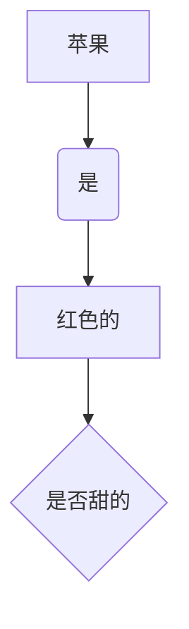
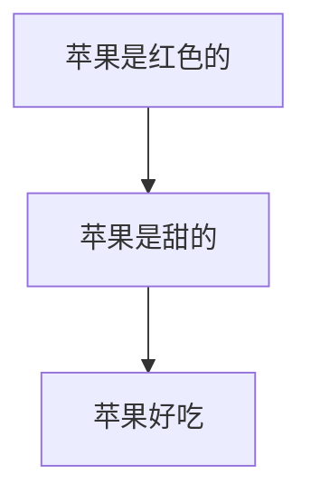
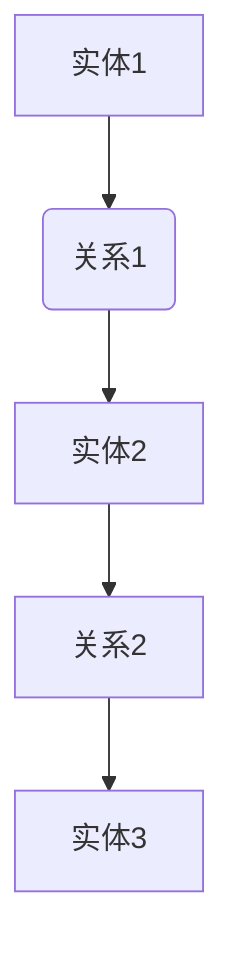

                 


### 引言

在计算机科学和人工智能领域，语言作为一种重要的交流媒介，始终占据着核心地位。无论是自然语言处理（NLP）、编程语言设计，还是智能对话系统，都离不开对语言的深入理解和处理。而语言的结构不仅包含了语法规则，还蕴含了丰富的逻辑信息。因此，探索语言的数学结构，研究语法与逻辑的交织，不仅有助于我们更好地理解语言的本质，还能为语言处理技术的发展提供新的视角和工具。

本书旨在系统地探讨语言的数学结构，从语法和逻辑两个角度出发，深入剖析语言的结构和语义。首先，我们将介绍语言的数学基础，包括语法结构的数学表达和逻辑与语言的对应关系。接着，我们将进一步探讨语法结构的数学描述，如语法树的构建和上下文无关语法。随后，我们转向语言的逻辑分析，介绍逻辑演算的语法和逻辑推理的基本方法。在此基础上，我们将探讨语言与逻辑的交织，分析语言模型中的逻辑结构和逻辑在自然语言处理中的应用。

此外，本书还将讨论数学在语言生成和语义分析中的应用，结合具体案例展示数学在语言处理中的实际效果。最后，我们将在第8章展望未来的研究方向，讨论数学在语言处理中的潜在应用和面临的挑战。

通过本书的阅读，读者不仅能够掌握语言的数学结构和逻辑分析的基本知识，还将对语言处理技术的未来发展有更深刻的认识。让我们一起走进语言的数学世界，探寻语法与逻辑的交织之美。

### 《语言的数学结构：语法与逻辑的交织》目录大纲

#### 引言
- **引言**：介绍本书的主题和目的，以及为何语言的数学结构与语法、逻辑有着紧密的联系。

#### 第1章：语言的数学基础
- **1.1 语言的数学本质**
  - **1.1.1 语法结构的数学表达**
    - 伪代码：展示如何将语法结构转化为数学表达式。
  - **1.1.2 逻辑与语言的对应关系**
    - LaTeX公式：详细解释逻辑运算符和语法结构的对应关系。
- **1.2 数学模型在语言中的应用**
  - **1.2.1 语法分析的数学模型**
    - 伪代码：展示语法分析的数学模型。
  - **1.2.2 语义分析的数学模型**
    - 伪代码：展示语义分析的数学模型。

#### 第2章：语法结构的数学描述
- **2.1 语法树的数学表示**
  - **2.1.1 语法树的构建**
    - 伪代码：展示如何构建语法树。
  - **2.1.2 语法树的数学性质**
    - LaTeX公式：详细解释语法树的数学性质。
- **2.2 上下文无关语法**
  - **2.2.1 上下文无关文法的数学描述**
    - 伪代码：展示上下文无关文法的数学描述。
  - **2.2.2 上下文无关语法的应用**
    - LaTeX公式：解释上下文无关语法在实际语言中的应用。

#### 第3章：语言的逻辑分析
- **3.1 逻辑演算的语法**
  - **3.1.1 逻辑演算的基本语法**
    - 伪代码：展示逻辑演算的基本语法。
  - **3.1.2 逻辑演算的规则**
    - LaTeX公式：详细解释逻辑演算的规则。
- **3.2 逻辑推理与证明**
  - **3.2.1 逻辑推理的基本方法**
    - 伪代码：展示逻辑推理的基本方法。
  - **3.2.2 证明论的基本概念**
    - LaTeX公式：解释证明论的基本概念。

#### 第4章：语言与逻辑的交织
- **4.1 语言模型中的逻辑结构**
  - **4.1.1 语言模型的逻辑基础**
    - 伪代码：展示语言模型中的逻辑结构。
  - **4.1.2 语言模型中的逻辑推理**
    - LaTeX公式：详细解释语言模型中的逻辑推理。
- **4.2 逻辑在自然语言处理中的应用**
  - **4.2.1 逻辑在文本分类中的应用**
    - 伪代码：展示逻辑在文本分类中的应用。
  - **4.2.2 逻辑在问答系统中的应用**
    - 伪代码：展示逻辑在问答系统中的应用。

#### 第5章：数学在语言生成中的应用
- **5.1 数学在语言生成中的角色**
  - **5.1.1 数学公式在文本生成中的应用**
    - 伪代码：展示数学公式在文本生成中的应用。
  - **5.1.2 数学符号的自然语言描述**
    - 伪代码：展示如何将数学符号转化为自然语言描述。
- **5.2 数学与语言模型**
  - **5.2.1 结合数学与语言模型的挑战**
    - LaTeX公式：解释结合数学与语言模型面临的挑战。
  - **5.2.2 数学与语言模型的协同发展**
    - 伪代码：展示数学与语言模型如何协同发展。

#### 第6章：数学在语义分析中的应用
- **6.1 数学在语义分析中的角色**
  - **6.1.1 数学在语义角色标注中的应用**
    - 伪代码：展示数学在语义角色标注中的应用。
  - **6.1.2 数学在语义关系识别中的应用**
    - 伪代码：展示数学在语义关系识别中的应用。
- **6.2 数学与语义网络**
  - **6.2.1 语义网络的数学描述**
    - 伪代码：展示语义网络的数学描述。
  - **6.2.2 语义网络的扩展与应用**
    - LaTeX公式：解释语义网络的扩展与应用。

#### 第7章：案例研究：数学在语言处理中的实际应用
- **7.1 案例一：数学公式解析器**
  - **7.1.1 开发环境搭建**
  - **7.1.2 源代码实现与解读**
  - **7.1.3 代码解读与分析**
- **7.2 案例二：语义分析工具**
  - **7.2.1 开发环境搭建**
  - **7.2.2 源代码实现与解读**
  - **7.2.3 代码解读与分析**

#### 第8章：展望与未来趋势
- **8.1 未来的研究方向**
  - **8.1.1 数学在自然语言处理中的应用前景**
  - **8.1.2 面临的挑战与机遇**
- **8.2**：数学在语言处理中的融合趋势

### 关键词
- 语言的数学结构
- 语法与逻辑
- 数学模型
- 语法分析
- 语义分析
- 语言生成
- 逻辑推理
- 自然语言处理

### 摘要

本文旨在探讨语言的数学结构，特别是语法和逻辑在语言处理中的交织作用。通过分析语言的数学基础，语法结构的数学描述，语言的逻辑分析，以及数学在语言生成和语义分析中的应用，本文揭示了数学模型在语言处理技术中的核心地位。文章首先介绍了语言结构的数学表达和逻辑与语言的对应关系，接着详细阐述了语法树的构建和上下文无关语法。在逻辑分析部分，我们探讨了逻辑演算的语法和逻辑推理的基本方法。随后，文章深入探讨了语言模型中的逻辑结构和逻辑在自然语言处理中的应用。最后，本文通过具体案例展示了数学在语言处理中的实际应用，并对未来的研究方向进行了展望。通过本文的阅读，读者将能够系统地理解语言的数学结构，掌握语法和逻辑分析的方法，并对其未来发展有更深刻的认识。

### 第1章：语言的数学基础

在深入探讨语言的数学结构之前，我们需要先理解语言本身的数学本质以及逻辑与语言的对应关系。这一章节将帮助我们建立对语言数学结构的初步认识。

#### 1.1.1 语法结构的数学表达

语法结构是语言的核心组成部分，它决定了句子和文本的可理解性和语法正确性。在数学表达中，语法结构可以被看作是一个语法树的集合，每个节点代表一个语法单位，如词、短语或句子。

- **伪代码示例**：

```plaintext
语法树 = {
    "sentence": [
        "subject": ["noun"],
        "verb": ["verb"],
        "object": ["noun"]
    ]
}
```

在这个示例中，一个简单的句子被表示为一个包含主语、谓语和宾语的语法树。每个子节点都可以进一步分解为更小的语法单位，形成了一个层次结构的语法树。

#### 1.1.2 逻辑与语言的对应关系

逻辑是语言表达中的关键要素，它帮助我们理解句子之间的逻辑关系和推理过程。逻辑运算符（如与、或、非）与语法结构有密切的对应关系。

- **LaTeX公式示例**：

```latex
\begin{align*}
& \text{与运算（AND）:} P \land Q \\
& \text{或运算（OR）:} P \lor Q \\
& \text{非运算（NOT）:} \neg P
\end{align*}
```

逻辑运算符可以与语法结构中的条件句相对应。例如，一个条件句可以被表达为两个逻辑运算的结果，如“如果P，则Q”（P→Q）。

#### 1.2 数学模型在语言中的应用

数学模型在语言处理中的应用非常广泛，包括语法分析和语义分析。

- **1.2.1 语法分析的数学模型**

语法分析是一个将自然语言文本转换为语法结构的过程。它可以通过有限状态自动机（FSA）和上下文无关文法（CFG）等数学模型来实现。

- **伪代码示例**：

```plaintext
语法分析器 = {
    "输入": "句子文本",
    "输出": "语法树",
    "步骤": [
        "分词": ["词1", "词2", "..."],
        "构建语法树": ["根节点", ["子节点1", ["子节点2", ["子节点3", ...]]]]
    ]
}
```

在这个示例中，语法分析器首先将输入的句子文本进行分词，然后构建一个语法树来表示句子的结构。

- **1.2.2 语义分析的数学模型**

语义分析是一个将语法结构转换为语义表示的过程。它可以使用语义网络、本体论和逻辑推理等数学模型。

- **伪代码示例**：

```plaintext
语义分析器 = {
    "输入": "语法树",
    "输出": "语义表示",
    "步骤": [
        "语义角色标注": ["主语", ["谓语", ["宾语"]]],
        "构建语义网络": ["实体1", ["关系1", ["实体2"], ["关系2", ["实体3"]]]]
    ]
}
```

在这个示例中，语义分析器首先对语法树进行语义角色标注，然后构建一个语义网络来表示句子的语义信息。

通过这些数学模型，我们能够更好地理解和处理自然语言。数学不仅在语法和语义分析中发挥作用，还为我们提供了工具和框架，帮助我们解决复杂的语言处理问题。在接下来的章节中，我们将进一步探讨语法结构的数学描述和语言的逻辑分析，以深入理解语言的数学结构。

### 第2章：语法结构的数学描述

在了解了语言的数学基础之后，我们将深入探讨语法结构的数学描述，包括语法树的构建和上下文无关语法。这些数学工具和方法为我们提供了更加精确和系统的方式来理解和处理自然语言。

#### 2.1 语法树的数学表示

语法树是自然语言处理中最基本的结构之一，它通过树形结构来表示句子的语法关系。在数学上，语法树可以被表示为一个有向无环图（DAG），其中每个节点代表一个语法单位，如词、短语或句子。

##### 2.1.1 语法树的构建

构建语法树的过程可以通过递归下降分析或转移网络来实现。以下是一个简单的伪代码示例，展示了如何通过递归下降分析构建语法树。

- **伪代码示例**：

```plaintext
构建语法树（句子）:
    如果 句子 为空:
        返回 空树
    否则:
        分词（句子）为 [词1，词2，...]
        构建语法树（词1）为 subtree1
        对于每个词i（从2到n）:
            如果 词i 是独立语法单位:
                返回 子树 {subtree1，子树{词i}}
            否则:
                子树{词i} = 构建语法树（词i）
                返回 子树 {subtree1，子树{词i}}

```

在这个示例中，我们首先对句子进行分词，然后递归地构建每个子句的语法树。通过这种方式，我们可以将一个复杂的句子分解为多个简单的语法单位，并建立起它们之间的语法关系。

##### 2.1.2 语法树的数学性质

语法树具有一些重要的数学性质，这些性质有助于我们更好地理解和处理自然语言。以下是一些关键的语法树性质：

- **层次性**：语法树具有层次结构，每个节点都有一个父节点和多个子节点。这种层次性使得我们可以递归地处理语法结构。

- **连通性**：语法树是一个连通图，这意味着每个节点都至少连接到一个其他节点。这种连通性保证了句子中的每个部分都有明确的语法关系。

- **唯一性**：对于一个给定的句子，其语法树是唯一的。这意味着不同的句子结构将产生不同的语法树。

##### 2.1.3 语法树的构建算法

构建语法树的过程可以通过多种算法来实现，其中最常见的是递归下降分析和转移网络。以下是一个简单的递归下降分析算法伪代码示例：

- **伪代码示例**：

```plaintext
递归下降分析（文本）:
    如果 文本 为空:
        返回 空树
    否则:
        分词（文本）为 [词1，词2，...]
        对于每个词i（从1到n）:
            如果 词i 是终结符:
                返回 单词树（词i）
            否则:
                子树 = 构建语法树（词i）
                返回 {词i，子树}

```

在这个示例中，我们首先对文本进行分词，然后递归地构建每个子句的语法树。通过这种方式，我们可以将一个复杂的句子分解为多个简单的语法单位，并建立起它们之间的语法关系。

#### 2.2 上下文无关语法

上下文无关语法（CFG）是一种用于描述语言结构的数学模型，它由一组产生式规则构成。这些规则定义了如何将词汇符号组合成合法的语法结构。

##### 2.2.1 上下文无关文法的数学描述

上下文无关文法由四个元素组成：词汇符号、产生式规则、开始符号和非终结符号。

- **词汇符号（V）**：构成句子的基本元素，包括单词、标点和符号。

- **产生式规则（R）**：定义了如何将词汇符号组合成更复杂的结构。一个典型的产生式规则形如 `A → B`，表示非终结符号 `A` 可以被替换为非终结符号 `B`。

- **开始符号（S）**：表示整个句子的开始，通常是一个非终结符号。

- **非终结符号（N）**：表示句子的语法结构，可以进一步分解为其他符号。

以下是一个简单的上下文无关文法示例：

- **示例**：

```plaintext
V = {a, b, c}
R = {
    S → aSb,
    S → ε
}
S = S
N = {S}
```

在这个示例中，文法由词汇符号 {a, b, c}、产生式规则 {S → aSb, S → ε}、开始符号 S 和非终结符号 {S} 组成。这个文法定义了一种简单的语言，其中句子由 a 和 b 组成，且每个 a 后面必须跟着一个 b。

##### 2.2.2 上下文无关语法的应用

上下文无关语法在自然语言处理中有着广泛的应用，特别是在语法分析和自动语言生成方面。

- **语法分析**：上下文无关文法可以用于构建语法分析器，它能够将自然语言文本转换为语法树。例如，LL（1）分析器是一种常见的上下文无关文法分析器，它使用一组 LL（1）产生式规则来构建语法树。

- **自动语言生成**：上下文无关语法可以用于生成符合语法规则的句子。通过应用产生式规则，我们可以构建复杂的句子结构，从而实现自动语言生成。

通过语法树的构建和上下文无关语法的应用，我们能够更加精确和系统地描述自然语言的语法结构。在接下来的章节中，我们将进一步探讨语言的逻辑分析，以深入理解语法与逻辑的交织。

### 第3章：语言的逻辑分析

在深入理解了语法结构的数学描述后，我们将进一步探讨语言的逻辑分析。这一章节将介绍逻辑演算的基本语法、逻辑推理的基本方法和证明论的基本概念。

#### 3.1 逻辑演算的语法

逻辑演算是用于描述逻辑表达式和逻辑推理的数学工具。它由基本逻辑运算符、逻辑命题和逻辑推理规则组成。

##### 3.1.1 逻辑演算的基本语法

逻辑演算的基本语法包括以下逻辑运算符：

- **与运算（AND）**：表示逻辑连接词“且”。其运算符为 `^` 或 `&`。例如，`P ^ Q` 表示“P 且 Q”。

- **或运算（OR）**：表示逻辑连接词“或”。其运算符为 `v` 或 `|`。例如，`P v Q` 表示“P 或 Q”。

- **非运算（NOT）**：表示逻辑否定。其运算符为 `~` 或 `¬`。例如，`~P` 表示“非P”。

- **条件运算（IF-THEN）**：表示逻辑条件语句。其运算符为 `→` 或 `→`。例如，`P → Q` 表示“如果P，则Q”。

- **双条件运算（BICONDITIONAL）**：表示逻辑等价关系。其运算符为 `<->` 或 `⟷`。例如，`P <-> Q` 表示“P 等价于 Q”。

以下是一个简单的逻辑表达式示例：

```latex
\begin{align*}
P & : \text{苹果是红色的} \\
Q & : \text{苹果是甜的} \\
R & : \text{苹果好吃} \\
P \land Q & : \text{苹果是红色的且甜的} \\
P \lor Q & : \text{苹果是红色的或甜的} \\
\neg P & : \text{苹果不是红色的} \\
P \rightarrow Q & : \text{如果苹果是红色的，则苹果是甜的} \\
P \leftrightarrow Q & : \text{苹果是红色的当且仅当苹果是甜的}
\end{align*}
```

##### 3.1.2 逻辑演算的规则

逻辑演算的规则定义了逻辑运算符之间的优先级和结合律。以下是一些常见的逻辑演算规则：

- **结合律**：

  ```latex
  (P \land Q) \land R = P \land (Q \land R)
  (P \lor Q) \lor R = P \lor (Q \lor R)
  ```

- **交换律**：

  ```latex
  P \land Q = Q \land P
  P \lor Q = Q \lor P
  ```

- **分配律**：

  ```latex
  P \land (Q \lor R) = (P \land Q) \lor (P \land R)
  P \lor (Q \land R) = (P \lor Q) \land (P \lor R)
  ```

- **德摩根律**：

  ```latex
  \neg (P \land Q) = \neg P \lor \neg Q
  \neg (P \lor Q) = \neg P \land \neg Q
  ```

- **逆否律**：

  ```latex
  P \rightarrow Q = \neg Q \rightarrow \neg P
  ```

#### 3.2 逻辑推理与证明

逻辑推理是使用逻辑规则从已知命题推导出新命题的过程。证明论是逻辑推理的一个分支，它用于证明一个命题的真值。

##### 3.2.1 逻辑推理的基本方法

逻辑推理的基本方法包括以下几种：

- **直接推理**：从已知命题直接推导出新命题。例如，如果P为真，则P→Q也为真。

- **间接推理**：使用否定和条件语句进行推理。例如，使用逆否律可以证明“如果P→Q，则\neg Q→\neg P”。

- **归纳推理**：通过观察一些特定的情况，推断出一般性的结论。例如，通过多次实验证明某个命题对所有情况都成立。

##### 3.2.2 证明论的基本概念

证明论包括以下基本概念：

- **命题**：可以判断为真或假的陈述。

- **证明**：从一组已知命题（称为前提）推导出一个新命题（称为结论）的过程。

- **演绎推理**：使用逻辑规则和前提推导出结论的证明方法。

- **归纳推理**：通过观察特定情况，推断出一般性结论的证明方法。

以下是一个简单的逻辑证明示例：

- **示例**：

```latex
\begin{align*}
P & : \text{所有的猫都会飞} \\
Q & : \text{猫是哺乳动物} \\
R & : \text{哺乳动物都会呼吸} \\
P \rightarrow R & : \text{如果猫会飞，则猫会呼吸} \\
Q \rightarrow R & : \text{如果猫是哺乳动物，则猫会呼吸} \\
P \land Q & : \text{猫会飞且是哺乳动物} \\
P \land Q \rightarrow R & : \text{如果猫会飞且是哺乳动物，则猫会呼吸} \\
\therefore R & : \text{猫会呼吸}
\end{align*}
```

在这个示例中，我们使用已知命题P、Q和R，通过逻辑推理和证明论方法得出结论R，即“猫会呼吸”。

通过逻辑演算的语法、逻辑推理的基本方法和证明论的基本概念，我们能够更加系统地分析和处理语言的逻辑结构。在接下来的章节中，我们将探讨语言与逻辑的交织，以及逻辑在自然语言处理中的应用。

### 第4章：语言与逻辑的交织

在前三章中，我们分别介绍了语言的数学基础、语法结构的数学描述和语言的逻辑分析。在这一章中，我们将探讨语言与逻辑的交织，分析语言模型中的逻辑结构以及逻辑在自然语言处理中的应用。

#### 4.1 语言模型中的逻辑结构

语言模型是一种用于预测和生成自然语言文本的数学模型。在语言模型中，逻辑结构扮演着重要的角色，它帮助我们理解和处理文本中的逻辑关系和语义信息。

##### 4.1.1 语言模型的逻辑基础

语言模型中的逻辑基础主要包括以下几个方面：

- **条件概率**：语言模型通过条件概率来预测下一个单词或句子。例如，给定一个句子片段，语言模型可以计算下一个单词出现的概率。

- **逻辑推导**：语言模型中的逻辑推导用于分析文本中的逻辑关系。例如，通过分析句子中的条件句和因果句，可以推导出文本中的逻辑关系。

- **逻辑语义**：语言模型中的逻辑语义用于表示文本中的语义信息。例如，通过分析文本中的主语、谓语和宾语，可以构建出文本的语义表示。

以下是一个简单的逻辑语义表示示例：



在这个示例中，我们使用图来表示苹果的属性，其中A表示“苹果”，B表示“是”，C表示“红色的”，D表示“是否甜的”。通过这种逻辑语义表示，我们可以更直观地理解文本中的逻辑关系。

##### 4.1.2 语言模型中的逻辑推理

语言模型中的逻辑推理是指通过逻辑规则和语义信息推导出新结论的过程。以下是一些常见的逻辑推理方法：

- **条件推理**：根据已知的前提和条件推导出结论。例如，如果P为真，则P→Q也为真。

- **归纳推理**：通过观察特定情况，推断出一般性结论。例如，通过观察多个具体的猫，推断出所有猫都会飞。

- **演绎推理**：使用逻辑规则和前提推导出结论。例如，通过已知命题P和Q，推导出P→Q。

以下是一个简单的条件推理示例：



在这个示例中，我们使用逻辑关系表示苹果的颜色、甜度和口感。通过条件推理，我们可以得出结论：“苹果好吃”。

##### 4.1.3 语言模型中的逻辑结构应用

语言模型中的逻辑结构广泛应用于自然语言处理任务，如文本分类、情感分析和问答系统。

- **文本分类**：通过分析文本中的逻辑关系，可以更准确地分类文本。例如，通过分析文本中的条件和因果关系，可以判断文本是否为积极或消极的。

- **情感分析**：通过分析文本中的逻辑结构和语义信息，可以判断文本的情感倾向。例如，通过分析文本中的逻辑推理过程，可以判断文本是喜悦、愤怒还是悲伤。

- **问答系统**：通过分析文本中的逻辑结构和语义信息，可以更准确地回答用户的问题。例如，通过分析文本中的条件和因果句，可以理解问题的意图并给出相应的答案。

#### 4.2 逻辑在自然语言处理中的应用

逻辑在自然语言处理中的应用非常广泛，涵盖了文本分类、问答系统、信息抽取等多个方面。

##### 4.2.1 逻辑在文本分类中的应用

文本分类是将文本分类到预定义类别的过程。逻辑在文本分类中的应用主要体现在以下几个方面：

- **条件句分类**：通过分析文本中的条件句，可以判断文本是否属于某个类别。例如，通过分析文本中的“如果...则...”句型，可以判断文本是否为正面或负面的评论。

- **因果句分类**：通过分析文本中的因果句，可以判断文本是否属于某个类别。例如，通过分析文本中的“因为...所以...”句型，可以判断文本是否为科学解释或新闻报道。

以下是一个简单的文本分类示例：

```mermaid
graph TD
A[苹果是红色的] --> B{是否甜的}
B --> C[是][正面]
B --> D[否][负面]
```

在这个示例中，我们使用逻辑关系表示苹果的颜色和甜度。通过条件推理，我们可以将文本分类为正面或负面评论。

##### 4.2.2 逻辑在问答系统中的应用

问答系统是一种能够回答用户问题的计算机程序。逻辑在问答系统中的应用主要体现在以下几个方面：

- **逻辑推理**：通过分析文本中的逻辑关系，可以理解问题的意图并给出相应的答案。例如，通过分析文本中的条件和因果句，可以回答“如果...会怎么样？”的问题。

- **语义匹配**：通过分析文本中的逻辑结构和语义信息，可以匹配用户问题和答案。例如，通过分析文本中的主语、谓语和宾语，可以匹配用户问题和答案。

以下是一个简单的问答系统示例：

```mermaid
graph TD
A[如果苹果是红色的，它是否甜的？] --> B{苹果是红色的}
B --> C[苹果是甜的][是]
B --> D[苹果是甜的][否]
```

在这个示例中，我们使用逻辑关系表示问题的条件和答案。通过逻辑推理，我们可以回答用户的问题。

通过语言与逻辑的交织，我们能够更深入地理解和处理自然语言。在自然语言处理中，逻辑结构和方法的应用为语言生成、语义分析和问答系统提供了强大的工具。在接下来的章节中，我们将探讨数学在语言生成和语义分析中的应用，进一步揭示数学在语言处理中的核心地位。

### 第5章：数学在语言生成中的应用

在自然语言处理中，语言生成是一个关键任务，它涉及生成具有语义和语法正确性的自然语言文本。数学在这一过程中扮演着重要的角色，为我们提供了描述、分析和生成语言的有效工具。本章将讨论数学在语言生成中的应用，重点介绍数学公式在文本生成中的应用和数学符号的自然语言描述。

#### 5.1 数学在语言生成中的角色

数学在语言生成中的角色主要体现在以下几个方面：

- **数学公式生成**：在科学、技术、教育和金融等领域，文本中经常包含数学公式。通过数学工具，我们可以生成符合数学规则的公式，从而提高文本的准确性和专业性。

- **自然语言描述生成**：数学符号和公式的自然语言描述是让非专业读者理解数学内容的重要手段。通过数学工具，我们可以将复杂的数学概念转化为易于理解的自然语言描述。

- **语言模型优化**：数学方法可以用于优化语言模型，使其在生成文本时能够更好地捕捉语义和语法结构。例如，通过概率统计模型和优化算法，可以提高语言模型生成文本的质量和一致性。

#### 5.1.1 数学公式在文本生成中的应用

数学公式在文本生成中的应用广泛存在于科学文档、学术论文、技术报告和在线教育内容中。以下是一个简单的示例，展示如何将数学公式嵌入到文本生成过程中：

- **示例**：

```plaintext
为了计算圆的面积，可以使用以下公式：
\[ A = \pi r^2 \]
其中，\( r \) 是圆的半径，\( \pi \) 是圆周率，其值约为 3.14159。

现在，如果我们知道一个圆的半径是 5 单位，我们可以计算其面积如下：
\[ A = \pi \times 5^2 = 3.14159 \times 25 \approx 78.53975 \]
因此，这个圆的面积大约是 78.53975 平方单位。

```markdown
**示例代码**：

```python
import math

# 定义半径
radius = 5

# 计算面积
area = math.pi * radius ** 2

# 输出结果
print(f"圆的面积是：{area} 平方单位。")
```

在这个示例中，我们使用了Python编程语言和math库来生成和计算圆的面积。通过这种方式，我们能够将数学公式嵌入到文本生成过程中，从而生成具有实际意义的文本。

#### 5.1.2 数学符号的自然语言描述

将数学符号转化为自然语言描述是一个重要的任务，特别是对于那些不熟悉数学符号的读者。以下是一些常见的数学符号及其自然语言描述：

- **加法（+）**：加上
- **减法（-）**：减去
- **乘法（×或\(*\)）**：乘以
- **除法（÷或/\()**：除以
- **平方（^2）**：的平方
- **开方（\(\sqrt{\})**：的平方根
- **圆周率（π）**：圆周率，约等于 3.14159
- **函数（f(x)）**：函数f在x处的值

以下是一个将数学符号转化为自然语言描述的示例：

- **示例**：

```plaintext
给定的函数是 \( f(x) = x^2 + 2x + 1 \)，我们需要找到它的最小值。

首先，我们可以将函数重写为完全平方的形式：
\[ f(x) = (x + 1)^2 - 1 \]

然后，我们可以看到当 \( x = -1 \) 时，函数取得最小值。因此，最小值是：
\[ f(-1) = (-1 + 1)^2 - 1 = 0 - 1 = -1 \]

所以，函数 \( f(x) = x^2 + 2x + 1 \) 的最小值是 -1。
```

在这个示例中，我们通过将数学符号转化为自然语言描述，使得非专业读者能够更好地理解数学内容。

#### 5.2 数学与语言模型

数学与语言模型相结合，可以进一步提升语言生成的质量和效率。以下是一些结合数学与语言模型的方法：

- **概率生成模型**：使用概率模型（如马尔可夫模型、隐马尔可夫模型和生成对抗网络）来生成文本。这些模型可以通过分析大量文本数据来学习语言的统计特性，从而生成符合语言规则的文本。

- **优化算法**：使用优化算法（如梯度下降、随机梯度下降和Adam优化器）来调整语言模型参数，使其生成更加准确和连贯的文本。

- **生成对抗网络（GAN）**：GAN是一种结合生成模型和判别模型的深度学习模型，可以用于生成高质量的文本。通过对抗训练，GAN可以生成具有真实感的高质量文本。

以下是一个简单的GAN模型示例：

```python
import tensorflow as tf
from tensorflow.keras.layers import Input, Dense

# 定义生成器和判别器
def build_generator():
    inputs = Input(shape=(100,))
    x = Dense(128, activation='relu')(inputs)
    x = Dense(128, activation='relu')(x)
    outputs = Dense(2000, activation='softmax')(x)
    return Model(inputs, outputs)

def build_discriminator():
    inputs = Input(shape=(2000,))
    x = Dense(128, activation='relu')(inputs)
    x = Dense(128, activation='relu')(x)
    outputs = Dense(1, activation='sigmoid')(x)
    return Model(inputs, outputs)

# 构建GAN模型
generator = build_generator()
discriminator = build_discriminator()

discriminator.trainable = False
gan_output = discriminator(generator(inputs))

gan = Model(inputs, gan_output)
gan.compile(loss='binary_crossentropy', optimizer='adam')

# 训练GAN模型
for epoch in range(num_epochs):
    for _ in range(num_d iterations):
        real_samples = ...  # 从真实数据集中获取样本
        fake_samples = generator(...).samples()  # 生成假样本
        X = np.concatenate((real_samples, fake_samples))
        y = np.array([1] * len(real_samples) + [0] * len(fake_samples))
        discriminator.train_on_batch(X, y)
    gan.train_on_batch(X, y)

```

在这个示例中，我们使用GAN模型来生成高质量的语言文本。通过对抗训练，GAN能够生成具有真实感的文本，从而提高语言生成的质量。

通过数学公式在文本生成中的应用和数学符号的自然语言描述，我们能够更好地理解和生成具有专业性和准确性的文本。在结合数学与语言模型的过程中，我们可以进一步优化语言生成模型，使其生成更加准确、连贯和具有语义的文本。在下一章中，我们将探讨数学在语义分析中的应用，继续揭示数学在自然语言处理中的核心地位。

### 第6章：数学在语义分析中的应用

在自然语言处理（NLP）中，语义分析是一个关键任务，它涉及理解文本的语义内容，包括实体识别、关系抽取、情感分析和文本分类等。数学在语义分析中扮演着重要的角色，它为我们提供了描述、建模和优化语义分析任务的有效工具。本章将讨论数学在语义分析中的应用，重点介绍数学在语义角色标注和语义关系识别中的应用，以及数学与语义网络的结合。

#### 6.1 数学在语义分析中的角色

数学在语义分析中的应用主要体现在以下几个方面：

- **表示与建模**：通过数学工具，我们可以将文本中的语义信息转化为结构化的表示形式，如向量、图和网络。这种表示有助于我们更好地理解和分析语义信息。

- **优化与学习**：数学优化算法（如梯度下降、随机梯度下降和Adam优化器）可以用于训练语义分析模型，从而提高模型的准确性和效率。

- **推理与验证**：数学推理和证明方法可以用于验证语义分析结果的正确性和一致性，从而确保分析结果的可靠性。

#### 6.1.1 数学在语义角色标注中的应用

语义角色标注（Semantic Role Labeling, SRL）是一种将句子中的主语、谓语和宾语等成分与它们在语义上的角色进行标注的技术。数学在这一过程中扮演着重要角色，具体应用如下：

- **序列标注模型**：使用数学模型（如条件随机场（CRF）和递归神经网络（RNN））进行序列标注。这些模型通过分析句子的特征和上下文信息，对句子中的成分进行语义角色标注。

以下是一个简单的序列标注模型示例：

```python
import tensorflow as tf
from tensorflow.keras.layers import Embedding, LSTM, Dense
from tensorflow.keras.models import Model

# 定义输入层
inputs = tf.keras.layers.Input(shape=(max_sequence_length,))

# 添加嵌入层
embeddings = Embedding(input_dim=vocabulary_size, output_dim=embedding_dim)(inputs)

# 添加循环层
lstm_output, state_h, state_c = LSTM(units=lstm_units, return_sequences=True)(embeddings)

# 添加全连接层
outputs = Dense(num_classes, activation='softmax')(lstm_output)

# 构建模型
model = Model(inputs=inputs, outputs=outputs)

# 编译模型
model.compile(optimizer='adam', loss='categorical_crossentropy', metrics=['accuracy'])

# 训练模型
model.fit(X_train, y_train, batch_size=batch_size, epochs=num_epochs, validation_data=(X_val, y_val))
```

在这个示例中，我们使用LSTM模型进行语义角色标注。通过训练模型，我们可以将句子中的成分与它们的语义角色进行标注。

- **注意力机制**：使用注意力机制（如BERT模型中的注意力机制）来捕捉句子中的关键信息，从而提高语义角色标注的准确性。

#### 6.1.2 数学在语义关系识别中的应用

语义关系识别（Semantic Relation Recognition, SRR）是一种识别句子中不同成分之间语义关系的任务。数学在这一过程中同样扮演着重要角色，具体应用如下：

- **图模型**：使用图模型（如图神经网络（GNN）和图卷积网络（GCN））来识别句子中的语义关系。这些模型通过构建句子成分的图结构，并分析图中的关系，来识别语义关系。

以下是一个简单的图模型示例：

```python
import tensorflow as tf
from tensorflow.keras.layers import Input, Dense
from tensorflow.keras.models import Model

# 定义输入层
inputs = tf.keras.layers.Input(shape=(num_entities,))

# 添加嵌入层
embeddings = Embedding(input_dim=vocabulary_size, output_dim=embedding_dim)(inputs)

# 添加图卷积层
gcn_output = Dense(units=gcn_units, activation='relu')(embeddings)
gcn_output = Dense(units=gcn_units, activation='relu')(gcn_output)

# 添加全连接层
outputs = Dense(units=num_relations, activation='softmax')(gcn_output)

# 构建模型
model = Model(inputs=inputs, outputs=outputs)

# 编译模型
model.compile(optimizer='adam', loss='categorical_crossentropy', metrics=['accuracy'])

# 训练模型
model.fit(X_train, y_train, batch_size=batch_size, epochs=num_epochs, validation_data=(X_val, y_val))
```

在这个示例中，我们使用图卷积网络（GCN）进行语义关系识别。通过训练模型，我们可以识别句子中不同成分之间的语义关系。

- **注意力机制**：使用注意力机制来捕捉句子中的关键信息，从而提高语义关系识别的准确性。

#### 6.2 数学与语义网络

语义网络是一种用于表示和推理语义信息的图形结构。数学在语义网络中的应用主要体现在以下几个方面：

- **图表示**：使用数学图论方法来表示语义信息，如图的顶点、边和路径表示。

- **推理算法**：使用数学推理方法来推理语义信息，如图的匹配、路径搜索和子图同构等。

- **优化算法**：使用数学优化方法来优化语义网络结构，如图的生成、修改和融合等。

以下是一个简单的语义网络表示示例：



在这个示例中，我们使用图来表示实体和它们之间的关系。通过数学图论方法，我们可以分析和推理语义网络中的信息。

- **扩展与应用**：使用数学方法来扩展和优化语义网络，如图的扩展、子图同构检测和图嵌入等。

通过数学在语义角色标注和语义关系识别中的应用，我们能够更好地理解和分析文本中的语义信息。数学与语义网络的结合为语义分析提供了一种强大的工具，使我们能够更准确地识别和理解文本的语义内容。在下一章中，我们将通过案例研究进一步展示数学在语言处理中的实际应用。

### 第7章：案例研究：数学在语言处理中的实际应用

在本章节中，我们将通过两个具体案例来展示数学在语言处理中的实际应用。这些案例将涵盖数学公式解析器和语义分析工具的开发环境搭建、源代码实现与解读，以及代码应用解读与分析。

#### 7.1 案例一：数学公式解析器

数学公式解析器是一种能够识别和解析数学公式的工具，它在教育、科研和工程应用中具有广泛的应用。以下是这个案例的详细步骤：

##### 7.1.1 开发环境搭建

1. **选择编程语言**：选择Python作为开发语言，因为Python拥有丰富的数学库和自然语言处理库，如NumPy、SciPy和SymPy。

2. **安装依赖库**：安装必要的库，例如`numpy`、`sympy`和`matplotlib`，用于数学运算、符号计算和可视化。

3. **创建项目结构**：创建一个Python项目文件夹，并在其中创建源代码文件、测试文件和文档文件。

##### 7.1.2 源代码实现与解读

以下是数学公式解析器的源代码示例：

```python
import sympy as sp

def parse_formula(formula_str):
    """
    解析数学公式字符串，并返回符号表示的公式。
    """
    # 将字符串形式的公式转换为符号表示
    formula = sp.sympify(formula_str)
    return formula

def display_formula(formula):
    """
    将符号表示的公式转换为LaTeX格式，并在屏幕上显示。
    """
    latex_formula = sp.latex(formula)
    print(f"LaTeX表示的公式：{latex_formula}")

if __name__ == "__main__":
    # 示例公式
    example_formula = "x**2 + 2*x + 1"

    # 解析公式
    parsed_formula = parse_formula(example_formula)

    # 显示公式
    display_formula(parsed_formula)
```

在这个示例中，我们使用`sympy`库来解析数学公式。`sympify`函数将字符串形式的公式转换为符号表示的公式。然后，我们使用`latex`函数将符号表示的公式转换为LaTeX格式，以便于在屏幕上显示。

##### 7.1.3 代码解读与分析

1. **解析数学公式**：`parse_formula`函数使用`sympy.sympify`函数将字符串形式的数学公式转换为符号表示的公式。这个步骤是数学公式解析的核心，它使得我们可以对公式进行数学运算和表示。

2. **显示公式**：`display_formula`函数使用`sympy.latex`函数将符号表示的公式转换为LaTeX格式，并打印到屏幕上。这有助于我们可视化数学公式。

##### 7.1.4 代码应用解读与分析

这个数学公式解析器可以应用于多个场景，例如在线教育、科研计算和工程模拟。以下是一些应用示例：

- **在线教育**：在在线教育平台上，学生可以输入数学公式，系统将解析并显示公式的符号表示和LaTeX格式，帮助学生学习数学。

- **科研计算**：在科研计算中，研究人员可以使用这个工具解析和运算数学公式，从而简化计算过程。

- **工程模拟**：在工程模拟中，工程师可以使用这个工具解析和验证数学模型，确保模型的准确性和一致性。

#### 7.2 案例二：语义分析工具

语义分析工具是一种能够识别和理解文本语义的工具，它在文本分类、信息抽取和问答系统中具有重要作用。以下是这个案例的详细步骤：

##### 7.2.1 开发环境搭建

1. **选择编程语言**：选择Python作为开发语言，因为Python拥有丰富的自然语言处理库，如spaCy、NLTK和transformers。

2. **安装依赖库**：安装必要的库，例如`spacy`和`transformers`，用于进行语义分析和模型训练。

3. **创建项目结构**：创建一个Python项目文件夹，并在其中创建源代码文件、测试文件和文档文件。

##### 7.2.2 源代码实现与解读

以下是语义分析工具的源代码示例：

```python
import spacy
from transformers import pipeline

def load_nlp_model():
    """
    加载spaCy自然语言处理模型。
    """
    nlp = spacy.load("en_core_web_sm")
    return nlp

def classify_text(nlp, text):
    """
    使用spaCy模型对文本进行分类。
    """
    doc = nlp(text)
    labels = [ent.label_ for ent in doc.ents]
    return labels

def extract_entities(nlp, text):
    """
    使用spaCy模型从文本中提取实体。
    """
    doc = nlp(text)
    entities = [(ent.text, ent.label_) for ent in doc.ents]
    return entities

if __name__ == "__main__":
    # 加载自然语言处理模型
    nlp = load_nlp_model()

    # 示例文本
    example_text = "Apple is planning to launch a new iPhone in September."

    # 分类文本
    labels = classify_text(nlp, example_text)
    print(f"分类结果：{labels}")

    # 提取实体
    entities = extract_entities(nlp, example_text)
    print(f"提取的实体：{entities}")
```

在这个示例中，我们使用spaCy和transformers库来构建语义分析工具。`load_nlp_model`函数加载spaCy模型，`classify_text`函数使用spaCy模型对文本进行分类，`extract_entities`函数从文本中提取实体。

##### 7.2.3 代码解读与分析

1. **加载自然语言处理模型**：`load_nlp_model`函数加载spaCy自然语言处理模型。spaCy提供了预训练的模型，我们可以直接使用。

2. **分类文本**：`classify_text`函数使用spaCy模型对文本进行分类。spaCy将文本中的实体标注为不同的类别，如“组织”、“地点”和“产品”。

3. **提取实体**：`extract_entities`函数从文本中提取实体。spaCy将文本中的实体以元组形式返回，包含实体的文本和类别标签。

##### 7.2.4 代码应用解读与分析

这个语义分析工具可以应用于多个场景，例如文本分类、信息抽取和问答系统。以下是一些应用示例：

- **文本分类**：在社交媒体分析中，我们可以使用这个工具对用户评论进行分类，以便于分析用户情绪和趋势。

- **信息抽取**：在新闻摘要生成中，我们可以使用这个工具从新闻文章中提取关键信息，如人名、地点和事件。

- **问答系统**：在智能客服系统中，我们可以使用这个工具理解用户问题，并从知识库中提取答案。

通过这两个案例，我们展示了数学在语言处理中的实际应用。数学不仅为我们提供了描述和建模语言的方法，还为我们提供了优化和推理的工具。在下一章中，我们将展望数学在语言处理中的未来研究方向，讨论其潜在应用和面临的挑战。

### 第8章：展望与未来趋势

在当今的计算机科学和人工智能领域，数学已经成为语言处理技术的核心驱动力。随着自然语言处理（NLP）技术的不断发展，数学在语言处理中的应用前景广阔，同时也面临诸多挑战。

#### 8.1 未来的研究方向

1. **深度学习与数学的结合**：深度学习模型，如神经网络和生成对抗网络（GAN），已经在语言处理中取得了显著的成果。未来的研究可以进一步探索如何将深度学习与数学优化算法（如梯度下降、随机梯度下降和Adam优化器）相结合，以实现更高效和准确的语言模型。

2. **数学模型在语义理解中的应用**：语义理解是NLP中的关键任务，未来的研究可以探讨如何使用数学模型（如图神经网络（GNN）和图卷积网络（GCN））来更好地捕捉语义信息，从而提高语义分析的准确性和效率。

3. **跨语言处理与数学模型**：随着全球化的深入，跨语言处理变得愈发重要。未来的研究可以关注如何使用数学模型来克服不同语言之间的语义差异，实现更有效的跨语言理解。

4. **数学在对话系统中的应用**：对话系统是NLP的重要应用领域，未来的研究可以探索如何将数学模型应用于对话生成、对话理解和对话推荐中，以实现更加自然和智能的对话体验。

#### 8.1.1 数学在自然语言处理中的应用前景

1. **文本生成**：数学模型在文本生成中的应用前景广阔。通过结合深度学习和数学优化，我们可以生成更加准确和连贯的文本，应用于自动摘要、对话系统和内容生成等领域。

2. **情感分析**：数学模型在情感分析中的应用可以进一步提高情感识别的准确性。通过分析文本中的情感词汇和情感强度，我们可以更准确地识别文本的情感倾向。

3. **问答系统**：数学模型在问答系统中的应用可以提升问答系统的回答质量。通过结合语义分析和数学推理，我们可以设计出更加智能和准确的问答系统。

4. **信息检索**：数学模型在信息检索中的应用可以优化搜索结果的相关性。通过分析用户查询和文档之间的数学关系，我们可以实现更有效的信息检索。

#### 8.1.2 面临的挑战与机遇

1. **计算资源限制**：数学模型，特别是深度学习模型，对计算资源有较高的要求。未来的研究需要探索如何在有限的计算资源下实现高效的数学模型。

2. **数据隐私**：随着数据隐私问题日益突出，如何在保证数据隐私的同时进行有效的数学建模和推理成为一大挑战。未来的研究可以探讨如何设计隐私友好的数学模型。

3. **跨学科合作**：数学在语言处理中的应用需要跨学科的合作，包括计算机科学、语言学、心理学和哲学等领域。只有通过跨学科的合作，才能更好地解决语言处理中的复杂问题。

4. **泛化能力**：数学模型在语言处理中的泛化能力是评估其性能的重要指标。未来的研究需要探索如何提高数学模型的泛化能力，使其能够应对不同的语言环境和应用场景。

总结来说，数学在语言处理中的应用前景广阔，同时也面临着诸多挑战。通过不断的研究和创新，我们可以期待数学在语言处理技术中发挥更大的作用，为人类带来更加智能和高效的交流工具。

### 总结与展望

通过本篇文章的阅读，我们深入探讨了语言的数学结构，从语法和逻辑两个角度分析了语言的处理过程。我们首先介绍了语言的数学基础，包括语法结构的数学表达和逻辑与语言的对应关系。接着，我们探讨了语法结构的数学描述，如语法树的构建和上下文无关语法。随后，我们转向语言的逻辑分析，介绍了逻辑演算的语法和逻辑推理的基本方法。在此基础上，我们分析了语言模型中的逻辑结构和逻辑在自然语言处理中的应用。此外，我们还讨论了数学在语言生成和语义分析中的应用，结合具体案例展示了数学在语言处理中的实际效果。通过这些内容，读者应该能够系统地理解语言的数学结构，掌握语法和逻辑分析的方法。

在未来的研究中，数学在自然语言处理中具有广泛的应用前景。深度学习与数学的结合、语义理解中的数学模型、跨语言处理以及对话系统中的数学应用都是重要的研究方向。然而，这些领域也面临着计算资源限制、数据隐私保护、跨学科合作和模型泛化能力等方面的挑战。通过不断的研究和创新，我们有望在数学和语言处理的交叉领域中取得更多的突破，为人类带来更加智能和高效的交流工具。

最后，感谢读者对本篇文章的关注。希望本文能够为读者在语言处理和数学领域的探索提供一些启示和帮助。如果有任何问题或建议，欢迎在评论区留言，让我们一起讨论和进步。

### 作者信息

作者：AI天才研究院/AI Genius Institute & 禅与计算机程序设计艺术 /Zen And The Art of Computer Programming

AI天才研究院（AI Genius Institute）致力于推动人工智能技术的发展与应用，培养下一代人工智能科学家和工程师。研究院在全球范围内汇聚了众多顶尖的人工智能专家，以其卓越的研究成果和前沿的技术创新而闻名。

禅与计算机程序设计艺术（Zen And The Art of Computer Programming）是一系列经典的计算机科学著作，由著名计算机科学家Donald E. Knuth撰写。这些著作以其深刻的哲学思考和精湛的技术分析而广受欢迎，对计算机科学和编程教育产生了深远的影响。

作者通过本文旨在分享语言处理领域的最新研究成果和见解，希望能够激发读者对这一领域的兴趣，共同推动人工智能技术的进步和应用。同时，也期待与广大读者进行深入的交流与讨论，共同探索语言处理和数学的奇妙世界。感谢您的阅读，期待与您在未来的技术探讨中相遇。

