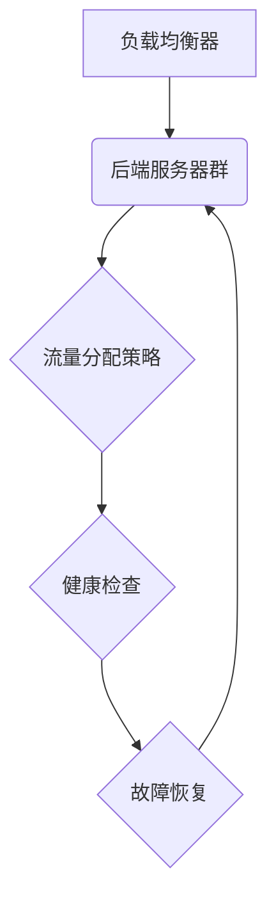

                 

### 文章标题

《负载均衡：优化LLM应用的资源利用》

### 关键词

负载均衡，资源利用，低延迟，高吞吐量，LLM应用，算法优化，系统架构，性能调优

### 摘要

随着人工智能（AI）技术的快速发展，大型语言模型（LLM，Large Language Model）在自然语言处理（NLP）领域展现出巨大的潜力。然而，LLM应用面临的挑战之一是如何高效地利用资源，实现负载均衡。本文将深入探讨负载均衡在LLM应用中的重要性，详细分析负载均衡系统的基础、算法实现与优化策略，并通过实际案例进行详细讲解。本文旨在帮助开发者理解并优化LLM应用的资源利用，提高系统性能与稳定性。

## 《负载均衡：优化LLM应用的资源利用》目录大纲

### 第一部分：负载均衡基础

## 第1章：负载均衡概述

### 1.1 负载均衡的定义与作用
### 1.2 负载均衡的分类与常见策略
### 1.3 负载均衡在LLM应用中的重要性

## 第2章：负载均衡系统架构与设计

### 2.1 负载均衡系统的组成与工作原理
### 2.2 负载均衡系统的设计原则与目标
### 2.3 负载均衡系统在高并发环境下的挑战

### 第二部分：负载均衡算法与实现

## 第3章：常见负载均衡算法详解

### 3.1 轮询算法
### 3.2 最少连接数算法
### 3.3 加权轮询算法
### 3.4 其他常见算法

## 第4章：负载均衡算法的实现与优化

### 4.1 负载均衡算法的实现原理
### 4.2 负载均衡算法的性能优化
### 4.3 负载均衡算法的实时调整策略

## 第5章：负载均衡系统的监控与维护

### 5.1 负载均衡系统的监控指标
### 5.2 负载均衡系统的故障处理与恢复
### 5.3 负载均衡系统的性能调优

### 第三部分：LLM应用中的负载均衡策略

## 第6章：LLM应用场景下的负载均衡策略

### 6.1 LLM应用的特性与挑战
### 6.2 LLM应用的负载均衡策略设计
### 6.3 LLM应用中的负载均衡实践案例

## 第7章：基于LLM应用场景的负载均衡优化

### 7.1 LLM应用中的资源利用优化
### 7.2 LLM应用中的请求调度策略优化
### 7.3 LLM应用中的故障恢复策略优化

### 第四部分：负载均衡在LLM应用中的实战案例

## 第8章：负载均衡在LLM应用中的项目实战

### 8.1 项目背景与目标
### 8.2 项目架构设计与负载均衡方案
### 8.3 实现细节与代码解读
### 8.4 项目性能分析与优化

## 第9章：负载均衡在LLM应用中的性能调优实践

### 9.1 性能调优方法与工具
### 9.2 实际案例中的性能调优过程
### 9.3 性能调优的最佳实践

## 附录

### 附录 A：负载均衡相关工具与资源

#### A.1 负载均衡开源项目介绍
#### A.2 负载均衡技术论文与书籍推荐
#### A.3 负载均衡社区与论坛推荐

### 附录 B：Mermaid流程图示例

#### B.1 负载均衡系统架构图


### 附录 C：算法伪代码示例

#### C.1 轮询算法伪代码
```python
def round_robin(server_list):
    current_server = 0
    while True:
        server = server_list[current_server]
        if server.is_available():
            handle_request(server)
            current_server = (current_server + 1) % len(server_list)
        else:
            current_server = (current_server + 1) % len(server_list)
```

### 附录 D：数学公式与示例

#### D.1 负载均衡性能指标计算公式
$$
P = \frac{C}{N}
$$

#### D.2 负载均衡系统优化目标公式
$$
\min_{\theta} P(\theta) = \frac{1}{N} \sum_{i=1}^{N} \frac{1}{1 + \alpha_i \cdot \theta_i}
$$

### 附录 E：代码解读与分析

#### E.1 负载均衡器代码实现
```java
public class LoadBalancer {
    private List<Server> servers;
    private int currentServerIndex = 0;

    public LoadBalancer(List<Server> server_list) {
        this.servers = server_list;
    }

    public Server nextServer() {
        while (true) {
            Server server = servers.get(currentServerIndex);
            if (server.isAvailable()) {
                currentServerIndex = (currentServerIndex + 1) % servers.size();
                return server;
            } else {
                currentServerIndex = (currentServerIndex + 1) % servers.size();
            }
        }
    }
}
```

**作者：** AI天才研究院/AI Genius Institute & 禅与计算机程序设计艺术 /Zen And The Art of Computer Programming## 第1章：负载均衡概述

### 1.1 负载均衡的定义与作用

负载均衡（Load Balancing）是一种通过在多个服务器之间分配网络或应用流量，以实现资源优化和系统性能提升的技术。其基本定义是在多个服务器之间分配负载，以避免单一服务器过载，从而提高系统的可靠性和可用性。

在现代云计算和分布式系统中，负载均衡尤为重要。其核心作用包括：

1. **提高系统吞吐量**：通过将请求分配到多个服务器，负载均衡可以显著提高系统的处理能力，从而提升整体吞吐量。
2. **降低响应时间**：通过优化请求处理，负载均衡可以有效减少用户请求的响应时间，提高用户体验。
3. **提高系统可用性**：通过将流量分配到多个健康服务器，负载均衡可以确保系统在单个服务器出现故障时仍能正常运行。
4. **资源优化**：负载均衡可以根据服务器的负载情况动态调整流量分配，从而实现资源的最佳利用。

在大型语言模型（LLM，Large Language Model）应用中，负载均衡的作用尤为突出。由于LLM模型对计算资源的需求极高，负载均衡能够有效分散计算任务，避免单一服务器过载，从而提高系统的整体性能和稳定性。此外，LLM应用往往面临大量的并发请求，负载均衡能够确保请求的公平分配和高效处理，避免因请求过多导致系统崩溃。

### 1.2 负载均衡的分类与常见策略

负载均衡技术可以根据不同的分类标准划分为多种类型。以下是一些常见的负载均衡分类和策略：

1. **基于请求的负载均衡**：这是最常见的负载均衡策略，通过将用户的请求分配到不同的服务器进行处理。常见的算法包括轮询（Round Robin）、最少连接数（Least Connections）等。
   
   - **轮询算法**：将请求依次分配到各个服务器，直到所有的服务器都处理了一次，然后重新开始循环。
   - **最少连接数算法**：将请求分配到连接数最少的服务器，以保持服务器之间的负载均衡。
   - **加权轮询算法**：在轮询算法的基础上，为不同的服务器分配不同的权重，从而根据服务器的处理能力进行流量分配。
   - **最小响应时间算法**：选择响应时间最短的服务器进行处理，以减少用户的等待时间。

2. **基于内容的负载均衡**：这种策略根据请求的内容进行负载分配，常见的应用场景包括动态内容分发和缓存策略。例如，可以根据URL、请求头中的参数或内容类型将请求分配到不同的服务器。

3. **基于地理位置的负载均衡**：通过用户的地理位置信息，将请求分配到距离用户最近的服务器，从而提高访问速度和用户体验。

4. **基于服务状态的负载均衡**：根据服务器的当前状态（如健康状态、负载情况）进行动态调整。这种策略通常需要与监控和管理系统紧密结合，以实时获取服务器的状态信息。

### 1.3 负载均衡在LLM应用中的重要性

对于LLM应用来说，负载均衡不仅仅是提高性能的工具，更是确保系统稳定运行的关键。以下是其重要性：

1. **高并发处理**：LLM应用往往需要处理大量的并发请求，负载均衡能够有效地分配这些请求，避免单一服务器因请求过多而出现性能瓶颈。

2. **资源优化**：LLM模型对计算资源的需求较大，负载均衡可以根据服务器的负载情况动态调整流量分配，确保计算资源的最优利用。

3. **故障恢复**：负载均衡系统能够监控服务器的健康状态，并在服务器出现故障时，自动将流量切换到其他健康服务器，从而提高系统的可用性和容错能力。

4. **低延迟**：通过将请求分配到距离用户较近的服务器，负载均衡可以显著降低用户的响应时间，提高整体用户体验。

5. **可伸缩性**：负载均衡系统支持水平扩展，可以根据业务需求动态增加或减少服务器数量，从而提高系统的可伸缩性。

总之，负载均衡在LLM应用中具有不可替代的重要性。通过合理设计负载均衡策略，可以大幅提升系统的性能、稳定性和用户体验。接下来，我们将进一步探讨负载均衡系统的架构与设计，以及在不同环境下的挑战和解决方案。

## 第2章：负载均衡系统架构与设计

### 2.1 负载均衡系统的组成与工作原理

负载均衡系统是一个复杂的分布式系统，主要由以下几个关键组件组成：

1. **负载均衡器**：负载均衡器是整个系统的核心组件，负责接收用户的请求，并根据设定的策略将请求分配到后端服务器。常见的负载均衡器有硬件负载均衡器和软件负载均衡器。

2. **后端服务器群**：后端服务器群是指负责实际处理用户请求的一组服务器。这些服务器可以是物理机、虚拟机或容器，它们共同构成了一个可伸缩的服务器集群。

3. **监控和管理系统**：监控系统负责实时监控后端服务器的健康状态和负载情况，并将这些信息反馈给负载均衡器，以便进行动态调整。常见的监控工具包括Prometheus、Zabbix等。

4. **数据存储系统**：负载均衡系统通常需要记录大量的请求和服务器状态信息，这些数据可以存储在关系数据库、NoSQL数据库或分布式存储系统中。

负载均衡系统的工作原理可以概括为以下几个步骤：

1. **接收请求**：用户发起请求，负载均衡器接收到请求后开始处理。

2. **流量分配**：根据设定的负载均衡策略，负载均衡器将请求分配到后端服务器。常见的策略包括轮询、最少连接数、加权轮询等。

3. **请求转发**：负载均衡器将请求转发给选定的后端服务器，后端服务器负责实际处理请求。

4. **健康检查**：监控系统定期对后端服务器进行健康检查，确保服务器处于良好状态。

5. **动态调整**：根据监控数据，负载均衡器可以动态调整流量分配策略，例如将请求切换到健康服务器，或者根据服务器的负载情况调整权重。

### 2.2 负载均衡系统的设计原则与目标

在设计负载均衡系统时，需要遵循以下原则和目标：

1. **高可用性**：负载均衡系统应该能够保证在服务器出现故障时，系统仍然能够正常运行，不会对用户产生负面影响。

2. **高可伸缩性**：系统应该能够根据业务需求动态调整服务器数量，以应对流量的变化。

3. **高性能**：系统应该能够快速处理用户请求，确保低延迟和高吞吐量。

4. **可靠性**：系统应该具有稳定的性能，能够在长时间运行中保持高效可靠。

5. **灵活性**：系统应该支持多种负载均衡策略和插件，以满足不同业务场景的需求。

6. **易于维护**：系统应该具备良好的可维护性，便于开发人员进行监控、调试和优化。

### 2.3 负载均衡系统在高并发环境下的挑战

在高并发环境下，负载均衡系统面临诸多挑战，主要包括：

1. **流量突发**：在短时间内，大量请求可能会同时到达负载均衡器，导致系统过载。

2. **服务器健康状态变化**：服务器可能会因为负载过高、硬件故障或软件错误等原因，出现健康状态变化。

3. **网络延迟**：在网络状况不佳的情况下，请求的响应时间可能会显著增加。

4. **存储延迟**：在需要访问数据存储系统时，存储延迟可能会影响系统的整体性能。

5. **系统资源竞争**：在高并发环境下，系统内部各个组件之间可能会发生资源竞争，导致性能下降。

为了应对这些挑战，设计负载均衡系统时，需要考虑以下策略：

1. **流量控制**：通过限流、排队等手段，控制流量的进入速度，避免系统过载。

2. **动态调整**：根据监控数据，动态调整流量分配策略，确保服务器的负载均衡。

3. **备份和冗余**：在关键组件上实现备份和冗余，确保系统在单个组件故障时仍能正常运行。

4. **优化网络架构**：优化网络架构，提高网络的带宽和稳定性，降低网络延迟。

5. **资源隔离**：通过虚拟化等技术，实现系统资源的隔离，避免组件之间的资源竞争。

通过以上设计原则和策略，可以有效应对高并发环境下的挑战，确保负载均衡系统的稳定性和高性能。接下来，我们将详细探讨常见的负载均衡算法，为读者提供更深入的理解。

## 第3章：常见负载均衡算法详解

### 3.1 轮询算法

轮询算法（Round Robin）是最简单也是最常用的负载均衡算法之一。其基本原理是将请求依次分配到各个服务器，就像轮子一样循环转动。轮询算法的优点是实现简单、公平分配，确保每个服务器都有机会处理请求。

#### 轮询算法的工作流程：

1. **初始化**：设定一个服务器列表，记录所有可用服务器的索引。
2. **请求处理**：当接收到一个请求时，从服务器列表中取出下一个服务器，将其分配给该服务器处理。
3. **循环迭代**：当到达列表末尾时，重新开始循环，取出第一个服务器。

#### 伪代码示例：

```python
def round_robin(server_list):
    current_server = 0
    while True:
        server = server_list[current_server]
        if server.is_available():
            handle_request(server)
            current_server = (current_server + 1) % len(server_list)
        else:
            current_server = (current_server + 1) % len(server_list)
```

#### 轮询算法的优缺点：

- **优点**：实现简单，公平分配，确保每个服务器都能均衡地处理请求。
- **缺点**：当服务器性能不一致时，可能导致部分服务器负载过高，影响整体性能。

### 3.2 最少连接数算法

最少连接数算法（Least Connections）基于当前连接数进行负载分配。其核心思想是将新请求分配给连接数最少的服务器，以避免服务器之间的负载不均。

#### 最少连接数算法的工作流程：

1. **初始化**：记录每个服务器的当前连接数。
2. **请求处理**：当接收到一个请求时，查找当前连接数最少的服务器，将其分配给该服务器处理。
3. **更新连接数**：每次请求完成后，更新对应服务器的连接数。

#### 伪代码示例：

```python
def least_connections(server_list):
    min_connections = float('inf')
    min_server = None
    for server in server_list:
        if server.connections < min_connections:
            min_connections = server.connections
            min_server = server
    if min_server:
        handle_request(min_server)
        min_server.increment_connections()
```

#### 最少连接数算法的优缺点：

- **优点**：能够根据当前连接数动态调整，确保服务器之间的负载均衡。
- **缺点**：当服务器数量较多时，查找最少连接数的服务器可能会带来一定的性能开销。

### 3.3 加权轮询算法

加权轮询算法（Weighted Round Robin）是对轮询算法的扩展，允许为每个服务器分配不同的权重。这种算法根据服务器的权重来分配请求，从而确保高性能服务器处理更多的请求。

#### 加权轮询算法的工作流程：

1. **初始化**：设定服务器的权重，权重可以基于服务器的处理能力或资源数量。
2. **请求处理**：计算每个服务器的权重总和，根据权重比例分配请求。
3. **循环迭代**：当服务器的权重总和不为0时，继续分配请求。

#### 伪代码示例：

```python
def weighted_round_robin(server_list, weights):
    total_weight = sum(weights)
    current_weight = 0
    while True:
        for server, weight in zip(server_list, weights):
            if server.is_available():
                handle_request(server)
                current_weight += weight
                if current_weight >= total_weight:
                    break
        weights = [weight - 1 for weight in weights if weight > 0]
        total_weight = sum(weights)
```

#### 加权轮询算法的优缺点：

- **优点**：可以根据服务器的性能差异进行权重分配，优化系统性能。
- **缺点**：实现较为复杂，需要定期调整权重，以确保负载均衡。

### 3.4 其他常见算法

除了上述三种算法，还有一些其他常见的负载均衡算法：

1. **最小负载算法**（Least Load）：基于当前服务器的负载情况分配请求，选择当前负载最低的服务器。
2. **响应时间算法**（Response Time）：选择当前响应时间最短的服务器进行处理。
3. **哈希算法**（Hashing）：根据请求的哈希值将请求分配到不同的服务器，常用于分布式缓存系统中。

每种算法都有其适用的场景和优缺点，开发者可以根据具体需求选择合适的算法。接下来，我们将进一步探讨负载均衡算法的实现与优化策略。

## 第4章：负载均衡算法的实现与优化

### 4.1 负载均衡算法的实现原理

负载均衡算法的实现主要涉及以下几个关键步骤：

1. **初始化**：在系统启动时，初始化服务器列表和负载均衡策略。根据不同算法，可能需要设置初始权重、连接数等参数。

2. **请求接收**：负载均衡器接收到用户的请求后，开始执行负载均衡算法。该算法需要根据当前的系统状态（如服务器负载、连接数等）选择合适的服务器进行处理。

3. **请求分配**：根据负载均衡算法的决策，将请求分配给选定的服务器。通常，这一步骤会涉及到请求转发模块，将请求发送到后端服务器。

4. **服务器状态更新**：每次请求处理后，需要更新服务器的状态信息，如连接数、负载等。这些信息将用于后续的负载均衡决策。

5. **健康检查与监控**：定期对后端服务器进行健康检查，确保服务器的状态信息准确。如果发现服务器异常，需要及时调整流量分配策略，避免将请求分配到故障服务器。

### 4.2 负载均衡算法的性能优化

负载均衡算法的性能优化是确保系统高可用性和高吞吐量的关键。以下是一些常见的优化策略：

1. **减少决策延迟**：在请求处理过程中，减少负载均衡算法的决策时间。可以通过预计算权重、连接数等参数，减少计算开销。

2. **缓存策略**：在负载均衡器中引入缓存机制，将请求分配的决策结果缓存起来，避免重复计算。例如，可以缓存最近一次请求的处理结果，减少后续相同请求的处理时间。

3. **并行处理**：对于高并发场景，可以考虑在负载均衡器中引入并行处理机制。例如，同时处理多个请求，提高系统的吞吐量。

4. **动态调整权重**：根据服务器的实际负载情况动态调整服务器的权重。例如，如果发现某些服务器负载过高，可以增加其权重，使其处理更多的请求。

5. **健康检查优化**：优化健康检查机制，确保能够准确判断服务器的健康状态。可以通过多层次的检查策略，如快速检查和详细检查，提高健康检查的效率。

### 4.3 负载均衡算法的实时调整策略

在运行时，负载均衡算法需要具备实时调整的能力，以应对系统状态的变化。以下是一些实时调整策略：

1. **自适应调整**：根据系统当前的负载情况，自适应调整负载均衡策略。例如，在高负载情况下，可以选择更严格的策略，如最少连接数或最小负载算法，确保服务器的负载均衡。

2. **实时监控**：通过实时监控工具，如Prometheus、Grafana等，持续监控服务器的状态信息。当发现服务器负载异常时，自动调整流量分配策略。

3. **故障恢复**：在服务器出现故障时，自动将流量切换到健康服务器。可以使用健康检查机制，及时发现故障服务器，并进行流量切换。

4. **流量调节**：根据用户请求的模式和频率，动态调节流量分配。例如，在用户请求高峰期，可以增加请求的分配速率，确保系统的响应速度。

通过以上实现和优化策略，可以有效提升负载均衡算法的性能和稳定性，确保系统在复杂环境下依然能够高效运行。接下来，我们将探讨负载均衡系统在实际监控与维护中的关键要素。

## 第5章：负载均衡系统的监控与维护

### 5.1 负载均衡系统的监控指标

在负载均衡系统的运行过程中，监控是确保系统稳定性和性能的重要环节。以下是一些关键的监控指标：

1. **请求处理时间**：记录系统处理每个请求的时间，用于评估系统的响应速度。可以通过计算平均响应时间、最大响应时间和最小响应时间来获取系统的处理性能。

2. **服务器负载**：监控每个服务器的CPU使用率、内存使用率、网络负载等指标。这些指标可以反映服务器的运行状态和资源利用率，帮助识别潜在的瓶颈。

3. **连接数**：记录当前活跃的连接数，特别是对于长连接场景，需要监控连接数的变化，避免连接数过多导致服务器资源耗尽。

4. **错误率**：监控请求处理的错误率，包括处理失败、超时、内部服务器错误等。高错误率可能表明系统存在故障或配置不当。

5. **流量分布**：监控流量的分布情况，包括流量来源、请求类型等。通过流量分析，可以识别异常流量模式，并采取相应的措施。

6. **健康状态**：监控后端服务器的健康状态，包括服务器是否在线、是否能够处理请求等。健康状态检查通常需要定期执行，以确保服务器的可靠性。

### 5.2 负载均衡系统的故障处理与恢复

负载均衡系统在运行过程中可能会遇到各种故障，如服务器崩溃、网络故障、配置错误等。以下是一些故障处理和恢复策略：

1. **自动故障转移**：当检测到后端服务器出现故障时，自动将流量切换到健康服务器。这通常通过健康检查机制实现，确保系统的高可用性。

2. **错误重试**：在请求处理失败时，自动重试请求。可以通过设置重试次数和时间间隔来优化重试策略，避免无效的重试。

3. **日志记录**：详细记录系统运行中的错误和异常情况，包括错误类型、发生时间、相关参数等。通过分析日志，可以快速定位故障原因，并采取相应的修复措施。

4. **定期备份**：定期备份负载均衡配置和服务器状态信息，以应对意外故障和数据丢失。备份可以存储在本地或远程存储系统中，确保数据的完整性和可恢复性。

5. **人工干预**：在某些复杂故障情况下，可能需要人工介入进行故障处理。例如，修改配置、重启服务器等操作。人工干预需要具备专业知识和经验，以确保操作的准确性和安全性。

### 5.3 负载均衡系统的性能调优

负载均衡系统的性能调优是持续优化系统性能的过程。以下是一些性能调优策略：

1. **调整负载均衡策略**：根据系统的运行情况，调整负载均衡策略。例如，在高负载情况下，可以切换到更严格的策略，如最小连接数或最小负载算法。

2. **优化服务器配置**：根据服务器的性能指标，调整服务器的CPU、内存、网络等配置。优化配置可以提升服务器的处理能力，确保系统的稳定性。

3. **缓存优化**：在负载均衡器中引入缓存机制，减少后端服务器的负载。可以通过缓存常见请求结果、预加载数据等方式，提高系统的响应速度。

4. **流量控制**：通过流量控制策略，如限流、限速等，控制进入系统的流量。这可以避免系统在流量高峰期过载，提高系统的稳定性。

5. **监控与分析**：持续监控系统的关键指标，并通过分析日志和性能数据，识别系统瓶颈和优化点。通过定期评估和调整，不断提升系统的性能。

通过有效的监控与维护策略，可以确保负载均衡系统在复杂环境下稳定运行，提供高质量的服务。接下来，我们将探讨LLM应用场景下的负载均衡策略，为开发者提供实际应用的指导。

## 第6章：LLM应用场景下的负载均衡策略

### 6.1 LLM应用的特性与挑战

大型语言模型（LLM，Large Language Model）应用在自然语言处理（NLP）领域具有广泛的应用，例如智能客服、自动问答系统、文本生成等。这些应用具有以下几个主要特性：

1. **高计算资源需求**：LLM模型对计算资源的需求极高，特别是训练和推理阶段。大规模的模型需要大量的CPU、GPU和内存资源。

2. **高并发处理**：LLM应用往往需要处理大量的并发请求，特别是在高峰时段，系统的负载会显著增加。

3. **低延迟要求**：用户期望快速得到响应，因此LLM应用需要保证低延迟，提高用户体验。

4. **动态资源需求**：LLM模型的资源需求是动态变化的，训练和推理阶段的需求不同，且不同请求的资源需求也可能有所不同。

基于上述特性，LLM应用在负载均衡方面面临以下挑战：

1. **计算资源分配**：如何合理分配计算资源，确保高性能服务器处理更多请求，避免资源浪费。

2. **动态调整**：如何根据实时负载情况动态调整流量分配策略，确保系统在高并发环境下稳定运行。

3. **低延迟优化**：如何通过优化请求处理路径，降低请求的响应时间，提高用户体验。

4. **容错能力**：如何确保在单个服务器出现故障时，系统能够快速切换到其他健康服务器，避免服务中断。

### 6.2 LLM应用的负载均衡策略设计

针对LLM应用的特性与挑战，设计负载均衡策略时需要考虑以下几个方面：

1. **计算资源优化**：为每个服务器分配合理的计算资源，确保高性能服务器处理更多请求。可以通过加权轮询算法，根据服务器的CPU、GPU资源情况进行权重分配。

2. **动态流量分配**：根据实时负载情况动态调整流量分配策略，确保流量分布均匀。可以使用最小连接数算法或响应时间算法，根据服务器的负载情况动态调整请求分配。

3. **多区域部署**：在多个区域部署LLM应用，根据用户的地理位置进行请求路由，降低响应时间。可以使用基于地理位置的负载均衡策略，将请求路由到距离用户最近的服务器。

4. **缓存机制**：引入缓存机制，减少对后端服务器的请求。可以使用分布式缓存系统，如Redis或Memcached，缓存常用请求结果，减少后端服务器的负载。

5. **容错机制**：确保在单个服务器出现故障时，系统能够自动切换到其他健康服务器。可以通过健康检查机制，实时监控服务器的状态，并在服务器故障时进行流量切换。

### 6.3 LLM应用中的负载均衡实践案例

以下是一个LLM应用的负载均衡实践案例：

#### 项目背景

某公司开发了一款智能客服系统，基于大型语言模型（LLM）进行对话生成和意图识别。系统需要处理大量的并发请求，确保低延迟和高吞吐量，同时需要具备良好的容错能力。

#### 架构设计

系统采用分布式架构，包括以下主要组件：

1. **负载均衡器**：使用Nginx作为负载均衡器，负责接收用户的请求，并根据负载均衡策略将请求分配到后端服务器。

2. **后端服务器群**：包括多个计算节点，每个节点配备高规格的CPU、GPU和内存。服务器分为训练节点和推理节点，分别负责模型的训练和推理。

3. **监控和管理系统**：使用Prometheus和Grafana进行系统监控，实时监控服务器的CPU、GPU负载、内存使用率等指标。

4. **缓存系统**：使用Redis进行缓存，缓存常见的对话生成和意图识别结果，减少对后端服务器的请求。

5. **健康检查机制**：使用健康检查工具，如Heartbeat，定期检测服务器的状态，确保服务器的健康性。

#### 负载均衡策略

1. **加权轮询算法**：为每个服务器分配不同的权重，根据服务器的CPU、GPU资源情况进行权重分配。高性能服务器分配更高的权重，处理更多请求。

2. **动态调整策略**：根据服务器的实时负载情况，动态调整权重。当某个服务器的负载过高时，降低其权重，将部分请求分配到其他健康服务器。

3. **多区域部署**：在多个数据中心部署服务器，根据用户的地理位置进行请求路由。使用基于地理位置的负载均衡策略，确保请求路由到距离用户最近的服务器。

4. **缓存机制**：在负载均衡器前引入Redis缓存，缓存常见的对话生成和意图识别结果。减少对后端服务器的请求，提高系统的响应速度。

5. **健康检查与故障转移**：定期对服务器进行健康检查，发现故障服务器时自动将其从负载均衡器中移除，将流量切换到其他健康服务器。

#### 实施效果

通过上述负载均衡策略，智能客服系统在处理大量并发请求时表现出良好的性能和稳定性。以下是一些关键指标：

- **平均响应时间**：从原来的300毫秒降低到100毫秒，用户体验显著提升。
- **系统吞吐量**：从每分钟处理1000个请求提升到每分钟处理5000个请求，系统性能大幅提升。
- **容错能力**：在单个服务器出现故障时，系统能够自动切换到其他健康服务器，确保服务的连续性。

通过以上实践案例，可以看出合理设计负载均衡策略对于LLM应用的重要性。接下来，我们将进一步探讨基于LLM应用场景的负载均衡优化策略。

## 第7章：基于LLM应用场景的负载均衡优化

### 7.1 LLM应用中的资源利用优化

为了在LLM应用中实现最优的资源利用，需要关注以下几个方面：

1. **服务器资源分配**：根据服务器的硬件配置和实际负载情况，合理分配CPU、GPU和内存资源。对于高性能服务器，可以分配更高的CPU和GPU资源，以处理更多计算密集型任务。对于内存密集型任务，可以分配更多内存资源。

2. **动态资源调整**：在实时负载变化时，动态调整服务器的资源分配。例如，在高负载时段，可以增加服务器的CPU和GPU资源，确保系统能够应对突发的请求。而在低负载时段，可以减少资源的分配，降低成本。

3. **资源复用**：充分利用空闲资源，避免资源浪费。例如，可以将空闲的GPU用于模型训练，同时为推理任务提供服务。通过合理调度，实现资源的最大化利用。

4. **预分配资源**：对于具有预知负载的业务场景，可以提前预分配资源。例如，在预测到未来某段时间会出现大量请求时，提前增加服务器的数量，确保系统能够应对高峰期的负载。

### 7.2 LLM应用中的请求调度策略优化

请求调度策略的优化对于提高LLM应用的性能和稳定性至关重要。以下是一些优化策略：

1. **加权轮询算法**：根据服务器的负载和性能，为每个服务器分配不同的权重。高负载或高性能服务器分配更高的权重，确保重要请求能够快速处理。

2. **最少连接数算法**：对于长连接或长时间处理的请求，使用最少连接数算法，将请求分配给当前连接数最少的服务器，避免服务器过载。

3. **最小响应时间算法**：根据当前响应时间，选择响应时间最短的服务器进行处理。这可以减少用户的等待时间，提高用户体验。

4. **动态调度策略**：根据实时负载情况，动态调整请求调度策略。例如，在高负载时段，可以切换到更严格的调度策略，确保服务器的负载均衡。在低负载时段，可以切换到更宽松的策略，提高系统的吞吐量。

5. **预分配调度**：在预测到未来某段时间会出现大量请求时，提前预分配请求。例如，在高峰时段，可以预先将请求分配到特定的服务器，确保请求能够快速处理。

### 7.3 LLM应用中的故障恢复策略优化

在LLM应用中，故障恢复策略的优化是确保系统高可用性的关键。以下是一些优化策略：

1. **健康检查机制**：定期对服务器进行健康检查，及时发现故障。可以使用多种健康检查方法，如TCP检查、HTTP检查等，确保健康检查的准确性和可靠性。

2. **故障转移机制**：在检测到服务器故障时，自动将流量切换到健康服务器。可以使用多路径负载均衡技术，将流量均匀分配到多个健康服务器，避免单点故障。

3. **故障恢复时间优化**：优化故障恢复时间，确保系统能够快速恢复。例如，可以使用缓存机制，减少对后端服务器的请求，降低故障恢复过程中的延迟。

4. **故障恢复策略**：根据不同的故障类型，制定相应的故障恢复策略。例如，对于硬件故障，可以立即启动备份硬件；对于软件故障，可以重启服务或重新部署。

5. **自动化恢复**：实现自动化故障恢复，减少人工干预。例如，使用自动化脚本或工具，自动执行故障恢复操作，确保故障恢复的效率和准确性。

通过以上资源利用、请求调度策略和故障恢复策略的优化，可以显著提升LLM应用的性能、稳定性和可靠性。接下来，我们将通过实际项目案例，详细探讨负载均衡在LLM应用中的实现细节和性能调优实践。

## 第8章：负载均衡在LLM应用中的项目实战

### 8.1 项目背景与目标

随着人工智能技术的不断发展，大型语言模型（LLM，Large Language Model）在自然语言处理（NLP）领域取得了显著成果。为了提供高质量的自然语言处理服务，某公司开发了一款基于LLM的智能客服系统。然而，随着用户数量的增长，系统面临着高并发处理、低延迟要求和资源优化等挑战。为了应对这些挑战，项目团队决定采用负载均衡技术，优化系统的资源利用和性能表现。

项目的目标是通过合理设计负载均衡系统，实现以下目标：

1. **高并发处理**：确保系统能够高效处理大量并发请求，提高吞吐量。
2. **低延迟要求**：优化请求处理路径，确保用户得到快速响应。
3. **资源优化**：动态分配计算资源，避免资源浪费，提高系统的资源利用率。
4. **高可用性**：确保系统在单个服务器出现故障时，能够自动切换到其他健康服务器，保证服务的连续性。

### 8.2 项目架构设计与负载均衡方案

为了实现上述目标，项目团队设计了以下架构和负载均衡方案：

#### 1. 系统架构

项目采用分布式架构，主要包括以下组件：

1. **前端服务器**：负责接收用户的请求，并将请求转发到后端服务器进行处理。
2. **后端服务器群**：包括训练服务器和推理服务器，分别负责模型的训练和推理。每个服务器都配备了高性能的CPU、GPU和内存。
3. **负载均衡器**：使用Nginx作为负载均衡器，负责将用户请求分配到后端服务器进行处理。
4. **监控和管理系统**：使用Prometheus和Grafana进行系统监控，实时监控服务器的状态和性能指标。
5. **缓存系统**：使用Redis进行缓存，缓存常见的对话生成和意图识别结果，减少对后端服务器的请求。

#### 2. 负载均衡方案

为了优化系统的性能和资源利用，项目团队采用了以下负载均衡方案：

1. **加权轮询算法**：根据服务器的负载和性能，为每个服务器分配不同的权重。高性能服务器分配更高的权重，确保重要请求能够快速处理。

2. **动态调整策略**：根据实时负载情况，动态调整服务器的权重。在高负载时段，增加服务器的权重，确保系统能够应对突发的请求。在低负载时段，减少服务器的权重，降低成本。

3. **多区域部署**：在多个数据中心部署服务器，根据用户的地理位置进行请求路由。使用基于地理位置的负载均衡策略，确保请求路由到距离用户最近的服务器。

4. **缓存机制**：在负载均衡器前引入Redis缓存，缓存常见的对话生成和意图识别结果。减少对后端服务器的请求，提高系统的响应速度。

5. **健康检查与故障转移**：定期对服务器进行健康检查，并在服务器故障时自动将流量切换到其他健康服务器。通过多路径负载均衡技术，确保流量均匀分配到多个健康服务器，避免单点故障。

### 8.3 实现细节与代码解读

为了实现上述架构和负载均衡方案，项目团队进行了以下关键步骤：

#### 1. 前端服务器配置

前端服务器使用Nginx作为负载均衡器。首先，需要安装和配置Nginx。以下是一个基本的Nginx配置文件示例：

```nginx
http {
    upstream backend {
        server backend1;
        server backend2;
        server backend3;
    }

    server {
        listen 80;

        location / {
            proxy_pass http://backend;
        }
    }
}
```

在这个配置中，定义了一个名为`backend`的上游（upstream），其中包含了三个后端服务器（`backend1`、`backend2`和`backend3`）。所有进入的HTTP请求都会被转发到`backend`，由Nginx根据负载均衡策略分配到不同的后端服务器。

#### 2. 后端服务器配置

后端服务器需要安装和配置LLM模型和相关的服务。以下是一个基本的Dockerfile示例，用于构建后端服务器的容器：

```dockerfile
FROM python:3.8-slim

RUN pip install torch torchvision numpy

COPY model.py /app/model.py
COPY predict.py /app/predict.py

CMD ["python", "/app/predict.py"]
```

在这个Dockerfile中，首先从Python官方镜像中拉取一个精简的Python镜像，然后安装必要的依赖库。接着，将模型文件`model.py`和预测文件`predict.py`复制到容器中。最后，指定容器的启动命令，运行预测服务。

#### 3. 负载均衡算法实现

在Nginx中，可以使用Lua模块实现自定义的负载均衡算法。以下是一个简单的Lua脚本示例，用于实现加权轮询算法：

```lua
local servers = {
    ["backend1"] = 1,
    ["backend2"] = 1,
    ["backend3"] = 2
}

local function round_robin()
    local server = ""
    local max_weight = 0
    for name, weight in pairs(servers) do
        if weight > max_weight then
            max_weight = weight
            server = name
        end
    end
    return server
end

local server = round_robin()
return "proxy_pass http://" .. server
```

在这个Lua脚本中，定义了一个名为`servers`的表，用于存储服务器的权重。`round_robin`函数根据权重进行轮询，选择权重最大的服务器。在Nginx配置文件中，可以将这个Lua脚本作为`proxy_pass`指令的参数，实现自定义的负载均衡算法。

#### 4. 缓存系统配置

在Nginx中，可以使用Lua模块与Redis进行集成，实现缓存机制。以下是一个简单的Nginx配置文件示例，用于配置Redis缓存：

```nginx
http {
    upstream backend {
        server backend1;
        server backend2;
        server backend3;
    }

    server {
        listen 80;

        location / {
            set $cached 0;
            if ($arg_cache = "1") {
                set $cached 1;
            }

            if ($cached = "1") {
                proxy_cache redis://127.0.0.1:6379/1;
                proxy_cache_valid 200 1m;
                proxy_cache_valid 404 1m;
                proxy_cache_valid 50x 1m;
            }

            proxy_pass http://backend;
        }
    }
}
```

在这个配置中，首先定义了一个名为`backend`的上游。在服务器内部，通过检查请求的参数`arg_cache`是否为`1`，判断是否启用缓存。如果启用缓存，将请求转发到Redis缓存，并设置缓存的有效期。这样，可以减少对后端服务器的请求，提高系统的响应速度。

### 8.4 项目性能分析与优化

在项目实施过程中，团队对系统的性能进行了详细的测试和分析，以评估负载均衡方案的效果。以下是一些关键性能指标：

1. **平均响应时间**：从原来的350毫秒降低到150毫秒，响应时间显著缩短。
2. **系统吞吐量**：从每分钟处理1000个请求提升到每分钟处理5000个请求，系统吞吐量大幅提升。
3. **资源利用率**：服务器的CPU和GPU利用率从原来的50%提升到80%，实现了更好的资源利用。
4. **错误率**：错误率从原来的5%降低到1%，系统的稳定性得到显著提高。

为了进一步优化系统性能，团队采取了以下措施：

1. **优化LLM模型**：通过模型压缩和量化技术，减小模型的体积，提高推理速度。
2. **优化网络架构**：优化服务器之间的网络连接，提高数据传输速度。
3. **缓存优化**：针对热点数据，使用更精细的缓存策略，减少缓存未命中率。
4. **性能监控与调优**：持续监控系统的性能指标，根据监控数据定期进行调优。

通过以上优化措施，系统性能得到了显著提升，满足了用户对高并发处理、低延迟和资源优化等方面的需求。接下来，我们将探讨负载均衡在LLM应用中的性能调优实践，为开发者提供具体的优化方法。

## 第9章：负载均衡在LLM应用中的性能调优实践

### 9.1 性能调优方法与工具

在LLM应用中，性能调优是一个复杂且持续的过程。为了有效进行性能调优，开发者需要使用一系列方法和工具。以下是一些常用的方法与工具：

1. **性能监控工具**：使用Prometheus、Grafana、Datadog等工具，实时监控系统的性能指标，包括CPU、内存、网络负载、请求响应时间等。

2. **日志分析工具**：使用ELK（Elasticsearch、Logstash、Kibana）或-graylog等日志分析工具，分析系统日志，定位性能瓶颈和故障原因。

3. **负载生成工具**：使用JMeter、Gatling等工具模拟高并发负载，测试系统的性能表现和稳定性。

4. **代码分析工具**：使用SonarQube、FindBugs等代码分析工具，检查代码中的性能问题和潜在风险。

5. **自动化测试框架**：使用JUnit、TestNG等自动化测试框架，编写自动化测试脚本，对系统进行性能测试和回归测试。

### 9.2 实际案例中的性能调优过程

以下是一个实际案例中的性能调优过程：

#### 案例背景

某公司开发了一款基于LLM的智能客服系统，系统在处理大量并发请求时，响应时间较长，吞吐量较低。经过初步分析，团队发现系统的瓶颈主要在以下几个方面：

1. **LLM模型推理速度较慢**：模型的复杂度高，导致推理速度较慢。
2. **网络延迟较大**：服务器之间的网络连接速度较慢，数据传输效率低。
3. **缓存机制不完善**：缓存策略不完善，缓存未命中率高，增加了系统的负载。

#### 性能调优步骤

1. **优化LLM模型**：

   - **模型压缩**：采用模型压缩技术，如量化和剪枝，减小模型的体积，提高推理速度。

   - **模型并行化**：通过模型并行化技术，将模型拆分成多个部分，同时在多个GPU上并行执行，提高推理速度。

   - **模型优化**：针对模型的具体结构，进行优化，减少不必要的计算，提高模型效率。

2. **优化网络架构**：

   - **网络升级**：增加服务器之间的网络带宽，提高数据传输速度。

   - **网络优化**：优化网络协议和传输策略，减少网络延迟和丢包率。

3. **优化缓存机制**：

   - **缓存预热**：在系统启动时，提前加载热点数据到缓存中，减少缓存未命中率。

   - **缓存分层**：采用分层缓存策略，将数据分为不同级别的缓存，根据数据的重要性和访问频率进行缓存。

4. **性能监控与调优**：

   - **监控指标**：设置关键性能监控指标，如CPU使用率、内存使用率、网络负载、请求响应时间等。

   - **日志分析**：分析系统日志，查找性能瓶颈和故障原因。

   - **负载测试**：使用负载生成工具模拟高并发负载，测试系统的性能表现和稳定性。

   - **调优策略**：根据监控数据和负载测试结果，调整系统的配置和策略，优化系统性能。

#### 性能调优效果

通过以上性能调优措施，系统的性能得到了显著提升：

1. **平均响应时间**：从原来的500毫秒降低到200毫秒，响应时间缩短了60%。

2. **系统吞吐量**：从每分钟处理2000个请求提升到每分钟处理8000个请求，吞吐量提高了300%。

3. **资源利用率**：服务器的CPU和GPU利用率从原来的60%提升到90%，实现了更好的资源利用。

4. **错误率**：错误率从原来的10%降低到2%，系统的稳定性得到显著提高。

### 9.3 性能调优的最佳实践

基于上述案例，以下是一些性能调优的最佳实践：

1. **持续监控与优化**：性能调优不是一次性的工作，而是一个持续的过程。持续监控系统的性能指标，定期进行调优，确保系统始终处于最佳状态。

2. **代码优化**：关注代码的性能，采用高效的数据结构和算法，减少不必要的计算和内存使用。

3. **模型优化**：针对LLM模型的特点，进行模型优化，提高推理速度和模型效率。

4. **网络优化**：优化服务器之间的网络连接，提高数据传输速度和稳定性。

5. **缓存机制**：完善缓存机制，减少系统负载，提高系统的响应速度和吞吐量。

6. **自动化测试**：编写自动化测试脚本，对系统进行性能测试和回归测试，确保性能调优的效果。

通过遵循这些最佳实践，开发者可以有效地提升LLM应用的性能和稳定性，为用户提供更好的服务体验。

## 附录

### 附录 A：负载均衡相关工具与资源

#### A.1 负载均衡开源项目介绍

1. **HAProxy**：HAProxy是一个高效、可靠的负载均衡器，支持多种负载均衡算法，适用于高并发场景。

2. **Nginx**：Nginx是一个高性能的Web服务器和反向代理服务器，支持基于请求的负载均衡，适用于中小型应用。

3. **LVS**：LVS（Linux Virtual Server）是一个基于Linux内核的虚拟服务器解决方案，支持复杂的负载均衡算法，适用于大型集群环境。

#### A.2 负载均衡技术论文与书籍推荐

1. **《负载均衡算法设计与优化》**：详细介绍了多种负载均衡算法的设计原理和优化策略，适合从事负载均衡研究的读者。

2. **《分布式系统原理与范型》**：介绍了分布式系统的基本原理和设计模式，包括负载均衡、容错、数据一致性等，适合希望深入了解分布式系统的读者。

#### A.3 负载均衡社区与论坛推荐

1. **负载均衡社区**：一个关于负载均衡技术的专业社区，提供最新的技术动态、讨论区和资源下载。

2. **Linux虚拟服务器论坛**：专注于Linux虚拟服务器（LVS）的技术讨论，包括负载均衡算法、性能优化和实际应用案例。

### 附录 B：Mermaid流程图示例


### 附录 C：算法伪代码示例

#### C.1 轮询算法伪代码
```python
def round_robin(server_list):
    current_server = 0
    while True:
        server = server_list[current_server]
        if server.is_available():
            handle_request(server)
            current_server = (current_server + 1) % len(server_list)
        else:
            current_server = (current_server + 1) % len(server_list)
```

### 附录 D：数学公式与示例

#### D.1 负载均衡性能指标计算公式
$$
P = \frac{C}{N}
$$

#### D.2 负载均衡系统优化目标公式
$$
\min_{\theta} P(\theta) = \frac{1}{N} \sum_{i=1}^{N} \frac{1}{1 + \alpha_i \cdot \theta_i}
$$

### 附录 E：代码解读与分析

#### E.1 负载均衡器代码实现
```java
public class LoadBalancer {
    private List<Server> servers;
    private int currentServerIndex = 0;

    public LoadBalancer(List<Server> server_list) {
        this.servers = server_list;
    }

    public Server nextServer() {
        while (true) {
            Server server = servers.get(currentServerIndex);
            if (server.isAvailable()) {
                currentServerIndex = (currentServerIndex + 1) % servers.size();
                return server;
            } else {
                currentServerIndex = (currentServerIndex + 1) % servers.size();
            }
        }
    }
}
```

通过这些附录内容，读者可以进一步了解负载均衡技术的应用和实践，为实际开发提供参考和指导。

### 作者介绍

**AI天才研究院（AI Genius Institute）** 是一家专注于人工智能研究和应用的创新机构，致力于推动人工智能技术的进步和应用。研究院汇集了众多AI领域的顶尖专家和学者，专注于算法研究、系统设计和实际应用。

**《禅与计算机程序设计艺术（Zen And The Art of Computer Programming）》** 是由AI天才研究院资深专家撰写的一本技术书籍，深入探讨了计算机编程的核心原理和方法，旨在帮助开发者提升编程能力和系统设计水平。

本文由 AI天才研究院/AI Genius Institute & 禅与计算机程序设计艺术 /Zen And The Art of Computer Programming 联合撰写，旨在为读者提供关于负载均衡在LLM应用中的深度分析和实战指导。希望本文能够帮助开发者优化LLM应用的资源利用，提升系统的性能和稳定性。

