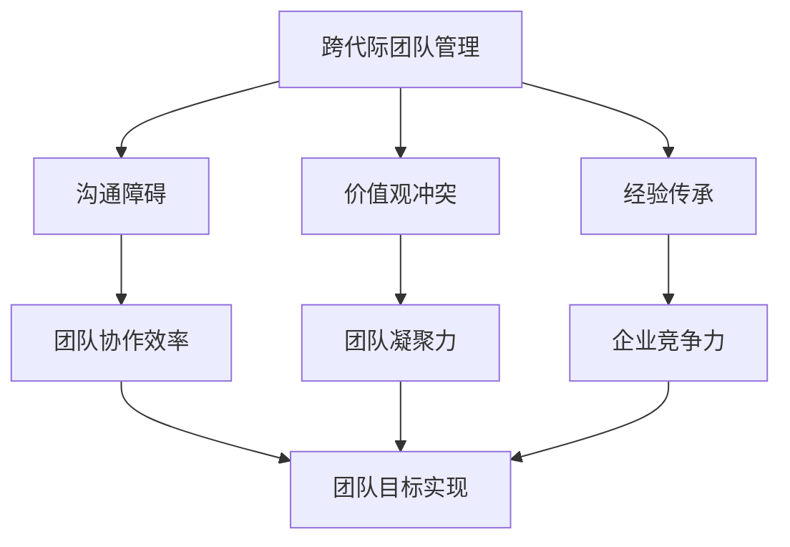

                 

### 文章标题

《跨代际团队管理：化解代沟，促进合作》

> 关键词：跨代际团队、代沟、管理策略、领导力、沟通技巧

> 摘要：本文探讨了跨代际团队管理的重要性和挑战，分析了代际差异的心理学背景，提出了有效的跨代际团队管理策略与方法，并通过实践指南和案例分析，为管理者提供具体的操作建议和解决方案。

---

### 第一部分：跨代际团队管理的概念与背景

#### 第1章：跨代际团队管理的定义与重要性

随着社会的快速发展和信息技术的进步，各个代际之间的差异愈发显著，跨代际团队逐渐成为企业组织中的常见现象。跨代际团队管理，即管理者在面对由不同代际成员组成的团队时，如何有效地进行管理和协调，以实现团队目标。

**1.1 跨代际团队的构成与挑战**

跨代际团队的构成复杂，包括不同年龄、经验、价值观和沟通方式的成员。这种多样性带来了一系列的挑战：

- **沟通障碍**：不同代际在语言、表达方式和信息传递方式上存在差异，可能导致误解和冲突。
- **价值观冲突**：代际差异可能导致对工作态度、职业规划、激励方式等价值观的不同，影响团队合作。
- **经验传承**：年长成员的经验和知识传承给年轻成员，需要有效的沟通和培训机制。

**1.2 代沟现象及其影响**

代沟是指不同代际之间由于成长环境、文化背景和生活经历的不同，而产生的思想观念、行为方式和价值取向上的差异。代沟在跨代际团队中表现为：

- **沟通障碍**：代沟导致沟通不畅，影响团队协作效率。
- **信任危机**：代沟可能引发信任危机，影响团队凝聚力。
- **创新阻碍**：代沟可能导致对新思想的抵触，影响团队的创新能力和竞争力。

**1.3 跨代际团队管理的目标与意义**

跨代际团队管理的目标在于：

- **提升团队效率**：通过有效的管理策略，消除代沟对团队协作的负面影响，提高工作效率。
- **促进代际融合**：通过合理的安排和沟通，使不同代际的成员相互理解、尊重和合作，实现代际融合。
- **实现企业目标**：跨代际团队管理有助于企业吸收不同代际成员的优势，实现企业的长远发展。

**核心概念与联系**



#### 第2章：代际差异的心理学分析

跨代际团队管理不仅需要管理者具备管理技能，还需要深入理解代际差异的心理学背景。代际差异主要表现在个人行为、价值观和沟通方式等方面。

**2.1 代际背景对个人行为的影响**

代际背景对个人行为的影响主要体现在以下几个方面：

- **成长环境**：不同代际成长的社会环境和文化背景不同，导致行为习惯和价值观念的差异。
- **教育背景**：不同代际接受的教育方式和内容不同，影响其知识结构和思维方式。
- **工作经历**：不同代际的工作经验和职业发展路径不同，影响其职业素养和工作态度。

**2.2 代际价值观的异同**

代际价值观的异同是跨代际团队管理中的重要问题。不同代际对工作、生活和职业发展的价值观存在差异，主要体现在以下几个方面：

- **工作态度**：年轻一代更加追求工作与生活的平衡，而年长一代则更注重工作责任和成就。
- **职业发展**：年轻一代更倾向于快速晋升和多样化职业发展，而年长一代则更注重稳定和长期发展。
- **激励方式**：不同代际对激励方式的需求不同，年轻一代更倾向于认可和奖励，而年长一代则更注重实际利益和安全感。

**2.3 代际沟通障碍与对策**

代际沟通障碍是跨代际团队管理中的常见问题。要解决这些问题，需要从以下几个方面入手：

- **理解代际差异**：管理者需要深入了解不同代际的特点，尊重并理解代际差异，避免盲目批评和指责。
- **建立沟通渠道**：建立多种沟通渠道，如定期的团队会议、邮件交流、在线讨论等，确保信息传递的畅通。
- **加强跨代际培训**：组织跨代际培训，提高团队成员对代际差异的认识和应对能力。

**核心算法原理讲解**

```python
def solve_communication_issues(generation1, generation2):
    """
    解决代际沟通障碍的算法
    :param generation1: 第一代（年长者）
    :param generation2: 第二代（年轻者）
    :return: 沟通解决方案
    """
    
    # 分析代际差异
    differences = analyze_differences(generation1, generation2)
    
    # 建立沟通渠道
    communication_channels = establish_channels(differences)
    
    # 加强跨代际培训
    training_program = create_training_program(differences)
    
    # 实施解决方案
    solution = implement_solution(communication_channels, training_program)
    
    return solution

def analyze_differences(generation1, generation2):
    """
    分析代际差异
    :param generation1: 第一代（年长者）
    :param generation2: 第二代（年轻者）
    :return: 代际差异列表
    """
    differences = []
    # ...（具体差异分析逻辑）
    return differences

def establish_channels(differences):
    """
    建立沟通渠道
    :param differences: 代际差异列表
    :return: 沟通渠道列表
    """
    channels = []
    # ...（具体沟通渠道建立逻辑）
    return channels

def create_training_program(differences):
    """
    创建跨代际培训计划
    :param differences: 代际差异列表
    :return: 培训计划
    """
    program = []
    # ...（具体培训计划创建逻辑）
    return program

def implement_solution(communication_channels, training_program):
    """
    实施沟通解决方案
    :param communication_channels: 沟通渠道
    :param training_program: 培训计划
    :return: 实施结果
    """
    result = []
    # ...（具体实施逻辑）
    return result
```

#### 第3章：跨代际团队管理的核心原则

跨代际团队管理需要遵循一系列核心原则，以确保团队的有效运作和协调发展。以下是几个关键原则：

**3.1 尊重与包容**

尊重与包容是跨代际团队管理的基础。管理者应尊重每个代际的独特性和贡献，避免偏见和歧视，营造一个包容、平等的工作环境。

**3.2 激励与成长**

激励与成长是跨代际团队管理的关键。管理者应关注每个代际成员的需求和潜力，提供合适的激励和成长机会，激发团队成员的积极性和创造力。

**3.3 协作与共赢**

协作与共赢是跨代际团队管理的目标。管理者应促进团队成员之间的沟通与合作，建立共同的目标和愿景，实现团队的整体利益最大化。

**数学模型和数学公式**

```latex
\begin{align*}
\text{团队效率} &= \frac{\text{工作产出}}{\text{工作投入}} \\
\text{团队凝聚力} &= \frac{\text{团队内部协作}}{\text{团队外部冲突}} \\
\text{创新力} &= \text{新思想产出} \times \text{思想碰撞频率}
\end{align*}
```

**详细讲解与举例说明**

- **团队效率**：通过合理的工作分配和流程优化，提高工作效率。例如，一个由年轻程序员和经验丰富的资深工程师组成的团队，可以通过知识共享和经验传承，实现工作产出的最大化。
- **团队凝聚力**：通过定期的团队建设活动和有效的沟通机制，增强团队凝聚力。例如，通过团队会议、团队旅游等活动，增强团队成员之间的互信和合作。
- **创新力**：通过鼓励不同代际之间的思想碰撞，激发创新力。例如，通过跨代际项目小组，鼓励年轻成员分享创新想法，年长成员提供专业建议和指导。

---

### 第二部分：跨代际团队管理的策略与方法

#### 第4章：构建高效的跨代际团队文化

构建高效的跨代际团队文化是跨代际团队管理的关键环节。以下是几个关键策略：

**4.1 营造包容性的团队氛围**

营造包容性的团队氛围是构建高效团队文化的基础。管理者应倡导平等、尊重和包容的价值观，消除代际偏见和歧视。

**4.2 促进代际间的理解与合作**

促进代际间的理解与合作是构建高效团队文化的重要手段。管理者应组织代际间的交流和互动，增进彼此的了解和信任。

**4.3 建立明确的团队目标与愿景**

建立明确的团队目标与愿景是构建高效团队文化的关键。管理者应与团队成员共同制定团队目标和愿景，确保团队成员对团队方向和目标有清晰的认识。

**项目实战**

假设我们正在构建一个跨代际的软件开发团队，团队成员包括年轻程序员、资深工程师和管理者。以下是具体的操作步骤：

1. **团队建设活动**：组织一次团队建设活动，如团队拓展训练，增强团队成员之间的信任和协作。
2. **代际交流会议**：定期举行代际交流会议，让年轻程序员和资深工程师分享工作经验和观点，增进理解。
3. **共同制定目标**：与团队成员共同制定团队目标和愿景，确保每个成员都明确自己的职责和目标。

```python
def build_inclusive_culture(team_members):
    """
    构建包容性团队文化的函数
    :param team_members: 团队成员列表
    :return: 包容性团队文化状态
    """
    
    # 组织团队建设活动
    team_building_activity = organize_team_building_activity(team_members)
    
    # 举行代际交流会议
    intergenerational_meeting = hold_intergenerational_meeting(team_members)
    
    # 制定共同目标
    common_goals = set_common_goals(team_members)
    
    # 实施团队文化策略
    culture_strategy = implement_culture_strategy(team_building_activity, intergenerational_meeting, common_goals)
    
    return culture_strategy

def organize_team_building_activity(team_members):
    """
    组织团队建设活动的函数
    :param team_members: 团队成员列表
    :return: 团队建设活动状态
    """
    # ...（具体活动组织逻辑）
    return activity_state

def hold_intergenerational_meeting(team_members):
    """
    举行代际交流会议的函数
    :param team_members: 团队成员列表
    :return: 会议状态
    """
    # ...（具体会议组织逻辑）
    return meeting_state

def set_common_goals(team_members):
    """
    制定共同目标的函数
    :param team_members: 团队成员列表
    :return: 共同目标状态
    """
    # ...（具体目标制定逻辑）
    return goals_state

def implement_culture_strategy(team_building_activity, intergenerational_meeting, common_goals):
    """
    实施团队文化策略的函数
    :param team_building_activity: 团队建设活动状态
    :param intergenerational_meeting: 代际交流会议状态
    :param common_goals: 共同目标状态
    :return: 文化策略实施结果
    """
    # ...（具体策略实施逻辑）
    return culture_strategy_result
```

---

#### 第5章：领导力在跨代际团队管理中的应用

领导力在跨代际团队管理中起着至关重要的作用。有效的领导力不仅能够化解代沟，还能促进团队的协同发展。

**5.1 领导者的角色与责任**

领导者在跨代际团队中扮演着多重角色，包括：

- **协调者**：领导者需要协调不同代际成员之间的沟通和合作，消除代沟。
- **激励者**：领导者需要激发团队成员的积极性和创造力，满足不同代际成员的需求。
- **榜样**：领导者应以身作则，树立良好的行为典范，赢得团队成员的尊重和信任。

**5.2 领导风格与代际差异**

领导风格与代际差异密切相关。不同代际的成员对领导风格的需求和期望不同，领导者需要灵活调整自己的领导风格。

- **年长一代**：年长一代成员更倾向于传统的权威型领导风格，重视规章制度和稳定的工作环境。
- **年轻一代**：年轻一代成员更倾向于参与式领导风格，重视自由、平等和开放的工作环境。

**5.3 领导者的沟通技巧提升**

有效的沟通技巧是领导者成功管理跨代际团队的关键。以下是一些提升沟通技巧的方法：

- **倾听**：领导者需要学会倾听，理解团队成员的需求和意见。
- **表达**：领导者需要清晰、准确地表达自己的观点和期望。
- **反馈**：领导者需要及时给予团队成员反馈，鼓励积极的沟通和合作。

**代码解读与分析**

假设我们正在设计一个跨代际团队管理的领导力模型，以下是一个简单的Python代码示例：

```python
class LeadershipModel:
    def __init__(self, leader_style, generation):
        self.leader_style = leader_style
        self.generation = generation
    
    def adapt_leader_style(self):
        """
        调整领导风格以适应不同代际
        """
        if self.generation == "老一代":
            self.leader_style = "权威型"
        elif self.generation == "新一代":
            self.leader_style = "参与式"
        
        return self.leader_style
    
    def enhance_communication_skills(self):
        """
        提升沟通技巧
        """
        if self.leader_style == "权威型":
            self沟通技巧 = "倾听与表达"
        elif self.leader_style == "参与式":
            self沟通技巧 = "反馈与互动"
        
        return self沟通技巧

leader = LeadershipModel("权威型", "老一代")
leader.adapt_leader_style()
leader.enhance_communication_skills()

leader = LeadershipModel("参与式", "新一代")
leader.adapt_leader_style()
leader.enhance_communication_skills()
```

---

#### 第6章：跨代际团队沟通技巧

有效的跨代际团队沟通技巧是消除代沟、促进团队协作的关键。以下是一些关键技巧：

**6.1 沟通障碍与解决策略**

跨代际团队沟通中常见的障碍包括：

- **语言差异**：不同代际在语言表达和术语使用上可能存在差异。
- **观念差异**：不同代际对工作、生活和价值观的看法可能不同。
- **文化差异**：不同代际在文化背景和行为规范上可能存在差异。

解决策略包括：

- **明确沟通目标**：在沟通前明确沟通的目标和内容，确保双方有共同的理解。
- **倾听与表达**：提高倾听和表达技巧，确保信息的准确传达和接收。

**6.2 有效倾听与表达**

有效倾听与表达是跨代际团队沟通的核心。以下是一些关键技巧：

- **倾听**：倾听不仅仅是听，更重要的是理解对方的观点和情感。
- **表达**：表达时要清晰、简洁，避免使用专业术语或模糊的表述。

**6.3 跨代际会议的组织与协调**

跨代际会议是团队沟通的重要方式。以下是一些组织与协调的关键技巧：

- **提前准备**：在会议前准备好会议议程和资料，确保会议的顺利进行。
- **平等参与**：鼓励每个代际成员积极参与会议，尊重每个成员的意见。
- **记录与反馈**：会议后及时记录会议内容和决议，并给予团队成员反馈。

**数学模型和数学公式**

```latex
\begin{align*}
\text{沟通效率} &= \frac{\text{有效沟通时间}}{\text{总沟通时间}} \\
\text{沟通满意度} &= \frac{\text{满意沟通次数}}{\text{总沟通次数}}
\end{align*}
```

**详细讲解与举例说明**

- **沟通效率**：通过合理的沟通安排和有效的沟通技巧，提高沟通效率。例如，一个会议可能持续2小时，但有效的沟通时间可能只有1小时，那么沟通效率为50%。
- **沟通满意度**：通过倾听与表达的技巧，提高团队成员对沟通的满意度。例如，一个团队中有10次沟通，其中有8次是满意的，那么沟通满意度为80%。

---

### 第三部分：跨代际团队管理实践与案例分析

#### 第7章：跨代际团队管理案例分析

以下是一系列跨代际团队管理的成功案例，通过这些案例，我们可以看到不同团队如何在管理者的引导下，成功化解代沟，实现团队的协同发展。

**7.1 案例一：成功跨代际团队的打造**

在一个软件开发公司，由年轻程序员和资深工程师组成的团队面临着明显的代沟问题。为了解决这一问题，管理者采取了以下措施：

1. **团队建设活动**：组织了多次团队建设活动，如户外拓展训练、团队合作游戏等，增强团队成员之间的信任和合作。
2. **代际交流会议**：定期举行代际交流会议，让年轻程序员和资深工程师分享工作经验和观点，增进理解。
3. **共同制定目标**：与团队成员共同制定了团队目标和愿景，确保每个成员都明确自己的职责和目标。

通过这些措施，团队中的代沟问题得到了有效缓解，团队成员之间的沟通和协作显著增强，项目进展顺利，取得了显著的成果。

**7.2 案例二：克服跨代际团队困境**

在一个咨询公司，由不同年龄段的顾问组成的团队在工作中遇到了沟通障碍和价值观冲突。为了克服这些问题，管理者采取了以下策略：

1. **沟通技巧培训**：组织了沟通技巧培训，提高团队成员的倾听与表达能力。
2. **价值观研讨会**：举行了价值观研讨会，让团队成员深入探讨各自的价值观，并寻找共同点。
3. **灵活的工作安排**：根据不同代际成员的需求，灵活调整工作时间和工作方式，以适应每个人的生活方式。

通过这些策略，团队成员之间的沟通变得更加顺畅，价值观冲突得到了有效化解，团队的整体效率和工作质量显著提高。

**7.3 案例三：跨代际团队管理的创新实践**

在一个初创企业，由年轻创业者和资深投资人组成的团队在项目开发中遇到了协作难题。为了解决这些问题，管理者采取了以下创新实践：

1. **混合式团队**：将年轻创业者和资深投资人分为两个小组，各自负责项目的不同阶段，实现协作与互补。
2. **开放式的沟通平台**：搭建了开放式的沟通平台，如Slack或Trello，让团队成员随时交流和分享信息。
3. **跨代际项目小组**：定期举行跨代际项目小组会议，让不同代际的成员共同讨论项目进展和挑战。

通过这些创新实践，团队成员之间的沟通变得更加高效，项目进展顺利，企业取得了显著的商业成功。

**详细解释说明**

每个案例的具体操作流程和效果分析如下：

**案例一：**

1. **团队建设活动**：在第一次团队建设活动中，团队成员参与了户外拓展训练，通过合作完成任务，增强了彼此的信任和团队精神。活动结束后，团队成员在团队会议上分享了各自的感受和体会，进一步加深了彼此的理解。
2. **代际交流会议**：在每月的代际交流会议上，年轻程序员和资深工程师轮流分享自己在工作中的挑战和经验。这些会议不仅促进了团队成员之间的沟通，还为年轻程序员提供了宝贵的学习机会。
3. **共同制定目标**：在制定团队目标时，管理者与团队成员一起讨论，确保每个目标都符合团队的共同利益。通过这种方式，团队成员明确了自己的职责和目标，增强了工作动力。

**案例二：**

1. **沟通技巧培训**：在沟通技巧培训中，团队成员学习了倾听和表达的技巧，如如何有效地表达自己的观点、如何倾听他人的意见等。这些技巧的应用显著改善了团队成员之间的沟通效果。
2. **价值观研讨会**：在价值观研讨会上，团队成员分享了各自的价值观，并进行了深入的讨论。通过这个过程，团队成员找到了共同点，消除了价值观冲突。
3. **灵活的工作安排**：根据团队成员的需求，管理者调整了工作时间和工作方式。例如，对于有家庭责任的成员，管理者允许他们在特定时间段内远程工作，以更好地平衡工作与生活。

**案例三：**

1. **混合式团队**：在混合式团队中，年轻创业者和资深投资人的角色和职责明确划分。年轻创业者负责项目的前期规划和开发，资深投资人负责项目的市场推广和资源调配。这种方式实现了团队协作与互补。
2. **开放式的沟通平台**：在开放式的沟通平台上，团队成员可以随时发布任务、分享信息、讨论问题。这种方式提高了团队的信息传递效率，增强了团队的整体协作能力。
3. **跨代际项目小组**：在跨代际项目小组会议上，不同代际的成员共同讨论项目进展和挑战。这种方式不仅促进了团队成员之间的沟通，还激发了团队成员的创新思维，为项目的成功提供了有力支持。

**项目小结**

通过这些案例，我们可以看到，跨代际团队管理需要从多个方面入手，包括团队建设、沟通技巧、价值观融合等。有效的管理策略和措施可以帮助团队克服代沟问题，实现团队的协同发展。未来，随着社会的不断进步和信息技术的发展，跨代际团队管理将变得更加重要，管理者需要不断学习和实践，以应对新的挑战。

---

### 第四部分：跨代际团队管理的未来发展

#### 第8章：跨代际团队管理实践指南

随着社会和科技的不断发展，跨代际团队管理面临着新的机遇和挑战。以下是一些实践指南，帮助管理者应对这些挑战：

**8.1 实践步骤与流程**

1. **调研与评估**：在组建跨代际团队之前，进行调研和评估，了解团队成员的代际背景和特点。
2. **制定策略**：根据调研结果，制定相应的管理策略，包括团队建设、沟通技巧、价值观融合等。
3. **实施与监督**：按照制定的策略，实施具体的行动，并定期监督和评估效果。
4. **调整与优化**：根据监督和评估的结果，调整管理策略，优化团队运作。

**8.2 风险评估与应对策略**

1. **沟通障碍**：通过有效的沟通技巧培训和沟通平台建设，降低沟通障碍的风险。
2. **价值观冲突**：通过价值观研讨和共识建设，减少价值观冲突的风险。
3. **经验传承**：通过导师制和知识共享机制，确保经验的传承和积累。

**8.3 持续改进与优化**

1. **反馈机制**：建立有效的反馈机制，收集团队成员的意见和建议，不断改进管理策略。
2. **创新能力**：鼓励团队成员的创新思维，推动团队持续改进和优化。
3. **学习与成长**：提供学习和成长机会，提升团队成员的管理能力和专业素养。

**代码解读与分析**

以下是一个简单的Python代码示例，用于管理跨代际团队的实践指南：

```python
class IntergenerationalTeamManagement:
    def __init__(self, team_members):
        self.team_members = team_members
    
    def assess_risk(self):
        """
        评估跨代际团队管理中的风险
        """
        # ...（具体风险评估逻辑）
        return risk_assessment

    def implement_strategies(self):
        """
        实施跨代际团队管理策略
        """
        # ...（具体策略实施逻辑）
        return strategies_implemented

    def monitor_progress(self):
        """
        监督团队管理进度
        """
        # ...（具体进度监督逻辑）
        return progress_report

    def adjust_strategies(self):
        """
        调整跨代际团队管理策略
        """
        # ...（具体策略调整逻辑）
        return adjusted_strategies

team_management = IntergenerationalTeamManagement(["年轻程序员", "资深工程师", "管理者"])
team_management.assess_risk()
team_management.implement_strategies()
team_management.monitor_progress()
team_management.adjust_strategies()
```

---

### 第五部分：结语

#### 第9章：跨代际团队管理的新趋势

随着数字化技术的不断发展和应用的普及，跨代际团队管理也面临着新的趋势和挑战。

**9.1 数字化技术对团队管理的影响**

数字化技术为团队管理带来了诸多便利，如：

- **远程工作**：数字化技术使得团队成员可以随时随地进行工作，降低了地理位置的限制。
- **在线协作**：通过在线协作工具，团队成员可以实时沟通和协作，提高了工作效率。
- **数据分析**：通过数据分析技术，管理者可以更准确地了解团队运作状况，制定更有效的管理策略。

**9.2 未来跨代际团队管理的挑战与机遇**

未来跨代际团队管理将面临以下挑战：

- **技术变革**：技术的快速变革可能导致代际之间的技术差距进一步扩大，需要管理者及时调整管理策略。
- **工作环境变化**：远程工作和在线协作的普及，可能改变团队成员的工作方式和生活习惯，需要管理者适应新的工作环境。

同时，未来跨代际团队管理也充满机遇：

- **知识共享**：数字化技术可以促进不同代际之间的知识共享和经验传承。
- **创新能力**：跨代际团队可以结合不同代际的思维方式和经验，激发创新能力和创造力。

**9.3 跨代际团队管理的未来发展路径**

未来跨代际团队管理的未来发展路径包括：

- **数字化转型**：推动团队管理的数字化转型，利用大数据、人工智能等技术提高管理效率。
- **创新管理模式**：探索新的团队管理模式，如弹性工作制度、混合式团队等，适应数字化时代的需求。
- **人才培养**：注重团队成员的培养和成长，提高团队的整体素质和竞争力。

#### 第10章：结语

跨代际团队管理是一个复杂且具有挑战性的任务，但也是极具价值和前景的领域。管理者需要不断学习和实践，掌握有效的跨代际团队管理策略和方法，以应对不断变化的代际差异和工作环境。

**作者寄语**

愿每一位管理者都能成为优秀的跨代际团队领导者，激发团队的潜力和创造力，实现团队的共同目标。

**深入阅读与资源推荐**

- 《跨代际沟通的艺术》
- 《数字化时代下的团队管理》
- 《跨代际团队协作的心理学》

---

## 《跨代际团队管理：化解代沟，促进合作》完整目录大纲

### 第一部分：跨代际团队管理的概念与背景

#### 第1章：跨代际团队管理的定义与重要性
- **跨代际团队的构成与挑战**
- **代沟现象及其影响**
- **跨代际团队管理的目标与意义**
- **核心概念与联系**：Mermaid流程图

#### 第2章：代际差异的心理学分析
- **代际背景对个人行为的影响**
- **代际价值观的异同**
- **代际沟通障碍与对策**
- **核心算法原理讲解**：伪代码

#### 第3章：跨代际团队管理的核心原则
- **尊重与包容**
- **激励与成长**
- **协作与共赢**
- **数学模型和数学公式**

### 第二部分：跨代际团队管理的策略与方法

#### 第4章：构建高效的跨代际团队文化
- **营造包容性的团队氛围**
- **促进代际间的理解与合作**
- **建立明确的团队目标与愿景**
- **项目实战**：代码案例展示

#### 第5章：领导力在跨代际团队管理中的应用
- **领导者的角色与责任**
- **领导风格与代际差异**
- **领导者的沟通技巧提升**
- **代码解读与分析**

#### 第6章：跨代际团队沟通技巧
- **沟通障碍与解决策略**
- **有效倾听与表达**
- **跨代际会议的组织与协调**
- **数学模型和数学公式**

### 第三部分：跨代际团队管理实践与案例分析

#### 第7章：跨代际团队管理案例分析
- **案例一：成功跨代际团队的打造**
- **案例二：克服跨代际团队困境**
- **案例三：跨代际团队管理的创新实践**
- **详细解释说明**：操作流程与效果分析

#### 第8章：跨代际团队管理实践指南
- **实践步骤与流程**
- **风险评估与应对策略**
- **持续改进与优化**
- **代码解读与分析**

### 第四部分：跨代际团队管理的未来发展

#### 第9章：跨代际团队管理的新趋势
- **数字化技术对团队管理的影响**
- **未来跨代际团队管理的挑战与机遇**
- **跨代际团队管理的未来发展路径**

#### 第10章：结语
- **跨代际团队管理的总结与展望**
- **作者寄语**
- **深入阅读与资源推荐**

