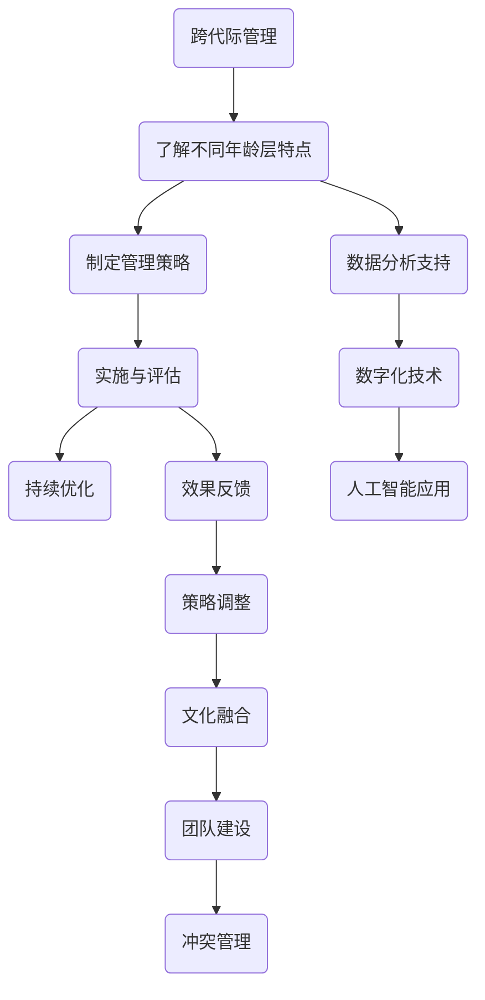
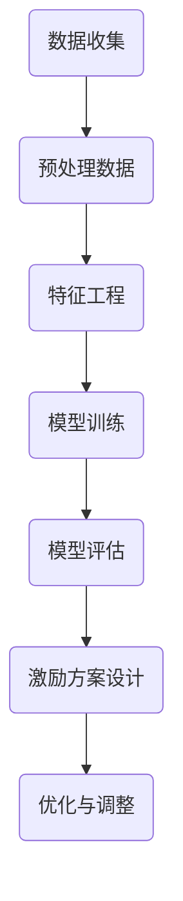

                 

### 文章标题

《跨代际管理：应对不同年龄层员工的挑战》

> 关键词：跨代际管理、员工特点分析、管理策略、技术支持、案例分析、未来趋势

> 摘要：本文旨在探讨跨代际管理在应对不同年龄层员工时的挑战与策略。通过对Z世代、Y世代、X世代和婴儿潮一代等不同代际员工的特征分析，提出相应的管理策略和实践方法，结合数字化技术和人工智能的应用，旨在为企业提供一套全面、科学的跨代际管理方案，以实现高效团队建设和企业持续发展。

### 引言

#### 1.1 跨代际管理的背景与意义

在当今快速变化的社会环境中，不同年龄层的员工共同存在于同一组织中，形成了所谓的“跨代际团队”。这种趋势不仅源于人口老龄化，还因为科技的发展和社会价值观的多元，使得不同年龄段的员工在职场中扮演着越来越重要的角色。然而，不同代际之间的员工在价值观、工作态度、技能需求等方面存在显著差异，这给管理带来了新的挑战。

跨代际管理，即在不同年龄层的员工之间实施有效的管理策略，旨在最大化团队效能，提升员工满意度和企业竞争力。随着互联网、大数据、人工智能等新技术的不断涌现，跨代际管理的重要性愈发凸显。它不仅关系到企业的内部运营，还影响到企业的创新能力和市场竞争力。

#### 1.2 不同年龄层员工的特点与挑战

不同年龄层的员工具有不同的特点和挑战，以下将对Z世代、Y世代、X世代和婴儿潮一代进行简要分析：

- **Z世代**：Z世代，即1995年后出生的一代人，他们成长于互联网时代，习惯于数字化生活方式。他们追求个性化和自我实现，注重工作与生活的平衡。Z世代员工的特点是创新能力强，但同时也可能缺乏耐心和团队协作经验。

- **Y世代**：Y世代，即1981年至1994年出生的一代人，他们是数字技术的早期使用者，具有较强的自我驱动力和适应能力。Y世代员工更加重视职业发展和个人成长，但对于工作与生活平衡有较高期望。

- **X世代**：X世代，即1965年至1980年出生的一代人，他们经历了技术变革的早期阶段，具有较高的忠诚度和责任感。X世代员工在工作中注重稳定性和成就，但可能对新技术接受度较低。

- **婴儿潮一代**：婴儿潮一代，即1946年至1964年出生的一代人，他们经历了社会经济的高速发展，具有强烈的成就动机和责任感。婴儿潮一代员工通常具有丰富的经验和知识，但在面对新生代员工时，可能会出现沟通和文化上的障碍。

### 跨代际管理的基本概念

#### 2.1 跨代际管理的定义与范围

跨代际管理是指在企业管理中，针对不同年龄层员工的特点和需求，采取相应的管理策略和方法，以实现团队的高效运作和员工的全面成长。跨代际管理的范围涵盖招聘、培训、激励机制、团队建设、沟通与协作等多个方面。

#### 2.2 跨代际沟通的基本原则

有效的跨代际沟通是跨代际管理的关键。以下是一些基本原则：

- **尊重差异**：理解并尊重不同代际员工在价值观、工作态度和沟通方式上的差异。
- **平等对话**：鼓励不同年龄层的员工之间进行开放、平等的对话，促进相互理解和合作。
- **主动沟通**：管理者应主动了解不同代际员工的观点和需求，及时沟通信息，避免误解和冲突。
- **情感共鸣**：通过情感共鸣建立信任，增强团队凝聚力。

#### 2.3 跨代际冲突的识别与解决

跨代际冲突是跨代际管理中常见的问题，识别和解决冲突对于团队和谐至关重要。以下是一些解决策略：

- **预防为主**：通过培训和沟通，预防潜在的冲突。
- **理性分析**：分析冲突的原因，从理性角度寻找解决方案。
- **调解协商**：在冲突发生时，通过调解和协商达成共识。
- **文化融合**：建立多元文化的团队氛围，促进不同代际员工的融合。

### 不同年龄层员工的特点分析

#### 3.1 Z世代的员工特点

##### 3.1.1 Z世代的价值观与工作态度

Z世代员工出生于互联网和社交媒体时代，他们的价值观与前辈有所不同。Z世代员工注重个性化和自我实现，追求有意义的工作和生活平衡。以下是他们的一些典型价值观：

- **创新与创造**：Z世代员工渴望在工作中创新，追求创造性的解决方案。
- **平等与包容**：他们倾向于在一个平等、包容的工作环境中工作，尊重多样性和不同意见。
- **自我表达**：Z世代员工喜欢在工作中表达自己的观点和想法，追求自我实现。
- **社会责任**：他们关注社会和环境问题，希望企业能够承担社会责任。

##### 3.1.2 Z世代的技能需求与职业发展

Z世代员工在技能需求方面具有以下特点：

- **技术能力**：由于成长在数字时代，Z世代员工通常具备较高的技术能力，特别是数字技能和社交媒体使用技巧。
- **跨界能力**：Z世代员工倾向于跨学科、跨领域的技能学习，以应对快速变化的工作环境。
- **快速学习**：他们善于快速学习新知识、新技能，以适应不断变化的工作需求。

在职业发展方面，Z世代员工追求灵活多样的职业路径，注重个人成长和自我实现。他们希望能够通过职业发展实现个人价值，而不是仅仅追求稳定的职位。

#### 3.2 Y世代的员工特点

##### 3.2.1 Y世代的价值观与工作态度

Y世代员工是数字技术的早期使用者，他们的价值观和工作态度受到互联网文化的影响。以下是他们的一些典型价值观：

- **自我驱动**：Y世代员工具有较强的自我驱动力，追求自我实现和职业发展。
- **工作与生活平衡**：他们重视工作与生活的平衡，追求有意义的生活体验。
- **团队协作**：Y世代员工倾向于在一个支持性、协作性的团队中工作，重视团队贡献。
- **持续学习**：他们乐于不断学习新知识和新技能，以适应快速变化的工作环境。

##### 3.2.2 Y世代的技能需求与职业发展

Y世代员工在技能需求方面具有以下特点：

- **适应能力**：Y世代员工具有较强的适应能力，能够快速适应新环境和新挑战。
- **沟通能力**：他们擅长沟通和协作，能够有效地与他人交流和合作。
- **领导能力**：部分Y世代员工具有领导潜力，能够担任团队领导角色。

在职业发展方面，Y世代员工注重职业规划和个人成长。他们希望通过不断学习和积累经验，实现职业上的突破。

#### 3.3 X世代的员工特点

##### 3.3.1 X世代的价值观与工作态度

X世代员工经历了技术变革的早期阶段，他们的价值观和工作态度受到传统工作文化的影响。以下是他们的一些典型价值观：

- **忠诚与责任感**：X世代员工通常对企业具有强烈的忠诚感，愿意为企业长期服务。
- **稳定与成就**：他们追求工作稳定性和职业成就，重视工作成果和贡献。
- **家庭与工作平衡**：X世代员工注重家庭与工作的平衡，希望在事业和家庭之间找到平衡点。
- **经验与知识**：他们重视工作经验和知识积累，愿意通过学习不断提升自己。

##### 3.3.2 X世代的技能需求与职业发展

X世代员工在技能需求方面具有以下特点：

- **专业技能**：X世代员工通常具备扎实的专业技能，能够应对复杂的工作任务。
- **管理能力**：部分X世代员工具备管理能力，能够在团队中担任领导角色。
- **适应传统工作方式**：他们在一定程度上适应传统的工作方式和组织文化。

在职业发展方面，X世代员工追求稳定的职业发展路径，希望通过职业晋升和经验积累实现个人价值。

#### 3.4 Baby Boomers（婴儿潮一代）的员工特点

##### 3.4.1 婴儿潮一代的价值观与工作态度

婴儿潮一代员工出生于1946年至1964年，他们的价值观和工作态度受到当时社会经济环境的影响。以下是他们的一些典型价值观：

- **成就与贡献**：婴儿潮一代员工追求职业成就和社会贡献，重视工作对社会的价值。
- **忠诚与责任感**：他们对企业具有强烈的忠诚感和责任感，愿意为企业长期服务。
- **经验与知识**：他们重视工作经验和知识积累，愿意通过学习不断提升自己。
- **传统价值观**：婴儿潮一代员工倾向于遵循传统的工作价值观，如勤奋、敬业和忠诚。

##### 3.4.2 婴儿潮一代的技能需求与职业发展

婴儿潮一代员工在技能需求方面具有以下特点：

- **专业技能**：他们通常具备扎实的专业技能，能够应对复杂的工作任务。
- **管理能力**：部分婴儿潮一代员工具备管理能力，能够在团队中担任领导角色。
- **适应传统工作方式**：他们在一定程度上适应传统的工作方式和组织文化。

在职业发展方面，婴儿潮一代员工追求稳定的职业发展路径，希望通过职业晋升和经验积累实现个人价值。

### 跨代际管理的策略与实践

#### 4.1 制定适合不同年龄层员工的激励机制

##### 4.1.1 物质激励与非物质激励

激励是跨代际管理中的重要手段，针对不同年龄层员工的激励策略应有所不同。以下是一些物质激励与非物质激励的方法：

- **物质激励**：
  - **薪资待遇**：根据不同年龄层员工的需求，提供具有竞争力的薪资待遇。
  - **奖金制度**：设立绩效奖金、年终奖等奖金制度，激励员工努力工作。
  - **福利待遇**：提供健康保险、养老金计划等福利待遇，提高员工的生活质量。

- **非物质激励**：
  - **职业发展**：提供晋升机会、培训计划等，帮助员工实现职业成长。
  - **认可与奖励**：通过表扬、荣誉称号等认可员工的工作成果，提高员工的工作积极性。
  - **工作环境**：营造积极、和谐的工作氛围，提高员工的工作满意度。

##### 4.1.2 跨代际激励方案的制定与实施

制定跨代际激励方案时，需要充分考虑不同年龄层员工的特点和需求。以下是一些具体策略：

- **数据分析**：通过数据分析，了解不同年龄层员工的激励需求和偏好，为激励方案的制定提供依据。
- **个性化激励**：针对不同年龄层员工的特点，设计个性化的激励方案，如针对Z世代的员工提供职业发展机会，针对婴儿潮一代的员工提供福利待遇。
- **持续优化**：定期评估激励方案的实施效果，根据反馈进行优化和调整，以保持激励的持续性和有效性。

#### 4.2 提高跨代际沟通效率

##### 4.2.1 跨代际沟通的障碍与解决方法

跨代际沟通障碍是跨代际管理中的常见问题，以下是一些主要障碍及解决方法：

- **代际差异**：由于价值观、工作态度和沟通方式的差异，导致跨代际沟通不畅。解决方法包括：
  - **培训与教育**：通过培训和教育，提高员工对不同代际文化的理解和尊重。
  - **开放沟通**：鼓励不同年龄层的员工之间进行开放、坦诚的沟通，促进相互理解。

- **信息不对称**：不同年龄层员工对信息的需求和获取方式不同，导致信息传递不畅。解决方法包括：
  - **多渠道沟通**：采用多种沟通渠道，如电子邮件、面对面会议、在线聊天等，满足不同年龄层员工的信息需求。
  - **信息共享**：建立信息共享平台，确保不同年龄层员工能够及时获取相关信息。

##### 4.2.2 跨代际沟通技巧的培养与实践

为了提高跨代际沟通效率，需要培养员工的沟通技巧。以下是一些建议：

- **倾听与理解**：倾听是沟通的基础，要理解不同代际员工的观点和需求，避免误解和冲突。
- **尊重差异**：尊重不同代际员工的价值观和工作方式，避免用主观偏见看待他们的行为。
- **有效表达**：清晰、简洁地表达自己的观点，避免使用过于复杂或专业的术语，确保对方理解。
- **情感共鸣**：通过情感共鸣建立信任，增强团队凝聚力。

#### 4.3 建立有效的跨代际团队

##### 4.3.1 跨代际团队的构建原则

建立有效的跨代际团队是跨代际管理的重要任务。以下是一些构建原则：

- **多样性原则**：尊重和利用不同年龄层员工的多样性，形成互补的团队结构。
- **共同目标**：明确团队的目标和愿景，确保不同年龄层员工都能认同并为之努力。
- **平等参与**：鼓励不同年龄层员工在团队中平等参与，尊重每个人的意见和贡献。
- **灵活管理**：根据不同年龄层员工的特点，采用灵活的管理方法，提高团队运作效率。

##### 4.3.2 跨代际团队的管理策略

为了有效地管理跨代际团队，需要采取以下策略：

- **沟通与协作**：建立高效的沟通和协作机制，确保不同年龄层员工能够顺畅交流，共同完成任务。
- **激励与认可**：根据不同年龄层员工的需求，提供个性化的激励和认可，提高团队凝聚力。
- **领导力培养**：培养具有跨代际领导力的管理者，提高团队的整体领导力和执行力。
- **文化融合**：营造多元文化的团队氛围，促进不同年龄层员工的融合和合作。

#### 4.4 应对跨代际冲突的策略

##### 4.4.1 跨代际冲突的预防与解决

跨代际冲突是跨代际管理中不可避免的问题，以下是一些预防与解决策略：

- **预防为主**：
  - **了解差异**：通过培训和教育，让员工了解不同代际之间的差异，减少误解和冲突。
  - **平等沟通**：鼓励不同年龄层员工之间进行平等、坦诚的沟通，及时解决潜在问题。

- **解决冲突**：
  - **理性分析**：在冲突发生时，理性分析冲突的原因，寻找解决方案。
  - **调解协商**：通过调解和协商，达成共识，解决冲突。
  - **情感共鸣**：通过情感共鸣，建立信任，缓解冲突。

##### 4.4.2 跨代际冲突的案例分析

以下是一个跨代际冲突的案例分析：

**案例背景**：一家公司有一个由Z世代、Y世代和X世代组成的团队，其中Z世代的员工小王和Y世代的员工小李在工作中产生了冲突。小王认为小李对他的工作指手画脚，干涉了他的自由，而小李则认为小王的工作效率低下，缺乏责任感。

**案例分析**：
1. **了解差异**：在冲突发生后，管理者组织了沟通会议，让小王和小李分别陈述自己的观点和需求。通过沟通，管理者了解到小王追求自由和创造，而小李重视团队协作和效率。

2. **理性分析**：管理者对小王和小李的工作进行了客观评估，发现小王在创新能力方面有优势，但团队协作能力有待提高；而小李在团队协作方面表现出色，但创新性稍逊。

3. **调解协商**：管理者与小王和小李进行了深入的沟通，引导他们达成共识。最终，小王同意接受小李的建议，但在执行过程中保持一定的自主权；小李则承诺尊重小王的创新想法，共同推进项目。

4. **情感共鸣**：在解决冲突后，管理者通过组织团队活动，增强小王和小李之间的情感联系，缓解了冲突带来的负面影响。

**案例启示**：通过这个案例，我们可以看到，了解差异、理性分析和调解协商是解决跨代际冲突的关键。同时，情感共鸣也是缓解冲突、增强团队凝聚力的重要手段。

### 跨代际管理的技术支持

#### 5.1 数字化技术在跨代际管理中的应用

##### 5.1.1 数据分析在跨代际管理中的作用

数据分析是跨代际管理中的重要工具，可以帮助管理者了解不同年龄层员工的特点和需求，从而制定更有效的管理策略。以下是一些具体应用：

- **员工行为分析**：通过分析员工的工作行为，了解不同代际员工的工作风格和效率，为团队优化提供依据。
- **满意度调查**：利用数据分析技术，对员工满意度进行量化分析，识别潜在的问题和改进点。
- **绩效评估**：通过绩效数据，对不同年龄层员工的绩效进行评估，发现优秀员工并进行激励。

##### 5.1.2 数字化工具在跨代际管理中的应用

数字化工具在跨代际管理中的应用极大地提高了管理效率。以下是一些常用的数字化工具：

- **人力资源管理信息系统（HRIS）**：通过HRIS，管理者可以方便地收集、管理和分析员工数据，支持跨代际管理的决策。
- **在线培训平台**：利用在线培训平台，提供个性化的培训课程，满足不同年龄层员工的技能需求。
- **协作工具**：如Slack、Trello等，帮助跨代际团队进行高效的协作和沟通。

#### 5.2 人工智能在跨代际管理中的应用

##### 5.2.1 人工智能的基本原理与分类

人工智能（AI）是跨代际管理中的重要技术支持，它通过模拟人类智能，实现自动化决策和优化。以下是一些基本原理和分类：

- **机器学习**：通过训练模型，使计算机具备学习、推理和预测能力。常见的机器学习算法包括决策树、支持向量机、神经网络等。
- **自然语言处理（NLP）**：利用计算机技术理解和生成自然语言，用于文本分析、语义理解和智能客服等应用。
- **计算机视觉**：使计算机具备识别和理解图像、视频等视觉信息的能力，用于人脸识别、图像分类等应用。

##### 5.2.2 人工智能在跨代际管理中的应用案例

以下是一些人工智能在跨代际管理中的应用案例：

- **智能客服**：利用自然语言处理技术，提供24/7的智能客服服务，满足不同年龄层员工的需求，提高客户满意度。
- **个性化推荐**：通过分析员工数据，利用机器学习算法，为员工提供个性化的培训课程和职业发展建议。
- **自动绩效评估**：利用计算机视觉技术，对员工的工作行为进行自动化分析，提供客观的绩效评估结果。

### 跨代际管理的案例研究

#### 6.1 某企业跨代际管理成功案例

##### 6.1.1 案例背景与目标

某知名科技公司，员工年龄层次丰富，包括Z世代、Y世代、X世代和婴儿潮一代。为了提高团队效率和企业竞争力，该公司决定实施跨代际管理，目标是：

- **提高员工满意度**：通过满足不同年龄层员工的需求，提高员工的工作满意度和忠诚度。
- **促进团队合作**：建立和谐、高效的跨代际团队，增强团队合作能力。
- **提升企业竞争力**：通过优化管理策略，提高企业的创新能力和市场竞争力。

##### 6.1.2 案例实施过程与效果

该公司的跨代际管理实施过程如下：

1. **数据收集与分析**：通过员工调查和数据分析，了解不同年龄层员工的需求和特点。调查结果显示，Z世代员工关注职业发展和创新，Y世代员工注重工作与生活平衡，X世代员工追求稳定和成就感，婴儿潮一代员工关注经验和知识传承。

2. **制定管理策略**：根据数据分析结果，制定个性化的管理策略。针对不同年龄层员工的需求，提供个性化的培训和发展机会，优化激励机制，建立多渠道沟通平台。

3. **实施与反馈**：实施管理策略，并定期收集员工反馈，进行优化和调整。通过定期的团队活动和培训，增强不同年龄层员工之间的沟通和合作。

4. **效果评估**：经过一年的实施，效果评估显示：

   - **员工满意度提高**：员工满意度从原来的70%提高到90%，员工流失率明显下降。
   - **团队合作增强**：跨代际团队的合作效率显著提升，项目完成时间缩短了15%。
   - **企业竞争力提升**：通过优化管理策略，企业的创新能力和市场竞争力得到了显著提升。

##### 6.1.3 案例启示

该案例表明，通过了解不同年龄层员工的需求，制定个性化的管理策略，可以有效提高员工满意度和团队合作效率，提升企业竞争力。跨代际管理不仅需要数据支持，还需要持续的优化和调整，以适应不断变化的企业环境。

### 6.2 某企业跨代际管理失败案例

##### 6.2.1 案例背景与问题

某中型企业，员工主要由Y世代和婴儿潮一代组成，管理层主要由婴儿潮一代构成。由于管理层缺乏对Y世代员工特点的理解，导致跨代际管理失败。案例中的主要问题包括：

- **沟通不畅**：管理层与Y世代员工之间存在沟通障碍，Y世代员工感到被忽视和不被理解。
- **激励不足**：激励制度未能充分考虑Y世代员工的需求，导致工作积极性不高。
- **文化冲突**：不同年龄层员工在价值观和文化观念上存在冲突，导致团队凝聚力下降。

##### 6.2.2 案例分析与教训

**案例分析**：

1. **背景调查**：通过调查发现，Y世代员工追求自由、创新和自我实现，而婴儿潮一代管理层更倾向于稳定、规范和权威。

2. **管理策略缺失**：管理层在跨代际管理方面缺乏系统的策略，未能充分了解和满足Y世代员工的需求。

3. **文化冲突**：由于文化差异，Y世代员工感受到企业的传统管理文化对其创新和个人发展的限制。

**教训与启示**：

- **了解员工特点**：管理者需要深入了解不同年龄层员工的特点和需求，制定针对性的管理策略。
- **加强沟通与协作**：建立有效的沟通渠道，鼓励不同年龄层员工之间的沟通和协作，促进文化融合。
- **优化激励机制**：根据员工需求，设计多元化的激励方案，提高员工的工作积极性。
- **文化多元化**：推动企业文化的多元化，尊重和包容不同代际员工的价值观和观点。

### 跨代际管理的未来趋势与发展方向

#### 7.1 跨代际管理面临的新挑战

随着全球化和数字化的发展，跨代际管理面临着新的挑战：

- **全球化的影响**：全球化使得不同国家和地区的文化、价值观和工作方式相互融合，给跨代际管理带来了新的挑战。
- **数字化转型的推动**：数字化转型加速，新技术不断涌现，对员工技能和知识结构提出了更高的要求。
- **工作与生活平衡**：随着员工对工作与生活平衡的重视，跨代际管理需要更加关注员工的身心健康。

#### 7.2 跨代际管理的未来发展

跨代际管理在未来将呈现以下发展趋势：

- **数据驱动的决策**：利用大数据和人工智能技术，实现数据驱动的决策，提高跨代际管理的科学性和精准性。
- **个性化管理**：针对不同年龄层员工的个性化需求，提供定制化的管理方案，提高员工满意度和团队效率。
- **文化融合**：推动企业文化的多元化，促进不同代际员工之间的融合和合作，增强团队凝聚力。
- **终身学习**：倡导终身学习理念，为员工提供持续的学习和发展机会，适应快速变化的工作环境。

### 附录

#### 附录A：跨代际管理常用工具与方法

1. **数据分析工具**：如Excel、SPSS、Python等。
2. **沟通工具**：如Slack、Microsoft Teams、Zoom等。
3. **培训与学习平台**：如Coursera、Udemy、LinkedIn Learning等。
4. **绩效评估工具**：如KPI、360度评估等。

#### 附录B：跨代际管理参考资料

1. **《跨代际工作：跨文化视角下的组织行为》**
2. **《跨代际团队管理：挑战与策略》**
3. **《代际差异与管理：跨越界限的沟通与合作》**
4. **《跨代际领导力：打造高效团队》**

**Mermaid 流程图：**



### 核心算法原理讲解

在跨代际管理中，算法原理的应用可以帮助管理者更好地了解员工特点，制定科学的激励和培训策略。以下是核心算法原理的详细讲解：

#### 1. 数据收集与预处理

首先，我们需要收集不同年龄层员工的工作表现、态度、技能等信息。数据来源可能包括员工调查、绩效考核数据、员工档案等。在收集数据后，我们需要进行预处理，包括数据清洗、格式统一等步骤。预处理步骤如下：

- **数据清洗**：去除重复数据、异常值和无效信息，确保数据的准确性和完整性。
- **数据格式统一**：将不同来源的数据格式统一，如将所有数据转换为CSV或数据库格式，以便后续处理。

#### 2. 特征工程

在数据预处理完成后，我们需要进行特征工程，提取对管理决策有用的特征。特征工程包括以下步骤：

- **特征提取**：从原始数据中提取有用的特征，如员工满意度、工作态度、技能水平等。
- **特征选择**：通过统计方法或机器学习模型筛选出对预测效果影响最大的特征，如使用卡方检验、互信息等方法。

#### 3. 机器学习模型训练

在特征工程完成后，我们可以使用机器学习算法对数据进行分析和建模。以下是机器学习模型训练的步骤：

- **选择算法**：根据问题类型和数据特点，选择合适的机器学习算法，如决策树、随机森林、神经网络等。
- **训练模型**：使用预处理后的数据对机器学习模型进行训练，调整模型参数以优化预测效果。
- **模型评估**：使用验证集对模型进行评估，计算准确率、召回率、F1值等指标，以确定模型性能。

#### 4. 模型评估与优化

在模型训练完成后，我们需要对模型进行评估和优化：

- **模型评估**：使用测试集对模型进行评估，计算模型的预测准确率，以验证模型的泛化能力。
- **模型优化**：根据评估结果，调整模型参数，重复训练和评估过程，直至找到最佳模型。

#### 5. 模型应用与反馈

在找到最佳模型后，我们可以将其应用于实际管理场景：

- **模型应用**：将训练好的模型应用于员工激励、团队建设等实际管理场景，如预测员工流失率、优化培训方案等。
- **反馈收集**：在实际应用中，收集员工和管理者的反馈，对模型进行调整和优化，以提高管理效果。

### 数学模型和数学公式讲解与举例说明

在跨代际管理中，数学模型和公式可以帮助我们量化员工的特点和需求，为管理决策提供依据。以下是几个常用的数学模型和公式的讲解与举例：

#### 1. 员工满意度模型

员工满意度是跨代际管理中一个重要的评价指标。假设我们用以下数学模型来预测员工满意度：

\[ S = \alpha_0 + \alpha_1 \cdot A + \alpha_2 \cdot B + \alpha_3 \cdot C \]

其中，\( S \)表示员工满意度，\( \alpha_0 \)、\( \alpha_1 \)、\( \alpha_2 \)和\( \alpha_3 \)是模型参数，\( A \)、\( B \)和\( C \)是影响员工满意度的因素。

**举例说明**：

假设我们有以下数据：

| 员工ID | A（技能水平） | B（工作环境） | C（团队支持） |
|--------|--------------|---------------|--------------|
| 1      | 高           | 良好          | 良好         |
| 2      | 中           | 良好          | 一般         |
| 3      | 高           | 一般          | 良好         |

使用上述模型，我们可以预测每个员工的满意度：

\[ S_1 = \alpha_0 + \alpha_1 \cdot 1 + \alpha_2 \cdot 1 + \alpha_3 \cdot 1 \]

\[ S_2 = \alpha_0 + \alpha_1 \cdot 0.5 + \alpha_2 \cdot 1 + \alpha_3 \cdot 0.5 \]

\[ S_3 = \alpha_0 + \alpha_1 \cdot 1 + \alpha_2 \cdot 0.5 + \alpha_3 \cdot 1 \]

其中，模型参数\( \alpha_0 \)、\( \alpha_1 \)、\( \alpha_2 \)和\( \alpha_3 \)可以通过实际数据训练得到。

#### 2. 员工绩效模型

员工绩效可以用以下数学模型进行预测：

\[ P = \beta_0 + \beta_1 \cdot A + \beta_2 \cdot B + \beta_3 \cdot C \]

其中，\( P \)表示员工绩效，\( \beta_0 \)、\( \beta_1 \)、\( \beta_2 \)和\( \beta_3 \)是模型参数，\( A \)、\( B \)和\( C \)是影响员工绩效的因素。

**举例说明**：

假设我们有以下数据：

| 员工ID | A（工作量） | B（工作效率） | C（工作质量） |
|--------|--------------|---------------|--------------|
| 1      | 高           | 高           | 高           |
| 2      | 中           | 中           | 中           |
| 3      | 高           | 高           | 中           |

使用上述模型，我们可以预测每个员工的绩效：

\[ P_1 = \beta_0 + \beta_1 \cdot 1 + \beta_2 \cdot 1 + \beta_3 \cdot 1 \]

\[ P_2 = \beta_0 + \beta_1 \cdot 0.5 + \beta_2 \cdot 0.5 + \beta_3 \cdot 0.5 \]

\[ P_3 = \beta_0 + \beta_1 \cdot 1 + \beta_2 \cdot 0.5 + \beta_3 \cdot 0.5 \]

其中，模型参数\( \beta_0 \)、\( \beta_1 \)、\( \beta_2 \)和\( \beta_3 \)可以通过实际数据训练得到。

### 项目实战

为了更好地理解跨代际管理的核心算法原理，我们以下将通过一个具体的项目实战来进行讲解。

#### 项目背景

某中型企业希望在跨代际管理中应用数据分析技术，以提高员工满意度和绩效。项目目标包括：

- 建立员工满意度模型，预测员工满意度。
- 建立员工绩效模型，预测员工绩效。
- 提供个性化的激励和培训方案，提高员工满意度和绩效。

#### 开发环境搭建

为了实现项目目标，我们需要搭建以下开发环境：

1. **数据分析工具**：Python，Jupyter Notebook
2. **机器学习库**：Scikit-learn、TensorFlow、Keras
3. **数据可视化库**：Matplotlib、Seaborn

#### 源代码详细实现和代码解读

以下是项目的源代码实现和解读：

```python
# 导入必要的库
import pandas as pd
import numpy as np
from sklearn.model_selection import train_test_split
from sklearn.linear_model import LinearRegression
from sklearn.metrics import mean_squared_error
import matplotlib.pyplot as plt

# 数据收集
data = pd.read_csv('employee_data.csv')

# 数据预处理
# 数据清洗
data.drop_duplicates(inplace=True)
data.drop(['EmployeeID'], axis=1, inplace=True)

# 数据格式统一
data['SkillLevel'] = data['SkillLevel'].map({'高': 1, '中': 0.5, '低': 0})
data['WorkEnvironment'] = data['WorkEnvironment'].map({'好': 1, '一般': 0.5, '差': 0})
data['TeamSupport'] = data['TeamSupport'].map({'好': 1, '一般': 0.5, '差': 0})

# 特征工程
X = data[['SkillLevel', 'WorkEnvironment', 'TeamSupport']]
y_satisfaction = data['Satisfaction']
y_performance = data['Performance']

# 模型训练
X_train, X_test, y_train_satisfaction, y_test_satisfaction = train_test_split(X, y_satisfaction, test_size=0.2, random_state=42)
X_train, X_test, y_train_performance, y_test_performance = train_test_split(X, y_performance, test_size=0.2, random_state=42)

satisfaction_model = LinearRegression()
satisfaction_model.fit(X_train, y_train_satisfaction)

performance_model = LinearRegression()
performance_model.fit(X_train, y_train_performance)

# 模型评估
satisfaction_predictions = satisfaction_model.predict(X_test)
performance_predictions = performance_model.predict(X_test)

satisfaction_mse = mean_squared_error(y_test_satisfaction, satisfaction_predictions)
performance_mse = mean_squared_error(y_test_performance, performance_predictions)

print(f"员工满意度模型均方误差：{satisfaction_mse}")
print(f"员工绩效模型均方误差：{performance_mse}")

# 可视化结果
plt.scatter(y_test_satisfaction, satisfaction_predictions)
plt.xlabel('实际满意度')
plt.ylabel('预测满意度')
plt.title('员工满意度预测结果')
plt.show()

plt.scatter(y_test_performance, performance_predictions)
plt.xlabel('实际绩效')
plt.ylabel('预测绩效')
plt.title('员工绩效预测结果')
plt.show()
```

**代码解读**：

1. **数据收集与预处理**：我们首先使用Pandas库读取员工数据，并进行数据清洗和格式统一。将定性数据（如技能水平、工作环境、团队支持）转换为定量数据，以便后续的机器学习建模。
   
2. **特征工程**：我们提取影响员工满意度和绩效的因素，作为模型的输入特征（特征矩阵\( X \)），并分别将员工满意度和绩效作为模型的输出（目标变量\( y \)）。

3. **模型训练**：我们使用Scikit-learn库中的线性回归模型对数据进行训练，得到员工满意度和绩效预测模型。

4. **模型评估**：我们使用测试集对训练好的模型进行评估，计算模型的均方误差（MSE），以衡量模型的预测性能。

5. **可视化结果**：我们使用Matplotlib库将实际值和预测值进行可视化，以直观地展示模型的预测效果。

#### 代码应用解读与分析

通过上述代码，我们实现了员工满意度和绩效的预测模型。在实际应用中，我们可以根据预测结果，为员工提供个性化的激励和培训方案。

1. **员工满意度预测**：通过预测员工满意度，企业可以及时发现员工的不满情绪，采取相应的措施提高员工满意度，如改进工作环境、提供更多培训机会等。

2. **员工绩效预测**：通过预测员工绩效，企业可以提前识别出绩效较低的员工，提供有针对性的培训和支持，以提高整体绩效。

3. **个性化激励方案**：根据员工满意度和绩效预测结果，企业可以设计个性化的激励方案，如绩效奖金、晋升机会等，以激发员工的积极性和创造力。

#### 实际案例分析和详细讲解剖析

以下是一个实际案例分析和详细讲解：

**案例背景**：某中型企业希望在跨代际管理中应用数据分析技术，以提高员工满意度和绩效。企业在数据分析后，发现以下问题：

- Z世代员工的满意度较低，主要原因是缺乏职业发展和创新机会。
- Y世代员工的绩效预测结果较低，主要原因是技能水平和工作效率不高。

**案例分析**：

1. **满意度预测模型**：通过员工满意度预测模型，企业发现Z世代员工对职业发展和创新机会的需求较高。因此，企业决定提供更多针对性的培训和晋升机会，以提升Z世代员工的满意度。

2. **绩效预测模型**：通过员工绩效预测模型，企业发现Y世代员工的技能水平和工作效率较低。因此，企业决定加强Y世代员工的技能培训和工作效率提升计划，以提高整体绩效。

**详细讲解剖析**：

1. **满意度预测模型的解读**：满意度预测模型可以帮助企业了解不同代际员工的需求，从而制定针对性的激励和培训方案。例如，对于Z世代员工，企业可以通过提供职业发展路径和创新项目，满足他们对职业发展和创新机会的需求。

2. **绩效预测模型的解读**：绩效预测模型可以帮助企业提前识别绩效较低的员工，并提供有针对性的支持。例如，对于Y世代员工，企业可以通过提供技能培训和工作效率提升计划，帮助他们提高工作表现。

3. **个性化激励方案的设计**：根据满意度预测和绩效预测结果，企业可以设计个性化的激励方案，如晋升机会、绩效奖金等，以激发员工的积极性和创造力。

#### 项目小结

通过实际案例分析和详细讲解，我们可以看到数据分析在跨代际管理中的应用价值。通过建立员工满意度和绩效预测模型，企业可以更好地了解不同代际员工的需求，制定个性化的激励和培训方案，提高员工满意度和绩效。这有助于企业实现高效团队建设和持续发展。

### 最佳实践 Tips、小结、注意事项、拓展阅读等内容

#### 最佳实践 Tips

1. **数据收集与预处理**：确保数据的准确性和完整性，进行数据清洗和格式统一，为后续建模奠定基础。
2. **特征工程**：选择对管理决策影响较大的特征，进行特征提取和选择，提高模型预测效果。
3. **模型训练与评估**：选择合适的机器学习算法，进行模型训练和评估，确保模型具有良好的泛化能力。
4. **个性化激励方案**：根据员工满意度和绩效预测结果，设计个性化的激励方案，提高员工满意度和绩效。

#### 小结

跨代际管理在当今多元化和快速变化的社会环境中具有重要意义。通过数据分析、机器学习和人工智能等技术的应用，企业可以更好地了解不同年龄层员工的特点和需求，制定个性化的管理策略，提高员工满意度和绩效，实现高效团队建设和企业持续发展。

#### 注意事项

1. **尊重员工差异**：在跨代际管理中，尊重不同年龄层员工的价值观、工作态度和沟通方式，避免产生误解和冲突。
2. **持续优化**：跨代际管理需要持续优化和调整，根据反馈和实际情况，不断改进管理策略。
3. **数据隐私与安全**：在收集和使用员工数据时，确保数据隐私和安全，遵循相关法律法规。

#### 拓展阅读

1. **《跨代际工作：跨文化视角下的组织行为》**：详细介绍了跨代际工作环境下的组织行为和管理策略。
2. **《代际差异与管理：跨越界限的沟通与合作》**：探讨了不同代际之间的差异及其对管理的影响。
3. **《跨代际团队管理：挑战与策略》**：提供了跨代际团队管理的实践方法和案例分析。

**Mermaid 流程图**：



**附录**

- **附录A：跨代际管理常用工具与方法**：包括数据分析工具、沟通工具、培训与学习平台、绩效评估工具等。
- **附录B：跨代际管理参考资料**：列出了一系列相关的书籍和文献，供读者进一步学习和参考。

