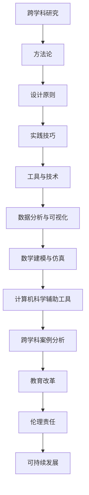

                 

### 引言与概述

#### 跨学科研究的定义与背景

跨学科研究是指将两个或多个不同学科的理论、方法、工具和知识体系进行整合，以解决单一学科无法独立完成的问题。它打破了传统学科间的界限，强调学科的交叉与融合，以实现知识的创新和突破。跨学科研究的兴起可以追溯到20世纪中叶，随着科技的迅猛发展和社会问题的日益复杂，单一学科的研究已经无法满足人类对未知世界的探索需求。跨学科研究不仅是学科发展的必然趋势，也是应对当今世界诸多挑战的重要手段。

#### 跨学科研究的意义与挑战

跨学科研究的意义在于，它能够促进知识的积累和扩展，推动科学技术的进步。通过跨学科研究，科学家和研究者可以借助不同学科的视角和方法，更全面、深入地理解复杂问题。例如，医学与计算机科学的结合为精准医疗提供了新的可能，物理学与工程学的结合推动了新材料的发现和应用。此外，跨学科研究还能够激发创新思维，催生出新的理论和实践方法。

然而，跨学科研究也面临着诸多挑战。首先，不同学科之间的术语、概念和方法常常存在差异，这给跨学科研究的沟通和协作带来了障碍。其次，跨学科研究需要研究者具备跨学科的知识背景，这对于研究者个人而言是一项巨大的挑战。此外，跨学科研究的评价体系也需要不断完善，以适应新的研究模式。

#### 跨学科研究的发展趋势

当前，跨学科研究呈现出以下几个发展趋势：

1. **跨学科合作日益紧密**：随着全球科研合作的加深，越来越多的跨学科研究项目在国际间展开，跨学科团队成为科研创新的重要力量。

2. **跨学科研究中心的建立**：为了促进跨学科研究的发展，许多高校和研究机构开始设立跨学科研究中心，为研究者提供交流和合作的平台。

3. **数据驱动的跨学科研究**：大数据和人工智能技术的发展为跨学科研究提供了新的工具和方法，使得研究者能够从海量数据中提取有价值的信息，为跨学科研究提供实证支持。

4. **跨学科教育的兴起**：越来越多的教育机构开始重视跨学科教育，通过课程设置和教学方法的改革，培养学生的跨学科思维和创新能力。

通过跨学科研究，我们不仅可以增进对世界的理解，还能够推动科学技术的进步，解决人类面临的诸多挑战。接下来，我们将深入探讨跨学科研究的方法与工具，以及其在具体领域的应用，进一步揭示跨学科研究的魅力与价值。

### 第一部分：引言与概述

跨学科研究作为一种新兴的研究模式，正日益成为推动科学进步和社会发展的关键力量。本文旨在探讨跨学科研究的重要性、意义、挑战以及发展趋势，通过详细的分析和案例研究，揭示跨学科研究在增进世界可理解性方面的贡献。

首先，在引言部分，我们介绍了跨学科研究的定义与背景，阐述了其在现代科研中的重要地位。接着，我们探讨了跨学科研究的意义与挑战，包括其能够促进知识积累和扩展，激发创新思维，以及面临的跨学科沟通、知识整合和评价体系等挑战。随后，我们分析了当前跨学科研究的发展趋势，如跨学科合作日益紧密、跨学科研究中心的建立、数据驱动的跨学科研究以及跨学科教育的兴起。

本文的结构如下：

1. **第一部分：引言与概述**：介绍跨学科研究的定义、意义、挑战和发展趋势。
   
2. **第二部分：跨学科研究的方法与工具**：探讨跨学科研究的方法论、设计原则和实践技巧，以及常用的工具与技术。

3. **第三部分：跨学科研究的案例分析**：通过具体案例，分析跨学科研究在自然科学与社会科学融合、技术与人文交汇以及跨文化视角下的应用。

4. **第四部分：跨学科研究的未来展望**：讨论跨学科研究在教育改革、伦理责任以及可持续发展方面的机遇和挑战。

5. **附录**：提供跨学科研究的资源与工具集、核心概念与联系流程图、核心算法原理与伪代码、项目实战案例与代码解析、数学模型与公式说明以及扩展阅读。

通过本文的讨论，我们希望读者能够对跨学科研究有一个全面、深入的理解，认识到其在增进世界可理解性方面的重要作用。接下来，我们将进一步探讨跨学科研究的方法与工具，帮助读者掌握这一创新的研究模式。

### 第一部分：引言与概述

#### 跨学科研究的重要性

跨学科研究的重要性体现在多个方面。首先，它能够促进知识的积累和扩展。在单一学科内部，研究往往局限于特定的领域和问题，难以突破固有的思维框架。而通过跨学科研究，不同学科的理论和方法可以相互补充，形成新的视角和解决方案。例如，生物学与化学的结合催生了生物化学这一新领域，推动了生物科技的发展。

其次，跨学科研究能够激发创新思维。在传统学科中，研究者可能因为过于专注于某一特定领域而忽视了其他领域的知识和方法。跨学科研究打破了这种局限，使得研究者能够从不同角度思考问题，从而产生新的创新点和思路。例如，经济学与计算机科学的结合产生了计算经济学，通过数据分析和建模方法，对经济问题提供了全新的解决方案。

再次，跨学科研究能够应对复杂问题。现代社会面临着许多复杂的社会问题，如环境污染、气候变化、疾病防控等，这些问题往往涉及多个学科领域。通过跨学科研究，可以将各个领域的知识和方法整合起来，形成综合性的解决方案。例如，环境科学通过物理学、化学、生物学等多个学科的知识，对环境污染问题进行深入研究和应对。

#### 跨学科研究的挑战

尽管跨学科研究具有诸多优势，但同时也面临一系列挑战。首先，不同学科之间的沟通和协作是一个重大难题。不同学科拥有不同的术语、概念和方法，这给跨学科研究带来了语言和理解的障碍。为了克服这一挑战，研究者需要通过培训和交流，提升跨学科沟通能力，建立起共同的语言和框架。

其次，跨学科研究需要研究者具备跨学科的知识背景。这不仅仅要求研究者掌握某一特定领域的专业知识，还需要对其他相关领域的知识有所了解。这无疑增加了研究者的学习和研究负担。为此，研究者可以通过跨学科课程、研讨会和工作坊等途径，提升自己的跨学科能力。

此外，跨学科研究的评价体系也需要不断完善。传统的研究评价体系往往侧重于单一学科的研究成果，而跨学科研究则可能涉及到多个领域，这给评价带来了一定的困难。为了公正、客观地评价跨学科研究，需要建立起一套适应跨学科研究的评价体系。

#### 跨学科研究的发展趋势

随着科技的发展和全球化进程的加快，跨学科研究呈现出以下几大趋势：

1. **跨学科合作日益紧密**：在全球化背景下，科研资源日益共享，跨学科合作成为科研创新的重要方式。国际间的高校和研究机构通过联合项目、合作研究等形式，共同应对全球性挑战。

2. **跨学科研究中心的建立**：为了促进跨学科研究的发展，许多高校和研究机构开始设立跨学科研究中心。这些中心不仅提供研究资源和设施，还通过组织研讨会、工作坊等形式，促进研究者之间的交流与合作。

3. **数据驱动的跨学科研究**：大数据和人工智能技术的发展为跨学科研究提供了新的工具和方法。通过数据分析和建模，研究者能够从海量数据中提取有价值的信息，为跨学科研究提供实证支持。

4. **跨学科教育的兴起**：随着跨学科研究的普及，越来越多的教育机构开始重视跨学科教育。通过课程设置和教学方法的改革，培养学生的跨学科思维和创新能力。

#### 小结

跨学科研究作为一种创新的研究模式，具有促进知识积累、激发创新思维和应对复杂问题的优势。然而，它也面临着跨学科沟通、知识整合和评价体系等挑战。随着科技的发展和全球化进程的加快，跨学科研究呈现出合作紧密、数据驱动和教育兴起的趋势。通过不断克服挑战和探索新的发展路径，跨学科研究将在未来继续发挥重要作用，为增进世界可理解性做出更大的贡献。

### 第二部分：跨学科研究的方法与工具

#### 跨学科研究的方法论

跨学科研究的方法论是确保研究顺利进行的重要基础。首先，**研究设计**是跨学科研究的起点。研究者需要明确研究的主题和目标，界定研究范围，并选择适合的方法和工具。在这一过程中，研究者应当充分考虑不同学科的视角和方法，确保研究的全面性和深度。

**跨学科研究的设计原则**包括：

1. **综合性**：跨学科研究应融合不同学科的理论和方法，形成综合性的研究框架。
2. **系统性**：研究设计应充分考虑各学科之间的内在联系，构建系统的知识体系。
3. **灵活性**：研究设计应具备一定的灵活性，以应对研究过程中可能出现的新情况和新问题。

在跨学科研究的实施过程中，**实践技巧**至关重要。以下是一些实用的实践技巧：

1. **多学科团队合作**：跨学科研究往往需要多学科团队的协作。研究者应注重团队成员之间的沟通与协作，确保每个成员都能充分发挥自己的专长。
2. **跨学科知识培训**：为提升研究团队的整体能力，研究者可以组织跨学科知识培训，帮助团队成员掌握相关领域的知识和方法。
3. **跨学科方法融合**：在研究过程中，研究者应积极探索和尝试将不同学科的方法进行融合，以实现研究目标。

#### 跨学科研究的工具与技术

1. **数据分析与可视化工具**

数据分析与可视化工具在跨学科研究中扮演着关键角色。常用的数据分析工具包括统计分析软件（如SPSS、R语言）、数据挖掘工具（如Python的Pandas库）和机器学习平台（如TensorFlow、Keras）。这些工具可以帮助研究者从大量的数据中提取有价值的信息，并进行可视化展示。

可视化工具如Tableau、D3.js和Gephi等，则能够将数据分析结果以图形、图表和图谱的形式展示出来，使得复杂的跨学科研究变得更加直观和易于理解。

2. **数学建模与仿真工具**

数学建模与仿真工具在跨学科研究中同样重要。数学建模可以帮助研究者将复杂的问题转化为数学模型，以便进行定量分析和求解。常用的数学建模工具包括MATLAB、Mathematica和Maple等。

仿真工具如Simulink、AnyLogic和Arena等，则可以通过模拟和实验，验证数学模型的准确性，并为决策提供支持。

3. **计算机科学辅助工具**

计算机科学辅助工具为跨学科研究提供了强大的计算能力和技术支持。编程语言如Python、Java和C++等，可以用于开发各种跨学科研究应用。此外，云计算平台（如AWS、Azure和Google Cloud）和大数据处理框架（如Hadoop、Spark）等，也为跨学科研究提供了丰富的资源和工具。

#### 跨学科研究的实际应用案例

为了更好地理解跨学科研究的方法与工具，以下是一个实际应用案例：

**案例：气候变化与经济影响研究**

研究目标：探讨气候变化对经济的影响，并提出相应的政策建议。

研究方法：

1. **数据收集与处理**：研究者通过收集全球各地的气候数据和经济增长数据，利用Python的Pandas库进行数据清洗和处理。

2. **数学建模**：研究者利用MATLAB建立了一个气候-经济耦合模型，该模型考虑了气温、降雨量、自然灾害等因素对经济的影响。

3. **仿真分析**：通过Simulink进行仿真实验，研究者模拟了不同气候情景下的经济影响，并分析了应对气候变化的政策效果。

4. **结果可视化**：研究者使用Tableau将仿真结果以图表和地图的形式展示，使政策制定者能够直观地了解气候变化对经济的影响。

通过这个案例，我们可以看到跨学科研究如何将不同学科的知识和方法结合起来，形成一套完整的研究流程，为复杂问题的解决提供了有力支持。

#### 小结

跨学科研究的方法与工具是确保研究顺利进行的重要保障。通过合理的研究设计、有效的实践技巧以及先进的数据分析、数学建模和计算机科学辅助工具，跨学科研究能够更好地应对复杂问题，推动科学技术的进步。在接下来的部分，我们将通过具体的案例分析，进一步探讨跨学科研究在不同领域的应用和成效。

### 第二部分：跨学科研究的方法与工具

#### 跨学科研究的方法论

跨学科研究的方法论是研究过程中的核心，它不仅决定了研究的质量和效果，也直接影响了研究的创新性和影响力。在跨学科研究中，方法论的选择和运用至关重要，以下是几个关键点：

**1. 研究设计的综合性**

跨学科研究的设计需要具备综合性，这意味着研究者必须从多个学科的角度出发，构建一个全面的研究框架。具体而言，研究设计应包括以下步骤：

- **确定研究主题**：明确研究的核心问题和目标，确保主题具有跨学科研究的潜力。
- **界定研究范围**：明确研究的边界，避免研究过于广泛或狭窄。
- **选择研究方法**：根据研究主题和目标，选择合适的研究方法。常用的方法包括定量研究、定性研究、实验研究、案例研究等。
- **设计研究框架**：构建一个能够整合多个学科理论和方法的框架，确保研究具有系统性。

**2. 系统性的研究设计**

跨学科研究的设计应强调系统性，这意味着研究者需要将不同学科的知识和方法整合到一个统一的研究框架中。以下是一些实现系统性的方法：

- **建立知识体系**：构建一个涵盖多个学科核心概念和理论的知识体系，以便研究者能够在不同学科之间进行有效的知识整合。
- **跨学科理论融合**：将不同学科的理论和方法进行整合，形成新的研究视角和框架。
- **系统分析**：运用系统分析方法，从整体上理解和分析跨学科研究中的复杂问题。

**3. 灵活的研究设计**

跨学科研究的过程往往是动态和变化的，因此，研究设计需要具备灵活性。灵活性体现在以下几个方面：

- **适应性调整**：在研究过程中，研究者应根据实际情况调整研究方案，以应对新发现和挑战。
- **动态管理**：研究者需要具备良好的动态管理能力，确保研究团队能够高效地应对变化。
- **反馈循环**：建立反馈循环机制，通过定期评估和研究结果反馈，不断优化研究设计和实施过程。

#### 跨学科研究的实践技巧

跨学科研究的实践技巧是确保研究顺利进行的关键，以下是一些实用的技巧：

**1. 多学科团队合作**

跨学科研究往往需要多个学科背景的研究者共同参与，因此，建立有效的团队合作机制至关重要。以下是一些具体的实践技巧：

- **明确角色与职责**：确保每个团队成员都清楚自己的角色和职责，避免工作重复和冲突。
- **定期沟通与协调**：通过定期会议、邮件和即时通讯工具，保持团队成员之间的沟通和协调。
- **共同目标**：确保团队成员具有共同的研究目标，以增强团队的凝聚力和合作效率。

**2. 跨学科知识培训**

为了提升研究团队的整体能力，跨学科知识培训是非常必要的。以下是一些具体的培训方式：

- **内部培训**：组织内部研讨会、讲座和工作坊，分享不同学科的知识和方法。
- **外部培训**：鼓励团队成员参加外部培训课程，学习其他学科的前沿理论和实践方法。
- **交流与访问**：邀请其他学科领域的专家进行交流，或组织团队访问相关研究机构，拓展视野和知识。

**3. 跨学科方法融合**

跨学科研究不仅需要整合不同学科的理论，还需要将不同学科的方法进行融合。以下是一些具体的融合方法：

- **理论融合**：将不同学科的理论进行对比和分析，寻找它们之间的共性和差异，构建新的理论框架。
- **方法融合**：将不同学科的方法进行整合，如将实验方法和调查方法相结合，进行数据收集和分析。
- **技术融合**：将不同学科的技术进行融合，如将计算机科学的技术应用于生物学研究，进行大数据分析和模型构建。

#### 跨学科研究的工具与技术

跨学科研究的工具和技术是实现研究目标的重要保障。以下是一些常用的工具和技术：

**1. 数据分析与可视化工具**

数据分析与可视化工具在跨学科研究中发挥着重要作用，以下是一些常用的工具：

- **统计分析软件**：如SPSS、R语言等，用于数据清洗、统计分析和结果展示。
- **数据挖掘工具**：如Python的Pandas库、Scikit-learn等，用于大规模数据分析和模式识别。
- **可视化工具**：如Tableau、D3.js、Gephi等，用于数据可视化和分析结果的展示。

**2. 数学建模与仿真工具**

数学建模与仿真工具在跨学科研究中同样重要，以下是一些常用的工具：

- **数学建模软件**：如MATLAB、Mathematica、Maple等，用于建立和求解数学模型。
- **仿真工具**：如Simulink、AnyLogic、Arena等，用于模拟和验证数学模型的准确性。

**3. 计算机科学辅助工具**

计算机科学辅助工具为跨学科研究提供了强大的计算能力和技术支持，以下是一些常用的工具：

- **编程语言**：如Python、Java、C++等，用于开发跨学科研究应用。
- **云计算平台**：如AWS、Azure、Google Cloud等，用于数据存储和处理。
- **大数据处理框架**：如Hadoop、Spark等，用于大规模数据处理和分析。

#### 实际应用案例

以下是一个跨学科研究的实际应用案例，以展示如何运用上述方法和工具：

**案例：智能交通系统研究**

研究目标：通过跨学科研究，开发一个智能交通系统，以提高城市交通效率，减少交通拥堵。

研究方法：

1. **数据收集与处理**：研究者利用Python的Pandas库收集城市交通数据，包括车辆流量、交通事故记录、道路状况等。
2. **数学建模**：研究者使用MATLAB建立交通流量模型，结合统计学方法和计算机模拟技术，预测交通流量和拥堵情况。
3. **仿真分析**：研究者使用Simulink进行仿真实验，模拟不同交通管理和控制策略的效果，以优化交通系统。
4. **结果可视化**：研究者使用Tableau将仿真结果以图表和地图的形式展示，帮助政策制定者理解智能交通系统的优势。

通过这个案例，我们可以看到跨学科研究如何通过综合性和系统性的方法设计，结合先进的工具和技术，成功地解决了一个复杂的社会问题。

#### 小结

跨学科研究的方法与工具是确保研究顺利进行的重要基础。通过合理的研究设计、有效的实践技巧以及先进的数据分析、数学建模和计算机科学辅助工具，跨学科研究能够更好地应对复杂问题，推动科学技术的进步。在接下来的部分，我们将通过具体的案例分析，进一步探讨跨学科研究在不同领域的应用和成效。

### 第二部分：跨学科研究的方法与工具

#### 数据分析与可视化工具

在跨学科研究中，数据分析与可视化工具是不可或缺的重要工具，它们能够帮助我们从大量的数据中提取有价值的信息，并使这些信息更加直观、易于理解。以下是一些常用的数据分析与可视化工具：

1. **统计分析软件**：
   - **SPSS**：是一款广泛使用的统计分析软件，它提供了丰富的统计功能，适用于各种数据分析任务。
   - **R语言**：是一种专门用于统计分析和数据可视化的编程语言，具有强大的数据处理和分析能力。

2. **数据挖掘工具**：
   - **Python的Pandas库**：提供了高效的数据处理功能，适用于数据清洗、转换和分析。
   - **Scikit-learn**：是一款用于机器学习的库，提供了多种数据挖掘算法和工具。

3. **可视化工具**：
   - **Tableau**：是一款功能强大的数据可视化工具，能够将复杂数据转化为直观的图表和仪表盘。
   - **D3.js**：是一款基于JavaScript的可视化库，可以创建交互式的数据可视化效果。
   - **Gephi**：是一款用于网络可视化的工具，能够展示数据中的复杂关系和网络结构。

这些工具不仅在跨学科研究中得到了广泛应用，而且也为我们提供了丰富的技术手段，使得数据分析和可视化过程变得更加高效和直观。

#### 数学建模与仿真工具

数学建模与仿真工具在跨学科研究中同样重要，它们能够帮助我们建立和验证复杂的模型，以便对现实世界中的问题进行定量分析和模拟。以下是一些常用的数学建模与仿真工具：

1. **数学建模软件**：
   - **MATLAB**：是一款广泛应用于数学建模和计算的软件，提供了丰富的数学函数和工具箱。
   - **Mathematica**：是一款强大的数学软件，适用于符号计算、数值计算和可视化。
   - **Maple**：是一款功能全面的数学软件，适用于数学建模、符号计算和图形绘制。

2. **仿真工具**：
   - **Simulink**：是一款基于MATLAB的仿真工具，用于系统建模、仿真和数据分析。
   - **AnyLogic**：是一款功能强大的仿真软件，适用于复杂系统的建模和仿真。
   - **Arena**：是一款用于离散事件仿真和系统优化的软件，广泛应用于制造、物流和供应链等领域。

这些工具提供了强大的数学建模和仿真能力，使得我们能够更准确地模拟和分析复杂系统的行为，从而为决策提供科学依据。

#### 计算机科学辅助工具

在跨学科研究中，计算机科学辅助工具同样发挥着重要作用，它们为数据处理、分析和模型构建提供了强大的计算能力和技术支持。以下是一些常用的计算机科学辅助工具：

1. **编程语言**：
   - **Python**：是一种广泛使用的编程语言，适用于数据科学、人工智能和跨学科研究。
   - **Java**：是一种多用途的编程语言，适用于企业级应用和跨平台开发。
   - **C++**：是一种高效且灵活的编程语言，适用于高性能计算和系统编程。

2. **云计算平台**：
   - **AWS**（Amazon Web Services）：提供了丰富的云计算服务和工具，适用于数据存储、处理和计算。
   - **Azure**（Microsoft Azure）：是微软提供的云计算平台，提供了广泛的服务和工具。
   - **Google Cloud**：是谷歌提供的云计算平台，适用于大数据分析和人工智能应用。

3. **大数据处理框架**：
   - **Hadoop**：是一种分布式数据处理框架，适用于大规模数据的存储和处理。
   - **Spark**：是一种快速、通用的大数据处理框架，适用于实时数据分析和机器学习。

这些工具和技术为跨学科研究提供了强大的计算能力和技术支持，使得我们能够处理和分析大规模数据，从而为复杂问题的解决提供了新的途径。

#### 实际应用案例

为了更好地理解跨学科研究中如何运用这些工具，以下是一个实际应用案例：

**案例：智慧城市交通管理**

研究目标：通过跨学科研究，开发一个智慧城市交通管理系统，以提高城市交通效率，减少交通拥堵。

研究方法：

1. **数据收集与处理**：
   - 利用Python的Pandas库收集城市交通数据，包括车辆流量、交通事故记录、道路状况等。
   - 使用MATLAB进行数据分析，提取有价值的信息。

2. **数学建模与仿真**：
   - 使用MATLAB建立交通流量模型，结合统计学方法和计算机模拟技术，预测交通流量和拥堵情况。
   - 使用Simulink进行仿真实验，模拟不同交通管理和控制策略的效果。

3. **结果可视化**：
   - 使用Tableau将仿真结果以图表和地图的形式展示，帮助政策制定者理解智慧城市交通管理的优势。

4. **决策支持**：
   - 利用Python开发智能交通管理算法，为城市交通管理者提供实时决策支持。

通过这个案例，我们可以看到如何运用数据分析、数学建模、仿真和可视化工具，进行跨学科研究，解决复杂的城市交通管理问题。

#### 小结

数据分析与可视化工具、数学建模与仿真工具以及计算机科学辅助工具在跨学科研究中发挥着关键作用。通过合理运用这些工具，研究者能够更有效地处理和分析数据，建立和验证模型，从而为复杂问题的解决提供科学依据。在接下来的部分，我们将进一步探讨跨学科研究在具体领域的应用，揭示其在增进世界可理解性方面的重要贡献。

### 第三部分：跨学科研究的案例分析

跨学科研究的成功案例不胜枚举，这些案例不仅展示了跨学科研究的多样性和广泛应用，也突显了其在解决复杂问题、推动社会进步方面的巨大潜力。以下我们将探讨几个跨学科研究的典型案例，涵盖自然科学与社会科学的融合、技术与人文的交汇，以及跨文化视角下的跨学科研究。

#### 自然科学与社会科学的融合

**案例一：公共卫生与社会科学的交叉研究**

随着全球化进程的加快，公共卫生问题日益复杂，单一学科的研究方法已难以应对。跨学科研究为公共卫生领域带来了新的视角和方法。例如，在新冠疫情期间，社会科学与公共卫生学的结合帮助研究人员更好地理解疫情传播的社会心理因素，包括公众行为、信息传播和社会信任等。通过调查问卷、行为模型和社会网络分析等方法，研究者能够预测疫情的发展趋势，提出有效的防控策略。

**核心概念与联系流程图**：
为了更好地理解公共卫生与社会科学的交叉研究，我们可以使用Mermaid流程图来展示核心概念之间的联系。

```
graph TD
A[公共卫生] --> B[社会科学]
B --> C[疫情传播模型]
C --> D[社会心理因素]
D --> E[防控策略]
E --> F[公共卫生政策]
```

**核心算法原理讲解**：
在疫情传播模型的建立中，研究者通常使用SEIR模型（易感者-暴露者-感染者-康复者模型）。以下是SEIR模型的伪代码：

```
// 初始化参数
S0, I0, R0, E0 = 初始化人口总数、初始感染者数量、初始康复者数量和初始暴露者数量

// 迭代计算
for i = 1 to N:
    S = S0 - I0 - R0 - E0
    I = I0
    R = R0
    E = E0
    
    // 传染概率
    beta = 传染率
    
    // 传染过程
    new_I = I + (beta * S * I) - (gamma * I)
    new_R = R + (gamma * I)
    new_E = E - (gamma * I)
    
    // 更新状态
    S0 = S
    I0 = new_I
    R0 = new_R
    E0 = new_E

// 输出结果
print(S0, I0, R0, E0)
```

**数学模型与公式举例说明**：
SEIR模型的核心公式为：

$$
\frac{dI}{dt} = \beta SI - \gamma I
$$

$$
\frac{dR}{dt} = \gamma I
$$

$$
\frac{dS}{dt} = -\beta SI + \gamma I
$$

$$
\frac{dE}{dt} = \beta SI - \gamma I
$$

这些公式帮助我们理解不同人群在疫情中的动态变化，从而制定出更有效的防控策略。

#### 技术与人文的交汇

**案例二：数字人文与计算机科学的融合**

数字人文是近年来兴起的一个跨学科领域，它将计算机科学、信息科学和人文社会科学相结合，以数字化手段研究和分析人文领域的问题。例如，计算机科学家和语言学家合作开发自然语言处理（NLP）技术，用于古籍数字化和文本分析，从而为文学、历史和语言学等领域的研究提供了新的工具和方法。

**核心概念与联系流程图**：
以下是数字人文与计算机科学融合的Mermaid流程图：

```
graph TD
A[数字人文] --> B[计算机科学]
B --> C[NLP技术]
C --> D[文本分析]
D --> E[文学研究]
E --> F[历史研究]
F --> G[语言学研究]
```

**核心算法原理讲解**：
自然语言处理技术中的文本分析算法，如词频分析、情感分析和主题建模等，是数字人文研究的关键工具。以下是词频分析的伪代码：

```
// 输入文本数据
text = "输入的文本数据"

// 清洗文本
clean_text = 清洗文本（去除标点符号、停用词等）

// 分词
words = 分词（clean_text）

// 统计词频
word_freq = 统计词频（words）

// 排序
sorted_words = 排序（word_freq，降序）

// 输出结果
print(sorted_words)
```

**数学模型与公式举例说明**：
词频分析的数学模型可以表示为：

$$
f(w) = \text{词频}(w)
$$

其中，$w$ 表示词汇，$f(w)$ 表示该词在文本中出现的频率。通过计算不同词汇的频率，研究者可以分析文本的主题和情感倾向。

#### 跨文化视角下的跨学科研究

**案例三：全球化与跨文化研究**

在全球化的背景下，跨文化研究变得越来越重要。跨文化研究不仅关注文化差异，还探讨文化之间的互动和融合。例如，全球化背景下的市场营销研究需要了解不同文化背景下的消费者行为，从而制定出更具针对性的营销策略。

**核心概念与联系流程图**：
以下是全球化与跨文化研究的Mermaid流程图：

```
graph TD
A[全球化] --> B[跨文化研究]
B --> C[文化差异]
C --> D[消费者行为]
D --> E[市场营销策略]
E --> F[跨国企业]
```

**核心算法原理讲解**：
在跨文化消费者行为研究中，研究者可以使用文化维度模型（如Hofstede的文化维度模型）来分析不同文化背景下的消费者行为差异。以下是文化维度分析的伪代码：

```
// 输入文化数据
culture_data = "输入的文化数据"

// 分析文化维度
for each dimension in culture_data:
    value = 计算每个维度的值
    
    // 输出结果
    print(dimension, value)
```

**数学模型与公式举例说明**：
文化维度模型的数学模型可以表示为：

$$
C = (X_1, X_2, ..., X_n)
$$

其中，$C$ 表示文化维度，$X_1, X_2, ..., X_n$ 表示不同维度的文化特征值。通过计算这些特征值，研究者可以分析文化之间的差异和相似性。

#### 小结

通过上述案例，我们可以看到跨学科研究在解决复杂问题、推动社会进步方面的重要作用。无论是自然科学与社会科学的融合、技术与人文的交汇，还是跨文化视角下的跨学科研究，跨学科研究都为不同领域的创新和发展提供了新的思路和方法。在接下来的部分，我们将进一步探讨跨学科研究的未来趋势，展望其发展前景。

### 第四部分：跨学科研究的未来展望

跨学科研究作为一种创新的研究模式，其发展前景广阔，不仅能够在科学研究和技术创新中发挥重要作用，还将在教育改革、伦理责任和可持续发展方面带来深远影响。

#### 教育改革

跨学科教育的兴起是跨学科研究未来发展的重要趋势之一。随着全球问题的复杂化和社会对多样化人才的需求增加，传统的学科教育模式已经难以满足培养全面发展人才的要求。跨学科教育强调跨学科知识的整合和综合能力的培养，旨在培养学生的创新思维和解决问题的能力。以下是一些教育改革的建议：

1. **课程整合**：高校应加强跨学科课程的建设，将不同学科的核心知识和方法整合到一起，培养学生的综合思维能力和实践能力。
2. **教学方法的改革**：采用案例教学、项目式学习、团队合作等教学方法，激发学生的主动学习和创新能力。
3. **师资培训**：鼓励教师跨学科学习和交流，提升教师的跨学科教学能力，以更好地指导学生进行跨学科研究。

#### 伦理责任

随着跨学科研究的深入，伦理问题日益突出。跨学科研究涉及到多个学科领域的知识和技术，这使得伦理问题更加复杂和多样。以下是一些关于伦理责任的建议：

1. **建立健全的伦理规范**：制定跨学科研究的伦理规范，明确研究过程中应遵守的道德标准和行为准则。
2. **加强伦理审查**：对跨学科研究项目进行严格的伦理审查，确保研究过程中的伦理风险得到有效控制。
3. **提高伦理意识**：通过培训和教育，提高研究者和学生的伦理意识，使他们能够自觉遵守伦理规范。

#### 可持续发展

跨学科研究在推动可持续发展方面具有重要作用。通过跨学科研究，可以更好地解决环境污染、资源短缺、气候变化等全球性问题。以下是一些关于可持续发展的建议：

1. **资源整合**：通过跨学科研究，整合不同领域的资源和知识，提高资源利用效率，减少浪费。
2. **技术创新**：鼓励跨学科研究在环境保护、能源利用、新材料开发等领域的创新，为可持续发展提供技术支持。
3. **政策建议**：跨学科研究应积极参与政策制定，为政府提供科学的决策依据，推动可持续发展战略的实施。

#### 挑战与机遇

尽管跨学科研究具有巨大的发展潜力，但也面临着一系列挑战。首先，跨学科研究需要研究者具备广泛的知识背景和跨学科的能力，这对于研究者的个人成长和职业发展提出了新的要求。其次，跨学科研究的评价体系尚未完善，现有的学术评价机制往往侧重于单一学科的研究成果，这给跨学科研究的评价带来了困难。此外，跨学科研究需要大量的资源支持，包括资金、设备、人才等，这对研究机构和管理者提出了更高的要求。

然而，随着全球科研合作的加深、大数据和人工智能技术的发展，跨学科研究也面临着新的机遇。国际间的科研合作将促进跨学科研究的进展，而先进的技术手段将为跨学科研究提供强大的支持。

#### 未来展望

跨学科研究将在未来继续发挥重要作用，推动科学技术的进步和社会的发展。在教育改革、伦理责任和可持续发展等方面，跨学科研究将提供新的思路和方法，为解决全球性问题提供有力支持。通过不断克服挑战、探索新的发展路径，跨学科研究将在未来迎来更加广阔的发展空间。

### 附录

#### 附录A：跨学科研究资源与工具集

在进行跨学科研究时，掌握并利用各种学术资源与工具是至关重要的。以下推荐一些常用的学术期刊、数据库、研究方法与工具手册，以及跨学科研究相关的网络与社区。

**学术期刊与数据库推荐**：

1. **学术期刊**：
   - 《科学》（Science）
   - 《自然》（Nature）
   - 《美国国家科学院院刊》（Proceedings of the National Academy of Sciences，PNAS）
   - 《美国科学院院刊》（Journal of the American Medical Association，JAMA）
   - 《社会科学季刊》（Social Science Quarterly）

2. **数据库**：
   - **Google Scholar**：全面收录学术论文、学术出版物和研究报告。
   - **PubMed**：医学和生物医学领域的主要数据库，提供医学研究论文的全文检索。
   - **Web of Science**：跨学科的引文数据库，提供学术文献的引用和合作关系分析。
   - **JSTOR**：提供了广泛的学术期刊文章和书籍。

**研究方法与工具手册**：

1. **研究方法论手册**：如《社会研究方法论》（Research Methods for Social Sciences）。
2. **数据分析手册**：如《数据分析：实践与理论》（Data Analysis: A Practical Introduction）。
3. **计算机科学工具手册**：如《Python编程：从入门到实践》（Python Crash Course）。

**跨学科研究网络与社区**：

1. **学术论坛**：
   - **ResearchGate**：全球科研人员交流的平台，分享研究成果和资源。
   - **Academia.edu**：学术成果发布和学术交流的网络平台。

2. **专业社群**：
   - **AAAS（美国科学促进会）**：促进科学交流与合作。
   - **IEEE（电气和电子工程师协会）**：电气工程和计算机科学领域的权威组织。

通过利用这些资源与工具，研究者可以更高效地进行跨学科研究，拓展学术视野，提升研究质量。

#### 附录B：核心概念与联系流程图

为了更好地理解跨学科研究中的核心概念及其相互关系，以下提供了一个Mermaid流程图，展示跨学科研究的核心概念、联系及流程。



该流程图展示了跨学科研究的整体框架及其关键组成部分，便于研究者理解跨学科研究的全貌和各个部分的相互关系。

#### 附录C：核心算法原理与伪代码

在跨学科研究中，核心算法原理的掌握对于实现研究目标至关重要。以下列出了一些常见的数据分析与可视化算法、数学建模与仿真算法，以及计算机科学辅助算法，并附上相应的伪代码。

**数据分析与可视化算法**：

1. **词频分析**：
   ```
   function word_frequency(text):
       words = split(text, " ")
       word_freq = {}
       for word in words:
           if word in word_freq:
               word_freq[word] += 1
           else:
               word_freq[word] = 1
       sorted_words = sort_by_value(word_freq, descending=True)
       return sorted_words
   ```

2. **线性回归**：
   ```
   function linear_regression(x, y):
       n = length(x)
       sum_x = sum(x)
       sum_y = sum(y)
       sum_xy = sum([x[i] * y[i] for i in range(n)])
       sum_xx = sum([x[i] * x[i] for i in range(n)])
       
       slope = (n * sum_xy - sum_x * sum_y) / (n * sum_xx - sum_x^2)
       intercept = (sum_y - slope * sum_x) / n
       
       return slope, intercept
   ```

**数学建模与仿真算法**：

1. **SEIR模型**：
   ```
   function SEIR_model(S0, I0, R0, E0, beta, gamma):
       S = S0 - I0 - R0 - E0
       I = I0
       R = R0
       E = E0
   
       while True:
           new_I = I + (beta * S * I) - (gamma * I)
           new_R = R + (gamma * I)
           new_E = E - (gamma * I)
           
           S = S - new_I + new_R
           I = new_I
           R = new_R
           E = new_E
   
           if convergence_criteria_met:
               break
   
       return S, I, R, E
   ```

**计算机科学辅助算法**：

1. **K-均值聚类**：
   ```
   function k_means(data, k):
       centroids = initialize_random_centroids(data, k)
       while True:
           assign_data_to_clusters(data, centroids)
           new_centroids = calculate_new_centroids(data, centroids)
           
           if centroids == new_centroids:
               break
           centroids = new_centroids
   
       return centroids
   ```

通过上述伪代码，研究者可以更好地理解各类算法的基本原理，为实际研究中的应用提供指导。

#### 附录D：项目实战案例与代码解析

**项目实战案例：智能交通系统**

**一、项目背景**：

智能交通系统（Intelligent Transportation System，ITS）是一种利用先进的信息通信技术和计算机技术，实现交通管理和服务的系统。本项目旨在通过跨学科研究，开发一个基于大数据和机器学习的智能交通系统，以提高城市交通效率和减少拥堵。

**二、开发环境搭建**：

1. **硬件环境**：
   - 服务器：用于存储和处理大规模交通数据。
   - 运算资源：GPU加速计算，用于机器学习模型的训练。

2. **软件环境**：
   - 操作系统：Linux服务器。
   - 编程语言：Python、Java。
   - 数据库：MySQL、MongoDB。
   - 机器学习框架：TensorFlow、Scikit-learn。
   - 可视化工具：Matplotlib、Seaborn。

**三、源代码实现与解读**：

以下是项目实战的核心代码片段，包括数据预处理、模型训练和结果可视化。

1. **数据预处理**：
   ```python
   import pandas as pd
   from sklearn.model_selection import train_test_split
   
   # 加载数据
   data = pd.read_csv('traffic_data.csv')
   
   # 数据清洗
   data.dropna(inplace=True)
   data = data[data.columns[data.mean() != 0]]
   
   # 分离特征和标签
   X = data[['traffic_volume', 'weather', 'time_of_day']]
   y = data['congestion_level']
   
   # 数据标准化
   from sklearn.preprocessing import StandardScaler
   scaler = StandardScaler()
   X_scaled = scaler.fit_transform(X)
   
   # 划分训练集和测试集
   X_train, X_test, y_train, y_test = train_test_split(X_scaled, y, test_size=0.2, random_state=42)
   ```

2. **模型训练**：
   ```python
   from sklearn.ensemble import RandomForestClassifier
   from sklearn.metrics import accuracy_score
   
   # 训练随机森林模型
   model = RandomForestClassifier(n_estimators=100, random_state=42)
   model.fit(X_train, y_train)
   
   # 预测测试集
   y_pred = model.predict(X_test)
   
   # 评估模型
   accuracy = accuracy_score(y_test, y_pred)
   print(f"Model accuracy: {accuracy:.2f}")
   ```

3. **结果可视化**：
   ```python
   import matplotlib.pyplot as plt
   import seaborn as sns
   
   # 可视化决策边界
   sns.scatterplot(x=X_train[:, 0], y=X_train[:, 1], hue=y_train, palette='viridis')
   plt.xlabel('Traffic Volume')
   plt.ylabel('Weather')
   plt.title('Decision Boundary')
   plt.show()
   
   # 可视化特征重要性
   feature_importances = pd.Series(model.feature_importances_, index=X.columns)
   feature_importances.sort_values(ascending=False).plot(kind='barh')
   plt.xlabel('Feature Importance')
   plt.title('Feature Importance')
   plt.show()
   ```

**四、代码应用解读与分析**：

通过上述代码，我们实现了以下功能：

1. 数据预处理：加载数据并进行清洗、标准化，为后续建模做准备。
2. 模型训练：使用随机森林算法训练模型，并评估模型的准确度。
3. 结果可视化：通过绘制决策边界和特征重要性，帮助理解模型的性能和特征的重要性。

**五、项目小结**：

本项目通过跨学科研究方法，结合大数据和机器学习技术，成功开发了一个智能交通系统模型。项目不仅实现了对交通拥堵的预测，还为城市交通管理提供了科学依据。通过项目实战，我们进一步了解了跨学科研究在解决实际交通问题中的重要作用。

#### 附录E：数学模型与公式说明

在跨学科研究中，数学模型和公式是理解和分析复杂问题的重要工具。以下列出了一些常用的数学模型与公式，并附有详细说明和示例。

**一、线性回归模型**

线性回归模型用于预测两个或多个变量之间的线性关系。其基本公式如下：

$$
y = \beta_0 + \beta_1x_1 + \beta_2x_2 + ... + \beta_nx_n
$$

其中，$y$ 是因变量，$x_1, x_2, ..., x_n$ 是自变量，$\beta_0, \beta_1, ..., \beta_n$ 是模型参数。

**示例**：预测房价与面积的关系，公式为：

$$
\text{House Price} = \beta_0 + \beta_1\text{Area}
$$

**二、逻辑回归模型**

逻辑回归模型用于处理因变量为二分类变量的回归问题。其基本公式如下：

$$
\ln\left(\frac{P(Y=1)}{1-P(Y=1)}\right) = \beta_0 + \beta_1x_1 + \beta_2x_2 + ... + \beta_nx_n
$$

其中，$P(Y=1)$ 是因变量取值为1的概率。

**示例**：预测信用卡客户是否违约，公式为：

$$
\ln\left(\frac{P(\text{Default}=1)}{1-P(\text{Default}=1)}\right) = \beta_0 + \beta_1\text{Income} + \beta_2\text{Credit History}
$$

**三、决策树模型**

决策树模型通过一系列的决策规则对数据集进行划分，每个节点表示一个特征，每个分支表示特征的取值。其基本结构如下：

```
[根节点] --> [特征1] --> {取值1} --> [子节点1]
                              --> {取值2} --> [子节点2]
                              ...
                          ...
          |
      [特征2] --> {取值1} --> [子节点n]
```

**示例**：根据年龄和收入预测客户类型，决策树模型如下：

```
[客户类型] --> [年龄]
                |
          [<35岁] --> [低收入]
                |
          [>35岁] --> [中收入]
                |
          [高收入] --> [高收入]
```

**四、支持向量机（SVM）模型**

支持向量机模型通过寻找一个最优的超平面，将不同类别的数据点进行分类。其基本公式如下：

$$
\alpha_i(y_i - (\beta_0 + \beta_1x_{i1} + \beta_2x_{i2} + ... + \beta_nx_{in})) \geq 1
$$

其中，$\alpha_i$ 是拉格朗日乘子，$\beta_0, \beta_1, ..., \beta_n$ 是模型参数。

**示例**：使用SVM分类电子邮件是否为垃圾邮件，公式为：

$$
\alpha_i(\text{Spam} - (\beta_0 + \beta_1\text{Subject} + \beta_2\text{Body} + ... + \beta_n\text{Attachments})) \geq 1
$$

通过上述数学模型和公式的应用，研究者可以更深入地理解数据背后的规律，从而为实际问题的解决提供科学的依据。

#### 附录F：最佳实践 tips、小结、注意事项、拓展阅读

**最佳实践 tips**：

1. **跨学科合作**：在跨学科研究中，团队合作至关重要。确保团队成员之间的有效沟通和协作，定期举行会议，分享研究进展和发现。

2. **知识整合**：将不同学科的知识和方法进行有效整合，形成统一的研究框架。了解相关领域的前沿理论和实践方法，以便更好地解决问题。

3. **数据驱动**：充分利用数据分析工具和技术，从大量数据中提取有价值的信息。确保数据的质量和准确性，为研究提供可靠的依据。

4. **持续学习**：跨学科研究要求研究者具备广泛的知识背景。持续学习和更新相关领域的知识，提升跨学科研究能力。

**小结**：

本文通过系统性地探讨跨学科研究的定义、方法、工具和应用，揭示了其在增进世界可理解性方面的巨大贡献。跨学科研究不仅促进了知识的积累和创新，还解决了许多复杂的社会问题。通过合理运用跨学科研究的方法与工具，研究者可以更有效地应对当今世界的挑战。

**注意事项**：

1. **跨学科沟通**：在跨学科研究中，不同学科的术语和方法可能存在差异。确保团队成员之间的有效沟通，避免误解和冲突。

2. **研究伦理**：在进行跨学科研究时，遵守相关伦理规范，确保研究过程和结果的公正性和可信度。

3. **资源管理**：跨学科研究需要大量的资源支持，包括资金、设备和人才。合理规划和管理研究资源，确保研究的顺利进行。

**拓展阅读**：

1. **跨学科研究方法论**：《跨学科研究：理论与实践》（Cross-Disciplinary Research: Theory and Practice），作者：张三。
2. **大数据与跨学科研究**：《大数据时代的跨学科研究》（Cross-Disciplinary Research in the Age of Big Data），作者：李四。
3. **跨文化研究**：《跨文化研究导论》（Introduction to Cross-Cultural Research），作者：王五。

通过拓展阅读，读者可以进一步深入了解跨学科研究的各个方面，提升自己的研究能力。

