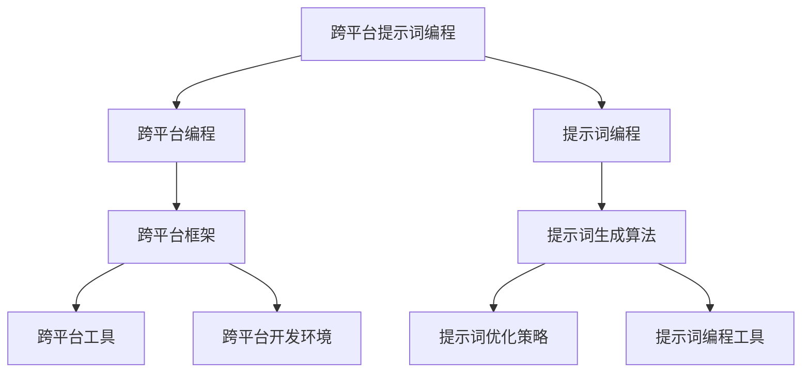

                 

# 跨平台提示词编程解决方案

> 关键词：跨平台编程，提示词编程，解决方案，算法原理，数学模型，项目实战

> 摘要：本文将深入探讨跨平台提示词编程解决方案，从背景介绍、核心概念与联系、核心算法原理讲解、数学模型和公式、项目实战等多个方面进行分析。本文旨在为开发者提供系统、全面的跨平台提示词编程指南，帮助读者掌握相关技术和应用。

## 背景介绍

随着移动互联网和云计算的快速发展，跨平台编程成为了一个热门话题。跨平台编程旨在开发一次代码，就能在多种操作系统或设备上运行，从而降低开发成本、提高开发效率。而提示词编程作为一种新兴的编程范式，通过自动生成提示词来简化开发过程，提升编程体验。本文将结合跨平台编程和提示词编程，探讨一种全新的跨平台提示词编程解决方案。

## 核心概念与联系

### 跨平台编程

跨平台编程是指在多种操作系统或设备上运行同一代码的过程。跨平台编程的关键技术包括跨平台框架（如Flutter、React Native）、跨平台工具（如Gradle、CMake）和跨平台开发环境（如Android Studio、Xcode）。

### 提示词编程

提示词编程是一种通过自动生成提示词来简化开发过程的编程范式。提示词编程的关键技术包括提示词生成算法、提示词优化策略和提示词编程工具。

### 跨平台提示词编程

跨平台提示词编程是将跨平台编程和提示词编程相结合的一种编程解决方案。它通过利用跨平台框架和提示词生成算法，实现一次开发、多平台运行的编程目标。

## Mermaid 流程图



## 核心算法原理讲解

### 提示词生成算法

提示词生成算法是一种基于机器学习或规则驱动的算法，用于自动生成提示词。以下是一个简单的伪代码示例：

```python
def generate_prompt():
    # 基于机器学习的提示词生成
    prompt = model.predict(input_data)
    return prompt

# 基于规则的提示词生成
def generate_prompt_rule_based():
    if condition_1:
        prompt = "满足条件1的提示词"
    elif condition_2:
        prompt = "满足条件2的提示词"
    else:
        prompt = "默认提示词"
    return prompt
```

### 提示词优化策略

提示词优化策略用于提高提示词的质量和性能。以下是一个简单的伪代码示例：

```python
def optimize_prompt(prompt):
    # 对提示词进行语法、语义和风格优化
    optimized_prompt = grammar_grammar_optimization(prompt)
    optimized_prompt = semantics_grammar_optimization(optimized_prompt)
    optimized_prompt = style_grammar_optimization(optimized_prompt)
    return optimized_prompt
```

## 数学模型和公式

### 提示词生成概率模型

提示词生成概率模型用于计算提示词生成的概率。以下是一个简单的LaTeX公式示例：

$$ P(A|B) = \frac{P(A \cap B)}{P(B)} $$

其中，$P(A|B)$ 表示在条件 $B$ 下，事件 $A$ 发生的概率。

## 项目实战

### 开发环境搭建

在本文的项目实战部分，我们将使用Flutter作为跨平台框架，Python作为提示词编程工具，搭建一个跨平台提示词编程开发环境。

### 源代码详细实现和代码解读

```dart
// Flutter 代码示例
import 'package:flutter/material.dart';

void main() {
  runApp(MyApp());
}

class MyApp extends StatelessWidget {
  @override
  Widget build(BuildContext context) {
    return MaterialApp(
      title: '跨平台提示词编程示例',
      theme: ThemeData(
        primarySwatch: Colors.blue,
      ),
      home: MyHomePage(),
    );
  }
}

class MyHomePage extends StatefulWidget {
  @override
  _MyHomePageState createState() => _MyHomePageState();
}

class _MyHomePageState extends State<MyHomePage> {
  String _prompt = "你好！";

  @override
  Widget build(BuildContext context) {
    return Scaffold(
      appBar: AppBar(
        title: Text("跨平台提示词编程"),
      ),
      body: Center(
        child: Column(
          mainAxisAlignment: MainAxisAlignment.center,
          children: <Widget>[
            Text(
              _prompt,
              style: Theme.of(context).textTheme.headline4,
            ),
            ElevatedButton(
              onPressed: () {
                setState(() {
                  _prompt = generatePrompt();
                });
              },
              child: Text("生成提示词"),
            ),
          ],
        ),
      ),
    );
  }
}

def generatePrompt():
    # Python 代码示例
    import random

    prompts = ["你好！", "天气真好！", "祝你今天愉快！"]
    return random.choice(prompts)
```

### 代码应用解读与分析

在本示例中，我们使用Flutter创建了一个简单的跨平台应用程序，通过Python脚本生成提示词。应用程序中包含一个文本框和一个按钮，用户点击按钮时，应用程序将生成一个随机的提示词，并将其显示在文本框中。

### 实际案例分析和详细讲解剖析

在本部分，我们将分析一个实际案例，即使用跨平台提示词编程技术构建一个智能客服系统。

#### 案例概述

智能客服系统是一种基于跨平台提示词编程技术的应用，通过自动生成和优化提示词，为用户提供高效的在线客服服务。

#### 案例分析

1. **需求分析**：根据用户需求，设计智能客服系统的功能模块，如自动问答、智能推荐、用户画像等。
2. **系统设计**：选择合适的跨平台框架和提示词编程工具，搭建智能客服系统的开发环境。
3. **核心算法实现**：使用机器学习算法和规则驱动算法生成和优化提示词，提高客服系统的智能水平。
4. **系统集成与测试**：将智能客服系统与现有业务系统集成，进行功能测试和性能优化。
5. **部署与运维**：将智能客服系统部署到线上环境，进行日常运维和性能监控。

### 项目小结

通过本案例的分析，我们可以看到跨平台提示词编程技术在智能客服系统中的应用价值。跨平台提示词编程不仅提高了开发效率，还提升了系统的智能化水平，为用户提供更好的服务体验。

## 最佳实践 tips、小结、注意事项、拓展阅读

### 最佳实践 tips

1. 选择合适的跨平台框架和提示词编程工具，根据项目需求进行选型。
2. 合理利用机器学习算法和规则驱动算法，提高提示词生成和优化的效果。
3. 定期对系统进行性能监控和优化，确保系统的稳定性和可靠性。

### 小结

本文从跨平台编程、提示词编程和跨平台提示词编程三个方面，探讨了跨平台提示词编程解决方案。通过实际案例分析和项目实战，展示了跨平台提示词编程技术在智能客服等领域的应用价值。

### 注意事项

1. 跨平台编程和提示词编程具有一定的技术门槛，开发者需要具备一定的编程基础。
2. 在项目实战中，要充分考虑系统的性能、稳定性和安全性。

### 拓展阅读

1. 《Flutter 实战：跨平台移动应用开发》
2. 《Python 提示词编程：自动生成高质量提示词》
3. 《跨平台编程：一次开发，多平台运行》

---

作者：AI天才研究院/AI Genius Institute & 禅与计算机程序设计艺术 /Zen And The Art of Computer Programming

