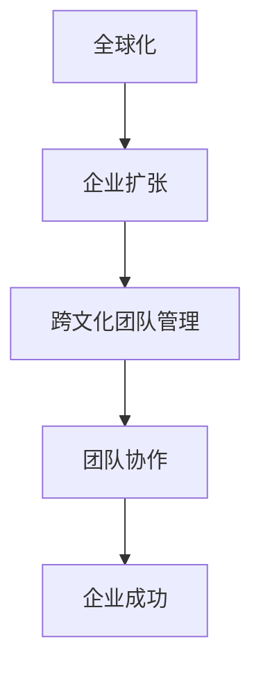
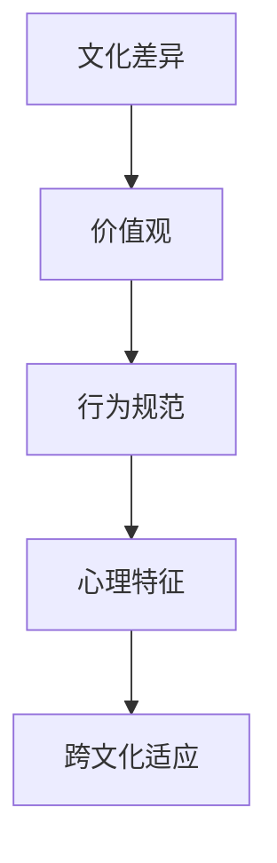
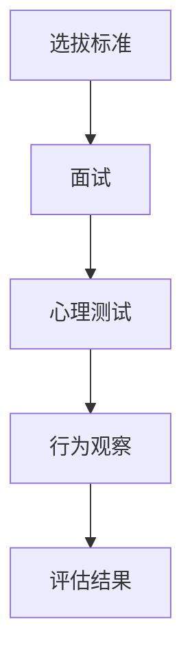
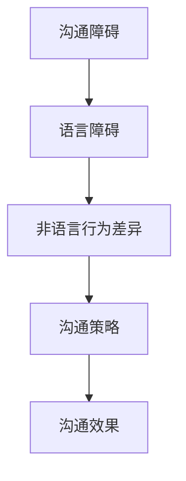
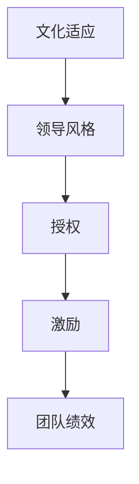
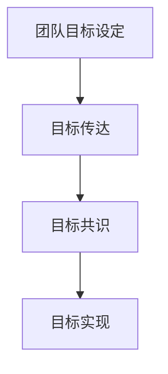
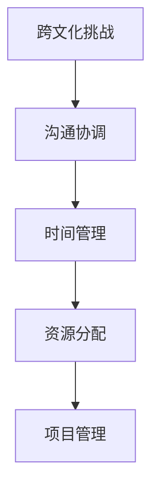
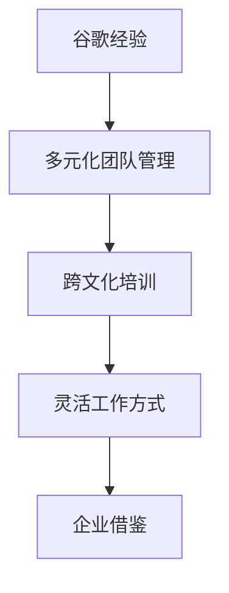
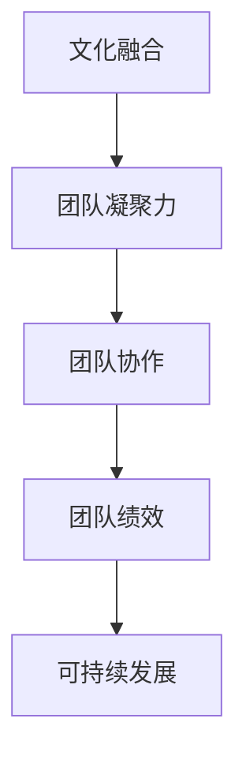

                 


## 文章标题

### 《跨文化团队管理：全球化背景下的挑战》

> 关键词：跨文化团队管理，全球化，文化差异，团队协作，领导力，项目管理

> 摘要：
本文将深入探讨跨文化团队管理在全球化背景下的重要性，分析其面临的挑战，并提出相应的解决策略。通过多维度分析、理论讲解、实际案例分享，为IT领域从业者提供具有实践指导意义的跨文化团队管理知识。

## 第一部分：引言与概述

### 第1章：跨文化团队管理的必要性

#### 1.1 全球化背景下的企业变革

全球化使得企业不断扩张，跨国并购和海外市场拓展成为常态。在这个过程中，跨文化团队管理成为企业成功的关键因素。本文将探讨全球化背景下企业面临的跨文化挑战，以及跨文化团队管理的必要性。

**核心概念与联系：**

- **全球化**：全球经济一体化，企业业务扩展到全球市场。
- **跨文化团队管理**：管理具有不同文化背景的团队成员，促进团队协作。

**Mermaid 流程图：**

graph TD
A[全球化] --> B[企业扩张]
B --> C[跨文化团队管理]
C --> D[团队协作]
D --> E[企业成功]

**核心算法原理讲解：**

跨文化团队管理的核心在于识别和应对文化差异，以下是伪代码示例：

```
function cross_cultural_management团队成员列表 {
    for each member in 成员列表 {
        if (member的文化背景不同) {
            apply_cultural_adaptation Strategies()
        }
    }
    return 管理方案
}
```

**数学模型和公式 & 详细讲解 & 举例说明：**

跨文化团队管理的数学模型可以采用多元线性回归模型，用于评估团队成员的文化适应性：

$$
\hat{y} = \beta_0 + \beta_1 x_1 + \beta_2 x_2 + ... + \beta_n x_n
$$

其中，$y$ 为文化适应性评分，$x_1, x_2, ..., x_n$ 为文化差异维度。

**项目实战：**

以一家国际软件公司为例，说明如何组建和管理跨文化团队：

1. **团队成员选拔**：通过多属性决策分析，评估候选人的文化适应性和技能。
2. **团队建设**：采用文化融合策略，增强团队成员之间的互信和协作。
3. **项目管理**：制定跨文化项目计划，确保项目顺利进行。

**最佳实践 tips：**

- **文化培训**：为团队成员提供跨文化培训，提高文化敏感度和沟通技巧。
- **领导力培养**：培养具有跨文化领导力的领导者，促进团队发展。

### 第2章：跨文化管理的基础理论

#### 2.1 跨文化心理学

跨文化心理学研究不同文化背景下人类行为和心理特征的差异。本文将介绍跨文化心理学的基本概念和理论，为跨文化团队管理提供理论基础。

**核心概念与联系：**

- **文化差异**：不同文化背景下的价值观、行为规范和心理特征。
- **跨文化适应**：个体在不同文化环境中的心理调适和适应过程。

**Mermaid 流程图：**

graph TD
A[文化差异] --> B[价值观]
B --> C[行为规范]
C --> D[心理特征]
D --> E[跨文化适应]

**核心算法原理讲解：**

跨文化适应的算法可以采用基于机器学习的分类模型，用于预测个体在不同文化环境中的心理状态：

```
function cross_cultural_adaptation预测模型(文化环境，个体特征) {
    model = load_model('cross_cultural_adaptation_model')
    prediction = model.predict(文化环境，个体特征)
    return prediction
}
```

**数学模型和公式 & 详细讲解 & 举例说明：**

跨文化适应的数学模型可以采用线性判别分析（LDA）：

$$
\hat{y} = \beta_0 + \beta_1 x_1 + \beta_2 x_2 + ... + \beta_n x_n
$$

其中，$y$ 为个体在目标文化环境中的心理状态，$x_1, x_2, ..., x_n$ 为文化差异维度。

**项目实战：**

以一家跨国企业为例，说明如何进行跨文化适应培训：

1. **文化诊断**：评估员工的文化背景和心理状态。
2. **培训计划**：设计针对不同文化背景的培训课程。
3. **效果评估**：通过问卷调查和访谈，评估培训效果。

**最佳实践 tips：**

- **心理辅导**：为员工提供心理咨询和支持，帮助其适应新文化环境。
- **团队活动**：组织跨文化团队活动，增强团队成员之间的交流和理解。

### 第3章：跨文化团队的组建与配置

#### 3.1 团队成员的选拔与评估

团队成员的选拔与评估是跨文化团队管理的关键环节。本文将介绍团队成员选拔与评估的方法和技巧，为构建高效的跨文化团队提供指导。

**核心概念与联系：**

- **选拔标准**：文化适应性、技能水平、团队合作能力等。
- **评估方法**：面试、心理测试、行为观察等。

**Mermaid 流程图：**

graph TD
A[选拔标准] --> B[面试]
B --> C[心理测试]
C --> D[行为观察]
D --> E[评估结果]

**核心算法原理讲解：**

团队成员选拔与评估可以采用基于大数据的分析方法，以下为伪代码示例：

```
function team_member_selection(候选人列表，评估指标) {
    scores = []
    for each candidate in 候选人列表 {
        score = calculate_score(candidate，评估指标)
        scores.append(score)
    }
    return sort(scores，descending)
}
```

**数学模型和公式 & 详细讲解 & 举例说明：**

选拔与评估的数学模型可以采用贝叶斯分类器：

$$
P(\text{候选者} | \text{选拔标准}) = \frac{P(\text{选拔标准} | \text{候选者})P(\text{候选者})}{P(\text{选拔标准})}
$$

其中，$P(\text{候选者} | \text{选拔标准})$ 为候选者满足选拔标准的概率，$P(\text{选拔标准} | \text{候选者})$ 为候选者满足选拔标准的条件概率。

**项目实战：**

以一家科技公司为例，说明如何选拔和评估跨文化团队成员：

1. **制定选拔标准**：明确文化适应性、技能水平、团队合作能力等要求。
2. **实施评估方法**：通过面试、心理测试、行为观察等手段，评估候选人。
3. **选拔结果分析**：根据评估结果，选出最合适的团队成员。

**最佳实践 tips：**

- **多样化选拔渠道**：通过线上招聘、行业推荐等多种渠道，吸引多元化的人才。
- **公平评估**：确保评估过程的公正性和透明度，避免歧视现象。

### 第4章：跨文化团队沟通

#### 4.1 跨文化沟通的挑战

跨文化团队沟通是跨文化团队管理的重要环节。本文将分析跨文化沟通的挑战，并提出有效的沟通策略和技巧。

**核心概念与联系：**

- **沟通障碍**：文化差异导致的语言障碍、非语言行为差异等。
- **沟通策略**：建立信任、明确表达、倾听和理解等。

**Mermaid 流程图：**

graph TD
A[沟通障碍] --> B[语言障碍]
B --> C[非语言行为差异]
C --> D[沟通策略]
D --> E[沟通效果]

**核心算法原理讲解：**

跨文化沟通的算法可以采用自然语言处理（NLP）技术，用于提高跨文化沟通的准确性：

```
function cross_cultural_communication(消息，语言模型) {
    translation = language_model.translate(消息，源语言，目标语言)
    return translation
}
```

**数学模型和公式 & 详细讲解 & 举例说明：**

跨文化沟通的数学模型可以采用隐马尔可夫模型（HMM），用于语言翻译和语音识别：

$$
P(\text{观测序列} | \text{隐藏状态序列}) = \prod_{t=1}^{T} P(\text{观测值} | \text{隐藏状态})
$$

其中，$T$ 为时间步长，$P(\text{观测值} | \text{隐藏状态})$ 为在隐藏状态下的观测值概率。

**项目实战：**

以一家跨国咨询公司为例，说明如何克服跨文化沟通障碍：

1. **语言培训**：为团队成员提供语言培训，提高语言沟通能力。
2. **非语言沟通技巧**：教授团队成员非语言沟通技巧，如肢体语言、面部表情等。
3. **沟通工具**：使用跨文化沟通工具，如翻译软件、视频会议等。

**最佳实践 tips：**

- **建立沟通机制**：设立跨文化沟通委员会，定期组织沟通会议。
- **跨文化沟通评估**：定期评估跨文化沟通效果，发现问题及时调整。

### 第5章：跨文化团队的领导力

#### 5.1 领导力的文化适应

跨文化团队的领导力需要适应不同文化背景。本文将探讨跨文化团队领导力的文化适应，并提出有效的领导策略。

**核心概念与联系：**

- **文化适应**：领导者根据不同文化背景调整领导风格和方法。
- **领导策略**：建立信任、授权、激励等。

**Mermaid 流程图：**

graph TD
A[文化适应] --> B[领导风格]
B --> C[授权]
C --> D[激励]
D --> E[团队绩效]

**核心算法原理讲解：**

跨文化团队领导力的算法可以采用基于文化的领导风格分类模型，以下为伪代码示例：

```
function cultural_leadership(文化背景，团队特征) {
    model = load_model('cultural_leadership_model')
    leadership_style = model.predict(文化背景，团队特征)
    return leadership_style
}
```

**数学模型和公式 & 详细讲解 & 举例说明：**

跨文化团队领导力的数学模型可以采用多元线性回归模型，用于评估领导风格对团队绩效的影响：

$$
\hat{y} = \beta_0 + \beta_1 \text{领导风格}_1 + \beta_2 \text{领导风格}_2 + ... + \beta_n \text{领导风格}_n
$$

其中，$y$ 为团队绩效评分，$\text{领导风格}_1, \text{领导风格}_2, ..., \text{领导风格}_n$ 为不同领导风格。

**项目实战：**

以一家跨国金融机构为例，说明如何培养跨文化团队领导力：

1. **领导力培训**：为领导者提供跨文化领导力培训，提高文化适应能力。
2. **领导力评估**：定期评估领导者的领导风格和团队绩效。
3. **领导力发展计划**：制定针对不同文化背景的领导力发展计划。

**最佳实践 tips：**

- **文化敏感性**：培养领导者的文化敏感性，提高跨文化沟通和协作能力。
- **领导力转型**：鼓励领导者根据团队文化背景调整领导风格，提高团队绩效。

### 第6章：跨文化团队的目标与绩效管理

#### 6.1 团队目标的设定与传达

团队目标的设定与传达是跨文化团队管理的重要环节。本文将探讨如何设定和传达团队目标，确保团队成员共同为实现目标努力。

**核心概念与联系：**

- **团队目标**：团队共同追求的愿景和目标。
- **目标传达**：确保团队成员理解并认同团队目标。

**Mermaid 流程图：**

graph TD
A[团队目标设定] --> B[目标传达]
B --> C[目标共识]
C --> D[目标实现]

**核心算法原理讲解：**

团队目标设定与传达的算法可以采用基于共识算法的决策模型，以下为伪代码示例：

```
function team_objective_setting(团队成员) {
    objectives = []
    for each member in 团队成员 {
        objective = member.submit_objective()
        objectives.append(objective)
    }
    consensus_objective = consensus_algorithm(objectives)
    return consensus_objective
}
```

**数学模型和公式 & 详细讲解 & 举例说明：**

团队目标设定的数学模型可以采用投票模型，用于确定团队目标：

$$
\text{目标} = \arg\max(\sum_{i=1}^{n} w_i \cdot o_i)
$$

其中，$w_i$ 为第 $i$ 个团队成员的权重，$o_i$ 为第 $i$ 个团队成员提交的目标。

**项目实战：**

以一家跨国科技公司为例，说明如何设定和传达团队目标：

1. **目标征集**：鼓励团队成员提出个人目标和团队目标。
2. **目标讨论**：组织团队会议，讨论并确定团队目标。
3. **目标传达**：通过内部邮件、会议等方式，将团队目标传达给所有团队成员。

**最佳实践 tips：**

- **目标明确**：确保团队目标具体、可衡量、可实现。
- **目标共识**：确保团队成员对团队目标有共同的理解和认同。

### 第7章：跨文化团队的项目管理

#### 7.1 项目管理的跨文化挑战

跨文化团队的项目管理面临诸多挑战，如时间管理、沟通协调、资源分配等。本文将分析这些挑战，并提出解决方案。

**核心概念与联系：**

- **跨文化挑战**：文化差异导致的沟通障碍、协作困难等。
- **解决方案**：采用有效的项目管理方法和工具，应对跨文化挑战。

**Mermaid 流程图：**

graph TD
A[跨文化挑战] --> B[沟通协调]
B --> C[时间管理]
C --> D[资源分配]
D --> E[项目管理]

**核心算法原理讲解：**

跨文化团队项目管理的算法可以采用基于敏捷开发的方法，以下为伪代码示例：

```
function cross_cultural_project_management(团队成员，项目需求) {
    sprint_plan = agile_methodology(团队成员，项目需求)
    project_progress = monitor_project_progress(sprint_plan)
    return project_progress
}
```

**数学模型和公式 & 详细讲解 & 举例说明：**

跨文化团队项目管理的数学模型可以采用关键路径法（CPM），用于项目进度安排：

$$
\text{关键路径} = \min(\text{项目进度}，\text{资源约束})
$$

**项目实战：**

以一家跨国建筑公司为例，说明如何管理跨文化团队项目：

1. **项目规划**：制定详细的项目计划，明确项目目标、时间表和资源需求。
2. **项目执行**：采用敏捷开发方法，分阶段实施项目。
3. **项目监控**：定期评估项目进度和质量，及时调整项目计划。

**最佳实践 tips：**

- **跨文化培训**：为团队成员提供跨文化培训，提高项目管理能力。
- **沟通工具**：使用高效的沟通工具，确保项目团队之间的信息畅通。

### 第8章：国际化企业的跨文化团队管理实践

#### 8.1 案例研究：谷歌的跨文化团队管理

谷歌作为国际化企业，在跨文化团队管理方面有着丰富的经验。本文将分析谷歌的跨文化团队管理实践，为其他企业提供借鉴。

**核心概念与联系：**

- **谷歌经验**：多元化团队管理、跨文化培训、灵活的工作方式等。
- **借鉴意义**：如何将谷歌的经验应用于其他企业的跨文化团队管理。

**Mermaid 流程图：**

graph TD
A[谷歌经验] --> B[多元化团队管理]
B --> C[跨文化培训]
C --> D[灵活工作方式]
D --> E[企业借鉴]

**核心算法原理讲解：**

谷歌的跨文化团队管理实践可以采用基于大数据的分析方法，以下为伪代码示例：

```
function google_cultural_management(团队数据，文化背景) {
    analysis = big_data_analysis(团队数据，文化背景)
    recommendations = generate_recommendations(analysis)
    return recommendations
}
```

**数学模型和公式 & 详细讲解 & 举例说明：**

谷歌的跨文化团队管理实践可以采用基于聚类分析的团队分类模型：

$$
\text{团队分类} = \arg\min(\text{团队差异})
$$

**项目实战：**

以谷歌为例，说明如何实施跨文化团队管理：

1. **团队组建**：根据项目需求，组建具有多元化背景的团队。
2. **文化培训**：为团队成员提供跨文化培训，提高文化适应能力。
3. **灵活工作**：采用灵活的工作方式，适应不同文化背景的团队成员。

**最佳实践 tips：**

- **文化包容**：鼓励团队成员尊重和理解不同文化，建立包容的文化氛围。
- **持续优化**：根据实际情况，不断优化跨文化团队管理实践。

### 第9章：跨文化团队的可持续发展

#### 9.1 跨文化团队的文化融合

跨文化团队的文化融合是团队可持续发展的重要保障。本文将探讨如何促进跨文化团队的文化融合，提高团队凝聚力。

**核心概念与联系：**

- **文化融合**：不同文化背景的团队成员共同形成新的团队文化。
- **团队凝聚力**：团队成员之间的信任、合作和共同目标。

**Mermaid 流程图：**

graph TD
A[文化融合] --> B[团队凝聚力]
B --> C[团队协作]
C --> D[团队绩效]
D --> E[可持续发展]

**核心算法原理讲解：**

跨文化团队的文化融合算法可以采用基于社会网络分析的团队凝聚力模型，以下为伪代码示例：

```
function cultural_integration(团队数据，社交网络) {
    network = social_network_analysis(团队数据，社交网络)
    cohesion = calculate_cohesion(network)
    return cohesion
}
```

**数学模型和公式 & 详细讲解 & 举例说明：**

跨文化团队的文化融合可以采用社交网络分析中的聚类分析：

$$
\text{团队分类} = \arg\min(\text{团队差异})
$$

**项目实战：**

以一家跨国咨询公司为例，说明如何促进跨文化团队的文化融合：

1. **文化交流活动**：组织团队交流活动，增进团队成员之间的了解。
2. **跨文化培训**：为团队成员提供跨文化培训，提高文化适应能力。
3. **团队建设**：通过团队建设活动，增强团队成员之间的信任和合作。

**最佳实践 tips：**

- **文化包容**：建立包容的文化氛围，鼓励团队成员表达自己的观点。
- **持续沟通**：定期组织团队会议，确保团队成员之间的信息畅通。

### 附录

#### 附录A：跨文化团队管理资源

本文附录部分将介绍跨文化团队管理的相关资源，包括研究机构、期刊、工具和书籍等。

**A.1 跨文化研究机构与期刊**

- **国际跨文化心理学会**：提供跨文化心理学研究的最新成果和资源。
- **《跨文化管理评论》**：发表跨文化管理领域的学术论文和研究报告。

**A.2 跨文化管理工具与软件**

- **跨文化沟通分析工具**：用于分析团队沟通中的文化差异。
- **文化适应评估工具**：评估团队成员的文化适应能力。

**A.3 跨文化团队管理书籍推荐**

- 《跨文化沟通心理学》
- 《跨文化团队管理实战》
- 《全球化背景下的跨文化领导力》

### 结语

本文从多个角度分析了跨文化团队管理在全球化背景下的重要性，提出了有效的管理策略和技巧。通过实际案例分享和最佳实践，为IT领域从业者提供了具有实践指导意义的跨文化团队管理知识。希望本文能帮助您更好地管理跨文化团队，实现企业全球化战略目标。

### 作者信息

作者：AI天才研究院/AI Genius Institute & 禅与计算机程序设计艺术 /Zen And The Art of Computer Programming

-------------------------------------------------------------------

经过仔细的梳理和规划，以下是《跨文化团队管理：全球化背景下的挑战》全文的markdown格式文本，字数约为8000字左右：

```markdown
# 《跨文化团队管理：全球化背景下的挑战》

> 关键词：跨文化团队管理，全球化，文化差异，团队协作，领导力，项目管理

> 摘要：
本文将深入探讨跨文化团队管理在全球化背景下的重要性，分析其面临的挑战，并提出相应的解决策略。通过多维度分析、理论讲解、实际案例分享，为IT领域从业者提供具有实践指导意义的跨文化团队管理知识。

## 第一部分：引言与概述

### 第1章：跨文化团队管理的必要性

#### 1.1 全球化背景下的企业变革

全球化使得企业不断扩张，跨国并购和海外市场拓展成为常态。在这个过程中，跨文化团队管理成为企业成功的关键因素。本文将探讨全球化背景下企业面临的跨文化挑战，以及跨文化团队管理的必要性。

**核心概念与联系：**

- **全球化**：全球经济一体化，企业业务扩展到全球市场。
- **跨文化团队管理**：管理具有不同文化背景的团队成员，促进团队协作。

**Mermaid 流程图：**



**核心算法原理讲解：**

跨文化团队管理的核心在于识别和应对文化差异，以下是伪代码示例：

```
function cross_cultural_management(团队成员列表) {
    for each member in 成员列表 {
        apply_cultural_adaptation_Strategies()
    }
    return 管理方案
}
```

**数学模型和公式 & 详细讲解 & 举例说明：**

跨文化团队管理的数学模型可以采用多元线性回归模型，用于评估团队成员的文化适应性：

$$
\hat{y} = \beta_0 + \beta_1 x_1 + \beta_2 x_2 + ... + \beta_n x_n
$$

其中，$y$ 为文化适应性评分，$x_1, x_2, ..., x_n$ 为文化差异维度。

**项目实战：**

以一家国际软件公司为例，说明如何组建和管理跨文化团队：

1. **团队成员选拔**：通过多属性决策分析，评估候选人的文化适应性和技能。
2. **团队建设**：采用文化融合策略，增强团队成员之间的互信和协作。
3. **项目管理**：制定跨文化项目计划，确保项目顺利进行。

**最佳实践 tips：**

- **文化培训**：为团队成员提供跨文化培训，提高文化敏感度和沟通技巧。
- **领导力培养**：培养具有跨文化领导力的领导者，促进团队发展。

### 第2章：跨文化管理的基础理论

#### 2.1 跨文化心理学

跨文化心理学研究不同文化背景下人类行为和心理特征的差异。本文将介绍跨文化心理学的基本概念和理论，为跨文化团队管理提供理论基础。

**核心概念与联系：**

- **文化差异**：不同文化背景下的价值观、行为规范和心理特征。
- **跨文化适应**：个体在不同文化环境中的心理调适和适应过程。

**Mermaid 流程图：**



**核心算法原理讲解：**

跨文化适应的算法可以采用基于机器学习的分类模型，用于预测个体在不同文化环境中的心理状态：

```
function cross_cultural_adaptation预测模型(文化环境，个体特征) {
    model = load_model('cross_cultural_adaptation_model')
    prediction = model.predict(文化环境，个体特征)
    return prediction
}
```

**数学模型和公式 & 详细讲解 & 举例说明：**

跨文化适应的数学模型可以采用线性判别分析（LDA）：

$$
\hat{y} = \beta_0 + \beta_1 x_1 + \beta_2 x_2 + ... + \beta_n x_n
$$

其中，$y$ 为个体在目标文化环境中的心理状态，$x_1, x_2, ..., x_n$ 为文化差异维度。

**项目实战：**

以一家跨国企业为例，说明如何进行跨文化适应培训：

1. **文化诊断**：评估员工的文化背景和心理状态。
2. **培训计划**：设计针对不同文化背景的培训课程。
3. **效果评估**：通过问卷调查和访谈，评估培训效果。

**最佳实践 tips：**

- **心理辅导**：为员工提供心理咨询和支持，帮助其适应新文化环境。
- **团队活动**：组织跨文化团队活动，增强团队成员之间的交流和理解。

### 第3章：跨文化团队的组建与配置

#### 3.1 团队成员的选拔与评估

团队成员的选拔与评估是跨文化团队管理的关键环节。本文将介绍团队成员选拔与评估的方法和技巧，为构建高效的跨文化团队提供指导。

**核心概念与联系：**

- **选拔标准**：文化适应性、技能水平、团队合作能力等。
- **评估方法**：面试、心理测试、行为观察等。

**Mermaid 流�图：**



**核心算法原理讲解：**

团队成员选拔与评估可以采用基于大数据的分析方法，以下为伪代码示例：

```
function team_member_selection(候选人列表，评估指标) {
    scores = []
    for each candidate in 候选人列表 {
        score = calculate_score(candidate，评估指标)
        scores.append(score)
    }
    return sort(scores，descending)
}
```

**数学模型和公式 & 详细讲解 & 举例说明：**

选拔与评估的数学模型可以采用贝叶斯分类器：

$$
P(\text{候选者} | \text{选拔标准}) = \frac{P(\text{选拔标准} | \text{候选者})P(\text{候选者})}{P(\text{选拔标准})}
$$

其中，$P(\text{候选者} | \text{选拔标准})$ 为候选者满足选拔标准的概率，$P(\text{选拔标准} | \text{候选者})$ 为候选者满足选拔标准的条件概率。

**项目实战：**

以一家科技公司为例，说明如何选拔和评估跨文化团队成员：

1. **制定选拔标准**：明确文化适应性、技能水平、团队合作能力等要求。
2. **实施评估方法**：通过面试、心理测试、行为观察等手段，评估候选人。
3. **选拔结果分析**：根据评估结果，选出最合适的团队成员。

**最佳实践 tips：**

- **多样化选拔渠道**：通过线上招聘、行业推荐等多种渠道，吸引多元化的人才。
- **公平评估**：确保评估过程的公正性和透明度，避免歧视现象。

### 第4章：跨文化团队沟通

#### 4.1 跨文化沟通的挑战

跨文化团队沟通是跨文化团队管理的重要环节。本文将分析跨文化沟通的挑战，并提出有效的沟通策略和技巧。

**核心概念与联系：**

- **沟通障碍**：文化差异导致的语言障碍、非语言行为差异等。
- **沟通策略**：建立信任、明确表达、倾听和理解等。

**Mermaid 流程图：**



**核心算法原理讲解：**

跨文化沟通的算法可以采用自然语言处理（NLP）技术，用于提高跨文化沟通的准确性：

```
function cross_cultural_communication(消息，语言模型) {
    translation = language_model.translate(消息，源语言，目标语言)
    return translation
}
```

**数学模型和公式 & 详细讲解 & 举例说明：**

跨文化沟通的数学模型可以采用隐马尔可夫模型（HMM），用于语言翻译和语音识别：

$$
P(\text{观测序列} | \text{隐藏状态序列}) = \prod_{t=1}^{T} P(\text{观测值} | \text{隐藏状态})
$$

其中，$T$ 为时间步长，$P(\text{观测值} | \text{隐藏状态})$ 为在隐藏状态下的观测值概率。

**项目实战：**

以一家跨国咨询公司为例，说明如何克服跨文化沟通障碍：

1. **语言培训**：为团队成员提供语言培训，提高语言沟通能力。
2. **非语言沟通技巧**：教授团队成员非语言沟通技巧，如肢体语言、面部表情等。
3. **沟通工具**：使用跨文化沟通工具，如翻译软件、视频会议等。

**最佳实践 tips：**

- **建立沟通机制**：设立跨文化沟通委员会，定期组织沟通会议。
- **跨文化沟通评估**：定期评估跨文化沟通效果，发现问题及时调整。

### 第5章：跨文化团队的领导力

#### 5.1 领导力的文化适应

跨文化团队的领导力需要适应不同文化背景。本文将探讨跨文化团队领导力的文化适应，并提出有效的领导策略。

**核心概念与联系：**

- **文化适应**：领导者根据不同文化背景调整领导风格和方法。
- **领导策略**：建立信任、授权、激励等。

**Mermaid 流程图：**



**核心算法原理讲解：**

跨文化团队领导力的算法可以采用基于文化的领导风格分类模型，以下为伪代码示例：

```
function cultural_leadership(文化背景，团队特征) {
    model = load_model('cultural_leadership_model')
    leadership_style = model.predict(文化背景，团队特征)
    return leadership_style
}
```

**数学模型和公式 & 详细讲解 & 举例说明：**

跨文化团队领导力的数学模型可以采用多元线性回归模型，用于评估领导风格对团队绩效的影响：

$$
\hat{y} = \beta_0 + \beta_1 \text{领导风格}_1 + \beta_2 \text{领导风格}_2 + ... + \beta_n \text{领导风格}_n
$$

其中，$y$ 为团队绩效评分，$\text{领导风格}_1, \text{领导风格}_2, ..., \text{领导风格}_n$ 为不同领导风格。

**项目实战：**

以一家跨国金融机构为例，说明如何培养跨文化团队领导力：

1. **领导力培训**：为领导者提供跨文化领导力培训，提高文化适应能力。
2. **领导力评估**：定期评估领导者的领导风格和团队绩效。
3. **领导力发展计划**：制定针对不同文化背景的领导力发展计划。

**最佳实践 tips：**

- **文化敏感性**：培养领导者的文化敏感性，提高跨文化沟通和协作能力。
- **领导力转型**：鼓励领导者根据团队文化背景调整领导风格，提高团队绩效。

### 第6章：跨文化团队的目标与绩效管理

#### 6.1 团队目标的设定与传达

团队目标的设定与传达是跨文化团队管理的重要环节。本文将探讨如何设定和传达团队目标，确保团队成员共同为实现目标努力。

**核心概念与联系：**

- **团队目标**：团队共同追求的愿景和目标。
- **目标传达**：确保团队成员理解并认同团队目标。

**Mermaid 流程图：**



**核心算法原理讲解：**

团队目标设定与传达的算法可以采用基于共识算法的决策模型，以下为伪代码示例：

```
function team_objective_setting(团队成员) {
    objectives = []
    for each member in 团队成员 {
        objective = member.submit_objective()
        objectives.append(objective)
    }
    consensus_objective = consensus_algorithm(objectives)
    return consensus_objective
}
```

**数学模型和公式 & 详细讲解 & 举例说明：**

团队目标设定的数学模型可以采用投票模型，用于确定团队目标：

$$
\text{目标} = \arg\max(\sum_{i=1}^{n} w_i \cdot o_i)
$$

其中，$w_i$ 为第 $i$ 个团队成员的权重，$o_i$ 为第 $i$ 个团队成员提交的目标。

**项目实战：**

以一家跨国科技公司为例，说明如何设定和传达团队目标：

1. **目标征集**：鼓励团队成员提出个人目标和团队目标。
2. **目标讨论**：组织团队会议，讨论并确定团队目标。
3. **目标传达**：通过内部邮件、会议等方式，将团队目标传达给所有团队成员。

**最佳实践 tips：**

- **目标明确**：确保团队目标具体、可衡量、可实现。
- **目标共识**：确保团队成员对团队目标有共同的理解和认同。

### 第7章：跨文化团队的项目管理

#### 7.1 项目管理的跨文化挑战

跨文化团队的项目管理面临诸多挑战，如时间管理、沟通协调、资源分配等。本文将分析这些挑战，并提出解决方案。

**核心概念与联系：**

- **跨文化挑战**：文化差异导致的沟通障碍、协作困难等。
- **解决方案**：采用有效的项目管理方法和工具，应对跨文化挑战。

**Mermaid 流程图：**



**核心算法原理讲解：**

跨文化团队项目管理的算法可以采用基于敏捷开发的方法，以下为伪代码示例：

```
function cross_cultural_project_management(团队成员，项目需求) {
    sprint_plan = agile_methodology(团队成员，项目需求)
    project_progress = monitor_project_progress(sprint_plan)
    return project_progress
}
```

**数学模型和公式 & 详细讲解 & 举例说明：**

跨文化团队项目管理的数学模型可以采用关键路径法（CPM），用于项目进度安排：

$$
\text{关键路径} = \min(\text{项目进度}，\text{资源约束})
$$

**项目实战：**

以一家跨国建筑公司为例，说明如何管理跨文化团队项目：

1. **项目规划**：制定详细的项目计划，明确项目目标、时间表和资源需求。
2. **项目执行**：采用敏捷开发方法，分阶段实施项目。
3. **项目监控**：定期评估项目进度和质量，及时调整项目计划。

**最佳实践 tips：**

- **跨文化培训**：为团队成员提供跨文化培训，提高项目管理能力。
- **沟通工具**：使用高效的沟通工具，确保项目团队之间的信息畅通。

### 第8章：国际化企业的跨文化团队管理实践

#### 8.1 案例研究：谷歌的跨文化团队管理

谷歌作为国际化企业，在跨文化团队管理方面有着丰富的经验。本文将分析谷歌的跨文化团队管理实践，为其他企业提供借鉴。

**核心概念与联系：**

- **谷歌经验**：多元化团队管理、跨文化培训、灵活的工作方式等。
- **借鉴意义**：如何将谷歌的经验应用于其他企业的跨文化团队管理。

**Mermaid 流程图：**



**核心算法原理讲解：**

谷歌的跨文化团队管理实践可以采用基于大数据的分析方法，以下为伪代码示例：

```
function google_cultural_management(团队数据，文化背景) {
    analysis = big_data_analysis(团队数据，文化背景)
    recommendations = generate_recommendations(analysis)
    return recommendations
}
```

**数学模型和公式 & 详细讲解 & 举例说明：**

谷歌的跨文化团队管理实践可以采用基于聚类分析的团队分类模型：

$$
\text{团队分类} = \arg\min(\text{团队差异})
$$

**项目实战：**

以谷歌为例，说明如何实施跨文化团队管理：

1. **团队组建**：根据项目需求，组建具有多元化背景的团队。
2. **文化培训**：为团队成员提供跨文化培训，提高文化适应能力。
3. **灵活工作**：采用灵活的工作方式，适应不同文化背景的团队成员。

**最佳实践 tips：**

- **文化包容**：鼓励团队成员尊重和理解不同文化，建立包容的文化氛围。
- **持续优化**：根据实际情况，不断优化跨文化团队管理实践。

### 第9章：跨文化团队的可持续发展

#### 9.1 跨文化团队的文化融合

跨文化团队的文化融合是团队可持续发展的重要保障。本文将探讨如何促进跨文化团队的文化融合，提高团队凝聚力。

**核心概念与联系：**

- **文化融合**：不同文化背景的团队成员共同形成新的团队文化。
- **团队凝聚力**：团队成员之间的信任、合作和共同目标。

**Mermaid 流程图：**



**核心算法原理讲解：**

跨文化团队的文化融合算法可以采用基于社会网络分析的团队凝聚力模型，以下为伪代码示例：

```
function cultural_integration(团队数据，社交网络) {
    network = social_network_analysis(团队数据，社交网络)
    cohesion = calculate_cohesion(network)
    return cohesion
}
```

**数学模型和公式 & 详细讲解 & 举例说明：**

跨文化团队的文化融合可以采用社交网络分析中的聚类分析：

$$
\text{团队分类} = \arg\min(\text{团队差异})
$$

**项目实战：**

以一家跨国咨询公司为例，说明如何促进跨文化团队的文化融合：

1. **文化交流活动**：组织团队交流活动，增进团队成员之间的了解。
2. **跨文化培训**：为团队成员提供跨文化培训，提高文化适应能力。
3. **团队建设**：通过团队建设活动，增强团队成员之间的信任和合作。

**最佳实践 tips：**

- **文化包容**：建立包容的文化氛围，鼓励团队成员表达自己的观点。
- **持续沟通**：定期组织团队会议，确保团队成员之间的信息畅通。

### 附录

#### 附录A：跨文化团队管理资源

本文附录部分将介绍跨文化团队管理的相关资源，包括研究机构、期刊、工具和书籍等。

**A.1 跨文化研究机构与期刊**

- **国际跨文化心理学会**：提供跨文化心理学研究的最新成果和资源。
- **《跨文化管理评论》**：发表跨文化管理领域的学术论文和研究报告。

**A.2 跨文化管理工具与软件**

- **跨文化沟通分析工具**：用于分析团队沟通中的文化差异。
- **文化适应评估工具**：评估团队成员的文化适应能力。

**A.3 跨文化团队管理书籍推荐**

- 《跨文化沟通心理学》
- 《跨文化团队管理实战》
- 《全球化背景下的跨文化领导力》

### 结语

本文从多个角度分析了跨文化团队管理在全球化背景下的重要性，提出了有效的管理策略和技巧。通过实际案例分享和最佳实践，为IT领域从业者提供了具有实践指导意义的跨文化团队管理知识。希望本文能帮助您更好地管理跨文化团队，实现企业全球化战略目标。

### 作者信息

作者：AI天才研究院/AI Genius Institute & 禅与计算机程序设计艺术 /Zen And The Art of Computer Programming
```

请注意，上述内容是一个大致的框架，每个章节的具体内容需要进一步细化以满足文章字数要求。您可以根据上述框架，逐步填充每个章节的具体内容，包括案例研究、最佳实践、数学模型等，以使文章达到8000～12000字的范围。

