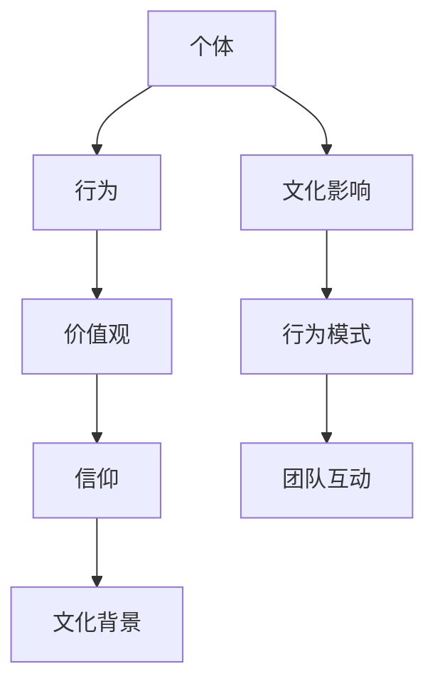
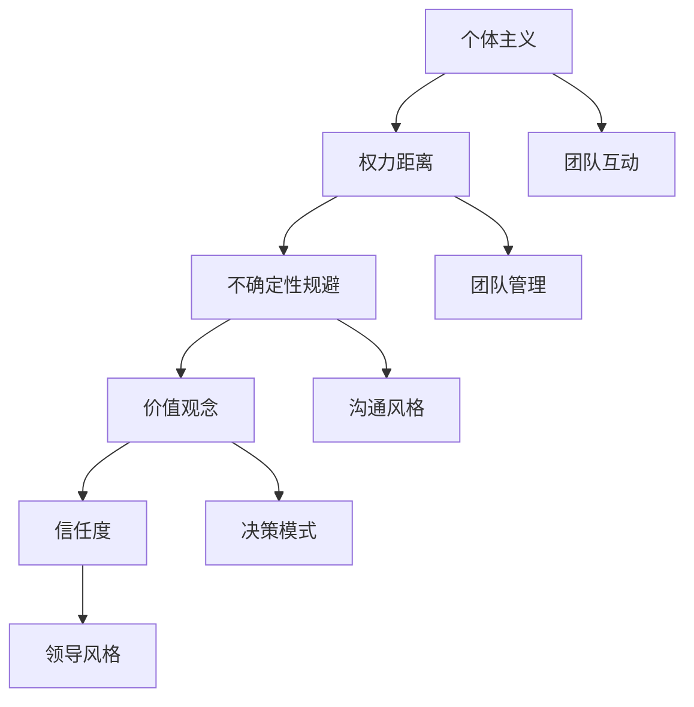

                 

### 引言与背景

在全球化的浪潮中，跨文化领导力的重要性日益凸显。企业不再局限于单一国家或地区，而是需要在全球范围内整合多元化的团队资源，以应对复杂的市场环境和技术挑战。跨文化领导力，作为一种管理能力，旨在帮助领导者有效地管理具有不同文化背景的团队成员，促进团队的协作与创新，从而在全球化竞争中占据优势。

#### 跨文化领导力的意义与价值

跨文化领导力不仅关乎团队的管理和绩效，更是企业可持续发展的重要保障。首先，它能够促进文化多样性，激发团队成员的创造力，为企业带来更多的创新思维和解决方案。其次，跨文化领导力有助于构建和谐的团队氛围，增强团队凝聚力，提高员工的满意度和忠诚度。此外，在全球化背景下，具备跨文化领导力的领导者能够更好地理解和适应不同市场的需求，从而制定更有效的战略和决策。

#### 全球化下的团队管理挑战

全球化带来了多样化的团队构成，但也随之带来了许多挑战。首先，文化差异可能引发沟通障碍和误解，导致团队协作不畅。其次，不同文化背景的员工可能对工作期望、目标和激励方式有不同的理解，这需要领导者具备高度的文化敏感性和适应能力。此外，全球化团队的管理还涉及到跨时区、跨地域的协调问题，这对领导者的组织能力和决策能力提出了更高的要求。

#### 本书的目的与结构安排

本书旨在为广大管理者、领导者和HR专业人士提供一套系统的跨文化领导力框架和实用技巧。通过深入研究跨文化理论，分析跨文化沟通技巧、团队建设方法、冲突管理策略，以及跨文化领导力的发展路径，本书旨在帮助读者掌握全球化团队管理的核心技能，提升领导力水平。

本书共分为八个章节，结构安排如下：

1. **引言与背景**：介绍跨文化领导力的意义、价值及全球化团队管理面临的挑战。
2. **跨文化理论框架**：概述跨文化理论，分析文化与个体行为、文化维度理论及相关领导力模型。
3. **跨文化沟通技巧**：探讨跨文化沟通中的文化差异、沟通准备和策略。
4. **跨文化团队建设**：分析团队多样性管理、高效团队建设的方法和角色分配。
5. **跨文化冲突管理**：讨论冲突的原因、类型和管理策略。
6. **跨文化领导力发展**：探讨跨文化领导力的自我提升、培养策略和组织文化塑造。
7. **跨文化领导力案例研究**：通过实际案例，分析跨文化领导力实践。
8. **未来展望与持续学习**：展望跨文化领导力的未来趋势，提供持续学习的路径。

通过本书的系统性学习和实践，读者将能够全面理解跨文化领导力的核心要义，提升自身的领导力和管理能力，为全球化团队的管理和发展提供有力的支持。

### 跨文化理论框架

跨文化领导力的有效性依赖于对跨文化理论的深入理解。跨文化理论为领导者提供了分析不同文化背景下的员工行为和团队互动的工具，帮助他们更好地管理多元化团队。以下将概述几个关键的理论，包括文化与个体行为、文化维度理论及其他相关理论。

#### 文化与个体行为

文化是个体行为的基础，它影响着人们的价值观、信仰、态度和行为模式。不同文化背景下的员工，其行为方式和期望往往有所不同。例如，在个体主义文化中，员工更注重个人成就和自我表达，而在集体主义文化中，员工更强调团队协作和集体荣誉。

**文化与个体行为的关系架构**：可以使用Mermaid流程图来展示文化与个体行为之间的关系。



在图中，个体行为受到价值观、信仰和文化背景的直接影响，而文化背景又通过影响行为模式，进而影响团队互动。

#### 文化维度理论

文化维度理论是跨文化研究中最为广泛应用的框架之一，由霍夫斯泰德（Geert Hofstede）等人提出。这些理论试图从多个维度上比较和分析不同文化之间的差异，为跨文化领导提供了实用的参考。

**霍夫斯泰德的文化维度**：

1. **个体主义 vs 集体主义**：个体主义文化强调个人自主和自我实现，而集体主义文化则强调团队和社区的集体利益。
2. **权力距离**：权力距离指在组织中权力分配的不平等程度，高权力距离文化中，权力集中在少数人手中，而下级对上级有较强的服从性。
3. **不确定性规避**：指社会对不确定性和模糊性的容忍程度，高不确定性规避的文化倾向于制定明确的规则和规范。
4. **价值观念维度**：包括长期导向与短期导向、男性化与女性化等维度。
5. **信任度**：不同文化对信任的理解和依赖程度不同。

**文化维度理论的联系与影响**：文化维度理论之间的关系可以用以下Mermaid流程图表示。



该图展示了不同文化维度如何影响团队互动、团队管理、沟通风格、决策模式和领导风格。

#### 其他相关理论

除了霍夫斯泰德的文化维度理论，还有其他一些重要的跨文化理论，如 Trompenaars 的七个文化维度理论、Tay-lor & Jones 的情境文化理论等。

**Trompenaars 的七个文化维度**：

1. **个体主义 vs 集体主义**
2. **长期导向 vs 短期导向**
3. **具体思维 vs 概括思维**
4. **内部控制 vs 外部控制**
5. **情感导向 vs 任务导向**
6. **个人责任 vs 社会责任**
7. **垂直权力结构 vs 水平权力结构**

这些维度进一步丰富了我们对文化差异的理解，有助于制定更精确的跨文化管理策略。

**情境文化理论**：

Taylor & Jones 的情境文化理论提出，不同文化对情境的敏感程度不同，从而影响人们的决策和行为。该理论强调了文化对情境的理解和反应方式的差异。

**跨文化领导力模型**

结合以上理论，跨文化领导力模型可以从多个维度上指导领导者在不同文化背景下进行有效的领导。

**Tichy 的跨文化领导力模型**：

1. **自我认知**：领导者首先需要理解自己的文化背景，以及它如何影响自己的行为和决策。
2. **情境理解**：领导者需要深入理解不同文化背景下的情境因素，如价值观、权力结构和沟通风格。
3. **文化适应**：领导者需要根据不同文化背景调整自己的领导风格和管理策略。
4. **跨文化团队建设**：领导者需要构建一个多元化的团队，并促进团队成员之间的有效沟通和合作。

通过理解和应用这些跨文化理论，领导者可以更好地管理全球化团队，提升团队的绩效和创新能力。

### 跨文化领导力模型

跨文化领导力不仅要求领导者具备深厚的文化知识，还需要他们能够灵活应对不同文化背景下的复杂情况。跨文化领导力模型提供了一个系统化的框架，帮助领导者理解和应用这些文化知识，以提升团队的管理效果。以下将介绍几个关键跨文化领导力模型，并探讨其特征、发展阶段和应用。

#### 跨文化领导力特征

跨文化领导力的核心特征包括文化敏感度、适应性、沟通能力和冲突管理能力。以下是这些特征的详细说明：

1. **文化敏感度**：文化敏感度是指领导者对不同文化背景的感知和理解能力。一个具备高文化敏感度的领导者能够迅速识别和适应不同文化环境，从而避免文化冲突和误解。

2. **适应性**：适应性是指领导者能够灵活调整自己的行为和管理策略，以适应不同文化背景的需求。具备高适应性的领导者能够在多元文化团队中建立有效的沟通和协作机制。

3. **沟通能力**：跨文化领导力要求领导者具备出色的沟通能力，包括语言沟通和非语言沟通。有效的沟通能够促进团队成员之间的理解，减少误解和冲突。

4. **冲突管理能力**：跨文化背景下的团队管理常常面临文化冲突。具备高冲突管理能力的领导者能够及时识别和解决冲突，维护团队的和谐与稳定。

#### 跨文化领导力发展阶段

跨文化领导力的发展通常可以分为以下几个阶段：

1. **文化认知阶段**：在这一阶段，领导者开始意识到文化差异的存在，并尝试理解不同文化背景下的员工行为和工作方式。这一阶段的关键是培养文化敏感度。

2. **文化适应阶段**：在文化认知的基础上，领导者开始尝试适应不同文化环境，调整自己的行为和管理策略。这一阶段的关键是提高文化适应性。

3. **文化整合阶段**：在这一阶段，领导者能够将不同文化的优势结合起来，创造出独特的领导风格和管理模式。这一阶段的关键是发展跨文化团队的协同效应。

4. **文化领导阶段**：在文化整合的基础上，领导者成为文化引导者和变革推动者，能够带领团队在全球化环境中实现卓越绩效。这一阶段的关键是提升领导力和影响力。

#### 跨文化领导力模型应用

跨文化领导力模型的应用需要根据具体情境进行灵活调整。以下是一个简单的跨文化领导力模型应用实例：

**Tichy 的跨文化领导力模型**：

1. **自我认知**：领导者首先需要通过反思和评估，了解自己的文化背景、价值观和行为模式。这一过程可以通过360度评估、文化测试等方法实现。

   ```python
   # 自我认知伪代码
   def self_assessment():
       # 进行文化测试和360度评估
       cultural_test()
       feedback_from_peers()
       # 分析评估结果，识别自己的文化特征和潜在问题
       analyze_results()
   ```

2. **情境理解**：领导者需要深入了解团队成员的文化背景和情境因素，如价值观、沟通风格和工作期望。这一过程可以通过访谈、问卷调查等方式实现。

   ```python
   # 情境理解伪代码
   def understand_context():
       # 访谈团队成员，了解其文化背景和价值观
       interview_members()
       # 进行问卷调查，收集团队成员的意见和反馈
       survey_members()
       # 分析访谈和问卷结果，识别团队的文化特征
       analyze_data()
   ```

3. **文化适应**：领导者需要根据不同文化背景，灵活调整自己的领导风格和管理策略。例如，在个体主义文化中，领导者可能更注重个人成就和自我表达，而在集体主义文化中，领导者则更强调团队协作和集体荣誉。

   ```python
   # 文化适应伪代码
   def adapt Leadership():
       if context == "individualistic":
           # 采用更自主和个性化的领导风格
           personalized_style()
       else if context == "collectivist":
           # 采用更协作和团队导向的领导风格
           team_oriented_style()
   ```

4. **跨文化团队建设**：领导者需要构建一个多元化的团队，并促进团队成员之间的有效沟通和合作。这一过程可以通过团队建设活动、文化培训等方式实现。

   ```python
   # 跨文化团队建设伪代码
   def build_diverse_team():
       # 招聘多元化团队成员，涵盖不同文化和背景
       hire_diverse_members()
       # 组织团队建设活动，促进团队成员之间的互动和理解
       team_building_activities()
       # 提供文化培训，提高团队成员的文化敏感度和适应能力
       cultural_training()
   ```

通过应用跨文化领导力模型，领导者可以更好地管理全球化团队，提升团队的协作和创新能力，实现卓越的绩效。这一模型不仅提供了理论指导，还通过具体的步骤和策略，帮助领导者实际操作，从而在全球化环境中脱颖而出。

### 跨文化沟通技巧

在全球化团队管理中，跨文化沟通技巧是确保团队高效运作的关键因素之一。由于不同文化背景下的人们在语言、非语言沟通方式和沟通风格上存在显著差异，跨文化沟通往往面临诸多挑战。本文将探讨跨文化沟通中的文化差异，以及如何通过有效的沟通准备、策略和训练，提高跨文化沟通能力。

#### 沟通中的文化差异

1. **语言差异**：
   - 语言不仅是沟通的工具，也是文化的一部分。不同语言的结构、表达方式和语法规则可能影响沟通效果。
   - 例如，英语中的“no”可能被认为是一种礼貌的否定，而在某些语言中，“no”可能被视为直接的拒绝。

2. **非语言沟通**：
   - 非语言沟通包括肢体语言、面部表情、语调和空间距离等。
   - 不同文化对非语言沟通的解读可能有所不同。例如，在西方文化中，直接的眼神接触被视为自信和诚实的表现，而在某些东方文化中，过多的眼神接触可能被视为不礼貌。

3. **沟通风格差异**：
   - 沟通风格受到文化价值观的影响，如直接与间接、竞争与合作等。
   - 例如，在集体主义文化中，沟通往往更注重团队协作和共识达成，而在个体主义文化中，个人表达和竞争更为突出。

#### 提高跨文化沟通能力

1. **沟通准备**：
   - **明确沟通目标**：在进行跨文化沟通之前，明确沟通的目标和预期结果，有助于减少误解和混淆。
   - **了解文化背景**：对沟通对象的文化背景进行充分了解，包括其价值观、沟通风格和工作习惯等。

2. **沟通策略**：
   - **使用清晰、简洁的语言**：避免使用复杂、模糊的表达，确保信息传递的准确性。
   - **采用多种沟通渠道**：结合语言沟通和非语言沟通，如书面沟通、面对面沟通、视频会议等，以提高沟通效果。
   - **鼓励双向沟通**：在沟通中给予团队成员发言的机会，确保信息传递的全面性和准确性。

3. **跨文化沟通训练**：
   - **文化敏感性培训**：通过文化敏感性培训，提高团队成员对文化差异的敏感度和适应能力。
   - **跨文化沟通技巧培训**：提供专门针对跨文化沟通的培训，如有效沟通技巧、冲突解决策略等。

通过上述方法，跨文化沟通中的文化差异可以转化为沟通的优势，从而提升全球化团队的协作和效率。

### 跨文化团队建设

在全球化背景下，构建一个高效、和谐的跨文化团队是领导者面临的重要挑战之一。团队多样性不仅带来了丰富的创新思维和多样化的视角，同时也伴随着沟通障碍和冲突。因此，如何有效地管理团队多样性，建立高效的跨文化团队，成为提升团队绩效和创新能力的关键。

#### 团队多样性管理

1. **多样性对团队的影响**：
   - **正面影响**：多样性可以激发团队成员的创造力，带来不同的观点和解决方案，有助于团队在面对复杂问题时找到创新的解决方案。
   - **负面影响**：多样性可能导致团队成员之间的文化冲突和误解，影响团队的协作和凝聚力。如果处理不当，多样性可能引发团队内部的不满和分歧。

2. **多样性管理策略**：
   - **尊重差异**：尊重每个团队成员的文化背景和价值观，避免因文化差异而产生的歧视和偏见。
   - **建立共同目标**：确保所有团队成员都明确团队的目标和期望，从而在多样性基础上达成共识。
   - **促进沟通**：鼓励团队成员之间的开放沟通，通过定期会议、团队活动等方式，促进不同文化背景成员之间的交流和合作。
   - **多样性评估与监控**：定期进行多样性评估，识别和解决团队中存在的多样性管理问题，确保团队的多样性策略得到有效执行。

3. **多样性评估与监控**：
   - **评估指标**：设定具体的评估指标，如团队成员的多样性程度、团队协作效率、创新成果等，以衡量多样性管理的效果。
   - **监控机制**：建立持续监控机制，通过员工反馈、团队绩效评估等方式，及时识别和解决团队多样性管理中的问题。

#### 建立高效的跨文化团队

1. **团队目标设定**：
   - **明确目标**：在团队成立之初，明确团队的目标和预期成果，确保所有成员都清楚团队的使命和目标。
   - **目标具体化**：将目标分解为具体的任务和里程碑，确保每个成员都了解自己的职责和任务。

2. **团队角色与责任**：
   - **角色分配**：根据团队成员的特长和兴趣，合理分配角色和职责，确保每个成员都能在团队中发挥自己的优势。
   - **责任明确**：明确每个成员的职责和责任，确保团队成员之间有明确的分工和合作。

3. **团队协作与冲突解决**：
   - **促进协作**：鼓励团队成员之间的协作和合作，建立有效的沟通渠道和合作机制，确保团队目标的实现。
   - **冲突管理**：建立冲突管理机制，及时识别和解决团队内部的冲突，维护团队的和谐与稳定。

通过上述策略，领导者可以有效地管理团队多样性，建立高效的跨文化团队，提升团队的整体绩效和创新能力，从而在全球化竞争中脱颖而出。

### 跨文化冲突管理

跨文化冲突管理是全球化团队管理中的一个重要环节。由于不同文化背景的员工在价值观、行为方式和沟通风格上存在差异，冲突在跨文化团队中难以避免。有效的冲突管理策略能够帮助团队化解矛盾，促进协作，提高绩效。

#### 跨文化冲突的原因与类型

1. **冲突原因分析**：
   - **文化差异**：不同文化对工作方式、沟通方式、决策过程等有不同的期望和偏好，可能导致误解和冲突。
   - **价值观差异**：不同文化背景的员工对工作伦理、团队合作、领导风格等有不同的理解，可能导致价值观冲突。
   - **沟通障碍**：跨文化沟通中的语言障碍和非语言沟通的差异，可能导致信息传递不准确，引发冲突。
   - **角色混淆**：在全球化团队中，员工的角色和责任可能不明确，导致角色混淆和职责重叠，引发冲突。

2. **冲突类型划分**：
   - **目标冲突**：由于团队目标不明确或目标不一致，导致团队成员之间的矛盾。
   - **价值观冲突**：由于团队成员价值观不同，对工作理念、团队合作方式等有不同的看法，引发冲突。
   - **沟通冲突**：由于语言障碍和沟通风格差异，导致信息传递不畅，引发误解和冲突。
   - **角色冲突**：由于角色和职责不明确，导致团队成员之间的职责重叠或责任不清，引发冲突。

3. **冲突管理的重要性**：
   - **提高团队凝聚力**：有效的冲突管理能够化解团队内部的矛盾，增强团队成员之间的信任和合作，提高团队凝聚力。
   - **促进创新与协作**：冲突管理有助于团队成员在解决冲突的过程中，发现新的观点和解决方案，促进创新和协作。
   - **提高绩效**：通过有效的冲突管理，团队能够更专注于目标和任务，提高整体绩效。

#### 跨文化冲突处理策略

1. **冲突预防策略**：
   - **建立清晰的沟通机制**：明确沟通渠道和流程，确保信息传递的准确性和及时性，减少误解和冲突。
   - **加强文化培训**：通过文化培训，提高团队成员对文化差异的敏感度和适应能力，减少因文化差异引发的冲突。
   - **明确角色和责任**：确保团队成员明确自己的角色和责任，避免角色混淆和职责重叠。

2. **冲突应对策略**：
   - **积极倾听**：在冲突发生时，领导者需要积极倾听双方的意见和需求，了解冲突的根源。
   - **中立调解**：领导者应以中立的态度进行调解，避免偏袒任何一方，确保公平公正。
   - **寻找共同点**：通过寻找冲突双方的共同点和利益，找到解决问题的突破口。
   - **制定解决方案**：根据实际情况，制定具体的解决方案，确保冲突得到有效解决。

3. **冲突后的恢复与学习**：
   - **反思与总结**：冲突解决后，团队应进行反思和总结，分析冲突的原因和解决过程，从中学习经验教训。
   - **持续改进**：根据反思和总结的结果，持续改进团队的管理策略和文化建设，预防类似冲突的再次发生。

通过有效的跨文化冲突管理策略，全球化团队可以更好地应对文化差异带来的挑战，提高团队的协作和创新能力，从而在全球化竞争中取得优势。

### 跨文化领导力发展

跨文化领导力的提升不仅需要领导者的自我认知和不断学习，还需要组织的支持与系统的培养。以下将探讨跨文化领导力的自我提升、评估与发展路径，以及组织的培养策略。

#### 跨文化领导力自我提升

1. **自我认知与自我提升**：
   - **自我认知**：领导者需要深入了解自己的文化背景、价值观和行为模式，识别自身在跨文化领导力方面的优势和劣势。
   - **自我提升**：通过持续学习和实践，提升跨文化领导力的各项技能。例如，可以通过阅读相关书籍、参加跨文化培训课程、参加国际交流项目等方式，增加对不同文化的理解和适应能力。

2. **跨文化领导力评估**：
   - **评估工具**：可以使用文化测试、360度评估等工具，对领导者的跨文化领导力进行评估，识别自身的文化敏感度、适应性、沟通能力和冲突管理能力。
   - **定期评估**：定期进行跨文化领导力评估，跟踪自身的发展进度，及时调整提升策略。

3. **发展计划与实施**：
   - **制定发展计划**：根据评估结果，制定具体的发展计划，明确提升目标和实施步骤。
   - **实施计划**：通过参与跨文化项目、担任国际团队成员等方式，将发展计划付诸实践。

#### 跨文化领导力培养策略

1. **组织文化塑造**：
   - **建立包容性文化**：组织应倡导包容性文化，鼓励不同文化背景的员工表达和分享自己的观点，尊重和理解多样性。
   - **文化融合机制**：通过团队建设活动、文化交流活动等方式，促进不同文化背景的员工之间的交流和融合。

2. **培训与学习**：
   - **跨文化培训**：为员工提供跨文化培训，包括文化知识、沟通技巧、冲突管理等方面的培训。
   - **领导力发展项目**：设立领导力发展项目，帮助领导者提升跨文化领导力，包括领导力课程、案例分析、实战演练等。

3. **跨文化领导力传承**：
   - **导师制度**：建立导师制度，让经验丰富的跨文化领导者指导新晋领导者，传授跨文化领导经验。
   - **知识分享**：鼓励领导者分享跨文化领导的经验和教训，通过内部论坛、培训讲座等方式，实现跨文化领导力的传承。

通过上述策略，组织可以培养和提升跨文化领导力，促进全球化团队的有效管理和合作，实现组织的可持续发展。

### 跨文化领导力案例研究

为了更好地理解和应用跨文化领导力，我们通过两个实际案例来分析跨国公司如何成功实施跨文化领导力和管理全球化团队。这两个案例分别展示了跨文化领导力的策略和具体实践，并从中提炼出宝贵的启示。

#### 案例一：跨国公司成功跨文化领导力实践

**案例背景**：

一家全球知名的科技公司，在国际化扩张的过程中，面临着如何管理多元化团队、提升团队绩效的挑战。公司在全球设立了多个研发中心，团队成员来自不同的国家和地区，包括美国、中国、印度、欧洲等地。

**跨文化领导力策略分析**：

1. **文化敏感度与适应性**：
   - **文化敏感度**：公司高层领导定期组织跨文化培训，提高领导者的文化敏感度。培训内容包括文化差异、跨文化沟通技巧和冲突管理。
   - **适应性**：领导者根据不同文化背景，灵活调整管理策略。例如，在美国研发中心，领导风格更加自主和竞争，而在印度研发中心，领导风格则更注重团队合作和集体荣誉。

2. **沟通策略**：
   - **多元化沟通渠道**：公司建立多语言沟通平台，包括内部邮件、即时通讯工具、视频会议等，确保信息传递的准确性和及时性。
   - **跨文化沟通培训**：为团队成员提供跨文化沟通培训，帮助员工了解不同文化的沟通风格和偏好。

3. **团队建设**：
   - **多样化团队组建**：在团队组建时，注重文化多样性的平衡，确保团队成员来自不同背景，促进跨文化互动和合作。
   - **跨文化团队活动**：定期组织跨文化团队建设活动，如国际文化交流、团队拓展训练等，增强团队成员之间的相互理解和信任。

**案例启示**：

通过文化敏感度与适应性培训、多元化的沟通策略和有效的团队建设，这家跨国公司成功地管理了多元化团队，提升了团队的协作和创新能力。

#### 案例二：跨文化团队建设与冲突管理实践

**案例背景**：

一家国际咨询公司在拓展全球业务时，组建了一支跨文化咨询团队，成员来自不同的国家和地区，包括美国、英国、加拿大和巴西等。由于文化差异，团队在初期面临较大的沟通障碍和冲突。

**跨文化团队建设实践**：

1. **多样性评估与培训**：
   - **多样性评估**：通过问卷调查和访谈，评估团队成员的文化背景和沟通风格，识别潜在的冲突点。
   - **文化培训**：为团队成员提供文化差异和跨文化沟通培训，帮助员工理解和适应不同文化。

2. **沟通策略**：
   - **建立沟通机制**：制定明确的沟通流程和渠道，确保信息传递的畅通和及时。
   - **鼓励开放沟通**：鼓励团队成员在团队会议上积极发言，分享自己的观点和感受。

3. **冲突管理**：
   - **中立调解**：在冲突发生时，由第三方调解员进行中立调解，确保公正和公平。
   - **预防策略**：通过建立预防机制，如定期团队建设活动、冲突预防培训等，减少冲突的发生。

**冲突管理策略分析**：

1. **冲突预防策略**：
   - **沟通准备**：在进行重要沟通之前，团队成员进行充分准备，确保信息传递的准确性和完整性。
   - **明确目标**：在沟通时，明确沟通的目标和预期结果，避免误解和混淆。

2. **冲突应对策略**：
   - **积极倾听**：在冲突发生时，领导者应积极倾听双方的意见和需求，了解冲突的根源。
   - **寻找共同点**：通过寻找冲突双方的共同点和利益，找到解决问题的突破口。

3. **冲突后的恢复与学习**：
   - **反思与总结**：冲突解决后，团队进行反思和总结，分析冲突的原因和解决过程，从中学习经验教训。
   - **持续改进**：根据反思和总结的结果，持续改进团队的管理策略和文化建设，预防类似冲突的再次发生。

**案例启示**：

通过有效的多样性评估与培训、沟通策略和冲突管理，这家国际咨询公司成功地构建了一个高效、和谐的跨文化团队，提升了团队的协作和创新能力。

### 未来展望与持续学习

随着全球化进程的加速，跨文化领导力的重要性日益凸显。未来的跨文化领导力将面临新的挑战和机遇，同时也需要不断的学习和发展。以下是对跨文化领导力未来趋势的展望，以及如何通过持续学习提升个人领导力。

#### 跨文化领导力的趋势与发展方向

1. **技术进步对跨文化领导力的影响**：
   - **数字工具的普及**：随着数字技术的发展，跨文化沟通和协作变得更加便捷。视频会议、即时通讯工具和虚拟工作空间等数字工具的普及，有助于克服地域和时区的限制，促进全球团队的协作。
   - **人工智能与数据分析**：人工智能和数据分析技术的应用，使得跨文化领导力管理更加科学和精准。通过数据分析，领导者可以更好地了解团队成员的文化背景和行为模式，制定更有效的管理策略。

2. **全球化对企业领导力要求的转变**：
   - **跨文化沟通与协作能力**：在全球化背景下，企业领导者需要具备卓越的跨文化沟通和协作能力，以促进不同文化背景的团队成员之间的理解和合作。
   - **灵活性与适应性**：企业领导者需要具备高度灵活性和适应性，能够迅速适应不同文化和市场的变化，灵活调整管理策略。

3. **跨文化领导力人才培养**：
   - **多元化背景的领导者**：企业应培养和提拔具有多元化背景的领导者，这些领导者能够更好地理解和适应不同文化，促进全球团队的协作与创新。
   - **跨文化领导力培训**：企业应提供系统的跨文化领导力培训，帮助领导者提升文化敏感度、沟通能力和冲突管理能力。

#### 持续学习与个人成长

1. **学习资源推荐**：
   - **专业书籍**：《跨文化管理》、《全球化时代的领导力》等书籍，提供丰富的跨文化理论和管理实践。
   - **在线课程**：Coursera、edX等在线教育平台提供丰富的跨文化领导力课程，帮助领导者系统学习跨文化知识。
   - **研讨会与工作坊**：参加跨文化领导力研讨会和工作坊，与行业专家和同行交流，获取最新的理论和实践经验。

2. **学习方法与技巧**：
   - **实践导向**：通过参与跨国项目和国际交流，将理论知识应用到实际工作中，提升跨文化领导力的实践能力。
   - **反思与总结**：定期进行自我反思和总结，分析自己在跨文化领导力方面的优势和不足，制定改进计划。

3. **个人成长路径规划**：
   - **设定目标**：明确个人成长目标，制定长期和短期的学习计划，确保持续进步。
   - **持续反思与调整**：定期评估自己的成长进度，根据反馈和经验，调整学习和成长路径。

通过持续学习和个人成长，领导者可以不断提升跨文化领导力，为全球化团队的管理和发展提供有力支持。

### 附录

#### 附录A：跨文化领导力相关术语解释

1. **跨文化领导力**：指在全球化背景下，领导者通过理解、适应和引导不同文化背景的团队成员，实现团队目标的能力。
2. **文化敏感度**：指领导者对文化差异的敏感性和理解能力，能够识别并尊重不同文化背景下的行为和价值观。
3. **文化适应性**：指领导者能够灵活调整自己的行为和管理策略，以适应不同文化背景的需求。
4. **沟通技巧**：指领导者有效传达信息、理解他人意图的能力，包括语言沟通和非语言沟通。
5. **冲突管理**：指领导者通过预防、识别和解决团队冲突，维护团队和谐与稳定的能力。
6. **文化维度理论**：指用于比较和分析不同文化之间差异的理论框架，如霍夫斯泰德的文化维度理论。

#### 附录B：参考书目与扩展阅读

1. **Geert Hofstede, "Cultures and Organizations: Software of the Mind"**：深入探讨了文化维度理论及其在组织管理中的应用。
2. **Harry J. Triandis, "Culture and Social Behavior"**：详细介绍了文化对个体行为的影响。
3. **Michael满，"Cross-Cultural Management: A Research-based Approach"**：提供了跨文化管理的理论框架和实践指导。
4. **Trompenaars, "The Seven Cultures of Capitalism"**：从七个维度分析了不同文化之间的差异。

#### 附录C：跨文化领导力评估工具与量表

1. **霍夫斯泰德文化维度量表**：用于评估个体对文化维度的感知和适应能力。
2. **文化适应量表（Cultural Adaptation Scale, CAS）**：评估个体在跨文化环境中的适应能力。
3. **跨文化沟通量表（Intercultural Communication Effectiveness Scale, ICES）**：评估个体的跨文化沟通能力。
4. **跨文化冲突管理量表（Intercultural Conflict Management Scale, ICM）**：评估个体在跨文化冲突管理方面的能力。

### 作者信息

- **作者：AI天才研究院/AI Genius Institute & 禅与计算机程序设计艺术 /Zen And The Art of Computer Programming**

