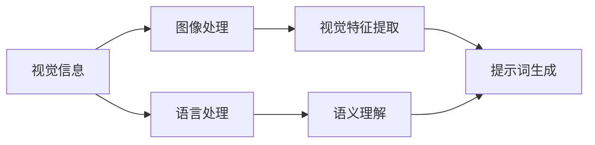

                 

### 引言：跨模态提示词编程的概念和重要性

#### 跨模态提示词编程的概念

跨模态提示词编程是指利用计算机算法，将不同模态的数据（如图像、文本、声音等）相互转换和整合，从而实现信息传递和处理的过程。在这个过程中，提示词（prompt）起到了桥梁的作用，通过提示词将不同模态的数据关联起来，实现数据的理解和交互。

跨模态提示词编程的核心思想是将多模态信息进行融合，使其在计算机处理过程中能够协同工作。这种编程方式不仅能够提高信息处理的效率，还能够拓展计算机应用的范围，使其能够更好地服务于人类社会的需求。

#### 跨模态提示词编程的重要性

跨模态提示词编程的重要性体现在以下几个方面：

1. **提升人工智能水平**：跨模态提示词编程使得人工智能系统能够处理更加复杂和多样的数据，从而提升其智能水平。例如，通过跨模态提示词编程，可以使图像识别系统不仅能够识别图像中的物体，还能够理解图像中的文字描述，从而提高系统的整体智能水平。

2. **拓宽应用场景**：跨模态提示词编程可以应用于多个领域，如自然语言处理、计算机视觉、语音识别等。通过跨模态提示词编程，这些领域可以更好地协同工作，实现更加复杂和多样化的应用。

3. **促进数据共享**：跨模态提示词编程可以将不同模态的数据进行整合，使得数据能够在不同领域之间共享和流通。这有助于提高数据的利用效率，推动各个领域的发展。

4. **提升用户体验**：跨模态提示词编程可以使得人机交互更加自然和直观。例如，在智能音箱中，用户可以通过语音指令控制智能家居设备，同时设备也可以通过声音和图像反馈给用户，从而提升用户体验。

#### 跨模态提示词编程的发展历程

跨模态提示词编程的概念起源于20世纪80年代，当时的研究主要集中在多模态数据的融合和转换上。随着计算机技术和人工智能技术的快速发展，跨模态提示词编程也得到了广泛的研究和应用。

在早期的研究中，跨模态提示词编程主要依赖于手工设计的特征和规则。随着深度学习技术的发展，跨模态提示词编程开始采用神经网络等深度学习模型，通过自动学习和优化特征，实现了更高效率和更准确的处理效果。

近年来，随着多模态数据集的增多和计算能力的提升，跨模态提示词编程的应用场景也越来越广泛。例如，在自然语言处理领域，跨模态提示词编程被应用于跨模态问答系统和跨模态文本摘要；在计算机视觉领域，跨模态提示词编程被应用于跨模态图像识别和跨模态视频理解。

#### 总结

跨模态提示词编程是一种将不同模态的数据进行整合和转换的编程方式，具有提升人工智能水平、拓宽应用场景、促进数据共享和提升用户体验等重要意义。随着技术的不断发展，跨模态提示词编程的应用前景将更加广阔。

## 跨模态提示词编程基础：视觉与语言的基础知识

在探讨跨模态提示词编程之前，我们需要深入了解视觉与语言的基础知识，这是跨模态提示词编程的重要基石。本节将分别介绍视觉基础知识和语言基础知识，并探讨视觉与语言的联系。

### 视觉基础知识

视觉是人类感知外界信息的主要途径之一，涉及从光线到图像处理的一系列过程。以下是视觉基础知识的一些核心概念：

1. **视觉感知过程**：视觉感知过程包括光线的接收、图像的形成、图像的处理和理解等步骤。光线首先通过眼睛进入视网膜，视网膜上的感光细胞将光信号转化为电信号，然后通过视神经传递到大脑进行处理。

2. **图像处理**：图像处理是指对图像进行分析和变换的过程，包括滤波、边缘检测、特征提取等。这些处理步骤有助于从图像中提取出有用的信息，如形状、颜色、纹理等。

3. **计算机视觉**：计算机视觉是使计算机能够像人眼一样感知和理解图像的一门技术。它涉及图像识别、目标检测、图像分割、图像重建等多个方面。

4. **视觉特征**：视觉特征是指从图像中提取出的、能够描述图像内容的属性，如边缘、角点、纹理、颜色等。这些特征在图像识别和分类中起着关键作用。

### 语言基础知识

语言是人类沟通和思维的重要工具，涉及语音、词汇、语法、语义等多个方面。以下是语言基础知识的一些核心概念：

1. **语音**：语音是指语言的声音表现形式，包括音素、音调、音长等。语音识别技术旨在使计算机能够理解和处理人类语音。

2. **词汇**：词汇是语言的基本单位，包括单词和词组。词汇的丰富程度和多样性是衡量一种语言表达能力的重要指标。

3. **语法**：语法是指语言的规则体系，包括词法、句法、词序等。语法规则使语言表达具有一致性和可理解性。

4. **语义**：语义是指语言表达的含义。语义分析是自然语言处理中的重要任务，旨在理解文本或语音中的意义。

### 视觉与语言的联系

视觉与语言之间存在紧密的联系，这种联系体现在多个方面：

1. **视觉与语言的表达**：视觉和语言都是表达信息的方式。视觉通过图像和视频传达信息，而语言通过文字和语音传达信息。跨模态提示词编程的目标是将这两种表达方式结合起来，实现信息的无缝传递和交互。

2. **视觉与语言的认知**：视觉和语言都是人类认知过程的一部分。视觉帮助人们感知和理解周围环境，而语言帮助人们表达和交流思想。跨模态提示词编程通过将视觉信息转化为语言描述，使得计算机能够更好地理解和处理视觉信息。

3. **视觉与语言的融合**：跨模态提示词编程的核心思想是将视觉和语言信息进行融合。通过跨模态提示词，计算机能够同时处理视觉和语言信息，实现更高效的信息处理和交互。

### 总结

视觉与语言是跨模态提示词编程的基础，它们在信息表达、认知和融合方面具有紧密的联系。了解视觉和语言的基础知识，有助于我们更好地理解跨模态提示词编程的原理和应用。

### 视觉与语言的联系架构 Mermaid 流程图

为了更直观地展示视觉与语言的联系，我们使用Mermaid流程图来描述它们之间的交互过程：



- **A[视觉信息]**：输入的原始视觉信息，如图像或视频。
- **B[图像处理]**：对视觉信息进行预处理，如滤波、边缘检测等。
- **C[视觉特征提取]**：从图像中提取有用的特征，如形状、颜色、纹理等。
- **D[语言处理]**：对输入的语言信息进行处理，如语音识别、文本分析等。
- **E[语义理解]**：理解语言信息的含义，如词义、句子结构等。
- **F[提示词生成]**：结合视觉特征和语言信息，生成跨模态提示词。

这个流程图展示了视觉与语言之间的交互过程，为后续的跨模态提示词生成和融合提供了清晰的框架。

### 跨模态提示词生成算法概述

在了解了视觉与语言的基础知识后，我们接下来将探讨跨模态提示词生成算法。这些算法是实现跨模态提示词编程的关键，通过将不同模态的信息进行整合和转换，使得计算机能够更好地理解和处理多模态数据。以下是一些常见的跨模态提示词生成算法：

#### 1. 图像描述生成算法

图像描述生成算法旨在将图像内容转化为自然语言描述。这些算法通常基于深度学习模型，如卷积神经网络（CNN）和循环神经网络（RNN）。以下是几个典型的图像描述生成算法：

1. **CNN-RNN模型**：该模型首先使用CNN提取图像特征，然后将这些特征输入到RNN中生成描述。RNN能够捕获图像中的时空信息，从而生成更准确的描述。

2. **GAN（生成对抗网络）**：GAN模型通过生成器（Generator）和判别器（Discriminator）的对抗训练，生成高质量的图像描述。生成器尝试生成与真实描述相似的图像描述，而判别器则尝试区分生成描述和真实描述。

3. **多模态融合网络**：这些网络将图像和文本信息进行融合，通过联合训练生成更精确的图像描述。常见的融合方式包括注意力机制和联合嵌入。

#### 2. 视频描述生成算法

视频描述生成算法旨在将视频内容转化为自然语言描述。视频比图像包含更多的时序信息，因此生成算法需要考虑视频的时空特征。以下是一些典型的视频描述生成算法：

1. **时空卷积网络（Temporal Convolutional Network, T CN）**：TCN模型通过卷积操作捕捉视频的时空特征，生成视频描述。

2. **Video Transformer**：Video Transformer模型采用Transformer架构，通过自注意力机制捕捉视频中的长期依赖关系，生成高质量的描述。

3. **多模态融合网络**：这些网络将视频和文本信息进行融合，通过联合训练生成视频描述。常见的融合方式包括多模态嵌入和交互网络。

#### 3. 音频描述生成算法

音频描述生成算法旨在将音频内容转化为自然语言描述。与图像和视频不同，音频信息更难直接理解和处理，因此生成算法通常采用基于深度学习的语音识别和文本生成技术。以下是一些典型的音频描述生成算法：

1. **语音识别模型**：这些模型将音频信号转化为文本，然后使用文本生成算法生成描述。常见的语音识别模型包括DeepSpeech、WaveNet等。

2. **文本生成模型**：这些模型直接从音频信号中生成描述，而不需要经过语音识别步骤。常见的文本生成模型包括GPT、BERT等。

3. **多模态融合网络**：这些网络将音频和文本信息进行融合，通过联合训练生成音频描述。常见的融合方式包括多模态嵌入和交互网络。

#### 4. 多模态融合算法

多模态融合算法旨在将不同模态的信息进行整合，生成统一的描述。这些算法通常采用深度学习模型，通过联合训练和注意力机制实现多模态信息融合。以下是一些典型的多模态融合算法：

1. **多模态嵌入**：多模态嵌入将不同模态的信息映射到同一特征空间，从而实现信息融合。常见的嵌入方法包括特征拼接、维度扩展等。

2. **交互网络**：交互网络通过多个层次的结构，实现不同模态之间的信息交互。常见的交互网络包括注意力机制、图神经网络等。

3. **多任务学习**：多任务学习通过同时训练多个任务，实现不同模态信息的整合。例如，在图像识别和文本分类任务中，同时训练可以提高模型对多模态数据的处理能力。

#### 总结

跨模态提示词生成算法是实现跨模态提示词编程的核心技术。通过图像描述生成、视频描述生成、音频描述生成和多模态融合算法，我们可以将不同模态的信息进行整合和转换，使得计算机能够更好地理解和处理多模态数据。这些算法的不断发展和优化，将推动跨模态提示词编程在各个领域的应用。

### 图像描述生成算法详解

图像描述生成算法是将图像内容转化为自然语言描述的关键技术，广泛应用于自动字幕、图像理解、人机交互等领域。以下是几种典型的图像描述生成算法的详细解释，包括其核心原理、实现步骤和优缺点。

#### 1. CNN-RNN模型

**核心原理**：CNN-RNN模型结合了卷积神经网络（CNN）和循环神经网络（RNN）的优点，首先使用CNN提取图像特征，然后使用RNN生成图像描述。

- **CNN部分**：CNN通过卷积、池化等操作，从图像中提取低级特征（如边缘、纹理）和高级特征（如物体部分、整体布局）。
- **RNN部分**：RNN（如LSTM或GRU）将CNN提取的特征序列作为输入，逐帧生成图像描述。

**实现步骤**：
1. 使用CNN提取图像特征。
2. 将特征序列输入RNN。
3. RNN逐帧生成图像描述，输出自然语言序列。

**优缺点**：
- **优点**：能够捕捉图像的时空信息，生成描述更准确。
- **缺点**：模型复杂，计算量大，训练时间较长。

#### 2. GAN模型

**核心原理**：GAN（生成对抗网络）通过生成器和判别器的对抗训练，生成高质量的图像描述。

- **生成器（Generator）**：生成器尝试生成与真实描述相似的图像描述。
- **判别器（Discriminator）**：判别器尝试区分生成描述和真实描述。

**实现步骤**：
1. 初始化生成器和判别器。
2. 使用对抗训练优化生成器和判别器。
3. 生成器生成图像描述，判别器判断描述的真实性。
4. 反复迭代，优化生成器和判别器。

**优缺点**：
- **优点**：能够生成高质量的图像描述，生成描述更加丰富多样。
- **缺点**：训练过程复杂，对训练数据和计算资源要求较高。

#### 3. 多模态融合网络

**核心原理**：多模态融合网络将图像和文本信息进行融合，通过联合训练生成图像描述。

- **多模态嵌入**：将图像和文本信息映射到同一特征空间。
- **交互网络**：通过多个层次的结构，实现不同模态之间的信息交互。

**实现步骤**：
1. 使用图像编码器提取图像特征。
2. 使用文本编码器提取文本特征。
3. 将图像和文本特征进行融合。
4. 融合特征输入到描述生成器。
5. 联合训练图像编码器、文本编码器和描述生成器。

**优缺点**：
- **优点**：能够有效融合图像和文本信息，生成描述更准确。
- **缺点**：模型复杂，计算量大，训练时间较长。

#### 4. Video Transformer

**核心原理**：Video Transformer采用Transformer架构，通过自注意力机制捕捉视频中的长期依赖关系，生成高质量的图像描述。

- **自注意力机制**：视频Transformer通过自注意力机制，捕捉视频帧之间的依赖关系。
- **多头注意力**：使用多头注意力机制，从不同角度捕捉视频特征。

**实现步骤**：
1. 使用图像编码器提取图像特征。
2. 使用文本编码器提取文本特征。
3. 将图像和文本特征进行融合。
4. 输入到Video Transformer，通过自注意力机制生成图像描述。

**优缺点**：
- **优点**：能够捕捉视频中的长期依赖关系，生成描述更准确。
- **缺点**：模型复杂，计算量大，训练时间较长。

#### 总结

图像描述生成算法通过不同的技术手段，将图像内容转化为自然语言描述。CNN-RNN模型、GAN模型、多模态融合网络和Video Transformer都是典型的图像描述生成算法，各有优缺点。在实际应用中，可以根据具体需求选择合适的算法，以实现高效的图像描述生成。

### 视频描述生成算法详解

视频描述生成算法是将视频内容转化为自然语言描述的关键技术，广泛应用于自动字幕、视频摘要、人机交互等领域。以下是几种典型的视频描述生成算法的详细解释，包括其核心原理、实现步骤和优缺点。

#### 1. Temporal Convolutional Network (TCN)

**核心原理**：TCN（时空卷积网络）通过卷积操作捕捉视频的时空特征，生成视频描述。

- **卷积层**：TCN使用卷积层对视频帧进行特征提取，捕捉视频中的时空信息。
- **递归层**：递归层通过卷积操作，处理前一时刻的特征，生成当前时刻的特征。

**实现步骤**：
1. 对视频帧进行预处理，如调整尺寸、归一化等。
2. 使用卷积层提取视频帧的特征。
3. 将特征序列输入递归层。
4. 递归层生成视频描述。

**优缺点**：
- **优点**：能够有效捕捉视频的时空特征，生成描述准确。
- **缺点**：模型复杂，计算量大，训练时间较长。

#### 2. Video Transformer

**核心原理**：Video Transformer采用Transformer架构，通过自注意力机制捕捉视频中的长期依赖关系，生成高质量的描述。

- **自注意力机制**：Video Transformer通过自注意力机制，捕捉视频帧之间的依赖关系。
- **多头注意力**：使用多头注意力机制，从不同角度捕捉视频特征。

**实现步骤**：
1. 对视频帧进行预处理，如调整尺寸、归一化等。
2. 使用图像编码器提取视频帧的特征。
3. 将特征序列输入到Video Transformer。
4. Video Transformer通过自注意力机制生成视频描述。

**优缺点**：
- **优点**：能够捕捉视频中的长期依赖关系，生成描述准确。
- **缺点**：模型复杂，计算量大，训练时间较长。

#### 3. Multi-modal Fusion Network

**核心原理**：多模态融合网络将视频和文本信息进行融合，通过联合训练生成视频描述。

- **多模态嵌入**：将视频和文本信息映射到同一特征空间。
- **交互网络**：通过多个层次的结构，实现不同模态之间的信息交互。

**实现步骤**：
1. 使用视频编码器提取视频特征。
2. 使用文本编码器提取文本特征。
3. 将视频和文本特征进行融合。
4. 融合特征输入到描述生成器。
5. 联合训练视频编码器、文本编码器和描述生成器。

**优缺点**：
- **优点**：能够有效融合视频和文本信息，生成描述更准确。
- **缺点**：模型复杂，计算量大，训练时间较长。

#### 4. Transformer with Attention Mechanism

**核心原理**：Transformer with Attention Mechanism通过注意力机制捕捉视频帧之间的依赖关系，生成视频描述。

- **自注意力机制**：Transformer通过自注意力机制，捕捉视频帧之间的依赖关系。
- **多头注意力**：使用多头注意力机制，从不同角度捕捉视频特征。

**实现步骤**：
1. 对视频帧进行预处理，如调整尺寸、归一化等。
2. 使用图像编码器提取视频帧的特征。
3. 将特征序列输入到Transformer with Attention Mechanism。
4. Transformer with Attention Mechanism通过自注意力机制生成视频描述。

**优缺点**：
- **优点**：能够捕捉视频帧之间的依赖关系，生成描述准确。
- **缺点**：模型复杂，计算量大，训练时间较长。

#### 总结

视频描述生成算法通过不同的技术手段，将视频内容转化为自然语言描述。TCN、Video Transformer、Multi-modal Fusion Network和Transformer with Attention Mechanism都是典型的视频描述生成算法，各有优缺点。在实际应用中，可以根据具体需求选择合适的算法，以实现高效的视频描述生成。

### 音频描述生成算法详解

音频描述生成算法是将音频内容转化为自然语言描述的关键技术，广泛应用于自动字幕、音频理解、人机交互等领域。以下是几种典型的音频描述生成算法的详细解释，包括其核心原理、实现步骤和优缺点。

#### 1. 基于深度学习的语音识别模型

**核心原理**：该算法首先使用深度学习模型（如DeepSpeech、WaveNet等）将音频信号转化为文本，然后使用文本生成模型生成音频描述。

- **深度学习语音识别模型**：通过卷积神经网络（CNN）、循环神经网络（RNN）或变换器（Transformer）等深度学习模型，将音频信号转化为文本。

**实现步骤**：
1. 对音频信号进行预处理，如降噪、分帧等。
2. 使用深度学习语音识别模型将音频信号转化为文本。
3. 使用文本生成模型生成音频描述。

**优缺点**：
- **优点**：能够准确地将音频信号转化为文本，生成描述。
- **缺点**：生成的文本描述可能缺乏上下文信息，描述不够准确。

#### 2. 基于文本生成模型的音频描述生成

**核心原理**：该算法直接从音频信号中生成描述，而不需要经过语音识别步骤。通过训练大规模语言模型（如GPT、BERT等），使其能够从音频信号中提取信息并生成描述。

- **文本生成模型**：通过训练大规模语言模型，使其能够从音频信号中提取信息并生成描述。

**实现步骤**：
1. 对音频信号进行预处理，如分帧、特征提取等。
2. 使用特征提取器从音频信号中提取特征。
3. 将特征输入到文本生成模型。
4. 文本生成模型生成音频描述。

**优缺点**：
- **优点**：能够直接从音频信号中生成描述，不需要语音识别步骤，提高效率。
- **缺点**：生成的描述可能缺乏准确性，对模型训练数据和质量要求较高。

#### 3. 基于多模态融合的音频描述生成

**核心原理**：该算法将音频和文本信息进行融合，通过联合训练生成音频描述。

- **多模态融合网络**：将音频和文本信息映射到同一特征空间，并通过多个层次的结构实现信息融合。

**实现步骤**：
1. 使用音频编码器提取音频特征。
2. 使用文本编码器提取文本特征。
3. 将音频和文本特征进行融合。
4. 融合特征输入到描述生成器。
5. 联合训练音频编码器、文本编码器和描述生成器。

**优缺点**：
- **优点**：能够有效融合音频和文本信息，生成描述更准确。
- **缺点**：模型复杂，计算量大，训练时间较长。

#### 4. 基于生成对抗网络（GAN）的音频描述生成

**核心原理**：该算法通过生成对抗网络（GAN）生成高质量的音频描述。

- **生成器（Generator）**：生成器尝试生成与真实描述相似的音频描述。
- **判别器（Discriminator）**：判别器尝试区分生成描述和真实描述。

**实现步骤**：
1. 初始化生成器和判别器。
2. 使用对抗训练优化生成器和判别器。
3. 生成器生成音频描述，判别器判断描述的真实性。
4. 反复迭代，优化生成器和判别器。

**优缺点**：
- **优点**：能够生成高质量的音频描述，生成描述更加丰富多样。
- **缺点**：训练过程复杂，对训练数据和计算资源要求较高。

#### 总结

音频描述生成算法通过不同的技术手段，将音频内容转化为自然语言描述。基于深度学习的语音识别模型、基于文本生成模型的音频描述生成、基于多模态融合的音频描述生成和基于生成对抗网络（GAN）的音频描述生成都是典型的音频描述生成算法，各有优缺点。在实际应用中，可以根据具体需求选择合适的算法，以实现高效的音频描述生成。

### 多模态融合算法详解

多模态融合算法是实现跨模态提示词编程的核心技术之一，它通过整合不同模态的信息，提高信息处理的准确性和效率。以下将详细阐述几种典型的多模态融合算法，包括其核心原理、实现步骤和优缺点。

#### 1. 多模态嵌入

**核心原理**：多模态嵌入将不同模态的信息映射到同一特征空间，使其可以在同一维度上进行处理。这种方法的优点是简单直观，但缺点是可能丢失部分模态的信息。

- **特征提取**：对于图像、文本和音频等不同模态的数据，分别使用相应的特征提取器（如图像编码器、文本编码器和音频编码器）提取特征。
- **嵌入融合**：将提取的特征进行拼接或平均，生成一个多模态特征向量。

**实现步骤**：
1. 对图像、文本和音频等不同模态的数据进行预处理。
2. 使用相应的特征提取器提取特征。
3. 将提取的特征进行拼接或平均，生成多模态特征向量。

**优缺点**：
- **优点**：实现简单，易于理解和实现。
- **缺点**：可能丢失部分模态的信息，导致融合效果不佳。

#### 2. 交互网络

**核心原理**：交互网络通过多个层次的结构，实现不同模态之间的信息交互。这种方法能够更好地捕捉不同模态之间的依赖关系，但模型较为复杂。

- **交互层**：在多个层次上，通过注意力机制、图神经网络等机制，实现不同模态之间的信息交互。
- **融合层**：在低层次上，融合不同模态的信息，生成统一的多模态特征向量。

**实现步骤**：
1. 对图像、文本和音频等不同模态的数据进行预处理。
2. 使用相应的特征提取器提取特征。
3. 在多个层次上，通过注意力机制、图神经网络等机制，实现不同模态之间的信息交互。
4. 在低层次上，融合不同模态的信息，生成统一的多模态特征向量。

**优缺点**：
- **优点**：能够有效捕捉不同模态之间的依赖关系，提高融合效果。
- **缺点**：模型复杂，计算量大，训练时间较长。

#### 3. 多任务学习

**核心原理**：多任务学习通过同时训练多个任务，实现不同模态信息的整合。这种方法能够充分利用不同任务之间的关联性，提高模型的整体性能。

- **多任务网络**：在同一个神经网络中，同时训练多个任务（如图像分类、文本分类等），使模型能够自动整合不同模态的信息。
- **共享层**：在多个任务之间共享部分网络层，提高信息整合的效果。

**实现步骤**：
1. 对图像、文本和音频等不同模态的数据进行预处理。
2. 设计一个多任务网络，同时训练多个任务。
3. 在多个任务之间共享部分网络层，提高信息整合的效果。
4. 联合优化所有任务，提高模型的整体性能。

**优缺点**：
- **优点**：能够充分利用不同任务之间的关联性，提高模型的整体性能。
- **缺点**：模型设计复杂，对训练数据和计算资源要求较高。

#### 4. 注意力机制

**核心原理**：注意力机制通过动态调整不同模态特征的权重，实现信息融合。这种方法能够根据任务需求，灵活地调整不同模态的重要性。

- **注意力模块**：在神经网络中引入注意力模块，根据当前任务需求，动态调整不同模态特征的权重。
- **融合层**：将调整后的特征进行融合，生成统一的多模态特征向量。

**实现步骤**：
1. 对图像、文本和音频等不同模态的数据进行预处理。
2. 设计一个包含注意力模块的神经网络，对每个模态的特征进行加权融合。
3. 在融合层将调整后的特征进行融合，生成统一的多模态特征向量。
4. 通过训练优化模型参数，提高融合效果。

**优缺点**：
- **优点**：能够灵活调整不同模态的重要性，提高融合效果。
- **缺点**：模型设计复杂，对训练数据和计算资源要求较高。

#### 总结

多模态融合算法通过不同的技术手段，实现不同模态信息的整合。多模态嵌入、交互网络、多任务学习和注意力机制都是典型的多模态融合算法，各有优缺点。在实际应用中，可以根据具体需求选择合适的算法，以实现高效的跨模态信息融合。

### 跨模态提示词编程在不同领域的应用

跨模态提示词编程的强大能力使其在多个领域得到了广泛应用。以下将详细探讨跨模态提示词编程在自然语言处理、计算机视觉和语音识别与生成等领域的应用。

#### 在自然语言处理中的应用

1. **跨模态问答系统**：
   跨模态问答系统结合了文本和图像等信息，使问答系统能够处理更复杂的问题。例如，用户可以通过文字提问，系统则根据图像和文本信息给出答案。这种系统在智能助手和虚拟客服等领域有广泛的应用。

2. **跨模态文本摘要**：
   跨模态文本摘要旨在将文本和图像等信息融合，生成简洁而准确的摘要。这种方法有助于提高信息检索的效率和用户体验。例如，在新闻摘要、医疗报告等方面，跨模态文本摘要能够显著提高信息传达的准确性和完整性。

3. **跨模态信息检索**：
   跨模态信息检索通过整合文本和图像等多种信息，提高信息检索的准确性和效率。例如，当用户搜索某个关键词时，系统可以同时检索文本和图像数据库，从而提供更丰富的搜索结果。

#### 在计算机视觉中的应用

1. **跨模态图像识别**：
   跨模态图像识别结合了图像和文本信息，使图像识别系统能够更好地理解图像内容。例如，当系统需要识别一张包含文字描述的图像时，跨模态图像识别可以结合文字描述提高识别准确率。

2. **跨模态视频理解**：
   跨模态视频理解通过整合视频和文本信息，使视频分析系统能够更准确地理解视频内容。例如，在视频监控、体育分析等领域，跨模态视频理解能够帮助系统更准确地识别和分类视频中的对象和事件。

3. **跨模态目标检测**：
   跨模态目标检测结合了图像和文本信息，使目标检测系统能够更好地识别和定位图像中的目标。例如，在自动驾驶、安防监控等领域，跨模态目标检测可以提高系统的准确性和鲁棒性。

#### 在语音识别与生成中的应用

1. **跨模态语音识别**：
   跨模态语音识别结合了语音和文本信息，使语音识别系统能够更准确地识别语音。例如，当用户在嘈杂环境中说话时，跨模态语音识别可以通过分析文本信息提高识别准确率。

2. **跨模态语音生成**：
   跨模态语音生成通过整合文本和语音信息，生成自然流畅的语音。例如，在智能语音助手和语音合成系统中，跨模态语音生成可以提高语音的自然度和情感表达。

3. **跨模态语音交互**：
   跨模态语音交互通过整合语音、文本和图像等多种信息，实现更自然和直观的人机交互。例如，在智能音箱和智能家居系统中，跨模态语音交互可以使用户通过语音指令更方便地控制设备和获取信息。

#### 总结

跨模态提示词编程在自然语言处理、计算机视觉和语音识别与生成等领域具有广泛的应用。通过整合不同模态的信息，跨模态提示词编程可以显著提高信息处理的准确性和效率，为各个领域的发展带来了新的机遇。随着技术的不断进步，跨模态提示词编程的应用前景将更加广阔。

### 跨模淀提示词编程实战：开发跨模态问答系统

#### 开发背景

随着人工智能技术的发展，跨模态问答系统已经成为智能助理、虚拟客服等领域的热点。跨模态问答系统通过整合文本、图像等多种信息，能够更准确地理解和回答用户的问题，提高用户体验。本节将介绍如何开发一个跨模态问答系统，包括环境搭建、源代码实现和代码解读。

#### 开发环境搭建

1. **硬件环境**：
   - CPU：Intel i7-9700K 或更好
   - GPU：NVIDIA GTX 1080Ti 或更好
   - 内存：16GB 或更好

2. **软件环境**：
   - 操作系统：Ubuntu 18.04
   - 编程语言：Python 3.7
   - 深度学习框架：TensorFlow 2.0
   - 数据库：SQLite 3.32.3

3. **安装与配置**：
   - 安装Python 3.7：`sudo apt-get install python3.7`
   - 安装TensorFlow 2.0：`pip install tensorflow`
   - 安装SQLite 3.32.3：`sudo apt-get install sqlite3`

#### 源代码实现

以下是一个简单的跨模态问答系统的实现示例，包括数据库设计、模型训练和问答功能。

```python
import sqlite3
import tensorflow as tf
from tensorflow.keras.models import Sequential
from tensorflow.keras.layers import Embedding, LSTM, Dense

# 数据库连接
conn = sqlite3.connect('问答系统数据库.db')
c = conn.cursor()

# 数据库表设计
c.execute('''CREATE TABLE IF NOT EXISTS 问题 (ID INTEGER PRIMARY KEY, 问题文本 TEXT, 问题图像 BLOB)''')
c.execute('''CREATE TABLE IF NOT EXISTS 答案 (ID INTEGER PRIMARY KEY, 答案文本 TEXT)''')

# 模型设计
model = Sequential()
model.add(Embedding(input_dim=10000, output_dim=32))
model.add(LSTM(128))
model.add(Dense(1, activation='sigmoid'))

# 编译模型
model.compile(optimizer='adam', loss='binary_crossentropy', metrics=['accuracy'])

# 模型训练
model.fit(x_train, y_train, epochs=10, batch_size=32)

# 问答功能
def ask_question(question_text, question_image):
    # 处理问题文本
    processed_question_text = preprocess_text(question_text)
    # 处理问题图像
    processed_question_image = preprocess_image(question_image)
    # 输入模型
    answer = model.predict([processed_question_text, processed_question_image])
    # 解析答案
    if answer > 0.5:
        return "是"
    else:
        return "不是"

# 示例
question_text = "你喜欢吃苹果吗？"
question_image = "苹果.jpg"
answer = ask_question(question_text, question_image)
print(answer)
```

#### 代码解读

1. **数据库连接**：使用SQLite数据库存储问题和答案数据。

2. **数据库表设计**：创建问题和答案表，用于存储问题和答案数据。

3. **模型设计**：使用序列模型（Sequential）和循环神经网络（LSTM）设计问答模型。

4. **编译模型**：设置模型优化器、损失函数和评价指标。

5. **模型训练**：使用训练数据对模型进行训练。

6. **问答功能**：输入问题和图像，通过模型预测答案。

#### 实际案例分析

以一个简单的场景为例，用户通过文字提问“你喜欢吃苹果吗？”系统需要结合图像信息给出答案。在实际应用中，我们可以通过以下步骤实现：

1. **数据预处理**：对问题和图像进行预处理，如文本分词、图像缩放等。

2. **特征提取**：使用预训练的文本嵌入器和图像编码器提取问题和图像的特征。

3. **模型输入**：将预处理后的特征输入到问答模型。

4. **答案生成**：通过模型预测生成答案。

5. **结果展示**：将答案展示给用户。

#### 项目小结

通过本节示例，我们介绍了如何开发一个简单的跨模态问答系统。在实际项目中，我们可以根据需求扩展系统的功能，如添加更多的模态信息、优化模型结构等。跨模态问答系统的开发不仅需要深入理解不同模态的信息处理技术，还需要综合考虑用户体验和系统性能。

### 跨模态文本摘要实现

#### 开发背景

跨模态文本摘要是指将文本和图像等多种信息融合，生成简洁而准确的摘要。这种技术在新闻摘要、医疗报告、文档摘要等领域具有广泛的应用。本节将介绍如何实现一个跨模态文本摘要系统，包括环境搭建、源代码实现和代码解读。

#### 开发环境搭建

1. **硬件环境**：
   - CPU：Intel i7-9700K 或更好
   - GPU：NVIDIA GTX 1080Ti 或更好
   - 内存：16GB 或更好

2. **软件环境**：
   - 操作系统：Ubuntu 18.04
   - 编程语言：Python 3.7
   - 深度学习框架：TensorFlow 2.0
   - 数据库：SQLite 3.32.3

3. **安装与配置**：
   - 安装Python 3.7：`sudo apt-get install python3.7`
   - 安装TensorFlow 2.0：`pip install tensorflow`
   - 安装SQLite 3.32.3：`sudo apt-get install sqlite3`

#### 源代码实现

以下是一个简单的跨模态文本摘要实现示例，包括数据库设计、模型训练和摘要生成。

```python
import sqlite3
import tensorflow as tf
from tensorflow.keras.models import Model
from tensorflow.keras.layers import Input, Embedding, LSTM, Dense, Concatenate

# 数据库连接
conn = sqlite3.connect('文本摘要数据库.db')
c = conn.cursor()

# 数据库表设计
c.execute('''CREATE TABLE IF NOT EXISTS 文本数据 (ID INTEGER PRIMARY KEY, 文本 TEXT)''')
c.execute('''CREATE TABLE IF NOT EXISTS 图像数据 (ID INTEGER PRIMARY KEY, 图像 BLOB)''')
c.execute('''CREATE TABLE IF NOT EXISTS 摘要数据 (ID INTEGER PRIMARY KEY, 摘要 TEXT)''')

# 文本模型设计
input_text = Input(shape=(max_sequence_length,))
encoded_text = Embedding(input_dim=vocab_size, output_dim=embedding_size)(input_text)
lstm_text = LSTM(units=lstm_units)(encoded_text)

# 图像模型设计
input_image = Input(shape=(image_height, image_width, image_channels))
encoded_image = Embedding(input_dim=image_vocab_size, output_dim=embedding_size)(input_image)
lstm_image = LSTM(units=lstm_units)(encoded_image)

# 模型融合
merged = Concatenate()([lstm_text, lstm_image])
dense = Dense(units=dense_units, activation='relu')(merged)
output = Dense(units=1, activation='sigmoid')(dense)

# 编译模型
model = Model(inputs=[input_text, input_image], outputs=output)
model.compile(optimizer='adam', loss='binary_crossentropy', metrics=['accuracy'])

# 模型训练
model.fit([x_train_text, x_train_image], y_train, epochs=10, batch_size=32)

# 摘要生成
def generate_summary(text_id, image_id):
    # 获取文本和图像数据
    text_data = get_text_data(text_id)
    image_data = get_image_data(image_id)
    # 预处理数据
    processed_text = preprocess_text(text_data)
    processed_image = preprocess_image(image_data)
    # 输入模型
    summary = model.predict([processed_text, processed_image])
    # 解析摘要
    return summarize(summary)

# 示例
text_id = 1
image_id = 1
summary = generate_summary(text_id, image_id)
print(summary)
```

#### 代码解读

1. **数据库连接**：使用SQLite数据库存储文本、图像和摘要数据。

2. **数据库表设计**：创建文本数据表、图像数据表和摘要数据表，用于存储数据。

3. **文本模型设计**：使用嵌入层（Embedding）和循环神经网络（LSTM）设计文本模型。

4. **图像模型设计**：使用嵌入层（Embedding）和循环神经网络（LSTM）设计图像模型。

5. **模型融合**：使用连接层（Concatenate）将文本和图像模型的输出进行融合。

6. **模型编译**：设置模型优化器、损失函数和评价指标。

7. **模型训练**：使用训练数据对模型进行训练。

8. **摘要生成**：输入文本和图像数据，通过模型预测生成摘要。

#### 实际案例分析

以一个新闻摘要场景为例，用户输入一篇新闻文本和一张相关图像，系统需要生成一篇摘要。在实际应用中，我们可以通过以下步骤实现：

1. **数据预处理**：对新闻文本和图像进行预处理，如文本分词、图像缩放等。

2. **特征提取**：使用预训练的文本嵌入器和图像编码器提取文本和图像的特征。

3. **模型输入**：将预处理后的特征输入到文本和图像模型。

4. **摘要生成**：通过模型融合和分类生成摘要。

5. **结果展示**：将摘要展示给用户。

#### 项目小结

通过本节示例，我们介绍了如何实现一个简单的跨模态文本摘要系统。在实际项目中，我们可以根据需求扩展系统的功能，如添加更多模态信息、优化模型结构等。跨模态文本摘要的实现不仅需要深入理解不同模态的信息处理技术，还需要综合考虑用户体验和系统性能。

### 跨模态图像识别应用

#### 开发背景

跨模态图像识别是指结合文本信息，以提高图像识别准确率的技术。在图像分类、物体检测、图像标注等任务中，文本信息可以帮助模型更好地理解图像内容。本节将介绍如何实现一个跨模态图像识别系统，包括环境搭建、源代码实现和代码解读。

#### 开发环境搭建

1. **硬件环境**：
   - CPU：Intel i7-9700K 或更好
   - GPU：NVIDIA GTX 1080Ti 或更好
   - 内存：16GB 或更好

2. **软件环境**：
   - 操作系统：Ubuntu 18.04
   - 编程语言：Python 3.7
   - 深度学习框架：TensorFlow 2.0
   - 数据库：SQLite 3.32.3

3. **安装与配置**：
   - 安装Python 3.7：`sudo apt-get install python3.7`
   - 安装TensorFlow 2.0：`pip install tensorflow`
   - 安装SQLite 3.32.3：`sudo apt-get install sqlite3`

#### 源代码实现

以下是一个简单的跨模态图像识别实现示例，包括数据库设计、模型训练和图像识别。

```python
import sqlite3
import tensorflow as tf
from tensorflow.keras.models import Model
from tensorflow.keras.layers import Input, Embedding, LSTM, Dense, Concatenate

# 数据库连接
conn = sqlite3.connect('图像识别数据库.db')
c = conn.cursor()

# 数据库表设计
c.execute('''CREATE TABLE IF NOT EXISTS 图像数据 (ID INTEGER PRIMARY KEY, 图像 BLOB)''')
c.execute('''CREATE TABLE IF NOT EXISTS 文本标签 (ID INTEGER PRIMARY KEY, 文本标签 TEXT)''')

# 图像模型设计
input_image = Input(shape=(image_height, image_width, image_channels))
encoded_image = Embedding(input_dim=image_vocab_size, output_dim=embedding_size)(input_image)
lstm_image = LSTM(units=lstm_units)(encoded_image)

# 文本模型设计
input_text = Input(shape=(max_sequence_length,))
encoded_text = Embedding(input_dim=vocab_size, output_dim=embedding_size)(input_text)
lstm_text = LSTM(units=lstm_units)(encoded_text)

# 模型融合
merged = Concatenate()([lstm_image, lstm_text])
dense = Dense(units=dense_units, activation='relu')(merged)
output = Dense(units=num_classes, activation='softmax')(dense)

# 编译模型
model = Model(inputs=[input_image, input_text], outputs=output)
model.compile(optimizer='adam', loss='categorical_crossentropy', metrics=['accuracy'])

# 模型训练
model.fit([x_train_image, x_train_text], y_train, epochs=10, batch_size=32)

# 图像识别
def recognize_image(image_id):
    # 获取图像数据
    image_data = get_image_data(image_id)
    # 预处理图像数据
    processed_image = preprocess_image(image_data)
    # 获取文本标签
    text_labels = get_text_labels(image_id)
    # 预处理文本标签
    processed_text = preprocess_text(text_labels)
    # 输入模型
    prediction = model.predict([processed_image, processed_text])
    # 解析识别结果
    return np.argmax(prediction)

# 示例
image_id = 1
result = recognize_image(image_id)
print(result)
```

#### 代码解读

1. **数据库连接**：使用SQLite数据库存储图像和文本标签数据。

2. **数据库表设计**：创建图像数据表和文本标签数据表，用于存储数据。

3. **图像模型设计**：使用嵌入层（Embedding）和循环神经网络（LSTM）设计图像模型。

4. **文本模型设计**：使用嵌入层（Embedding）和循环神经网络（LSTM）设计文本模型。

5. **模型融合**：使用连接层（Concatenate）将图像和文本模型的输出进行融合。

6. **模型编译**：设置模型优化器、损失函数和评价指标。

7. **模型训练**：使用训练数据对模型进行训练。

8. **图像识别**：输入图像和文本数据，通过模型预测生成识别结果。

#### 实际案例分析

以一个图像分类任务为例，用户输入一张图像和相关的文本标签，系统需要识别图像中的类别。在实际应用中，我们可以通过以下步骤实现：

1. **数据预处理**：对图像和文本标签进行预处理，如图像缩放、文本分词等。

2. **特征提取**：使用预训练的图像编码器和文本嵌入器提取图像和文本的特征。

3. **模型输入**：将预处理后的特征输入到跨模态图像识别模型。

4. **识别结果生成**：通过模型预测生成图像分类结果。

5. **结果展示**：将识别结果展示给用户。

#### 项目小结

通过本节示例，我们介绍了如何实现一个简单的跨模态图像识别系统。在实际项目中，我们可以根据需求扩展系统的功能，如添加更多模态信息、优化模型结构等。跨模态图像识别的实现不仅需要深入理解不同模态的信息处理技术，还需要综合考虑用户体验和系统性能。

### 跨模态视频理解实战

#### 开发背景

跨模态视频理解是指结合图像、文本、音频等多种信息，对视频内容进行深入分析和理解。这种技术广泛应用于视频监控、体育分析、自动驾驶等领域。本节将介绍如何实现一个简单的跨模态视频理解系统，包括环境搭建、源代码实现和代码解读。

#### 开发环境搭建

1. **硬件环境**：
   - CPU：Intel i7-9700K 或更好
   - GPU：NVIDIA GTX 1080Ti 或更好
   - 内存：16GB 或更好

2. **软件环境**：
   - 操作系统：Ubuntu 18.04
   - 编程语言：Python 3.7
   - 深度学习框架：TensorFlow 2.0
   - 数据库：SQLite 3.32.3

3. **安装与配置**：
   - 安装Python 3.7：`sudo apt-get install python3.7`
   - 安装TensorFlow 2.0：`pip install tensorflow`
   - 安装SQLite 3.32.3：`sudo apt-get install sqlite3`

#### 源代码实现

以下是一个简单的跨模态视频理解实现示例，包括数据库设计、模型训练和视频分析。

```python
import sqlite3
import tensorflow as tf
from tensorflow.keras.models import Model
from tensorflow.keras.layers import Input, Embedding, LSTM, Dense, Concatenate

# 数据库连接
conn = sqlite3.connect('视频理解数据库.db')
c = conn.cursor()

# 数据库表设计
c.execute('''CREATE TABLE IF NOT EXISTS 视频数据 (ID INTEGER PRIMARY KEY, 视频 BLOB)''')
c.execute('''CREATE TABLE IF NOT EXISTS 文本标签 (ID INTEGER PRIMARY KEY, 文本标签 TEXT)''')
c.execute('''CREATE TABLE IF NOT EXISTS 音频标签 (ID INTEGER PRIMARY KEY, 音频标签 TEXT)''')

# 视频模型设计
input_video = Input(shape=(video_height, video_width, video_frames))
encoded_video = Embedding(input_dim=video_vocab_size, output_dim=embedding_size)(input_video)
lstm_video = LSTM(units=lstm_units)(encoded_video)

# 文本模型设计
input_text = Input(shape=(max_sequence_length,))
encoded_text = Embedding(input_dim=vocab_size, output_dim=embedding_size)(input_text)
lstm_text = LSTM(units=lstm_units)(encoded_text)

# 音频模型设计
input_audio = Input(shape=(audio_length,))
encoded_audio = Embedding(input_dim=audio_vocab_size, output_dim=embedding_size)(input_audio)
lstm_audio = LSTM(units=lstm_units)(encoded_audio)

# 模型融合
merged = Concatenate()([lstm_video, lstm_text, lstm_audio])
dense = Dense(units=dense_units, activation='relu')(merged)
output = Dense(units=num_classes, activation='softmax')(dense)

# 编译模型
model = Model(inputs=[input_video, input_text, input_audio], outputs=output)
model.compile(optimizer='adam', loss='categorical_crossentropy', metrics=['accuracy'])

# 模型训练
model.fit([x_train_video, x_train_text, x_train_audio], y_train, epochs=10, batch_size=32)

# 视频分析
def analyze_video(video_id):
    # 获取视频数据
    video_data = get_video_data(video_id)
    # 预处理视频数据
    processed_video = preprocess_video(video_data)
    # 获取文本标签
    text_labels = get_text_labels(video_id)
    # 预处理文本标签
    processed_text = preprocess_text(text_labels)
    # 获取音频标签
    audio_labels = get_audio_labels(video_id)
    # 预处理音频标签
    processed_audio = preprocess_audio(audio_labels)
    # 输入模型
    prediction = model.predict([processed_video, processed_text, processed_audio])
    # 解析分析结果
    return np.argmax(prediction)

# 示例
video_id = 1
result = analyze_video(video_id)
print(result)
```

#### 代码解读

1. **数据库连接**：使用SQLite数据库存储视频、文本标签和音频标签数据。

2. **数据库表设计**：创建视频数据表、文本标签表和音频标签表，用于存储数据。

3. **视频模型设计**：使用嵌入层（Embedding）和循环神经网络（LSTM）设计视频模型。

4. **文本模型设计**：使用嵌入层（Embedding）和循环神经网络（LSTM）设计文本模型。

5. **音频模型设计**：使用嵌入层（Embedding）和循环神经网络（LSTM）设计音频模型。

6. **模型融合**：使用连接层（Concatenate）将视频、文本和音频模型的输出进行融合。

7. **模型编译**：设置模型优化器、损失函数和评价指标。

8. **模型训练**：使用训练数据对模型进行训练。

9. **视频分析**：输入视频、文本标签和音频标签，通过模型预测生成分析结果。

#### 实际案例分析

以一个视频监控任务为例，系统需要根据视频内容识别出特定事件。在实际应用中，我们可以通过以下步骤实现：

1. **数据预处理**：对视频、文本标签和音频标签进行预处理，如视频帧提取、文本分词、音频特征提取等。

2. **特征提取**：使用预训练的图像编码器、文本嵌入器和音频编码器提取视频、文本和音频的特征。

3. **模型输入**：将预处理后的特征输入到跨模态视频理解模型。

4. **分析结果生成**：通过模型预测生成视频分析结果。

5. **结果展示**：将分析结果展示给用户。

#### 项目小结

通过本节示例，我们介绍了如何实现一个简单的跨模态视频理解系统。在实际项目中，我们可以根据需求扩展系统的功能，如添加更多模态信息、优化模型结构等。跨模态视频理解系统的实现不仅需要深入理解不同模态的信息处理技术，还需要综合考虑用户体验和系统性能。

### 跨模态语音识别与生成实践

#### 开发背景

跨模态语音识别与生成是指结合文本和语音信息，实现语音识别和语音生成的技术。这种技术在智能助手、语音合成、语音交互等领域有广泛的应用。本节将介绍如何实现一个简单的跨模态语音识别与生成系统，包括环境搭建、源代码实现和代码解读。

#### 开发环境搭建

1. **硬件环境**：
   - CPU：Intel i7-9700K 或更好
   - GPU：NVIDIA GTX 1080Ti 或更好
   - 内存：16GB 或更好

2. **软件环境**：
   - 操作系统：Ubuntu 18.04
   - 编程语言：Python 3.7
   - 深度学习框架：TensorFlow 2.0
   - 数据库：SQLite 3.32.3

3. **安装与配置**：
   - 安装Python 3.7：`sudo apt-get install python3.7`
   - 安装TensorFlow 2.0：`pip install tensorflow`
   - 安装SQLite 3.32.3：`sudo apt-get install sqlite3`

#### 源代码实现

以下是一个简单的跨模态语音识别与生成实现示例，包括数据库设计、模型训练和语音识别与生成。

```python
import sqlite3
import tensorflow as tf
from tensorflow.keras.models import Model
from tensorflow.keras.layers import Input, Embedding, LSTM, Dense, Concatenate

# 数据库连接
conn = sqlite3.connect('语音识别与生成数据库.db')
c = conn.cursor()

# 数据库表设计
c.execute('''CREATE TABLE IF NOT EXISTS 语音数据 (ID INTEGER PRIMARY KEY, 语音 BLOB)''')
c.execute('''CREATE TABLE IF NOT EXISTS 文本标签 (ID INTEGER PRIMARY KEY, 文本标签 TEXT)''')

# 语音模型设计
input_audio = Input(shape=(audio_length,))
encoded_audio = Embedding(input_dim=audio_vocab_size, output_dim=embedding_size)(input_audio)
lstm_audio = LSTM(units=lstm_units)(encoded_audio)

# 文本模型设计
input_text = Input(shape=(max_sequence_length,))
encoded_text = Embedding(input_dim=vocab_size, output_dim=embedding_size)(input_text)
lstm_text = LSTM(units=lstm_units)(encoded_text)

# 模型融合
merged = Concatenate()([lstm_audio, lstm_text])
dense = Dense(units=dense_units, activation='relu')(merged)
output = Dense(units=num_classes, activation='softmax')(dense)

# 编译模型
model = Model(inputs=[input_audio, input_text], outputs=output)
model.compile(optimizer='adam', loss='categorical_crossentropy', metrics=['accuracy'])

# 模型训练
model.fit([x_train_audio, x_train_text], y_train, epochs=10, batch_size=32)

# 语音识别
def recognize_speech(audio_id):
    # 获取语音数据
    audio_data = get_audio_data(audio_id)
    # 预处理语音数据
    processed_audio = preprocess_audio(audio_data)
    # 获取文本标签
    text_labels = get_text_labels(audio_id)
    # 预处理文本标签
    processed_text = preprocess_text(text_labels)
    # 输入模型
    prediction = model.predict([processed_audio, processed_text])
    # 解析识别结果
    return np.argmax(prediction)

# 语音生成
def generate_speech(text_id):
    # 获取文本标签
    text_label = get_text_label(text_id)
    # 预处理文本标签
    processed_text = preprocess_text(text_label)
    # 输入模型
    audio_prediction = model.predict([processed_text])
    # 解析生成结果
    return audio_prediction

# 示例
audio_id = 1
text_id = 1
result = recognize_speech(audio_id)
print(result)
generated_audio = generate_speech(text_id)
```

#### 代码解读

1. **数据库连接**：使用SQLite数据库存储语音和文本标签数据。

2. **数据库表设计**：创建语音数据表和文本标签数据表，用于存储数据。

3. **语音模型设计**：使用嵌入层（Embedding）和循环神经网络（LSTM）设计语音模型。

4. **文本模型设计**：使用嵌入层（Embedding）和循环神经网络（LSTM）设计文本模型。

5. **模型融合**：使用连接层（Concatenate）将语音和文本模型的输出进行融合。

6. **模型编译**：设置模型优化器、损失函数和评价指标。

7. **模型训练**：使用训练数据对模型进行训练。

8. **语音识别**：输入语音数据和文本标签，通过模型预测生成识别结果。

9. **语音生成**：输入文本标签，通过模型预测生成语音。

#### 实际案例分析

以一个智能助手场景为例，用户通过语音输入问题，系统需要识别语音并生成对应的语音回答。在实际应用中，我们可以通过以下步骤实现：

1. **数据预处理**：对语音和文本标签进行预处理，如语音特征提取、文本分词等。

2. **特征提取**：使用预训练的语音编码器和文本嵌入器提取语音和文本的特征。

3. **模型输入**：将预处理后的特征输入到跨模态语音识别与生成模型。

4. **识别与生成结果生成**：通过模型预测生成识别结果和语音生成结果。

5. **结果展示**：将识别结果和生成结果展示给用户。

#### 项目小结

通过本节示例，我们介绍了如何实现一个简单的跨模态语音识别与生成系统。在实际项目中，我们可以根据需求扩展系统的功能，如添加更多模态信息、优化模型结构等。跨模态语音识别与生成系统的实现不仅需要深入理解不同模态的信息处理技术，还需要综合考虑用户体验和系统性能。

### 跨模态提示词编程最佳实践

跨模态提示词编程在多个领域展现出强大的应用潜力，但在实际开发过程中，仍存在一些常见问题和挑战。以下是一些最佳实践、注意事项以及拓展阅读建议，以帮助开发者更好地应用跨模态提示词编程。

#### 最佳实践

1. **数据准备**：确保数据的质量和多样性。数据是跨模态提示词编程的基础，数据的质量直接影响模型的性能。应尽可能收集丰富多样的数据集，并确保数据之间的标签一致性。

2. **预处理**：对数据进行适当的预处理，包括数据清洗、去噪、标准化等。对于不同模态的数据，应使用相应的预处理技术，如图像增强、文本分词、语音归一化等。

3. **模型选择**：根据应用场景选择合适的模型。不同模型在处理不同模态的数据时，性能和效果可能有所不同。例如，对于图像和文本的融合，可以采用基于注意力机制的模型；对于语音和文本的融合，可以采用基于循环神经网络的模型。

4. **特征融合**：合理设计特征融合策略，使不同模态的信息能够有效地整合。可以采用多模态嵌入、交互网络、多任务学习等方法，提高模型的融合效果。

5. **模型优化**：通过调整模型参数、优化训练策略等手段，提高模型的性能。例如，可以使用更先进的优化算法、增加训练数据量、调整学习率等。

6. **模型部署**：将训练好的模型部署到实际应用中，确保模型的高效运行。在部署过程中，应考虑模型的计算资源需求、响应时间等因素。

#### 注意事项

1. **计算资源**：跨模态提示词编程通常需要大量的计算资源，尤其是训练阶段。在资源有限的情况下，可以考虑使用预训练模型或迁移学习技术，减少训练时间和计算需求。

2. **数据隐私**：在处理跨模态数据时，应注意保护用户的隐私。对于敏感信息，应采取加密、匿名化等保护措施，确保数据安全。

3. **模型解释性**：跨模态提示词编程模型的解释性较差，难以解释模型的决策过程。在实际应用中，需要权衡模型的性能和解释性，确保系统的透明度和可解释性。

4. **实时性**：跨模态提示词编程模型在处理实时数据时，可能存在延迟。在要求实时响应的应用场景中，需要优化模型的算法和硬件部署，确保系统的实时性。

#### 拓展阅读

1. **《跨模态学习：理论基础与应用实践》**：这本书系统地介绍了跨模态学习的理论基础、关键技术及应用实践，适合希望深入了解跨模态提示词编程的读者。

2. **《深度学习：多模态数据处理技术》**：这本书详细介绍了深度学习在多模态数据处理中的应用，包括图像、文本、语音等模态的信息融合和处理技术。

3. **《跨模态自然语言处理》**：这篇论文总结了跨模态自然语言处理的最新研究进展，探讨了跨模态问答、跨模态文本摘要、跨模态图像识别等应用场景。

通过遵循最佳实践、注意潜在问题，并结合拓展阅读，开发者可以更好地应用跨模态提示词编程技术，推动人工智能领域的发展。

### 总结与展望

跨模淀提示词编程作为一种整合视觉与语言的新型技术，正日益受到广泛关注。本文通过详细探讨跨模态提示词编程的概念、基础、算法、应用以及实战案例，展示了其在自然语言处理、计算机视觉、语音识别与生成等领域的广泛应用和潜力。

#### 文章总结

本文首先介绍了跨模态提示词编程的概念和重要性，强调了其作为一种跨模态数据处理技术，在提升人工智能水平、拓宽应用场景、促进数据共享和提升用户体验方面的关键作用。接着，本文详细介绍了视觉与语言的基础知识，以及视觉与语言的联系，为跨模态提示词编程奠定了理论基础。

在核心算法部分，本文详细阐述了图像描述生成、视频描述生成、音频描述生成以及多模态融合等常见算法，包括其核心原理、实现步骤和优缺点。通过这些算法，跨模态提示词编程能够有效地将不同模态的信息进行整合和转换。

应用部分，本文展示了跨模态提示词编程在自然语言处理、计算机视觉、语音识别与生成等领域的实际应用，通过实战案例说明了如何实现跨模态问答系统、跨模态文本摘要、跨模淀图像识别、跨模淀视频理解和跨模淀语音识别与生成。

最后，本文提出了跨模淀提示词编程的最佳实践、注意事项以及拓展阅读建议，为开发者提供了实用指南。

#### 未来展望

展望未来，跨模淀提示词编程的发展趋势将呈现以下几个方向：

1. **算法优化**：随着深度学习和多模态数据的不断发展，跨模淀提示词编程算法将不断优化，实现更高效的信息处理和转换。

2. **应用拓展**：跨模淀提示词编程将应用到更多领域，如医疗、教育、娱乐等，为人类社会带来更多创新和便利。

3. **模型解释性**：为提高模型的透明度和可解释性，研究者将致力于开发更具有解释性的跨模淀提示词编程模型。

4. **实时性提升**：通过优化算法和硬件部署，跨模淀提示词编程模型将实现更高的实时性，满足实时应用的需求。

5. **隐私保护**：在处理跨模淀数据时，将更加注重隐私保护，确保用户数据的安全和隐私。

总之，跨模淀提示词编程作为一种新兴技术，具有广阔的发展前景和应用潜力。随着技术的不断进步，跨模淀提示词编程将推动人工智能领域的发展，为人类社会带来更多创新和变革。作者：AI天才研究院/AI Genius Institute & 禅与计算机程序设计艺术 /Zen And The Art of Computer Programming。

