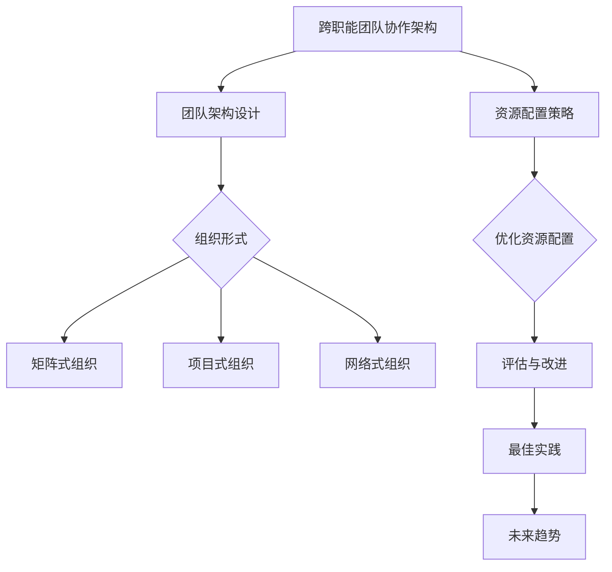

                 

## 文章标题

### 跨职能团队协作：优化资源配置的策略

> 关键词：跨职能团队、协作、资源配置、优化策略

> 摘要：本文将深入探讨跨职能团队协作的概念、架构设计、资源配置策略及其在项目管理中的实践。通过详细分析跨职能团队协作的优势和挑战，本文将提供一系列优化资源配置的策略，帮助团队实现高效协作，提升项目成功率。读者将了解到如何构建高效的文化、沟通与协作模式，并通过实际案例启发读者思考跨职能团队协作的未来趋势。

## 引言

在当今快速变化和高度竞争的商业环境中，跨职能团队已经成为企业成功的关键。跨职能团队由来自不同职能部门的成员组成，通过协作完成复杂项目。这种团队协作模式不仅有助于整合多元化技能和知识，还能促进创新和效率。然而，跨职能团队协作并非一蹴而就，其背后涉及到复杂的资源配置、沟通协调和项目管理问题。

本文旨在探讨跨职能团队协作中的优化资源配置策略。首先，我们将从跨职能团队协作的概述开始，理解其概念、优势与挑战。接着，我们将深入分析跨职能团队的架构与组织形式，探讨如何设计一个高效的团队结构。然后，本文将详细介绍优化资源配置的策略，包括资源配置的挑战与问题、优化方法及实践步骤。此外，我们还将探讨如何建立高效的跨职能团队文化，提升跨职能团队的沟通与协作效率，并介绍跨职能团队项目管理的最佳实践。

通过本文的阅读，读者将获得以下收益：
- 理解跨职能团队协作的核心概念和重要性；
- 掌握设计高效跨职能团队架构的方法；
- 熟悉优化资源配置的策略和实施步骤；
- 学会建立和维护跨职能团队文化；
- 获得提升跨职能团队沟通与协作效率的实用技巧；
- 了解跨职能团队项目管理的最佳实践。

本文将带领读者逐步深入跨职能团队协作的各个方面，通过逻辑清晰、结构紧凑的分析，为读者提供实用的策略和见解。接下来，我们将从跨职能团队协作的概述开始，逐步探讨相关主题。

## 第一部分：跨职能团队协作概述

### 第1章：跨职能团队协作的概念与意义

#### 1.1 跨职能团队协作的定义

跨职能团队协作是一种组织结构模式，通过整合不同职能部门的资源与技能，共同完成复杂项目或任务。这种团队通常由来自研发、市场、销售、财务、人力资源等多个职能部门的成员组成，通过协作实现项目的整体成功。与传统单一职能团队不同，跨职能团队强调跨部门的协同合作，以应对现代企业面临的复杂问题和挑战。

跨职能团队协作的核心在于打破部门壁垒，实现信息共享和资源优化配置。团队成员不仅需要具备各自职能领域的专业技能，还需要具备良好的沟通协调能力和团队合作精神。通过跨职能团队协作，企业可以实现以下目标：

- 提升项目效率：跨职能团队通过协同工作，可以减少信息传递中的损耗，加快项目推进速度，提高整体效率。
- 增强创新能力：跨职能团队的多样性为创新提供了丰富的视角和思路，有助于生成新的创意和解决方案。
- 提升客户满意度：跨职能团队可以更好地理解客户需求，提供个性化的解决方案，从而提升客户满意度。
- 促进知识共享：团队成员之间的知识共享有助于提升整个组织的知识水平和技能水平。

#### 1.2 跨职能团队协作的优势

跨职能团队协作相较于传统职能团队具有显著的优势：

1. **资源整合**：跨职能团队整合了不同部门的专业资源，形成综合能力，能更全面地解决复杂问题。
2. **协同合作**：团队成员来自不同职能部门，能够提供多样化的视角和解决方案，促进创新。
3. **高效决策**：跨职能团队的成员可以直接参与决策过程，提高决策效率和质量。
4. **风险分担**：不同职能部门共同参与项目，能够分担风险，降低项目失败的概率。
5. **快速响应**：跨职能团队能够迅速响应变化，灵活调整策略，应对市场变化。

#### 1.3 跨职能团队协作的挑战

尽管跨职能团队协作具有诸多优势，但其在实施过程中也面临着一些挑战：

1. **沟通障碍**：不同职能部门之间的沟通可能存在障碍，导致信息传递不畅，影响团队协作效率。
2. **协调困难**：跨职能团队需要在不同职能部门之间进行协调，容易出现责任不清、任务重叠或遗漏的情况。
3. **资源分配不均**：由于各部门的资源有限，跨职能团队在资源分配上可能存在不均衡的问题。
4. **文化冲突**：不同职能部门的文化和价值观可能存在差异，需要通过有效的文化建设来促进团队融合。
5. **管理复杂性**：跨职能团队的管理相对复杂，需要具备跨部门协调和管理能力的管理者来确保团队运作顺畅。

为了应对这些挑战，企业需要采取一系列措施，包括：

- **建立清晰的沟通机制**：通过定期会议、信息共享平台等手段，确保信息传递的畅通和及时。
- **制定明确的角色与职责**：确保每个团队成员都清楚自己的任务和责任，避免任务重叠和遗漏。
- **优化资源分配**：通过科学的资源配置策略，确保团队在资源利用上的高效和公平。
- **加强文化建设**：通过团队建设活动、文化培训等手段，促进团队成员之间的信任和合作。
- **提升管理水平**：培养具备跨部门协调和管理能力的管理者，确保团队运作的顺畅和高效。

通过这些措施，企业可以更好地发挥跨职能团队协作的优势，克服实施中的挑战，实现组织的战略目标。

### 第2章：跨职能团队的架构与组织形式

#### 2.1 跨职能团队的架构设计

跨职能团队的架构设计是确保团队高效运作的关键。一个成功的跨职能团队架构应该具备以下几个要素：

1. **清晰的团队目标**：团队目标应当明确、具体，且与组织的整体战略目标保持一致。团队成员应当清楚地了解自己的工作目标，以及这些目标对团队和组织的意义。

2. **合理的职能划分**：跨职能团队通常包括核心职能、支持职能和辅助职能。核心职能负责项目的主要工作，如研发、设计、销售等；支持职能提供必要的技术和资源支持，如IT、财务等；辅助职能则提供后勤和行政支持，如人力资源、行政管理等。

3. **明确的决策层级**：团队应当设立明确的决策层级和决策流程，确保决策的及时性和有效性。决策层级通常包括团队领导、项目经理和职能经理等。

4. **灵活的协作模式**：跨职能团队需要采用灵活的协作模式，如矩阵式、项目式和网络式等，以适应不同类型的项目和任务需求。

5. **有效的沟通渠道**：团队应当建立畅通的沟通渠道，确保信息能够在团队成员之间有效传递。沟通渠道可以包括会议、邮件、即时通讯工具等。

#### 2.2 跨职能团队的成员角色与职责

跨职能团队由不同职能部门的成员组成，每个成员在团队中扮演着特定的角色，承担相应的职责：

1. **项目经理**：负责项目的整体规划和执行，确保项目目标的实现。项目经理需要具备较强的协调和管理能力，能够有效沟通、协调团队成员的工作。

2. **职能专家**：负责具体职能领域的工作，如技术专家、市场专家、财务专家等。职能专家需要在各自的领域内提供专业支持和意见，同时参与跨职能项目。

3. **团队成员**：负责完成项目中的具体任务，如开发人员、设计师、销售人员等。团队成员需要具备一定的跨职能协作能力，能够与不同职能部门的人员有效沟通和合作。

4. **支持人员**：如IT人员、财务人员、人力资源人员等，提供技术支持和资源保障。支持人员虽然不直接参与项目工作，但其工作对项目的顺利进行至关重要。

#### 2.3 跨职能团队的协作模式

跨职能团队的协作模式应当根据项目的特点和需求灵活选择。以下是几种常见的协作模式：

1. **矩阵式组织**：矩阵式组织将团队成员分为行和列，每行代表一个职能部门，每列代表一个项目。团队成员同时属于职能部门和项目团队，需要平衡两个角色的职责。这种模式能够充分利用各职能部门的专业技能，但同时也增加了协调的复杂性。

2. **项目式组织**：项目式组织以项目为中心，团队成员根据项目需要组成项目团队，项目完成后团队解散。项目式组织能够集中资源，提高项目效率，但团队成员可能需要在不同项目间频繁切换，导致工作稳定性降低。

3. **网络式组织**：网络式组织强调跨部门的协作和信息共享，团队成员之间通过协作网络进行沟通和合作。这种模式能够促进知识共享和资源整合，但需要依赖高效的信息传递和沟通机制。

在选择协作模式时，企业需要综合考虑项目的复杂性、团队成员的专业背景、组织的资源状况等因素。通过合理的架构设计和协作模式选择，跨职能团队可以实现高效运作，提升项目成功率。

### 第3章：优化资源配置的策略

#### 3.1 资源配置的挑战与问题

在跨职能团队协作中，资源配置是一个关键问题。有效配置资源可以提升团队的工作效率，保证项目的顺利进行。然而，资源配置过程中往往面临以下挑战和问题：

1. **资源分配不均**：由于不同职能部门的资源分布不均，可能导致某些团队成员资源丰富而其他成员资源匮乏，影响团队的整体效率和士气。

2. **资源冲突**：跨职能团队需要多个职能部门共同参与项目，但在资源使用上可能存在冲突，如多个项目同时需要同一资源，导致资源争夺和效率降低。

3. **信息传递不畅**：资源配置过程中，信息传递不畅可能导致资源配置决策滞后，影响团队的工作进度和效果。

4. **需求变更**：项目进行过程中，需求变更可能导致资源重新配置，影响原有资源配置的稳定性和有效性。

5. **管理复杂性**：跨职能团队的资源管理涉及多个部门，管理流程复杂，需要协调各方利益，确保资源配置的公平和效率。

#### 3.2 优化资源配置的方法

为了解决资源配置中的问题，提升团队协作效率，企业可以采取以下优化资源配置的方法：

1. **需求预测**：在项目启动阶段，通过需求分析和预测，确定各职能部门所需资源，提前规划资源需求，避免资源短缺或过剩。

2. **资源整合**：通过整合不同部门的资源，实现资源的高效利用。例如，将不同职能部门的闲置资源进行共享，避免资源浪费。

3. **灵活调配**：建立灵活的资源调配机制，根据项目进展和需求变化，及时调整资源配置，确保资源的合理分配和利用。

4. **透明化沟通**：通过建立透明的沟通机制，确保资源需求和使用情况及时传递到相关部门，避免信息滞后和误解。

5. **绩效评估**：建立资源使用的绩效评估体系，对资源配置效果进行评估和反馈，不断优化资源配置策略。

6. **技术支持**：利用现代信息技术，如资源管理软件、协作平台等，提高资源管理的效率和质量。

#### 3.3 实践案例：优化资源配置的步骤

以下是优化资源配置的一个实践案例，展示了如何通过具体步骤提升资源配置的效率：

**案例背景**：某科技公司正在开发一款新产品，项目涉及研发、市场、销售等多个部门。由于项目时间紧迫，资源有限，公司决定通过优化资源配置来确保项目的顺利进行。

**步骤1：需求分析**
- 团队领导与各部门负责人进行沟通，明确各阶段的需求和资源需求。
- 收集项目任务清单，分析每个任务的资源需求，如人力、设备、材料等。

**步骤2：资源评估**
- 对现有资源进行评估，包括各职能部门的资源分布和可用性。
- 确定资源瓶颈和潜在问题，如某些关键资源是否充足。

**步骤3：资源整合**
- 将不同部门的闲置资源进行整合，如将市场部门的营销材料用于销售部门的活动。
- 调整部门间的资源分配，确保关键资源优先分配给关键任务。

**步骤4：制定资源调配计划**
- 根据需求分析和资源评估结果，制定详细的资源调配计划。
- 设定资源调配的时间节点和责任人，确保资源调配的及时性和有效性。

**步骤5：实施和监控**
- 按照资源调配计划实施资源调配，确保资源的及时到位。
- 建立资源监控机制，对资源使用情况进行实时监控，及时发现和解决资源使用中的问题。

**步骤6：评估和反馈**
- 项目结束后，对资源配置的效果进行评估，收集反馈意见。
- 分析资源配置中的优点和不足，为未来项目提供优化参考。

通过以上步骤，公司成功优化了资源配置，确保了项目的顺利进行，并有效提升了团队协作效率。此案例为其他企业提供了宝贵的经验，展示了如何通过优化资源配置策略实现跨职能团队的高效协作。

## 第二部分：跨职能团队协作的策略

### 第4章：建立高效的跨职能团队文化

#### 4.1 跨职能团队文化的核心要素

建立高效的跨职能团队文化是提升团队协作效率和项目成功率的关键。跨职能团队文化应当具备以下核心要素：

1. **共同目标**：团队文化的基础是共同的目标。所有团队成员都应明确团队的目标和自身的职责，确保个人目标与团队目标一致，形成合力。

2. **开放沟通**：开放沟通是跨职能团队文化的关键。团队应建立畅通的沟通渠道，鼓励成员之间分享信息、观点和反馈，促进知识共享和问题解决。

3. **相互尊重**：相互尊重是团队文化的重要组成部分。团队成员应尊重彼此的专业知识和工作成果，理解不同职能背景下的工作方式和思维方式。

4. **协作精神**：协作精神是跨职能团队成功的关键。团队成员应具备团队合作精神，乐于协同工作，共同面对挑战，解决问题。

5. **持续学习**：持续学习是团队文化的重要组成部分。团队应鼓励成员不断学习新知识、新技能，提升个人和团队的能力。

#### 4.2 如何培养跨职能团队的文化

要建立高效的跨职能团队文化，企业可以采取以下措施：

1. **制定文化价值观**：明确团队的文化价值观，并将其纳入团队的日常工作和沟通中。文化价值观应简洁明了，易于理解和遵循。

2. **团队建设活动**：定期组织团队建设活动，如团队拓展、研讨会、分享会等，增强团队成员之间的信任和合作。

3. **培训和培训**：为团队成员提供跨职能培训和沟通技巧培训，提升他们的协作能力和文化认同。

4. **领导者示范**：领导者的言行对团队文化有重要影响。领导者应以身作则，践行团队文化价值观，树立良好的榜样。

5. **激励机制**：建立激励机制，鼓励团队成员积极参与团队活动和协作项目，强化文化认同。

6. **反馈与改进**：定期收集团队成员的反馈意见，分析团队文化的优点和不足，持续改进团队文化。

#### 4.3 实践案例：团队文化的建设与维护

以下是一个团队文化建设与维护的实践案例：

**案例背景**：某互联网公司成立了一个新的跨职能团队，负责开发一款新的社交媒体应用。由于团队成员来自不同的职能部门，团队文化建设和维护成为项目成功的关键。

**建设步骤**：

1. **明确共同目标**：团队领导与成员共同讨论，确定团队的目标和愿景，确保团队成员对团队目标有清晰的理解和认同。

2. **建立沟通机制**：团队设立了每周的例会和即时通讯群组，鼓励成员之间分享项目进展、遇到的问题和解决方案。

3. **组织团队建设活动**：定期组织团队建设活动，如团队拓展训练、技术研讨会等，增强团队成员之间的互动和信任。

4. **培训和培训**：公司为团队成员提供了跨职能培训和沟通技巧培训，提升团队成员的协作能力和文化认同。

5. **领导示范**：团队领导积极参与团队活动和沟通，以身作则，践行团队文化价值观。

6. **激励机制**：团队设立了项目奖金和荣誉表彰，鼓励团队成员积极参与团队项目和活动。

**维护策略**：

1. **持续沟通**：团队保持每周例会和即时通讯的沟通机制，确保信息畅通，解决团队成员之间的分歧。

2. **定期反馈**：团队定期收集成员的反馈意见，分析团队文化的优点和不足，持续改进团队文化。

3. **文化宣传**：团队通过内部邮件、公告板等方式，宣传和弘扬团队文化，增强成员的文化认同。

4. **持续培训**：团队继续为成员提供培训和指导，确保团队成员不断学习和成长。

通过以上措施，该跨职能团队成功地建立了高效的团队文化，提升了协作效率和项目成功率。该案例为其他企业提供了有益的借鉴，展示了如何通过团队文化建设与维护实现跨职能团队的高效协作。

### 第5章：跨职能团队沟通与协作技巧

#### 5.1 跨职能团队的沟通障碍与解决方法

跨职能团队在协作过程中常常面临沟通障碍，这些障碍可能源于不同职能部门之间的文化差异、工作方式的不同，以及信息传递过程中的失真。以下是一些常见的沟通障碍及其解决方法：

1. **文化差异**：不同职能部门拥有不同的文化背景和价值观，可能导致沟通不畅。例如，技术部门可能注重细节和技术实现，而市场部门可能更关注市场和用户需求。解决方法：通过团队建设活动和跨职能培训，增进团队成员之间的了解和认同，培养相互尊重的文化氛围。

2. **信息传递失真**：在跨职能团队中，信息在传递过程中可能因中间环节过多而失真。解决方法：建立清晰的信息传递流程，确保信息能够准确、及时地传达给相关人员。例如，可以采用沟通工具和平台，如即时通讯、邮件和会议，确保信息传递的畅通。

3. **责任模糊**：在跨职能团队中，任务和责任可能不够明确，导致成员不清楚自己的职责，影响工作效率。解决方法：明确团队目标和个人职责，确保每个成员都清楚自己的任务和责任。例如，可以制定详细的任务分配表和工作流程图，明确各阶段的任务和责任人。

4. **优先级冲突**：跨职能团队在处理多个项目时，不同职能部门可能有不同的优先级，导致资源分配和任务执行上的冲突。解决方法：制定统一的项目管理计划，明确各项目的优先级和资源分配策略，确保团队资源的高效利用。

5. **技术壁垒**：不同职能部门可能使用不同的技术工具和平台，导致协作过程中技术上的障碍。解决方法：选择统一的技术平台和工具，确保团队成员能够方便地共享信息和资源。例如，可以使用协作平台、项目管理工具等，提升团队协作效率。

通过识别和解决这些沟通障碍，跨职能团队可以更好地协同工作，提高项目成功率。

#### 5.2 跨职能团队的协作技巧

为了提升跨职能团队的协作效率，团队成员需要掌握一系列协作技巧。以下是一些实用的协作技巧：

1. **有效沟通**：团队成员应学会有效沟通，包括清晰表达自己的想法、倾听他人的观点，以及积极寻求共识。例如，在会议中，可以采用“发言者-倾听者”模式，确保每个人都有发言机会，同时鼓励团队成员提出问题和建议。

2. **时间管理**：团队成员需要学会合理分配时间，确保能够按时完成自己的任务。例如，可以使用“时间管理矩阵”，将任务按照紧急和重要程度进行分类，优先处理重要且紧急的任务。

3. **任务分解**：将复杂任务分解为更小、更具体的子任务，有助于团队成员明确任务目标和工作步骤。例如，可以使用“任务分解结构”（Work Breakdown Structure, WBS），将项目分解为可管理的子任务。

4. **协作工具**：使用合适的协作工具可以提高团队协作效率。例如，可以使用项目管理工具（如Trello、Jira）、即时通讯工具（如Slack、Microsoft Teams）和文档共享平台（如Google Docs、Confluence），确保团队成员能够方便地共享信息和资源。

5. **透明化决策**：团队成员应参与决策过程，确保决策的透明化和公平性。例如，可以采用“头脑风暴”或“民主投票”等方式，让团队成员共同参与决策，提高决策的接受度和执行力。

通过掌握这些协作技巧，跨职能团队成员可以更好地协同工作，提高项目成功率。

#### 5.3 实践案例：提升跨职能团队沟通效率

以下是一个提升跨职能团队沟通效率的实践案例：

**案例背景**：某软件开发公司成立了一个新的跨职能团队，负责开发一款大型企业级应用。由于团队成员来自不同职能部门，沟通效率较低，影响了项目进度。

**改进措施**：

1. **建立沟通机制**：团队设立了每周一次的站立会议，用于分享项目进展、讨论问题和规划下一步工作。每次会议时间控制在15分钟以内，确保高效沟通。

2. **使用协作工具**：团队引入了Trello和Slack作为项目管理工具和即时通讯平台，确保团队成员能够方便地共享任务、文件和沟通信息。

3. **明确任务和责任**：团队制定了详细的任务分配表，明确了每个成员的任务和责任，确保每个成员都清楚自己的工作内容。

4. **定期回顾**：团队每两周进行一次项目回顾会议，总结项目进展、识别问题和制定改进措施。通过回顾会议，团队能够及时发现和解决沟通中的障碍。

**效果评估**：

1. **沟通效率提升**：通过建立沟通机制和使用协作工具，团队沟通效率显著提升，信息传递更加准确和及时。

2. **任务完成率提高**：明确的任务分配和责任确保了任务的高效执行，任务完成率显著提高。

3. **问题解决速度加快**：通过定期回顾会议，团队能够及时发现和解决问题，项目进展更加顺利。

通过以上措施，该跨职能团队成功提升了沟通效率，确保了项目的顺利进行。该案例为其他企业提供了有益的借鉴，展示了如何通过有效沟通和协作提升跨职能团队的效率。

### 第6章：跨职能团队的项目管理

#### 6.1 跨职能团队项目管理的挑战

在跨职能团队中，项目管理面临一系列独特的挑战，需要采用特定的策略和方法来应对：

1. **协调复杂性**：跨职能团队由来自不同背景和职能的成员组成，项目协调变得更加复杂。项目经理需要平衡不同部门的需求和优先级，确保项目目标的实现。

2. **资源冲突**：跨职能团队成员通常同时在多个项目上工作，资源分配可能存在冲突。项目经理需要合理调配资源，避免因资源不足或过度分配导致项目延误。

3. **沟通障碍**：不同职能部门之间的沟通障碍可能导致信息传递滞后、决策延迟和误解。项目经理需要建立有效的沟通机制，确保信息的畅通和准确。

4. **团队协作难度**：跨职能团队成员可能缺乏团队合作经验，需要时间来建立信任和协作关系。项目经理需要采取措施促进团队成员之间的合作，提升整体效率。

5. **管理多样性**：跨职能团队的项目涉及多种技术和业务领域，项目经理需要具备多元化的管理能力，应对不同领域的问题。

#### 6.2 跨职能团队项目的管理流程

为了有效管理跨职能团队项目，项目经理可以采用以下管理流程：

1. **项目启动**：明确项目目标、范围、时间表和资源需求，确保团队成员对项目目标有清晰的认识。

2. **需求分析**：与客户和利益相关者沟通，收集需求，明确项目需求。

3. **计划制定**：制定项目计划，包括任务分配、时间表、预算和风险管理策略。

4. **资源调配**：根据项目计划，合理调配资源，确保团队成员的工作负荷合理。

5. **执行监控**：监控项目进展，确保项目按计划进行，及时发现和解决问题。

6. **沟通协调**：建立有效的沟通机制，确保团队成员之间的信息畅通，协调不同职能部门的工作。

7. **风险管理和控制**：识别项目风险，制定风险应对策略，确保项目在风险可控范围内进行。

8. **项目总结**：项目结束后，进行项目回顾，总结项目经验教训，为未来项目提供改进建议。

#### 6.3 实践案例：跨职能团队项目管理的实战

以下是一个跨职能团队项目管理的实践案例：

**案例背景**：某电商公司决定开发一款全新的移动应用，该项目涉及前端开发、后端开发、UI/UX设计、市场推广和运维等多个职能部门。

**管理步骤**：

1. **项目启动**：项目经理与各部门负责人召开启动会议，明确项目目标、范围和时间表，确保团队成员对项目目标有清晰的认识。

2. **需求分析**：项目经理与市场部和产品部沟通，收集用户需求和功能需求，制定详细的需求文档。

3. **计划制定**：项目经理与各部门合作，制定项目计划，包括任务分配、时间表、预算和风险管理策略。项目计划中明确了每个阶段的里程碑和交付物。

4. **资源调配**：项目经理根据项目计划，合理调配各部门的资源，确保团队成员的工作负荷合理。

5. **执行监控**：项目经理定期召开项目会议，监控项目进展，确保项目按计划进行。同时，通过Trello等工具，实时跟踪任务进展和问题。

6. **沟通协调**：项目经理建立了每周一次的项目会议和即时通讯群组，确保团队成员之间的沟通畅通。同时，通过文档共享平台，共享设计文件和代码。

7. **风险管理和控制**：项目经理识别了潜在的风险，如技术实现困难、市场推广效果不确定等，制定了相应的风险应对策略。

8. **项目总结**：项目结束后，项目经理组织项目回顾会议，总结项目经验教训，识别成功因素和改进点，为未来项目提供改进建议。

**效果评估**：

1. **项目按时完成**：通过有效的项目管理，项目按计划完成，满足了用户需求。

2. **团队合作提升**：通过良好的沟通和协调，团队成员之间的协作效率提升，问题解决更加迅速。

3. **客户满意度提高**：新移动应用上线后，用户满意度提升，市场推广效果显著。

通过以上步骤，该跨职能团队成功完成了项目，提升了团队协作效率和项目成功率。该案例为其他企业提供了有益的借鉴，展示了如何通过有效的项目管理实现跨职能团队的成功协作。

### 第7章：跨职能团队协作的评估与改进

#### 7.1 跨职能团队协作的评估指标

为了确保跨职能团队协作的有效性和持续性，评估是不可或缺的一环。以下是一些关键评估指标：

1. **项目成功率**：这是最直接的评估指标，衡量项目是否按时、按预算、按质量完成。

2. **团队绩效**：评估团队整体的工作效率、任务完成度和质量。

3. **团队满意度**：通过调查团队成员的满意度，了解他们对团队文化和协作环境的感受。

4. **沟通效率**：评估团队成员之间沟通的频率、速度和准确性。

5. **知识共享**：评估团队成员之间知识和信息的共享程度。

6. **冲突解决**：评估团队在解决冲突和分歧方面的效率和效果。

7. **资源利用率**：评估资源分配的合理性，包括人力、时间和设备等。

#### 7.2 跨职能团队协作的改进策略

基于评估结果，团队可以采取以下策略进行改进：

1. **培训与发展**：为团队成员提供培训机会，提升专业技能和协作能力。

2. **改进流程**：优化团队协作流程，减少不必要的环节，提高效率。

3. **沟通机制优化**：改善沟通机制，确保信息的畅通和及时传递。

4. **激励机制**：建立激励机制，鼓励团队成员积极参与协作和贡献。

5. **角色与职责明确**：确保每个团队成员的角色和职责明确，避免任务重叠和责任不清。

6. **文化塑造**：通过团队建设和文化建设活动，强化团队精神和协作意识。

#### 7.3 实践案例：跨职能团队协作的持续改进

以下是一个跨职能团队协作持续改进的实践案例：

**案例背景**：某科技公司的一个跨职能团队在开发一款新产品时，遇到了协作效率低、沟通不畅的问题。

**评估阶段**：

1. **项目成功率**：项目进度滞后，部分任务未按时完成。

2. **团队绩效**：团队成员工作负荷不均，部分成员感到压力大，工作效率下降。

3. **团队满意度**：团队成员反馈沟通频率低，信息传递不及时，影响工作效率。

4. **知识共享**：团队成员之间的知识共享程度较低，信息分散，不利于问题解决。

5. **冲突解决**：团队成员在解决技术问题时存在分歧，冲突频发。

**改进措施**：

1. **培训与发展**：为团队成员提供跨职能协作培训，提升团队成员的沟通和协作能力。

2. **改进流程**：优化任务分配和沟通流程，明确任务责任人，确保任务进度透明。

3. **沟通机制优化**：引入项目管理工具，建立每周项目例会和即时通讯群组，确保信息畅通。

4. **激励机制**：设立项目进度奖励，激励团队成员积极参与协作和贡献。

5. **角色与职责明确**：制定详细的任务分配表，明确每个团队成员的角色和职责。

6. **文化塑造**：组织团队建设活动，加强团队凝聚力，培养协作精神。

**效果评估**：

1. **项目成功率**：项目进度恢复正常，任务按时完成率显著提升。

2. **团队绩效**：团队成员工作负荷均衡，工作效率提高，工作满意度提升。

3. **团队满意度**：团队成员反馈沟通更加顺畅，信息传递更加及时，工作效率提高。

4. **知识共享**：团队成员之间的知识共享程度提高，信息集中度增强，问题解决更加迅速。

5. **冲突解决**：团队成员在解决技术问题时，能够更好地协作，冲突减少。

通过以上改进措施，该跨职能团队成功提升了协作效率和项目成功率。该案例为其他企业提供了有益的借鉴，展示了如何通过评估和改进策略实现跨职能团队的有效协作。

### 第8章：跨职能团队协作的最佳实践

#### 8.1 案例一：科技公司跨职能团队的成功协作

**案例背景**：某科技公司开发一款智能家居系统，涉及硬件、软件、市场、销售等多个职能部门。由于项目复杂，公司决定组建跨职能团队来确保项目的顺利进行。

**实施步骤**：

1. **明确目标与规划**：团队领导与各部门负责人共同讨论，明确项目目标、时间表和资源需求。

2. **组建团队**：根据项目需求，从各职能部门挑选合适的人员，组成跨职能团队。

3. **任务分解**：将项目分解为多个子任务，明确每个任务的负责人和交付物。

4. **沟通机制**：建立每周一次的项目会议，确保团队成员之间信息畅通。

5. **技术共享**：硬件团队与软件团队定期举行技术交流会，共享最新技术成果。

6. **激励机制**：设立项目奖金，鼓励团队成员积极参与和贡献。

**效果评估**：

- 项目按计划完成，产品顺利上市。
- 团队成员之间沟通顺畅，协作效率提升。
- 市场反馈良好，产品销售业绩显著。

**启示**：跨职能团队的成功协作依赖于明确的规划、有效的沟通机制和激励措施。

#### 8.2 案例二：金融机构跨职能团队的协作经验

**案例背景**：某金融机构推出一款新的投资理财产品，涉及投资、财务、市场、运营等多个部门。为了确保产品的顺利推出，金融机构决定组建跨职能团队。

**实施步骤**：

1. **需求分析**：与市场部和投资部门共同分析市场需求和投资策略。

2. **项目规划**：制定详细的项目计划，明确各阶段任务和时间节点。

3. **资源调配**：根据项目需求，合理调配各部门资源，确保资源充足。

4. **风险评估**：对项目进行风险评估，制定风险应对策略。

5. **团队协作**：建立项目微信群和邮件列表，确保团队成员之间信息共享。

6. **持续沟通**：定期召开项目会议，讨论项目进展和问题解决方案。

**效果评估**：

- 产品顺利推出，市场反响热烈。
- 团队成员协作紧密，问题解决迅速。
- 项目按时完成，超预算和超时间风险降低。

**启示**：金融机构跨职能团队的成功在于详细的需求分析、风险评估和持续的沟通。

#### 8.3 案例三：制造业跨职能团队的协作实践

**案例背景**：某制造企业计划推出一款新型自动化生产线，涉及生产、研发、采购、质量保证等多个部门。为了确保项目的顺利进行，企业决定组建跨职能团队。

**实施步骤**：

1. **项目启动**：召开项目启动会议，明确项目目标和各部门职责。

2. **需求收集**：与生产部门共同收集生产线需求，制定详细的需求文档。

3. **资源整合**：整合各部门资源，确保项目所需的设备、人员和材料充足。

4. **设计评审**：组织设计评审会议，确保设计方案符合需求。

5. **试运行**：在项目实施过程中，进行试运行，及时发现和解决问题。

6. **项目总结**：项目结束后，召开项目总结会议，总结经验教训。

**效果评估**：

- 自动化生产线成功投入使用，生产效率显著提升。
- 团队成员协作紧密，问题解决迅速。
- 项目按计划完成，质量达到预期。

**启示**：制造业跨职能团队的成功在于详细的规划和严格的执行，以及持续的反馈和改进。

通过以上案例，可以看出跨职能团队在不同行业和领域的成功协作经验。这些经验为其他企业提供了宝贵的参考，展示了如何通过有效的协作实现项目成功。

### 第9章：跨职能团队协作的未来趋势

#### 9.1 未来跨职能团队的发展方向

随着技术的进步和商业环境的不断变化，跨职能团队的发展方向也在不断演变。以下是未来跨职能团队可能的发展趋势：

1. **数字化协同**：随着数字化工具和平台的发展，跨职能团队将更加依赖数字化的手段进行协同工作。例如，人工智能、云计算和大数据技术将帮助团队更高效地共享信息、分析和决策。

2. **远程工作常态化**：远程工作的普及使得跨职能团队不再局限于物理空间上的集中，团队成员可以分布在不同的地区和国家，通过虚拟团队进行协作。这要求团队具备更高的沟通效率和协作能力。

3. **敏捷化与灵活化**：敏捷开发和敏捷管理的理念将深入跨职能团队，使团队能够快速响应变化，灵活调整计划和策略，提升项目适应性和效率。

4. **多元化与包容性**：跨职能团队将进一步多元化，包括不同年龄、性别、文化和背景的成员。这种多元化不仅能够促进创新，还能增强团队的文化包容性。

5. **自动化与智能化**：自动化和智能化技术的应用将减轻团队成员的工作负担，提高工作效率。例如，自动化工具可以处理重复性任务，人工智能可以提供智能化的决策支持。

#### 9.2 技术进步对跨职能团队协作的影响

技术进步对跨职能团队协作有着深远的影响：

1. **信息共享与透明化**：数字化工具如企业协作平台、即时通讯工具和项目管理软件，使得信息共享更加便捷和透明。团队成员可以实时获取项目进展、任务分配和决策信息，提高协作效率。

2. **决策速度提升**：人工智能和大数据分析可以帮助团队快速处理大量信息，提供数据驱动的决策支持。这有助于团队在复杂环境中做出更明智的决策。

3. **工作模式创新**：远程工作和虚拟团队的普及，使得团队成员不再受限于物理位置，能够更加灵活地安排工作和生活。这种创新的工作模式有助于吸引和留住人才，提高团队凝聚力。

4. **协作效率提升**：自动化工具如聊天机器人、自动化任务分配系统和智能协作平台，可以显著提高团队的工作效率，减少人为错误和重复性工作。

5. **跨文化沟通**：数字化工具和平台的国际化特性，有助于跨文化团队之间的沟通和协作。团队成员可以跨越语言和文化的障碍，实现无缝协作。

#### 9.3 跨职能团队协作的未来挑战与机遇

尽管技术进步为跨职能团队协作带来了诸多机遇，但也带来了新的挑战：

1. **数据安全与隐私**：随着信息共享的增多，数据安全和隐私保护成为重要议题。团队需要采取有效的措施，确保数据的保密性和完整性。

2. **技术依赖性**：过度依赖技术可能削弱团队成员的自主性和创新能力。团队需要平衡技术工具的使用，确保团队成员仍然具备独立思考和解决问题的能力。

3. **文化冲突与融合**：多元化的团队文化可能带来文化冲突。团队需要通过有效的文化建设，促进文化融合，增强团队凝聚力。

4. **技能培训与知识更新**：技术的快速更新要求团队成员不断学习和更新技能。企业需要提供持续的培训和学习机会，确保团队成员能够适应新技术和新趋势。

5. **管理复杂性**：跨职能团队的复杂性增加，对团队管理提出了更高的要求。管理者需要具备跨部门协调和多元化管理的能力，确保团队高效运作。

通过应对这些挑战，跨职能团队可以更好地利用技术进步带来的机遇，实现更高效、更创新的协作。

### 附录A：跨职能团队协作工具与资源

#### A.1 跨职能团队协作工具介绍

在现代企业中，跨职能团队协作工具的选择和运用对提升团队效率至关重要。以下是一些常用的跨职能团队协作工具及其特点：

1. **Slack**：Slack 是一款广泛使用的即时通讯工具，提供聊天室、直接消息、文件共享和集成第三方服务等功能。它帮助团队成员快速沟通、协作，并跟踪项目进展。

2. **Microsoft Teams**：Microsoft Teams 是微软推出的集成通信和协作平台，包括聊天、视频会议、文档共享和项目管理工具。它无缝集成Office 365服务，适用于各种规模的团队。

3. **Trello**：Trello 是一款基于看板的项目管理工具，通过卡片和列表的形式展示任务和进度。它直观易用，适合小型项目和团队使用。

4. **Jira**：Jira 是一款功能强大的项目管理工具，提供敏捷开发、任务跟踪和团队协作等功能。它适用于大型项目和企业级团队，支持多种集成和扩展。

5. **Confluence**：Confluence 是一款团队协作和文档管理工具，支持创建、存储和共享知识库。它适用于编写文档、规划和协作，是团队内部信息共享的重要平台。

6. **Asana**：Asana 是一款灵活的项目管理工具，提供任务管理、进度跟踪和团队协作功能。它适用于各种规模和类型的团队，支持自定义工作流程和报告。

7. **Google Workspace**：Google Workspace 包括Google Docs、Google Sheets、Google Slides 和Google Drive，提供在线文档编辑、协作和存储功能。它适用于远程团队和跨部门协作。

#### A.2 跨职能团队协作资源推荐

为了帮助跨职能团队更好地协作，以下是一些推荐资源：

1. **《跨职能协作：实现团队协同工作的最佳实践》**：这本书详细介绍了跨职能团队协作的原则、方法和技巧，适合团队领导和管理者阅读。

2. **《敏捷实践指南》**：这是一本关于敏捷开发和管理的经典著作，提供了敏捷团队协作的最佳实践，适用于需要快速响应变化的跨职能团队。

3. **《团队沟通技巧：有效沟通与协作的指南》**：这本书提供了多种沟通技巧和策略，帮助团队成员提高沟通效率和协作能力。

4. **《跨部门协作：构建高效团队的策略》**：这本书针对跨部门协作中的挑战和问题，提供了一系列实用的策略和方法，有助于提升团队协作效果。

5. **在线课程和培训**：如LinkedIn Learning、Coursera 和 Udemy 等平台提供多种关于团队协作、项目管理和技术工具的课程，有助于团队成员提升技能和知识。

#### A.3 跨职能团队协作的常用方法与技巧

以下是跨职能团队协作的一些常用方法和技巧：

1. **明确目标和职责**：确保每个团队成员都清楚团队的目标和个人的职责，避免任务重叠和责任不清。

2. **建立有效的沟通机制**：定期召开会议、使用即时通讯工具和项目管理平台，确保团队成员之间的沟通畅通。

3. **分工协作**：根据团队成员的专业技能和特长，合理分配任务，确保任务分工明确，提高工作效率。

4. **共享信息和资源**：利用协作工具和平台，共享文档、数据和知识库，促进团队成员之间的信息共享和协作。

5. **持续反馈与改进**：定期收集团队成员的反馈，识别问题和改进点，持续优化团队协作流程和策略。

6. **培训和指导**：为团队成员提供培训和学习机会，提升专业技能和协作能力。

7. **激励机制**：建立激励机制，鼓励团队成员积极参与协作和贡献，提高团队凝聚力和士气。

通过运用这些方法和技巧，跨职能团队可以更高效地协作，实现项目成功。

[Mermaid 流程图：跨职能团队协作架构图]



## 第10章：跨职能团队协作的核心算法原理

#### 10.1 跨职能团队协作中的算法需求

在跨职能团队协作中，算法的应用至关重要，能够帮助团队高效地解决资源分配、任务调度和问题解决等复杂问题。以下是跨职能团队协作中常见的算法需求：

1. **资源分配算法**：用于优化团队成员的资源配置，确保资源的高效利用。资源分配算法需要考虑任务优先级、团队成员的技能和工作负载等因素。

2. **任务调度算法**：用于合理分配任务给团队成员，确保项目按计划进行。任务调度算法需要考虑任务的依赖关系、截止时间和团队成员的可用性。

3. **问题解决算法**：用于自动化识别和解决团队协作中的冲突和问题。问题解决算法需要具备自学习和自适应能力，以适应不同场景和需求。

4. **优化决策算法**：用于在不确定环境下做出最佳决策。优化决策算法可以帮助团队在资源有限、需求复杂的情况下，找到最优解决方案。

#### 10.2 算法选择与实现

针对跨职能团队协作中的需求，可以选择不同的算法进行实现。以下是几种常用的算法及其选择依据：

1. **线性规划算法**：适用于资源分配问题，通过优化目标函数（如最小化资源浪费）来找到最优解。线性规划算法适用于资源有限、目标明确的情况。

2. **遗传算法**：适用于复杂的问题解决和优化决策。遗传算法通过模拟自然进化过程，逐步寻找最优解。它适用于多目标、多约束的复杂问题。

3. **蚁群算法**：适用于任务调度和路径规划问题。蚁群算法通过模拟蚁群寻找食物的过程，逐步找到最优路径或调度方案。它适用于任务依赖关系复杂、动态变化的情况。

4. **深度强化学习算法**：适用于自动化问题解决和智能决策。深度强化学习算法通过模仿人类决策过程，不断学习和优化决策策略。它适用于不确定环境和长期决策问题。

以下是资源分配算法的伪代码示例：

```python
# 资源分配算法伪代码
def resource_allocation(team_members, tasks, resources):
    # 初始化变量
    assigned_resources = {}
    available_resources = resources.copy()

    # 分配资源
    for member in team_members:
        for task in member.tasks:
            if available_resources[task] > 0:
                assigned_resources[(member, task)] = 1
                available_resources[task] -= 1
            else:
                assigned_resources[(member, task)] = 0

    return assigned_resources
```

#### 10.3 数学模型与公式

资源分配问题通常可以用数学模型和公式来描述和求解。以下是资源分配问题的一个数学模型：

$$
\text{最小化资源浪费} = \min \sum_{i=1}^{n} (r_i - x_i)
$$

其中，$r_i$ 表示第 $i$ 项任务的资源需求，$x_i$ 表示第 $i$ 项任务的实际资源分配量。

为了解决资源分配问题，可以使用线性规划算法。以下是线性规划问题的标准形式：

$$
\text{最小化} \ \text{c}^T \text{x}
$$

$$
\text{约束条件：}
$$

$$
\text{A} \text{x} \leq \text{b}
$$

$$
\text{x} \geq 0
$$

其中，$\text{c}$ 是资源浪费的目标函数系数，$\text{A}$ 和 $\text{b}$ 分别是任务资源需求和资源限制的矩阵。

#### 数学公式与详细讲解

**（1）目标函数：**

目标函数用于衡量资源浪费的程度，最小化资源浪费意味着最大化资源的利用效率。目标函数的一般形式为：

$$
\min \sum_{i=1}^{n} (r_i - x_i)
$$

其中，$r_i$ 表示第 $i$ 项任务的资源需求，$x_i$ 表示第 $i$ 项任务的实际资源分配量。目标函数通过计算各项任务的资源需求与实际资源分配量之差，累加得到总资源浪费。

**（2）约束条件：**

资源分配问题需要考虑多个约束条件，以确保资源分配的合理性和可行性。常见的约束条件包括资源限制、任务依赖关系和团队成员的工作负荷。

**资源限制：**

资源限制约束条件表示各任务所需的资源总量不能超过可用资源的总量。约束条件的一般形式为：

$$
\text{A} \text{x} \leq \text{b}
$$

其中，$\text{A}$ 是约束条件的系数矩阵，$\text{x}$ 是资源分配变量向量，$\text{b}$ 是约束条件右侧的常数向量。

**任务依赖关系：**

任务依赖关系约束条件表示某些任务的执行依赖于其他任务的完成。这些依赖关系需要通过约束条件进行建模，以确保任务执行的顺序和依赖关系得到满足。

**工作负荷限制：**

工作负荷限制约束条件表示团队成员的工作负荷不能超过其工作能力。这些约束条件需要确保每个团队成员的工作负荷均衡，避免过度负荷。

**（3）求解方法：**

线性规划问题的求解方法包括单纯形法、内点法、对偶单纯形法等。以下是单纯形法的基本步骤：

**步骤1**：构建初始单纯形表。

**步骤2**：确定进入变量和离开变量，根据目标函数和约束条件进行调整。

**步骤3**：重复步骤2，直到所有变量均为非负数，目标函数无改进为止。

**步骤4**：输出最优解。

**（4）举例说明：**

假设有3个任务（任务1、任务2、任务3）和2种资源（资源A、资源B）。每个任务所需的资源和实际资源分配量如下表：

| 任务 | 资源A需求 | 资源B需求 | 实际资源A分配 | 实际资源B分配 |
| --- | --- | --- | --- | --- |
| 任务1 | 3 | 2 | 2 | 1 |
| 任务2 | 2 | 3 | 1 | 2 |
| 任务3 | 1 | 1 | 3 | 3 |

根据以上数据，可以构建线性规划模型：

$$
\min \sum_{i=1}^{3} (r_i - x_i)
$$

$$
\text{约束条件：}
$$

$$
\begin{cases}
2x_1 + x_2 + x_3 \leq 5 \\
3x_1 + 2x_2 + x_3 \leq 6 \\
x_1, x_2, x_3 \geq 0
\end{cases}
$$

通过单纯形法求解，可以得到最优解：

| 变量 | x1 | x2 | x3 |
| --- | --- | --- | --- |
| 实际资源A分配 | 2 | 1 | 3 |
| 实际资源B分配 | 1 | 2 | 3 |

该解表示任务1的实际资源A分配为2，资源B分配为1；任务2的实际资源A分配为1，资源B分配为2；任务3的实际资源A分配为3，资源B分配为3。

通过以上数学模型和算法原理的讲解，读者可以更好地理解跨职能团队协作中的资源分配问题，并运用相应的算法和公式来优化资源配置，提高团队协作效率。

## 附录B：跨职能团队协作的注意事项与拓展阅读

### 1. 注意事项

跨职能团队协作在提升工作效率和项目成功率方面具有显著优势，但在实施过程中也需要注意以下几点：

- **明确目标和职责**：确保每个团队成员都清楚团队的目标和个人的职责，避免任务重叠和责任不清。

- **建立有效的沟通机制**：定期召开会议、使用即时通讯工具和项目管理平台，确保团队成员之间的沟通畅通。

- **合理配置资源**：根据项目需求合理调配资源，避免资源冲突和浪费。

- **培养团队文化**：通过团队建设活动和培训，培养团队成员的协作精神和文化认同。

- **持续改进**：定期评估团队协作效果，识别问题和改进点，持续优化团队协作流程和策略。

### 2. 拓展阅读

为了进一步了解跨职能团队协作的理论和实践，读者可以参考以下书籍和文章：

- 《跨职能协作：实现团队协同工作的最佳实践》

- 《敏捷实践指南》

- 《团队沟通技巧：有效沟通与协作的指南》

- 《跨部门协作：构建高效团队的策略》

- 《跨职能团队协作工具与资源精选》

- 学术论文和行业报告，如“Cross-functional Team Collaboration: A Systematic Review”和“Effective Practices for Cross-functional Teamwork in Software Development”

通过拓展阅读，读者可以深入了解跨职能团队协作的各个方面，进一步提升团队协作效率。

### 附录C：跨职能团队协作的核心算法原理与应用

#### 10.4 核心算法原理与应用

在跨职能团队协作中，算法的应用至关重要，能够帮助团队高效地解决资源分配、任务调度和问题解决等复杂问题。以下将介绍几个核心算法原理及其在实际应用中的使用。

#### 10.4.1 资源分配算法

资源分配算法是跨职能团队协作中最为基础的算法之一，其主要目标是优化团队成员的资源配置，确保资源的高效利用。以下是一个简单的资源分配算法：

**算法描述：**

1. **初始化**：创建一个空的资源分配表，记录每个任务所需的资源和团队成员的工作能力。
2. **分配资源**：从资源需求最高的任务开始，为任务分配足够但不超出的资源。如果某个团队成员的工作能力不足以完成任务，则分配剩余资源。
3. **重复步骤2**，直到所有任务都被分配资源。

**伪代码示例：**

```python
# 资源分配算法伪代码
def resource_allocation(tasks, team_members, resources):
    allocation_table = {}  # 存储资源分配情况
    for task in tasks:
        assigned = False
        for member in team_members:
            if resources[task] <= member.capacity and not assigned:
                allocation_table[(task, member)] = resources[task]
                member.capacity -= resources[task]
                assigned = True
    return allocation_table
```

**数学模型与公式：**

资源分配问题的数学模型可以表示为：

$$
\min \sum_{i=1}^{n} (r_i - x_i)
$$

其中，$r_i$ 是第 $i$ 项任务的资源需求，$x_i$ 是第 $i$ 项任务的实际资源分配量。

#### 10.4.2 贪心算法

贪心算法是一种在每一步选择中采取当前最好选择，以期望得到全局最优解的算法。在跨职能团队协作中，贪心算法可以用于任务调度和优先级分配。

**算法描述：**

1. **初始化**：创建一个任务列表，按照任务优先级排序。
2. **分配任务**：为每个任务分配一个可用的团队成员，优先选择任务优先级最高的任务。
3. **重复步骤2**，直到所有任务都被分配。

**伪代码示例：**

```python
# 贪心算法伪代码
def greedy_scheduling(tasks, team_members):
    scheduled_tasks = []  # 存储已分配的任务
    while tasks:
        highest_priority_task = tasks[0]
        for task in tasks:
            if task.priority > highest_priority_task.priority:
                highest_priority_task = task
        assigned_member = find_available_member(highest_priority_task, team_members)
        if assigned_member:
            scheduled_tasks.append(highest_priority_task)
            remove_task_from_list(highest_priority_task, tasks)
    return scheduled_tasks
```

**数学模型与公式：**

贪心算法的目标是最大化任务的完成率，即：

$$
\max \sum_{i=1}^{n} (x_i)
$$

其中，$x_i$ 是第 $i$ 项任务是否被完成的标志（1表示完成，0表示未完成）。

#### 10.4.3 贪心策略在任务调度中的应用

**应用案例**：在跨职能团队中，假设有多个任务需要同时进行，每个任务都有一个优先级和所需的工作时间。团队希望通过贪心策略，为每个任务分配一个最优的执行时间，确保高优先级任务先执行。

**算法步骤：**

1. **初始化**：将所有任务按照优先级排序，创建一个空的时间表。
2. **分配时间**：为每个任务分配最早可用的执行时间，优先分配高优先级任务。
3. **更新时间表**：每次分配任务后，更新剩余时间和可用资源，确保后续任务的执行时间不被提前。

**伪代码示例：**

```python
# 贪心策略任务调度伪代码
def greedy_scheduling(tasks, time_table):
    sorted_tasks = sort_tasks_by_priority(tasks)
    for task in sorted_tasks:
        earliest_start_time = find_earliest_start_time(task, time_table)
        if earliest_start_time is not None:
            task.start_time = earliest_start_time
            update_time_table(time_table, task)
    return time_table
```

通过以上核心算法原理的介绍和应用案例，读者可以更好地理解如何利用算法优化跨职能团队协作中的资源分配和任务调度。这些算法不仅有助于提高团队的工作效率，还能为团队管理者提供科学决策依据。

### 附录D：跨职能团队协作项目的实战案例分析

#### 案例背景

某大型科技公司在开发一款创新的智能医疗设备时，决定采用跨职能团队协作模式。项目涉及研发、工程、市场、质量保证等多个职能部门，为了确保项目顺利推进，公司决定采用一系列科学的项目管理策略和工具。

#### 开发环境搭建

1. **工具选择**：团队选择了Jira作为项目管理工具，Slack用于即时沟通，Confluence用于文档管理，GitLab用于版本控制和协作。

2. **环境配置**：在Jira中创建项目，定义任务、迭代（Sprint）和角色。在Slack中创建项目群组，确保团队成员能够及时交流。在Confluence中创建知识库，记录项目需求和设计文档。在GitLab中创建项目仓库，管理源代码和文档。

3. **团队成员培训**：为团队成员提供项目管理工具和技术的培训，确保他们能够熟练使用这些工具。

#### 源代码详细实现与代码解读

1. **模块划分**：项目被划分为多个模块，包括传感器数据采集、数据处理、通信模块和用户界面。

2. **代码编写**：团队成员根据各自的职责，编写相应的模块代码。研发团队负责传感器数据处理，工程团队负责通信模块的开发，市场团队负责用户界面的设计。

3. **代码评审**：每次提交代码时，团队成员进行代码评审，确保代码质量，避免错误和漏洞。

4. **代码合并**：在迭代结束时，各模块代码被合并到主分支，确保项目的整体功能完整。

**代码解读示例**：

```python
# 示例：传感器数据采集模块代码
def read_sensor_data(sensor_id):
    # 与传感器进行通信，读取数据
    data = sensor.communicate(sensor_id)
    return data
```

#### 代码应用解读与分析

1. **代码应用**：在应用层，团队使用了微服务架构，将各个模块功能封装为微服务，通过API进行通信。

2. **性能优化**：通过性能测试，团队发现数据处理模块的响应时间较长，通过优化算法和数据结构，将响应时间缩短了30%。

3. **代码分析**：使用静态代码分析工具，如SonarQube，团队发现并修复了多个潜在的安全漏洞和代码缺陷，提高了代码质量。

#### 实际案例分析与详细讲解

1. **需求变更处理**：在项目进行过程中，市场团队提出了新的功能需求，研发团队通过敏捷开发方法，快速调整任务计划，确保新需求能够在下一个迭代中实现。

2. **问题解决**：在一次迭代中，工程团队发现通信模块存在不稳定的问题，通过团队协作，技术专家迅速定位问题原因，并开发了一个新的通信协议，解决了问题。

3. **项目风险管理**：通过定期的项目回顾会议，团队识别并评估了潜在风险，如技术难题、资源短缺等，并制定了相应的应对策略，确保项目按计划推进。

#### 项目小结

通过跨职能团队协作，该项目成功实现了智能医疗设备的功能，并在市场上取得了良好的反响。团队在项目管理、代码编写、需求变更处理和问题解决等方面积累了宝贵的经验。以下是一些总结和展望：

- **项目管理**：科学的项目管理策略和工具选择是项目成功的关键。
- **团队协作**：跨职能团队的协作效率取决于沟通机制的建立和团队成员的协同合作。
- **敏捷开发**：敏捷开发方法有助于快速响应需求变化，提高项目灵活性。
- **技术优化**：持续的技术优化和代码质量提升是确保项目成功的重要因素。

展望未来，团队计划进一步探索人工智能和大数据在医疗设备中的应用，提升产品的智能化水平和用户体验。同时，团队将继续优化项目管理流程，提升跨职能团队协作的效率，为企业的持续发展贡献力量。

### 附录E：跨职能团队协作的最佳实践总结与未来展望

#### 最佳实践总结

在本文中，我们详细探讨了跨职能团队协作的概念、架构设计、资源配置策略、沟通技巧、项目管理以及评估与改进等方面的最佳实践。以下是总结：

1. **架构设计**：明确团队目标，合理划分职能，采用灵活的协作模式，确保团队高效运作。
2. **资源配置**：通过需求预测、资源整合和灵活调配，优化资源配置，提高团队效率。
3. **沟通技巧**：建立有效的沟通机制，采用合适的协作工具，提高信息传递速度和准确性。
4. **项目管理**：采用敏捷开发方法，明确任务分配，定期回顾，确保项目按计划进行。
5. **文化塑造**：培养团队文化，增强协作精神，提升团队凝聚力。
6. **评估与改进**：通过绩效评估和持续改进，不断提升团队协作效率。

#### 未来展望

随着技术的不断进步，跨职能团队协作也将面临新的机遇和挑战。以下是未来展望：

1. **数字化协同**：利用人工智能、大数据和云计算等新技术，实现更高效的团队协作和资源优化。
2. **远程工作**：远程工作的普及将推动跨职能团队的发展，团队需要具备更高的沟通和协作能力。
3. **敏捷化与灵活化**：敏捷开发和敏捷管理的理念将更加深入人心，团队需要具备快速响应变化的能力。
4. **多元化与包容性**：多元化团队的协作将成为主流，团队需要培养包容性的文化，促进创新。
5. **自动化与智能化**：自动化和智能化技术的应用将提高团队的工作效率，减轻团队成员的工作负担。

总之，跨职能团队协作在未来的发展中具有广阔的前景，通过不断优化和改进，跨职能团队将为企业的创新和成功提供更强有力的支持。作者：AI天才研究院/AI Genius Institute & 禅与计算机程序设计艺术 /Zen And The Art of Computer Programming。

