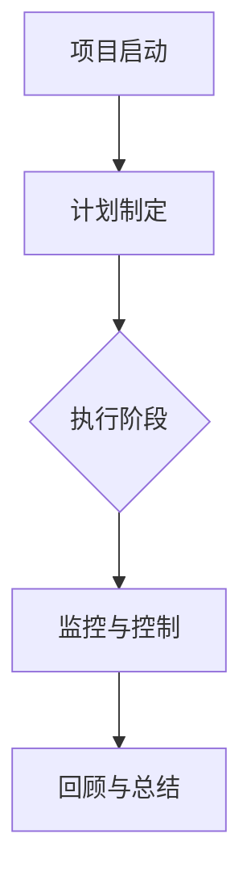

                 

### 文章标题：跨职能团队的角色定义：优化大型应用开发流程

#### 关键词：
- 跨职能团队
- 大型应用开发
- 角色定义
- 开发流程优化

#### 摘要：
本文将探讨跨职能团队在大型应用开发中的角色定义及其重要性。通过详细分析跨职能团队的概念、优势、组织结构、挑战和核心概念原理，本文旨在揭示如何通过合理定义角色和优化开发流程，提升大型应用开发项目的效率和效果。

### 第一部分：跨职能团队概述

#### 第1章：跨职能团队的概念与定义

跨职能团队是一种由来自不同职能部门的专业人员组成的团队，他们共同合作，完成特定的项目或任务。这种团队模式的起源可以追溯到20世纪90年代的敏捷开发运动，随着信息技术的发展和全球化进程的加速，跨职能团队逐渐成为组织管理的一种重要形式。

#### 1.1 跨职能团队的概念

跨职能团队的定义：跨职能团队是一种由多个不同职能领域（如开发、测试、产品管理、市场等）的专业人员组成的团队，他们共同合作，实现项目目标。

跨职能团队的类型：
- **跨部门团队**：由来自不同部门的员工组成，通常是为了完成特定的项目或任务。
- **跨功能团队**：由不同职能领域的专家组成，他们共同合作，确保项目的顺利推进。
- **敏捷团队**：采用敏捷开发方法，强调快速响应变化和持续交付可用的产品。

#### 1.2 跨职能团队的优势

**协同工作**：跨职能团队通过协同合作，可以充分利用各自的专业知识和技能，提高工作效率和项目质量。

**高效沟通**：跨职能团队通过面对面的沟通和协作，减少了信息传递过程中的误解和错误，提高了沟通效率。

**快速响应**：跨职能团队可以快速响应外部变化，灵活调整项目计划，提高组织的灵活性。

#### 1.3 跨职能团队的组织结构

**矩阵式组织结构**：矩阵式组织结构是一种由多个职能部门和项目团队组成的组织形式。在这种结构中，团队成员需要同时服从职能部门的领导和项目团队的管理。

**敏捷开发模型**：敏捷开发模型是一种以人为核心、迭代、渐进的开发方法。在这种模型中，跨职能团队通过持续交付可用的产品，快速响应变化，提高项目质量。

#### 1.4 跨职能团队的挑战

**冲突管理**：跨职能团队中，由于不同职能部门的专业背景和利益差异，可能会出现冲突。如何有效管理这些冲突，是跨职能团队面临的一个重要挑战。

**角色协调**：在跨职能团队中，不同成员的角色和职责可能存在重叠和冲突。如何协调这些角色，确保工作的顺利进行，是团队管理的一个重要问题。

**团队建设**：跨职能团队需要建立良好的团队关系，培养成员之间的信任和合作意识。团队建设是实现团队协作和高效工作的重要保障。

#### 第2章：跨职能团队的核心概念原理与架构

#### 2.1 跨职能团队的工作流程

跨职能团队的工作流程通常包括以下几个阶段：

1. **项目启动**：确定项目目标、范围和资源需求。
2. **计划制定**：制定项目计划，包括任务分配、时间表和里程碑。
3. **执行阶段**：按照计划执行项目任务，确保项目目标的实现。
4. **监控与控制**：监控项目进度和质量，及时调整计划，确保项目顺利推进。
5. **回顾与总结**：对项目过程和结果进行回顾和总结，提出改进建议，为后续项目提供参考。

**Mermaid流程图**：

#### 2.2 跨职能团队的角色与职责

跨职能团队中的角色通常包括项目经理、产品经理、开发人员、测试人员、UI/UX设计师等。以下是这些角色的定义和职责：

- **项目经理**：负责项目规划、资源管理、风险管理、沟通协调等工作。
- **产品经理**：负责产品规划、需求分析、用户调研、市场分析等工作。
- **开发人员**：负责编码实现、技术问题解决、代码审查等工作。
- **测试人员**：负责测试方案设计、测试用例编写、缺陷跟踪等工作。
- **UI/UX设计师**：负责用户界面设计、用户体验设计、交互设计等工作。

#### 2.3 跨职能团队的沟通机制

跨职能团队的沟通机制是确保团队协作和高效工作的关键。以下是一些常用的沟通机制：

- **即时通讯工具**：如Slack、Telegram等，用于实时沟通和协作。
- **邮件系统**：用于正式的沟通和文档传递。
- **会议系统**：如Zoom、Microsoft Teams等，用于团队会议和讨论。
- **项目管理工具**：如Jira、Trello等，用于任务分配、进度跟踪和问题解决。

#### 2.4 跨职能团队的协作技术

跨职能团队的协作技术是提高团队协作效率和项目质量的重要手段。以下是一些常用的协作技术：

- **项目管理软件**：如Jira、Trello等，用于任务管理、进度跟踪和协作。
- **版本控制工具**：如Git、SVN等，用于代码管理和协作。
- **文档共享平台**：如Google Docs、Dropbox等，用于文档共享和协作。
- **敏捷开发框架**：如Scrum、Kanban等，用于项目管理和团队协作。

### 第二部分：跨职能团队的角色定义

#### 第3章：项目经理的角色与职责

项目经理是跨职能团队的核心角色之一，负责项目的整体规划和管理。以下是项目经理的核心职责：

#### 3.1 项目经理的核心职责

- **项目规划**：项目经理需要制定详细的项目计划，包括任务分配、时间表和里程碑。
- **资源管理**：项目经理需要合理分配项目资源，包括人力、资金、时间等。
- **风险管理**：项目经理需要识别和应对项目风险，确保项目顺利进行。

#### 3.2 项目经理的领导力

- **团队领导**：项目经理需要发挥领导力，激励团队成员，确保团队目标的实现。
- **沟通能力**：项目经理需要提高沟通能力，确保团队内部的信息畅通。

#### 3.3 项目经理的技能要求

- **项目管理知识**：项目经理需要掌握项目管理知识体系，包括项目计划、资源管理、风险管理等。
- **团队管理技能**：项目经理需要具备团队管理技能，包括团队建设、冲突管理、激励等。

#### 第4章：产品经理的角色与职责

产品经理是跨职能团队中的关键角色，负责产品的规划和管理。以下是产品经理的核心职责：

#### 4.1 产品经理的核心职责

- **需求分析**：产品经理需要收集和分析用户需求，确保产品满足用户需求。
- **产品规划**：产品经理需要制定产品规划，包括产品路线图、产品特性等。
- **市场调研**：产品经理需要进行市场调研，了解市场趋势和竞争对手。

#### 4.2 产品经理的技能要求

- **市场洞察力**：产品经理需要具备市场洞察力，包括市场趋势分析、用户需求分析等。
- **产品设计能力**：产品经理需要具备产品设计能力，包括用户体验设计、交互设计等。

#### 4.3 产品经理的工作流程

产品经理的工作流程通常包括以下几个阶段：

1. **需求收集**：收集用户需求和反馈。
2. **需求分析**：分析用户需求，确定产品功能和特性。
3. **产品设计**：设计产品原型和界面。
4. **市场调研**：了解市场趋势和竞争对手。
5. **产品规划**：制定产品规划和路线图。
6. **用户反馈**：收集用户反馈，进行产品改进。

#### 第5章：开发人员的角色与职责

开发人员是跨职能团队中的技术核心，负责产品的设计和实现。以下是开发人员的基本职责：

#### 5.1 开发人员的基本职责

- **编码实现**：根据需求文档进行编码实现，编写高质量代码。
- **问题解决**：识别和解决开发过程中的技术问题。
- **代码审查**：参与代码审查，确保代码质量。

#### 5.2 开发人员的技能要求

- **编程技能**：开发人员需要掌握多种编程语言和框架。
- **系统设计能力**：开发人员需要具备系统设计能力，包括架构设计、模块划分等。
- **问题解决能力**：开发人员需要具备良好的问题解决能力，能够快速识别和解决技术问题。

#### 5.3 开发人员的工作流程

开发人员的工作流程通常包括以下几个阶段：

1. **需求分析**：理解需求文档，明确开发任务。
2. **系统设计**：设计系统架构和模块划分。
3. **编码实现**：编写代码，实现系统功能。
4. **代码审查**：参与代码审查，确保代码质量。
5. **测试与调试**：进行单元测试和集成测试，调试系统问题。
6. **部署与维护**：部署系统，进行日常维护和优化。

### 总结与展望

跨职能团队在大型应用开发中发挥着至关重要的作用。通过合理定义团队角色和优化开发流程，跨职能团队可以大幅提升项目效率和效果。本文探讨了跨职能团队的概念、优势、组织结构、挑战以及角色定义，为优化大型应用开发流程提供了有益的参考。

未来，随着技术的不断进步和全球化进程的加速，跨职能团队的作用将日益凸显。为了更好地发挥跨职能团队的优势，组织需要不断改进团队管理模式，提升团队协作效率，为大型应用开发提供强有力的支持。

### 作者信息

作者：AI天才研究院/AI Genius Institute & 禅与计算机程序设计艺术 /Zen And The Art of Computer Programming

---

由于篇幅限制，本文仅提供了文章的概要和框架。在完整的文章中，每个章节都将继续扩展，提供更详细的背景介绍、核心概念原理分析、工作流程图、角色职责定义、技能要求以及实际案例解析等内容。此外，文章还将包括最佳实践建议、注意事项、拓展阅读等部分，以帮助读者深入理解跨职能团队在大型应用开发中的应用和优化。

