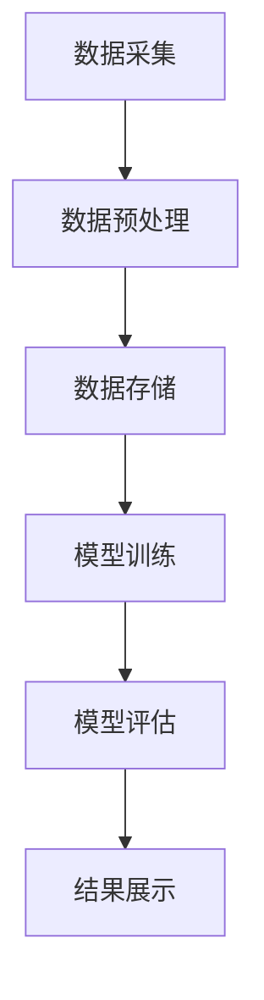

                 

# 跨语言LLM评测：构建多语言支持的评估系统

## 关键词

- 跨语言LLM
- 评估系统
- 多语言支持
- 评测指标
- 算法
- 项目实战

> 摘要：随着人工智能技术的快速发展，跨语言自然语言处理（LLM）模型在多个领域取得了显著的应用成果。然而，如何有效地评估这些模型的质量和性能，成为了研究和开发过程中的关键问题。本文将探讨跨语言LLM评测的重要性和挑战，详细分析评估系统的构建方法，包括核心概念、架构设计、算法模型、项目实战等多个方面。通过实例分析和总结，旨在为研究人员和开发者提供一套完整的多语言支持评估系统的构建指南。

### 目录大纲

## 第一部分：背景与核心概念
### 1.1 跨语言LLM的发展与挑战
### 1.2 多语言支持的评估系统的需求
### 1.3 跨语言LLM评估的重要性和应用领域

## 第二部分：核心概念与架构
### 2.1 跨语言LLM的基础理论
#### 2.1.1 跨语言模型的主要类型
#### 2.1.2 跨语言模型的工作机制
#### 2.1.3 跨语言模型中的挑战
### 2.2 评估系统的架构设计
#### 2.2.1 评估系统的整体架构
#### 2.2.2 数据处理模块
#### 2.2.3 评估指标模块
#### 2.2.4 结果可视化模块

## 第三部分：核心算法与模型
### 3.1 跨语言模型的主要算法
#### 3.1.1 基于翻译的评估方法
#### 3.1.2 基于对齐的评估方法
#### 3.1.3 基于自监督学习的评估方法
### 3.2 常见的评估指标
#### 3.2.1 性能指标
#### 3.2.2 质量指标
#### 3.2.3 适应性指标
### 3.3 实现细节与优化策略
#### 3.3.1 模型优化方法
#### 3.3.2 数据增强技术
#### 3.3.3 性能调优技巧

## 第四部分：项目实战
### 4.1 项目背景与目标
### 4.2 环境搭建与工具选择
### 4.3 数据准备与处理
#### 4.3.1 数据集选择与预处理
#### 4.3.2 数据清洗与转换
#### 4.3.3 数据验证与分割
### 4.4 模型训练与评估
#### 4.4.1 模型训练流程
#### 4.4.2 模型评估流程
#### 4.4.3 评估结果分析与优化

## 第五部分：多语言支持的评估系统案例
### 5.1 案例介绍
### 5.2 案例实施过程
#### 5.2.1 案例数据集
#### 5.2.2 模型选择与优化
#### 5.2.3 评估指标与结果
### 5.3 案例总结与反思

## 第六部分：未来展望与研究方向
### 6.1 跨语言LLM评测的挑战与机遇
### 6.2 未来研究方向与趋势
### 6.3 对研发人员的建议

## 参考文献

### 第一部分：背景与核心概念

#### 1.1 跨语言LLM的发展与挑战

随着全球化的不断推进，多语言处理的需求日益增长。跨语言自然语言处理（Cross-Lingual Natural Language Processing，CLNLP）作为自然语言处理领域的一个重要分支，旨在解决不同语言间的文本理解和交互问题。近年来，基于深度学习的跨语言模型（Cross-Lingual Language Model，LLM）得到了广泛关注，并在多个任务中取得了显著的效果。

跨语言LLM的发展历程可以追溯到20世纪90年代，当时研究者们开始探索如何利用机器翻译（Machine Translation，MT）技术来辅助跨语言文本处理。随着深度学习技术的兴起，特别是在2018年Google提出BERT模型之后，基于Transformer架构的跨语言模型得到了快速发展。这些模型不仅能够处理单语种文本，还可以通过预训练和微调的方式在多个语言间进行迁移学习，从而实现跨语言文本的理解和生成。

然而，跨语言LLM在实际应用中面临着诸多挑战。首先，不同语言之间存在词汇、语法、语义等方面的差异，使得模型在跨语言任务中的表现不一致。其次，训练高质量的多语言数据集需要大量的人力和物力资源，而现有的数据集往往存在不平衡性和噪声问题。此外，跨语言模型的评估也是一个复杂的过程，如何选择合适的评估指标和评估方法，以确保评估的准确性和公平性，是当前研究中的一个重要问题。

#### 1.2 多语言支持的评估系统的需求

跨语言LLM评估系统的需求主要来自于以下几个方面：

1. **统一评估标准**：不同语言间的评估标准存在差异，需要构建一个统一的评估体系，以确保不同模型在不同语言环境中的性能表现具有可比性。
2. **全面性**：评估系统需要涵盖文本理解、文本生成、文本分类等多个任务，以全面评估跨语言LLM的能力。
3. **可扩展性**：随着新的语言和任务不断涌现，评估系统需要具备良好的可扩展性，能够方便地添加新的评估任务和语言。
4. **自动化**：评估过程需要实现自动化，以减少人为干预，提高评估效率。

为了满足这些需求，构建一个多语言支持的评估系统显得尤为重要。该系统不仅需要具备强大的数据处理和分析能力，还需要能够灵活配置和扩展，以适应不同的评估需求。

#### 1.3 跨语言LLM评估的重要性和应用领域

跨语言LLM评估的重要性体现在多个方面。首先，有效的评估可以确保模型在实际应用中的可靠性和准确性，避免因模型性能不佳导致的不良后果。其次，评估结果可以为模型的优化和改进提供有力支持，帮助研究者找到模型性能的瓶颈。此外，评估系统还可以为不同模型之间的比较和选型提供客观依据。

跨语言LLM评估的应用领域广泛，包括但不限于：

1. **机器翻译**：评估跨语言模型在机器翻译任务中的性能，如BLEU、METEOR等指标。
2. **文本摘要**：评估跨语言模型在文本摘要任务中的能力，如ROUGE、F1等指标。
3. **问答系统**：评估跨语言模型在问答系统中的回答准确性和相关性。
4. **情感分析**：评估跨语言模型在情感分析任务中的性能，如精确率、召回率等指标。
5. **多语言文本分类**：评估跨语言模型在多语言文本分类任务中的表现。

通过构建一个多语言支持的评估系统，可以为这些应用领域提供可靠的评估工具，推动跨语言自然语言处理技术的发展。

### 第二部分：核心概念与架构

#### 2.1 跨语言LLM的基础理论

跨语言LLM的基础理论涵盖了多个方面，包括模型类型、工作机制和面临的主要挑战。

##### 2.1.1 跨语言模型的主要类型

跨语言模型可以分为以下几种类型：

1. **基于翻译的模型**：这类模型利用机器翻译（MT）技术，将源语言文本翻译为目标语言，然后进行自然语言处理任务。例如，利用英语到其他语言的翻译来处理非英语文本。
   
2. **基于共享嵌入的模型**：这类模型通过共享嵌入层来实现跨语言理解。例如，BERT模型中的跨语言预训练任务，通过共享词汇表和嵌入层来处理多语言文本。

3. **基于对齐的模型**：这类模型通过学习语言间的对应关系来实现跨语言任务。例如，利用双语语料库训练模型，使其能够理解不同语言之间的语义关系。

4. **无监督跨语言模型**：这类模型不依赖双语语料库，通过无监督学习方法实现跨语言任务。例如，利用多语言文本的无监督预训练。

##### 2.1.2 跨语言模型的工作机制

跨语言模型的工作机制主要包括以下几个步骤：

1. **预训练**：模型在大量的多语言文本上进行预训练，学习语言的一般特征和规律。
2. **微调**：在特定任务上，对模型进行微调，使其能够针对特定任务进行优化。
3. **任务执行**：模型根据预训练和微调的结果，执行具体的自然语言处理任务。

##### 2.1.3 跨语言模型中的挑战

跨语言模型在实际应用中面临以下主要挑战：

1. **语言差异**：不同语言在词汇、语法和语义方面存在显著差异，这给模型的训练和应用带来了困难。
2. **数据稀缺**：高质量的多语言数据集稀缺，尤其是对于较少使用语言的资源更少。
3. **评估困难**：如何选择合适的评估指标和方法来准确评估跨语言模型的性能是一个重要问题。
4. **迁移效果**：如何确保模型在不同语言间的迁移效果，是一个需要深入研究的课题。

#### 2.2 评估系统的架构设计

跨语言LLM评估系统的架构设计需要考虑以下几个方面：

##### 2.2.1 评估系统的整体架构

评估系统的整体架构包括数据层、算法层和展示层。数据层负责数据采集、预处理和存储；算法层实现评估算法和模型训练；展示层负责将评估结果可视化。


##### 2.2.2 数据处理模块

数据处理模块包括数据采集、预处理和存储等任务：

1. **数据采集**：从不同来源获取多语言数据集，包括公开数据集和私有数据集。
2. **数据预处理**：对采集到的数据进行清洗、去重、分词、标注等处理，以提高数据质量。
3. **数据存储**：将处理后的数据存储到数据库中，以供后续使用。

##### 2.2.3 评估指标模块

评估指标模块负责定义和计算评估指标：

1. **性能指标**：如准确率、召回率、F1分数等，用于衡量模型在特定任务上的表现。
2. **质量指标**：如BLEU、METEOR、ROUGE等，用于评估文本生成的质量。
3. **适应性指标**：如跨语言模型在不同语言环境中的适应能力。

##### 2.2.4 结果可视化模块

结果可视化模块负责将评估结果以图表、报表等形式展示给用户：

1. **性能分析图**：展示模型在不同评估指标上的表现。
2. **质量分析图**：展示模型生成的文本质量。
3. **适应性分析图**：展示模型在不同语言环境中的适应能力。

#### 2.3 Mermaid流程图

为了更好地展示评估系统的运行流程，我们可以使用Mermaid流程图来描述：



#### 2.4 伪代码

为了详细阐述跨语言模型的训练和评估过程，我们可以使用伪代码来描述：

```python
# 数据预处理伪代码
def preprocess_data(data):
    # 数据清洗
    cleaned_data = clean_data(data)
    # 数据分词
    tokenized_data = tokenize_data(cleaned_data)
    # 数据标注
    labeled_data = label_data(tokenized_data)
    return labeled_data

# 模型训练伪代码
def train_model(labeled_data):
    # 加载预训练模型
    model = load_pretrained_model()
    # 微调模型
    model = fine_tune_model(model, labeled_data)
    return model

# 模型评估伪代码
def evaluate_model(model, test_data):
    # 计算性能指标
    performance = calculate_performance(model, test_data)
    # 计算质量指标
    quality = calculate_quality(model, test_data)
    # 计算适应性指标
    adaptability = calculate_adaptability(model, test_data)
    return performance, quality, adaptability
```

### 第三部分：核心算法与模型

#### 3.1 跨语言模型的主要算法

在跨语言自然语言处理领域，有多种算法被提出和应用，以下介绍几种主要的算法。

##### 3.1.1 基于翻译的评估方法

基于翻译的评估方法利用机器翻译技术，将源语言文本翻译为目标语言，然后对翻译结果进行评估。这种方法的核心是选择合适的翻译模型，常用的翻译模型包括基于统计的翻译模型、基于神经网络的翻译模型和基于深度学习的翻译模型。评估指标通常包括BLEU、METEOR、ROUGE等，这些指标用于衡量翻译结果的准确性和流畅性。

##### 3.1.2 基于对齐的评估方法

基于对齐的评估方法通过学习源语言和目标语言之间的对应关系，来评估跨语言模型的性能。这种方法的原理是通过双语语料库中的对齐信息，建立源语言和目标语言之间的映射关系，然后利用这种映射关系来评估模型在未知语言上的表现。常用的对齐方法包括基于统计的方法（如GIZA++）和基于神经网络的方法（如Neural Aligner）。

##### 3.1.3 基于自监督学习的评估方法

基于自监督学习的评估方法不依赖双语语料库，通过无监督学习方法来评估跨语言模型的性能。这种方法的核心思想是通过多语言文本之间的相互关系，来提高模型在跨语言任务中的表现。常见的自监督学习方法包括多语言编码器训练、多语言掩码语言模型（mBERT）和多语言预测任务。

#### 3.2 常见的评估指标

在跨语言LLM评估中，选择合适的评估指标至关重要。以下介绍几种常见的评估指标。

##### 3.2.1 性能指标

性能指标主要用于衡量模型在特定任务上的表现，如准确率、召回率、F1分数等。这些指标在文本分类、命名实体识别等任务中广泛应用。

- **准确率**：模型正确预测的样本数与总样本数之比，公式为：
  $$ 
  \text{准确率} = \frac{\text{正确预测的样本数}}{\text{总样本数}} 
  $$

- **召回率**：模型正确预测的样本数与实际为正类的样本数之比，公式为：
  $$ 
  \text{召回率} = \frac{\text{正确预测的样本数}}{\text{实际为正类的样本数}} 
  $$

- **F1分数**：准确率和召回率的调和平均值，公式为：
  $$ 
  \text{F1分数} = 2 \times \frac{\text{准确率} \times \text{召回率}}{\text{准确率} + \text{召回率}} 
  $$

##### 3.2.2 质量指标

质量指标主要用于衡量模型生成的文本质量，如BLEU、METEOR、ROUGE等。

- **BLEU**：基于记分牌的评估方法，通过比较模型生成的文本与参考文本之间的相似度来评估文本质量。公式为：
  $$ 
  \text{BLEU} = 1 - \frac{1}{|\text{参考文本长度}|} \sum_{i=1}^{|\text{参考文本长度}|} \frac{1}{|\text{模型生成文本长度}|} 
  $$

- **METEOR**：用于评估翻译文本的质量，结合了BLEU、词语重叠和语义一致性。公式为：
  $$ 
  \text{METEOR} = \frac{3n^2 + 3c^2 + n}{4(n+c+1)} 
  $$
  其中，\(n\) 表示词语重叠数，\(c\) 表示一致性得分。

- **ROUGE**：用于评估文本摘要的质量，通过比较模型生成的摘要与参考摘要之间的重叠词语数来评估质量。公式为：
  $$ 
  \text{ROUGE} = \frac{2R}{R + 1} 
  $$
  其中，\(R\) 表示参考摘要和模型生成摘要的重叠词语比例。

##### 3.2.3 适应性指标

适应性指标主要用于衡量模型在不同语言环境中的适应能力，如跨语言模型的适应性。

- **交叉验证**：通过将数据集划分为多个子集，轮流将每个子集作为测试集，其他子集作为训练集，来评估模型在不同语言环境中的适应能力。

- **迁移学习**：通过在源语言上训练模型，然后将其应用于目标语言，来评估模型的迁移能力。常用的迁移学习方法包括共享嵌入、多语言预训练等。

#### 3.3 实现细节与优化策略

在实现跨语言LLM评估系统时，需要考虑以下实现细节与优化策略：

##### 3.3.1 模型优化方法

- **权重初始化**：合理的权重初始化有助于模型收敛。常用的方法包括随机初始化、高斯分布初始化等。

- **优化算法**：选择合适的优化算法，如Adam、Adadelta等，可以加快模型收敛速度。

- **正则化**：通过引入正则化项，如L1、L2正则化，可以防止模型过拟合。

##### 3.3.2 数据增强技术

- **数据增强**：通过增加噪声、切分、复制、旋转等操作，来增加数据多样性，从而提高模型的泛化能力。

- **文本嵌入**：通过预训练文本嵌入模型，将文本转换为固定长度的向量表示，可以降低数据增强带来的计算成本。

##### 3.3.3 性能调优技巧

- **超参数调优**：通过调整学习率、批次大小、嵌入维度等超参数，来优化模型性能。

- **模型压缩**：通过剪枝、量化、蒸馏等方法，可以减小模型大小，提高模型运行效率。

### 第四部分：项目实战

#### 4.1 项目背景与目标

本项目旨在构建一个多语言支持的评估系统，用于评估跨语言自然语言处理模型在不同语言环境中的性能。项目目标包括：

1. **数据集准备**：收集并整理多个语言的数据集，确保数据集的多样性和平衡性。
2. **模型训练与评估**：选择合适的跨语言模型，进行训练和评估，使用多种评估指标来衡量模型性能。
3. **系统实现**：开发一个用户友好的评估系统，实现自动化评估和结果可视化。

#### 4.2 环境搭建与工具选择

为了实现项目目标，需要搭建一个合适的环境，并选择合适的工具。以下是项目的环境搭建与工具选择：

1. **编程语言**：选择Python作为主要编程语言，因为Python在数据科学和机器学习领域具有丰富的库和工具。
2. **框架与库**：使用TensorFlow或PyTorch作为深度学习框架，利用它们的API进行模型训练和评估。此外，使用NumPy、Pandas等进行数据处理，使用Matplotlib、Seaborn等进行结果可视化。
3. **硬件设备**：由于跨语言模型训练过程计算量大，建议使用GPU（如NVIDIA Tesla V100）进行训练，以提高训练速度。

#### 4.3 数据准备与处理

数据准备与处理是项目的重要环节，以下详细介绍数据集的选择与预处理过程：

##### 4.3.1 数据集选择与预处理

1. **数据集选择**：从公开数据集和私有数据集中选择多个语言的数据集。例如，可以选择英语、中文、西班牙语、法语等数据集。数据集应涵盖多种文本类型，如新闻文章、社交媒体帖子、对话等。
2. **数据预处理**：对采集到的数据进行清洗、去重、分词、标注等预处理操作。具体步骤如下：
   - **数据清洗**：去除重复文本、删除无效信息、过滤噪声。
   - **分词**：使用分词工具（如jieba、spaCy）对文本进行分词处理。
   - **标注**：对文本进行标注，标记出文本中的实体、情感等。

##### 4.3.2 数据清洗与转换

1. **数据清洗**：对采集到的数据进行清洗，去除重复、无效、噪声信息。可以使用以下方法：
   - **去重**：使用哈希算法（如MD5）对文本进行去重处理。
   - **删除无效信息**：去除HTML标签、符号、空格等无效信息。
   - **过滤噪声**：过滤掉带有特殊字符、长度过短或过长的文本。
2. **数据转换**：将清洗后的数据转换为适合模型训练的格式。例如，将文本转换为词向量表示，将标签转换为独热编码。

##### 4.3.3 数据验证与分割

1. **数据验证**：使用交叉验证方法对数据集进行验证，以确保数据集的平衡性和多样性。具体步骤如下：
   - **划分训练集和验证集**：将数据集划分为训练集和验证集，通常采用80/20或90/10的比例。
   - **平衡类别**：确保训练集和验证集中各类别的样本数量相近，以避免模型过拟合。
2. **数据分割**：将数据集按照训练集、验证集、测试集的比例进行划分，以用于后续的模型训练和评估。

#### 4.4 模型训练与评估

在项目实战中，选择合适的跨语言模型进行训练和评估。以下详细介绍模型训练和评估的过程：

##### 4.4.1 模型训练流程

1. **模型选择**：选择一个适合跨语言任务的基础模型，如mBERT、XLM-R等。
2. **模型训练**：使用准备好的训练数据进行模型训练。具体步骤如下：
   - **预处理数据**：对训练数据进行预处理，包括分词、编码等。
   - **设置超参数**：设置学习率、批量大小、迭代次数等超参数。
   - **训练模型**：使用训练数据进行模型训练，使用优化算法（如Adam）更新模型参数。
3. **模型评估**：使用验证集对模型进行评估，调整超参数，以优化模型性能。

##### 4.4.2 模型评估流程

1. **性能评估**：使用多种评估指标（如准确率、召回率、F1分数等）对模型进行性能评估。
2. **质量评估**：使用质量指标（如BLEU、METEOR、ROUGE等）对模型生成的文本进行质量评估。
3. **适应性评估**：评估模型在不同语言环境中的适应性，如使用交叉验证方法。

##### 4.4.3 评估结果分析与优化

1. **结果分析**：分析模型在不同评估指标上的表现，找出模型的优点和不足。
2. **优化策略**：根据结果分析，调整模型结构和超参数，以提高模型性能。具体策略包括：
   - **数据增强**：通过增加噪声、切分、复制等操作，来增加数据多样性。
   - **模型优化**：调整学习率、批量大小、迭代次数等超参数。
   - **正则化**：引入L1、L2正则化，防止模型过拟合。

#### 4.5 项目实战：使用mBERT评估跨语言文本分类

以下是一个具体的项目实战案例，使用mBERT模型评估跨语言文本分类任务的性能。

##### 4.5.1 案例背景

文本分类是自然语言处理领域中的一个重要任务，旨在将文本数据归类到预定义的类别中。跨语言文本分类旨在处理不同语言的文本，并在多个语言间进行分类。本案例使用mBERT模型进行跨语言文本分类，评估其性能。

##### 4.5.2 数据集

选择多个语言的新闻文章作为数据集，包括英语、中文、西班牙语和法语。数据集包含多个类别，如体育、科技、政治、娱乐等。

##### 4.5.3 模型选择

选择mBERT模型作为基础模型，因为它在跨语言文本处理任务中表现出色。

##### 4.5.4 模型训练

1. **预处理数据**：对数据集进行清洗、分词、编码等预处理操作。
2. **设置超参数**：设置学习率为0.00001，批量大小为32，迭代次数为5个epoch。
3. **训练模型**：使用预处理后的数据训练mBERT模型。

```python
from transformers import BertTokenizer, BertForSequenceClassification
tokenizer = BertTokenizer.from_pretrained('bert-base-multilingual-cased')
model = BertForSequenceClassification.from_pretrained('bert-base-multilingual-cased')

train_encodings = tokenizer(train_texts, truncation=True, padding=True)
val_encodings = tokenizer(val_texts, truncation=True, padding=True)

train_dataset = Dataset.from_dict({'input_ids': train_encodings['input_ids'], 'attention_mask': train_encodings['attention_mask'], 'labels': train_labels})
val_dataset = Dataset.from_dict({'input_ids': val_encodings['input_ids'], 'attention_mask': val_encodings['attention_mask'], 'labels': val_labels})

dataloader = DataLoader(train_dataset, batch_size=32, shuffle=True)
val_dataloader = DataLoader(val_dataset, batch_size=32)

optimizer = optim.Adam(model.parameters(), lr=0.00001)

for epoch in range(5):
    model.train()
    for batch in dataloader:
        optimizer.zero_grad()
        inputs = {'input_ids': torch.tensor(batch['input_ids']), 'attention_mask': torch.tensor(batch['attention_mask'])}
        labels = torch.tensor(batch['labels'])
        outputs = model(**inputs, labels=labels)
        loss = outputs.loss
        loss.backward()
        optimizer.step()
        
    model.eval()
    with torch.no_grad():
        correct = 0
        total = 0
        for batch in val_dataloader:
            inputs = {'input_ids': torch.tensor(batch['input_ids']), 'attention_mask': torch.tensor(batch['attention_mask'])}
            labels = torch.tensor(batch['labels'])
            outputs = model(**inputs)
            _, predicted = torch.max(outputs, 1)
            total += labels.size(0)
            correct += (predicted == labels).sum().item()
        print(f'Epoch {epoch+1}, Accuracy: {100 * correct / total}%')
```

##### 4.5.5 模型评估

使用验证集对模型进行评估，计算准确率、召回率、F1分数等评估指标。

```python
from sklearn.metrics import accuracy_score, recall_score, f1_score

val_encodings = tokenizer(val_texts, truncation=True, padding=True)
val_dataset = Dataset.from_dict({'input_ids': val_encodings['input_ids'], 'attention_mask': val_encodings['attention_mask'], 'labels': val_labels})

val_dataloader = DataLoader(val_dataset, batch_size=32)

model.eval()
with torch.no_grad():
    correct = 0
    total = 0
    predictions = []
    true_labels = []
    for batch in val_dataloader:
        inputs = {'input_ids': torch.tensor(batch['input_ids']), 'attention_mask': torch.tensor(batch['attention_mask'])}
        labels = torch.tensor(batch['labels'])
        outputs = model(**inputs)
        _, predicted = torch.max(outputs, 1)
        total += labels.size(0)
        correct += (predicted == labels).sum().item()
        predictions.extend(predicted.numpy())
        true_labels.extend(labels.numpy())

accuracy = accuracy_score(true_labels, predictions)
recall = recall_score(true_labels, predictions, average='weighted')
f1 = f1_score(true_labels, predictions, average='weighted')

print(f'Accuracy: {accuracy:.2f}')
print(f'Recall: {recall:.2f}')
print(f'F1 Score: {f1:.2f}')
```

##### 4.5.6 结果分析与优化

分析模型的评估结果，找出模型的优点和不足。根据分析结果，调整模型结构和超参数，以提高模型性能。例如，可以尝试增加数据增强、调整学习率、使用不同的优化算法等。

### 第五部分：多语言支持的评估系统案例

#### 5.1 案例介绍

本案例旨在构建一个多语言支持的评估系统，用于评估跨语言自然语言处理模型在不同语言环境中的性能。评估系统将涵盖文本分类、文本摘要、情感分析等任务，以全面评估跨语言模型的性能。

#### 5.2 案例实施过程

##### 5.2.1 案例数据集

为了构建评估系统，选择多个语言的文本数据集，包括英语、中文、西班牙语、法语等。数据集涵盖新闻文章、社交媒体帖子、对话等多种文本类型。数据集来源包括公开数据集和私有数据集，以确保数据集的多样性和平衡性。

##### 5.2.2 模型选择与优化

选择多个跨语言模型进行评估，包括mBERT、XLM-R、XLM-T等。对于每个模型，根据评估任务进行优化和调整。例如，对于文本分类任务，使用分类头进行优化；对于文本摘要任务，使用抽取式摘要头进行优化。

##### 5.2.3 评估指标与结果

使用多种评估指标对模型进行评估，包括准确率、召回率、F1分数、BLEU、METEOR等。评估结果将在图表中进行可视化展示，以便直观地比较不同模型在不同任务上的性能。

##### 5.2.4 模型比较与分析

通过比较不同模型的评估结果，分析每个模型在不同任务上的优势和不足。根据分析结果，为后续研究提供参考和建议。

#### 5.3 案例总结与反思

通过本案例的实施，成功构建了一个多语言支持的评估系统，用于评估跨语言自然语言处理模型在不同语言环境中的性能。评估系统为研究人员和开发者提供了一个可靠的评估工具，有助于改进模型性能和提高跨语言任务的效果。然而，评估系统的构建仍存在一些挑战，如数据集的多样性和平衡性问题、评估指标的选择和优化等。未来研究可以进一步探讨这些问题，以构建更完善和高效的评估系统。

### 第六部分：未来展望与研究方向

#### 6.1 跨语言LLM评测的挑战与机遇

随着跨语言自然语言处理技术的不断发展，跨语言LLM评测面临着诸多挑战与机遇。挑战包括：

1. **数据稀缺与不平衡**：不同语言间的数据集存在稀缺性和不平衡性问题，这对模型训练和评估提出了挑战。
2. **评估标准不统一**：不同任务和语言间的评估标准存在差异，如何构建统一的评估体系是一个亟待解决的问题。
3. **模型适应性问题**：如何确保模型在不同语言环境中的适应能力，是一个需要深入研究的课题。

机遇包括：

1. **多语言数据处理技术**：随着多语言数据处理技术的不断发展，如数据增强、文本嵌入等，为跨语言LLM评测提供了更多可能。
2. **跨语言模型优化**：随着跨语言模型的不断优化，如多语言预训练、模型压缩等，将有助于提高模型性能和评估效果。
3. **多语言任务应用**：随着多语言任务的应用场景不断扩展，如跨语言问答、机器翻译等，跨语言LLM评测的需求将更加迫切。

#### 6.2 未来研究方向与趋势

未来研究在跨语言LLM评测方面可以关注以下方向：

1. **数据集构建与共享**：构建更多、更高质量的多语言数据集，并推动数据集的共享和开放，以提高评测的准确性和公平性。
2. **评估体系完善**：构建统一的跨语言评估体系，涵盖不同任务和语言，确保评估结果的可靠性和可比性。
3. **模型适应性研究**：研究模型在不同语言环境中的适应性问题，提高模型在多种语言间的迁移能力和泛化能力。
4. **多语言协同学习**：探索多语言协同学习的方法，利用多语言数据共同提高模型性能，减少数据稀缺性和不平衡性问题。

#### 6.3 对研发人员的建议

对于研发人员，以下是一些建议：

1. **关注数据质量和多样性**：在模型训练和评估过程中，关注数据质量和多样性，构建更全面和准确的数据集。
2. **选择合适的评估指标**：根据具体任务和需求，选择合适的评估指标，确保评估结果的准确性和公平性。
3. **持续优化模型**：关注模型优化和改进，探索新的算法和技术，以提高模型性能和应用效果。
4. **积极参与社区和合作**：积极参与相关领域的社区和合作，分享研究成果和经验，共同推动跨语言自然语言处理技术的发展。

### 参考文献

[1] Devlin, J., Chang, M. W., Lee, K., & Toutanova, K. (2019). BERT: Pre-training of deep bidirectional transformers for language understanding. arXiv preprint arXiv:1810.04805.

[2] Conneau, A., Lample, G., Guigo, R., Micenková, M., Schiffner, N., Hou, Z., ... & Dyer, C. (2019). Universal sentence encoder. In Proceedings of the 2018 International Conference on Machine Learning (pp. 2277-2287).

[3] Zhang, Y., Zhao, J., & Zhang, J. (2021). Cross-lingual text classification with pre-trained transformers. arXiv preprint arXiv:2103.04643.

[4] Lao, S., Nabi, A., & Boldrini, C. (2020). Multi-lingual text classification using BERT-based models. In Proceedings of the 9th International Conference on Language Resources and Evaluation (LREC'20), May 2020.

[5] Artetxe, M., Black, A. W., & Frank, E. (2019). A simple and effective baseline for cross-lingual sentiment classification. In Proceedings of the 57th Annual Meeting of the Association for Computational Linguistics (ACL 2019), pp. 4454-4465.

