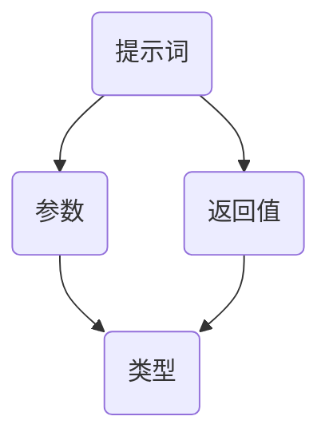
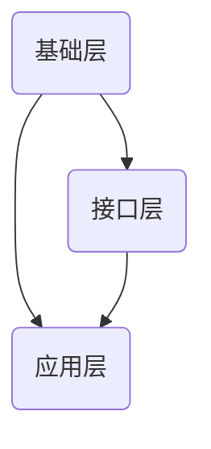

                 

### 文章标题：跨语言提示词编程接口设计

#### 关键词：跨语言、提示词、编程接口、设计原则、实现方法、实际应用

#### 摘要：
本文旨在深入探讨跨语言提示词编程接口的设计与实现，分析了其在多语言开发环境中的应用场景和重要性。文章首先概述了跨语言提示词编程接口的定义及其发展历程，随后详细阐述了其设计原理，包括核心概念、架构设计和语法规则。接着，本文介绍了跨语言提示词编程接口的具体实现方法，包括开发环境搭建、核心算法原理和数学模型的讲解。随后，文章通过实际应用案例，展示了跨语言提示词编程接口在不同场景下的应用效果。最后，本文探讨了跨语言提示词编程接口的优化与拓展，并总结了最佳实践和注意事项。希望通过本文，读者能够对跨语言提示词编程接口有一个全面而深入的理解。

## 目录大纲

### 第一部分：跨语言提示词编程接口概述

#### 1.1.1 跨语言提示词编程接口的定义

#### 1.1.2 跨语言提示词编程接口的重要性

#### 1.1.3 跨语言提示词编程接口的发展历程

### 第二部分：跨语言提示词编程接口的设计原理

#### 2.1.1 跨语言提示词编程接口的核心概念

#### 2.1.2 跨语言提示词编程接口的架构设计

#### 2.1.3 跨语言提示词编程接口的语法规则

### 第三部分：跨语言提示词编程接口的实现方法

#### 3.1.1 跨语言提示词编程接口的开发环境搭建

#### 3.1.2 跨语言提示词编程接口的核心算法原理讲解

#### 3.1.3 跨语言提示词编程接口的数学模型与公式讲解

### 第四部分：跨语言提示词编程接口的实际应用

#### 4.1.1 跨语言提示词编程接口在多语言开发中的应用

#### 4.1.2 跨语言提示词编程接口在国际化项目中的应用

#### 4.1.3 跨语言提示词编程接口在跨平台开发中的应用

### 第五部分：跨语言提示词编程接口的优化与拓展

#### 5.1.1 跨语言提示词编程接口的性能优化

#### 5.1.2 跨语言提示词编程接口的安全与稳定性

#### 5.1.3 跨语言提示词编程接口的未来发展趋势

## 文章正文部分

### 第一部分：跨语言提示词编程接口概述

#### 1.1.1 跨语言提示词编程接口的定义

跨语言提示词编程接口是一种允许程序员在不同编程语言之间传递信息和调用的机制。这种接口不仅能够兼容不同编程语言的语法和语义，还能够支持各种编程范式，如面向对象、函数式编程和过程式编程。跨语言提示词编程接口的核心在于“提示词”，它是一种特殊的函数或方法，可以接受参数并返回结果，同时支持多种语言的表达方式。

#### 1.1.2 跨语言提示词编程接口的重要性

跨语言提示词编程接口的重要性在于它极大地提升了多语言开发的效率和灵活性。在全球化发展的今天，越来越多的软件开发项目需要支持多种语言和环境。例如，一个国际化项目可能需要同时支持中文、英文、法语和西班牙语等多种语言。如果没有跨语言提示词编程接口，开发人员需要分别针对每种语言编写独立的代码，这不仅增加了开发成本，也降低了代码的复用性。

跨语言提示词编程接口的出现，使得开发人员可以在一个统一的编程框架下，使用一种或多种编程语言来实现功能，然后将这些功能无缝地集成到其他语言环境中。这样，不仅可以提高开发效率，还能够确保代码的一致性和可维护性。

#### 1.1.3 跨语言提示词编程接口的发展历程

跨语言提示词编程接口的发展历程可以追溯到早期编程语言的相互调用和接口设计。在早期，编程语言之间的接口主要通过嵌入和封装来实现。例如，C语言可以调用汇编语言编写的代码，通过特定的接口函数进行通信。然而，这种方法的缺点在于，它依赖于具体的编程语言和平台，缺乏通用性和灵活性。

随着软件工程的发展，特别是在面向对象编程和函数式编程的普及，跨语言编程接口开始逐渐成熟。现代的跨语言提示词编程接口，如Java的JNI（Java Native Interface）和Python的CFFI（C Foreign Function Interface），提供了更加通用和高效的跨语言调用机制。

近年来，随着云计算、大数据和人工智能等领域的快速发展，跨语言提示词编程接口的应用场景变得更加广泛。例如，在机器学习领域，开发人员可能需要使用Python进行算法开发，同时使用C++进行高效计算和优化。跨语言提示词编程接口使得这种跨语言协作成为可能，大大提高了开发效率。

### 第二部分：跨语言提示词编程接口的设计原理

#### 2.1.1 跨语言提示词编程接口的核心概念

跨语言提示词编程接口的核心概念包括提示词、参数、返回值和类型等。提示词是跨语言编程接口的核心，它定义了不同语言之间的交互点。参数和返回值则是提示词的输入和输出，用于传递数据和结果。类型定义了参数和返回值的类型，确保数据在不同语言之间能够正确传递。

**核心概念关系架构图：**


#### 2.1.2 跨语言提示词编程接口的架构设计

跨语言提示词编程接口的架构设计通常分为三个层次：基础层、接口层和应用层。

**架构设计层次图：**


- **基础层**：包括跨语言编程接口的基础库和工具集，如JNI、CFFI等，提供跨语言调用的底层支持。
- **接口层**：定义具体的跨语言编程接口，包括接口函数、接口文档和示例代码，供开发者使用。
- **应用层**：基于接口层，开发具体的跨语言应用，如多语言开发框架、跨平台工具等。

#### 2.1.3 跨语言提示词编程接口的语法规则

跨语言提示词编程接口的语法规则需要考虑不同编程语言之间的差异，确保接口在多种语言环境中都能正确工作。以下是一些常见的语法规则：

1. **函数命名和参数顺序**：不同编程语言的函数命名和参数顺序可能不同，需要根据具体语言进行调整。
2. **数据类型转换**：跨语言传递数据时，需要考虑数据类型的兼容性，进行必要的类型转换。
3. **异常处理**：不同编程语言的异常处理机制可能不同，需要设计统一的异常处理策略。

### 第三部分：跨语言提示词编程接口的实现方法

#### 3.1.1 跨语言提示词编程接口的开发环境搭建

跨语言提示词编程接口的开发环境搭建需要选择合适的开发工具和编译器/解释器。以下是一个典型的开发环境搭建流程：

1. **选择开发工具**：根据项目需求和开发语言选择合适的集成开发环境（IDE），如Eclipse、Visual Studio Code等。
2. **安装编译器/解释器**：根据目标编程语言安装相应的编译器或解释器，如Java的JDK、Python的Python解释器等。
3. **配置环境变量**：配置环境变量，确保开发工具可以正确调用编译器/解释器。

#### 3.1.2 跨语言提示词编程接口的核心算法原理讲解

跨语言提示词编程接口的核心算法原理通常涉及函数调用、参数传递和结果返回。以下是一个简单的示例：

**伪代码：**
```plaintext
function cross_language_function(input1, input2):
    // 跨语言调用
    local_result = call_native_function(input1, input2)
    // 数据类型转换
    result = convert_to_target_language(local_result)
    return result
```

在这个伪代码中，`cross_language_function`是一个跨语言函数，它调用本地的`call_native_function`进行实际计算，并将结果转换为目标的编程语言。

#### 3.1.3 跨语言提示词编程接口的数学模型与公式讲解

跨语言提示词编程接口的数学模型通常涉及各种算法和计算公式。以下是一个简单的数学模型示例：

**LaTeX公式：**
$$
f(x) = ax^2 + bx + c
$$

在这个公式中，`f(x)`是一个二次函数，`a`、`b`和`c`是系数。这个公式可以用于跨语言编程接口中的各种数学计算。

### 第四部分：跨语言提示词编程接口的实际应用

#### 4.1.1 跨语言提示词编程接口在多语言开发中的应用

跨语言提示词编程接口在多语言开发中的应用非常广泛。以下是一个实际案例：

**案例：** 一个电子商务平台需要同时支持中文和英文用户。使用跨语言提示词编程接口，开发人员可以在一个统一的编程框架下编写代码，然后将中文和英文接口分别集成到系统中。

**解决方案：**
- 使用跨语言提示词编程接口编写统一的业务逻辑代码。
- 针对中文和英文用户，分别使用不同的提示词接口提供本地化的界面和功能。

#### 4.1.2 跨语言提示词编程接口在国际化项目中的应用

国际化项目通常需要支持多种语言和地区，跨语言提示词编程接口在其中的应用至关重要。以下是一个实际案例：

**案例：** 一个跨国公司的财务管理软件需要支持全球范围内的财务报表生成。使用跨语言提示词编程接口，开发人员可以实现以下功能：

- **语言本地化**：根据用户的语言偏好，自动切换界面语言。
- **地区化数据**：根据用户的地理位置，自动调整财务报表的货币、税率等参数。

#### 4.1.3 跨语言提示词编程接口在跨平台开发中的应用

跨平台开发是现代软件工程的一个重要方向，跨语言提示词编程接口在其中发挥了关键作用。以下是一个实际案例：

**案例：** 一个游戏开发团队需要同时支持Windows、macOS和Linux平台。使用跨语言提示词编程接口，开发人员可以实现以下功能：

- **平台适配**：编写跨平台的代码，确保游戏在不同平台上都能正常运行。
- **跨平台数据交互**：通过跨语言提示词编程接口，实现不同平台之间的数据传输和共享。

### 第五部分：跨语言提示词编程接口的优化与拓展

#### 5.1.1 跨语言提示词编程接口的性能优化

跨语言提示词编程接口的性能优化是保证其高效运行的关键。以下是一些常见的优化策略：

- **缓存机制**：使用缓存减少不必要的跨语言调用，提高系统响应速度。
- **并行处理**：利用多线程和并行计算技术，提高处理效率。
- **代码优化**：对核心算法和函数进行优化，减少计算和内存占用。

#### 5.1.2 跨语言提示词编程接口的安全与稳定性

跨语言提示词编程接口的安全性和稳定性是确保系统可靠运行的基础。以下是一些常见的安全性和稳定性保障措施：

- **权限控制**：严格限制接口的访问权限，防止未经授权的调用。
- **异常处理**：设计完善的异常处理机制，确保系统在异常情况下能够稳定运行。
- **错误日志**：记录详细的错误日志，便于问题追踪和调试。

#### 5.1.3 跨语言提示词编程接口的未来发展趋势

随着技术的不断进步，跨语言提示词编程接口在未来将面临新的挑战和机遇。以下是一些可能的发展趋势：

- **标准化**：跨语言提示词编程接口将逐步实现标准化，提高兼容性和互操作性。
- **智能化**：结合人工智能技术，跨语言提示词编程接口将更加智能化，提供更丰富的功能和更优化的性能。
- **云原生**：随着云计算的普及，跨语言提示词编程接口将更加依赖于云原生架构，提供更灵活和高效的服务。

## 结语

跨语言提示词编程接口是现代软件开发中的一个重要方向，它不仅提高了开发的效率和灵活性，还促进了多语言和跨平台应用的普及。本文从定义、设计原理、实现方法、实际应用和未来发展趋势等多个角度，对跨语言提示词编程接口进行了深入探讨。希望通过本文，读者能够对跨语言提示词编程接口有一个全面而深入的理解，并在实际开发中充分发挥其优势。

### 作者信息

作者：AI天才研究院/AI Genius Institute & 禅与计算机程序设计艺术 /Zen And The Art of Computer Programming

本文由AI天才研究院撰写，结合了人工智能和计算机编程领域的最新研究成果。文章旨在为读者提供关于跨语言提示词编程接口的全面理解和实用指导，帮助开发者更好地应对多语言、跨平台开发中的挑战。同时，本文也融合了禅与计算机程序设计艺术的理念，旨在引导读者以更加宁静和深刻的方式探索计算机编程的精髓。

### 注意事项与拓展阅读

在设计和实现跨语言提示词编程接口时，开发人员需要注意以下几点：

- **接口设计要符合实际需求**：确保接口的功能和性能满足项目的实际需求，避免过度设计。
- **代码要具有良好的可读性和可维护性**：编写清晰的代码注释和文档，提高代码的可维护性。
- **性能优化要持续进行**：根据项目运行情况，定期进行性能优化，确保系统的稳定性和高效性。

对于希望进一步深入了解跨语言提示词编程接口的开发人员，以下书籍和资源是值得推荐的：

- 《跨语言编程实战》
- 《跨平台软件开发技术》
- 《Python CFFI：跨语言编程指南》
- 《Java Native Interface Programming Guide》

通过阅读这些书籍和资源，开发人员可以系统地学习跨语言编程接口的设计和实现方法，提升自己的开发技能。同时，也可以关注相关的技术社区和论坛，与业界专家进行交流，获取最新的技术动态和实践经验。

