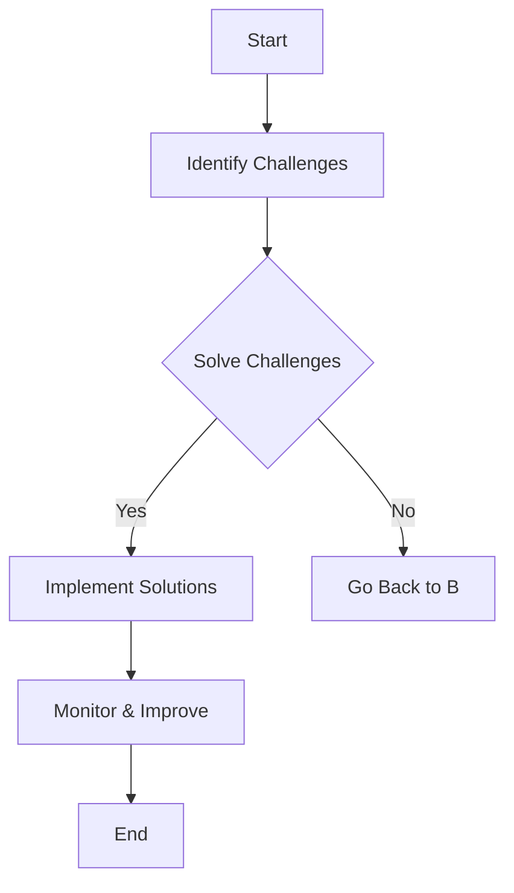
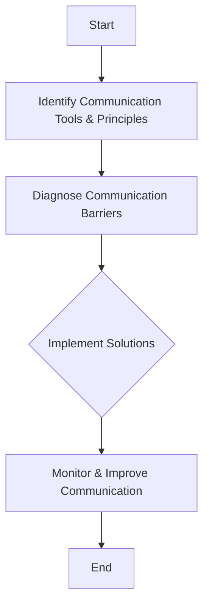
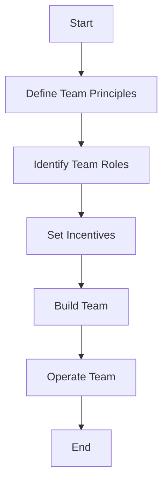
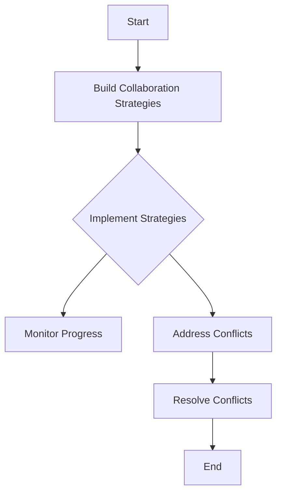
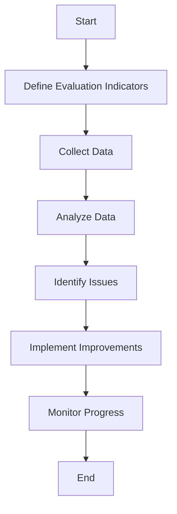

                 

### 跨部门协作的重要性与现状分析

在现代社会，企业的运作越来越复杂，部门间的协调和协作成为提高整体运营效率的关键。跨部门协作的重要性不容忽视，它不仅关乎项目成败，更直接影响组织的创新能力和竞争力。然而，现实中跨部门协作常常面临诸多挑战，这些问题如不及时解决，将阻碍组织的健康发展。

#### 1.1 跨部门协作的定义与意义

跨部门协作是指不同部门之间的成员为了共同目标，通过信息共享、知识交流和工作协调，共同完成任务的协作过程。它的意义在于：

- **提高效率：** 跨部门协作能够整合各部门的优势资源，减少重复劳动，加快项目进度，提高工作效率。
- **促进创新：** 跨部门协作鼓励知识共享和思维碰撞，有助于激发创新，提升组织的创新能力。
- **增强团队凝聚力：** 良好的跨部门协作能够增进各部门之间的了解和信任，增强团队凝聚力。

#### 1.2 当前组织中跨部门协作面临的挑战

尽管跨部门协作具有显著的优势，但在实际操作中，企业常常面临以下挑战：

- **文化差异：** 各部门由于职责、目标和沟通方式的不同，往往存在文化差异，导致协作时产生摩擦。
- **信息不对称：** 各部门的信息获取能力和透明度不一，信息不对称问题影响协作效率。
- **利益冲突：** 跨部门协作可能导致各部门的利益冲突，影响合作意愿和效果。
- **职责模糊：** 跨部门协作中职责分工不清，容易导致责任推卸和效率低下。

#### 1.3 跨部门协作的成功案例分享

成功的跨部门协作案例能够为其他企业提供借鉴。例如，某科技公司通过构建跨部门协作委员会，定期召开会议，确保各部门在项目推进过程中的沟通和信息共享。该措施不仅提高了产品开发速度，还增强了市场响应能力，取得了显著成效。

总的来说，跨部门协作在提高企业效率和创新能力方面具有重要意义。然而，实现跨部门协作并非易事，企业需要从组织文化、沟通机制、团队建设和领导力等多方面入手，克服挑战，促进协作。

### 伪代码示例：

```python
def evaluate_collaboration efficacy():
    challenges = ["cultural differences", "information asymmetry", "conflict of interests", "ambiguous responsibilities"]
    solutions = []
    if not "cultural differences" in challenges:
        solutions.append("promote open communication and teamwork culture")
    if not "information asymmetry" in challenges:
        solutions.append("establish transparent information sharing mechanisms")
    if not "conflict of interests" in challenges:
        solutions.append("clearly define roles and responsibilities")
    if not "ambiguous responsibilities" in challenges:
        solutions.append("establish a cross-departmental collaboration committee")
    return solutions
```

通过上述伪代码，我们可以看到如何从不同方面评估跨部门协作的挑战，并提出相应的解决方案。这些步骤为后续章节的深入探讨奠定了基础。

### Mermaid流程图：



该Mermaid流程图展示了跨部门协作从识别挑战到实施解决方案，再到监控和改进的完整过程，有助于读者理解整个跨部门协作的动态。

### 摘要

本文从跨部门协作的定义、挑战及其成功案例分析出发，探讨了跨部门协作在提高企业效率和创新能力方面的关键作用。文章通过具体的伪代码和Mermaid流程图，详细阐述了如何评估跨部门协作的挑战，并提出了相应的解决方案。跨部门协作不仅是现代企业应对复杂运营环境的必要手段，更是推动组织发展的重要动力。通过本文的讨论，希望为企业提供实用的策略和思路，助力跨部门协作的顺利开展。

### 组织文化与跨部门协作

组织文化是企业的灵魂，它影响着员工的行为和态度，进而影响跨部门协作的效果。一个积极、开放的组织文化能够促进跨部门协作，而消极、封闭的文化则可能阻碍协作的顺利进行。

#### 2.1 组织文化对跨部门协作的影响

组织文化对跨部门协作的影响主要体现在以下几个方面：

- **价值观认同：** 当各部门共享相同的价值观时，更容易形成共同的愿景和目标，从而促进协作。
- **沟通风格：** 组织文化决定了员工之间的沟通方式，开放、透明的文化有助于信息共享和协作。
- **激励机制：** 组织文化中的激励机制影响着员工的合作意愿，公平、透明的奖励机制能够增强协作动力。
- **信任度：** 基于信任的组织文化有助于各部门之间建立互信，减少协作中的摩擦。

#### 2.2 建立促进跨部门协作的企业文化

要建立促进跨部门协作的企业文化，企业可以采取以下措施：

- **推广开放沟通：** 鼓励员工在跨部门之间进行开放、透明的沟通，建立信息共享机制。
- **强化团队合作：** 组织团队建设活动，增强员工之间的相互了解和信任。
- **设立共同目标：** 设定跨部门的共同目标，使各部门认识到协作的重要性。
- **公平的激励机制：** 制定公平的奖励制度，激励员工积极参与跨部门协作。

#### 2.3 领导力在跨部门协作中的角色

领导者在跨部门协作中扮演着关键角色，他们的行为和决策直接影响协作的效果。以下是一些领导者如何促进跨部门协作的策略：

- **树立榜样：** 领导者应以身作则，积极参与跨部门协作，树立良好的协作榜样。
- **提供资源：** 领导者应确保各部门在协作过程中有足够的资源和支持。
- **解决冲突：** 领导者应主动解决跨部门协作中出现的冲突，维护良好的协作氛围。
- **鼓励创新：** 领导者应鼓励员工在跨部门协作中勇于创新，提升组织的创新能力。

通过建立积极、开放的组织文化，并充分发挥领导者的作用，企业可以有效地促进跨部门协作，提升整体运营效率。

### 数学公式：

$$ \text{协作效率} = f(\text{组织文化}, \text{沟通机制}, \text{领导力}) $$

该公式表明，协作效率是由组织文化、沟通机制和领导力共同作用的结果。这三个因素相互影响，共同决定了跨部门协作的效果。

### 实例分析：

假设一家科技公司希望提升跨部门协作效率。通过以下措施：

1. **推广开放沟通**：定期组织跨部门会议，鼓励员工分享经验和知识。
2. **强化团队合作**：组织团队建设活动，增强员工之间的相互了解和信任。
3. **设立共同目标**：制定跨部门的共同目标，确保各部门的工作方向一致。
4. **公平的激励机制**：根据协作效果，制定公平的奖励制度，激励员工积极参与协作。

在实施这些措施后，该公司的协作效率得到了显著提升，各部门之间的沟通更加顺畅，项目进度加快，市场响应能力增强。

### 摘要

本节讨论了组织文化对跨部门协作的影响，并提出了建立促进跨部门协作的企业文化的具体措施。通过推广开放沟通、强化团队合作、设立共同目标和公平的激励机制，企业可以打造一个有利于跨部门协作的组织环境。领导者在其中发挥着关键作用，通过树立榜样、提供资源、解决冲突和鼓励创新，推动跨部门协作的顺利进行。通过实际案例的分析，我们看到了组织文化和领导力在提升跨部门协作效率方面的重要作用。

### 建立有效的沟通机制

跨部门协作的成功离不开有效的沟通机制。沟通不仅是信息传递的工具，更是协调合作、解决问题的关键。要实现高效的跨部门协作，企业需要建立一套科学的沟通机制，确保信息的透明度和及时性。

#### 3.1 沟通的重要性与基本原则

沟通在跨部门协作中具有至关重要的地位，主要体现在以下几个方面：

- **信息共享：** 沟通是实现信息共享的基础，各部门通过有效的沟通可以及时获取相关资料和进展情况。
- **协调合作：** 沟通有助于各部门明确任务分工和进度安排，确保协作有序进行。
- **问题解决：** 通过沟通，各部门可以及时反馈问题，共同寻找解决方案，避免问题积累和扩大。

为了确保沟通的有效性，企业需要遵循以下基本原则：

- **透明性：** 沟通内容应保持透明，让所有相关方都能了解相关信息。
- **及时性：** 沟通应在必要时进行，确保信息的时效性。
- **准确性：** 沟通内容应准确无误，避免因误解或错误信息导致协作受阻。
- **尊重性：** 沟通应尊重各部门的意见和立场，建立互信的合作氛围。

#### 3.2 跨部门沟通的工具与方法

为了实现高效的跨部门沟通，企业可以采用以下工具和方法：

- **即时通讯工具：** 如Slack、Microsoft Teams等，方便员工随时进行交流和协作。
- **项目管理软件：** 如Trello、Jira等，可以帮助各部门追踪项目进度，管理任务分配。
- **视频会议系统：** 如Zoom、Microsoft Teams等，支持远程会议和在线协作，提升沟通效率。
- **邮件系统：** 虽然电子邮件的即时性较差，但在正式通知和文件传递方面仍具有重要作用。

#### 3.3 沟通障碍的识别与克服

在跨部门协作中，沟通障碍是常见问题，主要包括以下几点：

- **文化差异：** 不同部门的文化背景和沟通风格可能存在差异，导致理解上的困难。
- **信息不对称：** 部门间的信息获取渠道和透明度不一致，造成信息不对称。
- **职责不清：** 各部门的职责分工不明确，容易导致沟通内容重复或遗漏。
- **技术障碍：** 部分员工对某些沟通工具不熟悉，导致沟通效果不佳。

为了克服沟通障碍，企业可以采取以下措施：

- **培训与指导：** 对新员工和不懂沟通工具的员工进行培训，提高沟通技能。
- **建立反馈机制：** 设立反馈渠道，鼓励员工提出沟通中的问题和建议，不断优化沟通流程。
- **明确职责分工：** 制定清晰的职责分工表，明确各部门的职责范围和沟通对象。
- **文化融合：** 通过跨部门活动和文化交流，增进各部门之间的了解和信任，减少文化差异。

通过建立有效的沟通机制，企业可以确保跨部门协作的顺畅进行，提高整体工作效率和项目成功率。

### 伪代码示例：

```python
def establish_communication_mechanism():
    tools = ["Slack", "Trello", "Zoom", "Email"]
    principles = ["Transparency", "Timeliness", "Accuracy", "Respect"]
    obstacles = ["Cultural Differences", "Information Asymmetry", "Ambiguous Responsibilities", "Technical Barriers"]
    solutions = {
        "Cultural Differences": "Foster cross-departmental activities and exchanges",
        "Information Asymmetry": "Establish transparent information sharing mechanisms",
        "Ambiguous Responsibilities": "Clarify roles and responsibilities",
        "Technical Barriers": "Provide training and guidance on communication tools"
    }
    return tools, principles, obstacles, solutions
```

通过上述伪代码，我们可以看到如何建立一套完整的跨部门沟通机制，并识别和解决沟通中可能遇到的障碍。

### Mermaid流程图：



该Mermaid流程图展示了从识别沟通工具和原则，到诊断沟通障碍，再到实施解决方案和监控改进的完整过程，有助于读者理解跨部门沟通机制的构建。

### 摘要

本节深入探讨了建立有效的沟通机制在跨部门协作中的重要性。通过明确沟通的基本原则和工具，企业可以确保信息的透明性、及时性、准确性和尊重性。同时，识别和克服沟通障碍，如文化差异、信息不对称、职责不清和技术障碍，是提升跨部门协作效率的关键。通过伪代码和Mermaid流程图的详细阐述，企业可以系统地构建和优化跨部门沟通机制，为跨部门协作的成功奠定坚实基础。

### 跨部门团队的构建与运营

在跨部门协作中，跨部门团队的作用至关重要。构建一个高效、和谐的跨部门团队，需要明确团队建设原则、角色职责和激励机制。

#### 4.1 跨部门团队的建设原则

构建跨部门团队时，企业应遵循以下原则：

- **目标一致性：** 确保团队目标与组织整体目标一致，提高协作的效率和效果。
- **技能互补：** 团队成员应具备互补的技能，以确保团队能够应对各种挑战。
- **平等参与：** 每个成员都应该有机会参与团队决策，确保团队的多样性和包容性。
- **透明沟通：** 建立开放的沟通渠道，确保团队成员之间的信息共享和及时反馈。

#### 4.2 跨部门团队的角色与职责

跨部门团队的角色和职责应明确界定，以确保团队成员各司其职，协同工作。以下是一些常见的角色和职责：

- **项目负责人：** 负责团队的总体规划和协调，确保项目目标的实现。
- **技术专家：** 负责技术问题的解决和方案设计，为团队提供技术支持。
- **业务分析师：** 负责业务需求的分析和梳理，确保项目满足业务需求。
- **产品经理：** 负责产品的规划和推进，确保产品的质量满足用户需求。
- **沟通协调员：** 负责团队内外部的沟通协调，确保信息的及时传递。

#### 4.3 跨部门团队的激励机制

为了激发跨部门团队的积极性和创造力，企业可以采取以下激励机制：

- **绩效奖金：** 根据团队的绩效表现发放奖金，激励团队成员努力工作。
- **职业发展：** 为团队成员提供职业发展的机会，如培训、晋升等，增加他们的工作动力。
- **团队建设活动：** 定期组织团队建设活动，增强团队成员之间的默契和信任。
- **荣誉表彰：** 对在跨部门协作中表现突出的团队成员进行表彰，提高他们的工作积极性。

通过明确跨部门团队的建设原则、角色职责和激励机制，企业可以构建一个高效、和谐的跨部门团队，提升整体协作效率。

### 伪代码示例：

```python
def build_cross_department_team():
    principles = ["Consistency of Goals", "Complementary Skills", "Equitable Participation", "Transparent Communication"]
    roles = {
        "Project Manager": "Overall planning and coordination",
        "Technical Expert": "Solution design and technical support",
        "Business Analyst": "Business requirement analysis and documentation",
        "Product Manager": "Product planning and quality assurance",
        "Communication Coordinator": "Internal and external communication coordination"
    }
    incentives = ["Performance Bonus", "Professional Development", "Team Building Activities", "Honorary Recognition"]
    return principles, roles, incentives
```

通过上述伪代码，我们可以看到如何定义跨部门团队的建设原则、角色和激励机制。

### Mermaid流程图：



该Mermaid流程图展示了跨部门团队从构建到运营的完整过程，有助于读者理解跨部门团队的建设和运营。

### 摘要

本节详细讨论了跨部门团队的构建与运营。通过明确团队建设原则、角色职责和激励机制，企业可以构建一个高效、和谐的跨部门团队。建设原则包括目标一致性、技能互补、平等参与和透明沟通；角色职责涵盖了项目负责人、技术专家、业务分析师、产品经理和沟通协调员；激励机制包括绩效奖金、职业发展、团队建设活动和荣誉表彰。通过伪代码和Mermaid流程图的详细阐述，企业可以系统地构建和运营跨部门团队，提升协作效率。

### 跨部门协作的领导艺术

在跨部门协作中，领导者的角色至关重要。领导者的决策和行动不仅影响跨部门协作的顺利进行，还决定了协作的效果和团队的凝聚力。以下是领导者如何在跨部门协作中发挥领导艺术的一些关键策略。

#### 5.1 领导者的跨部门协作意识

首先，领导者需要具备强烈的跨部门协作意识。这包括以下几个方面：

- **跨部门视角：** 领导者应从全局出发，理解各部门之间的相互依赖关系，确保协作目标的一致性。
- **协作优先：** 领导者应将跨部门协作视为提升组织效率的重要手段，优先考虑并推动协作项目的实施。
- **沟通桥梁：** 领导者应成为跨部门沟通的桥梁，确保信息的透明传递和及时反馈。

#### 5.2 领导者如何促进跨部门协作

领导者可以通过以下具体策略来促进跨部门协作：

- **制定明确的目标和计划：** 领导者应明确跨部门协作的目标和计划，确保各部门在协作过程中有清晰的方向和任务。
- **建立有效的沟通机制：** 领导者应建立畅通的沟通渠道，定期组织跨部门会议和交流活动，促进信息共享和协作。
- **提供资源和支持：** 领导者应确保各部门在协作过程中有足够的资源和支持，解决协作中的实际问题。
- **协调利益冲突：** 领导者应在跨部门协作中协调利益冲突，确保各部门的利益得到平衡，避免因利益矛盾而阻碍协作。

#### 5.3 跨部门协作中的冲突管理

跨部门协作中难免会出现冲突，领导者需要采取有效的冲突管理策略来解决问题。以下是一些建议：

- **识别冲突来源：** 领导者应首先识别冲突的来源，是文化差异、沟通不畅，还是利益矛盾。
- **建立冲突解决机制：** 领导者应建立有效的冲突解决机制，确保冲突能够及时、公平地解决。
- **中立调解：** 领导者应以中立者的身份介入冲突，通过调解和沟通，找到双方都能接受的解决方案。
- **培养团队文化：** 领导者应积极培养团队的信任和文化，减少冲突的发生。

通过以上策略，领导者可以有效地促进跨部门协作，提升团队凝聚力和协作效率。

### 伪代码示例：

```python
def promote_cross_department_collaboration():
    strategies = [
        "Establish clear goals and plans",
        "Build an effective communication mechanism",
        "Provide resources and support",
        "Coordinate interest conflicts"
    ]
    conflict_management = {
        "Identify conflict sources": "Analyze and diagnose",
        "Establish resolution mechanism": "Mediation and negotiation",
        "Neutral mediation": "Serve as a neutral third party",
        "Cultivate team culture": "Build trust and communication"
    }
    return strategies, conflict_management
```

通过上述伪代码，我们可以看到如何制定促进跨部门协作的策略和冲突管理方案。

### Mermaid流程图：



该Mermaid流程图展示了领导者如何促进跨部门协作和解决冲突的完整过程，有助于读者理解跨部门协作中的领导艺术。

### 摘要

本节探讨了领导者如何在跨部门协作中发挥领导艺术。领导者需要具备跨部门协作意识，通过制定明确的目标和计划、建立有效的沟通机制、提供资源和支持以及协调利益冲突，来促进跨部门协作。同时，领导者需要采取有效的冲突管理策略，如识别冲突来源、建立冲突解决机制、中立调解和培养团队文化，来处理跨部门协作中的冲突。通过伪代码和Mermaid流程图的详细阐述，领导者可以更好地理解和应用跨部门协作的领导艺术，提升团队协作效率和凝聚力。

### 跨部门协作的绩效评估与改进

跨部门协作的绩效评估是确保协作效果的重要环节。通过科学的评估方法，企业可以识别协作中的问题，并进行持续改进，以提升协作效率和效果。

#### 6.1 跨部门协作绩效评估的方法

跨部门协作绩效评估可以采用以下几种方法：

- **定量评估：** 通过客观数据，如项目进度、完成任务的数量和质量、成本控制等指标，来评估跨部门协作的效果。
- **定性评估：** 通过调查问卷、访谈等方式，收集各部门对协作过程的反馈，评估跨部门协作的满意度和效果。
- **综合评估：** 结合定量和定性评估方法，对跨部门协作进行全面的评估。

在具体实施中，企业可以采用以下步骤：

1. **确定评估指标：** 根据跨部门协作的目标和任务，确定相应的评估指标，如项目完成率、团队协作满意度、问题解决效率等。
2. **收集数据：** 通过系统记录、调查问卷等方式，收集跨部门协作的相关数据。
3. **分析数据：** 对收集到的数据进行分析，评估跨部门协作的绩效。
4. **反馈与改进：** 将评估结果反馈给相关部门，提出改进建议，促进协作的优化。

#### 6.2 跨部门协作中的问题识别与改进

通过绩效评估，企业可以发现跨部门协作中存在的问题，并采取相应的改进措施。常见问题及改进措施包括：

- **沟通不畅：** 改进措施包括加强沟通培训、建立沟通机制、提供沟通工具等。
- **职责不清：** 改进措施包括明确职责分工、制定协作流程、定期检查职责履行情况等。
- **文化差异：** 改进措施包括组织文化交流活动、培养跨文化意识、设立文化融合专员等。
- **资源分配不均：** 改进措施包括优化资源分配方案、确保资源公平分配、建立资源共享机制等。

#### 6.3 跨部门协作的持续优化

跨部门协作的优化是一个持续的过程，需要企业不断调整和改进。以下是一些建议：

- **定期评估：** 定期对跨部门协作进行评估，及时发现问题并进行改进。
- **培训与学习：** 定期组织跨部门协作培训和经验分享会，提升团队成员的协作能力和意识。
- **技术支持：** 利用现代化的协作工具和系统，提高协作效率和效果。
- **激励机制：** 建立公平、透明的激励机制，激励团队成员积极参与跨部门协作。

通过科学的绩效评估方法和持续优化，企业可以不断提升跨部门协作的效率和质量，为组织的发展提供有力支持。

### 伪代码示例：

```python
def evaluate_and_improve_collaboration():
    indicators = ["Project Completion Rate", "Team Collaboration Satisfaction", "Problem Resolution Efficiency"]
    measures = {
        "Communication Issues": ["Enhance Communication Training", "Establish Communication Mechanisms", "Provide Communication Tools"],
        "Ambiguous Responsibilities": ["Clarify Roles and Responsibilities", "Develop Collaboration Processes", "Regularly Check Responsibility Fulfillment"],
        "Cultural Differences": ["Organize Cultural Exchange Activities", "Cultivate Cross-Cultural Awareness", "Establish Cultural Integration Specialist"],
        "Imbalanced Resource Allocation": ["Optimize Resource Allocation", "Ensure Fair Resource Distribution", "Establish Resource Sharing Mechanisms"]
    }
    return indicators, measures
```

通过上述伪代码，我们可以看到如何制定跨部门协作的评估指标和改进措施。

### Mermaid流程图：



该Mermaid流程图展示了从定义评估指标、收集数据、分析数据、识别问题到实施改进和持续监控的完整过程，有助于读者理解跨部门协作绩效评估和改进的方法。

### 摘要

本节讨论了跨部门协作的绩效评估与改进。通过定量和定性评估方法，企业可以科学地评估跨部门协作的绩效，识别存在的问题，并采取相应的改进措施。持续优化是提升协作效率的关键，通过定期评估、培训与学习、技术支持和激励机制，企业可以不断提升跨部门协作的质量，为组织发展提供有力支持。通过伪代码和Mermaid流程图的详细阐述，企业可以系统地实施跨部门协作的绩效评估和改进。

### 跨部门协作的成功实践

跨部门协作的成功实践为其他企业提供了宝贵的经验。以下是某公司跨部门协作的成功案例，以及在该过程中遇到的挑战和解决方案。

#### 7.1 某公司跨部门协作的成功案例

某大型科技公司通过实施跨部门协作，显著提升了产品开发速度和市场响应能力。以下是该公司的具体做法：

1. **建立跨部门协作委员会：** 公司成立了跨部门协作委员会，由各部门负责人组成，定期召开会议，讨论项目进度、资源需求和问题解决。
2. **设立统一沟通平台：** 公司引入了统一的项目管理工具，确保各部门之间的信息共享和协作。
3. **制定清晰的职责分工：** 公司明确了各部门在项目中的角色和职责，避免了职责不清和责任推卸的问题。
4. **建立激励制度：** 公司对在跨部门协作中表现突出的员工进行表彰和奖励，提高了员工参与协作的积极性。

通过以上措施，该公司的产品开发周期从原来的6个月缩短到了3个月，市场响应能力大幅提升，客户满意度显著提高。

#### 7.2 跨部门协作中遇到的挑战与解决方案

在跨部门协作过程中，该公司也遇到了一些挑战，并采取了一系列解决方案：

1. **文化差异：** 不同部门之间存在文化差异，导致协作初期出现了沟通不畅和合作不顺畅的问题。解决方案是组织跨部门团队建设活动，增进各部门之间的了解和信任。
2. **信息不对称：** 部门间的信息获取渠道不统一，导致信息不对称。公司建立了统一的信息共享平台，确保各部门能够及时获取相关信息。
3. **利益冲突：** 跨部门协作可能导致各部门的利益冲突，影响协作效果。公司通过制定公平的激励制度，确保各部门的利益得到平衡，减少利益冲突。
4. **资源分配不均：** 在跨部门协作中，资源分配不均可能导致某些部门的工作进展缓慢。公司通过优化资源分配方案，确保资源能够合理分配，提升协作效率。

#### 7.3 跨部门协作的经验总结与启示

通过这个案例，我们可以得出以下经验和启示：

1. **建立高效的沟通机制：** 高效的沟通是跨部门协作成功的关键。企业需要建立统一的沟通平台，确保信息的透明传递和及时反馈。
2. **明确职责分工：** 明确的职责分工有助于避免职责不清和责任推卸的问题，提高协作效率。
3. **建立激励制度：** 公平的激励制度能够激发员工的积极性和创造力，提升跨部门协作的效果。
4. **加强团队建设：** 通过跨部门团队建设活动，增进各部门之间的了解和信任，减少文化差异和协作障碍。
5. **持续优化：** 跨部门协作是一个持续的过程，企业需要不断评估和改进协作机制，以适应不断变化的外部环境和内部需求。

通过借鉴这些成功经验，企业可以更好地实施跨部门协作，提升整体运营效率和竞争力。

### 摘要

本节通过一个成功案例，详细介绍了跨部门协作在提升产品开发速度和市场响应能力方面的显著效果。在跨部门协作过程中，企业面临文化差异、信息不对称、利益冲突和资源分配不均等挑战，并采取了一系列解决方案，如建立跨部门协作委员会、设立统一沟通平台、制定清晰的职责分工和建立激励制度等。这些经验为其他企业提供了有益的启示，即建立高效的沟通机制、明确职责分工、建立激励制度、加强团队建设和持续优化是跨部门协作成功的关键。通过借鉴这些经验和策略，企业可以提升跨部门协作的效率，为组织发展奠定坚实基础。

### 跨部门协作的未来展望

随着企业竞争环境的变化和信息技术的不断发展，跨部门协作正面临着新的趋势和挑战。未来，企业需要不断探索和创新，以提升跨部门协作的效率和质量。

#### 8.1 跨部门协作的趋势与挑战

当前，跨部门协作呈现出以下几个趋势：

1. **数字化：** 数字化技术的发展，如大数据、云计算和人工智能，为跨部门协作提供了强大的支持。企业可以通过数字化工具和平台，实现信息的实时共享和智能决策。
2. **敏捷化：** 为了更好地适应快速变化的市场环境，企业正在向敏捷协作模式转型。敏捷化的跨部门协作强调快速响应、灵活调整和持续改进，有助于提高协作效率。
3. **全球化：** 全球化带来的市场机遇和挑战，使得企业需要跨地区、跨国界的跨部门协作。全球化背景下的跨部门协作，要求企业具备跨文化沟通和协调能力。

与此同时，跨部门协作也面临着一些新的挑战：

- **信息复杂性：** 随着数据量的增加和渠道的多元化，跨部门协作中的信息复杂性不断提升，如何有效管理和利用这些信息成为一个重要课题。
- **协作效率：** 在全球化背景下，跨部门协作的地理和时间距离增加，如何提高协作效率、减少沟通成本成为企业需要解决的问题。
- **文化差异：** 全球化带来了多元文化的融合，但同时也带来了文化差异带来的挑战。如何在多元文化环境中实现高效协作，是企业需要面对的难题。

#### 8.2 提升跨部门协作效率的技术手段

为了应对这些挑战，企业可以采用以下技术手段提升跨部门协作效率：

1. **智能协作工具：** 利用人工智能和自然语言处理技术，开发智能协作工具，如智能助手、智能会议系统等，提高协作效率和体验。
2. **云计算与大数据：** 通过云计算和大数据技术，实现跨部门信息的集中管理和智能分析，提高信息利用效率和决策质量。
3. **敏捷开发平台：** 采用敏捷开发平台，实现跨部门协作的快速迭代和灵活调整，提升项目开发速度和市场响应能力。
4. **虚拟现实与增强现实：** 利用虚拟现实和增强现实技术，实现跨部门的沉浸式协作和远程沟通，减少地理距离对协作的影响。

#### 8.3 跨部门协作对组织发展的深远影响

跨部门协作对组织发展具有深远影响：

1. **创新能力：** 跨部门协作促进了知识共享和思维碰撞，有助于激发创新，提升组织的创新能力。
2. **运营效率：** 通过优化跨部门协作流程，企业可以减少重复劳动，提高资源利用率，提升整体运营效率。
3. **团队凝聚力：** 良好的跨部门协作有助于增进各部门之间的了解和信任，增强团队凝聚力，提高组织的整体执行力。
4. **市场响应能力：** 快速、高效的跨部门协作能够帮助企业更快地响应市场变化，抓住市场机遇，提升竞争力。

总之，跨部门协作是企业应对复杂环境、提升核心竞争力的关键。通过把握趋势、应对挑战、采用先进技术手段，企业可以不断提升跨部门协作效率，为组织发展注入新的活力。

### 摘要

本节展望了跨部门协作的未来发展趋势和挑战。随着数字化、敏捷化和全球化的推进，跨部门协作面临着信息复杂性、协作效率和文化差异等新挑战。为应对这些挑战，企业可以采用智能协作工具、云计算与大数据、敏捷开发平台和虚拟现实与增强现实等先进技术手段。跨部门协作对组织发展具有深远影响，包括提升创新能力、运营效率和团队凝聚力，以及增强市场响应能力。通过把握未来趋势、应对挑战和采用先进技术，企业可以不断提升跨部门协作效率，为组织发展注入新的动力。

### 附录A：跨部门协作工具推荐

为了提高跨部门协作的效率和效果，企业可以采用以下几种工具：

#### A.1 沟通工具

1. **Slack**：Slack是一个流行的即时通讯工具，支持文本、图片、文件等多种形式的信息交流，有助于团队成员之间的实时沟通和协作。
2. **Microsoft Teams**：Microsoft Teams提供了视频会议、即时消息、文档共享等功能，适用于跨部门协作的多种场景。
3. **Google Workspace**：包括Gmail、Google Chat、Google Meet等工具，支持邮件、聊天、视频会议等多功能集成，方便团队成员沟通和协作。

#### A.2 协作平台

1. **Trello**：Trello是一个基于看板的项目管理工具，可以方便地管理任务、跟踪项目进度，适合跨部门协作中任务分配和进度管理。
2. **Jira**：Jira是一个强大的敏捷项目管理工具，适用于软件项目的开发、测试和部署，可以帮助团队实现高效的协作和管理。
3. **Asana**：Asana是一个灵活的项目管理工具，支持任务分配、进度跟踪和团队协作，适用于不同规模和类型的跨部门协作项目。

#### A.3 决策工具

1. **Miro**：Miro是一个在线协作白板工具，支持多人实时协作，适用于头脑风暴、流程图设计和决策讨论等。
2. **Mural**：Mural是另一个在线协作白板工具，提供了丰富的功能，如思维导图、流程图、投票等，适合跨部门协作中的创意讨论和决策制定。
3. **Swaysync**：Swaysync是一个支持多人实时协作的文档编辑工具，适合跨部门协作中的文档编写和审阅。

通过选择和使用这些工具，企业可以显著提升跨部门协作的效率和效果，为项目的顺利推进提供有力支持。

### 附录B：跨部门协作相关资源

为了帮助企业和团队更好地理解和实践跨部门协作，以下是一些推荐的书籍、文章和报告，以及相关的研究机构和协会。

#### B.1 书籍推荐

1. **《跨部门协作：提升团队效率和创造力的策略》** - 作者：大卫·洛克
   本书详细介绍了跨部门协作的理论和实践，提供了多种实用的协作策略和方法。

2. **《协同效应：跨部门协作的奥秘》** - 作者：斯蒂芬·罗宾斯
   本书探讨了跨部门协作的关键要素，包括沟通、信任、目标一致性和激励机制等。

3. **《禅与跨部门协作的艺术》** - 作者：詹姆斯·希尔曼
   本书结合东方哲学和现代管理理念，提供了独特的跨部门协作思考方式和实践方法。

#### B.2 文章与报告

1. **《哈佛商业评论》** - 特约文章：“跨部门协作的挑战与机遇”
   该文章分析了跨部门协作在企业运营中的重要性，并提出了应对挑战的策略。

2. **《麦肯锡季刊》** - 报告：“跨部门协作：提升企业创新能力和竞争力的关键”
   该报告通过案例研究，展示了跨部门协作在提升企业创新能力和竞争力方面的实际效果。

3. **《企业协作管理》** - 杂志文章：“如何建立高效的跨部门协作团队”
   该文章提供了详细的跨部门团队构建和运营指南，有助于企业实现高效的协作。

#### B.3 研究机构与协会

1. **国际协作管理协会（ICMA）**
   ICMA是一个致力于研究和管理协作的国际组织，提供有关协作管理的最新研究成果和实践案例。

2. **美国项目管理协会（PMI）**
   PMI是一个全球性的项目管理专业组织，提供有关跨部门协作的项目管理标准和认证。

3. **中国管理科学研究院协作管理研究所**
   这是一个专注于协作管理研究的中国机构，提供跨部门协作的理论研究、咨询和培训服务。

通过阅读这些书籍、文章和报告，以及参与相关的研究机构和协会的活动，企业和团队可以更深入地了解跨部门协作的重要性，并掌握有效的协作方法和策略。

