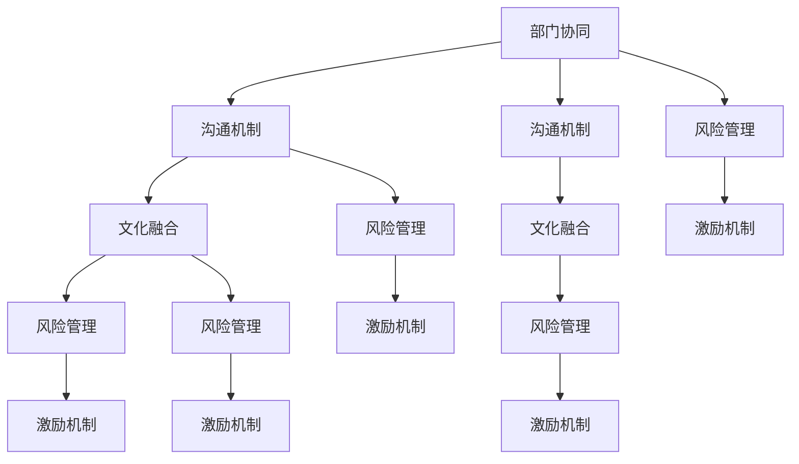
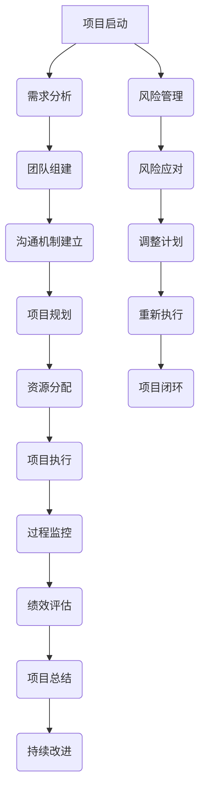

                 

### 跨部门合作的概述

#### 1.1 跨部门合作的重要性

在当今的企业环境中，跨部门合作已成为企业成功的关键因素之一。随着全球化、信息化的快速发展，企业面临着前所未有的竞争压力和变革挑战。在这种背景下，单一部门的封闭运作模式已经无法满足企业发展的需求。跨部门合作不仅可以整合不同部门的优势资源，提高工作效率，还能够激发创新思维，解决复杂问题。

首先，跨部门合作有助于打破部门壁垒，促进信息共享。在传统的组织结构中，各部门往往各自为政，信息流通不畅，导致资源浪费和决策失误。而通过跨部门合作，各部门可以共享信息、资源与知识，形成协同效应，提高整体运作效率。

其次，跨部门合作能够激发创新思维。不同部门的专业知识和技能互补，有助于从多个角度审视问题，提出创新的解决方案。跨部门合作的开放性也为团队成员提供了更多的学习和成长机会，激发了他们的创新潜力。

最后，跨部门合作有助于提高企业的应变能力。在快速变化的市场环境中，企业需要具备快速响应和调整的能力。跨部门合作可以加速信息传递和决策过程，使企业能够更快地应对市场变化，抓住机遇。

#### 1.2 跨部门合作的概念与特点

跨部门合作指的是企业内部不同部门之间的协作，共同完成某一项目或任务的过程。与传统部门独立运作的模式相比，跨部门合作具有以下特点：

1. **多元性**：跨部门合作涉及多个部门的参与，参与者具有不同的专业背景和技能。这种多元性使得合作过程更加丰富和多样化，有助于从不同角度解决问题。
   
2. **灵活性**：跨部门合作不拘泥于传统的组织结构和职能分工，可以根据项目需求灵活调整团队组成和职责分配。这种灵活性有助于快速响应项目变化，提高工作效率。

3. **协同性**：跨部门合作强调协同合作，要求各部门在项目过程中相互支持、相互配合。协同性有助于消除部门间的隔阂，提高团队整体执行力。

4. **目标导向**：跨部门合作的目的是实现共同的目标，而非单个部门的目标。这种目标导向有助于统一各部门的努力方向，形成合力。

5. **复杂性**：跨部门合作涉及多个部门和人员的协调与沟通，流程复杂，协调成本较高。因此，跨部门合作需要建立有效的管理机制和沟通平台，以确保项目顺利进行。

#### 1.3 跨部门合作的常见障碍

尽管跨部门合作具有诸多优势，但在实际操作中，仍然面临许多挑战和障碍：

1. **组织壁垒**：企业内部的部门壁垒是跨部门合作的主要障碍。部门间的利益冲突、信息不对称、职责不明确等问题，往往导致合作难以推进。

2. **沟通障碍**：跨部门合作涉及多个部门和人员的沟通，沟通不畅、误解和冲突时有发生。语言、文化、认知差异等都是沟通障碍的来源。

3. **管理复杂性**：跨部门合作需要协调多个部门和人员的资源、进度和目标，管理复杂性增加。如果管理不善，容易导致项目进度延误、资源浪费和质量问题。

4. **个人利益冲突**：在跨部门合作中，个人利益与团队利益的平衡是关键。如果个人利益受到损害，可能导致团队成员的消极应对或离职。

5. **资源分配不均**：跨部门合作需要各部门协调资源，但资源分配不均可能导致某些部门资源紧张，影响合作效率。

#### 1.4 跨部门合作的流程与步骤

为了确保跨部门合作的有效实施，企业需要建立一套完善的流程和步骤。以下是一个典型的跨部门合作流程：

1. **需求分析与项目规划**：首先，明确跨部门合作的目标和需求，制定详细的项目规划。项目规划应包括项目范围、目标、里程碑、资源需求等内容。

2. **团队组建与角色分配**：根据项目需求，组建跨部门团队，明确团队成员的角色和职责。团队成员应具备相关的专业知识和技能，能够协同合作。

3. **沟通机制建立**：建立有效的沟通机制，确保信息畅通。可以通过定期会议、即时通讯工具、共享文档等方式，促进团队内部和跨部门的沟通。

4. **项目启动与执行**：正式启动项目，按计划推进项目进度。项目执行过程中，要关注关键节点和风险，及时调整项目计划。

5. **过程监控与协调**：对项目执行过程进行监控，协调各部门的资源和进度，确保项目按计划进行。如果出现偏差，要及时调整项目计划。

6. **绩效评估与激励**：项目完成后，对团队成员的绩效进行评估，根据评估结果给予相应的奖励和激励，以提高团队成员的积极性和主动性。

7. **项目总结与反馈**：项目完成后，进行项目总结，收集团队成员的反馈，总结项目经验教训，为未来的跨部门合作提供参考。

通过以上步骤，企业可以有效地推进跨部门合作，实现项目目标，提高整体运营效率。

### 总结

跨部门合作是企业应对复杂环境、实现持续发展的关键。通过打破部门壁垒，促进信息共享和协同创新，企业可以提升整体竞争力。尽管跨部门合作面临诸多挑战，但通过科学的管理和有效的流程，企业可以克服这些障碍，实现跨部门合作的成功。在未来的发展中，企业应高度重视跨部门合作，积极探索和实践，以实现更高的效率和更优的业绩。

### 1.5 跨部门合作的成功案例分析

跨部门合作在许多成功的企业中得到了广泛应用，以下是一些典型的成功案例：

#### 案例一：谷歌的“X实验室”

谷歌的“X实验室”是一个跨部门合作的典范。该实验室由不同部门的技术专家组成，包括硬件、软件、人工智能等多个领域的专业人员。通过跨部门的协作，X实验室成功开发了多项创新技术，如谷歌眼镜、无人驾驶汽车等。这些技术的成功不仅提升了谷歌的市场竞争力，也为公司带来了巨大的经济收益。

**关键成功因素**：
- **开放的文化**：谷歌鼓励员工跨部门合作，创造了一个开放、自由的工作环境，使员工能够自由地分享想法和知识。
- **清晰的愿景**：X实验室有一个明确的愿景，即推动创新技术的研发和应用，这为跨部门合作提供了明确的目标和方向。
- **灵活的团队组建**：X实验室的团队可以根据项目需求灵活组建，使不同部门的专业人员能够迅速集结，协同工作。

#### 案例二：宝洁公司的“联合市场计划”

宝洁公司（P&G）通过实施“联合市场计划”，实现了跨部门的有效合作。该计划要求市场部门、研发部门、生产部门等多个部门的紧密合作，共同开发和推广新产品。通过这种跨部门合作，宝洁公司能够更快速地响应市场变化，提高新产品的成功率。

**关键成功因素**：
- **共同的目标**：所有部门都明确新产品的成功对公司的整体发展至关重要，这促使各部门在合作中保持一致的目标和方向。
- **高效的沟通机制**：宝洁建立了高效的沟通机制，确保各部门之间的信息畅通，避免了信息不对称和沟通障碍。
- **明确的责任分配**：在联合市场计划中，各部门的角色和责任都明确划分，使每个部门都能够专注于自己的核心任务。

#### 案例三：苹果公司的“One Apple”战略

苹果公司（Apple）在推行“One Apple”战略时，强调跨部门合作，以实现整体协同效应。该战略要求所有部门，包括设计、研发、生产、销售等，共同协作，打造无缝衔接的产品和服务。通过跨部门合作，苹果公司能够推出高质量、用户满意的产品，赢得了广泛的用户口碑。

**关键成功因素**：
- **强大的领导力**：苹果的CEO蒂姆·库克通过强大的领导力，推动跨部门合作，确保各部门能够在战略方向上保持一致。
- **统一的品牌理念**：苹果通过统一的品牌理念，使各部门在合作中保持一致的风格和目标，减少了内部摩擦。
- **高效的决策机制**：苹果建立了高效的决策机制，确保跨部门合作能够快速响应市场变化和用户需求。

通过这些成功案例，我们可以看到，跨部门合作不仅有助于提升企业竞争力，还能够推动企业的创新和发展。企业应从这些案例中吸取经验，积极探索和实践跨部门合作，以实现持续发展和成功。

### 总结

跨部门合作在成功的企业中发挥着至关重要的作用，它不仅能够打破部门壁垒，促进信息共享和协同创新，还能够提高企业的应变能力和整体竞争力。然而，跨部门合作也面临着诸多挑战，如组织壁垒、沟通障碍和管理复杂性等。企业应通过建立开放的文化、明确的愿景和高效的沟通机制，克服这些障碍，实现跨部门合作的成功。未来，随着企业面临的挑战日益复杂，跨部门合作将成为企业持续发展的关键因素，值得企业高度重视和积极探索。

## 第二部分：跨部门合作的组织文化

### 2.1 组织文化对跨部门合作的影响

组织文化是企业价值观、行为规范和工作方式的集合，对企业的整体运营和员工行为具有深远的影响。在跨部门合作中，组织文化尤其重要，它不仅能够促进跨部门合作的有效实施，还能够影响合作的效果和持续发展。

首先，开放的文化有助于跨部门合作。一个开放的文化环境鼓励员工分享信息、知识和资源，促进跨部门的沟通与协作。在这种文化下，员工愿意主动寻求跨部门的合作机会，形成跨部门团队，共同应对复杂的问题。例如，谷歌和宝洁公司等成功企业都具备开放的文化，这使得它们能够高效地实施跨部门合作，推动创新和发展。

其次，协作的文化是跨部门合作成功的关键。协作文化强调团队合作和共同目标，鼓励员工在跨部门合作中相互支持、相互配合。在这种文化下，员工更加关注整个团队的成功，而不仅仅是个人业绩。苹果公司的“One Apple”战略就是一个典型的例子，通过强调协作文化，苹果公司实现了各部门的无缝协作，推出了众多成功的产品。

最后，创新的文化能够激发跨部门合作中的创新思维。在创新文化的氛围中，员工勇于尝试新方法、新技术，不断寻求突破。这种文化不仅有助于解决复杂问题，还能够推动企业的持续创新。谷歌的“X实验室”就是一个很好的例子，通过鼓励创新，谷歌的跨部门团队成功开发了多个颠覆性技术。

然而，一些企业可能存在阻碍跨部门合作的组织文化。例如，封闭的文化可能导致部门壁垒和资源壁垒，阻碍跨部门的沟通与协作。此外，竞争的文化可能导致部门间的利益冲突，影响跨部门的合作效果。还有一些企业可能缺乏协作文化，导致员工在跨部门合作中缺乏协作精神和共同目标。这些问题需要企业通过文化变革来逐步解决。

总之，组织文化对跨部门合作具有深远的影响。开放、协作和创新的文化能够促进跨部门合作的有效实施和持续发展，而封闭、竞争和缺乏协作的文化则可能成为跨部门合作的障碍。企业应重视组织文化的建设，通过文化变革，营造有利于跨部门合作的文化氛围，提升企业的整体竞争力。

### 2.2 建立有利于跨部门合作的组织文化

建立有利于跨部门合作的组织文化是企业实现持续发展和高效运作的关键。以下是一些关键步骤和策略，可以帮助企业在内部培育和支持这种文化：

#### 1. 明确价值观和愿景

首先，企业需要明确并传达其核心价值观和愿景，使所有员工都理解并认同这些理念。这可以通过定期举办员工大会、内部培训、内部杂志等多种形式来实现。通过这样的方式，企业可以建立一种共同的信仰和目标，让员工在跨部门合作时有一个明确的指引。

**价值观示例**：
- **团队合作**：鼓励员工在跨部门合作中相互支持、共同努力。
- **信息共享**：强调信息透明和资源共享的重要性。
- **创新驱动**：鼓励员工勇于尝试新想法和新方法，推动企业的创新和发展。

#### 2. 培养开放和协作的氛围

开放和协作的氛围是跨部门合作成功的关键。企业可以通过以下方式来培养这种氛围：

- **透明沟通**：建立开放的沟通渠道，确保信息在企业内部畅通无阻。例如，定期举办跨部门会议、使用内部协作工具等。
- **鼓励反馈**：鼓励员工在跨部门合作中积极反馈意见和建议，建立一种开放和包容的氛围。
- **跨部门项目**：通过跨部门项目，让员工在实际工作中体验到协作和合作的重要性。

#### 3. 建立跨部门沟通机制

有效的跨部门沟通机制是跨部门合作成功的基础。以下是一些策略：

- **定期会议**：定期举办跨部门会议，让各部门负责人和关键成员共同讨论项目进展、问题和解决方案。
- **协作工具**：使用协作工具（如Slack、Microsoft Teams等）来促进实时沟通和文档共享，提高工作效率。
- **反馈机制**：建立反馈机制，确保跨部门合作中遇到的问题和挑战能够及时得到解决。

#### 4. 激励跨部门合作

为了激励员工积极参与跨部门合作，企业可以采取以下措施：

- **奖励制度**：设立跨部门合作的奖励制度，对在跨部门合作中表现突出的员工和团队进行表彰和奖励。
- **培训和发展**：提供跨部门合作的培训，帮助员工提升协作能力和跨部门沟通技巧。
- **晋升机会**：为在跨部门合作中表现出色的员工提供晋升机会，激励他们继续积极参与。

#### 5. 建立跨部门团队

建立跨部门团队是实施跨部门合作的关键。以下是一些策略：

- **明确角色和职责**：在跨部门团队中明确每个成员的角色和职责，确保团队目标的实现。
- **共同目标**：确保跨部门团队有一个共同的目标，使所有成员都朝着同一个方向努力。
- **定期评估**：定期对跨部门团队的绩效进行评估，及时调整团队结构和工作方式。

通过以上步骤和策略，企业可以逐步建立和培养有利于跨部门合作的组织文化，促进各部门之间的协作和合作，提高整体运营效率和竞争力。

### 2.3 跨部门文化冲突的解决策略

跨部门合作往往伴随着文化冲突，这些冲突可能源于不同的价值观、工作方式、沟通风格和利益分配。解决跨部门文化冲突是确保跨部门合作顺利进行的关键。以下是一些解决策略：

#### 1. 加强沟通与理解

沟通是解决文化冲突的基础。企业可以通过以下方式加强跨部门之间的沟通与理解：

- **定期会议**：定期举办跨部门会议，让各部门负责人和关键成员直接交流，讨论共同关心的问题和挑战。
- **团队建设活动**：组织跨部门的团队建设活动，如团建旅行、拓展训练等，增强团队成员之间的信任和理解。
- **信息共享**：建立信息共享平台，让各部门能够及时了解彼此的工作进展、需求和挑战。

#### 2. 明确共同目标

跨部门文化冲突往往源于目标不一致。通过明确共同目标，可以减少冲突并增强协作：

- **共同愿景**：制定清晰的共同愿景和目标，使各部门都明白自己的工作如何对整体目标做出贡献。
- **明确角色和职责**：确保每个部门都明确自己的角色和职责，减少因职责不清导致的冲突。

#### 3. 建立信任机制

信任是跨部门合作成功的关键。建立信任机制可以从以下几个方面入手：

- **透明度**：提高信息的透明度，让各部门都能了解彼此的工作内容和进展，减少猜疑和误解。
- **共享成功**：共同庆祝跨部门合作的成功，增强团队的凝聚力。
- **相互支持**：鼓励各部门在遇到困难时相互支持，共同解决难题。

#### 4. 制定公平的激励机制

公平的激励机制可以减少跨部门之间的竞争和冲突：

- **公正的评估体系**：建立公正的绩效评估体系，确保各部门的成果都能得到公平的评价。
- **共享奖励**：将跨部门合作的成功与奖励挂钩，让所有参与者在成功时都能分享荣誉和奖励。

#### 5. 培养多元文化意识

企业应积极培养多元文化意识，使员工认识到不同文化之间的差异和互补：

- **文化培训**：定期举办文化培训，帮助员工了解和尊重不同文化背景的同事。
- **文化融合活动**：组织跨文化融合活动，如国际美食节、文化交流会等，促进员工之间的文化交流和理解。

#### 6. 寻求外部帮助

在某些情况下，内部努力可能不足以解决文化冲突。企业可以寻求外部咨询或专业机构帮助：

- **专业顾问**：聘请跨文化管理顾问，为企业提供专业的跨部门文化冲突解决建议。
- **第三方调解**：在严重冲突时，可以寻求第三方调解，帮助双方找到解决问题的方法。

通过以上策略，企业可以有效解决跨部门文化冲突，促进跨部门合作的成功实施。这不仅有助于提高企业的整体运营效率，还能增强员工的工作满意度和团队的凝聚力。

### 总结

跨部门合作的成功离不开良好的组织文化。开放、协作和创新的文化能够促进跨部门之间的沟通与协作，解决文化冲突，提高整体效率。通过明确价值观和愿景、培养开放和协作的氛围、建立跨部门沟通机制和激励跨部门合作，企业可以逐步建立有利于跨部门合作的组织文化。同时，通过解决跨部门文化冲突，企业可以确保跨部门合作能够顺利推进。未来，随着企业面临的挑战日益复杂，跨部门合作将更加重要。企业应持续关注组织文化的建设，不断优化跨部门合作的机制和流程，以实现持续发展和成功。

## 第三部分：跨部门沟通与协作

### 3.1 跨部门沟通的障碍与策略

在跨部门合作中，沟通是确保项目顺利进行和达成目标的关键环节。然而，跨部门沟通常常面临诸多障碍，这些障碍可能源于组织结构、文化差异、沟通工具等多个方面。了解这些障碍并采取相应的策略，对于提升跨部门沟通效率至关重要。

#### 1. 常见沟通障碍

**（1）组织结构**

企业的组织结构可能影响跨部门沟通的效率和效果。例如，垂直化的组织结构可能导致信息传递缓慢，部门间的沟通不畅。此外，不同的部门可能拥有不同的汇报路径和决策流程，这增加了跨部门沟通的复杂性。

**（2）文化差异**

不同部门的文化和价值观可能存在差异，导致沟通中的误解和冲突。例如，技术部门可能注重逻辑和精确性，而市场部门可能更关注创意和灵活性。这些差异可能影响沟通的质量和效果。

**（3）沟通工具**

缺乏有效的沟通工具也是跨部门沟通的障碍之一。传统的面对面会议和邮件沟通效率较低，难以满足现代企业快速决策和高效协作的需求。此外，不同部门可能使用不同的软件和工具，增加了沟通的难度。

**（4）个人偏见和成见**

跨部门沟通中，个人偏见和成见也可能影响沟通效果。例如，某个部门可能对其他部门的工作方式或成果持怀疑态度，这可能导致沟通中的抵触和障碍。

**（5）时间冲突**

跨部门沟通往往需要各部门的协同配合，但时间冲突可能影响沟通的及时性和效率。例如，不同部门的工作时间可能不一致，导致沟通无法及时进行。

#### 2. 解决跨部门沟通障碍的策略

**（1）建立清晰的沟通目标**

明确跨部门沟通的目标是解决沟通障碍的第一步。企业应制定清晰的沟通计划，确保所有部门都了解沟通的目标、内容和期望结果。这有助于减少沟通中的模糊性和不确定性。

**（2）优化组织结构**

通过优化组织结构，可以减少跨部门沟通的复杂性。例如，实施扁平化的组织结构，缩短信息传递路径，提高沟通效率。此外，建立跨部门委员会或工作组，专门负责跨部门沟通和协调，有助于提高沟通效果。

**（3）促进文化融合**

促进文化融合是解决跨部门沟通障碍的重要策略。企业可以通过举办跨部门培训、团队建设活动和研讨会，增进各部门之间的了解和信任。此外，鼓励员工积极参与跨部门项目，体验不同部门的工作方式和思维方式，有助于消除文化差异。

**（4）选择合适的沟通工具**

选择合适的沟通工具是提高跨部门沟通效率的关键。企业可以采用现代化的沟通工具，如即时通讯软件、项目管理平台和共享文档系统，确保信息能够迅速传递和共享。此外，建立统一的沟通平台，确保各部门都能方便地获取和分享信息。

**（5）建立反馈机制**

建立反馈机制是确保跨部门沟通效果的重要手段。企业应定期收集各部门的反馈意见，了解沟通中的问题和障碍，及时进行调整和改进。此外，鼓励员工在沟通中积极表达意见和建议，有助于提高沟通的透明度和效果。

**（6）明确个人责任**

明确个人责任是提高跨部门沟通效率的重要策略。企业应明确各部门和个人的沟通责任，确保每个人都能清楚自己的沟通任务和期望结果。这有助于提高沟通的针对性和有效性。

通过以上策略，企业可以有效地解决跨部门沟通中的障碍，提高沟通效率和质量，为跨部门合作的成功奠定基础。

### 3.2 跨部门协作工具与平台

在现代企业中，跨部门协作工具和平台的使用极大地提高了沟通和协作的效率。以下是一些常见的跨部门协作工具和平台，以及它们的优缺点：

#### 1. 即时通讯工具

**（1）Slack**

- **优点**：Slack是一款功能强大的即时通讯工具，支持文字、图片、文件等多种形式的沟通，提供多种集成插件，方便团队成员快速获取和分享信息。
- **缺点**：Slack的免费版本功能有限，大型企业的使用成本较高。

**（2）Microsoft Teams**

- **优点**：Microsoft Teams集成了聊天、视频会议、文档共享等多种功能，与Microsoft Office 365紧密结合，方便团队成员协作。
- **缺点**：Teams的界面较为复杂，新手可能需要一定时间适应。

**（3）WhatsApp**

- **优点**：WhatsApp是一款用户量巨大的即时通讯工具，操作简单，支持语音、视频和文字聊天。
- **缺点**：WhatsApp在企业环境中可能存在安全性和隐私问题。

#### 2. 项目管理平台

**（1）Jira**

- **优点**：Jira是一款功能强大的项目管理工具，支持任务管理、进度跟踪、敏捷开发等多种功能，适合大型团队和复杂项目。
- **缺点**：Jira的学习曲线较高，对于新手用户可能需要一定的培训。

**（2）Trello**

- **优点**：Trello是一款简单易用的项目管理工具，通过看板和卡片形式展示任务和进度，适合中小型团队和简单项目。
- **缺点**：Trello的功能相对有限，对于复杂项目可能不够强大。

**（3）Asana**

- **优点**：Asana是一款灵活的项目管理工具，支持任务分配、进度跟踪、文件共享等多种功能，适合多种类型的项目和团队。
- **缺点**：Asana的界面较为复杂，新手可能需要一定时间适应。

#### 3. 共享文档平台

**（1）Google Workspace**

- **优点**：Google Workspace包括Google Docs、Google Sheets、Google Slides等多种在线文档工具，支持实时协作和版本控制，方便团队成员共享和编辑文档。
- **缺点**：Google Workspace的免费版本功能有限，需要企业订阅。

**（2）Microsoft Office 365**

- **优点**：Microsoft Office 365集成了Word、Excel、PowerPoint等多种办公软件，支持在线协作和版本控制，适合企业用户。
- **缺点**：Microsoft Office 365的费用较高，对于小型企业可能造成负担。

**（3）Notion**

- **优点**：Notion是一款功能强大的笔记和组织工具，支持多种数据类型和视图，方便团队成员整理和共享信息。
- **缺点**：Notion的学习曲线较高，新手可能需要一定时间熟悉。

通过合理选择和使用跨部门协作工具和平台，企业可以显著提高跨部门沟通和协作的效率，为项目的成功实施提供有力支持。

### 3.3 跨部门协作的沟通技巧

有效的跨部门协作离不开良好的沟通技巧。以下是一些关键的沟通技巧，有助于提升跨部门协作的效果：

#### 1. 明确沟通目的

在进行跨部门沟通之前，明确沟通目的是关键。确保所有参与者都清楚沟通的目的、内容以及期望的结果。这有助于提高沟通的针对性，避免浪费时间和资源。

#### 2. 倾听与表达

倾听是有效沟通的基础。在跨部门沟通中，要耐心倾听对方的意见和需求，了解对方的立场和观点。同时，清晰、准确地表达自己的意见和想法，避免误解和冲突。

#### 3. 保持积极态度

跨部门合作中难免会遇到问题和挑战，保持积极态度至关重要。面对困难，要主动寻找解决方案，避免消极情绪和抱怨。积极的态度有助于建立信任和合作关系。

#### 4. 定期跟进

跨部门沟通不仅仅是单次交流，还需要定期跟进。通过定期检查项目进展和沟通效果，可以及时发现问题并进行调整。定期跟进也有助于保持团队成员的积极性和参与度。

#### 5. 使用适当的沟通方式

不同的沟通场景和对象需要使用不同的沟通方式。例如，对于复杂的问题，可以采用面对面会议或视频会议，确保信息传达的准确性和全面性。对于简单的日常沟通，可以使用即时通讯工具或邮件。

#### 6. 建立信任

建立信任是跨部门协作成功的关键。通过诚实、透明和可靠的沟通，可以建立和维护良好的信任关系。信任有助于减少误解和冲突，提高协作效率。

#### 7. 适应文化差异

跨部门合作涉及不同文化和背景的员工，适应文化差异是有效沟通的重要技巧。了解和尊重不同文化的工作方式和价值观，有助于促进跨部门的合作和理解。

通过以上沟通技巧，企业可以提升跨部门协作的效率和质量，确保项目顺利进行，实现共同的目标。

### 总结

跨部门沟通与协作是确保跨部门合作成功的关键。通过识别和解决跨部门沟通的障碍，选择合适的协作工具和平台，掌握有效的沟通技巧，企业可以大幅提高跨部门协作的效率和质量。良好的跨部门沟通和协作不仅有助于实现项目的目标，还能促进团队之间的信任和合作，提升企业的整体竞争力。未来，随着企业面临的挑战日益复杂，有效的跨部门沟通和协作将成为企业持续发展和成功的重要保障。

## 第三部分：跨部门合作的实践方法

### 第4章：跨部门团队建设

在跨部门合作中，团队建设是确保项目成功的关键因素之一。有效的团队建设能够提高团队成员的凝聚力、协作能力和工作效率，从而促进项目的顺利进行。以下将详细介绍跨部门团队的组建与角色分配、领导与管理以及绩效评估与激励等关键环节。

### 4.1 跨部门团队的组建与角色分配

#### 1. 跨部门团队的组建

跨部门团队的组建应基于项目的具体需求和目标，确保团队成员能够充分发挥各自的专业能力和经验。以下是组建跨部门团队的一些关键步骤：

**（1）明确项目目标**

在组建团队前，首先要明确项目的目标、范围和预期成果。这将有助于确定所需的专业技能和人员数量。

**（2）识别团队成员**

根据项目需求，从各个部门识别出具备相关技能和经验的团队成员。团队成员应包括项目经理、技术专家、市场分析师、财务人员等。

**（3）组建团队**

将选定的团队成员组织起来，形成一个跨部门团队。团队规模应根据项目复杂程度和资源情况进行合理控制。

**（4）明确沟通机制**

建立有效的沟通机制，确保团队成员之间的信息流通和协作。例如，设立定期的团队会议、使用即时通讯工具和项目管理平台等。

#### 2. 角色分配

在跨部门团队中，明确每个成员的角色和职责至关重要。以下是一些常见的角色和职责：

**（1）项目经理**

项目经理是团队的领导者和协调者，负责整体项目的规划、执行和监控。项目经理应具备项目管理知识和技能，能够确保项目按计划进行。

**（2）技术专家**

技术专家负责项目的技术实施和开发，包括软件编码、系统设计等。技术专家应具备深厚的专业知识和技术能力。

**（3）市场分析师**

市场分析师负责收集和分析市场信息，为项目提供市场策略和方向。市场分析师应具备市场研究、分析和报告能力。

**（4）财务人员**

财务人员负责项目的财务管理和预算控制，确保项目在预算范围内完成。财务人员应具备财务管理知识和技能。

**（5）运营人员**

运营人员负责项目的日常运营和管理工作，包括人员调度、资源协调等。运营人员应具备良好的组织协调能力。

#### 3. 团队成员的角色分配策略

在分配团队成员的角色时，应考虑以下策略：

**（1）优势互补**

根据团队成员的技能和经验，确保团队内部的优势互补。例如，技术专家和运营人员的组合可以有效地解决技术问题和日常运营挑战。

**（2）明确职责**

明确每个成员的职责和任务，确保团队成员了解自己的工作内容和期望结果。这有助于提高工作效率和减少职责冲突。

**（3）灵活调整**

在项目实施过程中，根据项目需求和团队实际情况，灵活调整团队成员的角色和职责。这有助于提高团队适应能力和项目成功率。

### 4.2 跨部门团队的领导与管理

#### 1. 领导角色

跨部门团队的领导应具备以下角色：

**（1）愿景规划者**

领导应制定清晰的团队愿景和目标，确保团队成员都明白项目的方向和意义。

**（2）协调者**

领导应协调各部门和团队成员之间的工作，确保项目按计划进行。

**（3）激励者**

领导应激发团队成员的积极性和创造力，鼓励他们发挥最佳水平。

**（4）冲突解决者**

领导应能够及时解决团队内部和跨部门之间的冲突，保持团队的和谐与稳定。

#### 2. 管理策略

为了有效管理跨部门团队，领导应采取以下策略：

**（1）建立沟通渠道**

建立有效的沟通渠道，确保团队成员之间的信息流通和协作。例如，定期举办团队会议、使用项目管理工具等。

**（2）明确目标与期望**

明确团队和每个成员的目标与期望，确保团队成员都明白自己的工作职责和项目目标。

**（3）授权与信任**

授权团队成员自主决策和承担责任，建立信任关系，提高团队协作效率。

**（4）培训与发展**

为团队成员提供培训和发展机会，提升他们的技能和知识，增强团队整体实力。

### 4.3 跨部门团队的绩效评估与激励

#### 1. 绩效评估

为了确保跨部门团队的绩效达到预期，需要进行有效的绩效评估。以下是一些关键步骤：

**（1）设定绩效指标**

根据项目目标和团队职责，设定明确的绩效指标，确保评估具有可操作性和可衡量性。

**（2）定期评估**

定期对团队成员的绩效进行评估，确保评估过程的及时性和准确性。

**（3）反馈与改进**

在评估过程中，给予团队成员及时的反馈，指出优点和不足，并提出改进建议。

**（4）绩效记录**

记录团队成员的绩效表现，作为未来评估和奖励的依据。

#### 2. 激励策略

为了激励团队成员，企业可以采取以下策略：

**（1）奖励制度**

设立奖励制度，对在项目中表现突出的团队成员进行奖励，包括奖金、晋升机会等。

**（2）认可与表扬**

通过内部会议、公告栏等途径，对团队成员的优秀表现进行认可和表扬，提高团队成员的荣誉感和归属感。

**（3）职业发展**

为团队成员提供职业发展机会，包括培训、晋升等，激励他们不断提升自己。

**（4）团队建设活动**

定期举办团队建设活动，增强团队成员的凝聚力，提高团队整体效率。

通过以上方法，企业可以有效地建设和管理跨部门团队，提高团队协作效率，实现项目目标。

### 总结

跨部门团队建设是跨部门合作成功的关键。通过科学地组建团队、明确角色分配、有效领导和管理，以及合理的绩效评估与激励，企业可以充分发挥跨部门团队的优势，提高项目成功率，实现企业的持续发展。未来，企业应不断探索和完善跨部门团队建设的方法，以应对日益复杂的业务环境，提高整体竞争力。

### 第5章：跨部门合作项目的管理与协调

跨部门合作项目是企业在实现战略目标过程中必不可少的一环。这些项目通常涉及多个部门，需要协调不同的资源和能力，以实现共同的目标。为了确保跨部门合作项目的顺利进行，企业需要采用科学的管理和协调方法。以下将详细介绍跨部门合作项目的规划与启动、过程管理以及风险管理与控制。

#### 5.1 跨部门合作项目的规划与启动

跨部门合作项目的成功始于良好的规划与启动。以下是一些关键步骤：

##### 1. 明确项目目标和范围

项目规划的第一步是明确项目的目标和范围。这包括确定项目的具体目标、预期成果以及项目需要达成的业务需求。项目目标应具有可衡量性和可实现性，以确保项目团队有一个清晰的方向。

##### 2. 制定详细的项目计划

在明确项目目标和范围后，需要制定详细的项目计划。项目计划应包括项目的时间线、关键里程碑、预算、资源需求以及风险和问题管理策略。制定项目计划时，需要考虑各个部门的资源和能力，以确保项目能够在既定时间内完成。

##### 3. 确定项目团队

根据项目计划，确定项目团队的核心成员。项目团队应包括来自各个部门的专家，他们应具备相关的专业技能和经验，能够为项目提供有效的支持。在确定团队成员时，应明确他们的角色和职责，确保每个成员都清楚自己的任务和期望。

##### 4. 建立沟通机制

建立有效的沟通机制是确保项目顺利进行的基石。项目团队应定期召开会议，讨论项目的进展、问题和解决方案。此外，可以使用项目管理工具和平台，如Slack、Jira等，确保团队成员之间的信息畅通和协作。

##### 5. 启动会议

在项目正式启动前，应召开启动会议。启动会议的目的是让所有团队成员了解项目的目标、计划、沟通机制和期望。会议中，项目经理应详细说明项目的具体要求和期望，确保团队成员对项目的理解一致。

#### 5.2 跨部门合作项目的过程管理

过程管理是确保项目按计划推进的关键环节。以下是一些关键步骤：

##### 1. 监控进度

项目经理应定期监控项目的进度，确保项目按计划进行。可以使用项目管理工具，如Gantt图、进度报告等，及时掌握项目的实际进展情况。

##### 2. 问题管理

在项目执行过程中，难免会遇到各种问题和挑战。项目经理应及时识别和解决这些问题，确保项目能够顺利进行。问题管理包括问题的识别、分析、解决方案的制定和实施。

##### 3. 变更管理

在项目执行过程中，可能会出现一些不可预见的变化，如需求变更、资源变更等。项目经理应建立变更管理机制，确保所有变更都经过审批和记录，并对其影响进行评估和调整。

##### 4. 风险管理

项目经理应识别项目中的潜在风险，并制定相应的风险管理计划。风险管理包括风险的识别、评估、应对措施的制定和监控。通过有效的风险管理，可以降低项目风险对项目进展的影响。

##### 5. 沟通与协作

在跨部门合作项目中，沟通与协作至关重要。项目经理应确保所有团队成员都能及时了解项目的进展、问题和解决方案。定期召开团队会议、使用项目管理工具和平台，是保持沟通畅通的有效方法。

#### 5.3 跨部门合作项目的风险管理与控制

跨部门合作项目面临着多种风险，如资源短缺、时间延误、沟通障碍等。有效的风险管理是确保项目成功的关键。以下是一些风险管理策略：

##### 1. 风险识别

在项目启动阶段，项目经理应识别项目中的潜在风险。可以通过问卷调查、访谈、专家评审等方法，全面了解项目风险。

##### 2. 风险评估

对识别出的风险进行评估，确定其可能性和影响程度。风险评估可以帮助项目经理了解哪些风险对项目的影响最大，从而有针对性地制定应对措施。

##### 3. 应对措施

根据风险评估结果，制定相应的应对措施。应对措施应包括风险避免、风险转移、风险减轻等策略。例如，如果项目面临时间延误的风险，可以通过加班或增加资源来缓解。

##### 4. 风险监控

在项目执行过程中，应持续监控风险的变化，确保应对措施的有效性。如果发现新的风险或现有风险的变化，应及时调整应对措施。

##### 5. 风险记录

将风险识别、评估、应对措施和监控的过程记录下来，形成风险记录文档。这有助于项目经理和管理层了解项目的风险状况，并为未来的项目提供参考。

通过以上风险管理策略，企业可以有效地降低跨部门合作项目的风险，确保项目的顺利实施和成功。

### 总结

跨部门合作项目是企业实现战略目标的重要途径。通过科学的规划和启动、严格的过程管理以及有效的风险管理与控制，企业可以确保跨部门合作项目的顺利进行，实现项目目标。未来，随着企业面临的挑战日益复杂，跨部门合作项目的管理能力将成为企业核心竞争力的重要组成部分。企业应不断优化跨部门合作项目的管理方法和策略，以应对不断变化的市场环境，实现持续发展和成功。

### 第6章：跨部门合作的创新与实践

在当今的竞争环境中，跨部门合作不仅是企业提高运营效率、实现共同目标的关键手段，更是推动企业创新的重要途径。通过跨部门合作，企业可以整合不同部门的专业知识和资源，打破原有的思维定势，激发创新的火花。以下将探讨跨部门合作的创新思维、实践案例以及成功因素。

#### 6.1 跨部门合作的创新思维

跨部门合作中的创新思维主要表现在以下几个方面：

**1. 拓展思维边界**

跨部门合作允许员工接触不同领域的知识和观点，有助于拓展思维边界。通过跨学科的交流，员工可以学习到新的思维方式和方法，从而推动创新。

**2. 系统性思维**

跨部门合作强调系统的视角，鼓励员工从整体角度考虑问题，而不是局限于单一部门或任务。这种系统性思维有助于发现问题的本质和潜在的解决方案。

**3. 敏捷思维**

在跨部门合作中，团队需要快速响应变化，这要求员工具备敏捷思维。敏捷思维能够帮助团队迅速调整策略和方案，适应不断变化的环境。

**4. 客户导向**

跨部门合作强调客户需求的重要性，推动员工从客户的角度思考问题。这种客户导向的思维有助于开发出更符合市场需求的产品和服务。

#### 6.2 跨部门合作中的创新实践案例

**1. 谷歌的“X实验室”**

谷歌的“X实验室”是一个典型的跨部门合作创新实践。该实验室由硬件、软件、人工智能等多个领域的专家组成，通过跨学科的协作，成功开发了多个颠覆性技术，如谷歌眼镜、无人驾驶汽车等。这种跨部门合作不仅促进了技术的创新，还推动了谷歌在多个领域的领先地位。

**2. 宝洁公司的“联合市场计划”**

宝洁公司通过实施“联合市场计划”，将市场部门、研发部门和生产部门紧密协作，共同开发和推广新产品。通过跨部门合作，宝洁能够快速响应市场变化，推出更符合消费者需求的产品。这种创新实践显著提升了宝洁的市场竞争力和新产品成功率。

**3. 亚马逊的“蓝色海洋”计划**

亚马逊的“蓝色海洋”计划鼓励员工跨部门合作，寻找并开发新的商业模式和业务机会。这个计划使得亚马逊能够不断创新，拓展业务领域，保持市场领先地位。通过跨部门合作，亚马逊成功推出了多个创新产品和服务，如亚马逊云计算服务（AWS）等。

#### 6.3 跨部门合作创新的成功因素

跨部门合作创新的成功离不开以下几个关键因素：

**1. 明确的目标和愿景**

跨部门合作创新需要明确的目标和愿景，使所有参与者都明白合作的意义和期望结果。这有助于统一各部门的努力方向，形成合力。

**2. 开放和协作的文化**

开放和协作的文化是跨部门合作创新的基础。企业应鼓励员工分享想法和知识，促进跨部门的沟通与协作，创造一个有利于创新的环境。

**3. 有效的沟通机制**

有效的沟通机制是确保跨部门合作顺利进行的关键。企业应建立多种沟通渠道，如定期会议、即时通讯工具和共享文档平台，确保信息畅通和协作高效。

**4. 适当的支持和资源**

跨部门合作创新需要适当的支持和资源。企业应提供必要的资金、技术和人力资源，支持跨部门团队开展创新工作。

**5. 鼓励试错和失败**

跨部门合作创新过程中，难免会遇到失败和挑战。企业应鼓励员工勇于尝试新方法，从失败中学习，不断提升创新能力。

**6. 绩效评估与激励**

建立合理的绩效评估体系和激励机制，对在跨部门合作中表现突出的员工和团队进行奖励，有助于提高员工的积极性和创新动力。

通过以上因素的综合作用，企业可以有效地推动跨部门合作创新，实现持续发展和竞争优势。

### 总结

跨部门合作不仅是企业提高运营效率和实现共同目标的手段，更是推动创新的重要途径。通过跨部门合作，企业可以整合不同部门的专业知识和资源，打破思维定势，激发创新的火花。成功的跨部门合作创新需要明确的目标和愿景、开放和协作的文化、有效的沟通机制、适当的支持和资源，以及鼓励试错和失败的氛围。未来，随着企业面临的挑战日益复杂，跨部门合作创新将成为企业持续发展和竞争优势的关键。企业应积极探索和实践跨部门合作创新，以实现更高的效率和更优的业绩。

### 第7章：跨部门合作的持续改进与优化

在跨部门合作的过程中，持续改进和优化是确保项目高效、稳定推进的关键。通过不断反思和调整，企业可以进一步提高跨部门合作的效率和效果，实现项目的成功。以下将介绍跨部门合作的持续改进策略、优化方法以及未来发展趋势。

#### 7.1 跨部门合作的持续改进策略

**1. 反思与评估**

持续改进的第一步是进行反思与评估。企业应定期对跨部门合作的过程和结果进行评估，识别存在的问题和不足。通过反思和评估，企业可以了解跨部门合作中存在的瓶颈和挑战，为改进提供依据。

**2. 用户反馈**

用户反馈是改进跨部门合作的重要信息来源。企业应积极收集用户（包括内部用户和外部客户）对跨部门合作的反馈，了解用户的需求和期望。通过用户反馈，企业可以及时发现和解决问题，提高合作的满意度。

**3. 建立改进机制**

为了确保跨部门合作的持续改进，企业应建立改进机制。改进机制应包括明确的改进目标、改进流程和责任分配。通过建立改进机制，企业可以确保改进工作有计划、有步骤地推进。

**4. 培训与赋能**

持续改进需要团队成员具备相应的技能和能力。企业应定期为团队成员提供培训和发展机会，提高他们的专业技能和跨部门合作能力。通过培训与赋能，企业可以增强团队的整体实力，推动跨部门合作的持续改进。

**5. 优化流程**

优化流程是跨部门合作持续改进的重要措施。企业应通过流程分析和优化，简化工作流程，减少不必要的环节和步骤，提高工作效率。通过优化流程，企业可以降低跨部门合作的成本，提高合作的效果。

#### 7.2 跨部门合作的优化方法

**1. 使用精益管理方法**

精益管理是一种旨在减少浪费、提高效率的管理方法。企业可以将精益管理理念应用于跨部门合作中，通过识别和消除浪费、优化流程，提高跨部门合作的效率和质量。

**2. 引入敏捷开发方法**

敏捷开发方法强调快速响应变化、持续迭代和协作。企业可以引入敏捷开发方法，将跨部门合作项目划分为多个迭代周期，每个周期结束后进行评估和改进。通过敏捷开发，企业可以更好地适应项目变化，提高跨部门合作的灵活性和适应性。

**3. 建立共享平台**

建立共享平台是提高跨部门合作效率的有效方法。企业可以建立统一的共享平台，用于文档共享、信息发布和任务分配。通过共享平台，企业可以确保信息的及时传递和共享，减少沟通障碍，提高工作效率。

**4. 强化跨部门协作**

强化跨部门协作是提高跨部门合作效果的关键。企业应通过多种方式，如跨部门会议、团队建设活动等，增强各部门之间的协作意识和协作能力。通过强化跨部门协作，企业可以形成合力，共同应对挑战，实现项目目标。

#### 7.3 跨部门合作的未来发展趋势

**1. 数字化与智能化**

随着数字化和智能化技术的快速发展，跨部门合作将越来越多地依赖于数字化工具和平台。企业可以采用人工智能、大数据等技术，实现跨部门合作的信息化和智能化，提高合作效率和效果。

**2. 生态系统化**

跨部门合作将逐步向生态系统化方向发展。企业可以构建跨部门的生态系统，通过与其他企业、机构合作，实现资源共享、优势互补，共同推动创新和发展。

**3. 绩效导向**

未来，跨部门合作将更加注重绩效导向。企业将更加关注跨部门合作的效果和贡献，通过科学的绩效评估体系，激励团队成员积极参与和投入跨部门合作，提高整体绩效。

**4. 持续改进**

持续改进将成为跨部门合作的常态。企业将持续关注跨部门合作中的问题和挑战，通过不断反思、评估和优化，推动跨部门合作的持续改进，实现更高的效率和效果。

### 总结

跨部门合作的持续改进和优化是企业实现高效运营和项目成功的关键。通过反思与评估、用户反馈、建立改进机制、培训与赋能以及优化流程，企业可以不断提高跨部门合作的效率和效果。未来，随着数字化和智能化技术的应用，跨部门合作将朝着生态系统化、绩效导向和持续改进的方向发展。企业应积极应对这些趋势，不断探索和实践新的跨部门合作方法和策略，以实现持续发展和成功。

## 第8章：跨部门合作的核心概念与联系

在深入探讨跨部门合作时，理解其核心概念和它们之间的相互关系至关重要。这一章节将介绍跨部门合作中的关键概念，并使用Mermaid流程图来展示它们之间的联系。

### 8.1 跨部门合作的核心概念

**1. 部门协同**

部门协同是指不同部门在合作中实现资源整合、信息共享和目标一致。这是跨部门合作的基础，有助于提高整体效率和项目成功率。

**2. 沟通机制**

沟通机制是跨部门合作中信息传递和交流的平台，确保各部门之间的信息畅通和协作。良好的沟通机制有助于减少误解和冲突。

**3. 文化融合**

文化融合是指不同部门在合作中，通过相互理解和尊重，共同创造一个协同工作氛围。文化融合能够增强团队合作精神和信任。

**4. 风险管理**

风险管理是指识别、评估和控制跨部门合作中的潜在风险。通过有效的风险管理，企业可以降低项目失败的风险。

**5. 激励机制**

激励机制是通过奖励和认可，激励团队成员在跨部门合作中发挥最佳水平。激励机制能够提高团队成员的积极性和创造力。

### 8.2 跨部门合作的关键联系

为了更好地理解这些核心概念之间的关系，我们可以使用Mermaid流程图来展示它们之间的联系。



**Mermaid流程图解释：**

- **部门协同**（A）是跨部门合作的核心，它直接影响**沟通机制**（B）的建立，因为协同工作的部门需要有效的沟通来协调行动。
- **沟通机制**（B）不仅是部门协同的支撑，也是实现**文化融合**（C）的基础。通过良好的沟通，各部门可以更好地理解彼此的文化和工作方式。
- **文化融合**（C）有助于减少跨部门合作中的误解和冲突，从而促进**风险管理**（D）的实施。文化融合使得团队成员更容易识别和应对潜在的风险。
- **激励机制**（E）基于上述三个方面，它通过奖励和认可，激励团队成员在跨部门合作中保持高水平的绩效和积极性。

### 8.3 Mermaid流程图的绘制方法

Mermaid是一种简单的Markdown语法，用于生成图形和流程图。以下是绘制上述Mermaid流程图的基本步骤：

1. **定义图形**：使用`graph TD`语句定义一个图形，`TD`表示方向是自上而下的。
2. **添加节点**：使用`A[节点名称]`定义一个节点，其中`A`是节点的标识符，`[节点名称]`是节点的显示名称。
3. **连接节点**：使用`-->`语句连接两个节点。箭头指向的节点是连接的终点。
4. **添加注释**：使用`-->`后跟注释文字，如`B --> C(连接注释)`，以提供额外的信息。

通过这些步骤，企业可以使用Mermaid流程图直观地展示跨部门合作中的核心概念及其相互关系，有助于团队成员更好地理解和实施跨部门合作。

### 总结

理解跨部门合作的核心概念和它们之间的联系，对于确保跨部门合作的有效实施至关重要。通过部门协同、沟通机制、文化融合、风险管理和激励机制，企业可以构建一个协同高效的合作体系。使用Mermaid流程图，企业可以直观地展示这些概念之间的联系，促进团队成员对跨部门合作的理解和实施。未来，随着企业环境和竞争态势的变化，这些核心概念和联系将继续发挥重要作用，帮助企业在跨部门合作中取得成功。

### 第9章：跨部门合作的核心算法原理讲解

在跨部门合作中，核心算法原理的运用对于优化协作流程、提高效率具有重要意义。本章节将介绍跨部门合作算法的基本原理，并使用伪代码详细阐述算法的实现过程。

#### 9.1 跨部门合作算法的基本原理

跨部门合作算法的核心在于通过合理的资源分配、任务调度和风险评估，实现跨部门团队的高效协作。以下为基本原理：

1. **资源分配**：根据各部门的资源状况和项目需求，合理分配资源，确保项目能够顺利推进。
2. **任务调度**：制定科学的任务调度策略，确保任务在各部门之间有序分配和执行。
3. **风险评估**：识别项目中可能出现的风险，并制定相应的应对措施，降低风险对项目的影响。
4. **绩效评估**：对跨部门团队的工作进行绩效评估，激励团队成员发挥最佳水平。

#### 9.2 跨部门合作算法的伪代码

以下是一个简化的跨部门合作算法伪代码，用于说明算法的基本实现过程：

```plaintext
算法：跨部门合作算法
输入：项目需求，部门资源，风险评估指标
输出：任务分配方案，资源分配方案，风险评估结果

1. 初始化任务队列和资源队列
2. 对项目需求进行分解，形成子任务列表
3. 对子任务列表进行排序，根据优先级和资源需求排序
4. 循环执行以下步骤：
   a. 获取优先级最高的子任务
   b. 遍历各部门的资源队列，寻找可用的资源
   c. 将可用的资源分配给子任务，并更新资源队列
   d. 将已分配资源的子任务从任务队列中移除
5. 对剩余的子任务进行重新排序，优先分配资源
6. 对每个子任务进行风险评估，记录风险等级和应对措施
7. 输出任务分配方案、资源分配方案和风险评估结果

```

#### 9.3 跨部门合作算法的实现过程

以下是算法的实现过程，详细描述了每一步的操作：

```plaintext
步骤1：初始化任务队列和资源队列
- 创建一个空的任务队列，用于存储子任务
- 创建一个空的资源队列，用于存储各部门的资源信息

步骤2：对项目需求进行分解，形成子任务列表
- 根据项目需求，将项目分解为多个子任务
- 将子任务添加到任务队列中

步骤3：对子任务列表进行排序，根据优先级和资源需求排序
- 对任务队列中的子任务进行排序，优先级高的任务排在前面
- 根据资源需求，调整子任务的排序顺序

步骤4：循环执行以下步骤：
a. 获取优先级最高的子任务
- 从任务队列中获取优先级最高的子任务

b. 遍历各部门的资源队列，寻找可用的资源
- 对每个部门进行遍历，检查资源队列中是否有可用的资源

c. 将可用的资源分配给子任务，并更新资源队列
- 如果找到可用的资源，将资源分配给子任务，并更新资源队列中的资源信息

d. 将已分配资源的子任务从任务队列中移除
- 将已分配资源的子任务从任务队列中移除，避免重复分配

步骤5：对剩余的子任务进行重新排序，优先分配资源
- 对任务队列中剩余的子任务进行重新排序，优先分配资源

步骤6：对每个子任务进行风险评估，记录风险等级和应对措施
- 对每个子任务进行风险评估，记录风险等级和应对措施

步骤7：输出任务分配方案、资源分配方案和风险评估结果
- 输出任务分配方案，显示每个子任务的分配情况
- 输出资源分配方案，显示各部门的资源配置情况
- 输出风险评估结果，显示项目的风险等级和应对措施
```

通过以上伪代码和实现过程，我们可以看到跨部门合作算法的基本框架和操作步骤。在实际应用中，企业可以根据具体需求和情况，进一步细化和优化算法，提高跨部门合作的效率和质量。

### 总结

跨部门合作算法在跨部门合作中起着至关重要的作用，通过合理的资源分配、任务调度和风险评估，实现高效协作。本章节详细介绍了跨部门合作算法的基本原理和实现过程，通过伪代码展示了算法的运作方式。在实际应用中，企业可以根据具体需求进行调整和优化，以实现更好的跨部门合作效果。

### 第10章：跨部门合作的数学模型和数学公式

在跨部门合作中，数学模型和数学公式提供了量化分析和优化的工具。这些模型和公式不仅帮助企业在决策过程中进行精确计算，还能够评估跨部门合作的效率和质量。以下将介绍跨部门合作中的概率模型、优化模型和博弈模型，并详细讲解相关数学公式和举例说明。

#### 10.1 跨部门合作中的概率模型

概率模型在跨部门合作中的应用主要体现在风险评估和资源分配方面。通过概率模型，企业可以预测合作过程中可能发生的风险，并制定相应的应对策略。

**1. 概率分布**

概率分布描述了不同事件发生的概率。在跨部门合作中，可以使用概率分布来预测任务完成时间和资源需求。

**公式**：概率分布函数 \( f(x) \)，其中 \( x \) 是事件发生的概率。

**举例**：假设一个跨部门合作项目中，任务A的完成时间服从正态分布，均值为5天，标准差为2天。可以使用概率分布函数计算任务A在特定时间内完成的概率。

$$
P(X \leq t) = F(t) = \int_{-\infty}^{t} f(x) \, dx
$$

**2. 贝叶斯公式**

贝叶斯公式用于根据新证据更新先验概率，适用于风险评估和决策。

**公式**：贝叶斯公式
$$
P(A|B) = \frac{P(B|A) \cdot P(A)}{P(B)}
$$

**举例**：假设项目中有两个任务，任务A和任务B。根据历史数据，任务A完成的概率为0.8，任务B完成的概率为0.9。如果同时获得任务A和任务B完成的概率，可以使用贝叶斯公式更新两个任务同时完成的概率。

#### 10.2 跨部门合作中的优化模型

优化模型用于优化跨部门合作的资源配置、任务调度和时间安排。

**1. 线性规划**

线性规划用于在约束条件下，最大化或最小化线性目标函数。

**公式**：线性规划问题
$$
\begin{aligned}
\text{maximize} \quad & c^T x \\
\text{subject to} \quad & Ax \leq b \\
& x \geq 0
\end{aligned}
$$

**举例**：假设企业需要在一个生产线上安排生产任务，目标是在满足资源限制的情况下，最大化生产量。可以使用线性规划模型求解最优生产计划。

**2. 动态规划**

动态规划用于求解多阶段决策问题，适用于跨部门合作中的项目进度安排和资源分配。

**公式**：动态规划递推关系
$$
V(n) = \max_{x} \{ f(n, x) + V(n-1) \}
$$

**举例**：假设企业需要在一个跨部门合作项目中分配资源，目标是在每个阶段最大化总收益。可以使用动态规划模型求解最优资源分配方案。

#### 10.3 跨部门合作中的博弈模型

博弈模型用于分析跨部门合作中的竞争和合作关系，帮助企业在竞争环境中做出最优决策。

**1. 矩阵博弈**

矩阵博弈用于分析两个参与者之间的策略选择和收益。

**公式**：矩阵博弈
$$
\begin{bmatrix}
a_{11} & a_{12} \\
a_{21} & a_{22}
\end{bmatrix}
$$

**举例**：假设两个部门在合作项目中，有两个策略选择：合作或竞争。可以通过矩阵博弈分析每个部门的最佳策略，并确定合作与竞争的收益。

#### 10.4 数学公式详细讲解与举例说明

**1. 概率分布公式**

**讲解**：概率分布函数描述了随机变量取特定值的概率。在实际应用中，可以通过实验数据或历史数据估计概率分布。

**举例**：假设通过实验数据估计任务完成时间的概率分布，可以得到以下概率分布表：

| 完成时间（天） | 概率（P） |
| -------------- | --------- |
| 3              | 0.2       |
| 4              | 0.3       |
| 5              | 0.4       |
| 6              | 0.1       |

可以通过概率分布表计算任务在特定时间完成的概率。

**2. 线性规划公式**

**讲解**：线性规划公式用于求解在给定约束条件下，目标函数的最大值或最小值。

**举例**：假设有如下线性规划问题：

目标函数：最大化 \( Z = 3x + 4y \)

约束条件：
$$
\begin{aligned}
2x + y &\leq 20 \\
x + 3y &\leq 30 \\
x, y &\geq 0
\end{aligned}
$$

通过解线性规划问题，可以得到最优解 \( x = 10 \), \( y = 0 \)，最大化目标函数 \( Z = 30 \)。

**3. 动态规划公式**

**讲解**：动态规划递推关系用于求解多阶段决策问题，通过逐步递推，求解最优解。

**举例**：假设有一个跨部门合作项目，分为三个阶段，每个阶段的收益分别为 \( R_1, R_2, R_3 \)。可以使用动态规划递推关系求解总收益最大化的策略。

**4. 贝叶斯公式**

**讲解**：贝叶斯公式用于根据新证据更新先验概率，适用于风险管理和决策分析。

**举例**：假设先验概率为 \( P(A) = 0.5 \)，观察数据后，更新为 \( P(A|B) = 0.8 \)，通过贝叶斯公式计算后验概率。

$$
P(A|B) = \frac{P(B|A) \cdot P(A)}{P(B)}
$$

通过以上数学模型和公式的详细讲解和举例说明，企业可以更好地理解和应用跨部门合作中的数学分析工具，优化跨部门合作流程，提高合作效果。

### 总结

跨部门合作中的数学模型和数学公式为量化分析和优化提供了重要工具。通过概率模型、优化模型和博弈模型，企业可以更科学地评估合作风险、优化资源配置和决策策略。本章详细介绍了相关数学公式和举例说明，帮助读者更好地理解数学模型在跨部门合作中的应用。未来，随着跨部门合作日益复杂，数学模型的应用将更加广泛，为企业实现高效合作提供更强有力的支持。

### 第11章：跨部门合作的项目实战

在跨部门合作中，实际项目的实施和开发是一个复杂且挑战重重的过程。通过一个具体的项目实战，我们可以深入理解跨部门合作中的实际操作、开发环境搭建、源代码实现和代码解读，以及项目的实际应用解读与分析。

#### 11.1 跨部门合作项目的实际案例

案例背景：某大型电商平台需要开发一个新的订单管理系统，以满足日益增长的用户需求和提升服务效率。该系统涉及多个部门的协作，包括前端开发、后端开发、数据库管理、测试和运维等。

#### 11.2 项目开发环境搭建

在项目启动阶段，首先需要搭建开发环境，确保各部门的开发工作能够顺利进行。以下是开发环境搭建的关键步骤：

**1. 硬件环境配置**

- 确保服务器和网络设备的正常运行。
- 配置云服务器，用于存储代码和运行测试环境。

**2. 软件环境配置**

- 安装操作系统（如Linux或Windows Server）。
- 安装开发工具（如Visual Studio、Eclipse）。
- 配置版本控制工具（如Git）。
- 安装数据库管理系统（如MySQL、Oracle）。

**3. 部署代码库**

- 创建代码仓库，供各部门开发者共同协作。
- 部署代码库的Webhook，实现自动化构建和部署。

#### 11.3 跨部门合作项目的源代码实现

在开发阶段，各部门根据各自的角色和任务，进行代码的开发和集成。以下是源代码实现的关键步骤：

**1. 前端开发**

- 设计师提供UI设计稿，前端开发者根据设计稿实现页面。
- 使用HTML、CSS和JavaScript编写前端代码，实现页面布局和交互功能。

**2. 后端开发**

- 后端开发者根据项目需求，设计数据库模型和API接口。
- 使用Java、Python或Node.js等编程语言编写后端代码，实现业务逻辑和数据存储。

**3. 数据库管理**

- 数据库管理员设计数据库模型，创建数据库表和索引。
- 确保数据库性能优化，支持高并发访问。

**4. 测试与运维**

- 测试团队编写测试用例，对代码进行全面测试。
- 运维团队负责系统的部署、监控和故障处理。

#### 11.4 源代码详细解读与分析

以下是对项目关键部分的源代码进行详细解读和分析：

**1. 前端代码**

```javascript
// 前端JavaScript代码示例
function submitOrder() {
    const orderId = document.getElementById('orderId').value;
    const customerName = document.getElementById('customerName').value;

    // 验证订单信息
    if (orderId === '' || customerName === '') {
        alert('请填写完整的订单信息');
        return;
    }

    // 调用后端接口提交订单
    fetch('/api/orders', {
        method: 'POST',
        body: JSON.stringify({ orderId, customerName }),
        headers: {
            'Content-Type': 'application/json'
        }
    })
    .then(response => response.json())
    .then(data => {
        if (data.success) {
            alert('订单提交成功');
        } else {
            alert('订单提交失败');
        }
    });
}
```

**解读**：该段代码实现了订单提交功能，通过JavaScript调用fetch API与后端进行数据交互，实现前端到后端的请求。

**2. 后端代码**

```java
// 后端Java代码示例
@RestController
@RequestMapping("/api/orders")
public class OrderController {
    
    @Autowired
    private OrderService orderService;

    @PostMapping
    public ResponseEntity<OrderResponse> createOrder(@RequestBody OrderRequest request) {
        OrderResponse response = orderService.createOrder(request);
        return new ResponseEntity<>(response, HttpStatus.OK);
    }
}
```

**解读**：该段代码定义了订单创建接口，使用Spring Boot框架实现业务逻辑，通过调用服务层的方法创建订单，并返回结果。

**3. 数据库代码**

```sql
-- 数据库SQL代码示例
CREATE TABLE orders (
    id INT AUTO_INCREMENT PRIMARY KEY,
    order_id VARCHAR(50) NOT NULL,
    customer_name VARCHAR(100) NOT NULL,
    status ENUM('PENDING', 'PROCESSING', 'COMPLETED') NOT NULL,
    created_at TIMESTAMP DEFAULT CURRENT_TIMESTAMP
);
```

**解读**：该段SQL代码创建了订单表，定义了订单的基本字段和主键。

#### 11.5 项目的实际应用解读与分析

通过实际案例和源代码的实现，我们可以看到跨部门合作项目在实际应用中的具体操作和实现细节。以下是对项目的实际应用解读与分析：

**1. 团队协作**

- 前端开发、后端开发、数据库管理、测试和运维等各部门紧密协作，确保项目的顺利进行。
- 通过版本控制工具（如Git）和协作平台（如Jira），各部门可以实时跟踪项目进度和任务状态。

**2. 源代码管理**

- 使用Git进行源代码管理，确保代码的版本控制和协作开发。
- 每次提交代码时，都需要进行代码审查，确保代码质量和安全性。

**3. 部署与运维**

- 项目部署到云服务器上，确保系统的稳定性和可扩展性。
- 运维团队负责系统的监控和维护，确保服务的持续运行。

**4. 测试与反馈**

- 测试团队编写全面的测试用例，对系统进行功能测试、性能测试和安全测试。
- 通过用户反馈和测试结果，不断优化和改进系统。

#### 11.6 项目小结

通过这个跨部门合作项目，我们可以看到：

- 跨部门合作需要紧密的团队协作和高效的沟通。
- 源代码管理和版本控制是确保项目顺利进行的关键。
- 部署与运维、测试与反馈是项目成功的重要保障。

未来，随着跨部门合作项目的复杂性增加，企业应不断优化跨部门合作的方法和流程，提高项目的成功率，实现持续发展和成功。

### 总结

通过一个具体的跨部门合作项目实战，我们深入了解了跨部门合作在实际操作中的具体步骤、源代码实现和代码解读。项目实战不仅展示了跨部门合作的整体流程，还揭示了各部门在项目中的协作方式和实现细节。通过项目小结，我们总结了跨部门合作项目成功的关键因素，为未来的跨部门合作提供了宝贵的经验和启示。

## 附录

### 附录A：跨部门合作相关的工具与资源

在跨部门合作中，使用适当的工具和资源可以显著提升工作效率和项目成功几率。以下是一些常用的工具和资源，供读者参考：

**1. 沟通与协作工具**

- **Slack**：一款功能强大的即时通讯工具，支持文字、图片、文件等多种形式的沟通，提供多种集成插件，适合跨部门沟通和协作。
- **Microsoft Teams**：微软推出的即时通讯和协作平台，集成了聊天、视频会议、文档共享等多种功能，与Microsoft Office 365紧密结合。
- **Google Workspace**：包括Google Docs、Google Sheets、Google Slides等多种在线文档工具，支持实时协作和版本控制，适合企业内部协作。

**2. 项目管理工具**

- **Jira**：一款功能强大的项目管理工具，支持任务管理、进度跟踪、敏捷开发等多种功能，适合大型团队和复杂项目。
- **Trello**：一款简单易用的项目管理工具，通过看板和卡片形式展示任务和进度，适合中小型团队和简单项目。
- **Asana**：一款灵活的项目管理工具，支持任务分配、进度跟踪、文件共享等多种功能，适合多种类型的项目和团队。

**3. 共享文档平台**

- **Google Drive**：谷歌提供的在线文档存储和共享平台，支持多种文档格式和版本控制，方便团队成员共享和编辑文档。
- **Microsoft OneDrive**：微软提供的云存储服务，支持实时协作和权限管理，适合企业内部文档共享。
- **Notion**：一款功能强大的笔记和组织工具，支持多种数据类型和视图，适合团队整理和共享信息。

**4. 教育与培训资源**

- **Coursera**：提供大量在线课程，涵盖项目管理、沟通技巧、跨文化管理等跨部门合作相关主题。
- **edX**：提供免费的在线课程，由世界顶尖大学提供，适合提升跨部门合作的相关技能。
- **LinkedIn Learning**：提供丰富的在线课程和培训资源，包括项目管理、沟通技巧等，适合职业发展和技能提升。

**5. 相关书籍**

- **《跨部门协作的艺术》**：介绍了跨部门协作的理论和实践方法，适合企业管理和项目管理人员阅读。
- **《有效沟通》**：详细阐述了沟通技巧和沟通策略，有助于提升跨部门沟通效果。
- **《敏捷项目管理》**：介绍了敏捷开发方法在项目管理中的应用，有助于提升跨部门协作的灵活性和响应能力。

通过以上工具和资源的合理使用，企业可以显著提高跨部门合作的效率和质量，实现项目的成功和持续发展。

### 附录B：跨部门合作相关的Mermaid流程图

以下是一个跨部门合作流程图的Mermaid表示，用于展示跨部门合作的主要步骤和关键环节：



**流程图解释：**

- **项目启动**（A）：项目正式启动，明确项目目标和范围。
- **需求分析**（B）：对项目需求进行详细分析，确保项目需求的明确和具体。
- **团队组建**（C）：组建跨部门团队，明确团队成员的角色和职责。
- **沟通机制建立**（D）：建立有效的沟通机制，确保团队内部和跨部门之间的信息畅通。
- **项目规划**（E）：制定项目计划，包括时间线、里程碑、预算和资源需求。
- **资源分配**（F）：根据项目计划，合理分配各部门的资源。
- **项目执行**（G）：按照项目计划，执行项目任务。
- **过程监控**（H）：监控项目执行过程，确保项目按计划进行。
- **绩效评估**（I）：对项目绩效进行评估，识别问题和改进机会。
- **项目总结**（J）：对项目进行总结，记录项目经验和教训。
- **持续改进**（K）：根据评估结果，持续改进项目管理和执行过程。
- **风险管理**（L）：识别项目中的风险，并制定应对措施。
- **风险应对**（M）：根据风险情况，采取相应的风险应对措施。
- **调整计划**（N）：根据风险应对结果，调整项目计划和执行策略。
- **重新执行**（O）：根据调整后的计划，重新执行项目任务。
- **项目闭环**（P）：项目完成，总结项目成果和经验，实现项目闭环。

通过这个流程图，企业可以直观地了解跨部门合作的主要步骤和关键环节，确保项目的高效实施和成功。同时，企业可以根据实际情况，对流程图进行调整和优化，以适应不同的项目需求。

