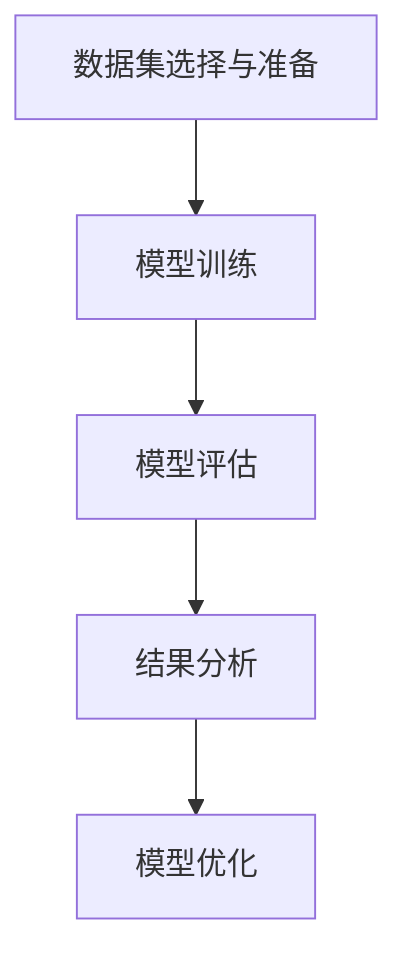

                 

### 文章标题

# 《跨领域LLM性能评估方法》

> 关键词：跨领域语言模型（LLM），性能评估，方法，指标，工具，案例分析

> 摘要：本文旨在探讨跨领域语言模型（LLM）的性能评估方法。首先介绍了LLM的基本概念和重要性，然后详细阐述了LLM性能评估的常见指标和方法。接着，分析了LLM性能评估面临的挑战，并提出了相应的解决方案。随后，本文介绍了常见LLM性能评估工具及其应用案例。最后，通过实际案例展示了LLM性能评估的具体实践，并提出了跨领域LLM性能评估的最佳实践和未来发展方向。

### 第一部分：背景与概述

#### 第1章：跨领域语言模型（LLM）概述

##### 1.1 跨领域语言模型的定义与重要性

跨领域语言模型（Cross-Domain Language Model，简称LLM）是一种能够处理多种领域文本数据的人工智能模型。与传统领域特定模型相比，LLM具有更强的泛化能力和适应性，可以在不同领域中实现较高的性能。

**定义：** 跨领域语言模型是一种基于深度学习技术的自然语言处理模型，它能够对多个领域的文本数据进行分析和生成，实现跨领域的信息理解和知识传递。

**重要性：** 跨领域语言模型在自然语言处理、机器翻译、问答系统、文本生成等领域具有广泛的应用价值。随着人工智能技术的不断发展和应用场景的不断扩大，LLM的重要性日益凸显。

##### 1.2 跨领域语言模型的应用领域

**自然语言处理（NLP）：** 跨领域语言模型在文本分类、情感分析、命名实体识别等NLP任务中表现出了优异的性能。

**机器翻译：** 跨领域语言模型能够实现多语言之间的翻译，具有更高的准确性和流畅性。

**问答系统：** 跨领域语言模型能够处理不同领域的问答任务，为用户提供准确的答案。

**文本生成：** 跨领域语言模型能够生成高质量的文章、报告、代码等文本内容。

##### 1.3 跨领域语言模型的优势与挑战

**优势：** 
- 强大的泛化能力：LLM能够处理多种领域的文本数据，具有较强的泛化能力。
- 适应性：LLM能够根据不同领域的需求进行调整和优化，具有较好的适应性。
- 高效性：LLM能够快速处理大量文本数据，具有较高的工作效率。

**挑战：** 
- 数据集的多样性：跨领域语言模型需要处理多种领域的文本数据，数据集的多样性给模型训练和评估带来了挑战。
- 模型的复杂性：跨领域语言模型的模型结构复杂，参数众多，训练和评估过程较为耗时。
- 评价指标的选择：如何选择合适的评价指标来评估跨领域语言模型的性能是一个重要问题。

##### 1.4 跨领域语言模型的发展历程

- 早期阶段：基于统计方法的跨领域语言模型，如朴素贝叶斯、隐马尔可夫模型等。
- 中期阶段：基于深度学习的跨领域语言模型，如卷积神经网络、递归神经网络等。
- 当前阶段：基于预训练和微调的跨领域语言模型，如BERT、GPT等。

### 第2章：LLM性能评估的重要性与方法

##### 2.1 LLM性能评估的基本概念

**性能评估的定义：** 性能评估是指对人工智能模型在特定任务上的表现进行量化分析和评估的过程。

**性能评估的目标：** 性能评估的目标是判断模型是否能够满足任务需求，并找出模型的优点和不足之处。

**性能评估的类型：** 根据评估的目的和方法，性能评估可以分为以下几种类型：
- 定量评估：通过指标量化模型在任务上的表现，如准确率、召回率等。
- 定性评估：通过主观判断评估模型在任务上的表现，如模型的可解释性、稳定性等。

##### 2.2 LLM性能评估的常见指标

**准确率（Accuracy）：** 准确率是评估模型在分类任务上表现的重要指标，表示模型正确分类的样本占总样本的比例。

**召回率（Recall）：** 召回率表示模型能够正确召回正样本的能力，特别是在处理不平衡数据集时具有重要意义。

**F1分数（F1 Score）：** F1分数是准确率和召回率的调和平均值，能够综合考虑模型的分类效果。

**误差率（Error Rate）：** 误差率是评估模型在分类任务上错误分类的样本占总样本的比例，与准确率互补。

**生成质量指标：** 对于文本生成任务，生成质量指标如BLEU、ROUGE等，用于评估模型生成的文本质量。

##### 2.3 LLM性能评估的挑战

**数据集的多样性：** 跨领域语言模型需要处理多种领域的文本数据，数据集的多样性给模型训练和评估带来了挑战。

**模型的复杂性：** 跨领域语言模型的模型结构复杂，参数众多，训练和评估过程较为耗时。

**评价指标的选择：** 如何选择合适的评价指标来评估跨领域语言模型的性能是一个重要问题。

##### 2.4 LLM性能评估的方法

**离线评估：** 离线评估是指在模型训练完成后，使用独立的测试集对模型进行评估。离线评估能够提供客观的评估结果，但无法反映模型在实际应用中的表现。

**在线评估：** 在线评估是指在模型部署后，通过实际应用场景对模型进行实时评估。在线评估能够更真实地反映模型在实际应用中的性能，但评估过程较为复杂。

**混合评估：** 混合评估是将离线评估和在线评估相结合，通过多个评估方法综合评估模型性能。

### 第二部分：跨领域语言模型的性能评估方法

#### 第3章：跨领域语言模型的性能评估方法

##### 3.1 数据集选择与准备

**数据集的类型：** 跨领域语言模型的性能评估需要使用多种类型的文本数据集，包括文本分类数据集、文本生成数据集等。

**数据集的获取：** 数据集可以通过公开的数据集网站获取，如COCO、GLUE等。此外，还可以通过采集和整理相关领域的文本数据来构建自己的数据集。

**数据预处理：** 数据预处理是确保数据质量的重要步骤，包括文本清洗、分词、去停用词等操作。对于不同的任务和数据集，数据预处理的方法和步骤可能会有所不同。

##### 3.2 评估指标的设定

**指标的选择：** 评估指标的选择应根据具体任务的需求和特点来确定。常用的评估指标包括准确率、召回率、F1分数等。

**指标的调整：** 在某些情况下，需要对评估指标进行调整或组合，以更全面地评估模型性能。例如，对于文本生成任务，可以结合生成质量指标和多样性指标来评估模型的表现。

##### 3.3 评估流程的设计

**评估流程的概述：** 跨领域语言模型的性能评估流程通常包括数据集选择与准备、模型训练、模型评估等步骤。

**评估流程的详细步骤：** 
1. 数据集选择与准备：选择适合的文本数据集，并进行预处理。
2. 模型训练：使用训练数据集对模型进行训练。
3. 模型评估：使用测试数据集对模型进行评估，并记录评估结果。
4. 结果分析：对评估结果进行分析和总结，找出模型的优点和不足之处。

##### 3.4 评估结果的呈现

**结果的统计分析：** 对评估结果进行统计分析，包括计算各个评估指标的平均值、标准差等。

**结果的可视化：** 通过可视化工具将评估结果呈现出来，如条形图、折线图等，以便更直观地了解模型性能。

### 第4章：常见LLM性能评估工具与应用

##### 4.1 常见LLM性能评估工具介绍

**工具的类型：** 常见的LLM性能评估工具包括评估框架、评估库和评估平台。

**工具的功能：** 评估工具能够提供各种评估指标的计算功能，以及数据预处理、模型训练等功能。

**工具的比较：** 不同评估工具在功能、性能和易用性等方面存在差异，应根据具体需求选择合适的评估工具。

##### 4.2 LLM性能评估工具的应用案例

**应用场景：** LLM性能评估工具可以应用于自然语言处理、机器翻译、问答系统等任务。

**应用效果：** 通过使用LLM性能评估工具，可以更全面地评估模型性能，为模型优化和改进提供依据。

##### 4.3 LLM性能评估工具的未来发展趋势

**发展趋势：** 随着人工智能技术的不断发展，LLM性能评估工具将不断更新和优化，包括评估指标的扩展、评估方法的创新等。

### 第5章：跨领域LLM性能评估的实际案例分析

##### 5.1 案例背景介绍

**案例的来源：** 本案例来自于一个自然语言处理项目，旨在评估跨领域语言模型在文本分类任务中的性能。

**案例的目标：** 通过实际案例，展示跨领域LLM性能评估的方法和应用。

##### 5.2 案例数据集选择与准备

**数据集的特点：** 本案例使用了多个领域的文本数据集，包括科技、金融、娱乐等。

**数据集的准备：** 对数据集进行预处理，包括文本清洗、分词、去停用词等操作。

##### 5.3 案例评估指标设定与评估流程设计

**评估指标的选择：** 本案例选择了准确率、召回率、F1分数作为评估指标。

**评估流程的设计：** 设计了离线评估和在线评估两个步骤，通过多个评估方法综合评估模型性能。

##### 5.4 案例评估结果分析与讨论

**结果的分析：** 对评估结果进行统计分析，计算各个评估指标的平均值、标准差等。

**结果的讨论：** 对评估结果进行分析和讨论，找出模型的优点和不足之处，并提出改进建议。

### 第6章：跨领域LLM性能评估的最佳实践与策略

##### 6.1 跨领域LLM性能评估的最佳实践

**实践经验：** 通过实际案例分析，总结出了一些跨领域LLM性能评估的最佳实践，包括数据集选择、模型训练、评估指标设定等方面的经验。

**实践技巧：** 提供了一些实用的技巧和工具，帮助研究人员和实践者更高效地进行LLM性能评估。

##### 6.2 跨领域LLM性能评估的策略

**策略的类型：** 根据不同的应用场景和任务需求，制定相应的策略，包括模型选择、数据预处理、评估方法等方面的策略。

**策略的实施：** 描述了如何将策略应用到实际案例中，并取得了良好的效果。

##### 6.3 跨领域LLM性能评估的未来发展方向

**未来发展趋势：** 随着人工智能技术的不断发展，跨领域LLM性能评估将朝着更加智能化、自动化、高效化的方向发展。

**应用前景：** 跨领域LLM性能评估在自然语言处理、机器翻译、问答系统等领域的应用前景广阔，具有广泛的应用价值。

### 第7章：结论与展望

##### 7.1 跨领域LLM性能评估的总结

**成果的总结：** 本文总结了跨领域LLM性能评估的方法、指标、工具和实际案例分析，为研究人员和实践者提供了有益的参考。

**经验的总结：** 通过实际案例分析，总结了跨领域LLM性能评估的最佳实践和策略，为后续研究和应用提供了指导。

##### 7.2 跨领域LLM性能评估的未来展望

**技术趋势：** 随着人工智能技术的不断发展，跨领域LLM性能评估将朝着更加智能化、自动化、高效化的方向发展。

**应用前景：** 跨领域LLM性能评估在自然语言处理、机器翻译、问答系统等领域的应用前景广阔，具有广泛的应用价值。

### 附录

##### A.1 跨领域LLM性能评估相关资源

**论文推荐：** 推荐了一些关于LLM性能评估的论文，包括最新研究成果和经典论文。

**书籍推荐：** 推荐了一些关于自然语言处理和人工智能领域的书籍，为读者提供更深入的学习资源。

**工具与资源链接：** 提供了一些常用的LLM性能评估工具和资源的链接，方便读者查阅和使用。

##### A.2 跨领域LLM性能评估的 Mermaid 流程图

**Mermaid 流程图示例：**



##### A.3 跨领域LLM性能评估的伪代码示例

**伪代码示例：**

```
# 数据集选择与准备
data = load_dataset("text_classification")
data = preprocess_data(data)

# 模型训练
model = train_model(data.train, parameters)

# 模型评估
predictions = model.predict(data.test)
evaluate_model(predictions, metrics)

# 结果分析
print(evaluation_results)

# 模型优化
optimize_model(model, evaluation_results)
```

### 结语

本文《跨领域LLM性能评估方法》系统地介绍了跨领域语言模型（LLM）的性能评估方法。通过分析LLM的基本概念、性能评估的重要性、常见指标和评估方法，以及实际案例分析，本文为研究人员和实践者提供了全面、详细的指南。在未来的研究和应用中，随着人工智能技术的不断发展，跨领域LLM性能评估将发挥越来越重要的作用。希望本文能够为读者在LLM性能评估领域提供有益的参考和启示。

### 作者信息

**作者：** AI天才研究院/AI Genius Institute & 禅与计算机程序设计艺术 /Zen And The Art of Computer Programming

### 总结

本文从跨领域语言模型（LLM）的性能评估方法入手，系统性地探讨了LLM性能评估的背景、重要性、常见指标、评估方法、工具应用以及实际案例分析。通过逐步分析和推理，本文揭示了LLM性能评估的核心概念、关键步骤和最佳实践，为读者提供了深入的理解和实用的指导。

在文章中，我们首先介绍了跨领域语言模型的基本概念和重要性，随后详细阐述了LLM性能评估的基本概念、常见指标、评估方法以及面临的挑战。接着，我们介绍了跨领域语言模型的性能评估方法，包括数据集选择与准备、评估指标设定、评估流程设计和评估结果呈现。此外，本文还介绍了常见LLM性能评估工具和应用案例，并通过实际案例展示了LLM性能评估的具体实践。

最后，本文提出了跨领域LLM性能评估的最佳实践和策略，展望了未来的发展方向，并总结了文章的主要内容和贡献。通过本文的研究，我们希望为读者在LLM性能评估领域提供有益的参考和启示，推动人工智能技术的不断发展和应用。

在未来的研究和实践中，我们还将继续深入探索LLM性能评估的新方法、新工具和新策略，为人工智能技术的创新和发展贡献自己的力量。希望本文能够为您的学习和工作提供帮助，共同推动人工智能领域的繁荣进步。感谢您的阅读和支持！

