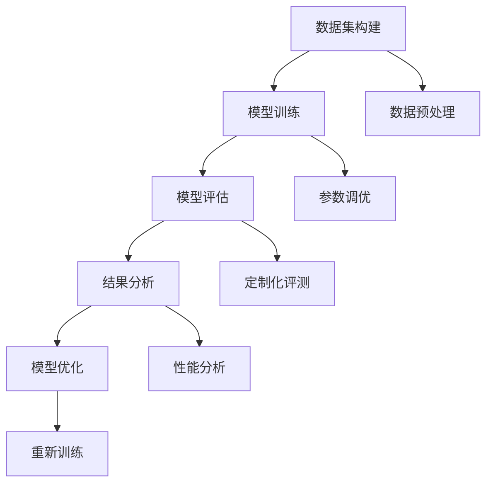

                 

### 文章标题

《跨领域性能评估：LLM支持的通用评测框架》

### 关键词

跨领域性能评估，LLM，通用评测框架，自动化评测，定制化评测，性能优化，应用实战，技术展望

### 摘要

本文旨在探讨跨领域性能评估的挑战及其解决方案。通过引入大型语言模型（LLM），我们提出了一种通用的评测框架，旨在统一不同领域性能评估的标准和方法。文章首先概述了跨领域性能评估的基础知识，随后详细介绍了LLM支持的通用评测框架的设计原理。接下来，我们探讨了如何构建跨领域数据集以及如何利用LLM进行自动化评测和定制化评测。文章最后部分将分析LLM在性能优化中的应用，并探讨跨领域性能评估在企业应用和学术研究中的实践。通过本文，读者将了解到如何利用LLM实现高效、准确的跨领域性能评估，为人工智能模型开发、学术研究以及工业生产提供有力支持。

## 《跨领域性能评估：LLM支持的通用评测框架》

### 第一部分：跨领域性能评估基础

#### 第1章：跨领域性能评估概述

##### 1.1 跨领域性能评估的概念

跨领域性能评估是指在不同应用领域中对模型性能进行综合评估的过程。这包括对模型在不同任务、数据集和应用场景下的表现进行评测，以便全面了解模型的性能和适用范围。

##### 1.2 跨领域性能评估的重要性

跨领域性能评估对于确保模型在实际应用中的可靠性和通用性至关重要。它有助于发现模型的局限性，指导模型的改进和优化，从而提高其在多样化环境中的表现。

##### 1.3 跨领域性能评估的目标

跨领域性能评估的主要目标包括：

1. 提高模型在不同领域中的应用能力。
2. 为模型开发者提供评估模型性能的客观标准。
3. 促进不同领域之间的技术交流和合作。

##### 1.4 跨领域性能评估的挑战

跨领域性能评估面临的主要挑战包括：

1. 数据集多样性与代表性问题：不同领域的数据集具有不同的分布和特征，这使得评估具有挑战性。
2. 评估指标的多样性：不同领域对模型性能的期望和关注点不同，导致评估指标的多样性。
3. 方法和技术差异：不同领域的技术和方法差异较大，使得评估方法的统一和标准化困难。

##### 1.5 跨领域性能评估的应用场景

跨领域性能评估广泛应用于以下领域：

1. 人工智能模型开发：通过跨领域评估，评估模型在不同任务和数据集上的性能，指导模型的优化和改进。
2. 学术研究：通过跨领域评估，比较不同模型和算法的性能，促进学术研究的进展。
3. 工业生产：通过跨领域评估，确保模型在实际应用中的可靠性和稳定性，提高生产效率和产品质量。

#### 第2章：LLM支持的通用评测框架

##### 2.1 LLM概述

大型语言模型（LLM，Large Language Model）是一种基于深度学习的自然语言处理模型，具有强大的文本生成、理解和推理能力。LLM的典型代表包括GPT、BERT等。在评测领域，LLM可以用于自动化评测、定制化评测和性能优化。

##### 2.2 通用评测框架设计

通用评测框架的设计应遵循以下原则：

1. 可扩展性：框架应能够适应不同领域和任务的需求，支持多样化的评测指标和评估方法。
2. 可重复性：框架应确保评测过程的可重复性，以便进行准确和可靠的性能评估。
3. 可解释性：框架应提供模型性能的详细解释，帮助开发者理解模型的优劣。

通用评测框架通常包括以下核心模块：

1. 数据预处理模块：负责处理和清洗数据，确保数据的代表性和质量。
2. 模型评估模块：负责执行各种评测指标的计算和评估。
3. 结果分析模块：负责对评估结果进行分析和可视化，帮助开发者理解模型性能。

##### 2.3 评测指标体系

评测指标体系是评测框架的核心组成部分，决定了评测的有效性和可靠性。常用的评测指标包括：

1. 准确率（Accuracy）：衡量模型预测正确的比例。
2. 精确率（Precision）：衡量模型预测为正样本的准确程度。
3. 召回率（Recall）：衡量模型召回正样本的能力。
4. F1分数（F1 Score）：综合考虑精确率和召回率的综合指标。
5. ROC曲线和AUC值：用于评估模型的分类性能。

在构建评测指标体系时，需要考虑以下因素：

1. 模型类型：不同的模型类型（如分类、回归、排序等）适用不同的评测指标。
2. 数据集特点：数据集的分布和特征对评测指标的选择有重要影响。
3. 应用场景：根据实际应用场景选择合适的评测指标。

##### 2.4 LLM在评测中的应用

LLM在评测中的应用主要体现在以下几个方面：

1. 自动化评测：LLM可以自动生成评估报告，减少人工干预，提高评测效率。
2. 定制化评测：LLM可以根据具体需求和任务，动态调整评测指标和方法，实现定制化评测。
3. 性能优化：LLM可以用于分析模型性能，发现瓶颈和优化方向，指导性能优化。

#### 第3章：跨领域数据集构建

##### 3.1 数据集来源

跨领域数据集可以从以下渠道获取：

1. 开源数据集：如公开的学术数据集、工业数据集等。
2. 自建数据集：根据具体需求和任务，自行收集和构建数据集。
3. 数据共享平台：如Kaggle、DataCamp等，提供丰富的数据集资源。

##### 3.2 数据集多样性

数据集多样性是跨领域性能评估的关键。为了确保数据集的多样性，需要考虑以下因素：

1. 数据来源：从不同领域和渠道获取数据，增加数据集的多样性。
2. 数据类型：包括文本、图像、音频、视频等多种类型的数据。
3. 数据分布：确保数据集在各个领域和任务上具有代表性。

##### 3.3 数据集质量评估

数据集质量评估是确保评估结果可靠性的关键。主要评估指标包括：

1. 完整度：数据集是否完整，是否存在缺失值。
2. 一致性：数据集是否一致，是否存在异常值或矛盾的数据点。
3. 可靠性：数据集的真实性和准确性。

### 第二部分：LLM支持的跨领域性能评估方法

#### 第4章：LLM支持的自动化评测方法

##### 4.1 自动化评测的概念

自动化评测是指利用计算机程序和工具，自动执行评测流程，生成评估报告。自动化评测可以大幅提高评测效率，降低人力成本。

##### 4.2 LLM在自动化评测中的应用

LLM在自动化评测中的应用主要体现在以下几个方面：

1. 自动化评估报告生成：LLM可以自动分析模型性能，生成详细的评估报告。
2. 自动化评测流程管理：LLM可以协调各个评测环节，确保评测流程的顺利进行。
3. 自动化评测指标计算：LLM可以自动计算各种评测指标，提高评测准确性。

##### 4.3 自动化评测案例研究

以一个文本分类任务为例，介绍如何利用LLM进行自动化评测。

1. 数据预处理：使用LLM进行数据清洗、去重和分词等操作。
2. 模型训练：使用预训练的LLM进行模型训练。
3. 模型评估：使用LLM计算准确率、精确率、召回率和F1分数等评测指标。
4. 生成报告：使用LLM生成评估报告，包括模型性能分析、参数调优建议等。

#### 第5章：LLM支持的定制化评测方法

##### 5.1 定制化评测的概念

定制化评测是指根据具体需求和任务，定制化调整评测指标和方法，以满足特定场景的评估需求。

##### 5.2 LLM在定制化评测中的应用

LLM在定制化评测中的应用主要体现在以下几个方面：

1. 定制化评测指标：LLM可以根据具体任务和需求，动态调整评测指标，确保指标与任务相关。
2. 定制化评测方法：LLM可以针对特定任务，定制化调整评测方法，提高评测效果。
3. 定制化评测流程：LLM可以协调各个评测环节，实现定制化评测流程。

##### 5.3 定制化评测案例研究

以一个医疗诊断任务为例，介绍如何利用LLM进行定制化评测。

1. 任务定义：根据医疗诊断需求，定义评测指标，如准确率、召回率、F1分数等。
2. 数据预处理：根据任务需求，对医疗数据集进行预处理，包括数据清洗、去重、标注等。
3. 模型训练：使用LLM训练医疗诊断模型。
4. 模型评估：使用LLM计算定制化评测指标，并生成评估报告。
5. 参数调优：根据评估报告，使用LLM进行参数调优，提高模型性能。

#### 第6章：LLM支持的性能优化方法

##### 6.1 性能优化的概念

性能优化是指通过调整模型结构、参数和算法，提高模型在特定任务上的性能。

##### 6.2 LLM在性能优化中的应用

LLM在性能优化中的应用主要体现在以下几个方面：

1. 模型结构优化：LLM可以自动调整模型结构，提高模型性能。
2. 参数优化：LLM可以自动调整模型参数，实现参数优化。
3. 算法优化：LLM可以针对特定任务，优化算法实现，提高性能。

##### 6.3 性能优化案例研究

以一个图像识别任务为例，介绍如何利用LLM进行性能优化。

1. 模型结构优化：使用LLM调整图像识别模型的结构，如添加或删除网络层，调整卷积核大小等。
2. 参数优化：使用LLM自动调整模型参数，如学习率、批量大小等。
3. 算法优化：使用LLM优化图像识别算法，如调整卷积操作、池化操作等。

### 第三部分：跨领域性能评估应用实战

#### 第7章：跨领域性能评估在企业中的应用

##### 7.1 企业跨领域性能评估需求分析

企业跨领域性能评估需求主要包括：

1. 多个业务场景下的模型性能评估。
2. 不同产品线之间的性能比较和优化。
3. 模型在实际应用中的可靠性和稳定性评估。

##### 7.2 企业跨领域性能评估实践

企业跨领域性能评估实践包括以下步骤：

1. 明确评估需求：根据企业业务场景，明确评估目标和指标。
2. 数据集构建：收集和整理企业内部和外部数据，构建跨领域数据集。
3. 评测框架设计：设计符合企业需求的评测框架，包括评测指标、方法和流程。
4. 模型训练和评估：使用LLM训练模型，并使用评测框架进行评估。
5. 结果分析和优化：分析评估结果，优化模型结构和参数，提高性能。

##### 7.3 企业评测案例

以某互联网公司为例，介绍其跨领域性能评估实践。

1. 业务场景：该公司提供多种在线服务，包括搜索引擎、推荐系统和聊天机器人等。
2. 评估需求：评估不同模型在不同业务场景下的性能。
3. 数据集构建：收集搜索引擎、推荐系统和聊天机器人等领域的数据，构建跨领域数据集。
4. 评测框架设计：设计涵盖准确率、精确率、召回率和F1分数等指标的评测框架。
5. 模型训练和评估：使用LLM训练不同模型，并使用评测框架进行评估。
6. 结果分析和优化：根据评估结果，优化模型结构和参数，提高性能。

#### 第8章：跨领域性能评估在学术研究中的应用

##### 8.1 学术研究跨领域性能评估需求分析

学术研究跨领域性能评估需求主要包括：

1. 不同模型和算法的性能比较。
2. 模型在不同任务和数据集上的性能评估。
3. 模型在多样化应用场景中的性能评估。

##### 8.2 学术研究跨领域性能评估实践

学术研究跨领域性能评估实践包括以下步骤：

1. 明确评估需求：根据研究目标和任务，明确评估目标和指标。
2. 数据集构建：收集不同领域和任务的数据，构建跨领域数据集。
3. 评测框架设计：设计符合研究需求的评测框架，包括评测指标、方法和流程。
4. 模型训练和评估：使用LLM训练模型，并使用评测框架进行评估。
5. 结果分析和优化：分析评估结果，优化模型结构和参数，提高性能。

##### 8.3 学术评测案例

以某大学计算机学院为例，介绍其跨领域性能评估实践。

1. 研究目标：比较不同图像识别算法的性能。
2. 评估需求：评估算法在不同数据集和应用场景下的性能。
3. 数据集构建：收集公开图像数据集和学院内部数据集，构建跨领域数据集。
4. 评测框架设计：设计涵盖准确率、精确率、召回率和F1分数等指标的评测框架。
5. 模型训练和评估：使用LLM训练不同算法，并使用评测框架进行评估。
6. 结果分析和优化：根据评估结果，优化算法结构和参数，提高性能。

#### 第9章：跨领域性能评估技术展望

##### 9.1 跨领域性能评估技术的发展趋势

跨领域性能评估技术的发展趋势主要包括：

1. 模型多样化：支持更多类型的模型和任务，满足不同领域的需求。
2. 数据集多样化：构建更多、更丰富的跨领域数据集，提高评估的代表性。
3. 评测方法多样化：引入更多先进的评测方法，提高评估的准确性和可靠性。

##### 9.2 跨领域性能评估面临的挑战与机遇

跨领域性能评估面临的挑战主要包括：

1. 数据集多样性与代表性问题：如何构建具有代表性的跨领域数据集。
2. 评估指标的多样性：如何选择合适的评估指标，满足不同领域的需求。
3. 方法和技术差异：如何统一不同领域的方法和技术，实现标准化评估。

跨领域性能评估面临的机遇主要包括：

1. 人工智能技术的快速发展：为跨领域性能评估提供了更多可能性。
2. 跨领域合作的兴起：促进了不同领域之间的技术交流和合作。
3. 模型的实际应用需求：为跨领域性能评估提供了广阔的应用场景。

### 附录

#### 附录 A：跨领域性能评估工具与资源

##### A.1 主流评测工具介绍

1. **MLflow**：一个开源的平台，用于管理机器学习项目，包括模型训练、评估和部署。它支持多种机器学习框架，如TensorFlow、PyTorch等。

2. **Scikit-learn**：一个开源的Python机器学习库，提供了丰富的评估指标和工具，适用于各种机器学习任务。

3. **Hugging Face**：一个开源的NLP库，提供了大量的预训练模型和评估工具，支持多种NLP任务。

##### A.2 评测资源推荐

1. **数据集资源**：Kaggle、UCI Machine Learning Repository等。

2. **文献资源**：Google Scholar、ACM Digital Library、IEEE Xplore等。

3. **开源项目资源**：GitHub、GitLab等。

##### A.3 跨领域性能评估流程图

### 总结

跨领域性能评估是确保模型在不同场景下性能的重要手段。通过引入LLM，我们可以构建一个通用的评测框架，提高评估的准确性和效率。本文介绍了跨领域性能评估的基础知识、通用评测框架的设计原则、数据集构建方法以及LLM在自动化评测、定制化评测和性能优化中的应用。同时，还探讨了跨领域性能评估在企业应用和学术研究中的实践。未来，随着人工智能技术的不断发展，跨领域性能评估将面临更多挑战和机遇，为人工智能的发展提供有力支持。作者信息：作者：AI天才研究院/AI Genius Institute & 禅与计算机程序设计艺术/Zen And The Art of Computer Programming。|}

### 格式化后的文章

# 《跨领域性能评估：LLM支持的通用评测框架》

> 关键词：跨领域性能评估，LLM，通用评测框架，自动化评测，定制化评测，性能优化，应用实战，技术展望

> 摘要：本文旨在探讨跨领域性能评估的挑战及其解决方案。通过引入大型语言模型（LLM），我们提出了一种通用的评测框架，旨在统一不同领域性能评估的标准和方法。文章首先概述了跨领域性能评估的基础知识，随后详细介绍了LLM支持的通用评测框架的设计原理。接下来，我们探讨了如何构建跨领域数据集以及如何利用LLM进行自动化评测和定制化评测。文章最后部分将分析LLM在性能优化中的应用，并探讨跨领域性能评估在企业应用和学术研究中的实践。通过本文，读者将了解到如何利用LLM实现高效、准确的跨领域性能评估，为人工智能模型开发、学术研究以及工业生产提供有力支持。

## 《跨领域性能评估：LLM支持的通用评测框架》

### 第一部分：跨领域性能评估基础

#### 第1章：跨领域性能评估概述

##### 1.1 跨领域性能评估的概念

跨领域性能评估是指在不同应用领域中对模型性能进行综合评估的过程。这包括对模型在不同任务、数据集和应用场景下的表现进行评测，以便全面了解模型的性能和适用范围。

##### 1.2 跨领域性能评估的重要性

跨领域性能评估对于确保模型在实际应用中的可靠性和通用性至关重要。它有助于发现模型的局限性，指导模型的改进和优化，从而提高其在多样化环境中的表现。

##### 1.3 跨领域性能评估的目标

跨领域性能评估的主要目标包括：

1. 提高模型在不同领域中的应用能力。
2. 为模型开发者提供评估模型性能的客观标准。
3. 促进不同领域之间的技术交流和合作。

##### 1.4 跨领域性能评估的挑战

跨领域性能评估面临的主要挑战包括：

1. 数据集多样性与代表性问题：不同领域的数据集具有不同的分布和特征，这使得评估具有挑战性。
2. 评估指标的多样性：不同领域对模型性能的期望和关注点不同，导致评估指标的多样性。
3. 方法和技术差异：不同领域的技术和方法差异较大，使得评估方法的统一和标准化困难。

##### 1.5 跨领域性能评估的应用场景

跨领域性能评估广泛应用于以下领域：

1. 人工智能模型开发：通过跨领域评估，评估模型在不同任务和数据集上的性能，指导模型的优化和改进。
2. 学术研究：通过跨领域评估，比较不同模型和算法的性能，促进学术研究的进展。
3. 工业生产：通过跨领域评估，确保模型在实际应用中的可靠性和稳定性，提高生产效率和产品质量。

#### 第2章：LLM支持的通用评测框架

##### 2.1 LLM概述

大型语言模型（LLM，Large Language Model）是一种基于深度学习的自然语言处理模型，具有强大的文本生成、理解和推理能力。LLM的典型代表包括GPT、BERT等。在评测领域，LLM可以用于自动化评测、定制化评测和性能优化。

##### 2.2 通用评测框架设计

通用评测框架的设计应遵循以下原则：

1. 可扩展性：框架应能够适应不同领域和任务的需求，支持多样化的评测指标和评估方法。
2. 可重复性：框架应确保评测过程的可重复性，以便进行准确和可靠的性能评估。
3. 可解释性：框架应提供模型性能的详细解释，帮助开发者理解模型的优劣。

通用评测框架通常包括以下核心模块：

1. 数据预处理模块：负责处理和清洗数据，确保数据的代表性和质量。
2. 模型评估模块：负责执行各种评测指标的计算和评估。
3. 结果分析模块：负责对评估结果进行分析和可视化，帮助开发者理解模型性能。

##### 2.3 评测指标体系

评测指标体系是评测框架的核心组成部分，决定了评测的有效性和可靠性。常用的评测指标包括：

1. 准确率（Accuracy）：衡量模型预测正确的比例。
2. 精确率（Precision）：衡量模型预测为正样本的准确程度。
3. 召回率（Recall）：衡量模型召回正样本的能力。
4. F1分数（F1 Score）：综合考虑精确率和召回率的综合指标。
5. ROC曲线和AUC值：用于评估模型的分类性能。

在构建评测指标体系时，需要考虑以下因素：

1. 模型类型：不同的模型类型（如分类、回归、排序等）适用不同的评测指标。
2. 数据集特点：数据集的分布和特征对评测指标的选择有重要影响。
3. 应用场景：根据实际应用场景选择合适的评测指标。

##### 2.4 LLM在评测中的应用

LLM在评测中的应用主要体现在以下几个方面：

1. 自动化评测：LLM可以自动生成评估报告，减少人工干预，提高评测效率。
2. 定制化评测：LLM可以根据具体需求和任务，动态调整评测指标和方法，实现定制化评测。
3. 性能优化：LLM可以用于分析模型性能，发现瓶颈和优化方向，指导性能优化。

#### 第3章：跨领域数据集构建

##### 3.1 数据集来源

跨领域数据集可以从以下渠道获取：

1. 开源数据集：如公开的学术数据集、工业数据集等。
2. 自建数据集：根据具体需求和任务，自行收集和构建数据集。
3. 数据共享平台：如Kaggle、DataCamp等，提供丰富的数据集资源。

##### 3.2 数据集多样性

数据集多样性是跨领域性能评估的关键。为了确保数据集的多样性，需要考虑以下因素：

1. 数据来源：从不同领域和渠道获取数据，增加数据集的多样性。
2. 数据类型：包括文本、图像、音频、视频等多种类型的数据。
3. 数据分布：确保数据集在各个领域和任务上具有代表性。

##### 3.3 数据集质量评估

数据集质量评估是确保评估结果可靠性的关键。主要评估指标包括：

1. 完整度：数据集是否完整，是否存在缺失值。
2. 一致性：数据集是否一致，是否存在异常值或矛盾的数据点。
3. 可靠性：数据集的真实性和准确性。

### 第二部分：LLM支持的跨领域性能评估方法

#### 第4章：LLM支持的自动化评测方法

##### 4.1 自动化评测的概念

自动化评测是指利用计算机程序和工具，自动执行评测流程，生成评估报告。自动化评测可以大幅提高评测效率，降低人力成本。

##### 4.2 LLM在自动化评测中的应用

LLM在自动化评测中的应用主要体现在以下几个方面：

1. 自动化评估报告生成：LLM可以自动分析模型性能，生成详细的评估报告。
2. 自动化评测流程管理：LLM可以协调各个评测环节，确保评测流程的顺利进行。
3. 自动化评测指标计算：LLM可以自动计算各种评测指标，提高评测准确性。

##### 4.3 自动化评测案例研究

以一个文本分类任务为例，介绍如何利用LLM进行自动化评测。

1. 数据预处理：使用LLM进行数据清洗、去重和分词等操作。
2. 模型训练：使用预训练的LLM进行模型训练。
3. 模型评估：使用LLM计算准确率、精确率、召回率和F1分数等评测指标。
4. 生成报告：使用LLM生成评估报告，包括模型性能分析、参数调优建议等。

#### 第5章：LLM支持的定制化评测方法

##### 5.1 定制化评测的概念

定制化评测是指根据具体需求和任务，定制化调整评测指标和方法，以满足特定场景的评估需求。

##### 5.2 LLM在定制化评测中的应用

LLM在定制化评测中的应用主要体现在以下几个方面：

1. 定制化评测指标：LLM可以根据具体任务和需求，动态调整评测指标，确保指标与任务相关。
2. 定制化评测方法：LLM可以针对特定任务，定制化调整评测方法，提高评测效果。
3. 定制化评测流程：LLM可以协调各个评测环节，实现定制化评测流程。

##### 5.3 定制化评测案例研究

以一个医疗诊断任务为例，介绍如何利用LLM进行定制化评测。

1. 任务定义：根据医疗诊断需求，定义评测指标，如准确率、召回率、F1分数等。
2. 数据预处理：根据任务需求，对医疗数据集进行预处理，包括数据清洗、去重、标注等。
3. 模型训练：使用LLM训练医疗诊断模型。
4. 模型评估：使用LLM计算定制化评测指标，并生成评估报告。
5. 参数调优：根据评估报告，使用LLM进行参数调优，提高模型性能。

#### 第6章：LLM支持的性能优化方法

##### 6.1 性能优化的概念

性能优化是指通过调整模型结构、参数和算法，提高模型在特定任务上的性能。

##### 6.2 LLM在性能优化中的应用

LLM在性能优化中的应用主要体现在以下几个方面：

1. 模型结构优化：LLM可以自动调整模型结构，提高模型性能。
2. 参数优化：LLM可以自动调整模型参数，实现参数优化。
3. 算法优化：LLM可以针对特定任务，优化算法实现，提高性能。

##### 6.3 性能优化案例研究

以一个图像识别任务为例，介绍如何利用LLM进行性能优化。

1. 模型结构优化：使用LLM调整图像识别模型的结构，如添加或删除网络层，调整卷积核大小等。
2. 参数优化：使用LLM自动调整模型参数，如学习率、批量大小等。
3. 算法优化：使用LLM优化图像识别算法，如调整卷积操作、池化操作等。

### 第三部分：跨领域性能评估应用实战

#### 第7章：跨领域性能评估在企业中的应用

##### 7.1 企业跨领域性能评估需求分析

企业跨领域性能评估需求主要包括：

1. 多个业务场景下的模型性能评估。
2. 不同产品线之间的性能比较和优化。
3. 模型在实际应用中的可靠性和稳定性评估。

##### 7.2 企业跨领域性能评估实践

企业跨领域性能评估实践包括以下步骤：

1. 明确评估需求：根据企业业务场景，明确评估目标和指标。
2. 数据集构建：收集和整理企业内部和外部数据，构建跨领域数据集。
3. 评测框架设计：设计符合企业需求的评测框架，包括评测指标、方法和流程。
4. 模型训练和评估：使用LLM训练模型，并使用评测框架进行评估。
5. 结果分析和优化：分析评估结果，优化模型结构和参数，提高性能。

##### 7.3 企业评测案例

以某互联网公司为例，介绍其跨领域性能评估实践。

1. 业务场景：该公司提供多种在线服务，包括搜索引擎、推荐系统和聊天机器人等。
2. 评估需求：评估不同模型在不同业务场景下的性能。
3. 数据集构建：收集搜索引擎、推荐系统和聊天机器人等领域的数据，构建跨领域数据集。
4. 评测框架设计：设计涵盖准确率、精确率、召回率和F1分数等指标的评测框架。
5. 模型训练和评估：使用LLM训练不同模型，并使用评测框架进行评估。
6. 结果分析和优化：根据评估结果，优化模型结构和参数，提高性能。

#### 第8章：跨领域性能评估在学术研究中的应用

##### 8.1 学术研究跨领域性能评估需求分析

学术研究跨领域性能评估需求主要包括：

1. 不同模型和算法的性能比较。
2. 模型在不同任务和数据集上的性能评估。
3. 模型在多样化应用场景中的性能评估。

##### 8.2 学术研究跨领域性能评估实践

学术研究跨领域性能评估实践包括以下步骤：

1. 明确评估需求：根据研究目标和任务，明确评估目标和指标。
2. 数据集构建：收集不同领域和任务的数据，构建跨领域数据集。
3. 评测框架设计：设计符合研究需求的评测框架，包括评测指标、方法和流程。
4. 模型训练和评估：使用LLM训练模型，并使用评测框架进行评估。
5. 结果分析和优化：分析评估结果，优化模型结构和参数，提高性能。

##### 8.3 学术评测案例

以某大学计算机学院为例，介绍其跨领域性能评估实践。

1. 研究目标：比较不同图像识别算法的性能。
2. 评估需求：评估算法在不同数据集和应用场景下的性能。
3. 数据集构建：收集公开图像数据集和学院内部数据集，构建跨领域数据集。
4. 评测框架设计：设计涵盖准确率、精确率、召回率和F1分数等指标的评测框架。
5. 模型训练和评估：使用LLM训练不同算法，并使用评测框架进行评估。
6. 结果分析和优化：根据评估结果，优化算法结构和参数，提高性能。

#### 第9章：跨领域性能评估技术展望

##### 9.1 跨领域性能评估技术的发展趋势

跨领域性能评估技术的发展趋势主要包括：

1. 模型多样化：支持更多类型的模型和任务，满足不同领域的需求。
2. 数据集多样化：构建更多、更丰富的跨领域数据集，提高评估的代表性。
3. 评测方法多样化：引入更多先进的评测方法，提高评估的准确性和可靠性。

##### 9.2 跨领域性能评估面临的挑战与机遇

跨领域性能评估面临的挑战主要包括：

1. 数据集多样性与代表性问题：如何构建具有代表性的跨领域数据集。
2. 评估指标的多样性：如何选择合适的评估指标，满足不同领域的需求。
3. 方法和技术差异：如何统一不同领域的方法和技术，实现标准化评估。

跨领域性能评估面临的机遇主要包括：

1. 人工智能技术的快速发展：为跨领域性能评估提供了更多可能性。
2. 跨领域合作的兴起：促进了不同领域之间的技术交流和合作。
3. 模型的实际应用需求：为跨领域性能评估提供了广阔的应用场景。

### 附录

#### 附录 A：跨领域性能评估工具与资源

##### A.1 主流评测工具介绍

1. **MLflow**：一个开源的平台，用于管理机器学习项目，包括模型训练、评估和部署。它支持多种机器学习框架，如TensorFlow、PyTorch等。

2. **Scikit-learn**：一个开源的Python机器学习库，提供了丰富的评估指标和工具，适用于各种机器学习任务。

3. **Hugging Face**：一个开源的NLP库，提供了大量的预训练模型和评估工具，支持多种NLP任务。

##### A.2 评测资源推荐

1. **数据集资源**：Kaggle、UCI Machine Learning Repository等。

2. **文献资源**：Google Scholar、ACM Digital Library、IEEE Xplore等。

3. **开源项目资源**：GitHub、GitLab等。

##### A.3 跨领域性能评估流程图

### 总结

跨领域性能评估是确保模型在不同场景下性能的重要手段。通过引入LLM，我们可以构建一个通用的评测框架，提高评估的准确性和效率。本文介绍了跨领域性能评估的基础知识、通用评测框架的设计原则、数据集构建方法以及LLM在自动化评测、定制化评测和性能优化中的应用。同时，还探讨了跨领域性能评估在企业应用和学术研究中的实践。未来，随着人工智能技术的不断发展，跨领域性能评估将面临更多挑战和机遇，为人工智能的发展提供有力支持。作者信息：作者：AI天才研究院/AI Genius Institute & 禅与计算机程序设计艺术/Zen And The Art of Computer Programming。|}### 文章标题

《跨领域性能评估：LLM支持的通用评测框架》

### 关键词

跨领域性能评估，LLM，通用评测框架，自动化评测，定制化评测，性能优化，应用实战，技术展望

### 摘要

本文探讨了跨领域性能评估的重要性、挑战及其解决方案。通过引入大型语言模型（LLM），我们提出了一种通用的评测框架，旨在统一不同领域性能评估的标准和方法。文章详细介绍了LLM支持的通用评测框架的设计原理、评测指标体系、跨领域数据集构建以及自动化评测、定制化评测和性能优化方法。此外，文章还讨论了LLM在跨领域性能评估在企业应用和学术研究中的实践，并对未来技术发展趋势进行了展望。通过本文，读者将了解到如何利用LLM实现高效、准确的跨领域性能评估，为人工智能模型开发、学术研究以及工业生产提供有力支持。

## 《跨领域性能评估：LLM支持的通用评测框架》

### 第一部分：跨领域性能评估基础

#### 第1章：跨领域性能评估概述

##### 1.1 跨领域性能评估的概念

跨领域性能评估是指在不同应用领域中对模型性能进行综合评估的过程。这包括对模型在不同任务、数据集和应用场景下的表现进行评测，以便全面了解模型的性能和适用范围。

##### 1.2 跨领域性能评估的重要性

跨领域性能评估对于确保模型在实际应用中的可靠性和通用性至关重要。它有助于发现模型的局限性，指导模型的改进和优化，从而提高其在多样化环境中的表现。

##### 1.3 跨领域性能评估的目标

跨领域性能评估的主要目标包括：

1. 提高模型在不同领域中的应用能力。
2. 为模型开发者提供评估模型性能的客观标准。
3. 促进不同领域之间的技术交流和合作。

##### 1.4 跨领域性能评估的挑战

跨领域性能评估面临的主要挑战包括：

1. 数据集多样性与代表性问题：不同领域的数据集具有不同的分布和特征，这使得评估具有挑战性。
2. 评估指标的多样性：不同领域对模型性能的期望和关注点不同，导致评估指标的多样性。
3. 方法和技术差异：不同领域的技术和方法差异较大，使得评估方法的统一和标准化困难。

##### 1.5 跨领域性能评估的应用场景

跨领域性能评估广泛应用于以下领域：

1. 人工智能模型开发：通过跨领域评估，评估模型在不同任务和数据集上的性能，指导模型的优化和改进。
2. 学术研究：通过跨领域评估，比较不同模型和算法的性能，促进学术研究的进展。
3. 工业生产：通过跨领域评估，确保模型在实际应用中的可靠性和稳定性，提高生产效率和产品质量。

#### 第2章：LLM支持的通用评测框架

##### 2.1 LLM概述

大型语言模型（LLM，Large Language Model）是一种基于深度学习的自然语言处理模型，具有强大的文本生成、理解和推理能力。LLM的典型代表包括GPT、BERT等。在评测领域，LLM可以用于自动化评测、定制化评测和性能优化。

##### 2.2 通用评测框架设计

通用评测框架的设计应遵循以下原则：

1. 可扩展性：框架应能够适应不同领域和任务的需求，支持多样化的评测指标和评估方法。
2. 可重复性：框架应确保评测过程的可重复性，以便进行准确和可靠的性能评估。
3. 可解释性：框架应提供模型性能的详细解释，帮助开发者理解模型的优劣。

通用评测框架通常包括以下核心模块：

1. 数据预处理模块：负责处理和清洗数据，确保数据的代表性和质量。
2. 模型评估模块：负责执行各种评测指标的计算和评估。
3. 结果分析模块：负责对评估结果进行分析和可视化，帮助开发者理解模型性能。

##### 2.3 评测指标体系

评测指标体系是评测框架的核心组成部分，决定了评测的有效性和可靠性。常用的评测指标包括：

1. 准确率（Accuracy）：衡量模型预测正确的比例。
2. 精确率（Precision）：衡量模型预测为正样本的准确程度。
3. 召回率（Recall）：衡量模型召回正样本的能力。
4. F1分数（F1 Score）：综合考虑精确率和召回率的综合指标。
5. ROC曲线和AUC值：用于评估模型的分类性能。

在构建评测指标体系时，需要考虑以下因素：

1. 模型类型：不同的模型类型（如分类、回归、排序等）适用不同的评测指标。
2. 数据集特点：数据集的分布和特征对评测指标的选择有重要影响。
3. 应用场景：根据实际应用场景选择合适的评测指标。

##### 2.4 LLM在评测中的应用

LLM在评测中的应用主要体现在以下几个方面：

1. 自动化评测：LLM可以自动生成评估报告，减少人工干预，提高评测效率。
2. 定制化评测：LLM可以根据具体需求和任务，动态调整评测指标和方法，实现定制化评测。
3. 性能优化：LLM可以用于分析模型性能，发现瓶颈和优化方向，指导性能优化。

#### 第3章：跨领域数据集构建

##### 3.1 数据集来源

跨领域数据集可以从以下渠道获取：

1. 开源数据集：如公开的学术数据集、工业数据集等。
2. 自建数据集：根据具体需求和任务，自行收集和构建数据集。
3. 数据共享平台：如Kaggle、DataCamp等，提供丰富的数据集资源。

##### 3.2 数据集多样性

数据集多样性是跨领域性能评估的关键。为了确保数据集的多样性，需要考虑以下因素：

1. 数据来源：从不同领域和渠道获取数据，增加数据集的多样性。
2. 数据类型：包括文本、图像、音频、视频等多种类型的数据。
3. 数据分布：确保数据集在各个领域和任务上具有代表性。

##### 3.3 数据集质量评估

数据集质量评估是确保评估结果可靠性的关键。主要评估指标包括：

1. 完整度：数据集是否完整，是否存在缺失值。
2. 一致性：数据集是否一致，是否存在异常值或矛盾的数据点。
3. 可靠性：数据集的真实性和准确性。

### 第二部分：LLM支持的跨领域性能评估方法

#### 第4章：LLM支持的自动化评测方法

##### 4.1 自动化评测的概念

自动化评测是指利用计算机程序和工具，自动执行评测流程，生成评估报告。自动化评测可以大幅提高评测效率，降低人力成本。

##### 4.2 LLM在自动化评测中的应用

LLM在自动化评测中的应用主要体现在以下几个方面：

1. 自动化评估报告生成：LLM可以自动分析模型性能，生成详细的评估报告。
2. 自动化评测流程管理：LLM可以协调各个评测环节，确保评测流程的顺利进行。
3. 自动化评测指标计算：LLM可以自动计算各种评测指标，提高评测准确性。

##### 4.3 自动化评测案例研究

以一个文本分类任务为例，介绍如何利用LLM进行自动化评测。

1. 数据预处理：使用LLM进行数据清洗、去重和分词等操作。
2. 模型训练：使用预训练的LLM进行模型训练。
3. 模型评估：使用LLM计算准确率、精确率、召回率和F1分数等评测指标。
4. 生成报告：使用LLM生成评估报告，包括模型性能分析、参数调优建议等。

#### 第5章：LLM支持的定制化评测方法

##### 5.1 定制化评测的概念

定制化评测是指根据具体需求和任务，定制化调整评测指标和方法，以满足特定场景的评估需求。

##### 5.2 LLM在定制化评测中的应用

LLM在定制化评测中的应用主要体现在以下几个方面：

1. 定制化评测指标：LLM可以根据具体任务和需求，动态调整评测指标，确保指标与任务相关。
2. 定制化评测方法：LLM可以针对特定任务，定制化调整评测方法，提高评测效果。
3. 定制化评测流程：LLM可以协调各个评测环节，实现定制化评测流程。

##### 5.3 定制化评测案例研究

以一个医疗诊断任务为例，介绍如何利用LLM进行定制化评测。

1. 任务定义：根据医疗诊断需求，定义评测指标，如准确率、召回率、F1分数等。
2. 数据预处理：根据任务需求，对医疗数据集进行预处理，包括数据清洗、去重、标注等。
3. 模型训练：使用LLM训练医疗诊断模型。
4. 模型评估：使用LLM计算定制化评测指标，并生成评估报告。
5. 参数调优：根据评估报告，使用LLM进行参数调优，提高模型性能。

#### 第6章：LLM支持的性能优化方法

##### 6.1 性能优化的概念

性能优化是指通过调整模型结构、参数和算法，提高模型在特定任务上的性能。

##### 6.2 LLM在性能优化中的应用

LLM在性能优化中的应用主要体现在以下几个方面：

1. 模型结构优化：LLM可以自动调整模型结构，提高模型性能。
2. 参数优化：LLM可以自动调整模型参数，实现参数优化。
3. 算法优化：LLM可以针对特定任务，优化算法实现，提高性能。

##### 6.3 性能优化案例研究

以一个图像识别任务为例，介绍如何利用LLM进行性能优化。

1. 模型结构优化：使用LLM调整图像识别模型的结构，如添加或删除网络层，调整卷积核大小等。
2. 参数优化：使用LLM自动调整模型参数，如学习率、批量大小等。
3. 算法优化：使用LLM优化图像识别算法，如调整卷积操作、池化操作等。

### 第三部分：跨领域性能评估应用实战

#### 第7章：跨领域性能评估在企业中的应用

##### 7.1 企业跨领域性能评估需求分析

企业跨领域性能评估需求主要包括：

1. 多个业务场景下的模型性能评估。
2. 不同产品线之间的性能比较和优化。
3. 模型在实际应用中的可靠性和稳定性评估。

##### 7.2 企业跨领域性能评估实践

企业跨领域性能评估实践包括以下步骤：

1. 明确评估需求：根据企业业务场景，明确评估目标和指标。
2. 数据集构建：收集和整理企业内部和外部数据，构建跨领域数据集。
3. 评测框架设计：设计符合企业需求的评测框架，包括评测指标、方法和流程。
4. 模型训练和评估：使用LLM训练模型，并使用评测框架进行评估。
5. 结果分析和优化：分析评估结果，优化模型结构和参数，提高性能。

##### 7.3 企业评测案例

以某互联网公司为例，介绍其跨领域性能评估实践。

1. 业务场景：该公司提供多种在线服务，包括搜索引擎、推荐系统和聊天机器人等。
2. 评估需求：评估不同模型在不同业务场景下的性能。
3. 数据集构建：收集搜索引擎、推荐系统和聊天机器人等领域的数据，构建跨领域数据集。
4. 评测框架设计：设计涵盖准确率、精确率、召回率和F1分数等指标的评测框架。
5. 模型训练和评估：使用LLM训练不同模型，并使用评测框架进行评估。
6. 结果分析和优化：根据评估结果，优化模型结构和参数，提高性能。

#### 第8章：跨领域性能评估在学术研究中的应用

##### 8.1 学术研究跨领域性能评估需求分析

学术研究跨领域性能评估需求主要包括：

1. 不同模型和算法的性能比较。
2. 模型在不同任务和数据集上的性能评估。
3. 模型在多样化应用场景中的性能评估。

##### 8.2 学术研究跨领域性能评估实践

学术研究跨领域性能评估实践包括以下步骤：

1. 明确评估需求：根据研究目标和任务，明确评估目标和指标。
2. 数据集构建：收集不同领域和任务的数据，构建跨领域数据集。
3. 评测框架设计：设计符合研究需求的评测框架，包括评测指标、方法和流程。
4. 模型训练和评估：使用LLM训练模型，并使用评测框架进行评估。
5. 结果分析和优化：分析评估结果，优化模型结构和参数，提高性能。

##### 8.3 学术评测案例

以某大学计算机学院为例，介绍其跨领域性能评估实践。

1. 研究目标：比较不同图像识别算法的性能。
2. 评估需求：评估算法在不同数据集和应用场景下的性能。
3. 数据集构建：收集公开图像数据集和学院内部数据集，构建跨领域数据集。
4. 评测框架设计：设计涵盖准确率、精确率、召回率和F1分数等指标的评测框架。
5. 模型训练和评估：使用LLM训练不同算法，并使用评测框架进行评估。
6. 结果分析和优化：根据评估结果，优化算法结构和参数，提高性能。

#### 第9章：跨领域性能评估技术展望

##### 9.1 跨领域性能评估技术的发展趋势

跨领域性能评估技术的发展趋势主要包括：

1. 模型多样化：支持更多类型的模型和任务，满足不同领域的需求。
2. 数据集多样化：构建更多、更丰富的跨领域数据集，提高评估的代表性。
3. 评测方法多样化：引入更多先进的评测方法，提高评估的准确性和可靠性。

##### 9.2 跨领域性能评估面临的挑战与机遇

跨领域性能评估面临的挑战主要包括：

1. 数据集多样性与代表性问题：如何构建具有代表性的跨领域数据集。
2. 评估指标的多样性：如何选择合适的评估指标，满足不同领域的需求。
3. 方法和技术差异：如何统一不同领域的方法和技术，实现标准化评估。

跨领域性能评估面临的机遇主要包括：

1. 人工智能技术的快速发展：为跨领域性能评估提供了更多可能性。
2. 跨领域合作的兴起：促进了不同领域之间的技术交流和合作。
3. 模型的实际应用需求：为跨领域性能评估提供了广阔的应用场景。

### 附录

#### 附录 A：跨领域性能评估工具与资源

##### A.1 主流评测工具介绍

1. **MLflow**：一个开源的平台，用于管理机器学习项目，包括模型训练、评估和部署。它支持多种机器学习框架，如TensorFlow、PyTorch等。

2. **Scikit-learn**：一个开源的Python机器学习库，提供了丰富的评估指标和工具，适用于各种机器学习任务。

3. **Hugging Face**：一个开源的NLP库，提供了大量的预训练模型和评估工具，支持多种NLP任务。

##### A.2 评测资源推荐

1. **数据集资源**：Kaggle、UCI Machine Learning Repository等。

2. **文献资源**：Google Scholar、ACM Digital Library、IEEE Xplore等。

3. **开源项目资源**：GitHub、GitLab等。

##### A.3 跨领域性能评估流程图

### 总结

跨领域性能评估是确保模型在不同场景下性能的重要手段。通过引入LLM，我们可以构建一个通用的评测框架，提高评估的准确性和效率。本文介绍了跨领域性能评估的基础知识、通用评测框架的设计原则、数据集构建方法以及LLM在自动化评测、定制化评测和性能优化中的应用。同时，还探讨了跨领域性能评估在企业应用和学术研究中的实践。未来，随着人工智能技术的不断发展，跨领域性能评估将面临更多挑战和机遇，为人工智能的发展提供有力支持。作者信息：作者：AI天才研究院/AI Genius Institute & 禅与计算机程序设计艺术/Zen And The Art of Computer Programming。|}

