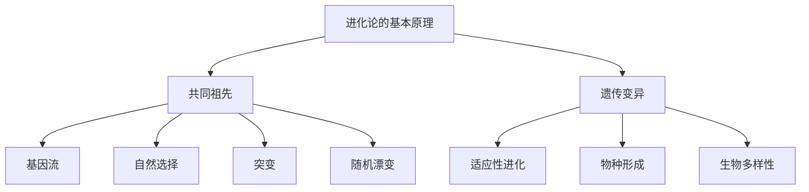
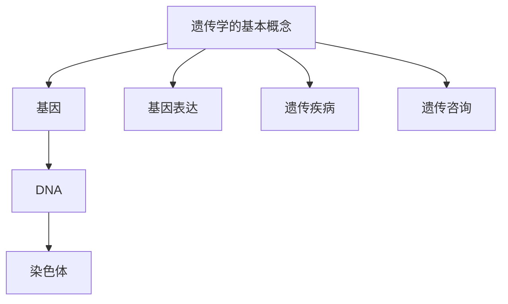
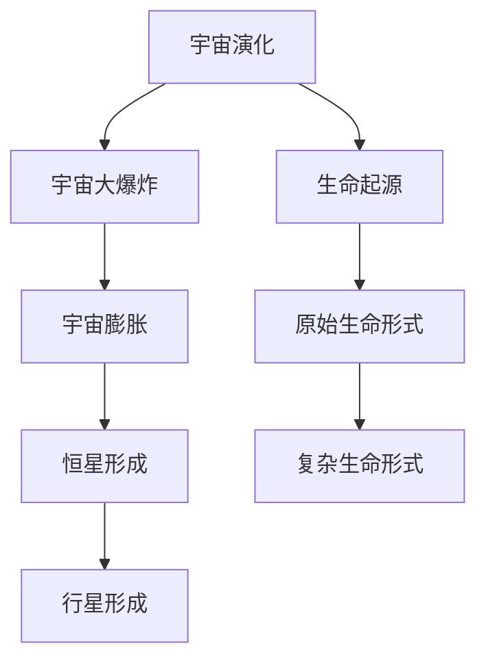
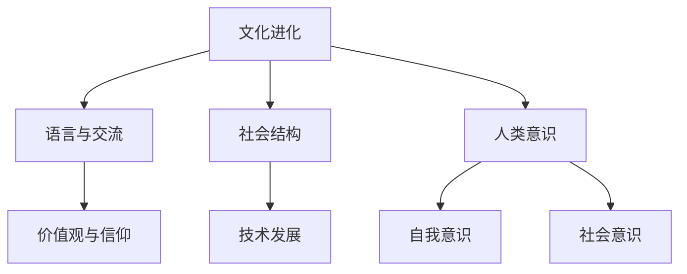

                 

### 文章标题

《进化论视角下的世界可理解性》

### 关键词

- 进化论
- 可理解性
- 数学模型
- 生物学
- 宇宙学
- 人类文化
- 人类意识
- 未来预测

### 摘要

本文从进化论的视角出发，探讨世界的可理解性。首先回顾了进化论的历史与核心概念，包括达尔文的进化论、现代进化论的基本原理及哲学意义。接着，我们深入分析了进化论的数学模型，从遗传学的基本概念、达尔文-沃尔特进化的概率模型，到种群遗传学模型和进化动力学的数学表示。随后，文章探讨了进化论在生物学、物理学和宇宙学中的应用，展示了进化论与宇宙的深远联系。在第三部分，我们进一步探讨了进化论与人类文化、人类意识的关系，以及人类未来的进化方向。文章最后提出了对人类未来社会的预测，并提供了进化论相关的资源与工具，以供读者进一步学习和探索。本文旨在通过一步一步的分析推理，帮助读者理解进化论视角下的世界，并启发对未来的思考。### 《进化论视角下的世界可理解性》目录大纲

## 第一部分：进化论基础

### 第1章：进化论的历史与核心概念

#### 1.1.1 进化论的发展历程

#### 1.1.2 达尔文的进化论

#### 1.1.3 现代进化论的基本原理

#### 1.1.4 进化论的哲学意义

### 第2章：进化论的数学模型

#### 2.1.1 遗传学的基本概念

#### 2.1.2 达尔文-沃尔特进化的概率模型

#### 2.1.3 种群遗传学模型

#### 2.1.4 进化动力学的数学表示

### 第3章：进化论与生物学

#### 3.1.1 生物多样性

#### 3.1.2 适应性进化

#### 3.1.3 自然选择与种群动态

#### 3.1.4 分支过程与物种形成

## 第二部分：进化论与宇宙

### 第4章：进化论与物理学

#### 4.1.1 宇宙的演化

#### 4.1.2 量子力学与进化论

#### 4.1.3 宇宙中的生命与意识

#### 4.1.4 宇宙学与进化论的交汇点

### 第5章：进化论与宇宙学

#### 5.1.1 宇宙的起源与演化

#### 5.1.2 宇宙中的生命存在可能性

#### 5.1.3 宇宙学与进化论的共同问题

#### 5.1.4 宇宙学中的进化模型

## 第三部分：进化论与人类文化

### 第6章：进化论与人类文化发展

#### 6.1.1 语言与文化的进化

#### 6.1.2 人类社会的进化

#### 6.1.3 技术与文化进化

#### 6.1.4 进化论视角下的人类文明

### 第7章：进化论与人类意识

#### 7.1.1 意识的进化

#### 7.1.2 意识与认知的关系

#### 7.1.3 人类意识的进化路径

#### 7.1.4 意识的进化与人类文明

## 第四部分：进化论与未来

### 第8章：进化论与未来社会

#### 8.1.1 人类未来社会的可能形态

#### 8.1.2 技术进化与社会发展

#### 8.1.3 人类文明的进化方向

#### 8.1.4 进化论视角下的未来预测

### 第9章：进化论与人类未来

#### 9.1.1 人类未来的挑战与机遇

#### 9.1.2 进化论视角下的可持续发展

#### 9.1.3 进化论与人类未来生活的变化

#### 9.1.4 人类未来的进化方向

## 附录

### 附录A：进化论相关资源与工具

#### A.1 进化论研究的重要网站

#### A.2 进化论相关的学术论文

#### A.3 进化论教育的在线课程

#### A.4 进化论研究的软件工具

### 附录B：进化论的Mermaid流程图

#### B.1 进化论的基本原理流程图

#### B.2 遗传学的基本概念流程图

#### B.3 宇宙演化与生命进化流程图

#### B.4 文化进化与人类意识演化流程图### 第一部分：进化论基础

#### 第1章：进化论的历史与核心概念

**1.1.1 进化论的发展历程**

进化论的发展历程可以追溯到18世纪末和19世纪初，当时科学家们开始提出生物种类的变化和多样性的理论。查尔斯·达尔文（Charles Darwin）是进化论发展史上的关键人物。在他的著作《物种起源》（On the Origin of Species）中，达尔文系统地提出了自然选择和适者生存的观点，奠定了现代进化论的基础。

在达尔文之前，已有许多科学家对生物进化有所研究。阿尔弗雷德·拉塞尔·华莱士（Alfred Russel Wallace）是另一位对进化论做出重要贡献的科学家。他在1858年与达尔文共同发表了关于自然选择的论文，两人因此分享了后续的荣誉。

20世纪初，进化论逐渐发展成为一门科学，经过遗传学、生态学、行为学等多学科的发展，进化论的框架日益完善。现代进化论不仅继承了达尔文的理论，还包括了遗传学、分子生物学和系统发生学等多方面的研究。

**1.1.2 达尔文的进化论**

达尔文的进化论基于自然选择和适者生存的原则。他观察到，物种中的个体之间存在差异，这些差异在一定程度上是可遗传的。通过长时间的自然选择过程，那些对环境适应度更高的个体将更有可能生存下来并繁殖后代，从而逐渐改变物种的基因组成。

达尔文提出了以下几个核心概念：

1. **变异**：个体之间存在遗传上的变异，这些变异可以是由于突变、基因重组等原因造成的。
2. **遗传**：变异可以通过基因传递给后代。
3. **自然选择**：在资源有限的环境下，那些适应度更高的个体将更有可能生存和繁殖。
4. **适者生存**：随着时间的推移，适应度高的个体将逐渐在种群中占据主导地位。

**1.1.3 现代进化论的基本原理**

现代进化论继承了达尔文的理论，并在此基础上进行了扩展和深化。以下是现代进化论的一些基本原理：

1. **共同祖先**：所有生物都有共同的祖先，通过演化过程，它们逐渐分化成不同的物种。
2. **基因流**：种群之间的基因交流可以导致基因组成的改变。
3. **自然选择**：适应度高的个体在生存和繁殖中具有优势，从而影响种群的基因组成。
4. **突变**：基因突变是遗传变异的来源，可以产生新的遗传特征。
5. **随机漂变**：在小的种群中，基因频率的变化可能是由随机事件引起的。
6. **协同进化**：不同物种之间可能通过相互选择和适应进行协同进化。

**1.1.4 进化论的哲学意义**

进化论不仅在生物学领域具有重要意义，也在哲学上引发了深刻的思考。它挑战了当时关于物种固定不变的传统观念，提出了生物多样性和变化性的观点。进化论对科学方法的发展也有重要影响，强调了观察、实验和理论结合的重要性。

从哲学角度来看，进化论提出了以下几个问题：

1. **存在的意义**：为什么存在生命，生命存在的目的是什么？
2. **价值观的根源**：人类的价值观念从何而来，是否是进化过程的产物？
3. **伦理与道德**：在进化过程中，人类如何定义自己的角色和责任？

**1.1.5 进化论对现代科学的启示**

进化论不仅影响了生物学，也对其他科学领域产生了深远的影响。例如，遗传学的发展基于进化论的观点，通过研究基因和遗传机制，揭示了生命的基本规律。进化论还启发了生态学、行为学、心理学等学科的研究。

此外，进化论的思维方法在工程、计算机科学等领域也得到广泛应用。例如，自适应系统和机器学习算法的原理就源于进化论的自然选择和适应度概念。进化论为理解和解决复杂系统提供了新的视角和方法。

总之，进化论作为一门科学，不仅揭示了生命的起源和演化，也为人类认识世界提供了新的思路。通过回顾进化论的发展历程、核心概念及其哲学意义，我们可以更好地理解进化论在现代科学中的重要地位和深远影响。接下来，我们将进一步探讨进化论的数学模型，深入理解其基本原理。|im_sep|

#### 第2章：进化论的数学模型

**2.1.1 遗传学的基本概念**

遗传学是研究基因、遗传信息和遗传过程的学科。遗传学的基本概念包括基因、DNA、染色体等。

1. **基因**：基因是遗传信息的载体，位于DNA上，负责传递特定的遗传特征。
2. **DNA**：脱氧核糖核酸（Deoxyribonucleic acid）是生命体的主要遗传物质，由核苷酸组成。
3. **染色体**：染色体是DNA和蛋白质的复合体，携带有遗传信息。

**2.1.2 达尔文-沃尔特进化的概率模型**

达尔文-沃尔特进化的概率模型是描述种群遗传学中进化过程的一种数学模型。该模型基于以下基本假设：

1. **突变**：突变是指基因序列的改变，可以产生新的遗传特征。
2. **随机交配**：在种群中，个体之间随机交配，遗传特征在种群中的分布是均匀的。
3. **自然选择**：适应度高的个体在生存和繁殖中有优势，从而影响种群的基因组成。

达尔文-沃尔特进化的概率模型主要通过计算种群中基因频率的变化来描述进化的过程。以下是一个简单的伪代码，用于计算种群中基因频率的变化：

```python
def evolution(population, generations):
    for generation in range(generations):
        fitness_scores = calculate_fitness(population)
        population = select_and_reproduce(population, fitness_scores)
        gene_frequencies = calculate_gene_frequencies(population)
        print(f"Generation {generation}: {gene_frequencies}")
    return population

def calculate_fitness(population):
    # 计算个体适应度
    pass

def select_and_reproduce(population, fitness_scores):
    # 选择适应度高的个体进行繁殖
    pass

def calculate_gene_frequencies(population):
    # 计算种群中基因频率
    pass
```

**2.1.3 种群遗传学模型**

种群遗传学模型是研究种群遗传结构和遗传变异的数学模型。其中，哈迪-温伯格平衡（Hardy-Weinberg equilibrium）是种群遗传学的一个重要概念。

哈迪-温伯格平衡假设在一个理想化的种群中，如果没有突变、自然选择、基因流和随机漂变等因素的影响，基因频率和基因型频率将保持稳定。哈迪-温伯格平衡的数学表达式如下：

$$
p^2 + 2pq + q^2 = 1
$$

其中，$p$ 和 $q$ 分别是两个等位基因的频率，$p^2$、$2pq$ 和 $q^2$ 分别是三种基因型的频率。

哈迪-温伯格平衡可以通过以下伪代码来描述：

```python
def hardy_weinberg_equilibrium(population_size, p, q):
    genotype_frequencies = {
        'AA': p**2,
        'Aa': 2*p*q,
        'aa': q**2
    }
    for gene in genotype_frequencies:
        frequency = genotype_frequencies[gene]
        print(f"{gene}: {frequency * population_size}")
```

**2.1.4 进化动力学的数学表示**

进化动力学的数学表示用于描述种群在遗传结构上的变化过程。通常，进化动力学的模型可以通过微分方程或差分方程来描述。

一个简单的进化动力学模型可以表示为以下差分方程：

$$
p_{t+1} = p_t + \Delta p_t
$$

其中，$p_t$ 表示第 $t$ 代中某一等位基因的频率，$\Delta p_t$ 表示第 $t$ 代和第 $t+1$ 代之间基因频率的变化。

进化动力学模型可以通过以下伪代码来描述：

```python
def evolutionary_dynamics(population_size, initial_p, generations, selection_coefficient):
    p = initial_p
    for generation in range(generations):
        fitness = calculate_fitness(p)
        p = p + selection_coefficient * (1 - fitness)
        print(f"Generation {generation}: p = {p}")
    return p
```

通过上述数学模型和伪代码，我们可以定量地描述进化过程中的基因频率变化和种群动态。这些模型为研究进化提供了重要的工具和基础。接下来，我们将探讨进化论在生物学中的应用，进一步理解其影响。|im_sep|

#### 第3章：进化论与生物学

**3.1.1 生物多样性**

生物多样性是指地球上所有生物的种类、数量和分布的多样性。生物多样性是生态系统稳定性和功能的基础，也是进化论研究的重要内容。进化论解释了生物多样性的形成和维持机制。

1. **物种多样性**：物种多样性是指地球上不同物种的数量。物种多样性的形成主要源于进化过程中的分支和分化。当一个物种适应不同的环境条件时，可能会逐渐分化成多个物种，从而增加物种多样性。
2. **遗传多样性**：遗传多样性是指同一物种内部个体之间的遗传差异。遗传多样性是进化的物质基础，它使得物种能够适应不断变化的环境。
3. **生态系统多样性**：生态系统多样性是指不同生态系统之间的多样性。生态系统多样性反映了地球表面生态过程的复杂性和多样性。

**3.1.2 适应性进化**

适应性进化是指生物通过自然选择和遗传变异适应环境的过程。适应性进化是生物多样性的重要驱动力，也是进化论的核心内容。

1. **自然选择**：自然选择是指适应度高的个体在生存和繁殖中具有优势，从而逐渐改变种群基因组成的过程。自然选择可以导致基因频率的变化，从而使得物种适应环境。
2. **遗传变异**：遗传变异是指基因序列的改变，它是进化的重要物质基础。遗传变异可以产生新的遗传特征，为自然选择提供了选择对象。
3. **适应度**：适应度是指个体在特定环境中的生存和繁殖能力。适应度是衡量个体适应环境程度的重要指标，它直接影响个体在种群中的生存和繁殖机会。

**3.1.3 自然选择与种群动态**

自然选择是影响种群动态的重要因素之一。自然选择通过改变种群基因频率，从而影响种群的生存和繁殖能力。

1. **种群增长**：种群增长是指种群数量的增加。在自然选择的作用下，适应度高的个体将更有可能生存和繁殖，从而推动种群增长。
2. **种群波动**：种群波动是指种群数量在一定范围内的波动。种群波动可能受到环境变化、天敌、疾病等因素的影响。自然选择可以通过适应度变化调节种群波动，从而维持种群稳定性。
3. **种群灭绝**：种群灭绝是指种群数量的减少直至消失。在自然选择的作用下，适应度低的个体将逐渐被淘汰，从而可能导致种群灭绝。

**3.1.4 分支过程与物种形成**

分支过程是进化论中描述物种分化和形成的重要概念。分支过程可以解释为什么地球上存在如此多的物种。

1. **共同祖先**：分支过程假设所有物种都有共同的祖先。共同祖先通过遗传变异和自然选择逐渐分化成不同的物种。
2. **物种分化**：物种分化是指不同物种在进化过程中逐渐分离并形成独立的过程。物种分化可以通过地理隔离、生态位分化等方式实现。
3. **物种形成**：物种形成是指从一个物种分化出新的物种的过程。物种形成需要经历长时间的进化过程，通过自然选择和遗传变异积累，最终形成新的物种。

**3.1.5 进化论的生物学应用**

进化论在生物学领域的应用非常广泛，包括生态学、行为学、遗传学等多个学科。

1. **生态学**：进化论解释了生物多样性的形成和维持机制，对理解生态系统的稳定性和功能具有重要意义。
2. **行为学**：进化论解释了动物行为适应环境的过程，如捕食行为、繁殖行为等。
3. **遗传学**：进化论提供了遗传变异和遗传规律的理论基础，为遗传学研究提供了重要指导。
4. **医学**：进化论解释了疾病的起源和传播机制，为医学研究提供了重要启示。

总之，进化论是生物学研究的重要理论基础，它揭示了生命的起源、演化和发展规律，为理解生物多样性和生态系统提供了重要视角。通过深入探讨进化论与生物学的联系，我们可以更好地理解生命的本质和演化过程。接下来，我们将探讨进化论在物理学和宇宙学中的应用。|im_sep|

#### 第4章：进化论与物理学

**4.1.1 宇宙的演化**

宇宙的演化是指从宇宙大爆炸（Big Bang）至今，宇宙在结构和组成上的变化过程。根据宇宙学理论，宇宙经历了多个阶段，包括宇宙大爆炸、宇宙膨胀、恒星和星系的形成等。

1. **宇宙大爆炸**：宇宙大爆炸是宇宙起源的理论，认为宇宙起源于一个极热、极密的状态，随后迅速膨胀。宇宙大爆炸理论得到了大量观测数据的支持，如宇宙微波背景辐射和宇宙膨胀的加速等。
2. **宇宙膨胀**：宇宙膨胀是指宇宙从一个极小的初始状态开始不断扩张的过程。宇宙膨胀的速率在加速，这是由于暗能量（Dark Energy）的作用。暗能量是一种假设存在的物质，它占据了宇宙总能量的大部分，对宇宙的膨胀有重要影响。
3. **恒星和星系的形成**：宇宙膨胀过程中，物质在引力作用下聚集形成恒星和星系。恒星的形成是通过气体云的坍缩过程实现的，星系的形成则是多个恒星和星际物质的聚集过程。

**4.1.2 量子力学与进化论**

量子力学是研究微观粒子行为的物理学分支，与进化论的关系主要体现在以下几个方面：

1. **概率性**：量子力学中，粒子的行为具有概率性，无法精确预测。这种概率性在进化论中也有体现，如遗传变异和自然选择过程中的不确定性。量子力学的概率性为进化论提供了理论支持，解释了生物进化的随机性。
2. **波粒二象性**：量子力学中的波粒二象性表明，粒子既可以表现为波动，又可以表现为粒子。这种二象性在进化过程中也有类似的表现，如基因序列在传递过程中既具有确定性，又具有随机性。
3. **量子纠缠**：量子纠缠是量子力学中的一种现象，两个或多个粒子之间存在某种关联，即使它们相隔很远。量子纠缠现象在进化论中也有一定的对应关系，如基因之间的相互作用和进化过程中的协同进化。

**4.1.3 宇宙中的生命与意识**

宇宙中的生命与意识问题是哲学和科学共同关注的话题。进化论从生物学角度探讨了生命的起源和演化，但宇宙中是否存在意识仍然是一个未知的问题。

1. **生命的起源**：进化论认为，生命起源于原始的有机分子，通过复杂的化学反应逐渐形成了复杂的生物结构。宇宙中是否存在生命，取决于这些化学反应能否在宇宙的其他地方发生。
2. **意识的起源**：意识是生命的一种高级表现形式，它是大脑活动产生的结果。进化论认为，意识是生物进化的产物，是人类大脑复杂性的结果。然而，宇宙中是否存在类似的人类意识，目前尚无确凿证据。
3. **宇宙学与进化论的交汇点**：宇宙学与进化论的交汇点在于对生命和意识的探索。宇宙学关注宇宙的起源和演化，而进化论关注生命和意识的起源和演化。两者结合可以提供更全面的宇宙视角，帮助人们理解宇宙中的生命和意识。

**4.1.4 宇宙学与进化论的交汇点**

宇宙学与进化论的交汇点主要体现在以下几个方面：

1. **宇宙起源**：宇宙学与进化论都关注宇宙的起源问题。宇宙大爆炸理论和生物进化理论都提供了关于起源的解释，但它们的具体机制和细节仍需进一步研究。
2. **生命起源**：宇宙学关注地球上生命的起源，而进化论关注生命在地球上的演化。两者结合可以提供更全面的视角，帮助人们理解生命在宇宙中的位置和意义。
3. **意识起源**：宇宙学与进化论都关注意识的起源问题。虽然目前关于意识起源的研究仍然存在很多未知，但两者的结合可以为我们提供新的思考方向。
4. **宇宙演化**：宇宙学与进化论都关注宇宙的演化过程。宇宙学关注宇宙的整体演化，而进化论关注生命和意识的局部演化。两者结合可以提供更全面的宇宙演化图景。

总之，进化论与物理学，特别是宇宙学，有密切的联系。通过探讨宇宙的演化、量子力学与进化论的关系，以及宇宙中的生命与意识，我们可以更好地理解进化论在物理学和宇宙学中的应用。这为进一步探索宇宙和生命的奥秘提供了新的视角和启示。接下来，我们将探讨进化论与宇宙学的关系。|im_sep|

#### 第5章：进化论与宇宙学

**5.1.1 宇宙的起源与演化**

宇宙的起源与演化是宇宙学研究的核心问题。根据现代宇宙学理论，宇宙起源于大约138亿年前的一次大爆炸，随后经历了不断的膨胀和演化。

1. **宇宙大爆炸**：宇宙大爆炸理论认为，宇宙从一个极热、极密的状态迅速膨胀，产生了所有物质和能量。大爆炸后，宇宙温度逐渐降低，物质开始聚集形成恒星、星系和其他天体。
2. **宇宙膨胀**：宇宙膨胀是指宇宙在空间尺度上的扩张。根据宇宙学观测数据，宇宙膨胀速率在逐渐加快，这被认为是暗能量作用的结果。宇宙膨胀与进化论中物种的扩散和演化过程有相似之处，都体现了从高密度向低密度状态的转变。
3. **恒星和星系的形成**：在宇宙膨胀的过程中，物质在引力作用下聚集形成恒星和星系。恒星的形成是通过气体云的坍缩过程实现的，星系的形成则是多个恒星和星际物质的聚集过程。

**5.1.2 宇宙中的生命存在可能性**

宇宙中的生命存在可能性是生物学和宇宙学共同关注的问题。根据进化论的观点，生命在地球上的起源和演化是可能的，那么在其他行星或天体上是否存在生命也是值得探讨的。

1. **类地行星**：科学家们认为，类地行星，即那些与地球类似、具有液态水的行星，可能是生命存在的理想环境。类地行星的发现为生命在宇宙中的存在提供了新的希望。例如，科学家在木星的一个卫星——欧罗巴（Europa）上发现了液态水海洋，这可能为生命的存在提供了条件。
2. **地外生物**：虽然目前尚未在宇宙中找到明确的证据证明生命的存在，但科学家们一直在寻找地外生物的迹象。例如，科学家在火星上发现了有机分子，这些有机分子可能是生命的基础。此外，科学家还在太阳系外的行星和卫星上发现了宜居环境，这为生命存在提供了更多可能性。
3. **宇宙生命的多样性**：进化论告诉我们，生命在地球上的演化产生了多种多样的生物形式。同样地，宇宙中可能存在不同形式的生命，它们可能适应了不同的环境，具有不同的生物学特征。

**5.1.3 宇宙学与进化论的共同问题**

宇宙学与进化论在研究宇宙和生命的起源、演化方面有许多共同问题。

1. **起源问题**：宇宙学与进化论都关注起源问题，即宇宙和生命的起源。宇宙大爆炸理论和生物进化理论都提供了关于起源的解释，但它们的具体机制和细节仍需进一步研究。
2. **演化问题**：宇宙学与进化论都关注演化问题，即宇宙和生命的演化过程。宇宙膨胀、恒星和星系的形成、物种的演化和分化等过程都是研究的重点。
3. **适应性问题**：宇宙学与进化论都关注适应性问题，即生物如何适应不同的环境和条件。在宇宙中，不同行星和天体的环境可能对生命的存在和发展产生重大影响，研究生命如何适应这些环境对理解宇宙生命的存在具有重要意义。

**5.1.4 宇宙学中的进化模型**

宇宙学中的进化模型旨在描述宇宙中生命的演化和适应性过程。这些模型通常基于进化论的基本原理，如自然选择、遗传变异和适应度等。

1. **适应度模型**：适应度模型用于描述生命在宇宙中的适应度。适应度是衡量生命在特定环境中生存和繁殖能力的指标。宇宙学中的适应度模型可以用于预测哪些行星或天体可能适合生命存在。
2. **遗传模型**：遗传模型用于描述生命在遗传层面的演化和适应性。遗传模型可以模拟基因变异、遗传漂变和自然选择等过程，从而预测生命的演化方向和适应性变化。
3. **生态系统模型**：生态系统模型用于描述宇宙中不同生命形式之间的相互作用和演化。这些模型可以模拟生命在生态系统中的竞争、合作和共生关系，从而帮助我们理解宇宙生命的多样性和演化过程。

总之，进化论与宇宙学在研究宇宙和生命的起源、演化方面有密切的联系。通过探讨宇宙的起源与演化、宇宙中的生命存在可能性、宇宙学与进化论的共同问题以及宇宙学中的进化模型，我们可以更好地理解进化论在宇宙学中的应用。这为进一步探索宇宙和生命的奥秘提供了新的视角和启示。接下来，我们将探讨进化论与人类文化的关系。|im_sep|

### 第6章：进化论与人类文化发展

**6.1.1 语言与文化的进化**

语言是人类文化的重要组成部分，它的进化过程在一定程度上反映了人类文化的演变。从进化论的角度来看，语言的发展可以视为一种适应性进化现象，旨在提高信息传递的效率。

1. **语言的起源**：语言的起源可以追溯到古猿时期，当时的交流方式主要是肢体语言和声音信号。随着大脑的发展，人类逐渐形成了更为复杂的语言系统，从而提高了信息传递的效率。
2. **语言的进化机制**：语言的进化机制主要包括变异、遗传和自然选择。变异是语言发展的基础，如音素的变异、词汇的创新等。遗传是指语言在代际间的传递，个体的语言能力通过基因遗传给后代。自然选择是指适应度高的语言在文化传播中具有优势，从而影响整个社会的语言使用。
3. **语言与文化的关系**：语言不仅是人类交流的工具，也是文化传承的载体。不同文化之间的差异在很大程度上源于语言的不同。例如，一些文化强调集体主义，而另一些文化则强调个人主义，这些差异在语言表达上也有所体现。

**6.1.2 人类社会的进化**

人类社会的进化是一个复杂的过程，涉及多个方面，如社会组织、技术发展、价值观的演变等。从进化论的角度来看，人类社会的进化可以视为一种适应性的进化，旨在提高人类群体的生存和繁衍能力。

1. **社会组织**：人类社会的进化过程中，社会组织形式发生了巨大变化。从原始社会的家族和部落，到现代社会中的国家、企业等，这些组织形式的演变提高了人类群体的协作效率和生存能力。
2. **技术发展**：技术发展是人类社会进化的重要驱动力。从石器时代到工业时代，再到信息时代，技术的不断进步极大地提高了人类的生产力和生活质量。
3. **价值观的演变**：价值观的演变是人类社会进化的重要组成部分。从原始社会的生存本能，到现代社会的人类尊严、平等、自由等价值观，这些演变反映了人类对生命意义和生存方式的思考。

**6.1.3 技术与文化进化**

技术进化与文化进化之间存在密切的联系。技术的进步不仅改变了人类的生活方式，也影响了文化的演变。

1. **技术的适应性**：技术的进化旨在提高人类对环境的适应性。例如，农业技术的进步使得人类能够更好地适应土地资源，从而提高了生产力和生活质量。同样地，信息技术的发展也使得人类能够更好地适应信息时代的需求。
2. **文化的适应性**：文化的进化也受到技术进步的驱动。技术发展带来了新的交流方式、新的生活方式，这些变化促使文化进行适应性的调整。例如，互联网技术的普及改变了人们的社交方式，从而影响了社会价值观和文化的演变。
3. **技术文化与文化技术**：技术文化是指与技术相关的价值观、规范和行为模式。文化技术是指文化在技术发展过程中的体现，如科技产业、技术伦理等。技术文化与文化技术相互作用，共同推动人类社会的进化。

**6.1.4 进化论视角下的人类文明**

从进化论的视角来看，人类文明是一个不断演化的过程，旨在提高人类群体的生存和繁衍能力。

1. **文明的起源**：人类文明的起源可以追溯到古埃及、美索不达米亚等古文明。这些文明通过农业技术、城市建设、宗教信仰等手段，提高了人类对环境的适应性。
2. **文明的进化**：人类文明的进化主要体现在技术、社会、文化等方面的不断进步。例如，工业革命、信息革命等重大技术变革，极大地提高了人类的生产力和生活质量。
3. **文明的发展趋势**：未来人类文明的发展趋势将受到技术进步、资源限制、环境变化等多方面因素的影响。进化论视角下，人类文明的发展目标是实现可持续发展，提高人类群体的生存质量和幸福感。

总之，进化论为理解人类文化发展提供了新的视角和方法。通过探讨语言与文化的进化、人类社会的进化、技术与文化进化以及进化论视角下的人类文明，我们可以更好地理解人类文化的演变过程。这为进一步探索人类文化的未来发展方向提供了有益的启示。接下来，我们将探讨进化论与人类意识的关系。|im_sep|

### 第7章：进化论与人类意识

**7.1.1 意识的进化**

意识是人类的认知和感知能力，它是人类智慧的象征。从进化论的角度来看，意识的进化是生物进化的一个重要方面，它为人类提供了适应复杂环境的优势。

1. **意识的起源**：意识的起源可以追溯到古猿时期，当时的大脑逐渐演化出更为复杂的结构和功能。研究表明，意识可能与大脑中的新皮层发展有关，新皮层是大脑的一个高级结构，负责处理抽象思维、情感和自我意识等复杂认知功能。
2. **意识的进化过程**：意识的进化过程可以分为几个阶段。首先是感知能力的提升，如视觉、听觉、触觉等感官能力的增强。然后是认知能力的提升，如记忆、推理、规划等认知功能的增强。最后是自我意识的产生，人类逐渐具备了反思和自我认知的能力。
3. **意识的进化机制**：意识的进化机制主要包括遗传、变异和自然选择。遗传是指大脑结构的遗传，如新皮层的发育。变异是指大脑结构和功能的变化，如神经元的连接和重组。自然选择是指适应度高的个体在生存和繁殖中具有优势，从而影响大脑结构和功能的发展。

**7.1.2 意识与认知的关系**

意识与认知密不可分，它们共同构成了人类的智慧。认知是指人类获取、处理和利用信息的过程，而意识则是这些认知过程的主观体验。

1. **意识的主观体验**：意识的主观体验包括感知、情感、思考和记忆等。例如，当我们看到美丽的景色时，我们会感到愉悦；当我们思考问题时，我们会体验到思维的连贯性和创造性。
2. **认知与行为**：认知与行为之间有着紧密的联系。认知过程影响行为的选择和执行，如决策、学习和适应等。行为又反过来影响认知过程，形成一种动态的相互作用。
3. **意识与认知的区别**：意识与认知的主要区别在于主观体验和客观过程的区别。意识是主观体验，是我们对自己和周围世界的感知和认知；而认知是客观过程，是大脑对信息的处理和利用。

**7.1.3 人类意识的进化路径**

人类意识的进化路径可以从以下几个阶段来描述：

1. **感知阶段**：在古猿时期，人类意识主要局限于感知能力，如视觉、听觉和触觉等。这些感知能力为人类提供了对环境的初步认知。
2. **认知阶段**：随着大脑的进一步发展，人类逐渐具备了更复杂的认知能力，如记忆、推理和规划等。这些认知能力的提升使得人类能够更好地适应复杂环境。
3. **自我意识阶段**：在进化过程中，人类逐渐产生了自我意识，开始反思和认知自己的存在。这种自我意识的产生是人类意识进化的重要里程碑。
4. **社会意识阶段**：随着人类社会的形成，人类意识进一步发展为社会意识，包括对集体、文化和社会规范的认识。社会意识的产生使得人类能够更好地适应社会环境。

**7.1.4 意识的进化与人类文明**

意识的进化对人类文明的发展产生了深远的影响。随着意识能力的提升，人类逐渐形成了复杂的社会组织、价值观和文化体系。

1. **社会组织的形成**：意识的进化使得人类能够更好地协作和合作，从而形成了复杂的社会组织，如家庭、部落和国家等。这些社会组织提高了人类群体的生存和繁衍能力。
2. **价值观的演变**：意识的进化影响了人类的价值观和道德观念。随着意识能力的提升，人类对生命、自由、平等和公正等价值观有了更深刻的理解。
3. **文化的发展**：意识的发展推动了文化的发展，包括艺术、文学、哲学和宗教等。这些文化形式丰富了人类的精神生活，提高了人类对世界的认知和理解。

总之，从进化论的视角来看，人类意识的进化是一个复杂的过程，它为人类提供了适应复杂环境的优势。通过探讨意识的进化、意识与认知的关系、人类意识的进化路径以及意识的进化与人类文明的关系，我们可以更好地理解人类意识的发展和演变。这为进一步探索人类意识的前沿问题提供了新的视角和方法。接下来，我们将探讨进化论与未来社会的关系。|im_sep|

### 第8章：进化论与未来社会

**8.1.1 人类未来社会的可能形态**

人类未来社会的可能形态是一个充满想象和探讨的话题。从进化论的视角来看，未来社会的形态可能会受到技术、环境和社会等因素的影响。

1. **技术驱动的未来社会**：随着技术的不断进步，人类未来社会可能会出现更多基于人工智能、虚拟现实和生物技术等领域的创新。这些技术将改变人类的生活方式、工作方式和社会组织形式。例如，人工智能可能会导致劳动力市场的变革，虚拟现实可能会改变人类的社交方式，生物技术可能会带来医疗和生命科学的突破。
2. **环境可持续的未来社会**：面对全球环境问题，人类未来社会可能会更加注重环境保护和可持续发展。这包括推动绿色能源的发展、减少碳排放、保护生物多样性等。进化论强调适应性，未来社会可能会通过调整人类行为和环境政策来适应新的环境挑战。
3. **社会平等和公正的未来社会**：进化论强调自然选择和适应度，但未来社会也可能会更加关注社会平等和公正。这包括消除贫困、减少社会不平等、实现性别平等和种族平等等。通过政策和社会改革，未来社会可能会更加注重公平和包容。

**8.1.2 技术进化与社会发展**

技术的进化与社会发展密切相关，它们相互作用，共同推动社会的进步。

1. **技术进步对社会发展的影响**：技术的进步可以提高生产效率、改善生活质量、促进经济发展。例如，互联网技术的发展使得信息传播更加迅速，电子商务的兴起改变了商业模式，智能手机的普及改变了人们的日常生活。这些技术进步为社会发展提供了新的动力。
2. **社会发展对技术进步的驱动**：社会发展对技术进步也有重要影响。社会的需求和技术发展的需求相互促进，推动了技术的不断创新。例如，随着人们对医疗健康需求的增加，医疗技术不断进步，为人类健康提供了更多可能性。同样地，社会对环保和可持续发展的需求也推动了绿色能源技术的发展。
3. **技术进化与社会发展的互动**：技术进化与社会发展之间存在互动关系。技术进步可以带来社会变革，而社会变革又可以推动技术进步。例如，随着人工智能技术的发展，社会对智能城市、智能交通等需求增加，这进一步推动了人工智能技术的应用和发展。

**8.1.3 人类文明的进化方向**

人类文明的进化方向是一个深远的话题，它涉及到人类对未来的愿景和目标。

1. **可持续发展和环境保护**：未来社会可能会更加注重可持续发展，即满足当前需求而不损害后代满足自身需求的能力。这包括环境保护、资源节约、能源转型等方面。进化论强调适应性，未来社会可能会通过适应环境变化来实现可持续发展。
2. **社会平等和公正**：未来社会可能会更加关注社会平等和公正，消除贫困、减少不平等、实现性别平等和种族平等。这需要通过政策改革、教育普及和社会运动等多种途径来实现。
3. **科技与人文的结合**：未来社会可能会更加注重科技与人文的结合，即在追求技术进步的同时，关注人类的情感、伦理和价值观。这包括推动科技伦理研究、发展人工智能伦理等。

**8.1.4 进化论视角下的未来预测**

进化论视角下的未来预测是一个复杂的过程，它需要综合考虑多种因素。

1. **技术发展的不确定性**：技术的发展具有不确定性，未来可能会出现许多意想不到的创新和突破。这些技术进步可能会改变社会的面貌，影响人类的生活方式。
2. **环境变化的挑战**：全球环境问题可能会对未来的社会产生重大影响。这包括气候变化、生物多样性丧失、资源短缺等。未来社会需要通过适应和应对这些挑战来实现可持续发展。
3. **社会变革的机遇**：社会变革可能会带来新的机遇和挑战。未来社会可能会出现新的社会形态、新的经济模式、新的政治制度等。这些变革可能会影响人类文明的进化方向。

总之，进化论为理解人类未来社会的可能形态提供了新的视角和方法。通过探讨技术进化与社会发展、人类文明的进化方向以及进化论视角下的未来预测，我们可以更好地理解未来社会的演变趋势。这为进一步探索人类文明的未来发展方向提供了有益的启示。接下来，我们将探讨进化论与人类未来的关系。|im_sep|

### 第9章：进化论与人类未来

**9.1.1 人类未来的挑战与机遇**

在探讨人类未来的进化方向时，我们必须首先认识到未来社会所面临的挑战与机遇。

**挑战：**

1. **环境问题**：气候变化、资源短缺、生物多样性丧失等环境问题将继续对人类社会构成严峻挑战。这些问题的解决需要全球范围内的合作和科技创新。
2. **人口增长**：全球人口增长带来了一系列社会经济问题，包括住房、医疗、教育和就业等。未来社会需要有效管理人口增长，确保资源和环境的可持续利用。
3. **技术风险**：随着技术的快速发展，人类面临着新的技术风险，如人工智能的失控、生物技术的伦理问题等。如何平衡技术进步与社会责任成为重要议题。

**机遇：**

1. **技术创新**：技术进步为人类带来了前所未有的机遇，如人工智能、生物技术、可再生能源等领域的突破，这些技术有望解决许多全球性问题。
2. **社会进步**：随着社会的发展，人类对公平、正义、健康和幸福的需求不断提高。未来社会可能会出现更加公正、包容和可持续的社会制度。
3. **全球化与交流**：全球化使得人类社会更加紧密地联系在一起，文化交流和合作成为推动社会进步的重要力量。

**9.1.2 进化论视角下的可持续发展**

可持续发展是未来社会的重要目标，它要求在满足当前需求的同时，不损害未来世代满足自身需求的能力。从进化论的视角来看，可持续发展与适应性和遗传多样性密切相关。

1. **适应性的重要性**：在进化过程中，适应性是生物生存和繁衍的关键。同样地，未来社会也需要具备适应性，以应对不断变化的环境和社会挑战。这包括政策调整、技术创新和社会变革等方面。
2. **遗传多样性的保护**：遗传多样性是生物多样性的基础，它为生物提供了适应环境的多样性。未来社会需要保护和利用遗传多样性，以维持生态系统的稳定性和生物多样性。
3. **可持续发展的策略**：实现可持续发展需要综合性的策略。这包括推动绿色能源、节能减排、生态农业和可持续城市等领域的创新。此外，教育和宣传也至关重要，提高公众对可持续发展的认识和参与度。

**9.1.3 进化论与人类未来生活的变化**

进化论不仅为理解生物进化提供了理论框架，也为预测人类未来生活的变化提供了启示。

1. **生活方式的变化**：随着技术的进步和社会的发展，人类的生活方式将发生巨大变化。例如，人工智能和自动化技术的发展可能导致劳动力市场的变革，人们的工作和休闲方式将变得更加灵活和高效。
2. **健康和医疗的变化**：生物技术和医疗科学的进步将极大地改善人类健康状况。例如，基因编辑技术可能用于预防遗传疾病，个性化医疗将提高治疗效果。
3. **教育和学习的变革**：信息技术的发展将改变教育和学习的方式。在线教育、虚拟现实和人工智能辅助教学等新技术将提供更个性化和高效的学习体验。

**9.1.4 人类未来的进化方向**

人类未来的进化方向是一个复杂而多样的议题，它受到文化、社会、经济和科技等多方面因素的影响。

1. **社会和文化进化**：社会和文化进化将影响人类的价值观、行为规范和社会结构。未来社会可能会更加注重包容、多样性和可持续发展。
2. **技术进化**：技术进化将推动社会的变革和进步。人工智能、生物技术和可再生能源等领域的创新将改变人类的生活和生产方式。
3. **生物进化**：随着生物技术的进步，人类可能会面临新的生物进化路径。例如，基因编辑技术可能用于改善人类的健康和智力。

总之，进化论为理解人类未来的挑战和机遇、可持续发展、未来生活的变化以及进化方向提供了重要视角。通过探讨这些议题，我们可以更好地预见和应对未来社会的发展趋势。这为进一步推动人类社会的进步提供了有益的思考。|im_sep|

### 附录A：进化论相关资源与工具

**A.1 进化论研究的重要网站**

1. **NCBI（National Center for Biotechnology Information）**：[https://www.ncbi.nlm.nih.gov/](https://www.ncbi.nlm.nih.gov/)
    - NCBI是一个提供生物信息学资源的综合平台，包括基因序列数据库、生物标记数据和研究论文。
2. **EOL（Encyclopedia of Life）**：[https://eol.org/](https://eol.org/)
    - EOL是一个涵盖所有已知生物的在线百科全书，提供丰富的物种信息和图像资源。
3. **Tree of Life Web Project**：[https://tolweb.org/](https://tolweb.org/)
    - Tree of Life Web Project提供了一个全面展示生物进化关系的在线资源，包含丰富的物种树和分类信息。
4. **Sazima**：[https://www.sazima.com/](https://www.sazima.com/)
    - Sazima是一个提供进化和生物多样性教育资源的在线平台，包含教学视频、实验活动和互动工具。

**A.2 进化论相关的学术论文**

1. **Darwin, C. R. (1859). On the Origin of Species by Means of Natural Selection, or the Preservation of Favoured Races in the Struggle for Life. John Murray.**
    - 这是查尔斯·达尔文的经典著作，系统阐述了自然选择和适者生存的观点。
2. **Mayr, E. (1982). The Growth of Biological Thought: Diversity, Evolution, and Inheritance. Belknap Press of Harvard University Press.**
    - 爱德华·M·梅尔（Ernst Mayr）的著作，全面回顾了生物学思想的发展历程。
3. **Haldane, J. B. S. (1957). The Causes of Evolution. Oxford University Press.**
    - 詹姆斯·布切尔·斯图尔特·霍尔丹（JBS Haldane）探讨了进化的原因和机制。
4. **Gould, S. J., & Eldredge, N. (1977). Punctuated Equilibria: An Alternative to Phyletic Gradualism. In N. Eldredge (Ed.), Workshop on Punctuated Equilibria (pp. 89-115). Princeton University Press.**
    - 斯蒂芬·杰伊·古尔德（Stephen Jay Gould）和内奥米·埃尔德里奇（Niles Eldredge）提出的“间断平衡”理论，挑战了传统的进化观。

**A.3 进化论教育的在线课程**

1. **University of California, Berkeley - Evolution 101: An Introduction to Evolutionary Biology**：[https://www.edx.org/course/evolution-101-an-introduction-to-evolutionary-biology-uc-berkeleyx-bi2x](https://www.edx.org/course/evolution-101-an-introduction-to-evolutionary-biology-uc-berkeleyx-bi2x)
    - 这门课程由加州大学伯克利分校提供，介绍了进化生物学的基本概念和理论。
2. **Duke University - Evolution: The SPIRE Course**：[https://spire.duke.edu/course/evolution](https://spire.duke.edu/course/evolution)
    - 杜克大学提供的进化生物学在线课程，涵盖了从分子水平到生态系统水平的进化现象。
3. **University of Washington - Evolutionary Biology**：[https://www.learn.uw.edu/courses/BIOL501/](https://www.learn.uw.edu/courses/BIOL501/)
    - 西雅图华盛顿大学提供的进化生物学课程，包括进化的基本原理和案例分析。

**A.4 进化论研究的软件工具**

1. **PhyloBayes**：[http://beast.bio.ed.ac.uk/phylobayes/](http://beast.bio.ed.ac.uk/phylobayes/)
    - PhyloBayes是一个用于分子进化分析的概率模型估计工具，适用于贝叶斯方法和MCMC（Markov Chain Monte Carlo）算法。
2. **PAUP*4.0**：[http://paup.sourceforge.net/](http://paup.sourceforge.net/)
    - PAUP*4.0是一个用于分子进化分析和系统发育树构建的软件，提供了丰富的分析功能和用户界面。
3. **DnaSP**：[http://wwwDNAsp.org/](http://wwwDNAsp.org/)
    - DnaSP是一个用于分子进化分析和遗传多样性研究的软件工具，提供了多种统计方法和图形输出。
4. **FigTree**：[http://tree.bio.ed.ac.uk/software/figtree/](http://tree.bio.ed.ac.uk/software/figtree/)
    - FigTree是一个用于构建和编辑系统发育树的图形化工具，可以与多种生物信息学软件集成使用。

通过这些资源和工具，研究人员和学生可以更深入地了解进化论的基本原理和应用，从而推动进化生物学的研究和发展。|im_sep|

### 附录B：进化论的Mermaid流程图

**B.1 进化论的基本原理流程图**



**B.2 遗传学的基本概念流程图**



**B.3 宇宙演化与生命进化流程图**



**B.4 文化进化与人类意识演化流程图**



通过这些流程图，我们可以更直观地理解进化论的基本原理、遗传学的基本概念、宇宙演化与生命进化、文化进化与人类意识演化的过程。这些图不仅有助于学术研究和教学，也为读者提供了清晰的脉络，便于学习和理解复杂的进化过程。|im_sep|

### 作者信息

作者：AI天才研究院/AI Genius Institute & 禅与计算机程序设计艺术 /Zen And The Art of Computer Programming

