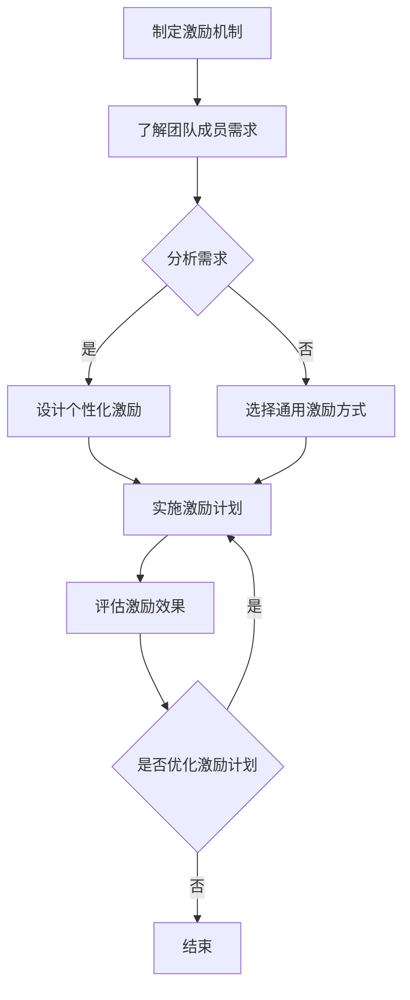
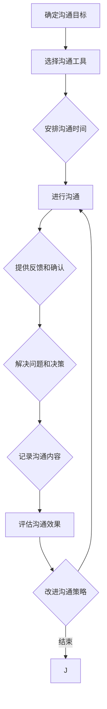

                 

### 引言

#### 远程团队现状与挑战

随着互联网技术的迅猛发展和全球化的深入推进，远程工作模式已经成为现代企业运营的一种重要形式。越来越多的公司开始采用远程办公的方式，这不仅提高了员工的灵活性，还为企业节约了大量的办公成本。根据国际远程工作协会（International Association of Virtual Offices, IAVO）的统计，全球范围内有超过4亿人从事远程工作，这一数字在2020年新冠疫情爆发后进一步增长。

远程团队的优势显而易见：员工可以在全球任何地方工作，减少了通勤时间，提高了工作效率；公司可以招募来自不同国家的人才，丰富了团队的文化多样性；同时，企业也能节省大量的租赁和日常运营成本。然而，远程团队也面临着诸多挑战。

首先，沟通和协作成为了一个巨大的难题。由于团队成员分布在不同的时区和地理位置，实时的面对面交流变得十分困难，这导致了沟通效率的下降。其次，远程工作的氛围和团队凝聚力难以维持。员工可能会感到孤独和隔离，缺乏归属感，进而影响工作积极性和团队协作精神。此外，工作监督和绩效评估也变得更加复杂，管理人员难以准确衡量远程员工的工作状态和绩效。

为了应对这些挑战，远程团队需要有效的激励机制来保持团队成员的积极性和生产力。激励机制不仅能提高员工的工作动力，还能增强团队的凝聚力和忠诚度。因此，本文将深入探讨远程团队激励的原理和策略，通过一系列的案例分析，为企业管理者提供实用的指导和建议。

### 第1章：远程团队现状与挑战

#### 1.1 远程工作的兴起

远程工作的兴起可以追溯到20世纪末，随着互联网和通信技术的飞速发展，远程办公逐渐成为可能。1995年，美国电信巨头AT&T首次提出了“在家办公”的概念，这一举措在当时引起了广泛关注。然而，真正推动远程工作普及的是2000年前后互联网泡沫破裂后，企业为了降低成本和提高效率，开始大规模采用远程办公模式。

近年来，远程工作的普及速度显著加快。根据斯坦福大学的一项研究，远程工作能够显著提高员工的满意度和生产力。此外，随着新冠疫情的爆发，远程工作成为了全球范围内的普遍现象。根据LinkedIn的数据，2020年全球远程工作的比例达到了前所未有的60%，这一比例预计将在未来几年内继续上升。

远程工作不仅局限于信息技术行业，其他行业如金融服务、咨询、教育和医疗也逐渐采用这种工作模式。远程工作平台如Zoom、Slack和Trello等工具的普及，使得团队成员之间的协作和沟通更加便捷高效。企业也逐渐意识到，远程工作不仅是一种应对危机的临时措施，更是一种可持续的工作模式。

#### 1.2 远程团队面临的挑战

尽管远程工作具有诸多优势，但它也带来了许多挑战，尤其是在团队管理和员工激励方面。

**沟通难题**：远程团队的一个主要挑战是沟通。由于团队成员分布在不同的时区和地理位置，实时的面对面交流变得极为困难。这不仅影响了沟通的效率，也增加了误解和冲突的风险。研究表明，缺乏有效的沟通是远程团队面临的首要问题之一。

**团队凝聚力**：远程工作容易导致团队成员之间的情感隔离。员工可能会感到孤独和被边缘化，缺乏归属感。这种情感上的疏离不仅会影响员工的工作积极性，还会削弱团队的凝聚力。建立和维护远程团队的团队文化成为了一个重要课题。

**工作监督和绩效评估**：在远程工作中，管理人员难以直接监控员工的工作状态和进度。传统的绩效评估体系在远程工作中难以实施，如何公正、客观地评估员工的工作表现成为了一个挑战。

**技术障碍**：远程工作依赖于稳定的网络连接和各种协作工具。然而，技术问题如网络中断、软件故障等时有发生，这会影响员工的工作效率和满意度。

**个人时间管理**：远程工作提供了更大的灵活性，但同时也对员工的时间管理能力提出了更高的要求。员工需要有效地平衡工作和生活，否则容易陷入工作与生活的界限模糊状态，导致工作压力增加。

**心理健康问题**：由于缺乏面对面的交流和支持，远程工作的员工更容易出现心理健康问题，如焦虑、抑郁和压力等。这些问题不仅影响员工的工作表现，还可能对他们的职业发展和个人生活产生负面影响。

#### 1.3 为什么需要激励机制

在远程团队中，激励机制的重要性尤为突出。首先，激励机制能够解决远程工作中常见的沟通难题。通过明确的激励措施，管理者可以鼓励员工积极参与团队讨论和交流，从而提高沟通效率。其次，激励机制有助于增强团队的凝聚力。通过共同的目标和奖励机制，员工能够感受到团队的力量和归属感，从而增强团队的凝聚力。

此外，激励机制还能够解决工作监督和绩效评估的难题。通过设定明确的目标和奖励标准，管理者可以更客观、公正地评估员工的工作表现，提高绩效评估的准确性。同时，激励机制能够提高员工的工作积极性和生产力，从而提高整个团队的绩效。

最重要的是，激励机制能够改善远程工作的心理健康问题。通过提供精神奖励和福利，管理者可以帮助员工缓解工作压力，提高他们的工作满意度和生活质量。

总之，远程团队需要有效的激励机制来应对各种挑战，保持员工的积极性和生产力。通过科学的激励机制，企业可以打造一个高效、团结、有动力的远程团队，从而在激烈的市场竞争中立于不败之地。

### 第2章：激励机制的基本原理

#### 2.1 动机与行为的关系

在讨论激励机制之前，我们需要理解动机和行为之间的关系。动机是指个体为了满足特定需求或目标而产生的内在驱动力。心理学研究表明，动机是影响个体行为的重要因素。根据弗雷德里克·赫茨伯格的双因素理论（Herzberg's Two-Factor Theory），工作环境中的激励因素（如认可、成就、责任等）和保健因素（如薪酬、工作条件、稳定性等）共同影响员工的工作满意度和行为。

动机与行为之间的关系可以用动机-行为理论（Motivation-Behavior Theory）来解释。该理论认为，动机是引发行为的直接原因，而行为则是动机的外在表现。例如，当员工感受到对公司使命的认同和认可时，他们更有可能表现出积极的工作态度和高效的工作行为。此外，期望理论（Expectancy Theory）也指出，员工的行为是由其对目标达成可能性的期望所决定的。当员工认为通过努力可以实现目标并获得奖励时，他们更有动力去完成任务。

#### 2.2 激励理论简介

为了更好地设计激励机制，我们需要了解一些经典的激励理论。

**马斯洛的需求层次理论（Maslow's Hierarchy of Needs）**：马斯洛将人类需求分为五个层次：生理需求、安全需求、社交需求、尊重需求和自我实现需求。该理论指出，人们在不同层次的需求得到满足后会追求更高层次的需求。在远程工作中，了解员工的需求层次有助于制定个性化的激励机制。

**X理论和Y理论（X-Y Theory）**：X理论认为人们天生懒惰，需要外部的压力和激励来推动工作；而Y理论则认为人们天生具有自我激励和自我实现的需求。现代管理实践更倾向于Y理论，认为通过给予员工自主性和支持，可以提高他们的工作动力和效率。

**目标设置理论（Goal-Setting Theory）**：目标设置理论认为明确、具体的目标可以显著提高员工的工作表现。目标应具备挑战性，但又是可实现的，同时需要得到员工的认同。SMART目标法则（Specific, Measurable, Achievable, Relevant, Time-bound）是目标设置的重要指导原则。

**期望理论（Expectancy Theory）**：该理论由维克托·弗鲁姆（Victor Vroom）提出，认为员工的行为是由对达成目标可能性的期望所决定的。该理论包括三个要素：努力-绩效关系、绩效-奖励关系和奖励-个人价值关系。管理者可以通过提高员工的期望来增强他们的工作动力。

**公平理论（Equity Theory）**：该理论由亚当斯（John Stacey Adams）提出，认为员工会将自己的工作投入和回报与同事进行比较，以判断自己的公平感。不公平感可能导致员工的不满和动机下降。因此，确保激励机制公平合理是激励员工的重要前提。

#### 2.3 常见的激励方式

在远程团队中，有多种激励方式可以帮助提升员工的工作动力和满意度。以下是一些常见的激励方式：

**薪酬激励**：薪酬激励是最直接、最常见的激励方式。通过提高薪资水平和提供奖金、提成等额外收入，可以激励员工努力工作。远程工作背景下，可以考虑灵活的薪酬结构，如按项目完成情况发放奖金。

**认可和表扬**：及时的认可和表扬可以增强员工的自信心和归属感。管理者可以通过邮件、即时通讯工具或视频会议等方式，公开表扬员工的优秀表现。此外，定期举行线上表彰活动也是一个有效的激励方式。

**职业发展机会**：提供职业发展机会可以帮助员工实现自我成长和职业目标。远程团队可以通过线上培训、学习课程和职业晋升通道，为员工提供丰富的职业发展资源。

**灵活工作安排**：远程工作的一大优势在于灵活性。允许员工选择工作时间和地点，可以提高他们的工作满意度。此外，弹性工作时间、远程休假等政策也是有效的激励手段。

**团队建设活动**：在线团队建设活动可以帮助远程团队建立更强的联系和凝聚力。例如，线上团队竞赛、虚拟聚餐、团队游戏等都可以增强团队间的互动和合作。

**福利待遇**：除了薪酬和职业发展，福利待遇也是重要的激励因素。远程团队可以提供健康保险、家庭支持计划、远程办公设备补贴等福利，以提升员工的生活质量和工作满意度。

通过综合运用这些激励方式，远程团队可以有效地提升员工的积极性、生产力和满意度，从而实现团队的整体目标。

### 第3章：目标设定与明确

#### 3.1 目标设定的原则

在远程团队管理中，目标设定是一个关键环节，它不仅关系到员工的工作方向，也直接影响到团队的绩效和目标的实现。为了确保目标的设定能够有效地激励员工，并提高团队的执行力和凝聚力，我们需要遵循以下原则：

**明确性（Specific）**：目标必须是明确的，员工能够清晰地理解目标的具体内容和期望。模糊的目标会导致误解和执行效率的下降。例如，一个明确的目标可以是“在两周内完成市场调研报告”，而不是“努力完成市场调研报告”。

**可测量性（Measurable）**：目标需要具备可测量的标准，以便在完成后进行评估。这有助于确保目标的实现和员工的努力得到认可。例如，“提升销售业绩10%”是一个可以量化的目标，而“提高产品知名度”则较为模糊。

**可实现性（Achievable）**：目标应具有挑战性，但也要确保是可实现的。过高的目标可能会让人感到绝望，而过于简单的目标则难以激励员工。例如，“提高销售业绩10%”既具有挑战性，又是通过努力可以实现的目标。

**相关性（Relevant）**：目标应与团队的整体战略和员工的个人职业发展相关联。这有助于员工理解他们的工作对团队和公司的重要性，从而增强他们的工作动力。例如，“提升销售业绩10%”不仅有助于公司的财务目标，也能提升员工的职业成就。

**时限性（Time-bound）**：目标需要设定一个明确的时间框架，使员工知道在什么时间内需要完成目标。这有助于提高员工的时间管理能力和执行力。例如，“在下一季度末提升销售业绩10%”。

#### 3.2 SMART目标法则

SMART目标法则是一种广泛应用于目标设定的指导原则，它结合了上述目标设定的原则，提供了一种系统化的目标设定方法。SMART目标法则的五个要素如下：

**Specific（明确性）**：确保目标具体且清晰，员工知道需要做什么和做到什么程度。

**Measurable（可测量性）**：设定量化的标准，以便在目标完成后进行评估。

**Achievable（可实现性）**：目标应既有挑战性又可实现，避免过高的期望值。

**Relevant（相关性）**：确保目标与团队战略和员工职业发展相关联，提高目标的吸引力。

**Time-bound（时限性）**：设定明确的时间框架，确保目标在规定时间内完成。

通过应用SMART目标法则，管理者可以确保目标既具有挑战性，又能够激励员工积极行动。以下是一个SMART目标的具体例子：

**示例：**“在下一个季度内，提高市场调研报告的完成率至90%，并与销售团队保持每周两次的在线会议，以确保调研结果能够及时应用于销售策略。”

这个目标明确、可测量、可实现、相关，并且有时间限制，是远程团队目标设定的一个良好范例。

#### 3.3 目标分解与传达

目标设定不仅仅是确定一个宏观的愿景，还需要将其分解为具体的、可操作的任务和子目标，并有效地传达给团队成员。以下是一些关键步骤：

**分解目标**：将宏观目标分解为一系列具体任务和子目标，每个子目标都应具备明确性、可测量性和相关性。例如，一个宏观目标“提升市场调研报告的完成率”可以分解为以下几个子目标：
- **任务1**：制定详细的调研计划。
- **任务2**：收集并整理相关数据。
- **任务3**：撰写调研报告。
- **任务4**：与销售团队进行定期会议，讨论调研结果。

**设定时间框架**：为每个子目标设定具体的时间框架，确保每个子任务都有明确的时间节点。例如，“任务1：在两周内完成调研计划”，“任务3：在三周内完成调研报告”。

**明确责任和分工**：为每个子任务指派明确的负责人，确保每个团队成员都清楚自己的职责和任务。例如，“任务1由市场调研主管负责”，“任务2由数据分析师负责”。

**传达目标**：通过在线会议、邮件或即时通讯工具，将分解后的目标和具体的子任务传达给团队成员。确保每个人都能理解目标的具体内容和时间要求。

**定期检查和反馈**：定期检查目标的执行情况，提供及时的反馈和支持。这有助于团队成员了解自己的进展，并及时调整工作方向。

通过这些步骤，远程团队可以确保目标设定和传达的准确性，从而提高目标的实现概率和团队的执行力。

#### 沟通与反馈

在远程团队中，沟通和反馈是维持团队凝聚力和提高工作效率的关键因素。由于团队成员分布在不同的地理位置和时间区域，传统的面对面交流方式难以实现，这使得远程团队的沟通更加复杂和具有挑战性。

##### 4.1 远程团队沟通的挑战

首先，地理和时区的差异导致了沟通的障碍。团队成员可能处于不同的时区，导致会议安排变得复杂，难以找到共同的交流时间。此外，由于缺乏面对面的互动，沟通的方式更多依赖于文字和语音，容易产生误解和沟通不畅。

其次，技术问题也是远程沟通的一大挑战。网络连接不稳定、软件故障和设备问题都可能影响沟通的质量。例如，视频会议时网络中断，或者语音通话时出现杂音，都会影响团队成员的沟通体验。

最后，缺乏非正式沟通的机会也是一个问题。在传统的办公环境中，团队成员可以通过咖啡休息区、走廊等场所进行非正式交流，从而增进了解和建立信任。远程工作则缺乏这样的机会，容易导致团队成员之间的隔阂和沟通不畅。

##### 4.2 沟通技巧提升

为了克服这些挑战，远程团队需要采用一系列有效的沟通技巧：

**提高文字表达能力**：在远程沟通中，文字交流占据了重要地位。团队成员需要提高自己的文字表达能力，确保信息传递清晰、准确。这包括使用简洁明了的语言、避免歧义和确保逻辑连贯。

**使用多种沟通工具**：远程团队可以利用多种沟通工具，如电子邮件、即时通讯软件（如Slack、Telegram）、视频会议工具（如Zoom、Microsoft Teams）等。根据不同的沟通需求选择合适的工具，可以提升沟通的效率和效果。

**定期举行团队会议**：定期举行线上团队会议可以帮助团队成员保持联系，确保信息的及时传递。会议议程应提前制定，确保会议内容紧凑、高效。同时，会议记录和总结也应通过邮件或即时通讯工具发送给所有参会人员，以便大家了解会议内容和后续行动计划。

**建立明确的沟通规范**：制定一套明确的沟通规范，包括沟通频率、沟通方式、会议安排等，有助于提高团队的整体沟通效率。例如，可以规定每周举行一次团队例会，每天进行一次工作进展汇报等。

**倾听和回应**：在沟通中，倾听和回应同样重要。团队成员应积极倾听他人的意见和反馈，并及时给予回应。这有助于建立信任和合作关系，减少误解和冲突。

##### 4.3 有效反馈的技巧

反馈是沟通的重要组成部分，有效的反馈能够帮助团队成员改进工作，提高团队的整体绩效。以下是一些有效的反馈技巧：

**及时反馈**：及时反馈有助于团队成员迅速了解到自己的工作表现，从而及时进行调整和改进。例如，在项目完成后，及时给予团队成员反馈，可以让他们知道哪些方面做得好，哪些方面需要改进。

**具体和建设性的反馈**：反馈应具体且具有建设性。避免使用模糊、抽象的词语，如“做得不错”或“还需要改进”，而是要具体指出哪些方面做得好，哪些方面需要改进，并提出具体的建议和解决方案。

**积极与消极反馈相结合**：在给予反馈时，应结合积极与消极的方面。首先肯定员工的优点和努力，然后指出需要改进的地方，这样可以避免伤害员工的自信心和积极性。

**私下反馈**：某些情况下，私下反馈更为合适，尤其是在批评或指出缺点时。私下反馈有助于保护员工的自尊心，减少负面影响。

**鼓励双向沟通**：鼓励团队成员在反馈过程中发表自己的看法和意见，这样可以促进双向沟通，增强团队成员的参与感和责任感。

通过有效的沟通和反馈，远程团队可以克服地理和时区的障碍，提高沟通效率，增强团队的凝聚力和工作效率。管理者应高度重视沟通和反馈的重要性，并积极推动团队的沟通文化，确保信息的畅通和反馈的及时、有效。

### 第5章：奖励与福利

#### 5.1 精神奖励与物质奖励

在远程团队中，奖励和福利的设计是激励员工的关键因素。奖励可以分为精神奖励和物质奖励两大类，各自具有独特的激励效果和适用场景。

**精神奖励**：

1. **认可与表扬**：及时的认可和表扬是精神奖励的重要形式。通过公开表扬或颁发荣誉证书，可以增强员工的自信心和归属感。例如，可以在团队会议中表扬表现突出的员工，或者在公司的内部通讯平台上发布他们的成就。

2. **职业发展机会**：提供职业发展机会，如培训、学习课程和晋升通道，也是有效的精神奖励。这有助于员工实现自我成长和职业目标，增强他们对工作的热情和动力。

3. **团队建设活动**：组织在线团队建设活动，如虚拟团建游戏、线上知识竞赛等，可以增强团队凝聚力，提升员工的工作满意度。

4. **工作环境改善**：改善远程工作环境，如提供更舒适的工作设备和灵活的工作时间，可以提高员工的工作体验和幸福感。

**物质奖励**：

1. **薪酬激励**：提高薪资和绩效奖金是物质奖励的核心。通过设立与绩效挂钩的奖金制度，可以激励员工努力工作，提升团队的总体绩效。

2. **福利待遇**：提供丰富的福利待遇，如健康保险、家庭支持计划、远程办公设备补贴等，可以提升员工的生活质量，增强他们对公司的忠诚度。

3. **奖金和提成**：根据项目完成情况和业绩表现，发放项目奖金和提成，可以激励员工在关键时刻发挥最大潜力。

4. **股权激励**：对于初创公司或成长型企业，提供股权激励是一种吸引和留住人才的有效方式。这可以让员工感受到公司的发展与他们个人利益的紧密联系。

#### 5.2 奖励设计的原则

为了确保奖励能够有效激励员工，奖励设计应遵循以下原则：

**公平性**：奖励应公平合理，避免造成内部不公平感。例如，不同岗位的奖励标准应明确，避免出现薪酬和奖励差距过大的情况。

**透明性**：奖励制度应透明，让员工清楚地了解奖励的标准和流程。这有助于增加员工的信任感和满意度。

**多样性**：奖励形式应多样化，结合精神奖励和物质奖励，满足不同员工的个性化需求。

**与绩效挂钩**：奖励应与员工的绩效直接挂钩，确保奖励与员工的实际工作表现相符。

**可持续性**：奖励设计应具有可持续性，即奖励不仅要满足当前的激励需求，还要具备长期的激励效果。

#### 5.3 福利体系的建设

福利体系是远程团队激励的重要组成部分，良好的福利体系可以提升员工的工作满意度和忠诚度。以下是建设福利体系时需要考虑的几个方面：

**健康福利**：提供健康保险、心理健康支持等健康福利，可以保障员工及其家庭的健康，提升他们的生活质量。

**家庭支持**：提供家庭支持计划，如托儿服务、家庭医生咨询等，可以帮助员工更好地平衡工作与家庭生活。

**远程办公支持**：提供远程办公设备补贴、技术支持等，可以帮助员工在家办公更加高效和舒适。

**职业发展**：提供职业发展培训、学习资源等，可以帮助员工实现职业成长和晋升。

**弹性福利**：提供弹性福利计划，如健康体检、健身会员卡、带薪休假等，可以根据员工的需求进行个性化选择。

**员工关怀**：定期举办员工关怀活动，如节日礼品、生日祝福、员工互助计划等，可以增强员工的归属感和团队凝聚力。

通过科学设计奖励和福利体系，远程团队可以有效地激励员工，提高整体绩效和团队的凝聚力，从而在竞争激烈的市场环境中保持竞争优势。

### 第6章：个性化激励

#### 6.1 了解团队成员

在远程团队中，个性化激励是保持团队积极性的一项重要策略。为了实施有效的个性化激励，首先需要深入了解每个团队成员的特点、需求和工作风格。以下是一些方法：

**1. 个体访谈**：定期与团队成员进行一对一的个体访谈，可以帮助管理者深入了解员工的工作状态、职业目标和个人兴趣。通过面对面的交流，可以建立信任关系，使员工感到被重视。

**2. 性格测试**：使用性格测试工具，如MBTI（Myers-Briggs Type Indicator）或DISC测试，可以帮助管理者了解员工的性格特点和偏好。这有助于制定更具针对性的激励策略，如为内向型员工提供独立项目，为外向型员工提供更多团队合作的任务。

**3. 调查问卷**：通过在线调查问卷，收集员工对工作环境、薪酬福利、职业发展等方面的意见和建议。这种方法可以提供大量数据，帮助管理者识别普遍需求和特定问题。

**4. 团队反馈**：鼓励团队成员之间进行反馈，了解彼此的工作风格和合作方式。团队反馈会可以帮助管理者发现潜在的激励点，并调整管理策略。

**5. 职业发展规划**：与员工共同制定职业发展规划，明确他们的短期和长期职业目标。这有助于管理者了解员工的需求，并提供相应的支持和激励。

#### 6.2 个性化激励策略

了解了团队成员的特点和需求后，可以采取以下个性化激励策略：

**1. 工作任务匹配**：根据员工的能力和兴趣，为他们分配合适的任务。例如，对于技术能力较强的员工，可以安排技术攻关项目；对于沟通能力较强的员工，可以安排客户沟通和团队协作任务。

**2. 职业发展机会**：为员工提供职业发展机会，如内部培训、外部学习课程、项目导师制度等。根据员工的职业规划，为他们量身定制职业发展路径。

**3. 工作时间灵活性**：提供灵活的工作时间安排，如弹性工作时间、远程休假等，帮助员工更好地平衡工作与生活。这可以提升员工的工作满意度和生活质量。

**4. 赞赏与认可**：针对员工的个性化贡献，提供个性化的赞赏与认可。例如，为技术难题的解决者颁发特别奖，为长期服务的员工举办生日庆祝活动等。

**5. 福利定制**：提供定制化的福利方案，如健康体检、健身会员卡、家庭支持计划等。根据员工的不同需求，提供个性化的福利选择。

#### 6.3 跨文化激励的考量

在全球化背景下，远程团队往往由来自不同文化背景的成员组成。跨文化激励需要特别注意以下方面：

**1. 文化敏感度**：管理者应具备一定的文化敏感度，了解不同文化背景的员工的需求和偏好。例如，某些文化可能更重视集体主义，而另一些文化则更注重个人主义。

**2. 尊重多样性**：尊重团队成员的文化多样性，避免因文化差异导致的不必要的冲突和误解。例如，了解不同文化的节日和习俗，并在团队活动中给予适当的关注。

**3. 通用激励**：设计一些通用的激励措施，如职业发展机会、工作环境改善等，这些措施能够跨越文化差异，普遍受到员工的认可。

**4. 个性化沟通**：在与不同文化背景的员工沟通时，采用个性化的沟通方式。例如，对于注重细节和形式的员工，提供详细的任务说明和反馈；对于注重直接和简洁的员工，则使用简明扼要的沟通方式。

通过深入了解团队成员、制定个性化激励策略和考虑跨文化因素，远程团队可以更有效地激励员工，提高团队的整体绩效和凝聚力。

### 第7章：持续激励的实践

#### 7.1 激励计划的实施与评估

在远程团队中，激励计划的实施和评估是确保激励机制持续有效的重要环节。以下是一些关键步骤：

**制定激励计划**：首先，需要根据团队的目标和员工的实际需求，制定具体的激励计划。激励计划应明确激励的目标、方法、标准以及执行的时间表。例如，可以制定一个季度激励计划，包括薪酬激励、职业发展机会、团队建设活动等。

**执行激励计划**：在激励计划实施过程中，要确保各项措施得到有效执行。管理者需要及时跟踪激励计划的进展情况，确保每个环节都按照预定计划进行。例如，对于薪酬激励，需要根据员工的绩效和项目的完成情况，按时发放奖金和提成。

**定期评估激励效果**：激励计划的实施需要定期进行评估，以确定其效果是否符合预期。评估可以从多个方面进行，包括员工的工作积极性、绩效表现、满意度等。以下是一些评估方法：

- **员工调查**：通过问卷调查或访谈，收集员工对激励计划的意见和建议。这有助于发现计划中的问题和改进点。
- **绩效评估**：根据员工的绩效指标，评估激励计划对员工工作绩效的影响。通过对比激励计划实施前后的数据，可以了解激励计划的实际效果。
- **团队反馈**：鼓励团队成员之间进行反馈，了解他们对激励计划的真实感受。这有助于管理者发现激励计划中的潜在问题，并及时进行调整。

**调整激励计划**：根据评估结果，对激励计划进行必要的调整和优化。例如，如果发现某项激励措施效果不佳，可以修改或替换该措施。同时，也要根据团队和员工的动态变化，灵活调整激励计划。

#### 7.2 激励的持续性

激励的持续性是保持团队长期积极性和效率的关键。以下是一些确保激励持续性的策略：

**1. 设定长期目标**：激励计划不仅应关注短期目标，还应设定长期目标。这有助于员工明确自己的职业发展路径，增强他们对公司的长期承诺和归属感。

**2. 建立激励机制的文化**：将激励机制融入公司的文化和价值观，使员工认识到激励是公司管理的一部分，而不是一时的权宜之计。例如，可以通过公司内部通讯平台、团队会议等途径，宣传激励计划的实施情况和效果。

**3. 保持沟通和反馈**：持续与员工进行沟通和反馈，了解他们的需求和期望，确保激励计划能够持续满足员工的需求。这有助于保持员工的工作热情和积极性。

**4. 定期调整激励措施**：根据市场和团队的变化，定期调整激励措施，确保其始终具有吸引力和有效性。例如，可以引入新的奖励形式，或更新职业发展机会。

**5. 强化绩效文化**：建立以绩效为导向的企业文化，使员工认识到绩效是获得奖励的重要依据。这有助于员工专注于提升自己的工作能力和绩效，从而持续激励他们努力工作。

通过实施有效的激励计划和持续评估、调整激励措施，远程团队可以保持长期的高积极性和高效率，从而在激烈的市场竞争中立于不败之地。

#### 7.3 激励中的常见问题与解决

在远程团队的管理中，激励机制的实施可能会遇到一系列问题。以下是一些常见的问题及相应的解决策略：

**1. 激励不公平感**：员工可能会感到激励机制不公平，这可能导致不满和士气低落。解决策略包括：
- **明确标准**：确保激励机制的标准是明确且透明的，所有员工都清楚如何获得奖励。
- **公平评估**：确保绩效评估和奖励分配过程公正，避免主观偏见。
- **反馈机制**：建立反馈机制，让员工有机会表达对激励计划的看法，并参与改进。

**2. 激励效果不显著**：如果激励措施未能达到预期效果，可能是由于激励方式不适合团队或员工的需求。解决策略包括：
- **个性化激励**：根据员工的个人特点和需求，设计个性化的激励措施。
- **多样化激励**：结合精神奖励和物质奖励，满足不同员工的需求。
- **持续评估**：定期评估激励措施的效果，并根据反馈进行调整。

**3. 缺乏参与感和归属感**：远程工作容易导致员工感到孤独和被边缘化，影响他们的工作积极性和归属感。解决策略包括：
- **加强沟通**：通过线上会议、即时通讯工具等，保持与员工的沟通频率和质量。
- **团队建设活动**：定期组织在线团队建设活动，增强团队凝聚力和归属感。
- **认可和赞赏**：及时认可员工的贡献，增强他们的参与感和自豪感。

**4. 激励成本过高**：长期的激励计划可能带来较高的成本，对企业财务造成压力。解决策略包括：
- **成本效益分析**：在制定激励计划时，进行成本效益分析，确保激励措施能够在预算范围内实施。
- **灵活调整**：根据企业的财务状况和市场环境，灵活调整激励计划的内容和频率。
- **多元化融资**：探索多元化的融资渠道，如股权激励等，降低激励计划的财务压力。

通过识别和解决这些问题，远程团队可以更有效地实施激励机制，提升员工的工作动力和满意度，从而实现团队的整体目标。

### 第8章：成功案例分享

#### 8.1 案例一：一家成功的远程初创公司

一家位于硅谷的远程初创公司——Zoomlion，以其高效、创新的远程工作模式赢得了市场的认可。Zoomlion的成功离不开其独特的激励机制。以下是该公司的几个成功策略：

**明确的绩效目标**：Zoomlion采用SMART目标法则，为每个员工设定明确、可量化的绩效目标。例如，销售团队的员工需要达成每月销售目标，并且每周向团队分享销售进展。这种明确的绩效目标不仅提高了员工的工作效率，也增强了他们的责任感。

**灵活的工作时间**：Zoomlion提供了灵活的工作时间安排，员工可以选择每天工作的具体时间段，甚至可以在工作时间之外处理重要任务。这种灵活性有助于员工更好地平衡工作和生活，从而提高了他们的工作满意度和生产力。

**丰富的职业发展机会**：Zoomlion鼓励员工参与各种内部和外部培训，提供丰富的职业发展资源。公司每年举办一次内部技能竞赛，鼓励员工展示自己的专业技能和创造力。通过这些活动，员工不仅能够提升自己的技能，还能获得公司的认可和奖励。

**个性化的奖励机制**：Zoomlion根据员工的工作表现和需求，提供个性化的奖励。例如，对于在项目中表现出色的员工，公司会颁发特别奖，同时提供额外的休假时间。这种个性化的奖励机制不仅激励了员工的积极性，也增强了他们对公司的忠诚度。

**积极的团队文化**：Zoomlion注重团队文化建设，定期组织线上团队活动，如虚拟团建游戏、线上知识竞赛等。这些活动不仅增强了团队的凝聚力，也提高了员工之间的互动和合作。

通过这些策略，Zoomlion成功地保持了团队成员的积极性和生产力，实现了快速的增长和成功。该公司的激励机制为其他远程团队提供了宝贵的经验和借鉴。

#### 8.2 案例二：跨国远程团队的激励机制

跨国远程团队在激励机制的设计和实施上面临更多的挑战，但同时也提供了丰富的经验。以下是某跨国远程团队的激励机制及其成功经验：

**多元文化考虑**：由于团队成员来自不同的国家和文化背景，该团队在设计激励机制时充分考虑了文化差异。例如，他们在薪酬激励方面提供了多种选择，包括本地货币薪酬、全球统一薪酬和国际奖金。这种多元文化考虑确保了激励机制在不同文化背景下都能被接受。

**透明和公平的评估体系**：该团队建立了透明和公平的绩效评估体系，确保所有员工在相同的标准下接受评估。他们使用了一系列量化的绩效指标，如销售额、项目完成度和客户满意度等，这些指标不仅具体明确，也易于衡量。同时，他们还定期向员工解释评估标准和流程，确保他们理解如何通过努力获得奖励。

**灵活的工作安排**：考虑到不同国家和地区的时区差异，该团队提供了灵活的工作时间安排。例如，员工可以选择在不同时间段工作，甚至可以在某些时候远程休假。这种灵活性不仅提高了员工的工作满意度，也减少了因时区差异导致的工作冲突。

**职业发展和培训机会**：该团队注重员工的职业发展和培训，为员工提供了丰富的培训资源。例如，他们定期组织线上培训课程、技能竞赛和职业发展研讨会。通过这些活动，员工不仅能够提升自己的专业技能，还能拓展自己的职业视野。

**个性化奖励**：该团队根据员工的表现和需求，提供个性化的奖励。例如，对于在项目中表现出色的员工，他们不仅会获得奖金，还可以获得额外的休假时间或晋升机会。这种个性化的奖励机制不仅激励了员工的工作积极性，也增强了他们对公司的忠诚度。

通过这些策略，该跨国远程团队成功地保持了团队成员的积极性和生产力，并在全球范围内取得了显著的成就。他们的成功经验为其他跨国远程团队提供了有益的启示。

#### 8.3 案例三：远程团队在特殊时期的激励策略

在新冠疫情爆发期间，许多远程团队面临前所未有的挑战。为了保持团队的积极性和生产力，一家名为PandamicTech的远程初创公司采取了一系列特殊的激励策略。以下是他们的成功经验：

**紧急远程工作支持**：在疫情初期，PandamicTech迅速为所有员工提供了远程工作的必要设备和技术支持。例如，他们为员工配备了高性能的笔记本电脑、高质量的摄像头和麦克风，并确保了稳定的网络连接。这种紧急支持帮助员工在家办公更加高效，提高了他们的工作满意度。

**灵活的工作安排**：考虑到疫情导致的生活和工作环境变化，PandamicTech提供了灵活的工作安排。例如，员工可以选择在家工作，甚至可以在某些时间段暂时休假。这种灵活性不仅帮助员工应对了生活中的不确定性，也增强了他们的归属感和忠诚度。

**及时的沟通和反馈**：为了保持团队的凝聚力，PandamicTech加强了沟通和反馈。他们定期举行线上会议，确保团队成员能够及时了解公司的最新动态和项目进展。同时，他们也鼓励员工在遇到问题时主动寻求帮助，确保团队的协作和沟通顺畅。

**特殊奖励和福利**：为了激励员工在特殊时期保持积极的工作态度，PandamicTech提供了一系列特殊奖励和福利。例如，他们在项目完成后为员工颁发特别奖，并提供额外的休假时间。此外，他们还组织了线上庆祝活动，如虚拟聚餐和庆祝会，以增强团队间的互动和合作。

**心理健康支持**：考虑到疫情对员工心理健康的影响，PandamicTech提供了心理健康支持。他们与专业心理健康机构合作，为员工提供免费的心理健康咨询和辅导服务。这种支持帮助员工缓解了工作压力和焦虑，提高了他们的心理健康水平。

通过这些策略，PandamicTech成功地保持了团队成员的积极性和生产力，甚至在疫情期间实现了业务增长。他们的成功经验为其他远程团队在特殊时期提供了宝贵的参考。

### 第9章：失败案例解析

#### 9.1 案例一：激励不当导致的负面影响

一个典型的失败案例是一家名为EclipsedTech的远程初创公司。该公司在实施激励机制时，存在几个明显的缺陷，导致负面后果。

**1. 不公平的激励分配**：EclipsedTech在激励分配上存在明显的不公平现象。尽管公司设定了绩效奖金制度，但奖金的分配却缺乏透明度和公正性。一些关键员工感觉自己的工作没有得到应有的认可，而另一些员工则获得了过多的奖励。这种不公平的分配导致员工士气低落，并引发了内部矛盾和不满情绪。

**2. 缺乏个性化激励**：EclipsedTech的激励措施过于单一，主要依赖于绩效奖金。对于不同背景和需求的员工，这种单一化的激励方式难以满足他们的个性化需求。一些员工希望获得职业发展机会或灵活的工作安排，而另一些员工则更看重薪酬激励。由于缺乏多样化的激励手段，员工对激励计划的认可度较低。

**3. 忽视心理健康支持**：EclipsedTech在激励计划中忽视了员工的心理健康支持。尽管公司提供了一些福利待遇，如远程办公设备补贴和健康保险，但在心理健康方面缺乏具体的关注和支持。员工在长时间远程工作中，面临孤独、焦虑和压力等问题，但公司没有提供有效的心理辅导和咨询服务，导致员工心理健康问题加剧。

**负面影响**：不公平的激励分配导致员工士气低落和内部矛盾，缺乏个性化激励使得员工对公司的认可度下降，而忽视心理健康支持则加剧了员工的心理健康问题。这些问题共同导致了团队凝聚力的下降，影响了公司的整体绩效和员工的工作满意度。

**改进建议**：为了解决这些问题，EclipsedTech需要采取以下改进措施：
- **公平透明的激励分配**：确保激励机制的透明性和公正性，制定明确的奖励标准，并定期进行员工满意度调查，以优化激励分配。
- **个性化激励**：结合员工的个人需求和职业发展目标，提供多样化的激励措施，如职业发展机会、工作安排灵活性和个性化奖励。
- **心理健康支持**：建立心理健康支持体系，提供心理辅导和咨询服务，帮助员工缓解工作压力和焦虑，提高他们的心理健康水平。

通过这些改进措施，EclipsedTech可以提升员工的工作满意度和团队凝聚力，从而实现更好的业务绩效。

#### 9.2 案例二：激励策略与公司文化不符

另一个失败的案例是位于纽约的远程初创公司NebulaTech。该公司在实施激励机制时，遇到了激励策略与公司文化不符的挑战，导致了一系列负面影响。

**1. 激励策略过于短期化**：NebulaTech的激励计划主要侧重于短期绩效奖励，如季度奖金和项目提成。然而，这种短期化的激励策略与公司的长期发展目标和文化理念不符。公司倡导的价值观包括创新、团队合作和持续学习，而这些价值观需要更长时间的沉淀和培养。

**2. 忽视团队合作**：NebulaTech的激励措施主要针对个人绩效，忽视了团队合作的重要性。公司的激励计划没有设计团队奖励机制，导致团队成员之间的竞争加剧，合作氛围减弱。这种过度竞争不仅影响了团队的凝聚力，也削弱了团队的整体绩效。

**3. 忽略文化传承**：NebulaTech在激励策略中缺乏对文化传承的关注。公司的企业文化强调开放、包容和创新，但这些价值观在激励计划中未能得到充分体现。员工在追求个人绩效的过程中，可能会忽视公司的文化价值观，导致公司文化的传承和延续受到影响。

**负面影响**：短期化的激励策略导致员工过度关注短期利益，忽视公司的长期发展目标。过度竞争削弱了团队的凝聚力，影响了团队合作氛围。而忽视文化传承则可能导致公司文化被稀释，员工的归属感和认同感下降。

**改进建议**：为了解决这些问题，NebulaTech需要采取以下改进措施：
- **平衡短期与长期激励**：在激励计划中平衡短期绩效奖励和长期发展奖励，确保员工既能关注短期绩效，也能积极参与公司的长期项目。
- **设计团队奖励机制**：引入团队奖励机制，鼓励团队合作和协作，提高团队的凝聚力。
- **强化文化传承**：在激励策略中融入公司文化价值观，确保员工在追求绩效的同时，也能传承和践行公司的文化理念。

通过这些改进措施，NebulaTech可以更好地激励员工，提高团队凝聚力，并确保公司文化的传承和延续。

#### 9.3 案例三：激励计划的执行失误

最后一个失败的案例是一家名为QuantumTech的远程初创公司。该公司在实施激励计划时，因执行失误导致激励效果不佳，甚至产生负面影响。

**1. 缺乏沟通和透明度**：QuantumTech在制定激励计划时，未能充分与员工进行沟通，导致员工对激励计划的了解不足。员工在得知激励计划的具体内容和标准时，往往已经感到失望和不满。此外，公司未能及时向员工解释激励计划的目的和预期效果，导致员工对激励计划的认同度降低。

**2. 目标设定不合理**：QuantumTech的激励计划中，目标设定过于理想化，缺乏实际可操作性。例如，公司设定的绩效目标过高，员工在短时间内难以达成。这种不合理的目标设定不仅挫伤了员工的工作积极性，也降低了他们对激励计划的信任度。

**3. 缺乏及时反馈和调整**：QuantumTech在激励计划的执行过程中，未能提供及时的反馈和调整。员工在完成任务后，往往需要等待较长时间才能获得反馈，这导致他们的工作热情和动力下降。此外，公司未能根据实际情况调整激励计划，导致激励措施与员工需求脱节。

**负面影响**：缺乏沟通和透明度导致员工对激励计划的认同度低，不合理的目标设定降低了员工的工作积极性，缺乏及时反馈和调整则影响了激励效果。这些问题共同导致了员工士气低落，团队凝聚力下降。

**改进建议**：为了解决这些问题，QuantumTech需要采取以下改进措施：
- **加强沟通和透明度**：在制定激励计划时，充分与员工沟通，确保他们对计划有充分的了解。同时，及时向员工解释激励计划的目的和预期效果。
- **合理设定目标**：根据员工的实际能力和工作条件，设定合理、可操作的目标，避免过高或不切实际的目标。
- **提供及时反馈和调整**：在激励计划的执行过程中，提供及时、准确的反馈，并根据员工的表现和需求进行必要的调整。这有助于提高员工的工作热情和动力。

通过这些改进措施，QuantumTech可以更好地激励员工，提高团队凝聚力，从而实现更好的业务绩效。

### 附录A：远程团队激励工具推荐

#### A.1 沟通工具

在远程团队中，高效的沟通工具是保持团队协作和凝聚力的重要保障。以下是一些常用的沟通工具及其特点：

**1. Zoom**：Zoom是一款功能强大的视频会议工具，支持高清视频通话、屏幕共享、实时聊天等功能。它特别适合大型团队和跨地域的远程会议，提供灵活的会议安排和高质量的沟通体验。

**2. Slack**：Slack是一款即时通讯工具，适合团队日常沟通和任务协作。它支持文字消息、语音通话、视频会议和文件共享等功能，提供多种工作空间和频道，方便团队成员进行分组讨论和消息归档。

**3. Microsoft Teams**：Microsoft Teams是微软推出的团队协作工具，集成了邮件、日历、文档和视频会议等多种功能。它特别适合企业内部沟通和协作，提供了强大的集成能力和扩展性。

**4. Google Workspace**：Google Workspace（包括Gmail、Google Meet、Google Chat、Google Docs等）提供了全面的办公协作工具，特别适合远程团队进行文档协作、邮件沟通和视频会议。它具有强大的云端存储和同步能力，方便团队成员随时访问和共享文件。

**5. Trello**：Trello是一款看板式任务管理工具，适合远程团队进行任务分解和项目管理。它通过卡片和列表的形式，帮助团队清晰展示任务进度和责任分工，提供了灵活的任务管理功能和高效的协作体验。

#### A.2 任务管理工具

任务管理工具能够帮助远程团队更好地规划、分配和追踪任务，提高工作效率。以下是一些常用的任务管理工具及其特点：

**1. Asana**：Asana是一款功能强大的任务管理工具，支持任务分配、进度追踪、团队协作和报告生成等功能。它具有灵活的任务视图和自定义功能，适合各种规模和类型的团队使用。

**2. Jira**：Jira是一款专业的敏捷项目管理工具，适合开发团队进行项目规划和任务追踪。它提供了详细的任务详情、丰富的报告功能和强大的集成能力，支持敏捷开发方法和Scrum管理流程。

**3. Trello**：Trello（前文已介绍）是一款直观、易用的任务管理工具，通过卡片和列表的形式展示任务进度，适合小型团队和灵活的工作方式。

**4. Notion**：Notion是一款全能型的协作平台，集文档、数据库、任务管理等功能于一身。它提供了灵活的布局和丰富的插件，适用于团队进行知识管理、项目协作和日常办公。

**5. Airtable**：Airtable是一款基于表格的任务管理工具，具有数据库和表格的双重特性。它支持自定义表格、公式和视图，适合进行数据分析和任务追踪。

#### A.3 激励与福利管理工具

激励和福利管理工具能够帮助远程团队更好地管理和实施激励措施，提高员工满意度和忠诚度。以下是一些常用的激励与福利管理工具及其特点：

**1. Bonusly**：Bonusly是一款员工奖励和认可平台，支持即时奖励和赞赏功能。它通过简单易用的界面，帮助团队进行员工奖励和反馈，提高团队凝聚力和员工积极性。

**2. Perkbox**：Perkbox是一款员工福利管理平台，提供多种福利选项，如健康保险、健身会员卡、家庭支持计划等。它通过线上平台，方便员工自助管理和使用福利，提高员工的工作满意度和生活质量。

**3. Deputy**：Deputy是一款员工时间管理和考勤管理工具，支持灵活的工作时间安排和远程考勤。它帮助远程团队更好地管理员工的工作时间和工作量，提高工作效率。

**4. Zenefits**：Zenefits是一款综合性的员工福利管理平台，提供包括健康保险、退休金计划、员工福利等在内的多种福利服务。它通过自动化流程和云端管理，帮助远程团队高效地管理员工福利。

**5. Namely**：Namely是一款员工管理平台，集员工信息管理、薪酬管理、福利管理和绩效管理于一体。它提供了全面的员工数据分析和报告功能，帮助远程团队更好地了解员工需求和绩效情况。

通过使用这些工具，远程团队可以更好地进行沟通、任务管理和激励，提高整体工作效率和员工满意度，从而在激烈的市场竞争中保持优势。

### 附录B：参考资料

**B.1 相关书籍推荐**

1. **《远程工作：如何打造高效的虚拟团队》（Remote Work: How to Succeed in a Distributed Workplace）** by Jason Fried and David Heinemeier Hansson
   - 本书由Basecamp的创始人撰写，详细介绍了如何成功地管理远程团队，包括沟通技巧、团队文化建设和激励策略。
   
2. **《自我管理：如何在远程工作中保持专注和效率》（Self-Management: How to Stay Focused and Efficient in a Remote Work Environment）** by Jocelyn K. Glei
   - 本书提供了实用的自我管理技巧，帮助远程工作者保持高效的工作状态，包括时间管理、习惯培养和目标设定。

3. **《团队协作的艺术：如何在虚拟团队中有效沟通》（The Art of Collaboration: Effective Communication in Virtual Teams）** by Tomi Mester
   - 本书专注于远程团队沟通的技巧，提供了一系列实用的工具和策略，帮助团队成员提高沟通效率，减少误解和冲突。

**B.2 研究论文与报告**

1. **"The Impact of Remote Work on Employee Engagement and Performance"** by Stanford University
   - 这篇研究论文分析了远程工作对员工参与度和绩效的影响，提供了大量实证数据，支持远程工作的有效性和优势。

2. **"The Future of Work: Remote, Flexible, and Global"** by the Pew Research Center
   - 该报告探讨了远程工作和灵活工作安排的趋势，以及这些变化对工作文化和社会的影响。

3. **"Employee Engagement in Remote Work Environments: Challenges and Opportunities"** by the Society for Human Resource Management (SHRM)
   - SHRM的这份报告详细分析了远程团队面临的挑战，并提出了提高员工参与度和工作满意度的策略。

**B.3 远程工作与激励相关的网站与平台**

1. **Remote.co**：提供远程工作职位列表和远程团队管理资源，包括最佳实践、工具推荐和成功案例。

2. **Buffer**：Buffer是一家远程工作的公司，其博客提供了大量关于远程团队管理和文化建设的文章和资源。

3. **Gallup**：Gallup的研究涵盖了远程工作的影响和员工满意度，提供了丰富的数据和报告。

4. **FlexJobs**：提供经过验证的远程工作和灵活工作职位，帮助求职者找到适合自己的远程工作机会。

通过这些书籍、研究论文和网站，读者可以进一步了解远程工作和激励的深层次理论和实践，为构建高效的远程团队提供有益的参考和指导。

### 附录C：Mermaid流程图

#### C.1 远程团队激励机制流程图



该流程图展示了如何制定、实施和评估远程团队的激励机制。首先，通过了解团队成员的需求来制定激励计划。接下来，分析这些需求并选择个性化的激励方式或通用的激励方式。然后，实施激励计划并评估其效果。根据评估结果，决定是否需要优化激励计划。

#### C.2 激励理论应用流程图

```mermaid
graph TD
    A[设定目标] --> B[分析动机]
    B --> C{应用激励理论}
    C -->|目标设定| D[确定奖励}
    C -->|期望理论| E[设置期望值]
    C -->|公平理论| F[确保公平性]
    D --> G[实施奖励]
    E --> G
    F --> G
    G --> H[评估效果]
    H --> I{调整激励措施}
    I --> G
    I -->|结束| J
```

该流程图展示了如何应用激励理论来设计激励措施。首先，设定明确的目标并分析员工的动机。然后，根据不同的激励理论（目标设定、期望理论和公平理论）来确定奖励和设置期望值。实施奖励后，评估其效果并据此调整激励措施，确保激励措施能够持续有效地激励员工。

#### C.3 远程团队沟通流程图



该流程图展示了远程团队如何进行有效沟通。首先，确定沟通目标并选择合适的沟通工具。然后，安排合适的沟通时间并进行沟通。在沟通过程中，提供及时的反馈和确认，解决问题并做出决策。沟通结束后，记录沟通内容并评估沟通效果，根据评估结果改进沟通策略。

### 附录D：伪代码与数学公式

#### D.1 目标设定与评估伪代码

```python
# 定义目标设定与评估函数
def set_and_evaluate_goal(employee_id, target, deadline):
    # 设置目标
    employee_target = {
        "employee_id": employee_id,
        "target": target,
        "deadline": deadline,
        "status": "pending",
        "completion": 0
    }
    
    # 存储目标
    store_goal(employee_target)
    
    # 评估目标
    current_time = get_current_time()
    if current_time > deadline:
        completion = calculate_completion(target)
        employee_target["completion"] = completion
        employee_target["status"] = "completed"
    else:
        completion = calculate_completion(target)
        employee_target["completion"] = completion
        employee_target["status"] = "in_progress"
    
    # 更新目标状态
    update_goal_status(employee_target)

# 辅助函数定义
def store_goal(goal):
    # 存储目标到数据库
    pass

def get_current_time():
    # 获取当前时间
    pass

def calculate_completion(target):
    # 计算目标完成度
    pass

def update_goal_status(goal):
    # 更新目标状态
    pass
```

#### D.2 激励机制设计伪代码

```python
# 定义激励机制设计函数
def design_incentive_program(employee_id, performance_data):
    # 分析员工绩效
    performance_score = calculate_performance_score(employee_id, performance_data)
    
    # 根据绩效分数设置奖励
    if performance_score > 90:
        reward = "特别奖金"
    elif performance_score > 75:
        reward = "项目奖金"
    elif performance_score > 50:
        reward = "绩效奖金"
    else:
        reward = "基础薪酬"
    
    # 设计激励计划
    incentive_program = {
        "employee_id": employee_id,
        "performance_score": performance_score,
        "reward": reward,
        "implementation_date": get_current_date(),
        "status": "active"
    }
    
    # 存储激励计划
    store_incentive_program(incentive_program)

# 辅助函数定义
def calculate_performance_score(employee_id, performance_data):
    # 计算员工绩效分数
    pass

def get_current_date():
    # 获取当前日期
    pass

def store_incentive_program(incentive_program):
    # 存储激励计划到数据库
    pass
```

#### D.3 数学模型与公式解释

##### 公式：绩效分数计算公式

$$
P_s = \frac{P_c + P_i + P_a}{3}
$$

其中：
- \( P_s \)：绩效分数（Performance Score）
- \( P_c \)：工作完成度（Completion Percentage）
- \( P_i \)：创新度（Innovation Index）
- \( P_a \)：团队贡献度（Team Contribution Index）

这个公式用于计算员工的综合绩效分数。工作完成度、创新度和团队贡献度是评估员工绩效的三个关键指标，每个指标分别占三分之一，加权平均得到总绩效分数。

##### 公式：目标完成度计算公式

$$
C_p = \frac{C_e - C_r}{C_e}
$$

其中：
- \( C_p \)：目标完成度（Completion Percentage）
- \( C_e \)：目标预期值（Expected Value）
- \( C_r \)：实际完成值（Actual Value）

这个公式用于计算目标完成度。预期值和实际完成值之差除以预期值，得到目标完成度的百分比。该值反映了员工对目标达成的程度。

#### D.4 举例说明

##### 目标设定与评估示例

**目标设定：**
- 员工ID：1001
- 目标：完成市场调研报告
- 预期完成时间：2023年5月15日

**实际完成：**
- 实际完成时间：2023年5月10日

**计算目标完成度：**
$$
C_p = \frac{C_e - C_r}{C_e} = \frac{100\% - 100\%}{100\%} = 100\%
$$

**绩效分数计算：**
- 工作完成度 \( P_c \)：100%
- 创新度 \( P_i \)：90%
- 团队贡献度 \( P_a \)：85%
$$
P_s = \frac{P_c + P_i + P_a}{3} = \frac{100\% + 90\% + 85\%}{3} = 90\%
$$

**激励计划设计：**
- 员工ID：1001
- 绩效分数：90%
- 奖励：项目奖金

通过这个例子，我们可以看到如何根据设定的目标和实际完成情况，计算目标完成度和绩效分数，并根据绩效分数设计激励计划。

### 结语

#### 10.1 远程团队激励的重要性

在本文中，我们深入探讨了远程团队激励的重要性以及如何设计有效的激励机制。随着远程工作的普及，远程团队的激励机制成为企业管理者必须面对的重要课题。有效的激励机制不仅能提高员工的工作动力和满意度，还能增强团队的凝聚力和整体绩效。

首先，远程团队激励能够解决沟通难题。通过明确的沟通目标和激励措施，员工更愿意积极参与团队讨论和协作，提高沟通效率。其次，激励机制有助于增强团队的凝聚力。通过共同的目标和奖励机制，员工能够感受到团队的力量和归属感，从而增强团队的凝聚力。

此外，激励机制还能解决工作监督和绩效评估的难题。设定明确的目标和奖励标准，管理者可以更客观、公正地评估员工的工作表现，提高绩效评估的准确性。最重要的是，激励机制能够改善远程工作的心理健康问题。通过提供精神奖励和福利，管理者可以帮助员工缓解工作压力，提高他们的工作满意度和生活质量。

#### 10.2 持续改进的必要性

尽管有效的激励机制能够带来显著的好处，但它们并不是一成不变的。远程工作环境在不断变化，员工的需求和期望也在不断演变。因此，持续改进激励机制是确保其长期有效性的关键。

首先，管理者需要定期评估激励措施的效果，并根据评估结果进行调整。例如，通过员工满意度调查和绩效数据，识别激励措施中的不足和改进点。其次，管理者应保持开放的心态，倾听员工的反馈和建议，不断优化激励策略。此外，随着技术和市场环境的变化，激励措施也需要与时俱进，引入新的奖励形式和福利项目，以满足员工的多样化需求。

#### 10.3 未来远程工作激励的发展趋势

未来，远程工作激励将朝着以下几个方向发展：

1. **个性化激励**：随着大数据和人工智能技术的发展，个性化激励将成为主流。通过分析员工的行为数据和偏好，管理者可以设计更加个性化的激励措施，提高激励效果。

2. **多元文化激励**：随着全球化进程的加速，远程团队将越来越多元化。为了适应不同文化背景的员工需求，激励措施将更加注重文化多样性和包容性。

3. **心理健康激励**：心理健康问题在远程工作中日益突出，因此，心理健康激励将成为未来激励计划的重要组成部分。提供心理辅导、健康福利和支持计划，有助于提高员工的心理健康水平。

4. **持续学习和职业发展**：员工对职业发展的需求越来越强烈，因此，提供丰富的学习和职业发展机会将成为重要的激励手段。通过在线培训、学习课程和职业晋升通道，员工可以实现自我成长和职业目标。

5. **灵活和可持续的激励模式**：随着远程工作环境的不断变化，灵活和可持续的激励模式将成为未来激励计划的发展方向。例如，灵活的工作时间和工作地点、环境友好的福利项目等，将有助于提高员工的工作满意度和忠诚度。

总之，未来远程工作激励将更加注重个性化、文化多样性、心理健康和职业发展，同时保持灵活和可持续性。通过不断创新和改进激励机制，远程团队可以更好地应对挑战，实现持续的高效运营。作者：AI天才研究院/AI Genius Institute & 禅与计算机程序设计艺术 /Zen And The Art of Computer Programming

