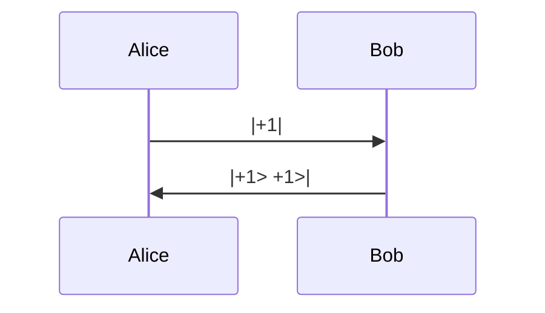
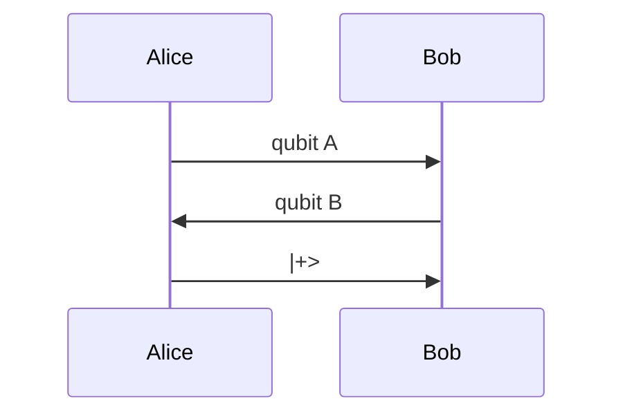
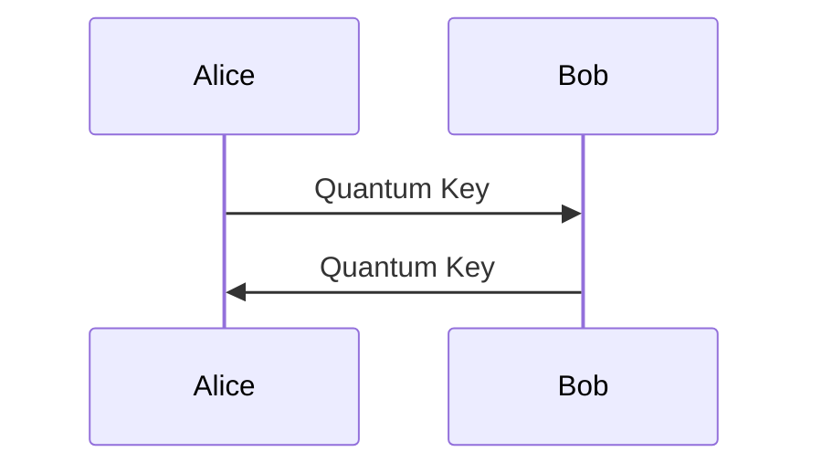

                 

### 文章标题：量子计算对世界可理解性的潜在革命

> 关键词：量子计算、世界可理解性、革命、核心技术、算法、应用

> 摘要：本文将探讨量子计算这一新兴技术对世界可理解性的潜在革命。通过对量子计算基础知识的深入分析，量子算法的讲解，以及其在密码学等领域中的应用，我们将逐步揭示量子计算如何改变我们对世界的认知，推动人类科技发展的新篇章。

### 第一部分：量子计算基础知识

#### 第1章：量子计算基本概念

##### 1.1 量子力学基础

量子力学是量子计算的理论基础，其核心概念包括量子比特与经典比特的对比、薛定谔方程与态叠加原理、量子纠缠与量子非定域性等。

- **量子比特与经典比特的对比**

量子比特（qubit）是量子计算的基本单元，与经典比特（bit）有本质区别。经典比特只能处于0或1的其中一个状态，而量子比特可以同时处于0和1的叠加状态。这种叠加状态可以用量子态向量表示，例如 $|\psi\rangle = \alpha|0\rangle + \beta|1\rangle$，其中$\alpha$和$\beta$是复数，满足$|\alpha|^2 + |\beta|^2 = 1$。

- **薛定谔方程与态叠加原理**

薛定谔方程是量子力学的核心方程，描述了量子系统随时间的演化。态叠加原理指出，量子系统的总状态是各个可能状态的叠加。

- **量子纠缠与量子非定域性**

量子纠缠是量子力学中的一种特殊现象，当两个或多个量子系统相互作用后，它们的状态将无法独立描述，而是相互依赖。量子非定域性则表明，量子系统的测量结果不受距离限制，这违背了经典物理的局域性原理。

##### 1.1.1 量子比特的量子态表示

以下是一个Mermaid流程图，展示了量子比特的量子态表示：

```mermaid
stateDiagram
    A[量子态] --> B{叠加态}
    B --> C{纠缠态}
    C --> D{混合态}
```

##### 1.2 量子计算模型

量子计算模型由量子门、量子电路和量子比特组成。量子门是量子计算的基本操作，类似于经典计算中的逻辑门。量子电路则是量子门的组合，用于实现复杂的量子算法。

- **量子门与量子电路**

量子门是作用于量子比特的线性变换，常用的量子门有 Hadamard 门、Pauli 门和相位门。量子电路是由这些量子门组成的序列，用于实现特定的量子计算任务。

- **量子计算的基本操作**

量子计算的基本操作包括初始化、量子门应用、测量等。初始化是将量子比特设置为特定的初始状态；量子门应用是使用量子门对量子比特进行操作；测量是读取量子比特的最终状态。

以下是一个Mermaid流程图，展示了量子计算的基本操作：



##### 1.3 量子纠缠与量子通信

量子纠缠是量子计算中的一种重要现象，可以用于量子通信和量子密码学等领域。

- **量子纠缠的概念与应用**

量子纠缠是指两个或多个量子系统之间的特殊关联，这种关联使得它们的状态无法独立描述。量子纠缠可以用于量子隐形传态和量子密钥分发等应用。

- **量子隐形传态**

量子隐形传态是指将一个量子系统的状态传输到另一个量子系统上的过程。以下是一个Mermaid流程图，展示了量子隐形传态的过程：



- **量子密钥分发**

量子密钥分发是一种基于量子纠缠的加密通信技术，可以确保通信双方之间的密钥不会被窃听。以下是一个Mermaid流程图，展示了量子密钥分发的过程：



#### 第2章：量子算法

##### 2.1 Shor算法

Shor算法是量子计算中的一种重要算法，可以用于求解大整数因数分解。以下是一个Shor算法的伪代码：

```python
def shor(N):
    # 使用量子计算机求解 N 的因子分解
    # 伪代码，实际需要使用量子算法库实现
    period = find_period(N)
    factors = find_factors(N, period)
    return factors
```

##### 2.2 量子搜索算法

量子搜索算法是量子计算中的一种高效搜索算法，可以用于解决组合优化问题。以下是一个Grover算法的伪代码：

```python
def grover_search(oracle, database):
    # 使用量子计算机优化搜索算法
    # 伪代码，实际需要使用量子算法库实现
    superposition = initialize_state(database_size)
    for _ in range(sqrt(N)):
        apply_grover_operator(oracle, superposition)
    return measure(superposition)
```

##### 2.3 量子模拟算法

量子模拟算法是用于模拟量子系统演化的算法。以下是一个量子模拟算法的伪代码：

```python
def quantum_simulation(hamiltonian, time_steps):
    # 使用量子计算机模拟量子系统演化
    # 伪代码，实际需要使用量子算法库实现
    state = initialize_state()
    for _ in range(time_steps):
        apply_hamiltonian(hamiltonian, state)
    return state
```

### 第二部分：量子计算的应用

#### 第3章：量子计算在密码学中的应用

量子计算在密码学中具有广泛的应用前景，可以用于构建安全的量子密码系统。以下将介绍量子密码系统，包括量子密钥分发（QKD）和量子安全通信。

##### 3.1 量子密码系统

量子密码系统是一种基于量子力学原理的加密通信技术，可以确保通信双方之间的信息不会被窃听。量子密钥分发（QKD）是量子密码系统中的一种核心技术。

- **量子密钥分发（QKD）**

量子密钥分发（QKD）是一种基于量子纠缠的密钥分发技术。在QKD中，通信双方通过量子纠缠对进行通信，确保通信过程中无法被窃听。以下是一个QKD的流程：

1. Alice和Bob分别生成一对量子纠缠对。
2. Alice将其中一个量子比特发送给Bob。
3. Alice和Bob分别对量子比特进行测量，并根据测量结果生成共享密钥。

通过QKD，通信双方可以生成一个安全的密钥，并且可以检测到任何窃听行为。

##### 3.2 量子安全通信

量子安全通信是量子密码系统的一种应用，可以通过量子密钥分发实现安全通信。在量子安全通信中，通信双方使用量子密钥进行加密和解密，确保通信内容不会被窃听和篡改。

综上所述，量子计算对世界可理解性产生了深远的影响。通过量子计算的基础知识、量子算法的应用，以及量子密码系统的构建，我们可以看到量子计算如何改变我们对世界的认知，推动人类科技发展的新篇章。在未来，量子计算将继续在各个领域发挥重要作用，为人类带来更多的创新和突破。作者：AI天才研究院/AI Genius Institute & 禅与计算机程序设计艺术 /Zen And The Art of Computer Programming。

