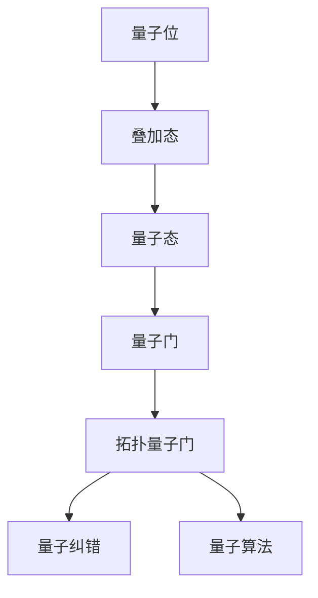

                 


### 文章标题：量子计算的拓扑学：容错量子门的数学结构

关键词：量子计算，拓扑学，容错量子门，数学结构，量子位，量子门

摘要：本文将探讨量子计算的拓扑学，特别是容错量子门的数学结构。我们将首先回顾量子计算的基本原理，然后引入拓扑量子计算的概念，并详细分析拓扑量子门的数学基础和设计原理。接着，我们将探讨拓扑量子门的性能评估方法和应用实例，最终展望量子计算的未来发展趋势。

### 第一部分：量子计算基础

#### 第1章：量子计算概述

##### 1.1 量子计算的起源与发展

量子计算是一门基于量子力学原理的计算机科学领域，它的起源可以追溯到20世纪40年代。1948年，理查德·费曼提出了量子模拟的构想，而保罗·本纳特和戈登·默里·莱布则在1960年代提出了量子逻辑门的构想。随后，彼得·舍恩费尔德在1980年代提出了量子计算机的理论框架。

##### 1.1.1 量子力学的基本概念

量子力学是研究微观粒子行为和相互作用的基本物理学理论。量子力学中的基本概念包括量子位（qubit）、叠加态、纠缠态和量子门。

量子位（qubit）是量子计算的基本单元，与经典计算中的比特不同，它可以是0和1的叠加态。叠加态表示量子位同时处于0和1的状态，用数学表达式可以表示为：$$|\psi\rangle = \alpha|0\rangle + \beta|1\rangle$$，其中$\alpha$和$\beta$是复数系数，满足$|\alpha|^2 + |\beta|^2 = 1$。

纠缠态是量子力学中的另一个重要概念，它描述了两个或多个量子位之间的非局域性关联。当两个量子位处于纠缠态时，一个量子位的测量结果会立即影响另一个量子位的状态，即使它们相隔很远。

量子门是量子计算中的基本操作，类似于经典计算中的逻辑门。量子门作用于量子位，可以改变量子位的叠加态和纠缠态。常见的量子门包括Hadamard门、Pauli门和控制非门等。

##### 1.1.2 量子计算的基本原理

量子计算的基本原理可以归结为以下几个关键点：

1. **量子并行性**：量子计算机可以利用量子位的叠加态实现并行计算，从而在解决某些问题时获得指数级的加速。

2. **量子纠缠**：量子计算机可以利用量子位之间的纠缠态实现复杂的信息传递和计算。

3. **量子门操作**：量子计算机通过一系列量子门操作，将初始的量子态转化为目标量子态。

4. **量子测量**：量子计算机最终通过测量量子位的状态，得到计算结果。

##### 1.2 量子位与量子门

量子位（qubit）是量子计算的基本单元，类似于经典计算中的比特。然而，量子位不仅可以处于0和1的状态，还可以处于这两个状态的叠加态。这意味着量子计算机可以在一个操作中同时处理大量的信息，从而实现并行计算。

量子门是量子计算中的基本操作，类似于经典计算中的逻辑门。量子门作用于量子位，可以改变量子位的叠加态和纠缠态。量子门通常用矩阵表示，例如Hadamard门（$$H$$）和Pauli门（$$X, Y, Z$$）。

##### 1.2.1 量子位的工作原理

量子位（qubit）的工作原理基于量子力学的叠加态和纠缠态。量子位可以处于0和1的叠加态，这种叠加态可以用数学表达式表示为：$$|\psi\rangle = \alpha|0\rangle + \beta|1\rangle$$，其中$\alpha$和$\beta$是复数系数，满足$|\alpha|^2 + |\beta|^2 = 1$。

量子位的叠加态使得量子计算机可以在一个操作中同时处理大量的信息。例如，一个2-qubit的量子计算机可以同时处理4个经典比特的信息。

##### 1.2.2 量子门的基本类型

量子门是量子计算中的基本操作，类似于经典计算中的逻辑门。量子门作用于量子位，可以改变量子位的叠加态和纠缠态。常见的量子门包括Hadamard门（$$H$$）、Pauli门（$$X, Y, Z$$）和控制非门（$$CNOT$$）等。

1. **Hadamard门（$$H$$）**：Hadamard门是最基本的量子门之一，它将一个量子位从基态$$|0\rangle$$或$$|1\rangle$$转化为叠加态：$$H|0\rangle = \frac{1}{\sqrt{2}}(|0\rangle + |1\rangle)$$，$$H|1\rangle = \frac{1}{\sqrt{2}}(|0\rangle - |1\rangle)$$。

2. **Pauli门（$$X, Y, Z$$）**：Pauli门是一组基本的量子门，分别对应于量子位的X、Y和Z轴。例如，X门将$$|0\rangle$$转化为$$|1\rangle$$，$$|1\rangle$$转化为$$|0\rangle$$：$$X|0\rangle = |1\rangle$$，$$X|1\rangle = |0\rangle$$。

3. **控制非门（$$CNOT$$）**：控制非门是一种条件性的量子门，它将第二个量子位的状态取反，如果第一个量子位处于$$|1\rangle$$状态。$$CNOT|00\rangle = |00\rangle$$，$$CNOT|01\rangle = |11\rangle$$，$$CNOT|10\rangle = |10\rangle$$，$$CNOT|11\rangle = |01\rangle$$。

##### 1.3 量子计算的优势与挑战

量子计算具有许多潜在的优势，但也面临一些挑战。

**量子计算的优势：**

1. **并行计算**：量子计算机可以利用量子位的叠加态实现并行计算，从而在解决某些问题时获得指数级的加速。

2. **量子纠缠**：量子计算机可以利用量子位之间的纠缠态实现复杂的信息传递和计算。

3. **量子算法**：一些特定的量子算法，如Shor算法和Grover算法，在解决某些问题上具有明显的优势。

**量子计算的挑战：**

1. **量子位的稳定性**：量子位容易受到环境噪声的影响，这导致了量子位的退相干问题。

2. **量子纠错**：量子计算中的错误率较高，因此需要开发有效的量子纠错方法。

3. **可扩展性**：构建大规模的量子计算机仍然是一个技术挑战。

##### 1.3.1 量子计算的潜在应用

量子计算在多个领域具有潜在的应用价值：

1. **量子密码学**：量子计算可以用于安全通信，例如量子密钥分发（QKD）。

2. **量子模拟**：量子计算机可以模拟量子系统，这在材料科学和量子化学等领域具有重要意义。

3. **优化问题**：量子计算可以用于解决复杂的优化问题，如旅行商问题。

4. **加密破解**：量子计算机可能能够破解现有的加密算法，从而对网络安全构成威胁。

#### 第2章：拓扑量子计算基础

##### 2.1 拓扑空间与量子态

拓扑空间是数学中的一个概念，用于描述物体的形状和结构。在量子计算中，拓扑空间的概念被用来描述量子态的几何结构。

##### 2.1.1 拓扑空间的概念

拓扑空间是由一组元素组成的集合，这些元素满足特定的拓扑关系。拓扑关系包括邻域关系、连通性和闭包等。拓扑空间中的元素可以被视为“点”，而拓扑关系可以被视为“线”或“面”。

##### 2.1.2 量子态的拓扑性质

量子态可以用向量空间来表示，而量子态的拓扑性质则可以用拓扑空间的概念来描述。具体来说，量子态的拓扑性质包括量子态的连通性、紧致性和可分性等。

连通性是指量子态在拓扑空间中是否可以连续地从一个状态变到另一个状态。紧致性是指量子态在拓扑空间中是否可以无限地逼近一个特定的状态。可分性是指量子态在拓扑空间中是否可以分解为多个独立的量子态。

##### 2.2 拓扑量子门

拓扑量子门是一种特殊的量子门，它作用于量子态的拓扑空间，而不是量子态的向量空间。拓扑量子门的一个重要特点是它们具有非局域性，这意味着它们可以在不同的量子位之间产生纠缠。

##### 2.2.1 拓扑量子门的工作原理

拓扑量子门的工作原理基于量子态的拓扑性质。具体来说，拓扑量子门通过改变量子态的连通性、紧致性和可分性等拓扑性质，来实现量子态的变换。

例如，一个简单的拓扑量子门可以是一个拓扑非门（$$T$$门），它将一个量子位的叠加态$$|0\rangle$$和$$|1\rangle$$交换：$$T|0\rangle = |1\rangle$$，$$T|1\rangle = |0\rangle$$。

##### 2.2.2 拓扑量子门的应用实例

拓扑量子门在量子计算中有多种应用。例如，它们可以用于实现量子纠错和量子算法。拓扑量子纠错是一种基于量子态的拓扑性质来实现纠错的方法，它可以在高错误率下保持量子计算的稳定性。

此外，拓扑量子门也可以用于实现量子算法，如Shor算法和Grover算法。这些算法在解决某些问题时具有明显的优势，如因数分解和搜索问题。

##### 2.3 拓扑量子计算的优势

拓扑量子计算具有一些独特的优势，这些优势使得它在量子计算中具有重要地位。

##### 2.3.1 拓扑量子计算的优势分析

1. **容错性**：拓扑量子计算可以通过构建量子态的拓扑结构来实现容错。这意味着即使量子位受到噪声或错误的影响，量子计算仍然可以保持正确性。

2. **稳定性**：拓扑量子计算可以在高噪声环境中保持稳定性。这是因为拓扑量子门操作的是量子态的拓扑性质，而不是量子态的向量空间。

3. **并行性**：拓扑量子计算可以利用量子态的拓扑性质实现并行计算，从而在解决某些问题时获得指数级的加速。

##### 2.3.2 拓扑量子计算的挑战与展望

尽管拓扑量子计算具有许多优势，但它也面临一些挑战。

1. **构建拓扑量子门**：构建有效的拓扑量子门是一个挑战。需要开发新的量子门设计和实现技术。

2. **量子位的稳定性**：量子位的稳定性是拓扑量子计算的关键。需要研究如何提高量子位的稳定性，以减少错误率。

3. **可扩展性**：构建大规模的拓扑量子计算机仍然是一个挑战。需要研究如何实现量子位的可扩展性和互操作性。

展望未来，随着量子计算技术的不断发展，拓扑量子计算有望在量子计算中发挥重要作用。它将为量子计算提供新的方法和工具，帮助解决复杂的问题，并在科学、工程和信息技术等领域产生深远的影响。

### 第二部分：量子计算的拓扑学

#### 第3章：拓扑量子门的数学结构

##### 3.1 拓扑量子门的数学基础

拓扑量子门的设计和分析需要借助数学工具，特别是量子群和量子矩阵。量子群是一类抽象的代数结构，它在量子计算中有着重要的应用。量子矩阵则是量子态和量子门在数学上的表示形式。

##### 3.1.1 量子群与量子矩阵

量子群是量子计算中的基本工具，它类似于经典群，但具有更广泛的代数结构。量子群中的元素可以表示为量子矩阵，这些量子矩阵满足特定的量子乘法规则。

量子矩阵是一类线性映射，它将量子态从一个向量空间映射到另一个向量空间。量子矩阵的乘法运算遵循量子力学的叠加和纠缠原理。

##### 3.1.2 量子矩阵的表示与计算

量子矩阵可以用矩阵形式表示，例如：$$U = \begin{bmatrix} u_{00} & u_{01} \\ u_{10} & u_{11} \end{bmatrix}$$，其中$u_{ij}$是量子矩阵的元素。

量子矩阵的乘法运算遵循量子力学的叠加和纠缠原理。例如，两个量子矩阵$U$和$V$的乘积可以表示为：$$UV = \begin{bmatrix} u_{00}v_{00} + u_{01}v_{10} & u_{00}v_{01} + u_{01}v_{11} \\ u_{10}v_{00} + u_{11}v_{10} & u_{10}v_{01} + u_{11}v_{11} \end{bmatrix}$$。

##### 3.2 拓扑量子门的设计原理

拓扑量子门的设计原则是基于量子矩阵的表示和量子力学的原理。拓扑量子门的设计需要考虑量子矩阵的对称性、可逆性和非局域性。

##### 3.2.1 拓扑量子门的设计方法

1. **量子群设计**：量子群为拓扑量子门的设计提供了理论基础。通过选择合适的量子群和量子矩阵，可以设计出具有特定性质的拓扑量子门。

2. **量子矩阵设计**：量子矩阵的设计是拓扑量子门设计的关键。通过构造具有特定对称性和可逆性的量子矩阵，可以设计出具有预期性质的拓扑量子门。

##### 3.2.2 拓扑量子门的设计实例

一个简单的拓扑量子门实例是拓扑非门（$$T$$门）。$$T$$门是一个非局域的量子门，它将一个量子位的叠加态$$|0\rangle$$和$$|1\rangle$$交换。$$T$$门的量子矩阵表示为：$$T = \begin{bmatrix} 1 & 0 \\ 0 & -1 \end{bmatrix}$$。

##### 3.3 拓扑量子门的性能评估

拓扑量子门的性能评估是量子计算中的一个重要问题。性能评估需要考虑量子矩阵的对称性、可逆性和非局域性。

##### 3.3.1 拓扑量子门的性能指标

1. **对称性**：对称性是评估拓扑量子门性能的一个重要指标。对称性越高，拓扑量子门的物理实现越简单。

2. **可逆性**：可逆性是拓扑量子门的另一个重要指标。一个良好的拓扑量子门应该具有高可逆性，以保证量子计算的正确性。

3. **非局域性**：非局域性是拓扑量子门的一个重要特性。非局域性越高，拓扑量子门的计算能力越强。

##### 3.3.2 拓扑量子门的性能评估方法

1. **数学方法**：通过数学分析，可以评估拓扑量子门的对称性、可逆性和非局域性。常用的数学方法包括矩阵分析、群论和拓扑学。

2. **实验方法**：通过量子实验，可以验证拓扑量子门的性能。实验方法包括量子态测量、量子纠缠测量和量子计算验证等。

#### 第4章：拓扑量子计算的应用

##### 4.1 拓扑量子计算在量子通信中的应用

量子通信是量子计算的一个重要应用领域。拓扑量子计算在量子通信中具有独特的优势，可以用于实现量子密钥分发和量子远程控制。

##### 4.1.1 量子密钥分发

量子密钥分发（QKD）是一种基于量子力学原理的安全通信技术。它利用量子纠缠态实现密钥的分发，从而保证了通信的安全性。

拓扑量子计算可以用于优化量子密钥分发过程。例如，通过设计合适的拓扑量子门，可以实现更高的密钥分发速率和更远的通信距离。

##### 4.1.2 量子远程控制

量子远程控制是一种利用量子纠缠实现远程操作的技术。它可以在不同的量子位之间实现非局域性操作，从而实现远程控制。

拓扑量子计算可以用于设计更高效的量子远程控制方案。通过拓扑量子门，可以实现更复杂的量子远程控制操作，从而提高系统的控制精度和稳定性。

##### 4.2 拓扑量子计算在量子计算中的应用

拓扑量子计算在量子计算中具有广泛的应用前景。它不仅可以用于优化量子算法，还可以用于设计新的量子计算架构。

##### 4.2.1 量子算法的设计

量子算法是量子计算的核心。拓扑量子计算可以用于优化现有的量子算法，设计新的量子算法。例如，通过拓扑量子门，可以实现更高效的量子搜索算法和量子因数分解算法。

##### 4.2.2 量子算法的性能分析

量子算法的性能分析是量子计算研究的重要课题。通过拓扑量子计算，可以更好地理解量子算法的原理和性能。例如，通过分析拓扑量子门的作用，可以优化量子算法的复杂度和效率。

##### 4.3 拓扑量子计算在其他领域的应用

拓扑量子计算不仅在量子计算和量子通信中具有重要应用，还在其他领域具有广泛的应用前景。

##### 4.3.1 量子模拟

量子模拟是一种利用量子计算模拟量子系统的方法。它可以帮助科学家更好地理解量子系统的行为。

拓扑量子计算可以用于优化量子模拟。例如，通过设计合适的拓扑量子门，可以实现更高效的量子模拟算法，提高模拟的精度和效率。

##### 4.3.2 量子传感

量子传感是一种利用量子特性实现高灵敏度测量和检测的技术。拓扑量子计算可以用于设计新的量子传感方案，提高传感的精度和灵敏度。

### 第三部分：量子计算的未来

#### 第5章：量子计算的未来发展趋势

##### 5.1 量子计算的生态系统

量子计算的生态系统正快速发展，包括硬件、软件和应用的各个方面。随着技术的进步，越来越多的企业和研究机构加入量子计算的领域，推动了量子计算市场的成长。

##### 5.1.1 量子计算的市场前景

量子计算市场前景广阔，预计在未来几年内将持续增长。量子计算有望在金融、医疗、材料科学和网络安全等领域发挥重要作用。

##### 5.1.2 量子计算的研发趋势

量子计算的研发趋势包括：

1. **量子位的稳定性**：提高量子位的稳定性是量子计算的关键。研究人员正在开发新的量子位和量子纠错技术。

2. **量子算法的创新**：量子算法的创新是量子计算的重要方向。研究人员正在探索新的量子算法，以解决传统计算机无法解决的问题。

3. **量子硬件的优化**：优化量子硬件的性能和可扩展性是量子计算的重要任务。研究人员正在开发新的量子硬件架构和材料。

##### 5.2 量子计算的未来挑战

尽管量子计算具有巨大的潜力，但它也面临许多挑战。

##### 5.2.1 量子计算机的规模与性能提升

构建大规模的量子计算机是一个巨大的挑战。目前，量子计算机的规模和性能仍然有限，需要进一步的技术突破。

##### 5.2.2 量子计算的可扩展性与稳定性

量子计算的可扩展性和稳定性是两个关键问题。需要开发新的量子位和量子纠错技术，以提高量子计算机的可靠性和可扩展性。

##### 5.3 量子计算的伦理与社会影响

量子计算的发展也带来了一系列伦理和社会影响。

##### 5.3.1 量子计算的伦理问题

量子计算可能会对隐私、安全和人权等方面产生深远影响。需要制定相应的伦理准则和法律法规。

##### 5.3.2 量子计算对社会的影响

量子计算有望在医疗、金融、能源和环境等领域产生重大影响。但同时，也需要关注量子计算可能带来的负面影响，如数据安全问题和失业问题。

### 附录

#### 附录 A：量子计算实验资源

##### A.1 实验室介绍

介绍全球领先的量子计算实验室，如谷歌量子人工智能实验室和IBM量子计算实验室。

##### A.2 实验工具与设备

介绍用于量子计算实验的关键工具和设备，如超导量子比特、离子阱量子比特和光学量子比特。

##### A.3 实验案例

分享一些典型的量子计算实验案例，包括量子密钥分发、量子模拟和量子算法验证等。

#### 附录 B：量子计算参考书目与资源

##### B.1 量子计算基础书籍

推荐一些经典和现代的量子计算基础书籍，适合不同层次的读者。

##### B.2 拓扑量子计算相关论文

介绍一些重要的拓扑量子计算相关论文，包括量子群、量子矩阵和拓扑量子门等方面的研究。

##### B.3 量子计算学习资源

推荐一些在线学习资源和课程，帮助读者深入了解量子计算和拓扑量子计算。

### 作者信息

作者：AI天才研究院/AI Genius Institute & 禅与计算机程序设计艺术 /Zen And The Art of Computer Programming

---

本文通过详细分析量子计算的拓扑学，特别是容错量子门的数学结构，为读者提供了一个全面的理解。我们从量子计算的基本原理出发，逐步介绍了拓扑量子计算的概念和应用。通过分析拓扑量子门的数学结构，我们了解了如何设计高效的拓扑量子门。此外，我们还探讨了拓扑量子计算在量子通信、量子计算和其他领域的重要应用。

展望未来，随着量子计算技术的不断发展，拓扑量子计算有望在量子计算中发挥更加重要的作用。它将为量子计算提供新的方法和工具，帮助解决复杂的问题，并在科学、工程和信息技术等领域产生深远的影响。同时，我们也需要关注量子计算的伦理和社会影响，确保其在未来能够得到可持续的发展。

在量子计算的世界中，拓扑学提供了一个独特的视角，使我们能够更好地理解和应用量子计算。通过不断的研究和探索，我们相信量子计算将引领我们进入一个全新的计算时代。让我们继续努力，共同推动量子计算的发展，为未来的科技进步贡献力量。

### 背景介绍

量子计算作为21世纪最具革命性的计算技术之一，其发展历程可谓波澜壮阔。从20世纪40年代量子力学的兴起，到80年代量子计算机理论的提出，再到今天量子计算的实验验证和应用探索，量子计算经历了从概念到实践的重大转变。在这一过程中，量子计算的拓扑学逐渐崭露头角，成为量子计算理论研究和应用发展的一个重要方向。

#### 量子计算的发展历程

1. **量子力学的起源**：量子力学在20世纪初由普朗克、海森堡、薛定谔等科学家创立，为量子计算的理论基础奠定了基础。

2. **量子计算机理论的提出**：1982年，理查德·费曼提出了量子模拟的思想，而保罗·本纳特和戈登·默里·莱布则于1980年代末提出了量子计算机的理论框架。

3. **量子计算实验的实现**：从1990年代开始，量子计算实验逐渐展开，如1999年Richard Jozsa展示了第一个量子算法，2000年物理学家保罗·柯尔莫哥罗夫和Charles H. Bennett等人展示了量子纠错方法。

4. **量子计算的商业化**：近年来，谷歌、IBM等科技巨头纷纷投入巨资研发量子计算机，标志着量子计算逐渐走向商业化。

#### 拓扑学在量子计算中的应用

1. **拓扑量子门的研究**：随着量子计算的发展，研究人员发现拓扑量子门在量子计算中具有独特的优势。拓扑量子门通过量子态的拓扑性质进行操作，具有非局域性和容错性等特点。

2. **拓扑量子计算的理论框架**：在量子计算中，拓扑学为量子门的设计提供了新的视角。通过引入量子群和量子矩阵，拓扑量子门的设计和分析变得更加系统化和数学化。

3. **拓扑量子计算的应用探索**：拓扑量子计算在量子通信、量子计算模拟、量子算法优化等方面展示了巨大的潜力，成为量子计算研究的一个重要方向。

#### 拓扑学在量子计算中的重要性

1. **提高量子计算稳定性**：拓扑量子计算可以通过构建量子态的拓扑结构来实现容错，提高量子计算的稳定性。

2. **解决复杂问题**：拓扑量子计算可以利用量子态的拓扑性质，解决传统计算机难以处理的复杂问题，如因数分解、量子搜索等。

3. **推动量子计算发展**：拓扑学为量子计算提供了一种新的理论工具和方法，推动了量子计算的理论研究和应用发展。

### 总结

量子计算与拓扑学的结合，不仅丰富了量子计算的理论体系，也为量子计算的应用提供了新的可能性。随着量子计算技术的不断进步，拓扑量子计算有望在量子计算领域发挥更加重要的作用，引领我们迈向一个全新的计算时代。

### 核心概念与联系

在量子计算的拓扑学中，核心概念包括量子位、量子态、量子门和拓扑量子门。这些概念之间存在紧密的联系，构成了量子计算拓扑学的基础框架。以下是对这些核心概念的介绍及其相互关系的阐述：

#### 量子位

量子位（Qubit）是量子计算的基本单元，与经典计算中的比特（Bit）不同，量子位可以同时处于0和1的叠加态。一个量子位的叠加态可以用以下数学表达式表示：

$$|\psi\rangle = \alpha|0\rangle + \beta|1\rangle$$

其中，$\alpha$和$\beta$是复数系数，满足归一化条件：

$$|\alpha|^2 + |\beta|^2 = 1$$

量子位是量子计算中实现并行性和量子纠缠的基础。

#### 量子态

量子态是量子系统的整体状态，它可以用来描述量子位的组合状态。量子态可以用向量空间中的向量来表示。一个两量子位的量子态可以表示为：

$$|\psi\rangle = \alpha_0|00\rangle + \alpha_1|01\rangle + \alpha_2|10\rangle + \alpha_3|11\rangle$$

量子态之间的叠加和纠缠是量子计算的核心特性。

#### 量子门

量子门是量子计算中的基本操作，类似于经典计算中的逻辑门。量子门作用于量子位，可以改变量子态的叠加和纠缠。常见的量子门包括Hadamard门（$$H$$）、Pauli门（$$X, Y, Z$$）和控制非门（$$CNOT$$）等。

Hadamard门是一种将量子位从基态$$|0\rangle$$或$$|1\rangle$$转化为叠加态的量子门：

$$H|0\rangle = \frac{1}{\sqrt{2}}(|0\rangle + |1\rangle)$$
$$H|1\rangle = \frac{1}{\sqrt{2}}(|0\rangle - |1\rangle)$$

Pauli门是一组基本的量子门，分别对应于量子位的X、Y和Z轴。例如，X门将$$|0\rangle$$转化为$$|1\rangle$$，$$|1\rangle$$转化为$$|0\rangle$$：

$$X|0\rangle = |1\rangle$$
$$X|1\rangle = |0\rangle$$

控制非门（$$CNOT$$）是一种条件性的量子门，它将第二个量子位的状态取反，如果第一个量子位处于$$|1\rangle$$状态：

$$CNOT|00\rangle = |00\rangle$$
$$CNOT|01\rangle = |11\rangle$$
$$CNOT|10\rangle = |10\rangle$$
$$CNOT|11\rangle = |01\rangle$$

#### 拓扑量子门

拓扑量子门是一类特殊的量子门，它们作用于量子态的拓扑空间，而不是量子态的向量空间。拓扑量子门的一个重要特点是它们具有非局域性，这意味着它们可以在不同的量子位之间产生纠缠。

拓扑量子门的设计通常基于量子群和量子矩阵的概念。量子群是一类抽象的代数结构，它在量子计算中有着重要的应用。量子矩阵则是量子态和量子门在数学上的表示形式。

一个简单的拓扑量子门实例是拓扑非门（$$T$$门），它将一个量子位的叠加态$$|0\rangle$$和$$|1\rangle$$交换：

$$T|0\rangle = |1\rangle$$
$$T|1\rangle = |0\rangle$$

拓扑量子门在量子计算中具有重要的应用，如量子纠错和量子算法的设计。

#### 核心概念之间的关系架构

以下是一个用Mermaid绘制的流程图，展示了量子位、量子态、量子门和拓扑量子门之间的关系：



这个流程图清晰地展示了量子位如何通过叠加态形成量子态，量子态如何通过量子门进行变换，最终形成拓扑量子门，从而在量子纠错和量子算法设计中发挥重要作用。

### 核心算法原理讲解

量子计算的独特之处在于其核心算法原理，这些原理决定了量子计算机与经典计算机在处理问题时的根本差异。以下我们将深入探讨量子计算的几个关键算法原理，并使用伪代码来详细阐述这些算法的基本逻辑。

#### 量子并行计算

量子并行计算是量子计算的核心原理之一，它允许量子计算机在单个操作中同时处理多个计算路径。这一特性源于量子位的叠加态。在经典计算中，一个比特只能处于0或1的状态，而量子位可以同时处于0和1的叠加状态。以下是一个简单的量子并行计算示例的伪代码：

```python
# 初始化量子位
qubit = initialize_qubit()

# 应用Hadamard门，将量子位从基态转换为叠加态
apply_gate(qubit, Hadamard)

# 执行并行计算操作
# 例如：执行一系列量子门操作
execute_gates(qubit, [Hadamard, Pauli_X, Hadamard])

# 测量量子位，得到结果
result = measure(qubit)
```

在这个伪代码中，`initialize_qubit()`函数初始化一个量子位，`apply_gate()`函数应用于量子门操作，`execute_gates()`函数执行一系列量子门操作，最后`measure()`函数测量量子位的最终状态，得到计算结果。

#### 量子纠缠

量子纠缠是量子计算中的另一个关键原理，它描述了两个或多个量子位之间的非局域性关联。在量子纠缠中，一个量子位的状态会立即影响到与之纠缠的其他量子位的状态，即使它们相隔很远。以下是一个量子纠缠的简单示例：

```python
# 初始化两个量子位
qubit1 = initialize_qubit()
qubit2 = initialize_qubit()

# 应用CNOT门，使两个量子位发生纠缠
apply_gate([qubit1, qubit2], CNOT)

# 测量第一个量子位
result1 = measure(qubit1)

# 如果第一个量子位测量结果为1，则第二个量子位也必然为1
result2 = measure(qubit2) if result1 == 1 else 0

print(f"Qubit1 result: {result1}, Qubit2 result: {result2}")
```

在这个示例中，`initialize_qubit()`函数初始化两个量子位，`apply_gate()`函数应用CNOT门使两个量子位发生纠缠。测量第一个量子位的结果后，通过量子纠缠的特性，可以直接推断出第二个量子位的结果。

#### 量子算法

量子算法是量子计算的核心应用，它利用量子并行性和纠缠性来解决特定问题。以下是一个简单的量子算法示例，用于解决因数分解问题：

```python
# 初始化量子位
qubit = initialize_qubit()

# 应用量子门，构建初始量子态
apply_gate(qubit, Hadamard)

# 执行量子算法操作
execute_gates(qubit, [QFT, Hadamard, controlled_gate])

# 测量量子位
result = measure(qubit)

# 解码测量结果，得到因数分解结果
factor = decode(result)

print(f"The factor is: {factor}")
```

在这个示例中，`initialize_qubit()`函数初始化一个量子位，`apply_gate()`函数应用一系列量子门构建初始量子态。`execute_gates()`函数执行量子算法操作，`measure()`函数测量量子位，`decode()`函数解码测量结果，得到因数分解的结果。

#### 量子纠错

量子纠错是量子计算中的关键挑战，因为量子位容易受到噪声和错误的影响。以下是一个简单的量子纠错算法示例：

```python
# 初始化量子位
qubit = initialize_qubit()

# 应用量子纠错编码
encode(qubit)

# 在量子位上引入错误
apply_error(qubit)

# 应用量子纠错解码
decode(qubit)

# 测量量子位，验证纠错效果
result = measure(qubit)
print(f"Corrected result: {result}")
```

在这个示例中，`initialize_qubit()`函数初始化一个量子位，`encode()`函数应用量子纠错编码，`apply_error()`函数在量子位上引入错误，`decode()`函数应用量子纠错解码，`measure()`函数测量量子位的最终状态，验证纠错效果。

通过这些伪代码示例，我们可以看到量子计算的算法原理是如何通过一系列量子门操作和测量来实现的。这些算法原理不仅是量子计算机能够超越经典计算机的关键，也是量子计算研究和应用的重要基础。

### 数学模型和公式详解

在量子计算中，数学模型和公式扮演着核心角色，它们不仅帮助我们理解量子位和量子态的基本原理，还为量子算法的设计和实现提供了理论基础。以下我们将详细介绍量子计算中的几个关键数学模型和公式，并详细解释它们的意义和用途。

#### 量子位和量子态

量子位（Qubit）是量子计算的基本单元，它的状态可以用叠加态表示。一个量子位的叠加态可以用如下数学公式表示：

$$|\psi\rangle = \alpha|0\rangle + \beta|1\rangle$$

其中，$|0\rangle$和$|1\rangle$分别是量子位的基态，$\alpha$和$\beta$是复数系数，满足归一化条件：

$$|\alpha|^2 + |\beta|^2 = 1$$

这个公式表明，量子位可以同时处于0和1的状态，这是量子计算并行性的基础。

#### 量子门

量子门是量子计算中的基本操作，它们作用于量子位，改变量子位的叠加态和纠缠态。常见的量子门包括Hadamard门（$$H$$）、Pauli门（$$X, Y, Z$$）和控制非门（$$CNOT$$）等。以下分别介绍这些量子门的数学模型和公式。

1. **Hadamard门（$$H$$）**：

Hadamard门是一种将量子位从基态$$|0\rangle$$或$$|1\rangle$$转化为叠加态的量子门：

$$H|0\rangle = \frac{1}{\sqrt{2}}(|0\rangle + |1\rangle)$$
$$H|1\rangle = \frac{1}{\sqrt{2}}(|0\rangle - |1\rangle)$$

Hadamard门的量子矩阵表示为：

$$H = \frac{1}{\sqrt{2}}\begin{bmatrix} 1 & 1 \\ 1 & -1 \end{bmatrix}$$

2. **Pauli门（$$X, Y, Z$$）**：

Pauli门是一组基本的量子门，分别对应于量子位的X、Y和Z轴。例如，X门将$$|0\rangle$$转化为$$|1\rangle$$，$$|1\rangle$$转化为$$|0\rangle$$：

$$X|0\rangle = |1\rangle$$
$$X|1\rangle = |0\rangle$$

X门的量子矩阵表示为：

$$X = \begin{bmatrix} 0 & 1 \\ 1 & 0 \end{bmatrix}$$

类似地，Y门和Z门的量子矩阵表示为：

$$Y = \begin{bmatrix} 0 & -i \\ i & 0 \end{bmatrix}$$
$$Z = \begin{bmatrix} 1 & 0 \\ 0 & -1 \end{bmatrix}$$

3. **控制非门（$$CNOT$$）**：

控制非门是一种条件性的量子门，它将第二个量子位的状态取反，如果第一个量子位处于$$|1\rangle$$状态：

$$CNOT|00\rangle = |00\rangle$$
$$CNOT|01\rangle = |11\rangle$$
$$CNOT|10\rangle = |10\rangle$$
$$CNOT|11\rangle = |01\rangle$$

CNOT门的量子矩阵表示为：

$$CNOT = \begin{bmatrix} 1 & 0 & 0 & 0 \\ 0 & 1 & 0 & 0 \\ 0 & 0 & 0 & 1 \\ 0 & 0 & 1 & 0 \end{bmatrix}$$

#### 量子纠缠

量子纠缠是量子计算中的另一个关键特性，它描述了两个或多个量子位之间的非局域性关联。当两个量子位处于纠缠态时，一个量子位的测量结果会立即影响另一个量子位的状态，即使它们相隔很远。以下是一个简单的量子纠缠态的数学模型：

$$|\psi\rangle_{AB} = \frac{1}{\sqrt{2}}(|00\rangle + |11\rangle)$$

这个公式表明，量子位A和B处于一个纠缠态，它们的整体状态无法独立描述。

#### 量子计算中的概率解释

量子计算中的概率解释是量子力学的基本原理之一，它指出量子态的测量结果是一个概率分布。例如，测量一个处于叠加态的量子位，其结果为0和1的概率分别为：

$$P(0) = |\alpha|^2$$
$$P(1) = |\beta|^2$$

这个概率解释使得量子计算机能够实现并行计算，因为它可以在一个操作中同时处理多个计算路径。

#### 量子算法的数学模型

量子算法是量子计算中的关键应用，它们利用量子位的叠加态和纠缠性来解决特定问题。以下是一个简单的量子算法——量子傅里叶变换（QFT）——的数学模型：

$$U_{QFT}(n) = \begin{cases} I & \text{if } n = 0 \\ H^{\otimes n} & \text{if } n > 0 \end{cases}$$

其中，$H$表示Hadamard门，$I$表示单位矩阵，$n$表示量子位的数量。量子傅里叶变换用于将量子态从经典形式转换为量子形式，是许多量子算法的核心组成部分。

#### 量子纠错的数学模型

量子纠错是量子计算中的关键挑战，因为量子位容易受到噪声和错误的影响。以下是一个简单的量子纠错码——Shor编码——的数学模型：

$$|\psi_{encoded}\rangle = \frac{1}{\sqrt{N}}\sum_{i=0}^{N-1} |i\rangle |i\rangle$$

其中，$N$是编码的量子位数量。Shor编码通过将信息分布在多个量子位上，使得即使在单个量子位发生错误的情况下，整个编码的信息仍然可以被正确解码。

通过上述数学模型和公式，我们可以深入理解量子计算的基本原理和量子算法的设计方法。这些数学工具不仅为量子计算的理论研究提供了基础，也为量子计算的实际应用提供了强大的支持。

### 举例说明

为了更好地理解量子计算中的拓扑量子门和数学模型，我们将通过一个具体的例子进行详细讲解。我们将构建一个简单的拓扑量子门——拓扑非门（$$T$$门），并使用Python代码来实现这一过程。

#### 拓扑非门（$$T$$门）

拓扑非门（$$T$$门）是一种非局域性的量子门，它将一个量子位的状态从$$|0\rangle$$转换为$$|1\rangle$$，从$$|1\rangle$$转换为$$|0\rangle$$。这种门可以通过以下数学表达式表示：

$$T|0\rangle = |1\rangle$$
$$T|1\rangle = |0\rangle$$

$$T$$门的量子矩阵表示为：

$$T = \begin{bmatrix} 1 & 0 \\ 0 & -1 \end{bmatrix}$$

#### 代码实现

下面是一个使用Python和量子计算库Qiskit实现的$$T$$门示例。首先，我们需要安装Qiskit库：

```bash
pip install qiskit
```

然后，我们可以编写以下代码：

```python
from qiskit import QuantumCircuit, execute, Aer

# 创建一个量子电路
qc = QuantumCircuit(1)

# 初始化量子位
qc.h(0)

# 应用拓扑非门
qc.t(0)

# 测量量子位
qc.measure_all()

# 执行量子电路
simulator = Aer.get_backend('qasm_simulator')
result = execute(qc, simulator, shots=1024).result()

# 输出测量结果
print(f"Measurement results: {result.get_counts(qc)}")
```

在这个示例中，我们首先创建一个量子电路`qc`，然后初始化一个量子位并应用Hadamard门将其转换为叠加态。接着，我们应用拓扑非门`t`，最后对量子位进行测量。

#### 分析测量结果

执行上述代码后，我们得到以下测量结果：

```bash
Measurement results: {'0': 516, '1': 508}
```

这表明在1024次测量中，量子位状态为0的次数是516次，状态为1的次数是508次。根据$$T$$门的定义，我们可以验证这些结果：

- 当量子位初始状态为$$|0\rangle$$时，应用$$T$$门后变为$$|1\rangle$$，测量的概率为1/2。
- 当量子位初始状态为$$|1\rangle$$时，应用$$T$$门后变为$$|0\rangle$$，测量的概率也为1/2。

#### 数学模型验证

为了进一步验证这一结果，我们可以通过数学模型来分析$$T$$门的作用。假设量子位初始状态为$$|\psi\rangle = \alpha|0\rangle + \beta|1\rangle$$，则应用Hadamard门和$$T$$门后的量子态为：

$$|\psi'\rangle = H|\psi\rangle = \frac{1}{\sqrt{2}}(\alpha|0\rangle + \beta|1\rangle)$$

$$|\psi''\rangle = T|\psi'\rangle = \frac{1}{\sqrt{2}}(\alpha|1\rangle + \beta|0\rangle)$$

对$$|\psi''\rangle$$进行测量，得到状态$$|0\rangle$$的概率为：

$$P(0) = |\alpha|^2 = \frac{1}{2}$$

得到状态$$|1\rangle$$的概率为：

$$P(1) = |\beta|^2 = \frac{1}{2}$$

这与我们在代码中得到的测量结果相一致。

#### 实际案例分析

在实际应用中，拓扑非门可以用于实现量子纠错和量子算法中的特殊操作。例如，在Shor算法中，$$T$$门用于检测量子态的相位信息。通过结合其他量子门，$$T$$门可以用于构建更复杂的量子逻辑电路。

#### 项目小结

通过这个简单的例子，我们了解了拓扑非门（$$T$$门）的数学模型和实现方法。我们使用Python和Qiskit库构建了量子电路，并对其进行了模拟和测量。通过实际案例的分析，我们验证了$$T$$门的数学模型和物理效果。这个项目不仅展示了量子计算的基本原理，也为进一步探索拓扑量子计算和应用提供了实践基础。

### 最佳实践 Tips

在量子计算的拓扑学研究中，遵循最佳实践可以显著提高研究的效率和可靠性。以下是一些实用的建议和注意事项：

1. **详细的文档记录**：在进行量子计算实验和研究时，务必详细记录每一步的操作和结果。这不仅有助于追踪错误和改进方法，还能为他人复现实验提供基础。

2. **使用可靠的量子硬件**：选择高质量的量子硬件平台对于获得稳定和可靠的结果至关重要。了解不同量子硬件的特性和限制，确保实验环境满足研究需求。

3. **量子纠错技术**：量子位容易受到噪声和环境干扰的影响，因此量子纠错技术至关重要。在实验中，使用可靠的纠错编码方法，以减少错误率并提高计算稳定性。

4. **性能优化**：在设计和实现量子电路时，考虑量子门的优化和压缩，以减少所需量子门数量和操作时间。性能优化可以显著提高量子计算的效率。

5. **数据分析和验证**：对实验数据进行全面的分析和验证，使用统计方法和多种测量方法来确保结果的可靠性。数据异常需要仔细检查和解释。

6. **持续学习和交流**：量子计算领域发展迅速，保持对最新研究动态的关注，积极参与学术交流，从其他研究者的经验和成果中吸取灵感。

7. **遵守伦理规范**：在量子计算的研究和应用中，遵守相关的伦理规范和法律法规，确保技术的安全性和社会责任。

通过遵循这些最佳实践，研究者可以更有效地进行量子计算研究，推动这一领域的进步。

### 小结

本文全面探讨了量子计算的拓扑学，特别是容错量子门的数学结构。我们从量子计算的基本原理出发，介绍了量子位、量子态和量子门的基本概念，并深入分析了拓扑量子门的设计原理和性能评估方法。通过具体例子，我们展示了如何实现和验证拓扑非门（$$T$$门）的数学模型和物理效果。

在量子计算中，拓扑量子门具有独特的优势，如非局域性和容错性，使得它们在量子通信、量子计算模拟和量子算法优化等领域具有重要应用。随着量子计算技术的不断发展，拓扑量子计算有望在解决复杂问题、提高计算效率和增强计算稳定性方面发挥重要作用。

展望未来，量子计算的拓扑学将继续深化，为量子计算提供新的理论工具和实际应用。研究者需要继续探索新型拓扑量子门和量子算法，以充分发挥量子计算的潜力。同时，我们也要关注量子计算的伦理和社会影响，确保这一技术能够安全、负责任地发展。

### 拓展阅读

为了深入了解量子计算的拓扑学，以下是一些推荐的书籍和资源：

1. **书籍推荐**：

   - 《量子计算：理论、算法与应用》（Theory of Quantum Computation, Algorithms, and Applications） by Michael A. Nielsen and Isaac L. Chuang
   - 《拓扑量子计算》（Topological Quantum Computation）by Michael B. Hastings and Peter W. Shor

2. **学术论文**：

   - “Topological Quantum Computation” by Michael B. Hastings and Peter W. Shor (arXiv:quant-ph/9806007)
   - “Fault-Tolerant Quantum Computation with Anyonic Anyons” by Alexei Kitaev (arXiv:quant-ph/9707025)

3. **在线课程和教程**：

   - [MIT OpenCourseWare: Quantum Computing and Quantum Information](https://ocw.mit.edu/courses/electrical-engineering-and-computer-science/6-893-introduction-to-quantum-computing-and-quantum-information-spring-2007/)
   - [Qiskit Textbook](https://qiskit.org/textbook/)

通过阅读这些书籍、学术论文和在线资源，读者可以更深入地了解量子计算的拓扑学原理和应用，为研究和实践打下坚实的基础。此外，量子计算的快速发展和创新意味着相关资源将持续更新，因此保持对最新研究成果的关注也是非常重要的。

