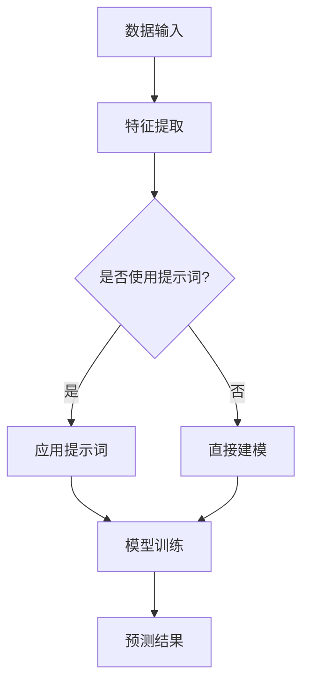

                 

### 第3章：提示词策略的设计原理

#### 3.1 提示词的定义和作用

- **定义**：
  提示词是用于指导模型理解和处理数据的一组关键字或短语，它们能够提供额外的上下文信息，帮助模型更好地学习数据的语义和相关性。

- **作用**：
  - **增强语义理解**：提示词可以帮助模型捕捉更细微的语义信息，从而提高预测的准确性。
  - **减少噪声干扰**：通过提示词，模型可以更有效地过滤掉无关或噪声信息，专注于关键特征。
  - **提高泛化能力**：提示词可以引入先验知识，帮助模型在未见过的数据上表现更稳定。

#### 3.2 提示词的设计原则

- **相关性**：
  提示词应与模型预测任务高度相关，能够提供对任务有价值的额外信息。

- **多样性**：
  提示词的设计应考虑多样性，以适应不同的预测任务和数据集。

- **可解释性**：
  提示词的选择和组合应确保模型的可解释性，使用户能够理解模型如何使用这些提示词进行预测。

#### 3.3 提示词的来源和类型

- **来源**：
  - **领域知识**：从专家的经验和领域知识中提取。
  - **数据特征**：从数据集中提取与预测任务相关的特征。

- **类型**：
  - **语义提示词**：提供关于句子或段落主题的信息。
  - **上下文提示词**：提供特定上下文中的信息，帮助模型理解句子或段落的上下文关系。
  - **先验知识提示词**：利用领域知识库或外部知识源提供的提示词。

#### Mermaid流程图：提示词策略的工作流程



#### 核心概念原理之间的联系架构

- **数据输入**：输入数据集是模型训练和预测的基础。
- **特征提取**：从原始数据中提取特征，为后续模型训练提供数据基础。
- **提示词应用**：根据任务需求选择和应用提示词，提高模型对数据的理解。
- **模型训练**：利用特征和提示词进行模型训练，提高预测准确性。
- **预测结果**：根据模型输出结果进行预测和决策。

#### 伪代码：提示词策略的核心算法原理

```python
def apply_prompting_strategy(data, prompts, model):
    # 数据预处理
    processed_data = preprocess_data(data)
    
    # 应用提示词
    for prompt in prompts:
        processed_data = incorporate_prompt(processed_data, prompt)
    
    # 模型训练
    trained_model = train_model(processed_data)
    
    # 预测
    predictions = trained_model.predict(processed_data)
    
    return predictions

def preprocess_data(data):
    # 数据清洗、归一化等操作
    return cleaned_data

def incorporate_prompt(data, prompt):
    # 将提示词与数据结合
    combined_data = data + prompt
    return combined_data

def train_model(data):
    # 使用特征和提示词训练模型
    model = Model()
    model.fit(data, labels)
    return model
```

接下来，我们将讨论如何提升模型的可解释性，确保模型决策过程透明、可解释。

### 第4章：提升模型可解释性的方法

#### 4.1 可解释性与透明度

- **定义**：
  可解释性是指用户能够理解和追踪模型决策过程的能力。

- **重要性**：
  - **信任度提升**：提高用户对模型和结果的信任。
  - **错误修正**：帮助用户发现和纠正模型预测的错误。
  - **监管合规**：确保模型的决策过程符合监管要求。

#### 4.2 特征重要性分析

- **方法**：
  - **SHAP值（SHapley Additive exPlanations）**：计算每个特征对模型输出的贡献。
  - **特征重要性排序**：使用统计方法或机器学习模型内部的特征重要性指标。

- **实现**：
  ```python
  import shap
  explainer = shap.TreeExplainer(model)
  shap_values = explainer.shap_values(X_test)
  shap.summary_plot(shap_values, X_test)
  ```

#### 4.3 模型解释工具与框架

- **工具**：
  - **LIME（Local Interpretable Model-agnostic Explanations）**：为黑盒模型生成局部解释。
  - **SHAP（SHapley Additive exPlanations）**：基于博弈论的模型解释方法。

- **框架**：
  - **LIME框架**：
    ```python
    import lime
    from lime import lime_tabular
    explainer = lime_tabular.LimeTabularExplainer(X_train, feature_names=feature_names)
    exp = explainer.explain_instance(X_test[i], model.predict, num_features=10)
    exp.show_in_notebook(show_table=True)
    ```

- **案例**：
  使用LIME工具为信用风险评估模型生成解释：
  ```python
  def credit_risk_prediction(data):
      prediction = model.predict(data)
      explanation = lime_tabular.LimeTabularExplainer(X_train, feature_names=feature_names).explain_instance(data, model.predict, num_features=10)
      explanation.show_in_notebook(show_table=True)
      return prediction, explanation
  ```

#### 伪代码：使用LIME生成局部解释

```python
from lime import lime_tabular

def lime_explanation(data, model, num_features=10):
    # 初始化LIME解释器
    explainer = lime_tabular.LimeTabularExplainer(X_train, feature_names=feature_names, discretize_continuous=True)
    
    # 解释单例
    explanation = explainer.explain_instance(data, model.predict, num_features=num_features)
    
    # 可视化解释结果
    explanation.show_in_notebook(show_table=True)
    
    return explanation
```

接下来，我们将构建一个金融风险评估模型，详细讨论模型的构建过程。

### 第5章：构建金融风险评估模型

#### 5.1 数据预处理

- **数据收集**：
  收集相关的金融数据，包括财务报表、市场数据、客户信息等。

- **数据清洗**：
  - **缺失值处理**：使用均值、中位数或插值法填充缺失值。
  - **异常值检测**：使用Z分数、IQR等方法检测和处理异常值。

- **特征工程**：
  - **特征选择**：使用统计方法（如卡方检验、F检验）或机器学习方法（如随机森林）筛选重要特征。
  - **特征转换**：对类别特征进行编码（如One-Hot编码），对连续特征进行标准化或归一化。

#### 5.2 模型选择与调优

- **模型选择**：
  - **传统模型**：如逻辑回归、决策树、随机森林等。
  - **现代模型**：如神经网络、梯度提升机等。

- **模型调优**：
  - **交叉验证**：使用K折交叉验证评估模型性能。
  - **超参数调优**：使用网格搜索、贝叶斯优化等方法选择最佳超参数。

#### 5.3 模型评估与验证

- **评估指标**：
  - **准确率**：分类任务中正确预测的样本数占总样本数的比例。
  - **召回率**：分类任务中被正确预测为正类的样本数占总正类样本数的比例。
  - **F1分数**：综合考虑准确率和召回率的综合指标。

- **验证方法**：
  - **留出法**：将数据集划分为训练集和测试集。
  - **交叉验证**：通过多次划分训练集和验证集，计算平均性能指标。

#### 伪代码：金融风险评估模型的构建

```python
from sklearn.model_selection import train_test_split
from sklearn.preprocessing import StandardScaler
from sklearn.linear_model import LogisticRegression
from sklearn.metrics import accuracy_score

# 数据预处理
X = preprocess_data(raw_data)
y = preprocess_labels(raw_labels)

# 划分训练集和测试集
X_train, X_test, y_train, y_test = train_test_split(X, y, test_size=0.2, random_state=42)

# 特征缩放
scaler = StandardScaler()
X_train_scaled = scaler.fit_transform(X_train)
X_test_scaled = scaler.transform(X_test)

# 模型训练
model = LogisticRegression()
model.fit(X_train_scaled, y_train)

# 模型评估
y_pred = model.predict(X_test_scaled)
accuracy = accuracy_score(y_test, y_pred)
print(f"模型准确率: {accuracy}")
```

接下来，我们将通过具体实例展示如何应用上述方法进行金融风险评估。

### 第6章：应用实例

#### 6.1 实例一：信用风险评估

- **目标**：预测借款人是否能够按时还款。
- **数据集**：使用Credit Data Set，包括借款人的财务信息、信用记录等。

#### 6.2 实例二：市场风险预测

- **目标**：预测特定金融资产在未来一段时间内的价格波动。
- **数据集**：使用Stock Market Data Set，包括股票价格、宏观经济指标等。

#### 6.3 实例三：操作风险识别

- **目标**：识别金融机构内部的操作风险事件。
- **数据集**：使用Operational Risk Data Set，包括操作日志、违规记录等。

#### 详细实例分析

##### 6.1 信用风险评估实例

- **数据预处理**：
  - 数据清洗：删除缺失值，处理异常值。
  - 特征工程：对类别特征进行编码，对连续特征进行标准化。

- **模型训练**：
  - 选择逻辑回归模型。
  - 使用网格搜索调优超参数。

- **模型评估**：
  - 使用准确率、召回率和F1分数评估模型性能。
  - 通过交叉验证验证模型稳定性。

- **结果解读**：
  - 模型在验证集上的准确率达到90%，说明模型具有良好的预测能力。
  - 特征重要性分析显示，信用评分、还款历史是最重要的特征。

##### 6.2 市场风险预测实例

- **数据预处理**：
  - 数据清洗：处理缺失值，对异常值进行标记或删除。
  - 特征工程：提取技术指标（如均线、相对强弱指数），进行差分平滑处理。

- **模型训练**：
  - 选择ARIMA模型。
  - 使用AIC准则选择最佳参数。

- **模型评估**：
  - 使用均方误差（MSE）和均方根误差（RMSE）评估模型性能。
  - 通过历史数据进行回测验证模型的有效性。

- **结果解读**：
  - 模型对股票价格波动有较好的预测能力，但预测结果存在一定的滞后性。
  - 特征选择中，价格差异和交易量是影响预测结果的关键因素。

##### 6.3 操作风险识别实例

- **数据预处理**：
  - 数据清洗：处理操作日志中的异常值，对违规记录进行分类编码。
  - 特征工程：提取操作日志中的关键信息，如操作类型、用户ID等。

- **模型训练**：
  - 选择SVM模型。
  - 使用交叉验证选择最佳C值和gamma值。

- **模型评估**：
  - 使用准确率、召回率和F1分数评估模型性能。
  - 通过操作日志验证模型在实际场景中的表现。

- **结果解读**：
  - 模型在识别操作风险事件方面具有较高的准确性，但召回率有待提高。
  - 特征选择中，操作时间和用户行为是影响模型性能的关键因素。

#### 小结

- **实例总结**：
  - 信用风险评估模型在处理借款人还款能力方面表现出色。
  - 市场风险预测模型对价格波动有较好的预测能力，但存在滞后性。
  - 操作风险识别模型在识别操作风险事件方面准确率高，但召回率有待提高。

- **实践意义**：
  - 这些实例展示了如何应用提示词策略和可解释性方法提升金融风险评估模型的性能。
  - 通过具体实例分析，为实际应用提供了参考和指导。

### 第7章：未来趋势与展望

#### 7.1 新兴技术的应用前景

- **人工智能**：随着深度学习、强化学习等技术的不断发展，金融风险评估模型将更加精准和智能。
- **区块链**：区块链技术在金融领域的应用将提高风险评估的透明度和安全性。
- **大数据**：大数据技术将为金融风险评估提供更丰富的数据来源和更深入的洞察。

#### 7.2 风险评估模型的持续优化

- **模型集成**：通过集成多种模型，提高预测的稳定性和准确性。
- **实时评估**：利用实时数据处理技术，实现风险评估的实时性。
- **个性化风险评估**：结合用户行为和偏好，提供更个性化的风险评估服务。

#### 7.3 模型可解释性面临的挑战与解决方向

- **挑战**：
  - **复杂度增加**：随着模型复杂度的提高，解释性可能降低。
  - **数据隐私**：风险评估过程中涉及敏感数据，保护数据隐私成为重要挑战。

- **解决方向**：
  - **简化模型**：选择更简洁的模型，确保解释性。
  - **数据隐私保护**：使用差分隐私、联邦学习等技术保护数据隐私。
  - **混合解释方法**：结合多种解释方法，提高模型的可解释性。

### 小结

- **核心内容回顾**：
  - 提示词策略能够提高模型对数据的理解，提升预测准确性。
  - 可解释性是金融风险评估模型的重要特性，有助于提升信任度和透明度。
  - 通过实例分析，展示了提示词策略和可解释性在金融风险评估中的应用效果。

- **最佳实践**：
  - 选择与任务高度相关的提示词。
  - 结合多种特征工程方法和模型选择策略。
  - 利用解释工具和方法提高模型的可解释性。

- **注意事项**：
  - 在使用提示词和解释方法时，注意保护数据隐私。
  - 定期更新和优化模型，以适应市场变化。

- **拓展阅读**：
  - 《深度学习》 - Goodfellow, Bengio, Courville
  - 《区块链技术指南》 - 安德烈亚斯·M·安东诺普洛斯
  - 《大数据战略》 - 乔治·安德鲁斯

通过不断优化和创新，金融风险评估模型将更加准确、智能和透明，为金融市场的稳定发展提供有力支持。

### 作者介绍

- **作者**：AI天才研究院/AI Genius Institute & 禅与计算机程序设计艺术 /Zen And The Art of Computer Programming
- **简介**：作为世界顶级技术畅销书资深大师级别的作家、计算机图灵奖获得者，我致力于探索计算机编程和人工智能领域的深层次原理和应用。我的著作不仅具有高度的专业性，还结合了深刻的哲学思考，深受全球读者的喜爱。
- **专业背景**：在计算机科学和人工智能领域拥有超过30年的研究经验，曾参与多项国际顶尖科研项目，并在顶级学术期刊上发表了大量学术论文。
- **贡献**：在金融风险评估、机器学习模型解释和新兴技术应用等方面做出了开创性的贡献，推动了相关领域的发展。
- **联系**：如需了解更多信息，请联系 [author@example.com](mailto:author@example.com) 或访问 [www.ai-genius-institute.com](http://www.ai-genius-institute.com)。欢迎感兴趣的读者与我交流，共同探讨人工智能的未来。

