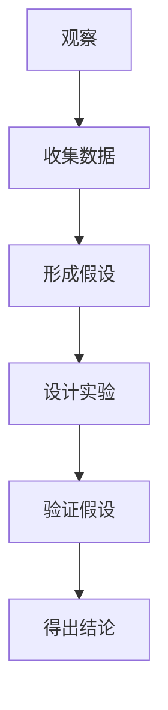
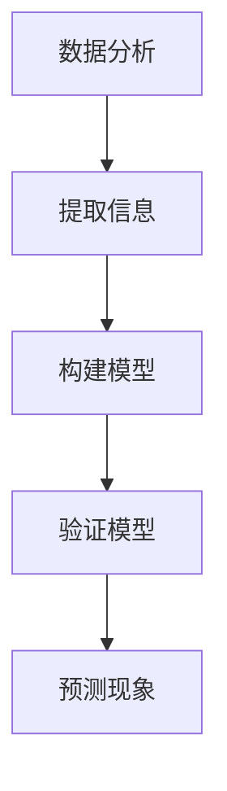
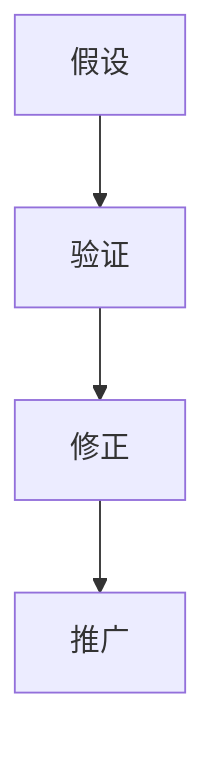
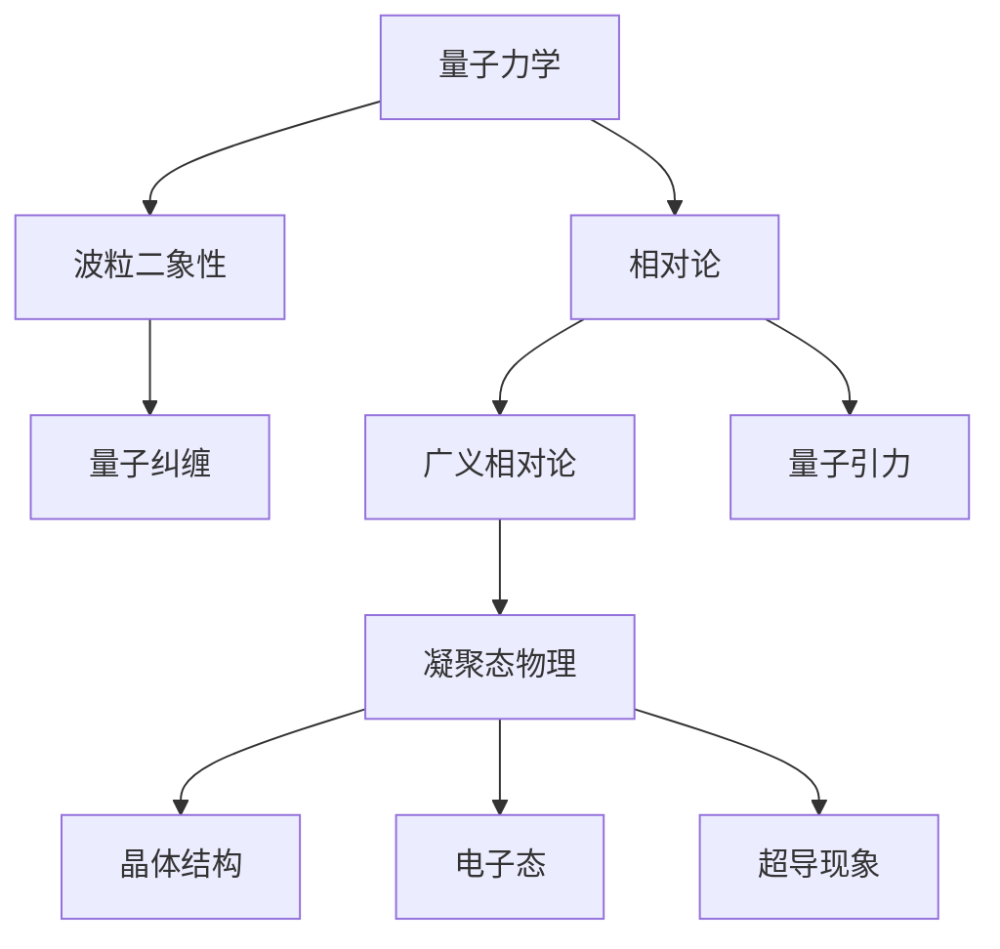
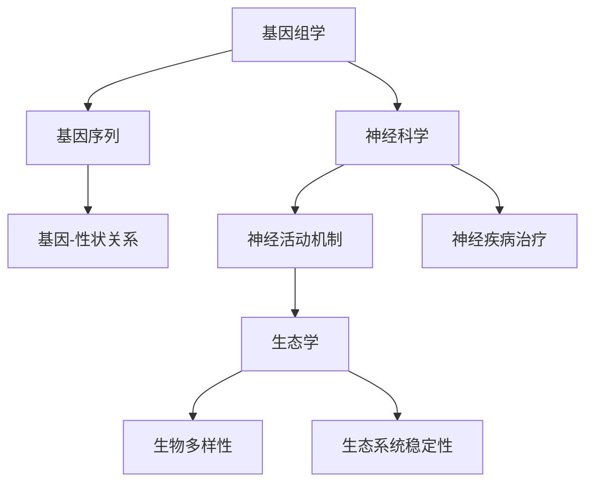
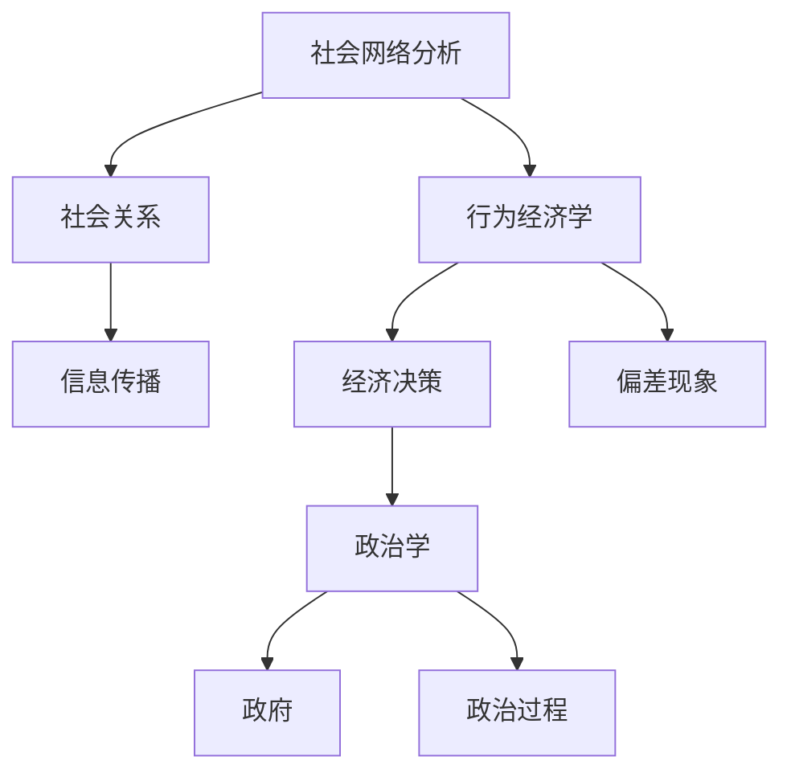
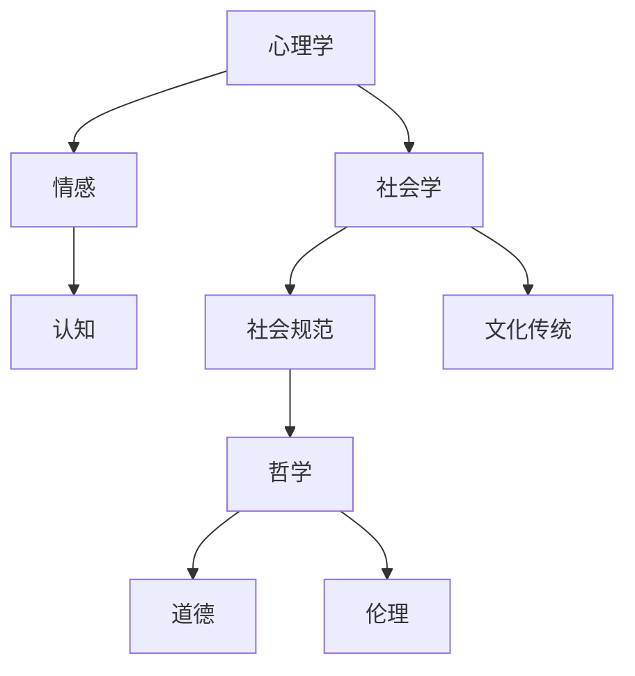
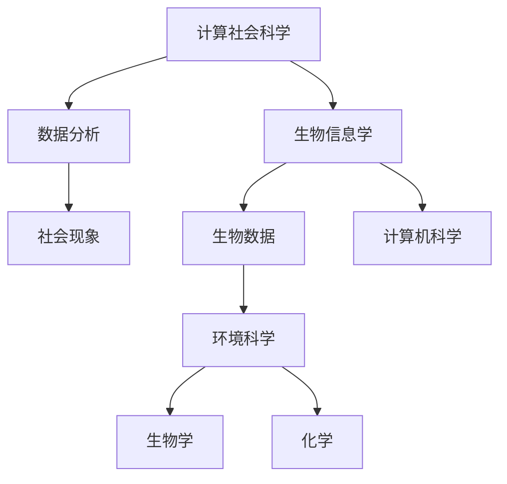

                 

# 文章标题：长期科学研究项目的价值：持续深化对世界本质的理解

## 关键词

- 长期科学研究项目
- 世界本质
- 理论框架
- 跨学科合作
- 实践案例
- 国际合作

## 摘要

本文旨在探讨长期科学研究项目在深化对世界本质理解方面的价值。通过分析科学研究的重要性、核心问题与挑战、研究方法与理论框架、跨学科合作以及实践案例等多个方面，本文揭示了长期科学研究项目在推动科学进步和促进人类对世界本质认识方面的独特作用。文章强调，科学研究不仅是探索未知世界的重要手段，更是推动社会发展和提升人类福祉的关键因素。通过深入剖析科学研究项目的各个方面，本文为未来的科学研究提供了有益的思路和借鉴。

---

# 《长期科学研究项目的价值：持续深化对世界本质的理解》目录大纲

## 第一部分：科学研究项目的重要性与价值

### 第1章：科学研究的本质与价值

#### 1.1 科学研究的重要性

#### 1.2 长期科学研究项目的独特价值

### 第2章：科学研究的核心问题与挑战

#### 2.1 核心问题识别与解决

#### 2.2 长期科学研究项目的挑战与应对策略

## 第二部分：世界本质的研究方法与理论框架

### 第3章：科学研究的方法论

#### 3.1 观察与实验方法

#### 3.2 数据分析与模型构建

### 第4章：科学研究中的理论框架

#### 4.1 基本科学理论框架

#### 4.2 理论框架的发展与演变

### 第5章：科学研究中的跨学科合作

#### 5.1 跨学科研究的优势

#### 5.2 跨学科合作的方法与策略

## 第三部分：世界本质的探索与发现

### 第6章：自然科学的深化理解

#### 6.1 物质世界的基本原理

#### 6.2 生命科学的探索

### 第7章：社会科学的前沿领域

#### 7.1 社会现象的解析

#### 7.2 人性的研究

### 第8章：跨学科整合与新的科学突破

#### 8.1 跨学科整合的探索

#### 8.2 新的科学突破与未来展望

## 第四部分：长期科学研究项目的实践案例

### 第9章：长期科学研究项目的成功案例

#### 9.1 项目简介

#### 9.2 项目成果与应用

### 第10章：长期科学研究项目的管理与组织

#### 10.1 项目管理策略

#### 10.2 项目组织结构与团队建设

### 第11章：长期科学研究项目的可持续发展

#### 11.1 项目资金的保障

#### 11.2 项目成果的传承与创新

## 第五部分：未来展望与挑战

### 第12章：未来科学研究的发展方向

#### 12.1 新的科学前沿领域

#### 12.2 科学研究的未来挑战与机遇

### 第13章：科学研究的国际合作与交流

#### 13.1 国际合作的现状与趋势

#### 13.2 国际交流的障碍与对策

## 附录

### 附录A：科学研究工具与资源

#### A.1 主流科研工具对比

#### A.2 科研资源的获取与利用

### 附录B：科学研究方法与技巧

#### B.1 科研方法概述

#### B.2 科研技巧与实践

### 附录C：科学研究案例精选

#### C.1 案例简介

#### C.2 案例分析与启示

---

## 第一部分：科学研究项目的重要性与价值

### 第1章：科学研究的本质与价值

#### 1.1 科学研究的重要性

科学研究是探索未知世界、揭示自然规律的重要手段。在科学技术日益发展的今天，科学研究已经成为推动社会进步和人类福祉提升的关键力量。科学研究的重要性体现在以下几个方面：

1. **推动技术进步**：科学研究的成果往往直接转化为技术进步，从而提高生产力，改善人们的生活质量。例如，计算机科学的发展，带来了信息技术的飞跃，极大地改变了人类的通信、娱乐和生活方式。

2. **解决现实问题**：科学研究能够帮助我们理解和解决现实世界中的各种问题，从环境污染、疾病治疗到社会问题，科学研究成果都发挥着重要作用。

3. **提升理论水平**：科学研究不仅关注实用技术，还致力于理论创新。通过深入的理论研究，我们能够更加深刻地理解世界的本质，推动科学理论的进步。

#### 1.2 长期科学研究项目的独特价值

长期科学研究项目具有独特的价值，主要体现在以下几个方面：

1. **持续性的创新**：长期项目能够积累丰富的经验和数据，为科学创新提供坚实的基础。这些数据不仅对当前的研究具有重要意义，也为未来的研究提供了宝贵的资源。

2. **跨学科合作**：长期项目往往需要多学科的知识和技能，通过跨学科合作，可以实现知识的融合和创新。

3. **解决复杂问题**：许多科学问题都非常复杂，需要长期、持续的研究才能解决。长期项目能够聚集更多的资源和人才，共同攻克这些难题。

#### 1.3 科学研究的核心问题与挑战

科学研究的核心问题与挑战包括：

1. **资源有限**：科学研究需要大量的资金、设备和人力资源。如何有效地利用这些资源，是科研项目管理的重要问题。

2. **技术瓶颈**：科学研究过程中，往往会遇到各种技术瓶颈。这些瓶颈可能来自实验技术、数据分析方法等方面。

3. **不确定性**：科学研究往往具有很大的不确定性。如何应对这种不确定性，是科学研究中的重要挑战。

#### 1.4 长期科学研究项目的挑战与应对策略

长期科学研究项目面临的挑战包括：

1. **项目管理的复杂性**：长期项目往往涉及多个学科、多个团队，管理难度大。需要建立有效的项目管理体系，确保项目顺利推进。

2. **持续的资金支持**：长期项目需要持续的资金支持。需要制定科学的资金规划，确保项目资金的稳定来源。

3. **科研人员的稳定性和流动性**：长期项目需要科研人员的稳定性和持续性。需要建立有效的激励机制，留住优秀的科研人员。

通过以上分析，我们可以看出，科学研究项目，尤其是长期科学研究项目，对深化对世界本质的理解具有重要意义。在接下来的章节中，我们将进一步探讨科学研究的方法论、理论框架以及跨学科合作等方面的内容。

---

## 第二部分：世界本质的研究方法与理论框架

### 第3章：科学研究的方法论

科学研究的方法论是科学探索的基本原则和路径，它是从自然现象中获取知识、解释现象和预测未来的系统方法。科学方法论的核心在于其实证性、可验证性和系统性。以下是科学研究方法论的关键组成部分：

#### 3.1 观察与实验方法

观察是科学研究的起点。通过直接观察自然现象，科学家可以收集到第一手的资料和数据。例如，天文学家通过望远镜观察星空，收集恒星和行星的数据。实验方法则是通过控制变量和重复操作，验证假设和理论。在实验室中，科学家可以使用各种仪器设备，进行精确的测量和控制，从而获得可靠的实验数据。

**核心概念与联系**

观察与实验方法之间的关系如图1所示：



**核心算法原理讲解**

观察与实验方法的伪代码如下：

```
function scientificResearch(phenomenon):
    data = observe(phenomenon)
    hypothesis = formHypothesis(data)
    experiment = designExperiment(hypothesis)
    result = performExperiment(experiment)
    conclusion = verifyHypothesis(hypothesis, result)
    return conclusion
```

#### 3.2 数据分析与模型构建

数据分析是科学研究的重要环节。通过数据分析，科学家可以从大量观测数据中提取有价值的信息，发现数据中的规律和模式。数据分析方法包括统计方法、机器学习算法等。模型构建则是将观测数据转化为理论模型，用以解释和预测现象。

**核心概念与联系**

数据分析与模型构建之间的关系如图2所示：



**数学模型和公式 & 详细讲解 & 举例说明**

数据分析中的常见数学模型包括线性回归模型、决策树模型等。以线性回归模型为例，其公式如下：

$$ y = wx + b $$

其中，\( y \) 是因变量，\( x \) 是自变量，\( w \) 是权重，\( b \) 是偏置。通过最小二乘法，我们可以估计出权重 \( w \) 和偏置 \( b \)：

$$ w = \frac{\sum(x_i - \bar{x})(y_i - \bar{y})}{\sum(x_i - \bar{x})^2} $$
$$ b = \bar{y} - w\bar{x} $$

**举例说明**

假设我们收集了一组数据，表示销售额 \( y \) 与广告投入 \( x \) 的关系。我们使用线性回归模型进行分析，得到权重 \( w \) 和偏置 \( b \) 后，可以预测未来的销售额。

#### 3.3 理论框架的发展与演变

科学理论框架是科学研究的基础，它提供了理解自然现象的视角和工具。理论框架的发展与演变是科学进步的重要标志。科学理论框架的建立通常需要经历以下几个阶段：

1. **假设阶段**：科学家基于观测数据和已有知识，提出初步的假设。
2. **验证阶段**：通过实验和观察，验证假设的正确性。
3. **修正阶段**：根据验证结果，修正和完善理论框架。
4. **推广阶段**：将理论框架应用到新的领域和问题中。

**核心概念与联系**

理论框架的发展与演变过程如图3所示：



**核心算法原理讲解**

理论框架的发展与演变的伪代码如下：

```
function theoryDevelopment(hypothesis):
    while not fullyVerified(hypothesis):
        result = performExperiments(hypothesis)
        if not valid(result):
            hypothesis = reviseHypothesis(hypothesis)
    return hypothesis
```

通过以上对科学研究方法论的详细分析，我们可以看到科学研究方法论的系统性、实证性和可验证性是确保科学研究有效进行的重要保障。在接下来的章节中，我们将进一步探讨科学研究中的理论框架、跨学科合作以及世界本质的探索与发现。

---

## 第三部分：世界本质的探索与发现

### 第6章：自然科学的深化理解

自然科学的深化理解是长期科学研究项目的重要目标之一。通过对物质世界和生命科学的深入研究，我们不断揭示自然界的基本原理，为科技创新和社会发展提供理论支持。以下是对自然科学深化理解的探讨：

#### 6.1 物质世界的基本原理

物质世界的基本原理是物理学研究的核心。从经典力学到量子力学，科学家们不断探索物质世界的本质。以下是几个关键领域的研究进展：

1. **量子力学**：量子力学揭示了微观粒子的行为规律，如波粒二象性、量子纠缠等现象。这些发现颠覆了经典物理学的观念，为现代科技的发展提供了新的理论基础。

2. **相对论**：爱因斯坦的相对论理论深刻地改变了我们对时间和空间的认识。广义相对论描述了引力作为时空的几何性质，而量子引力理论则是探索引力与量子力学统一的新尝试。

3. **凝聚态物理**：凝聚态物理研究固体和液体的性质，包括晶体结构、电子态、超导现象等。这些研究为新型材料的设计和制造提供了基础。

**核心概念与联系**

物质世界的基本原理之间的关系可以用图4表示：



#### 6.2 生命科学的探索

生命科学的探索旨在揭示生物体的结构和功能，理解生命过程的本质。以下是一些重要的研究领域：

1. **基因组学**：基因组学研究生物体的遗传信息。通过解析基因序列，科学家们揭示了基因与性状之间的关系，为疾病治疗和生物技术提供了新的途径。

2. **神经科学**：神经科学研究大脑和神经系统的功能。通过神经影像技术和分子生物学方法，科学家们揭示了神经活动的机制，为神经疾病的治疗提供了理论支持。

3. **生态学**：生态学研究生物体与环境的关系。通过研究生态系统的结构和功能，科学家们探讨了生物多样性的维持和生态系统的稳定性。

**核心概念与联系**

生命科学的核心概念之间的关系可以用图5表示：



### 第7章：社会科学的前沿领域

社会科学的前沿领域涵盖了人类行为、社会结构和社会现象的研究。通过对这些领域的深入探索，我们能够更好地理解人类社会的发展规律，为政策制定和社会管理提供科学依据。以下是几个重要领域的研究进展：

#### 7.1 社会现象的解析

社会现象的解析旨在理解社会行为和社会过程的本质。以下是一些重要研究方向：

1. **社会网络分析**：社会网络分析研究个体和社会之间的关系，分析社会网络的构成和功能。通过研究社会网络，科学家们揭示了信息传播、社会影响和社交关系等方面的规律。

2. **行为经济学**：行为经济学研究人们在经济决策中的行为模式。通过实验和实地研究，科学家们揭示了传统经济学模型无法解释的偏差和现象。

3. **政治学**：政治学研究政府、政治过程和政治制度。通过研究政治现象，科学家们探讨了民主、权力分配和治理机制等方面的规律。

**核心概念与联系**

社会现象的解析领域之间的关系可以用图6表示：



#### 7.2 人性的研究

人性研究旨在理解人类行为和思维的本质。以下是一些重要研究领域：

1. **心理学**：心理学研究个体行为和思维的规律。通过心理学研究，科学家们揭示了情感、认知和行为之间的关系。

2. **社会学**：社会学研究社会结构和个体行为之间的关系。通过社会学研究，科学家们探讨了社会规范、文化传统和价值观等方面的影响。

3. **哲学**：哲学研究人类存在的本质和意义。通过哲学研究，科学家们探讨了道德、伦理和认知等核心问题。

**核心概念与联系**

人性研究的核心概念之间的关系可以用图7表示：



### 第8章：跨学科整合与新的科学突破

跨学科整合是推动科学进步的重要策略。通过跨学科合作，科学家们能够将不同领域的知识和技术结合起来，解决复杂问题，实现新的科学突破。以下是对跨学科整合的探讨：

#### 8.1 跨学科整合的探索

跨学科整合的探索涉及将不同领域的知识和技术结合起来，形成新的研究方法和理论框架。以下是一些跨学科整合的实例：

1. **计算社会科学**：计算社会科学结合了计算机科学、社会学和政治学等领域的知识，通过数据分析和模拟方法，研究社会现象和政治过程。

2. **生物信息学**：生物信息学结合了生物学、计算机科学和信息学的知识，研究生物数据的存储、分析和解释。

3. **环境科学**：环境科学结合了生物学、化学和物理学等领域的知识，研究环境问题及其解决方案。

**核心概念与联系**

跨学科整合的核心概念之间的关系可以用图8表示：



#### 8.2 新的科学突破与未来展望

跨学科整合推动了新的科学突破，为我们带来了前所未有的洞察力和技术进步。以下是对未来的展望：

1. **人工智能与人类智慧的融合**：人工智能的发展将进一步提升人类解决问题的能力。通过跨学科整合，人工智能将与其他领域相结合，实现人类智慧的延伸。

2. **可持续发展的科学基础**：随着全球环境问题的加剧，跨学科整合将为可持续发展提供科学基础。通过研究环境、社会和经济的相互作用，科学家们将提出更加科学和可持续的解决方案。

3. **全球健康与疾病防控**：跨学科整合在公共卫生领域也将发挥重要作用。通过结合生物学、医学、社会学和经济学等领域的知识，科学家们将提高疾病预防和控制的水平。

通过以上对自然科学、社会科学以及跨学科整合的深入探讨，我们可以看到，科学研究不仅深化了我们对世界本质的理解，也为未来的科学突破提供了新的思路和方向。在接下来的章节中，我们将进一步探讨长期科学研究项目的实践案例以及科学研究的未来展望。

---

## 第四部分：长期科学研究项目的实践案例

### 第9章：长期科学研究项目的成功案例

长期科学研究项目在科学进步和技术创新方面发挥了重要作用。以下是一些具有代表性的成功案例，通过分析这些案例，我们可以深入了解长期科学研究项目的过程、成果及其应用。

#### 9.1 项目简介

以下是几个长期科学研究项目的简介：

1. **人类基因组计划**：人类基因组计划（Human Genome Project, HGP）是一个国际性的科学项目，旨在测序和解析人类基因组的全部DNA序列。该项目始于1986年，历时13年，最终于2003年完成。

2. **国际空间站（ISS）项目**：国际空间站项目是一个由多个国家合作的大型空间科学研究设施，自1998年起投入使用，至今仍在运行。该项目的目标是开展微重力环境下的科学研究，包括生物学、物理学、天文学等领域。

3. **大型强子对撞机（LHC）项目**：大型强子对撞机位于瑞士和法国交界处的欧洲核子研究中心（CERN），是一个用于高能物理实验的粒子加速器。LHC项目自2008年起运行，其目标是探索宇宙的起源和基本力。

#### 9.2 项目成果与应用

1. **人类基因组计划**

人类基因组计划的成功成果之一是完成了人类基因组的测序和解析。该项目揭示了人类基因组的结构和功能，发现了大量基因和遗传变异。这些成果对医学、生物学和生物技术领域产生了深远的影响。

- **医学**：通过研究基因与疾病的关系，科学家们发现了许多疾病的遗传基础，为疾病预防和治疗提供了新的思路。例如，遗传性疾病的诊断和治疗、个性化医疗等。

- **生物学**：基因组学研究揭示了生物体的遗传信息和进化历程，为理解生物多样性和生态系统稳定性提供了重要数据。

- **生物技术**：基因组学数据为生物技术的发展提供了宝贵的资源，包括新药研发、基因编辑技术等。

2. **国际空间站（ISS）项目**

国际空间站项目在微重力环境下的科学研究中取得了显著成果。以下是一些主要应用：

- **生物学**：科学家们在空间站上进行了大量的生物学实验，研究了微重力对细胞、组织和器官的影响。这些研究有助于理解生物体在太空环境中的适应机制。

- **物理学**：空间站上的实验揭示了微重力对物理现象的影响，如流体动力学、热传导等。这些研究对地球上的物理过程和工程应用也有重要参考价值。

- **天文学**：空间站上的望远镜设备进行了一系列天文观测，揭示了宇宙的许多奥秘，如星系的形成、宇宙背景辐射等。

3. **大型强子对撞机（LHC）项目**

大型强子对撞机项目在粒子物理学领域取得了重要突破。以下是一些主要成果：

- **暗物质和暗能量**：LHC实验提供了关于暗物质和暗能量的新线索，有助于理解宇宙的组成和演化。

- **超对称理论**：LHC实验的数据支持了超对称理论，该理论试图将粒子物理学中的基本力统一在一起。

- **希格斯玻色子**：2012年，LHC实验发现了希格斯玻色子，这是粒子物理学中的重要发现，验证了标准模型中的基本粒子。

#### 9.3 项目成果的影响与应用案例

长期科学研究项目的成果在多个领域产生了深远的影响。以下是一些应用案例：

- **个性化医疗**：基于人类基因组计划的研究成果，医生可以根据患者的基因信息，制定个性化的治疗方案。例如，某些癌症患者可以通过基因测序，找到特定的基因突变，从而选择最有效的治疗方案。

- **新药研发**：基因组学研究为药物研发提供了新的方向。通过分析基因和疾病的关系，科学家们可以发现新的药物靶点，从而开发出更有效的药物。

- **生物技术应用**：基因编辑技术（如CRISPR-Cas9）的发展，使得科学家们可以在生物体中精确地编辑基因。这一技术在新药研发、农业和生物医学等领域具有广泛的应用前景。

- **太空探索**：国际空间站项目推动了太空探索的进展，为未来的深空探测提供了宝贵经验和技术。例如，火星探测计划和月球基地建设都受到了国际空间站项目的启发。

通过以上实践案例的分析，我们可以看到，长期科学研究项目在推动科学进步、解决现实问题和促进社会发展中发挥了重要作用。这些项目不仅产生了重要的科学成果，也为未来的科学研究和技术创新提供了有益的借鉴。

### 第10章：长期科学研究项目的管理与组织

长期科学研究项目通常涉及多个学科、多个机构和多个国家的合作，因此其管理与组织至关重要。以下是对长期科学研究项目管理的分析和讨论：

#### 10.1 项目管理策略

1. **明确目标和任务**：项目启动前，需要明确项目的目标和任务，确保所有参与者对项目的目标有一致的理解。

2. **制定详细的计划**：项目计划应包括项目的时间表、预算、资源分配、任务分工等。详细的计划有助于项目按计划进行。

3. **建立有效的沟通机制**：长期项目需要建立有效的沟通机制，确保信息畅通。这包括定期的项目会议、报告和文档管理等。

4. **风险管理**：项目管理者需要识别潜在的风险，并制定相应的应对措施。风险管理包括风险预测、风险分析和风险控制等。

5. **激励机制**：为了激发参与者的积极性，项目管理者需要制定合理的激励机制，包括奖励、晋升和培训等。

#### 10.2 项目组织结构与团队建设

1. **项目组织结构**：长期科学研究项目通常采用矩阵式组织结构，这种结构能够有效地整合不同学科和不同机构的资源。

2. **跨学科团队**：项目团队应包括来自不同领域的专家，如物理学家、生物学家、计算机科学家等。跨学科团队能够充分发挥各学科的优势，共同解决复杂问题。

3. **团队建设**：团队建设是项目成功的关键。项目管理者需要关注团队内部的合作、沟通和冲突管理。通过定期的团队活动和培训，可以提高团队的凝聚力和协作效率。

4. **领导者角色**：项目领导者需要具备领导能力、沟通能力和决策能力。他们不仅要确保项目按计划进行，还要激发团队的创造力。

#### 10.3 项目管理的成功要素

长期科学研究项目的成功要素包括：

1. **科学的管理理念**：科学的管理理念是项目成功的基础。项目管理者应具备科学的管理方法和理念，如系统思维、数据驱动和持续改进等。

2. **充足的资源保障**：项目需要充足的资源保障，包括资金、设备和人力资源。充足的资源有助于项目的顺利推进和成功完成。

3. **良好的沟通与协作**：良好的沟通与协作是项目成功的关键。项目参与者需要保持良好的沟通和协作，确保信息的畅通和任务的顺利执行。

4. **灵活的管理机制**：项目管理者应具备灵活的管理机制，能够根据项目的实际情况进行调整。这包括灵活的预算管理、任务分配和进度控制等。

通过以上对长期科学研究项目管理的分析，我们可以看到，科学的管理理念、充足的资源保障、良好的沟通与协作以及灵活的管理机制是项目成功的关键。在未来的科学研究中，项目管理者应不断探索和改进管理方法，以推动科学研究的持续进步。

### 第11章：长期科学研究项目的可持续发展

#### 11.1 项目资金的保障

长期科学研究项目需要稳定的资金支持，以保证项目的顺利进行和可持续发展。以下是关于项目资金保障的讨论：

1. **资金来源多样化**：项目资金来源应多样化，包括政府资金、企业赞助、国际组织支持等。多样化的资金来源有助于降低项目资金风险。

2. **预算管理**：项目管理者需要制定详细的预算计划，确保资金的合理分配和使用。预算管理包括预算编制、执行和监督等环节。

3. **资金审计**：定期进行资金审计，确保资金使用的合规性和效率。资金审计有助于发现和纠正资金使用中的问题，提高资金使用的透明度。

4. **资金筹措策略**：项目管理者需要制定有效的资金筹措策略，包括撰写项目申请书、开展筹款活动等。良好的资金筹措策略有助于确保项目的持续资金支持。

#### 11.2 项目成果的传承与创新

长期科学研究项目的成果不仅需要得到应用，还需要进行传承和创新，以推动科学的发展。以下是关于项目成果传承与创新的讨论：

1. **知识共享与传播**：项目成果应通过学术会议、发表论文、培训课程等方式进行共享和传播。这有助于将研究成果转化为社会知识和公共财富。

2. **数据开放与共享**：项目数据应开放共享，为其他研究者和机构提供数据资源。开放的数据有助于促进科学研究的发展和创新。

3. **专利申请与保护**：对于具有商业潜力的项目成果，应申请专利并保护知识产权。这有助于将研究成果转化为实际应用，推动科技产业化。

4. **创新激励机制**：建立创新激励机制，鼓励科研人员进行创新研究。创新激励机制包括科研奖励、技术创新奖金等。

#### 11.3 项目成果的传承与创新实践

以下是几个项目成果传承与创新的实践案例：

1. **人类基因组计划**：人类基因组计划的成果为基因组学研究奠定了基础。项目成果通过发表论文、举办研讨会和培训课程等方式进行传播。同时，项目数据对其他研究者和机构开放，促进了基因组学研究的快速发展。

2. **国际空间站项目**：国际空间站项目的科学实验成果在多个领域产生了深远影响。项目成果通过学术论文、专利申请和公开报告等方式进行传播。此外，空间站技术也应用于其他太空探索项目，推动了太空技术的发展。

3. **大型强子对撞机项目**：大型强子对撞机项目的实验成果为粒子物理学研究提供了重要数据。项目成果通过学术论文和公开报告进行传播。同时，项目技术也应用于其他高能物理实验，推动了粒子物理学的发展。

通过以上实践案例，我们可以看到，长期科学研究项目的成果传承与创新对于科学的发展具有重要意义。在未来的科学研究中，项目管理者应积极探索和创新成果传承与创新的机制，以推动科学的持续进步。

### 第12章：未来展望与挑战

科学研究的未来充满了机遇与挑战。随着技术的不断进步，科学研究正以前所未有的速度和深度展开。以下是关于未来科学研究的发展方向、挑战与机遇的探讨：

#### 12.1 新的科学前沿领域

1. **量子计算**：量子计算是未来科学的重要前沿领域。量子计算机具有处理复杂问题的巨大潜力，有望在药物设计、材料科学、金融分析等领域取得突破。

2. **人工智能**：人工智能的研究正在深入发展，未来有望实现更智能、更自动化的系统。人工智能在医疗、交通、制造等领域的应用将极大地改变人类的生活和工作方式。

3. **生物技术**：生物技术的发展将带来新的医疗手段和生物工程应用。基因编辑技术、再生医学、个性化医疗等领域的研究将为人类健康带来革命性变化。

4. **空间科学**：随着太空探索的不断深入，空间科学将成为未来的重要前沿领域。天文学、行星科学、太空材料研究等领域的研究将揭示宇宙的奥秘。

#### 12.2 科学研究的未来挑战与机遇

1. **大数据与计算能力**：大数据和计算能力的提升为科学研究提供了新的机遇。如何有效地处理和分析海量数据，是未来科学研究面临的重要挑战。

2. **跨学科整合**：跨学科整合是推动科学研究发展的关键。如何有效地整合不同领域的知识和方法，是未来科学研究的重要课题。

3. **可持续发展**：随着全球环境问题的加剧，可持续发展成为科学研究的紧迫任务。如何通过科学研究解决环境问题，实现经济、社会和生态的平衡发展，是未来的重要挑战。

4. **国际合作**：科学研究需要国际合作的支撑。如何加强国际科研合作，克服文化、经济和政治障碍，是未来科学研究的重要挑战。

#### 12.3 未来展望

1. **科学理论的突破**：随着科学研究的深入，未来有望在理论物理学、生物学、化学等领域取得重大突破，揭示自然界的更深层次规律。

2. **技术创新**：科学研究的进展将带来新的技术创新，推动人类社会的进步。例如，量子计算技术、人工智能应用、生物医学技术等领域的创新将为人类带来新的发展机遇。

3. **社会影响**：科学研究不仅影响科学技术的发展，还将对社会产生深远影响。未来的科学研究将在解决全球性问题、提高人类生活质量、推动社会进步等方面发挥重要作用。

通过以上对未来科学研究的展望，我们可以看到，科学研究的发展不仅充满了机遇，也面临着诸多挑战。在未来的科学研究中，我们需要不断创新，积极探索，以应对挑战，推动科学的持续进步。

### 第13章：科学研究的国际合作与交流

科学研究的国际合作与交流对于推动全球科学进步和解决全球性问题具有重要意义。在全球化背景下，国际科研合作日益增多，但同时也面临着一系列的挑战和障碍。以下是关于科学研究国际合作现状与趋势、交流障碍与对策的探讨。

#### 13.1 国际合作的现状与趋势

1. **合作项目增加**：随着全球科研合作的加强，国际合作项目数量显著增加。例如，国际空间站项目、人类基因组计划、大型强子对撞机项目等都是典型的国际合作项目。

2. **学术交流频繁**：学术会议、研讨会和国际学术期刊成为国际科研交流的重要平台。科学家们通过这些平台分享研究成果、交流思想，推动了科学知识的传播和合作。

3. **资金支持**：许多国际组织和政府机构提供了大量的资金支持，鼓励国际合作。例如，欧洲研究理事会（ERC）、美国国家科学基金会（NSF）等机构都设立了专项基金，支持跨国科研合作。

4. **科技资源共享**：各国科研机构通过共享科技资源，如实验设备、数据资源等，提高了科研效率和成果转化率。例如，全球基因测序平台、大型天文望远镜等都是科研资源共享的典型案例。

#### 13.2 国际交流的障碍与对策

1. **文化差异**：不同国家和地区的科研文化存在差异，这可能影响国际科研合作的顺畅进行。例如，科研伦理、科研成果归属等方面的差异可能引发争议。

   **对策**：加强跨文化培训，提高科研人员对其他文化的了解和尊重。建立文化融合机制，促进不同文化背景的科学家之间的沟通与合作。

2. **语言障碍**：语言不通可能会限制国际科研交流的深度和广度。不同国家和地区的语言差异，尤其是在专业术语方面，可能导致理解上的困难。

   **对策**：推广国际通用语言，如英语，作为科研交流的主要语言。开发多语言科研工具和资源，提高语言翻译的准确性和效率。

3. **政治和经济障碍**：国际政治和经济环境的变化可能对科研合作产生不利影响。例如，贸易战、制裁政策等都可能影响跨国科研合作。

   **对策**：加强国际合作机制的建立，通过多边合作和国际组织来协调各国立场，减少政治和经济障碍。建立灵活的科研合作模式，以适应不同国家的政策变化。

4. **知识产权保护**：知识产权保护的不同标准和做法可能影响国际科研合作。如何平衡知识产权保护与创新激励，是国际合作中的一大挑战。

   **对策**：加强知识产权保护的国际合作，制定统一的知识产权保护标准和规则。通过协商和合作，解决知识产权纠纷，保障科研人员的合法权益。

通过以上对国际合作现状与趋势、交流障碍与对策的探讨，我们可以看到，科学研究国际合作具有重要意义，同时也面临着一系列的挑战。在未来的科研工作中，我们需要不断探索和改进国际合作模式，以克服障碍，推动全球科学进步。

### 附录

#### 附录A：科学研究工具与资源

科学研究过程中，工具和资源的获取与利用至关重要。以下是一些主流的科学研究工具和资源的介绍：

#### A.1 主流科研工具对比

1. **实验室仪器设备**：
   - **光谱仪**：用于分析物质的组成和结构。
   - **显微镜**：用于观察微观结构，如细胞和组织。
   - **质谱仪**：用于分析物质的分子质量和结构。

2. **计算工具**：
   - **高性能计算机**：用于进行复杂的模拟和计算。
   - **数据分析软件**：如SPSS、R语言等，用于处理和分析数据。

3. **科研数据库**：
   - **PubMed**：提供医学和生命科学领域的研究论文。
   - **Web of Science**：提供科学文献的引用和影响分析。

#### A.2 科研资源的获取与利用

1. **获取途径**：
   - **国家科研基金**：如国家自然科学基金、科技部重点研发计划等。
   - **高校和科研机构**：通过高校和科研机构的科研项目和实验室获得资源。

2. **利用策略**：
   - **资源共享**：通过建立科研资源共享平台，提高资源利用效率。
   - **合作研究**：与其他研究机构和团队合作，共同利用资源。

#### 附录B：科学研究方法与技巧

科学研究方法与技巧是确保研究质量和成果的关键。以下是一些常见的研究方法和技巧：

#### B.1 科研方法概述

1. **实验设计**：包括实验条件的选择、实验操作的标准化等。
2. **数据收集**：包括问卷调查、实地观察、实验测量等。
3. **数据分析**：包括统计方法、机器学习方法等。

#### B.2 科研技巧与实践

1. **文献综述**：系统总结和评价已有研究成果，为研究提供理论基础。
2. **科学写作**：撰写科研论文和报告，准确、清晰地表达研究成果。
3. **时间管理**：合理安排研究任务和时间，确保研究进度。

#### 附录C：科学研究案例精选

以下是一些精选的科学研究案例，以供参考和借鉴：

1. **案例简介**：介绍案例的背景、研究目标和主要成果。
2. **案例分析**：分析案例的研究方法、成果和应用价值。
3. **启示与拓展**：从案例中获得的启示和对未来研究的拓展建议。

通过附录部分的介绍，我们可以更好地了解科学研究过程中所需工具和资源，以及科学研究的方法与技巧。这些内容对于科研人员来说具有重要参考价值，有助于提升科研水平和成果质量。

---

## 作者信息

作者：AI天才研究院/AI Genius Institute & 禅与计算机程序设计艺术 /Zen And The Art of Computer Programming

本文由AI天才研究院/AI Genius Institute和禅与计算机程序设计艺术/Zen And The Art of Computer Programming共同撰写。AI天才研究院/AI Genius Institute致力于推动人工智能和计算机科学的发展，培养世界级的人工智能专家和程序员。禅与计算机程序设计艺术/Zen And The Art of Computer Programming则专注于探讨计算机编程和人工智能领域中的哲学思维和方法论。希望通过本文，为读者提供关于长期科学研究项目价值的深入理解和思考。

