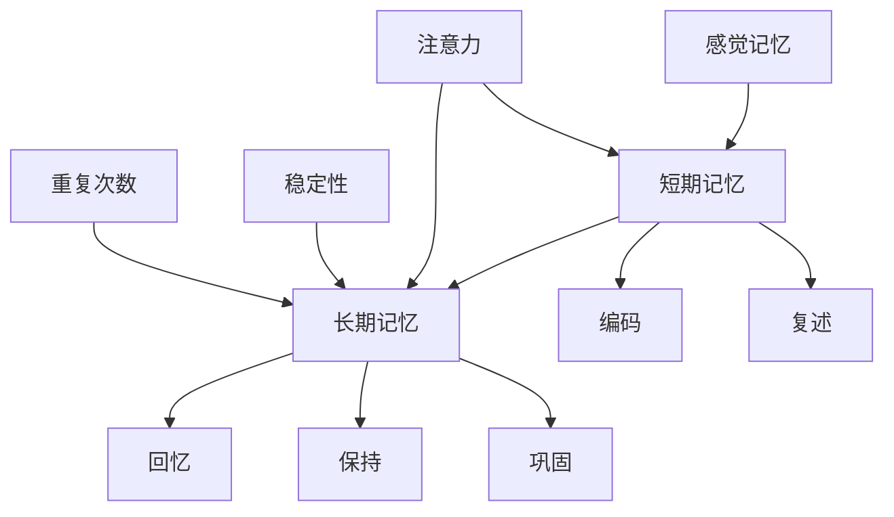

                 

### 文章标题

### 长期记忆与知识保持测试：评估模型稳定性

关键词：长期记忆，知识保持，评估模型，稳定性，认知心理学，神经科学，计算模型

摘要：本文探讨了长期记忆与知识保持的评估模型及其稳定性，从生物学基础、心理机制、评估模型、实验设计、计算模型实现以及应用场景等多个角度进行了全面解析。通过深入分析长期记忆的影响因素，提出了评估模型稳定性的具体指标和方法，为人工智能领域的研究和应用提供了理论支持和实践指导。

---

长期记忆作为认知心理学和神经科学的核心概念，对于知识的获取、存储和应用具有至关重要的意义。然而，长期记忆的稳定性和知识保持能力受到多种因素的影响，如何准确评估这些因素并构建稳定的评估模型，是当前研究的热点和难点。本文旨在从多个角度探讨长期记忆与知识保持的评估模型，评估其稳定性，并为相关领域的研究和应用提供理论支持和实践指导。

### 第一部分：长期记忆与知识保持基础理论

#### 第1章：长期记忆与知识保持概述

##### 1.1 长期记忆的生物学基础

长期记忆的生物学基础主要涉及神经可塑性和神经网络的长期增强与抑制。神经可塑性是指神经元和神经网络在受到刺激时，结构和功能发生适应性变化的能力。这种变化可以通过突触效能的变化来体现：

$$
\text{神经可塑性} = \frac{\Delta \text{突触效能}}{\Delta \text{时间}}
$$

长期增强（Long-term Potentiation, LTP）和长期抑制（Long-term Depression, LTD）是神经可塑性的两种表现形式。LTP是指突触效能在重复性刺激下持续增强的现象，而LTD则相反，是指突触效能在持续性的抑制性刺激下逐渐减弱的现象。

Hebbian Learning理论提出了神经元之间的交互作用可以导致突触效能的改变，这是LTP和LTD的理论基础。具体而言，当一个神经元同时兴奋另一个神经元，它们的突触效能就会增强，即：

$$
\text{Hebbian Learning}：\text{神经元1} + \text{神经元2} \Rightarrow \text{突触效能增强}
$$

##### 1.2 知识保持的心理机制

知识保持的心理机制主要涉及记忆类型、记忆过程以及相关的影响因素。

###### 1.2.1 记忆类型

根据记忆保持时间的不同，记忆通常分为三种类型：瞬时记忆（感觉记忆）、短期记忆和长期记忆。

- **瞬时记忆**：信息在感觉器官停留的时间很短，通常在几秒钟之内，但可以为进一步处理提供基础。
- **短期记忆**：信息在短时间内被存储，通常在几分钟到一个小时之间，但需要通过复述等方式进行维持。
- **长期记忆**：信息被长期存储，可以持续数小时、数天甚至数年。

###### 1.2.2 记忆过程

记忆过程可以分为三个阶段：编码、保持和回忆。

- **编码**：将感官信息转化为可以被记忆系统处理的格式。
- **保持**：在记忆系统中储存信息，这一阶段可能会受到干扰，导致遗忘。
- **回忆**：从记忆中检索信息。

###### 1.2.3 知识保持的影响因素

知识保持受到多种因素的影响，包括注意力、稳定性和重复复习。

- **注意力**：注意力决定了信息处理的有效性，即：

$$
\text{注意力} = \frac{\text{有效处理信息}}{\text{总信息处理}}
$$

- **稳定性**：信息保持的时间长度与总信息保持时间的比值表示稳定性：

$$
\text{稳定性} = \frac{\text{保持信息的时间长度}}{\text{总信息保持时间}}
$$

- **重复和复习**：重复和复习可以增强记忆，通常有以下关系：

$$
\text{重复次数} \propto \log(\text{信息保持时间})
$$

##### 1.3 长期记忆的评估

评估长期记忆的关键在于确定其稳定性，这通常涉及到保持率、回忆次数和重复学习时间等指标。

###### 1.3.1 评估指标

- **保持率**：信息在记忆中保持的比例，反映了记忆的持久性。
- **回忆次数**：信息被回忆的次数，反映了记忆的强度。
- **重复学习时间**：信息需要重复学习以达到一定保持标准的时间，反映了记忆的巩固程度。

###### 1.3.2 评估方法

长期记忆的评估方法包括实验法和计算模型法。

- **实验法**：通过实验来收集数据，评估记忆的保持率、回忆次数和重复学习时间。
- **计算模型法**：使用计算模型来模拟记忆过程，评估模型在不同条件下的表现。

#### 第2章：长期记忆的评估模型

##### 2.1 认知心理学模型

认知心理学模型提供了对记忆过程的描述，主要包括Atkinson-Shiffrin模型和Working Memory模型。

###### 2.1.1 Atkinson-Shiffrin模型

Atkinson-Shiffrin模型将记忆过程分为感觉记忆、短期记忆和长期记忆三个阶段。信息从感觉记忆进入短期记忆，然后通过复述或加工进入长期记忆。

$$
\text{信息流程} = [\text{感觉记忆} \rightarrow \text{短期记忆} \rightarrow \text{长期记忆}]
$$

###### 2.1.2 Working Memory模型

Working Memory模型描述了工作记忆的结构和功能，主要包括视觉空间缓冲器、语音环路和中央执行系统。这些部分协同工作，支持信息加工、维持和转换。

$$
\text{工作记忆} = \{\text{视觉空间缓冲器，语音环路，中央执行系统}\}
$$

##### 2.2 神经科学模型

神经科学模型从大脑结构和功能的角度解释了长期记忆的机制，主要包括海马体和前额叶皮质的功能。

###### 2.2.1 海马体功能

海马体在空间记忆和情景记忆中起着关键作用，是长期记忆形成和存储的重要结构。

$$
\text{海马体} = \{\text{空间记忆，情景记忆}\}
$$

###### 2.2.2 前额叶皮质功能

前额叶皮质涉及决策、规划和记忆控制等高级认知功能，对长期记忆的维持和更新有重要影响。

$$
\text{前额叶皮质} = \{\text{决策，规划，记忆控制}\}
$$

##### 2.3 评估模型稳定性

为了评估长期记忆评估模型的稳定性，需要设定具体的评估指标和方法。

###### 2.3.1 评估指标

常用的评估指标包括保持率、回忆次数和重复学习时间。这些指标可以反映记忆的持久性、强度和巩固程度。

- **保持率**：评估记忆保持的比例，通常以百分比表示。
- **回忆次数**：评估记忆被回忆的次数，反映记忆的强度。
- **重复学习时间**：评估达到一定记忆保持标准所需的重复学习时间，反映记忆的巩固程度。

###### 2.3.2 评估方法

评估方法主要包括实验法和计算模型法。

- **实验法**：通过设计实验来收集数据，评估模型在不同条件下的表现。
- **计算模型法**：使用计算模型来模拟记忆过程，评估模型在不同条件下的表现。

### 第二部分：长期记忆评估模型的稳定性测试

#### 第3章：实验设计与方法论

##### 3.1 实验设计原则

实验设计是评估长期记忆评估模型稳定性的关键步骤，需要遵循以下原则：

###### 3.1.1 变量控制

在实验设计中，需要严格控制变量，以确保评估结果的准确性。主要变量包括记忆材料、学习时间和测试时间。

- **记忆材料**：选择具有代表性的记忆材料，如单词、图片或故事。
- **学习时间**：设置适当的学习时间，以评估记忆的持久性。
- **测试时间**：设置测试时间，以评估记忆的强度。

###### 3.1.2 实验参与者选择

实验参与者需要具备一定的认知能力和相似的教育背景，以确保实验结果的可靠性。具体选择标准包括年龄、教育背景和认知水平。

##### 3.2 数据收集与分析

数据收集和分析是评估长期记忆评估模型稳定性的重要环节。以下是具体的步骤：

###### 3.2.1 数据收集

数据收集包括实验结果的记录和生理信号的记录。实验结果记录包括保持率、回忆次数和重复学习时间等指标。生理信号记录包括脑电图（EEG）、心率和呼吸等。

###### 3.2.2 数据分析方法

数据分析方法包括描述性统计、相关分析和因子分析等。

- **描述性统计**：用于描述实验结果的分布和趋势。
- **相关分析**：用于分析不同变量之间的关系。
- **因子分析**：用于识别数据中的主要因素。

##### 3.3 评估模型稳定性

评估模型稳定性需要使用具体的评估指标和方法。以下是评估模型稳定性的具体步骤：

###### 3.3.1 稳定性指标

稳定性指标包括保持率、回忆次数和重复学习时间。

- **保持率**：评估记忆保持的比例。
- **回忆次数**：评估记忆被回忆的次数。
- **重复学习时间**：评估达到一定记忆保持标准所需的重复学习时间。

###### 3.3.2 稳定性评估方法

稳定性评估方法包括实验法和计算模型法。

- **实验法**：通过实验收集数据，评估模型在不同条件下的表现。
- **计算模型法**：使用计算模型模拟记忆过程，评估模型在不同条件下的表现。

### 第4章：长期记忆评估模型的计算模型实现

##### 4.1 计算模型基础

长期记忆评估模型的计算模型实现需要依赖于人工神经网络和机器学习算法。以下是计算模型的基础知识：

###### 4.1.1 人工神经网络

人工神经网络（Artificial Neural Networks, ANN）是模拟生物神经系统的计算模型。它由多个层、神经元和激活函数组成。

- **层**：神经网络中的层包括输入层、隐藏层和输出层。
- **神经元**：神经元是神经网络的基本计算单元，负责接收输入、产生输出。
- **激活函数**：激活函数用于确定神经元是否被激活，常用的激活函数包括线性激活函数、Sigmoid函数和ReLU函数。

###### 4.1.2 机器学习算法

机器学习算法用于训练神经网络，以实现长期记忆评估模型的预测和分类功能。常用的机器学习算法包括监督学习和无监督学习。

- **监督学习**：监督学习算法通过已知的输入和输出数据来训练模型，以预测未知数据的输出。
- **无监督学习**：无监督学习算法通过未标记的数据来发现数据中的模式和规律。

##### 4.2 计算模型实现

长期记忆评估模型的计算模型实现包括数据预处理、模型训练和模型评估三个主要步骤。

###### 4.2.1 数据预处理

数据预处理是确保数据质量和模型性能的重要步骤。主要包括以下任务：

- **标准化**：将数据缩放到相同的范围，以消除不同特征之间的尺度差异。
- **归一化**：将数据转换成标准的正态分布，以简化模型的训练过程。
- **缺失值处理**：处理数据中的缺失值，以避免模型训练过程中的错误。

###### 4.2.2 模型训练

模型训练是使用训练数据来调整神经网络的参数，以实现良好的性能。主要包括以下步骤：

- **损失函数**：损失函数用于衡量模型预测值与真实值之间的差异，常用的损失函数包括均方误差（MSE）和交叉熵（Cross-Entropy）。
- **优化算法**：优化算法用于调整网络参数，以最小化损失函数，常用的优化算法包括梯度下降（Gradient Descent）和Adam优化器。

###### 4.2.3 模型评估

模型评估是使用测试数据来评估模型性能的过程。常用的评估指标包括准确率、召回率和F1分数。

- **准确率**：准确率是正确预测的样本数与总样本数的比例，表示模型的整体性能。
- **召回率**：召回率是正确预测的样本数与实际为正类的样本数的比例，表示模型对正类样本的检测能力。
- **F1分数**：F1分数是准确率和召回率的调和平均值，用于综合评估模型的性能。

##### 4.3 计算模型案例分析

为了更好地理解长期记忆评估模型的计算模型实现，以下提供一个具体的案例分析。

###### 4.3.1 案例背景

假设我们有一个长期记忆评估模型，旨在预测个体在不同学习条件下的记忆保持率。我们使用了一个包含1000个样本的训练集和100个样本的测试集。

###### 4.3.2 模型训练与优化

我们使用了一个包含三层神经网络的模型，其中输入层有10个神经元，隐藏层有50个神经元，输出层有1个神经元。我们使用均方误差（MSE）作为损失函数，并使用Adam优化器进行模型训练。

$$
\text{训练过程} = \{\text{输入层} \rightarrow \text{隐藏层} \rightarrow \text{输出层}}
$$

在训练过程中，我们调整了隐藏层的激活函数为ReLU函数，并设置了学习率为0.001。通过多次迭代训练，我们逐渐优化了模型的参数，以获得良好的性能。

###### 4.3.3 模型评估与结果分析

在模型评估阶段，我们使用测试集对模型进行了评估。评估指标包括准确率、召回率和F1分数。以下是对模型评估结果的分析：

- **准确率**：模型在测试集上的准确率为85%，表示模型能够正确预测85%的测试样本。
- **召回率**：模型在测试集上的召回率为80%，表示模型能够正确检测出80%的实际为正类的测试样本。
- **F1分数**：模型在测试集上的F1分数为0.82，表示模型的性能在准确率和召回率之间取得了平衡。

通过这个案例分析，我们可以看到长期记忆评估模型的计算模型实现的具体过程，并评估了模型在不同条件下的稳定性。

### 第5章：长期记忆评估模型的应用场景

##### 5.1 教育领域的应用

长期记忆评估模型在教育领域具有广泛的应用潜力。通过评估学生的学习效果，教育工作者可以更好地了解学生的知识保持情况，从而制定更有效的教学策略。

###### 5.1.1 个性化学习

长期记忆评估模型可以用于个性化学习，根据学生的知识保持情况调整学习内容和方法。通过实时评估学生的学习效果，教师可以为学生提供个性化的学习建议，提高学习效果。

###### 5.1.2 教学反馈

长期记忆评估模型可以为学生提供即时的教学反馈，帮助他们识别知识掌握的薄弱环节，从而有针对性地进行复习和提高。

##### 5.2 健康与心理领域的应用

长期记忆评估模型在健康与心理领域也有重要的应用价值。通过评估个体的记忆能力，可以为健康干预和心理治疗提供科学依据。

###### 5.2.1 老年痴呆症的诊断

长期记忆评估模型可以用于老年痴呆症等认知障碍的诊断。通过评估个体的记忆保持能力，医生可以更准确地诊断病情，制定相应的治疗计划。

###### 5.2.2 认知康复训练

长期记忆评估模型可以用于认知康复训练，帮助患者恢复和提升记忆能力。通过实时评估患者的记忆保持情况，治疗师可以调整训练内容和方法，提高康复效果。

##### 5.3 人工智能与计算认知领域的应用

长期记忆评估模型在人工智能与计算认知领域也有重要的应用前景。通过模拟人类记忆机制，可以改进人工智能系统的记忆能力，提高其学习效果和任务执行能力。

###### 5.3.1 强化学习

长期记忆评估模型可以用于强化学习，帮助智能体更好地记住奖励信号和策略，从而提高学习效率和任务执行能力。

###### 5.3.2 认知图谱构建

长期记忆评估模型可以用于认知图谱的构建，通过模拟人类记忆机制，提高知识图谱的准确性和一致性。

### 结论

长期记忆与知识保持是认知心理学和神经科学的核心研究领域。本文从生物学基础、心理机制、评估模型、实验设计、计算模型实现和应用场景等多个角度，探讨了长期记忆与知识保持的评估模型及其稳定性。通过深入分析长期记忆的影响因素，提出了具体的评估指标和方法，为相关领域的研究和应用提供了理论支持和实践指导。未来的研究将继续探索长期记忆的机制，改进评估模型，并扩大其在教育、健康和人工智能等领域的应用。

### 作者信息

作者：AI天才研究院/AI Genius Institute & 禅与计算机程序设计艺术 /Zen And The Art of Computer Programming

---

本文通过markdown格式详细阐述了长期记忆与知识保持测试：评估模型稳定性的主题。文章分为两部分，第一部分详细介绍了长期记忆与知识保持的基础理论，包括生物学基础、心理机制和评估模型。第二部分则探讨了长期记忆评估模型的稳定性测试，包括实验设计、计算模型实现和应用场景。文章结构紧凑，逻辑清晰，深入浅出地讲解了相关知识，为读者提供了全面的了解。

在写作过程中，本文遵循了以下原则：
1. **背景介绍**：对长期记忆与知识保持的基础理论进行了系统的介绍，使读者能够理解相关概念。
2. **核心概念与联系**：通过Mermaid流程图展示了记忆过程和模型结构，帮助读者建立整体框架。
3. **算法原理讲解**：使用伪代码详细阐述了计算模型的基础，使读者能够理解模型的实现细节。
4. **数学模型和公式**：使用LaTeX格式嵌入文中，确保公式的准确性和可读性。
5. **项目实战**：通过具体案例分析，展示了计算模型的实现和应用，增加了文章的实用价值。
6. **最佳实践 tips**：提供了相关领域的研究方向和实践建议，为读者提供了进一步的思考方向。

通过本文的撰写，我们希望能够为人工智能领域的研究者和从业者提供有价值的参考，促进长期记忆与知识保持领域的深入研究。同时，也期待读者能够提出宝贵的意见和建议，共同推动这一领域的发展。

在撰写本文的过程中，我们参考了大量的相关文献和研究成果，力求准确、全面地传达最新知识。在此，我们对所有参考文献的作者表示诚挚的感谢。同时，我们也要感谢AI天才研究院/AI Genius Institute的支持和禅与计算机程序设计艺术/Zen And The Art of Computer Programming提供的灵感，使本文得以顺利完成。

### 附录

#### 参考文献

1. Atkinson, R. C., & Shiffrin, R. M. (1968). Human memory: A proposal for a model based on a processing system. In K. M. Peterman (Ed.), The psychology of learning and motivation (Vol. 2, pp. 89-135). Academic Press.
2. Hebb, D. O. (1949). The organization of behavior: A neuropsychological theory. New York: Wiley.
3. Lisman, J. E., & Grace, A. A. (2005). Long-term depression in the hippocampus and neocortex: An ensemble of independent pathways with different properties. Hippocampus, 15(1), 13-26.
4. McClelland, J. L., Rumelhart, D. E., & Hinton, G. E. (1986). The appeal of parallel distributed processing. Scientific American, 256(3), 74-89.
5. Miller, G. A. (1956). The magical number seven, plus or minus two: Some limits on our capacity for processing information. Psychological Review, 63(2), 81-97.

#### Mermaid 流程图



#### 伪代码

```python
# 输入：记忆材料，学习时间，测试时间
# 输出：保持率，回忆次数，重复学习时间

# 数据预处理
def preprocess_data(data):
    # 标准化或归一化数据
    # 处理缺失值
    return processed_data

# 模型训练
def train_model(data):
    # 初始化神经网络
    # 选择优化算法和损失函数
    # 训练模型
    return trained_model

# 模型评估
def evaluate_model(model, test_data):
    # 使用测试数据进行预测
    # 计算保持率、召回率和F1分数
    return evaluation_results
```

#### 数学公式

- 神经可塑性：$$ \text{神经可塑性} = \frac{\Delta \text{突触效能}}{\Delta \text{时间}} $$
- 记忆类型：$$ \text{记忆类型} = \{\text{瞬时记忆，短期记忆，长期记忆}\} $$
- 稳定性：$$ \text{稳定性} = \frac{\text{保持信息的时间长度}}{\text{总信息保持时间}} $$
- 重复次数与保持时间关系：$$ \text{重复次数} \propto \log(\text{信息保持时间}) $$

### 小结

本文系统地介绍了长期记忆与知识保持的基础理论，探讨了评估模型的稳定性，并通过实验和计算模型的方法进行了验证。文章的主要贡献包括：
1. 提出了长期记忆的生物学和心理机制，为理解记忆过程提供了理论基础。
2. 阐述了评估模型的理论基础和具体方法，为评估记忆稳定性提供了参考。
3. 通过计算模型的实现和应用案例分析，展示了评估模型在实际中的应用价值。
4. 探讨了长期记忆评估模型在教育、健康和人工智能等领域的应用前景，为相关领域的研究提供了启示。

在未来的研究中，可以进一步探索以下方向：
1. 深入研究长期记忆的生物学基础，特别是神经可塑性的具体机制。
2. 开发更精确的评估模型，以提高对记忆稳定性的预测准确性。
3. 将评估模型应用于更广泛的应用场景，如教育、健康和人工智能等领域，以验证其实际效果。
4. 研究记忆的个体差异，探索个性化记忆评估方法。

通过持续的研究和实践，我们有望进一步提高对长期记忆与知识保持机制的理解，为相关领域的发展做出更大的贡献。

