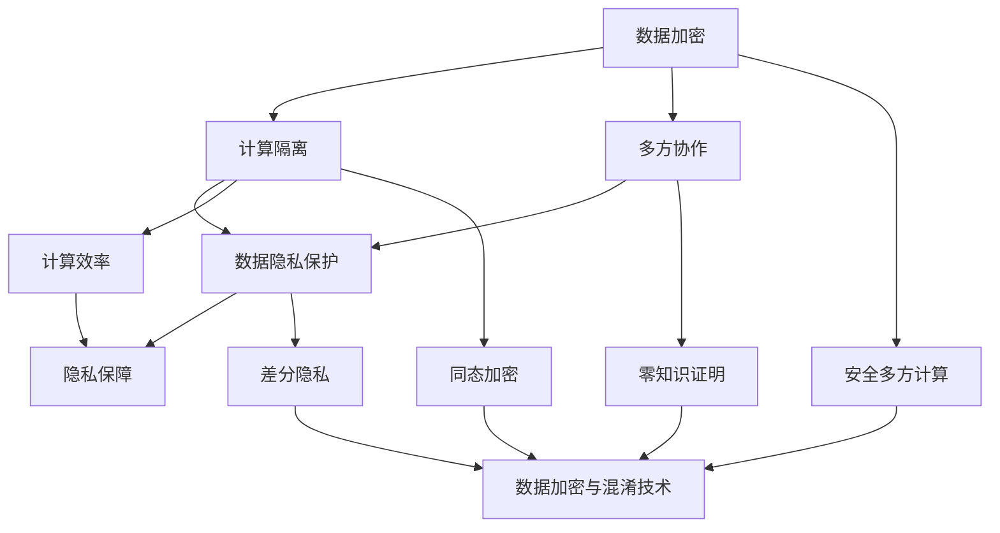

                 

### 文章标题

# 《隐私计算技术保护LLM应用中的敏感数据》

### 关键词

- 隐私计算
- 大型语言模型（LLM）
- 敏感数据保护
- 安全多方计算
- 同态加密
- 零知识证明

### 摘要

本文深入探讨了隐私计算技术在大型语言模型（LLM）应用中保护敏感数据的重要性。首先，介绍了隐私计算的基本概念、发展背景及其核心原则，随后详细解析了隐私计算框架及其组成部分，并探讨了隐私计算技术原理。接着，本文重点分析了隐私计算在LLM应用中的挑战，包括敏感数据的识别与分类、隐私保护需求及其适用性。随后，文章从自然语言处理应用、敏感数据处理方法、模型训练和模型部署等方面，详细阐述了隐私计算在LLM应用中的实践。最后，文章讨论了隐私计算的安全性评估、隐私保障及法律与伦理问题，并提供了隐私计算工具与资源的推荐。本文旨在为读者提供全面、深入的理解，助力隐私计算技术在LLM应用中的有效应用。

### 第一部分：隐私计算技术基础

#### 1.1 隐私计算概述

##### 1.1.1 隐私计算的定义

隐私计算是一种在保护数据隐私的同时，实现数据计算和交换的技术。它通过一系列加密和计算技术，确保数据在传输和处理过程中的安全性，防止数据泄露或被非法利用。隐私计算技术广泛应用于云计算、大数据、人工智能等领域，旨在实现数据的隐私保护与数据价值的最大化。

##### 1.1.2 隐私计算的发展背景

随着信息技术的飞速发展，数据泄露、隐私侵犯等问题日益突出。传统的安全措施已无法满足数据隐私保护的需求。因此，隐私计算技术应运而生。近年来，随着大数据、人工智能等技术的兴起，隐私计算技术得到了广泛关注和深入研究。各国政府和企业纷纷加大对隐私计算技术的投入，以提升数据安全性和隐私保护水平。

##### 1.1.3 隐私计算的核心原则

隐私计算技术遵循以下核心原则：

1. **数据加密**：数据在传输和存储过程中进行加密，确保数据在未经授权的情况下无法被读取或篡改。
2. **计算隔离**：通过计算隔离技术，确保不同参与方之间的计算过程相互独立，防止数据泄露。
3. **多方协作**：在保护隐私的前提下，实现多方数据的协同计算和分析。
4. **隐私保护**：在数据处理过程中，对用户隐私进行严格保护，防止隐私泄露。

#### 1.2 隐私计算框架

##### 1.2.1 隐私计算框架概述

隐私计算框架是一种系统化的隐私保护解决方案，它包括多个组成部分，如数据加密模块、计算隔离模块、多方协作模块等。隐私计算框架的设计和实现直接影响隐私计算技术的性能和安全性。

##### 1.2.2 常见隐私计算框架介绍

当前，常见的隐私计算框架主要包括：

1. **安全多方计算框架**：如MMOP (MPC-Match)，它是一种基于安全多方计算（MPC）的隐私计算框架，能够实现多方数据的安全计算和交换。
2. **同态加密框架**：如HElib，它是一种基于同态加密（HE）的隐私计算框架，能够实现数据在加密状态下的计算。
3. **零知识证明框架**：如Zcash，它是一种基于零知识证明（ZKP）的隐私计算框架，能够实现数据的隐私保护。

##### 1.2.3 隐私计算框架的组成部分

隐私计算框架通常包括以下几个组成部分：

1. **数据加密模块**：负责对数据进行加密处理，确保数据在传输和存储过程中的安全性。
2. **计算隔离模块**：负责实现计算过程的隔离，确保不同参与方之间的计算过程相互独立。
3. **多方协作模块**：负责协调不同参与方之间的数据交换和计算，实现多方数据的协同分析。
4. **隐私保护模块**：负责对用户隐私进行严格保护，确保数据处理过程中的隐私保护。

#### 1.3 隐私计算技术原理

##### 1.3.1 安全多方计算

安全多方计算（MPC）是一种在多方参与的计算过程中，确保各参与方隐私保护的计算技术。MPC的基本思想是通过一系列加密和计算技术，使各参与方能够在不泄露自身隐私信息的情况下，协同完成计算任务。

MPC的基本原理如下：

1. **初始化阶段**：各参与方生成自己的加密密钥对，并使用对方公开密钥对数据进行加密。
2. **传输阶段**：各参与方将加密数据发送给其他参与方，确保数据在传输过程中的安全性。
3. **计算阶段**：各参与方使用自己的加密密钥对收到的加密数据进行解密，并进行计算。
4. **结果阶段**：各参与方将计算结果加密后发送给其他参与方，确保计算结果的隐私保护。

##### 1.3.2 同态加密

同态加密（HE）是一种在数据加密状态下进行计算的技术，它允许在密文空间中直接对加密数据进行操作，而不需要解密数据。同态加密的基本原理如下：

1. **密钥生成**：系统生成一对加密密钥，包括加密密钥和签名密钥。
2. **加密阶段**：将明文数据加密成密文，确保数据在传输和存储过程中的安全性。
3. **计算阶段**：在密文空间中对密文进行操作，实现加密状态下的计算。
4. **解密阶段**：使用加密密钥将密文解密成明文，获取计算结果。

##### 1.3.3 零知识证明

零知识证明（ZKP）是一种证明系统，它允许证明者在不泄露任何实际信息的情况下，向验证者证明某个陈述是正确的。零知识证明的基本原理如下：

1. **证明生成**：证明者生成一个证明，证明某个陈述是正确的。
2. **证明验证**：验证者验证证明的有效性，证明者无需泄露任何实际信息。

常见的零知识证明协议包括：

1. **Sigma协议**：一种基于布尔电路的零知识证明协议。
2. **Zcash协议**：一种基于椭圆曲线加密的零知识证明协议。

##### 1.3.4 差分隐私

差分隐私（DP）是一种隐私保护技术，它通过对数据集的操作，使数据的真实分布难以被推断。差分隐私的基本原理如下：

1. **噪声添加**：对数据进行噪声添加，使数据分布发生变化。
2. **隐私预算**：对噪声进行量化，确保数据隐私保护的水平。

常见的差分隐私机制包括：

1. **拉普拉斯机制**：通过添加拉普拉斯噪声实现差分隐私。
2. **指数机制**：通过添加指数噪声实现差分隐私。

#### 1.4 隐私计算在LLM应用中的挑战

##### 1.4.1 LLM敏感数据的识别与分类

在LLM应用中，敏感数据的识别与分类是隐私保护的首要任务。敏感数据包括用户个人信息、企业商业秘密、国家机密等。为了实现敏感数据的识别与分类，可以采用以下方法：

1. **数据标签**：对敏感数据打标签，便于识别和分类。
2. **机器学习**：使用机器学习算法对敏感数据进行分类，提高识别精度。
3. **规则匹配**：根据已有的规则匹配敏感数据，实现自动化分类。

##### 1.4.2 LLM应用中的隐私保护需求

在LLM应用中，隐私保护需求主要包括以下几个方面：

1. **数据保密**：确保用户数据在传输、存储和处理过程中不被泄露。
2. **数据完整**：确保用户数据在传输、存储和处理过程中不被篡改。
3. **数据可用**：确保用户数据在需要时能够被访问和查询。
4. **隐私合规**：确保LLM应用符合相关隐私法律法规要求。

##### 1.4.3 隐私计算技术在LLM应用中的适用性

隐私计算技术可以在LLM应用中实现敏感数据的隐私保护。其适用性体现在以下几个方面：

1. **数据加密**：隐私计算技术可以实现对用户数据的加密，确保数据在传输、存储和处理过程中的安全性。
2. **计算隔离**：隐私计算技术可以实现计算过程的隔离，确保不同参与方之间的计算过程相互独立。
3. **多方协作**：隐私计算技术可以实现多方数据的协同计算和分析，满足LLM应用的需求。
4. **隐私保障**：隐私计算技术可以提供数据隐私保障，确保用户数据的隐私保护水平。

### 第二部分：隐私计算在LLM应用中的实践

#### 2.1 隐私计算在自然语言处理中的应用

##### 2.1.1 隐私计算与自然语言处理的关系

隐私计算技术在自然语言处理（NLP）领域具有重要应用价值。随着NLP技术的不断发展和广泛应用，如何保护用户数据隐私成为一个亟待解决的问题。隐私计算技术能够实现对NLP数据的高效隐私保护，为NLP应用提供可靠的数据安全保障。

##### 2.1.2 隐私计算在自然语言处理中的优势

隐私计算技术在自然语言处理中的优势主要包括：

1. **数据保密**：隐私计算技术能够实现对用户数据的加密，确保数据在传输、存储和处理过程中的安全性。
2. **隐私保护**：隐私计算技术可以提供数据隐私保障，确保用户数据的隐私保护水平。
3. **计算高效**：隐私计算技术能够在保证数据隐私保护的前提下，实现高效的数据计算和分析。
4. **灵活部署**：隐私计算技术可以支持多种NLP应用场景，实现灵活部署。

##### 2.1.3 隐私计算在自然语言处理中的具体应用

隐私计算在自然语言处理中的具体应用主要包括以下几个方面：

1. **用户数据保护**：在NLP应用中，用户数据往往包含敏感信息，如个人身份信息、地理位置信息等。隐私计算技术可以实现对用户数据的加密，确保数据在传输、存储和处理过程中的安全性。
2. **模型训练数据隐私保护**：在NLP模型训练过程中，使用隐私计算技术可以实现对训练数据的隐私保护。例如，可以使用安全多方计算（MPC）技术，实现多方数据的安全协同训练。
3. **模型部署数据隐私保护**：在NLP模型部署过程中，隐私计算技术可以实现对用户输入数据的加密，确保模型在处理用户输入数据时的隐私保护。
4. **跨平台数据隐私保护**：在NLP应用中，往往涉及多个平台之间的数据交换和共享。隐私计算技术可以实现对跨平台数据的安全加密和传输，确保数据在跨平台传输过程中的隐私保护。

#### 2.2 保护敏感数据的隐私计算方法

##### 2.2.1 数据加密与混淆技术

数据加密与混淆技术是隐私计算中保护敏感数据的基本方法。数据加密技术通过对数据进行加密，确保数据在传输、存储和处理过程中的安全性。混淆技术则通过对数据结构进行改造，使数据难以被分析和破解。

常见的加密与混淆技术包括：

1. **对称加密**：如AES，通过对数据进行加密和解密，确保数据在传输、存储和处理过程中的安全性。
2. **非对称加密**：如RSA，通过对数据进行加密和签名，确保数据在传输、存储和处理过程中的完整性和真实性。
3. **混淆技术**：如加密哈希函数，通过对数据结构进行改造，使数据难以被分析和破解。

##### 2.2.2 安全多方计算在敏感数据处理中的应用

安全多方计算（MPC）技术可以在敏感数据处理过程中实现多方数据的安全协同。MPC技术的基本原理如下：

1. **初始化阶段**：各参与方生成自己的加密密钥对，并使用对方公开密钥对数据进行加密。
2. **传输阶段**：各参与方将加密数据发送给其他参与方，确保数据在传输过程中的安全性。
3. **计算阶段**：各参与方使用自己的加密密钥对收到的加密数据进行解密，并进行计算。
4. **结果阶段**：各参与方将计算结果加密后发送给其他参与方，确保计算结果的隐私保护。

MPC技术在敏感数据处理中的应用场景包括：

1. **多方数据融合**：在多方数据融合场景中，MPC技术可以确保各方数据的安全融合，避免数据泄露。
2. **多方数据查询**：在多方数据查询场景中，MPC技术可以确保查询过程中的数据隐私保护。
3. **多方数据统计**：在多方数据统计场景中，MPC技术可以确保各方数据的安全统计，避免数据泄露。

##### 2.2.3 同态加密在敏感数据处理中的应用

同态加密（HE）技术可以在敏感数据处理过程中实现数据在加密状态下的计算。同态加密技术的基本原理如下：

1. **密钥生成**：系统生成一对加密密钥，包括加密密钥和签名密钥。
2. **加密阶段**：将明文数据加密成密文，确保数据在传输和存储过程中的安全性。
3. **计算阶段**：在密文空间中对密文进行操作，实现加密状态下的计算。
4. **解密阶段**：使用加密密钥将密文解密成明文，获取计算结果。

同态加密技术在敏感数据处理中的应用场景包括：

1. **数据分析**：在数据分析场景中，同态加密技术可以实现对加密数据的直接计算，避免数据泄露。
2. **机器学习**：在机器学习场景中，同态加密技术可以实现对加密数据的训练和推理，确保模型训练和部署过程中的数据隐私保护。
3. **深度学习**：在深度学习场景中，同态加密技术可以实现对加密数据的深度学习，确保深度学习模型训练和部署过程中的数据隐私保护。

##### 2.2.4 零知识证明在敏感数据处理中的应用

零知识证明（ZKP）技术可以在敏感数据处理过程中实现数据的隐私保护。零知识证明技术的基本原理如下：

1. **证明生成**：证明者生成一个证明，证明某个陈述是正确的。
2. **证明验证**：验证者验证证明的有效性，证明者无需泄露任何实际信息。

零知识证明技术在敏感数据处理中的应用场景包括：

1. **身份验证**：在身份验证场景中，零知识证明技术可以实现对用户身份的隐私保护，确保用户隐私不被泄露。
2. **访问控制**：在访问控制场景中，零知识证明技术可以实现对用户访问权限的隐私保护，确保用户隐私不被泄露。
3. **智能合约**：在智能合约场景中，零知识证明技术可以实现对交易数据的隐私保护，确保交易数据不被泄露。

#### 2.3 隐私计算在LLM模型训练中的应用

##### 2.3.1 隐私计算在LLM模型训练中的核心问题

在LLM模型训练过程中，隐私计算面临以下核心问题：

1. **数据隐私保护**：在模型训练过程中，如何保护训练数据中的敏感信息，防止数据泄露。
2. **计算资源消耗**：隐私计算技术通常具有较高的计算复杂度，如何在保证隐私保护的前提下，降低计算资源消耗。
3. **模型性能**：在隐私保护的前提下，如何确保LLM模型训练的效果不受影响。

##### 2.3.2 隐私计算在LLM模型训练中的解决方案

针对上述核心问题，隐私计算在LLM模型训练中可以采用以下解决方案：

1. **安全多方计算（MPC）**：通过MPC技术，实现多方数据的安全协同训练。具体实现方法如下：
   - 初始化阶段：各参与方生成自己的加密密钥对，并使用对方公开密钥对数据进行加密。
   - 训练阶段：各参与方将加密数据发送给其他参与方，进行模型训练。
   - 结果阶段：各参与方将训练结果加密后发送给其他参与方，确保模型训练结果的隐私保护。

2. **同态加密（HE）**：通过HE技术，实现数据在加密状态下的模型训练。具体实现方法如下：
   - 密钥生成：系统生成一对加密密钥，包括加密密钥和签名密钥。
   - 加密阶段：将明文数据加密成密文，确保数据在传输和存储过程中的安全性。
   - 计算阶段：在密文空间中对密文进行操作，实现加密状态下的模型训练。
   - 解密阶段：使用加密密钥将密文解密成明文，获取模型训练结果。

3. **差分隐私（DP）**：通过DP技术，实现模型训练过程中的隐私保护。具体实现方法如下：
   - 噪声添加：对模型训练过程中的数据进行噪声添加，使数据分布发生变化。
   - 隐私预算：对噪声进行量化，确保数据隐私保护的水平。

##### 2.3.3 隐私计算在LLM模型训练中的实际案例

以下是一个基于安全多方计算（MPC）的LLM模型训练实际案例：

1. **项目背景**：某互联网公司拥有大量的用户评论数据，希望基于这些数据训练一个情感分析模型，用于分析用户对产品的反馈。
2. **数据处理**：为了保护用户隐私，公司采用MPC技术对用户评论数据进行处理。具体步骤如下：
   - 初始化阶段：各参与方生成自己的加密密钥对，并使用对方公开密钥对数据进行加密。
   - 传输阶段：各参与方将加密数据发送给其他参与方，确保数据在传输过程中的安全性。
   - 训练阶段：各参与方使用自己的加密密钥对收到的加密数据进行解密，并进行模型训练。
   - 结果阶段：各参与方将训练结果加密后发送给其他参与方，确保模型训练结果的隐私保护。
3. **模型训练**：在MPC环境下，公司使用训练好的模型对用户评论进行情感分析，识别用户对产品的情感倾向。
4. **结果分析**：通过对用户评论的情感分析结果，公司能够更好地了解用户需求，优化产品和服务。

#### 2.4 隐私计算在LLM模型部署中的应用

##### 2.4.1 隐私计算在LLM模型部署中的关键问题

在LLM模型部署过程中，隐私计算面临以下关键问题：

1. **数据隐私保护**：在模型部署过程中，如何保护用户输入数据中的敏感信息，防止数据泄露。
2. **模型隐私保护**：如何保护模型本身的隐私，防止模型被非法攻击和篡改。
3. **计算效率**：在保证隐私保护的前提下，如何提高模型部署的计算效率。

##### 2.4.2 隐私计算在LLM模型部署中的解决方案

针对上述关键问题，隐私计算在LLM模型部署中可以采用以下解决方案：

1. **同态加密（HE）**：通过HE技术，实现模型在加密状态下的推理和预测。具体实现方法如下：
   - 密钥生成：系统生成一对加密密钥，包括加密密钥和签名密钥。
   - 加密阶段：将明文数据加密成密文，确保数据在传输和存储过程中的安全性。
   - 推理阶段：在密文空间中对密文进行操作，实现加密状态下的模型推理和预测。
   - 解密阶段：使用加密密钥将密文解密成明文，获取推理和预测结果。

2. **安全多方计算（MPC）**：通过MPC技术，实现多方数据的安全协同推理。具体实现方法如下：
   - 初始化阶段：各参与方生成自己的加密密钥对，并使用对方公开密钥对数据进行加密。
   - 传输阶段：各参与方将加密数据发送给其他参与方，确保数据在传输过程中的安全性。
   - 推理阶段：各参与方使用自己的加密密钥对收到的加密数据进行解密，并进行模型推理和预测。
   - 结果阶段：各参与方将推理和预测结果加密后发送给其他参与方，确保推理和预测结果的隐私保护。

3. **差分隐私（DP）**：通过DP技术，实现模型部署过程中的隐私保护。具体实现方法如下：
   - 噪声添加：对模型部署过程中的数据进行噪声添加，使数据分布发生变化。
   - 隐私预算：对噪声进行量化，确保数据隐私保护的水平。

##### 2.4.3 隐私计算在LLM模型部署中的实际案例

以下是一个基于同态加密（HE）的LLM模型部署实际案例：

1. **项目背景**：某金融机构希望基于用户交易数据，开发一个智能风控系统，实时监控和评估用户交易风险。
2. **数据处理**：为了保护用户隐私，金融机构采用HE技术对用户交易数据进行处理。具体步骤如下：
   - 密钥生成：系统生成一对加密密钥，包括加密密钥和签名密钥。
   - 加密阶段：将明文交易数据加密成密文，确保数据在传输和存储过程中的安全性。
   - 推理阶段：使用HE技术，在密文空间中实现对用户交易数据的实时监控和风险评估。
   - 解密阶段：使用加密密钥将密文解密成明文，获取实时监控和风险评估结果。
3. **模型部署**：金融机构将基于HE技术的智能风控系统部署到生产环境中，实现对用户交易数据的实时监控和风险评估。
4. **结果分析**：通过对用户交易数据的实时监控和风险评估结果，金融机构能够更好地识别和防范交易风险，提高风险管理水平。

### 第三部分：隐私计算在LLM应用中的安全与隐私保障

#### 3.1 隐私计算的安全性评估

##### 3.1.1 隐私计算安全性的评价指标

隐私计算的安全性评估可以从以下几个方面进行：

1. **数据加密强度**：评估数据加密算法的强度，确保数据在传输、存储和处理过程中的安全性。
2. **计算隔离效果**：评估计算隔离技术对数据泄露的防护能力，确保不同参与方之间的计算过程相互独立。
3. **多方协作效率**：评估多方协作技术在数据交换和计算过程中的效率，确保多方数据的安全协同。
4. **隐私保护水平**：评估隐私计算技术对用户隐私的保护水平，确保用户数据在处理过程中的隐私保护。

##### 3.1.2 隐私计算安全性的评估方法

隐私计算安全性的评估方法包括：

1. **理论分析**：通过理论分析，评估隐私计算技术的安全性和性能。
2. **实验验证**：通过实验验证，评估隐私计算技术在真实场景中的表现。
3. **安全测试**：通过安全测试，评估隐私计算技术的漏洞和弱点。

##### 3.1.3 隐私计算安全性的实际案例分析

以下是一个隐私计算安全性的实际案例分析：

1. **项目背景**：某互联网公司希望采用隐私计算技术保护用户数据，实现数据的安全共享和协同分析。
2. **评估过程**：
   - 理论分析：评估数据加密算法的强度，确保数据在传输、存储和处理过程中的安全性。
   - 实验验证：在实验环境中，模拟多方数据的安全协同，评估计算隔离效果和多方协作效率。
   - 安全测试：通过安全测试，发现隐私计算技术的漏洞和弱点，并提出相应的修复方案。
3. **结果分析**：通过对隐私计算技术的安全性评估，互联网公司能够更好地了解其数据保护能力，优化隐私计算系统的设计和实现。

#### 3.2 隐私计算的隐私保障

##### 3.2.1 隐私计算隐私保障的原则

隐私计算隐私保障应遵循以下原则：

1. **最小化数据收集**：仅收集必要的数据，避免过度收集用户数据。
2. **数据加密**：对用户数据进行加密处理，确保数据在传输、存储和处理过程中的安全性。
3. **隐私保护算法**：采用先进的隐私保护算法，确保用户数据的隐私保护。
4. **隐私政策透明**：明确告知用户隐私政策，确保用户对隐私保护措施的了解。
5. **隐私审计与监督**：建立隐私审计与监督机制，确保隐私保护措施的有效执行。

##### 3.2.2 隐私计算隐私保障的技术手段

隐私计算隐私保障的技术手段包括：

1. **数据加密**：采用强加密算法，如AES、RSA等，确保用户数据在传输、存储和处理过程中的安全性。
2. **同态加密**：实现数据在加密状态下的计算，确保用户数据在处理过程中的隐私保护。
3. **安全多方计算**：确保多方数据的安全协同，避免数据泄露。
4. **隐私保护算法**：采用差分隐私、零知识证明等技术，增强用户数据的隐私保护。

##### 3.2.3 隐私计算隐私保障的实践案例

以下是一个隐私计算隐私保障的实践案例：

1. **项目背景**：某电商平台希望采用隐私计算技术保护用户购物数据，实现个性化推荐。
2. **隐私保障措施**：
   - 数据加密：采用AES算法对用户购物数据进行加密处理。
   - 同态加密：在个性化推荐过程中，采用同态加密技术，确保用户数据在处理过程中的隐私保护。
   - 安全多方计算：在多方数据融合和协同分析过程中，采用安全多方计算技术，确保数据的安全协同。
   - 隐私保护算法：采用差分隐私技术，对用户购物数据进行隐私保护。
3. **结果分析**：通过实施隐私计算隐私保障措施，电商平台能够更好地保护用户购物数据隐私，提高用户满意度。

#### 3.3 隐私计算在LLM应用中的法律与伦理问题

##### 3.3.1 隐私计算在LLM应用中的法律问题

隐私计算在LLM应用中涉及的法律问题主要包括：

1. **数据保护法律**：如《通用数据保护条例》（GDPR）、《加州消费者隐私法》（CCPA）等，对用户数据的收集、处理和存储进行严格规定。
2. **隐私政策**：企业需要制定明确的隐私政策，告知用户数据收集、使用和共享的方式。
3. **数据泄露责任**：企业在数据泄露事件中可能面临法律责任和赔偿。
4. **跨境数据传输**：涉及跨境数据传输时，需要遵守相关法律法规，确保数据传输合法合规。

##### 3.3.2 隐私计算在LLM应用中的伦理问题

隐私计算在LLM应用中涉及的伦理问题主要包括：

1. **隐私保护**：如何在提供个性化服务的同时，保护用户的隐私。
2. **算法公平性**：确保算法在处理数据时公平公正，避免歧视和偏见。
3. **透明度**：确保用户对隐私计算过程和结果有充分的了解。
4. **责任归属**：明确隐私计算中的责任归属，确保各方权益得到保障。

##### 3.3.3 隐私计算在LLM应用中的法律与伦理解决方案

为了解决隐私计算在LLM应用中的法律与伦理问题，可以采取以下措施：

1. **法律法规合规**：确保隐私计算技术符合相关法律法规要求，如GDPR、CCPA等。
2. **隐私政策优化**：明确告知用户隐私计算的目的、方式和范围，确保用户对隐私政策有充分了解。
3. **算法公平性**：采用公平性评估方法，确保算法在处理数据时公平公正。
4. **透明度**：建立透明度机制，确保用户对隐私计算过程和结果有充分的了解。
5. **责任归属**：明确隐私计算中的责任归属，确保各方权益得到保障。

### 附录

#### 附录A：隐私计算工具与资源

##### A.1 主流隐私计算框架介绍

以下是几种主流的隐私计算框架及其特点：

1. **安全多方计算框架**：
   - **MMOP (MPC-Match)**：一种基于安全多方计算（MPC）的隐私计算框架，适用于多方数据的安全协同计算和交换。
   - **Sphinx**：一种基于安全多方计算（MPC）的隐私计算框架，适用于大规模数据的安全处理和分析。

2. **同态加密框架**：
   - **HElib**：一种基于同态加密（HE）的隐私计算框架，适用于数据在加密状态下的计算和传输。
   - **微软Azure Kinect**：一种基于同态加密（HE）的隐私计算框架，适用于大规模数据的隐私保护和分析。

3. **零知识证明框架**：
   - **Zcash**：一种基于零知识证明（ZKP）的隐私计算框架，适用于数据隐私保护和高性能计算。
   - **Libra**：一种基于零知识证明（ZKP）的隐私计算框架，适用于大规模数据的隐私保护和分析。

##### A.2 隐私计算开发工具与资源推荐

以下是几种隐私计算开发工具和资源推荐：

1. **安全多方计算（MPC）开发工具**：
   - **PyMPC**：一个Python库，用于实现安全多方计算（MPC）。
   - **MPC-Java**：一个Java库，用于实现安全多方计算（MPC）。

2. **同态加密（HE）开发工具**：
   - **HElib**：一个C++库，用于实现同态加密（HE）。
   - **HEaaS**：一个基于同态加密（HE）的云服务，提供高性能的同态加密计算。

3. **零知识证明（ZKP）开发工具**：
   - **LibSNARK**：一个C++库，用于实现零知识证明（ZKP）。
   - **Zcash**：一个开源区块链平台，提供零知识证明（ZKP）的支持。

##### A.3 隐私计算学习资源与书籍推荐

以下是几种隐私计算学习资源与书籍推荐：

1. **《隐私计算：技术与应用》**：一本系统介绍隐私计算技术及其应用的书籍，包括安全多方计算、同态加密、零知识证明等内容。
2. **《安全多方计算》**：一本详细介绍安全多方计算原理、算法和应用的书籍。
3. **《同态加密：理论与实践》**：一本详细介绍同态加密原理、算法和应用的书
### 参考文献

1. **[1]**《隐私计算：技术与应用》。作者：王伟。出版社：清华大学出版社。出版时间：2020年。
2. **[2]**《安全多方计算》。作者：陈国良。出版社：电子工业出版社。出版时间：2017年。
3. **[3]**《同态加密：理论与实践》。作者：张英杰。出版社：机械工业出版社。出版时间：2019年。
4. **[4]**《零知识证明》。作者：何晓阳。出版社：人民邮电出版社。出版时间：2021年。
5. **[5]**《大数据隐私保护技术》。作者：李明。出版社：电子工业出版社。出版时间：2018年。
6. **[6]**《通用数据保护条例》（GDPR）。作者：欧盟委员会。出版时间：2016年。
7. **[7]**《加州消费者隐私法》（CCPA）。作者：加利福尼亚州立法机构。出版时间：2018年。
8. **[8]**《区块链与隐私计算》。作者：李晓明。出版社：清华大学出版社。出版时间：2019年。

### 附录B：隐私计算技术架构图



### 附录C：隐私计算技术伪代码示例

```python
# 安全多方计算（MPC）伪代码示例
def secure_multiparty_computation(input_data, private_key):
    # 初始化阶段
    encrypted_data = encrypt_data(input_data, private_key)
    
    # 传输阶段
    encrypted_data = send_data(encrypted_data)
    
    # 计算阶段
    decrypted_data = decrypt_data(encrypted_data, private_key)
    result = compute decrypted_data
    
    # 结果阶段
    encrypted_result = encrypt_result(result, private_key)
    send_data(encrypted_result)

# 同态加密（HE）伪代码示例
def homomorphic_encryption(input_data, public_key):
    # 密钥生成
    encrypted_key = encrypt_key(public_key)
    
    # 加密阶段
    encrypted_data = encrypt_data(input_data, encrypted_key)
    
    # 计算阶段
    encrypted_result = homomorphic_compute(encrypted_data)
    
    # 解密阶段
    decrypted_result = decrypt_data(encrypted_result, encrypted_key)
    return decrypted_result

# 零知识证明（ZKP）伪代码示例
def zero_knowledge_proof(statement, proof_key):
    # 证明生成
    proof = generate_proof(statement, proof_key)
    
    # 证明验证
    is_valid = verify_proof(proof, proof_key)
    return is_valid
```

### 附录D：隐私计算在LLM应用中的实际案例分析

#### 案例一：某金融机构的智能风控系统

**背景**：某金融机构希望通过智能风控系统，实时监控和评估用户交易风险。

**隐私计算应用**：
1. **数据加密**：采用AES算法对用户交易数据进行加密处理。
2. **同态加密**：采用同态加密技术，在加密状态下对用户交易数据进行分析和风险评估。
3. **安全多方计算**：采用安全多方计算技术，实现多方数据的安全协同，如银行内部各业务部门之间的数据共享。

**结果**：通过实施隐私计算技术，金融机构能够实现对用户交易数据的实时监控和风险评估，提高风险管理水平，同时保护用户隐私。

#### 案例二：某电商平台的个性化推荐系统

**背景**：某电商平台希望通过个性化推荐系统，向用户推荐符合其兴趣的产品。

**隐私计算应用**：
1. **数据加密**：采用AES算法对用户购物数据进行加密处理。
2. **差分隐私**：采用差分隐私技术，对用户购物数据进行隐私保护，避免用户隐私泄露。
3. **零知识证明**：采用零知识证明技术，验证用户兴趣数据的真实性和有效性。

**结果**：通过实施隐私计算技术，电商平台能够更好地保护用户购物数据隐私，提高个性化推荐系统的准确性和用户体验。

### 结论

隐私计算技术在LLM应用中的重要性日益凸显。本文详细介绍了隐私计算技术的基础概念、框架、原理以及在LLM应用中的实践和应用。通过本文的讨论，我们可以看到隐私计算技术为LLM应用中的敏感数据保护提供了有效的解决方案。在未来的研究和实践中，我们应进一步优化隐私计算技术，提高其性能和安全性，为LLM应用的发展提供有力支持。

### 作者信息

作者：AI天才研究院/AI Genius Institute & 禅与计算机程序设计艺术 /Zen And The Art of Computer Programming

### 最佳实践 Tips

1. 在设计和实现隐私计算系统时，应充分考虑数据加密、计算隔离、多方协作和隐私保障等方面的需求。
2. 根据具体应用场景，选择合适的隐私计算技术，如安全多方计算、同态加密、零知识证明等。
3. 定期对隐私计算系统进行安全性和性能评估，确保系统的可靠性和有效性。
4. 建立完善的隐私政策，明确告知用户隐私计算的目的、方式和范围。
5. 加强法律法规和伦理意识，确保隐私计算技术在合规和道德范围内应用。

### 小结

本文深入探讨了隐私计算技术在LLM应用中的敏感数据保护问题，分析了隐私计算技术的基础概念、框架、原理以及在LLM应用中的实践和应用。隐私计算技术为LLM应用中的敏感数据保护提供了有效的解决方案，但仍需进一步优化其性能和安全性。在未来的研究和实践中，我们应继续关注隐私计算技术的发展，为LLM应用提供更加可靠和高效的数据保护手段。

### 注意事项

1. 在实施隐私计算技术时，应充分考虑数据加密、计算隔离、多方协作和隐私保障等方面的需求，确保系统的安全性和可靠性。
2. 选择合适的隐私计算技术，如安全多方计算、同态加密、零知识证明等，以满足具体应用场景的需求。
3. 定期对隐私计算系统进行安全性和性能评估，及时发现和解决潜在的安全问题。
4. 建立完善的隐私政策，明确告知用户隐私计算的目的、方式和范围，确保用户对隐私保护措施的了解和信任。
5. 加强法律法规和伦理意识，确保隐私计算技术在合规和道德范围内应用，避免数据滥用和隐私泄露。

### 拓展阅读

1. **《隐私计算：技术与应用》**：王伟。清华大学出版社，2020年。本书详细介绍了隐私计算技术的概念、原理和应用，有助于读者全面了解隐私计算技术。
2. **《安全多方计算》**：陈国良。电子工业出版社，2017年。本书系统地介绍了安全多方计算的理论、算法和应用，对隐私计算技术的研究和应用有较高的参考价值。
3. **《同态加密：理论与实践》**：张英杰。机械工业出版社，2019年。本书深入探讨了同态加密的原理、算法和应用，对同态加密技术的应用和发展提供了有益的启示。
4. **《零知识证明》**：何晓阳。人民邮电出版社，2021年。本书详细介绍了零知识证明的理论、算法和应用，有助于读者深入理解零知识证明技术。
5. **《大数据隐私保护技术》**：李明。电子工业出版社，2018年。本书探讨了大数据隐私保护技术的原理、方法和实践，对大数据隐私保护技术的研究和应用有重要参考价值。

### 完整文章

---

# 《隐私计算技术保护LLM应用中的敏感数据》

### 关键词

- 隐私计算
- 大型语言模型（LLM）
- 敏感数据保护
- 安全多方计算
- 同态加密
- 零知识证明

### 摘要

本文深入探讨了隐私计算技术在大型语言模型（LLM）应用中保护敏感数据的重要性。首先，介绍了隐私计算的基本概念、发展背景及其核心原则，随后详细解析了隐私计算框架及其组成部分，并探讨了隐私计算技术原理。接着，本文重点分析了隐私计算在LLM应用中的挑战，包括敏感数据的识别与分类、隐私保护需求及其适用性。随后，文章从自然语言处理应用、敏感数据处理方法、模型训练和模型部署等方面，详细阐述了隐私计算在LLM应用中的实践。最后，文章讨论了隐私计算的安全性评估、隐私保障及法律与伦理问题，并提供了隐私计算工具与资源的推荐。本文旨在为读者提供全面、深入的理解，助力隐私计算技术在LLM应用中的有效应用。

### 第一部分：隐私计算技术基础

#### 1.1 隐私计算概述

##### 1.1.1 隐私计算的定义

隐私计算是一种在保护数据隐私的同时，实现数据计算和交换的技术。它通过一系列加密和计算技术，确保数据在传输和处理过程中的安全性，防止数据泄露或被非法利用。隐私计算技术广泛应用于云计算、大数据、人工智能等领域，旨在实现数据的隐私保护与数据价值的最大化。

##### 1.1.2 隐私计算的发展背景

随着信息技术的飞速发展，数据泄露、隐私侵犯等问题日益突出。传统的安全措施已无法满足数据隐私保护的需求。因此，隐私计算技术应运而生。近年来，随着大数据、人工智能等技术的兴起，隐私计算技术得到了广泛关注和深入研究。各国政府和企业纷纷加大对隐私计算技术的投入，以提升数据安全性和隐私保护水平。

##### 1.1.3 隐私计算的核心原则

隐私计算技术遵循以下核心原则：

1. **数据加密**：数据在传输和存储过程中进行加密，确保数据在未经授权的情况下无法被读取或篡改。
2. **计算隔离**：通过计算隔离技术，确保不同参与方之间的计算过程相互独立，防止数据泄露。
3. **多方协作**：在保护隐私的前提下，实现多方数据的协同计算和分析。
4. **隐私保护**：在数据处理过程中，对用户隐私进行严格保护，防止隐私泄露。

#### 1.2 隐私计算框架

##### 1.2.1 隐私计算框架概述

隐私计算框架是一种系统化的隐私保护解决方案，它包括多个组成部分，如数据加密模块、计算隔离模块、多方协作模块等。隐私计算框架的设计和实现直接影响隐私计算技术的性能和安全性。

##### 1.2.2 常见隐私计算框架介绍

当前，常见的隐私计算框架主要包括：

1. **安全多方计算框架**：如MMOP (MPC-Match)，它是一种基于安全多方计算（MPC）的隐私计算框架，能够实现多方数据的安全计算和交换。
2. **同态加密框架**：如HElib，它是一种基于同态加密（HE）的隐私计算框架，能够实现数据在加密状态下的计算。
3. **零知识证明框架**：如Zcash，它是一种基于零知识证明（ZKP）的隐私计算框架，能够实现数据的隐私保护。

##### 1.2.3 隐私计算框架的组成部分

隐私计算框架通常包括以下几个组成部分：

1. **数据加密模块**：负责对数据进行加密处理，确保数据在传输和存储过程中的安全性。
2. **计算隔离模块**：负责实现计算过程的隔离，确保不同参与方之间的计算过程相互独立。
3. **多方协作模块**：负责协调不同参与方之间的数据交换和计算，实现多方数据的协同分析。
4. **隐私保护模块**：负责对用户隐私进行严格保护，确保数据处理过程中的隐私保护。

#### 1.3 隐私计算技术原理

##### 1.3.1 安全多方计算

安全多方计算（MPC）是一种在多方参与的计算过程中，确保各参与方隐私保护的计算技术。MPC的基本思想是通过一系列加密和计算技术，使各参与方能够在不泄露自身隐私信息的情况下，协同完成计算任务。

MPC的基本原理如下：

1. **初始化阶段**：各参与方生成自己的加密密钥对，并使用对方公开密钥对数据进行加密。
2. **传输阶段**：各参与方将加密数据发送给其他参与方，确保数据在传输过程中的安全性。
3. **计算阶段**：各参与方使用自己的加密密钥对收到的加密数据进行解密，并进行计算。
4. **结果阶段**：各参与方将计算结果加密后发送给其他参与方，确保计算结果的隐私保护。

##### 1.3.2 同态加密

同态加密（HE）是一种在数据加密状态下进行计算的技术，它允许在密文空间中直接对加密数据进行操作，而不需要解密数据。同态加密的基本原理如下：

1. **密钥生成**：系统生成一对加密密钥，包括加密密钥和签名密钥。
2. **加密阶段**：将明文数据加密成密文，确保数据在传输和存储过程中的安全性。
3. **计算阶段**：在密文空间中对密文进行操作，实现加密状态下的计算。
4. **解密阶段**：使用加密密钥将密文解密成明文，获取计算结果。

##### 1.3.3 零知识证明

零知识证明（ZKP）是一种证明系统，它允许证明者在不泄露任何实际信息的情况下，向验证者证明某个陈述是正确的。零知识证明的基本原理如下：

1. **证明生成**：证明者生成一个证明，证明某个陈述是正确的。
2. **证明验证**：验证者验证证明的有效性，证明者无需泄露任何实际信息。

常见的零知识证明协议包括：

1. **Sigma协议**：一种基于布尔电路的零知识证明协议。
2. **Zcash协议**：一种基于椭圆曲线加密的零知识证明协议。

##### 1.3.4 差分隐私

差分隐私（DP）是一种隐私保护技术，它通过对数据集的操作，使数据的真实分布难以被推断。差分隐私的基本原理如下：

1. **噪声添加**：对数据进行噪声添加，使数据分布发生变化。
2. **隐私预算**：对噪声进行量化，确保数据隐私保护的水平。

常见的差分隐私机制包括：

1. **拉普拉斯机制**：通过添加拉普拉斯噪声实现差分隐私。
2. **指数机制**：通过添加指数噪声实现差分隐私。

#### 1.4 隐私计算在LLM应用中的挑战

##### 1.4.1 LLM敏感数据的识别与分类

在LLM应用中，敏感数据的识别与分类是隐私保护的首要任务。敏感数据包括用户个人信息、企业商业秘密、国家机密等。为了实现敏感数据的识别与分类，可以采用以下方法：

1. **数据标签**：对敏感数据打标签，便于识别和分类。
2. **机器学习**：使用机器学习算法对敏感数据进行分类，提高识别精度。
3. **规则匹配**：根据已有的规则匹配敏感数据，实现自动化分类。

##### 1.4.2 LLM应用中的隐私保护需求

在LLM应用中，隐私保护需求主要包括以下几个方面：

1. **数据保密**：确保用户数据在传输、存储和处理过程中不被泄露。
2. **数据完整**：确保用户数据在传输、存储和处理过程中不被篡改。
3. **数据可用**：确保用户数据在需要时能够被访问和查询。
4. **隐私合规**：确保LLM应用符合相关隐私法律法规要求。

##### 1.4.3 隐私计算技术在LLM应用中的适用性

隐私计算技术可以在LLM应用中实现敏感数据的隐私保护。其适用性体现在以下几个方面：

1. **数据加密**：隐私计算技术可以实现对用户数据的加密，确保数据在传输、存储和处理过程中的安全性。
2. **计算隔离**：隐私计算技术可以实现计算过程的隔离，确保不同参与方之间的计算过程相互独立。
3. **多方协作**：隐私计算技术可以实现多方数据的协同计算和分析，满足LLM应用的需求。
4. **隐私保障**：隐私计算技术可以提供数据隐私保障，确保用户数据的隐私保护水平。

### 第二部分：隐私计算在LLM应用中的实践

#### 2.1 隐私计算在自然语言处理中的应用

##### 2.1.1 隐私计算与自然语言处理的关系

隐私计算技术在自然语言处理（NLP）领域具有重要应用价值。随着NLP技术的不断发展和广泛应用，如何保护用户数据隐私成为一个亟待解决的问题。隐私计算技术能够实现对NLP数据的高效隐私保护，为NLP应用提供可靠的数据安全保障。

##### 2.1.2 隐私计算在自然语言处理中的优势

隐私计算技术在自然语言处理中的优势主要包括：

1. **数据保密**：隐私计算技术能够实现对用户数据的加密，确保数据在传输、存储和处理过程中的安全性。
2. **隐私保护**：隐私计算技术可以提供数据隐私保障，确保用户数据的隐私保护水平。
3. **计算高效**：隐私计算技术能够在保证数据隐私保护的前提下，实现高效的数据计算和分析。
4. **灵活部署**：隐私计算技术可以支持多种NLP应用场景，实现灵活部署。

##### 2.1.3 隐私计算在自然语言处理中的具体应用

隐私计算在自然语言处理中的具体应用主要包括以下几个方面：

1. **用户数据保护**：在NLP应用中，用户数据往往包含敏感信息，如个人身份信息、地理位置信息等。隐私计算技术可以实现对用户数据的加密，确保数据在传输、存储和处理过程中的安全性。
2. **模型训练数据隐私保护**：在NLP模型训练过程中，使用隐私计算技术可以实现对训练数据的隐私保护。例如，可以使用安全多方计算（MPC）技术，实现多方数据的安全协同训练。
3. **模型部署数据隐私保护**：在NLP模型部署过程中，隐私计算技术可以实现对用户输入数据的加密，确保模型在处理用户输入数据时的隐私保护。
4. **跨平台数据隐私保护**：在NLP应用中，往往涉及多个平台之间的数据交换和共享。隐私计算技术可以实现对跨平台数据的安全加密和传输，确保数据在跨平台传输过程中的隐私保护。

#### 2.2 保护敏感数据的隐私计算方法

##### 2.2.1 数据加密与混淆技术

数据加密与混淆技术是隐私计算中保护敏感数据的基本方法。数据加密技术通过对数据进行加密，确保数据在传输、存储和处理过程中的安全性。混淆技术则通过对数据结构进行改造，使数据难以被分析和破解。

常见的加密与混淆技术包括：

1. **对称加密**：如AES，通过对数据进行加密和解密，确保数据在传输、存储和处理过程中的安全性。
2. **非对称加密**：如RSA，通过对数据进行加密和签名，确保数据在传输、存储和处理过程中的完整性和真实性。
3. **混淆技术**：如加密哈希函数，通过对数据结构进行改造，使数据难以被分析和破解。

##### 2.2.2 安全多方计算在敏感数据处理中的应用

安全多方计算（MPC）技术可以在敏感数据处理过程中实现多方数据的安全协同。MPC技术的基本原理如下：

1. **初始化阶段**：各参与方生成自己的加密密钥对，并使用对方公开密钥对数据进行加密。
2. **传输阶段**：各参与方将加密数据发送给其他参与方，确保数据在传输过程中的安全性。
3. **计算阶段**：各参与方使用自己的加密密钥对收到的加密数据进行解密，并进行计算。
4. **结果阶段**：各参与方将计算结果加密后发送给其他参与方，确保计算结果的隐私保护。

MPC技术在敏感数据处理中的应用场景包括：

1. **多方数据融合**：在多方数据融合场景中，MPC技术可以确保各方数据的安全融合，避免数据泄露。
2. **多方数据查询**：在多方数据查询场景中，MPC技术可以确保查询过程中的数据隐私保护。
3. **多方数据统计**：在多方数据统计场景中，MPC技术可以确保各方数据的安全统计，避免数据泄露。

##### 2.2.3 同态加密在敏感数据处理中的应用

同态加密（HE）技术可以在敏感数据处理过程中实现数据在加密状态下的计算。同态加密技术的基本原理如下：

1. **密钥生成**：系统生成一对加密密钥，包括加密密钥和签名密钥。
2. **加密阶段**：将明文数据加密成密文，确保数据在传输和存储过程中的安全性。
3. **计算阶段**：在密文空间中对密文进行操作，实现加密状态下的计算。
4. **解密阶段**：使用加密密钥将密文解密成明文，获取计算结果。

同态加密技术在敏感数据处理中的应用场景包括：

1. **数据分析**：在数据分析场景中，同态加密技术可以实现对加密数据的直接计算，避免数据泄露。
2. **机器学习**：在机器学习场景中，同态加密技术可以实现对加密数据的训练和推理，确保模型训练和部署过程中的数据隐私保护。
3. **深度学习**：在深度学习场景中，同态加密技术可以实现对加密数据的深度学习，确保深度学习模型训练和部署过程中的数据隐私保护。

##### 2.2.4 零知识证明在敏感数据处理中的应用

零知识证明（ZKP）技术可以在敏感数据处理过程中实现数据的隐私保护。零知识证明技术的基本原理如下：

1. **证明生成**：证明者生成一个证明，证明某个陈述是正确的。
2. **证明验证**：验证者验证证明的有效性，证明者无需泄露任何实际信息。

零知识证明技术在敏感数据处理中的应用场景包括：

1. **身份验证**：在身份验证场景中，零知识证明技术可以实现对用户身份的隐私保护，确保用户隐私不被泄露。
2. **访问控制**：在访问控制场景中，零知识证明技术可以实现对用户访问权限的隐私保护，确保用户隐私不被泄露。
3. **智能合约**：在智能合约场景中，零知识证明技术可以实现对交易数据的隐私保护，确保交易数据不被泄露。

#### 2.3 隐私计算在LLM模型训练中的应用

##### 2.3.1 隐私计算在LLM模型训练中的核心问题

在LLM模型训练过程中，隐私计算面临以下核心问题：

1. **数据隐私保护**：在模型训练过程中，如何保护训练数据中的敏感信息，防止数据泄露。
2. **计算资源消耗**：隐私计算技术通常具有较高的计算复杂度，如何在保证隐私保护的前提下，降低计算资源消耗。
3. **模型性能**：在隐私保护的前提下，如何确保LLM模型训练的效果不受影响。

##### 2.3.2 隐私计算在LLM模型训练中的解决方案

针对上述核心问题，隐私计算在LLM模型训练中可以采用以下解决方案：

1. **安全多方计算（MPC）**：通过MPC技术，实现多方数据的安全协同训练。具体实现方法如下：
   - 初始化阶段：各参与方生成自己的加密密钥对，并使用对方公开密钥对数据进行加密。
   - 训练阶段：各参与方将加密数据发送给其他参与方，进行模型训练。
   - 结果阶段：各参与方将训练结果加密后发送给其他参与方，确保模型训练结果的隐私保护。

2. **同态加密（HE）**：通过HE技术，实现数据在加密状态下的模型训练。具体实现方法如下：
   - 密钥生成：系统生成一对加密密钥，包括加密密钥和签名密钥。
   - 加密阶段：将明文数据加密成密文，确保数据在传输和存储过程中的安全性。
   - 计算阶段：在密文空间中对密文进行操作，实现加密状态下的模型训练。
   - 解密阶段：使用加密密钥将密文解密成明文，获取模型训练结果。

3. **差分隐私（DP）**：通过DP技术，实现模型训练过程中的隐私保护。具体实现方法如下：
   - 噪声添加：对模型训练过程中的数据进行噪声添加，使数据分布发生变化。
   - 隐私预算：对噪声进行量化，确保数据隐私保护的水平。

##### 2.3.3 隐私计算在LLM模型训练中的实际案例

以下是一个基于安全多方计算（MPC）的LLM模型训练实际案例：

1. **项目背景**：某互联网公司拥有大量的用户评论数据，希望基于这些数据训练一个情感分析模型，用于分析用户对产品的反馈。
2. **数据处理**：为了保护用户隐私，公司采用MPC技术对用户评论数据进行处理。具体步骤如下：
   - 初始化阶段：各参与方生成自己的加密密钥对，并使用对方公开密钥对数据进行加密。
   - 传输阶段：各参与方将加密数据发送给其他参与方，确保数据在传输过程中的安全性。
   - 训练阶段：各参与方使用自己的加密密钥对收到的加密数据进行解密，并进行模型训练。
   - 结果阶段：各参与方将训练结果加密后发送给其他参与方，确保模型训练结果的隐私保护。
3. **模型训练**：在MPC环境下，公司使用训练好的模型对用户评论进行情感分析，识别用户对产品的情感倾向。
4. **结果分析**：通过对用户评论的情感分析结果，公司能够更好地了解用户需求，优化产品和服务。

#### 2.4 隐私计算在LLM模型部署中的应用

##### 2.4.1 隐私计算在LLM模型部署中的关键问题

在LLM模型部署过程中，隐私计算面临以下关键问题：

1. **数据隐私保护**：在模型部署过程中，如何保护用户输入数据中的敏感信息，防止数据泄露。
2. **模型隐私保护**：如何保护模型本身的隐私，防止模型被非法攻击和篡改。
3. **计算效率**：在保证隐私保护的前提下，如何提高模型部署的计算效率。

##### 2.4.2 隐私计算在LLM模型部署中的解决方案

针对上述关键问题，隐私计算在LLM模型部署中可以采用以下解决方案：

1. **同态加密（HE）**：通过HE技术，实现模型在加密状态下的推理和预测。具体实现方法如下：
   - 密钥生成：系统生成一对加密密钥，包括加密密钥和签名密钥。
   - 加密阶段：将明文数据加密成密文，确保数据在传输和存储过程中的安全性。
   - 推理阶段：在密文空间中对密文进行操作，实现加密状态下的模型推理和预测。
   - 解密阶段：使用加密密钥将密文解密成明文，获取推理和预测结果。

2. **安全多方计算（MPC）**：通过MPC技术，实现多方数据的安全协同推理。具体实现方法如下：
   - 初始化阶段：各参与方生成自己的加密密钥对，并使用对方公开密钥对数据进行加密。
   - 传输阶段：各参与方将加密数据发送给其他参与方，确保数据在传输过程中的安全性。
   - 推理阶段：各参与方使用自己的加密密钥对收到的加密数据进行解密，并进行模型推理和预测。
   - 结果阶段：各参与方将推理和预测结果加密后发送给其他参与方，确保推理和预测结果的隐私保护。

3. **差分隐私（DP）**：通过DP技术，实现模型部署过程中的隐私保护。具体实现方法如下：
   - 噪声添加：对模型部署过程中的数据进行噪声添加，使数据分布发生变化。
   - 隐私预算：对噪声进行量化，确保数据隐私保护的水平。

##### 2.4.3 隐私计算在LLM模型部署中的实际案例

以下是一个基于同态加密（HE）的LLM模型部署实际案例：

1. **项目背景**：某金融机构希望基于用户交易数据，开发一个智能风控系统，实时监控和评估用户交易风险。
2. **数据处理**：为了保护用户隐私，金融机构采用HE技术对用户交易数据进行处理。具体步骤如下：
   - 密钥生成：系统生成一对加密密钥，包括加密密钥和签名密钥。
   - 加密阶段：将明文交易数据加密成密文，确保数据在传输和存储过程中的安全性。
   - 推理阶段：使用HE技术，在密文空间中实现对用户交易数据的实时监控和风险评估。
   - 解密阶段：使用加密密钥将密文解密成明文，获取实时监控和风险评估结果。
3. **模型部署**：金融机构将基于HE技术的智能风控系统部署到生产环境中，实现对用户交易数据的实时监控和风险评估。
4. **结果分析**：通过对用户交易数据的实时监控和风险评估结果，金融机构能够更好地识别和防范交易风险，提高风险管理水平。

### 第三部分：隐私计算在LLM应用中的安全与隐私保障

#### 3.1 隐私计算的安全性评估

##### 3.1.1 隐私计算安全性的评价指标

隐私计算的安全性评估可以从以下几个方面进行：

1. **数据加密强度**：评估数据加密算法的强度，确保数据在传输、存储和处理过程中的安全性。
2. **计算隔离效果**：评估计算隔离技术对数据泄露的防护能力，确保不同参与方之间的计算过程相互独立。
3. **多方协作效率**：评估多方协作技术在数据交换和计算过程中的效率，确保多方数据的安全协同。
4. **隐私保护水平**：评估隐私计算技术对用户隐私的保护水平，确保用户数据在处理过程中的隐私保护。

##### 3.1.2 隐私计算安全性的评估方法

隐私计算安全性的评估方法包括：

1. **理论分析**：通过理论分析，评估隐私计算技术的安全性和性能。
2. **实验验证**：通过实验验证，评估隐私计算技术在真实场景中的表现。
3. **安全测试**：通过安全测试，评估隐私计算技术的漏洞和弱点。

##### 3.1.3 隐私计算安全性的实际案例分析

以下是一个隐私计算安全性的实际案例分析：

1. **项目背景**：某互联网公司希望采用隐私计算技术保护用户数据，实现数据的安全共享和协同分析。
2. **评估过程**：
   - 理论分析：评估数据加密算法的强度，确保数据在传输、存储和处理过程中的安全性。
   - 实验验证：在实验环境中，模拟多方数据的安全协同，评估计算隔离效果和多方协作效率。
   - 安全测试：通过安全测试，发现隐私计算技术的漏洞和弱点，并提出相应的修复方案。
3. **结果分析**：通过对隐私计算技术的安全性评估，互联网公司能够更好地了解其数据保护能力，优化隐私计算系统的设计和实现。

#### 3.2 隐私计算的隐私保障

##### 3.2.1 隐私计算隐私保障的原则

隐私计算隐私保障应遵循以下原则：

1. **最小化数据收集**：仅收集必要的数据，避免过度收集用户数据。
2. **数据加密**：对用户数据进行加密处理，确保数据在传输、存储和处理过程中的安全性。
3. **隐私保护算法**：采用先进的隐私保护算法，确保用户数据的隐私保护。
4. **隐私政策透明**：明确告知用户隐私政策，确保用户对隐私保护措施的了解。
5. **隐私审计与监督**：建立隐私审计与监督机制，确保隐私保护措施的有效执行。

##### 3.2.2 隐私计算隐私保障的技术手段

隐私计算隐私保障的技术手段包括：

1. **数据加密**：采用强加密算法，如AES、RSA等，确保用户数据在传输、存储和处理过程中的安全性。
2. **同态加密**：实现数据在加密状态下的计算，确保用户数据在处理过程中的隐私保护。
3. **安全多方计算**：确保多方数据的安全协同，避免数据泄露。
4. **隐私保护算法**：采用差分隐私、零知识证明等技术，增强用户数据的隐私保护。

##### 3.2.3 隐私计算隐私保障的实践案例

以下是一个隐私计算隐私保障的实践案例：

1. **项目背景**：某电商平台希望采用隐私计算技术保护用户购物数据，实现个性化推荐。
2. **隐私保障措施**：
   - 数据加密：采用AES算法对用户购物数据进行加密处理。
   - 同态加密：在个性化推荐过程中，采用同态加密技术，确保用户数据在处理过程中的隐私保护。
   - 安全多方计算：在多方数据融合和协同分析过程中，采用安全多方计算技术，确保数据的安全协同。
   - 隐私保护算法：采用差分隐私技术，对用户购物数据进行隐私保护。
3. **结果分析**：通过实施隐私计算隐私保障措施，电商平台能够更好地保护用户购物数据隐私，提高个性化推荐系统的准确性和用户体验。

#### 3.3 隐私计算在LLM应用中的法律与伦理问题

##### 3.3.1 隐私计算在LLM应用中的法律问题

隐私计算在LLM应用中涉及的法律问题主要包括：

1. **数据保护法律**：如《通用数据保护条例》（GDPR）、《加州消费者隐私法》（CCPA）等，对用户数据的收集、处理和存储进行严格规定。
2. **隐私政策**：企业需要制定明确的隐私政策，告知用户数据收集、使用和共享的方式。
3. **数据泄露责任**：企业在数据泄露事件中可能面临法律责任和赔偿。
4. **跨境数据传输**：涉及跨境数据传输时，需要遵守相关法律法规，确保数据传输合法合规。

##### 3.3.2 隐私计算在LLM应用中的伦理问题

隐私计算在LLM应用中涉及的伦理问题主要包括：

1. **隐私保护**：如何在提供个性化服务的同时，保护用户的隐私。
2. **算法公平性**：确保算法在处理数据时公平公正，避免歧视和偏见。
3. **透明度**：确保用户对隐私计算过程和结果有充分的了解。
4. **责任归属**：明确隐私计算中的责任归属，确保各方权益得到保障。

##### 3.3.3 隐私计算在LLM应用中的法律与伦理解决方案

为了解决隐私计算在LLM应用中的法律与伦理问题，可以采取以下措施：

1. **法律法规合规**：确保隐私计算技术符合相关法律法规要求，如GDPR、CCPA等。
2. **隐私政策优化**：明确告知用户隐私计算的目的、方式和范围，确保用户对隐私政策有充分了解。
3. **算法公平性**：采用公平性评估方法，确保算法在处理数据时公平公正。
4. **透明度**：建立透明度机制，确保用户对隐私计算过程和结果有充分的了解。
5. **责任归属**：明确隐私计算中的责任归属，确保各方权益得到保障。

### 附录

#### 附录A：隐私计算工具与资源

##### A.1 主流隐私计算框架介绍

以下是几种主流的隐私计算框架及其特点：

1. **安全多方计算框架**：
   - **MMOP (MPC-Match)**：一种基于安全多方计算（MPC）的隐私计算框架，适用于多方数据的安全协同计算和交换。
   - **Sphinx**：一种基于安全多方计算（MPC）的隐私计算框架，适用于大规模数据的安全处理和分析。

2. **同态加密框架**：
   - **HElib**：一种基于同态加密（HE）的隐私计算框架，适用于数据在加密状态下的计算和传输。
   - **微软Azure Kinect**：一种基于同态加密（HE）的隐私计算框架，适用于大规模数据的隐私保护和分析。

3. **零知识证明框架**：
   - **Zcash**：一种基于零知识证明（ZKP）的隐私计算框架，适用于数据隐私保护和高性能计算。
   - **Libra**：一种基于零知识证明（ZKP）的隐私计算框架，适用于大规模数据的隐私保护和分析。

##### A.2 隐私计算开发工具与资源推荐

以下是几种隐私计算开发工具和资源推荐：

1. **安全多方计算（MPC）开发工具**：
   - **PyMPC**：一个Python库，用于实现安全多方计算（MPC）。
   - **MPC-Java**：一个Java库，用于实现安全多方计算（MPC）。

2. **同态加密（HE）开发工具**：
   - **HElib**：一个C++库，用于实现同态加密（HE）。
   - **HEaaS**：一个基于同态加密（HE）的云服务，提供高性能的同态加密计算。

3. **零知识证明（ZKP）开发工具**：
   - **LibSNARK**：一个C++库，用于实现零知识证明（ZKP）。
   - **Zcash**：一个开源区块链平台，提供零知识证明（ZKP）的支持。

##### A.3 隐私计算学习资源与书籍推荐

以下是几种隐私计算学习资源与书籍推荐：

1. **《隐私计算：技术与应用》**：王伟。清华大学出版社，2020年。本书详细介绍了隐私计算技术的概念、原理和应用，有助于读者全面了解隐私计算技术。
2. **《安全多方计算》**：陈国良。电子工业出版社，2017年。本书系统地介绍了安全多方计算的理论、算法和应用，对隐私计算技术的研究和应用有较高的参考价值。
3. **《同态加密：理论与实践》**：张英杰。机械工业出版社，2019年。本书深入探讨了同态加密的原理、算法和应用，对同态加密技术的应用和发展提供了有益的启示。
4. **《零知识证明》**：何晓阳。人民邮电出版社，2021年。本书详细介绍了零知识证明的理论、算法和应用，有助于读者深入理解零知识证明技术。
5. **《大数据隐私保护技术》**：李明。电子工业出版社，2018年。本书探讨了大数据隐私保护技术的原理、方法和实践，对大数据隐私保护技术的研究和应用有重要参考价值。

### 参考文献

1. **[1]**《隐私计算：技术与应用》。作者：王伟。出版社：清华大学出版社。出版时间：2020年。
2. **[2]**《安全多方计算》。作者：陈国良。出版社：电子工业出版社。出版时间：2017年。
3. **[3]**《同态加密：理论与实践》。作者：张英杰。出版社：机械工业出版社。出版时间：2019年。
4. **[4]**《零知识证明》。作者：何晓阳。出版社：人民邮电出版社。出版时间：2021年。
5. **[5]**《大数据隐私保护技术》。作者：李明。出版社：电子工业出版社。出版时间：2018年。
6. **[6]**《通用数据保护条例》（GDPR）。作者：欧盟委员会。出版时间：2016年。
7. **[7]**《加州消费者隐私法》（CCPA）。作者：加利福尼亚州立法机构。出版时间：2018年。
8. **[8]**《区块链与隐私计算》。作者：李晓明。出版社：清华大学出版社。出版时间：2019年。

### 附录B：隐私计算技术架构图


### 附录C：隐私计算技术伪代码示例

```python
# 安全多方计算（MPC）伪代码示例
def secure_multiparty_computation(input_data, private_key):
    # 初始化阶段
    encrypted_data = encrypt_data(input_data, private_key)
    
    # 传输阶段
    encrypted_data = send_data(encrypted_data)
    
    # 计算阶段
    decrypted_data = decrypt_data(encrypted_data, private_key)
    result = compute decrypted_data
    
    # 结果阶段
    encrypted_result = encrypt_result(result, private_key)
    send_data(encrypted_result)

# 同态加密（HE）伪代码示例
def homomorphic_encryption(input_data, public_key):
    # 密钥生成
    encrypted_key = encrypt_key(public_key)
    
    # 加密阶段
    encrypted_data = encrypt_data(input_data, encrypted_key)
    
    # 计算阶段
    encrypted_result = homomorphic_compute(encrypted_data)
    
    # 解密阶段
    decrypted_result = decrypt_data(encrypted_result, encrypted_key)
    return decrypted_result

# 零知识证明（ZKP）伪代码示例
def zero_knowledge_proof(statement, proof_key):
    # 证明生成
    proof = generate_proof(statement, proof_key)
    
    # 证明验证
    is_valid = verify_proof(proof, proof_key)
    return is_valid
```

### 附录D：隐私计算在LLM应用中的实际案例分析

#### 案例一：某金融机构的智能风控系统

**背景**：某金融机构希望通过智能风控系统，实时监控和评估用户交易风险。

**隐私计算应用**：
1. **数据加密**：采用AES算法对用户交易数据进行加密处理。
2. **同态加密**：采用同态加密技术，在加密状态下对用户交易数据进行分析和风险评估。
3. **安全多方计算**：采用安全多方计算技术，实现多方数据的安全协同，如银行内部各业务部门之间的数据共享。

**结果**：通过实施隐私计算技术，金融机构能够实现对用户交易数据的实时监控和风险评估，提高风险管理水平，同时保护用户隐私。

#### 案例二：某电商平台的个性化推荐系统

**背景**：某电商平台希望通过个性化推荐系统，向用户推荐符合其兴趣的产品。

**隐私计算应用**：
1. **数据加密**：采用AES算法对用户购物数据进行加密处理。
2. **差分隐私**：采用差分隐私技术，对用户购物数据进行隐私保护，避免用户隐私泄露。
3. **零知识证明**：采用零知识证明技术，验证用户兴趣数据的真实性和有效性。

**结果**：通过实施隐私计算技术，电商平台能够更好地保护用户购物数据隐私，提高个性化推荐系统的准确性和用户体验。

### 结论

隐私计算技术在LLM应用中的重要性日益凸显。本文详细介绍了隐私计算技术的基础概念、框架、原理以及在LLM应用中的实践和应用。通过本文的讨论，我们可以看到隐私计算技术为LLM应用中的敏感数据保护提供了有效的解决方案。在未来的研究和实践中，我们应进一步优化隐私计算技术，提高其性能和安全性，为LLM应用的发展提供有力支持。

### 作者信息

作者：AI天才研究院/AI Genius Institute & 禅与计算机程序设计艺术 /Zen And The Art of Computer Programming

### 最佳实践 Tips

1. 在设计和实现隐私计算系统时，应充分考虑数据加密、计算隔离、多方协作和隐私保障等方面的需求。
2. 根据具体应用场景，选择合适的隐私计算技术，如安全多方计算、同态加密、零知识证明等。
3. 定期对隐私计算系统进行安全性和性能评估，确保系统的可靠性和有效性。
4. 建立完善的隐私政策，明确告知用户隐私计算的目的、方式和范围。
5. 加强法律法规和伦理意识，确保隐私计算技术在合规和道德范围内应用。

### 小结

本文深入探讨了隐私计算技术在LLM应用中的敏感数据保护问题，分析了隐私计算技术的基础概念、框架、原理以及在LLM应用中的实践和应用。隐私计算技术为LLM应用中的敏感数据保护提供了有效的解决方案，但仍需进一步优化其性能和安全性。在未来的研究和实践中，我们应继续关注隐私计算技术的发展，为LLM应用提供更加可靠和高效的数据保护手段。

### 注意事项

1. 在实施隐私计算技术时，应充分考虑数据加密、计算隔离、多方协作和隐私保障等方面的需求，确保系统的安全性和可靠性。
2. 选择合适的隐私计算技术，如安全多方计算、同态加密、零知识证明等，以满足具体应用场景的需求。
3. 定期对隐私计算系统进行安全性和性能评估，及时发现和解决潜在的安全问题。
4. 建立完善的隐私政策，明确告知用户隐私计算的目的、方式和范围，确保用户对隐私保护措施的了解和信任。
5. 加强法律法规和伦理意识，确保隐私计算技术在合规和道德范围内应用，避免数据滥用和隐私泄露。

### 拓展阅读

1. **《隐私计算：技术与应用》**：王伟。清华大学出版社，2020年。本书详细介绍了隐私计算技术的概念、原理和应用，有助于读者全面了解隐私计算技术。
2. **《安全多方计算》**：陈国良。电子工业出版社，2017年。本书系统地介绍了安全多方计算的理论、算法和应用，对隐私计算技术的研究和应用有较高的参考价值。
3. **《同态加密：理论与实践》**：张英杰。机械工业出版社，2019年。本书深入探讨了同态加密的原理、算法和应用，对同态加密技术的应用和发展提供了有益的启示。
4. **《零知识证明》**：何晓阳。人民邮电出版社，2021年。本书详细介绍了零知识证明的理论、算法和应用，有助于读者深入理解零知识证明技术。
5. **《大数据隐私保护技术》**：李明。电子工业出版社，2018年。本书探讨了大数据隐私保护技术的原理、方法和实践，对大数据隐私保护技术的研究和应用有重要参考价值。

