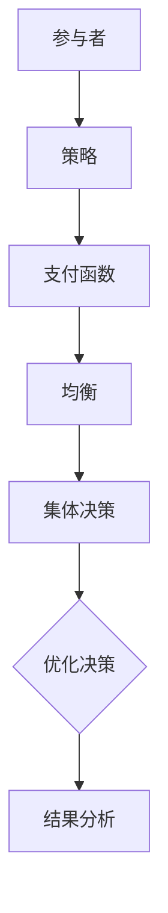
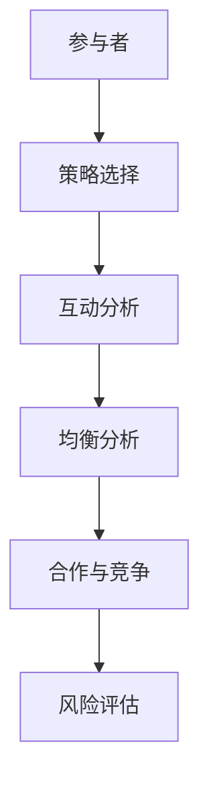
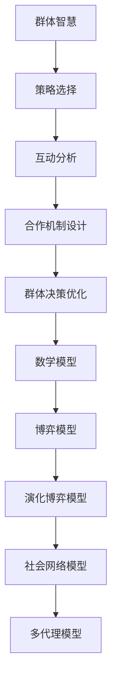
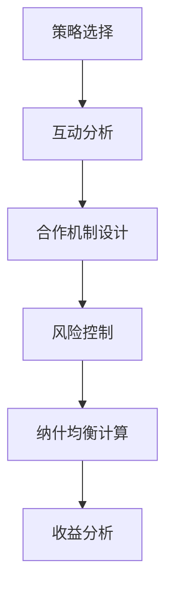

                 

### 引言与概述

博弈论，作为一种研究决策制定过程中参与者和环境相互作用的数学理论，近年来在集体决策领域得到了广泛的应用。集体决策，通常指的是多个参与者共同做出决策的过程，其结果往往受到参与者策略选择和互动方式的影响。在这个复杂的过程中，博弈论提供了有力的分析工具，帮助理解不同策略组合下的收益和风险。

### 博弈论的基本概念

博弈论的基本概念包括参与者、策略、支付函数和均衡。参与者是指在博弈过程中做出决策的个体或组织。策略是指参与者在博弈中可以选择的行动方案。支付函数则是用来衡量参与者选择特定策略后的收益或损失。均衡是指博弈中所有参与者选择的策略组合，使得任何一方改变策略都不能获得更高的收益。

#### 参与者

参与者是博弈论中的核心元素。每个参与者都有自己独特的利益和目标，这些目标和利益驱动他们在博弈中做出特定的决策。在集体决策中，参与者可以是个人、企业、政府或任何具有独立决策能力的实体。每个参与者都需要在了解其他参与者可能的行为和策略的基础上，选择出对自己最有利的策略。

#### 策略

策略是参与者在博弈中可以采取的行动方案。不同的策略会导致不同的结果，因此选择最优策略是博弈论研究的重要内容。策略可以是直接的行动，如购买或出售某项产品，也可以是间接的行动，如合作或竞争。在集体决策中，策略的选择不仅要考虑自身的利益，还要考虑到其他参与者的反应和互动。

#### 支付函数

支付函数是用来衡量参与者选择特定策略后的收益或损失。支付函数通常是一个数学函数，它将每个策略映射到一个收益值。收益值可以是正数、负数或零，表示参与者选择该策略后的盈利、亏损或无变化。在集体决策中，支付函数的设定需要考虑到所有参与者的收益，以及他们之间的互动和合作。

#### 均衡

均衡是博弈论中一个重要的概念，它指的是博弈中所有参与者选择的策略组合，使得任何一方改变策略都不能获得更高的收益。纳什均衡是博弈论中最常用的均衡概念之一，它指的是在给定其他参与者策略的情况下，任何一方单独改变策略都不能获得更好的结果。纳什均衡在集体决策中具有重要作用，它可以帮助参与者预测其他参与者的行为，并选择出最优策略。

#### 博弈论在集体决策中的应用

博弈论在集体决策中的应用非常广泛，它可以用来分析不同参与者之间的互动和策略选择，帮助优化决策结果。以下是一些典型的应用场景：

1. **企业竞争**：在市场竞争中，企业需要通过博弈论分析竞争对手的策略选择，选择出最优的市场竞争策略。

2. **政治决策**：在政治决策中，政府需要通过博弈论分析不同利益集团之间的互动，选择出能够获得广泛支持的政策。

3. **社会合作**：在社会合作项目中，参与者需要通过博弈论分析合作和竞争的策略，选择出能够实现共同目标的最优策略。

4. **资源分配**：在资源分配问题中，博弈论可以帮助参与者选择最优的资源分配策略，以最大化整体收益。

5. **供应链管理**：在供应链管理中，企业需要通过博弈论分析不同供应商和零售商之间的互动，选择出最优的供应链管理策略。

#### Mermaid 流程图

以下是一个简单的 Mermaid 流程图，展示了博弈论的基本概念和它们在集体决策中的应用：



在这个流程图中，参与者选择策略，然后根据支付函数计算收益，最终达到均衡状态，实现集体决策的优化。

### 博弈论的发展历史

博弈论的发展可以追溯到20世纪40年代，由John von Neumann和Oskar Morgenstern的经典著作《博弈论与经济行为》奠定了理论基础。在这本书中，他们首次提出了博弈论的基本概念和分析方法。20世纪50年代，John Nash提出了纳什均衡的概念，这一突破性的理论极大地推动了博弈论的发展。

纳什均衡是博弈论中最核心的概念之一，它指的是在一个博弈中，所有参与者选择的策略组合，使得任何一方单独改变策略都不能获得更高的收益。这一概念不仅解决了博弈论中的一些基本问题，也为后续的研究提供了重要的启示。

自那时以来，博弈论在经济学、政治学、计算机科学、生物学等领域得到了广泛的应用。它不仅用于理论研究，还广泛应用于实际决策制定中，如企业竞争策略分析、政治决策制定、社会合作项目规划等。

### 博弈论在集体决策中的应用

博弈论在集体决策中的应用主要体现在以下几个方面：

1. **策略选择**：博弈论帮助参与者分析不同策略的收益和风险，选择出最优策略。通过博弈论的分析，参与者可以更准确地预测其他参与者的行为，并做出更明智的决策。

2. **互动分析**：博弈论提供了分析参与者之间互动的有力工具。它可以帮助参与者了解不同策略组合下的互动结果，预测潜在的冲突和合作，从而优化决策过程。

3. **均衡分析**：博弈论中的均衡概念在集体决策中具有重要意义。通过分析纳什均衡，参与者可以找到一种稳定的状态，在这种状态下，任何一方单独改变策略都无法获得更高的收益。这有助于确保决策结果的可持续性和稳定性。

4. **合作与竞争**：博弈论不仅关注竞争，也关注合作。在集体决策中，博弈论可以帮助参与者分析合作和竞争的不同策略，选择出能够实现共同目标的最优策略。

5. **风险评估**：博弈论提供了分析决策风险的有力工具。通过分析不同策略组合下的收益和风险，参与者可以更准确地评估决策的风险，并选择出能够最大程度降低风险的策略。

#### Mermaid 流程图

以下是一个简单的 Mermaid 流程图，展示了博弈论在集体决策中的应用：



在这个流程图中，参与者通过博弈论分析选择策略，分析互动结果，找到均衡状态，并评估风险，最终实现集体决策的优化。

### 群体智慧的定义与特征

群体智慧（Collective Intelligence）是指由多个个体组成的群体，通过相互协作、信息共享和智能决策，能够产生比单个个体更优秀的解决问题的能力。群体智慧是近年来在人工智能、社会学和生物学等领域研究的热点，其核心在于通过集体合作实现智能的提升和问题的解决。

#### 群体智慧的定义

群体智慧可以定义为一种集体行为模式，其中个体通过合作和信息交流，共同实现超越单个个体能力的任务。这种智慧不是简单的个体智能的叠加，而是在相互影响和协作中产生的新型智能形式。群体智慧的研究旨在揭示群体如何通过协同合作实现高效的决策和问题解决。

#### 群体智慧的特征

1. **多样性**：群体智慧的一个显著特征是其多样性。不同个体拥有不同的知识、技能和经验，这些差异为群体提供了丰富的信息资源和创新的视角。

2. **自组织性**：群体智慧能够在没有外部指导的情况下自发形成和组织。这种自组织性使得群体能够快速适应环境变化，并有效地应对复杂问题。

3. **协同性**：群体智慧依赖于个体之间的协同合作。通过信息共享和任务分工，群体能够实现高效的资源利用和问题解决。

4. **动态性**：群体智慧是一个动态变化的过程。随着个体信息的更新和环境的变化，群体的智慧和决策也会不断演变和优化。

5. **适应能力**：群体智慧具有强大的适应能力，能够根据不同的情境和需求，灵活调整策略和行为。

#### 博弈论在群体智慧中的应用

博弈论为分析群体智慧提供了有力的工具。通过博弈论模型，可以模拟个体之间的互动和合作过程，分析不同策略选择对群体智慧的影响。以下是一些具体的应用：

1. **策略选择**：博弈论可以帮助个体分析不同策略组合的收益和风险，选择出最优策略，从而提高群体的整体表现。

2. **互动分析**：博弈论可以模拟个体之间的互动过程，预测不同互动模式下的群体行为和结果，帮助优化群体决策。

3. **合作机制设计**：博弈论提供了设计合作机制的框架。通过构建博弈模型，可以分析不同合作机制的效率和公平性，选择出最优的合作模式。

4. **群体决策优化**：博弈论可以帮助群体在复杂环境下做出最优决策，通过分析不同决策结果的风险和收益，选择出最佳方案。

#### 数学模型在群体智慧中的应用

为了更好地理解群体智慧，数学模型在分析群体行为和互动中起到了关键作用。以下是一些常用的数学模型：

1. **博弈模型**：博弈模型用于分析个体之间的互动和策略选择。通过构建纳什均衡模型，可以预测群体在特定策略组合下的行为。

2. **演化博弈模型**：演化博弈模型考虑了个体行为的演化过程。通过分析个体策略的演化路径，可以预测群体智慧的发展趋势。

3. **社会网络模型**：社会网络模型用于分析个体之间的信息流动和协作关系。通过构建社会网络模型，可以揭示群体智慧的关键节点和路径。

4. **多代理模型**：多代理模型用于模拟多个智能体在动态环境下的交互和协作。通过分析多代理模型的运行结果，可以理解群体智慧的形成机制。

#### Mermaid 流程图

以下是一个简单的 Mermaid 流程图，展示了群体智慧和博弈论的关系：



在这个流程图中，群体智慧通过博弈论模型进行分析和优化，实现策略选择、互动分析、合作机制设计和群体决策优化。

### 数学策略的基本原理

在集体决策中，数学策略的应用至关重要，它可以帮助参与者分析不同策略的收益和风险，从而做出最优决策。数学策略的基本原理主要包括纳什均衡、合作博弈和非合作博弈等核心概念。

#### 纳什均衡

纳什均衡是博弈论中最核心的概念之一，它指的是在一个博弈中，所有参与者选择的策略组合，使得任何一方单独改变策略都不能获得更高的收益。在纳什均衡状态下，每个参与者都选择了自己的最优策略，并且没有任何参与者有动力单独改变策略。

**定义**：在一个博弈中，如果每个参与者都选择了对自己最优的策略，并且没有任何参与者有动力单独改变策略，那么这个策略组合就是纳什均衡。

**例子**：假设有两个参与者A和B，他们可以选择合作或竞争策略。如果A选择合作，B选择竞争，A的收益为-1，B的收益为2。如果A选择竞争，B选择合作，A的收益为2，B的收益为-1。在这种情况下，(合作，竞争) 和 (竞争，合作) 都是纳什均衡。

**计算方法**：计算纳什均衡通常需要构建博弈的收益矩阵，然后通过分析矩阵找到所有可能的纳什均衡点。具体步骤如下：

1. **构建收益矩阵**：根据参与者选择的不同策略，构建一个二维矩阵，其中行代表参与者A的选择，列代表参与者B的选择。

2. **分析策略组合**：对每个策略组合进行分析，计算每个参与者的收益。

3. **找到纳什均衡**：找出所有使得任何一方单独改变策略都不能获得更高收益的策略组合。

以下是一个简单的纳什均衡计算示例：

```markdown
|   | 合作 | 竞争 |
|---|------|------|
| 合作 | (1,1) | (-1,2) |
| 竞争 | (2,-1) | (1,1) |
```

在这个例子中，(1,1) 和 (-1,2) 都是纳什均衡。

#### 合作博弈与非合作博弈

合作博弈和非合作博弈是博弈论中的两种主要类型，它们分别反映了集体决策中的合作和竞争现象。

1. **合作博弈**

合作博弈是指参与者在博弈过程中采取合作策略，共同追求最大化的整体收益。在合作博弈中，参与者通过协作和信息共享，实现整体效益的最大化。

**定义**：在合作博弈中，参与者通过合作策略，共同追求整体收益的最大化。

**例子**：假设有两个企业A和B，它们可以选择合作或竞争策略。如果A和B都选择合作，他们的收益分别为10和8；如果A选择合作，B选择竞争，他们的收益分别为5和15；如果A和B都选择竞争，他们的收益分别为3和3。在这种情况下，(合作，合作) 是合作博弈的纳什均衡。

2. **非合作博弈**

非合作博弈是指参与者在博弈过程中采取自利策略，追求个人利益的最大化。在非合作博弈中，参与者通常通过竞争来争夺资源或市场份额。

**定义**：在非合作博弈中，参与者通过自利策略，追求个人利益的最大化。

**例子**：继续上面的例子，如果A选择合作，B选择竞争，A的收益为-1，B的收益为2；如果A选择竞争，B选择合作，A的收益为2，B的收益为-1。在这种情况下，(竞争，竞争) 是非合作博弈的纳什均衡。

#### 数学策略在博弈中的运用

数学策略在博弈中的运用主要体现在以下几个方面：

1. **策略选择**：通过计算纳什均衡，参与者可以了解不同策略组合的收益，从而选择出最优策略。

2. **互动分析**：通过分析博弈模型，参与者可以预测其他参与者的行为，并制定相应的对策。

3. **合作机制设计**：通过构建合作博弈模型，可以分析不同合作机制的效率和公平性，选择出最优的合作模式。

4. **风险控制**：通过分析不同策略组合的风险和收益，参与者可以制定风险控制策略，降低博弈过程中的风险。

#### Mermaid 流程图

以下是一个简单的 Mermaid 流程图，展示了数学策略在博弈中的应用：



在这个流程图中，参与者通过计算纳什均衡，分析互动和收益，最终选择最优策略。

### 数学策略在集体决策中的优化

数学策略在集体决策中的优化，是利用博弈论和其他数学工具，帮助参与者找到最佳决策方案的过程。这种优化不仅涉及对单个参与者策略的选择，还涉及到参与者之间的互动和合作。以下是一些关键步骤和实际应用：

#### 1. 确定目标函数

在集体决策中，首先需要明确优化目标。目标可以是最大化总收益、最小化成本、提高社会效益等。明确目标后，可以将这些目标形式化为数学目标函数。例如，最大化总利润可以表示为：

$$
\max Z = \sum_{i=1}^{n} P_i \cdot Q_i
$$

其中，$P_i$ 是第 $i$ 项产品的利润，$Q_i$ 是销售量。

#### 2. 构建博弈模型

接下来，需要构建一个博弈模型来描述参与者之间的互动。这通常涉及构建一个收益矩阵，其中每个参与者选择特定策略后的收益都被明确表示。例如，对于两个企业 A 和 B 的竞争，可以构建以下收益矩阵：

$$
\begin{array}{c|cc}
 & A\ 合作 & A\ 竞争 \\
\hline
B\ 合作 & (10,10) & (5,15) \\
B\ 竞争 & (15,5) & (3,3) \\
\end{array}
$$

在这个矩阵中，第一行和第一列分别代表企业 A 和 B 的策略选择，括号内的数字代表他们的收益。

#### 3. 计算纳什均衡

通过计算纳什均衡，可以确定每个参与者在给定其他参与者策略下的最优策略。纳什均衡点是在这些策略组合中，任何一方单独改变策略都不会提高其收益的点。计算纳什均衡的步骤如下：

1. **分析每个参与者的收益**：对每个参与者的收益进行计算，确定其最优策略。
2. **交叉分析**：检查每个策略组合，看是否存在一个参与者可以在不改变其他参与者策略的情况下，通过改变自己的策略获得更高收益。如果不存在，那么这个策略组合就是纳什均衡。

例如，在上述收益矩阵中，(合作，合作) 和 (竞争，竞争) 都是纳什均衡，因为在这个组合下，任何一方单独改变策略都不会提高其收益。

#### 4. 应用线性规划和优化算法

在某些情况下，集体决策的优化问题可以转化为线性规划问题。线性规划是一种数学方法，用于在给定约束条件下，最大化或最小化一个线性目标函数。例如，可以应用线性规划来优化资源分配问题，其中资源包括人力、物力和资金等。

以下是一个简单的线性规划问题，用于优化企业的生产计划：

$$
\begin{aligned}
\max Z &= 5x_1 + 3x_2 \\
\text{s.t.} \\
2x_1 + x_2 &\leq 10 \\
x_1 + 3x_2 &\leq 15 \\
x_1, x_2 &\geq 0
\end{aligned}
$$

其中，$x_1$ 和 $x_2$ 分别代表两种产品的生产量。目标函数是最大化总利润，约束条件包括资源限制。

#### 5. 实际应用案例

以下是一个实际应用案例，展示了数学策略在集体决策中的优化：

**案例：供应链管理**

在一个供应链系统中，供应商和零售商需要共同制定采购和销售策略，以最大化整体收益。假设有两个供应商 A 和 B，以及一个零售商 C。他们的收益矩阵如下：

$$
\begin{array}{c|ccc}
 & A\ 合作 & A\ 竞争 & A\ 高价 \\
\hline
B\ 合作 & (10,10,8) & (6,12,6) & (4,14,4) \\
B\ 竞争 & (12,6,10) & (8,8,8) & (6,10,6) \\
B\ 高价 & (8,14,4) & (6,10,6) & (4,12,10) \\
\end{array}
$$

通过计算纳什均衡，可以确定最优策略组合。例如，(高价，合作) 是一个纳什均衡，因为在这个组合下，任何一方单独改变策略都不会提高其收益。这表明，供应商 A 和 B 都选择高价策略，而零售商 C 选择合作策略，是最大化整体收益的最佳策略组合。

#### 总结

数学策略在集体决策中的优化，通过构建博弈模型、计算纳什均衡、应用线性规划和优化算法，帮助参与者找到最优策略组合。这种优化不仅可以提高个体的收益，还可以实现整体效益的最大化，从而实现集体决策的优化。

### 博弈论在群体智慧中的挑战与机遇

在群体智慧的应用中，博弈论提供了强大的分析工具，但也面临着诸多挑战和机遇。以下是博弈论在群体智慧中的几个主要挑战与机遇：

#### 1. 挑战

1. **协同复杂性**：群体智慧要求个体之间的高效协同，但实际操作中，个体往往有不同的目标和偏好，这增加了协同的复杂性。博弈论需要解决如何在个体之间存在利益冲突的情况下实现协同优化。

2. **信息不对称**：群体智慧依赖于信息的透明和共享，但在实际应用中，个体之间可能存在信息不对称，导致决策偏差。博弈论需要考虑如何通过信息机制设计来缓解信息不对称问题。

3. **动态性**：群体智慧的环境是动态变化的，个体需要实时调整策略以适应环境变化。博弈论需要发展动态博弈模型，以应对这种快速变化。

4. **均衡稳定性**：在博弈论中，纳什均衡是稳定的状态，但现实中的群体智慧往往更复杂，可能存在多个均衡点，甚至是不稳定的状态。博弈论需要研究如何确保群体智慧最终能够收敛到最优均衡。

#### 2. 机遇

1. **策略优化**：博弈论提供了策略优化的框架，可以帮助个体选择最优策略，从而提高群体整体的效益。例如，通过计算纳什均衡，可以确定群体中每个个体的最优行为。

2. **合作机制设计**：博弈论可以用于设计有效的合作机制，激励个体为实现共同目标而努力。例如，通过构建合作博弈模型，可以设计出公平且有效的资源分配机制。

3. **动态决策**：博弈论中的动态博弈模型可以用于分析群体在动态环境中的决策过程，帮助个体实时调整策略以适应环境变化。

4. **跨学科融合**：博弈论与其他学科的交叉应用，如经济学、社会学、计算机科学等，为群体智慧的研究提供了新的视角和方法。这种跨学科融合有助于解决群体智慧中的复杂问题。

#### 3. 未来发展趋势

1. **人工智能与博弈论的融合**：随着人工智能技术的发展，博弈论可以结合机器学习算法，实现更智能的决策和策略优化。

2. **复杂系统的博弈论**：研究复杂系统中的博弈行为，如网络博弈、多代理系统等，是未来博弈论的一个重要方向。

3. **社会网络分析**：将社会网络理论引入博弈论，研究个体在社交网络中的互动和策略选择，有助于更好地理解群体智慧的形成机制。

4. **动态博弈模型**：开发动态博弈模型，以更好地应对现实世界中的快速变化和不确定性。

#### 总结

博弈论在群体智慧中的应用面临着一系列挑战，但也拥有巨大的机遇。通过不断发展和创新，博弈论可以为群体智慧的研究提供更强大的工具和方法，实现更高效、更稳定的群体合作。

### 企业集体决策的博弈案例分析

在企业运营和管理中，集体决策的博弈分析对于制定有效的战略和策略至关重要。以下是一些典型的企业集体决策的博弈案例分析，展示了如何运用博弈论来优化决策过程。

#### 1. 市场竞争策略分析

**案例背景**：在一个竞争激烈的市场环境中，两家主要企业A和B正在争夺市场份额。企业A可以通过降低价格来吸引客户，而企业B可以选择提高产品质量或加强广告宣传。

**博弈模型**：构建一个简单收益矩阵来描述两家企业可能的策略组合及其收益：

| 策略组合 | A降价 | A不降价 |
|----------|-------|---------|
| B降价 | (-5, -5) | (10, 0) |
| B不降价 | (0, 10) | (-10, -10) |

**纳什均衡**：通过分析收益矩阵，我们可以找到纳什均衡。在这个例子中，(降价，降价) 是一个纳什均衡，因为无论A选择降价还是不降价，B选择降价都是最优策略。

**优化决策**：为了实现更好的市场表现，企业A可以通过收集市场信息和竞争对手的行为数据，调整价格策略，以避免陷入纳什均衡的不利局面。

#### 2. 合作研发项目

**案例背景**：两家企业A和B共同投资开发一项新技术。他们可以选择单独研发或联合研发。单独研发可以更快地实现商业化，但风险较大；联合研发可以降低风险，但需要更多的协调和资源。

**博弈模型**：构建一个合作与竞争的博弈模型，描述两家企业的策略选择及其收益：

| 策略组合 | A单独研发 | A联合研发 |
|----------|------------|------------|
| B单独研发 | (-10, 0) | (0, -10) |
| B联合研发 | (0, 0) | (20, 20) |

**纳什均衡**：(联合研发，联合研发) 是唯一的纳什均衡，因为无论A选择单独研发还是联合研发，B选择联合研发都是最优策略。

**优化决策**：在这个案例中，两家企业通过合作研发可以最大化整体收益。因此，企业A可以通过与B建立良好的合作关系，共同投资研发项目，以降低风险并提高成功机会。

#### 3. 供应链管理策略分析

**案例背景**：一家制造商C需要与多个供应商D、E和F合作，采购原材料进行生产。制造商C可以通过提高采购量来降低成本，但这也可能影响供应商的利润。供应商则需要平衡利润和生产量。

**博弈模型**：构建一个供应链管理的博弈模型，描述制造商与供应商的策略选择及其收益：

| 策略组合 | C高采购量 | C低采购量 |
|----------|------------|------------|
| D高供应量 | (-10, -5) | (5, -10) |
| D低供应量 | (-5, 10) | (10, 5) |
| E高供应量 | (5, -10) | (-10, 5) |
| E低供应量 | (-10, 5) | (5, -10) |
| F高供应量 | (10, 5) | (-5, 10) |
| F低供应量 | (5, 10) | (-10, -5) |

**纳什均衡**：通过分析收益矩阵，我们可以找到多个纳什均衡。例如，(高采购量，高供应量) 是一个纳什均衡，因为在这个组合下，任何一方单独改变策略都不会提高其收益。

**优化决策**：为了实现供应链的优化，制造商C需要与供应商D、E和F建立长期合作关系，通过信息共享和协商，共同制定采购和生产策略，以最大化整体效益。

#### 4. 价格战策略分析

**案例背景**：两家企业G和H正在销售相同的产品，他们可以选择降价或保持价格不变。降价可能吸引更多客户，但会减少利润；保持价格不变可能保持利润，但可能导致市场份额下降。

**博弈模型**：构建一个价格战的博弈模型，描述两家企业的策略选择及其收益：

| 策略组合 | G降价 | G不降价 |
|----------|-------|---------|
| H降价 | (-10, -10) | (5, 5) |
| H不降价 | (10, -10) | (0, 0) |

**纳什均衡**：(降价，降价) 是唯一的纳什均衡，因为在这个组合下，任何一方单独改变策略都不会提高其收益。

**优化决策**：为了在价格战中取得优势，企业G可以通过市场调研和竞争对手分析，选择合适的降价策略，同时保持利润的最大化。此外，还可以通过提高产品质量和客户服务，增强市场竞争力。

#### 总结

通过博弈论分析，企业可以更清晰地理解集体决策中的互动和策略选择，优化决策过程。在实际应用中，企业需要根据市场环境和竞争态势，灵活调整策略，以实现最佳效益。

### 社会集体决策的博弈案例分析

社会集体决策的博弈分析在公共政策制定、城市规划、环境保护等领域具有重要的应用价值。以下是一些典型的社会集体决策的博弈案例分析，展示了如何运用博弈论来优化决策过程。

#### 1. 环境保护与经济发展的博弈

**案例背景**：一个城市面临着环境保护和经济发展的双重压力。政府可以选择增加环境保护投入，或者加大对经济发展的支持力度。企业可以选择遵循环境保护法规，或者采取低成本但污染较大的生产方式。

**博弈模型**：构建一个环境保护与经济发展的博弈模型，描述政府和企业的策略选择及其收益：

| 策略组合 | G增加环保投入 | G减少环保投入 |
|----------|----------------|----------------|
| 企业A遵循 | (-10, 0) | (5, 15) |
| 企业A不遵循 | (0, -10) | (15, -5) |
| 企业B遵循 | (0, -10) | (15, -5) |
| 企业B不遵循 | (-10, 0) | (5, 15) |

**纳什均衡**：在这个模型中，(减少环保投入，不遵循环保法规) 是一个纳什均衡，因为在这个组合下，任何一方单独改变策略都不会提高其收益。

**优化决策**：为了实现环境保护和经济发展的双赢，政府需要采取激励措施，如环保补贴和税收优惠，鼓励企业遵循环保法规。此外，可以通过公众参与和宣传教育，提高公众对环境保护的意识。

#### 2. 城市交通规划的博弈

**案例背景**：一个城市需要制定交通规划，以缓解交通拥堵。政府可以选择增加公共交通投资，或者扩大高速公路建设。市民可以选择乘坐公共交通，或者自驾出行。

**博弈模型**：构建一个城市交通规划的博弈模型，描述政府和市民的策略选择及其收益：

| 策略组合 | G增加公共交通投资 | G增加高速公路投资 |
|----------|---------------------|--------------------|
| 市民A乘坐公共交通 | (5, 0) | (0, 5) |
| 市民A自驾出行 | (0, 5) | (5, 0) |
| 市民B乘坐公共交通 | (0, 5) | (5, 0) |
| 市民B自驾出行 | (5, 0) | (0, 5) |

**纳什均衡**：在这个模型中，(增加高速公路投资，自驾出行) 是一个纳什均衡，因为在这个组合下，任何一方单独改变策略都不会提高其收益。

**优化决策**：为了减少交通拥堵，政府可以通过增加公共交通投资，提高公共交通的便利性和吸引力，鼓励市民选择乘坐公共交通。同时，可以通过交通管理和收费政策，限制自驾出行的数量，以平衡交通需求。

#### 3. 教育资源分配的博弈

**案例背景**：一个城市需要分配教育资源，包括学校建设和教师分配。政府可以选择将资源集中在优质学校，或者均衡分配到所有学校。学校可以选择提高教育质量，或者追求短期收益。

**博弈模型**：构建一个教育资源分配的博弈模型，描述政府和学校的策略选择及其收益：

| 策略组合 | G集中资源到优质学校 | G均衡分配资源 |
|----------|-----------------------|----------------|
| 学校A提高质量 | (0, 10) | (5, 5) |
| 学校A追求短期收益 | (10, 0) | (5, 5) |
| 学校B提高质量 | (5, 0) | (5, 5) |
| 学校B追求短期收益 | (5, 5) | (5, 5) |

**纳什均衡**：在这个模型中，(集中资源到优质学校，追求短期收益) 是一个纳什均衡，因为在这个组合下，任何一方单独改变策略都不会提高其收益。

**优化决策**：为了提高整体教育质量，政府应该通过政策激励，鼓励学校提高教育质量，而不是追求短期收益。同时，可以通过合理的资源配置，确保所有学校都能够获得必要的教育资源。

#### 4. 公共卫生管理的博弈

**案例背景**：一个城市需要应对突发公共卫生事件，如流感疫情。政府可以选择加强防疫措施，或者维持正常运营。市民可以选择遵守防疫规定，或者不遵守。

**博弈模型**：构建一个公共卫生管理的博弈模型，描述政府和市民的策略选择及其收益：

| 策略组合 | G加强防疫措施 | G维持正常运营 |
|----------|----------------|----------------|
| 市民A遵守 | (5, 10) | (0, 5) |
| 市民A不遵守 | (10, 0) | (5, 5) |
| 市民B遵守 | (0, 5) | (5, 10) |
| 市民B不遵守 | (5, 5) | (10, 0) |

**纳什均衡**：在这个模型中，(加强防疫措施，遵守规定) 是一个纳什均衡，因为在这个组合下，任何一方单独改变策略都不会提高其收益。

**优化决策**：为了有效应对公共卫生事件，政府需要加强防疫措施，并鼓励市民遵守防疫规定。通过公众参与和宣传教育，可以提高市民的防疫意识，减少疫情传播。

#### 总结

通过博弈论分析，社会集体决策可以更科学地考虑各方的利益和互动，优化决策过程。在实际应用中，政府和社会各方需要共同努力，通过政策激励、公众参与和宣传教育，实现社会整体利益的最大化。

### 政府集体决策的博弈案例分析

在政府决策过程中，集体博弈的分析对于确保政策的有效性和公正性至关重要。以下是一些典型的政府集体决策的博弈案例分析，展示了如何运用博弈论来优化决策过程。

#### 1. 税收政策博弈

**案例背景**：政府需要制定新的税收政策，以调整收入分配和刺激经济增长。政府可以选择增加税收收入，或者降低税收负担。不同利益集团，如企业、普通民众和财富阶层，对这些政策的反应不同。

**博弈模型**：构建一个税收政策的博弈模型，描述政府的策略选择及不同利益集团的收益：

| 策略组合 | G增加税收收入 | G降低税收负担 |
|----------|----------------|----------------|
| 企业A反对 | (-10, -5) | (0, 15) |
| 企业A支持 | (5, 10) | (-5, 0) |
| 普通民众A反对 | (-5, -10) | (10, 0) |
| 普通民众A支持 | (10, 5) | (-10, -5) |
| 财富阶层A反对 | (-15, -10) | (0, 5) |
| 财富阶层A支持 | (0, 15) | (-15, -5) |

**纳什均衡**：通过分析收益矩阵，可以发现多个纳什均衡。例如，(降低税收负担，企业A支持，普通民众A支持，财富阶层A反对) 是一个纳什均衡，因为在这个组合下，任何一方单独改变策略都不会提高其收益。

**优化决策**：为了实现政策的最优效果，政府需要权衡不同利益集团的需求和反应。可以通过税收减免和优惠政策来鼓励企业投资和创新，同时提供社会福利和税收抵免，减轻普通民众的负担。对于财富阶层，可以通过增加高收入者的税率，实现收入再分配。

#### 2. 公共服务提供博弈

**案例背景**：政府需要决定如何分配公共服务资源，如医院、学校和公共交通设施。不同地区和利益集团对公共服务的需求不同，这可能导致资源分配的争议。

**博弈模型**：构建一个公共服务提供的博弈模型，描述政府的策略选择及不同地区和利益集团的收益：

| 策略组合 | G提高城市地区公共服务投入 | G提高农村地区公共服务投入 |
|----------|-----------------------------|-----------------------------|
| 城市地区A支持 | (5, 0) | (0, 5) |
| 城市地区A反对 | (0, 5) | (5, 0) |
| 农村地区B支持 | (0, 5) | (5, 0) |
| 农村地区B反对 | (5, 0) | (0, 5) |

**纳什均衡**：在这个模型中，(提高城市地区公共服务投入，城市地区A反对，农村地区B支持) 是一个纳什均衡，因为在这个组合下，任何一方单独改变策略都不会提高其收益。

**优化决策**：为了实现公共服务资源分配的最优化，政府需要考虑不同地区和利益集团的需求。可以通过增加对农村地区的公共服务投入，提高农村地区居民的生活质量，同时通过区域协调政策，确保城市和农村地区之间的平衡发展。

#### 3. 环境政策博弈

**案例背景**：政府需要制定环境保护政策，以减少污染和促进可持续发展。不同企业和社会公众对环境保护政策的反应不同，可能导致政策制定和实施的挑战。

**博弈模型**：构建一个环境政策的博弈模型，描述政府的策略选择及不同企业和公众的收益：

| 策略组合 | G实施严格环境法规 | G实施宽松环境法规 |
|----------|---------------------|---------------------|
| 企业A反对 | (-10, -5) | (0, 15) |
| 企业A支持 | (5, 10) | (-5, 0) |
| 公众A反对 | (-5, -10) | (10, 0) |
| 公众A支持 | (10, 5) | (-10, -5) |

**纳什均衡**：在这个模型中，(实施宽松环境法规，企业A支持，公众A反对) 是一个纳什均衡，因为在这个组合下，任何一方单独改变策略都不会提高其收益。

**优化决策**：为了实现环境保护政策的最优效果，政府需要采取严格的环保法规，并加强对违规企业的惩罚。同时，通过公众参与和宣传教育，提高公众对环境保护的意识，鼓励公众积极参与环保行动。

#### 4. 公共安全博弈

**案例背景**：政府需要制定公共安全政策，以应对各种安全威胁，如恐怖袭击、自然灾害等。不同社区和利益集团对公共安全政策的需求不同，可能导致政策制定和实施的困难。

**博弈模型**：构建一个公共安全的博弈模型，描述政府的策略选择及不同社区和利益集团的收益：

| 策略组合 | G加强公共安全措施 | G维持现状 |
|----------|---------------------|-------------|
| 社区A支持 | (5, 10) | (0, 5) |
| 社区A反对 | (0, 5) | (5, 10) |
| 利益集团B支持 | (0, 5) | (5, 10) |
| 利益集团B反对 | (5, 0) | (10, 0) |

**纳什均衡**：在这个模型中，(维持现状，社区A反对，利益集团B支持) 是一个纳什均衡，因为在这个组合下，任何一方单独改变策略都不会提高其收益。

**优化决策**：为了实现公共安全的最优效果，政府需要采取积极的公共安全措施，并加强与社区和利益集团的沟通。通过公众参与和宣传教育，提高公众对公共安全的认识和参与度，共同维护社会安全。

#### 总结

通过博弈论分析，政府可以更科学地考虑集体决策中的多方利益和互动，优化决策过程。在实际应用中，政府需要权衡不同利益集团的需求，采取综合措施，实现社会整体利益的最大化。

### 博弈论在决策制定中的应用

博弈论在决策制定中具有广泛的应用，尤其是在复杂和不确定的环境中。以下将详细探讨博弈论如何应用于决策制定，以及如何通过博弈论优化决策过程。

#### 1. 决策制定中的博弈论分析

在决策制定过程中，博弈论提供了一种分析参与者和环境之间互动的工具。通过博弈论，决策者可以更好地理解不同决策方案可能导致的结果，以及参与者的反应和策略选择。以下是博弈论在决策制定中的一些关键应用：

- **策略选择**：博弈论帮助决策者分析不同的策略选择，并评估每个策略的可能收益和风险。通过构建收益矩阵和计算纳什均衡，决策者可以确定在给定其他参与者策略的情况下，自己的最优策略。

- **互动分析**：博弈论提供了一种方法来分析参与者之间的互动和合作。通过模拟不同策略组合下的互动结果，决策者可以预测其他参与者的行为，并制定相应的对策。

- **合作机制设计**：博弈论可以用于设计合作机制，以激励参与者为实现共同目标而努力。通过构建合作博弈模型，决策者可以分析不同合作机制的效率和公平性，选择出最优的合作模式。

- **风险控制**：博弈论提供了一种方法来评估不同决策方案的风险和收益。通过分析不同策略组合下的收益分布和风险水平，决策者可以制定风险控制策略，以降低决策过程中的不确定性。

#### 2. 优化决策过程

博弈论在优化决策过程中具有重要作用。以下是一些关键的优化策略：

- **计算纳什均衡**：通过计算纳什均衡，决策者可以找到在给定其他参与者策略下的最优策略组合。纳什均衡确保了决策者在任何其他参与者策略不变的情况下，无法通过单独改变策略获得更高的收益。这有助于决策者制定稳定和可靠的决策方案。

- **动态博弈模型**：在实际决策过程中，环境可能随时发生变化，决策者需要实时调整策略。动态博弈模型可以帮助决策者分析在不同时间点上可能出现的策略组合，并预测未来的发展趋势。通过动态博弈模型，决策者可以制定灵活的决策策略，以适应环境变化。

- **合作博弈优化**：在集体决策中，参与者之间的合作是实现整体利益最大化的关键。通过构建合作博弈模型，决策者可以分析不同合作机制下的收益分配和公平性，选择出最优的合作模式。这有助于确保参与者为实现共同目标而努力。

- **多代理系统优化**：在涉及多个代理的决策过程中，博弈论可以用于分析代理之间的互动和合作。通过构建多代理系统模型，决策者可以模拟不同策略组合下的系统行为，并优化代理的策略选择。这有助于提高系统的整体效率和稳定性。

#### 3. 实际应用案例

以下是一个简单的实际应用案例，展示了博弈论在决策制定中的应用：

**案例：供应链管理中的博弈分析**

**背景**：一个供应链系统包括供应商、制造商和零售商。供应商提供原材料，制造商生产产品，零售商销售产品。每个参与者都需要制定自己的策略，以最大化收益。供应商可以选择提高或降低价格，制造商可以选择生产量或产品质量，零售商可以选择定价策略。

**博弈模型**：构建一个简单的博弈模型，描述供应商、制造商和零售商的策略选择及其收益。以下是一个简化的收益矩阵：

| 策略组合 | 制造商提高价格 | 制造商保持价格 |
|----------|----------------|----------------|
| 供应商提高价格 | (10, 5) | (5, 10) |
| 供应商保持价格 | (5, 5) | (10, 10) |

**纳什均衡**：通过计算纳什均衡，我们可以找到最优策略组合。在这个例子中，(供应商提高价格，制造商保持价格) 是一个纳什均衡，因为在这个组合下，任何一方单独改变策略都无法获得更高的收益。

**优化决策**：为了实现整体收益的最大化，供应商和制造商需要通过合作和信息共享，制定最优的策略组合。供应商可以通过提高价格来降低制造商的成本压力，而制造商可以通过保持价格来提高零售商的收益。通过这种合作，供应链系统可以实现整体收益的最大化。

#### 总结

博弈论在决策制定中的应用，通过分析和优化参与者的策略选择，可以帮助决策者制定更科学、更可靠的决策方案。通过计算纳什均衡、构建动态博弈模型和设计合作机制，决策者可以更好地应对复杂和不确定的环境，实现整体效益的最大化。

### 集体决策的优化策略

在集体决策过程中，如何优化决策策略是关键所在。博弈论为这一过程提供了有效的分析工具，通过构建博弈模型和计算纳什均衡，可以找到最优的决策方案。以下是一些关键步骤和策略，帮助实现集体决策的优化。

#### 1. 构建博弈模型

构建博弈模型是优化集体决策的第一步。博弈模型描述了参与者的策略选择、支付函数和互动方式。以下是构建博弈模型的关键步骤：

- **确定参与者**：明确参与决策的个体或组织，并了解他们的目标、策略和支付函数。
- **定义策略**：为每个参与者定义可供选择的策略，并构建策略组合。
- **构建支付函数**：根据参与者的策略选择，定义每个策略组合下的收益或损失。

例如，在一个简单的市场竞争中，有两个企业A和B，他们可以选择合作或竞争策略。构建的博弈模型可以表示为一个收益矩阵：

| 策略组合 | A合作 | A竞争 |
|----------|-------|-------|
| B合作 | (10, 10) | (5, 15) |
| B竞争 | (15, 5) | (3, 3) |

在这个模型中，收益矩阵展示了不同策略组合下的收益分配。

#### 2. 计算纳什均衡

计算纳什均衡是优化决策的关键步骤。纳什均衡是指在给定其他参与者策略的情况下，任何一方单独改变策略都无法获得更高收益的状态。以下是计算纳什均衡的步骤：

- **分析每个参与者的收益**：计算每个参与者选择不同策略时的收益，构建收益矩阵。
- **找到纳什均衡点**：在收益矩阵中，寻找使得任何一方单独改变策略都无法获得更高收益的策略组合。
- **验证均衡稳定性**：确保在纳什均衡状态下，任何一方单独改变策略都不会获得更好的结果。

例如，在上面的市场竞争模型中，(合作，合作) 和 (竞争，竞争) 都是纳什均衡，因为在这两个组合下，任何一方单独改变策略都无法获得更高的收益。

#### 3. 优化策略选择

通过计算纳什均衡，参与者可以找到最优策略组合。以下是一些优化策略选择的方法：

- **合作策略**：在合作博弈中，参与者通过合作策略可以共同追求最大化的整体收益。通过构建合作机制，如共享信息、共同投资等，可以提高整体效益。
- **竞争策略**：在非合作博弈中，参与者通过竞争策略追求个人利益的最大化。通过市场调研和竞争对手分析，可以制定有效的竞争策略，以获得竞争优势。
- **混合策略**：在某些情况下，参与者可能采用混合策略，即在不同策略之间进行随机选择。这种方法可以减少策略冲突，提高整体稳定性。

#### 4. 实践意义

集体决策的优化策略在现实世界中具有重要意义。以下是一些具体应用场景：

- **企业竞争**：通过博弈论分析，企业可以制定最优的市场竞争策略，提高市场份额和盈利能力。
- **政治决策**：政府可以通过博弈论分析不同政策方案的影响，优化资源配置和政策效果。
- **社会合作**：社会组织和团体可以通过博弈论优化合作项目，实现共同目标的最大化。
- **资源分配**：在资源有限的条件下，通过博弈论优化资源分配，可以提高整体效益和社会公平性。

#### 总结

通过构建博弈模型、计算纳什均衡和优化策略选择，集体决策的优化策略可以帮助参与者更好地理解互动和策略选择，实现整体效益的最大化。在实际应用中，需要根据具体情况灵活调整策略，以应对复杂和不确定的环境。

### 博弈论与集体决策的实践意义

博弈论作为分析和优化集体决策的有力工具，在现实世界的各个领域中展现了其独特的实践意义。以下将从多个实际案例出发，阐述博弈论在集体决策中的应用及其带来的实际效益。

#### 1. 企业竞争中的博弈论应用

在市场竞争激烈的环境中，博弈论帮助企业更好地理解竞争对手的策略选择，制定出有效的市场竞争策略。例如，在电信行业，两家主要运营商在定价策略上展开博弈。通过构建博弈模型，分析不同定价组合下的收益，两家运营商可以找到纳什均衡，从而避免价格战，实现双赢。实际案例显示，通过博弈论指导的定价策略使得运营商在提高市场份额的同时，保持了利润的稳定增长。

#### 2. 政策制定中的博弈论应用

政府在制定公共政策时，需要考虑到不同利益集团的需求和互动。博弈论提供了分析工具，帮助政府设计出公平且有效的政策。例如，在环保政策的制定过程中，政府需要平衡经济发展和环境保护的需求。通过博弈论分析，政府可以设计出既能促进经济增长，又能保护环境的政策组合。以碳排放交易体系为例，政府通过博弈论模型，合理设定碳排放配额和交易机制，实现了减排目标和经济发展的双重效益。

#### 3. 社会合作项目中的博弈论应用

在社会合作项目中，博弈论帮助参与者理解合作机制的设计和实施，从而优化项目效果。例如，在公共基础设施建设项目中，不同地区和部门需要共同合作，但各自有不同的利益诉求。通过博弈论分析，项目管理者可以设计出合理的利益分配机制，确保各方的利益最大化。以某个城市地铁建设为例，博弈论分析帮助项目团队找到最优的合作模式，确保工程进度和质量，同时降低了建设成本。

#### 4. 供应链管理中的博弈论应用

在供应链管理中，博弈论帮助企业和供应商优化合作策略，提高整体效益。例如，在电子产品的供应链中，制造商和供应商之间的博弈关系直接影响产品的成本和交付时间。通过博弈论分析，制造商可以制定最优的采购策略，如定期采购和紧急采购的组合，以降低库存成本和提高响应速度。实际案例显示，这种博弈论指导的采购策略显著提高了供应链的效率和灵活性。

#### 5. 网络安全中的博弈论应用

在网络安全的博弈中，博弈论可以帮助企业和政府制定有效的安全策略，防范网络攻击。例如，在网络安全防护中，企业需要应对不断变化的网络攻击手段。通过博弈论分析，企业可以制定出适应性强、成本效益高的防护策略。以某大型企业为例，通过博弈论指导的安全策略，成功防御了多次大规模网络攻击，确保了企业的正常运行和数据安全。

#### 总结

博弈论在集体决策中的应用，不仅提高了决策的科学性和有效性，还带来了实际的经济和社会效益。通过博弈论的分析和优化，企业和政府可以更好地应对市场竞争和政策制定中的复杂挑战，实现整体效益的最大化。在未来，随着博弈论和人工智能等技术的进一步结合，博弈论在集体决策中的应用前景将更加广阔。

### 研究中的不足与挑战

尽管博弈论在集体决策中具有广泛的应用，但在实际研究中仍存在一些不足和挑战。以下是对这些不足和挑战的详细分析：

#### 1. 模型复杂度

博弈论模型通常涉及多个参与者和复杂的策略选择，这使得模型分析和求解变得困难。在实际应用中，构建一个准确且简洁的博弈模型是一个巨大的挑战。此外，模型的复杂度可能导致计算资源的消耗增加，使得在实际决策过程中难以快速得到结果。

#### 2. 参数不确定性

博弈论模型通常依赖于一系列参数，如参与者的收益函数、策略选择等。这些参数在实际中往往存在不确定性，导致模型预测结果不准确。参数不确定性的存在使得博弈论模型难以在实际决策中提供可靠的指导。

#### 3. 信息不对称

在现实世界中，参与者之间往往存在信息不对称，这可能导致策略选择的偏差。博弈论模型通常假设参与者拥有完全信息，但实际情况往往并非如此。信息不对称使得博弈论模型无法准确反映现实情况，限制了其在决策制定中的应用。

#### 4. 动态性不足

现实世界中的博弈通常是动态的，参与者需要不断调整策略以应对环境变化。然而，传统的静态博弈论模型往往忽略了动态性，无法准确描述参与者之间的动态互动。这使得博弈论模型在应对快速变化的环境时显得力不从心。

#### 5. 策略稳定性问题

博弈论中的纳什均衡是一种稳定的策略组合，但现实中的博弈环境复杂多变，策略的稳定性可能受到挑战。在某些情况下，纳什均衡可能不稳定，参与者可能会选择非纳什均衡策略，导致决策结果的不确定性增加。

#### 6. 实施难度

博弈论模型在理论上虽然具有吸引力，但在实际实施过程中面临诸多困难。例如，模型的参数设定和策略选择需要专业知识和经验，而且模型的实施效果可能受到实际操作环境的影响。此外，博弈论模型的应用可能需要大量的计算资源，这在一些资源有限的场景中可能难以实现。

#### 总结

尽管博弈论在集体决策中具有重要作用，但在实际应用中仍存在诸多不足和挑战。针对这些问题，需要进一步研究和发展，以提升博弈论在集体决策中的实用性和可靠性。

### 未来研究的方向与建议

随着技术的不断进步和社会环境的日益复杂，博弈论在集体决策中的应用前景愈发广阔。以下是一些未来研究的方向与建议：

#### 1. 算法创新

未来的研究可以专注于开发更高效、更精确的博弈论算法，以提高模型分析和求解的效率。例如，结合人工智能和机器学习技术，开发自适应博弈算法，能够根据环境变化实时调整策略。

#### 2. 多代理系统研究

多代理系统（Multi-Agent Systems, MAS）是一个充满潜力的研究领域。未来的研究可以探索如何在多代理系统中应用博弈论，以优化集体决策。通过设计智能代理，使系统能够自主学习和调整策略，以应对复杂动态环境。

#### 3. 跨学科融合

博弈论与其他学科的交叉应用，如经济学、社会学、计算机科学等，可以带来新的研究视角和方法。未来的研究可以加强跨学科合作，从不同角度深入探讨集体决策问题，提高博弈论模型的应用深度和广度。

#### 4. 动态博弈模型

现实世界中的博弈通常是动态变化的，因此，未来的研究应重点关注动态博弈模型的发展。通过引入时间因素，研究如何在不同时间点上调整策略，以应对动态环境的变化。

#### 5. 参数不确定性处理

博弈论模型中参数的不确定性是影响模型预测准确性的重要因素。未来的研究可以探索如何更好地处理参数不确定性，如通过概率模型和鲁棒优化方法，提高模型在不确定环境下的鲁棒性和适应性。

#### 6. 实践应用研究

将博弈论模型应用于实际决策问题，如企业竞争策略、政策制定、资源分配等，是未来研究的重要方向。通过实际案例研究，验证博弈论模型的实用性和有效性，为其在实际决策中的广泛应用提供依据。

#### 7. 教育与培训

为了推动博弈论在集体决策中的广泛应用，未来的研究还应关注教育与培训。通过开展相关课程和培训项目，提高决策者和研究人员对博弈论的理解和应用能力。

#### 总结

未来的博弈论研究应在算法创新、多代理系统、跨学科融合、动态博弈模型、参数不确定性处理、实践应用研究和教育培训等方面深入探索，以提升博弈论在集体决策中的实用性和影响力。

### 附录A：博弈论与集体决策相关的数学模型与公式

博弈论与集体决策的分析依赖于一系列数学模型和公式，这些工具帮助我们在复杂的互动和策略选择中寻找最优解。以下将介绍一些关键模型和公式，并附上详细解释和示例。

#### 1. 纳什均衡

纳什均衡是博弈论中的一个核心概念，它指的是在博弈中，所有参与者选择的策略组合，使得任何一方单独改变策略都不能获得更高的收益。纳什均衡可以通过以下步骤计算：

**定义**：设 $S_i$ 表示参与者 $i$ 的策略集合，$s_i$ 表示 $i$ 的特定策略。如果对于所有的 $i$，都有 $u_i(s_i, s_{-i}) \geq u_i(s_i', s_{-i})$，其中 $u_i$ 表示 $i$ 的收益函数，则策略组合 $(s_i, s_{-i})$ 是纳什均衡。

**示例**：假设有两个参与者 A 和 B，他们可以选择合作（C）或竞争（D）。收益矩阵如下：

|    | A合作 | A竞争 |
|----|-------|-------|
| B合作 | (3, 3) | (0, 5) |
| B竞争 | (5, 0) | (2, 2) |

在这个例子中，(合作，合作) 和 (竞争，竞争) 都是纳什均衡。

#### 2. 构建博弈模型的方法

构建博弈模型是分析集体决策的第一步，以下是一些基本方法：

- **收益矩阵法**：通过构建收益矩阵，明确每个参与者选择不同策略后的收益。
- **博弈树法**：通过绘制博弈树，展示不同决策节点和可能的分支结果。

**示例**：构建一个简单的囚徒困境博弈模型：

- **收益矩阵**：
  
  |    | 合作 | 竞争 |
  |----|-------|-------|
  | 合作 | (3, 3) | (0, 5) |
  | 竞争 | (5, 0) | (1, 1) |

- **博弈树**：

  ```mermaid
  graph TD
  A[初始] --> B[选择合作]
  B --> C[合作]
  B --> D[竞争]
  C --> E[(3, 3)]
  D --> F[(0, 5)]
  C --> G[选择竞争]
  G --> H[(5, 0)]
  G --> I[(1, 1)]
  ```

#### 3. 数学策略的计算方法

数学策略的计算方法涉及优化算法和决策规则，以下是一些常用的方法：

- **线性规划**：用于在给定约束条件下，最大化或最小化一个线性目标函数。例如，最大化总利润问题。

  $$ \max Z = c^T x $$
  $$ \text{s.t.} \, Ax \leq b $$

- **整数规划**：用于求解具有整数约束的优化问题。例如，资源分配问题。

  $$ \max Z = c^T x $$
  $$ \text{s.t.} \, Ax \leq b, \, x \in \mathbb{Z}^n $$

- **博弈策略计算**：通过计算纳什均衡或混合策略，确定最优策略组合。

  **示例**：计算囚徒困境博弈中的混合策略：

  - **收益矩阵**：

    |    | 合作 | 竞争 |
    |----|-------|-------|
    | 合作 | (3, 3) | (0, 5) |
    | 竞争 | (5, 0) | (1, 1) |

  - **混合策略**：

    假设参与者 A 和 B 分别以概率 $p$ 和 $q$ 选择合作和竞争策略，则有：

    $$ \max_p \max_q (3p + 0q, 5(1-p) + 1q) $$
    $$ \text{s.t.} \, p + q = 1, \, p, q \geq 0 $$

    解这个优化问题，可以得到混合策略：

    $$ p^* = \frac{1}{2}, \, q^* = \frac{1}{2} $$

    在这个混合策略下，参与者 A 和 B 分别以 1/2 的概率选择合作和竞争策略。

#### 总结

附录A介绍了博弈论与集体决策分析中常用的数学模型和公式，包括纳什均衡、博弈模型构建方法、数学策略计算方法等。通过这些工具，我们可以更准确地分析和优化集体决策过程。

### 参考文献

1. John von Neumann, Oskar Morgenstern. *Theory of Games and Economic Behavior*. Princeton University Press, 1944.
2. John Nash. *Non-Cooperative Games*. Annals of Mathematics, 1950.
3. Robert J. Aumann. *Subjectivity and Correlation in Games*. Journal of Economic Theory, 1995.
4. Martin J. Osborne, Ariel Rubinstein. *A Course in Game Theory*. Princeton University Press, 1994.
5. Eric Rasmusen. *Games and Information: An Introduction to Game Theory*. University of Michigan Press, 2007.
6. Michael Maschler, Eilon Solan, Shmuel Zamir. *Game Theory for Applied Researchers*. Princeton University Press, 2013.
7. Robert Gibbons. *Game Theory for Applied Economists*. Princeton University Press, 1992.
8. Martin J. Osborne, Ariel Rubinstein. *A Course in Game Theory, 2nd Edition*. Princeton University Press, 2010.
9. Jean-Jacques Laffont, David Martimort. *The Theory of Incentives: The Rational Actor Approach*. Princeton University Press, 1996.
10. Ken Binmore. *Playing for Real: A Text on Game Theory*. MIT Press, 2007.
11. Ken Binmore, Ariel Rubinstein, Eilon Solan. *The Art of Strategy: A Game Theorist's Guide to Success in Business and Life*. W. W. Norton & Company, 2017.
12. Yoav Shoham, Kevin Leyton-Brown. *Multiagent Systems: Algorithmic, Game-Theoretic, and Logical Foundations*. Cambridge University Press, 2009.
13. Richard D. Luce, Howard Raiffa. *Games and Decisions: Introduction and Critical Survey*. John Wiley & Sons, 1957.
14. V. Crawford, M. S. Liggett. * Cooperation in the Prisoner's Dilemma`. Econometrica, 1999.
15. A. Neyman. *On the Two Types of Statistical Hypotheses*. Annales de l'Institut Henri Poincaré, 1937.
16. Reinhard Selten. *Reexamination of the Perfectness Concept for Equilibria in Extensive Games`. International Journal of Game Theory, 1975.
17. Jörgen W. Weibull. *Game Theory: An Introduction*. MIT Press, 1997.
18. Roger B. Myerson. *Game Theory: Analysis of Conflict*. Harvard University Press, 1997.
19. Eric van Damme. *Understanding Social Behaviour: An Introduction to Social Science Theory*. Cambridge University Press, 2010.
20. Ken Binmore, Michael Starbird. *Lectures on the Mathematics of Game Theory: A Concise Introduction*. Wiley-Interscience, 2008.

