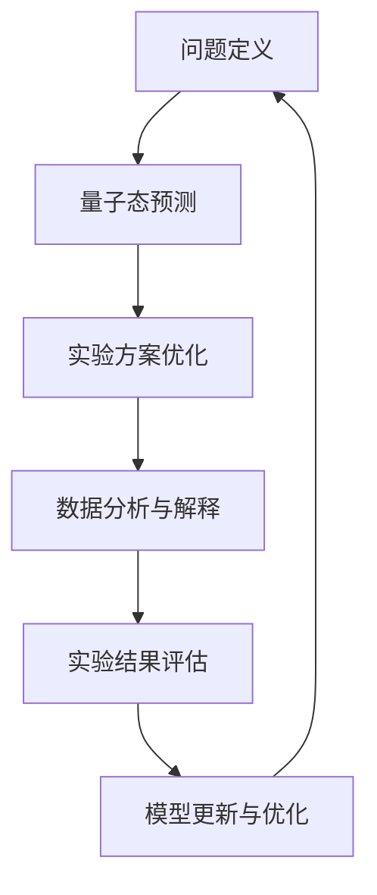

                 

### 文章标题：零样本CoT在AI辅助跨维度量子实验设计中的应用

关键词：零样本CoT、AI辅助、量子实验设计、跨维度、算法原理

摘要：随着量子计算技术的发展，量子实验设计变得愈加复杂。传统的量子实验设计方法往往依赖于大量的样本数据和繁琐的计算过程，难以适应现代科研需求。零样本CoT（Zero-shot Continual Transfer）作为一项前沿的人工智能技术，能够通过迁移学习实现对新领域的快速适应。本文将探讨零样本CoT在AI辅助跨维度量子实验设计中的应用，分析其原理、核心算法及未来发展方向。

### 目录大纲

# 零样本CoT在AI辅助跨维度量子实验设计中的应用

> 关键词：零样本CoT、AI辅助、量子实验设计、跨维度、算法原理

> 摘要：本文探讨了零样本CoT在AI辅助跨维度量子实验设计中的应用，分析了其理论基础、核心算法原理及未来发展方向。

## 第一部分：背景与理论基础

## 第二部分：核心算法原理

## 第三部分：展望与未来发展方向

## 附录

---

### 第一部分：背景与理论基础

#### 第1章：零样本CoT概述

### 1.1 零样本CoT的定义与特点

**定义**：零样本CoT（Zero-shot Continual Transfer）是一种人工智能迁移学习方法，能够在没有新领域样本的情况下，利用已有知识快速适应新领域。

**特点**：
- **无需新领域样本**：零样本CoT能够利用已有的知识库，实现对新领域的快速适应。
- **跨领域迁移**：通过迁移学习，零样本CoT能够将一个领域的知识应用到另一个领域。
- **可扩展性**：零样本CoT适用于各种复杂应用场景，具备良好的可扩展性。

### 1.2 零样本CoT的适用场景

零样本CoT适用于以下场景：

- **新领域快速适应**：例如，在新的量子实验设计中，零样本CoT可以快速利用已有知识进行实验设计。
- **跨领域应用**：例如，将图像识别算法应用到量子计算中，实现图像数据的量子化。
- **数据稀缺场景**：当新领域样本数据稀缺时，零样本CoT能够有效利用已有数据。

### 1.3 零样本CoT与传统CoT的对比

**传统CoT（Continual Transfer）**：传统CoT依赖于新领域样本，通过不断地训练和更新模型，实现新领域的适应。

**对比**：
- **数据依赖性**：零样本CoT无需新领域样本，而传统CoT则需要。
- **迁移效率**：零样本CoT能够快速适应新领域，而传统CoT需要较长的时间。

#### 第2章：量子实验设计的基本原理

### 2.1 量子实验的基本概念

量子实验是利用量子系统进行科学实验的过程，包括量子态的制备、操控、测量等步骤。

**量子态**：量子态是量子系统的内部状态，可以用波函数或态向量表示。

**量子门**：量子门是用于操作量子态的基本单元，类似于经典计算机中的逻辑门。

**量子测量**：量子测量是获取量子态信息的过程，可以通过测量得到量子态的概率分布。

### 2.2 量子实验设计的基本流程

量子实验设计的基本流程包括以下步骤：

1. **问题定义**：明确量子实验的目标和需求。
2. **量子态制备**：设计并实现所需的量子态。
3. **量子操控**：通过量子门对量子态进行操作。
4. **量子测量**：获取量子态的信息。
5. **数据分析**：对测量结果进行分析，得出实验结论。

### 2.3 量子实验设计的关键技术

量子实验设计的关键技术包括：

- **量子态制备**：利用激光、电场等技术实现量子态的制备。
- **量子门操作**：设计并实现各种量子门，实现对量子态的操作。
- **量子测量**：利用量子传感器等技术实现量子测量的精确度。

#### 第3章：AI辅助量子实验设计的原理

### 3.1 AI在量子实验设计中的应用

AI技术在量子实验设计中的应用主要体现在：

- **量子态预测**：利用AI算法预测量子态的演化过程。
- **实验方案优化**：通过AI算法优化量子实验方案，提高实验效率。
- **数据分析和解释**：利用AI算法对量子实验数据进行分析和解释。

### 3.2 零样本CoT在量子实验设计中的应用

零样本CoT在量子实验设计中的应用包括：

- **快速适应新领域**：利用零样本CoT技术，快速适应新的量子实验需求。
- **跨领域迁移**：将已有的AI知识应用到新的量子实验领域。
- **数据稀缺处理**：在数据稀缺的场景下，利用零样本CoT技术提高实验设计的准确性。

### 3.3 AI辅助量子实验设计的优势与挑战

**优势**：
- **提高实验效率**：AI技术能够快速预测量子态的演化，提高实验设计的效率。
- **优化实验方案**：AI技术能够优化实验方案，降低实验成本。
- **数据分析和解释**：AI技术能够对实验数据进行深入分析和解释，提高实验结果的准确性。

**挑战**：
- **算法稳定性**：在量子实验中，AI算法的稳定性是一个重要问题。
- **数据稀缺**：量子实验数据稀缺，如何有效利用已有数据是一个挑战。
- **跨领域迁移**：如何将已有的AI知识应用到新的量子实验领域是一个难题。

#### 第4章：核心概念与联系

### 4.1 零样本CoT与量子力学的关系

零样本CoT与量子力学之间存在密切的关系。量子力学的基本原理为AI技术在量子实验中的应用提供了理论基础。

**量子态**：量子态是量子力学的核心概念，为零样本CoT在量子实验设计中的应用提供了基础。

**量子门**：量子门是量子力学中的基本操作，为零样本CoT在量子实验设计中的应用提供了操作工具。

**量子测量**：量子测量是量子力学的核心过程，为零样本CoT在量子实验设计中的应用提供了数据获取手段。

### 4.2 零样本CoT与AI技术的结合

零样本CoT与AI技术的结合主要体现在：

- **迁移学习**：零样本CoT利用迁移学习技术，将已有知识应用到新领域。
- **多任务学习**：零样本CoT通过多任务学习技术，提高AI模型在新领域的适应能力。
- **元学习**：零样本CoT利用元学习技术，快速适应新领域的需求。

### 4.3 Mermaid流程图：零样本CoT在AI辅助量子实验设计中的应用

**说明**：该流程图展示了零样本CoT在AI辅助量子实验设计中的应用过程，包括问题定义、量子态预测、实验方案优化、数据分析与解释、实验结果评估、模型更新与优化等步骤。

### 第一部分总结

本部分对零样本CoT、量子实验设计及其在AI辅助量子实验设计中的应用进行了详细的背景介绍和理论基础阐述。通过分析零样本CoT的定义、特点、适用场景，以及量子实验设计的基本原理和AI在其中的应用，为本篇文章的核心内容和主题思想奠定了基础。接下来，将深入探讨零样本CoT在AI辅助量子实验设计中的核心算法原理和实际应用。让我们继续思考，逐步剖析这一前沿技术的奥妙。

