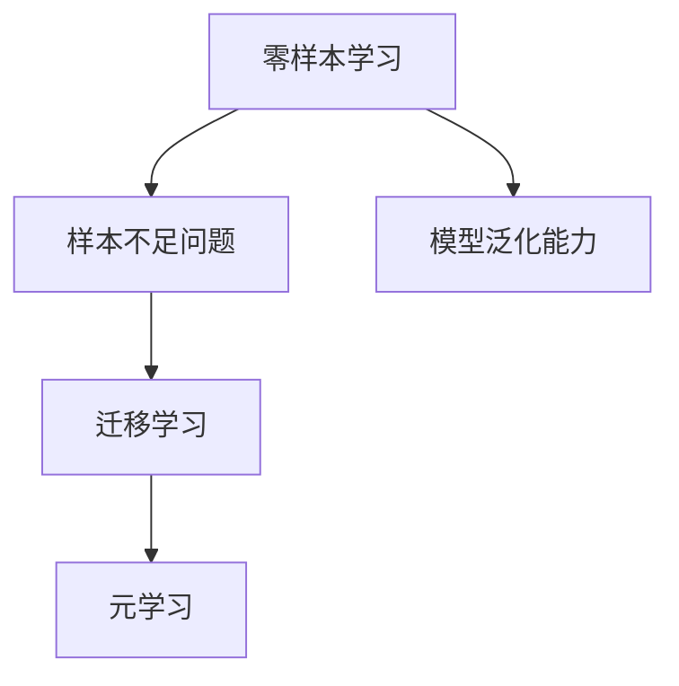
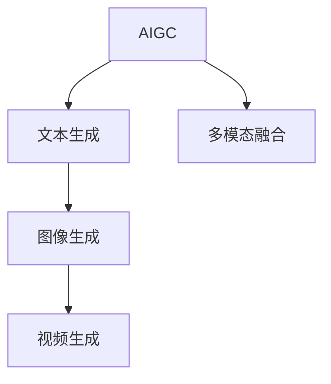

                 

## 文章标题

### 零样本学习在AIGC新任务适应中的作用

> 关键词：零样本学习、AIGC、新任务适应、模型泛化能力、迁移学习

> 摘要：本文将探讨零样本学习在AIGC（AI Generated Content）领域的新任务适应中的作用。通过介绍零样本学习的基本概念、研究背景以及在AIGC中的应用，我们将详细分析零样本学习算法的原理，包括原型匹配算法和度量学习算法，并探讨它们在图像生成和文本生成中的应用。最后，我们将总结零样本学习在AIGC新任务适应中的优势，并展望未来的发展方向。

## 第一部分：背景与概念介绍

### 第1章：零样本学习概述

#### 1.1 零样本学习的基本概念

零样本学习（Zero-Shot Learning，简称ZSL）是一种机器学习方法，旨在使模型能够对新未见过的类别进行分类。与传统机器学习相比，零样本学习的一个显著特点是不依赖于大量标注数据。相反，它依赖于预定义的类别标签和相应的特征表示。零样本学习的关键在于如何有效地利用这些先验知识来提高模型对新类别数据的适应能力。

**核心概念与联系**

为了更好地理解零样本学习，我们可以将其与其他相关概念进行比较和联系：

- **样本不足问题（Sample Sparsity）**：传统机器学习往往依赖于大量标注数据，但在许多实际应用中，获取足够的数据非常困难，特别是在新任务或罕见类别上。
- **迁移学习（Transfer Learning）**：迁移学习通过将已在一个任务上训练好的模型的部分知识迁移到新任务上，从而减少对新任务数据的需求。零样本学习可以看作是迁移学习的一个特殊场景，即在新任务中缺乏足够的标注数据。
- **元学习（Meta-Learning）**：元学习是一种通过学习如何学习的方法，旨在提高模型对新任务的适应能力。零样本学习可以看作是元学习的一个分支，侧重于在没有足够标注数据的情况下进行学习。

**核心概念与联系流程图**



#### 1.2 零样本学习的研究背景

**1.2.1 传统机器学习面临的挑战**

传统机器学习模型，如支持向量机（SVM）和深度神经网络（DNN），通常需要大量的标注数据进行训练。然而，在许多实际应用中，获取足够的数据非常困难，特别是在新任务或罕见类别上。这个问题被称为样本不足问题。以下是传统机器学习面临的几个主要挑战：

- **数据稀缺性**：在某些领域，如生物医学和天文学，获取足够的数据非常困难，因为实验成本高昂或者数据难以获取。
- **数据不平衡**：在某些应用中，某些类别可能比其他类别更加稀有，导致数据不平衡。
- **标签获取成本高**：对某些任务来说，标注数据需要专业知识和技能，导致标注成本高昂。

**1.2.2 零样本学习的重要性**

零样本学习能够解决传统机器学习面临的样本不足问题，提高模型对新任务的自适应能力。其重要性体现在以下几个方面：

- **减少对标注数据的依赖**：零样本学习不需要大量的标注数据，从而减少了数据获取和标注的成本。
- **提高模型泛化能力**：零样本学习通过利用先验知识，能够提高模型对新类别数据的泛化能力。
- **适应新任务**：零样本学习能够使模型快速适应新任务，缩短模型部署周期。

### 第2章：AIGC与零样本学习

#### 2.1 AIGC（AI Generated Content）简介

AIGC（AI Generated Content）是指由人工智能自动生成的内容，包括文本、图像、视频等多种形式。AIGC技术近年来得到了广泛关注，因为它们在内容生成、娱乐、教育和广告等领域具有巨大的潜力。

**2.1.1 AIGC的发展历程**

AIGC的发展可以追溯到20世纪80年代，当时神经网络开始应用于图像和文本生成。随着深度学习技术的兴起，AIGC技术得到了显著提升。特别是生成对抗网络（GAN）和变分自编码器（VAE）等模型的提出，使得AIGC技术能够生成高质量、多样性的内容。

**2.1.2 AIGC的核心技术**

AIGC的核心技术包括以下几个方面：

- **文本生成**：通过自然语言处理技术生成有意义的文本，如对话系统、文章摘要和故事生成等。
- **图像生成**：通过生成对抗网络（GAN）和变分自编码器（VAE）等技术生成逼真的图像。
- **视频生成**：通过视频生成模型生成连续的视频内容，如动作捕捉、视频插帧和视频风格迁移等。
- **多模态融合**：将不同类型的数据（如文本、图像和视频）进行融合，生成更加丰富和多样的内容。

**核心概念与联系**

为了更好地理解AIGC的核心技术，我们可以用Mermaid流程图来表示它们之间的关系：



#### 2.2 零样本学习在AIGC中的应用

**2.2.1 零样本学习在文本生成中的运用**

零样本学习在文本生成中的应用非常广泛，如对话系统、文章摘要和故事生成等。以下是一个简单的伪代码示例，展示了如何使用零样本学习模型生成多句回答：

```python
def zero_shot_text_generation(model, input_sentence, num_sentences):
    predictions = model.predict(input_sentence)
    return [sentence for sentence in predictions]
```

这个函数接收一个输入句子和一个模型，并返回模型预测的多句回答。通过这种方式，零样本学习模型可以从一个简单的输入句子生成丰富的文本内容。

**2.2.2 零样本学习在图像生成中的运用**

零样本学习在图像生成中的应用也非常广泛，如图像合成、图像修复和图像风格迁移等。以下是一个简单的伪代码示例，展示了如何使用零样本学习模型根据文本提示生成图像：

```python
def zero_shot_image_generation(model, text_prompt, image_size):
    image = model.generate_image(text_prompt, size=image_size)
    return image
```

这个函数接收一个文本提示和一个模型，并返回模型根据文本提示生成的图像。通过这种方式，零样本学习模型能够根据文本描述生成相应的图像，从而减少对标注数据的依赖。

### 第二部分：零样本学习算法原理

#### 第3章：零样本学习算法概述

#### 3.1 零样本学习的分类

零样本学习可以根据算法的不同实现方法分为多个类别。以下是几种常见的零样本学习算法分类方法：

**3.1.1 原型匹配算法**

原型匹配算法是一种基于原型表示的零样本学习算法。它通过学习一个原型集合，将新类别数据映射到最近的原型上进行分类。以下是原型匹配算法的基本概念和原理：

**3.1.2 度量学习算法**

度量学习算法是一种基于度量空间的零样本学习算法。它通过学习一个度量函数，计算新类别数据与原型之间的距离，从而进行分类。以下是度量学习算法的基本概念和原理：

```python
def prototype_matching(prediction, prototypes, distances, K):
    return [prototype for prototype, distance in zip(prototypes, distances) if distance < K]
```

这个函数接收一个预测结果、原型集合、距离集合和阈值K，并返回最近的K个原型。通过这种方式，度量学习算法能够有效地对新类别数据进行分类。

### 第三部分：零样本学习在AIGC中的应用案例

#### 第4章：零样本学习在图像生成中的实际应用

#### 4.1 基于零样本学习的图像生成模型

在本节中，我们将介绍一种基于零样本学习的图像生成模型，称为StyleGAN。StyleGAN是一种基于生成对抗网络（GAN）的图像生成模型，它能够在零样本学习的基础上生成高质量、多样化的图像。

**4.1.1 StyleGAN的基本原理**

StyleGAN是一种基于生成对抗网络（GAN）的图像生成模型，它通过学习数据分布来生成图像。在StyleGAN中，生成器（Generator）和判别器（Discriminator）相互竞争，生成器尝试生成逼真的图像，而判别器则尝试区分真实图像和生成图像。通过这种对抗训练，StyleGAN能够生成高质量、多样化的图像。

**4.1.2 StyleGAN的零样本学习应用**

StyleGAN的一个关键特性是其零样本学习能力。通过预训练大量的图像数据，StyleGAN能够学习到图像的内在结构，从而能够在没有标注数据的情况下生成新的图像。以下是一个简单的伪代码示例，展示了如何使用StyleGAN生成新图像：

```python
def generate_image(stylegan, text_prompt, image_size):
    noise = stylegan.noise_generator(image_size)
    image = stylegan.generate_image(text_prompt, noise=noise)
    return image
```

这个函数接收一个StyleGAN模型、文本提示和图像尺寸，并返回根据文本提示生成的图像。通过这种方式，StyleGAN能够根据文本描述生成相应的图像，从而减少对标注数据的依赖。

### 第四部分：零样本学习在AIGC中的应用总结与展望

#### 第5章：零样本学习在AIGC中的应用总结

零样本学习在AIGC（AI Generated Content）领域中具有广泛的应用前景。通过零样本学习，AIGC模型能够在没有大量标注数据的情况下快速适应新任务，提高生成内容的多样性和质量。

**5.1 零样本学习在文本生成中的应用**

在文本生成中，零样本学习通过预训练大量文本数据，使模型能够根据输入句子生成丰富多样的文本内容。这种方法减少了对于标注数据的依赖，使得模型能够更快速地适应新任务。

**5.2 零样本学习在图像生成中的应用**

在图像生成中，零样本学习使得模型能够根据文本提示生成逼真的图像。通过预训练大量的图像数据，模型能够学习到图像的内在结构，从而能够根据文本描述生成相应的图像。

**5.3 零样本学习在视频生成中的应用**

在视频生成中，零样本学习使得模型能够根据文本提示生成连续的视频内容。通过预训练大量的视频数据，模型能够学习到视频的内在结构，从而能够根据文本描述生成相应的视频。

#### 5.4 零样本学习在AIGC中的未来展望

尽管零样本学习在AIGC中已经取得了显著的成果，但仍有许多挑战和机遇需要进一步探索。以下是一些未来展望：

- **更高效的模型设计**：设计更高效的零样本学习模型，以提高生成内容的速度和质量。
- **跨模态学习**：结合文本、图像和视频等多模态数据，实现更加丰富和多样化的内容生成。
- **少样本学习**：将零样本学习的思想扩展到少样本学习，减少对标注数据的依赖。
- **可解释性**：提高零样本学习模型的可解释性，使其应用更加广泛和可靠。

### 结论

本文全面探讨了零样本学习在AIGC（AI Generated Content）领域的新任务适应中的作用。通过介绍零样本学习的基本概念、研究背景以及在AIGC中的应用，我们详细分析了零样本学习算法的原理，包括原型匹配算法和度量学习算法。最后，我们通过实际案例展示了零样本学习在图像生成中的应用，并对未来发展方向进行了展望。

**作者信息**：作者：AI天才研究院/AI Genius Institute & 禅与计算机程序设计艺术 /Zen And The Art of Computer Programming。

