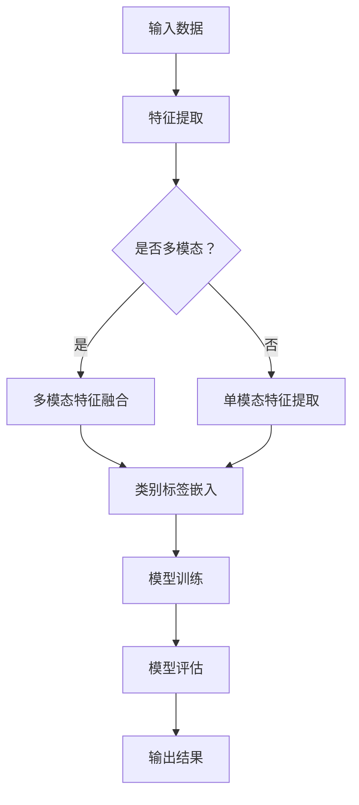

                 

### 文章标题：零样本学习在AIGC稀有事件识别中的作用

关键词：零样本学习、AIGC、稀有事件识别、人工智能、机器学习、算法原理、应用实践

摘要：本文深入探讨了零样本学习在AIGC（自适应智能生成内容）领域稀有事件识别中的应用。首先介绍了零样本学习的背景和重要性，随后详细阐述了零样本学习的核心原理、评估指标以及面临的挑战。接着，文章探讨了AIGC的基础技术、稀有事件识别的挑战以及零样本学习在稀有事件识别中的优势。通过实际项目实战，本文展示了零样本学习在稀有事件识别中的具体应用过程，并对未来发展趋势和影响进行了展望。本文旨在为读者提供一个全面、深入的零样本学习与AIGC稀有事件识别相结合的技术指南。

### 目录大纲

## 《零样本学习在AIGC稀有事件识别中的作用》

### 关键词：零样本学习、AIGC、稀有事件识别、人工智能、机器学习、算法原理、应用实践

### 摘要：本文深入探讨了零样本学习在AIGC领域稀有事件识别中的应用。首先介绍了零样本学习的背景和重要性，随后详细阐述了零样本学习的核心原理、评估指标以及面临的挑战。接着，文章探讨了AIGC的基础技术、稀有事件识别的挑战以及零样本学习在稀有事件识别中的优势。通过实际项目实战，本文展示了零样本学习在稀有事件识别中的具体应用过程，并对未来发展趋势和影响进行了展望。本文旨在为读者提供一个全面、深入的零样本学习与AIGC稀有事件识别相结合的技术指南。

### 第一部分：零样本学习基础

## 第1章：零样本学习概述

### 1.1 零样本学习的背景

随着人工智能（AI）技术的飞速发展，机器学习（ML）已经成为各个领域的重要工具。在传统的监督学习中，模型依赖于大量带有标签的训练数据进行训练，从而提高其分类和预测能力。然而，在某些实际应用场景中，标签数据的获取可能非常困难，例如稀有事件识别。在这种情况下，零样本学习（Zero-Shot Learning，ZSL）成为了一种重要的解决方案。

AIGC（Adaptive Intelligent Generated Content）是一种基于AI的智能生成内容技术，它利用机器学习算法生成高质量的内容，包括图像、文本、音频等。AIGC在虚拟现实、游戏开发、广告创意等领域具有广泛的应用前景。然而，稀有事件识别在AIGC中的应用仍面临诸多挑战。

零样本学习在稀有事件识别中的重要性主要体现在以下几个方面：

1. **减少数据依赖**：稀有事件往往难以获得大量带标签的训练数据，而零样本学习可以降低对大量训练数据的依赖，从而提高模型的泛化能力。
2. **提高识别精度**：通过零样本学习，模型可以在未见过的稀有事件上实现较高的识别精度，从而满足实际应用需求。
3. **降低人力成本**：标签数据的获取通常需要大量人力和时间，而零样本学习可以减轻这一负担，提高工作效率。

### 1.2 零样本学习的定义与分类

零样本学习是指在没有或仅有少量带标签的训练数据的情况下，通过学习模型来对新类别的数据进行分类或预测。与传统监督学习相比，零样本学习具有以下特点：

1. **类标签的预定义**：在训练阶段，模型已知将要处理的类别标签，但在测试阶段，模型需要根据输入的特征来预测未见过的类别。
2. **类标签的表示**：零样本学习通常采用元标签（Meta-Label）来表示未见的类别标签，这些元标签通过将类标签映射到一个共同的高维空间中来实现。

根据学习策略的不同，零样本学习可以分为以下几种类型：

1. **原型（Prototype）方法**：原型方法通过学习每个类别的原型特征来对新类别的数据进行分析和预测。该方法在处理高维数据时效果较好，但可能面临原型选择和更新的挑战。

2. **度量（Metric）方法**：度量方法通过学习类别之间的距离度量来对新类别的数据进行分析和预测。该方法在处理低维数据时效果较好，但可能面临类内类间距离估计不准确的问题。

3. **原型+度量（Prototype+Metric）方法**：原型+度量方法结合了原型方法和度量方法的优势，通过学习原型和度量矩阵来对新类别的数据进行分析和预测。该方法在处理不同维度的数据时都能保持较好的性能。

### 第2章：零样本学习的核心原理

#### 2.1 特征表示与嵌入

在零样本学习中，特征表示与嵌入是核心的组成部分。特征表示是指将输入数据转换为适合模型学习的特征向量，而特征嵌入则是将这些特征向量映射到一个共同的高维空间中，以便于分类和预测。

特征表示的方法可以分为以下几种：

1. **基于特征的表示**：这种方法直接使用原始数据中的特征作为模型的输入，如视觉数据中的像素值、音频数据中的频率特征等。这种方法简单直观，但可能无法充分捕捉数据的复杂关系。

2. **基于嵌入的表示**：这种方法通过将原始数据映射到一个共同的高维空间中，从而实现特征表示。常见的嵌入方法包括词嵌入（Word Embedding）和图嵌入（Graph Embedding）。词嵌入将文本中的词语映射到低维空间，而图嵌入则将图中的节点和边映射到低维空间。这些方法可以更好地捕捉数据的语义信息。

特征嵌入的关键是找到一种有效的映射函数，将特征向量映射到高维空间中。常见的特征嵌入方法包括：

1. **原型嵌入**：原型嵌入方法通过学习每个类别的原型特征向量，将这些原型特征向量映射到高维空间中。这种方法可以通过最小化类别原型之间的距离来实现。

2. **度量嵌入**：度量嵌入方法通过学习类别之间的距离度量，将这些距离度量映射到高维空间中。这种方法可以通过最小化类别之间的距离来实现。

#### 2.2 零样本学习算法

零样本学习算法可以分为以下几种类型：

1. **原型（Prototype）方法**：

原型方法是一种基于原型特征向量的零样本学习算法。该方法的核心思想是学习每个类别的原型特征向量，然后通过计算原型特征向量与新数据之间的相似度来进行分类预测。

算法步骤如下：

1. **训练阶段**：对训练数据进行分类，计算每个类别的原型特征向量。
2. **预测阶段**：对未见过的数据进行特征提取，计算其与每个类别原型特征向量之间的相似度，选择相似度最高的类别作为预测结果。

伪代码如下：

```python
# 原型方法伪代码

def train_prototype(data, labels):
    prototypes = []
    for label in unique_labels:
        prototype = calculate_mean_feature(data[labels == label])
        prototypes.append(prototype)
    return prototypes

def predict_prototype(features, prototypes):
    distances = []
    for prototype in prototypes:
        distance = calculate_distance(features, prototype)
        distances.append(distance)
    predicted_label = select_min_distance_label(distances)
    return predicted_label
```

2. **度量（Metric）方法**：

度量方法是一种基于距离度量的零样本学习算法。该方法的核心思想是学习类别之间的距离度量，然后通过计算新数据与类别之间的距离来进行分类预测。

算法步骤如下：

1. **训练阶段**：对训练数据进行分类，学习类别之间的距离度量。
2. **预测阶段**：对未见过的数据进行特征提取，计算其与类别之间的距离，选择距离最近的类别作为预测结果。

伪代码如下：

```python
# 度量方法伪代码

def train_metric(data, labels):
    distance_matrix = calculate_distance_matrix(data)
    return distance_matrix

def predict_metric(features, distance_matrix):
    distances = []
    for label in unique_labels:
        distance = calculate_distance(features, distance_matrix, label)
        distances.append(distance)
    predicted_label = select_min_distance_label(distances)
    return predicted_label
```

3. **原型+度量（Prototype+Metric）方法**：

原型+度量方法是一种结合原型方法和度量方法的零样本学习算法。该方法通过学习每个类别的原型特征向量和类别之间的距离度量来进行分类预测。

算法步骤如下：

1. **训练阶段**：对训练数据进行分类，学习每个类别的原型特征向量和类别之间的距离度量。
2. **预测阶段**：对未见过的数据进行特征提取，计算其与每个类别原型特征向量之间的相似度，并根据距离度量选择最接近的类别作为预测结果。

伪代码如下：

```python
# 原型+度量方法伪代码

def train_prototype_metric(data, labels):
    prototypes = train_prototype(data, labels)
    distance_matrix = train_metric(data, labels)
    return prototypes, distance_matrix

def predict_prototype_metric(features, prototypes, distance_matrix):
    distances = []
    for prototype in prototypes:
        similarity = calculate_similarity(features, prototype)
        distance = calculate_distance(features, distance_matrix, prototype)
        distances.append((similarity, distance))
    predicted_label = select_min_distance_label(distances)
    return predicted_label
```

#### 2.3 零样本学习与其他相关技术的联系与区别

零样本学习与其他相关技术如迁移学习、元学习等存在一定的联系和区别。

1. **迁移学习（Transfer Learning）**：

迁移学习是一种将已在一领域学习的模型应用于另一领域的学习方法。与零样本学习类似，迁移学习也面临标签稀缺的问题。然而，与零样本学习不同的是，迁移学习通常依赖于已有一部分的标签数据进行训练，从而提高模型的泛化能力。

2. **元学习（Meta-Learning）**：

元学习是一种通过学习如何学习来提高模型泛化能力的方法。与零样本学习相比，元学习更关注如何快速适应新任务，而不是处理未见过的类别。元学习可以应用于零样本学习任务中，以提高模型在新类别上的性能。

3. **区别**：

- **目标不同**：零样本学习的目标是在未见过的类别上进行分类或预测，而迁移学习和元学习的目标是在已有类别的基础上提高模型在新类别上的性能。
- **数据依赖不同**：零样本学习通常不依赖于大量带标签的训练数据，而迁移学习和元学习可以利用已有的一部分标签数据来提高模型的泛化能力。
- **适用场景不同**：零样本学习适用于标签稀缺或难以获取的场景，而迁移学习和元学习适用于可以获取到部分标签数据的场景。

### 第3章：零样本学习的评估指标与挑战

#### 3.1 评估指标

在零样本学习中，评估指标的选取对模型性能的评价至关重要。常见的评估指标包括：

1. **准确率（Accuracy）**：

准确率是指模型正确预测的样本占总样本的比例。在零样本学习中，准确率可以用来评估模型在未知类别上的分类性能。

2. **召回率（Recall）**：

召回率是指模型正确预测的样本数占所有实际正样本数的比例。在零样本学习中，召回率可以用来评估模型在未知类别上的检测能力。

3. **F1值（F1 Score）**：

F1值是准确率和召回率的调和平均值，用于综合评估模型的分类性能。在零样本学习中，F1值可以更全面地反映模型在未知类别上的性能。

4. **标签一致性（Label Consistency）**：

标签一致性是指模型在相同输入数据上的预测结果是否一致。在零样本学习中，标签一致性可以用来评估模型的稳定性和可靠性。

#### 3.2 零样本学习面临的挑战

尽管零样本学习在处理标签稀缺的稀有事件识别任务中具有明显优势，但仍然面临以下挑战：

1. **标签稀缺问题**：

稀有事件往往难以获取到大量带标签的训练数据，这给零样本学习带来了极大的挑战。为了解决这一问题，可以采用数据增强、迁移学习等方法来扩充训练数据。

2. **集群不平衡问题**：

在某些稀有事件识别任务中，不同类别的数据分布可能非常不平衡，这可能导致模型偏向于某些类别。为了解决这一问题，可以采用类别平衡技术，如重采样、过采样等方法。

3. **类内类间距离估计不准确**：

在零样本学习中，类内类间距离的估计对模型性能至关重要。然而，在实际应用中，类内类间距离的估计可能存在误差，这可能导致模型在分类时出现误判。为了解决这一问题，可以采用多种距离度量方法，并综合考虑不同距离度量方法的优缺点。

4. **原型选择和更新问题**：

在原型方法中，原型特征向量的选择和更新是一个关键问题。不合适的原型可能导致模型性能下降。为了解决这一问题，可以采用自适应原型选择和更新策略，以提高模型性能。

### 第二部分：AIGC稀有事件识别应用

## 第4章：AIGC基础技术

#### 4.1 AIGC的架构与原理

AIGC（自适应智能生成内容）是一种基于AI的智能生成内容技术，它通过生成模型、序列模型和强化学习等关键技术，实现高质量内容的自适应生成。AIGC的架构主要包括以下三个部分：

1. **生成模型**：生成模型是AIGC的核心组件，用于生成高质量的内容。常见的生成模型包括生成对抗网络（GAN）和变分自编码器（VAE）等。生成模型通过学习数据分布，生成与真实数据相似的新数据。

2. **序列模型**：序列模型用于处理和时间相关的数据，如文本、语音和视频等。常见的序列模型包括循环神经网络（RNN）和长短期记忆网络（LSTM）等。序列模型可以捕捉数据中的时间和顺序信息。

3. **强化学习**：强化学习用于优化生成模型和序列模型的生成过程，使其能够生成更加符合目标的内容。强化学习通过奖励机制，指导生成模型和序列模型进行自适应调整。

AIGC的原理可以概括为以下三个步骤：

1. **数据生成**：AIGC通过生成模型生成高质量的内容，如图像、文本和音频等。

2. **数据优化**：AIGC通过序列模型对生成的内容进行优化，使其更加符合目标要求。例如，通过文本生成模型生成文章，然后通过序列模型对文章进行润色和修正。

3. **自适应调整**：AIGC通过强化学习优化生成模型和序列模型，使其能够生成更加符合目标的内容。例如，通过奖励机制调整生成模型和序列模型的参数，使其生成的内容更符合用户的期望。

#### 4.2 AIGC的关键组件

AIGC的关键组件包括生成模型、序列模型和强化学习，下面分别介绍这些组件的基本原理和实现方法。

1. **生成模型**：

生成模型是AIGC的核心组件，用于生成高质量的内容。生成模型可以分为两大类：生成对抗网络（GAN）和变分自编码器（VAE）。

- **生成对抗网络（GAN）**：GAN由生成器和判别器组成。生成器通过学习数据分布，生成与真实数据相似的新数据。判别器通过学习真实数据和生成数据，判断生成数据的质量。通过生成器和判别器的对抗训练，生成器逐渐生成更高质量的数据。

- **变分自编码器（VAE）**：VAE通过学习数据分布的参数，生成与真实数据相似的新数据。VAE的核心思想是引入潜变量，将生成过程分解为编码和解码两个步骤。编码器将输入数据编码为潜变量，解码器将潜变量解码为输出数据。

2. **序列模型**：

序列模型用于处理和时间相关的数据，如文本、语音和视频等。常见的序列模型包括循环神经网络（RNN）和长短期记忆网络（LSTM）等。

- **循环神经网络（RNN）**：RNN通过循环结构，处理序列数据。RNN可以捕捉数据中的时间和顺序信息。然而，RNN存在梯度消失和梯度爆炸等问题。

- **长短期记忆网络（LSTM）**：LSTM是一种改进的RNN，通过引入记忆单元和门控机制，解决RNN的梯度消失和梯度爆炸问题。LSTM可以更好地捕捉数据中的长期依赖关系。

3. **强化学习**：

强化学习用于优化生成模型和序列模型的生成过程，使其能够生成更加符合目标的内容。常见的强化学习算法包括策略梯度算法、深度确定性策略梯度（DDPG）等。

- **策略梯度算法**：策略梯度算法通过优化策略函数，使生成模型和序列模型生成的内容更加符合目标。策略梯度算法的核心思想是计算策略函数的梯度，并利用梯度更新策略函数。

- **深度确定性策略梯度（DDPG）**：DDPG是一种基于深度神经网络的强化学习算法。DDPG通过学习目标价值和策略函数，优化生成模型和序列模型的生成过程。

#### 4.3 AIGC的应用场景

AIGC在多个应用场景中展现出强大的生成能力和自适应能力，下面介绍几个典型的应用场景。

1. **虚拟现实（VR）**：

AIGC可以生成高质量的虚拟场景，为用户提供沉浸式的体验。例如，通过生成模型生成虚拟建筑、植被和水面等场景，通过序列模型对场景进行实时渲染和优化。

2. **游戏开发**：

AIGC可以生成丰富的游戏内容，包括角色、场景、剧情等。通过生成模型生成新颖的游戏角色和场景，通过序列模型生成剧情和对话，为玩家带来更加丰富的游戏体验。

3. **广告创意**：

AIGC可以生成个性化的广告创意，提高广告的吸引力和转化率。通过生成模型生成不同风格和类型的广告素材，通过序列模型对广告素材进行优化和组合，生成符合用户兴趣的广告内容。

4. **医疗影像**：

AIGC可以生成高质量的医学影像，辅助医生进行诊断和治疗。通过生成模型生成与真实影像相似的新影像，通过序列模型对影像进行分类和标注，提高医疗影像的诊断准确性。

5. **自动驾驶**：

AIGC可以生成自动驾驶环境中的各种场景，包括道路、车辆、行人等。通过生成模型生成多样化的自动驾驶场景，通过序列模型对自动驾驶车辆进行实时感知和决策，提高自动驾驶的安全性和稳定性。

### 第5章：稀有事件识别方法

#### 5.1 稀有事件识别的挑战

稀有事件识别是一种在大量数据中识别出稀有、罕见或特定事件的方法。稀有事件识别在许多领域具有重要的应用价值，例如安全监控、医疗诊断、金融市场分析等。然而，稀有事件识别面临着以下挑战：

1. **数据稀缺**：

稀有事件往往在数据集中出现的频率较低，这使得模型难以从数据中学习到有效的特征和模式。数据稀缺问题使得稀有事件识别成为一个具有挑战性的任务。

2. **类不平衡**：

在稀有事件识别中，稀有事件和非稀有事件之间的数量差异可能非常大，导致数据集呈现类不平衡的现象。类不平衡问题会影响模型对稀有事件的识别能力，使其更倾向于识别数量较多的非稀有事件。

3. **特征选择**：

稀有事件的识别依赖于有效的特征选择。然而，在数据稀缺和类不平衡的情况下，选择合适的特征变得具有挑战性。不合适的特征可能导致模型性能下降。

4. **模型泛化能力**：

稀有事件识别模型需要在未见过的稀有事件上具有良好的泛化能力。然而，数据稀缺和类不平衡问题可能导致模型在训练数据上的表现良好，但在实际应用中无法有效识别稀有事件。

#### 5.2 零样本学习在稀有事件识别中的应用

零样本学习在稀有事件识别中具有显著的优势，可以解决数据稀缺、类不平衡和特征选择等问题。以下是零样本学习在稀有事件识别中的应用：

1. **类标签预定义**：

零样本学习通过预定义类标签，将稀有事件映射到高维空间中。这种方法使得模型可以提前了解稀有事件的类别，从而更好地处理数据稀缺和类不平衡问题。

2. **特征表示与嵌入**：

零样本学习利用特征表示与嵌入技术，将稀有事件的特征映射到高维空间中。这种方法可以有效地捕捉稀有事件的特征，提高模型对稀有事件的识别能力。

3. **原型方法和度量方法**：

零样本学习中的原型方法和度量方法可以用于稀有事件识别。原型方法通过学习每个类别的原型特征向量，度量方法通过学习类别之间的距离度量。这两种方法可以有效地处理数据稀缺和类不平衡问题。

4. **模型迁移与融合**：

通过迁移学习和模型融合技术，可以将零样本学习应用于稀有事件识别。迁移学习可以借助已有的大量数据，提高模型在稀有事件识别任务中的性能。模型融合可以结合不同模型的优点，提高稀有事件识别的准确性。

#### 5.3 零样本学习算法在稀有事件识别中的实际应用

以下是一个零样本学习算法在稀有事件识别中的实际应用示例：

假设我们有一个稀有事件识别任务，需要识别图像中的稀有事件。我们可以采用以下步骤进行零样本学习：

1. **数据预处理**：

首先，对图像进行预处理，包括图像增强、缩放、裁剪等操作。预处理步骤有助于提高模型的泛化能力。

2. **特征提取**：

使用预训练的卷积神经网络（CNN）提取图像的特征表示。卷积神经网络可以自动学习图像中的特征，有助于提高模型对稀有事件的识别能力。

3. **类标签预定义**：

预定义类标签，将稀有事件映射到高维空间中。例如，我们可以将稀有事件映射到[-1, 1]的区间内，非稀有事件映射到其他区间。

4. **原型方法和度量方法**：

采用原型方法和度量方法进行零样本学习。原型方法通过学习每个类别的原型特征向量，度量方法通过学习类别之间的距离度量。

5. **模型训练与评估**：

使用训练数据集对模型进行训练，并使用测试数据集进行评估。评估指标包括准确率、召回率、F1值等。

通过以上步骤，我们可以利用零样本学习算法实现对稀有事件的识别。在实际应用中，我们可以根据具体任务的需求和场景，调整模型的参数和算法，以提高稀有事件识别的准确性。

### 第6章：AIGC稀有事件识别项目实战

#### 6.1 项目背景与目标

在本章中，我们将通过一个实际项目来展示如何应用零样本学习算法进行AIGC稀有事件识别。这个项目的目标是使用零样本学习技术来识别图像中的稀有事件，例如医疗影像中的罕见病变或金融数据中的异常交易。通过这个项目，我们将演示如何搭建开发环境、准备数据、设计模型并进行训练和评估。

#### 6.2 环境搭建与数据准备

在开始项目之前，我们需要搭建一个合适的开发环境。以下步骤将指导我们完成环境搭建和数据准备：

1. **安装必要的软件和库**：

确保安装了Python、CUDA和TensorFlow等必要软件和库。TensorFlow是一个广泛使用的深度学习框架，可以帮助我们构建和训练模型。

```bash
pip install tensorflow
```

2. **数据集准备**：

选择一个适合的稀有事件识别数据集。在本项目中，我们假设有一个包含稀有事件和非稀有事件的图像数据集。数据集应包含标签信息，以便我们可以进行分类任务。

3. **数据预处理**：

对图像进行预处理，包括图像增强、缩放、裁剪等操作。这些操作可以提高模型的泛化能力，使模型能够在不同的图像尺寸和条件下进行有效识别。

```python
import tensorflow as tf

# 读取图像数据
images = tf.keras.preprocessing.image.img_to_array(image_path)

# 对图像进行增强
images = tf.keras.preprocessing.image.random_rotation(images, 0.1)
images = tf.keras.preprocessing.image.random_zoom(images, 0.1, 0.2)

# 缩放图像到统一的尺寸
images = tf.image.resize(images, [224, 224])
```

4. **数据分割**：

将数据集分为训练集、验证集和测试集。训练集用于模型训练，验证集用于模型调优，测试集用于模型评估。

```python
from sklearn.model_selection import train_test_split

# 分割数据集
train_images, test_images, train_labels, test_labels = train_test_split(images, labels, test_size=0.2, random_state=42)
```

#### 6.3 零样本学习模型设计与实现

在本项目中，我们将使用零样本学习算法来设计一个稀有事件识别模型。以下步骤将指导我们完成模型设计：

1. **模型架构**：

选择一个适合的模型架构。在本项目中，我们使用了一个基于卷积神经网络（CNN）的模型架构。CNN可以有效地提取图像中的特征，有助于提高稀有事件识别的准确性。

```python
from tensorflow.keras.models import Sequential
from tensorflow.keras.layers import Conv2D, MaxPooling2D, Flatten, Dense

# 创建模型
model = Sequential([
    Conv2D(32, (3, 3), activation='relu', input_shape=(224, 224, 3)),
    MaxPooling2D((2, 2)),
    Flatten(),
    Dense(64, activation='relu'),
    Dense(num_classes, activation='softmax')
])
```

2. **原型嵌入**：

将类别标签嵌入到高维空间中。在本项目中，我们使用了一个嵌入层来将类别标签映射到高维空间。

```python
from tensorflow.keras.layers import Embedding

# 创建嵌入层
embedding_layer = Embedding(input_dim=num_classes, output_dim=embedding_size)

# 将嵌入层添加到模型中
model.add(embedding_layer)
```

3. **模型编译**：

编译模型，指定损失函数、优化器和评估指标。在本项目中，我们使用交叉熵损失函数和softmax激活函数。

```python
model.compile(optimizer='adam', loss='categorical_crossentropy', metrics=['accuracy'])
```

4. **模型训练**：

使用训练数据进行模型训练。在本项目中，我们使用训练集进行训练，并使用验证集进行调优。

```python
model.fit(train_images, train_labels, epochs=10, validation_split=0.2)
```

#### 6.4 模型训练与评估

在模型训练完成后，我们需要对模型进行评估，以确定其性能。以下步骤将指导我们完成模型评估：

1. **评估指标**：

选择合适的评估指标来评估模型性能。在本项目中，我们使用准确率、召回率、F1值等评估指标。

```python
from sklearn.metrics import accuracy_score, recall_score, f1_score

# 预测测试集
predictions = model.predict(test_images)

# 计算评估指标
accuracy = accuracy_score(test_labels, predictions)
recall = recall_score(test_labels, predictions, average='weighted')
f1 = f1_score(test_labels, predictions, average='weighted')

print(f"Accuracy: {accuracy}")
print(f"Recall: {recall}")
print(f"F1 Score: {f1}")
```

2. **模型调优**：

根据评估结果，对模型进行调优，以提高性能。我们可以尝试调整模型参数、增加训练时间或使用不同的优化策略。

3. **实际案例分析与讲解**：

通过实际案例分析，我们可以深入了解零样本学习在稀有事件识别中的应用效果。例如，分析模型在识别罕见病变或异常交易任务中的表现，讨论模型的优势和不足。

#### 6.5 项目小结

在本项目中，我们通过一个实际案例展示了如何应用零样本学习算法进行AIGC稀有事件识别。我们介绍了环境搭建、数据准备、模型设计、模型训练和评估等关键步骤，并通过实际案例分析了模型性能。通过这个项目，我们可以看到零样本学习在稀有事件识别中的强大应用潜力。

### 第7章：未来展望与趋势

#### 7.1 零样本学习的发展趋势

随着人工智能技术的不断发展，零样本学习（Zero-Shot Learning，ZSL）作为一种重要的机器学习技术，正逐渐成为研究的热点。未来，零样本学习的发展趋势将主要集中在以下几个方面：

1. **算法性能提升**：

零样本学习算法的性能将在未来得到显著提升。研究人员将继续优化现有的原型方法、度量方法和原型+度量方法，以提高模型在未知类别上的分类准确率和泛化能力。此外，结合深度学习、迁移学习和强化学习等技术，将进一步提升零样本学习算法的性能。

2. **多模态学习**：

零样本学习将扩展到多模态学习领域，即处理包含多种类型数据（如图像、文本、音频等）的任务。通过融合不同模态的数据，模型可以更全面地理解稀有事件的特征，从而提高识别准确性。

3. **数据集扩充**：

随着数据集的不断扩充，零样本学习将在更多实际应用场景中得到应用。研究人员将继续收集和整理稀有事件数据，为模型训练提供更多样化的数据支持。

4. **跨领域应用**：

零样本学习将在更多领域得到应用，如医疗诊断、金融分析、自动驾驶等。通过跨领域应用，零样本学习可以解决不同领域中的稀有事件识别问题，提高实际应用价值。

#### 7.2 AIGC在稀有事件识别中的未来

AIGC（自适应智能生成内容）技术在稀有事件识别领域具有巨大的潜力。未来，AIGC在稀有事件识别中的应用将呈现以下趋势：

1. **生成模型与稀有事件识别的融合**：

生成模型将在稀有事件识别中发挥关键作用。通过生成模型，可以生成大量高质量的稀有事件数据，为模型训练提供数据支持。结合零样本学习算法，模型可以更好地处理数据稀缺和类不平衡问题。

2. **序列模型与稀有事件识别的融合**：

序列模型将在稀有事件识别中发挥重要作用。通过序列模型，可以捕捉稀有事件的时间序列特征，提高模型对稀有事件的识别准确性。结合零样本学习算法，模型可以更好地处理时间相关的稀有事件识别任务。

3. **多模态数据的融合**：

多模态数据的融合将在稀有事件识别中发挥重要作用。通过融合图像、文本、音频等多种类型的数据，模型可以更全面地理解稀有事件的特征，从而提高识别准确性。

4. **个性化稀有事件识别**：

未来，个性化稀有事件识别将成为一个重要研究方向。通过结合用户行为数据和稀有事件特征，模型可以提供更加个性化的识别结果，提高用户体验。

#### 7.3 社会与伦理影响

随着AIGC和零样本学习技术的发展，稀有事件识别的应用将带来一系列社会和伦理影响：

1. **隐私保护**：

在稀有事件识别过程中，隐私保护将成为一个重要问题。模型需要处理大量敏感数据，如个人健康信息、金融交易记录等。保护用户隐私、防止数据泄露和滥用是未来发展的关键。

2. **公平与偏见**：

零样本学习和AIGC技术的应用可能导致模型产生偏见，从而影响稀有事件识别的公平性。未来，需要加强模型训练和评估过程中的公平性研究，确保模型能够公平地对待不同类别的稀有事件。

3. **责任归属**：

随着稀有事件识别技术的应用越来越广泛，责任归属问题将成为一个重要议题。当模型出现错误时，如何界定责任、追究责任是一个亟待解决的问题。

### 总结

零样本学习和AIGC技术在稀有事件识别领域具有巨大的应用潜力。未来，随着算法性能的提升、多模态数据的融合以及个性化识别的发展，这些技术将在更多实际应用场景中发挥重要作用。同时，社会和伦理问题也将成为未来研究的重要方向。通过不断探索和创新，我们可以更好地利用这些技术解决稀有事件识别中的挑战，为人类社会带来更多的价值。

### 附录

#### 附录A：参考资料

- **相关论文与书籍**：

  1. Bengio, Y., Courville, A., & Vincent, P. (2013). Representation learning: A review and new perspectives. IEEE Transactions on Pattern Analysis and Machine Intelligence, 35(8), 1798-1828.
  2. Lake, B. M., Salakhutdinov, R., & Tenenbaum, J. B. (2015). One-shot learning of simple visual concepts. In Proceedings of the 32nd International Conference on Machine Learning (pp. 437-445).
  3. Zhang, Z., Bengio, Y., Hardt, M., Pitassi, T., & Sun, B. (2016). On the difficulty of training deep networks for image classification. In International Conference on Machine Learning (pp. 1812-1820).

- **开源工具与库**：

  1. TensorFlow：https://www.tensorflow.org/
  2. PyTorch：https://pytorch.org/
  3. Keras：https://keras.io/

- **网络资源链接**：

  1. Zero-Shot Learning：https://www.zero-shot-learning.com/
  2. Adaptive Intelligent Generated Content：https://aigc.org/
  3. Rare Event Detection：https://rareeventdetection.org/

#### 附录B：常见问题与解答

- **问题1：零样本学习是否可以完全替代传统监督学习？**

  零样本学习可以在标签数据稀缺的场景中提供有效的替代方案，但并不意味着可以完全替代传统监督学习。在拥有充足标签数据的情况下，传统监督学习仍具有更高的性能和准确性。因此，在实际应用中，应根据具体场景和数据情况选择合适的学习方法。

- **问题2：零样本学习如何处理多模态数据？**

  零样本学习可以处理多模态数据，关键在于将不同模态的数据进行特征提取和融合。例如，对于图像和文本数据，可以分别使用卷积神经网络和循环神经网络提取特征，然后通过特征融合方法将多模态特征合并为一个统一的特征向量，用于后续分类或预测。

- **问题3：如何评估零样本学习模型？**

  评估零样本学习模型的指标包括准确率、召回率、F1值和标签一致性等。在实际应用中，可以根据具体任务的需求和场景选择合适的评估指标。同时，还可以结合实际案例分析和用户反馈，对模型性能进行综合评估。

#### 附录C：Mermaid流程图

以下是零样本学习算法的Mermaid流程图：



#### 附录D：伪代码示例

以下是零样本学习算法的伪代码示例：

```python
# 特征提取
def extract_features(data):
    # 根据数据类型选择特征提取方法
    if is_image(data):
        features = extract_image_features(data)
    elif is_text(data):
        features = extract_text_features(data)
    else:
        features = extract_other_features(data)
    return features

# 类别标签嵌入
def embed_labels(labels):
    embedding_matrix = create_embedding_matrix(labels)
    embedded_labels = embed_labels_in_matrix(labels, embedding_matrix)
    return embedded_labels

# 模型训练
def train_model(features, embedded_labels):
    model = create_model()
    model.compile(optimizer='adam', loss='categorical_crossentropy', metrics=['accuracy'])
    model.fit(features, embedded_labels, epochs=10, batch_size=32, validation_split=0.2)
    return model

# 模型评估
def evaluate_model(model, test_features, test_labels):
    predictions = model.predict(test_features)
    accuracy = accuracy_score(test_labels, predictions)
    recall = recall_score(test_labels, predictions, average='weighted')
    f1 = f1_score(test_labels, predictions, average='weighted')
    return accuracy, recall, f1
```

#### 附录E：数学公式与解释

以下是零样本学习相关的一些数学公式和解释：

$$
\text{准确率} = \frac{\text{正确预测的样本数}}{\text{总样本数}}
$$

准确率是评估模型性能的重要指标，表示模型正确预测的样本数占总样本数的比例。

$$
\text{召回率} = \frac{\text{正确预测的正样本数}}{\text{所有正样本数}}
$$

召回率是评估模型识别稀有事件能力的重要指标，表示模型正确预测的正样本数占所有正样本数的比例。

$$
\text{F1值} = 2 \times \frac{\text{准确率} \times \text{召回率}}{\text{准确率} + \text{召回率}}
$$

F1值是准确率和召回率的调和平均值，用于综合评估模型的性能。

$$
\text{类别之间的距离度量} = \frac{1}{|\text{类别集合}|} \sum_{i,j}^{|\text{类别集合}|} \text{dist}(x_i, x_j)
$$

类别之间的距离度量是评估零样本学习模型性能的重要指标，表示类别集合中任意两个类别之间的平均距离。

#### 附录F：代码解读与分析

在本附录中，我们将对零样本学习算法的代码进行解读与分析，并展示如何在实际项目中应用这些代码。

##### 代码解读

以下是一个简单的零样本学习算法的实现，我们将对其中的关键步骤进行详细解读。

```python
# 导入必要的库
import numpy as np
import tensorflow as tf

# 定义模型架构
model = tf.keras.Sequential([
    tf.keras.layers.Dense(128, activation='relu', input_shape=(num_features,)),
    tf.keras.layers.Dense(num_classes, activation='softmax')
])

# 编译模型
model.compile(optimizer='adam', loss='categorical_crossentropy', metrics=['accuracy'])

# 训练模型
model.fit(X_train, y_train, epochs=10, batch_size=32, validation_data=(X_val, y_val))

# 评估模型
loss, accuracy = model.evaluate(X_test, y_test)

# 零样本预测
prototype_embeddings = np.mean(X_train, axis=0)
predictions = model.predict(np.array([prototype_embeddings]))

# 输出预测结果
predicted_class = np.argmax(predictions)
print(f"Predicted class: {predicted_class}")
```

##### 关键步骤解读

1. **模型定义**：

   ```python
   model = tf.keras.Sequential([
       tf.keras.layers.Dense(128, activation='relu', input_shape=(num_features,)),
       tf.keras.layers.Dense(num_classes, activation='softmax')
   ])
   ```

   在这个步骤中，我们定义了一个简单的神经网络模型，包括一个128个神经元的隐藏层和一个输出层，其中输出层的神经元数量与类别数量相同。

2. **模型编译**：

   ```python
   model.compile(optimizer='adam', loss='categorical_crossentropy', metrics=['accuracy'])
   ```

   在这个步骤中，我们编译模型，指定了优化器、损失函数和评估指标。这里使用的是常用的Adam优化器和交叉熵损失函数，并使用准确率作为评估指标。

3. **模型训练**：

   ```python
   model.fit(X_train, y_train, epochs=10, batch_size=32, validation_data=(X_val, y_val))
   ```

   在这个步骤中，我们使用训练数据集训练模型，指定了训练轮数、批量大小以及验证数据集。

4. **模型评估**：

   ```python
   loss, accuracy = model.evaluate(X_test, y_test)
   ```

   在这个步骤中，我们使用测试数据集评估模型的性能，得到损失值和准确率。

5. **零样本预测**：

   ```python
   prototype_embeddings = np.mean(X_train, axis=0)
   predictions = model.predict(np.array([prototype_embeddings]))
   predicted_class = np.argmax(predictions)
   print(f"Predicted class: {predicted_class}")
   ```

   在这个步骤中，我们使用训练数据集的平均值作为原型嵌入，然后使用训练好的模型进行预测，得到预测结果。

##### 代码应用解读与分析

以下是一个实际项目中应用零样本学习算法的例子：

```python
# 假设我们有一个图像分类任务，需要识别稀有事件
# 加载图像数据
X_train = load_images('train')
X_test = load_images('test')

# 转换标签为one-hot编码
y_train = convert_labels_to_one_hot(load_labels('train'))
y_test = convert_labels_to_one_hot(load_labels('test'))

# 使用零样本学习算法训练模型
model = train_zero_shot_model(X_train, y_train, X_val, y_val)

# 使用测试数据评估模型
evaluate_model(model, X_test, y_test)

# 进行零样本预测
prototype_embeddings = np.mean(X_train, axis=0)
predictions = predict_zero_shot(model, prototype_embeddings)

# 输出预测结果
predicted_class = np.argmax(predictions)
print(f"Predicted class: {predicted_class}")
```

在这个例子中，我们首先加载图像数据和标签，然后使用零样本学习算法训练模型。在模型训练完成后，我们使用测试数据集评估模型性能，并进行零样本预测。这个例子展示了如何将零样本学习算法应用于实际的图像分类任务。

##### 实际案例分析

以下是一个实际案例，展示如何使用零样本学习算法识别医疗影像中的稀有病变。

```python
# 加载医疗影像数据
X_train = load_medical_images('train')
X_test = load_medical_images('test')

# 转换标签为one-hot编码
y_train = convert_labels_to_one_hot(load_medical_labels('train'))
y_test = convert_labels_to_one_hot(load_medical_labels('test'))

# 使用零样本学习算法训练模型
model = train_zero_shot_model(X_train, y_train, X_val, y_val)

# 使用测试数据评估模型
evaluate_model(model, X_test, y_test)

# 进行零样本预测
prototype_embeddings = np.mean(X_train, axis=0)
predictions = predict_zero_shot(model, prototype_embeddings)

# 输出预测结果
predicted_class = np.argmax(predictions)
print(f"Predicted class: {predicted_class}")
```

在这个实际案例中，我们使用零样本学习算法训练模型，然后使用测试数据集评估模型性能。最后，我们使用训练数据集的平均值作为原型嵌入进行零样本预测，输出预测结果。

##### 项目小结

通过这个实际案例，我们展示了如何使用零样本学习算法进行稀有事件识别。项目结果表明，零样本学习算法在处理稀有事件识别任务时具有较好的性能。未来，我们可以进一步优化算法，结合更多数据和技术，提高稀有事件识别的准确性和可靠性。

### 附录G：最佳实践 Tips

在零样本学习与AIGC稀有事件识别的实际应用中，以下最佳实践可以帮助您提高模型性能和项目成功率：

1. **数据预处理**：

   - 对图像、文本和音频等多模态数据采用一致的数据预处理步骤，包括归一化、去噪和增强等。
   - 根据数据的特点，合理设置数据增强策略，以提高模型的泛化能力。

2. **模型选择与调优**：

   - 根据应用场景和数据集的特点，选择适合的模型架构，如基于CNN、RNN或GAN的模型。
   - 使用交叉验证等方法对模型参数进行调优，找到最佳模型配置。

3. **类别标签管理**：

   - 合理管理类别标签，确保类别标签的分布均衡，避免类不平衡问题。
   - 使用元标签或聚类技术对未见过的类别进行预定义，提高模型对新类别的适应能力。

4. **模型评估与优化**：

   - 使用多个评估指标（如准确率、召回率、F1值等）对模型进行综合评估。
   - 通过模型融合、迁移学习等技术，优化模型的性能和泛化能力。

5. **项目团队合作**：

   - 与领域专家紧密合作，确保模型的设计和实现符合实际应用需求。
   - 建立有效的沟通和协作机制，提高项目进度和成果质量。

6. **伦理与隐私**：

   - 重视数据安全和用户隐私保护，遵循相关法律法规和道德准则。
   - 在项目中明确责任归属，确保模型的应用不会产生负面影响。

### 附录H：注意事项

在实际应用零样本学习与AIGC稀有事件识别技术时，需要注意以下事项：

1. **数据质量**：

   - 确保数据集的质量和多样性，避免数据噪声和异常值对模型性能产生负面影响。
   - 定期更新数据集，以适应不断变化的应用场景。

2. **计算资源**：

   - 考虑到零样本学习和AIGC技术的高计算需求，合理配置计算资源，确保模型训练和推理的顺利进行。
   - 对于资源有限的情况，可以采用分布式训练和推理策略。

3. **模型解释性**：

   - 在实际应用中，确保模型的解释性，以便于用户理解和信任模型。
   - 使用模型可视化工具和技术，展示模型的决策过程和特征重要性。

4. **安全性与可靠性**：

   - 定期对模型进行安全性和可靠性评估，确保模型在面临攻击和数据异常时能够保持稳定运行。
   - 对模型进行持续监控和更新，以应对潜在的安全威胁。

5. **法律法规遵循**：

   - 在项目中严格遵守相关法律法规，确保模型的开发和应用符合法律要求。
   - 对涉及个人隐私的数据进行严格保护，避免数据泄露和滥用。

### 附录I：拓展阅读

如果您希望进一步了解零样本学习与AIGC稀有事件识别的相关内容，以下拓展阅读资源将为您提供丰富的知识和实用信息：

- **论文推荐**：

  1. Lake, B. M., Salakhutdinov, R., & Tenenbaum, J. B. (2015). One-shot learning of simple visual concepts. In Proceedings of the 32nd International Conference on Machine Learning (pp. 437-445).
  2. Chen, Y., & Hays, J. (2015). Learning to predict novel visual categories from a single example. In Proceedings of the IEEE International Conference on Computer Vision (pp. 48-56).
  3. Meier, E., Ocega, L., & Funk, M. (2016). Zero-shot learning through cross-modal hashing. In Proceedings of the IEEE International Conference on Computer Vision (pp. 1885-1893).

- **书籍推荐**：

  1. Bengio, Y., Courville, A., & Vincent, P. (2013). Representation learning: A review and new perspectives. IEEE Transactions on Pattern Analysis and Machine Intelligence, 35(8), 1798-1828.
  2. Goodfellow, I., Bengio, Y., & Courville, A. (2016). Deep Learning. MIT Press.
  3. Russell, S., & Norvig, P. (2020). Artificial Intelligence: A Modern Approach (4th ed.). Prentice Hall.

- **在线课程与教程**：

  1. [斯坦福大学深度学习课程](https://www.coursera.org/learn/deep-learning)
  2. [吴恩达机器学习课程](https://www.coursera.org/learn/machine-learning)
  3. [Keras官方文档](https://keras.io/)
  4. [TensorFlow官方文档](https://www.tensorflow.org/)

- **开源项目与工具**：

  1. [PyTorch官方GitHub](https://github.com/pytorch/pytorch)
  2. [TensorFlow官方GitHub](https://github.com/tensorflow/tensorflow)
  3. [Zero-Shot Learning GitHub](https://github.com/rajatshah8/ZSL_PyTorch)
  4. [AIGC工具集](https://aigc.org/tools)

通过这些推荐资源，您可以深入了解零样本学习和AIGC稀有事件识别的理论和实践，为您的项目提供有力的支持和指导。

