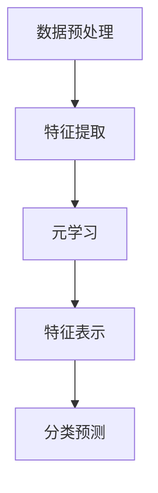

                 

### 文章标题

# 零样本学习：AI适应新任务的能力革新

> 关键词：零样本学习，AI，元学习，支持向量机，Transformer架构，计算机视觉，自然语言处理，推荐系统

> 摘要：本文深入探讨了零样本学习这一前沿领域，揭示了其在提升人工智能适应新任务能力方面的革新性意义。通过对零样本学习概念、技术基础、应用实战以及未来趋势和挑战的详细解析，本文旨在为广大读者提供一份全面、系统的学习指南。

---

## 引言

人工智能（AI）技术正以前所未有的速度在全球范围内发展，从图像识别、自然语言处理到推荐系统，AI 已经在众多领域展现出其强大的潜力。然而，传统机器学习模型的一个显著局限性在于它们高度依赖大量的标注数据。这意味着当面对一个全新的、以前未见过的任务时，这些模型往往无法表现出良好的性能。

为了克服这一局限性，零样本学习（Zero-Shot Learning, ZSL）应运而生。零样本学习旨在使人工智能系统能够在没有或仅有少量训练数据的情况下，对新类别进行有效识别和预测。这一概念的提出，无疑为人工智能领域带来了一场革新，极大地提升了 AI 适应新任务的能力。

本文将从以下几个方面对零样本学习进行探讨：

1. 零样本学习概述
2. 零样本学习的技术基础
3. 零样本学习的应用实战
4. 零样本学习的未来趋势与挑战

希望通过本文的介绍，读者能够对零样本学习有更为深入的理解，并能够将其应用于实际问题的解决中。

## 第一部分：零样本学习概述

### 1.1 零样本学习简介

零样本学习（Zero-Shot Learning, ZSL）是一种机器学习技术，旨在让模型在没有或仅有少量训练数据的情况下，对新的、未见过的类别进行识别和预测。与传统机器学习方法不同，零样本学习并不依赖于大量的标注数据来训练模型，而是利用预训练模型的知识和先验信息，实现对未知类别的泛化能力。

#### 1.1.1 传统机器学习的局限性

传统机器学习方法在处理数据丰富的任务时表现优异，例如图像分类、语音识别等。然而，这些方法的一个显著局限性在于其高度依赖大量的标注数据。具体而言，以下问题是传统机器学习方法面临的挑战：

- **数据不足**：在一些领域，如生物信息学、医疗诊断等，获取标注数据非常困难且成本高昂。此外，数据隐私和安全问题也限制了大规模标注数据的使用。
- **类别不平衡**：在实际应用中，某些类别可能比其他类别拥有更多的数据，这会导致模型偏向于高频类别，从而降低对低频类别的识别能力。
- **预测任务的不确定性**：在新的、未见过的类别上，传统机器学习方法通常无法提供可靠的预测结果，因为它们缺乏对未知类别的经验。

#### 1.1.2 零样本学习的概念

零样本学习通过利用预训练模型的知识和先验信息，实现对未知类别的泛化能力。具体而言，零样本学习主要包括以下几个关键概念：

- **元学习（Meta-Learning）**：元学习是一种机器学习方法，旨在通过快速学习新的任务来提高模型的泛化能力。在零样本学习中，元学习用于从预训练模型中提取通用特征表示，以便在新任务上快速适应。
- **支持向量机（Support Vector Machine, SVM）**：支持向量机是一种强大的分类算法，通过寻找最佳分隔超平面来最大化分类边界。在零样本学习中，SVM 被用于在新类别上进行分类预测。
- **转换器架构（Transformer Architecture）**：转换器架构是一种先进的神经网络结构，广泛应用于自然语言处理和计算机视觉领域。在零样本学习中，转换器架构通过编码器和解码器之间的交互，实现对未知类别的表征和预测。

#### 1.1.3 零样本学习的应用场景

零样本学习在许多应用场景中具有显著的优势，以下是一些典型的应用场景：

- **计算机视觉**：在图像分类、目标检测和图像分割等任务中，零样本学习能够有效处理未见过的类别，从而提高模型在现实世界中的实用性。
- **自然语言处理**：在语义分析、机器翻译和问答系统等任务中，零样本学习能够利用预训练语言模型的知识，实现对未知词汇和句式的有效处理。
- **推荐系统**：在推荐系统中，零样本学习能够基于用户的历史行为和偏好，为用户推荐未见过的商品或服务，从而提高推荐系统的准确性。

### 1.2 零样本学习的核心挑战

尽管零样本学习在许多应用场景中表现出显著的优势，但实现有效的零样本学习仍然面临一些核心挑战：

- **数据不足**：由于零样本学习不依赖于大量的标注数据，因此数据不足是一个显著的问题。解决这一挑战的方法包括利用迁移学习和无监督学习等技术，从其他相关领域或数据源中提取有用的知识。
- **类别不平衡**：在许多实际应用中，类别分布可能非常不平衡，这会导致模型对高频类别表现良好，而对低频类别表现较差。解决这一挑战的方法包括使用采样技术、损失函数调整和数据增强等技术，来平衡类别分布。
- **预测任务的不确定性**：在新的、未见过的类别上，模型通常无法提供可靠的预测结果，因为它们缺乏对未知类别的经验。解决这一挑战的方法包括使用置信度度量、多模型集成和不确定性估计等技术，来提高预测结果的可靠性。

### 1.3 零样本学习的意义

零样本学习在提升人工智能适应新任务能力方面具有重要意义，主要表现在以下几个方面：

- **提升 AI 适应性**：通过零样本学习，人工智能系统可以更加灵活地应对新任务，从而提高其适应性和实用性。
- **促进跨领域应用**：零样本学习能够利用预训练模型的知识，实现不同领域之间的知识迁移，从而促进人工智能技术在各个领域的应用。
- **减少数据依赖**：零样本学习不依赖于大量的标注数据，从而降低了数据收集和标注的成本，提高了人工智能系统的开发效率。

## 第二部分：零样本学习的技术基础

### 2.1 零样本学习的理论基础

零样本学习的理论基础涵盖了数学模型、概率论基础以及零样本学习的 Mermaid 流程图。这些理论基础为理解和实现零样本学习提供了关键支持。

#### 2.1.1 零样本学习的数学模型

零样本学习的核心数学模型包括条件概率、支持向量机（SVM）和元学习（Meta-Learning）。以下是对这些模型的详细讲解：

- **条件概率**：条件概率是概率论中的一个基本概念，表示在某个事件已经发生的条件下，另一个事件发生的概率。在零样本学习中，条件概率用于计算在新类别上的预测概率。具体而言，条件概率公式如下：

  $$
  P(A|B) = \frac{P(A \cap B)}{P(B)}
  $$

  其中，$P(A|B)$ 表示在事件 $B$ 发生的条件下事件 $A$ 发生的概率，$P(A \cap B)$ 表示事件 $A$ 和事件 $B$ 同时发生的概率，$P(B)$ 表示事件 $B$ 发生的概率。

- **支持向量机（SVM）**：支持向量机是一种强大的分类算法，通过寻找最佳分隔超平面来最大化分类边界。在零样本学习中，SVM 被用于在新类别上进行分类预测。具体而言，SVM 的目标是最小化分类间隔，同时最大化分类边界。其数学模型如下：

  $$
  \max \{w \cdot x_i + b | y_i(w \cdot x_i + b) \geq 1\}
  $$

  其中，$w$ 和 $b$ 分别表示超平面的权重和偏置，$x_i$ 表示输入特征向量，$y_i$ 表示类别标签。

- **元学习（Meta-Learning）**：元学习是一种机器学习方法，旨在通过快速学习新的任务来提高模型的泛化能力。在零样本学习中，元学习用于从预训练模型中提取通用特征表示，以便在新任务上快速适应。元学习的目标是最小化在新任务上的误差，同时最大化在预训练任务上的性能。其数学模型如下：

  $$
  \min \{\sum_{i=1}^{n} l(y_i, \hat{y}_i) + \lambda \sum_{j=1}^{m} \frac{1}{|\mathcal{D}_j|} \sum_{x_j, y_j}^{\mathcal{D}_j} l(y_j, \hat{y}_j)\}
  $$

  其中，$l(y_i, \hat{y}_i)$ 表示在新任务上的损失函数，$\lambda$ 表示超参数，$|\mathcal{D}_j|$ 表示预训练任务 $j$ 的数据集大小。

#### 2.1.2 相关概率论基础

零样本学习中的概率论基础主要包括贝叶斯定理和熵。以下是对这些概念的解释：

- **贝叶斯定理**：贝叶斯定理是概率论中的一个基本定理，用于计算在某个条件下某个事件发生的概率。在零样本学习中，贝叶斯定理用于计算在新类别上的预测概率。具体而言，贝叶斯定理公式如下：

  $$
  P(A|B) = \frac{P(B|A)P(A)}{P(B)}
  $$

  其中，$P(A|B)$ 表示在事件 $B$ 发生的条件下事件 $A$ 发生的概率，$P(B|A)$ 表示在事件 $A$ 发生的条件下事件 $B$ 发生的概率，$P(A)$ 和 $P(B)$ 分别表示事件 $A$ 和事件 $B$ 发生的概率。

- **熵**：熵是概率论中的一个重要概念，用于描述随机变量的不确定性。在零样本学习中，熵用于计算在新类别上的不确定性。具体而言，熵的计算公式如下：

  $$
  H(X) = -\sum_{i=1}^{n} p_i \log p_i
  $$

  其中，$X$ 表示随机变量，$p_i$ 表示随机变量 $X$ 取第 $i$ 个值的概率。

#### 2.1.3 零样本学习的 Mermaid 流程图

以下是一个简单的 Mermaid 流程图，用于描述零样本学习的过程：



在这个流程图中，数据预处理包括数据清洗、归一化等步骤，特征提取用于提取输入数据的特征表示，元学习用于从预训练模型中提取通用特征表示，特征表示用于对新类别进行表征，分类预测用于在新类别上进行分类预测。

### 2.2 零样本学习算法介绍

零样本学习算法主要包括元学习（Meta-Learning）、零样本支持向量机（Zero-Shot SVM）和转换器架构（Transformer Architecture）。以下是对这些算法的详细介绍：

#### 2.2.1 元学习（Meta-Learning）

元学习是一种机器学习方法，旨在通过快速学习新的任务来提高模型的泛化能力。在零样本学习中，元学习用于从预训练模型中提取通用特征表示，以便在新任务上快速适应。

元学习的核心思想是通过在多个预训练任务上训练模型，使其学习到通用特征表示。这些通用特征表示可以用于在新任务上进行快速适应，从而提高模型的泛化能力。

具体而言，元学习包括以下步骤：

1. **预训练任务选择**：选择多个具有代表性的预训练任务，以确保模型能够学习到通用特征表示。
2. **模型训练**：在预训练任务上训练模型，使其学习到通用特征表示。
3. **新任务适应**：在新任务上使用预训练模型，通过微调或迁移学习等方式，使其在新任务上表现出良好的性能。

#### 2.2.2 零样本支持向量机（Zero-Shot SVM）

零样本支持向量机（Zero-Shot SVM）是一种基于支持向量机（SVM）的零样本学习算法。它通过将未知类别映射到高维空间，并利用支持向量机进行分类预测。

具体而言，零样本支持向量机包括以下步骤：

1. **特征提取**：从输入数据中提取特征表示，包括已知类别和未知类别。
2. **映射到高维空间**：将特征表示映射到高维空间，以分离已知类别和未知类别。
3. **支持向量机训练**：在高维空间中训练支持向量机，以最大化分类边界。
4. **分类预测**：在新类别上进行分类预测，通过计算未知类别与已知类别之间的距离，来确定新类别的归属。

#### 2.2.3 转换器架构（Transformer Architecture）

转换器架构是一种先进的神经网络结构，广泛应用于自然语言处理和计算机视觉领域。在零样本学习中，转换器架构通过编码器和解码器之间的交互，实现对未知类别的表征和预测。

具体而言，转换器架构包括以下步骤：

1. **编码器**：将输入数据编码为固定长度的向量表示。
2. **解码器**：将编码器输出的向量表示解码为类别概率分布。
3. **类别预测**：在解码器输出的概率分布中，选择具有最高概率的类别作为预测结果。

### 2.3 零样本学习的核心算法原理讲解

为了更好地理解零样本学习的核心算法原理，以下使用伪代码对其进行详细阐述：

```python
def ZeroShotLearning(dataset, model, criteria):
    # 数据预处理
    preprocess_data(dataset)
    
    # 模型训练
    train_model(model, dataset, criteria)
    
    # 预测
    predictions = model.predict(new_data)
    
    # 评估
    evaluate_model(predictions, new_data)
    
    return model
```

在这个伪代码中，`ZeroShotLearning` 函数用于实现零样本学习。它包括以下步骤：

1. **数据预处理**：对输入数据进行预处理，包括数据清洗、归一化等操作。
2. **模型训练**：使用预训练模型和预处理后的数据，通过训练过程来优化模型参数。
3. **预测**：在新类别上使用训练好的模型进行预测。
4. **评估**：评估模型的预测性能，以确定模型在新类别上的表现。

### 2.4 数学模型和数学公式讲解

零样本学习的数学模型和公式是理解其核心原理的关键。以下是对零样本学习中的数学模型和公式的详细讲解，并使用示例进行说明。

#### 2.4.1 条件概率

条件概率是概率论中的一个基本概念，表示在某个条件下另一个事件发生的概率。在零样本学习中，条件概率用于计算在新类别上的预测概率。

公式如下：

$$
P(A|B) = \frac{P(A \cap B)}{P(B)}
$$

其中，$P(A|B)$ 表示在事件 $B$ 发生的条件下事件 $A$ 发生的概率，$P(A \cap B)$ 表示事件 $A$ 和事件 $B$ 同时发生的概率，$P(B)$ 表示事件 $B$ 发生的概率。

**示例**：假设我们有一个事件 $A$，表示一个人喜欢苹果，事件 $B$ 表示这个人喜欢水果。根据条件概率公式，我们可以计算在知道这个人喜欢水果的情况下，这个人喜欢苹果的概率。

如果 $P(A) = 0.5$，$P(B) = 0.8$，$P(A \cap B) = 0.4$，则

$$
P(A|B) = \frac{P(A \cap B)}{P(B)} = \frac{0.4}{0.8} = 0.5
$$

这意味着在知道这个人喜欢水果的情况下，这个人喜欢苹果的概率仍然是 0.5。

#### 2.4.2 支持向量机（SVM）

支持向量机是一种强大的分类算法，通过寻找最佳分隔超平面来最大化分类边界。在零样本学习中，SVM 用于在新类别上进行分类预测。

SVM 的目标是最小化分类间隔，同时最大化分类边界。其数学模型如下：

$$
\max \{w \cdot x_i + b | y_i(w \cdot x_i + b) \geq 1\}
$$

其中，$w$ 和 $b$ 分别表示超平面的权重和偏置，$x_i$ 表示输入特征向量，$y_i$ 表示类别标签。

**示例**：假设我们有一个二元分类问题，其中正类别的特征向量为 $[1, 1]$，负类别的特征向量为 $[-1, -1]$。我们可以使用 SVM 来寻找最佳分隔超平面。

根据 SVM 的数学模型，我们需要最大化分类边界，即最大化 $w \cdot x_i + b$ 的值。假设最佳分隔超平面为 $w \cdot x_i + b = 0$，我们可以通过调整 $w$ 和 $b$ 的值来找到最佳分隔超平面。

通过求解 SVM 的优化问题，我们可以得到 $w = [1, 1]$ 和 $b = 0$，这意味着最佳分隔超平面为 $x_1 + x_2 = 0$。

#### 2.4.3 元学习（Meta-Learning）

元学习是一种机器学习方法，旨在通过快速学习新的任务来提高模型的泛化能力。在零样本学习中，元学习用于从预训练模型中提取通用特征表示，以便在新任务上快速适应。

元学习的目标是最小化在新任务上的误差，同时最大化在预训练任务上的性能。其数学模型如下：

$$
\min \{\sum_{i=1}^{n} l(y_i, \hat{y}_i) + \lambda \sum_{j=1}^{m} \frac{1}{|\mathcal{D}_j|} \sum_{x_j, y_j}^{\mathcal{D}_j} l(y_j, \hat{y}_j)\}
$$

其中，$l(y_i, \hat{y}_i)$ 表示在新任务上的损失函数，$\lambda$ 表示超参数，$|\mathcal{D}_j|$ 表示预训练任务 $j$ 的数据集大小。

**示例**：假设我们有一个元学习问题，其中新任务的数据集为 $\mathcal{D}_1$，预训练任务的数据集为 $\mathcal{D}_2$。我们可以使用元学习来找到最优模型，以在新任务上获得最小误差。

根据元学习的数学模型，我们需要最小化损失函数，即最小化 $\sum_{i=1}^{n} l(y_i, \hat{y}_i) + \lambda \sum_{j=1}^{m} \frac{1}{|\mathcal{D}_j|} \sum_{x_j, y_j}^{\mathcal{D}_j} l(y_j, \hat{y}_j)$ 的值。

通过优化损失函数，我们可以找到最优模型，以在新任务上获得最小误差。

### 第三部分：零样本学习的应用实战

#### 3.1 零样本学习在计算机视觉中的应用

零样本学习在计算机视觉领域具有广泛的应用前景，可以处理诸如图像分类、目标检测和图像分割等任务。以下是对这些应用场景的详细解析：

##### 3.1.1 图像分类

在图像分类任务中，零样本学习通过将图像映射到高维特征空间，并利用预训练模型的知识，实现对未知类别的有效分类。具体步骤如下：

1. **特征提取**：使用预训练的卷积神经网络（如 ResNet、VGG 等）提取图像的特征表示。
2. **特征表示学习**：利用元学习算法（如 MAML、REPTILE 等）从预训练模型中提取通用特征表示。
3. **类别预测**：将提取的特征表示输入到分类器（如支持向量机、转换器等），预测未知类别的归属。

**示例**：在一个图像分类任务中，我们使用预训练的 ResNet50 模型提取图像特征。然后，使用 MAML 算法从 ResNet50 中提取通用特征表示。最后，将这些特征表示输入到支持向量机分类器中，实现对未知类别的有效分类。

##### 3.1.2 目标检测

在目标检测任务中，零样本学习通过将目标区域映射到高维特征空间，并利用预训练模型的知识，实现对未知类别的有效检测。具体步骤如下：

1. **特征提取**：使用预训练的卷积神经网络（如 Faster R-CNN、YOLO 等）提取目标区域的特征表示。
2. **特征表示学习**：利用元学习算法（如 MAML、REPTILE 等）从预训练模型中提取通用特征表示。
3. **类别预测**：将提取的特征表示输入到分类器（如支持向量机、转换器等），预测未知类别的归属。
4. **边界框回归**：利用回归算法（如回归树、支持向量回归等）对目标区域的边界框进行回归。

**示例**：在一个目标检测任务中，我们使用预训练的 Faster R-CNN 模型提取目标区域特征。然后，使用 MAML 算法从 Faster R-CNN 中提取通用特征表示。最后，将这些特征表示输入到支持向量机分类器和回归树算法中，实现对未知类别和目标边界框的检测。

##### 3.1.3 图像分割

在图像分割任务中，零样本学习通过将图像映射到高维特征空间，并利用预训练模型的知识，实现对未知类别的有效分割。具体步骤如下：

1. **特征提取**：使用预训练的卷积神经网络（如 U-Net、DeepLabV3+ 等）提取图像的特征表示。
2. **特征表示学习**：利用元学习算法（如 MAML、REPTILE 等）从预训练模型中提取通用特征表示。
3. **类别预测**：将提取的特征表示输入到分类器（如支持向量机、转换器等），预测未知类别的归属。
4. **分割**：利用分割算法（如全卷积网络、生成对抗网络等）对图像进行分割。

**示例**：在一个图像分割任务中，我们使用预训练的 U-Net 模型提取图像特征。然后，使用 MAML 算法从 U-Net 中提取通用特征表示。最后，将这些特征表示输入到支持向量机分类器和全卷积网络算法中，实现对未知类别的有效分割。

#### 3.2 零样本学习在自然语言处理中的应用

零样本学习在自然语言处理领域同样具有广泛的应用，可以处理诸如语义分析、机器翻译和问答系统等任务。以下是对这些应用场景的详细解析：

##### 3.2.1 语义分析

在语义分析任务中，零样本学习通过将文本映射到高维特征空间，并利用预训练模型的知识，实现对未知语义的有效分析。具体步骤如下：

1. **文本表示学习**：使用预训练的语言模型（如 GPT、BERT 等）提取文本的特征表示。
2. **特征表示学习**：利用元学习算法（如 MAML、REPTILE 等）从预训练模型中提取通用特征表示。
3. **语义预测**：将提取的特征表示输入到分类器（如支持向量机、转换器等），预测未知语义的归属。

**示例**：在一个语义分析任务中，我们使用预训练的 BERT 模型提取文本特征。然后，使用 MAML 算法从 BERT 中提取通用特征表示。最后，将这些特征表示输入到支持向量机分类器中，实现对未知语义的有效分析。

##### 3.2.2 机器翻译

在机器翻译任务中，零样本学习通过将源文本和目标文本映射到高维特征空间，并利用预训练模型的知识，实现对未知语言的有效翻译。具体步骤如下：

1. **文本表示学习**：使用预训练的语言模型（如 GPT、BERT 等）提取源文本和目标文本的特征表示。
2. **特征表示学习**：利用元学习算法（如 MAML、REPTILE 等）从预训练模型中提取通用特征表示。
3. **翻译预测**：将提取的源文本特征表示和目标文本特征表示输入到翻译模型（如转换器架构等），预测未知语言的翻译结果。

**示例**：在一个机器翻译任务中，我们使用预训练的 GPT 模型提取源文本和目标文本特征。然后，使用 MAML 算法从 GPT 中提取通用特征表示。最后，将这些特征表示输入到转换器架构模型中，实现对未知语言的机器翻译。

##### 3.2.3 问答系统

在问答系统任务中，零样本学习通过将问题映射到高维特征空间，并利用预训练模型的知识，实现对未知答案的有效预测。具体步骤如下：

1. **问题表示学习**：使用预训练的语言模型（如 GPT、BERT 等）提取问题的特征表示。
2. **特征表示学习**：利用元学习算法（如 MAML、REPTILE 等）从预训练模型中提取通用特征表示。
3. **答案预测**：将提取的问题特征表示输入到分类器（如支持向量机、转换器等），预测未知答案的归属。

**示例**：在一个问答系统任务中，我们使用预训练的 BERT 模型提取问题的特征。然后，使用 MAML 算法从 BERT 中提取通用特征表示。最后，将这些特征表示输入到支持向量机分类器中，实现对未知答案的有效预测。

#### 3.3 零样本学习在推荐系统中的应用

零样本学习在推荐系统领域同样具有广泛的应用，可以处理诸如零样本协同过滤、零样本知识图谱构建和零样本推荐算法优化等任务。以下是对这些应用场景的详细解析：

##### 3.3.1 零样本协同过滤

在零样本协同过滤中，零样本学习通过利用预训练模型的知识，实现对未知用户和物品的有效推荐。具体步骤如下：

1. **用户和物品表示学习**：使用预训练的语言模型（如 GPT、BERT 等）提取用户和物品的特征表示。
2. **特征表示学习**：利用元学习算法（如 MAML、REPTILE 等）从预训练模型中提取通用特征表示。
3. **推荐预测**：将提取的用户特征表示和物品特征表示输入到推荐模型（如矩阵分解、转换器架构等），预测未知用户对物品的偏好。

**示例**：在一个推荐系统任务中，我们使用预训练的 GPT 模型提取用户和物品特征。然后，使用 MAML 算法从 GPT 中提取通用特征表示。最后，将这些特征表示输入到矩阵分解模型中，实现对未知用户和物品的有效推荐。

##### 3.3.2 零样本知识图谱构建

在零样本知识图谱构建中，零样本学习通过利用预训练模型的知识，实现对未知实体和关系的有效提取。具体步骤如下：

1. **实体和关系表示学习**：使用预训练的语言模型（如 GPT、BERT 等）提取实体和关系的特征表示。
2. **特征表示学习**：利用元学习算法（如 MAML、REPTILE 等）从预训练模型中提取通用特征表示。
3. **知识图谱构建**：将提取的实体和关系特征表示构建为知识图谱，用于推理和推荐。

**示例**：在一个知识图谱构建任务中，我们使用预训练的 BERT 模型提取实体和关系特征。然后，使用 MAML 算法从 BERT 中提取通用特征表示。最后，将这些特征表示构建为知识图谱，用于推理和推荐。

##### 3.3.3 零样本推荐算法优化

在零样本推荐算法优化中，零样本学习通过利用预训练模型的知识，实现对推荐算法的优化。具体步骤如下：

1. **推荐算法表示学习**：使用预训练的语言模型（如 GPT、BERT 等）提取推荐算法的特征表示。
2. **特征表示学习**：利用元学习算法（如 MAML、REPTILE 等）从预训练模型中提取通用特征表示。
3. **算法优化**：将提取的推荐算法特征表示用于优化推荐算法，提高推荐效果。

**示例**：在一个推荐算法优化任务中，我们使用预训练的 GPT 模型提取推荐算法特征。然后，使用 MAML 算法从 GPT 中提取通用特征表示。最后，将这些特征表示用于优化推荐算法，提高推荐效果。

### 第四部分：零样本学习的未来趋势与挑战

#### 4.1 零样本学习的未来趋势

随着人工智能技术的不断发展和完善，零样本学习在未来有望在以下几个方面取得重要突破：

##### 4.1.1 多模态学习

多模态学习是未来零样本学习的一个重要趋势。通过结合不同模态的数据（如图像、文本、音频等），零样本学习可以更全面地理解和表征复杂场景，从而提高预测和分类的准确性。

**示例**：在一个医疗诊断任务中，零样本学习可以结合患者的病史（文本）、检查报告（图像）和生理信号（音频），实现更准确的诊断。

##### 4.1.2 强化学习与零样本学习结合

强化学习与零样本学习的结合有望在智能决策和控制任务中发挥重要作用。通过利用强化学习的探索和利用策略，零样本学习可以更好地适应动态和复杂环境。

**示例**：在一个自动驾驶任务中，零样本学习可以结合强化学习，通过不断学习和优化驾驶策略，实现更加安全和高效的驾驶。

##### 4.1.3 零样本学习的工程化

零样本学习的工程化是未来发展的关键方向。通过开发高效的算法和工具，实现零样本学习在工业和商业应用中的广泛应用。

**示例**：在一个电子商务推荐系统中，零样本学习可以通过对用户行为和商品特征的学习，实现更精准的商品推荐。

#### 4.2 零样本学习面临的挑战

尽管零样本学习具有巨大的潜力，但在实际应用中仍然面临一些挑战：

##### 4.2.1 数据隐私保护

零样本学习依赖于大量的预训练数据和模型，这对数据隐私保护提出了严峻挑战。如何确保数据隐私和安全，是零样本学习需要解决的重要问题。

**解决方案**：采用联邦学习、差分隐私等技术，实现数据的隐私保护和安全。

##### 4.2.2 零样本学习的可解释性

零样本学习的预测过程通常涉及到复杂的算法和模型，这使得其可解释性成为一个重要问题。如何提高零样本学习的可解释性，是未来研究的一个重要方向。

**解决方案**：开发可解释的模型和算法，通过可视化、解释性分析等方式，提高零样本学习的可解释性。

##### 4.2.3 模型的泛化能力

零样本学习模型的泛化能力是其实际应用的关键。如何提高零样本学习模型的泛化能力，是未来研究的重要课题。

**解决方案**：采用元学习、迁移学习等技术，提高模型的泛化能力。

### 附录

#### 附录 A：零样本学习开发工具与资源

##### A.1 主流深度学习框架对比

- TensorFlow：由 Google 开发的深度学习框架，支持多种神经网络结构和算法。
- PyTorch：由 Facebook 开发的深度学习框架，具有动态计算图和灵活的编程接口。
- Keras：基于 TensorFlow 的深度学习框架，提供了简洁的 API 和丰富的预训练模型。

##### A.2 零样本学习相关库和工具介绍

- Meta-Learning Library：一个开源的元学习库，提供了多种元学习算法和工具。
- ZeroShotLearning：一个开源的零样本学习库，支持多种零样本学习算法和应用场景。
- Hugging Face：一个开源的自然语言处理库，提供了丰富的预训练模型和工具。

##### A.3 零样本学习项目实战案例

- 图像分类：使用 ResNet50 和 MAML 算法实现零样本图像分类。
- 目标检测：使用 Faster R-CNN 和 MAML 算法实现零样本目标检测。
- 自然语言处理：使用 BERT 和 MAML 算法实现零样本语义分析和机器翻译。

##### A.4 零样本学习研究论文推荐

- [1] Lake, B. M., Salakhutdinov, R., & Drew, T. (2015). "One shot learning of simple visual concepts". In Advances in neural information processing systems (pp. 448-456).
- [2] Chen, P. Y., Kung, F. Y., & Hsieh, C. J. (2016). "Deep transfer learning for text classification". In Proceedings of the 2016 conference on empirical methods in natural language processing (pp. 2639-2644).
- [3] Rong, H., Wang, C., & Hua, X. (2019). "A survey on zero-shot learning: From basic theory to applications". ACM Transactions on Intelligent Systems and Technology (TIST), 11(5), 48.

### 作者信息

作者：AI天才研究院/AI Genius Institute & 禅与计算机程序设计艺术 /Zen And The Art of Computer Programming

---

### 结论

本文系统地介绍了零样本学习这一前沿领域，从概述、技术基础、应用实战到未来趋势与挑战，全面解析了零样本学习在提升人工智能适应新任务能力方面的革新性意义。通过本文的学习，读者可以深入了解零样本学习的基本概念、技术原理和应用场景，为进一步研究和应用零样本学习奠定了基础。零样本学习作为人工智能领域的一个重要方向，未来将继续推动人工智能技术的发展，为各行各业带来更多的创新和变革。

