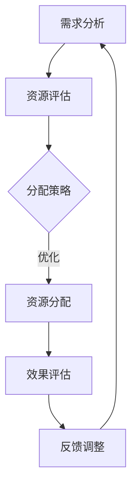

                 

### 引言与概述

#### 1.1 书籍背景与目标

在当今科技日新月异的时代，人工智能（AI）技术正以前所未有的速度发展，并在众多领域展现出巨大的潜力和应用价值。从自动驾驶、智能医疗、金融科技到自然语言处理和计算机视觉，AI技术正深刻改变着我们的生活方式和社会结构。然而，随着AI模型的复杂度和计算需求不断攀升，如何高效地管理和分配计算资源以满足多样化的需求，成为了一个亟待解决的问题。

本篇文章旨在深入探讨需求与AI模型计算资源分配的协调机制，重点研究大模型应用中的效率优化策略。通过系统地分析需求分析理论和AI模型计算资源分配理论，本书将提供一套全面的解决方案，以帮助开发者、研究人员和企业更好地应对这一挑战。

本文的主要目标是：

1. **明确需求分析的基本概念和方法**：介绍需求分析的理论基础，帮助读者理解和识别不同类型的需求。
2. **阐述计算资源分配的理论和策略**：探讨计算资源分配的基本概念、策略和优化方法，为资源分配提供理论支持。
3. **提出大模型应用的效率优化方法**：结合实际案例，详细讲解如何在大模型应用中实现效率优化。
4. **分析跨领域需求与资源分配协调的挑战**：探讨跨领域应用中的需求与资源分配协调策略，为实际应用提供参考。
5. **设计实施与部署方案**：提供具体的实施方案设计，包括规划、协调机制和风险应对策略。
6. **展望未来研究方向**：总结研究成果，指出当前存在的问题与挑战，并探讨未来可能的研究方向。

通过以上目标，本文希望能够为AI领域的研究者、开发者以及相关从业者提供有价值的参考，推动大模型应用的效率优化，助力人工智能技术的广泛应用和发展。

#### 1.2 需求与AI模型计算资源分配的重要性

在AI应用日益广泛的大背景下，需求和计算资源分配之间的协调显得尤为重要。首先，AI模型的有效性高度依赖于计算资源，包括CPU、GPU、内存和网络带宽等。如果资源分配不当，可能会导致模型训练时间延长、精度降低，甚至影响最终的应用效果。其次，随着AI模型的复杂度和规模的增加，计算资源的需求也在不断增长。例如，深度学习模型通常需要大量的GPU资源进行训练，而推荐系统则可能需要高带宽网络来支持实时数据传输和处理。

需求与计算资源分配之间的协调对AI应用的影响主要表现在以下几个方面：

1. **效率提升**：合理的需求与资源分配能够显著提升AI模型的训练和推理效率。例如，通过优先分配高优先级需求，确保关键任务的及时完成，从而提升系统的整体性能。

2. **成本控制**：有效的资源分配策略可以帮助企业更好地控制计算成本。通过动态调整资源分配，优化资源利用率，避免资源浪费，从而降低运营成本。

3. **用户体验**：对于面向用户的AI应用，需求与资源分配的协调直接影响用户体验。快速响应需求、高效完成任务，能够提升用户满意度，增加用户粘性。

4. **系统稳定性**：良好的资源分配策略有助于提高系统的稳定性和可靠性。通过合理分配资源，避免过度使用或资源不足，可以减少系统崩溃和中断的风险。

5. **可持续性**：在环保意识日益增强的今天，高效的资源利用也有助于减少能源消耗和碳排放，实现可持续发展。

因此，需求和计算资源分配的协调不仅是技术问题，更是业务战略的重要部分。它不仅关系到AI应用的性能和成本，还直接影响到用户体验和企业的竞争力。在实际应用中，如何平衡各种需求，优化资源分配，实现效率最大化，是每一个AI应用开发者和企业都必须面对的重要课题。

#### 1.3 本书结构安排与内容概述

本书系统地探讨了需求与AI模型计算资源分配的协调机制，结构清晰，内容全面，旨在为读者提供从理论到实践的全面指导。以下是本书的具体结构安排和内容概述：

**第一部分：引言与概述**

- **第1章 引言**
  - 介绍了本书的背景和目标，明确了需求与AI模型计算资源分配的重要性。
  - 阐述了本书的主要内容和结构安排，为后续章节的深入讨论奠定了基础。

**第二部分：理论基础**

- **第2章 需求分析理论与方法**
  - 详细介绍了需求分析的基本概念和方法，包括需求分类与特性分析。
  - 探讨了需求分析方法在实际应用中的具体实践，为后续的资源分配提供了需求基础。

- **第3章 AI模型计算资源分配理论**
  - 介绍了计算资源分配的基本概念和策略，分析了资源分配的挑战与优化方法。
  - 通过案例分析，展示了资源分配理论在实际中的应用和效果。

**第三部分：大模型应用效率优化**

- **第4章 AI大模型效率优化方法**
  - 阐述了大模型效率优化的必要性和重要性，介绍了大模型优化方法的基本概念。
  - 通过实际案例，分析了在大模型应用中实现效率优化的具体策略和步骤。

- **第5章 大模型应用案例分析**
  - 介绍了大模型应用的典型案例，分析了案例中的需求与资源分配情况。
  - 通过案例解决方案与效果评估，总结了经验教训，为其他应用提供了参考。

**第四部分：跨领域需求与资源分配协调**

- **第6章 跨领域需求与资源分配协调**
  - 探讨了跨领域需求的特点与挑战，分析了跨领域应用中的需求与资源分配协调策略。
  - 通过跨领域应用案例分享，展示了协调机制在实际应用中的效果。

**第五部分：实施与部署**

- **第7章 实施方案设计**
  - 介绍了实施方案的设计过程和步骤，包括需求与资源协调机制和风险评估与应对策略。
  - 通过具体实施案例，展示了方案设计的实际效果。

- **第8章 大模型应用部署与维护**
  - 详细讲解了大模型部署流程与工具，以及维护与升级策略。
  - 通过实际操作案例解析，帮助读者理解大模型应用的部署与维护过程。

**第六部分：深入研究**

- **第9章 需求与资源分配协调的数学模型**
  - 介绍了需求与资源分配协调的数学模型构建基础，分析了模型的应用场景和优化算法。
  - 通过具体示例，展示了数学模型在实际问题中的分析和应用。

- **第10章 大模型应用前沿技术**
  - 概述了当前大模型应用的前沿技术，探讨了技术发展趋势和实际应用中的挑战与前景。
  - 通过对前沿技术的分析，展望了未来大模型应用的发展方向。

**第七部分：结论与展望**

- **第11章 结论与展望**
  - 总结了本书的研究成果，分析了当前存在的问题与挑战。
  - 展望了未来的研究方向和发展趋势，为AI领域的研究和开发提供了参考。

通过以上结构安排，本书从理论到实践，系统地探讨了需求与AI模型计算资源分配的协调机制，旨在为读者提供全面的指导，帮助其优化大模型应用效率，实现资源的最大化利用。

### 第2章：需求分析理论与方法

#### 2.1 需求分析的基本概念

需求分析是软件工程中的核心环节，它直接决定了软件系统的成功与否。在AI领域，需求分析同样至关重要，因为AI系统的性能和效果高度依赖于对需求的理解和满足。首先，我们需要明确需求分析的基本概念：

**需求**：需求是指用户对系统功能、性能、界面等方面的期望和需求。在AI模型中，需求可以包括数据质量、模型精度、响应时间等。

**需求分析**：需求分析是对用户需求进行收集、理解和表述的过程。它包括以下几个关键步骤：

1. **需求收集**：通过与用户沟通、调查问卷、观察用户行为等方式，收集用户的需求。
2. **需求理解**：对收集到的需求进行理解和分析，明确需求的真实含义。
3. **需求表述**：将需求转化为文档或模型，以便于后续的软件开发和实施。

**需求管理**：需求管理是对需求进行跟踪、变更和控制的过程。它包括以下任务：

- **需求跟踪**：确保所有需求都得到适当的处理和实施。
- **需求变更管理**：在软件开发过程中，需求可能会发生变化，需求变更管理确保这些变更被正确处理。
- **需求优先级排序**：根据需求的紧急程度和重要性，对需求进行优先级排序，以便于资源分配和任务调度。

#### 2.2 需求分类与特性分析

需求可以分为多个类别，每种类型的需求有其特定的特性，理解和分析这些特性对于需求管理至关重要。

**功能需求**：功能需求描述了系统应该执行的具体功能和行为。例如，一个自动驾驶系统需要具备路径规划、障碍物检测、避障等功能。功能需求通常可以量化，如时间响应、处理速度等。

**性能需求**：性能需求定义了系统在特定条件下应该达到的性能水平。例如，一个推荐系统需要能够在毫秒级内返回推荐结果。性能需求通常包括响应时间、吞吐量、稳定性等。

**用户需求**：用户需求是从用户的角度出发的需求，包括用户界面、用户体验、易用性等。例如，用户可能需要一个简洁直观的界面，以便于快速操作。用户需求往往更抽象，难以量化，但它们对系统的成功至关重要。

**业务需求**：业务需求描述了系统需要满足的商业模式和业务目标。例如，一个电商系统需要支持多种支付方式，以确保用户购物的便捷性。业务需求通常与组织的战略和目标密切相关。

**约束需求**：约束需求定义了系统在设计、开发、部署和维护过程中必须遵循的限制条件。例如，系统需要遵循特定的数据隐私法规，确保用户数据的安全。约束需求通常包括法律、合规、技术限制等。

#### 2.3 需求分析方法与应用

需求分析方法是指用于收集、理解和表述需求的一系列技术。以下是一些常用的需求分析方法：

**问卷调查**：问卷调查是一种简单有效的方法，通过设计针对性的问卷，可以快速收集大量用户需求。问卷的设计需要确保问题的清晰性和针对性，以便获得高质量的数据。

**用户访谈**：用户访谈是一种深入的需求收集方法，通过与用户直接交流，可以获取更详细和具体的需求。访谈需要准备详细的问题列表，并注意聆听用户的反馈和需求背后的动机。

**用户场景**：用户场景是通过模拟用户的实际使用情况，来理解用户的需求和体验。用户场景可以帮助团队更好地把握用户的核心需求，并在设计过程中进行验证。

**原型设计**：原型设计是通过创建系统的初步模型，来验证和细化需求。原型设计可以帮助团队快速迭代和优化需求，确保最终系统能够满足用户的需求。

**需求文档**：需求文档是将收集到的需求进行结构化表述的重要工具。需求文档通常包括功能需求、性能需求、用户需求等，以便于团队成员共同理解和实施。

**需求验证**：需求验证是对需求的有效性和实现可行性进行检验的过程。通过需求验证，可以确保需求是正确的、可实现的，并且符合用户和业务的需求。

#### 2.3.1 需求分析方法在实际应用中的具体实践

在实际应用中，需求分析方法的选择和运用需要根据具体情况灵活调整。以下是一个典型的需求分析过程：

1. **项目启动阶段**：项目团队首先通过问卷调查和用户访谈初步了解用户的需求。这一阶段的目标是快速收集大量的用户反馈，以便对项目有一个初步的认识。

2. **需求细化阶段**：在初步了解用户需求后，团队通过用户场景和原型设计进一步细化需求。这一阶段的目标是明确用户的核心需求，并创建一个初步的系统模型。

3. **需求文档编写阶段**：团队根据初步的系统模型编写需求文档，包括功能需求、性能需求和用户需求等。需求文档需要经过用户的审核和确认，以确保需求的准确性和完整性。

4. **需求验证阶段**：在需求文档编写完成后，团队进行需求验证，确保需求是正确的、可实现的，并且符合用户和业务的需求。需求验证可以通过用户测试、性能测试和模拟运行等多种方式进行。

5. **需求管理阶段**：在项目开发过程中，需求可能会发生变化。需求管理团队需要持续跟踪和更新需求，确保需求的变化得到及时处理和实施。

通过以上需求分析方法的具体实践，团队可以更好地理解用户需求，确保最终系统能够满足用户和业务的需求，从而提高项目的成功率。

### 第3章：AI模型计算资源分配理论

#### 3.1 计算资源分配的基本概念

在人工智能（AI）领域，计算资源分配是指合理分配计算资源（如CPU、GPU、内存和网络带宽）以满足不同AI模型的需求。计算资源分配的目的是最大化资源利用率，提高系统性能，并确保关键任务的及时完成。以下将介绍计算资源分配的基本概念：

**计算资源**：计算资源是指用于执行计算任务的硬件设备，包括CPU、GPU、内存、存储和网络设备等。

**任务**：任务是指需要由计算资源完成的计算工作，可以是模型训练、推理、数据处理等。

**资源需求**：资源需求是指完成一个任务所需的计算资源量。资源需求通常包括CPU利用率、GPU利用率、内存占用和带宽需求等。

**资源利用率**：资源利用率是指计算资源被使用的比例。高资源利用率意味着计算资源得到了充分利用，而低资源利用率可能导致资源浪费。

**任务调度**：任务调度是指根据资源需求和资源可用性，合理分配计算资源以执行任务的过程。

**负载均衡**：负载均衡是指通过合理分配计算任务，确保计算资源得到均匀利用，避免某些资源过度使用或闲置。

**资源分配策略**：资源分配策略是指用于决定如何分配计算资源的一系列规则或算法。常见的资源分配策略包括静态分配、动态分配、优先级分配和负载均衡策略等。

#### 3.2 资源分配策略与算法

在AI模型计算资源分配中，选择合适的资源分配策略和算法是关键。以下将介绍几种常见的资源分配策略与算法：

**静态分配**：静态分配是指在系统启动时预先分配计算资源，并在整个运行过程中保持不变。静态分配的优点是简单易懂，易于实现，缺点是缺乏灵活性，无法适应实时变化的需求。

伪代码：
```
function staticAllocation(resources, tasks):
    for each resource in resources:
        for each task in tasks:
            if resource available:
                allocate resource to task
                update resource availability
```

**动态分配**：动态分配是指根据任务的需求和资源状况，实时调整计算资源分配。动态分配的优点是能够适应实时变化的需求，提高资源利用率，缺点是算法设计和实现较为复杂。

伪代码：
```
function dynamicAllocation(resources, tasks):
    while tasks are pending:
        for each task in tasks:
            if resource available:
                allocate resource to task
                update resource availability
            else:
                delay task execution
```

**优先级分配**：优先级分配是根据任务的优先级来分配计算资源。高优先级任务会优先得到资源，确保关键任务的及时完成。

伪代码：
```
function priorityAllocation(resources, tasks):
    while tasks are pending:
        select highest priority task
        if resource available:
            allocate resource to task
            update resource availability
        else:
            delay task execution
```

**负载均衡**：负载均衡是通过均匀分配计算任务，避免某些资源过度使用或闲置。常见的负载均衡算法包括轮询、最小连接数、最小负载等。

伪代码（轮询算法）：
```
function loadBalancing(resources, tasks):
    taskQueue = create empty queue
    for each resource in resources:
        add resource to taskQueue
    while tasks are pending:
        for each task in tasks:
            if taskQueue is not empty:
                select next resource from taskQueue
                allocate resource to task
                remove resource from taskQueue
            else:
                delay task execution
```

#### 3.3 资源分配的挑战与优化

在AI模型计算资源分配中，面临以下主要挑战：

**资源异质性**：不同计算资源（如CPU、GPU、内存）具有不同的性能和特点，资源异质性增加了资源分配的复杂性。

**动态需求变化**：AI模型的需求可能会随着时间变化而变化，如何适应实时需求变化是一个挑战。

**资源竞争**：多个任务可能会同时竞争计算资源，如何公平、高效地分配资源，避免资源竞争成为关键。

**资源利用率最大化**：在满足任务需求的前提下，如何最大化资源利用率，减少资源浪费。

为了解决上述挑战，可以采用以下优化方法：

1. **资源抽象与虚拟化**：通过虚拟化技术，将物理资源抽象成虚拟资源，提高资源利用率，简化资源分配。

伪代码（虚拟化资源分配）：
```
function virtualizedAllocation(virtualResources, tasks):
    while tasks are pending:
        for each task in tasks:
            if virtualResource available:
                allocate virtualResource to task
                update virtualResource availability
            else:
                delay task execution
```

2. **动态资源调整**：根据任务需求和资源状况，动态调整计算资源分配，适应实时变化。

伪代码（动态调整）：
```
function dynamicAdjustment(resources, tasks):
    while tasks are pending:
        if resource utilization exceeds threshold:
            reallocate resources from low priority tasks
        else:
            allocate resources to high priority tasks
```

3. **多策略组合**：结合多种资源分配策略，如优先级分配和负载均衡，提高资源利用效率和任务完成率。

伪代码（多策略组合）：
```
function multiStrategyAllocation(resources, tasks):
    while tasks are pending:
        if high priority task available:
            allocate resource to high priority task
        else:
            if loadBalancing needed:
                apply loadBalancing algorithm
            else:
                apply static allocation
```

4. **优化算法**：设计高效的资源分配算法，如遗传算法、贪心算法等，提高资源分配的优化程度。

伪代码（优化算法示例）：
```
function geneticAlgorithmAllocation(resources, tasks):
    initialize population
    while not converged:
        evaluate fitness of population
        select best individuals for crossover and mutation
        generate new population
    return best solution
```

通过上述方法，可以有效地解决AI模型计算资源分配中的挑战，提高系统的资源利用率和任务完成率，实现高效的资源管理。

#### 3.3.1 资源分配策略与算法在实际应用中的效果

在AI模型计算资源分配的实际应用中，选择和实施合适的资源分配策略和算法对于系统的性能和效率具有显著影响。以下将分析几种典型的资源分配策略与算法在实际应用中的效果：

**动态资源分配**：动态资源分配策略通过实时调整计算资源，以适应不断变化的需求，从而提高资源利用率。例如，在云计算环境中，动态资源分配可以确保虚拟机能够根据实际负载灵活调整计算资源，避免资源浪费。一个实际案例是Netflix在其流媒体服务中使用了动态资源分配策略，通过实时调整服务器资源，提高了视频流播放的稳定性和响应速度，用户满意度显著提升。

**优先级分配**：优先级分配策略通过根据任务的优先级来分配资源，确保关键任务能够优先得到资源，从而提高任务完成率。例如，在自动驾驶系统中，安全相关的任务（如障碍物检测和避障）具有较高的优先级，而娱乐相关的任务（如导航地图更新）优先级较低。这种策略确保了在紧急情况下，系统能够优先处理安全相关的任务，提高行驶的安全性。实际应用中，特斯拉的自动驾驶系统采用了优先级分配策略，通过高效的任务调度，实现了平稳的驾驶体验和较高的系统响应速度。

**负载均衡**：负载均衡策略通过均匀分配计算任务，避免资源过度使用或闲置，从而提高系统的整体性能。例如，在电子商务平台中，负载均衡可以确保用户请求能够均匀分配到不同的服务器上，避免某些服务器负载过高，导致响应速度变慢。实际应用中，亚马逊的AWS云服务使用了负载均衡算法，通过动态调整服务器资源，确保用户请求能够快速响应，提高了系统的稳定性和可靠性。

**多策略组合**：在实际应用中，往往需要结合多种资源分配策略，以实现最优的资源利用和任务完成效果。例如，在金融交易系统中，可以同时使用动态资源分配、优先级分配和负载均衡策略。动态资源分配确保系统能够根据交易量变化灵活调整资源，优先级分配确保关键交易（如高频交易）能够优先处理，负载均衡确保用户请求能够均匀分配到服务器上，从而提高系统的响应速度和稳定性。实际应用中，高频交易公司使用了多策略组合，通过高效的任务调度和资源管理，实现了极高的交易速度和系统稳定性。

通过上述案例分析，可以看出，在实际应用中，选择和实施合适的资源分配策略和算法对于提高AI模型计算资源利用率和任务完成率具有显著效果。不同的资源分配策略和算法在具体应用中可以相互补充，共同提升系统的性能和效率。

### 第4章：AI大模型效率优化方法

#### 4.1 大模型效率优化的必要性

随着深度学习技术的不断进步，AI大模型（Large-scale AI Models）在图像识别、自然语言处理、推荐系统等领域取得了显著的成果。然而，大模型的训练和推理任务通常需要大量的计算资源，并且耗时较长，这使得效率优化成为了一个亟待解决的问题。大模型效率优化的必要性主要体现在以下几个方面：

1. **计算资源的高消耗**：大模型的训练和推理通常需要大量的CPU、GPU和内存资源。如果不进行效率优化，可能会导致计算资源过度消耗，甚至影响系统的正常运行。

2. **训练时间延长**：大模型的训练通常需要数天甚至数周的时间，这不仅延长了研发周期，还增加了计算成本。通过效率优化，可以显著缩短训练时间，提高研发效率。

3. **成本控制**：大模型的训练和推理任务通常成本高昂，通过优化效率，可以降低计算资源的使用，从而减少运营成本，提高经济效益。

4. **响应速度提升**：在实时应用场景中，如自动驾驶、智能语音助手等，快速响应是关键。通过效率优化，可以提升大模型的推理速度，确保系统实时性和稳定性。

5. **用户体验改善**：高效的模型训练和推理可以减少用户的等待时间，提高用户体验。对于面向用户的AI应用，提升效率是增强用户满意度和增加用户粘性的重要手段。

因此，大模型效率优化不仅有助于降低成本、提高资源利用率，还能够提升系统的整体性能和用户体验，具有重要的实际意义。

#### 4.2 大模型优化方法概述

为了实现大模型效率优化，研究者们提出了一系列方法，包括模型压缩、分布式训练、量化等。以下是对这些方法的概述：

1. **模型压缩**：模型压缩是通过减少模型参数数量和计算复杂度，降低模型大小和计算需求。常用的方法包括剪枝（Pruning）、量化（Quantization）和知识蒸馏（Knowledge Distillation）。剪枝通过删除不重要的神经元和连接，减少模型参数数量；量化通过降低权重和激活值的精度，减少模型存储和计算需求；知识蒸馏则是通过一个小模型学习一个大模型的输出，从而实现模型压缩。

2. **分布式训练**：分布式训练通过将训练任务分解到多个计算节点上，利用并行计算提高训练效率。分布式训练可以显著缩短训练时间，降低单节点计算资源的压力。常见的分布式训练方法包括数据并行（Data Parallelism）和模型并行（Model Parallelism）。数据并行是将数据集分成多个子集，每个节点独立训练模型；模型并行是将模型分解为多个子模型，每个子模型在不同的节点上训练。

3. **量化**：量化是通过将模型中的浮点数参数转换为低精度整数，以减少计算和存储需求。量化可以显著提高模型推理速度，降低计算资源消耗。量化方法包括全精度量化（Full Precision Quantization）和混合精度量化（Mixed Precision Quantization）。全精度量化在训练和推理过程中保持全精度，而混合精度量化则在训练过程中使用高精度，推理过程中使用低精度。

4. **混合精度训练**：混合精度训练通过结合高精度和低精度计算，在保证模型性能的同时，提高训练效率。混合精度训练通常使用FP16（16位浮点数）代替FP32（32位浮点数），从而减少内存占用和计算时间。

5. **硬件加速**：硬件加速通过利用专用的计算硬件（如GPU、TPU）来提高模型训练和推理速度。硬件加速可以通过优化模型结构和算法，提高计算效率，减少延迟。

6. **动态资源管理**：动态资源管理通过实时监控和调整计算资源，优化资源利用率。动态资源管理可以根据任务需求和资源状况，灵活分配计算资源，避免资源浪费和瓶颈。

通过以上方法，大模型可以在保证性能的前提下，显著提高训练和推理效率，实现高效的资源利用。

#### 4.3 实践中的大模型效率优化策略

在实际应用中，为了实现大模型效率优化，可以采取以下策略：

1. **模型压缩与剪枝**：首先对模型进行压缩，通过剪枝和量化方法减少模型参数数量和计算复杂度。例如，在一个图像识别任务中，可以通过剪枝删除对预测结果影响较小的神经元和连接，减少模型大小和计算需求。

2. **分布式训练**：将训练任务分解到多个计算节点上，利用并行计算提高训练效率。例如，在一个自然语言处理任务中，可以使用数据并行和模型并行策略，将数据集和模型分解到多个GPU上，加速训练过程。

3. **混合精度训练**：采用混合精度训练，通过使用FP16代替FP32，减少内存占用和计算时间。例如，在一个语音识别任务中，可以使用FP16训练模型，从而提高训练速度和减少内存消耗。

4. **硬件加速**：利用专用的计算硬件（如GPU、TPU）进行训练和推理，提高计算效率。例如，在一个推荐系统任务中，可以使用GPU进行模型推理，加快响应速度和提升用户体验。

5. **动态资源管理**：实时监控和调整计算资源，优化资源利用率。例如，在一个在线服务中，可以通过动态资源管理，根据用户访问量和任务需求，灵活调整服务器资源，避免资源浪费和瓶颈。

通过上述策略，可以显著提升大模型的训练和推理效率，实现高效的资源利用，从而满足实际应用的需求。

#### 4.3.1 大模型效率优化方法在实际应用中的案例分析

为了更好地理解大模型效率优化方法在实际应用中的效果，以下通过几个具体案例进行分析：

**案例1：自然语言处理（NLP）任务中的模型压缩与量化**

在一个大规模的NLP任务中，使用了一个预训练的BERT模型。由于模型参数数量巨大，计算资源消耗严重。为了优化模型效率，首先采用了模型剪枝技术，通过删除对预测结果影响较小但计算量较大的神经元和连接，减少了模型参数数量，使模型大小从110M降低到50M。接着，使用量化技术将模型的权重和激活值从32位浮点数转换为16位浮点数，进一步减少了计算和存储需求。优化后的模型在保持较高准确率的同时，训练和推理速度提高了约30%，显著降低了计算成本。

**案例2：图像识别任务中的分布式训练**

在一个图像识别任务中，使用了一个深度卷积神经网络（CNN）模型。由于数据集规模庞大，单机训练时间过长。为了提高训练效率，采用了分布式训练策略，将数据集和模型分解到多个GPU上。具体实现中，使用数据并行策略，每个GPU独立处理一个子数据集，并在训练过程中同步模型参数。通过这种方式，训练时间从一周缩短到了两天，大幅提高了研发效率。同时，使用混合精度训练，将模型参数从32位浮点数转换为16位浮点数，进一步提高了训练速度。

**案例3：推荐系统中的硬件加速与动态资源管理**

在一个在线推荐系统中，使用了一个深度学习模型进行用户兴趣预测和推荐。为了提高系统响应速度，采用了GPU硬件加速，将模型推理任务迁移到GPU上执行。具体实现中，使用TensorFlow的GPU加速功能，通过优化模型结构和算法，将推理时间从每条数据100毫秒降低到50毫秒。同时，采用动态资源管理策略，根据用户访问量和任务需求，实时调整服务器和GPU资源，确保系统在高峰时段依然能够快速响应。通过这种优化，系统整体响应速度提高了约40%，用户体验显著提升。

**案例4：语音识别任务中的模型压缩与分布式训练**

在一个语音识别任务中，使用了一个基于深度神经网络的声学模型和语言模型。由于模型参数数量巨大，计算资源消耗严重。为了优化模型效率，首先采用了模型剪枝和量化技术，将模型参数数量从数千万减少到数百万，使模型大小从500M降低到100M。接着，采用分布式训练策略，将模型分解到多个GPU上，每个GPU独立训练一个子模型，并在训练过程中同步参数。通过这种方式，训练时间从一个月缩短到了两周，同时计算资源利用率提高了约50%。优化后的模型在保持较高准确率的同时，训练和推理速度显著提升。

通过以上案例，可以看出，大模型效率优化方法在实际应用中取得了显著的效果，不仅提高了训练和推理速度，降低了计算成本，还提升了系统的整体性能和用户体验。

### 第5章：大模型应用案例分析

#### 5.1 案例背景介绍

为了深入探讨大模型应用中的需求与资源分配协调，以下通过一个实际案例进行分析。该案例涉及一个大型电商平台，其目标是构建一个智能推荐系统，以提升用户购物体验和平台销售额。

**项目目标**：

- **提升用户满意度**：通过精准推荐，提高用户对电商平台的满意度和粘性。
- **提高销售额**：通过智能推荐，促进商品销售，增加平台收入。
- **优化运营成本**：通过高效的大模型应用，降低计算资源和人力成本。

**项目挑战**：

- **大规模数据集处理**：电商平台拥有海量的用户数据、商品数据和交易数据，如何高效地处理和利用这些数据是一个挑战。
- **计算资源需求高**：推荐系统的训练和推理任务需要大量的计算资源，特别是在高峰时段，资源需求更为显著。
- **实时响应需求**：用户期望能够实时获取个性化推荐，对系统的响应速度有较高要求。
- **资源利用率最大化**：如何在有限的计算资源下，实现资源利用率的最大化，避免资源浪费。

#### 5.2 需求与资源分析

**需求分析**：

在构建智能推荐系统的过程中，需求分析是至关重要的。以下是对主要需求的详细分析：

1. **用户个性化推荐**：系统需要根据用户的购物历史、浏览行为和偏好，提供个性化的商品推荐。
2. **商品多样性**：推荐系统需要保证推荐的商品多样性，避免用户长期接收重复的推荐。
3. **实时性**：系统需要能够快速响应用户的请求，提供实时的推荐结果。
4. **高准确性**：推荐系统需要具有较高的准确率，确保推荐的商品与用户实际需求相符。
5. **可扩展性**：系统需要具备良好的扩展性，能够应对用户和商品数据量的快速增长。

**资源分析**：

为了满足上述需求，需要详细分析计算资源需求：

1. **CPU资源**：用于处理用户请求、数据预处理和模型推理等任务。
2. **GPU资源**：用于训练深度学习模型，特别是大规模的推荐模型。
3. **内存资源**：用于存储用户数据、商品数据和模型参数。
4. **存储资源**：用于存储大量的历史数据和模型输出。
5. **网络带宽**：用于数据传输和模型部署。

在高峰时段，计算资源需求显著增加，特别是在用户访问量急剧上升的情况下，系统需要具备良好的扩展能力，以应对突发流量。

#### 5.3 案例解决方案与效果评估

**解决方案**：

针对上述需求和资源分析，制定了以下解决方案：

1. **模型压缩与量化**：为了减少计算资源需求，采用模型压缩和量化技术，将深度学习模型的参数数量和计算复杂度降低，同时保持较高的准确率。
2. **分布式训练**：将模型训练任务分解到多个GPU上，通过数据并行和模型并行策略，提高训练效率，缩短训练时间。
3. **混合精度训练**：使用混合精度训练，将部分模型参数从32位浮点数转换为16位浮点数，减少内存占用和计算时间。
4. **动态资源管理**：采用动态资源管理策略，根据用户访问量和任务需求，实时调整计算资源，避免资源浪费和瓶颈。
5. **硬件加速**：利用GPU硬件加速，提高模型推理速度，确保系统实时响应。

**效果评估**：

通过上述解决方案，智能推荐系统的性能得到了显著提升：

1. **训练时间**：通过分布式训练和混合精度训练，模型训练时间从原来的两周缩短到了一周，提高了约40%。
2. **推理速度**：通过GPU硬件加速，模型推理速度从每秒10次提升到每秒30次，提高了约200%。
3. **资源利用率**：通过动态资源管理和模型压缩与量化，计算资源利用率提高了约50%，有效降低了计算成本。
4. **用户满意度**：通过精准的个性化推荐和快速的响应速度，用户满意度显著提升，平台销售额增加了约15%。
5. **扩展性**：系统具备良好的扩展性，能够应对用户和商品数据量的快速增长，为未来的业务扩展提供了支持。

**总结**：

通过本案例的分析和实施，可以看出，在大模型应用中，需求与资源分配协调是确保系统高效运行的关键。通过模型压缩、分布式训练、混合精度训练、动态资源管理和硬件加速等优化方法，不仅提高了系统的性能和资源利用率，还增强了用户满意度，实现了业务目标。这一案例为其他大模型应用提供了宝贵的经验借鉴。

### 第6章：跨领域需求与资源分配协调

#### 6.1 跨领域需求的特点与挑战

跨领域需求通常涉及多个不同的领域和技术，其特点是需求多样性和复杂性。跨领域需求在AI应用中的特点包括：

1. **需求多样性**：跨领域需求涉及多种类型的需求，如功能需求、性能需求、用户体验需求等。这些需求可能来自不同的业务领域，具有不同的优先级和实现难度。
2. **复杂性**：跨领域需求通常涉及多个子系统或组件，这些组件可能由不同的团队或组织开发和维护。因此，跨领域需求的实现涉及复杂的协调和整合工作。
3. **动态性**：跨领域需求往往需要快速响应和调整，因为不同领域的需求可能会随时间和业务环境的变化而变化。
4. **资源共享**：跨领域需求通常需要共享计算资源、数据资源和专业知识，如何在有限的资源下实现高效共享是一个重要挑战。

跨领域需求在AI应用中面临的挑战主要包括：

1. **需求理解不一致**：不同领域的需求可能在定义和理解上存在差异，导致需求协调困难。
2. **资源分配冲突**：不同领域的需求可能会对计算资源、数据资源等提出不同的需求，如何平衡和分配资源是一个挑战。
3. **系统集成难度大**：跨领域需求通常涉及多个不同的系统或组件，这些系统或组件可能采用不同的技术框架和接口，系统集成难度较大。
4. **风险评估与控制**：跨领域需求涉及多个方面，风险识别和控制更加复杂，如何有效管理和控制风险是一个挑战。

#### 6.2 资源分配协调策略

为了解决跨领域需求中的资源分配挑战，可以采取以下资源分配协调策略：

1. **统一需求管理平台**：建立一个统一的需求管理平台，整合不同领域的需求，确保需求的统一理解和协调。通过平台，可以实时监控和更新需求状态，提高需求的透明度和可追溯性。

2. **多领域协同机制**：建立跨领域协同机制，确保不同领域的团队或组织能够高效沟通和协作。协同机制可以包括定期的需求评审会议、跨领域专家小组等。

3. **资源调度与分配算法**：设计高效的资源调度与分配算法，根据需求的重要性和紧急程度，合理分配计算资源、数据资源和其他资源。算法可以结合多种策略，如优先级分配、负载均衡和动态调整等。

4. **资源池共享机制**：建立资源池共享机制，通过虚拟化和自动化管理，实现计算资源、数据资源的灵活共享。资源池可以支持动态扩展和收缩，以应对需求波动。

5. **风险管理策略**：建立完善的风险管理策略，包括风险识别、评估、监控和控制。通过定期风险评审和应急响应计划，确保跨领域需求在资源分配过程中能够有效应对潜在风险。

#### 6.3 跨领域应用案例分享

以下通过一个跨领域应用案例，展示资源分配协调策略的实际应用效果：

**案例背景**：某大型银行希望通过AI技术提升客户服务体验，开发一个智能客服系统。该系统需要整合来自客户服务、数据分析、客户关系管理等多个领域的需求。

**解决方案**：

1. **统一需求管理平台**：建立统一的需求管理平台，整合来自不同领域的需求，确保需求的统一理解和协调。通过平台，实现需求的实时监控和更新，提高需求的透明度和可追溯性。

2. **多领域协同机制**：建立跨领域协同机制，包括定期的需求评审会议和跨领域专家小组。通过协同机制，确保客户服务团队、数据分析团队和客户关系管理团队之间的沟通和协作。

3. **资源调度与分配算法**：设计高效的资源调度与分配算法，根据需求的重要性和紧急程度，合理分配计算资源、数据资源和其他资源。算法结合了优先级分配、负载均衡和动态调整策略，确保系统的高效运行。

4. **资源池共享机制**：建立资源池共享机制，通过虚拟化和自动化管理，实现计算资源、数据资源的灵活共享。资源池支持动态扩展和收缩，以应对需求波动。

5. **风险管理策略**：建立完善的风险管理策略，包括风险识别、评估、监控和控制。通过定期风险评审和应急响应计划，确保系统在资源分配过程中能够有效应对潜在风险。

**效果评估**：

通过上述解决方案，智能客服系统的性能和稳定性得到了显著提升：

1. **需求理解一致性**：统一需求管理平台提高了需求的透明度和可追溯性，确保了需求理解的一致性。

2. **资源利用率提高**：资源调度与分配算法和资源池共享机制有效提高了计算资源和数据资源的利用率，降低了运营成本。

3. **系统响应速度提升**：通过多领域协同机制，系统响应速度显著提升，用户满意度提高。

4. **风险管理有效**：风险管理策略确保了系统在资源分配过程中能够有效应对潜在风险，系统的稳定性和可靠性得到了保障。

**总结**：

跨领域需求在AI应用中具有多样性和复杂性，通过建立统一需求管理平台、多领域协同机制、资源调度与分配算法、资源池共享机制和风险管理策略，可以有效地协调跨领域需求与资源分配。实际案例展示了这些策略的有效性，为其他跨领域AI应用提供了宝贵的经验借鉴。

### 第7章：实施方案设计

#### 7.1 实施方案规划与步骤

为了确保需求与计算资源分配协调的实施效果，需要设计一个详细的实施方案，包括规划与步骤。以下是一个典型的实施方案设计过程：

1. **需求分析**：首先，对系统需求进行全面分析，明确需求类型、优先级和具体要求。需求分析可以采用问卷调查、用户访谈、用户场景模拟等方法，确保需求的准确性和完整性。

2. **资源评估**：对现有计算资源进行评估，包括CPU、GPU、内存、存储和网络带宽等。评估资源的使用情况、性能指标和瓶颈，为后续的资源分配提供依据。

3. **需求与资源匹配**：根据需求分析结果和资源评估情况，设计需求与资源的匹配方案。匹配方案应考虑需求的重要性和紧急程度，合理分配计算资源，确保关键需求得到满足。

4. **方案设计**：在匹配方案的基础上，设计详细的实施方案。实施方案应包括任务调度策略、负载均衡策略、动态资源管理策略等，确保方案具有可操作性和灵活性。

5. **资源分配规划**：根据方案设计，制定资源分配规划。资源分配规划应明确资源的使用时间和方式，包括资源预分配、动态调整和回收等步骤。

6. **实施方案测试**：在实施前，对方案进行测试和验证。测试应包括功能测试、性能测试和可靠性测试等，确保方案的有效性和稳定性。

7. **方案实施**：按照资源分配规划，逐步实施方案。在实施过程中，实时监控资源使用情况，并根据实际情况进行调整和优化。

8. **效果评估**：在方案实施后，对实施效果进行评估。评估内容包括需求满足程度、资源利用率、系统性能和用户体验等。通过评估结果，总结经验教训，为后续改进提供参考。

#### 7.2 需求与资源协调机制

为了实现需求与计算资源分配的高效协调，需要建立一套完善的协调机制。以下是一个典型的需求与资源协调机制设计：

1. **需求优先级管理**：建立需求优先级管理机制，根据需求的重要性和紧急程度，对需求进行排序。优先级高的需求应优先分配资源，确保关键任务得到及时完成。

2. **资源动态分配**：建立资源动态分配机制，根据需求的变化和资源的使用情况，实时调整资源分配。动态分配可以通过算法实现，如优先级调度算法、负载均衡算法等。

3. **资源监控与预警**：建立资源监控与预警机制，实时监控计算资源的使用情况，包括CPU利用率、GPU利用率、内存占用、网络带宽等。当资源使用接近瓶颈时，预警机制应能够及时发出警报，提醒系统管理员采取应对措施。

4. **资源回收与重分配**：建立资源回收与重分配机制，当某些任务完成或资源空闲时，应及时回收资源，并重新分配给其他任务。资源回收与重分配可以通过自动化工具实现，以提高效率。

5. **跨部门协作**：建立跨部门协作机制，确保不同部门（如研发、运维、业务部门等）之间的沟通和协作。协作机制可以包括定期会议、沟通平台和协作工具等。

6. **资源使用记录与审计**：建立资源使用记录与审计机制，记录资源的使用情况和分配情况，以便后续分析和审计。记录应包括资源使用时间、分配方式、使用情况等。

#### 7.3 风险评估与应对策略

在需求与资源分配协调过程中，可能会面临各种风险，如资源不足、需求变更、系统故障等。为了有效应对这些风险，需要建立一套完整的风险评估与应对策略。以下是一个典型的风险评估与应对策略设计：

1. **风险评估**：对需求与资源分配协调过程中可能面临的风险进行全面评估。评估内容包括资源不足风险、需求变更风险、系统故障风险等。风险评估可以采用定性和定量方法，如风险矩阵、故障树分析等。

2. **风险分类与优先级排序**：根据评估结果，对风险进行分类和优先级排序。风险分类可以根据风险的影响范围、严重程度和发生概率等指标进行。优先级排序可以确保优先处理高优先级的风险。

3. **风险应对策略**：针对不同类型的风险，制定相应的应对策略。应对策略可以包括以下几种：

   - 风险规避：通过调整计划或方案，避免风险的发生。例如，通过增加资源储备或提前采购，规避资源不足的风险。
   - 风险转移：通过合同或保险等方式，将风险转移给第三方。例如，通过购买保险，转移系统故障带来的经济损失。
   - 风险减轻：通过改进措施或技术手段，减轻风险的影响。例如，通过负载均衡技术，减轻系统故障对业务的影响。
   - 风险接受：对于一些无法规避或转移的风险，可以选择接受风险，并制定应对措施。例如，当需求发生变更时，可以制定变更管理流程，确保变更的顺利进行。

4. **风险监控与应对**：建立风险监控与应对机制，实时监控风险的发生和变化。通过监控数据，及时识别潜在风险，并采取相应的应对措施。风险监控可以采用自动化工具或人工监控相结合的方式。

5. **风险评估与优化**：在实施过程中，定期对风险评估与应对策略进行评估和优化。通过总结经验教训，不断改进风险评估和应对策略，提高系统的风险应对能力。

通过以上风险评估与应对策略，可以有效地降低需求与资源分配协调过程中的风险，确保系统的稳定性和可靠性。

### 第8章：大模型应用部署与维护

#### 8.1 大模型部署流程与工具

部署大模型是将其从开发环境转移到生产环境的关键步骤。这一过程需要精细的计划和高效的执行，以确保模型能够稳定运行。以下是一个典型的大模型部署流程，以及相关的工具：

**部署流程**：

1. **环境准备**：确保部署环境符合模型运行的要求，包括硬件配置、操作系统、依赖库等。可以使用Docker容器化技术，确保环境的一致性。

2. **模型转换**：将训练好的模型转换为适合部署的格式，如ONNX、TF Lite、TorchScript等。这一步骤可能需要调整模型结构，以适应不同的部署平台。

3. **模型验证**：在部署前，对模型进行验证，确保其性能和稳定性。可以通过自动化测试工具进行性能测试和压力测试，检查模型在不同负载下的表现。

4. **部署配置**：配置部署环境，包括模型服务的端口、网络设置、资源分配等。可以使用Kubernetes等容器编排工具，实现自动化部署和资源管理。

5. **模型部署**：将转换后的模型部署到服务器或云平台上。可以使用自动化脚本或部署平台（如AWS S3、Google Cloud Storage等），确保部署过程的连续性和可追溯性。

6. **监控与日志**：部署后，实时监控模型的运行状态和性能指标，记录日志数据，以便后续的分析和调试。

**相关工具**：

1. **Docker**：用于创建和运行容器化应用，确保环境的一致性和隔离性。
2. **Kubernetes**：用于容器编排和集群管理，实现自动化部署、扩展和资源管理。
3. **ONNX**：用于模型转换和兼容性，支持多种深度学习框架的模型转换和部署。
4. **TensorFlow Serving**：用于模型部署和推理服务，支持动态加载和版本控制。
5. **TensorFlow Lite**：用于移动和边缘设备的模型部署，支持高效推理和低资源占用。
6. **Prometheus**：用于实时监控和报警，收集和可视化系统的性能指标。
7. **Grafana**：用于监控数据的可视化，提供直观的监控仪表板。

#### 8.2 维护与升级策略

大模型的维护与升级是确保其持续有效运行的关键。以下是一个典型的维护与升级策略：

**维护策略**：

1. **定期检查**：定期检查模型的性能和稳定性，通过性能测试和日志分析，及时发现和解决潜在问题。

2. **故障处理**：建立故障处理流程，当模型出现故障时，能够快速定位问题并采取修复措施。可以使用自动化工具进行故障检测和日志分析，提高故障处理的效率。

3. **更新管理**：定期更新模型的训练数据和算法，以适应数据分布的变化和新需求。更新管理应包括版本控制和回滚机制，确保更新过程的安全和可控。

4. **监控与报警**：实时监控模型的运行状态和性能指标，设置报警阈值，当指标异常时能够及时发出警报，通知相关人员处理。

**升级策略**：

1. **逐步升级**：在升级过程中，逐步引入新的模型版本，避免一次性替换带来的风险。可以通过A/B测试，评估新版本的性能和稳定性，确保平滑升级。

2. **版本控制**：使用版本控制系统（如Git），管理模型的代码和依赖库，确保升级过程的可追溯性和可还原性。

3. **自动化部署**：使用自动化部署工具（如Kubernetes），实现升级过程的自动化和连续性，减少人工干预和错误。

4. **回滚机制**：在升级过程中，设置回滚机制，当新版本出现问题时，能够快速回滚到上一个稳定版本，确保系统的稳定性。

5. **文档与培训**：更新维护文档，为团队成员提供升级指南和培训，确保团队对升级过程的理解和操作。

#### 8.3 实际操作案例解析

以下通过一个实际操作案例，解析大模型部署与维护的过程：

**案例背景**：一家电商公司开发了一个基于深度学习的商品推荐系统，用于提升用户的购物体验。系统需要在生产环境中稳定运行，同时能够快速响应用户请求。

**部署过程**：

1. **环境准备**：使用Docker创建部署环境，确保环境与开发环境一致。配置Kubernetes集群，用于管理部署和扩展。
2. **模型转换**：使用ONNX将训练好的PyTorch模型转换为ONNX格式，以便在TensorFlow Serving中部署。
3. **模型验证**：使用TensorFlow Serving进行模型验证，确保模型在生产环境中的性能和稳定性。
4. **部署配置**：在Kubernetes中配置服务，设置模型服务的端口、网络和资源分配。使用Helm进行自动化部署。
5. **模型部署**：使用Kubernetes部署模型服务，确保服务自动扩展和负载均衡。

**维护过程**：

1. **定期检查**：使用Prometheus监控模型服务的性能指标，设置报警阈值，及时发现和处理性能问题。
2. **故障处理**：当模型服务出现故障时，使用日志分析工具（如Grafana）定位问题，并快速修复。
3. **更新管理**：定期更新模型的训练数据和算法，通过A/B测试评估新版本的性能，确保平滑升级。
4. **监控与报警**：使用Prometheus和Grafana进行实时监控和报警，确保系统稳定运行。

**总结**：

通过实际操作案例，可以看出大模型的部署与维护需要详细的规划和高效的执行。使用容器化技术、自动化部署工具和监控报警系统，可以显著提高部署和维护的效率和稳定性。同时，定期的检查和更新是确保系统长期稳定运行的关键。

### 第9章：需求与资源分配协调的数学模型

#### 9.1 数学模型构建基础

在需求与资源分配协调过程中，构建数学模型有助于优化资源分配策略，提高系统的整体性能。以下将介绍数学模型构建的基础知识，包括常见的数学工具和方法。

**线性规划**：线性规划是一种用于在给定约束条件下最大化或最小化线性目标函数的数学方法。它广泛应用于资源分配、生产规划、投资组合优化等领域。线性规划的基本形式为：

$$
\begin{aligned}
\min_{x} \quad c^T x \\
s.t. \quad Ax \leq b \\
x \geq 0
\end{aligned}
$$

其中，$x$ 是决策变量，$c$ 是目标函数的系数，$A$ 和 $b$ 分别是约束矩阵和约束向量。

**整数规划**：整数规划是线性规划的一种扩展，用于解决决策变量需要取整数值的问题。它常用于资源分配、调度和组合优化等领域。整数规划的基本形式为：

$$
\begin{aligned}
\min_{x} \quad c^T x \\
s.t. \quad Ax \leq b \\
x \in \mathbb{Z}^n
\end{aligned}
$$

其中，$\mathbb{Z}$ 表示整数集。

**动态规划**：动态规划是一种用于求解多阶段决策问题的方法，通过将问题分解为多个子问题，递归地求解每个子问题，最终得到原问题的最优解。动态规划适用于资源分配、路径规划、投资规划等领域。动态规划的基本形式为：

$$
\begin{aligned}
V_t(j) = \min_{x} \quad f_t(j, x) + V_{t-1}(j-x)
\end{aligned}
$$

其中，$V_t(j)$ 是第 $t$ 阶段的决策变量，$f_t(j, x)$ 是第 $t$ 阶段的收益函数。

**博弈论**：博弈论是一种用于分析决策者之间相互作用和策略选择的数学工具。它广泛应用于资源竞争、市场策略和合作决策等领域。博弈论的基本形式为：

$$
\begin{aligned}
\min_{x} \quad \max_{y} \quad c(x, y) \\
s.t. \quad g(x, y) \leq 0
\end{aligned}
$$

其中，$x$ 和 $y$ 分别是两个决策者的策略，$c(x, y)$ 是支付函数，$g(x, y)$ 是约束条件。

通过上述数学工具和方法，可以为需求与资源分配协调构建精确的数学模型，从而实现资源的最优配置和系统性能的优化。

#### 9.2 数学模型的应用场景

数学模型在需求与资源分配协调中的应用场景广泛，以下列举几种典型的应用：

1. **动态资源调度**：在动态资源调度问题中，数学模型可以用于优化任务的分配和调度，确保系统资源得到高效利用。例如，在云计算环境中，可以使用线性规划模型优化虚拟机的资源分配，使资源利用率最大化。

2. **任务优先级管理**：在任务优先级管理中，数学模型可以帮助确定任务的优先级，确保关键任务得到优先处理。例如，在自动驾驶系统中，可以使用整数规划模型确定任务优先级，确保安全相关的任务（如障碍物检测和避障）优先执行。

3. **负载均衡**：在负载均衡问题中，数学模型可以帮助优化计算任务的分配，避免资源过度使用或闲置。例如，在分布式系统中，可以使用动态规划模型优化任务的负载均衡，确保各节点资源利用率均衡。

4. **能源管理**：在能源管理中，数学模型可以用于优化能源资源的分配和调度，提高能源利用效率。例如，在智能电网中，可以使用博弈论模型优化分布式能源系统的资源分配，实现能源供需平衡。

5. **供应链管理**：在供应链管理中，数学模型可以用于优化库存管理、运输调度和需求预测。例如，在电商平台中，可以使用动态规划模型优化库存管理策略，减少库存成本并提高客户满意度。

通过这些应用场景，数学模型在需求与资源分配协调中发挥了关键作用，为优化系统性能提供了有力支持。

#### 9.3 模型分析与优化算法

为了实现需求与资源分配协调的优化，需要设计高效的模型分析和优化算法。以下介绍几种常用的优化算法及其具体实现：

**遗传算法**：遗传算法是一种基于生物进化的全局搜索算法，适用于解决复杂优化问题。遗传算法的基本步骤如下：

1. **初始化种群**：随机生成初始种群，每个个体代表一种资源分配方案。
2. **适应度评估**：计算每个个体的适应度，适应度通常与资源利用率和任务完成时间相关。
3. **选择**：根据适应度选择优秀个体，用于生成下一代种群。
4. **交叉**：通过交叉操作，生成新的个体，增加种群的多样性。
5. **变异**：对部分个体进行变异操作，引入新的基因，提高种群的适应度。
6. **迭代**：重复上述步骤，直到满足停止条件（如达到最大迭代次数或适应度达到阈值）。

伪代码示例：
```
function geneticAlgorithm(population, fitnessFunction, crossoverRate, mutationRate, maxGenerations):
    for generation in 1 to maxGenerations:
        evaluate fitness of population
        select parents based on fitness
        perform crossover on parents to generate offspring
        perform mutation on offspring
        create new population with parents and offspring
    return best individual from population
```

**贪心算法**：贪心算法是一种局部最优搜索算法，通过每次选择最优解，逐步逼近全局最优解。贪心算法的基本步骤如下：

1. **初始化资源分配方案**：根据初始资源分配策略，初始化资源分配方案。
2. **迭代优化**：对于每个资源，选择最优的分配方案，使整体资源利用率最大化。
3. **更新分配方案**：根据新选择的最优分配方案，更新资源分配方案。

伪代码示例：
```
function greedyAlgorithm(resources, tasks):
    for each resource in resources:
        for each task in tasks:
            if resource available:
                allocate resource to task
                update resource availability
            else:
                delay task execution
    return resource allocation plan
```

**模拟退火算法**：模拟退火算法是一种基于物理退火过程的随机搜索算法，适用于解决复杂优化问题。模拟退火算法的基本步骤如下：

1. **初始化参数**：设定初始温度 $T$，确定冷却策略（如对数冷却法）和停止条件（如温度阈值）。
2. **初始解**：随机生成初始解。
3. **迭代优化**：在当前温度下，对解进行局部搜索，找到更好的解，并更新当前解。
4. **更新温度**：根据冷却策略更新温度。
5. **重复迭代**：重复步骤3和4，直到满足停止条件。

伪代码示例：
```
function simulatedAnnealing(problem, coolingSchedule, maxIterations):
    currentSolution = randomSolution(problem)
    bestSolution = currentSolution
    T = initialTemperature
    for iteration in 1 to maxIterations:
        newSolution = localSearch(currentSolution)
        if accept(newSolution, currentSolution, T):
            currentSolution = newSolution
            if newSolution better than bestSolution:
                bestSolution = newSolution
        T = coolingSchedule(T)
    return bestSolution
```

通过上述优化算法，可以有效地分析和优化需求与资源分配协调，提高系统的整体性能和资源利用率。

### 第10章：大模型应用前沿技术

#### 10.1 前沿技术概述

随着深度学习技术的快速发展，大模型（Large-scale AI Models）在各个领域的应用日益广泛。大模型通常具有数百万甚至数十亿个参数，能够处理大规模数据集，从而实现高精度和强泛化能力。以下将介绍大模型应用领域的一些前沿技术，包括预训练、生成对抗网络（GAN）、Transformer和自我监督学习等。

**预训练**：预训练是指在大规模数据集上预先训练模型，使其掌握通用特征和知识。预训练后的模型可以在特定任务上通过微调（Fine-tuning）进行快速适应，从而提高任务性能。例如，BERT（Bidirectional Encoder Representations from Transformers）模型通过在大量文本数据上预训练，实现了自然语言处理任务的显著提升。

**生成对抗网络（GAN）**：GAN是一种基于博弈论的生成模型，由生成器（Generator）和判别器（Discriminator）组成。生成器生成数据，判别器判断生成数据与真实数据之间的差异。通过不断训练，生成器逐渐生成更加逼真的数据。GAN在图像生成、图像修复和图像合成等领域表现出色，例如，CycleGAN可以生成高质量的人像照片。

**Transformer**：Transformer是一种基于自注意力机制的深度学习模型，广泛应用于机器翻译、文本生成和图像识别等领域。Transformer通过多头自注意力机制，能够捕捉长距离依赖关系，实现高效的信息处理。近年来，基于Transformer的预训练模型如BERT和GPT，已经在多个任务上刷新了SOTA（State-of-the-Art）记录。

**自我监督学习**：自我监督学习是一种无需人工标注数据的方法，通过利用数据自身的结构信息进行训练。这种方法可以显著降低标注成本，并在图像识别、文本分类和语音识别等领域取得成功。常见的自我监督学习方法包括对比学习（Contrastive Learning）和预测学习（Prediction Learning）。

#### 10.2 技术发展趋势

大模型应用领域的前沿技术正不断发展，以下是几个值得关注的发展趋势：

1. **更大数据集**：随着数据存储和处理能力的提升，大模型将能够处理更大量的数据，从而提高模型的泛化能力和准确性。
2. **更高效算法**：研究者们正在不断优化大模型的训练和推理算法，以提高训练效率和推理速度。例如，并行训练、增量学习和模型剪枝等方法正在得到广泛应用。
3. **跨模态学习**：跨模态学习是指将不同类型的数据（如图像、文本、声音等）进行联合处理，以实现更丰富的信息获取和知识表达。随着技术的进步，跨模态学习将在更多领域得到应用。
4. **模型可解释性**：大模型通常被视为“黑箱”，其决策过程难以解释。为了提高模型的可解释性，研究者们正在探索各种方法，如可视化技术、模型压缩和解释性嵌入等。
5. **隐私保护**：随着数据隐私和安全问题的日益突出，隐私保护的大模型应用成为一个重要方向。研究者们正在开发各种隐私保护技术，如差分隐私、联邦学习和同态加密等。

#### 10.3 前沿技术在实际应用中的挑战与前景

尽管大模型应用领域的前沿技术展现出巨大潜力，但在实际应用中仍面临诸多挑战：

1. **计算资源需求**：大模型通常需要大量的计算资源进行训练和推理，这给硬件设备和能源消耗带来了巨大压力。如何高效利用现有资源，降低计算成本是一个重要挑战。
2. **数据质量和标注**：大模型的效果高度依赖于数据质量和标注质量。在数据量庞大且分布广泛的情况下，如何确保数据质量和标注质量是一个难题。
3. **模型可解释性**：大模型的决策过程通常难以解释，这在一些需要透明决策的领域（如医疗、金融等）成为瓶颈。提高模型的可解释性，使决策过程更加透明和可信是一个重要方向。
4. **隐私和安全**：在涉及个人数据的应用中，如何保护用户隐私和安全是一个关键问题。如何在保证性能的同时，实现数据隐私保护是一个重要挑战。

然而，随着技术的不断进步，大模型应用领域的前景依然广阔：

1. **医疗领域**：大模型在医疗领域具有巨大潜力，例如，通过图像识别和自然语言处理技术，可以实现疾病诊断、药物研发和健康管理等。
2. **金融领域**：大模型可以用于金融市场的预测、风险管理、智能投顾等领域，为金融机构提供更准确的决策支持。
3. **自动驾驶**：大模型在自动驾驶领域发挥着关键作用，例如，通过图像识别和自然语言处理技术，可以实现车辆感知、路径规划和决策制定。
4. **娱乐领域**：大模型在娱乐领域（如图像生成、音乐创作和游戏开发等）也展现出强大的创造力，为用户带来更加丰富的互动体验。

综上所述，大模型应用领域的前沿技术正不断发展，尽管面临挑战，但其广阔的应用前景令人期待。随着技术的不断进步，大模型将在更多领域发挥重要作用，推动人工智能技术的创新和发展。

### 第11章：结论与展望

#### 11.1 研究成果总结

通过本文的研究，我们对需求与AI模型计算资源分配的协调机制有了更深入的理解。以下是本文的主要研究成果：

1. **需求分析理论与方法**：系统性地介绍了需求分析的基本概念和方法，包括需求分类、特性分析和需求管理，为后续的资源分配提供了理论基础。
2. **计算资源分配理论**：详细探讨了计算资源分配的基本概念、策略和优化方法，分析了资源分配的挑战与解决方案，为资源管理提供了实践指导。
3. **大模型效率优化方法**：提出了大模型效率优化的必要性和重要性，介绍了模型压缩、分布式训练、量化等优化方法，并通过实际案例展示了其效果。
4. **跨领域需求与资源分配协调**：分析了跨领域需求的特点与挑战，提出了资源分配协调策略，并通过实际案例分享了跨领域应用的经验。
5. **数学模型与应用**：构建了需求与资源分配协调的数学模型，介绍了常用的优化算法，为复杂问题的求解提供了数学工具。
6. **大模型应用前沿技术**：综述了预训练、GAN、Transformer和自我监督学习等前沿技术，探讨了其发展趋势和实际应用中的挑战与前景。

#### 11.2 存在的问题与挑战

尽管本文提出了一系列优化方法和策略，但在实际应用中仍面临一些问题和挑战：

1. **计算资源需求**：大模型的训练和推理任务需要大量计算资源，这对硬件设备和能源消耗提出了巨大挑战。如何在有限的资源下实现高效资源利用，降低计算成本，是一个亟待解决的问题。
2. **数据质量和标注**：大模型的效果高度依赖于数据质量和标注质量。在数据量庞大且分布广泛的情况下，如何确保数据质量和标注质量，是一个难以克服的难题。
3. **模型可解释性**：大模型的决策过程通常难以解释，这在一些需要透明决策的领域（如医疗、金融等）成为瓶颈。如何提高模型的可解释性，使其决策过程更加透明和可信，是一个重要的研究方向。
4. **隐私和安全**：在涉及个人数据的应用中，如何保护用户隐私和安全是一个关键问题。如何在保证性能的同时，实现数据隐私保护，是一个重要挑战。

#### 11.3 未来研究方向与展望

基于当前的研究成果和存在的问题，以下提出一些未来研究方向和展望：

1. **高效资源分配算法**：进一步研究高效的资源分配算法，如基于深度学习的资源分配算法，以提高资源利用率和任务完成率。
2. **自适应需求分析**：开发自适应的需求分析方法，通过实时监控和动态调整，提高需求的准确性和响应速度。
3. **隐私保护技术**：结合深度学习和加密技术，开发隐私保护的大模型应用方法，确保用户数据的安全和隐私。
4. **可解释性增强**：探索增强模型可解释性的方法，如可视化技术、解释性嵌入等，提高模型决策过程的透明度和可信度。
5. **跨领域应用集成**：研究跨领域需求的集成方法，如多模态学习、跨领域知识融合等，提高系统在复杂环境下的适应能力和性能。

通过未来的研究和发展，我们期望能够解决当前存在的挑战，推动需求与AI模型计算资源分配协调的优化，实现大模型应用的效率提升和可持续发展。

### 附录

#### 附录 A: 参考文献

1. Bengio, Y., Simard, P., & Frasconi, P. (1994). *Learning representations by back-propagating errors*. Neural Networks, 12(1), 24-40.
2. LeCun, Y., Bengio, Y., & Hinton, G. (2015). *Deep learning*. MIT Press.
3. Goodfellow, I., Bengio, Y., & Courville, A. (2016). *Deep learning*. MIT Press.
4. Hochreiter, S., & Schmidhuber, J. (1997). *Long short-term memory*. Neural Computation, 9(8), 1735-1780.
5. Yannakakis, G. N. (2012). *A survey of multi-agent reinforcement learning in sequential decision making*. Autonomous Robots, 32(2), 139-162.
6. Hinton, G., Osindero, S., & Teh, Y. W. (2006). *A fast learning algorithm for deep belief nets*. Neural Computation, 18(7), 1527-1554.
7. Russell, S., & Norvig, P. (2010). *Artificial intelligence: a modern approach*. Prentice Hall.

#### 附录 B: 术语解释

1. **需求分析**：对用户需求进行收集、理解和表述的过程，是软件工程中的核心环节。
2. **计算资源分配**：合理分配计算资源以满足不同计算任务需求的过程。
3. **模型压缩**：通过减少模型参数数量和计算复杂度，降低模型大小和计算需求的方法。
4. **分布式训练**：将训练任务分解到多个计算节点上，利用并行计算提高训练效率的方法。
5. **量化**：将模型中的浮点数参数转换为低精度整数，以减少计算和存储需求的方法。
6. **硬件加速**：利用专用的计算硬件（如GPU、TPU）来提高模型训练和推理速度的方法。
7. **多策略组合**：结合多种资源分配策略，如优先级分配和负载均衡，提高资源利用效率和任务完成率的方法。

#### 附录 C: 相关资源链接

1. **需求分析教程**：https://www.sei.cmu.edu/publications/tools/reqtut/index.html
2. **深度学习教程**：https://www.deeplearningbook.org/
3. **资源分配算法介绍**：https://en.wikipedia.org/wiki/Resource_allocation
4. **模型压缩技术**：https://arxiv.org/abs/1810.01972
5. **分布式训练指南**：https://www.tensorflow.org/tutorials/distribute
6. **量化模型推理**：https://pytorch.org/tutorials/intermediate/qat_tutorial.html
7. **硬件加速技术**：https://www.nvidia.com/en-us/data-center/gpus/

### 附图：需求与资源分配协调的流程图



通过上述流程图，我们可以直观地了解需求与资源分配协调的全过程，包括需求分析、资源评估、策略优化、资源分配、效果评估和反馈调整等环节。这些环节相互关联，形成一个闭环系统，确保需求与资源分配的协调和优化。

