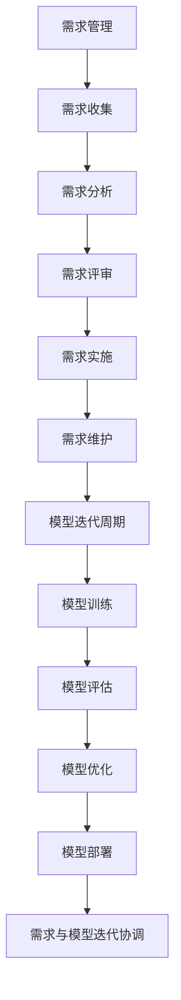

                 


### 文章标题：需求与AI模型迭代周期的协调：大模型应用开发的节奏把控

#### 关键词：
- 需求管理
- AI模型迭代周期
- 大模型应用开发
- 节奏把控
- 项目实战

#### 摘要：
本文深入探讨了需求管理与AI模型迭代周期的协调机制，旨在为大模型应用开发的节奏把控提供理论指导和实践案例。通过分析需求管理的核心概念与流程，AI模型迭代周期的原理与阶段，本文揭示了需求与模型迭代之间的紧密联系，并运用Mermaid流程图和伪代码详细阐述了核心算法原理。文章还结合实际项目案例，探讨了需求与模型迭代协调策略及AI模型迭代周期的优化方法，为大模型应用开发的节奏把控提供了实用的经验和启示。

### 目录大纲

#### 第一部分：基础概念与原理

1. **核心概念与联系**
   - 需求管理概述
   - AI模型迭代周期概述
   - Mermaid流程图

2. **核心算法原理讲解**
   - 需求建模算法
   - AI模型迭代算法
   - 数学模型与公式

#### 第二部分：应用开发实践

3. **项目实战：需求与模型迭代协调策略**
   - 案例背景
   - 开发环境搭建
   - 源代码实现
   - 实战总结

4. **项目实战：AI模型迭代周期优化**
   - 案例背景
   - 优化策略
   - 实战总结

#### 第三部分：综合案例分析

5. **综合案例分析：大模型应用开发节奏把控**
   - 案例选取
   - 分析内容
   - 案例总结

#### 第四部分：展望与未来趋势

6. **展望与未来趋势**
   - AI模型迭代周期的未来发展
   - 需求管理与模型迭代的融合趋势

### 附录

7. **附录**
   - 工具与资源

### Mermaid流程图


### 数学公式

- **需求分析公式**:
  $$D = f(R, C, T)$$

- **模型迭代公式**:
  $$M_{new} = f(M_{current}, \Delta T, D)$$

### 伪代码示例

```python
# 需求建模算法伪代码
def demand_modeling(R, C, T):
    D = calculate_demand(R, C, T)
    return D

# AI模型迭代算法伪代码
def model_iterative(M_current, delta_T, D):
    M_new = train_and_evaluate(M_current, delta_T, D)
    return M_new
```

## 第一部分：基础概念与原理

### 1. 核心概念与联系

#### 需求管理概述

需求管理是指识别、分析、文档化、跟踪和管理项目需求的整个过程。它不仅涉及到客户需求的收集，还包括需求的优先级排序、变更管理和需求实现的过程。

需求管理的流程通常包括以下几个阶段：

1. **需求收集**：通过与用户、利益相关者和其他团队成员的互动，获取对项目的需求。
2. **需求分析**：分析收集到的需求，理解需求的本质，确定需求的优先级和可行性。
3. **需求评审**：对分析后的需求进行评审，确保需求的准确性和完整性。
4. **需求实施**：将评审通过的需求转化为项目计划和任务，分配给相关团队成员。
5. **需求维护**：在整个项目生命周期中，持续跟踪和更新需求，确保需求的实现。

#### AI模型迭代周期概述

AI模型迭代周期是指从模型训练开始，到模型评估和优化的整个过程。它通常包括以下几个阶段：

1. **模型训练**：使用训练数据集来训练模型，使模型学会预测或分类。
2. **模型评估**：使用验证数据集评估模型的性能，确定模型的准确度、召回率等指标。
3. **模型优化**：根据评估结果，对模型进行调整和优化，提高模型性能。
4. **模型部署**：将优化后的模型部署到生产环境中，供实际应用使用。

#### Mermaid流程图

为了更清晰地展示需求管理与AI模型迭代周期之间的联系，我们使用Mermaid绘制了如下流程图：


### 2. 核心算法原理讲解

#### 需求建模算法

需求建模是需求管理的重要环节，它涉及到如何从需求中提取关键信息，构建出适合项目需求的模型。

**需求建模的基本方法**：

1. **需求识别**：识别出项目中的关键需求，包括功能需求、性能需求、安全需求等。
2. **需求分类**：对识别出的需求进行分类，便于后续处理。
3. **需求建模**：使用适当的建模工具和技术，构建出反映需求特点的模型。

**使用伪代码详细阐述一种需求建模算法**：

```python
# 需求建模算法伪代码
def demand_modeling(R):
    D = []
    for r in R:
        if r.is_functional:
            D.append(functional_model(r))
        elif r.is_performance:
            D.append(performance_model(r))
        elif r.is_security:
            D.append(security_model(r))
    return D

# 功能需求模型
def functional_model(r):
    # 实现功能需求模型
    pass

# 性能需求模型
def performance_model(r):
    # 实现性能需求模型
    pass

# 安全需求模型
def security_model(r):
    # 实现安全需求模型
    pass
```

#### AI模型迭代算法

AI模型迭代算法是指如何通过迭代过程优化模型性能，使其更符合需求。

**模型迭代周期各阶段算法原理**：

1. **模型训练**：使用训练数据集对模型进行训练，通过调整模型参数来优化模型性能。
2. **模型评估**：使用验证数据集评估模型性能，包括准确度、召回率等指标。
3. **模型优化**：根据评估结果，调整模型参数，进一步优化模型性能。
4. **模型部署**：将优化后的模型部署到生产环境中，供实际应用使用。

**使用伪代码详细阐述一种模型迭代算法**：

```python
# AI模型迭代算法伪代码
def model_iterative(M, D, V):
    while not convergence:
        M = train_model(M, D)
        performance = evaluate_model(M, V)
        M = optimize_model(M, performance)
    return M

# 模型训练
def train_model(M, D):
    # 实现模型训练过程
    pass

# 模型评估
def evaluate_model(M, V):
    # 实现模型评估过程
    pass

# 模型优化
def optimize_model(M, performance):
    # 实现模型优化过程
    pass
```

#### 数学模型与公式

在需求管理与AI模型迭代过程中，数学模型和公式起着至关重要的作用。以下是两个关键的数学模型与公式：

- **需求分析公式**：
  $$D = f(R, C, T)$$
  其中，\(D\) 表示需求，\(R\) 表示资源，\(C\) 表示成本，\(T\) 表示时间。

  **详细解释与举例**：
  假设一个项目需要在一个月内完成，且资源成本为1000元，时间成本为每天100元。那么，需求分析公式可以用来计算在这个约束条件下能够实现的最大需求。

  $$D = f(1000, 100, 30)$$
  $$D = 1000 - 100 \times 30$$
  $$D = 1000 - 3000$$
  $$D = -2000$$

  这个结果表明，在这个约束条件下，需求无法实现，可能需要调整资源、成本或时间。

- **模型迭代公式**：
  $$M_{new} = f(M_{current}, \Delta T, D)$$
  其中，\(M_{new}\) 表示新的模型，\(M_{current}\) 表示当前模型，\(\Delta T\) 表示时间间隔，\(D\) 表示需求。

  **详细解释与举例**：
  假设当前模型为M1，经过一周（时间间隔\(\Delta T = 7\)天）的训练和需求分析，需求为D1。那么，新的模型M2可以通过以下公式计算得到：

  $$M_{2} = f(M_{1}, 7, D_{1})$$

  这个公式表示，通过一周的训练和需求分析，新的模型M2将基于当前模型M1进行优化，以适应新的需求D1。

通过上述核心概念与原理的讲解，我们为后续的应用开发实践和案例分析奠定了基础。在下一部分，我们将进一步探讨需求与AI模型迭代周期在实际项目中的应用和协调策略。

