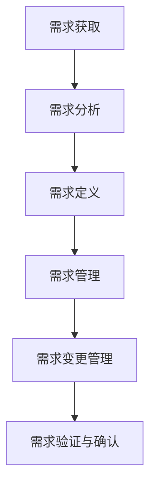
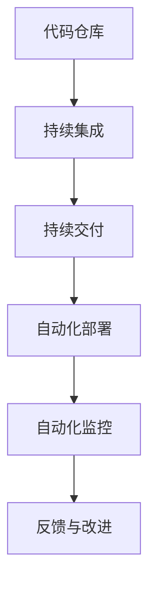
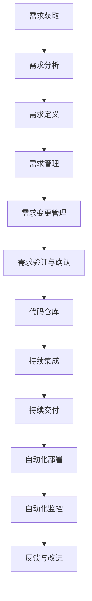

                 

## 引言

在当今快速变化和高竞争的软件行业，交付高质量软件的速度已成为企业成功的关键因素。传统的软件开发模型往往面临着需求变更频繁、交付周期长、沟通不畅等问题，这限制了企业的创新能力和市场响应能力。为了应对这些挑战，需求工程与DevOps的融合逐渐成为提高软件交付效率的重要手段。

### 需求工程的重要性

需求工程是软件开发过程中的核心环节，它涉及如何准确地识别、分析和定义用户需求，以确保软件系统能够满足业务目标和用户期望。需求工程的过程不仅包括获取需求，还涉及需求的整理、分析和验证，以确保需求的完整性、一致性和可行性。传统的需求工程方法往往依赖于人工文档，这不仅效率低下，而且容易出错，难以适应快速变化的市场需求。

### DevOps的崛起

DevOps是一种软件开发和运营的方法论，它强调开发和运维团队之间的协作和集成。通过引入自动化工具和流程，DevOps能够显著提高软件交付的速度和质量。DevOps的核心原则包括持续集成（CI）、持续交付（CD）、基础设施即代码（IaC）、和实时监控等。这些原则使得团队能够更快速地响应需求变更，减少错误，提高软件的可靠性和稳定性。

### 需求与DevOps融合的必要性

需求工程与DevOps的融合，能够在多个层面上提高软件交付的效率。首先，需求工程可以帮助DevOps团队更准确地理解业务需求和用户期望，从而制定更有效的开发和部署策略。其次，DevOps的自动化和持续交付能力可以显著减少需求变更带来的影响，使得需求变更能够更快速地集成和部署。最后，需求与DevOps的融合能够打破传统的组织壁垒，促进不同团队之间的协作，提高整体交付效率。

本文将深入探讨需求工程与DevOps的融合实践，从理论基础到具体方法，再到实际案例，为读者提供全面的指导。通过本文的阅读，读者将能够理解需求工程和DevOps的基本概念，掌握它们融合的方法和工具，并了解如何在实际项目中实施这些方法。

### 关键词

- 需求工程
- DevOps
- 持续集成
- 持续交付
- 自动化
- 团队协作
- 软件质量

### 摘要

本文旨在探讨需求工程与DevOps的融合实践，以加速软件交付周期。首先，介绍了需求工程和DevOps的基本概念及其重要性。接着，分析了需求工程与DevOps融合的理论基础和实践方法，包括需求管理在DevOps中的应用、敏捷开发与DevOps的融合、持续集成与持续部署等。随后，通过具体案例展示了需求与DevOps融合的实施过程和效果。最后，讨论了需求与DevOps融合面临的挑战和未来趋势，为读者提供实践指导和启示。

## 目录大纲设计：《需求与DevOps实践的融合：加速交付周期》

### 第一部分：需求工程与DevOps基础理论

**第1章：需求工程概述**

- **1.1 需求工程的基本概念**：介绍需求工程的基本定义、重要性以及它在软件开发生命周期中的位置。
- **1.2 需求工程的流程**：详细描述需求获取、需求分析、需求定义和需求管理的过程，以及每个阶段的关键任务和成果。
- **1.3 需求工程的方法与工具**：讨论需求工程常用的方法，如用户访谈、问卷调查和用例建模等，并介绍相关的需求管理工具。

**第2章：DevOps文化与实践**

- **2.1 DevOps的理念与价值**：阐述DevOps的核心原则，如持续集成、持续交付和自动化等，并分析这些原则对软件开发和运营带来的价值。
- **2.2 DevOps的关键要素**：介绍DevOps的关键组成部分，包括文化、自动化工具、持续交付和实时监控等。
- **2.3 DevOps的最佳实践**：讨论一些在DevOps实践中广泛认可的最佳方法，如使用版本控制系统、自动化测试和基础设施即代码等。

### 第二部分：需求与DevOps的融合实践

**第3章：需求管理在DevOps中的应用**

- **3.1 需求管理的挑战**：分析在DevOps环境中实施需求管理的难点和挑战。
- **3.2 需求管理在DevOps中的新角色**：探讨需求管理在DevOps中的新角色和职责，以及如何适应这种变化。
- **3.3 需求管理的DevOps工具选择**：介绍适用于DevOps环境的需求管理工具，如JIRA、Confluence等，并分析这些工具的特点和适用场景。

**第4章：DevOps与敏捷开发的融合**

- **4.1 敏捷开发与DevOps的关系**：探讨敏捷开发与DevOps之间的联系和互补性。
- **4.2 敏捷开发实践在DevOps中的应用**：讨论如何在DevOps环境中实施敏捷开发实践，如迭代开发、用户故事和看板等。
- **4.3 敏捷流程在DevOps环境下的优化**：介绍如何对敏捷流程进行优化，以更好地适应DevOps的需求。

**第5章：持续集成与持续部署**

- **5.1 持续集成（CI）的基本原理**：解释持续集成的概念、目的和流程。
- **5.2 持续集成工具的选择与配置**：介绍常用的持续集成工具，如Jenkins、Travis CI等，并讨论如何配置这些工具以实现高效的CI流程。
- **5.3 持续部署（CD）的基本概念**：阐述持续部署的定义、目的和流程。
- **5.4 持续部署工具的选择与实施**：介绍常用的持续部署工具，如Docker、Kubernetes等，并讨论如何选择和实施这些工具。

**第6章：需求与DevOps的融合案例分析**

- **6.1 案例一：电商平台的DevOps实践**：分析一个电商平台的DevOps实践案例，包括需求管理、敏捷开发和持续集成与持续部署的具体实施过程。
- **6.2 案例二：金融行业的需求工程与DevOps融合**：探讨金融行业如何将需求工程与DevOps相结合，以提高软件交付的效率和质量。
- **6.3 案例分析总结与启示**：总结案例中的成功经验和教训，为读者提供实际操作的启示。

### 第三部分：需求与DevOps融合的挑战与未来趋势

**第7章：需求与DevOps融合的挑战**

- **7.1 技术挑战**：讨论在需求与DevOps融合过程中可能遇到的技术障碍，如工具集成、数据一致性和安全性等。
- **7.2 组织文化挑战**：探讨在需求与DevOps融合过程中可能遇到的组织文化障碍，如沟通协调、团队协作和变革管理等。
- **7.3 安全与合规性挑战**：分析需求与DevOps融合对安全性和合规性的影响，并提出相应的解决方案。

**第8章：需求与DevOps融合的未来趋势**

- **8.1 AI在需求与DevOps中的应用**：探讨人工智能在需求工程和DevOps中的应用前景，如自动化需求分析、智能测试和运维等。
- **8.2 DevOps与云计算的结合**：分析DevOps与云计算的结合方式，如云原生应用、自动化基础设施管理和混合云部署等。
- **8.3 需求与DevOps融合的未来展望**：展望需求与DevOps融合的未来发展趋势，如更高效的协作、更智能的自动化和更灵活的架构等。

### 附录

- **附录A：常用需求工程与DevOps工具介绍**：介绍一些常用的需求工程和DevOps工具，包括功能特点和使用方法。
- **附录B：需求与DevOps融合的Mermaid流程图**：提供需求工程流程、DevOps流程以及需求与DevOps融合流程的Mermaid图表。
- **附录C：需求与DevOps融合的算法与数学模型**：介绍一些与需求工程和DevOps相关的算法和数学模型，如持续集成算法和持续部署算法。
- **附录D：项目实战代码示例**：提供实际项目的代码示例，包括需求管理、持续集成和持续部署的代码实现。

通过以上大纲的设计，本文旨在为读者提供一个全面、系统的需求与DevOps融合实践指南，帮助读者在实际项目中更好地应用这些方法，提升软件交付效率。

## 第一部分：需求工程与DevOps基础理论

### 第1章：需求工程概述

#### 1.1 需求工程的基本概念

需求工程（Requirement Engineering，RE）是软件工程中至关重要的一个环节，它涉及识别、分析和定义软件系统的需求。需求不仅包括用户期望的功能特性，还涵盖了性能、可靠性、安全性和用户体验等多个方面。需求工程的核心目标是确保最终软件系统能够准确满足用户和业务需求，从而提高软件质量和用户满意度。

**需求**的定义：需求是用户对系统的一种期望，它可以是功能性的（如计算器需要能够进行加、减、乘、除操作），也可以是非功能性的（如系统需要响应时间小于1秒）。

**需求工程**的定义：需求工程是软件工程的一个分支，它关注于确保软件系统能够准确、及时地实现用户需求。需求工程的过程包括需求获取、需求分析、需求定义和需求管理等多个阶段。

#### 1.2 需求工程的流程

需求工程的流程可以分为以下几个主要阶段：

1. **需求获取**：
   - 与用户、利益相关者进行沟通，了解他们的需求和期望。
   - 使用各种工具和技术，如用户访谈、问卷调查、观察法等，收集需求信息。

2. **需求分析**：
   - 分析收集到的需求，确保它们是完整、一致、可行和可验证的。
   - 通过需求模型（如用例图、功能分解图等）对需求进行组织和表示。

3. **需求定义**：
   - 将分析结果转化为明确的文档，这些文档将成为后续开发和测试的依据。
   - 编写需求规格说明书，详细描述每个需求的内容、优先级和约束条件。

4. **需求管理**：
   - 在整个软件开发过程中，持续跟踪和管理需求。
   - 管理需求的变更，确保变更得到及时、合理地处理。
   - 维护需求的一致性，确保新需求与现有系统功能和架构兼容。

#### 1.3 需求工程的方法与工具

在需求工程中，采用合适的方法和工具能够显著提高需求获取、分析和管理的效率和质量。以下是一些常用的方法与工具：

**方法**：
1. **用户访谈**：
   - 直接与用户交流，了解他们的需求和期望。
   - 需要一定的沟通技巧，以获取用户真实、准确的需求信息。

2. **问卷调查**：
   - 通过在线或纸质问卷，收集用户的需求和反馈。
   - 需要设计合理的问题和选项，以提高问卷的有效性和可靠性。

3. **观察法**：
   - 观察用户在实际工作环境中的操作，以获取真实的用户行为数据。
   - 需要对用户行为有深入的理解，以准确捕捉需求。

4. **用例建模**：
   - 使用用例图来描述系统的功能和用户交互过程。
   - 有助于理解系统的整体功能，便于后续的需求分析和设计。

**工具**：
1. **文档编写工具**：
   - 如Microsoft Word、Google Docs等，用于编写和编辑需求文档。
   - 这些工具便于多人协作和版本控制。

2. **需求管理工具**：
   - 如JIRA、Confluence等，用于需求收集、跟踪和管理。
   - 这些工具提供了丰富的功能，如任务分配、进度跟踪和文档存储等。

3. **建模工具**：
   - 如IBM Rational Software Architect、Enterprise Architect等，用于创建和管理需求模型。
   - 这些工具支持多种建模语言，如UML、BPMN等，有助于需求的可视化和管理。

通过合理运用这些方法和工具，需求工程团队能够更高效地理解用户需求，确保软件系统开发过程中需求的准确性和一致性，从而提高软件交付的质量和用户满意度。

### 第2章：DevOps文化与实践

#### 2.1 DevOps的理念与价值

DevOps是一种结合开发（Development）和运营（Operations）的方法论，旨在通过协作、沟通和自动化，提高软件交付的速度和质量。DevOps的核心思想是打破开发与运维之间的壁垒，实现团队的高效协作和持续交付。

**理念**：
1. **持续集成（CI）**：将代码定期集成到一个共享的代码库中，并通过自动化测试确保代码的质量。
2. **持续交付（CD）**：通过自动化流程，快速、安全地交付软件产品，确保软件的稳定性和可靠性。
3. **基础设施即代码（IaC）**：使用代码来管理基础设施，确保基础设施的一致性和可重复性。
4. **实时监控**：实时监控系统的运行状态，快速发现和解决问题。

**价值**：
1. **缩短交付周期**：通过自动化和持续交付，显著减少软件从开发到部署的时间。
2. **提高软件质量**：自动化测试和持续集成确保代码的质量和稳定性，减少缺陷和错误。
3. **增强团队协作**：DevOps强调跨职能团队的协作，提高整体效率。
4. **提高业务响应速度**：快速交付高质量软件，帮助企业更好地响应市场需求。

#### 2.2 DevOps的关键要素

DevOps的成功实施依赖于以下几个关键要素：

**文化**：
1. **开放与信任**：鼓励团队成员之间的开放沟通和透明度，建立信任关系。
2. **协作与共享**：促进团队间的协作，共享知识和资源。
3. **持续学习与改进**：鼓励团队成员持续学习和改进，以不断提高团队效能。

**自动化**：
1. **自动化构建**：使用自动化工具（如Jenkins、Travis CI等）构建和测试代码。
2. **自动化部署**：使用自动化工具（如Ansible、Puppet等）部署和管理软件。
3. **自动化监控**：使用自动化工具（如Nagios、Zabbix等）监控系统性能和健康状态。

**持续交付**：
1. **持续集成**：将代码定期集成到一个共享的代码库中，并自动化执行测试。
2. **持续部署**：通过自动化流程，快速、安全地交付软件产品。
3. **环境一致性**：确保开发和测试环境与生产环境一致，减少环境差异导致的问题。

**监控**：
1. **实时监控**：实时监控系统的运行状态，及时发现和解决问题。
2. **性能监控**：监控系统性能，确保系统在高负载情况下稳定运行。
3. **安全性监控**：监控系统安全状态，确保系统的安全性和数据保护。

#### 2.3 DevOps的最佳实践

为了实现DevOps的目标，以下是一些最佳实践：

1. **使用版本控制系统**：使用Git等版本控制系统管理代码，确保代码的版本控制和历史记录。
2. **自动化测试**：编写自动化测试用例，确保代码的质量和稳定性。
3. **基础设施即代码**：使用Ansible、Terraform等工具管理基础设施，确保基础设施的一致性和可重复性。
4. **持续集成与持续交付**：使用Jenkins、GitLab CI/CD等工具实现持续集成和持续交付。
5. **实时监控**：使用Nagios、Zabbix等工具实时监控系统性能和健康状态。
6. **团队协作**：使用JIRA、Confluence等工具实现团队协作和任务管理。
7. **培训与文化建设**：定期进行DevOps培训，加强团队成员的技能和知识，建立开放、信任和协作的文化。

通过遵循这些最佳实践，团队可以更好地实现DevOps的目标，提高软件交付的效率和质量。

## 第二部分：需求与DevOps的融合实践

### 第3章：需求管理在DevOps中的应用

#### 3.1 需求管理的挑战

在DevOps环境下，需求管理面临着一系列独特的挑战，这些挑战源于DevOps的高效性和自动化特性。以下是几个主要挑战：

**1. 需求变更频繁**：
   - 在快速交付的环境中，需求变更变得非常常见。这要求需求管理团队能够快速响应变更，同时确保变更不会对项目的整体进度和质量产生负面影响。
   - 需要一种灵活的需求管理方法，能够在需求变更时迅速调整计划和资源。

**2. 需求明确性与稳定性**：
   - DevOps强调快速交付，这往往要求需求具有高度的明确性和稳定性。然而，在实际项目中，需求的明确性和稳定性常常受到业务优先级和市场竞争等因素的影响。
   - 需要确保需求在变更时依然能够保持一致性和可验证性。

**3. 沟通协调困难**：
   - 在传统的开发模式中，需求管理主要涉及开发团队和业务团队之间的沟通。而在DevOps环境中，需求管理需要涉及开发、测试、运维等多个团队。
   - 多团队间的沟通和协调变得更加复杂，需要一种高效的沟通机制来确保各方对需求的统一理解。

**4. 自动化与需求的融合**：
   - DevOps的核心是自动化，但自动化工具和需求管理系统的融合并不总是一帆风顺。需求管理工具通常需要与自动化工具（如CI/CD工具、监控工具等）集成，以便在需求变更时能够自动触发相应的流程。
   - 集成过程中可能遇到的数据同步、流程匹配等问题需要精心设计和管理。

#### 3.2 需求管理在DevOps中的新角色

在DevOps环境中，需求管理的角色和职责发生了显著变化。以下是需求管理在DevOps中的一些新角色：

**1. 需求协调者**：
   - 需求协调者负责协调不同利益相关者之间的需求，确保需求的明确性和一致性。
   - 需求协调者需要具备强大的沟通和协调能力，能够与业务团队、开发团队、测试团队和运维团队进行有效沟通。

**2. 自动化工程师**：
   - 在DevOps环境中，需求管理不仅仅涉及文档编写，还包括与自动化工具的集成。
   - 自动化工程师需要能够编写脚本和配置自动化工具，确保需求管理流程与DevOps自动化流程无缝对接。

**3. 持续交付专家**：
   - 持续交付专家负责确保需求能够快速、安全地交付到生产环境中。
   - 持续交付专家需要熟练掌握CI/CD工具，能够设计和优化持续交付流程，确保需求变更能够迅速集成和部署。

**4. 数据分析师**：
   - 在DevOps环境中，需求数据变得更加重要，需求管理团队需要分析需求数据，以优化需求管理和交付流程。
   - 数据分析师需要能够从需求数据中提取有价值的信息，为决策提供支持。

#### 3.3 需求管理的DevOps工具选择

为了在DevOps环境中实现高效的需求管理，选择合适的工具至关重要。以下是一些常用的需求管理工具：

**1. JIRA**：
   - JIRA是一款功能强大的需求管理工具，可以用于需求跟踪、任务管理、敏捷项目管理等。
   - JIRA支持与多种自动化工具集成，如Jenkins、GitLab CI等，可以自动化执行需求相关的流程。

**2. Confluence**：
   - Confluence是一款团队协作和知识管理工具，可以用于编写和共享文档。
   - Confluence支持与其他需求管理工具集成，如JIRA，可以确保文档和数据的一致性。

**3. Asana**：
   - Asana是一款项目管理工具，可以用于任务分配、进度跟踪和团队协作。
   - Asana支持与JIRA、Confluence等工具集成，可以帮助团队更高效地管理需求和工作流程。

**4. Azure DevOps**：
   - Azure DevOps是微软提供的一套全面的DevOps工具集，包括需求管理、项目跟踪、持续集成和持续交付等功能。
   - Azure DevOps集成了JIRA、GitLab CI等工具，可以提供一套完整的DevOps解决方案。

**5. VersionOne**：
   - VersionOne是一款专业的需求管理和敏捷项目管理工具，可以用于需求规划、优先级排序和需求跟踪。
   - VersionOne支持与JIRA、Confluence等工具集成，可以提供全面的需求管理功能。

在选择需求管理工具时，需要考虑以下因素：

**1. 功能需求**：
   - 根据团队的需求，选择具备所需功能的需求管理工具，如任务管理、需求跟踪、文档编写等。

**2. 集成能力**：
   - 考虑工具的集成能力，确保能够与现有的开发、测试和运维工具无缝集成。

**3. 用户界面**：
   - 选择用户界面友好、易于使用的工具，以提高团队的工作效率和满意度。

**4. 成本效益**：
   - 考虑工具的成本效益，确保工具的投资回报率符合团队的预算和预期。

通过合理选择和使用需求管理工具，团队可以在DevOps环境中实现高效的需求管理，从而提高软件交付的效率和质量。

### 第4章：DevOps与敏捷开发的融合

#### 4.1 敏捷开发与DevOps的关系

敏捷开发（Agile Development）和DevOps是两种不同的软件开发方法论，但它们在提高软件交付效率和质量方面具有互补性。敏捷开发强调快速迭代、持续交付和团队协作，而DevOps则侧重于自动化、持续集成和持续交付。两者之间的关系主要体现在以下几个方面：

**1. 持续交付的协同**：
   - 敏捷开发通过短周期、迭代的方式快速交付可用的软件版本，而DevOps通过自动化工具和流程确保这些版本能够快速、安全地交付到生产环境中。两者协同工作，使得软件交付过程更加高效和可靠。

**2. 团队协作的加强**：
   - 敏捷开发倡导跨职能团队的紧密协作，DevOps则通过打破开发和运维之间的壁垒，促进团队之间的协作。两者的结合可以使得团队能够更好地协同工作，共同推动软件项目的成功。

**3. 持续反馈的闭环**：
   - 敏捷开发通过持续反馈不断改进软件质量和用户满意度，DevOps通过实时监控和自动化测试确保软件的稳定性和可靠性。两者的结合形成了一个反馈闭环，使得团队能够迅速响应需求变更，持续优化软件交付过程。

#### 4.2 敏捷开发实践在DevOps中的应用

在DevOps环境中，敏捷开发的实践得到了进一步的应用和优化。以下是敏捷开发实践在DevOps中的几个关键应用：

**1. 持续集成（CI）**：
   - 持续集成是敏捷开发的核心实践之一，通过将代码定期集成到一个共享的代码库中，自动化执行测试，确保代码的质量和稳定性。
   - 在DevOps环境中，持续集成与自动化测试工具（如Jenkins、GitLab CI等）紧密集成，确保每次代码变更都能快速、自动地集成和测试，从而减少集成风险。

**2. 持续交付（CD）**：
   - 持续交付是DevOps的核心原则之一，通过自动化部署和发布流程，确保软件能够快速、安全地交付到生产环境中。
   - 敏捷开发团队可以通过持续交付实践，将每次迭代的结果快速交付到用户手中，从而快速验证需求的实现效果和用户满意度。

**3. 敏捷看板**：
   - 敏捷看板是一种可视化管理工具，用于展示团队的工作进度和任务状态。
   - 在DevOps环境中，敏捷看板可以与持续集成和持续交付系统结合，实时显示代码状态、测试结果和部署进度，帮助团队更好地协调工作和监控项目状态。

**4. 用户故事地图**：
   - 用户故事地图是一种用于规划和组织需求的工具，通过可视化用户故事及其关系，帮助团队理解需求的整体结构和优先级。
   - 在DevOps环境中，用户故事地图可以与持续集成和持续交付流程结合，确保需求能够快速、高效地实现和交付。

#### 4.3 敏捷流程在DevOps环境下的优化

在DevOps环境中，敏捷流程需要进行一些优化，以更好地适应快速交付和自动化需求。以下是几个关键优化方向：

**1. 自动化测试**：
   - 在敏捷开发中，自动化测试是确保代码质量和交付效率的重要手段。在DevOps环境中，自动化测试需要更加全面和深入，覆盖单元测试、集成测试、性能测试等多个方面。
   - 通过引入持续集成和持续交付工具，可以实现自动化测试的全面覆盖和快速执行，确保每次代码变更都能快速得到反馈和修复。

**2. 持续反馈机制**：
   - 敏捷开发强调持续反馈，DevOps则通过实时监控和用户反馈机制进一步强化了这一理念。
   - 在DevOps环境中，团队需要建立高效的反馈机制，包括用户反馈、测试结果反馈和系统监控反馈，确保团队能够迅速响应需求变更和问题，持续优化软件交付过程。

**3. 环境一致性**：
   - DevOps强调环境一致性，即开发和测试环境与生产环境的一致性。在敏捷开发中，环境一致性是确保快速交付和高质量交付的关键。
   - 团队需要确保开发和测试环境与生产环境的配置一致，通过基础设施即代码（IaC）工具实现环境配置的自动化和一致性。

**4. 团队协作**：
   - 敏捷开发和DevOps都强调团队协作，但在DevOps环境中，团队协作需要更加紧密和高效。
   - 团队需要通过敏捷看板、团队协作工具和实时沟通工具，确保团队成员之间的沟通畅通无阻，协作高效。

通过以上优化，敏捷流程在DevOps环境中能够更好地发挥其优势，确保软件交付的高效和质量。

### 第5章：持续集成与持续部署

#### 5.1 持续集成（CI）的基本原理

持续集成（Continuous Integration，CI）是一种软件开发实践，通过将代码定期集成到一个共享的代码库中，并自动化执行测试，以确保代码的质量和稳定性。CI的基本原理如下：

**1. 定期集成**：
   - 在CI中，代码不是一次性集成，而是在每次代码变更后立即集成。这样可以及时发现和解决集成问题，减少代码积压和集成风险。

**2. 自动化测试**：
   - CI通过自动化测试确保每次集成后的代码都是高质量的。测试包括单元测试、集成测试、性能测试等，确保代码符合预期。

**3. 快速反馈**：
   - CI提供快速的反馈机制，一旦代码集成失败，系统会立即通知开发人员。这样可以快速定位问题并进行修复，减少问题积累。

**4. 环境一致性**：
   - CI确保开发和测试环境与生产环境一致。通过使用容器技术（如Docker）和基础设施即代码（IaC）工具，可以实现环境配置的自动化和一致性。

**5. 集成风险管理**：
   - CI通过频繁集成和自动化测试，减少集成风险。每次集成都像是一次小规模的生产环境模拟，确保代码在实际环境中能够顺利运行。

#### 5.2 持续集成工具的选择与配置

选择合适的持续集成工具对于实现CI至关重要。以下是一些常用的持续集成工具及其配置方法：

**1. Jenkins**：
   - Jenkins是一个开源的持续集成服务器，支持多种插件和功能。
   - 配置方法：
     - 安装Jenkins：从Jenkins官网下载并安装。
     - 配置源代码管理工具（如Git）：在Jenkins中配置Git仓库地址和访问凭据。
     - 添加构建项目：创建一个新的Jenkins项目，选择合适的构建触发器和构建步骤（如执行Shell脚本、运行测试用例等）。

**2. GitLab CI**：
   - GitLab CI是GitLab内置的持续集成工具，支持自动化构建、测试和部署。
   - 配置方法：
     - 在GitLab项目中启用CI/CD：在项目的设置中启用CI/CD。
     - 编写`.gitlab-ci.yml`文件：定义构建、测试和部署流程。
     - 使用GitLab CI/CD插件：GitLab提供多种插件，可以扩展CI/CD功能。

**3. CircleCI**：
   - CircleCI是一个云端的持续集成服务，支持多种编程语言和平台。
   - 配置方法：
     - 注册并创建项目：在CircleCI官网注册并创建新项目。
     - 编写`.circleci/config.yml`文件：定义构建、测试和部署流程。
     - 配置环境变量和依赖：确保CI环境与开发环境一致。

#### 5.3 持续部署（CD）的基本概念

持续部署（Continuous Deployment，CD）是一种自动化部署流程，通过自动化工具将经过测试和验证的代码快速、安全地部署到生产环境中。CD的基本概念如下：

**1. 自动化部署**：
   - CD通过自动化工具（如Docker、Kubernetes等）实现部署流程，减少人为干预，提高部署效率。

**2. 快速反馈**：
   - CD提供快速反馈机制，确保部署过程中的每个步骤都能及时得到验证和反馈。

**3. 灰度部署**：
   - 灰度部署是一种逐步部署新版本的方法，通过将新版本逐步推送到一部分用户，以验证其稳定性和性能。

**4. 部署策略**：
   - 部署策略包括蓝绿部署、金丝雀部署等，这些策略通过将旧版本和新版本并行运行，减少部署风险。

#### 5.4 持续部署工具的选择与实施

以下是一些常用的持续部署工具及其实施方法：

**1. Docker**：
   - Docker是一个容器化平台，可以用于部署和管理应用程序。
   - 实施方法：
     - 编写Dockerfile：定义应用程序的容器镜像。
     - 构建和推送镜像：使用Docker CLI构建和推送镜像。
     - 运行容器：使用Docker运行容器，部署应用程序。

**2. Kubernetes**：
   - Kubernetes是一个开源的容器编排平台，用于自动化部署、扩展和管理容器化应用程序。
   - 实施方法：
     - 部署Kubernetes集群：使用Minikube、Docker Desktop等工具部署本地或集群。
     - 定义部署配置：使用YAML文件定义部署配置，包括容器镜像、容器数量等。
     - 部署应用程序：使用kubectl命令部署应用程序到Kubernetes集群。

**3. Jenkins**：
   - Jenkins可以与Docker和Kubernetes集成，实现持续集成和持续部署。
   - 实施方法：
     - 安装Docker插件：在Jenkins中安装Docker插件。
     - 配置Docker节点：在Jenkins中配置Docker节点，以便构建和部署Docker镜像。
     - 添加部署步骤：在Jenkins项目中添加部署步骤，如执行Docker命令、部署到Kubernetes集群等。

通过使用这些工具，团队可以实现高效的持续集成和持续部署，确保代码质量和交付速度。

### 第6章：需求与DevOps的融合案例分析

#### 6.1 案例一：电商平台的DevOps实践

**背景介绍**：
电商平台是一个高度依赖技术和快速响应市场的行业，因此，其软件交付的效率和质量至关重要。在实施DevOps之前，该电商平台面临着需求变更频繁、交付周期长、沟通不畅等问题，严重影响了业务的发展。

**需求管理的挑战**：
- 需求变更频繁，导致需求文档更新频繁。
- 传统需求管理方法效率低下，难以满足快速交付的需求。
- 开发、测试和运维团队之间的沟通不畅，导致项目进度受阻。

**DevOps实践的步骤**：

**1. 确立DevOps文化**：
   - 建立开放、协作和持续改进的文化，促进团队成员之间的信任和沟通。
   - 定期组织培训和研讨会，提高团队成员对DevOps理念和方法的理解。

**2. 构建自动化基础设施**：
   - 使用基础设施即代码（IaC）工具（如Terraform）构建和管理基础设施，确保基础设施的一致性和可重复性。
   - 部署自动化工具（如Ansible、Puppet），实现基础设施的自动化部署和管理。

**3. 持续集成与持续交付**：
   - 引入Jenkins作为持续集成工具，实现代码的自动化构建和测试。
   - 使用Docker容器化应用程序，确保开发、测试和生产环境的一致性。
   - 引入GitLab CI/CD，实现自动化部署和发布流程。

**4. 团队协作与沟通**：
   - 使用JIRA进行需求跟踪和任务管理，确保所有团队对需求有统一的理解和进度。
   - 使用Confluence进行文档共享和知识管理，促进团队成员之间的信息交流。

**效果分析**：
- 通过DevOps实践，需求变更能够更快地响应和实现，交付周期显著缩短。
- 自动化工具的应用减少了人为错误，提高了软件质量和稳定性。
- 团队协作和沟通得到加强，项目进度得到有效控制。

**案例总结与启示**：
- DevOps实践能够显著提高电商平台的需求响应速度和软件交付效率。
- 自动化工具和持续集成/持续交付流程是DevOps成功的关键。
- 文化变革和团队协作是DevOps成功的基础。

#### 6.2 案例二：金融行业的需求工程与DevOps融合

**背景介绍**：
金融行业对软件系统的安全性、可靠性和合规性有极高要求。在传统开发模式下，金融行业面临需求变更频繁、交付周期长、测试成本高和合规风险等问题。为了提升软件交付效率，某金融企业决定实施需求工程与DevOps的融合。

**需求管理的挑战**：
- 需求变更频繁，导致需求文档更新和测试成本增加。
- 传统需求管理方法难以适应快速交付的要求。
- 需求与开发和测试团队的沟通不畅，导致需求理解和实现偏差。

**DevOps实践的步骤**：

**1. 需求工程优化**：
   - 引入敏捷需求管理方法，通过用户故事和迭代开发快速响应需求变更。
   - 使用需求管理工具（如JIRA）实现需求的跟踪和管理，确保需求变更的及时性和一致性。

**2. DevOps工具选择**：
   - 选择Jenkins和GitLab CI/CD作为持续集成和持续交付工具。
   - 使用Docker和Kubernetes进行容器化部署，确保环境一致性。

**3. 持续集成与持续交付**：
   - 引入持续集成工具，实现代码的自动化构建、测试和部署。
   - 使用灰度部署策略，逐步推广新版本，确保系统稳定性和安全性。

**4. 安全与合规性**：
   - 集成自动化测试工具，确保代码和系统符合安全性和合规性要求。
   - 引入安全审计工具，定期对系统进行安全评估和漏洞扫描。

**效果分析**：
- 通过需求工程与DevOps的融合，需求变更响应速度大幅提高，交付周期显著缩短。
- 自动化工具的应用降低了人为错误，提高了软件质量和稳定性。
- 通过严格的安全和合规性措施，确保了系统的安全性和合规性。

**案例总结与启示**：
- 需求工程与DevOps的融合能够显著提升金融行业软件交付的效率和质量。
- 严格的测试和安全措施是确保金融行业软件系统安全性和合规性的关键。
- 需求工程和DevOps的紧密结合，是实现高效交付和安全性的关键。

#### 6.3 案例分析总结与启示

**电商平台的DevOps实践**和**金融行业的需求工程与DevOps融合**案例，展示了需求工程与DevOps融合在实际项目中的应用和效果。以下是一些主要总结和启示：

**1. DevOps能够显著提高软件交付效率和质量**：
   - 通过自动化工具和流程，实现快速交付和高质量软件。
   - 加强团队协作和沟通，确保需求变更能够及时响应和实现。

**2. 需求工程与DevOps的结合**：
   - 需求工程能够为DevOps提供明确、一致的需求，确保软件交付的准确性和稳定性。
   - DevOps能够为需求工程提供高效的交付流程和工具，确保需求能够快速实现和交付。

**3. 文化变革和培训**：
   - 实施DevOps和需求工程需要团队成员具备相关的技能和知识，因此，文化变革和培训至关重要。
   - 定期进行培训和研讨会，提高团队成员对DevOps和需求工程理念和方法的理解。

**4. 安全和合规性**：
   - 金融行业和电商平台等对安全性和合规性有高要求的行业，在实施DevOps和需求工程时，需要加强安全和合规性措施，确保系统的稳定性和合规性。

通过以上案例，可以看出需求工程与DevOps的融合能够显著提高软件交付的效率和质量，为不同行业提供有效的解决方案。未来，随着技术的不断进步，需求工程与DevOps的融合将更加紧密，为软件开发带来更多的创新和可能性。

### 第7章：需求与DevOps融合的挑战

#### 7.1 技术挑战

在需求与DevOps融合的过程中，技术挑战是不可避免的一部分。这些挑战主要集中在以下几个方面：

**1. 工具集成与兼容性**：
   - 需求管理工具、持续集成工具和持续部署工具的选择和集成是一个复杂的过程。不同的工具之间可能存在兼容性问题，需要花费大量的时间和精力进行配置和调试，以确保它们能够无缝协作。

**2. 数据同步与一致性**：
   - 需求数据在多个系统中的同步和一致性是一个关键问题。特别是在快速变更的环境中，需求数据的更新可能在不同系统中产生延迟或不一致，导致信息孤岛和决策失误。

**3. 自动化程度的限制**：
   - 尽管自动化是DevOps的核心原则，但并非所有需求相关的流程都可以自动化。例如，需求获取和分析过程仍然依赖于人工判断和经验，这限制了自动化工具的适用范围。

**4. 性能与稳定性**：
   - 自动化工具和流程在执行大量操作时可能会对系统性能产生负面影响。同时，自动化流程的稳定性也是一个挑战，自动化脚本和工具在复杂环境下可能会出现错误或崩溃，影响整体交付过程。

**5. 需求变更的应对**：
   - 需求变更在快速交付环境中是常见的，但如何快速、高效地应对需求变更，同时保持系统稳定性和质量，是一个需要解决的难题。特别是在高频率的需求变更下，如何平衡交付速度和质量是一个重要挑战。

#### 7.2 组织文化挑战

组织文化是需求与DevOps融合成功的关键因素之一。在实施过程中，可能会遇到以下组织文化挑战：

**1. 沟通协调困难**：
   - 需求管理、开发、测试和运维等不同团队之间的沟通和协作需要高效和透明。但在一些企业中，团队之间的沟通可能存在障碍，信息不透明，导致需求变更和问题无法及时解决。

**2. 权力分配与职责划分**：
   - DevOps强调跨职能团队的协作，但传统的组织结构和职责划分可能不利于这一理念的实施。如何重新分配权力和明确职责，确保团队成员能够高效协作，是一个重要挑战。

**3. 团队成员的技能和知识**：
   - DevOps和需求工程要求团队成员具备多方面的技能和知识，包括编程、测试、运维等。但在一些企业中，团队成员可能缺乏这些技能，需要通过培训和文化变革来提升。

**4. 文化变革的阻力**：
   - 实施DevOps和需求工程需要进行文化变革，这可能会遇到来自传统观念和习惯的阻力。团队成员可能对新的工作方式和方法感到不适应，需要时间来适应和接受。

#### 7.3 安全与合规性挑战

在需求与DevOps融合的过程中，安全和合规性是至关重要的一环。以下是一些安全与合规性挑战：

**1. 数据保护与隐私**：
   - 在自动化和持续交付的过程中，数据传输和处理的安全性至关重要。特别是在金融、医疗等敏感行业，如何确保数据在传输和存储过程中的安全，防止数据泄露和隐私侵犯，是一个关键挑战。

**2. 系统安全**：
   - 自动化工具和持续集成/持续部署流程可能会引入新的安全风险。例如，未经过严格验证的代码可能被自动部署到生产环境中，导致系统安全漏洞。因此，确保自动化流程的安全性和可靠性是一个重要任务。

**3. 合规性要求**：
   - 不同行业和地区对软件系统的合规性有不同要求。例如，金融行业的合规性要求非常严格，需要确保系统满足监管要求。在需求与DevOps融合过程中，如何确保系统的合规性，是一个需要考虑的问题。

**4. 安全审计与监控**：
   - 需要建立有效的安全审计和监控机制，确保系统能够及时发现和响应安全事件。特别是在自动化和持续交付过程中，如何确保安全事件的及时处理和记录，是一个重要挑战。

通过识别和解决这些技术、组织文化和安全与合规性挑战，团队可以更好地实施需求与DevOps的融合，提高软件交付的效率和质量。

### 第8章：需求与DevOps融合的未来趋势

#### 8.1 AI在需求与DevOps中的应用

人工智能（AI）正在逐步渗透到软件开发和运营的各个领域，需求工程与DevOps的融合也不例外。AI的应用有望带来以下几个方面的变革：

**1. 需求预测与分析**：
   - AI可以通过分析历史需求数据，预测未来需求的变化趋势，帮助团队更好地规划和优先级排序。例如，基于机器学习算法的预测模型可以识别出用户需求中的共性，提前预判可能的需求变更。

**2. 自动化需求获取**：
   - 自然语言处理（NLP）技术的进步使得AI能够自动提取和分析用户的需求文档，生成结构化的需求模型。这不仅提高了需求获取的效率，还减少了人工输入错误的可能性。

**3. 智能测试与验证**：
   - AI可以用于自动化测试，通过分析代码和系统行为，识别潜在的缺陷和漏洞。例如，基于深度学习的测试工具可以自动生成测试用例，并预测测试结果，提高测试的覆盖率和准确性。

**4. 智能运维**：
   - AI在DevOps中的应用不仅可以提高持续集成和持续部署的效率，还可以实现智能化的系统监控和故障检测。通过分析系统日志和性能数据，AI可以自动识别异常情况，并采取相应的措施进行修复。

#### 8.2 DevOps与云计算的结合

云计算的普及为DevOps带来了新的机遇和挑战。DevOps与云计算的结合，使得团队可以更加灵活和高效地管理和部署应用程序。以下是一些关键趋势：

**1. 云原生应用**：
   - 云原生应用设计用于在云计算环境中运行，充分利用云计算的可扩展性和弹性。例如，使用容器化技术（如Docker）和微服务架构，可以使得应用程序更加模块化、可扩展和易于部署。

**2. 自动化基础设施管理**：
   - 云计算平台提供了丰富的自动化工具和API，可以用于自动化基础设施的创建、配置和管理。例如，使用AWS、Azure或Google Cloud提供的IaC工具（如AWS CloudFormation、Azure Resource Manager等），团队可以实现基础设施的自动化部署和管理。

**3. 混合云部署**：
   - 随着业务需求的多样化，越来越多的企业选择在多个云服务提供商之间进行混合云部署。通过DevOps和云计算的结合，团队可以实现跨云的自动化部署和管理，确保业务的连续性和灵活性。

**4. 无服务器架构**：
   - 无服务器架构（Serverless）是一种新兴的云计算模式，通过自动管理服务器，使得团队可以专注于应用程序的开发和部署。DevOps与无服务器架构的结合，使得团队可以实现更高效、更灵活的软件交付。

#### 8.3 需求与DevOps融合的未来展望

随着技术的不断进步，需求与DevOps的融合有望在未来带来更多的创新和变革。以下是一些展望：

**1. 全自动化的需求工程**：
   - 未来，AI和自动化工具将进一步集成到需求工程中，实现全自动化的需求获取、分析和验证。这不仅提高了需求工程效率，还减少了人为错误和沟通成本。

**2. 更加智能的DevOps工具**：
   - DevOps工具将变得更加智能化，能够自动识别和解决部署过程中的问题。通过机器学习和预测分析，这些工具可以提供更准确的部署策略和优化建议。

**3. 跨领域的融合**：
   - 需求与DevOps的融合将不仅仅局限于软件开发领域，还将扩展到物联网、人工智能、区块链等领域。跨领域的融合将推动软件交付的进一步创新和变革。

**4. 持续学习与改进**：
   - 需求与DevOps的融合将强调持续学习与改进，通过不断优化流程和工具，提高软件交付的效率和质量。持续学习将成为团队成功的关键因素。

总之，需求与DevOps的融合是未来软件开发和运营的重要趋势。通过结合人工智能、云计算和自动化工具，团队可以更加高效地响应需求变更，快速交付高质量软件，为业务增长提供强有力的支持。

### 附录A：常用需求工程与DevOps工具介绍

#### A.1 需求工程工具

**1. JIRA**

- **功能特点**：JIRA是一款功能强大的需求管理工具，可以用于需求跟踪、任务管理、敏捷项目管理等。支持缺陷管理、项目管理和报告生成。
- **使用方法**：创建项目、创建并跟踪需求、任务和缺陷，进行迭代规划和报告生成。

**2. Confluence**

- **功能特点**：Confluence是一款团队协作和知识管理工具，可以用于编写和共享文档、进行团队沟通和知识共享。
- **使用方法**：创建和编辑页面、共享文档、设置页面权限、讨论和协作。

**3. IBM Rational Software Architect**

- **功能特点**：Rational Software Architect是一款功能全面的建模工具，支持UML建模、需求管理、项目规划和文档生成。
- **使用方法**：创建UML模型、定义需求、规划项目、生成设计文档。

**4. Enterprise Architect**

- **功能特点**：Enterprise Architect是一款强大的企业级建模工具，支持多种建模语言，如UML、BPMN等，可以用于需求管理、系统设计和项目管理。
- **使用方法**：创建项目、创建和编辑模型、定义需求、生成设计文档。

#### A.2 DevOps工具

**1. Jenkins**

- **功能特点**：Jenkins是一款开源的持续集成服务器，支持多种插件和功能，可以用于自动化构建、测试和部署。
- **使用方法**：安装Jenkins、配置源代码管理工具、创建构建项目和添加构建步骤。

**2. GitLab CI**

- **功能特点**：GitLab CI是GitLab内置的持续集成工具，支持自动化构建、测试和部署，可以通过`.gitlab-ci.yml`文件定义构建和部署流程。
- **使用方法**：在GitLab项目中启用CI/CD、编写`.gitlab-ci.yml`文件、配置环境变量和依赖。

**3. Docker**

- **功能特点**：Docker是一款容器化平台，可以用于部署和管理应用程序，确保应用程序在不同的环境中运行一致。
- **使用方法**：编写Dockerfile、构建和推送容器镜像、运行Docker容器。

**4. Kubernetes**

- **功能特点**：Kubernetes是一款开源的容器编排平台，用于自动化部署、扩展和管理容器化应用程序。
- **使用方法**：部署Kubernetes集群、定义部署配置、使用kubectl命令管理应用程序。

**5. Ansible**

- **功能特点**：Ansible是一款开源的自动化工具，可以用于配置管理、应用部署和自动化任务。
- **使用方法**：编写Ansible Playbook、执行自动化任务、配置和管理基础设施。

**6. Nagios**

- **功能特点**：Nagios是一款开源的监控工具，可以用于监控服务器、网络设备和应用程序的性能和健康状态。
- **使用方法**：安装Nagios、配置监控策略、设置报警和通知。

**7. Zabbix**

- **功能特点**：Zabbix是一款开源的监控和可视化工具，可以用于监控服务器、网络设备和应用程序的性能和健康状态。
- **使用方法**：安装Zabbix、配置监控项、设置报警和通知。

通过合理选择和使用这些工具，团队可以更高效地实现需求工程和DevOps的目标，提高软件交付的效率和质量。

### 附录B：需求与DevOps融合的Mermaid流程图

#### B.1 需求工程流程



**说明**：该流程图展示了需求工程的主要阶段，从需求获取、分析、定义到管理，以及需求变更管理和验证与确认的过程。

#### B.2 DevOps流程



**说明**：该流程图展示了DevOps的核心流程，包括代码仓库管理、持续集成、持续交付、自动化部署、自动化监控以及反馈与改进的循环。

#### B.3 需求工程与DevOps融合流程



**说明**：该流程图结合了需求工程和DevOps的流程，展示了需求从获取到验证与确认，再到DevOps中的代码仓库管理、持续集成、持续交付、自动化部署和监控的整个过程，以及反馈与改进的循环。

通过这些Mermaid流程图，可以清晰地理解需求工程和DevOps的各个阶段以及它们之间的相互关系，从而更好地规划和实施需求与DevOps的融合。

### 附录C：需求与DevOps融合的算法与数学模型

#### C.1 持续集成算法原理

持续集成（CI）的核心在于确保代码库中的每个提交都是可集成的，并快速发现潜在问题。以下是一个简化的持续集成算法原理：

**算法描述**：

1. **初始化**：设置一个代码库，并配置CI服务器。
2. **提交检测**：监视代码库，一旦检测到代码提交，触发CI流程。
3. **构建**：CI服务器从代码库中提取最新的代码并进行编译。
4. **测试**：执行预定义的测试套件，包括单元测试、集成测试等。
5. **报告**：将测试结果报告给开发人员，如失败原因、错误日志等。
6. **决策**：根据测试结果做出决策，如通过则继续集成，否则阻止后续集成。

**伪代码**：

```python
function CI_Process(code_commit):
    build_success = build_code(code_commit)
    if not build_success:
        report_error("Build failed")
        return False
    
    test_results = run_tests()
    if test_results.failed:
        report_error("Tests failed")
        return False
    
    report_success("CI passed")
    return True
```

#### C.2 持续部署算法原理

持续部署（CD）的目的是通过自动化流程，将经过测试和验证的代码部署到生产环境中。以下是一个简化的持续部署算法原理：

**算法描述**：

1. **代码验证**：验证代码库中的代码是否符合部署条件。
2. **构建**：从代码库中提取代码并构建可部署包。
3. **测试**：执行预定义的部署测试，如功能测试、性能测试等。
4. **部署**：将可部署包部署到生产环境中。
5. **监控**：监控部署后的系统性能和健康状态。
6. **反馈**：根据监控结果进行反馈，如发现问题则回滚。

**伪代码**：

```python
function CD_Process(code_commit):
    if not validate_code(code_commit):
        report_error("Code validation failed")
        return False
    
    deploy_package = build_package(code_commit)
    if not deploy_package:
        report_error("Build failed")
        return False
    
    test_results = run_deployment_tests()
    if test_results.failed:
        rollback_deployment()
        report_error("Deployment tests failed")
        return False
    
    deploy_to_production(deploy_package)
    monitor_system_health()
    report_success("Deployment succeeded")
    return True
```

#### C.3 需求管理优化模型

在需求管理过程中，优化模型可以帮助团队更有效地管理和响应需求。以下是一个基于优先级排序和资源分配的需求管理优化模型：

**优化目标**：最大化满足需求的优先级，同时合理分配资源。

**算法描述**：

1. **需求优先级排序**：根据业务价值和紧急程度，对需求进行优先级排序。
2. **资源分配**：根据团队资源和时间，为每个需求分配相应的开发资源。
3. **迭代优化**：通过迭代过程，不断调整需求和资源分配，以最大化满足业务目标。

**数学模型**：

假设有`n`个需求，每个需求具有优先级`P[i]`和所需资源`R[i]`，团队总资源为`T`。

**目标函数**：

最大化总优先级满足度：`Maximize Σ(P[i] * s[i])`

其中`s[i]`为第`i`个需求是否被满足的标志（1表示满足，0表示不满足）。

**约束条件**：

1. 资源限制：`Σ(R[i] * s[i]) <= T`
2. 优先级顺序：`P[i] >= P[j]` 对于所有`i < j`

**求解方法**：

可以使用动态规划或线性规划算法来求解该优化问题。

通过上述算法和数学模型，需求管理团队能够更高效地管理和响应需求，确保团队能够在有限的资源下，最大化满足业务优先级。

### 附录D：项目实战代码示例

#### D.1 持续集成代码实现

以下是一个使用Jenkins实现持续集成的简单示例：

**需求**：每当代码库中有新提交时，自动执行构建和测试。

**工具**：Jenkins、Git、Maven

**步骤**：

1. **安装Jenkins**：从Jenkins官网下载并安装Jenkins。
2. **配置Git仓库**：在Jenkins中添加Git仓库的URL和访问凭据。
3. **创建Jenkins项目**：在Jenkins管理界面创建一个新的项目，选择Git作为源代码管理工具。
4. **配置构建步骤**：
    - 添加构建步骤，如执行Maven构建命令：
      ```bash
      mvn clean install
      ```
    - 添加测试步骤，如执行测试用例：
      ```bash
      mvn test
      ```
5. **配置触发器**：设置Jenkins在每次代码提交时自动触发构建。

**代码实现**：

Jenkinsfile（用于定义构建流程）：

```groovy
pipeline {
    agent any

    stages {
        stage('Build') {
            steps {
                sh 'mvn clean install'
            }
        }
        stage('Test') {
            steps {
                sh 'mvn test'
            }
        }
    }
    post {
        always {
            archiveArtifacts artifacts: 'target/*.jar'
        }
    }
}
```

**配置**：

在Jenkins中，配置Git仓库和构建步骤后，启用构建触发器，设置Jenkins在每次代码提交时自动执行构建。

#### D.2 持续部署代码实现

以下是一个使用Docker和Kubernetes实现持续部署的简单示例：

**需求**：将经过测试的代码部署到Kubernetes集群。

**工具**：Docker、Kubernetes

**步骤**：

1. **构建Docker镜像**：使用Dockerfile构建应用程序的Docker镜像。
2. **上传镜像到容器注册库**：将Docker镜像推送到容器注册库，如Docker Hub。
3. **创建Kubernetes部署配置**：编写Kubernetes部署配置文件，定义部署参数。
4. **部署到Kubernetes集群**：使用Kubernetes CLI或kubectl命令部署应用程序。

**代码实现**：

**Dockerfile**：

```Dockerfile
FROM openjdk:8-jdk-alpine
ARG JAR_FILE=target/*.jar
COPY ${JAR_FILE} app.jar
EXPOSE 8080
ENTRYPOINT ["java","-jar","/app.jar"]
```

**部署配置（deployment.yaml）**：

```yaml
apiVersion: apps/v1
kind: Deployment
metadata:
  name: my-app
spec:
  replicas: 2
  selector:
    matchLabels:
      app: my-app
  template:
    metadata:
      labels:
        app: my-app
    spec:
      containers:
      - name: my-app
        image: my-container-registry/my-app:latest
        ports:
        - containerPort: 8080
```

**部署**：

使用kubectl命令部署应用程序：

```bash
kubectl apply -f deployment.yaml
```

通过上述代码示例，团队可以轻松实现持续集成和持续部署，确保代码从开发到生产环境的高效交付。

#### D.3 需求管理代码实现

以下是一个使用JIRA进行需求管理的简单示例：

**需求**：创建和管理项目需求。

**工具**：JIRA、Confluence

**步骤**：

1. **配置JIRA**：在JIRA中创建项目并配置需求管理功能。
2. **创建需求**：在JIRA中创建需求并分配给团队成员。
3. **跟踪需求**：使用JIRA跟踪需求的状态和进度。
4. **编写用户故事**：在Confluence中编写详细的用户故事，描述需求的具体实现。

**代码实现**：

**JIRA配置**：

在JIRA中，创建项目并启用需求管理功能。创建一个需求看板，用于跟踪需求的状态和进度。

**JIRA需求示例**：

```json
{
  "key": "REQ-001",
  "fields": {
    "project": {
      "key": "PROJECT_A"
    },
    "summary": "实现用户注册功能",
    "description": "描述用户注册功能的详细需求，包括用户名、密码、邮箱等信息。",
    "status": "Open",
    "priority": "High"
  }
}
```

**用户故事（Confluence页面）**：

```markdown
# 用户注册功能

## 功能概述

用户在注册时需要填写用户名、密码和邮箱等信息。

## 用户故事

- 作为用户，我需要输入用户名、密码和邮箱，以便创建账户。
- 作为用户，我需要验证邮箱地址，以确保邮箱的有效性。
- 作为用户，我需要确保用户名和邮箱的唯一性。
```

通过上述代码示例，团队可以有效地使用JIRA和Confluence管理需求，确保需求的跟踪和管理过程高效、透明。

#### D.4 实际案例代码解读与分析

**案例**：一个电商平台的订单管理系统。

**需求**：实现订单创建、支付、状态更新等功能。

**工具**：Java、Spring Boot、MySQL、Jenkins、Kubernetes

**代码解读**：

**1. 订单创建**：

订单创建功能通过Spring Boot API实现。用户提交订单请求，服务端接收并处理请求，将订单信息存储到数据库中。

**订单创建接口**（OrderController.java）：

```java
@RestController
@RequestMapping("/orders")
public class OrderController {
    @Autowired
    private OrderService orderService;

    @PostMapping
    public ResponseEntity<Order> createOrder(@RequestBody OrderRequest request) {
        Order order = orderService.createOrder(request);
        return new ResponseEntity<>(order, HttpStatus.CREATED);
    }
}
```

**订单创建服务**（OrderService.java）：

```java
@Service
public class OrderService {
    @Autowired
    private OrderRepository orderRepository;

    public Order createOrder(OrderRequest request) {
        Order order = new Order();
        // 设置订单属性
        order.setUserId(request.getUserId());
        order.setTotalPrice(request.getTotalPrice());
        order.setStatus(OrderStatus.PENDING);
        return orderRepository.save(order);
    }
}
```

**2. 订单支付**：

支付功能通过第三方支付服务实现，支付成功后，订单状态更新为“已支付”。

**支付回调接口**（PaymentCallbackController.java）：

```java
@RestController
@RequestMapping("/payments/callback")
public class PaymentCallbackController {
    @Autowired
    private PaymentService paymentService;

    @PostMapping
    public ResponseEntity<?> handlePaymentCallback(@RequestBody PaymentCallback callback) {
        paymentService.handlePaymentCallback(callback);
        return new ResponseEntity<>("Payment processed successfully", HttpStatus.OK);
    }
}
```

**支付回调服务**（PaymentService.java）：

```java
@Service
public class PaymentService {
    @Autowired
    private OrderRepository orderRepository;

    public void handlePaymentCallback(PaymentCallback callback) {
        Optional<Order> orderOptional = orderRepository.findById(callback.getOrderId());
        if (orderOptional.isPresent()) {
            Order order = orderOptional.get();
            order.setStatus(OrderStatus.PAID);
            orderRepository.save(order);
        }
    }
}
```

**3. 订单状态更新**：

订单状态更新功能通过定时任务实现，定期检查订单状态，并根据订单状态进行更新。

**订单状态更新任务**（OrderStatusUpdateTask.java）：

```java
@Service
public class OrderStatusUpdateTask {
    @Autowired
    private OrderRepository orderRepository;

    @Scheduled(fixedRate = 60000)
    public void updateOrderStatus() {
        List<Order> orders = orderRepository.findByStatus(OrderStatus.PENDING);
        for (Order order : orders) {
            // 根据订单具体逻辑更新状态
            order.setStatus(OrderStatus.CANCELLED);
            orderRepository.save(order);
        }
    }
}
```

**代码分析**：

该案例展示了电商平台订单管理系统的核心功能实现，包括订单创建、支付回调和订单状态更新。通过Spring Boot API实现，确保了代码的高内聚和低耦合，便于后续的维护和扩展。同时，通过Jenkins和Kubernetes实现持续集成和持续部署，确保系统能够快速、稳定地交付。

**小结**：

通过实际案例代码的解读和分析，可以看出：

1. **模块化设计**：订单管理功能通过模块化设计实现，各模块独立运行，便于管理和扩展。
2. **自动化集成与部署**：使用Jenkins和Kubernetes实现自动化集成和部署，提高了交付效率和质量。
3. **实时监控与更新**：通过定时任务和实时监控，确保订单状态的及时更新和系统的高可用性。

这些实践为需求与DevOps融合提供了有力的支持和实际案例参考，有助于团队在实际项目中更好地应用这些方法。

### 最佳实践 Tips、小结、注意事项、拓展阅读

#### 最佳实践 Tips

**1. 需求管理**：
   - 使用需求管理工具（如JIRA）跟踪和管理需求，确保需求变更的及时性和一致性。
   - 定期与利益相关者沟通，确保需求的理解和实现准确。

**2. 持续集成**：
   - 选择合适的持续集成工具（如Jenkins），并确保其与代码库和测试工具集成。
   - 定期执行自动化测试，确保代码质量和稳定性。

**3. 持续交付**：
   - 使用持续交付工具（如GitLab CI/CD），实现自动化部署和发布。
   - 采用灰度部署策略，逐步推广新版本，降低风险。

**4. 团队协作**：
   - 使用协作工具（如Confluence、JIRA）进行文档共享和任务管理，确保团队沟通畅通。
   - 定期进行团队培训和研讨会，提高团队成员对DevOps和需求工程的理解和技能。

#### 小结

本文通过深入探讨需求工程与DevOps的融合，从理论基础到具体实践，再到实际案例，为读者提供了一个全面的指南。主要结论如下：

- **需求工程与DevOps的融合**可以显著提高软件交付的效率和质量。
- **自动化工具和流程**是实现需求与DevOps融合的关键。
- **团队协作和沟通**是需求与DevOps成功实施的基础。
- **持续学习和改进**是不断优化软件交付流程的重要手段。

#### 注意事项

**1. 文化变革**：
   - 实施需求与DevOps融合需要进行文化变革，建立开放、协作和持续改进的文化。

**2. 技术选型**：
   - 选择合适的需求管理工具、持续集成工具和持续交付工具，确保工具之间的兼容性和集成性。

**3. 安全与合规性**：
   - 在需求与DevOps融合过程中，确保系统的安全性和合规性，采取严格的安全措施。

**4. 培训与支持**：
   - 定期进行团队成员的培训和支持，提高他们对DevOps和需求工程的理解和应用能力。

#### 拓展阅读

**1. 《敏捷实践指南》**：
   - 介绍敏捷开发的方法和实践，有助于理解敏捷开发与DevOps的融合。

**2. 《持续交付：发布可靠软件的系统方法》**：
   - 详细探讨持续交付的原则和实践，提供丰富的案例和工具介绍。

**3. 《DevOps实践指南：从概念到实践》**：
   - 介绍DevOps的理念、工具和最佳实践，为实施DevOps提供指导。

通过以上最佳实践、小结、注意事项和拓展阅读，读者可以更好地理解需求与DevOps融合的关键要点，并在实际项目中取得成功。

