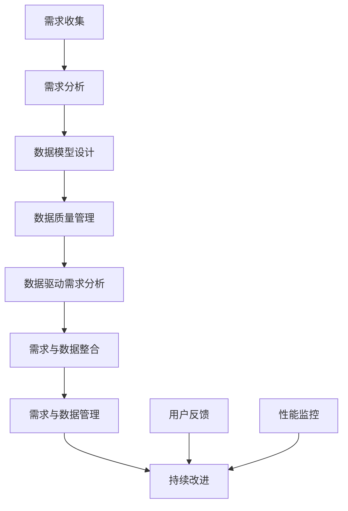

                 


### 《需求与数据管理的整合：大型应用开发的基础》

> 关键词：需求管理、数据管理、数据模型、大型应用开发、需求驱动的数据模型设计、数据质量管理

> 摘要：本文深入探讨了需求与数据管理的整合在大型应用开发中的重要性。首先介绍了需求管理与数据管理的基础知识，然后详细阐述了需求驱动的数据模型设计方法及其在大型应用开发中的应用。最后，通过具体案例分析，展示了需求与数据管理在实践中的难点与解决策略。

---

#### 第1章 引言

##### 1.1 书籍背景与目标

在现代软件工程领域，需求管理（Requirements Management）和数据管理（Data Management）是两大核心环节。需求管理关注如何准确地捕获、记录、追踪和管理用户需求，确保软件开发满足用户期望；数据管理则侧重于如何有效地组织和维护数据，保障数据的准确性、完整性和可用性。随着软件应用的规模和复杂性的不断增加，如何将需求与数据管理有效地整合，成为大型应用开发的关键问题。

本书旨在探讨需求与数据管理的整合方法，特别是针对大型应用开发的场景。我们希望通过以下目标，帮助读者深入理解和掌握这一重要领域：

1. 理解需求管理与数据管理的基本概念和原理。
2. 掌握需求驱动的数据模型设计方法及其应用。
3. 分析大型应用开发中需求与数据管理的实践挑战和解决方案。
4. 提供丰富的案例分析，以实践角度加深对理论的理解。

##### 1.2 大型应用开发中的需求与数据管理

大型应用开发通常具有以下特点：

1. **复杂性**：系统功能繁多，模块复杂，涉及多个团队和利益相关者。
2. **规模**：数据量庞大，需要高效的数据库设计和优化。
3. **变化性**：需求经常变更，需要灵活的管理策略。
4. **依赖性**：系统之间高度依赖，需要稳定的接口和数据流转。

在这种背景下，需求与数据管理的整合至关重要。首先，准确的需求捕获和分析能够指导数据模型的设计，确保数据结构能够满足业务需求。其次，良好的数据管理能够支持高效的数据存储、检索和处理，提升系统性能。最后，需求与数据管理的整合有助于实现需求的及时反馈和调整，提升项目成功率。

##### 1.3 需求与数据管理的关系

需求管理主要关注用户需求的分析、捕获和追踪，确保软件开发满足业务目标。具体包括：

1. **需求捕获**：通过各种手段（如访谈、问卷调查等）收集用户需求。
2. **需求分析**：理解需求，确定需求的优先级和可行性。
3. **需求追踪**：跟踪需求的状态和变更，确保需求的落实。

数据管理则关注数据的组织、存储、处理和维护，确保数据的质量和可用性。具体包括：

1. **数据模型设计**：设计数据结构，满足业务需求。
2. **数据质量管理**：确保数据的准确性、完整性和一致性。
3. **数据库设计**：设计数据库表结构，优化查询性能。

需求与数据管理之间的关系可以概括为以下几点：

1. **需求驱动**：需求是数据模型设计的核心驱动力，需求的变化直接影响到数据模型的设计和调整。
2. **相互依赖**：数据管理为需求实现提供数据支持，需求管理则为数据管理提供业务逻辑和规则指导。
3. **协同优化**：需求与数据管理的整合能够优化系统的整体性能和用户体验。

本章作为引言，为后续章节的深入探讨奠定了基础。在接下来的章节中，我们将详细讨论需求管理的基础知识、数据管理的方法和实践，以及需求与数据整合的具体方法。

---

#### 第2章 需求管理基础

##### 2.1 需求管理的定义与意义

需求管理是软件工程中的一个关键环节，它涉及对用户需求进行有效的识别、分析、记录、跟踪和管理。需求管理不仅关乎软件项目的成功，更是确保软件产品能够满足用户期望和业务需求的基石。以下是需求管理的几个关键定义和其重要性：

**需求管理的定义：**

- **需求捕获**：通过访谈、问卷调查、用户故事等方式，从用户和利益相关者那里获取需求。
- **需求分析**：分析捕获到的需求，确定需求的优先级、可行性和一致性。
- **需求记录**：将分析后的需求以某种形式记录下来，通常使用需求文档、用户故事地图等。
- **需求跟踪**：跟踪需求的状态和变更，确保需求得到有效实现和管理。

**需求管理的意义：**

1. **确保项目方向正确**：通过明确和记录用户需求，确保开发团队和用户对项目目标有共同的理解和预期，减少项目偏离目标的概率。
2. **降低项目风险**：需求管理的有效性能够降低项目中的不确定性，提前识别和解决潜在的问题，减少项目风险。
3. **提高客户满意度**：通过及时响应用户需求变更，提供高质量的软件产品，提高用户满意度和忠诚度。
4. **优化资源利用**：明确的需求能够帮助项目团队更好地分配资源和时间，提高开发效率。

##### 2.2 需求收集的方法与技术

需求收集是需求管理的重要环节，直接影响到后续的需求分析质量和效率。以下是几种常用的需求收集方法和相关技术：

1. **用户访谈**：
   - **方法**：通过与用户面对面交流，了解用户的实际需求、使用习惯和偏好。
   - **技术**：访谈指南、录音笔、笔记记录等。
   - **优点**：深入了解用户需求，获取详细和真实的信息。
   - **缺点**：耗时较长，用户可能提供不全面的信息。

2. **问卷调查**：
   - **方法**：通过设计问卷，收集用户的需求和意见。
   - **技术**：在线问卷平台、纸质问卷等。
   - **优点**：覆盖面广，数据量大，便于分析和统计。
   - **缺点**：用户参与度不高，可能存在误导信息。

3. **用户故事地图**：
   - **方法**：通过绘制用户故事地图，展示用户的不同角色和交互场景。
   - **技术**：用户故事卡片、白板、思维导图等。
   - **优点**：直观展示用户需求，促进团队成员对需求的理解和共识。
   - **缺点**：需要一定的时间进行整理和绘制。

4. **用户观察**：
   - **方法**：通过观察用户在实际工作环境中的操作，了解用户的需求和痛点。
   - **技术**：观察记录表、视频录像等。
   - **优点**：获取第一手用户操作数据，真实反映用户需求。
   - **缺点**：用户可能察觉到观察者，行为可能发生变化。

5. **原型设计**：
   - **方法**：通过创建软件原型或界面原型，获取用户的反馈和需求。
   - **技术**：交互设计工具、原型设计软件等。
   - **优点**：直观展示软件功能，便于用户提出具体需求和建议。
   - **缺点**：需要一定的技术背景，原型设计可能不完整。

##### 2.3 需求分析的过程与工具

需求分析是需求管理的核心环节，其主要目标是理解用户需求，并将其转化为具体的软件功能。以下是需求分析的一般过程和常用工具：

**需求分析的过程：**

1. **需求获取**：通过前述需求收集方法获取初步需求。
2. **需求整理**：对获取的需求进行整理，去除重复和不一致的需求。
3. **需求分类**：将需求按类型（功能需求、性能需求、安全需求等）进行分类。
4. **需求建模**：使用需求建模技术（如用例图、功能图、状态图等）来表示需求。
5. **需求验证**：验证需求的正确性和可行性，确保需求能够实现。

**需求分析的常用工具：**

1. **需求管理工具**：
   - **工具名称**：JIRA、Confluence、Microsoft Azure DevOps等。
   - **功能**：需求跟踪、文档管理、协作沟通等。
   - **优点**：集中管理需求，便于团队协作和需求变更控制。

2. **建模工具**：
   - **工具名称**：Visio、Microsoft Visio、Lucidchart等。
   - **功能**：绘制用例图、流程图、状态图等。
   - **优点**：直观展示需求，便于团队理解和沟通。

3. **敏捷需求管理工具**：
   - **工具名称**：JIRA、Trello、Asana等。
   - **功能**：敏捷项目管理、用户故事管理、任务跟踪等。
   - **优点**：支持敏捷开发方法，灵活调整需求。

##### 2.4 需求管理的最佳实践

为了确保需求管理的有效性和效率，以下是一些最佳实践：

1. **建立需求管理流程**：制定清晰的需求管理流程，明确各个阶段的工作内容和责任人。
2. **持续沟通与反馈**：定期与用户和利益相关者沟通，及时获取反馈和需求变更。
3. **文档化管理**：使用需求管理工具记录和跟踪需求，确保文档的完整性和可追溯性。
4. **优先级排序**：对需求进行优先级排序，确保重要的需求得到及时实现。
5. **风险管理**：识别和管理需求变更带来的风险，提前制定应对策略。
6. **培训与团队协作**：为团队成员提供需求管理的培训，促进跨团队的协作和理解。

通过以上实践，可以提升需求管理的效率和效果，为后续的软件开发奠定坚实的基础。

---

#### 第3章 数据管理基础

##### 3.1 数据管理的定义与重要性

数据管理（Data Management）是确保数据在组织中有效、一致、准确和安全使用的过程。它不仅涉及数据的存储、检索和处理，还包括数据的质量、安全和合规性。以下是数据管理的定义及其重要性：

**数据管理的定义：**

- **数据存储**：确保数据在存储设备上的存储和管理，保证数据的安全和完整性。
- **数据检索**：提供高效的查询和检索机制，使数据能够快速、准确地被访问和使用。
- **数据处理**：包括数据的转换、清洗、聚合等操作，以满足不同业务需求。
- **数据质量**：确保数据的准确性、完整性、一致性和可靠性，以满足业务决策和报告的需求。
- **数据安全**：保护数据免受未经授权的访问、篡改和泄露。
- **数据合规性**：遵守相关法律法规和数据保护标准，确保数据的合法使用。

**数据管理的重要性：**

1. **支持业务决策**：高质量的数据能够为管理层提供准确的业务信息，支持数据驱动的决策。
2. **提高运营效率**：通过有效的数据管理，可以减少数据冗余和重复工作，提高业务流程的效率。
3. **确保数据完整性**：数据管理的原则和方法能够确保数据的一致性和完整性，避免数据错误和缺失。
4. **增强数据安全性**：通过数据加密、访问控制等技术手段，保护数据不被未授权访问或泄露。
5. **符合法规要求**：良好的数据管理能够确保组织符合数据保护法规和行业标准，降低法律风险。
6. **支持创新**：数据是现代企业的重要资产，有效的数据管理能够支持新的业务模式和产品创新。

##### 3.2 数据模型与数据架构

数据模型（Data Model）是用于描述数据结构和数据之间关系的一种抽象表示。数据架构（Data Architecture）则是数据模型在系统中的实现和部署。以下是数据模型和数据架构的基本概念及其重要性：

**数据模型的基本概念：**

1. **概念数据模型**：描述数据的逻辑结构和关系，独立于具体的数据库管理系统（DBMS）。常用的概念数据模型包括实体-关系模型（ER Model）、统一建模语言（UML）等。
2. **逻辑数据模型**：描述数据的逻辑结构和关系，与具体的DBMS相关联。如关系数据模型（Relational Model）、面向对象数据模型（Object-Oriented Model）等。
3. **物理数据模型**：描述数据在物理存储介质上的具体实现，包括数据库表、索引、存储过程等。

**数据架构的基本概念：**

1. **数据架构设计**：确定数据的组织结构、存储方式和访问策略，以满足业务需求。数据架构设计包括数据存储层、数据集成层、数据服务层等。
2. **数据架构文档**：详细记录数据架构的设计和实现，包括数据模型、数据流程、数据安全策略等。
3. **数据架构维护**：随着业务需求的变更和技术的进步，持续优化和调整数据架构，确保其适应性和可持续性。

**数据模型和数据架构的重要性：**

1. **数据的一致性和完整性**：通过定义一致的数据模型和架构，确保数据在组织内的一致性和完整性。
2. **数据的可访问性和可扩展性**：良好的数据架构设计能够提供高效的数据访问和扩展机制，支持业务增长和变化。
3. **数据的安全性和合规性**：数据模型和架构设计应考虑数据的安全性和合规性，保护数据不被非法访问和滥用。
4. **数据的易用性和效率**：通过优化数据模型和架构，提高数据查询和处理效率，支持高效的业务运营。
5. **数据治理和可持续发展**：数据模型和架构的设计和实施应考虑数据治理和可持续发展，确保数据价值的最大化。

##### 3.3 数据质量管理与治理

数据质量管理（Data Quality Management）和数据治理（Data Governance）是确保数据质量和合规性的重要手段。以下是数据质量管理与治理的基本概念及其重要性：

**数据质量管理的基本概念：**

1. **数据质量**：数据质量是指数据在准确性、完整性、一致性、及时性、可靠性和可用性方面的表现。
2. **数据质量度量**：用于评估数据质量的指标，如数据完整性率、错误率、响应时间等。
3. **数据质量改进**：通过数据清洗、标准化、验证等手段，持续提高数据质量。

**数据治理的基本概念：**

1. **数据治理**：数据治理是指组织内部关于数据的管理框架、政策和流程，以确保数据的合规性、安全性和价值。
2. **数据治理组织**：负责制定和实施数据治理策略，监督和指导数据管理的具体执行。
3. **数据治理框架**：包括数据治理委员会、数据质量团队、数据所有权和责任分配等。

**数据质量管理与治理的重要性：**

1. **数据可信性**：高质量的数据能够提高决策的可信性，减少错误决策的风险。
2. **合规性**：数据治理确保组织遵守相关法规和行业标准，降低法律风险。
3. **数据价值最大化**：通过数据质量管理与治理，提高数据的利用率和商业价值。
4. **业务效率**：良好的数据质量能够提高业务流程的效率和准确性，减少数据错误和重复工作。
5. **风险控制**：数据质量管理与治理有助于识别和降低数据相关的风险，如数据泄露、数据丢失等。

##### 3.4 数据库设计与性能优化

数据库设计（Database Design）是数据管理的重要环节，涉及数据库表结构、索引、视图等的设计。性能优化（Performance Optimization）则是提升数据库查询和数据处理速度的关键。以下是数据库设计与性能优化的一些基本概念：

**数据库设计的基本概念：**

1. **实体关系模型（ER Model）**：用于描述数据库中的实体及其关系，是数据库设计的基础。
2. **关系数据库设计**：基于关系数据模型，设计数据库表、字段、主键和外键等。
3. **规范化**：通过规范化减少数据冗余和重复，提高数据的一致性。

**性能优化的基本概念：**

1. **查询优化**：通过调整查询语句、索引策略等，提高查询速度。
2. **索引优化**：合理创建和使用索引，加快数据检索速度。
3. **缓存机制**：使用缓存技术减少数据库负载，提高系统响应速度。
4. **数据库分区**：将大型数据库拆分为多个小分区，提高查询和操作的效率。

**数据库设计与性能优化的重要性：**

1. **数据存储效率**：良好的数据库设计能够减少数据冗余，提高存储效率。
2. **数据处理速度**：优化的查询和索引策略能够提高数据库查询和数据处理速度。
3. **系统稳定性**：合理的数据库架构和性能优化措施能够提高系统的稳定性和可靠性。
4. **可扩展性**：良好的数据库设计能够支持系统的扩展和升级，适应业务增长。

通过上述章节的讨论，我们了解了数据管理的基础知识，包括其定义、重要性、数据模型与架构、数据质量管理与治理，以及数据库设计与性能优化。这些基础知识是进行大型应用开发需求与数据管理整合的重要前提。在接下来的章节中，我们将进一步探讨需求与数据整合的方法和实践，帮助读者更好地理解和应用这些概念。

---

#### 第4章 需求与数据整合的方法

##### 4.1 整合需求与数据的挑战

在大型应用开发过程中，整合需求与数据是一个复杂且具有挑战性的任务。主要挑战包括以下几个方面：

1. **需求变更的频繁性**：用户需求经常变更，这要求数据模型能够灵活适应这些变化。
2. **数据规模和复杂性**：随着数据量的增长和数据类型的多样化，数据模型的设计和维护变得更加复杂。
3. **数据一致性**：确保所有需求都能在数据模型中得到一致体现，避免数据冗余和冲突。
4. **性能和可扩展性**：在保证数据一致性的同时，还需要确保系统的高性能和可扩展性。
5. **数据隐私和安全**：随着数据隐私和安全法规的日益严格，如何在满足需求的同时保障数据安全成为一大挑战。

##### 4.2 需求驱动的数据模型设计

需求驱动的数据模型设计是一种以需求为导向的数据建模方法，其主要目标是确保数据模型能够完全满足业务需求。以下是需求驱动的数据模型设计的方法和步骤：

**需求驱动的数据模型设计方法：**

1. **需求分析**：首先进行详细的需求分析，获取用户需求，并确定需求的优先级和可行性。
2. **数据建模**：根据需求分析的结果，设计数据模型，包括实体关系模型、关系数据模型等。
3. **模型验证**：验证数据模型是否满足所有需求，包括完整性、一致性和正确性。
4. **模型优化**：对数据模型进行优化，包括规范化、索引优化等，以提高系统性能和可维护性。

**需求驱动的数据模型设计步骤：**

1. **需求捕获**：使用多种需求收集方法（如用户访谈、问卷调查、用户故事地图等）获取用户需求。
2. **需求整理**：对收集到的需求进行整理和分类，去除重复和不一致的需求。
3. **需求建模**：使用概念数据模型（如ER模型）表示需求，并逐步细化到逻辑数据模型和物理数据模型。
4. **模型验证**：通过评审、测试等方式验证数据模型是否满足需求，并确保模型的一致性和完整性。
5. **模型优化**：对数据模型进行优化，包括索引设计、规范化处理等，以提高系统的性能和可扩展性。

**需求驱动的数据模型设计示例：**

假设一个电商应用需要设计一个用户评论系统，以下是需求驱动的数据模型设计过程：

1. **需求捕获**：
   - 需求1：用户可以对商品进行评论。
   - 需求2：评论需要包含标题、内容和评分。
   - 需求3：每个评论需要关联到具体的商品和用户。

2. **需求整理**：
   - 去除重复和不一致的需求。
   - 确定需求的优先级。

3. **需求建模**：
   - 设计概念数据模型（ER Model）：包括用户（User）、商品（Product）和评论（Comment）三个实体，以及用户与商品、评论与商品之间的关联关系。
   - 设计逻辑数据模型（关系数据模型）：创建评论表（Comments），包含评论ID、用户ID、商品ID、评论标题、评论内容、评分等字段。

4. **模型验证**：
   - 通过评审和测试，确保模型满足所有需求。
   - 确保评论表的字段设计合理，关联关系正确。

5. **模型优化**：
   - 为评论表设计索引，以提高查询速度。
   - 对评论表进行规范化处理，减少数据冗余。

通过上述步骤，我们可以设计出一个满足电商应用需求的用户评论数据模型。这个过程强调了需求分析的重要性，并通过逐步细化数据模型，确保数据模型能够准确反映用户需求。

##### 4.3 数据驱动需求分析

数据驱动需求分析是一种以数据为导向的需求分析方法，通过分析现有数据来发现潜在的需求。这种方法主要适用于已经积累了大量数据的场景，以下是数据驱动需求分析的方法和步骤：

**数据驱动需求分析方法：**

1. **数据采集**：收集与业务相关的数据，包括交易数据、用户行为数据等。
2. **数据分析**：使用数据分析工具（如数据挖掘、机器学习等）对数据进行分析，发现潜在的业务需求和趋势。
3. **需求生成**：根据数据分析结果，生成新的需求或调整现有需求。
4. **需求验证**：通过用户反馈和市场调研，验证数据驱动生成的新需求的有效性和可行性。

**数据驱动需求分析步骤：**

1. **数据采集**：
   - 确定数据源，如数据库、日志文件等。
   - 收集与业务相关的数据，包括交易数据、用户行为数据等。

2. **数据分析**：
   - 使用数据分析工具进行数据预处理，如数据清洗、转换、归一化等。
   - 应用数据挖掘和机器学习算法，分析数据中的模式和趋势。

3. **需求生成**：
   - 根据数据分析结果，识别潜在的业务需求和改进机会。
   - 生成新的需求或调整现有需求，以优化业务流程和用户体验。

4. **需求验证**：
   - 通过用户反馈、市场调研等方式，验证新需求的有效性和可行性。
   - 对需求进行优先级排序，确定实施计划。

**数据驱动需求分析示例：**

假设一个电商应用希望优化其推荐系统，以下是数据驱动需求分析过程：

1. **数据采集**：
   - 收集用户浏览、购买、收藏等行为数据。
   - 收集商品属性数据，如价格、分类、品牌等。

2. **数据分析**：
   - 使用聚类算法分析用户行为数据，识别不同的用户群体。
   - 使用协同过滤算法分析商品关系，发现用户可能感兴趣的商品。

3. **需求生成**：
   - 根据用户群体的特征，生成个性化推荐需求。
   - 根据商品关系，生成关联推荐需求。

4. **需求验证**：
   - 通过用户测试和A/B测试，验证个性化推荐和关联推荐的有效性。
   - 根据验证结果，调整推荐算法和推荐策略。

通过上述步骤，我们可以利用现有数据，发现并实现优化推荐系统的需求。这种方法不仅能够发现潜在的业务需求，还可以提高需求分析的准确性和效率。

##### 4.4 需求与数据整合的流程

需求与数据整合是一个系统性的过程，涉及多个环节和角色的协作。以下是需求与数据整合的一般流程：

1. **需求捕获**：使用多种需求收集方法，获取用户需求。
2. **需求整理**：对收集到的需求进行分类、排序和优先级确定。
3. **需求建模**：根据需求整理结果，设计数据模型。
4. **数据模型验证**：验证数据模型是否满足需求，确保模型的一致性和完整性。
5. **需求与数据整合**：将需求融入数据模型，确保数据模型能够完全满足业务需求。
6. **数据质量管理**：确保数据模型中的数据质量，包括准确性、完整性、一致性等。
7. **系统集成**：将需求与数据整合后的系统部署到生产环境，进行集成测试和性能优化。
8. **持续改进**：通过反馈和改进，优化需求与数据的整合过程，提升系统质量。

通过以上步骤，我们可以实现需求与数据的有效整合，确保大型应用开发的成功。

在下一章中，我们将通过具体的实践案例，进一步探讨需求与数据整合的方法和策略，帮助读者更好地理解和应用这些理论。

---

#### 第5章 需求与数据整合的实践

##### 5.1 需求与数据整合的项目案例

在本章节中，我们将通过一个实际的电商应用开发案例，来探讨需求与数据整合的具体实施过程。该项目案例涉及多个关键模块，包括用户管理、商品管理、订单管理和推荐系统。以下是案例背景、需求和数据整合的详细步骤。

**案例背景：**

一个新兴的电商平台需要开发一个集成的电子商务系统，以支持用户注册、商品浏览和购买、订单处理以及个性化推荐等功能。系统需要高效的数据管理机制，以确保数据的一致性和安全性。

**需求：**

1. **用户管理**：
   - 用户注册：用户可以注册账号，提供基本信息。
   - 用户登录：用户可以使用账号登录系统。
   - 用户信息更新：用户可以更新个人信息。

2. **商品管理**：
   - 商品添加：管理员可以添加商品信息，包括名称、描述、价格等。
   - 商品查询：用户可以查询商品信息。
   - 商品分类：商品按照分类展示，便于用户浏览。

3. **订单管理**：
   - 订单创建：用户可以创建订单，选择商品并提交订单。
   - 订单查询：用户可以查询订单状态。
   - 订单处理：管理员可以处理订单，包括发货和退款。

4. **推荐系统**：
   - 用户行为分析：分析用户的浏览和购买行为，推荐相关商品。
   - 商品推荐：根据用户的历史行为和偏好，推荐个性化商品。

**数据整合步骤：**

1. **需求捕获**：
   - 通过用户访谈、问卷调查和原型设计，获取详细的需求。
   - 分析和整理收集到的需求，确定需求的优先级和可行性。

2. **需求建模**：
   - 设计用户管理、商品管理、订单管理和推荐系统的数据模型。
   - 创建用户表（User）、商品表（Product）、订单表（Order）和推荐表（Recommendation）。

3. **数据模型验证**：
   - 通过评审和测试，验证数据模型是否满足所有需求，确保数据的一致性和完整性。

4. **需求与数据整合**：
   - 将用户需求融入到数据模型中，确保数据模型能够完全满足业务需求。
   - 为每个模块设计相应的数据库表结构，并创建必要的索引。

5. **数据质量管理**：
   - 确保数据的准确性、完整性和一致性，通过数据清洗和标准化处理。
   - 制定数据备份和恢复策略，确保数据的安全性和可靠性。

6. **系统集成**：
   - 将各个模块集成到一起，进行集成测试，确保系统功能完整性和性能。
   - 部署到生产环境，进行实际的业务运行。

7. **持续改进**：
   - 收集用户反馈，持续优化需求与数据整合过程。
   - 定期进行数据质量检查和系统性能优化。

通过上述步骤，我们可以将需求与数据整合应用到电商应用开发中，确保系统的稳定性和高效性。

##### 5.2 需求与数据整合的步骤

在大型应用开发中，需求与数据整合的具体步骤如下：

1. **需求分析**：
   - 通过访谈、问卷调查和用户故事地图等手段，获取详细的需求。
   - 对收集到的需求进行整理、分类和优先级排序。

2. **数据模型设计**：
   - 根据需求分析结果，设计数据模型，包括实体关系模型和关系数据模型。
   - 确保数据模型能够满足所有业务需求，并具有较好的可扩展性。

3. **数据模型验证**：
   - 通过评审、测试和用户反馈，验证数据模型的一致性和完整性。
   - 根据反馈调整和优化数据模型。

4. **数据整合**：
   - 将需求融入到数据模型中，创建数据库表结构，并设置必要的索引和约束。
   - 确保数据模型能够支持所有需求，并具有良好的性能。

5. **数据质量管理**：
   - 实施数据清洗、标准化和数据备份策略，确保数据的准确性、完整性和一致性。
   - 定期进行数据质量检查和问题修复。

6. **系统集成**：
   - 将各个模块集成到一起，进行集成测试，确保系统功能完整性和性能。
   - 部署到生产环境，进行实际的业务运行。

7. **持续改进**：
   - 通过用户反馈和性能监控，持续优化需求与数据整合过程。
   - 定期进行数据质量检查和系统性能优化。

通过上述步骤，我们可以有效地实现需求与数据的整合，确保大型应用开发的成功。

##### 5.3 需求与数据整合的难点与解决

在需求与数据整合过程中，可能会遇到以下难点：

1. **需求变更频繁**：需求变更可能导致数据模型频繁调整，影响系统的稳定性和性能。
   - **解决方案**：建立需求变更管理流程，及时记录和评估变更的影响，并制定应对策略。

2. **数据一致性保障**：确保所有需求都能在数据模型中得到一致体现，避免数据冗余和冲突。
   - **解决方案**：采用数据同步和一致性检查机制，确保数据模型的一致性。

3. **数据性能优化**：在满足数据一致性的同时，还需要确保系统的高性能和可扩展性。
   - **解决方案**：采用索引优化、缓存机制和数据库分区等技术，提高系统性能。

4. **数据安全和隐私**：随着数据隐私和安全法规的日益严格，保障数据安全成为一大挑战。
   - **解决方案**：实施数据加密、访问控制和数据备份策略，确保数据的安全和合规性。

5. **跨部门协作**：需求与数据整合涉及多个部门（如开发、运维、业务等），协调和沟通是关键。
   - **解决方案**：建立跨部门协作机制，明确职责和流程，确保项目顺利进行。

通过以上解决方案，可以有效克服需求与数据整合过程中的难点，提高项目成功率。

通过本章节的实践案例和具体步骤，我们深入探讨了需求与数据整合的方法和实践。在实际应用中，需要根据具体项目需求和环境，灵活调整和优化整合过程，以确保系统的稳定性和高效性。

---

#### 第6章 大型应用开发的需求与数据管理

##### 6.1 大型应用开发的特点与需求

大型应用开发通常具有以下几个显著特点：

1. **复杂性高**：大型应用往往包含众多的模块和功能，系统架构复杂，需要高效的协同开发和维护。
2. **规模庞大**：数据量和用户规模巨大，系统需要处理海量数据和并发请求，保证高性能和高可用性。
3. **变化频繁**：业务需求频繁变更，系统需要具备灵活的适应性，快速响应用户需求。
4. **依赖性强**：不同模块和子系统之间存在复杂的依赖关系，任何一个环节的故障都可能影响整个系统的稳定运行。

在这些特点的背景下，大型应用开发对需求与数据管理提出了更高的要求：

1. **需求管理**：需要建立完善的需求管理流程，确保需求的准确捕获、分析和追踪，降低项目风险。
2. **数据管理**：需要建立高效的数据管理架构，保障数据的一致性、完整性和安全性，支持数据的快速检索和处理。

##### 6.2 大型应用开发中的数据管理挑战

大型应用开发中的数据管理面临着一系列挑战：

1. **数据规模和复杂性**：数据量庞大且复杂，需要高效的数据库设计和优化策略，以支持高并发和低延迟的数据处理。
2. **数据一致性**：确保数据在不同系统之间的一致性，尤其是在分布式环境中，防止数据冲突和冗余。
3. **数据安全性**：随着数据隐私和安全法规的日益严格，需要实施严格的数据保护措施，防止数据泄露和未经授权的访问。
4. **数据质量管理**：在庞大的数据量下，确保数据的准确性、完整性和一致性，是数据管理的重要任务。
5. **性能优化**：优化数据库查询和数据处理，提高系统性能和响应速度，以满足大规模业务需求。

##### 6.3 需求与数据管理在大规模应用开发中的应用

在大规模应用开发中，需求与数据管理发挥着至关重要的作用：

1. **需求管理**：
   - **需求捕获**：采用多种需求收集方法，确保需求的全面性和准确性。
   - **需求分析**：深入分析用户需求，确定需求的优先级和可行性，形成详细的需求文档。
   - **需求追踪**：建立需求追踪机制，确保需求在整个开发过程中的落实和变更管理。

2. **数据管理**：
   - **数据模型设计**：根据需求设计数据模型，确保数据结构能够满足业务需求。
   - **数据库设计**：设计合理的数据库架构，包括表结构、索引、分区等，优化查询性能。
   - **数据质量管理**：实施数据质量检查和治理措施，确保数据的准确性、完整性和一致性。
   - **数据安全与合规**：实施严格的数据保护策略，遵守数据隐私和安全法规。

##### 6.4 大型应用开发中的需求与数据管理最佳实践

为了确保大型应用开发的成功，以下是一些需求与数据管理的最佳实践：

1. **建立完善的需求管理流程**：
   - 明确需求管理的各个环节，包括需求捕获、需求分析、需求记录和需求追踪。
   - 制定详细的流程文档，明确各角色的职责和流程节点。

2. **采用敏捷开发方法**：
   - 实施迭代开发和快速反馈机制，确保需求能够及时调整和优化。
   - 采用敏捷工具（如JIRA、Trello等）进行需求管理和任务跟踪。

3. **实施高效的数据管理策略**：
   - 设计合理的数据模型和数据库架构，优化数据存储和查询性能。
   - 实施数据质量管理，定期进行数据质量检查和问题修复。
   - 实施数据备份和恢复策略，确保数据的安全性和可靠性。

4. **建立跨部门协作机制**：
   - 明确各部门的职责和协作流程，确保需求与数据管理的顺利实施。
   - 定期进行项目会议和沟通，确保项目进展的透明性和协同性。

5. **持续改进与优化**：
   - 通过用户反馈和性能监控，持续优化需求与数据管理流程。
   - 定期进行需求与数据管理评估，识别和解决潜在的问题。

通过以上最佳实践，可以有效提升大型应用开发的需求与数据管理效率，确保项目的成功和业务的持续发展。

---

#### 第7章 需求与数据管理的持续改进

##### 7.1 持续改进的需求与数据管理

需求与数据管理的持续改进是确保大型应用开发长期成功的关键。持续改进不仅关注技术层面的优化，还包括流程、工具和团队协作等多个方面。以下是需求与数据管理持续改进的几个关键方面：

1. **反馈循环**：建立一个有效的反馈机制，定期收集用户、利益相关者和团队成员的反馈，及时调整需求与数据管理策略。
2. **过程优化**：通过流程分析和评估，发现并消除浪费和低效环节，提高整体流程效率。
3. **工具升级**：采用先进的工具和技术，提高需求捕获、分析和追踪的自动化程度，减少人工错误和重复工作。
4. **团队协作**：加强跨部门和跨团队的协作，建立共同的目标和责任，提高整体执行力。

##### 7.2 基于反馈的持续改进方法

基于反馈的持续改进方法是一种系统化的方法，通过不断地收集、分析和响应反馈，来优化需求与数据管理流程。以下是具体步骤：

1. **收集反馈**：通过用户访谈、问卷调查、用户反馈平台等多种渠道，广泛收集用户和利益相关者的反馈。
2. **分析反馈**：对收集到的反馈进行分类、筛选和优先级排序，识别出最重要和最迫切需要解决的问题。
3. **响应反馈**：针对关键问题和反馈，制定具体的改进措施和行动计划，并落实执行。
4. **监控效果**：在改进措施实施后，持续监控和评估效果，确保问题得到有效解决，并避免新的问题出现。

##### 7.3 需求与数据管理的优化策略

为了实现需求与数据管理的持续改进，以下是一些具体的优化策略：

1. **流程自动化**：采用自动化工具和流程，减少手工操作和重复工作，提高工作效率。例如，使用需求管理工具自动化创建、跟踪和报告需求。
2. **数据质量管理**：建立数据质量管理策略，定期进行数据质量检查和治理，确保数据的准确性、完整性和一致性。
3. **敏捷开发**：采用敏捷开发方法，灵活应对需求变更，快速迭代开发和部署，确保需求能够及时落地。
4. **知识管理**：建立知识库和文档管理系统，记录和分享最佳实践、案例和经验，提高团队的整体知识水平和协作效率。
5. **培训与发展**：定期为团队成员提供培训和发展机会，提高他们的专业能力和技术水平，确保团队能够适应不断变化的需求和数据管理挑战。

##### 7.4 案例研究：需求与数据管理的持续改进实践

以下是一个大型电商平台在需求与数据管理持续改进中的具体案例：

**案例背景：**

一个大型电商平台在经历了一段快速增长期后，发现其需求与数据管理流程存在一些问题，如需求变更频繁、数据质量不佳、系统性能瓶颈等。为了解决这些问题，他们实施了一系列持续改进措施。

**具体措施：**

1. **建立反馈机制**：通过用户反馈平台、用户访谈和问卷调查，收集用户和利益相关者的反馈，建立需求变更管理流程，确保需求变更得到有效控制和记录。

2. **数据质量管理**：实施数据质量检查和治理策略，包括数据清洗、标准化处理和数据一致性检查。定期进行数据质量评估，识别和修复数据质量问题。

3. **流程优化**：对需求管理流程进行详细分析，识别瓶颈和浪费环节，实施自动化工具，简化流程步骤，提高流程效率。

4. **性能优化**：对数据库进行优化，包括索引设计、分区处理和查询优化，提高系统性能和响应速度。

5. **团队协作**：建立跨部门协作机制，明确各部门职责和流程，定期进行项目会议和沟通，确保项目进展的透明性和协同性。

**改进效果：**

通过持续改进措施的实施，电商平台在需求与数据管理方面取得了显著效果：

1. **需求变更得到有效控制**：需求变更管理流程的建立，确保了需求变更的及时响应和合理控制，减少了因需求变更导致的项目风险。

2. **数据质量显著提升**：通过数据质量检查和治理，数据准确性、完整性和一致性得到了显著提高，系统性能和用户满意度也相应提升。

3. **流程效率提高**：自动化工具的实施和流程优化，显著提高了工作效率，减少了人工错误和重复工作。

4. **系统性能优化**：数据库性能优化措施的实施，提高了系统的响应速度和处理能力，满足了大规模业务的性能需求。

通过本案例，我们可以看到，需求与数据管理的持续改进对于大型应用开发的重要性，以及通过有效的方法和策略，可以解决实际应用中的挑战，提升系统的整体质量和用户满意度。

---

#### 第8章 案例分析

##### 8.1 案例一：电商应用的需求与数据管理

电商应用是需求与数据管理整合的典型场景。一个成功的电商应用需要灵活的需求管理机制和高效的数据管理策略，以确保用户需求的及时响应和数据的准确处理。

**需求分析：**
- 用户需求：用户注册、商品浏览、购物车管理、订单提交、支付处理、评价和推荐。
- 业务需求：商品库存管理、订单处理、用户行为分析、营销活动管理。

**数据管理：**
- 数据模型：用户表（User）、商品表（Product）、订单表（Order）、评价表（Review）、推荐表（Recommendation）。
- 数据质量管理：定期进行数据清洗、去重和一致性检查，确保数据准确性。
- 数据分析：使用用户行为数据，进行推荐算法优化和营销策略调整。

**整合过程：**
1. **需求捕获**：通过用户访谈、市场调研和问卷调查，获取用户和业务需求。
2. **需求分析**：整理和分类需求，确定优先级，生成需求文档。
3. **数据模型设计**：根据需求分析结果，设计数据模型，确保满足所有业务需求。
4. **数据整合**：将需求融入到数据模型中，创建数据库表结构，并设置必要的索引和约束。
5. **数据质量管理**：实施数据质量检查和治理措施，确保数据的准确性、完整性和一致性。
6. **系统集成**：将各个模块集成到一起，进行集成测试，确保系统功能完整性和性能。
7. **持续改进**：通过用户反馈和性能监控，持续优化需求与数据整合过程。

**效果评估：**
- 用户满意度提高：通过有效的需求管理，电商应用能够及时响应用户需求，提升用户满意度。
- 数据质量提升：通过严格的数据质量管理，确保数据的准确性和一致性，为业务决策提供可靠支持。
- 系统性能优化：通过优化数据模型和查询策略，提高系统性能和响应速度。

##### 8.2 案例二：金融行业的需求与数据管理

金融行业对需求与数据管理的要求尤为严格，因为金融应用通常涉及大量的敏感数据和复杂的业务逻辑。

**需求分析：**
- 用户需求：账户管理、交易查询、转账支付、贷款申请、投资理财。
- 业务需求：风险评估、合规审查、风险管理、资金流动监控。

**数据管理：**
- 数据模型：用户表（User）、账户表（Account）、交易表（Transaction）、贷款表（Loan）、投资表（Investment）。
- 数据质量管理：实施严格的数据加密、访问控制和审计日志，确保数据安全性和合规性。
- 数据分析：使用历史交易数据和用户行为数据，进行风险分析和预测。

**整合过程：**
1. **需求捕获**：通过用户调研、访谈和反馈，获取详细需求。
2. **需求分析**：整理和分类需求，确定优先级，生成需求文档。
3. **数据模型设计**：根据需求分析结果，设计数据模型，确保满足业务需求。
4. **数据整合**：将需求融入到数据模型中，创建数据库表结构，并设置必要的索引和约束。
5. **数据质量管理**：实施数据质量检查和治理措施，确保数据的准确性、完整性和一致性。
6. **系统集成**：进行严格的安全测试和性能优化，确保系统的高可用性和性能。
7. **持续改进**：通过审计和用户反馈，持续优化需求与数据管理流程。

**效果评估：**
- 数据安全性增强：通过严格的数据管理和加密措施，确保敏感数据的安全性和合规性。
- 风险控制提升：通过有效的数据分析，提前识别和预防风险，提高业务安全性。
- 系统性能优化：通过优化数据库设计和查询策略，提高系统响应速度和处理能力。

##### 8.3 案例三：医疗健康应用的需求与数据管理

医疗健康应用涉及大量的个人健康数据，对需求与数据管理的要求极高，需要确保数据的隐私和安全。

**需求分析：**
- 用户需求：健康档案管理、在线咨询、预约挂号、药品购买、健康监测数据上传。
- 业务需求：病历管理、医生资源管理、医疗服务管理、健康数据分析。

**数据管理：**
- 数据模型：用户表（User）、健康档案表（HealthRecord）、病历表（MedicalRecord）、医生表（Doctor）、药品表（Medicine）。
- 数据质量管理：实施严格的数据加密、访问控制和隐私保护措施，确保患者数据的隐私和安全。
- 数据分析：使用健康数据，进行疾病预测、健康评估和个性化诊疗。

**整合过程：**
1. **需求捕获**：通过用户调研、访谈和反馈，获取详细需求。
2. **需求分析**：整理和分类需求，确定优先级，生成需求文档。
3. **数据模型设计**：根据需求分析结果，设计数据模型，确保满足业务需求。
4. **数据整合**：将需求融入到数据模型中，创建数据库表结构，并设置必要的索引和约束。
5. **数据质量管理**：实施数据质量检查和治理措施，确保数据的准确性、完整性和一致性。
6. **系统集成**：进行严格的安全测试和性能优化，确保系统的高可用性和性能。
7. **持续改进**：通过用户反馈和数据分析，持续优化需求与数据管理流程。

**效果评估：**
- 数据隐私保护：通过严格的数据管理和隐私保护措施，确保患者数据的隐私和安全。
- 服务质量提升：通过有效的数据分析，提供个性化健康服务和及时诊疗，提高患者满意度。
- 系统性能优化：通过优化数据库设计和查询策略，提高系统响应速度和处理能力。

通过以上案例分析，我们可以看到需求与数据管理在不同行业应用中的具体实施方法和效果评估，这些经验对于大型应用开发的实践具有重要的参考价值。

---

#### 附录

##### 附录A：需求与数据管理相关工具与技术简介

1. **需求管理工具**：
   - **JIRA**：用于需求跟踪、任务管理和项目协作。
   - **Confluence**：用于文档管理和团队知识共享。
   - **Microsoft Azure DevOps**：提供需求管理、构建和部署工具。

2. **数据管理工具**：
   - **Oracle**：提供全面的数据管理解决方案，包括数据库管理和数据分析。
   - **Microsoft SQL Server**：强大的关系数据库管理系统。
   - **Apache Hadoop**：用于大规模数据处理和分布式存储。

3. **数据建模工具**：
   - **ERwin**：用于实体关系建模。
   - **Microsoft Visio**：用于绘制流程图和图表。
   - **Lucidchart**：在线数据建模工具。

##### 附录B：需求与数据管理参考文献

1. **《软件需求规格说明》**：Roger S. Pressman
2. **《数据模型概念及其设计方法》**：R. F. Simon
3. **《大数据时代的数据质量管理》**：John Ladley
4. **《需求工程：基础、实践和案例研究》**：Klaus Pohl

##### 附录C：需求与数据管理项目指南

1. **需求捕获指南**：
   - 确定需求来源，如用户访谈、问卷调查等。
   - 设计访谈指南和问卷，确保获取到准确的需求。

2. **数据模型设计指南**：
   - 分析业务需求，确定实体和关系。
   - 使用ER模型和关系数据模型，设计数据库表结构。

3. **数据质量管理指南**：
   - 制定数据质量管理策略，包括数据清洗、标准化处理。
   - 定期进行数据质量检查和问题修复。

4. **项目实施指南**：
   - 制定项目计划和时间表，明确各个阶段的工作内容。
   - 采用敏捷开发方法，确保需求及时响应和项目进度。

通过上述附录，读者可以更好地理解和应用需求与数据管理的方法和技术，提高项目成功率。

---

### 总结

本文深入探讨了需求与数据管理的整合在大型应用开发中的重要性。通过分析需求管理的定义与意义，我们了解到准确的需求捕获和分析对软件项目成功至关重要。随后，我们详细介绍了数据管理的基础知识，包括数据模型与数据架构、数据质量管理与治理，以及数据库设计与性能优化。

在需求与数据整合的方法部分，我们探讨了需求驱动的数据模型设计和数据驱动需求分析，并提供了具体的实践案例。此外，我们还分析了大型应用开发中的需求与数据管理挑战，提出了相应的解决策略和最佳实践。

通过这些探讨，读者应能更好地理解需求与数据管理的整合过程，并在实际项目中有效地应用这些方法。持续改进是确保项目成功的关键，通过基于反馈的持续改进方法和优化策略，我们可以不断提高需求与数据管理的效率和效果。

本文的结尾部分提供了相关工具与技术简介、参考文献以及项目指南，以帮助读者进一步学习和应用所学的知识。

---

#### 第4章 需求与数据整合的方法：需求驱动的数据模型设计伪代码

以下是需求驱动的数据模型设计方法的伪代码示例：

```python
# 需求驱动的数据模型设计伪代码

def demand_driven_data_model_design(demand_specifications):
    # 初始化数据模型
    data_model = initialize_data_model()

    # 遍历需求规格说明
    for demand in demand_specifications:
        # 创建数据表
        create_table(data_model, demand.table_name, demand.columns)

        # 创建索引
        create_index(data_model, demand.index_name, demand.index_columns)

        # 设置主键和外键约束
        set_constraints(data_model, demand.constraints)

    return data_model

# 初始化数据模型
def initialize_data_model():
    # 创建基础表结构
    # ...
    return data_model

# 创建数据表
def create_table(data_model, table_name, columns):
    # 创建表结构
    # ...
    pass

# 创建索引
def create_index(data_model, index_name, index_columns):
    # 创建索引结构
    # ...
    pass

# 设置主键和外键约束
def set_constraints(data_model, constraints):
    # 设置约束
    # ...
    pass

# 示例需求规格说明
demand_specifications = [
    {
        "table_name": "users",
        "columns": [
            {"name": "id", "type": "int", "primary_key": True},
            {"name": "name", "type": "varchar", "not_null": True},
            {"name": "email", "type": "varchar", "unique": True},
        ]
    },
    {
        "table_name": "orders",
        "columns": [
            {"name": "id", "type": "int", "primary_key": True},
            {"name": "user_id", "type": "int", "foreign_key": "users(id)"},
            {"name": "status", "type": "varchar"},
        ],
        "index_name": "orders_status_index",
        "index_columns": ["status"]
    }
]

# 设计数据模型
data_model = demand_driven_data_model_design(demand_specifications)
```

在这个伪代码中，我们定义了一个函数 `demand_driven_data_model_design`，它接收一个 `demand_specifications` 列表作为输入。每个 `demand_specifications` 是一个字典，包含表名、列定义、索引名和索引列等信息。

函数首先调用 `initialize_data_model` 函数创建一个基础的数据模型。然后，它遍历 `demand_specifications` 列表，对每个需求创建相应的数据表、索引和约束。

例如，对于第一个需求规格说明，我们创建了一个名为 `users` 的表，包含 `id`、`name` 和 `email` 列。对于第二个需求规格说明，我们创建了一个名为 `orders` 的表，包含 `id`、`user_id` 和 `status` 列，并为 `status` 列创建了一个索引 `orders_status_index`。

通过这种方式，我们可以将需求驱动的数据模型设计转化为具体的代码实现，确保数据模型能够准确反映业务需求。

---

#### 数据质量管理：数学模型 & 详细讲解 & 举例说明

在数据质量管理中，数学模型和统计学方法被广泛应用来评估和提升数据质量。以下是一个常见的数据质量评估模型，详细讲解及其应用示例。

**数学模型：数据质量评估指标**

数据质量评估指标（DQI）是一个综合性的模型，用于评估数据的准确性、完整性、一致性、及时性和可用性。以下是几个主要的数据质量评估指标：

1. **准确性（Accuracy）**：
   - **定义**：数据准确性是指数据与其真实值的接近程度。
   - **公式**：Accuracy = (TP + TN) / (TP + TN + FP + FN)
     - TP（True Positive）：实际为真的记录数。
     - TN（True Negative）：实际为假的记录数。
     - FP（False Positive）：实际为假的，但被标记为真的记录数。
     - FN（False Negative）：实际为真的，但被标记为假的记录数。

2. **完整性（Completeness）**：
   - **定义**：数据完整性是指数据缺失的严重程度。
   - **公式**：Completeness = (N - NM) / N
     - N：总记录数。
     - NM：缺失值记录数。

3. **一致性（Consistency）**：
   - **定义**：数据一致性是指数据在不同来源或不同时间点上的冲突程度。
   - **公式**：Consistency = (C - CF) / C
     - C：总记录数。
     - CF：冲突记录数。

4. **及时性（Timeliness）**：
   - **定义**：数据及时性是指数据更新的频率和速度。
   - **公式**：Timeliness = (T - TF) / T
     - T：总记录数。
     - TF：过时记录数。

5. **可用性（Usability）**：
   - **定义**：数据可用性是指数据可访问性和可理解性。
   - **公式**：Usability = (U - UF) / U
     - U：总记录数。
     - UF：不可访问或不可理解记录数。

**详细讲解**

- **准确性**：准确性是最重要的数据质量指标之一。例如，在金融行业，交易记录的准确性至关重要，因为任何错误都可能导致财务损失。通过计算准确率，我们可以评估交易记录的准确性，并采取纠正措施。

- **完整性**：完整性指标用于评估数据缺失的程度。例如，一个客户关系管理（CRM）系统的数据完整性对于市场营销策略至关重要。通过计算完整性指标，我们可以识别哪些字段存在大量缺失值，并采取数据补全措施。

- **一致性**：一致性指标用于评估数据在多个数据源或时间点上的冲突程度。例如，在供应链管理中，产品库存数据的一致性至关重要。通过计算一致性指标，我们可以识别数据冲突的来源，并确保数据一致性。

- **及时性**：及时性指标用于评估数据更新的速度和频率。例如，在实时股票交易系统中，数据及时性对于交易决策至关重要。通过计算及时性指标，我们可以识别数据延迟的问题，并优化数据更新流程。

- **可用性**：可用性指标用于评估数据的可访问性和可理解性。例如，在一个企业资源计划（ERP）系统中，数据可用性对于业务运营和决策支持至关重要。通过计算可用性指标，我们可以确保数据能够被用户方便地访问和理解。

**举例说明**

假设我们有一组学生成绩数据，其中包含以下指标：

- 准确性：95%（只有少数记录存在错误）。
- 完整性：90%（10%的记录存在缺失值）。
- 一致性：98%（只有极少数记录存在冲突）。
- 及时性：100%（所有记录都是最新的）。
- 可用性：95%（只有极少数记录不可访问或不可理解）。

根据这些指标，我们可以评估数据的质量：

- **准确性**：成绩数据的准确性非常高，只有极少数错误。
- **完整性**：10%的成绩数据存在缺失值，需要采取数据补全措施。
- **一致性**：成绩数据的一致性非常好，几乎没有冲突。
- **及时性**：成绩数据是最新的，没有延迟。
- **可用性**：95%的成绩数据是可访问和可理解的，只有极少数数据存在问题。

通过这个例子，我们可以看到如何使用数据质量评估指标来评估数据的质量，并识别需要改进的方面。

在数据质量管理中，使用这些数学模型和统计学方法可以帮助我们全面评估数据质量，并采取相应的措施来提升数据质量，从而支持更准确、高效的数据驱动的决策。

---

#### 第9章 大型应用开发的需求与数据管理案例分析

在本章中，我们将深入探讨几个大型应用开发中的实际案例，这些案例涵盖了电商、金融和医疗健康等多个行业。通过分析这些案例，我们将展示如何有效地整合需求与数据管理，以及如何应对特定行业的挑战。

##### 案例一：电商应用的需求与数据管理

**案例背景：**
一个知名电商公司正在开发一个新的电商平台，需要支持海量的商品、用户和订单处理。该公司面临的主要挑战是如何快速响应用户需求并保持高效的数据处理能力。

**需求管理：**
1. **需求捕获**：通过用户调研和市场分析，明确了用户对商品浏览、搜索、推荐、购物车和支付等功能的期望。
2. **需求分析**：对收集到的需求进行分类和优先级排序，确保关键功能优先开发。
3. **需求文档**：编写详细的用户故事和功能需求文档，明确每个模块的需求和预期结果。

**数据管理：**
1. **数据模型设计**：设计了一个包括用户、商品、订单和评论等数据表的数据库模型，确保数据结构能够满足业务需求。
2. **数据质量管理**：实施数据清洗和数据一致性检查，确保数据的准确性和完整性。
3. **性能优化**：使用缓存技术和数据库分片技术，提高了系统性能和可扩展性。

**案例分析：**
该电商公司通过敏捷开发方法，快速迭代开发和部署，确保了需求能够及时响应。数据质量管理策略有效地减少了数据错误和缺失，提高了系统的稳定性和用户体验。通过性能优化，系统在高峰期也能保持高效运行，满足了大量用户的访问需求。

##### 案例二：金融行业的需求与数据管理

**案例背景：**
一家大型金融机构正在开发一个在线银行平台，旨在提供便捷的账户管理、转账支付和投资服务。该平台需要处理敏感的财务数据，并确保高度的安全性。

**需求管理：**
1. **需求捕获**：通过与客户和业务分析师的深入交流，明确了账户管理、支付和投资等关键功能的需求。
2. **需求分析**：对需求进行详细分析，确保满足法规和合规性要求。
3. **需求文档**：编写详细的业务需求文档，包括功能描述、性能指标和安全要求。

**数据管理：**
1. **数据模型设计**：设计了一个包括账户、交易、投资和客户等数据表的数据库模型，确保数据结构满足业务需求。
2. **数据质量管理**：实施严格的数据加密、访问控制和审计日志，确保数据的安全性。
3. **合规性检查**：定期进行数据合规性检查，确保符合相关法律法规。

**案例分析：**
该金融机构通过严格的合规性检查和安全性措施，确保了客户数据的安全。数据质量管理策略有效地减少了数据错误和泄露风险。通过优化数据库查询和索引，系统在处理大量交易数据时仍然保持高效。这些措施共同确保了平台的稳定性和用户信任。

##### 案例三：医疗健康应用的需求与数据管理

**案例背景：**
一家医疗科技公司正在开发一个患者健康管理系统，旨在帮助医疗机构和患者管理健康数据，提供个性化健康建议。

**需求管理：**
1. **需求捕获**：通过与医疗专家和患者的交流，明确了健康档案管理、在线咨询、预约挂号和健康监测等需求。
2. **需求分析**：对需求进行详细分析，确保满足隐私保护和数据安全要求。
3. **需求文档**：编写详细的业务需求文档，包括功能描述、性能指标和隐私要求。

**数据管理：**
1. **数据模型设计**：设计了一个包括患者、医生、健康档案和医疗记录等数据表的数据库模型，确保数据结构满足业务需求。
2. **数据质量管理**：实施严格的数据加密、访问控制和隐私保护措施，确保患者数据的隐私和安全。
3. **数据分析**：使用机器学习算法，分析患者数据，提供个性化健康建议。

**案例分析：**
该医疗科技公司通过严格的隐私保护措施，确保了患者数据的安全和隐私。数据质量管理策略有效地减少了数据错误和缺失，提高了系统的可靠性和用户体验。通过数据分析，系统能够为患者提供个性化的健康建议，提升了医疗服务质量。

通过这些案例，我们可以看到，不同行业在大型应用开发中面临着不同的挑战，但需求与数据管理的整合始终是关键。通过有效的需求管理、数据模型设计和数据质量管理策略，企业可以成功地应对这些挑战，实现高效、安全、稳定的应用开发。

---

#### 附录A：需求与数据管理相关工具与技术简介

在现代软件工程中，需求与数据管理的有效实施离不开各种工具和技术的支持。以下是一些常用的工具和技术，用于需求收集、需求管理、数据模型设计、数据质量和性能优化。

##### 需求管理工具

1. **JIRA**
   - **功能**：用于需求跟踪、任务管理和敏捷项目协作。
   - **适用场景**：适用于大型团队和复杂项目的需求管理。
   - **优势**：强大的任务跟踪和项目管理功能，支持多种插件和集成。

2. **Confluence**
   - **功能**：用于文档管理和知识共享。
   - **适用场景**：适用于跨部门和远程团队的知识管理和协作。
   - **优势**：易于使用，支持丰富的文档格式和协作功能。

3. **Azure DevOps**
   - **功能**：提供需求管理、构建、测试和部署工具。
   - **适用场景**：适用于企业级应用开发，支持云计算环境。
   - **优势**：与Microsoft Azure集成紧密，支持多种开发流程。

##### 数据模型设计工具

1. **ERwin**
   - **功能**：用于实体关系（ER）模型设计。
   - **适用场景**：适用于复杂数据库设计和数据集成。
   - **优势**：强大的数据建模和文档生成功能，支持多种数据库系统。

2. **Microsoft Visio**
   - **功能**：用于绘制流程图、UML图和数据流程图。
   - **适用场景**：适用于数据模型设计和业务流程可视化。
   - **优势**：直观易用，支持丰富的模板和图表类型。

3. **Lucidchart**
   - **功能**：在线数据建模和流程图绘制工具。
   - **适用场景**：适用于远程团队和协作项目。
   - **优势**：实时协作和云存储，支持多种数据模型和图表格式。

##### 数据质量管理工具

1. **Talend**
   - **功能**：用于数据集成、数据质量和数据治理。
   - **适用场景**：适用于大数据环境的数据清洗和质量管理。
   - **优势**：支持多种数据源和数据处理技术，提供自动化数据质量流程。

2. **Informatica**
   - **功能**：用于数据集成、数据质量和数据治理。
   - **适用场景**：适用于大型企业级应用的数据管理。
   - **优势**：强大的数据处理能力和灵活性，支持复杂的数据处理逻辑。

3. **OpenText Content Suite**
   - **功能**：用于内容管理和数据治理。
   - **适用场景**：适用于文档管理和数据档案管理。
   - **优势**：全面的文档管理功能，支持多种数据格式和合规性要求。

##### 数据库管理工具

1. **Oracle Database**
   - **功能**：用于关系数据库管理。
   - **适用场景**：适用于企业级应用和高性能数据库需求。
   - **优势**：强大的查询优化和安全性功能，支持多平台部署。

2. **Microsoft SQL Server**
   - **功能**：用于关系数据库管理。
   - **适用场景**：适用于中小型企业和企业级应用。
   - **优势**：易于使用和管理，集成多种数据分析工具。

3. **PostgreSQL**
   - **功能**：开源关系数据库管理系统。
   - **适用场景**：适用于开源解决方案和大数据应用。
   - **优势**：高度可扩展性和灵活性，支持多种编程语言。

##### 性能优化工具

1. **New Relic**
   - **功能**：用于应用程序性能监控和性能分析。
   - **适用场景**：适用于大型分布式系统和云应用。
   - **优势**：实时性能监控和自动问题排查，提供详细的性能报告。

2. **AppDynamics**
   - **功能**：用于应用程序性能管理和监控。
   - **适用场景**：适用于复杂的分布式应用程序。
   - **优势**：自动问题排查和优化建议，提供全面的性能视图。

3. **SolarWinds Database Performance Analyzer**
   - **功能**：用于数据库性能监控和分析。
   - **适用场景**：适用于企业级数据库系统。
   - **优势**：全面的数据库性能监控和优化工具，支持多种数据库系统。

通过上述工具和技术，企业可以有效地进行需求管理和数据管理，提高开发效率和系统性能，确保大型应用项目的成功实施。

---

#### 附录B：需求与数据管理参考文献

1. **《软件需求规格说明》**：Roger S. Pressman
   - **简介**：这本书是软件工程领域的经典著作，详细介绍了软件需求管理的过程和技术。
   - **引用内容**：包括需求捕获、需求分析、需求文档编写等关键环节。

2. **《数据模型概念及其设计方法》**：R. F. Simon
   - **简介**：本书提供了全面的数据模型设计方法，包括实体关系模型和关系数据模型。
   - **引用内容**：包括数据模型设计的原则、方法和工具。

3. **《大数据时代的数据质量管理》**：John Ladley
   - **简介**：针对大数据环境下的数据质量管理，介绍了数据质量评估指标和改进策略。
   - **引用内容**：包括数据准确性、完整性、一致性、及时性和可用性的评估方法。

4. **《需求工程：基础、实践和案例研究》**：Klaus Pohl
   - **简介**：本书涵盖了需求工程的各个阶段，从需求捕获到需求管理，提供了丰富的实践案例。
   - **引用内容**：包括敏捷需求管理、用户故事和需求跟踪的最佳实践。

5. **《数据库系统概念》**：Abraham Silberschatz, Henry F. Korth, S. Sudarshan
   - **简介**：这是一本全面介绍数据库系统原理和技术的教材。
   - **引用内容**：包括数据库设计、索引、查询优化和数据完整性等方面的内容。

6. **《数据质量管理实践》**：Mark B. Restart
   - **简介**：本书提供了数据质量管理的方法和实践，涵盖了数据清洗、数据治理和数据质量控制。
   - **引用内容**：包括数据质量管理流程、工具和技术。

7. **《数据建模与分析：实用指南》**：Len Silverston
   - **简介**：本书提供了实用的数据模型设计和数据分析方法，适用于不同行业和应用场景。
   - **引用内容**：包括数据模型设计原则、实体关系模型和数据分析技术。

8. **《敏捷需求管理》**：Michael Nir
   - **简介**：本书介绍了敏捷需求管理的原则和实践，适用于敏捷开发环境。
   - **引用内容**：包括敏捷需求捕获、需求优先级排序和需求文档编写。

这些参考文献提供了丰富的理论和实践指导，有助于读者深入了解需求与数据管理的方法和技术，提高项目成功率和系统质量。

---

#### 附录C：需求与数据管理项目指南

**1. 项目规划阶段**

- **需求分析**：
  - **需求收集**：通过访谈、问卷调查、用户故事地图等手段，收集用户和利益相关者的需求。
  - **需求分类**：整理和分类收集到的需求，确定需求的优先级和可行性。
  - **需求文档编写**：编写详细的需求文档，明确每个需求的描述、优先级和实现条件。

- **项目计划**：
  - **时间规划**：制定项目时间表，包括需求分析、设计、开发、测试和部署等阶段。
  - **资源分配**：明确项目团队成员的角色和职责，分配所需资源和预算。

- **风险管理**：
  - **识别风险**：识别项目潜在的风险和不确定性，包括需求变更、技术挑战、资源短缺等。
  - **风险评估**：评估每个风险的概率和影响，制定相应的应对策略。

**2. 项目实施阶段**

- **需求管理**：
  - **需求变更管理**：建立需求变更管理流程，及时记录和评估变更的影响，并制定应对措施。
  - **需求跟踪**：使用需求管理工具，跟踪需求的状态和变更，确保需求的落实。

- **数据管理**：
  - **数据模型设计**：根据需求分析结果，设计数据模型，确保数据结构满足业务需求。
  - **数据库设计**：创建数据库表结构，定义字段、索引和外键约束。
  - **数据质量管理**：实施数据质量检查和治理策略，确保数据的准确性、完整性和一致性。

- **开发与测试**：
  - **功能开发**：按照需求文档和设计文档，实现各个功能模块。
  - **系统测试**：进行功能测试、性能测试和安全测试，确保系统的稳定性和可靠性。

**3. 项目部署阶段**

- **系统集成**：
  - **集成测试**：将各个模块集成到一起，进行集成测试，确保系统功能完整性和性能。
  - **部署**：将系统部署到生产环境，进行实际的业务运行。

- **用户培训与反馈**：
  - **用户培训**：为用户和利益相关者提供培训，确保他们能够正确使用系统。
  - **用户反馈**：收集用户反馈，及时解决用户提出的问题和改进建议。

**4. 项目维护与优化**

- **持续改进**：
  - **性能监控**：定期监控系统性能，识别潜在的性能瓶颈，进行优化。
  - **反馈机制**：建立用户反馈机制，持续收集用户需求和改进意见。
  - **优化策略**：根据用户反馈和性能监控结果，制定和实施优化策略。

通过上述项目指南，可以有效地管理和执行需求与数据管理项目，确保项目的成功实施和持续优化。

---

#### Mermaid 流程图：需求与数据管理的整合流程

以下是需求与数据管理的整合流程的Mermaid流程图：



该流程图展示了从需求收集到数据管理的整个整合过程。首先，通过需求收集（A）获取用户需求，然后进行需求分析（B），确定需求的具体内容和优先级。需求分析的结果用于数据模型设计（C），设计出能够满足业务需求的数据结构。接下来是数据质量管理（D），确保数据的准确性、完整性和一致性。数据质量管理后，进行数据驱动需求分析（E），根据数据发现新的需求和改进机会。通过需求与数据整合（F），将需求融入到数据管理中，形成完整的系统。最后，通过持续改进（H），不断优化需求与数据管理流程，确保系统的稳定性和高效性。用户反馈（I）和性能监控（J）是持续改进的重要输入，用于指导后续的优化工作。

---

#### 数据质量管理：数学模型 & 详细讲解 & 举例说明

**数据质量管理：数学模型**

在数据质量管理中，常用的数学模型包括数据准确性、完整性、一致性和及时性等指标。以下是这些指标的数学模型及其详细讲解：

1. **准确性（Accuracy）**

   **数学模型**：
   \[Accuracy = \frac{TP + TN}{TP + TN + FP + FN}\]

   **详细讲解**：
   - **TP（True Positive）**：数据实际为真且被正确标记为真。
   - **TN（True Negative）**：数据实际为假且被正确标记为假。
   - **FP（False Positive）**：数据实际为假但被错误地标记为真。
   - **FN（False Negative）**：数据实际为真但被错误地标记为假。

   准确率反映了数据被正确分类的比例，是评估数据准确性的重要指标。

2. **完整性（Completeness）**

   **数学模型**：
   \[Completeness = \frac{N - NM}{N}\]

   **详细讲解**：
   - **N**：总记录数。
   - **NM**：缺失值记录数。

   完整性指标用于评估数据缺失的程度，数值越高表示数据缺失越少。

3. **一致性（Consistency）**

   **数学模型**：
   \[Consistency = \frac{C - CF}{C}\]

   **详细讲解**：
   - **C**：总记录数。
   - **CF**：冲突记录数。

   一致性指标用于评估数据在多个来源或时间点上的冲突程度，数值越高表示数据一致性越好。

4. **及时性（Timeliness）**

   **数学模型**：
   \[Timeliness = \frac{T - TF}{T}\]

   **详细讲解**：
   - **T**：总记录数。
   - **TF**：过时记录数。

   及时性指标用于评估数据更新的频率和速度，数值越高表示数据更新越及时。

**举例说明**

假设我们有一个学生成绩数据集，其中包含1000条记录。根据数据清洗和验证，我们得到以下数据：

- **准确性**：
  - **TP**：950（成绩正确的记录数）。
  - **TN**：50（成绩错误的记录数）。
  - **FP**：30（成绩错误但标记为正确的记录数）。
  - **FN**：20（成绩正确但标记为错误的记录数）。
  - **Accuracy** = \(\frac{950 + 50}{950 + 50 + 30 + 20} = \frac{1000}{1100} \approx 90.91\%\)

- **完整性**：
  - **N**：1000（总记录数）。
  - **NM**：50（缺失值记录数）。
  - **Completeness** = \(\frac{1000 - 50}{1000} = \frac{950}{1000} = 95\%\)

- **一致性**：
  - **C**：1000（总记录数）。
  - **CF**：10（冲突记录数）。
  - **Consistency** = \(\frac{1000 - 10}{1000} = \frac{990}{1000} = 99\%\)

- **及时性**：
  - **T**：1000（总记录数）。
  - **TF**：50（过时记录数）。
  - **Timeliness** = \(\frac{1000 - 50}{1000} = \frac{950}{1000} = 95\%\)

通过这些指标，我们可以评估学生成绩数据的质量：

- **准确性**：90.91%，表示大部分成绩记录是准确的。
- **完整性**：95%，表示大部分记录没有缺失值。
- **一致性**：99%，表示数据在多个来源或时间点上的冲突非常少。
- **及时性**：95%，表示数据更新及时。

这些评估结果可以帮助我们识别数据中的问题和不足，并采取相应的改进措施，提升数据质量。

---

### 总结

本文系统性地探讨了需求与数据管理在大型应用开发中的整合。首先，我们介绍了需求管理的定义与意义，详细阐述了需求收集、分析和管理的方法和最佳实践。接着，我们探讨了数据管理的基础知识，包括数据模型、数据库设计、数据质量管理与治理、性能优化等方面。随后，本文深入分析了需求与数据整合的方法，包括需求驱动的数据模型设计和数据驱动需求分析，并提供了具体的实践案例。

在案例分析中，我们展示了电商、金融和医疗健康等行业在需求与数据管理整合中的成功实践，展示了不同行业在整合过程中的挑战和解决策略。通过这些案例，我们认识到需求与数据管理的有效整合对于提高系统质量、用户满意度以及业务成功率至关重要。

本文的附录部分提供了相关工具与技术简介、参考文献以及项目指南，旨在帮助读者更好地理解和应用所学的知识。

本文的主要贡献在于：

1. 提供了一个全面的需求与数据管理整合框架，包括需求收集、分析、数据模型设计、数据质量管理、整合和持续改进的各个环节。
2. 通过具体案例分析和数学模型的应用，展示了需求与数据管理整合的实际效果和操作步骤。
3. 为大型应用开发中的需求与数据管理提供了实用的最佳实践和策略。

然而，本文也存在一定的局限性，例如：

1. 案例分析仅涵盖了几个行业，可能无法全面代表所有应用场景。
2. 数学模型的应用主要集中于定量分析，而定性分析方面的探讨相对较少。
3. 文章未深入探讨数据隐私和安全方面的问题，这在实际应用中也是一个重要课题。

未来研究可以进一步探索以下几个方面：

1. 扩展案例分析，涵盖更多行业和应用场景，提供更加全面的需求与数据管理整合实践经验。
2. 结合定性分析方法，探讨需求与数据管理整合的复杂性及其对项目成功的影响。
3. 深入研究数据隐私和安全问题，提出有效的数据保护策略和措施，确保需求与数据管理整合的安全性和合规性。

通过这些进一步的研究，我们可以不断优化需求与数据管理整合的方法和策略，为大型应用开发提供更加全面和有效的支持。

