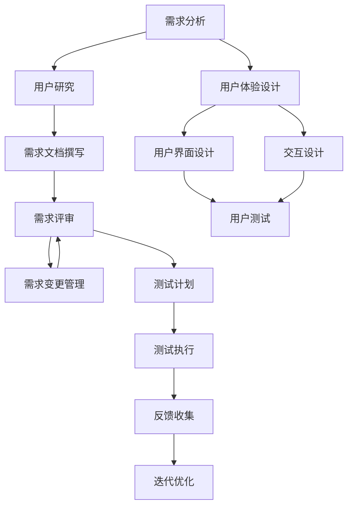

                 

## 文章标题

### 需求与用户体验测试的整合：提升产品质量

关键词：需求分析、用户体验测试、产品质量、整合策略、案例分析

摘要：本文旨在探讨需求分析与用户体验测试在提升产品质量过程中的整合作用。通过分析需求与用户体验之间的关系，本文提出了一系列整合策略，并结合实际案例，深入讲解了如何在软件开发过程中有效整合需求分析与用户体验测试，从而提升产品质量。

---

### 目录大纲

#### 第一部分：需求分析与用户体验基础

##### 第1章：需求分析与用户体验概述

- 1.1 需求分析的定义与作用
- 1.2 用户体验的重要性
- 1.3 需求分析与用户体验的关系
- 1.4 需求分析流程概述

##### 第2章：需求分析方法与工具

- 2.1 需求调研与收集
- 2.2 用户需求分析与分类
- 2.3 需求文档撰写与评审
- 2.4 常用需求分析工具

##### 第3章：用户体验设计基础

- 3.1 用户体验设计原则
- 3.2 用户体验设计流程
- 3.3 用户界面设计
- 3.4 交互设计

##### 第4章：用户研究方法与技巧

- 4.1 用户研究的重要性
- 4.2 用户访谈与问卷设计
- 4.3 用户行为分析
- 4.4 用户测试与反馈

#### 第二部分：需求与用户体验测试的整合

##### 第5章：需求与用户体验测试整合策略

- 5.1 整合策略概述
- 5.2 需求评审与用户体验测试
- 5.3 需求变更与用户体验测试
- 5.4 用户故事地图与测试计划

##### 第6章：整合测试方法与工具

- 6.1 功能测试与性能测试
- 6.2 兼容性测试与可用性测试
- 6.3 自动化测试工具介绍
- 6.4 测试工具的选择与使用

##### 第7章：用户反馈与迭代改进

- 7.1 用户反馈的重要性
- 7.2 用户反馈收集与分析
- 7.3 需求迭代与用户体验优化
- 7.4 持续改进与质量保障

#### 第三部分：实战案例与技巧

##### 第8章：案例研究：需求与用户体验整合的实践

- 8.1 案例背景
- 8.2 需求分析与实践
- 8.3 用户体验设计与测试
- 8.4 案例总结与启示

##### 第9章：提升产品质量的关键技巧

- 9.1 提升产品质量的策略
- 9.2 需求管理技巧
- 9.3 用户体验优化技巧
- 9.4 测试技巧与实践

##### 第10章：未来趋势与展望

- 10.1 人工智能与需求分析
- 10.2 用户体验设计的发展趋势
- 10.3 需求与用户体验测试的未来展望
- 10.4 产品质量提升的挑战与机遇

### 附录

- 附录A：常用需求分析与用户体验工具总结
- 附录B：需求分析与用户体验测试相关标准与规范
- 附录C：示例代码与测试用例解读

### Mermaid 流�程图



### 核心算法原理讲解

#### 需求优先级排序算法（例如：MoSCoW 方法）

MoSCoW 方法是一种用于需求优先级排序的简单而有效的技术，其核心思想是根据需求的重要性和紧急性来划分需求类别。

**伪代码：**

```plaintext
function MoSCoW(需求列表)
    创建四个列表：必须要有（Must Have）、应该要有（Should Have）、可以延迟（Could Have）和不会实现（Would Have）

    for 每个需求 in 需求列表
        if 需求至关重要 and 时间紧迫
            将需求添加到必须要有列表
        else if 需求重要但时间不紧迫
            将需求添加到应该要有列表
        else if 需求可以延迟
            将需求添加到可以延迟列表
        else
            需求不会实现，不进行操作

    返回四个需求列表
```

#### 数学模型和数学公式讲解

#### 用户满意度计算模型

用户满意度（Satisfaction）可以通过以下数学模型进行计算：

$$ S = \frac{\sum_{i=1}^{n} w_i \cdot U_i}{\sum_{i=1}^{n} w_i} $$

其中：
- $S$ 表示用户满意度总分
- $w_i$ 表示第 $i$ 个评价维度的权重
- $U_i$ 表示第 $i$ 个评价维度的得分

举例说明：

- 假设用户对产品的三个评价维度分别为“功能”、“易用性”和“性能”，权重分别为0.3、0.4和0.3。
- 用户在每个维度的得分分别为4、5和3。

则用户满意度计算如下：

$$ S = \frac{0.3 \cdot 4 + 0.4 \cdot 5 + 0.3 \cdot 3}{0.3 + 0.4 + 0.3} = \frac{1.2 + 2 + 0.9}{1} = 4.1 $$

用户满意度为4.1分。

---

在接下来的文章中，我们将深入探讨需求分析与用户体验测试的整合过程，通过理论讲解和实践案例分析，帮助读者理解和掌握这一重要技术。希望本文能够为提升产品质量提供有益的启示和指导。

