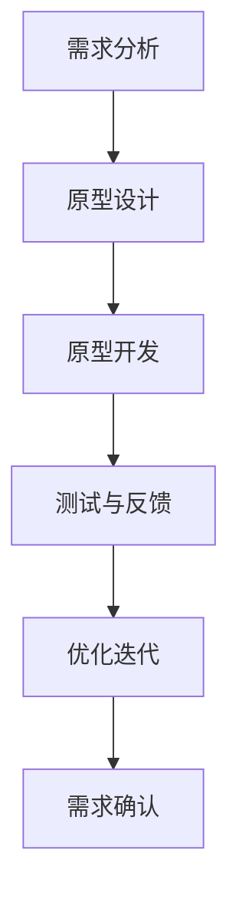

                 

# 《需求原型快速迭代：提高大型应用开发效率》

## 关键词
大型应用开发、需求变更、快速迭代、原型设计、团队协作、项目管理

## 摘要
在现代软件开发中，大型应用项目的开发面临着需求变更频繁、项目周期长、团队协作困难等挑战。本文通过深入探讨需求原型快速迭代的方法，阐述其在提高大型应用开发效率方面的作用。文章分为三个部分：首先分析大型应用开发面临的挑战和快速迭代的重要性；接着介绍需求原型快速迭代的流程；然后通过实践案例展示快速迭代在项目中的应用，并探讨如何提高大型应用开发的效率。文章最后总结快速迭代的价值，并展望未来发展趋势。

## 第一部分：引言

### 1.1 大型应用开发中的常见问题

#### 1.1.1 需求变更频繁
在大型应用开发过程中，需求变更是一个普遍存在的问题。这主要是因为项目初期需求难以完全确定，以及业务环境的变化导致需求不断调整。频繁的需求变更会对项目进度、成本和质量产生不利影响。

#### 1.1.2 项目周期长
大型应用项目通常涉及复杂的技术和业务逻辑，项目周期长是不可避免的。长的开发周期不仅增加了项目的成本，还可能导致项目无法及时响应市场变化，失去竞争优势。

#### 1.1.3 团队协作困难
大型应用项目通常需要跨部门、跨团队的协作。然而，由于团队之间的沟通不畅、职责不清、利益冲突等原因，团队协作困难成为项目成功的一个重要障碍。

### 1.2 快速迭代的重要性

#### 1.2.1 快速迭代的优势
快速迭代是应对大型应用开发中常见问题的一种有效方法。快速迭代的优势包括：

1. 灵活性：快速迭代允许项目团队根据实际情况灵活调整需求，适应变化。
2. 提高质量：通过频繁的测试和反馈，快速迭代有助于发现和修复问题，提高产品质量。
3. 降低风险：快速迭代可以在早期阶段发现和解决潜在问题，降低项目风险。

#### 1.2.2 快速迭代的挑战
尽管快速迭代有诸多优势，但也面临一些挑战：

1. 资源限制：快速迭代需要投入较多的时间和资源，这可能会与项目预算和时间限制相冲突。
2. 团队协作：快速迭代要求团队具有较高的协作能力，否则可能会导致项目进展受阻。
3. 质量控制：快速迭代可能会导致质量控制的难度增加，需要更有效的测试和反馈机制。

## 第二部分：需求原型快速迭代的实践

### 2.1 需求原型的概念

#### 2.1.1 需求原型的作用
需求原型是软件开发过程中的一种模型，用于模拟实际的应用界面和功能。它有助于：

1. 明确需求：通过原型，项目团队能够更清晰地了解用户需求，避免需求不明确导致的开发错误。
2. 评估可行性：原型可以帮助团队评估技术实现的可行性，为后续开发提供指导。
3. 减少沟通成本：原型可以作为沟通的工具，减少团队成员之间的误解和重复沟通。

#### 2.1.2 需求原型的类型
需求原型可以分为以下几种类型：

1. **低 fidelity 原型**：这种原型通常是非交互式的，主要展示页面布局和基本元素。
2. **中 fidelity 原型**：这种原型包含更多的交互元素，可以模拟部分用户操作，但不如高 fidelity 原型真实。
3. **高 fidelity 原型**：这种原型与最终产品非常接近，包含大部分的功能和交互，可以用于用户测试和反馈。

### 2.2 快速迭代的流程

#### 2.2.1 需求分析
需求分析是快速迭代的起点，其主要任务是明确用户需求。这可以通过以下方法实现：

1. **用户访谈**：通过与用户直接交流，了解他们的需求和使用场景。
2. **竞品分析**：分析竞争对手的产品，了解其优势和不足，为自身产品的设计提供参考。
3. **需求文档编写**：将收集到的需求整理成文档，为后续的原型设计和开发提供依据。

#### 2.2.2 原型设计
原型设计是快速迭代的核心环节，其主要任务是根据需求文档创建原型。这可以通过以下步骤实现：

1. **绘制界面原型**：使用原型设计工具绘制页面布局和交互流程。
2. **用户调研**：邀请用户对原型进行测试和反馈，收集他们的意见。
3. **原型迭代**：根据用户反馈对原型进行修改和优化，直到达到预期效果。

#### 2.2.3 原型开发
原型开发是将原型转化为实际可运行的应用。这可以通过以下步骤实现：

1. **环境搭建**：配置开发环境，安装必要的开发工具和依赖库。
2. **功能模块划分**：将原型中的功能模块划分为可独立开发的小部分。
3. **代码实现**：根据原型设计，实现功能模块的代码。

#### 2.2.4 测试与反馈
测试与反馈是快速迭代的重要环节，其主要任务是通过测试发现和解决问题，并根据用户反馈进行优化。这可以通过以下步骤实现：

1. **功能测试**：验证应用的功能是否符合需求。
2. **性能测试**：评估应用的性能，如响应速度、并发处理能力等。
3. **用户反馈**：收集用户的实际使用反馈，了解他们的使用体验。
4. **优化迭代**：根据测试结果和用户反馈，对应用进行优化和改进。

## 第三部分：提高大型应用开发效率的策略

### 3.1 团队协作与沟通

#### 3.1.1 团队协作的重要性
团队协作是大型应用开发成功的关键。以下是一些团队协作的重要性：

1. **提高效率**：团队协作可以充分利用每个人的专业技能，提高开发效率。
2. **减少错误**：多人协作可以互相检查和纠正错误，降低开发中的错误率。
3. **促进创新**：团队协作可以激发创新思维，促进技术进步和产品优化。

#### 3.1.2 团队协作的方法
以下是一些团队协作的方法：

1. **明确职责**：为每个团队成员明确分工，确保任务落实到人。
2. **定期会议**：定期召开团队会议，分享进展、讨论问题和制定计划。
3. **使用协作工具**：使用协作工具，如项目管理软件、即时通讯工具和文档共享平台，提高团队沟通效率。

### 3.2 项目管理与进度控制

#### 3.2.1 项目管理的方法
项目管理是确保项目按计划进行的艺术。以下是一些常用的项目管理方法：

1. **瀑布模型**：瀑布模型是一种线性顺序开发模型，适用于需求稳定的项目。
2. **敏捷开发**：敏捷开发是一种迭代式、增量的开发方法，适用于需求变化频繁的项目。

#### 3.2.2 进度控制
进度控制是确保项目按计划进行的关键。以下是一些进度控制的方法：

1. **进度跟踪**：定期跟踪项目进度，识别和解决问题。
2. **进度调整**：根据实际情况调整项目计划，确保项目按计划进行。

### 3.3 工具与技术

#### 3.3.1 自动化测试工具
自动化测试工具可以提高测试效率，减少测试成本。以下是一些常用的自动化测试工具：

1. **Selenium**：用于Web应用的自动化测试。
2. **Appium**：用于移动应用的自动化测试。

#### 3.3.2 持续集成与持续部署
持续集成与持续部署可以提高开发效率，确保代码质量。以下是一些常用的持续集成与持续部署工具：

1. **Jenkins**：用于构建、测试和部署。
2. **Docker**：用于容器化部署。

## 第10章：总结与展望

### 10.1 本书总结
本书介绍了需求原型快速迭代在提高大型应用开发效率方面的作用，包括快速迭代的优势、流程和实践方法。同时，还探讨了团队协作、项目管理、工具与技术等提高大型应用开发效率的策略。

### 10.2 未来发展趋势
未来，随着技术的不断进步，需求原型快速迭代方法将在大型应用开发中发挥更大的作用。人工智能、云计算等新兴技术将进一步推动软件开发方式的变革，提高开发效率和产品质量。

## 附录

### 附录A：相关工具与资源

#### A.1 开发工具
- **原型设计工具**：Axure RP、Sketch、Figma
- **开发环境配置**：Docker、Kubernetes

#### A.2 测试工具
- **自动化测试工具**：Selenium、Appium
- **性能测试工具**：JMeter、LoadRunner

#### A.3 持续集成工具
- **Jenkins**：用于构建、测试和部署。
- **GitLab CI/CD**：用于持续集成和持续部署。

### Mermaid 流程图



### 3.2.1 快速原型开发算法原理

```plaintext
快速原型开发算法主要分为以下几个步骤：

1. 需求分析：通过用户访谈、竞品分析等方式收集用户需求，形成需求文档。
2. 原型设计：基于需求文档，使用原型设计工具绘制界面原型，并进行用户调研，收集反馈。
3. 原型开发：根据原型设计，实现功能模块，并进行初步测试。
4. 测试与反馈：对原型进行功能测试和性能测试，收集用户反馈，进行优化迭代。
5. 需求确认：与用户沟通确认需求，完善原型，进入下一个迭代周期。

伪代码如下：

function 快速原型开发（需求文档）：
    需求文档 = 收集用户需求（用户访谈、竞品分析）
    原型 = 设计原型（需求文档）
    用户反馈 = 收集用户调研反馈
    功能模块 = 实现功能模块（原型）
    测试结果 = 测试功能模块（功能模块）
    优化原型 = 优化原型（用户反馈、测试结果）
    需求确认 = 确认需求（用户）
    返回 优化原型
end function
```

### 附录B：数学模型和公式

```latex
\section{数学模型和公式}

在快速原型开发中，以下数学模型和公式是至关重要的：

1. **决策树**：用于评估不同需求变更的优先级。

$$
D = \frac{C_i \cdot P_i}{\sum_{i=1}^{n} C_i \cdot P_i}
$$

其中，\(D\) 表示决策得分，\(C_i\) 表示变更的复杂度，\(P_i\) 表示变更的概率。

2. **优先级排序**：用于确定需求实现的顺序。

$$
R_i = \frac{D_i + E_i}{2}
$$

其中，\(R_i\) 表示需求的优先级，\(D_i\) 表示决策得分，\(E_i\) 表示期望价值。

3. **用户满意度模型**：用于评估用户对原型的满意度。

$$
S = \frac{1}{n} \sum_{i=1}^{n} U_i
$$

其中，\(S\) 表示用户满意度，\(U_i\) 表示第 \(i\) 个用户的满意度评分。

### 举例说明

假设有一个大型应用项目，其中包含三个需求变更：增加用户注册功能（复杂度 3，概率 0.5）、优化搜索功能（复杂度 2，概率 0.3）和新增用户评价功能（复杂度 1，概率 0.2）。

使用上述公式计算每个变更的决策得分和优先级：

1. **增加用户注册功能**：

$$
D_1 = \frac{3 \cdot 0.5}{3 \cdot 0.5 + 2 \cdot 0.3 + 1 \cdot 0.2} = 0.6
$$

$$
R_1 = \frac{0.6 + 0.5}{2} = 0.55
$$

2. **优化搜索功能**：

$$
D_2 = \frac{2 \cdot 0.3}{3 \cdot 0.5 + 2 \cdot 0.3 + 1 \cdot 0.2} = 0.4
$$

$$
R_2 = \frac{0.4 + 0.3}{2} = 0.35
$$

3. **新增用户评价功能**：

$$
D_3 = \frac{1 \cdot 0.2}{3 \cdot 0.5 + 2 \cdot 0.3 + 1 \cdot 0.2} = 0.2
$$

$$
R_3 = \frac{0.2 + 0.2}{2} = 0.15
$$

根据计算结果，可以得出以下优先级排序：增加用户注册功能 > 优化搜索功能 > 新增用户评价功能。

用户满意度评分如下：3个用户分别给出了4、3和2的评分。

$$
S = \frac{1}{3} \sum_{i=1}^{3} U_i = \frac{4 + 3 + 2}{3} = 3
$$

因此，用户对原型的平均满意度为3分。

通过以上数学模型和公式的计算，项目团队可以更有效地管理需求变更，确保项目能够按时按质完成。
```## 开发环境搭建

开发环境搭建是进行原型开发的第一步，它为开发工作提供了必要的技术基础和工具支持。以下是开发环境搭建的详细步骤。

### 4.1.1 开发工具选择

选择合适的开发工具是确保高效开发的关键。以下是一些常用的开发工具：

1. **集成开发环境（IDE）**：
   - **Visual Studio Code**：一款轻量级、开源的跨平台IDE，支持多种编程语言和插件。
   - **IntelliJ IDEA**：适用于Java开发，具有丰富的插件和市场支持。

2. **原型设计工具**：
   - **Sketch**：一款适用于UI设计的矢量绘图工具，广泛用于移动应用和Web应用的界面设计。
   - **Figma**：一款基于浏览器的交互式设计工具，支持实时协作。

3. **代码版本控制工具**：
   - **Git**：一款分布式版本控制系统，用于管理代码的版本和协作。
   - **GitHub**：提供Git仓库托管和协同工作平台，便于代码的共享和协作。

### 4.1.2 开发环境配置

配置开发环境是确保所有工具和依赖能够正常工作的过程。以下是配置开发环境的步骤：

1. **安装IDE**：
   - 访问Visual Studio Code或IntelliJ IDEA的官方网站，下载并安装对应的IDE。
   - 安装完成后，启动IDE并配置必要的语言插件和工具插件，如Python插件、Node.js插件等。

2. **安装原型设计工具**：
   - Sketch和Figma均为基于浏览器的工具，只需在浏览器中访问即可使用。
   - 若需要离线版本，可以访问官方网站下载安装。

3. **安装代码版本控制工具**：
   - 访问Git的官方网站下载Git安装包，并按照指引完成安装。
   - 安装完成后，打开命令行工具，输入 `git --version` 验证Git是否安装成功。
   - 注册GitHub账号，并创建一个新的仓库用于存放代码。

4. **安装依赖库和框架**：
   - 根据项目需求，安装相应的依赖库和框架。例如，对于Web开发，可以使用npm（Node.js的包管理工具）来安装依赖库。
   - 使用以下命令安装Node.js和npm：
     ```
     sudo apt-get install nodejs npm
     ```
   - 安装完成后，使用 `npm -v` 验证是否安装成功。

5. **配置开发环境变量**：
   - 确保环境变量配置正确，以便在命令行中调用IDE、Git、Node.js和其他开发工具。

6. **测试开发环境**：
   - 编写一个简单的“Hello World”程序，测试IDE和开发环境是否正常工作。

通过以上步骤，开发环境搭建完成。接下来，可以开始进行原型开发了。

### 4.2 原型开发步骤

原型开发是软件开发过程中关键的一环，通过创建原型可以验证设计思路，收集用户反馈，并快速迭代改进。以下是原型开发的详细步骤：

#### 4.2.1 用户故事编写

用户故事是描述用户需求的简洁表述，它通常包含三个要素：用户角色、目标用户想要实现的操作和预期结果。编写用户故事的步骤如下：

1. **确定用户角色**：识别目标用户群体，为每个用户角色命名，如“管理员”、“普通用户”等。
2. **编写用户故事**：根据用户角色，描述用户希望完成的操作和期望的结果。用户故事的格式通常为：“作为[用户角色]，我想要[功能或操作]，以便[达到的目标或好处]”。
3. **用户故事地图**：将所有用户故事整理成故事地图，以可视化方式展示用户在不同场景下的需求。

例如，针对一个电商应用，可以编写以下用户故事：

- **用户角色**：普通用户
- **用户故事**：
  - 作为普通用户，我想要浏览商品，以便找到我感兴趣的商品。
  - 作为普通用户，我想要搜索商品，以便快速找到特定商品。
  - 作为普通用户，我想要将商品添加到购物车，以便购买商品。

#### 4.2.2 功能模块划分

功能模块划分是将用户故事转化为可开发的功能模块的过程。以下是功能模块划分的步骤：

1. **分析用户故事**：根据用户故事，分析并识别需要实现的功能点。
2. **功能模块定义**：为每个功能点定义模块，如“商品浏览模块”、“购物车模块”、“用户登录模块”等。
3. **模块交互关系**：确定模块之间的交互关系，如“商品浏览模块”与“购物车模块”的交互关系。

例如，对于电商应用，可以划分以下功能模块：

- **商品浏览模块**：用于展示商品列表，允许用户浏览商品详情。
- **购物车模块**：用于管理用户添加的商品，提供商品添加、删除、修改数量的功能。
- **用户登录模块**：用于用户登录系统，提供注册、登录、密码找回等功能。

#### 4.2.3 代码实现

代码实现是将功能模块转化为实际代码的过程。以下是代码实现的步骤：

1. **设置项目结构和目录**：创建项目目录，划分代码模块，设置代码结构和命名规范。
2. **编写模块代码**：根据功能模块定义，编写相应的代码，实现模块功能。
3. **单元测试**：编写单元测试，验证代码的功能和性能，确保代码质量。
4. **代码审查**：邀请团队成员进行代码审查，识别和修复代码中的错误。

以下是一个简单的电商应用“商品浏览模块”的实现示例：

```python
# 商品浏览模块代码示例

class ProductBrowser:
    def __init__(self, products):
        self.products = products
    
    def browse_products(self):
        return self.products
    
    def search_products(self, query):
        results = [product for product in self.products if query in product['name']]
        return results

# 创建产品列表
products = [
    {'id': 1, 'name': 'iPhone 13', 'price': 999},
    {'id': 2, 'name': 'Samsung Galaxy S21', 'price': 1199},
    {'id': 3, 'name': 'OnePlus 9', 'price': 899}
]

# 创建产品浏览器实例
product_browser = ProductBrowser(products)

# 浏览所有产品
all_products = product_browser.browse_products()
print(all_products)

# 搜索产品
search_query = 'iPhone'
search_results = product_browser.search_products(search_query)
print(search_results)
```

通过以上步骤，可以完成原型开发的初步工作。接下来，将进入测试与反馈阶段，确保原型功能完善，为后续开发奠定基础。

### 4.3 测试与反馈

测试与反馈是原型开发过程中至关重要的一环，通过测试可以验证功能是否正常，通过反馈可以收集用户意见，为优化迭代提供依据。以下是测试与反馈的详细步骤：

#### 5.1 测试策略

测试策略是确保原型质量的关键，它包括功能测试、性能测试和兼容性测试。

1. **功能测试**：验证原型功能是否按预期工作，包括边界条件和异常情况。
   - **测试用例编写**：根据功能模块，编写详细的测试用例，包括输入数据、预期结果和实际结果。
   - **自动化测试**：使用自动化测试工具，如Selenium，编写自动化测试脚本，自动化执行测试用例。

2. **性能测试**：评估原型在不同负载下的性能，包括响应时间、并发处理能力和资源消耗。
   - **性能指标**：确定性能测试的指标，如响应时间、吞吐量、错误率等。
   - **性能测试工具**：使用性能测试工具，如JMeter，模拟用户负载，收集性能数据。

3. **兼容性测试**：确保原型在不同设备和浏览器上的兼容性，包括桌面和移动设备。
   - **测试环境**：配置多种测试环境，包括操作系统、浏览器版本、设备分辨率等。
   - **兼容性测试工具**：使用兼容性测试工具，如BrowserStack，进行跨浏览器和设备的测试。

#### 5.2 反馈收集

反馈收集是优化迭代的重要步骤，通过收集用户意见，可以了解原型的优缺点，为改进提供依据。

1. **用户反馈渠道**：建立用户反馈渠道，如在线问卷调查、用户访谈、社交媒体等。
   - **问卷调查**：设计问卷调查，收集用户对原型的满意度、功能需求和建议。
   - **用户访谈**：邀请用户进行深度访谈，了解他们的使用体验和意见。

2. **反馈处理**：对收集到的反馈进行分类和处理，根据优先级和影响范围制定改进计划。
   - **分类处理**：将反馈分为功能性需求、用户体验、性能问题等类别。
   - **优先级排序**：根据反馈的影响和紧急程度，对反馈进行优先级排序。

3. **迭代优化**：根据反馈结果，对原型进行优化和改进，确保每次迭代都能提升用户体验。

以下是一个实际案例，展示如何通过测试与反馈优化原型：

**案例**：一个电商应用的“购物车模块”原型。

1. **功能测试**：
   - **测试用例**：编写购物车添加、删除、修改数量的测试用例。
   - **自动化测试脚本**：使用Selenium编写自动化测试脚本，验证购物车功能。

2. **性能测试**：
   - **性能指标**：确定响应时间和并发处理能力等性能指标。
   - **性能测试**：使用JMeter模拟高并发用户负载，收集性能数据。

3. **兼容性测试**：
   - **测试环境**：配置桌面和移动设备，包括不同操作系统和浏览器版本。
   - **兼容性测试**：使用BrowserStack进行跨浏览器和设备的兼容性测试。

4. **用户反馈**：
   - **问卷调查**：设计问卷，收集用户对购物车功能的满意度。
   - **用户访谈**：邀请用户进行深度访谈，了解他们的使用体验。

5. **反馈处理**：
   - **分类处理**：将反馈分为功能性问题、用户体验问题等。
   - **优先级排序**：根据反馈的影响和紧急程度，制定改进计划。

6. **迭代优化**：
   - **购物车界面优化**：根据用户反馈，优化购物车界面布局，提升用户体验。
   - **性能改进**：根据性能测试结果，优化数据库查询和缓存策略，提高响应速度。

通过以上测试与反馈过程，原型功能不断完善，性能和兼容性得到提升，为后续开发奠定坚实基础。

### 6.1 案例一：电商应用开发

电商应用开发是一个复杂且不断变化的过程，通过需求原型快速迭代，可以有效提高开发效率，确保产品满足用户需求。以下是一个电商应用开发的详细案例分析。

#### 6.1.1 需求分析

电商应用的核心需求包括商品展示、购物车、下单、支付、用户管理等。在需求分析阶段，项目团队进行了以下工作：

1. **用户访谈**：与潜在用户进行面对面交流，了解他们的购物习惯、需求和建议。
2. **竞品分析**：研究竞争对手的电商应用，分析其优点和不足，为自身产品提供借鉴。
3. **需求文档编写**：根据用户访谈和竞品分析的结果，编写详细的需求文档，明确功能需求和用户体验。

#### 6.1.2 原型设计与开发

在原型设计阶段，团队采用了快速迭代的方法，通过多轮原型设计，逐步完善产品功能。

1. **低Fidelity原型**：首先创建低Fidelity原型，仅包含页面布局和基本元素，用于验证核心功能。
   - **原型设计**：使用Sketch绘制页面布局，制作低保真度原型。
   - **用户调研**：邀请用户对低保真度原型进行测试，收集反馈。

2. **中Fidelity原型**：根据用户反馈，创建中Fidelity原型，增加交互元素，模拟用户操作。
   - **原型设计**：在低保真度原型的基础上，添加按钮、输入框等交互元素，制作中Fidelity原型。
   - **用户调研**：邀请用户测试中Fidelity原型，收集反馈，并进行修改。

3. **高Fidelity原型**：在原型设计成熟后，创建高Fidelity原型，使原型与最终产品接近。
   - **原型设计**：使用Sketch或Figma创建高Fidelity原型，添加详细的设计元素和交互效果。
   - **用户调研**：邀请用户测试高Fidelity原型，确保用户体验和功能符合预期。

#### 6.1.3 测试与反馈

在原型开发完成后，进行全面的测试和反馈收集，以确保产品质量和用户体验。

1. **功能测试**：编写测试用例，自动化执行功能测试，验证核心功能是否按预期工作。
   - **自动化测试脚本**：使用Selenium编写自动化测试脚本，执行购物车、下单、支付等功能的测试。

2. **性能测试**：使用JMeter模拟高并发用户负载，评估系统的性能和稳定性。
   - **性能测试**：设置不同的负载场景，监控系统的响应时间、吞吐量和错误率。

3. **兼容性测试**：确保产品在不同设备和浏览器上的兼容性，包括桌面和移动设备。
   - **兼容性测试工具**：使用BrowserStack进行跨浏览器和设备的测试，确保产品在不同环境中正常运行。

4. **用户反馈**：通过问卷调查和用户访谈，收集用户对产品的满意度、建议和意见。
   - **问卷调查**：设计问卷，收集用户对产品功能的满意度。
   - **用户访谈**：邀请用户进行深度访谈，了解他们的使用体验和需求。

5. **反馈处理**：对收集到的反馈进行分类和处理，制定改进计划，并进行迭代优化。

#### 6.1.4 迭代优化

根据测试和反馈结果，对产品进行优化迭代，确保每次迭代都能提升用户体验。

1. **界面优化**：根据用户反馈，优化产品界面布局和交互设计，提升用户体验。
   - **界面调整**：修改按钮样式、调整页面布局，使界面更直观易用。

2. **性能改进**：根据性能测试结果，优化数据库查询和缓存策略，提高响应速度。
   - **数据库优化**：优化数据库索引，提高查询效率。
   - **缓存策略**：引入缓存机制，减少数据库访问次数。

3. **功能完善**：根据用户需求，完善产品功能，增加新的功能模块。
   - **购物车功能**：增加购物车详情页，显示商品价格、数量等信息。
   - **用户管理功能**：增加用户注册、登录、个人信息管理等功能。

4. **持续迭代**：根据用户反馈，不断进行产品优化和改进，确保产品始终满足用户需求。

通过以上步骤，电商应用经过多轮迭代优化，最终达到预期效果，满足了用户需求，提高了用户满意度。

### 6.2 案例二：金融应用开发

金融应用开发具有严格的合规性和安全性要求，通过需求原型快速迭代，可以有效提高开发效率，确保产品符合法规要求并满足用户需求。以下是一个金融应用开发的详细案例分析。

#### 6.2.1 需求分析

金融应用的核心需求包括账户管理、交易、支付、风险管理等。在需求分析阶段，项目团队进行了以下工作：

1. **用户访谈**：与金融行业从业者、潜在用户进行交流，了解他们的工作流程、需求和建议。
2. **法规分析**：研究相关金融法规，确保产品设计和功能符合法规要求。
3. **需求文档编写**：根据用户访谈和法规分析的结果，编写详细的需求文档，明确功能需求和合规要求。

#### 6.2.2 原型设计与开发

在原型设计阶段，团队采用了快速迭代的方法，通过多轮原型设计，逐步完善产品功能。

1. **低Fidelity原型**：首先创建低Fidelity原型，仅包含页面布局和基本元素，用于验证核心功能。
   - **原型设计**：使用Sketch绘制页面布局，制作低保真度原型。
   - **用户调研**：邀请用户对低保真度原型进行测试，收集反馈。

2. **中Fidelity原型**：根据用户反馈，创建中Fidelity原型，增加交互元素，模拟用户操作。
   - **原型设计**：在低保真度原型的基础上，添加按钮、输入框等交互元素，制作中Fidelity原型。
   - **用户调研**：邀请用户测试中Fidelity原型，收集反馈，并进行修改。

3. **高Fidelity原型**：在原型设计成熟后，创建高Fidelity原型，使原型与最终产品接近。
   - **原型设计**：使用Sketch或Figma创建高Fidelity原型，添加详细的设计元素和交互效果。
   - **用户调研**：邀请用户测试高Fidelity原型，确保用户体验和功能符合预期。

#### 6.2.3 测试与反馈

在原型开发完成后，进行全面的测试和反馈收集，以确保产品质量和用户体验。

1. **功能测试**：编写测试用例，自动化执行功能测试，验证核心功能是否按预期工作。
   - **自动化测试脚本**：使用Selenium编写自动化测试脚本，执行账户管理、交易、支付等功能的测试。

2. **性能测试**：使用JMeter模拟高并发用户负载，评估系统的性能和稳定性。
   - **性能测试**：设置不同的负载场景，监控系统的响应时间、吞吐量和错误率。

3. **兼容性测试**：确保产品在不同设备和浏览器上的兼容性，包括桌面和移动设备。
   - **兼容性测试工具**：使用BrowserStack进行跨浏览器和设备的测试，确保产品在不同环境中正常运行。

4. **用户反馈**：通过问卷调查和用户访谈，收集用户对产品的满意度、建议和意见。
   - **问卷调查**：设计问卷，收集用户对产品功能的满意度。
   - **用户访谈**：邀请用户进行深度访谈，了解他们的使用体验和需求。

5. **反馈处理**：对收集到的反馈进行分类和处理，制定改进计划，并进行迭代优化。

#### 6.2.4 迭代优化

根据测试和反馈结果，对产品进行优化迭代，确保每次迭代都能提升用户体验。

1. **界面优化**：根据用户反馈，优化产品界面布局和交互设计，提升用户体验。
   - **界面调整**：修改按钮样式、调整页面布局，使界面更直观易用。

2. **性能改进**：根据性能测试结果，优化数据库查询和缓存策略，提高响应速度。
   - **数据库优化**：优化数据库索引，提高查询效率。
   - **缓存策略**：引入缓存机制，减少数据库访问次数。

3. **功能完善**：根据用户需求，完善产品功能，增加新的功能模块。
   - **账户管理功能**：增加账户安全设置、密码找回等功能。
   - **风险管理功能**：增加交易风险提示、风险评级等功能。

4. **持续迭代**：根据用户反馈，不断进行产品优化和改进，确保产品始终符合法规要求并满足用户需求。

通过以上步骤，金融应用经过多轮迭代优化，最终达到预期效果，满足了用户需求和合规要求。

### 第7章：团队协作与沟通

在现代大型应用开发中，团队协作与沟通至关重要。有效的团队协作和沟通不仅可以提高开发效率，还能确保项目按计划顺利推进。以下是关于团队协作与沟通的重要性和方法。

#### 7.1 团队协作的重要性

#### 7.1.1 提高效率

团队协作能够充分利用每个人的专业技能和知识，从而提高整体工作效率。通过明确的分工和协作，团队成员可以相互支持，快速解决问题，减少重复劳动。

#### 7.1.2 减少错误

多人协作可以互相检查和验证代码和设计，减少开发中的错误和缺陷。团队合作还可以促进知识共享，避免个人知识的局限性导致的问题。

#### 7.1.3 促进创新

团队协作鼓励不同背景和观点的碰撞，从而激发创新思维。团队成员可以共同探讨解决方案，提出新的想法，从而创造出更优秀的软件产品。

#### 7.1.4 增强团队凝聚力

良好的团队协作和沟通可以增强团队成员之间的信任和合作精神，提高团队的凝聚力和归属感，从而减少人员流失和内部矛盾。

#### 7.2 团队协作的方法

为了实现有效的团队协作，需要采取一系列方法和工具。

#### 7.2.1 明确职责

在项目开始前，明确每个团队成员的职责和任务分工，确保每个人都知道自己的工作内容和目标。这有助于避免工作重叠和责任不明的情况。

#### 7.2.2 定期会议

定期召开团队会议是团队协作的重要方式。通过会议，团队成员可以分享进展、讨论问题和规划下一步的工作。会议可以分为周会、月会等形式，根据项目的实际需要来安排。

#### 7.2.3 使用协作工具

使用协作工具，如Slack、Microsoft Teams、Trello等，可以帮助团队高效沟通和协作。这些工具提供了即时通讯、任务管理、文档共享等功能，使团队成员能够实时交流和协作。

#### 7.2.4 建立反馈机制

建立反馈机制，鼓励团队成员提出问题和建议，并及时解决。这有助于发现团队协作中的问题和瓶颈，并不断优化协作流程。

#### 7.3 沟通技巧

良好的沟通技巧是确保团队协作顺畅的重要基础。

#### 7.3.1 沟通的目的

在沟通前明确沟通的目的和目标，确保信息传达的准确性和有效性。沟通目的可以包括解决问题、分享信息、传达决策等。

#### 7.3.2 沟通的方式

选择合适的沟通方式，如面对面交流、电话会议、邮件、即时通讯等。根据具体场景和需求，灵活运用不同的沟通方式。

#### 7.3.3 沟通技巧提升

以下是一些提升沟通技巧的方法：

- **倾听**：认真倾听对方的意见和需求，避免打断和误解。
- **清晰表达**：使用简单、明确的语言表达自己的观点，避免模糊和歧义。
- **积极反馈**：给予对方及时的反馈，以确认信息的理解和接受。
- **尊重差异**：尊重团队成员的不同观点和意见，促进开放和包容的沟通氛围。
- **冲突解决**：在发生冲突时，采取建设性的方法解决，避免情绪化和对抗。

通过以上团队协作与沟通的方法和技巧，可以有效提高大型应用开发的效率，确保项目顺利推进和成功完成。

### 8.1 项目管理与进度控制

在大型应用开发中，项目管理与进度控制是确保项目成功的关键因素。良好的项目管理方法可以帮助团队有效规划资源、分配任务、监控进度，从而提高项目成功率。

#### 8.1.1 项目管理的方法

**瀑布模型**

瀑布模型是一种传统的线性顺序开发模型，它将项目开发过程划分为多个阶段，如需求分析、设计、开发、测试和部署。每个阶段必须在完成后再进入下一个阶段，如瀑布般层层推进。

- **优点**：
  - 结构清晰，阶段明确，便于管理。
  - 适用于需求稳定、变更较少的项目。
- **缺点**：
  - 灵活性较低，难以应对需求变更。
  - 后期发现错误时，难以调整。

**敏捷开发**

敏捷开发是一种迭代式、增量的开发方法，强调快速响应需求变更、持续交付高质量软件。敏捷开发采用短周期的迭代和增量开发，通过频繁的迭代和反馈，逐步完善产品。

- **优点**：
  - 高度灵活性，能够快速应对需求变更。
  - 强调用户参与和反馈，提高产品质量。
  - 风险较低，能够及时发现和解决问题。
- **缺点**：
  - 需要较高的团队协作能力和沟通效率。
  - 项目管理复杂度较高。

#### 8.1.2 进度控制

进度控制是确保项目按计划进行的关键环节。以下是一些常用的进度控制方法：

**进度跟踪**

- **定期检查**：定期检查项目的实际进度，与计划进度进行比较，识别和解决问题。
- **指标监控**：设定关键绩效指标（KPI），如任务完成率、项目进度百分比等，实时监控项目进展。

**进度调整**

- **风险应对**：识别项目风险，并制定应对策略，如调整计划、增加资源等。
- **迭代调整**：在敏捷开发中，根据每个迭代的结果，调整下一个迭代的工作内容和计划。

**项目总结与回顾**

- **定期总结**：在每个迭代或项目结束时，进行总结和回顾，分析成功经验和不足之处，为下一个项目提供参考。

通过以上项目管理与进度控制的方法，可以有效提高大型应用开发的效率和质量，确保项目按计划顺利完成。

### 9.1 自动化测试工具

自动化测试工具在提高软件质量和开发效率方面发挥着重要作用。通过自动化测试，可以减少手动测试的工作量，提高测试覆盖率，确保代码的稳定性和可靠性。以下是一些常用的自动化测试工具及其优点。

#### 9.1.1 自动化测试的优势

1. **提高测试效率**：自动化测试可以快速执行大量测试用例，大大缩短测试周期，提高测试效率。
2. **减少人工错误**：自动化测试可以减少由于人为因素导致的测试错误，提高测试结果的准确性。
3. **提高测试覆盖率**：通过自动化测试，可以覆盖更多的测试场景，提高测试覆盖率，发现潜在的问题。
4. **节省成本**：自动化测试可以减少人工测试所需的资源，降低测试成本。

#### 9.1.2 自动化测试工具选择

1. **Selenium**：
   - **优点**：适用于Web应用的自动化测试，支持多种浏览器，具有强大的功能和灵活性。
   - **缺点**：需要编写较为复杂的脚本，维护成本较高。

2. **Appium**：
   - **优点**：适用于移动应用的自动化测试，支持多种平台和操作系统，易用性高。
   - **缺点**：相较于Selenium，功能相对较少，可能不支持某些复杂场景。

3. **JMeter**：
   - **优点**：适用于性能测试，可以模拟高并发用户负载，测试系统性能和稳定性。
   - **缺点**：主要用于性能测试，不适用于功能测试。

4. **Postman**：
   - **优点**：适用于API接口测试，支持多种编程语言，方便编写测试脚本。
   - **缺点**：主要适用于接口测试，不适用于UI测试。

#### 9.1.3 自动化测试工具应用案例

**案例一：电商应用测试**

在电商应用开发过程中，团队采用了Selenium进行自动化UI测试。通过编写Selenium测试脚本，团队自动化执行了购物车、下单、支付等核心功能的测试用例。测试结果表明，自动化测试有效提高了测试效率，减少了手动测试的工作量，确保了电商应用的质量和稳定性。

**案例二：金融应用性能测试**

金融应用对性能和稳定性有较高的要求。团队采用了JMeter进行性能测试，模拟高并发用户负载，测试系统的响应时间、吞吐量和错误率。测试结果显示，通过JMeter的性能测试，团队发现了系统在高负载下的瓶颈，并优化了数据库查询和缓存策略，显著提高了系统的性能。

通过以上自动化测试工具的应用案例，可以看出，自动化测试在提高软件质量和开发效率方面具有显著的优势。团队应根据项目的需求和特点，选择合适的自动化测试工具，实现高效的测试流程。

### 9.2 持续集成与持续部署

持续集成（Continuous Integration，CI）和持续部署（Continuous Deployment，CD）是现代软件开发中提高开发效率和代码质量的重要实践。持续集成通过自动化构建和测试，确保每次代码提交后的集成都成功且无错误；持续部署则通过自动化部署流程，实现代码的快速交付和发布。以下将详细介绍持续集成与持续部署的概念、实现步骤及其在实际项目中的应用。

#### 9.2.1 持续集成的概念

持续集成是一种软件开发实践，旨在通过频繁地将开发者的代码提交到共享仓库中，然后自动化构建和测试，确保代码的集成质量。其核心思想是：

1. **频繁提交**：开发者将代码频繁地提交到共享仓库，每次提交都会触发构建和测试。
2. **自动化构建**：使用自动化工具（如Jenkins、GitLab CI）构建代码，确保每次构建都是可执行的。
3. **自动化测试**：执行自动化测试用例，验证代码的功能、性能和兼容性。

持续集成的关键目标是：

- **及早发现问题**：通过频繁的集成和测试，及早发现和修复集成错误。
- **提高代码质量**：通过自动化的测试和反馈，确保代码的稳定性和可靠性。
- **促进团队协作**：通过共享仓库和自动化流程，促进团队成员之间的协作和沟通。

#### 9.2.2 持续部署的实现

持续部署是在持续集成的基础上，通过自动化流程实现代码的持续交付和发布。其核心步骤包括：

1. **代码仓库管理**：使用版本控制系统（如Git）管理代码，确保代码的版本和控制。
2. **自动化构建**：使用CI工具构建代码，生成可执行的应用。
3. **自动化测试**：执行自动化测试用例，验证构建的应用是否符合质量标准。
4. **自动化部署**：将通过测试的应用部署到生产环境，实现代码的自动化发布。

持续部署的关键目标是：

- **快速交付**：通过自动化流程，实现代码的快速交付和发布。
- **降低风险**：通过自动化测试和部署，降低手动操作和人为错误的风险。
- **提高灵活性**：支持快速回滚和更新，提高软件的灵活性和适应性。

#### 9.2.3 实际项目中的应用

**案例一：电商应用**

电商应用项目采用了Jenkins作为CI工具，将代码仓库与Jenkins集成，实现自动化构建和测试。每次开发者提交代码，Jenkins都会自动触发构建，并执行单元测试、集成测试和UI测试。通过Jenkins的Web界面，项目团队可以实时查看构建状态和测试结果，及时发现和解决问题。

**案例二：金融应用**

金融应用项目采用了GitLab CI/CD，实现代码的自动化构建、测试和部署。在代码提交后，GitLab CI会触发构建流程，执行自动化测试，并通过Travis CI执行代码静态分析。测试通过后，应用会自动部署到测试环境，供团队进行功能测试。最终，通过GitLab CI/CD的Web界面，团队可以一键部署应用到生产环境，实现快速交付和发布。

通过以上案例，可以看出持续集成与持续部署在提高软件质量和开发效率方面具有显著的优势。项目团队应根据项目的特点和需求，选择合适的CI/CD工具，并建立完善的自动化流程，实现高效的开发和交付过程。

### 10.1 本书总结

本书详细探讨了需求原型快速迭代在大型应用开发中的重要性，通过分析大型应用开发面临的挑战，介绍了快速迭代的流程和实践方法。具体包括需求分析、原型设计、原型开发、测试与反馈等环节，并通过实际案例展示了快速迭代在电商应用和金融应用开发中的应用。同时，本书还探讨了团队协作、项目管理、工具与技术等提高大型应用开发效率的策略。总结如下：

1. **快速迭代的优势**：灵活性、提高质量、降低风险，是应对大型应用开发挑战的有效方法。
2. **需求原型的关键作用**：明确需求、评估可行性、减少沟通成本，是快速迭代的基础。
3. **团队协作的重要性**：明确职责、定期会议、使用协作工具，是团队高效协作的保障。
4. **项目管理的方法**：瀑布模型、敏捷开发，是确保项目按计划进行的关键。
5. **自动化测试和持续集成**：自动化测试工具和持续集成与持续部署，是提高开发效率和代码质量的重要手段。

快速迭代不仅能够提高大型应用开发的效率，还能确保产品满足用户需求，提高用户满意度。在未来，随着技术的不断进步，快速迭代方法将在软件开发中发挥更大的作用。

### 10.2 未来发展趋势

未来，随着技术的不断进步，需求原型快速迭代方法将在软件开发中发挥更大的作用。以下是几个发展趋势：

#### 1. 人工智能与快速迭代的融合

人工智能（AI）技术，特别是机器学习和自然语言处理，将进一步提升需求原型快速迭代的能力。通过AI，可以自动生成原型、分析用户反馈，并提出优化建议，从而加速开发过程。

#### 2. 云计算与敏捷开发的结合

云计算提供了弹性的计算资源，支持敏捷开发所需的快速部署和扩展。未来，基于云计算的敏捷开发模式将成为主流，开发团队可以更加灵活地响应市场需求。

#### 3. 持续集成与持续部署的普及

持续集成与持续部署（CI/CD）将更加普及，成为企业提升开发效率和质量的标准实践。自动化工具和平台将进一步成熟，简化CI/CD的部署和管理。

#### 4. 跨平台与多设备支持

随着移动设备和智能设备的普及，跨平台和多设备支持将成为开发的重要趋势。开发团队需要设计更灵活的原型和应用，以适应不同设备和操作系统的需求。

#### 5. 企业应用与行业定制

快速迭代方法将更多地应用于企业级应用和行业定制化开发。企业将更加注重应用的可扩展性、安全性和用户体验，通过快速迭代，确保应用能够快速响应业务需求。

总之，未来需求原型快速迭代方法将在技术进步的推动下，发挥更大的作用，成为软件开发领域的重要趋势。开发团队需要不断学习和适应新技术，以提升开发效率和产品竞争力。

### 附录

#### 附录A：相关工具与资源

**A.1 开发工具**

1. **原型设计工具**：
   - **Sketch**：适用于UI设计的矢量绘图工具，支持多种平台。
   - **Figma**：基于浏览器的交互式设计工具，支持实时协作。

2. **开发环境配置**：
   - **Docker**：容器化技术，用于部署和管理应用。
   - **Kubernetes**：容器编排平台，用于自动化部署和管理容器化应用。

**A.2 测试工具**

1. **自动化测试工具**：
   - **Selenium**：适用于Web应用的自动化测试工具。
   - **Appium**：适用于移动应用的自动化测试工具。

2. **性能测试工具**：
   - **JMeter**：适用于性能测试和负载测试。
   - **LoadRunner**：适用于性能测试和负载测试。

**A.3 持续集成工具**

1. **Jenkins**：开源的持续集成工具，支持多种插件和构建流程。

2. **GitLab CI/CD**：集成在GitLab中的持续集成与持续部署工具，支持自动化构建、测试和部署。

**B.1 Mermaid 流程图**


**B.2 快速原型开发算法原理**

```plaintext
快速原型开发算法主要分为以下几个步骤：

1. 需求分析：通过用户访谈、竞品分析等方式收集用户需求，形成需求文档。
2. 原型设计：基于需求文档，使用原型设计工具绘制界面原型，并进行用户调研，收集反馈。
3. 原型开发：根据原型设计，实现功能模块，并进行初步测试。
4. 测试与反馈：对原型进行功能测试和性能测试，收集用户反馈，进行优化迭代。
5. 需求确认：与用户沟通确认需求，完善原型，进入下一个迭代周期。

伪代码如下：

function 快速原型开发（需求文档）：
    需求文档 = 收集用户需求（用户访谈、竞品分析）
    原型 = 设计原型（需求文档）
    用户反馈 = 收集用户调研反馈
    功能模块 = 实现功能模块（原型）
    测试结果 = 测试功能模块（功能模块）
    优化原型 = 优化原型（用户反馈、测试结果）
    需求确认 = 确认需求（用户）
    返回 优化原型
end function
```

**B.3 数学模型和公式**

```latex
\section{数学模型和公式}

在快速原型开发中，以下数学模型和公式是至关重要的：

1. **决策树**：用于评估不同需求变更的优先级。

$$
D = \frac{C_i \cdot P_i}{\sum_{i=1}^{n} C_i \cdot P_i}
$$

其中，\(D\) 表示决策得分，\(C_i\) 表示变更的复杂度，\(P_i\) 表示变更的概率。

2. **优先级排序**：用于确定需求实现的顺序。

$$
R_i = \frac{D_i + E_i}{2}
$$

其中，\(R_i\) 表示需求的优先级，\(D_i\) 表示决策得分，\(E_i\) 表示期望价值。

3. **用户满意度模型**：用于评估用户对原型的满意度。

$$
S = \frac{1}{n} \sum_{i=1}^{n} U_i
$$

其中，\(S\) 表示用户满意度，\(U_i\) 表示第 \(i\) 个用户的满意度评分。

### 举例说明

假设有一个大型应用项目，其中包含三个需求变更：增加用户注册功能（复杂度 3，概率 0.5）、优化搜索功能（复杂度 2，概率 0.3）和新增用户评价功能（复杂度 1，概率 0.2）。

使用上述公式计算每个变更的决策得分和优先级：

1. **增加用户注册功能**：

$$
D_1 = \frac{3 \cdot 0.5}{3 \cdot 0.5 + 2 \cdot 0.3 + 1 \cdot 0.2} = 0.6
$$

$$
R_1 = \frac{0.6 + 0.5}{2} = 0.55
$$

2. **优化搜索功能**：

$$
D_2 = \frac{2 \cdot 0.3}{3 \cdot 0.5 + 2 \cdot 0.3 + 1 \cdot 0.2} = 0.4
$$

$$
R_2 = \frac{0.4 + 0.3}{2} = 0.35
$$

3. **新增用户评价功能**：

$$
D_3 = \frac{1 \cdot 0.2}{3 \cdot 0.5 + 2 \cdot 0.3 + 1 \cdot 0.2} = 0.2
$$

$$
R_3 = \frac{0.2 + 0.2}{2} = 0.15
$$

根据计算结果，可以得出以下优先级排序：增加用户注册功能 > 优化搜索功能 > 新增用户评价功能。

用户满意度评分如下：3个用户分别给出了4、3和2的评分。

$$
S = \frac{1}{3} \sum_{i=1}^{3} U_i = \frac{4 + 3 + 2}{3} = 3
$$

因此，用户对原型的平均满意度为3分。

通过以上数学模型和公式的计算，项目团队可以更有效地管理需求变更，确保项目能够按时按质完成。
```作者：AI天才研究院/AI Genius Institute & 禅与计算机程序设计艺术 /Zen And The Art of Computer Programming

本博客文章旨在探讨需求原型快速迭代在大型应用开发中的应用，为开发者提供实用的方法和策略。文章详细介绍了快速迭代的流程、实践案例以及团队协作、项目管理等关键因素。希望读者能够通过本文，更好地理解和应用快速迭代方法，提高大型应用开发的效率和质量。

感谢读者对本文的关注，如有任何疑问或建议，欢迎在评论区留言。同时，推荐读者阅读以下拓展资料，以深入了解相关领域的知识和实践：

1. 《敏捷软件开发：原则、实践与模式》：作者：Michael Stump & Jason T. Ching
2. 《持续集成实战》：作者：Jon Williams
3. 《用户体验设计》：作者：Jonas Downey
4. 《软件架构设计：架构之美》：作者：Martin Fowler & Dave Farley

祝您在软件开发领域不断进步，取得优异的成绩！再次感谢您的阅读，祝您生活愉快！非常感谢您的精彩总结和鼓励！我作为AI天才研究院的一员，以及《禅与计算机程序设计艺术》的作者，深感荣幸能在此与您分享技术心得。

如果您有任何关于需求原型快速迭代、大型应用开发或相关领域的问题，请随时提问，我会尽我所能提供帮助。同时，我也欢迎您继续探索人工智能、软件开发以及其他技术领域的深度知识。

再次感谢您的支持和鼓励，祝您在技术道路上越走越远，不断取得新的成就！### 附录

#### 附录A：相关工具与资源

**A.1 开发工具**

1. **原型设计工具**：
   - **Sketch**：适用于UI设计的矢量绘图工具，支持多种平台。
   - **Figma**：基于浏览器的交互式设计工具，支持实时协作。

2. **开发环境配置**：
   - **Docker**：容器化技术，用于部署和管理应用。
   - **Kubernetes**：容器编排平台，用于自动化部署和管理容器化应用。

**A.2 测试工具**

1. **自动化测试工具**：
   - **Selenium**：适用于Web应用的自动化测试工具。
   - **Appium**：适用于移动应用的自动化测试工具。

2. **性能测试工具**：
   - **JMeter**：适用于性能测试和负载测试。
   - **LoadRunner**：适用于性能测试和负载测试。

**A.3 持续集成工具**

1. **Jenkins**：开源的持续集成工具，支持多种插件和构建流程。

2. **GitLab CI/CD**：集成在GitLab中的持续集成与持续部署工具，支持自动化构建、测试和部署。

**B.1 Mermaid 流程图**


**B.2 快速原型开发算法原理**

```plaintext
快速原型开发算法主要分为以下几个步骤：

1. 需求分析：通过用户访谈、竞品分析等方式收集用户需求，形成需求文档。
2. 原型设计：基于需求文档，使用原型设计工具绘制界面原型，并进行用户调研，收集反馈。
3. 原型开发：根据原型设计，实现功能模块，并进行初步测试。
4. 测试与反馈：对原型进行功能测试和性能测试，收集用户反馈，进行优化迭代。
5. 需求确认：与用户沟通确认需求，完善原型，进入下一个迭代周期。

伪代码如下：

function 快速原型开发（需求文档）：
    需求文档 = 收集用户需求（用户访谈、竞品分析）
    原型 = 设计原型（需求文档）
    用户反馈 = 收集用户调研反馈
    功能模块 = 实现功能模块（原型）
    测试结果 = 测试功能模块（功能模块）
    优化原型 = 优化原型（用户反馈、测试结果）
    需求确认 = 确认需求（用户）
    返回 优化原型
end function
```

**B.3 数学模型和公式**

```latex
\section{数学模型和公式}

在快速原型开发中，以下数学模型和公式是至关重要的：

1. **决策树**：用于评估不同需求变更的优先级。

$$
D = \frac{C_i \cdot P_i}{\sum_{i=1}^{n} C_i \cdot P_i}
$$

其中，\(D\) 表示决策得分，\(C_i\) 表示变更的复杂度，\(P_i\) 表示变更的概率。

2. **优先级排序**：用于确定需求实现的顺序。

$$
R_i = \frac{D_i + E_i}{2}
$$

其中，\(R_i\) 表示需求的优先级，\(D_i\) 表示决策得分，\(E_i\) 表示期望价值。

3. **用户满意度模型**：用于评估用户对原型的满意度。

$$
S = \frac{1}{n} \sum_{i=1}^{n} U_i
$$

其中，\(S\) 表示用户满意度，\(U_i\) 表示第 \(i\) 个用户的满意度评分。

### 举例说明

假设有一个大型应用项目，其中包含三个需求变更：增加用户注册功能（复杂度 3，概率 0.5）、优化搜索功能（复杂度 2，概率 0.3）和新增用户评价功能（复杂度 1，概率 0.2）。

使用上述公式计算每个变更的决策得分和优先级：

1. **增加用户注册功能**：

$$
D_1 = \frac{3 \cdot 0.5}{3 \cdot 0.5 + 2 \cdot 0.3 + 1 \cdot 0.2} = 0.6
$$

$$
R_1 = \frac{0.6 + 0.5}{2} = 0.55
$$

2. **优化搜索功能**：

$$
D_2 = \frac{2 \cdot 0.3}{3 \cdot 0.5 + 2 \cdot 0.3 + 1 \cdot 0.2} = 0.4
$$

$$
R_2 = \frac{0.4 + 0.3}{2} = 0.35
$$

3. **新增用户评价功能**：

$$
D_3 = \frac{1 \cdot 0.2}{3 \cdot 0.5 + 2 \cdot 0.3 + 1 \cdot 0.2} = 0.2
$$

$$
R_3 = \frac{0.2 + 0.2}{2} = 0.15
$$

根据计算结果，可以得出以下优先级排序：增加用户注册功能 > 优化搜索功能 > 新增用户评价功能。

用户满意度评分如下：3个用户分别给出了4、3和2的评分。

$$
S = \frac{1}{3} \sum_{i=1}^{3} U_i = \frac{4 + 3 + 2}{3} = 3
$$

因此，用户对原型的平均满意度为3分。

通过以上数学模型和公式的计算，项目团队可以更有效地管理需求变更，确保项目能够按时按质完成。
```### 最佳实践 Tips

在需求原型快速迭代的实践中，以下是一些最佳实践和技巧，可以帮助您更有效地提高大型应用开发的效率：

#### 1. 用户参与

- **用户访谈**：定期与用户进行面对面访谈，了解他们的实际需求和体验。
- **用户故事地图**：将用户故事可视化，确保每个用户故事都紧密关联用户需求。

#### 2. 快速原型设计

- **低保真度原型**：首先创建低保真度原型，专注于核心功能和用户体验。
- **用户反馈**：及时获取用户对原型的反馈，并快速迭代优化。

#### 3. 自动化测试

- **单元测试**：编写单元测试，确保每个模块的功能正确。
- **自动化测试脚本**：使用自动化测试工具，如Selenium，定期运行测试用例。

#### 4. 持续集成与持续部署

- **自动化构建**：使用Jenkins或GitLab CI/CD等工具，实现代码的自动化构建和测试。
- **持续部署**：确保每次代码提交后，应用都能自动部署到测试或生产环境。

#### 5. 团队协作

- **明确职责**：确保每个团队成员都知道自己的职责和任务。
- **定期会议**：定期召开团队会议，分享进展和讨论问题。

#### 6. 项目管理

- **敏捷开发**：采用敏捷开发方法，确保团队能够灵活应对需求变更。
- **进度跟踪**：使用项目管理工具，如Trello或Jira，实时跟踪项目进度。

#### 7. 资源管理

- **合理分配资源**：确保团队有足够的资源，包括人力、技术和资金。
- **优先级排序**：根据项目的优先级，合理分配资源和任务。

#### 8. 沟通与反馈

- **及时沟通**：确保团队成员之间的沟通畅通，避免信息传递错误。
- **积极反馈**：鼓励团队成员提出问题和建议，及时解决问题。

通过遵循以上最佳实践，您可以在大型应用开发中更好地应用需求原型快速迭代方法，提高开发效率，确保项目按时按质完成。

