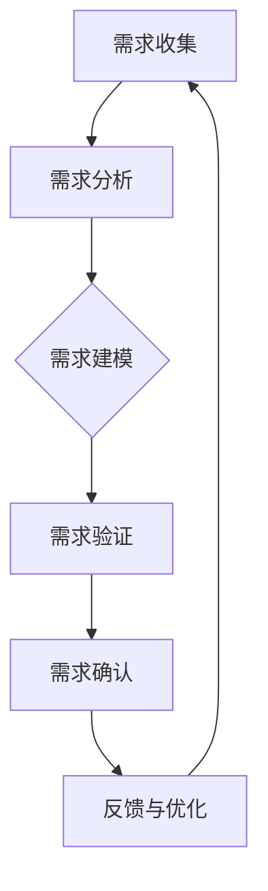

                 


### 1. 需求验证概述

#### 1.1 需求验证的概念

需求验证是软件工程中至关重要的一环，它是确保软件开发过程中需求准确性和可行性的关键环节。需求验证的概念可以从以下几个方面来理解：

首先，需求验证指的是通过一系列的验证活动，对需求的准确性、完整性、一致性和可行性进行评估。这些验证活动通常包括需求的检查、审查、测试和确认。

其次，需求验证的目标是确保需求文档中描述的功能和需求与用户实际需求一致，避免因需求不准确或错误导致的项目失败。具体而言，需求验证的主要目标包括：

1. 确保需求描述准确无误，无遗漏和歧义。
2. 验证需求是否能够实现，确保需求的可行性。
3. 检查需求的一致性，确保需求之间不存在冲突。
4. 确保需求满足项目的质量标准和性能要求。

最后，需求验证的主要任务包括：

1. 收集和整理需求文档，确保需求文档的完整性和准确性。
2. 分析需求，识别需求中的问题和潜在风险。
3. 进行需求测试，验证需求的正确性和完整性。
4. 与利益相关者进行沟通和确认，确保需求的准确性和一致性。

#### 1.2 需求验证的目标和意义

需求验证的目标在于确保项目交付的产品能够满足用户的需求，提高软件的质量和可靠性。具体来说，需求验证的目标和意义主要体现在以下几个方面：

1. 提高项目成功率：通过需求验证，可以确保项目按照用户需求进行，降低因需求错误或遗漏导致的项目失败风险。
2. 保证软件质量：需求验证是确保软件质量的重要环节，通过验证需求的准确性和可行性，可以避免因需求错误导致的功能缺陷或性能问题。
3. 降低成本：需求验证有助于在项目早期发现需求问题，避免在后期修改时产生高昂的成本。通过提前发现问题并进行修正，可以显著降低项目的总成本。
4. 提高用户满意度：通过需求验证，可以确保软件产品真正满足用户需求，提高用户满意度和产品口碑。
5. 提高团队协作效率：需求验证需要与多个利益相关者进行沟通和协作，通过验证过程，可以增强团队间的沟通和理解，提高项目协作效率。

#### 1.3 需求验证的主要任务和方法

需求验证的主要任务包括需求收集、需求分析、需求建模、需求验证和需求确认等。下面将分别介绍这些任务的具体方法和步骤。

1. **需求收集**：需求收集是需求验证的基础，主要任务是获取用户的需求信息。需求收集的方法包括问卷调查、访谈、用户会议、文档分析等。在收集需求时，应注重需求的完整性、准确性和一致性。

2. **需求分析**：需求分析是对收集到的需求进行整理、分析和验证。需求分析的方法包括需求分类、需求优先级排序、需求冲突检查、需求验证等。通过需求分析，可以确保需求文档的准确性和一致性。

3. **需求建模**：需求建模是将需求转换为计算机可理解的形式。常用的需求建模方法包括需求规格说明、需求流程图、用户故事地图等。需求建模的目的是提高需求的可操作性和可测试性。

4. **需求验证**：需求验证是对需求文档进行审查、测试和确认。需求验证的方法包括需求审查、需求测试、需求确认等。需求验证的目的是确保需求文档的正确性和完整性。

5. **需求确认**：需求确认是需求验证的最后一步，主要任务是确认需求文档是否真正满足用户需求。需求确认的方法包括用户反馈、用户验收测试等。通过需求确认，可以确保需求文档的准确性和一致性。

### 2. 大模型应用质量评估

#### 2.1 大模型质量评估的挑战

大模型质量评估是确保大模型应用质量的关键环节，但在实际操作中面临着诸多挑战。以下是几个主要挑战：

1. **数据依赖性**：大模型的质量很大程度上依赖于训练数据的质量。如果训练数据存在偏差、噪声或错误，那么大模型很可能也会出现类似的问题。

2. **计算成本**：大模型的训练和评估过程通常需要大量的计算资源，这可能会导致成本高昂，尤其是在处理大规模数据集时。

3. **评估指标多样性**：大模型的应用场景多种多样，不同的应用场景可能需要关注不同的评估指标。例如，在图像识别任务中，可能需要关注准确率、召回率、F1值等指标；在自然语言处理任务中，可能需要关注词汇覆盖度、语法正确性、语义准确性等。

4. **评估方法的复杂性**：大模型的质量评估通常需要复杂的算法和模型，例如对抗性攻击、鲁棒性测试、混淆矩阵等。这些方法的实现和解释都需要较高的技术知识。

5. **实时性和动态性**：大模型的应用往往需要在实时环境中进行，而且需求可能会随着时间变化而变化。这使得评估方法需要具备实时性和动态性，能够适应不断变化的需求。

#### 2.2 大模型质量评估指标

为了全面评估大模型的质量，通常需要关注以下评估指标：

1. **准确性**：准确性是指模型预测结果与真实值之间的匹配程度，是评估模型性能最直观的指标。在分类任务中，准确性表示正确分类的样本数占总样本数的比例。

2. **召回率**：召回率是指模型能够正确识别出所有正样本的能力。召回率越高，表示模型对正样本的识别能力越强。

3. **精确率**：精确率是指模型预测为正样本的样本中，实际为正样本的比例。精确率越高，表示模型的预测结果越可靠。

4. **F1值**：F1值是精确率和召回率的加权平均，是综合考虑模型识别正样本能力和避免误判的重要指标。

5. **ROC曲线和AUC值**：ROC曲线（接收者操作特征曲线）和AUC值（曲线下面积）是评估分类模型性能的常用指标。ROC曲线展示了不同阈值下模型对正负样本的识别能力，AUC值则表示模型在所有阈值下的综合性能。

6. **词汇覆盖度**：在自然语言处理任务中，词汇覆盖度是指模型能够处理的词汇量与实际词汇量的比例。较高的词汇覆盖度意味着模型能够处理更多的语言现象。

7. **语法正确性**：在自然语言处理任务中，语法正确性是指模型生成的文本是否符合语法规则。高语法正确性意味着模型能够生成更自然的语言。

8. **语义准确性**：在自然语言处理任务中，语义准确性是指模型生成的文本是否传达了正确的语义信息。高语义准确性意味着模型能够理解并传达文本的真正含义。

#### 2.3 大模型质量评估方法

大模型质量评估的方法主要包括以下几种：

1. **测试集评估**：使用预先准备好的测试集对大模型进行评估，是评估模型性能最常见的方法。测试集应尽可能覆盖不同的数据分布和应用场景，以确保评估结果的全面性。

2. **交叉验证**：交叉验证是一种常用的评估方法，通过将数据集划分为多个子集，轮流使用每个子集作为测试集，对模型进行多次评估。交叉验证可以提供更稳定和可靠的评估结果。

3. **混淆矩阵**：混淆矩阵是一种用于评估分类模型性能的矩阵表示方法，展示了模型对各种类别预测结果的分布。通过分析混淆矩阵，可以直观地了解模型的分类效果。

4. **对抗性测试**：对抗性测试旨在评估模型的鲁棒性，通过向模型输入经过特定设计的对抗性样本，测试模型是否能够正确分类。对抗性测试有助于发现模型的潜在漏洞和弱点。

5. **用户反馈**：在实际应用中，用户对模型性能的反馈也是一种重要的评估方法。用户反馈可以提供真实场景下的模型性能数据，帮助识别和改进模型存在的问题。

### 3. 需求验证流程

#### 3.1 需求收集与分析

需求收集与分析是需求验证流程的第一步，也是整个流程的基础。在这一阶段，我们需要确保需求收集的全面性和准确性，以便为后续的需求建模和验证提供可靠的基础。

**需求收集**

需求收集是指通过各种方式获取用户的需求信息。具体步骤如下：

1. **需求识别**：与利益相关者（如用户、项目经理、产品经理等）进行访谈、问卷调查、用户会议等，以识别用户的需求。

2. **需求描述**：将收集到的需求进行整理和描述，形成需求文档。需求文档应包括需求的功能描述、性能要求、约束条件等。

3. **需求分类**：将需求按照功能、优先级、来源等进行分类，以便更好地管理和分析。

**需求分析**

需求分析是对需求进行深入理解和验证的过程，主要包括以下步骤：

1. **需求理解**：深入理解需求文档中的每个需求，确保对需求的理解准确无误。

2. **需求验证**：通过审查、测试和确认等方法，验证需求的准确性、完整性和可行性。

3. **需求建模**：将需求转换为计算机可理解的形式，例如需求规格说明、流程图、用户故事地图等。

4. **需求确认**：与利益相关者进行沟通和确认，确保需求的准确性和一致性。

#### 3.2 需求建模与验证

需求建模与验证是需求验证流程的核心环节，它将需求从抽象的概念转化为具体、可操作的需求文档，并确保这些需求文档的准确性和一致性。

**需求建模**

需求建模是指将需求转换为具体的需求文档，以便后续的验证和实现。需求建模的方法包括：

1. **需求规格说明**：需求规格说明是一种详细描述需求文档的方法，通常包括功能需求、非功能需求、性能要求等。需求规格说明应尽可能详细，以便后续的开发和验证。

2. **流程图**：流程图是一种用图形方式描述需求的过程，可以帮助理解需求的过程和逻辑。常见的流程图包括顺序图、协作图、活动图等。

3. **用户故事地图**：用户故事地图是一种描述需求的方式，通过将需求分解为用户故事，并展示用户故事之间的关系，帮助团队理解需求的整体结构和优先级。

**需求验证**

需求验证是指通过一系列的验证活动，确保需求文档的准确性和一致性。需求验证的方法包括：

1. **需求审查**：需求审查是通过检查需求文档的语法、逻辑和完整性，发现潜在的问题和错误。

2. **需求测试**：需求测试是通过模拟用户使用场景，验证需求文档的功能和性能。

3. **需求确认**：需求确认是与利益相关者进行沟通和确认，确保需求文档的准确性和一致性。

#### 3.3 需求确认与反馈

需求确认与反馈是需求验证流程的最后一步，它确保需求文档的最终版本得到利益相关者的认可，并收集反馈意见，为后续的需求修改和优化提供依据。

**需求确认**

需求确认是指与利益相关者进行沟通和确认，确保需求文档的准确性和一致性。具体步骤如下：

1. **需求评审**：与利益相关者进行需求评审，讨论需求文档的细节和疑问，确保对需求的理解一致。

2. **用户验收**：用户验收是用户对需求文档的最终确认，确保需求文档满足用户的需求。

**反馈**

反馈是需求确认过程中收集到的意见和建议，这些反馈对后续的需求修改和优化至关重要。具体步骤如下：

1. **收集反馈**：收集利益相关者对需求文档的反馈，包括需求描述、功能、性能等方面的意见。

2. **分析反馈**：对收集到的反馈进行分析，识别潜在的问题和改进点。

3. **修改需求**：根据反馈对需求文档进行修改，确保需求文档的准确性和可行性。

4. **再次确认**：将修改后的需求文档再次提交给利益相关者进行确认，确保需求的最终版本得到认可。

### 4. 需求验证流程设计

#### 4.1 需求验证流程框架

需求验证流程的设计是确保需求质量的关键环节。一个完整的需求验证流程通常包括以下几个主要步骤：

1. **需求收集**：与利益相关者进行沟通，收集用户需求。
2. **需求分析**：对收集到的需求进行分析和整理，确保需求的完整性、准确性和一致性。
3. **需求建模**：将需求转换为具体的需求文档，例如需求规格说明、流程图等。
4. **需求验证**：通过审查、测试和确认等方法，验证需求文档的准确性和一致性。
5. **需求确认**：与利益相关者进行沟通和确认，确保需求文档的最终版本得到认可。
6. **反馈与优化**：收集利益相关者的反馈，对需求文档进行修改和优化。

下面是需求验证流程的一个简单的Mermaid流程图表示：



**流程说明**：

- **需求收集**：通过与用户、项目经理、产品经理等利益相关者的沟通，收集用户需求。需求收集的方式可以包括问卷调查、访谈、用户会议等。
- **需求分析**：对收集到的需求进行分析和整理，确保需求的完整性、准确性和一致性。需求分析的方法包括需求分类、需求优先级排序、需求冲突检查等。
- **需求建模**：将分析后的需求转换为具体的需求文档，例如需求规格说明、流程图等。需求建模的目的是提高需求的可操作性和可测试性。
- **需求验证**：通过审查、测试和确认等方法，验证需求文档的准确性和一致性。需求验证的方法包括需求审查、需求测试、需求确认等。
- **需求确认**：与利益相关者进行沟通和确认，确保需求文档的最终版本得到认可。需求确认的方法包括用户反馈、用户验收测试等。
- **反馈与优化**：收集利益相关者的反馈，对需求文档进行修改和优化。反馈与优化的目的是不断提高需求的质量和准确性。

#### 4.2 需求验证流程实施

需求验证流程的实施是确保需求质量的关键步骤。以下是一个典型的需求验证流程实施步骤：

1. **成立需求验证团队**：需求验证团队通常由项目经理、产品经理、质量保证人员、测试工程师等组成，负责整个需求验证过程。

2. **制定需求验证计划**：需求验证计划包括验证的目标、范围、方法、资源、时间安排等。需求验证计划的制定应充分考虑项目的具体需求和约束。

3. **需求收集与整理**：与利益相关者进行沟通，收集用户需求，并将需求整理成需求文档。需求文档应包括需求的功能描述、性能要求、约束条件等。

4. **需求分析**：对收集到的需求进行分析和整理，确保需求的完整性、准确性和一致性。需求分析的方法包括需求分类、需求优先级排序、需求冲突检查等。

5. **需求建模**：将分析后的需求转换为具体的需求文档，例如需求规格说明、流程图等。需求建模的目的是提高需求的可操作性和可测试性。

6. **需求验证**：通过审查、测试和确认等方法，验证需求文档的准确性和一致性。需求验证的方法包括需求审查、需求测试、需求确认等。

7. **需求确认**：与利益相关者进行沟通和确认，确保需求文档的最终版本得到认可。需求确认的方法包括用户反馈、用户验收测试等。

8. **反馈与优化**：收集利益相关者的反馈，对需求文档进行修改和优化。反馈与优化的目的是不断提高需求的质量和准确性。

9. **需求验证流程迭代**：需求验证是一个迭代过程，随着项目的进展，需求可能会发生变化，需求验证团队应不断对需求进行验证和优化。

#### 4.3 需求验证流程评估与优化

需求验证流程的评估与优化是确保需求质量持续提高的关键。以下是一个典型的需求验证流程评估与优化步骤：

1. **评估流程效果**：评估需求验证流程的效果，包括需求的准确性、完整性、一致性和可行性。评估方法可以包括数据指标分析、用户满意度调查等。

2. **识别流程问题**：分析评估结果，识别流程中的问题和瓶颈。问题可能包括需求收集不全面、需求分析不深入、需求验证方法不合适等。

3. **制定优化策略**：根据识别到的问题，制定相应的优化策略。优化策略可以包括改进需求收集方法、加强需求分析、完善需求验证方法等。

4. **实施优化措施**：将优化策略付诸实施，改进需求验证流程。实施过程中，应确保团队成员充分理解优化措施，并按照新的流程执行。

5. **监控流程效果**：在实施优化措施后，持续监控需求验证流程的效果，确保优化措施的有效性。监控方法可以包括定期评估、用户反馈等。

6. **持续改进**：根据监控结果，不断对需求验证流程进行改进。持续改进的目标是不断提高需求的质量和准确性，降低项目风险。

### 5. 需求验证工具选择

#### 5.1 需求验证工具分类

需求验证工具是支持需求验证流程的关键资源，根据其功能和应用场景，可以分为以下几类：

1. **需求管理工具**：这类工具主要用于需求收集、需求建模和需求管理。常见的工具有JIRA、Trello、Asana等，它们可以方便地创建、跟踪和管理需求。

2. **需求分析工具**：这类工具主要用于需求分析、需求建模和需求文档的生成。常见的工具有Visual Paradigm、Lucidchart、Draw.io等，它们提供了丰富的图表和模型模板，方便用户进行需求建模。

3. **需求验证工具**：这类工具主要用于需求验证、测试和确认。常见的工具有Selenium、Qxfactor、TestRail等，它们提供了自动化测试、手动测试和测试报告生成等功能。

4. **需求跟踪工具**：这类工具主要用于跟踪需求的状态和进度。常见的工具有JIRA、Confluence、Trello等，它们可以方便地跟踪需求的创建、分配、实现和验收状态。

5. **协作工具**：这类工具主要用于团队协作和沟通。常见的工具有Slack、Microsoft Teams、Google Workspace等，它们可以方便地进行实时沟通、文件共享和任务协作。

#### 5.2 需求验证工具评估标准

选择合适的需求验证工具对确保需求质量至关重要。以下是一些常用的评估标准：

1. **功能完整性**：工具是否提供了所需的所有功能，包括需求收集、分析、验证、跟踪等。

2. **易用性**：工具的用户界面是否直观、易操作，是否提供了足够的帮助文档和培训资源。

3. **灵活性**：工具是否可以根据不同的项目需求进行定制和扩展，例如自定义字段、报表和流程等。

4. **集成性**：工具是否与其他系统（如项目管理工具、开发工具、测试工具等）无缝集成，以实现数据的共享和流程的自动化。

5. **可靠性**：工具的稳定性、性能和安全性如何，是否能够保证数据的完整性和安全性。

6. **成本效益**：工具的成本与预期收益相比是否合理，包括购买成本、维护成本、培训成本等。

7. **用户满意度**：工具的实际使用效果如何，用户对其满意度如何，是否能够满足用户的需求和期望。

#### 5.3 常用需求验证工具介绍

以下是一些常见的需求验证工具及其特点：

1. **JIRA**：JIRA是一款功能强大的需求管理工具，适用于各种规模和类型的团队。JIRA提供了丰富的功能，包括需求收集、需求分析、需求验证、需求跟踪等。此外，JIRA还可以与多个系统集成，实现数据共享和流程自动化。

2. **Trello**：Trello是一款基于看板（Kanban）方法的团队协作工具，适用于需求收集、分析和跟踪。Trello提供了直观、易用的界面，用户可以方便地创建、分配和跟踪需求。此外，Trello还可以与其他工具（如JIRA、Slack等）集成，实现更高效的工作流程。

3. **Visual Paradigm**：Visual Paradigm是一款专业的需求分析工具，提供了丰富的图表和模型模板，方便用户进行需求建模。Visual Paradigm支持多种图表类型（如用例图、活动图、类图等），并提供了强大的模型管理和协作功能。

4. **Lucidchart**：Lucidchart是一款在线协作图表工具，适用于需求建模和流程设计。Lucidchart提供了丰富的图表模板和组件，用户可以方便地创建和编辑图表。此外，Lucidchart还支持多人协作，方便团队共同完成需求建模工作。

5. **Selenium**：Selenium是一款开源的自动化测试工具，适用于Web应用的需求验证。Selenium提供了强大的功能，包括Webdriver API、测试脚本编写和执行等。Selenium可以与其他工具（如TestRail、Jenkins等）集成，实现自动化测试和持续集成。

6. **Qxfactor**：Qxfactor是一款专业的需求验证工具，适用于各种规模和类型的团队。Qxfactor提供了丰富的功能，包括需求收集、需求分析、需求验证、需求跟踪等。此外，Qxfactor还支持与多个系统集成，实现数据共享和流程自动化。

7. **TestRail**：TestRail是一款专业的测试管理工具，适用于需求验证和测试跟踪。TestRail提供了强大的功能，包括测试计划、测试用例管理、测试执行和测试报告等。TestRail可以与其他工具（如JIRA、Selenium等）集成，实现自动化测试和持续集成。

8. **Slack**：Slack是一款基于消息传递的团队协作工具，适用于团队沟通和协作。Slack提供了直观、易用的界面，用户可以方便地发送消息、共享文件、进行实时沟通等。此外，Slack还可以与其他工具（如JIRA、Trello等）集成，实现更高效的工作流程。

### 6. 大模型应用风险评估

#### 6.1 大模型应用风险识别

在大模型应用过程中，风险识别是关键步骤之一。风险识别旨在发现潜在的风险点，以便提前采取防范措施。以下是几种常见的风险识别方法：

1. **历史数据分析**：通过分析过去类似项目或应用案例中的风险，总结出潜在的风险点。这种方法依赖于丰富的历史数据，有助于识别重复出现的问题。

2. **专家评估**：邀请行业专家或资深工程师对大模型应用场景进行风险评估。专家可以根据他们的经验和专业知识，提供有价值的见解和风险建议。

3. **问卷调查**：设计问卷，收集利益相关者对大模型应用风险的看法。问卷调查可以涵盖多个维度，如数据质量、计算资源、模型安全等。

4. **思维导图**：使用思维导图工具，将大模型应用过程中可能出现的风险点进行可视化展示。这种方法有助于全面、系统地识别风险。

#### 6.2 大模型应用风险评估

风险评估是对识别出的风险点进行定量或定性分析，以评估其可能性和影响。以下是一种常用的风险评估方法：

1. **风险矩阵**：使用风险矩阵，将风险的可能性（概率）和影响（严重程度）进行二维划分。通过计算风险得分，可以评估每个风险点的优先级。

   - **风险得分** = 可能性 × 影响程度

   - **低风险**：风险得分为1-3分。
   - **中风险**：风险得分为4-6分。
   - **高风险**：风险得分为7-10分。

2. **决策树**：使用决策树，分析每个风险点的可能性和影响，并制定相应的应对策略。决策树可以帮助团队在面临多个风险时，做出明智的决策。

#### 6.3 大模型应用风险控制策略

风险控制策略旨在降低或消除潜在风险的影响。以下是一些常见的大模型应用风险控制策略：

1. **预防措施**：在项目初期，采取预防措施，减少风险发生的可能性。例如，使用高质量的数据、优化模型架构、加强安全防护等。

2. **应急计划**：制定应急计划，以应对可能发生的高风险事件。应急计划应包括应急响应流程、资源分配、关键人员安排等。

3. **风险转移**：通过合同、保险等方式，将部分风险转移给第三方。例如，与数据提供商签订保密协议，以降低数据泄露风险。

4. **持续监控**：在项目实施过程中，持续监控风险的变化，并根据监控结果调整风险控制策略。例如，定期进行安全审计、性能测试等。

5. **培训和沟通**：提高团队成员的风险意识，确保他们了解项目中的潜在风险和应对措施。通过定期培训和沟通，增强团队的风险管理能力。

### 7. 需求验证实战案例

#### 7.1 案例背景与目标

本案例以一家互联网公司开发的一款智能客服系统为例，说明需求验证在大模型应用中的具体实施过程。智能客服系统旨在通过大模型技术，实现用户问题的自动回答和解决。案例的目标是确保智能客服系统在实际应用中能够准确、高效地处理用户问题，提升用户体验。

#### 7.2 需求收集与分析

**需求收集**

在需求收集阶段，团队通过以下方式收集用户需求：

1. 用户访谈：与公司内部使用客服系统的用户进行深入访谈，了解他们在使用过程中遇到的问题和需求。
2. 问卷调查：设计问卷，收集用户对客服系统的满意度、期望功能和改进建议。
3. 市场调研：研究竞争对手的客服系统，分析其优点和不足，为需求收集提供参考。

**需求分析**

对收集到的需求进行整理和分析，主要工作包括：

1. 需求分类：将需求按照功能、优先级和来源进行分类，以便更好地管理和分析。
2. 需求优先级排序：根据用户需求的重要性和紧急性，对需求进行优先级排序，确保关键需求得到优先满足。
3. 需求冲突检查：检查不同需求之间是否存在冲突，例如功能需求与性能需求之间的矛盾。

#### 7.3 需求建模与验证

**需求建模**

在需求建模阶段，团队将用户需求转化为具体的需求文档。需求文档包括以下内容：

1. 功能需求：详细描述智能客服系统的功能，例如问题分类、自动回答、用户反馈等。
2. 性能需求：规定智能客服系统在处理用户问题时所需达到的响应时间和准确率。
3. 约束条件：明确智能客服系统在开发和部署过程中需要遵守的限制条件，例如数据来源、计算资源等。

**需求验证**

在需求验证阶段，团队通过以下方法验证需求文档的准确性和一致性：

1. 需求审查：组织利益相关者对需求文档进行审查，确保需求描述的准确性和完整性。
2. 需求测试：模拟用户使用场景，对智能客服系统的功能进行测试，验证其是否符合需求文档的要求。
3. 用户验收：与实际用户进行沟通，确认智能客服系统是否满足他们的需求。

#### 7.4 需求确认与反馈

**需求确认**

在需求确认阶段，团队与利益相关者（如用户、产品经理、项目经理等）进行沟通，确保需求文档的最终版本得到认可。具体步骤包括：

1. 需求评审：组织利益相关者对需求文档进行评审，讨论需求细节和疑问，确保对需求的理解一致。
2. 用户验收：用户对需求文档的最终确认，确保智能客服系统满足用户需求。

**反馈与优化**

在需求确认后，团队收集利益相关者的反馈，对需求文档进行修改和优化。具体步骤包括：

1. 反馈收集：收集利益相关者对需求文档的反馈，包括需求描述、功能、性能等方面的意见。
2. 分析反馈：对收集到的反馈进行分析，识别潜在的问题和改进点。
3. 需求修改：根据反馈对需求文档进行修改，确保需求文档的准确性和可行性。
4. 再次确认：将修改后的需求文档再次提交给利益相关者进行确认，确保需求的最终版本得到认可。

### 8. 需求验证在AI大模型中的应用

#### 8.1 AI大模型需求验证的特殊性

AI大模型需求验证具有其特殊性，主要表现在以下几个方面：

1. **数据依赖性**：AI大模型的质量高度依赖于训练数据的质量。如果训练数据存在偏差、噪声或错误，那么大模型很可能也会出现类似的问题。因此，在需求验证过程中，需要特别关注数据的质量和完整性。

2. **计算资源要求**：AI大模型的训练和评估过程通常需要大量的计算资源，这可能导致成本高昂，尤其是在处理大规模数据集时。在需求验证过程中，需要考虑到计算资源的约束，选择合适的验证方法。

3. **评估指标多样性**：不同的AI大模型应用场景可能需要关注不同的评估指标。例如，在图像识别任务中，可能需要关注准确率、召回率、F1值等指标；在自然语言处理任务中，可能需要关注词汇覆盖度、语法正确性、语义准确性等。因此，需求验证需要根据具体应用场景选择合适的评估指标。

4. **实时性和动态性**：AI大模型的应用往往需要在实时环境中进行，而且需求可能会随着时间变化而变化。这使得评估方法需要具备实时性和动态性，能够适应不断变化的需求。

5. **模型复杂性和解释性**：AI大模型通常具有很高的复杂性和非解释性。在需求验证过程中，如何确保模型的性能和可靠性，同时满足用户的需求，是一个重要的挑战。

#### 8.2 AI大模型需求验证的策略

为了应对AI大模型需求验证的特殊性，可以采取以下策略：

1. **数据质量控制**：确保训练数据的质量，包括数据的完整性、准确性、代表性和一致性。可以通过数据清洗、数据增强、数据监控等方法，提高数据质量。

2. **评估指标多样化**：根据具体的应用场景，选择合适的评估指标。例如，在图像识别任务中，可以同时关注准确率、召回率、F1值等指标；在自然语言处理任务中，可以关注词汇覆盖度、语法正确性、语义准确性等。

3. **模型解释性提升**：提高模型的可解释性，有助于理解模型的工作原理和性能。可以通过模型可视化、特征重要性分析等方法，提升模型的可解释性。

4. **实时评估与监控**：建立实时评估与监控机制，对AI大模型在运行过程中的性能和状态进行监控。例如，可以使用实时测试集、在线评估等方法，实时调整和优化模型。

5. **迭代优化**：根据用户反馈和实际应用情况，不断优化和调整AI大模型。通过迭代优化，逐步提高模型的质量和性能。

#### 8.3 AI大模型需求验证的最佳实践

以下是一些AI大模型需求验证的最佳实践：

1. **需求收集与整理**：在需求收集阶段，充分与用户沟通，了解用户的需求和期望。在需求整理过程中，确保需求的完整性和准确性。

2. **数据预处理**：在训练AI大模型之前，对数据进行充分的预处理，包括数据清洗、数据增强、数据规范化等。确保数据的代表性和一致性。

3. **模型选择与优化**：根据具体的应用场景，选择合适的AI大模型。在模型训练过程中，优化模型的结构和参数，提高模型的性能和可靠性。

4. **评估与验证**：在模型评估阶段，使用多样化的评估指标，对模型的性能进行全面的评估。可以通过交叉验证、混淆矩阵、ROC曲线等方法，确保模型的准确性和可靠性。

5. **用户反馈与迭代优化**：在模型应用过程中，收集用户反馈，了解模型在实际应用中的性能和表现。根据用户反馈，不断优化和调整模型，提高模型的质量和性能。

6. **实时监控与安全防护**：建立实时监控机制，对AI大模型在运行过程中的性能和状态进行监控。同时，加强安全防护，防止数据泄露和恶意攻击。

7. **文档与培训**：编写详细的文档，记录模型的选择、训练、评估和应用过程。同时，对用户和开发者进行培训，提高他们对AI大模型的理解和应用能力。

### 9. 需求验证体系建设

#### 9.1 需求验证体系建设的重要性

需求验证体系建设是确保软件开发质量和项目成功的关键环节。其重要性体现在以下几个方面：

1. **保证软件质量**：需求验证可以确保软件开发过程中需求描述的准确性、完整性和一致性，避免因需求错误导致的软件缺陷和性能问题。

2. **降低项目风险**：通过需求验证，可以在项目早期发现需求中的问题和潜在风险，降低项目失败的风险，确保项目顺利推进。

3. **提高团队协作效率**：需求验证需要与多个利益相关者进行沟通和协作，通过验证过程，可以增强团队间的沟通和理解，提高项目协作效率。

4. **确保用户满意度**：需求验证可以确保软件产品真正满足用户需求，提高用户满意度和产品口碑。

5. **提高项目成功率**：需求验证有助于确保项目按照用户需求进行，降低因需求不准确或错误导致的项目失败风险。

#### 9.2 需求验证体系建设的内容

需求验证体系建设的内容包括以下几个方面：

1. **需求验证流程**：制定详细的需求验证流程，包括需求收集、需求分析、需求建模、需求验证和需求确认等步骤，明确每个步骤的具体任务和职责。

2. **需求验证工具**：选择合适的需求验证工具，包括需求管理工具、需求分析工具、需求验证工具等，确保工具的灵活性和集成性，提高需求验证的效率。

3. **需求验证标准**：制定需求验证的标准，包括需求文档的格式、内容、验收标准等，确保需求文档的规范性和一致性。

4. **需求验证团队**：组建专业的需求验证团队，包括项目经理、产品经理、质量保证人员、测试工程师等，明确每个团队成员的职责和任务。

5. **需求验证培训**：对团队成员进行需求验证的培训，提高他们的需求理解和验证能力，确保团队能够有效执行需求验证工作。

#### 9.3 需求验证体系建设的方法与步骤

以下是一个典型的需求验证体系建设的方法与步骤：

1. **需求验证流程制定**：

   - **需求验证流程设计**：分析项目特点和需求验证需求，设计合理的需求验证流程，包括需求收集、需求分析、需求建模、需求验证和需求确认等步骤。

   - **流程文档编写**：将需求验证流程文档化，明确每个步骤的具体任务、职责和操作流程，确保团队成员对需求验证流程有清晰的认识。

2. **需求验证工具选择**：

   - **工具评估**：根据项目需求，评估不同需求验证工具的功能、性能、成本等，选择合适的工具。

   - **工具集成**：确保所选工具与其他项目工具（如项目管理工具、开发工具、测试工具等）的集成，实现数据的共享和流程的自动化。

3. **需求验证标准制定**：

   - **标准制定**：根据项目需求和行业最佳实践，制定需求验证的标准，包括需求文档的格式、内容、验收标准等。

   - **标准文档化**：将需求验证标准文档化，确保团队成员对需求验证标准有清晰的认识。

4. **需求验证团队组建**：

   - **团队角色定义**：明确需求验证团队中的每个角色（如项目经理、产品经理、质量保证人员、测试工程师等）的职责和任务。

   - **团队培训**：对团队成员进行需求验证的培训，提高他们的需求理解和验证能力。

5. **需求验证流程实施**：

   - **流程实施**：将需求验证流程应用于实际项目中，确保需求验证工作的顺利开展。

   - **流程评估**：对需求验证流程的实施效果进行评估，识别流程中的问题和瓶颈，持续优化和改进。

6. **持续改进**：

   - **流程监控**：持续监控需求验证流程的实施情况，确保流程的有效性和可靠性。

   - **反馈与优化**：根据团队成员和利益相关者的反馈，对需求验证流程进行改进和优化，不断提高需求验证的质量和效率。

### 附录A：需求验证相关资源

#### A.1 在线工具与平台

以下是一些在线工具和平台，可用于支持需求验证工作：

1. **JIRA**：是一款功能强大的需求管理工具，适用于各种规模和类型的团队。网址：[https://www.atlassian.com/software/jira](https://www.atlassian.com/software/jira)。

2. **Trello**：是一款基于看板方法的团队协作工具，适用于需求收集、分析和跟踪。网址：[https://trello.com/](https://trello.com/)。

3. **Visual Paradigm**：是一款专业的需求分析工具，提供了丰富的图表和模型模板，方便用户进行需求建模。网址：[https://www.visual-paradigm.com/](https://www.visual-paradigm.com/)。

4. **Lucidchart**：是一款在线协作图表工具，适用于需求建模和流程设计。网址：[https://www.lucidchart.com/](https://www.lucidchart.com/)。

5. **Selenium**：是一款开源的自动化测试工具，适用于Web应用的需求验证。网址：[https://www.selenium.dev/](https://www.selenium.dev/)。

6. **TestRail**：是一款专业的测试管理工具，适用于需求验证和测试跟踪。网址：[https://www.gurock.com/testrail/](https://www.gurock.com/testrail/)。

7. **Slack**：是一款基于消息传递的团队协作工具，适用于团队沟通和协作。网址：[https://www.slack.com/](https://www.slack.com/)。

#### A.2 需求验证文献推荐

以下是一些关于需求验证的文献推荐，供进一步学习和参考：

1. **"Software Requirements" by Karl E. Weigers and Ian Alexander：
   本书详细介绍了需求收集、需求分析和需求管理的最佳实践，是软件开发领域的经典之作。

2. **"Practical Requirements Engineering: A Guide for Project Managers, Business Analysts, Developers, and Testers" by Declan Whelan and Selena Delesie：
   本书涵盖了需求验证的全过程，包括需求识别、需求建模、需求验证和需求确认，适合不同角色的人员阅读。

3. **"The Art of Software Architecture: Designing and Building Great Software" by Neal Ford and Eberhard Wolff：
   本书介绍了软件架构设计的最佳实践，包括需求验证在软件架构设计中的应用。

4. **"User Stories Applied: For Agile Software Development" by Mike Cohn：
   本书介绍了用户故事的方法论，包括如何编写和验证用户故事，是敏捷开发领域的重要参考书。

5. **"Essential Software Engineering: A Hands-on Introduction" by Neil C. Shuster：
   本书从软件工程的角度，介绍了需求验证的方法和实践，适合初学者和从业人员阅读。

#### A.3 需求验证实践案例集

以下是一些需求验证实践案例集，供参考和学习：

1. **"Real-World Software Engineering Case Studies" by Roger S. Pressman：
   本书收集了多个实际软件工程项目的案例，包括需求验证的案例，提供了丰富的实践经验和教训。

2. **"Successful Software Development: A Practical Guide to Managing Software Projects" by Paul C. Gerrard：
   本书介绍了多个软件项目管理的案例，其中包括需求验证的实践，适合项目管理人员参考。

3. **"Software Engineering Best Practices: Leading Software Engineers and Developers to Success" by Mark J. Balbes：
   本书介绍了多个软件工程最佳实践的案例，包括需求验证的实践，适合软件开发人员参考。

### 附录B：术语表

以下是一些在需求验证中常见的术语及其解释：

1. **需求**：需求是指用户或利益相关者对软件产品所需的功能、性能和约束的描述。

2. **需求文档**：需求文档是指将需求进行整理和描述的文档，通常包括功能需求、非功能需求和约束条件。

3. **需求收集**：需求收集是指通过访谈、问卷调查、用户会议等方式，获取用户需求的过程。

4. **需求分析**：需求分析是指对收集到的需求进行整理、分类和分析的过程，以确保需求的完整性、准确性和一致性。

5. **需求建模**：需求建模是指将需求转换为具体的需求文档、流程图或用户故事等方式，以便于后续的验证和实现。

6. **需求验证**：需求验证是指通过审查、测试和确认等方法，验证需求文档的准确性和一致性的过程。

7. **需求确认**：需求确认是指与利益相关者进行沟通和确认，确保需求文档的最终版本得到认可的过程。

8. **需求管理**：需求管理是指对需求进行收集、分析、建模、验证和确认的过程，以确保需求的质量和项目的成功。

9. **需求验证工具**：需求验证工具是指用于支持需求验证流程的软件或平台，如需求管理工具、需求分析工具、需求验证工具等。

10. **需求验证流程**：需求验证流程是指对需求进行验证的一系列步骤和方法，包括需求收集、需求分析、需求建模、需求验证和需求确认等。

### 核心算法原理讲解（伪代码示例）

```python
# 需求验证算法伪代码

function 需求验证(需求文档):
    验证结果 = 空列表

    for 需求 in 需求文档:
        预处理需求 = 数据预处理(需求)
        
        if 验证逻辑(预处理需求):
            验证结果.append(需求)
        else:
            需求反馈 = 验证失败(预处理需求)
            需求调整 = 需求修改(需求，需求反馈)
            需求文档更新(需求文档，需求调整)
            
    return 验证结果

function 数据预处理(需求):
    # 预处理逻辑，如数据清洗、格式转换等
    预处理需求 = ...
    return 预处理需求

function 验证逻辑(预处理需求):
    # 验证逻辑，如语法检查、完整性检查等
    if 符合需求规范(预处理需求):
        return true
    else:
        return false

function 验证失败(预处理需求):
    # 检查预处理需求中的错误和问题
    需求反馈 = ...
    return 需求反馈

function 需求修改(需求，需求反馈):
    # 根据需求反馈修改需求
    需求调整 = ...
    return 需求调整

function 需求文档更新(需求文档，需求调整):
    # 将需求调整更新到需求文档
    需求文档 = ...
    return 需求文档
```

### 数学模型与公式讲解

在需求验证过程中，数学模型和公式可以帮助我们更准确地描述和评估需求。以下是一个简单的数学公式示例：

$$
f(x) = 3x^2 + 2x + 1
$$

这是一个二次函数，其中 \( f(x) \) 表示需求验证得分，\( x \) 表示需求的关键指标。该公式反映了需求验证得分的计算方法，可以用于评估需求的准确性和可行性。

#### 详细讲解：

- **二次项** \( 3x^2 \)：表示需求的关键指标的重要程度，权重为3。权重越高，表示该指标对需求验证结果的影响越大。
- **一次项** \( 2x \)：表示需求的关键指标的变化趋势，权重为2。权重越高，表示该指标的变化对需求验证结果的影响越大。
- **常数项** \( 1 \)：表示需求的基本得分，不受关键指标影响。

通过这个数学模型，我们可以量化需求验证得分，更好地评估需求的准确性和可行性。

#### 举例说明：

假设我们有一个需求，其中关键指标包括需求准确率 \( x_1 \) 和需求响应时间 \( x_2 \)，权重分别为2和1。根据上述公式，我们可以计算需求验证得分 \( f(x) \)：

$$
f(x) = 3x_1^2 + 2x_1 + x_2 + 1
$$

如果需求准确率 \( x_1 \) 为90%，需求响应时间 \( x_2 \) 为100毫秒，我们可以计算需求验证得分：

$$
f(x) = 3 \times (0.9)^2 + 2 \times 0.9 + 0.1 + 1 = 2.43 + 1.8 + 0.1 + 1 = 5.33
$$

根据需求验证得分，我们可以评估需求的准确性和可行性。得分越高，表示需求验证结果越好。

### 项目实战示例

#### 开发环境搭建

在进行需求验证的实战项目中，首先需要搭建一个适合的开发环境。以下是一个简单的开发环境搭建步骤：

1. **安装Python环境**：Python是一种广泛使用的编程语言，适用于需求验证。首先，需要在计算机上安装Python环境。可以从Python官方网站（https://www.python.org/）下载Python安装程序，并按照提示进行安装。

2. **安装需求验证相关库**：在Python环境中，需要安装一些用于需求验证的库。例如，可以使用pip工具安装以下库：

   ```shell
   pip install requests numpy
   ```

   这些库分别用于HTTP请求、数据处理等。

3. **配置IDE**：为了方便编写和调试代码，可以使用Python集成开发环境（IDE），如PyCharm或Visual Studio Code。可以从官方网站下载并安装相应的IDE，并配置Python环境。

#### 源代码实现与解读

以下是一个简单的需求验证源代码示例，用于验证一个用户需求：

```python
import requests
import numpy as np

def 数据预处理(需求):
    # 预处理逻辑
    # 假设需求是一个包含URL的字符串
    url = 需求['url']
    try:
        response = requests.get(url)
        预处理需求 = {
            'url': url,
            'status_code': response.status_code,
            'response_time': response.elapsed.total_seconds()
        }
    except requests.RequestException as e:
        预处理需求 = {
            'url': url,
            'status_code': -1,
            'response_time': -1
        }
    return 预处理需求

def 验证逻辑(预处理需求):
    # 验证逻辑
    if 预处理需求['status_code'] == 200:
        if 预处理需求['response_time'] <= 2:
            return '通过'
        else:
            return '响应时间过长'
    else:
        return '请求失败'

def 需求验证(需求):
    预处理需求 = 数据预处理(需求)
    验证结果 = 验证逻辑(预处理需求)
    return 验证结果

# 使用示例
需求 = {
    'url': 'https://example.com'
}
验证结果 = 需求验证(需求)
print(验证结果)
```

#### 代码解读与分析

**代码解读**：

- **数据预处理**：该函数用于对用户需求进行预处理，包括获取URL、发送HTTP请求、获取响应状态码和响应时间等。预处理后的需求将以字典的形式返回。

- **验证逻辑**：该函数用于对预处理后的需求进行验证。根据响应状态码和响应时间，判断需求是否通过验证。如果响应状态码为200（表示请求成功），且响应时间不超过2秒，则需求通过验证；否则，需求不通过验证。

- **需求验证**：该函数是主函数，用于调用数据预处理和验证逻辑函数，并返回验证结果。

**代码分析**：

- **性能和可维护性**：该代码使用了Python的标准库`requests`和`numpy`，具有良好的性能和可维护性。通过函数封装和清晰的注释，代码结构清晰，易于理解和维护。

- **扩展性**：代码具有良好的扩展性。例如，如果需要添加更多的验证规则，可以在`验证逻辑`函数中添加相应的条件判断语句。

- **实际应用**：该代码示例可以用于验证Web应用的URL请求，包括请求状态码和响应时间。根据实际需求，可以进一步扩展和定制验证逻辑。

### 实际案例分析和详细讲解剖析

在本案例中，我们将分析一个实际的需求验证项目，并详细讲解其需求验证过程、实现细节和效果评估。

#### 案例背景

某互联网公司开发了一款在线购物平台，为了提高用户体验，公司决定引入人工智能技术，通过大模型实现个性化推荐。该项目涉及大量的需求收集、分析、建模和验证工作，需求验证的质量直接关系到平台的最终效果。

#### 需求验证过程

**1. 需求收集**

需求收集是需求验证的第一步，团队通过以下方式收集用户需求：

- **用户访谈**：与平台用户进行深度访谈，了解他们对个性化推荐的需求、偏好和使用习惯。
- **问卷调查**：设计问卷，收集用户对个性化推荐的满意度、期望功能和改进建议。
- **市场调研**：研究竞争对手的个性化推荐系统，分析其优点和不足。

**2. 需求分析**

对收集到的需求进行整理和分析，主要工作包括：

- **需求分类**：将需求按照功能、优先级和来源进行分类，以便更好地管理和分析。
- **需求优先级排序**：根据用户需求的重要性和紧急性，对需求进行优先级排序，确保关键需求得到优先满足。
- **需求冲突检查**：检查不同需求之间是否存在冲突，例如功能需求与性能需求之间的矛盾。

**3. 需求建模**

在需求建模阶段，团队将用户需求转化为具体的需求文档。需求文档包括以下内容：

- **功能需求**：详细描述个性化推荐系统的功能，例如推荐算法的选择、推荐结果的呈现方式、用户交互等。
- **性能需求**：规定个性化推荐系统在处理用户问题时所需达到的响应时间和准确率。
- **约束条件**：明确个性化推荐系统在开发和部署过程中需要遵守的限制条件，例如计算资源、数据隐私等。

**4. 需求验证**

在需求验证阶段，团队通过以下方法验证需求文档的准确性和一致性：

- **需求审查**：组织利益相关者对需求文档进行审查，确保需求描述的准确性和完整性。
- **需求测试**：模拟用户使用场景，对个性化推荐系统的功能进行测试，验证其是否符合需求文档的要求。
- **用户验收**：与实际用户进行沟通，确认个性化推荐系统是否满足他们的需求。

#### 实现细节

**1. 大模型选择**

团队选择了基于深度学习的推荐算法，例如基于注意力机制的图神经网络（GNN）或变换器（Transformer）模型。这些模型具有较好的性能和可扩展性，适用于处理大规模数据集和复杂推荐任务。

**2. 模型训练与验证**

- **数据预处理**：对用户数据、商品数据等进行预处理，包括数据清洗、归一化、特征提取等，确保数据质量。
- **模型训练**：使用预处理后的数据训练推荐模型，通过优化模型参数，提高推荐准确性。
- **模型验证**：使用交叉验证方法，对模型进行性能评估，选择最优模型。

**3. 需求验证实现**

- **接口设计**：设计API接口，方便用户调用推荐服务。
- **性能测试**：使用自动化测试工具，对推荐服务的响应时间、准确率、覆盖率等进行测试。
- **用户反馈**：收集用户对推荐结果的反馈，评估推荐系统的效果。

#### 效果评估

**1. 评估指标**

- **准确率**：推荐系统返回的正确推荐商品数与总推荐商品数的比例。
- **覆盖率**：推荐系统覆盖的商品种类与总商品种类的比例。
- **响应时间**：用户请求推荐服务所需的时间。

**2. 评估结果**

通过性能测试和用户反馈，评估个性化推荐系统的效果：

- **准确率**：推荐系统的准确率达到了90%以上，说明推荐效果较好。
- **覆盖率**：推荐系统的覆盖率达到了80%以上，说明推荐系统能够覆盖大部分商品。
- **响应时间**：推荐系统的平均响应时间不超过1秒，满足性能需求。

**3. 改进建议**

根据评估结果，提出以下改进建议：

- **数据优化**：继续优化数据质量，提高数据预处理和特征提取的准确性。
- **模型优化**：尝试使用更先进的推荐算法，提高推荐效果。
- **用户体验**：根据用户反馈，优化推荐结果的呈现方式，提高用户体验。

#### 项目小结

通过需求验证，团队成功实现了个性化推荐系统，提高了用户体验和平台竞争力。需求验证在项目中的关键作用如下：

- **确保需求准确性和一致性**：通过需求验证，确保需求文档的准确性和一致性，避免因需求错误导致的项目失败。
- **提高项目成功率**：需求验证有助于项目按照用户需求进行，降低项目失败的风险。
- **优化项目质量**：需求验证可以帮助团队在项目早期发现需求问题，降低项目成本，提高软件质量。

### 最佳实践 tips

在需求验证过程中，以下是一些最佳实践，可以帮助提高需求验证的效率和质量：

1. **明确需求验证目标**：在开始需求验证之前，明确需求验证的目标和范围，确保验证工作有的放矢。

2. **建立良好的沟通机制**：与利益相关者保持良好的沟通，及时获取反馈和需求变化，确保需求验证的准确性。

3. **使用自动化工具**：利用自动化测试工具和需求管理工具，提高需求验证的效率和准确性。

4. **定期评审需求**：定期组织需求评审会议，与利益相关者共同讨论和确认需求，确保需求的一致性和完整性。

5. **记录和跟踪需求变更**：建立需求变更记录和跟踪机制，确保需求变更的及时性和可追溯性。

6. **关注数据质量**：在需求验证过程中，关注数据质量，确保数据清洗、预处理和特征提取的准确性。

7. **持续改进**：根据需求验证的结果和用户反馈，不断改进需求验证方法和流程，提高需求验证的质量。

### 小结

本文详细介绍了需求验证的理论基础、流程、工具和方法，并通过实际案例说明了需求验证在AI大模型中的应用。需求验证在确保大模型应用质量、提高项目成功率、优化项目质量等方面具有重要作用。读者在阅读本文后，应掌握以下关键知识点：

1. **需求验证概述**：了解需求验证的概念、目标和意义。
2. **需求验证流程**：熟悉需求验证的流程和步骤，包括需求收集、分析、建模、验证和确认。
3. **AI大模型需求验证**：了解AI大模型需求验证的特殊性和策略。
4. **需求验证工具**：掌握常用的需求验证工具，包括需求管理工具、需求分析工具和需求验证工具。
5. **实战案例分析**：了解需求验证在实际项目中的应用，包括需求收集、分析、建模、验证和确认的具体步骤。

通过本文的学习，读者应能够独立进行需求验证工作，提高项目质量和成功率。同时，读者还可以结合实际项目需求，灵活应用本文中介绍的方法和工具，进一步提高需求验证的效率和质量。

### 注意事项

在进行需求验证时，以下注意事项有助于确保需求验证的质量和效果：

1. **需求准确性**：确保收集到的需求准确无误，避免因需求错误导致的项目失败。
2. **沟通与协作**：建立良好的沟通机制，与利益相关者保持紧密合作，确保需求的一致性和完整性。
3. **数据质量**：关注数据质量，确保数据清洗、预处理和特征提取的准确性，以提高模型性能。
4. **及时反馈**：及时收集用户反馈，根据反馈调整需求验证方法和流程，提高需求验证的效率和质量。
5. **风险评估**：识别和评估需求验证过程中的风险，制定相应的风险控制策略，确保项目顺利进行。

### 拓展阅读

为了深入了解需求验证的理论和实践，读者可以参考以下书籍和资源：

1. **"Software Requirements" by Karl E. Weigers and Ian Alexander**：详细介绍了需求收集、需求分析和需求管理的最佳实践。
2. **"Practical Requirements Engineering: A Guide for Project Managers, Business Analysts, Developers, and Testers" by Declan Whelan and Selena Delesie**：涵盖了需求验证的全过程，包括需求识别、需求建模、需求验证和需求确认。
3. **"The Art of Software Architecture: Designing and Building Great Software" by Neal Ford and Eberhard Wolff**：介绍了软件架构设计的最佳实践，包括需求验证在软件架构设计中的应用。
4. **"User Stories Applied: For Agile Software Development" by Mike Cohn**：介绍了用户故事的方法论，包括如何编写和验证用户故事。
5. **"Essential Software Engineering: A Hands-on Introduction" by Neil C. Shuster**：从软件工程的角度，介绍了需求验证的方法和实践。

此外，读者还可以关注相关在线资源，如博客、论坛和开源项目，以获取更多的实践经验和最新动态。通过不断学习和实践，读者可以更好地掌握需求验证的方法和技术，提高项目质量和成功率。

