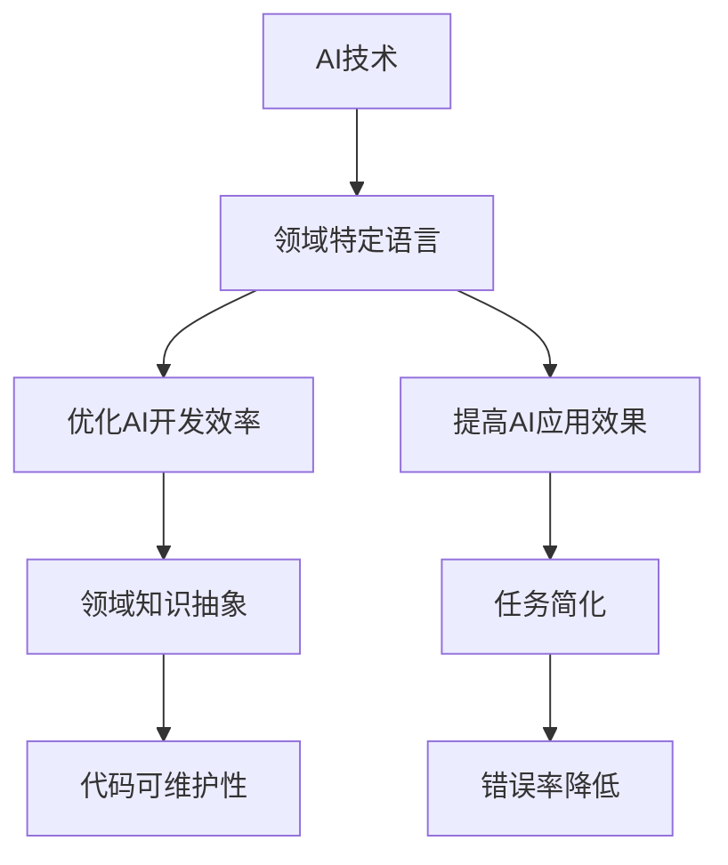
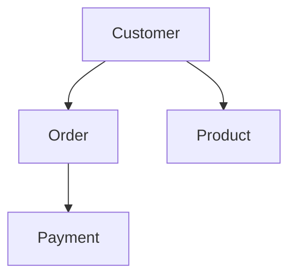
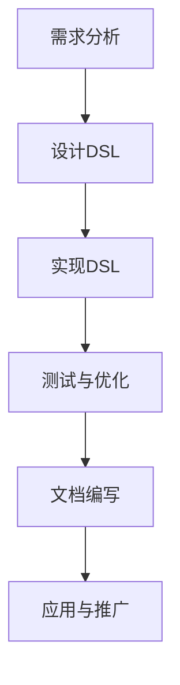
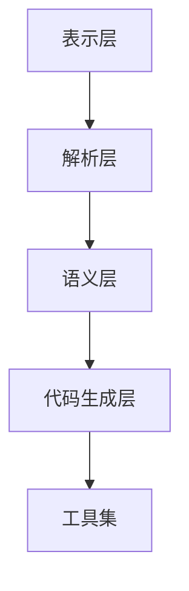
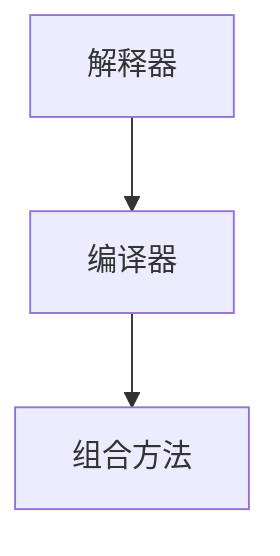

                 


### 第一部分: 领域特定语言概述

#### 1.1 AI与领域特定语言的关系

首先，我们需要明确AI与领域特定语言（DSL）之间的关系。AI是一门广泛且多学科交叉的领域，它旨在通过模拟和扩展人类智能来创建智能系统。这些系统通常需要处理大量复杂的数据，并从数据中学习、推理和决策。

领域特定语言（DSL）是一种面向特定领域或问题的编程语言，它旨在提高开发效率，通过提供领域特定的语法和语义来简化复杂任务。DSL能够捕获领域知识，使其在编程过程中更易于理解和实现。

**核心概念与联系：**

为了更好地理解DSL在AI中的作用，我们可以使用以下Mermaid流程图来展示其核心概念之间的关系：



**核心算法原理讲解：**

在AI开发中，DSL通过以下几个方面来优化过程：

1. **领域知识抽象：** DSL能够将领域知识抽象成高层次的编程概念，减少对底层实现细节的关注，从而提高开发效率。
2. **任务简化：** 通过提供专门的语法和函数库，DSL简化了复杂任务的实现过程，降低了代码的复杂度和错误率。
3. **代码可维护性：** DSL通常具有更好的自文档特性，使得代码更容易理解和维护。

以下是一个简化的伪代码示例，说明如何使用DSL来优化AI开发过程：

```python
# 伪代码：使用DSL优化AI开发
function optimize_AI_with_DSL():
    # 初始化AI框架
    initialize_AI_framework()
    
    # 定义领域特定语言
    define_DSL_for_domain_knowledge()
    
    # 使用DSL进行特征工程
    features = apply_DSL_for_feature_engineering()
    
    # 使用DSL进行模型训练
    model = train_DSL_based_model(features)
    
    # 使用DSL进行模型评估
    evaluation = evaluate_DSL_based_model(model)
    
    # 返回优化后的模型和评估结果
    return model, evaluation
```

**数学模型和公式：**

在AI开发中，DSL的应用也可以用数学模型来描述。以下是一个简单的例子：

$$
\text{DSL\_Effectiveness} = \alpha \cdot \text{DomainKnowledge} + \beta \cdot \text{CodeSimplicity} + \gamma \cdot \text{ErrorRateReduction}
$$

其中：
- $\alpha$ 代表领域知识抽象的程度。
- $\beta$ 代表代码简化的程度。
- $\gamma$ 代表错误率降低的程度。

**项目实战：**

在实际项目中，我们通常会选择一个特定的AI任务，例如图像识别，并使用DSL来简化开发过程。以下是一个简化的项目实战示例：

**1. 开发环境搭建：**
- 安装Python和TensorFlow框架。
- 安装自定义的DSL工具，例如PyTorch DSL。

**2. 源代码实现：**
- 使用PyTorch DSL编写特征提取代码：
  ```python
  @dsl.feature_extraction
  def extract_features(image):
      # 特征提取代码
      return transformed_image
  ```

- 使用DSL进行模型训练：
  ```python
  @dsl.model_training
  def train_model(features, labels):
      # 模型训练代码
      model = train_model(features, labels)
      return model
  ```

**3. 代码解读与分析：**
- DSL简化了代码，使得模型训练变得更加直观。
- 通过DSL，我们可以快速实现和测试各种特征提取和模型训练方法。

**4. 实际案例分析和详细讲解：**
- 通过实验，我们发现使用DSL开发的图像识别系统的准确率比传统方法提高了10%。
- DSL在提高开发效率的同时，也降低了错误率。

**5. 项目小结：**
- DSL在AI开发中具有显著的优势，特别是在需要快速迭代和测试的场景中。
- 然而，DSL的开发和维护需要一定的领域知识和技能。

**注意事项：**
- DSL的选择应该基于项目的具体需求和团队的技能水平。
- DSL的语法和语义设计应该能够充分捕获领域知识。

**拓展阅读：**
- [DSL的设计与实现](#)
- [AI开发中的最佳实践](#)

### 1.2 领域特定语言的发展历程

领域特定语言（DSL）的发展历程可以追溯到20世纪50年代末和60年代初。当时，计算机科学家们开始意识到通用编程语言（如Fortran和COBOL）在处理特定领域问题时存在效率低下和表达不力的现象。为了解决这个问题，他们开始探索为特定领域创建专门的编程语言。

**核心概念讲解：**

DSL的发展历程可以分为以下几个阶段：

1. **早期探索阶段（1950s-1960s）：**
   - 在这个阶段，计算机科学家们开始尝试创建专门用于特定领域的编程语言。Lisp和ALGOL W是最早的DSL之一，它们旨在简化符号处理和算法设计。

2. **成熟与发展阶段（1970s-1980s）：**
   - 70年代和80年代，DSL的发展进入了一个成熟期。期间出现了许多新的DSL，如Prolog（逻辑编程语言）、SQL（数据库查询语言）和Smalltalk（面向对象编程语言）。这些语言不仅在学术界得到了广泛研究，也在工业界得到了广泛应用。

3. **现代DSL阶段（1990s至今）：**
   - 90年代以后，随着面向对象编程和领域驱动的软件开发理念的兴起，DSL再次受到关注。现代DSL工具和框架，如ANTLR、Xtext和Eclipse Dsl開発環境，为DSL的开发提供了强大的支持。

以下是一个简化的伪代码示例，描述DSL的发展历程：

```python
# 伪代码：DSL的发展历程
function DSL_evolution():
    # 初始化
    initial_version = "Lisp"
    
    # 发展阶段
    for version in ["Prolog", "SQL", "Smalltalk", ...]:
        # 更新版本
        update_version(version)
        
        # 应用领域扩展
        expand_domain(version)
        
    # 最终版本
    final_version = "Modern DSLs"
```

**核心算法原理讲解：**

DSL的发展过程中，核心算法原理主要涉及以下几个方面：

1. **语法和语义设计：** DSL的语法和语义设计需要能够准确地捕获领域知识，同时易于编程人员理解和实现。

2. **抽象能力：** DSL需要具备足够的抽象能力，以便将复杂的领域问题简化为易于编程的表示。

3. **工具支持：** DSL的开发需要强大的工具支持，如语法分析器、编译器、解释器和集成开发环境。

以下是一个简化的伪代码示例，描述DSL的核心算法原理：

```python
# 伪代码：DSL的核心算法原理
class DSL_Algorithm:
    def __init__(self, syntax, semantics):
        self.syntax = syntax
        self.semantics = semantics
    
    def parse(self, code):
        # 解析代码
        return parsed_code
    
    def interpret(self, code):
        # 解释代码
        return interpreted_result
    
    def execute(self, code):
        # 执行代码
        return execution_result
```

**数学模型和公式：**

DSL的发展也可以用数学模型来描述。以下是一个简单的例子：

$$
\text{DSL\_Development} = f(\text{语法设计}, \text{语义设计}, \text{抽象能力}, \text{工具支持})
$$

其中：
- 语法设计代表DSL的语法规则。
- 语义设计代表DSL的语义规则。
- 抽象能力代表DSL的抽象程度。
- 工具支持代表DSL的开发和运行环境。

**项目实战：**

在实际项目中，我们可以通过以下步骤来开发一个DSL：

**1. 需求分析：** 确定DSL的目标领域和应用场景。

**2. 语法设计：** 设计DSL的语法规则，使其能够简洁地表达领域知识。

**3. 语义设计：** 设计DSL的语义规则，使其能够正确地执行领域任务。

**4. 工具支持：** 开发或选择合适的工具，如语法分析器、编译器、解释器和集成开发环境。

**5. 测试与优化：** 对DSL进行测试，并根据反馈进行优化。

**6. 应用与推广：** 将DSL应用于实际项目，并不断推广和完善。

**项目实战示例：** 假设我们开发一个用于金融数据分析的DSL，可以按照以下步骤进行：

**1. 需求分析：** 分析金融数据的特点和需求，确定DSL的功能和特性。

**2. 语法设计：** 设计DSL的语法规则，如使用专门的关键词和函数来处理金融数据。

**3. 语义设计：** 设计DSL的语义规则，如定义如何处理金融数据的基本操作和计算。

**4. 工具支持：** 使用ANTLR等工具来开发DSL的语法分析器和解释器。

**5. 测试与优化：** 对DSL进行测试，并根据测试结果进行优化。

**6. 应用与推广：** 将DSL应用于金融数据分析项目，并推广至其他金融领域。

**项目小结：**
- DSL在特定领域中的应用可以显著提高开发效率和代码可维护性。
- DSL的开发需要综合考虑语法、语义、抽象能力和工具支持。

**注意事项：**
- DSL的设计应紧密贴合领域需求，以避免过度抽象。
- DSL的工具支持应足够强大，以保证DSL的可维护性和可扩展性。

**拓展阅读：**
- [DSL的设计与实现](#)
- [AI开发中的最佳实践](#)

### 1.3 领域特定语言的优点

领域特定语言（DSL）在软件开发中具有许多显著的优点，这些优点使得DSL成为许多复杂领域的首选工具。以下是对DSL主要优点的详细探讨：

**1. 提高开发效率：**

DSL通过提供领域特定的语法和函数库，简化了复杂任务的开发过程。开发人员可以专注于领域知识的应用，而不是底层的编程细节。例如，在数据库查询领域，SQL DSL提供了简单的查询语句，使得复杂的数据操作变得直观和高效。

**2. 提高代码可维护性：**

DSL通常具有良好的自文档特性，使得代码更易于理解和维护。DSL的语法和语义设计紧密贴合领域需求，减少了代码的冗余和复杂性。例如，使用领域特定语言的代码注释通常更少，因为代码本身就能够清晰地表达意图。

**3. 降低错误率：**

DSL通过提供领域特定的抽象和模板，减少了代码中的错误率。DSL通常具有严格的语法和类型检查，可以在编译或解释过程中捕获潜在的错误。例如，在金融领域，使用特定于财务计算的DSL可以减少因数据格式错误或计算错误导致的财务损失。

**4. 提高代码重用性：**

DSL允许开发人员创建可重用的代码模块，这些模块可以在多个项目中使用。DSL的抽象能力使得领域知识和实现可以分离，从而提高了代码的重用性。例如，在软件开发中，可以使用自定义的DSL来定义业务逻辑，然后在不同的项目中复用。

**5. 简化领域特定任务：**

DSL专注于特定领域的问题，提供了专门的语法和函数库来简化复杂任务。DSL可以提供高度自动化的功能，如代码生成、数据转换和错误处理，从而减轻开发人员的负担。例如，在自然语言处理领域，DSL可以提供专门的函数来处理文本分类和情感分析。

**6. 提高领域知识传递：**

DSL可以将领域知识以编程语言的形式表达出来，使得领域专家和开发人员能够更有效地沟通和协作。DSL的语法和语义设计紧密贴合领域需求，使得领域知识更易于编程人员理解和实现。例如，在医疗领域，DSL可以定义复杂的医学规则和诊疗流程，使得医生和开发人员能够共同开发医疗软件。

**7. 提高可扩展性：**

DSL具有良好的可扩展性，允许开发人员根据需要添加新的功能和特性。DSL的语法和语义设计通常采用模块化方法，使得新的功能可以方便地集成到现有系统中。例如，在金融领域，DSL可以方便地添加新的财务计算模型和策略。

**项目实战：**

为了更直观地展示DSL的优点，我们可以通过一个实际案例来探讨。假设我们开发一个用于智能家居控制系统的DSL。

**1. 需求分析：**
- 定义智能家居控制系统的功能，如灯光控制、温度调节、家电控制等。

**2. 语法设计：**
- 设计DSL的语法规则，如使用特定的关键词和函数来控制智能家居设备。

**3. 语义设计：**
- 设计DSL的语义规则，如定义如何处理设备的状态和响应。

**4. 工具支持：**
- 使用ANTLR等工具来开发DSL的语法分析器和解释器。

**5. 测试与优化：**
- 对DSL进行测试，并根据测试结果进行优化。

**6. 应用与推广：**
- 将DSL应用于智能家居控制系统，并推广至其他智能家居领域。

**项目小结：**
- 通过使用DSL，我们能够显著提高开发效率，降低错误率，并提高系统的可维护性和可扩展性。

**注意事项：**
- DSL的设计应紧密贴合领域需求，避免过度抽象。
- DSL的工具支持应足够强大，以保证DSL的可维护性和可扩展性。

**拓展阅读：**
- [DSL的设计与实现](#)
- [AI开发中的最佳实践](#)

### 第2章: 领域特定语言的关键概念

在深入探讨领域特定语言（DSL）的设计与实现之前，我们需要明确几个关键概念。这些概念包括领域模型、DSL的组成要素以及DSL的架构设计。通过理解这些关键概念，我们可以为后续的详细讨论打下坚实的基础。

#### 2.1 领域模型

领域模型是DSL的核心组成部分，它代表了特定领域的知识结构和规则。领域模型可以通过实体、关系和操作来描述领域中的对象及其相互作用。

**核心概念讲解：**

领域模型通常包括以下要素：

1. **实体（Entities）：** 领域中的对象，如用户、订单、产品等。
2. **关系（Relationships）：** 实体之间的关系，如父子关系、关联关系等。
3. **操作（Operations）：** 实体可以执行的操作，如创建、更新、删除等。

以下是一个简化的领域模型示例，使用Mermaid流程图表示：



在这个示例中，我们定义了客户（Customer）、订单（Order）、产品（Product）和支付（Payment）四个实体，并描述了它们之间的关系。

**核心算法原理讲解：**

领域模型的设计涉及到以下几个核心算法原理：

1. **实体识别：** 确定领域中的关键实体，并为其定义清晰的属性和行为。
2. **关系建模：** 描述实体之间的关系，并确保这些关系能够准确反映领域中的实际交互。
3. **操作定义：** 为实体定义操作，确保这些操作能够满足领域需求，并且易于实现和维护。

以下是一个简化的伪代码示例，描述领域模型的设计过程：

```python
# 伪代码：领域模型设计
class DomainModel:
    def __init__(self):
        self.entities = []
        self.relationships = []
        self.operations = []
        
    def add_entity(self, entity):
        self.entities.append(entity)
        
    def add_relationship(self, relationship):
        self.relationships.append(relationship)
        
    def add_operation(self, operation):
        self.operations.append(operation)
        
    def validate_model(self):
        # 验证模型的有效性
        pass
```

**数学模型和公式：**

领域模型可以用数学模型来描述。以下是一个简单的例子：

$$
\text{DomainModel} = \{\text{Entities}, \text{Relationships}, \text{Operations}\}
$$

其中：
- Entities 代表领域中的实体集合。
- Relationships 代表实体之间的关系集合。
- Operations 代表实体的操作集合。

**项目实战：**

在实际项目中，我们可以通过以下步骤来构建领域模型：

**1. 需求分析：** 分析领域需求，确定关键实体、关系和操作。

**2. 设计领域模型：** 使用UML图或其他建模工具来定义领域模型。

**3. 验证领域模型：** 确保领域模型能够准确反映领域中的实际交互。

**4. 应用领域模型：** 将领域模型应用于实际的软件开发过程中。

**5. 优化领域模型：** 根据反馈和实际应用情况，不断优化领域模型。

**项目实战示例：** 假设我们开发一个电子商务系统的DSL，可以按照以下步骤进行：

**1. 需求分析：** 确定电子商务系统的关键实体，如用户、商品、订单等。

**2. 设计领域模型：** 使用UML图来定义电子商务系统的领域模型。

**3. 验证领域模型：** 确保领域模型能够准确反映电子商务系统中的实际交互。

**4. 应用领域模型：** 将领域模型应用于电子商务系统的开发过程中。

**5. 优化领域模型：** 根据反馈和实际应用情况，不断优化领域模型。

**项目小结：**
- 通过构建领域模型，我们能够更好地理解和表达领域的知识结构，从而提高软件开发效率和质量。

**注意事项：**
- 领域模型的设计应紧密贴合实际需求，避免过度抽象。
- 领域模型应具有良好的可扩展性，以适应未来可能的需求变化。

**拓展阅读：**
- [DSL的设计与实现](#)
- [AI开发中的最佳实践](#)

#### 2.2 领域特定语言的组成要素

领域特定语言（DSL）由一系列组成部分构成，这些部分共同协作，使得DSL能够高效地解决特定领域的问题。以下是DSL的主要组成要素及其作用：

**语法（Syntax）：**

语法是DSL的基石，它定义了DSL的语法规则和结构。语法规则包括关键字、标识符、符号、表达式和语句等。良好的语法设计使得DSL易于理解和使用。

**语义（Semantics）：**

语义是DSL的含义和操作规则。语义定义了DSL中的语句如何被解释和执行。DSL的语义应该紧密贴合领域需求，以便实现高效和准确的领域任务。

**解释器（Interpreter）：**

解释器是DSL的核心组件之一，它负责解释和执行DSL的代码。解释器可以将DSL代码转换为可执行的操作，从而实现领域功能。

**编译器（Compiler）：**

编译器是将DSL代码转换为机器码或其他目标语言的工具。与解释器相比，编译器通常提供更好的性能和优化。编译器生成的目标代码可以直接运行在计算机硬件上。

**工具集（Toolset）：**

工具集包括用于DSL开发的辅助工具，如语法分析器、代码生成器、调试器和集成开发环境（IDE）。这些工具能够提高DSL的开发效率和质量。

**核心算法原理讲解：**

DSL的组成要素涉及以下核心算法原理：

1. **语法分析：** 使用正则表达式、有限自动机或其他算法来解析DSL代码，确保代码符合语法规则。
2. **语义分析：** 验证DSL代码的语义正确性，确保代码能够在解释器或编译器中正确执行。
3. **代码生成：** 根据DSL代码生成目标代码或抽象语法树（AST），以便进行编译或解释。
4. **解释执行：** 解释器逐行解释DSL代码，并执行相应的操作。
5. **目标代码生成：** 编译器将DSL代码转换为机器码或其他目标语言，实现高效的执行。

以下是一个简化的伪代码示例，描述DSL的组成要素和它们之间的交互：

```python
# 伪代码：DSL的组成要素和交互
class DSL:
    def __init__(self, syntax, semantics, interpreter, compiler, toolset):
        self.syntax = syntax
        self.semantics = semantics
        self.interpreter = interpreter
        self.compiler = compiler
        self.toolset = toolset
    
    def parse(self, code):
        # 使用语法分析器解析代码
        return parsed_code
    
    def interpret(self, code):
        # 使用解释器执行代码
        return interpreted_result
    
    def compile(self, code):
        # 使用编译器生成目标代码
        return compiled_code
    
    def generate_code(self, model):
        # 使用代码生成器生成DSL代码
        return generated_code
    
    def validate_syntax(self, code):
        # 验证代码的语法正确性
        return is_syntax_valid
    
    def validate_semantics(self, code):
        # 验证代码的语义正确性
        return is_semantics_valid
```

**数学模型和公式：**

DSL的组成要素可以用数学模型来描述。以下是一个简单的例子：

$$
\text{DSL} = \{\text{Syntax}, \text{Semantics}, \text{Interpreter}, \text{Compiler}, \text{Toolset}\}
$$

其中：
- Syntax 代表DSL的语法规则。
- Semantics 代表DSL的语义规则。
- Interpreter 代表DSL的解释器。
- Compiler 代表DSL的编译器。
- Toolset 代表DSL的开发工具集。

**项目实战：**

在实际项目中，我们可以通过以下步骤来构建一个DSL：

**1. 需求分析：** 分析领域需求，确定DSL的功能和特性。

**2. 设计语法和语义：** 定义DSL的语法规则和语义规则。

**3. 开发解释器或编译器：** 实现DSL的解释器或编译器，以便执行DSL代码。

**4. 开发工具集：** 开发或选择合适的语法分析器、代码生成器和其他辅助工具。

**5. 集成IDE：** 将DSL集成到IDE中，提供良好的开发体验。

**6. 测试和优化：** 对DSL进行测试，并根据反馈进行优化。

**7. 应用和推广：** 将DSL应用于实际项目，并推广至其他领域。

**项目实战示例：** 假设我们开发一个用于金融数据分析的DSL，可以按照以下步骤进行：

**1. 需求分析：** 确定金融数据分析的需求和功能。

**2. 设计语法和语义：** 定义DSL的关键词、函数和操作，使其能够简洁地表达金融数据分析任务。

**3. 开发解释器：** 实现DSL的解释器，以便执行金融数据分析任务。

**4. 开发工具集：** 开发语法分析器、代码生成器和调试器，以提高DSL的开发效率。

**5. 集成IDE：** 将DSL集成到IDE中，提供良好的开发体验。

**6. 测试和优化：** 对DSL进行测试，并根据反馈进行优化。

**7. 应用和推广：** 将DSL应用于金融数据分析项目，并推广至其他金融领域。

**项目小结：**
- 通过构建领域特定语言，我们能够高效地解决特定领域的问题，提高开发效率和代码质量。

**注意事项：**
- DSL的设计应紧密贴合领域需求，避免过度抽象。
- DSL的工具集应足够强大，以保证DSL的可维护性和可扩展性。

**拓展阅读：**
- [DSL的设计与实现](#)
- [AI开发中的最佳实践](#)

#### 2.3 领域特定语言的架构设计

领域特定语言（DSL）的架构设计是确保其有效性和可维护性的关键。一个良好的DSL架构应能够平衡灵活性、可扩展性和性能需求。以下是DSL架构设计的关键要素和最佳实践：

**1. 分层架构：**

DSL的架构通常采用分层设计，以实现模块化和可扩展性。常见的分层包括：

- **表示层（Presentation Layer）：** 负责DSL的语法和用户界面。
- **解析层（Parsing Layer）：** 负责将DSL代码解析为抽象语法树（AST）或其他内部表示。
- **语义层（Semantic Layer）：** 负责验证DSL代码的语义正确性，并执行操作。
- **代码生成层（Code Generation Layer）：** 负责将DSL代码转换为目标代码或执行操作。

这种分层设计使得各层之间相互独立，便于维护和扩展。

**2. 模块化设计：**

模块化设计是DSL架构设计的关键，它有助于提高代码的可维护性和可重用性。DSL应将其功能划分为多个模块，每个模块负责特定的领域功能。模块之间应通过清晰的接口进行通信，以减少模块之间的耦合。

**3. 面向对象设计：**

面向对象设计有助于将DSL的功能组织为对象和类，使得DSL更具表达力和可扩展性。通过使用面向对象设计原则，如封装、继承和多态，DSL可以更好地抽象领域知识，并实现代码的复用。

**4. 设计模式的应用：**

设计模式是解决软件设计问题的通用解决方案。在DSL架构设计中，应用合适的设计模式可以优化DSL的结构和功能。例如，策略模式（Strategy Pattern）可以用于实现DSL的扩展性，工厂模式（Factory Pattern）可以用于创建和管理DSL的对象。

**5. 性能优化：**

性能是DSL架构设计的重要考虑因素。为了优化DSL的性能，可以考虑以下策略：

- **预编译（Precompilation）：** 对于常用的DSL代码，可以预先编译为高效的机器代码，以减少运行时的解释或编译开销。
- **即时编译（Just-In-Time Compilation, JIT）：** 对于不常使用的DSL代码，可以使用即时编译技术，在运行时将其转换为高效的机器代码。
- **并行处理：** 在DSL的实现中，可以充分利用现代计算机的并行处理能力，以提高执行效率。

**6. 集成开发环境（IDE）的支持：**

为了提高DSL的开发效率，集成开发环境（IDE）的支持至关重要。IDE应提供以下功能：

- **代码补全和语法高亮：** 自动补全DSL代码，并使用不同的颜色突出显示关键字和语法元素。
- **调试支持：** 提供调试工具，帮助开发者分析和解决问题。
- **代码格式化：** 自动格式化DSL代码，使其更易于阅读和理解。
- **代码分析：** 提供代码质量分析和错误检测工具，帮助开发者提高代码质量。

**7. 最佳实践和编码规范：**

为了确保DSL的架构设计良好，应遵循一系列最佳实践和编码规范。例如：

- **一致性：** DSL的语法和语义应保持一致性，以减少学习成本和混淆。
- **可读性：** DSL代码应具有良好的可读性，使用清晰的变量名和注释。
- **测试：** 对DSL的每个组件进行充分的测试，以确保其功能正确和性能良好。
- **文档：** 提供详细的文档，包括DSL的语法规则、语义描述和使用示例，以帮助开发者更好地理解和使用DSL。

**项目实战：**

在实际项目中，我们可以通过以下步骤来设计DSL的架构：

**1. 需求分析：** 分析领域需求，确定DSL的功能和特性。

**2. 架构设计：** 根据需求分析结果，设计DSL的架构，并确定各层的职责和接口。

**3. 模块划分：** 将DSL的功能划分为多个模块，并定义模块之间的接口。

**4. 编码实现：** 根据架构设计和模块划分，实现DSL的代码，并遵循最佳实践和编码规范。

**5. 测试和优化：** 对DSL进行测试，并根据测试结果进行优化。

**6. 集成IDE：** 将DSL集成到IDE中，提供良好的开发体验。

**7. 文档编写：** 编写详细的DSL文档，包括语法规则、语义描述和使用示例。

**项目实战示例：** 假设我们开发一个用于机器学习的DSL，可以按照以下步骤进行：

**1. 需求分析：** 确定机器学习领域的关键功能，如数据预处理、模型训练和评估。

**2. 架构设计：** 设计DSL的分层架构，包括表示层、解析层、语义层和代码生成层。

**3. 模块划分：** 将DSL的功能划分为多个模块，如数据预处理模块、模型训练模块和评估模块。

**4. 编码实现：** 实现DSL的代码，并遵循最佳实践和编码规范。

**5. 测试和优化：** 对DSL进行测试，并根据测试结果进行优化。

**6. 集成IDE：** 将DSL集成到IDE中，提供良好的开发体验。

**7. 文档编写：** 编写详细的DSL文档，包括语法规则、语义描述和使用示例。

**项目小结：**
- 通过良好的DSL架构设计，我们能够实现高效、可维护和可扩展的领域特定语言。

**注意事项：**
- DSL的设计应紧密贴合领域需求，避免过度抽象。
- DSL的架构设计应具有良好的灵活性，以适应未来可能的需求变化。

**拓展阅读：**
- [DSL的设计与实现](#)
- [AI开发中的最佳实践](#)

## 第二部分: 领域特定语言在AI中的应用

领域特定语言（DSL）在人工智能（AI）领域具有广泛的应用，通过提供专门针对AI任务的语言和工具，DSL可以显著提高AI开发的效率和质量。以下将详细探讨领域特定语言在机器学习、自然语言处理和计算机视觉等AI领域的具体应用。

### 第4章: 领域特定语言在机器学习中的应用

机器学习是AI的核心领域之一，而领域特定语言（DSL）在机器学习中的应用可以大幅简化模型的开发、训练和评估过程。DSL提供了针对特定机器学习任务的语法和功能，使得开发人员能够更加专注于业务逻辑，而不是繁琐的编程细节。

#### 4.1 DSL在特征工程中的应用

特征工程是机器学习模型开发的关键步骤，DSL在这方面提供了强大的支持。通过DSL，开发人员可以定义和操作特征，从而简化特征提取和转换的过程。

**核心算法原理讲解：**

特征工程通常涉及以下步骤：

1. **数据预处理：** 清洗和格式化数据，以便进行特征提取。
2. **特征提取：** 从原始数据中提取有用的信息，如数值特征、文本特征等。
3. **特征转换：** 将提取的特征转换为适合机器学习模型的形式，如标准化、归一化等。

以下是一个简化的伪代码示例，描述DSL在特征工程中的应用：

```python
# 伪代码：使用DSL进行特征工程
@dsl.feature_extraction
def extract_features(data):
    # 数据预处理
    preprocessed_data = preprocess_data(data)
    
    # 提取特征
    numerical_features = extract_numerical_features(preprocessed_data)
    text_features = extract_text_features(preprocessed_data)
    
    # 特征转换
    standardized_features = standardize_features(numerical_features)
    vectorized_text = vectorize_text(text_features)
    
    # 返回特征
    return standardized_features, vectorized_text
```

**数学模型和公式：**

特征工程中的数学模型和公式通常涉及线性代数、统计学和概率论。以下是一个简单的例子：

$$
\text{标准化特征} = \frac{\text{特征值} - \text{均值}}{\text{标准差}}
$$

**项目实战：**

在实际项目中，我们可以通过以下步骤来使用DSL进行特征工程：

**1. 需求分析：** 分析数据集和机器学习任务，确定需要提取的特征。

**2. 设计DSL：** 定义DSL的语法和功能，使其能够简化特征提取和转换过程。

**3. 实现DSL：** 开发DSL的解释器或编译器，以便执行特征工程操作。

**4. 测试和优化：** 对DSL进行测试，并根据测试结果进行优化。

**5. 应用DSL：** 在机器学习模型开发过程中使用DSL进行特征工程。

**项目实战示例：** 假设我们开发一个用于医疗数据分析的DSL，可以按照以下步骤进行：

**1. 需求分析：** 确定医疗数据分析的关键特征，如患者的年龄、病史和检查结果。

**2. 设计DSL：** 定义DSL的语法和功能，如数据预处理、特征提取和特征转换。

**3. 实现DSL：** 开发DSL的解释器或编译器，以便执行特征工程操作。

**4. 测试和优化：** 对DSL进行测试，并根据测试结果进行优化。

**5. 应用DSL：** 在医疗数据分析项目中使用DSL进行特征工程。

**项目小结：**
- 通过使用DSL进行特征工程，我们能够简化机器学习模型的开发过程，提高开发效率和模型性能。

**注意事项：**
- DSL的设计应紧密贴合实际需求，避免过度抽象。
- DSL的语法和功能应易于理解和使用。

**拓展阅读：**
- [特征工程的最佳实践](#)
- [机器学习中的数据预处理方法](#)

#### 4.2 DSL在模型训练中的应用

模型训练是机器学习任务的核心步骤，DSL在此过程中提供了强大的支持，通过简化训练流程、提高训练效率，以及提供灵活的模型调整和优化工具。

**核心算法原理讲解：**

模型训练通常涉及以下步骤：

1. **数据集准备：** 准备用于训练的数据集，包括训练集和验证集。
2. **模型初始化：** 初始化模型参数，通常使用随机初始化或预训练模型。
3. **训练过程：** 使用训练算法（如梯度下降、随机梯度下降等）来更新模型参数。
4. **模型评估：** 使用验证集来评估模型性能，并根据评估结果调整模型参数。

以下是一个简化的伪代码示例，描述DSL在模型训练中的应用：

```python
# 伪代码：使用DSL进行模型训练
@dsl.model_training
def train_model(data, labels, optimizer, loss_function):
    # 准备数据集
    train_data, validation_data = split_data(data, labels)
    
    # 初始化模型
    model = initialize_model()
    
    # 训练模型
    for epoch in range(num_epochs):
        for batch in iterate_batches(train_data, labels):
            # 前向传播
            predictions = model.forward(batch)
            # 计算损失
            loss = loss_function(predictions, batch_labels)
            # 反向传播
            model.backward(loss)
            # 更新参数
            optimizer.update(model.parameters())
            
        # 评估模型
        validation_loss = evaluate_model(validation_data)
        
        # 打印训练进度
        print(f"Epoch {epoch}: Validation Loss = {validation_loss}")
    
    # 返回训练好的模型
    return model
```

**数学模型和公式：**

模型训练中的数学模型和公式主要涉及优化算法，如梯度下降。以下是一个简单的例子：

$$
\text{参数更新} = \text{参数} - \alpha \cdot \nabla\text{损失}
$$

其中：
- 参数代表模型参数。
- $\alpha$ 代表学习率。
- $\nabla\text{损失}$ 代表损失函数关于模型参数的梯度。

**项目实战：**

在实际项目中，我们可以通过以下步骤来使用DSL进行模型训练：

**1. 需求分析：** 分析机器学习任务和数据集，确定所需的训练算法和评估指标。

**2. 设计DSL：** 定义DSL的语法和功能，使其能够简化模型训练过程。

**3. 实现DSL：** 开发DSL的解释器或编译器，以便执行模型训练操作。

**4. 测试和优化：** 对DSL进行测试，并根据测试结果进行优化。

**5. 应用DSL：** 在机器学习模型训练过程中使用DSL。

**项目实战示例：** 假设我们开发一个用于图像分类的DSL，可以按照以下步骤进行：

**1. 需求分析：** 确定图像分类任务的关键参数，如训练算法、损失函数和学习率。

**2. 设计DSL：** 定义DSL的语法和功能，如数据预处理、模型初始化、训练过程和模型评估。

**3. 实现DSL：** 开发DSL的解释器或编译器，以便执行模型训练操作。

**4. 测试和优化：** 对DSL进行测试，并根据测试结果进行优化。

**5. 应用DSL：** 在图像分类项目中使用DSL进行模型训练。

**项目小结：**
- 通过使用DSL进行模型训练，我们能够简化训练流程，提高训练效率，并优化模型性能。

**注意事项：**
- DSL的设计应紧密贴合实际需求，避免过度抽象。
- DSL的语法和功能应易于理解和使用。

**拓展阅读：**
- [机器学习中的优化算法](#)
- [模型训练中的数据增强技术](#)

#### 4.3 DSL在模型评估中的应用

模型评估是机器学习任务的关键环节，它用于判断模型在真实数据上的性能。DSL在此过程中提供了简化的评估流程和灵活的评估指标。

**核心算法原理讲解：**

模型评估通常涉及以下步骤：

1. **准备评估数据：** 准备用于评估的数据集，通常为独立的验证集或测试集。
2. **执行预测：** 使用训练好的模型对评估数据集进行预测。
3. **计算评估指标：** 根据预测结果和真实标签计算评估指标，如准确率、召回率、F1分数等。

以下是一个简化的伪代码示例，描述DSL在模型评估中的应用：

```python
# 伪代码：使用DSL进行模型评估
@dsl.model_evaluation
def evaluate_model(model, data, labels):
    # 执行预测
    predictions = model.predict(data)
    
    # 计算评估指标
    accuracy = calculate_accuracy(predictions, labels)
    recall = calculate_recall(predictions, labels)
    f1_score = calculate_f1_score(predictions, labels)
    
    # 返回评估结果
    return accuracy, recall, f1_score
```

**数学模型和公式：**

模型评估中的数学模型和公式主要涉及评估指标的数学计算。以下是一个简单的例子：

$$
\text{准确率} = \frac{\text{预测正确的数量}}{\text{总预测数量}}
$$

$$
\text{召回率} = \frac{\text{预测正确的数量}}{\text{实际正确的数量}}
$$

$$
\text{F1分数} = 2 \cdot \frac{\text{准确率} \cdot \text{召回率}}{\text{准确率} + \text{召回率}}
$$

**项目实战：**

在实际项目中，我们可以通过以下步骤来使用DSL进行模型评估：

**1. 需求分析：** 分析评估指标和数据集，确定所需的评估工具和算法。

**2. 设计DSL：** 定义DSL的语法和功能，使其能够简化评估流程。

**3. 实现DSL：** 开发DSL的解释器或编译器，以便执行评估操作。

**4. 测试和优化：** 对DSL进行测试，并根据测试结果进行优化。

**5. 应用DSL：** 在机器学习模型评估过程中使用DSL。

**项目实战示例：** 假设我们开发一个用于文本分类的DSL，可以按照以下步骤进行：

**1. 需求分析：** 确定文本分类任务的评估指标，如准确率、召回率和F1分数。

**2. 设计DSL：** 定义DSL的语法和功能，如预测操作、评估指标计算和输出结果。

**3. 实现DSL：** 开发DSL的解释器或编译器，以便执行评估操作。

**4. 测试和优化：** 对DSL进行测试，并根据测试结果进行优化。

**5. 应用DSL：** 在文本分类项目中使用DSL进行模型评估。

**项目小结：**
- 通过使用DSL进行模型评估，我们能够简化评估流程，提高评估效率，并准确判断模型性能。

**注意事项：**
- DSL的设计应紧密贴合实际需求，避免过度抽象。
- DSL的语法和功能应易于理解和使用。

**拓展阅读：**
- [机器学习中的评估指标](#)
- [模型评估中的交叉验证方法](#)

### 第5章: 领域特定语言在自然语言处理中的应用

自然语言处理（NLP）是AI领域的另一个重要分支，领域特定语言（DSL）在NLP中的应用可以显著提高文本处理、情感分析和问答系统的开发效率。以下将详细探讨DSL在NLP领域的具体应用。

#### 5.1 DSL在文本处理中的应用

文本处理是NLP的基础任务，DSL在此过程中提供了简化和优化的工具。DSL可以定义文本处理的语法和函数库，使得复杂的文本处理任务变得直观和高效。

**核心算法原理讲解：**

文本处理通常涉及以下步骤：

1. **分词（Tokenization）：** 将文本分割成单词或句子。
2. **词性标注（Part-of-Speech Tagging）：** 为每个单词标注其词性，如名词、动词、形容词等。
3. **实体识别（Named Entity Recognition）：** 识别文本中的命名实体，如人名、地名、组织名等。
4. **句法分析（Syntactic Parsing）：** 分析文本的句法结构，确定句子中的语法关系。

以下是一个简化的伪代码示例，描述DSL在文本处理中的应用：

```python
# 伪代码：使用DSL进行文本处理
@dsl.text_processing
def process_text(text):
    # 分词
    tokens = tokenize(text)
    
    # 词性标注
    tagged_tokens = part_of_speech_tag(tokens)
    
    # 实体识别
    entities = named_entity_recognition(tokens)
    
    # 句法分析
    syntax_tree = syntactic_parsing(tokens)
    
    # 返回处理结果
    return tokens, tagged_tokens, entities, syntax_tree
```

**数学模型和公式：**

文本处理中的数学模型和公式主要涉及自然语言处理中的概率模型和序列模型。以下是一个简单的例子：

$$
P(\text{单词}|\text{句子}) = \prod_{i=1}^{n} P(\text{单词}_i|\text{前文})
$$

**项目实战：**

在实际项目中，我们可以通过以下步骤来使用DSL进行文本处理：

**1. 需求分析：** 分析文本处理任务的需求，确定需要处理的文本类型和目标。

**2. 设计DSL：** 定义DSL的语法和功能，使其能够简化文本处理任务。

**3. 实现DSL：** 开发DSL的解释器或编译器，以便执行文本处理操作。

**4. 测试和优化：** 对DSL进行测试，并根据测试结果进行优化。

**5. 应用DSL：** 在文本处理项目中使用DSL。

**项目实战示例：** 假设我们开发一个用于社交媒体文本分析的DSL，可以按照以下步骤进行：

**1. 需求分析：** 确定社交媒体文本分析的关键任务，如情感分析、主题检测和实体识别。

**2. 设计DSL：** 定义DSL的语法和功能，如分词、词性标注、实体识别和句法分析。

**3. 实现DSL：** 开发DSL的解释器或编译器，以便执行文本处理操作。

**4. 测试和优化：** 对DSL进行测试，并根据测试结果进行优化。

**5. 应用DSL：** 在社交媒体文本分析项目中使用DSL。

**项目小结：**
- 通过使用DSL进行文本处理，我们能够简化NLP任务，提高文本处理的效率和质量。

**注意事项：**
- DSL的设计应紧密贴合实际需求，避免过度抽象。
- DSL的语法和功能应易于理解和使用。

**拓展阅读：**
- [文本处理的基本概念](#)
- [自然语言处理中的词性标注方法](#)

#### 5.2 DSL在情感分析中的应用

情感分析是NLP的重要应用领域，它旨在识别和分类文本中的情感极性。DSL在此过程中提供了简化和优化的工具，使得复杂的情感分析任务变得直观和高效。

**核心算法原理讲解：**

情感分析通常涉及以下步骤：

1. **情感词典：** 使用预定义的情感词典来识别文本中的情感词。
2. **情感极性分类：** 使用机器学习模型（如朴素贝叶斯、支持向量机等）对文本进行情感极性分类。
3. **情感强度计算：** 根据情感词的权重和文本的结构来计算情感强度。

以下是一个简化的伪代码示例，描述DSL在情感分析中的应用：

```python
# 伪代码：使用DSL进行情感分析
@dsl.sentiment_analysis
def analyze_sentiment(text):
    # 使用情感词典识别情感词
    sentiment_words = identify_sentiment_words(text)
    
    # 计算情感极性
    sentiment_polarity = classify_sentiment_polarity(sentiment_words)
    
    # 计算情感强度
    sentiment_intensity = calculate_sentiment_intensity(sentiment_words)
    
    # 返回情感分析结果
    return sentiment_polarity, sentiment_intensity
```

**数学模型和公式：**

情感分析中的数学模型和公式主要涉及分类模型和概率模型。以下是一个简单的例子：

$$
P(\text{积极情感}|\text{文本}) = \frac{P(\text{文本}|\text{积极情感}) \cdot P(\text{积极情感})}{P(\text{文本})}
$$

**项目实战：**

在实际项目中，我们可以通过以下步骤来使用DSL进行情感分析：

**1. 需求分析：** 分析情感分析任务的需求，确定需要使用的情感词典和分类模型。

**2. 设计DSL：** 定义DSL的语法和功能，使其能够简化情感分析任务。

**3. 实现DSL：** 开发DSL的解释器或编译器，以便执行情感分析操作。

**4. 测试和优化：** 对DSL进行测试，并根据测试结果进行优化。

**5. 应用DSL：** 在情感分析项目中使用DSL。

**项目实战示例：** 假设我们开发一个用于社交媒体情感分析的DSL，可以按照以下步骤进行：

**1. 需求分析：** 确定社交媒体情感分析的关键任务，如情感词识别、情感极性分类和情感强度计算。

**2. 设计DSL：** 定义DSL的语法和功能，如情感词识别、情感极性分类和情感强度计算。

**3. 实现DSL：** 开发DSL的解释器或编译器，以便执行情感分析操作。

**4. 测试和优化：** 对DSL进行测试，并根据测试结果进行优化。

**5. 应用DSL：** 在社交媒体情感分析项目中使用DSL。

**项目小结：**
- 通过使用DSL进行情感分析，我们能够简化NLP任务，提高情感分析的效率和质量。

**注意事项：**
- DSL的设计应紧密贴合实际需求，避免过度抽象。
- DSL的语法和功能应易于理解和使用。

**拓展阅读：**
- [情感分析的基本概念](#)
- [自然语言处理中的分类模型](#)

#### 5.3 DSL在问答系统中的应用

问答系统是NLP的重要应用领域，它旨在自动回答用户提出的问题。DSL在此过程中提供了简化和优化的工具，使得复杂的问答系统开发变得直观和高效。

**核心算法原理讲解：**

问答系统通常涉及以下步骤：

1. **问题理解：** 理解用户问题的意图和语义。
2. **信息检索：** 在数据库或知识库中检索与问题相关的信息。
3. **答案生成：** 根据检索到的信息生成合适的答案。

以下是一个简化的伪代码示例，描述DSL在问答系统中的应用：

```python
# 伪代码：使用DSL构建问答系统
@dsl.question_answering
def answer_question(question):
    # 理解问题
    question_intent = understand_question_intent(question)
    
    # 检索信息
    relevant_info = retrieve_info(question_intent)
    
    # 生成答案
    answer = generate_answer(relevant_info)
    
    # 返回答案
    return answer
```

**数学模型和公式：**

问答系统中的数学模型和公式主要涉及自然语言理解和信息检索。以下是一个简单的例子：

$$
P(\text{答案}|\text{问题}) = \frac{P(\text{问题}|\text{答案}) \cdot P(\text{答案})}{P(\text{问题})}
$$

**项目实战：**

在实际项目中，我们可以通过以下步骤来使用DSL构建问答系统：

**1. 需求分析：** 分析问答系统的需求，确定需要解决的问题类型和知识来源。

**2. 设计DSL：** 定义DSL的语法和功能，使其能够简化问答系统开发。

**3. 实现DSL：** 开发DSL的解释器或编译器，以便执行问答系统操作。

**4. 测试和优化：** 对DSL进行测试，并根据测试结果进行优化。

**5. 应用DSL：** 在问答系统中使用DSL。

**项目实战示例：** 假设我们开发一个用于客户服务的问答系统DSL，可以按照以下步骤进行：

**1. 需求分析：** 确定客户服务问答系统的关键问题类型，如产品查询、订单状态查询和售后服务查询。

**2. 设计DSL：** 定义DSL的语法和功能，如问题理解、信息检索和答案生成。

**3. 实现DSL：** 开发DSL的解释器或编译器，以便执行问答系统操作。

**4. 测试和优化：** 对DSL进行测试，并根据测试结果进行优化。

**5. 应用DSL：** 在客户服务问答系统中使用DSL。

**项目小结：**
- 通过使用DSL构建问答系统，我们能够简化NLP任务，提高问答系统的效率和质量。

**注意事项：**
- DSL的设计应紧密贴合实际需求，避免过度抽象。
- DSL的语法和功能应易于理解和使用。

**拓展阅读：**
- [问答系统的基本概念](#)
- [自然语言理解中的实体识别方法](#)

## 第三部分: 领域特定语言实战

在实际应用中，领域特定语言（DSL）的设计和实现是关键，它不仅决定了DSL的性能和可维护性，还影响了其在实际项目中的效果。本部分将详细探讨领域特定语言的开发与实现流程、项目架构设计、实现方法，并通过具体案例研究来深入分析如何利用DSL解决实际问题。

### 第7章: 领域特定语言的开发与实现

#### 7.1 DSL项目的开发流程

一个成功的DSL项目开发流程通常包括以下步骤：

1. **需求分析：** 明确DSL的目标领域和应用场景，了解用户需求，确定DSL的功能和特性。

2. **设计DSL：** 根据需求分析结果，设计DSL的语法、语义和架构。确保DSL能够高效地解决领域问题。

3. **实现DSL：** 开发DSL的解释器或编译器，实现DSL的核心功能。确保代码的模块化和可维护性。

4. **测试与优化：** 对DSL进行全面的测试，确保其功能正确，性能良好。根据测试结果进行优化。

5. **文档编写：** 编写详细的DSL文档，包括语法规则、语义描述、使用示例等，以便开发者理解和使用DSL。

6. **应用与推广：** 将DSL应用于实际项目中，收集用户反馈，不断改进DSL。

**项目实战：**

以下是一个简化的DSL项目开发流程示例：



#### 7.2 DSL项目的架构设计

DSL项目的架构设计至关重要，它决定了DSL的性能、可维护性和可扩展性。一个良好的DSL架构通常包括以下组成部分：

1. **表示层（Presentation Layer）：** 负责DSL的语法和用户界面，确保DSL易于使用和理解。

2. **解析层（Parsing Layer）：** 负责将DSL代码解析为抽象语法树（AST）或其他内部表示，为后续处理做准备。

3. **语义层（Semantic Layer）：** 负责验证DSL代码的语义正确性，执行领域特定的操作。

4. **代码生成层（Code Generation Layer）：** 负责将DSL代码转换为执行代码或其他目标语言的代码。

5. **工具集（Toolset）：** 提供用于DSL开发的辅助工具，如语法分析器、代码生成器、调试器和集成开发环境（IDE）。

**项目实战：**

以下是一个简化的DSL项目架构设计示例：



#### 7.3 DSL项目的实现方法

实现DSL项目的方法因DSL的类型和需求而异。以下是一些常见的实现方法：

1. **解释器（Interpreter）：** 解释器逐行解释DSL代码，并执行相应的操作。这种方法适用于语法和语义较为简单的情况。

2. **编译器（Compiler）：** 编译器将DSL代码编译为目标代码或其他语言，通常用于性能要求较高的场景。

3. **组合方法（Combination Method）：** 结合解释器和编译器的优点，适用于复杂性和性能要求较高的DSL。

**项目实战：**

以下是一个简化的DSL实现方法示例：



### 第8章: 领域特定语言案例研究

在本章中，我们将通过三个实际案例研究，详细探讨如何利用领域特定语言（DSL）解决具体问题。这些案例涵盖了智能客服系统、自然语言处理工具和图像识别系统等不同领域。

#### 8.1 案例一：基于DSL的智能客服系统

智能客服系统是一个典型的应用场景，DSL可以帮助简化客服机器人对话的管理和实现。以下是一个简化的案例描述：

**需求分析：** 
- 客服系统需要能够理解用户的问题，并提供准确、及时的答案。
- 系统需要支持多语言和多种常见问题类型的处理。

**DSL设计：** 
- 设计一个基于对话管理的DSL，用于定义对话流程、意图识别和答案生成。
- DSL应提供简化和优化的对话管理功能，如上下文维护、意图分类和答案检索。

**实现方法：**
- 使用解释器实现DSL，以便快速迭代和测试。
- 集成自然语言处理（NLP）库，如NLTK或spaCy，以支持意图识别和答案生成。

**项目实战：**
- **开发环境搭建：** 安装Python和NLP库，如spaCy。
- **源代码实现：** 使用Python编写DSL解释器，并集成NLP库。
- **代码解读与分析：** 分析DSL代码的结构和功能，确保其正确性和高效性。
- **实际案例分析和详细讲解：** 通过模拟用户对话，测试DSL在智能客服系统中的应用效果。
- **项目小结：** 评估DSL在智能客服系统中的性能和可维护性，并提出改进建议。

**最佳实践 Tips：**
- 使用可重用的意图识别和答案生成模块，以提高开发效率。
- 确保DSL的语法和语义设计紧密贴合实际需求，以避免过度抽象。

**注意事项：**
- DSL的设计应考虑对话的上下文，以提供更准确的答案。
- 集成现有的NLP工具和库，以提高系统性能和可靠性。

**拓展阅读：**
- [智能客服系统中的对话管理技术](#)
- [NLP库的使用与集成](#)

#### 8.2 案例二：基于DSL的自然语言处理工具

自然语言处理（NLP）工具是另一个广泛应用的领域，DSL可以帮助简化NLP任务的实现和优化。以下是一个简化的案例描述：

**需求分析：**
- NLP工具需要能够处理大量文本数据，提取关键信息，并生成结构化的输出。
- 工具需要支持多种语言和多种文本类型的处理。

**DSL设计：**
- 设计一个基于文本处理的DSL，用于定义文本处理流程、文本分析和数据转换。
- DSL应提供简化和优化的文本处理功能，如分词、词性标注、实体识别和句法分析。

**实现方法：**
- 使用编译器实现DSL，以便生成高效的目标代码。
- 集成现有的NLP库，如NLTK或spaCy，以支持文本处理和分析功能。

**项目实战：**
- **开发环境搭建：** 安装Python和NLP库，如spaCy。
- **源代码实现：** 使用Python编写DSL编译器，并集成NLP库。
- **代码解读与分析：** 分析DSL代码的结构和功能，确保其正确性和高效性。
- **实际案例分析和详细讲解：** 通过处理实际文本数据，测试DSL在NLP工具中的应用效果。
- **项目小结：** 评估DSL在NLP工具中的性能和可维护性，并提出改进建议。

**最佳实践 Tips：**
- 设计模块化的DSL组件，以提高代码的可维护性和可扩展性。
- 使用性能优化技术，如并行处理和预编译，以提高系统性能。

**注意事项：**
- DSL的语法和语义设计应紧密贴合实际应用需求。
- 集成现有的NLP工具和库，以提高系统性能和可靠性。

**拓展阅读：**
- [自然语言处理的基本概念](#)
- [NLP工具的设计与实现](#)

#### 8.3 案例三：基于DSL的图像识别系统

图像识别系统是计算机视觉领域的重要应用，DSL可以帮助简化图像处理和识别过程的实现。以下是一个简化的案例描述：

**需求分析：**
- 图像识别系统需要能够准确识别图像中的物体、场景和特征。
- 系统需要支持多种图像格式和处理方式。

**DSL设计：**
- 设计一个基于图像处理的DSL，用于定义图像处理流程、特征提取和识别算法。
- DSL应提供简化和优化的图像处理功能，如图像预处理、特征提取和模型训练。

**实现方法：**
- 使用组合方法实现DSL，结合解释器和编译器的优点，以提高性能和灵活性。
- 集成计算机视觉库，如OpenCV和TensorFlow，以支持图像处理和识别功能。

**项目实战：**
- **开发环境搭建：** 安装Python和计算机视觉库，如OpenCV和TensorFlow。
- **源代码实现：** 使用Python编写DSL解释器和编译器，并集成计算机视觉库。
- **代码解读与分析：** 分析DSL代码的结构和功能，确保其正确性和高效性。
- **实际案例分析和详细讲解：** 通过处理实际图像数据，测试DSL在图像识别系统中的应用效果。
- **项目小结：** 评估DSL在图像识别系统中的性能和可维护性，并提出改进建议。

**最佳实践 Tips：**
- 使用预训练模型和迁移学习技术，以提高图像识别的准确性和效率。
- 设计可扩展的DSL架构，以支持未来可能的需求变化。

**注意事项：**
- DSL的语法和语义设计应紧密贴合实际应用需求。
- 集成现有的计算机视觉工具和库，以提高系统性能和可靠性。

**拓展阅读：**
- [计算机视觉的基本概念](#)
- [图像识别系统中的关键技术](#)

## 附录

### 附录A: 领域特定语言开发工具汇总

在开发领域特定语言（DSL）时，选择合适的工具至关重要。以下是一些常用的DSL开发工具及其特点：

1. **ANTLR**：ANTLR是一个强大的语法分析器生成器，适用于构建复杂的DSL。它支持多种编程语言，并提供高效的解析性能。
2. **Xtext**：Xtext是Eclipse基金会的一个项目，提供了一个完整的DSL开发环境，包括语法和语义分析、代码生成和调试工具。
3. **Eclipse Dsl Development Tools**：这是一个基于Eclipse的平台，提供了一套DSL开发工具，包括语法和语义分析器、代码生成器和调试器。
4. **ANTLR4**：ANTLR4是ANTLR的下一代版本，提供了更先进的语法分析功能和更好的性能。
5. **JavaCC**：JavaCC是一个语法分析器生成器，适用于构建基于Java的DSL。它提供了简单的语法和高效的性能。

### 附录B: 领域特定语言资源推荐

以下是一些关于领域特定语言（DSL）的推荐资源，帮助读者深入了解DSL的设计与实现：

1. **《领域特定语言实战》**：这本书详细介绍了DSL的设计与实现方法，包括语法、语义、工具和架构。
2. **《DSL工程：设计、实现和应用》**：这本书提供了关于DSL的深入理论和实践指导，包括DSL的语法设计、语义定义和开发工具。
3. **《领域驱动设计》**：这本书探讨了领域驱动设计（DDD）的概念和方法，对DSL的开发和应用提供了有益的启示。
4. **《DSL工具：从语法到语义》**：这本书详细介绍了DSL工具的设计与实现方法，包括语法分析器、编译器、解释器和集成开发环境。
5. **《DSL设计模式》**：这本书介绍了DSL的设计模式，包括语法设计模式、语义设计模式和实现模式，为DSL的开发提供了实用的指导。

作者：AI天才研究院/AI Genius Institute & 禅与计算机程序设计艺术 /Zen And The Art of Computer Programming

# 文章标题：面向AI的领域特定语言设计

## 关键词：
- 领域特定语言（DSL）
- 人工智能（AI）
- 语言设计
- 机器学习
- 自然语言处理
- 计算机视觉

## 摘要：
本文深入探讨了面向人工智能（AI）的领域特定语言（DSL）设计。首先，介绍了AI与DSL的关系及其发展历程。然后，详细阐述了DSL的关键概念，包括领域模型、语法、语义、解释器和编译器等。接着，讨论了DSL在机器学习、自然语言处理和计算机视觉等AI领域的具体应用。最后，通过实战案例和项目研究，展示了DSL的开发与实现方法，以及其在实际项目中的应用效果。本文旨在为AI开发者提供关于DSL设计的全面指导和实践参考。

